Geothermal machine learning analysis: Brady site, Nevada
---

This notebook is a part of the GeoThermalCloud.jl: Machine Learning framework for Geothermal Exploration.

<div style="text-align: left; padding-bottom: 30px;">
    
</div>

Machine learning analyses are performed using the **SmartTensors** machine learning framework.

<div style="text-align: left; padding-bottom: 30px;">
	
</div>

This notebook demonstrates how the **NMFk** module of **SmartTensors** can be applied to perform unsupervised geothermal machine-learning analyses.

<div style="text-align: left; padding-bottom: 30px;">
	
</div>

More information on how the ML results are interpreted to provide geothermal insights is discussed in <a href="https://github.com/SmartTensors/GeoThermalCloud.jl/blob/master/papers/Brady%20Paper.pdf" target="_blank">our research paper<a>.

## GeoThermalCloud installation

If **GeoThermalCloud** is not installed, first execute in the Julia REPL `import Pkg; Pkg.add("GeoThermalCloud"); import Pkg; Pkg.add("NMFk"); Pkg.add("Mads"); Pkg.add("DelimitedFiles"); Pkg.add("JLD"); Pkg.add("Gadfly"); Pkg.add("Cairo"); Pkg.add("Fontconfig")`.


```julia
import GeoThermalCloud
import NMFk
import Mads
import DelimitedFiles
import JLD
import Gadfly
import Cairo
import Fontconfig
```

## Load and pre-process the dataset

### Setup the working directory containing the Brady site data


```julia
cd(joinpath(GeoThermalCloud.dir, "Brady"));
```

### Load the data file


```julia
d, h = DelimitedFiles.readdlm("data/AllBradyWells_LANL_ML_9.txt", ','; header=true);
```

### Populate the missing well names


```julia
global wellname = ""
for i = 1:size(d, 1)
	if d[i, 1] != ""
		global wellname = d[i, 1]
	else
		d[i, 1] = wellname
	end
end
```

### Set up missing entries to be equal to zero


```julia
d[d[:, 24] .== "", 24] .= 0;
```

### Define names of the data attributes (matrix columns)


```julia
attributes_short = ["ID", "D", "azimuth", "incline", "x", "y", "z", "casing", "fluids", "use", "production", "use2", "lt750mstatus", "normal", "coulomb", "dilation", "faults", "td", "ts", "curve", "modeltemp", "faultdense", "faultintdense", "inv_distcontacts", "inv_distfaults", "unitthickness", "goodlith", "confidence"]
attributes_order = ["ID", "D", "azimuth", "incline", "x", "y", "z", "casing", "fluids", "use", "production", "use2", "lt750mstatus", "faults", "curve", "td", "ts", "inv_distfaults", "faultdense", "faultintdense", "dilation", "normal", "coulomb", "inv_distcontacts", "unitthickness", "goodlith", "modeltemp", "confidence"]
attributes_long = ["ID", "Depth", "Azimuth", "Inclination", "X", "Y", "Z", "Casing", "Fluids", "use", "Production", "use2", "Status", "Normal stress", "Coulomb shear stress", "Dilation", "Faulting", "Fault dilation tendency", "Fault slip tendency", "Fault curvature", "Modeled temperature", "Fault density", "Fault intersection density", "Inverse distance from contacts", "Inverse distance from faults", "Unit thickness", "Good lithology", "Confidence"];
```

Short attribute names are used for coding.

Long attribute names are used for plotting and visualization.

### Define the attributes that will be processed


```julia
attributes_process = ["normal", "coulomb", "dilation", "faults", "td", "ts", "curve", "modeltemp", "faultdense", "faultintdense", "inv_distcontacts", "inv_distfaults", "unitthickness", "goodlith"];
```

### Index the attributes that will be processed


```julia
Aorder = indexin(attributes_order, attributes_process)
Aorder = Aorder[Aorder.!==nothing]
ai = indexin(attributes_process, attributes_short)
pr = indexin(["production"], attributes_short)
attributes_process_long = attributes_long[ai]

attributes_col = vec(permutedims(h))
attributes = attributes_col[ai];
```

### Display information about the processed data (min, max, count):


```julia
for i=1:length(attributes_col); println("$(attributes_col[i]): Column $i Min $(minimum(d[:,i])) Max $(maximum(d[:,i]))"); end
for i=1:length(attributes_col); println("$(attributes_col[i]): Column $i Unique entries:"); display(unique(sort(d[:,i]))); end
```

    wellid: Column 1 Min 15-12 Max MGI-2
    md: Column 2 Min 0.0 Max 2213.723
    azimuth: Column 3 Min 0.0 Max 359.991
    inclination: Column 4 Min 0.0 Max 359.963
    x: Column 5 Min 326859.34 Max 328813.04
    y: Column 6 Min 4.4051245e6 Max 4.40887416e6
    z: Column 7 Min -923.476 Max 1277.29
    casing: Column 8 Min Cased Max Slotted
    fluids: Column 9 Min Flowing Max NotFlowing
    use: Column 10 Min Dry Max Production
    production: Column 11 Min InjectionZone Max SecondaryProductionZone
    use2: Column 12 Min Dry Max Production
    lt750mstatus: Column 13 Min Dry Max Production
    normal: Column 14 Min -100.6743850708 Max 156.40034484863
    dilation: Column 15 Min -0.000240148059675 Max 0.0002483890857548
    coulomb: Column 16 Min -44.226177215576 Max 105.31118774414
    shear: Column 17 Min -104.33931732178 Max 87.588310241699
    faults: Column 18 Min 0 Max 1
    td: Column 19 Min 0.0 Max 1.0
    ts: Column 20 Min 0.0 Max 0.4
    curve: Column 21 Min 0.0 Max 0.0028201111126691


    47-element Array{Any,1}:
     "15-12"
     "17-31"
     "18-1"
     "18-31"
     "18A-1"
     "18B-31"
     "18D-31"
     "22-13"
     "26-12"
     "27-1"
     "46-1"
     "46A-1"
     "47A-1"
     ⋮
     "B5A"
     "B6"
     "B7"
     "B8"
     "BCH-1"
     "BCH-2"
     "BCH-3"
     "EE-1"
     "MG-1(SP-1)"
     "MG-2(SP-2)"
     "MGI-1"
     "MGI-2"


    modeltemp: Column 22 Min 19.935361862183 Max 211.10404968262
    faultdense: Column 23 Min 0.2445030361414 Max 68.830604553223
    faultintdense: Column 24 Min 0.0004273319500498 Max 26.058692932129
    inv_distfaults: Column 25 Min 0.0 Max 524.44979986751
    inv_distcontacts: Column 26 Min 0.0 Max 788.70471191407
    unitthick: Column 27 Min 0.0 Max 829.723
    goodlith: Column 28 Min 0 Max 1
    wellid: Column 1 Unique entries:


    2482-element Array{Any,1}:
        0
        1
        2
        3
        4
        5
        6
        7
        8
        9
       10
       11
       12
        ⋮
     2203
     2204
     2205.001
     2206
     2207
     2208
     2209
     2210.001
     2211
     2212
     2213
     2213.723


    md: Column 2 Unique entries:


    5965-element Array{Any,1}:
       0
       0.001
       0.002
       0.003
       0.005
       0.009
       0.01
       0.011
       0.012
       0.013
       0.014
       0.015
       0.016
       ⋮
     359.663
     359.702
     359.705
     359.746
     359.794
     359.836
     359.877
     359.902
     359.916
     359.954
     359.969
     359.991


    7680-element Array{Any,1}:
       0
       0.035
       0.103
       0.163
       0.176
       0.216
       0.22
       0.275
       0.336
       0.382
       0.398
       0.451
       0.462
       ⋮
     359.348
     359.358
     359.44
     359.458
     359.521
     359.533
     359.538
     359.598
     359.616
     359.798
     359.89
     359.963


    9381-element Array{Any,1}:
     326859.34
     326889
     326907.12
     326907.121
     326907.122
     326907.123
     326907.124
     326907.126
     326907.128
     326907.13
     326907.133
     326907.136
     326907.139
          ⋮
     328194.089
     328194.09
     328214.13
     328229.72
     328398.2
     328528.63
     328567.28
     328598.76
     328751.91
     328791.32
     328801.97
     328813.04


    9349-element Array{Any,1}:
     4.4051245e6
     4.40544507e6
     4.40579963e6
     4.40596877e6
     4.40600409e6
     4.406004091e6
     4.406004092e6
     4.406004093e6
     4.406004094e6
     4.406004095e6
     4.406004096e6
     4.406004097e6
     4.406004098e6
     ⋮
     4.407754196e6
     4.407754581e6
     4.40795433e6
     4.40800628e6
     4.40843124e6
     4.40851194e6
     4.40855648e6
     4.40862911e6
     4.40871144e6
     4.40871725e6
     4.40882204e6
     4.40887416e6


    32247-element Array{Any,1}:
     -923.476
     -922.98
     -922.689
     -922.45
     -921.846
     -920.943
     -920.04
     -919.137
     -918.235
     -917.333
     -916.43
     -915.527
     -914.625
        ⋮
     1274.81
     1274.94
     1275.12
     1275.29
     1275.75
     1275.81
     1275.94
     1276.12
     1276.29
     1276.75
     1276.81
     1277.29


    azimuth: Column 3 Unique entries:
    inclination: Column 4 Unique entries:
    x: Column 5 Unique entries:
    y: Column 6 Unique entries:
    z: Column 7 Unique entries:


    3-element Array{Any,1}:
     "Cased"
     "Open"
     "Slotted"


    3-element Array{Any,1}:
     "Flowing"
     "NoFlow"
     "NotFlowing"


    4-element Array{Any,1}:
     "Dry"
     "Injection"
     "PrimaryProduction"
     "Production"


    4-element Array{Any,1}:
     "InjectionZone"
     "NoFlow"
     "PrimaryProductionZone"
     "SecondaryProductionZone"


    casing: Column 8 Unique entries:
    fluids: Column 9 Unique entries:
    use: Column 10 Unique entries:
    production: Column 11 Unique entries:


    3-element Array{Any,1}:
     "Dry"
     "Injection"
     "Production"


    3-element Array{Any,1}:
     "Dry"
     "Injection"
     "Production"


    34981-element Array{Any,1}:
     -100.6743850708
     -100.673828125
     -100.67253875732
     -100.67088317871
     -100.66828155518
     -100.66556549072
     -100.66159057617
     -100.65789031982
     -100.65245819092
     -100.6478729248
     -100.64087677002
     -100.63552856445
     -100.62683105469
        ⋮
      153.09405517578
      153.41345214844
      153.7287902832
      154.04025268555
      154.34797668457
      154.6520690918
      154.95252990723
      155.24934387207
      155.54254150391
      155.83210754395
      156.11804199219
      156.40034484863


    34987-element Array{Any,1}:
     -0.000240148059675
     -0.000240147914155
     -0.000240147172008
     -0.000240146750002
     -0.000240145280259
     -0.000240144552663
     -0.000240142355324
     -0.00024014133669
     -0.000240138397203
     -0.000240137116634
     -0.000240133435
     -0.000240131863393
     -0.000240127439611
      ⋮
      0.0002447074803058
      0.0002447261067573
      0.0002451444452163
      0.0002452681073919
      0.0002455763460603
      0.0002458038507029
      0.0002460031828377
      0.0002463333948981
      0.0002468566817697
      0.0002473737113178
      0.00024788454175
      0.0002483890857548


    use2: Column 12 Unique entries:
    lt750mstatus: Column 13 Unique entries:
    normal: Column 14 Unique entries:
    dilation: Column 15 Unique entries:


    34967-element Array{Any,1}:
     -44.226177215576
     -44.060958862305
     -44.040775299072
     -44.040149688721
     -44.039539337158
     -44.037845611572
     -44.036636352539
     -44.033767700195
     -44.031883239746
     -44.028003692627
     -44.025279998779
     -44.020561218262
     -44.016845703125
       ⋮
     104.53256225586
     104.54156494141
     104.55010986328
     104.55821228027
     104.56585693359
     104.57305145264
     104.63977813721
     104.77731323242
     104.9132232666
     105.04750061035
     105.18015289307
     105.31118774414


    34981-element Array{Any,1}:
     -104.33931732178
     -104.33917236328
     -104.33711242676
     -104.33673095703
     -104.33235168457
     -104.33205413818
     -104.32529449463
     -104.32475280762
     -104.31578826904
     -104.31571960449
     -104.30475616455
     -104.30313110352
     -104.2912902832
        ⋮
       87.164611816406
       87.209342956543
       87.252738952637
       87.294860839844
       87.335746765137
       87.375434875488
       87.413917541504
       87.451202392578
       87.487281799316
       87.522155761719
       87.55583190918
       87.588310241699


    2-element Array{Any,1}:
     0
     1


    10676-element Array{Any,1}:
     0
     0.11799113452435
     0.14923796057701
     0.15205390751362
     0.15496139228344
     0.16140922904015
     0.16673655807972
     0.17388172447681
     0.17679633200169
     0.17838226258755
     0.18031936883926
     0.18279492855072
     0.18584255874157
     ⋮
     0.95848602056503
     0.95974713563919
     0.96373718976974
     0.96613895893097
     0.96952033042908
     0.97369962930679
     0.97621542215347
     0.98268735408783
     0.9892275929451
     0.9904550909996
     0.99557024240494
     1


    9007-element Array{Any,1}:
     0
     0.087840177118778
     0.091098383069038
     0.092407882213593
     0.096477940678596
     0.096891812980175
     0.097081169486046
     0.097131200134754
     0.098372466862202
     0.10165121406317
     0.10244186967611
     0.10283876210451
     0.10295303165913
     ⋮
     0.3998741209507
     0.39990851283073
     0.3999188542366
     0.39992380142212
     0.39993488788605
     0.39998385310173
     0.39998802542686
     0.39999052882195
     0.39999303221703
     0.39999756217003
     0.39999777078629
     0.4


    10157-element Array{Any,1}:
     0
     1.377035459882e-6
     2.060575752694e-6
     2.769769935185e-6
     3.423073621889e-6
     3.490062226774e-6
     3.515589924064e-6
     4.223607902532e-6
     4.990432898921e-6
     5.854992650711e-6
     6.867431238788e-6
     7.028957497823e-6
     7.064185865602e-6
     ⋮
     0.0027199159376323
     0.0027221064083278
     0.0027268228586763
     0.0027273003943264
     0.0027362606488168
     0.0027496886905283
     0.0027521136216819
     0.0027580843307078
     0.0027634077705443
     0.0027840670663863
     0.0028071003034711
     0.0028201111126691


    coulomb: Column 16 Unique entries:
    shear: Column 17 Unique entries:
    faults: Column 18 Unique entries:
    td: Column 19 Unique entries:
    ts: Column 20 Unique entries:
    curve: Column 21 Unique entries:


    34051-element Array{Any,1}:
      19.935361862183
      20.744554519653
      20.875152587891
      20.880397796631
      21.007032394409
      21.1403465271
      21.274843215942
      21.409343719482
      21.542518615723
      21.674077987671
      21.804132461548
      21.932481765747
      21.953189849854
       ⋮
     211.03363037109
     211.0478515625
     211.05171203613
     211.05932617188
     211.06907653809
     211.07919311523
     211.08502197266
     211.08833312988
     211.09809875488
     211.09963989258
     211.10243225098
     211.10404968262


    34942-element Array{Any,1}:
      0.2445030361414
      0.24515467882156
      0.2453466206789
      0.24580323696136
      0.24644432961941
      0.24707356095314
      0.24749314785004
      0.24769507348537
      0.24831020832062
      0.24891456961632
      0.24949039518833
      0.24951182305813
      0.24985438585281
      ⋮
     68.820022583008
     68.823181152344
     68.823387145996
     68.82585144043
     68.826110839844
     68.827896118164
     68.828178405762
     68.829360961914
     68.829605102539
     68.830253601074
     68.830406188965
     68.830604553223


    34973-element Array{Any,1}:
      0.0004273319500498
      0.0004274636157788
      0.0004287812043913
      0.0004294518730603
      0.0004297314735595
      0.0004349886439741
      0.0004404290521052
      0.0004457517934497
      0.0004509270656854
      0.0004559562075883
      0.0004608305171132
      0.0004655292141251
      0.0004700521240011
      ⋮
     26.052576065063
     26.054138183594
     26.054559707642
     26.055700302124
     26.056158065796
     26.056926727295
     26.057367324829
     26.05782699585
     26.058187484741
     26.058418273926
     26.058624267578
     26.058692932129


    34998-element Array{Any,1}:
       0
       0.14923977940998
       0.25690020147999
       0.29942775276993
       0.44978606032998
       0.59949898028003
       0.74969664421997
       0.86202767783993
       0.90060913749994
       1.05094159304
       1.20164921508
       1.35305688951
       1.42706153879
       ⋮
     524.43178380321
     524.43272050194
     524.43458434838
     524.43461689776
     524.43469630614
     524.43844968037
     524.43903237114
     524.44025173764
     524.44131276638
     524.44259000193
     524.44683307473
     524.44979986751


    modeltemp: Column 22 Unique entries:
    faultdense: Column 23 Unique entries:
    faultintdense: Column 24 Unique entries:
    inv_distfaults: Column 25 Unique entries:


    34698-element Array{Any,1}:
       0
       0.43933105469
       0.62432861329
       0.75549316407
       1.27478027344
       2.1298828125
       2.98522949219
       3.84057617188
       4.69488525391
       5.5492553711
       6.40478515625
       7.26013183594
       8.11462402344
       ⋮
     788.69079589844
     788.69274902344
     788.69555664063
     788.69580078126
     788.69665527344
     788.69879150391
     788.70031738282
     788.70166015626
     788.70178222657
     788.70275878907
     788.70385742188
     788.70471191407


    7470-element Array{Any,1}:
       0
       0.4139404296875
       1.0655517578125
       1.2747802734375
       1.365478515625
       1.6517333984375
       1.803955078125
       2.0863037109375
       2.7310791015625
       2.7896728515625
       2.972412109375
       3.065185546875
       3.13037109375
       ⋮
     519.43890380859
     519.45367431641
     519.46875
     519.48352050781
     519.49862670898
     519.51354980469
     545.82562255859
     545.82563781738
     558.01470947266
     632.88
     642.688
     829.723


    2-element Array{Any,1}:
     0
     1


    inv_distcontacts: Column 26 Unique entries:
    unitthick: Column 27 Unique entries:
    goodlith: Column 28 Unique entries:


### Get well locations and production 


```julia
locations = unique(sort(d[:,1]))
ii = convert.(Int64, round.(d[:,2]))
zi = unique(sort(ii))

xcoord = Vector{Float64}(undef, length(locations))
ycoord = Vector{Float64}(undef, length(locations))
production = Vector{String}(undef, length(locations))
for (j, w) in enumerate(locations)
	iw = d[:, 1] .== w
	i = findmin(d[iw, 2])[2]
	xcoord[j] = d[iw, 5][i]
	ycoord[j] = d[iw, 6][i]
	production[j] = unique(d[iw, pr])[end]
end
```

### Define well types


```julia
welltype = Vector{Symbol}(undef, length(locations))
for (j, w) in enumerate(locations)
	iw = d[:, 1] .== w
	welltype[j] = Symbol(unique(d[iw, indexin(["lt750mstatus"], attributes_short)])[1])
end
```

### Display information about processed well attributes


```julia
for i = ai
	println("$(attributes_col[i]): $i")
	display(unique(sort(convert.(Float64, d[:,i]))))
end
```


    34981-element Array{Float64,1}:
     -100.6743850708
     -100.673828125
     -100.67253875732
     -100.67088317871
     -100.66828155518
     -100.66556549072
     -100.66159057617
     -100.65789031982
     -100.65245819092
     -100.6478729248
     -100.64087677002
     -100.63552856445
     -100.62683105469
        ⋮
      153.09405517578
      153.41345214844
      153.7287902832
      154.04025268555
      154.34797668457
      154.6520690918
      154.95252990723
      155.24934387207
      155.54254150391
      155.83210754395
      156.11804199219
      156.40034484863


    normal: 14


    34987-element Array{Float64,1}:
     -0.000240148059675
     -0.000240147914155
     -0.000240147172008
     -0.000240146750002
     -0.000240145280259
     -0.000240144552663
     -0.000240142355324
     -0.00024014133669
     -0.000240138397203
     -0.000240137116634
     -0.000240133435
     -0.000240131863393
     -0.000240127439611
      ⋮
      0.0002447074803058
      0.0002447261067573
      0.0002451444452163
      0.0002452681073919
      0.0002455763460603
      0.0002458038507029
      0.0002460031828377
      0.0002463333948981
      0.0002468566817697
      0.0002473737113178
      0.00024788454175
      0.0002483890857548


    34967-element Array{Float64,1}:
     -44.226177215576
     -44.060958862305
     -44.040775299072
     -44.040149688721
     -44.039539337158
     -44.037845611572
     -44.036636352539
     -44.033767700195
     -44.031883239746
     -44.028003692627
     -44.025279998779
     -44.020561218262
     -44.016845703125
       ⋮
     104.53256225586
     104.54156494141
     104.55010986328
     104.55821228027
     104.56585693359
     104.57305145264
     104.63977813721
     104.77731323242
     104.9132232666
     105.04750061035
     105.18015289307
     105.31118774414


    34981-element Array{Float64,1}:
     -104.33931732178
     -104.33917236328
     -104.33711242676
     -104.33673095703
     -104.33235168457
     -104.33205413818
     -104.32529449463
     -104.32475280762
     -104.31578826904
     -104.31571960449
     -104.30475616455
     -104.30313110352
     -104.2912902832
        ⋮
       87.164611816406
       87.209342956543
       87.252738952637
       87.294860839844
       87.335746765137
       87.375434875488
       87.413917541504
       87.451202392578
       87.487281799316
       87.522155761719
       87.55583190918
       87.588310241699


    2-element Array{Float64,1}:
     0.0
     1.0


    10676-element Array{Float64,1}:
     0.0
     0.11799113452435
     0.14923796057701
     0.15205390751362
     0.15496139228344
     0.16140922904015
     0.16673655807972
     0.17388172447681
     0.17679633200169
     0.17838226258755
     0.18031936883926
     0.18279492855072
     0.18584255874157
     ⋮
     0.95848602056503
     0.95974713563919
     0.96373718976974
     0.96613895893097
     0.96952033042908
     0.97369962930679
     0.97621542215347
     0.98268735408783
     0.9892275929451
     0.9904550909996
     0.99557024240494
     1.0


    9007-element Array{Float64,1}:
     0.0
     0.087840177118778
     0.091098383069038
     0.092407882213593
     0.096477940678596
     0.096891812980175
     0.097081169486046
     0.097131200134754
     0.098372466862202
     0.10165121406317
     0.10244186967611
     0.10283876210451
     0.10295303165913
     ⋮
     0.3998741209507
     0.39990851283073
     0.3999188542366
     0.39992380142212
     0.39993488788605
     0.39998385310173
     0.39998802542686
     0.39999052882195
     0.39999303221703
     0.39999756217003
     0.39999777078629
     0.4


    10157-element Array{Float64,1}:
     0.0
     1.377035459882e-6
     2.060575752694e-6
     2.769769935185e-6
     3.423073621889e-6
     3.490062226774e-6
     3.515589924064e-6
     4.223607902532e-6
     4.990432898921e-6
     5.854992650711e-6
     6.867431238788e-6
     7.028957497823e-6
     7.064185865602e-6
     ⋮
     0.0027199159376323
     0.0027221064083278
     0.0027268228586763
     0.0027273003943264
     0.0027362606488168
     0.0027496886905283
     0.0027521136216819
     0.0027580843307078
     0.0027634077705443
     0.0027840670663863
     0.0028071003034711
     0.0028201111126691


    34051-element Array{Float64,1}:
      19.935361862183
      20.744554519653
      20.875152587891
      20.880397796631
      21.007032394409
      21.1403465271
      21.274843215942
      21.409343719482
      21.542518615723
      21.674077987671
      21.804132461548
      21.932481765747
      21.953189849854
       ⋮
     211.03363037109
     211.0478515625
     211.05171203613
     211.05932617188
     211.06907653809
     211.07919311523
     211.08502197266
     211.08833312988
     211.09809875488
     211.09963989258
     211.10243225098
     211.10404968262


    34942-element Array{Float64,1}:
      0.2445030361414
      0.24515467882156
      0.2453466206789
      0.24580323696136
      0.24644432961941
      0.24707356095314
      0.24749314785004
      0.24769507348537
      0.24831020832062
      0.24891456961632
      0.24949039518833
      0.24951182305813
      0.24985438585281
      ⋮
     68.820022583008
     68.823181152344
     68.823387145996
     68.82585144043
     68.826110839844
     68.827896118164
     68.828178405762
     68.829360961914
     68.829605102539
     68.830253601074
     68.830406188965
     68.830604553223


    dilation: 15
    coulomb: 16
    shear: 17
    faults: 18
    td: 19
    ts: 20
    curve: 21
    modeltemp: 22
    faultdense: 23


    34973-element Array{Float64,1}:
      0.0004273319500498
      0.0004274636157788
      0.0004287812043913
      0.0004294518730603
      0.0004297314735595
      0.0004349886439741
      0.0004404290521052
      0.0004457517934497
      0.0004509270656854
      0.0004559562075883
      0.0004608305171132
      0.0004655292141251
      0.0004700521240011
      ⋮
     26.052576065063
     26.054138183594
     26.054559707642
     26.055700302124
     26.056158065796
     26.056926727295
     26.057367324829
     26.05782699585
     26.058187484741
     26.058418273926
     26.058624267578
     26.058692932129


    34998-element Array{Float64,1}:
       0.0
       0.14923977940998
       0.25690020147999
       0.29942775276993
       0.44978606032998
       0.59949898028003
       0.74969664421997
       0.86202767783993
       0.90060913749994
       1.05094159304
       1.20164921508
       1.35305688951
       1.42706153879
       ⋮
     524.43178380321
     524.43272050194
     524.43458434838
     524.43461689776
     524.43469630614
     524.43844968037
     524.43903237114
     524.44025173764
     524.44131276638
     524.44259000193
     524.44683307473
     524.44979986751


    34698-element Array{Float64,1}:
       0.0
       0.43933105469
       0.62432861329
       0.75549316407
       1.27478027344
       2.1298828125
       2.98522949219
       3.84057617188
       4.69488525391
       5.5492553711
       6.40478515625
       7.26013183594
       8.11462402344
       ⋮
     788.69079589844
     788.69274902344
     788.69555664063
     788.69580078126
     788.69665527344
     788.69879150391
     788.70031738282
     788.70166015626
     788.70178222657
     788.70275878907
     788.70385742188
     788.70471191407


    7470-element Array{Float64,1}:
       0.0
       0.4139404296875
       1.0655517578125
       1.2747802734375
       1.365478515625
       1.6517333984375
       1.803955078125
       2.0863037109375
       2.7310791015625
       2.7896728515625
       2.972412109375
       3.065185546875
       3.13037109375
       ⋮
     519.43890380859
     519.45367431641
     519.46875
     519.48352050781
     519.49862670898
     519.51354980469
     545.82562255859
     545.82563781738
     558.01470947266
     632.88
     642.688
     829.723


    faultintdense: 24
    inv_distfaults: 25
    inv_distcontacts: 26
    unitthick: 27


### Collect the well data into a 3D tensor 

Tensor indices (dimensions) define depths, attributes, and wells.


```julia
T = Array{Float64}(undef, length(zi), length(ai), length(locations))
T .= NaN

for w = 1:length(locations)
	iw = d[:, 1] .== locations[w]
	m = d[iw, ai]
	zw = ii[iw]
	for z = 1:length(zw)
		a = vec(m[z, :])
		s = length(a)
		if s == 0
			continue
		end
		T[zw[z] + 1, 1:s, w] .= a
	end
end
```

### Define the maximum depth 

The maximum depth limits the depth of the data included in the analyses.

The maximum depth is set to 750 m. 


```julia
depth = 750;
```

### Normalize tensor slices associated with each attribute


```julia
Tn = deepcopy(T[1:depth,:,:])
for a = 1:length(ai)
	Tn[:,a,:], _, _ = NMFk.normalize!(Tn[:,a,:])
end
```

### Define problem setup variables


```julia
nruns = 1000 # number of random NMF runs
nkrange = 2:8 # range of k values explored by the NMFk algorithm

casename = "set00-v9-inv" # casename of the performed ML analyses
figuredir = "figures-$(casename)-$(depth)" # directory to store figures associated with the performed ML analyses
resultdir = "results-$(casename)-$(depth)"; # directory to store obtained results associated with the performed ML analyses
```

### Plot well data


```julia
nlocations = length(locations)
hovertext = Vector{String}(undef, nlocations)
for i = 1:nlocations
	hovertext[i] = join(map(j->("$(attributes_process_long[j]): $(round(float.(NMFk.meannan(T[:,j,i])); sigdigits=3))<br>"), 1:length(attributes_process_long)))
end

NMFk.plot_wells("map/dataset-$(casename).html", xcoord, ycoord, String.(welltype); hover=locations .* "<br>" .* String.(welltype) .* "<br>" .* production .* "<br>" .* hovertext, title="Brady site: Data")
```

A HTML file named [../map/dataset-set00-v9-inv.html](../map/dataset-set00-v9-inv.html) is generated mapping the site data.
The map provides interactive visualization of the site data (it can also be opened with any browser). 

The map below shows the location of the `Dry`, `Injection` and `Production` wells.


## Perform ML analyses

For the ML analyses, the data tensor can be flattened into a data matrix by using two different approaches:

- Type 1: Merge depth and attribute tensor dimensions; in this way, the focus of the ML analysis is on finding the features associated with the well locations
- Type 2: Merge depth and location tensor dimensions; in this way, the focus of the ML analysis is on finding the features associated with the well attributes

After that the **NMFk** algorithm will factorize the data matrix `X` into `W` and `H` matrices. For more information, check out the [**NMFk** website](https://github.com/SmartTensors/NMFk.jl)

### Type 1 flattening: Focus on well locations

#### Flatten the tensor into a matrix


```julia
Xdaln = reshape(Tn, (depth * length(attributes_process)), length(locations));
```

Matrix rows merge the depth and attribute dimensions.

Matrix columns represent the well locations.

#### Perform NMFk analyses


```julia
W, H, fitquality, robustness, aic = NMFk.execute(Xdaln, nkrange, nruns; resultdir=resultdir, casefilename="nmfk-daln-$(join(size(Xdaln), '_'))", load=true)
W, H, fitquality, robustness, aic = NMFk.load(nkrange, nruns; resultdir=resultdir, casefilename="nmfk-daln-$(join(size(Xdaln), '_'))");
```

    Signals:  2 Fit:     17906.11 Silhouette:    0.6571116 AIC:    -944054.7
    Signals:  3 Fit:     15067.48 Silhouette:    0.2121185 AIC:    -981003.7
    Signals:  4 Fit:     12811.86 Silhouette:  -0.03854946 AIC:     -1014443
    Signals:  5 Fit:     10966.81 Silhouette:    0.4108927 AIC:     -1045640
    Signals:  6 Fit:     9570.522 Silhouette:    0.4704617 AIC:     -1070343
    Signals:  7 Fit:     8398.009 Silhouette:   -0.2070509 AIC:     -1093198
    Signals:  8 Fit:     7428.398 Silhouette:   -0.2601539 AIC:     -1113361
    Signals:  2 Fit:     17906.11 Silhouette:    0.6571116 AIC:    -944054.7
    Signals:  3 Fit:     15067.48 Silhouette:    0.2121185 AIC:    -981003.7
    Signals:  4 Fit:     12811.86 Silhouette:  -0.03854946 AIC:     -1014443
    Signals:  5 Fit:     10966.81 Silhouette:    0.4108927 AIC:     -1045640
    Signals:  6 Fit:     9570.522 Silhouette:    0.4704617 AIC:     -1070343
    Signals:  7 Fit:     8398.009 Silhouette:   -0.2070509 AIC:     -1093198
    Signals:  8 Fit:     7428.398 Silhouette:   -0.2601539 AIC:     -1113361


    ┌ Info: Results
    └ @ NMFk /Users/vvv/.julia/dev/NMFk/src/NMFkExecute.jl:15
    ┌ Info: Optimal solution: 6 signals
    └ @ NMFk /Users/vvv/.julia/dev/NMFk/src/NMFkExecute.jl:20


    Signals:  2 Fit:     17906.11 Silhouette:    0.6571116 AIC:    -944054.7
    Signals:  3 Fit:     15067.48 Silhouette:    0.2121185 AIC:    -981003.7
    Signals:  4 Fit:     12811.86 Silhouette:  -0.03854946 AIC:     -1014443
    Signals:  5 Fit:     10966.81 Silhouette:    0.4108927 AIC:     -1045640
    Signals:  6 Fit:     9570.522 Silhouette:    0.4704617 AIC:     -1070343
    Signals:  7 Fit:     8398.009 Silhouette:   -0.2070509 AIC:     -1093198
    Signals:  8 Fit:     7428.398 Silhouette:   -0.2601539 AIC:     -1113361


    ┌ Info: Optimal solution: 6 signals
    └ @ NMFk /Users/vvv/.julia/dev/NMFk/src/NMFkIO.jl:30


Here, the **NMFk** results are loaded from a prior ML run.

As seen from the output above, the **NMFk** analyses identified that the optimal number of geothermal signatures in the dataset **6**.

Solutions with a number of signatures less than **6** are underfitting.

Solutions with a number of signatures greater than **6** are overfitting and unacceptable.

The set of acceptable solutions are defined by the **NMFk** algorithm as follows:


```julia
NMFk.getks(nkrange, robustness[nkrange])
```


    3-element Array{Int64,1}:
     2
     5
     6


The acceptable solutions contain 2, 5 and 6 signatures.

#### Post-process NMFk results

#### Number of signatures

Below is a plot representing solution quality (fit) and silhouette width (robustness) for different numbers of signatures `k`:


```julia
NMFk.plot_signal_selecton(nkrange, fitquality, robustness; figuredir="$figuredir-$(nruns)-daln", xtitle="Number of signatures")


```


    

    


    

The plot above also demonstrates that the acceptable solutions contain 2, 5 and 6 signatures.

#### Analysis of all the acceptable solutions 

The ML solutions containing an acceptable number of signatures are further analyzed as follows:


```julia
NMFk.clusterresults(NMFk.getks(nkrange, robustness[nkrange]; ks=[3,4]), W, H, attributes_process_long, locations; loadassignements=true, lon=xcoord, lat=ycoord, Wsize=depth, Worder=Worder, Wcasefilename="attributes", Hcasefilename="locations", resultdir=resultdir * "-$(nruns)-daln", figuredir=figuredir * "-$(nruns)-daln", hover="Well: " .* locations .* "<br>" .* "WellType: " .* String.(welltype) .* "<br>" .* production, Wmatrix_font_size=4Gadfly.pt, biplotcolor=:WH, biplotlabel=:WH)
```

    ┌ Info: Number of signals: 2
    └ @ NMFk /Users/vvv/.julia/dev/NMFk/src/NMFkPostprocess.jl:144


    Signal importance (high->low): [2, 1]


    ┌ Info: Locations (signals=2)
    └ @ NMFk /Users/vvv/.julia/dev/NMFk/src/NMFkPostprocess.jl:148
    ┌ Warning: type Clustering.KmeansResult{Core.Array{Core.Float64,2},Core.Float64,Core.Int64} not present in workspace; reconstructing
    └ @ JLD /Users/vvv/.julia/packages/JLD/nQ9iW/src/jld_types.jl:697
    ┌ Info: Robust k-means analysis results are loaded from file results-set00-v9-inv-750-1000-daln/Hmatrix-2-2_47-1000.jld!
    └ @ NMFk /Users/vvv/.julia/dev/NMFk/src/NMFkCluster.jl:67
    ┌ Warning: Procedure to find unique signals could not identify a solution ...
    └ @ NMFk /Users/vvv/.julia/dev/NMFk/src/NMFkCluster.jl:158
    ┌ Warning: Procedure to find unique signals could not identify a solution ...
    └ @ NMFk /Users/vvv/.julia/dev/NMFk/src/NMFkCluster.jl:158
    ┌ Warning: type Clustering.KmeansResult{Core.Array{Core.Float64,2},Core.Float64,Core.Int64} not present in workspace; reconstructing
    └ @ JLD /Users/vvv/.julia/packages/JLD/nQ9iW/src/jld_types.jl:697
    ┌ Info: Robust k-means analysis results are loaded from file results-set00-v9-inv-750-1000-daln/Wmatrix-2-2_14-1000.jld!
    └ @ NMFk /Users/vvv/.julia/dev/NMFk/src/NMFkCluster.jl:67
    ┌ Warning: Procedure to find unique signals could not identify a solution ...
    └ @ NMFk /Users/vvv/.julia/dev/NMFk/src/NMFkCluster.jl:158
    ┌ Warning: Procedure to find unique signals could not identify a solution ...
    └ @ NMFk /Users/vvv/.julia/dev/NMFk/src/NMFkCluster.jl:158
    ┌ Info: Signal A -> A Count: 24
    └ @ NMFk /Users/vvv/.julia/dev/NMFk/src/NMFkPostprocess.jl:255


    24×2 Array{Any,2}:
     "MGI-2"       1.0
     "B7"          0.971874
     "MG-2(SP-2)"  0.957147
     "64-1"        0.906381
     "B4"          0.902571
     "B6"          0.897107
     "B5"          0.874384
     "MG-1(SP-1)"  0.828417
     "B3"          0.82034
     "68A-1"       0.80013
     "B5A"         0.78864
     "MGI-1"       0.732217
     "68B-1"       0.696522
     "77-1"        0.655878
     "17-31"       0.57376
     "B8"          0.528089
     "55-1"        0.491206
     "EE-1"        0.487324
     "56-1"        0.455524
     "57-1"        0.43842
     "56B-1"       0.413443
     "18-1"        0.395716
     "18A-1"       0.370733
     "22-13"       0.269227


    ┌ Info: Signal B -> B Count: 23
    └ @ NMFk /Users/vvv/.julia/dev/NMFk/src/NMFkPostprocess.jl:255
    ┌ Info: Signal A (S1) (k-means clustering)
    └ @ NMFk /Users/vvv/.julia/dev/NMFk/src/NMFkPostprocess.jl:272


    23×2 Array{Any,2}:
     "18-31"   1.0
     "18B-31"  0.960836
     "56A-1"   0.878124
     "81-1"    0.859001
     "48A-1"   0.849051
     "81A-1"   0.838298
     "47C-1"   0.826181
     "B2"      0.804453
     "81B-1"   0.796872
     "46-1"    0.765556
     "46A-1"   0.763833
     "BCH-3"   0.735382
     "18D-31"  0.726398
     "15-12"   0.719203
     "27-1"    0.66714
     "81-11"   0.659873
     "88-11"   0.641011
     "BCH-1"   0.61491
     "B1"      0.58518
     "47A-1"   0.533141
     "BCH-2"   0.494268
     "26-12"   0.482354
     "82A-11"  0.354477


    

    


    ┌ Info: Signal B (S2) (k-means clustering)
    └ @ NMFk /Users/vvv/.julia/dev/NMFk/src/NMFkPostprocess.jl:272


    

    


    


    
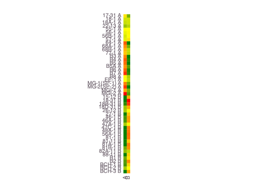
    


    

    


    


    
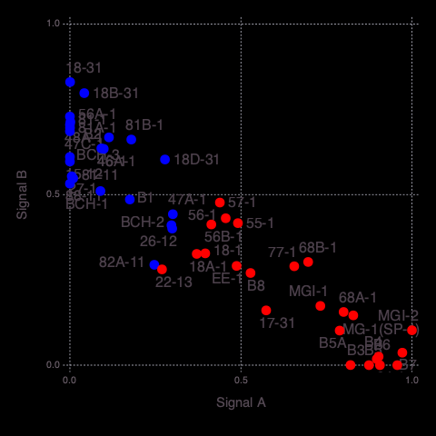
    


    


    1×2 Array{Any,2}:
     "Inverse distance from contacts"  0.619519


    13×2 Array{Any,2}:
     "Unit thickness"                1.0
     "Inverse distance from faults"  0.957468
     "Fault density"                 0.761708
     "Coulomb shear stress"          0.74607
     "Normal stress"                 0.737061
     "Faulting"                      0.706576
     "Fault intersection density"    0.702918
     "Dilation"                      0.635119
     "Fault dilation tendency"       0.605243
     "Fault curvature"               0.538705
     "Lithology"                     0.488473
     "Fault slip tendency"           0.41415
     "Temperature"                   0.131901


    

    


    ┌ Info: Attributes (signals=2)
    └ @ NMFk /Users/vvv/.julia/dev/NMFk/src/NMFkPostprocess.jl:322
    ┌ Info: Signal A (S2) Count: 13
    └ @ NMFk /Users/vvv/.julia/dev/NMFk/src/NMFkPostprocess.jl:335
    ┌ Info: Signal B (S1) Count: 1
    └ @ NMFk /Users/vvv/.julia/dev/NMFk/src/NMFkPostprocess.jl:335
    ┌ Info: Signal B -> A Count: 1
    └ @ NMFk /Users/vvv/.julia/dev/NMFk/src/NMFkPostprocess.jl:345
    ┌ Info: Signal A -> B Count: 13
    └ @ NMFk /Users/vvv/.julia/dev/NMFk/src/NMFkPostprocess.jl:345
    ┌ Info: Signal A (remapped k-means clustering)
    └ @ NMFk /Users/vvv/.julia/dev/NMFk/src/NMFkPostprocess.jl:360
    ┌ Info: Signal B (remapped k-means clustering)
    └ @ NMFk /Users/vvv/.julia/dev/NMFk/src/NMFkPostprocess.jl:360


    

    


    


    

    


    

    


    


    

    


    
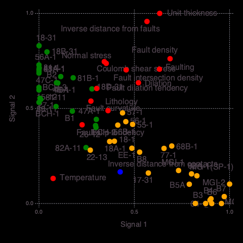
    


    


    

    


    Signal importance (high->low): [1, 3, 5, 4, 2]


    ┌ Info: Number of signals: 5
    └ @ NMFk /Users/vvv/.julia/dev/NMFk/src/NMFkPostprocess.jl:144
    ┌ Info: Locations (signals=5)
    └ @ NMFk /Users/vvv/.julia/dev/NMFk/src/NMFkPostprocess.jl:148
    ┌ Warning: type Clustering.KmeansResult{Core.Array{Core.Float64,2},Core.Float64,Core.Int64} not present in workspace; reconstructing
    └ @ JLD /Users/vvv/.julia/packages/JLD/nQ9iW/src/jld_types.jl:697
    ┌ Info: Robust k-means analysis results are loaded from file results-set00-v9-inv-750-1000-daln/Hmatrix-5-5_47-1000.jld!
    └ @ NMFk /Users/vvv/.julia/dev/NMFk/src/NMFkCluster.jl:67
    ┌ Warning: Procedure to find unique signals could not identify a solution ...
    └ @ NMFk /Users/vvv/.julia/dev/NMFk/src/NMFkCluster.jl:158
    ┌ Warning: Procedure to find unique signals could not identify a solution ...
    └ @ NMFk /Users/vvv/.julia/dev/NMFk/src/NMFkCluster.jl:158
    ┌ Warning: Procedure to find unique signals could not identify a solution ...
    └ @ NMFk /Users/vvv/.julia/dev/NMFk/src/NMFkCluster.jl:158
    ┌ Warning: Procedure to find unique signals could not identify a solution ...
    └ @ NMFk /Users/vvv/.julia/dev/NMFk/src/NMFkCluster.jl:158
    ┌ Warning: Procedure to find unique signals could not identify a solution ...
    └ @ NMFk /Users/vvv/.julia/dev/NMFk/src/NMFkCluster.jl:158
    ┌ Warning: type Clustering.KmeansResult{Core.Array{Core.Float64,2},Core.Float64,Core.Int64} not present in workspace; reconstructing
    └ @ JLD /Users/vvv/.julia/packages/JLD/nQ9iW/src/jld_types.jl:697
    ┌ Info: Robust k-means analysis results are loaded from file results-set00-v9-inv-750-1000-daln/Wmatrix-5-5_14-1000.jld!
    └ @ NMFk /Users/vvv/.julia/dev/NMFk/src/NMFkCluster.jl:67


    11×2 Array{Any,2}:
     "MG-2(SP-2)"  1.0
     "56-1"        0.833071
     "18-31"       0.803582
     "18B-31"      0.79762
     "64-1"        0.771609
     "57-1"        0.731212
     "17-31"       0.675958
     "81B-1"       0.638129
     "18D-31"      0.542359
     "55-1"        0.482608
     "22-13"       0.384279


    11×2 Array{Any,2}:
     "68A-1"       1.0
     "MG-1(SP-1)"  0.760228
     "B7"          0.583165
     "B3"          0.579901
     "B4"          0.559561
     "MGI-2"       0.550751
     "68B-1"       0.549639
     "B6"          0.533677
     "77-1"        0.51494
     "B5A"         0.492662
     "B5"          0.444441


    9×2 Array{Any,2}:
     "56B-1"  1.0
     "B2"     0.952516
     "EE-1"   0.837563
     "48A-1"  0.787595
     "B8"     0.779397
     "B1"     0.711321
     "47C-1"  0.625562
     "81-11"  0.574423
     "47A-1"  0.549964


    8×2 Array{Any,2}:
     "18-1"    1.0
     "82A-11"  0.947022
     "18A-1"   0.723864
     "88-11"   0.57605
     "15-12"   0.515703
     "BCH-3"   0.472471
     "27-1"    0.439353
     "56A-1"   0.3504


    8×2 Array{Any,2}:
     "26-12"  0.82344
     "BCH-2"  0.822391
     "BCH-1"  0.766974
     "46A-1"  0.586862
     "81-1"   0.570404
     "81A-1"  0.545145
     "46-1"   0.529248
     "MGI-1"  0.456212


    

    


    ┌ Warning: Procedure to find unique signals could not identify a solution ...
    └ @ NMFk /Users/vvv/.julia/dev/NMFk/src/NMFkCluster.jl:158
    ┌ Warning: Procedure to find unique signals could not identify a solution ...
    └ @ NMFk /Users/vvv/.julia/dev/NMFk/src/NMFkCluster.jl:158
    ┌ Warning: Procedure to find unique signals could not identify a solution ...
    └ @ NMFk /Users/vvv/.julia/dev/NMFk/src/NMFkCluster.jl:158
    ┌ Info: Signal A -> A Count: 11
    └ @ NMFk /Users/vvv/.julia/dev/NMFk/src/NMFkPostprocess.jl:255
    ┌ Info: Signal B -> B Count: 11
    └ @ NMFk /Users/vvv/.julia/dev/NMFk/src/NMFkPostprocess.jl:255
    ┌ Info: Signal C -> C Count: 9
    └ @ NMFk /Users/vvv/.julia/dev/NMFk/src/NMFkPostprocess.jl:255
    ┌ Info: Signal D -> D Count: 8
    └ @ NMFk /Users/vvv/.julia/dev/NMFk/src/NMFkPostprocess.jl:255
    ┌ Info: Signal E -> E Count: 8
    └ @ NMFk /Users/vvv/.julia/dev/NMFk/src/NMFkPostprocess.jl:255
    ┌ Info: Signal A (S3) (k-means clustering)
    └ @ NMFk /Users/vvv/.julia/dev/NMFk/src/NMFkPostprocess.jl:272
    ┌ Info: Signal B (S2) (k-means clustering)
    └ @ NMFk /Users/vvv/.julia/dev/NMFk/src/NMFkPostprocess.jl:272
    ┌ Info: Signal C (S1) (k-means clustering)
    └ @ NMFk /Users/vvv/.julia/dev/NMFk/src/NMFkPostprocess.jl:272
    ┌ Info: Signal D (S4) (k-means clustering)
    └ @ NMFk /Users/vvv/.julia/dev/NMFk/src/NMFkPostprocess.jl:272
    ┌ Info: Signal E (S5) (k-means clustering)
    └ @ NMFk /Users/vvv/.julia/dev/NMFk/src/NMFkPostprocess.jl:272


    
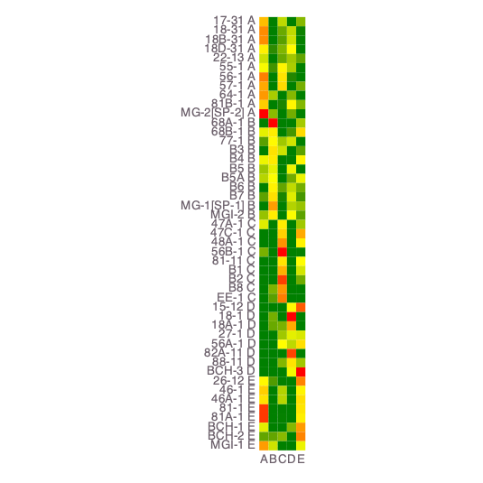
    


    


    

    


    

    


    


    

    


    


    7×2 Array{Any,2}:
     "Unit thickness"                0.849937
     "Inverse distance from faults"  0.680541
     "Fault intersection density"    0.629292
     "Fault dilation tendency"       0.501789
     "Fault curvature"               0.449738
     "Fault slip tendency"           0.365781
     "Temperature"                   0.123165


    1×2 Array{Any,2}:
     "Inverse distance from contacts"  1.0


    3×2 Array{Any,2}:
     "Faulting"       0.892846
     "Fault density"  0.880551
     "Dilation"       0.841464


    1×2 Array{Any,2}:
     "Lithology"  0.89235


    2×2 Array{Any,2}:
     "Coulomb shear stress"  0.826886
     "Normal stress"         0.820471


    

    


    ┌ Info: Attributes (signals=5)
    └ @ NMFk /Users/vvv/.julia/dev/NMFk/src/NMFkPostprocess.jl:322
    ┌ Info: Signal A (S3) Count: 7
    └ @ NMFk /Users/vvv/.julia/dev/NMFk/src/NMFkPostprocess.jl:335
    ┌ Info: Signal B (S1) Count: 3
    └ @ NMFk /Users/vvv/.julia/dev/NMFk/src/NMFkPostprocess.jl:335
    ┌ Info: Signal C (S5) Count: 2
    └ @ NMFk /Users/vvv/.julia/dev/NMFk/src/NMFkPostprocess.jl:335
    ┌ Info: Signal D (S2) Count: 1
    └ @ NMFk /Users/vvv/.julia/dev/NMFk/src/NMFkPostprocess.jl:335
    ┌ Info: Signal E (S4) Count: 1
    └ @ NMFk /Users/vvv/.julia/dev/NMFk/src/NMFkPostprocess.jl:335
    ┌ Info: Signal A -> A Count: 7
    └ @ NMFk /Users/vvv/.julia/dev/NMFk/src/NMFkPostprocess.jl:345
    ┌ Info: Signal D -> B Count: 1
    └ @ NMFk /Users/vvv/.julia/dev/NMFk/src/NMFkPostprocess.jl:345
    ┌ Info: Signal B -> C Count: 3
    └ @ NMFk /Users/vvv/.julia/dev/NMFk/src/NMFkPostprocess.jl:345
    ┌ Info: Signal E -> D Count: 1
    └ @ NMFk /Users/vvv/.julia/dev/NMFk/src/NMFkPostprocess.jl:345
    ┌ Info: Signal C -> E Count: 2
    └ @ NMFk /Users/vvv/.julia/dev/NMFk/src/NMFkPostprocess.jl:345
    ┌ Info: Signal A (remapped k-means clustering)
    └ @ NMFk /Users/vvv/.julia/dev/NMFk/src/NMFkPostprocess.jl:360
    ┌ Info: Signal B (remapped k-means clustering)
    └ @ NMFk /Users/vvv/.julia/dev/NMFk/src/NMFkPostprocess.jl:360
    ┌ Info: Signal C (remapped k-means clustering)
    └ @ NMFk /Users/vvv/.julia/dev/NMFk/src/NMFkPostprocess.jl:360
    ┌ Info: Signal D (remapped k-means clustering)
    └ @ NMFk /Users/vvv/.julia/dev/NMFk/src/NMFkPostprocess.jl:360
    ┌ Info: Signal E (remapped k-means clustering)
    └ @ NMFk /Users/vvv/.julia/dev/NMFk/src/NMFkPostprocess.jl:360


    
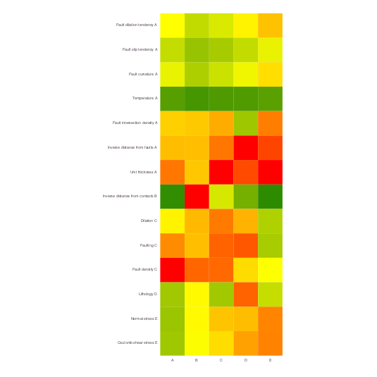
    


    


    
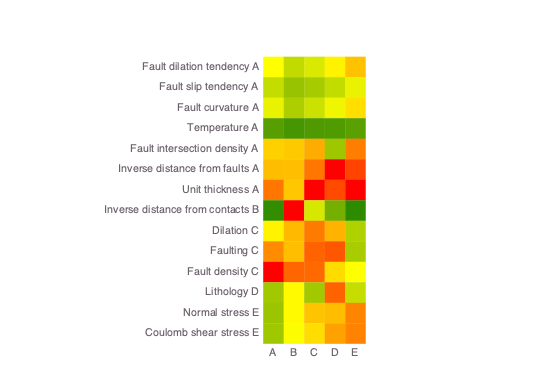
    


    

    


    


    
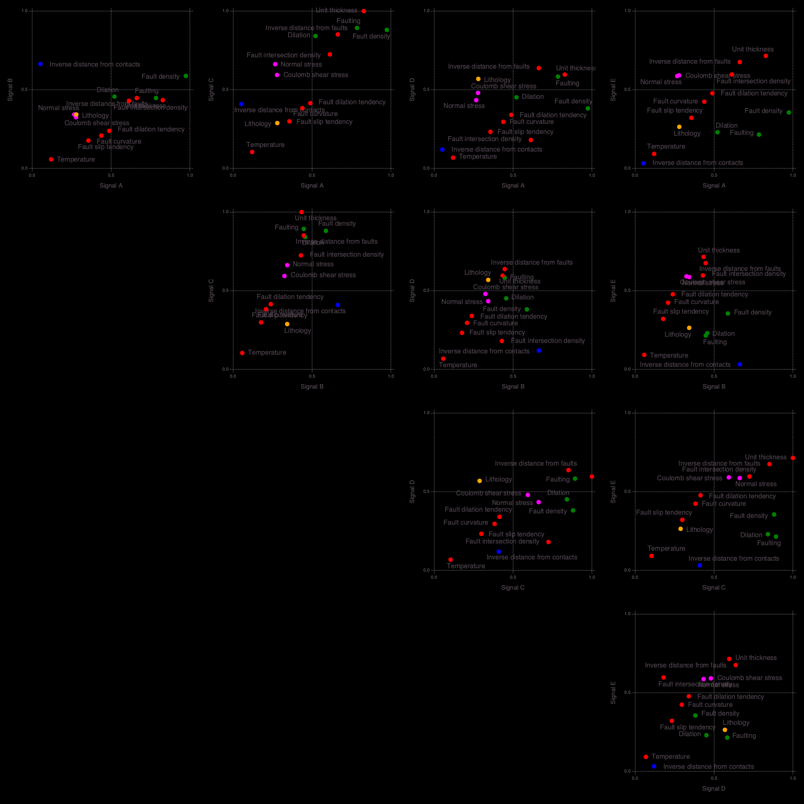
    


    

    


    


    
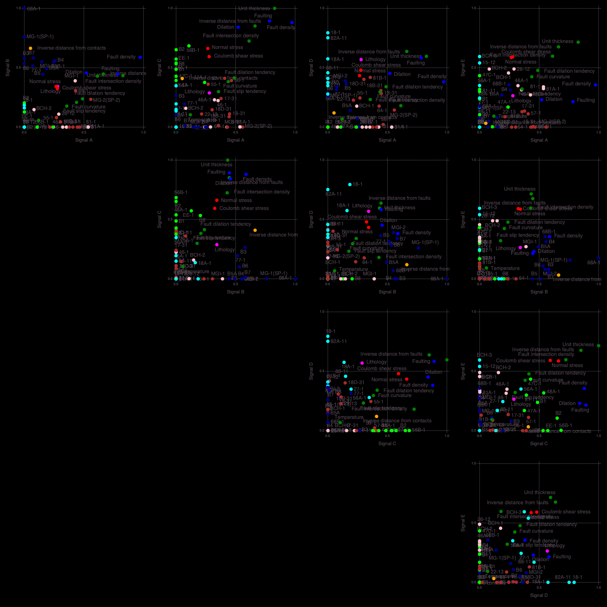
    


    Signal importance (high->low): [1, 5, 2, 6, 4, 3]


    ┌ Info: Number of signals: 6
    └ @ NMFk /Users/vvv/.julia/dev/NMFk/src/NMFkPostprocess.jl:144
    ┌ Info: Locations (signals=6)
    └ @ NMFk /Users/vvv/.julia/dev/NMFk/src/NMFkPostprocess.jl:148
    ┌ Warning: type Clustering.KmeansResult{Core.Array{Core.Float64,2},Core.Float64,Core.Int64} not present in workspace; reconstructing
    └ @ JLD /Users/vvv/.julia/packages/JLD/nQ9iW/src/jld_types.jl:697
    ┌ Info: Robust k-means analysis results are loaded from file results-set00-v9-inv-750-1000-daln/Hmatrix-6-6_47-1000.jld!
    └ @ NMFk /Users/vvv/.julia/dev/NMFk/src/NMFkCluster.jl:67
    ┌ Warning: Procedure to find unique signals could not identify a solution ...
    └ @ NMFk /Users/vvv/.julia/dev/NMFk/src/NMFkCluster.jl:158
    ┌ Warning: Procedure to find unique signals could not identify a solution ...
    └ @ NMFk /Users/vvv/.julia/dev/NMFk/src/NMFkCluster.jl:158
    ┌ Warning: Procedure to find unique signals could not identify a solution ...
    └ @ NMFk /Users/vvv/.julia/dev/NMFk/src/NMFkCluster.jl:158
    ┌ Warning: Procedure to find unique signals could not identify a solution ...
    └ @ NMFk /Users/vvv/.julia/dev/NMFk/src/NMFkCluster.jl:158
    ┌ Warning: Procedure to find unique signals could not identify a solution ...
    └ @ NMFk /Users/vvv/.julia/dev/NMFk/src/NMFkCluster.jl:158
    ┌ Warning: Procedure to find unique signals could not identify a solution ...
    └ @ NMFk /Users/vvv/.julia/dev/NMFk/src/NMFkCluster.jl:158
    ┌ Warning: type Clustering.KmeansResult{Core.Array{Core.Float64,2},Core.Float64,Core.Int64} not present in workspace; reconstructing
    └ @ JLD /Users/vvv/.julia/packages/JLD/nQ9iW/src/jld_types.jl:697


    11×2 Array{Any,2}:
     "MG-1(SP-1)"  1.0
     "68B-1"       0.917059
     "77-1"        0.81018
     "B5A"         0.794163
     "68A-1"       0.771571
     "B5"          0.751175
     "B6"          0.726543
     "MGI-2"       0.712331
     "B7"          0.71064
     "B4"          0.671091
     "B3"          0.643308


    10×2 Array{Any,2}:
     "82A-11"  1.0
     "88-11"   0.708797
     "18-1"    0.670833
     "27-1"    0.588465
     "18A-1"   0.586851
     "22-13"   0.530055
     "81B-1"   0.490522
     "18B-31"  0.450915
     "18D-31"  0.439487
     "18-31"   0.413683


    7×2 Array{Any,2}:
     "MG-2(SP-2)"  1.0
     "64-1"        0.741999
     "MGI-1"       0.701663
     "56-1"        0.640372
     "57-1"        0.600702
     "17-31"       0.512659
     "55-1"        0.453248


    7×2 Array{Any,2}:
     "B2"     1.0
     "EE-1"   0.68867
     "B8"     0.679526
     "56B-1"  0.56822
     "BCH-2"  0.521776
     "B1"     0.342468
     "81-11"  0.320946


    6×2 Array{Any,2}:
     "BCH-3"  1.0
     "15-12"  0.904396
     "26-12"  0.808831
     "BCH-1"  0.795303
     "81-1"   0.7272
     "81A-1"  0.707665


    6×2 Array{Any,2}:
     "47C-1"  1.0
     "46A-1"  0.943298
     "48A-1"  0.903309
     "46-1"   0.882457
     "47A-1"  0.751523
     "56A-1"  0.720315


    
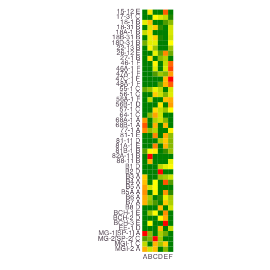
    


    ┌ Info: Robust k-means analysis results are loaded from file results-set00-v9-inv-750-1000-daln/Wmatrix-6-6_14-1000.jld!
    └ @ NMFk /Users/vvv/.julia/dev/NMFk/src/NMFkCluster.jl:67
    ┌ Warning: Procedure to find unique signals could not identify a solution ...
    └ @ NMFk /Users/vvv/.julia/dev/NMFk/src/NMFkCluster.jl:158
    ┌ Info: Signal A -> A Count: 11
    └ @ NMFk /Users/vvv/.julia/dev/NMFk/src/NMFkPostprocess.jl:255
    ┌ Info: Signal B -> B Count: 10
    └ @ NMFk /Users/vvv/.julia/dev/NMFk/src/NMFkPostprocess.jl:255
    ┌ Info: Signal C -> C Count: 7
    └ @ NMFk /Users/vvv/.julia/dev/NMFk/src/NMFkPostprocess.jl:255
    ┌ Info: Signal D -> D Count: 7
    └ @ NMFk /Users/vvv/.julia/dev/NMFk/src/NMFkPostprocess.jl:255
    ┌ Info: Signal E -> E Count: 6
    └ @ NMFk /Users/vvv/.julia/dev/NMFk/src/NMFkPostprocess.jl:255
    ┌ Info: Signal F -> F Count: 6
    └ @ NMFk /Users/vvv/.julia/dev/NMFk/src/NMFkPostprocess.jl:255
    ┌ Info: Signal A (S3) (k-means clustering)
    └ @ NMFk /Users/vvv/.julia/dev/NMFk/src/NMFkPostprocess.jl:272
    ┌ Info: Signal B (S4) (k-means clustering)
    └ @ NMFk /Users/vvv/.julia/dev/NMFk/src/NMFkPostprocess.jl:272
    ┌ Info: Signal C (S6) (k-means clustering)
    └ @ NMFk /Users/vvv/.julia/dev/NMFk/src/NMFkPostprocess.jl:272
    ┌ Info: Signal D (S2) (k-means clustering)
    └ @ NMFk /Users/vvv/.julia/dev/NMFk/src/NMFkPostprocess.jl:272
    ┌ Info: Signal E (S5) (k-means clustering)
    └ @ NMFk /Users/vvv/.julia/dev/NMFk/src/NMFkPostprocess.jl:272
    ┌ Info: Signal F (S1) (k-means clustering)
    └ @ NMFk /Users/vvv/.julia/dev/NMFk/src/NMFkPostprocess.jl:272


    
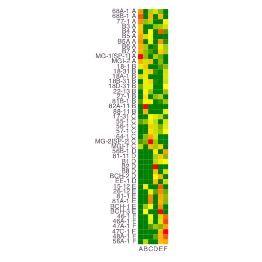
    


    


    

    


    
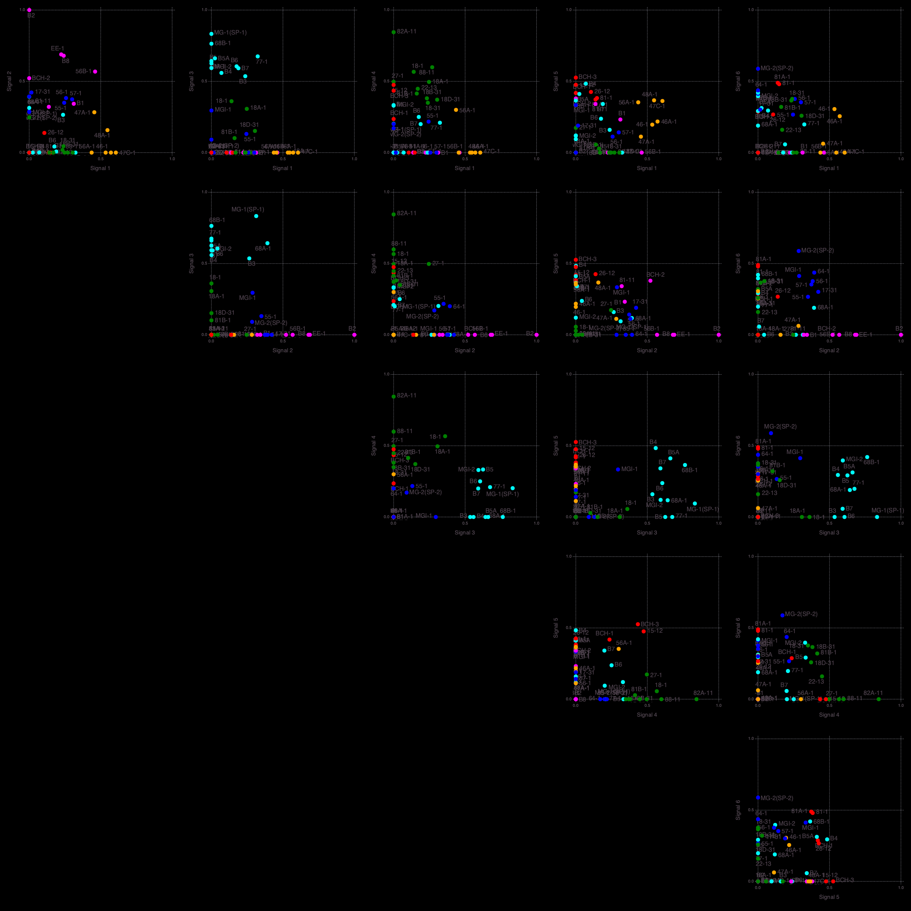
    


    


    

    


    


    1×2 Array{Any,2}:
     "Inverse distance from contacts"  1.0


    1×2 Array{Any,2}:
     "Lithology"  0.864227


    5×2 Array{Any,2}:
     "Fault intersection density"  0.534767
     "Fault dilation tendency"     0.494983
     "Fault curvature"             0.444422
     "Fault slip tendency"         0.367193
     "Temperature"                 0.136511


    2×2 Array{Any,2}:
     "Unit thickness"                1.0
     "Inverse distance from faults"  0.778501


    2×2 Array{Any,2}:
     "Normal stress"         0.896801
     "Coulomb shear stress"  0.845105


    3×2 Array{Any,2}:
     "Fault density"  1.0
     "Faulting"       0.877916
     "Dilation"       0.834909


    

    


    ┌ Info: Attributes (signals=6)
    └ @ NMFk /Users/vvv/.julia/dev/NMFk/src/NMFkPostprocess.jl:322
    ┌ Info: Signal A (S6) Count: 5
    └ @ NMFk /Users/vvv/.julia/dev/NMFk/src/NMFkPostprocess.jl:335
    ┌ Info: Signal B (S1) Count: 3
    └ @ NMFk /Users/vvv/.julia/dev/NMFk/src/NMFkPostprocess.jl:335
    ┌ Info: Signal C (S5) Count: 2
    └ @ NMFk /Users/vvv/.julia/dev/NMFk/src/NMFkPostprocess.jl:335
    ┌ Info: Signal D (S2) Count: 2
    └ @ NMFk /Users/vvv/.julia/dev/NMFk/src/NMFkPostprocess.jl:335
    ┌ Info: Signal E (S3) Count: 1
    └ @ NMFk /Users/vvv/.julia/dev/NMFk/src/NMFkPostprocess.jl:335
    ┌ Info: Signal F (S4) Count: 1
    └ @ NMFk /Users/vvv/.julia/dev/NMFk/src/NMFkPostprocess.jl:335
    ┌ Info: Signal E -> A Count: 1
    └ @ NMFk /Users/vvv/.julia/dev/NMFk/src/NMFkPostprocess.jl:345
    ┌ Info: Signal F -> B Count: 1
    └ @ NMFk /Users/vvv/.julia/dev/NMFk/src/NMFkPostprocess.jl:345
    ┌ Info: Signal A -> C Count: 5
    └ @ NMFk /Users/vvv/.julia/dev/NMFk/src/NMFkPostprocess.jl:345
    ┌ Info: Signal D -> D Count: 2
    └ @ NMFk /Users/vvv/.julia/dev/NMFk/src/NMFkPostprocess.jl:345
    ┌ Info: Signal C -> E Count: 2
    └ @ NMFk /Users/vvv/.julia/dev/NMFk/src/NMFkPostprocess.jl:345
    ┌ Info: Signal B -> F Count: 3
    └ @ NMFk /Users/vvv/.julia/dev/NMFk/src/NMFkPostprocess.jl:345
    ┌ Info: Signal A (remapped k-means clustering)
    └ @ NMFk /Users/vvv/.julia/dev/NMFk/src/NMFkPostprocess.jl:360
    ┌ Info: Signal B (remapped k-means clustering)
    └ @ NMFk /Users/vvv/.julia/dev/NMFk/src/NMFkPostprocess.jl:360
    ┌ Info: Signal C (remapped k-means clustering)
    └ @ NMFk /Users/vvv/.julia/dev/NMFk/src/NMFkPostprocess.jl:360
    ┌ Info: Signal D (remapped k-means clustering)
    └ @ NMFk /Users/vvv/.julia/dev/NMFk/src/NMFkPostprocess.jl:360
    ┌ Info: Signal E (remapped k-means clustering)
    └ @ NMFk /Users/vvv/.julia/dev/NMFk/src/NMFkPostprocess.jl:360
    ┌ Info: Signal F (remapped k-means clustering)
    └ @ NMFk /Users/vvv/.julia/dev/NMFk/src/NMFkPostprocess.jl:360


    
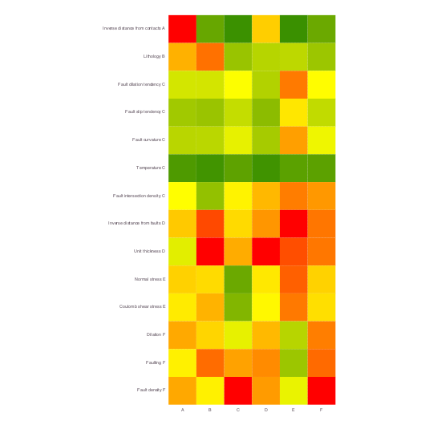
    


    


    

    


    
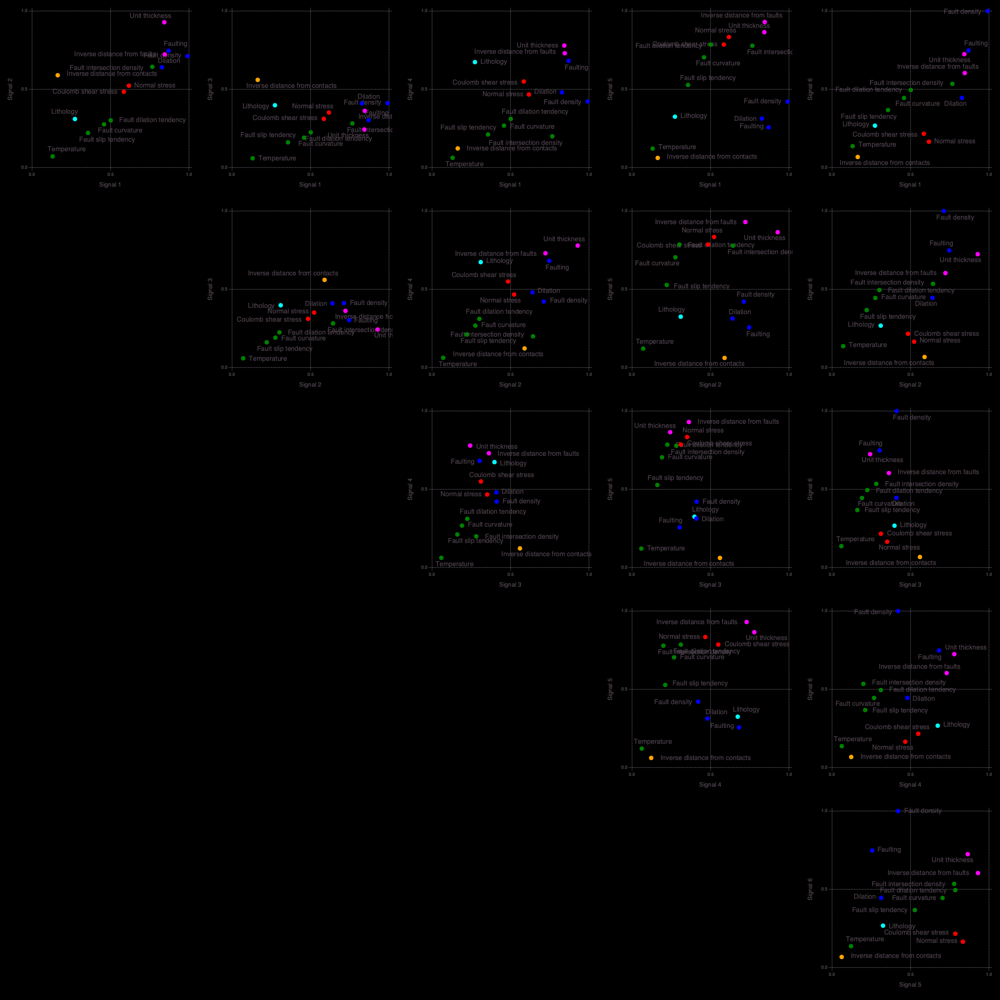
    


    


    

    


    

    


    


    

    


    


    ([[1, 2], [3, 2, 1, 4, 5], [3, 4, 6, 2, 5, 1]], [['B', 'B', 'B', 'B', 'B', 'B', 'B', 'B', 'B', 'B', 'A', 'B', 'B', 'B'], ['E', 'E', 'C', 'C', 'A', 'A', 'A', 'A', 'C', 'A', 'B', 'A', 'A', 'D'], ['E', 'E', 'F', 'F', 'C', 'C', 'C', 'C', 'F', 'C', 'A', 'D', 'D', 'B']], [['B', 'A', 'A', 'B', 'A', 'B', 'B', 'A', 'B', 'B'  …  'A', 'A', 'B', 'B', 'B', 'A', 'A', 'A', 'A', 'A'], ['D', 'A', 'D', 'A', 'D', 'A', 'A', 'A', 'E', 'D'  …  'B', 'C', 'E', 'E', 'D', 'C', 'B', 'A', 'E', 'B'], ['E', 'C', 'B', 'B', 'B', 'B', 'B', 'B', 'E', 'B'  …  'A', 'D', 'E', 'D', 'E', 'D', 'A', 'C', 'C', 'A']])


The results for a solution with **6** signatures presented above will be further discussed here.

The well attributes are clustered into **6** groups:


```julia
Mads.display("results-set00-v9-inv-750-1000-daln/attributes-6-groups.txt")
```


<div style="background-color: gray;">
  <p>
    <iframe src="../results-set00-v9-inv-750-1000-daln/attributes-6-groups.txt" frameborder="0" height="400"
      width="95%"></iframe>
  </p>
</div>

This grouping is based on analyses of the attribute matrix `W`:


Note that the attribute matrix `W` is automatically modified to account that a range of vertical depths is applied in characterizing the site wells.

The well locations are also clustered into **6** groups:

<div style="background-color: gray;">
  <p>
    <iframe src="../results-set00-v9-inv-750-1000-daln/locations-6-groups.txt" frameborder="0" height="400"
      width="95%"></iframe>
  </p>
</div>

This grouping is based on analyses of the location matrix `H`:

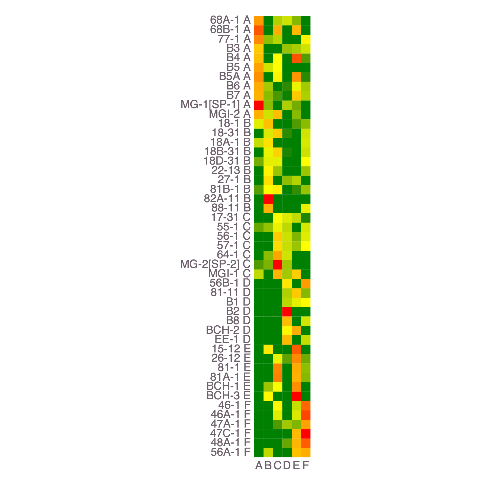

The map [../figures-set00-v9-inv-750-1000-daln/locations-6-map.html](../figures-set00-v9-inv-750-1000-daln/locations-6-map.html) provides interactive visualization of the extracted well location groups (the html file can also be opened with any browser). 

<div>
    <iframe src="../figures-set00-v9-inv-750-1000-daln/locations-6-map.html" frameborder="0" height="400" width="50%"></iframe>
</div>

More information on how the ML results are interpreted to provide geothermal insights is discussed in our research paper.

### Type 2 flattening: Focus on well attributes

#### Flatten the tensor into a matrix


```julia
Xdlan = reshape(permutedims(Tn, (1,3,2)), (depth * length(locations)), length(attributes_process));
```

Matrix rows merge the depth and well locations dimensions.

Matrix columns represent the well attributes.

#### Perform NMFk analyses


```julia
W, H, fitquality, robustness, aic = NMFk.execute(Xdlan, nkrange, nruns; resultdir=resultdir, casefilename="nmfk-dlan-$(join(size(Xdlan), '_'))", load=true)
W, H, fitquality, robustness, aic = NMFk.load(nkrange, nruns; resultdir=resultdir, casefilename="nmfk-dlan-$(join(size(Xdlan), '_'))");
```

    Signals:  2 Fit:     8717.101 Silhouette:    0.9918721 AIC:     -1087260
    Signals:  3 Fit:     6319.428 Silhouette:    0.5782437 AIC:     -1124899
    Signals:  4 Fit:     4843.099 Silhouette:   -0.2086358 AIC:     -1143846
    Signals:  5 Fit:     3526.994 Silhouette:   0.03306949 AIC:     -1179956
    Signals:  6 Fit:     2430.352 Silhouette:   -0.5717948 AIC:     -1234661
    Signals:  7 Fit:     1649.869 Silhouette:   -0.4817311 AIC:     -1294388
    Signals:  8 Fit:     1182.794 Silhouette:    0.1610176 AIC:     -1335780
    Signals:  2 Fit:     8717.101 Silhouette:    0.9918721 AIC:     -1087260
    Signals:  3 Fit:     6319.428 Silhouette:    0.5782437 AIC:     -1124899
    Signals:  4 Fit:     4843.099 Silhouette:   -0.2086358 AIC:     -1143846
    Signals:  5 Fit:     3526.994 Silhouette:   0.03306949 AIC:     -1179956
    Signals:  6 Fit:     2430.352 Silhouette:   -0.5717948 AIC:     -1234661
    Signals:  7 Fit:     1649.869 Silhouette:   -0.4817311 AIC:     -1294388
    Signals:  8 Fit:     1182.794 Silhouette:    0.1610176 AIC:     -1335780
    Signals:  2 Fit:     8717.101 Silhouette:    0.9918721 AIC:     -1087260
    Signals:  3 Fit:     6319.428 Silhouette:    0.5782437 AIC:     -1124899
    Signals:  4 Fit:     4843.099 Silhouette:   -0.2086358 AIC:     -1143846
    Signals:  5 Fit:     3526.994 Silhouette:   0.03306949 AIC:     -1179956
    Signals:  6 Fit:     2430.352 Silhouette:   -0.5717948 AIC:     -1234661
    Signals:  7 Fit:     1649.869 Silhouette:   -0.4817311 AIC:     -1294388
    Signals:  8 Fit:     1182.794 Silhouette:    0.1610176 AIC:     -1335780
    ┌ Info: Results
    └ @ NMFk /Users/vvv/.julia/dev/NMFk/src/NMFkExecute.jl:15
    ┌ Info: Optimal solution: 3 signals
    └ @ NMFk /Users/vvv/.julia/dev/NMFk/src/NMFkExecute.jl:20
    ┌ Info: Optimal solution: 3 signals
    └ @ NMFk /Users/vvv/.julia/dev/NMFk/src/NMFkIO.jl:30


Here the **NMFk** results are loaded from a prior ML run.

As seen from the output above, the **NMFk** analyses identified that the optimal number of geothermal signatures in the dataset **3**.

Solutions with a number of signatures less than **3** are underfitting.

Solutions with a number of signatures greater than **3** are overfitting and unacceptable.

The set of acceptable solutions are defined by the **NMFk** algorithm as follows:


```julia
NMFk.getks(nkrange, robustness[nkrange])
```


    2-element Array{Int64,1}:
     2
     3


The acceptable solutions contain 2 and 3 signatures.

#### Post-process NMFk results

#### Number of signatures

Below is a plot representing solution quality (fit) and silhouette width (robustness) for different numbers of signatures `k`:


```julia
NMFk.plot_signal_selecton(nkrange, fitquality, robustness; figuredir="$figuredir-$(nruns)-dlan", xtitle="Number of signatures")
```


    
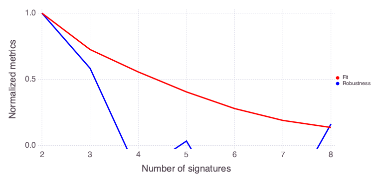
    


    

The plot above also demonstrates that the acceptable solutions contain 2 and 3 signatures.

#### Analysis of all the acceptable solutions 

The ML solutions containing an acceptable number of signatures are further analyzed as follows:


```julia
NMFk.clusterresults(NMFk.getks(nkrange, robustness[nkrange]; ks=4), W, H, locations, attributes_process_long; loadassignements=true, lon=xcoord, lat=ycoord, Horder=Aorder, Wsize=depth, Wcasefilename="locations", Hcasefilename="attributes", resultdir=resultdir * "-$(nruns)-dlan", figuredir=figuredir * "-$(nruns)-dlan", hover="Well: " .* locations .* "<br>" .* "WellType: " .* String.(welltype) .* "<br>" .* production, Wmatrix_font_size=4Gadfly.pt, biplotcolor=:WH, biplotlabel=:WH)
```

    Signal importance (high->low): [2, 1]
    ┌ Info: Number of signals: 2
    └ @ NMFk /Users/vvv/.julia/dev/NMFk/src/NMFkPostprocess.jl:144
    ┌ Info: Attributes (signals=2)
    └ @ NMFk /Users/vvv/.julia/dev/NMFk/src/NMFkPostprocess.jl:148
    ┌ Warning: type Clustering.KmeansResult{Core.Array{Core.Float64,2},Core.Float64,Core.Int64} not present in workspace; reconstructing
    └ @ JLD /Users/vvv/.julia/packages/JLD/nQ9iW/src/jld_types.jl:697
    ┌ Info: Robust k-means analysis results are loaded from file results-set00-v9-inv-750-1000-dlan/Hmatrix-2-2_14-1000.jld!
    └ @ NMFk /Users/vvv/.julia/dev/NMFk/src/NMFkCluster.jl:67
    ┌ Warning: Procedure to find unique signals could not identify a solution ...
    └ @ NMFk /Users/vvv/.julia/dev/NMFk/src/NMFkCluster.jl:158
    ┌ Warning: Procedure to find unique signals could not identify a solution ...
    └ @ NMFk /Users/vvv/.julia/dev/NMFk/src/NMFkCluster.jl:158
    ┌ Warning: type Clustering.KmeansResult{Core.Array{Core.Float64,2},Core.Float64,Core.Int64} not present in workspace; reconstructing
    └ @ JLD /Users/vvv/.julia/packages/JLD/nQ9iW/src/jld_types.jl:697


    10×2 Array{Any,2}:
     "Unit thickness"                  1.0
     "Faulting"                        0.863986
     "Fault density"                   0.849999
     "Inverse distance from faults"    0.792619
     "Dilation"                        0.75876
     "Normal stress"                   0.674322
     "Fault intersection density"      0.673763
     "Coulomb shear stress"            0.672813
     "Lithology"                       0.501336
     "Inverse distance from contacts"  0.388519


    4×2 Array{Any,2}:
     "Fault dilation tendency"  1.0
     "Fault curvature"          0.89069
     "Fault slip tendency"      0.706146
     "Temperature"              0.239306


    

    


    ┌ Info: Robust k-means analysis results are loaded from file results-set00-v9-inv-750-1000-dlan/Wmatrix-2-2_47-1000.jld!
    └ @ NMFk /Users/vvv/.julia/dev/NMFk/src/NMFkCluster.jl:67
    ┌ Warning: Procedure to find unique signals could not identify a solution ...
    └ @ NMFk /Users/vvv/.julia/dev/NMFk/src/NMFkCluster.jl:158
    ┌ Warning: Procedure to find unique signals could not identify a solution ...
    └ @ NMFk /Users/vvv/.julia/dev/NMFk/src/NMFkCluster.jl:158
    ┌ Info: Signal A -> A Count: 10
    └ @ NMFk /Users/vvv/.julia/dev/NMFk/src/NMFkPostprocess.jl:255
    ┌ Info: Signal B -> B Count: 4
    └ @ NMFk /Users/vvv/.julia/dev/NMFk/src/NMFkPostprocess.jl:255
    ┌ Info: Signal A (S2) (k-means clustering)
    └ @ NMFk /Users/vvv/.julia/dev/NMFk/src/NMFkPostprocess.jl:272
    ┌ Info: Signal B (S1) (k-means clustering)
    └ @ NMFk /Users/vvv/.julia/dev/NMFk/src/NMFkPostprocess.jl:272


    

    


    


    

    


    

    


    


    

    


    27×2 Array{Any,2}:
     "B8"          1.0
     "EE-1"        0.998613
     "MG-1(SP-1)"  0.956943
     "68A-1"       0.916159
     "64-1"        0.864026
     "47A-1"       0.859446
     "77-1"        0.857345
     "MG-2(SP-2)"  0.853707
     "27-1"        0.829554
     "82A-11"      0.807563
     "18A-1"       0.782265
     "47C-1"       0.745002
     "22-13"       0.734719
     ⋮             
     "88-11"       0.659403
     "46A-1"       0.629757
     "B5"          0.614479
     "46-1"        0.594959
     "48A-1"       0.590979
     "B1"          0.501909
     "56B-1"       0.497064
     "26-12"       0.472464
     "81-11"       0.416937
     "MGI-1"       0.24275
     "B3"          0.241753
     "B2"          0.127328


    20×2 Array{Any,2}:
     "56-1"    1.0
     "55-1"    0.949937
     "57-1"    0.947965
     "BCH-3"   0.872622
     "15-12"   0.808709
     "68B-1"   0.758469
     "56A-1"   0.753147
     "BCH-1"   0.608981
     "B5A"     0.43926
     "17-31"   0.366493
     "18B-31"  0.348668
     "81B-1"   0.320223
     "18D-31"  0.298697
     "MGI-2"   0.291839
     "B4"      0.286734
     "18-31"   0.260379
     "B6"      0.257226
     "81-1"    0.234119
     "81A-1"   0.207054
     "B7"      0.156777


    

    


    ┌ Info: Locations (signals=2)
    └ @ NMFk /Users/vvv/.julia/dev/NMFk/src/NMFkPostprocess.jl:322
    ┌ Info: Signal A (S2) Count: 27
    └ @ NMFk /Users/vvv/.julia/dev/NMFk/src/NMFkPostprocess.jl:335
    ┌ Info: Signal B (S1) Count: 20
    └ @ NMFk /Users/vvv/.julia/dev/NMFk/src/NMFkPostprocess.jl:335
    ┌ Info: Signal A -> A Count: 27
    └ @ NMFk /Users/vvv/.julia/dev/NMFk/src/NMFkPostprocess.jl:345
    ┌ Info: Signal B -> B Count: 20
    └ @ NMFk /Users/vvv/.julia/dev/NMFk/src/NMFkPostprocess.jl:345
    ┌ Info: Signal A (remapped k-means clustering)
    └ @ NMFk /Users/vvv/.julia/dev/NMFk/src/NMFkPostprocess.jl:360
    ┌ Info: Signal B (remapped k-means clustering)
    └ @ NMFk /Users/vvv/.julia/dev/NMFk/src/NMFkPostprocess.jl:360


    

    


    


    

    


    

    


    


    

    


    

    


    


    

    


    Signal importance (high->low): [3, 1, 2]
    ┌ Info: Number of signals: 3
    └ @ NMFk /Users/vvv/.julia/dev/NMFk/src/NMFkPostprocess.jl:144
    ┌ Info: Attributes (signals=3)
    └ @ NMFk /Users/vvv/.julia/dev/NMFk/src/NMFkPostprocess.jl:148
    ┌ Warning: type Clustering.KmeansResult{Core.Array{Core.Float64,2},Core.Float64,Core.Int64} not present in workspace; reconstructing
    └ @ JLD /Users/vvv/.julia/packages/JLD/nQ9iW/src/jld_types.jl:697
    ┌ Info: Robust k-means analysis results are loaded from file results-set00-v9-inv-750-1000-dlan/Hmatrix-3-3_14-1000.jld!
    └ @ NMFk /Users/vvv/.julia/dev/NMFk/src/NMFkCluster.jl:67
    ┌ Warning: Procedure to find unique signals could not identify a solution ...
    └ @ NMFk /Users/vvv/.julia/dev/NMFk/src/NMFkCluster.jl:158
    ┌ Warning: Procedure to find unique signals could not identify a solution ...
    └ @ NMFk /Users/vvv/.julia/dev/NMFk/src/NMFkCluster.jl:158
    ┌ Warning: Procedure to find unique signals could not identify a solution ...
    └ @ NMFk /Users/vvv/.julia/dev/NMFk/src/NMFkCluster.jl:158
    ┌ Warning: type Clustering.KmeansResult{Core.Array{Core.Float64,2},Core.Float64,Core.Int64} not present in workspace; reconstructing
    └ @ JLD /Users/vvv/.julia/packages/JLD/nQ9iW/src/jld_types.jl:697
    ┌ Info: Robust k-means analysis results are loaded from file results-set00-v9-inv-750-1000-dlan/Wmatrix-3-3_47-1000.jld!
    └ @ NMFk /Users/vvv/.julia/dev/NMFk/src/NMFkCluster.jl:67


    9×2 Array{Any,2}:
     "Unit thickness"                  1.0
     "Faulting"                        0.703863
     "Dilation"                        0.652914
     "Inverse distance from faults"    0.645557
     "Fault density"                   0.641279
     "Fault intersection density"      0.633706
     "Normal stress"                   0.558339
     "Coulomb shear stress"            0.544241
     "Inverse distance from contacts"  0.377979


    4×2 Array{Any,2}:
     "Fault dilation tendency"  1.0
     "Fault curvature"          0.89069
     "Fault slip tendency"      0.706146
     "Temperature"              0.239306


    1×2 Array{Any,2}:
     "Lithology"  1.0


    

    


    ┌ Warning: Procedure to find unique signals could not identify a solution ...
    └ @ NMFk /Users/vvv/.julia/dev/NMFk/src/NMFkCluster.jl:158
    ┌ Info: Signal A -> A Count: 9
    └ @ NMFk /Users/vvv/.julia/dev/NMFk/src/NMFkPostprocess.jl:255
    ┌ Info: Signal B -> B Count: 4
    └ @ NMFk /Users/vvv/.julia/dev/NMFk/src/NMFkPostprocess.jl:255
    ┌ Info: Signal C -> C Count: 1
    └ @ NMFk /Users/vvv/.julia/dev/NMFk/src/NMFkPostprocess.jl:255
    ┌ Info: Signal A (S3) (k-means clustering)
    └ @ NMFk /Users/vvv/.julia/dev/NMFk/src/NMFkPostprocess.jl:272
    ┌ Info: Signal B (S2) (k-means clustering)
    └ @ NMFk /Users/vvv/.julia/dev/NMFk/src/NMFkPostprocess.jl:272
    ┌ Info: Signal C (S1) (k-means clustering)
    └ @ NMFk /Users/vvv/.julia/dev/NMFk/src/NMFkPostprocess.jl:272


    

    


    


    
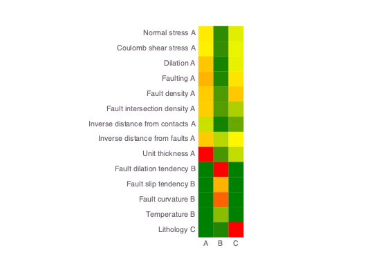
    


    

    


    


    

    


    


    13×2 Array{Any,2}:
     "B8"     1.0
     "EE-1"   0.988215
     "47A-1"  0.905634
     "64-1"   0.867431
     "47C-1"  0.79874
     "27-1"   0.716696
     "46A-1"  0.699196
     "46-1"   0.675645
     "48A-1"  0.56726
     "56B-1"  0.557649
     "MGI-1"  0.286221
     "81A-1"  0.24804
     "B2"     0.0820308


    20×2 Array{Any,2}:
     "56-1"        1.0
     "55-1"        0.951665
     "57-1"        0.947671
     "68B-1"       0.759123
     "56A-1"       0.752345
     "BCH-2"       0.67324
     "MG-2(SP-2)"  0.624464
     "BCH-1"       0.609265
     "B5A"         0.440143
     "B5"          0.439178
     "17-31"       0.372325
     "81-11"       0.353316
     "18B-31"      0.351038
     "81B-1"       0.32106
     "18D-31"      0.302397
     "MGI-2"       0.289056
     "B4"          0.286007
     "18-31"       0.261958
     "81-1"        0.234893
     "B7"          0.155895


    14×2 Array{Any,2}:
     "88-11"       1.0
     "22-13"       0.890617
     "82A-11"      0.886939
     "68A-1"       0.878252
     "18-1"        0.872381
     "77-1"        0.834481
     "18A-1"       0.830688
     "MG-1(SP-1)"  0.807444
     "BCH-3"       0.805676
     "15-12"       0.791843
     "B1"          0.65222
     "26-12"       0.444381
     "B6"          0.213355
     "B3"          0.212844


    

    


    ┌ Info: Locations (signals=3)
    └ @ NMFk /Users/vvv/.julia/dev/NMFk/src/NMFkPostprocess.jl:322
    ┌ Info: Signal A (S2) Count: 20
    └ @ NMFk /Users/vvv/.julia/dev/NMFk/src/NMFkPostprocess.jl:335
    ┌ Info: Signal B (S1) Count: 14
    └ @ NMFk /Users/vvv/.julia/dev/NMFk/src/NMFkPostprocess.jl:335
    ┌ Info: Signal C (S3) Count: 13
    └ @ NMFk /Users/vvv/.julia/dev/NMFk/src/NMFkPostprocess.jl:335
    ┌ Info: Signal C -> A Count: 13
    └ @ NMFk /Users/vvv/.julia/dev/NMFk/src/NMFkPostprocess.jl:345
    ┌ Info: Signal A -> B Count: 20
    └ @ NMFk /Users/vvv/.julia/dev/NMFk/src/NMFkPostprocess.jl:345
    ┌ Info: Signal B -> C Count: 14
    └ @ NMFk /Users/vvv/.julia/dev/NMFk/src/NMFkPostprocess.jl:345
    ┌ Info: Signal A (remapped k-means clustering)
    └ @ NMFk /Users/vvv/.julia/dev/NMFk/src/NMFkPostprocess.jl:360
    ┌ Info: Signal B (remapped k-means clustering)
    └ @ NMFk /Users/vvv/.julia/dev/NMFk/src/NMFkPostprocess.jl:360
    ┌ Info: Signal C (remapped k-means clustering)
    └ @ NMFk /Users/vvv/.julia/dev/NMFk/src/NMFkPostprocess.jl:360


    

    


    


    

    


    
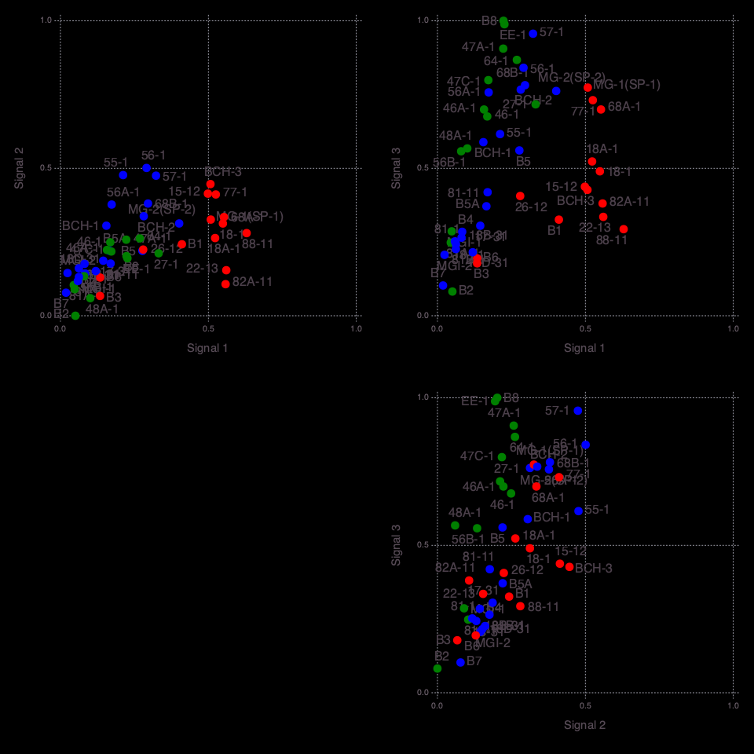
    


    


    
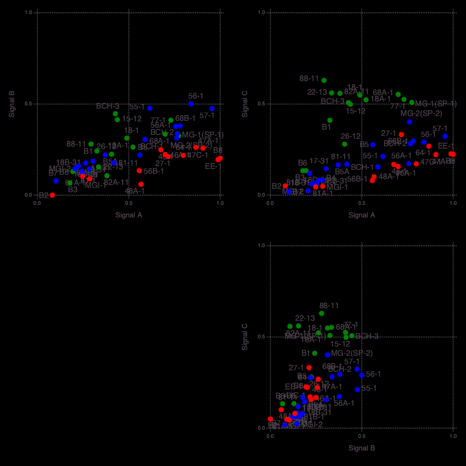
    


    

    


    


    

    


    


    ([[2, 1], [3, 2, 1]], [['B', 'B', 'A', 'B', 'A', 'B', 'B', 'A', 'A', 'A'  …  'B', 'A', 'B', 'A', 'B', 'A', 'A', 'A', 'A', 'B'], ['C', 'B', 'C', 'B', 'C', 'B', 'B', 'C', 'C', 'A'  …  'B', 'A', 'B', 'B', 'C', 'A', 'C', 'B', 'A', 'B']], [['A', 'A', 'A', 'A', 'B', 'B', 'B', 'B', 'A', 'A', 'A', 'A', 'A', 'A'], ['A', 'A', 'A', 'A', 'B', 'B', 'B', 'B', 'A', 'A', 'A', 'A', 'A', 'C']])


#### Analysis of the 3-signature solution

The results for a solution with **3** signatures presented above will be further discussed here.

The well attributes are clustered into **3** groups:

<div style="background-color: gray;">
    <iframe src="../results-set00-v9-inv-750-1000-dlan/attributes-3-groups.txt" frameborder="0" height="400"
      width="95%"></iframe>
</div>

This grouping is based on analyses of the attribute matrix `W`:

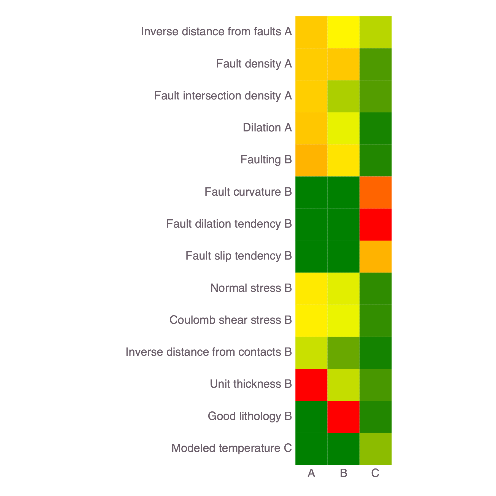

Note that the attribute matrix `W` is automatically modified to account that a range of vertical depths is applied in characterizing the site wells.

The well locations are also clustered into **3** groups:

<div style="background-color: gray;">
  <p>
    <iframe src="../results-set00-v9-inv-750-1000-dlan/locations-3-groups.txt" frameborder="0" height="400"
      width="95%"></iframe>
  </p>
</div>

This grouping is based on analyses of the location matrix `H`:

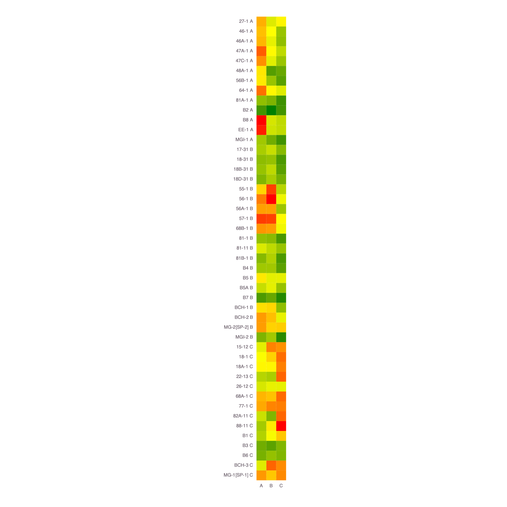

The map [../figures-set00-v9-inv-750-1000-dlan/locations-3-map.html](../figures-set00-v9-inv-750-1000-dlan/locations-3-map.html) provides interactive visualization of the extracted well location groups (the html file can also be opened with any browser). 

<div>
    <iframe src="../figures-set00-v9-inv-750-1000-dlan/locations-3-map.html" frameborder="0" height="400" width="50%"></iframe>
</div>
