Geothermal machine learning analysis: Southwest New Mexico 
---

This notebook is a part of the GTcloud.jl: GeoThermal Cloud for Machine Learning.

<div style="text-align: left; padding-bottom: 30px;">
    
</div>

Machine learning analyses are performed using the **SmartTensors** machine learning framework.

<div style="text-align: left; padding-bottom: 30px;">
	
</div>

This notebook demonstrates how the **NMFk** module of **SmartTensors** can be applied to perform unsupervised geothermal machine-learning analyses.

<div style="text-align: left; padding-bottom: 30px;">
	
</div>

More information how the ML results are interpreted to provide geothermal insights is discussed in our research paper.

## Import required libraries for this work

If **NMFk** is not installed, first execute in the Julia REPL `import Pkg; Pkg.add("NMFk"); Pkg.add("DelimitedFiles"); Pkg.add("JLD"); Pkg.add("Gadfly"); Pkg.add("Cairo"); Pkg.add("Fontconfig"); Pkg.add("Mads")`.


```julia
import Cairo
import NMFk
import DelimitedFiles
import JLD
import Gadfly
import Fontconfig
import Mads
```


<script>
// Immediately-invoked-function-expression to avoid global variables.
(function() {
    var warning_div = document.getElementById("webio-warning-6095226796766575954");
    var hide = function () {
        var script = document.getElementById("webio-setup-11791874367697075726");
        var parent = script && script.parentElement;
        var grandparent = parent && parent.parentElement;
        if (grandparent) {
            grandparent.style.display = "none";
        }
        warning_div.style.display = "none";
    };
    if (typeof Jupyter !== "undefined") {
        console.log("WebIO detected Jupyter notebook environment.");
        // Jupyter notebook.
        var extensions = (
            Jupyter
            && Jupyter.notebook.config.data
            && Jupyter.notebook.config.data.load_extensions
        );
        if (extensions && extensions["webio-jupyter-notebook"]) {
            // Extension already loaded.
            console.log("Jupyter WebIO nbextension detected; not loading ad-hoc.");
            hide();
            return;
        }
    } else if (window.location.pathname.includes("/lab")) {
        // Guessing JupyterLa
        console.log("Jupyter Lab detected; make sure the @webio/jupyter-lab-provider labextension is installed.");
        hide();
        return;
    }
})();

</script>
<p
    id="webio-warning-6095226796766575954"
    class="output_text output_stderr"
    style="padding: 1em; font-weight: bold;"
>
    Unable to load WebIO. Please make sure WebIO works for your Jupyter client.
    For troubleshooting, please see <a href="https://juliagizmos.github.io/WebIO.jl/latest/providers/ijulia/">
    the WebIO/IJulia documentation</a>.
    <!-- TODO: link to installation docs. -->
</p>


## Load and pre-process the data

### Setup the working directory containing the SWNM data


```julia
cd("../");
```

### Load the data file


```julia
d, h = DelimitedFiles.readdlm("data/Pepin_PCA_Input_Data_LANL.csv", ','; header=true);
```

### Define names of the data attributes (matrix columns)


```julia
attributes_short = ["Boron"; "Gravity"; "Magnetic"; "Dikes"; "Drainage"; "FaultInter"; "QuatFaults"; "Seismicity"; "NMFaults"; "Springs"; "Vents"; "Lithium"; "Precip"; "Air_Temp"; "Silica"; "Subcrop"; "WT_Gradient"; "WT_Elev"; "Heatflow"; "GS_Elev"; "DTW"; "Crst_Thick"; "Bsmt_Depth"]
attributes_long = uppercasefirst.(lowercase.(["Boron Concentration"; "Gravity Anomaly"; "Magnetic Intensity"; "Volcanic Dike Density"; "Drainage Density"; "Fault Intersection Density"; "Quaternary Fault Density"; "Seismicity"; "State Map Fault Density"; "Spring Density"; "Volcanic Vent Density"; "Lithium Concentration"; "Precipitation"; "Air Temperature"; "Silica Geothermometer"; "Subcrop Permeability"; "Hydraulic Gradient"; "Watertable Elevation"; "Heat flow"; "Groundsurface Elevation"; "Watertable Depth"; "Crustal Thickness"; "Depth to Basement"]))
attributes_long_new = uppercasefirst.(lowercase.(["Boron"; "Gravity anomaly"; "Magnetic intensity"; "Volcanic dike density"; "Drainage density"; "Fault intersection density"; "Quaternary fault density"; "Seismicity"; "State map fault density"; "Spring density"; "Volcanic vent density"; "Lithium"; "Precipitation"; "Air temperature"; "Silica geothermometer"; "Subcrop permeability"; "Hydraulic gradient"; "Watertable elevation"; "Heat flow"; "Groundsurface elevation"; "Watertable depth"; "Crustal thickness"; "Depth to basement"]))
attributes_ordered = ["Boron concentration", "Lithium concentration", "Drainage density", "Spring density", "Hydraulic gradient", "Precipitation", "Gravity anomaly", "Magnetic intensity", "Seismicity", "Silica geothermometer", "Heat flow", "Crustal thickness", "Depth to basement", "Fault intersection density", "Quaternary fault density", "State map fault density", "Volcanic dike density", "Volcanic vent density"];
```

Short attribute names are used for coding.

Long attribute names are used for plotting and visualization.

### Define attributes to remove from analysis


```julia
attributes_remove = uppercasefirst.(lowercase.(["Air Temperature"; "Subcrop Permeability"; "Watertable Elevation"; "Groundsurface Elevation"; "Watertable Depth"]));
```

### Define attributes for analysis


```julia
index_remove = indexin(attributes_remove, attributes_long)
attributes_cols = trues(length(attributes_long))
attributes_cols[index_remove] .= false
cols = vec(4:26)[attributes_cols]
attributes = attributes_long[cols .- 3];
print("Attributes used are:")
attributes
```

    Attributes used are:


    18-element Array{String,1}:
     "Boron concentration"
     "Gravity anomaly"
     "Magnetic intensity"
     "Volcanic dike density"
     "Drainage density"
     "Fault intersection density"
     "Quaternary fault density"
     "Seismicity"
     "State map fault density"
     "Spring density"
     "Volcanic vent density"
     "Lithium concentration"
     "Precipitation"
     "Silica geothermometer"
     "Hydraulic gradient"
     "Heat flow"
     "Crustal thickness"
     "Depth to basement"


### Define names of the data locations


```julia
locations_short = ["Alamos spr";
"Allen spr";
"Apache well";
"Aragon spr";
"Ash spr";
"B.Iorio well";
"Cliff spr";
"Dent well";
"Derry spr";
"Faywood spr";
"Fed H1 well";
"Freiborn spr";
"Garton well";
"Gila spr 1";
"Gila spr 2";
"Goat spr";
"Jerry well";
"Kennecott well";
"Laguna Pbl";
"Lightning Dock";
"Los Alturas";
"Mangas spr";
"Mimbres spr";
"Ojitos spr";
"Ojo Caliente";
"Ojo Canas";
"Pueblo well";
"Radium spr";
"Rainbow spr";
"Riverside well";
"Sacred spr";
"Socorro Can";
"Spring";
"Spring Can";
"T or C spr";
"Turkey spr";
"Victoria well";
"Warm spr";
"Well 1";
"Well 2";
"Well 3";
"Well 4";
"Well 5";
"Carne well"]

locations_long = ["Alamos Spring";
"Allen Springs";
"Apache Tejo Warm Springs well";
"Aragon Springs";
"Ash Spring";
"B. Iorio 1 well";
"Cliff Warm Spring";
"Dent windmill well";
"Derry Warm Springs";
"Faywood Hot Springs";
"Federal H 1 well";
"Freiborn Canyon Spring";
"Garton well";
"Gila Hot Springs 1";
"Gila Hot Springs 2";
"Goat Camp Spring";
"Jerry well";
"Kennecott Warm Springs well";
"Laguna Pueblo";
"Lightning Dock";
"Los Alturas Estates";
"Mangas Springs";
"Mimbres Hot Springs";
"Ojitos Springs";
"Ojo Caliente";
"Ojo De las Canas";
"Pueblo windmill well";
"Radium Hot Springs";
"Rainbow Spring";
"Riverside Store well";
"Sacred Spring";
"Socorro Canyon";
"Spring";
"Spring Canyon Warm Spring";
"Truth or Consequences spring";
"Turkey Creek Spring";
"Victoria Land and Cattle Co. well";
"Warm Springs";
"Well 1";
"Well 2";
"Well 3";
"Well 4";
"Well 5";
"Well south of Carne"];
```

Short location names are used for coding.

Long location names are used for plotting and visualization.

### Define location coordinates


```julia
dindex = d[:,end] .== 1
rows = convert.(Int32, d[dindex,end-1])
locations = locations_short[rows]
lat = d[dindex, 2]
lon = d[dindex, 3];
```

### Set up directories tp store results and figures


```julia
figuredir = "figures-case01"
resultdir = "results-case01";
```

### Define a range for number of signatures to be explored 


```julia
nkrange = 2:10;
```

### Define and normalize the data matrix


```julia
X = permutedims(d[dindex, cols])
Xu, nmin, nmax = NMFk.normalizematrix_row!(X);
```

## Perform ML analyses

The **NMFk** algorithm factorizes the normalized data matrix `Xu` into `W` and `H` matrices. For more information, check out the [**NMFk** website](https://github.com/SmartTensors/NMFk.jl)


```julia
W, H, fitquality, robustness, aic = NMFk.execute(Xu, nkrange, 1000; resultdir=resultdir, casefilename="nmfk", load=true)
W, H, fitquality, robustness, aic = NMFk.load(nkrange, 1000; resultdir=resultdir, casefilename="nmfk");
```

    Signals:  2 Fit:     32.70151 Silhouette:            1 AIC:    -2276.215
    Signals:  3 Fit:      24.6022 Silhouette:    0.9999996 AIC:    -2377.607
    Signals:  4 Fit:     18.46274 Silhouette:    0.9999994 AIC:    -2480.975
    Signals:  5 Fit:     14.74592 Silhouette:     0.764538 AIC:    -2535.007
    Signals:  6 Fit:      12.3538 Silhouette:   -0.1423047 AIC:    -2551.193
    Signals:  7 Fit:     10.29325 Silhouette:   -0.0733191 AIC:    -2571.714
    Signals:  8 Fit:     8.237522 Silhouette:    0.2518114 AIC:    -2624.163
    Signals:  9 Fit:     7.607165 Silhouette:  -0.07981342 AIC:    -2563.213
    Signals: 10 Fit:     6.023938 Silhouette:   0.02130362 AIC:    -2624.026
    Signals:  2 Fit:     32.70151 Silhouette:            1 AIC:    -2276.215
    Signals:  3 Fit:      24.6022 Silhouette:    0.9999996 AIC:    -2377.607
    Signals:  4 Fit:     18.46274 Silhouette:    0.9999994 AIC:    -2480.975
    Signals:  5 Fit:     14.74592 Silhouette:     0.764538 AIC:    -2535.007
    Signals:  6 Fit:      12.3538 Silhouette:   -0.1423047 AIC:    -2551.193
    Signals:  7 Fit:     10.29325 Silhouette:   -0.0733191 AIC:    -2571.714
    Signals:  8 Fit:     8.237522 Silhouette:    0.2518114 AIC:    -2624.163
    Signals:  9 Fit:     7.607165 Silhouette:  -0.07981342 AIC:    -2563.213
    Signals: 10 Fit:     6.023938 Silhouette:   0.02130362 AIC:    -2624.026


    ┌ Info: Results
    └ @ NMFk /Users/bulbulahmmed/.julia/packages/NMFk/koh08/src/NMFkExecute.jl:15
    ┌ Info: Optimal solution: 8 signals
    └ @ NMFk /Users/bulbulahmmed/.julia/packages/NMFk/koh08/src/NMFkExecute.jl:20


    Signals:  2 Fit:     32.70151 Silhouette:            1 AIC:    -2276.215
    Signals:  3 Fit:      24.6022 Silhouette:    0.9999996 AIC:    -2377.607
    Signals:  4 Fit:     18.46274 Silhouette:    0.9999994 AIC:    -2480.975
    Signals:  5 Fit:     14.74592 Silhouette:     0.764538 AIC:    -2535.007
    Signals:  6 Fit:      12.3538 Silhouette:   -0.1423047 AIC:    -2551.193
    Signals:  7 Fit:     10.29325 Silhouette:   -0.0733191 AIC:    -2571.714
    Signals:  8 Fit:     8.237522 Silhouette:    0.2518114 AIC:    -2624.163
    Signals:  9 Fit:     7.607165 Silhouette:  -0.07981342 AIC:    -2563.213
    Signals: 10 Fit:     6.023938 Silhouette:   0.02130362 AIC:    -2624.026


    ┌ Info: Optimal solution: 8 signals
    └ @ NMFk /Users/bulbulahmmed/.julia/packages/NMFk/koh08/src/NMFkIO.jl:30


Here, the **NMFk** results are loaded from a prior ML runs.

As seen from the output above, the NMFk analyses identified that the optimal number of geothermal signatures in the dataset **8**.

Solutions with a number of signatures less than **8** are underfitting.

Solutions with a number of signatures greater than **8** are overfitting and unacceptable.

The set of accetable solutions are defined as follows:


```julia
NMFk.getks(nkrange, robustness[nkrange])
```


    5-element Array{Int64,1}:
     2
     3
     4
     5
     8


The accceptable solutions contain 2, 3, 4, 5 and 8 signatures.

### Post-process NMFk results

#### Number of signatures

Plot representing solution quality (fit) and silhouette width (robustness) for different number of sigantures `k`:


```julia
NMFk.plot_signal_selecton(nkrange, fitquality, robustness; figuredir=figuredir, xtitle="Number of signatures")
```


    

    


    

The plot above also demonstrates that the accceptable solutions contain 2, 3, 4, 5 and 8 signatures.
Note, any solution is accepted if the robustness >0.25. 

#### Analysis of all the accceptable solutions 

The ML solutions containing an acceptable number of signatures are further analyzed as follows:


```julia
NMFk.clusterresults(NMFk.getks(nkrange, robustness[nkrange]), W, H, attributes, locations; lat=lat, lon=lon, resultdir=resultdir, figuredir=figuredir, Hcasefilename="locations", Wcasefilename="attributes");
```

    ┌ Info: Number of signals: 2
    └ @ NMFk /Users/bulbulahmmed/.julia/packages/NMFk/koh08/src/NMFkPostprocess.jl:144


    Signal importance (high->low): [1, 2]


    ┌ Info: Locations (signals=2)
    └ @ NMFk /Users/bulbulahmmed/.julia/packages/NMFk/koh08/src/NMFkPostprocess.jl:148
    ┌ Warning: type Clustering.KmeansResult{Core.Array{Core.Float64,2},Core.Float64,Core.Int64} not present in workspace; reconstructing
    └ @ JLD /Users/bulbulahmmed/.julia/packages/JLD/3UXN2/src/jld_types.jl:697
    ┌ Info: Robust k-means analysis results are loaded from file results-case01/Hmatrix-2-2_44-1000.jld!
    └ @ NMFk /Users/bulbulahmmed/.julia/packages/NMFk/koh08/src/NMFkCluster.jl:67
    ┌ Warning: Procedure to find unique signals could not identify a solution ...
    └ @ NMFk /Users/bulbulahmmed/.julia/packages/NMFk/koh08/src/NMFkCluster.jl:158
    ┌ Warning: Procedure to find unique signals could not identify a solution ...
    └ @ NMFk /Users/bulbulahmmed/.julia/packages/NMFk/koh08/src/NMFkCluster.jl:158
    ┌ Warning: type Clustering.KmeansResult{Core.Array{Core.Float64,2},Core.Float64,Core.Int64} not present in workspace; reconstructing
    └ @ JLD /Users/bulbulahmmed/.julia/packages/JLD/3UXN2/src/jld_types.jl:697
    ┌ Info: Robust k-means analysis results are loaded from file results-case01/Wmatrix-2-2_18-1000.jld!
    └ @ NMFk /Users/bulbulahmmed/.julia/packages/NMFk/koh08/src/NMFkCluster.jl:67
    ┌ Info: Signal A -> A Count: 29
    └ @ NMFk /Users/bulbulahmmed/.julia/packages/NMFk/koh08/src/NMFkPostprocess.jl:255


    29×2 Array{Any,2}:
     "Allen spr"       1.0
     "Turkey spr"      0.884139
     "Aragon spr"      0.849368
     "Gila spr 1"      0.845807
     "Ash spr"         0.839107
     "Gila spr 2"      0.829838
     "Garton well"     0.788626
     "Mimbres spr"     0.7852
     "Ojitos spr"      0.76979
     "Socorro Can"     0.761215
     "Freiborn spr"    0.745613
     "Well 1"          0.743076
     "Spring Can"      0.741828
     ⋮                 
     "Warm spr"        0.676919
     "Cliff spr"       0.676442
     "Ojo Caliente"    0.670285
     "Spring"          0.669871
     "Alamos spr"      0.64752
     "Pueblo well"     0.63547
     "Rainbow spr"     0.635234
     "Jerry well"      0.622338
     "Laguna Pbl"      0.601675
     "Sacred spr"      0.597838
     "Apache well"     0.563514
     "Kennecott well"  0.510178


    ┌ Info: Signal B -> B Count: 15
    └ @ NMFk /Users/bulbulahmmed/.julia/packages/NMFk/koh08/src/NMFkPostprocess.jl:255
    ┌ Info: Signal A (S1) (k-means clustering)
    └ @ NMFk /Users/bulbulahmmed/.julia/packages/NMFk/koh08/src/NMFkPostprocess.jl:272


    15×2 Array{Any,2}:
     "Fed H1 well"     1.0
     "Well 4"          0.840281
     "Well 2"          0.78384
     "Well 5"          0.719246
     "Los Alturas"     0.692025
     "Radium spr"      0.687742
     "Lightning Dock"  0.677317
     "T or C spr"      0.60486
     "Carne well"      0.592351
     "Well 3"          0.56113
     "B.Iorio well"    0.480433
     "Victoria well"   0.462937
     "Derry spr"       0.400573
     "Faywood spr"     0.391769
     "Goat spr"        0.354929


    

    


    ┌ Info: Signal B (S2) (k-means clustering)
    └ @ NMFk /Users/bulbulahmmed/.julia/packages/NMFk/koh08/src/NMFkPostprocess.jl:272


    

    


    


<?xml version="1.0" encoding="UTF-8"?>
<svg xmlns="http://www.w3.org/2000/svg"
     xmlns:xlink="http://www.w3.org/1999/xlink"
     xmlns:gadfly="http://www.gadflyjl.org/ns"
     version="1.2"
     width="141.42mm" height="100mm" viewBox="0 0 141.42 100"
     stroke="none"
     fill="#000000"
     stroke-width="0.3"
     font-size="3.88"

     id="img-d95e5bc4">
<defs>
  <marker id="arrow" markerWidth="15" markerHeight="7" refX="5" refY="3.5" orient="auto" markerUnits="strokeWidth">
    <path d="M0,0 L15,3.5 L0,7 z" stroke="context-stroke" fill="context-stroke"/>
  </marker>
</defs>
<g class="plotroot" id="img-d95e5bc4-1">
  <g class="guide xlabels" font-size="2.82" font-family="'PT Sans Caption','Helvetica Neue','Helvetica',sans-serif" fill="#6C606B" id="img-d95e5bc4-2">
    <g transform="translate(72.55,92.22)" gadfly:scale="1.0" visibility="visible">
      <g class="primitive">
        <text text-anchor="end" dy="-0em" transform="rotate(-90,0, 0)">A</text>
      </g>
    </g>
    <g transform="translate(74.46,92.22)" gadfly:scale="1.0" visibility="visible">
      <g class="primitive">
        <text text-anchor="end" dy="-0em" transform="rotate(-90,0, 0)">B</text>
      </g>
    </g>
  </g>
  <g stroke-width="0.11" stroke="#FFFFFF" id="img-d95e5bc4-3">
    <g transform="translate(77.65,28.43)">
      <path fill="none" d="M-1.18,0.95 L1.18,0.95 1.18,-0.95 -1.18,-0.95 " class="primitive"/>
    </g>
    <g transform="translate(79.42,29.86)">
      <path fill="none" d="M-2.96,1.43 L1.78,1.43 1.78,-1.43 -0.59,-1.43 " class="primitive"/>
    </g>
    <g transform="translate(77.65,37.95)">
      <path fill="none" d="M-1.18,0.95 L1.18,0.95 1.18,-0.95 -1.18,-0.95 " class="primitive"/>
    </g>
    <g transform="translate(77.65,60.78)">
      <path fill="none" d="M-1.18,0.95 L1.18,0.95 1.18,-0.95 -1.18,-0.95 " class="primitive"/>
    </g>
    <g transform="translate(77.65,45.56)">
      <path fill="none" d="M-1.18,0.95 L1.18,0.95 1.18,-0.95 -1.18,-0.95 " class="primitive"/>
    </g>
    <g transform="translate(77.65,20.82)">
      <path fill="none" d="M-1.18,0.95 L1.18,0.95 1.18,-0.95 -1.18,-0.95 " class="primitive"/>
    </g>
    <g transform="translate(77.65,51.27)">
      <path fill="none" d="M-1.18,0.95 L1.18,0.95 1.18,-0.95 -1.18,-0.95 " class="primitive"/>
    </g>
    <g transform="translate(77.65,56.97)">
      <path fill="none" d="M-1.18,0.95 L1.18,0.95 1.18,-0.95 -1.18,-0.95 " class="primitive"/>
    </g>
    <g transform="translate(81.2,31.52)">
      <path fill="none" d="M-4.74,1.66 L2.37,1.66 2.37,-1.66 0,-1.66 " class="primitive"/>
    </g>
    <g transform="translate(80.02,58.88)">
      <path fill="none" d="M-1.18,1.9 L1.18,1.9 1.18,-1.9 -1.18,-1.9 " class="primitive"/>
    </g>
    <g transform="translate(79.42,46.98)">
      <path fill="none" d="M-2.96,1.43 L1.78,1.43 1.78,-1.43 -0.59,-1.43 " class="primitive"/>
    </g>
    <g transform="translate(77.65,13.21)">
      <path fill="none" d="M-1.18,0.95 L1.18,0.95 1.18,-0.95 -1.18,-0.95 " class="primitive"/>
    </g>
    <g transform="translate(79.42,39.37)">
      <path fill="none" d="M-2.96,1.43 L1.78,1.43 1.78,-1.43 -0.59,-1.43 " class="primitive"/>
    </g>
    <g transform="translate(77.65,79.81)">
      <path fill="none" d="M-1.18,0.95 L1.18,0.95 1.18,-0.95 -1.18,-0.95 " class="primitive"/>
    </g>
    <g transform="translate(82.98,33.31)">
      <path fill="none" d="M-6.51,1.78 L2.96,1.78 2.96,-1.78 0.59,-1.78 " class="primitive"/>
    </g>
    <g transform="translate(77.65,66.49)">
      <path fill="none" d="M-1.18,0.95 L1.18,0.95 1.18,-0.95 -1.18,-0.95 " class="primitive"/>
    </g>
    <g transform="translate(81.2,61.26)">
      <path fill="none" d="M-4.74,2.38 L2.37,2.38 2.37,-2.38 0,-2.38 " class="primitive"/>
    </g>
    <g transform="translate(77.65,70.29)">
      <path fill="none" d="M-1.18,0.95 L1.18,0.95 1.18,-0.95 -1.18,-0.95 " class="primitive"/>
    </g>
    <g transform="translate(77.65,76)">
      <path fill="none" d="M-1.18,0.95 L1.18,0.95 1.18,-0.95 -1.18,-0.95 " class="primitive"/>
    </g>
    <g transform="translate(77.65,83.61)">
      <path fill="none" d="M-1.18,0.95 L1.18,0.95 1.18,-0.95 -1.18,-0.95 " class="primitive"/>
    </g>
    <g transform="translate(79.42,14.64)">
      <path fill="none" d="M-2.96,1.43 L1.78,1.43 1.78,-1.43 -0.59,-1.43 " class="primitive"/>
    </g>
    <g transform="translate(81.2,41.04)">
      <path fill="none" d="M-4.74,1.66 L2.37,1.66 2.37,-1.66 0,-1.66 " class="primitive"/>
    </g>
    <g transform="translate(77.65,87.42)">
      <path fill="none" d="M-1.18,0.95 L1.18,0.95 1.18,-0.95 -1.18,-0.95 " class="primitive"/>
    </g>
    <g transform="translate(79.42,71.72)">
      <path fill="none" d="M-2.96,1.43 L1.78,1.43 1.78,-1.43 -0.59,-1.43 " class="primitive"/>
    </g>
    <g transform="translate(79.42,22.25)">
      <path fill="none" d="M-2.96,1.43 L1.78,1.43 1.78,-1.43 -0.59,-1.43 " class="primitive"/>
    </g>
    <g transform="translate(79.42,52.69)">
      <path fill="none" d="M-2.96,1.43 L1.78,1.43 1.78,-1.43 -0.59,-1.43 " class="primitive"/>
    </g>
    <g transform="translate(80.02,77.9)">
      <path fill="none" d="M-1.18,1.9 L1.18,1.9 1.18,-1.9 -1.18,-1.9 " class="primitive"/>
    </g>
    <g transform="translate(83.57,63.87)">
      <path fill="none" d="M-4.74,2.62 L2.37,2.62 2.37,-2.62 0,-2.62 " class="primitive"/>
    </g>
    <g transform="translate(79.42,88.85)">
      <path fill="none" d="M-2.96,1.43 L1.78,1.43 1.78,-1.43 -0.59,-1.43 " class="primitive"/>
    </g>
    <g transform="translate(84.16,44.01)">
      <path fill="none" d="M-2.96,2.97 L1.78,2.97 1.78,-2.97 -0.59,-2.97 " class="primitive"/>
    </g>
    <g transform="translate(81.79,80.76)">
      <path fill="none" d="M-2.96,2.85 L1.78,2.85 1.78,-2.85 -0.59,-2.85 " class="primitive"/>
    </g>
    <g transform="translate(85.94,67.8)">
      <path fill="none" d="M-4.74,3.92 L2.37,3.92 2.37,-3.92 0,-3.92 " class="primitive"/>
    </g>
    <g transform="translate(81.2,23.91)">
      <path fill="none" d="M-4.74,1.66 L2.37,1.66 2.37,-1.66 0,-1.66 " class="primitive"/>
    </g>
    <g transform="translate(81.2,16.3)">
      <path fill="none" d="M-4.74,1.66 L2.37,1.66 2.37,-1.66 0,-1.66 " class="primitive"/>
    </g>
    <g transform="translate(77.65,9.4)">
      <path fill="none" d="M-1.18,0.95 L1.18,0.95 1.18,-0.95 -1.18,-0.95 " class="primitive"/>
    </g>
    <g transform="translate(85.94,48.35)">
      <path fill="none" d="M-4.74,4.34 L2.37,4.34 2.37,-4.34 0,-4.34 " class="primitive"/>
    </g>
    <g transform="translate(84.16,84.8)">
      <path fill="none" d="M-2.96,4.04 L1.78,4.04 1.78,-4.04 -0.59,-4.04 " class="primitive"/>
    </g>
    <g transform="translate(86.53,28.61)">
      <path fill="none" d="M-0.59,4.7 L1.78,4.7 1.78,-4.7 -2.96,-4.7 " class="primitive"/>
    </g>
    <g transform="translate(89.49,58.07)">
      <path fill="none" d="M-1.18,9.72 L1.18,9.72 1.18,-9.72 -1.18,-9.72 " class="primitive"/>
    </g>
    <g transform="translate(83.57,12.85)">
      <path fill="none" d="M0,3.45 L2.37,3.45 2.37,-3.45 -4.74,-3.45 " class="primitive"/>
    </g>
    <g transform="translate(90.67,71.44)">
      <path fill="none" d="M-4.74,13.36 L2.37,13.36 2.37,-13.36 0,-13.36 " class="primitive"/>
    </g>
    <g transform="translate(88.9,20.73)">
      <path fill="none" d="M-0.59,7.88 L1.78,7.88 1.78,-7.88 -2.96,-7.88 " class="primitive"/>
    </g>
    <g transform="translate(93.63,46.08)">
      <path fill="none" d="M-0.59,25.35 L1.78,25.35 1.78,-25.35 -2.96,-25.35 " class="primitive"/>
    </g>
  </g>
  <g clip-path="url(#img-d95e5bc4-4)">
    <g id="img-d95e5bc4-5">
      <g pointer-events="visible" stroke-width="0.3" fill="#000000" fill-opacity="0.000" stroke="#000000" stroke-opacity="0.000" class="guide background" id="img-d95e5bc4-6">
        <g transform="translate(73.5,49.36)" id="img-d95e5bc4-7">
          <path d="M-1.9,-41.86 L1.9,-41.86 1.9,41.86 -1.9,41.86  z" class="primitive"/>
        </g>
      </g>
      <g class="guide ygridlines xfixed" stroke-dasharray="0.5,0.5" stroke-width="0.2" stroke="#D0D0E0" id="img-d95e5bc4-8">
        <g transform="translate(73.5,9.4)" id="img-d95e5bc4-9" visibility="visible" gadfly:scale="1.0">
          <path fill="none" d="M-1.9,0 L1.9,0 " class="primitive"/>
        </g>
        <g transform="translate(73.5,11.31)" id="img-d95e5bc4-10" visibility="visible" gadfly:scale="1.0">
          <path fill="none" d="M-1.9,0 L1.9,0 " class="primitive"/>
        </g>
        <g transform="translate(73.5,13.21)" id="img-d95e5bc4-11" visibility="visible" gadfly:scale="1.0">
          <path fill="none" d="M-1.9,0 L1.9,0 " class="primitive"/>
        </g>
        <g transform="translate(73.5,15.11)" id="img-d95e5bc4-12" visibility="visible" gadfly:scale="1.0">
          <path fill="none" d="M-1.9,0 L1.9,0 " class="primitive"/>
        </g>
        <g transform="translate(73.5,17.01)" id="img-d95e5bc4-13" visibility="visible" gadfly:scale="1.0">
          <path fill="none" d="M-1.9,0 L1.9,0 " class="primitive"/>
        </g>
        <g transform="translate(73.5,18.92)" id="img-d95e5bc4-14" visibility="visible" gadfly:scale="1.0">
          <path fill="none" d="M-1.9,0 L1.9,0 " class="primitive"/>
        </g>
        <g transform="translate(73.5,20.82)" id="img-d95e5bc4-15" visibility="visible" gadfly:scale="1.0">
          <path fill="none" d="M-1.9,0 L1.9,0 " class="primitive"/>
        </g>
        <g transform="translate(73.5,22.72)" id="img-d95e5bc4-16" visibility="visible" gadfly:scale="1.0">
          <path fill="none" d="M-1.9,0 L1.9,0 " class="primitive"/>
        </g>
        <g transform="translate(73.5,24.63)" id="img-d95e5bc4-17" visibility="visible" gadfly:scale="1.0">
          <path fill="none" d="M-1.9,0 L1.9,0 " class="primitive"/>
        </g>
        <g transform="translate(73.5,26.53)" id="img-d95e5bc4-18" visibility="visible" gadfly:scale="1.0">
          <path fill="none" d="M-1.9,0 L1.9,0 " class="primitive"/>
        </g>
        <g transform="translate(73.5,28.43)" id="img-d95e5bc4-19" visibility="visible" gadfly:scale="1.0">
          <path fill="none" d="M-1.9,0 L1.9,0 " class="primitive"/>
        </g>
        <g transform="translate(73.5,30.33)" id="img-d95e5bc4-20" visibility="visible" gadfly:scale="1.0">
          <path fill="none" d="M-1.9,0 L1.9,0 " class="primitive"/>
        </g>
        <g transform="translate(73.5,32.24)" id="img-d95e5bc4-21" visibility="visible" gadfly:scale="1.0">
          <path fill="none" d="M-1.9,0 L1.9,0 " class="primitive"/>
        </g>
        <g transform="translate(73.5,34.14)" id="img-d95e5bc4-22" visibility="visible" gadfly:scale="1.0">
          <path fill="none" d="M-1.9,0 L1.9,0 " class="primitive"/>
        </g>
        <g transform="translate(73.5,36.04)" id="img-d95e5bc4-23" visibility="visible" gadfly:scale="1.0">
          <path fill="none" d="M-1.9,0 L1.9,0 " class="primitive"/>
        </g>
        <g transform="translate(73.5,37.95)" id="img-d95e5bc4-24" visibility="visible" gadfly:scale="1.0">
          <path fill="none" d="M-1.9,0 L1.9,0 " class="primitive"/>
        </g>
        <g transform="translate(73.5,39.85)" id="img-d95e5bc4-25" visibility="visible" gadfly:scale="1.0">
          <path fill="none" d="M-1.9,0 L1.9,0 " class="primitive"/>
        </g>
        <g transform="translate(73.5,41.75)" id="img-d95e5bc4-26" visibility="visible" gadfly:scale="1.0">
          <path fill="none" d="M-1.9,0 L1.9,0 " class="primitive"/>
        </g>
        <g transform="translate(73.5,43.65)" id="img-d95e5bc4-27" visibility="visible" gadfly:scale="1.0">
          <path fill="none" d="M-1.9,0 L1.9,0 " class="primitive"/>
        </g>
        <g transform="translate(73.5,45.56)" id="img-d95e5bc4-28" visibility="visible" gadfly:scale="1.0">
          <path fill="none" d="M-1.9,0 L1.9,0 " class="primitive"/>
        </g>
        <g transform="translate(73.5,47.46)" id="img-d95e5bc4-29" visibility="visible" gadfly:scale="1.0">
          <path fill="none" d="M-1.9,0 L1.9,0 " class="primitive"/>
        </g>
        <g transform="translate(73.5,49.36)" id="img-d95e5bc4-30" visibility="visible" gadfly:scale="1.0">
          <path fill="none" d="M-1.9,0 L1.9,0 " class="primitive"/>
        </g>
        <g transform="translate(73.5,51.27)" id="img-d95e5bc4-31" visibility="visible" gadfly:scale="1.0">
          <path fill="none" d="M-1.9,0 L1.9,0 " class="primitive"/>
        </g>
        <g transform="translate(73.5,53.17)" id="img-d95e5bc4-32" visibility="visible" gadfly:scale="1.0">
          <path fill="none" d="M-1.9,0 L1.9,0 " class="primitive"/>
        </g>
        <g transform="translate(73.5,55.07)" id="img-d95e5bc4-33" visibility="visible" gadfly:scale="1.0">
          <path fill="none" d="M-1.9,0 L1.9,0 " class="primitive"/>
        </g>
        <g transform="translate(73.5,56.97)" id="img-d95e5bc4-34" visibility="visible" gadfly:scale="1.0">
          <path fill="none" d="M-1.9,0 L1.9,0 " class="primitive"/>
        </g>
        <g transform="translate(73.5,58.88)" id="img-d95e5bc4-35" visibility="visible" gadfly:scale="1.0">
          <path fill="none" d="M-1.9,0 L1.9,0 " class="primitive"/>
        </g>
        <g transform="translate(73.5,60.78)" id="img-d95e5bc4-36" visibility="visible" gadfly:scale="1.0">
          <path fill="none" d="M-1.9,0 L1.9,0 " class="primitive"/>
        </g>
        <g transform="translate(73.5,62.68)" id="img-d95e5bc4-37" visibility="visible" gadfly:scale="1.0">
          <path fill="none" d="M-1.9,0 L1.9,0 " class="primitive"/>
        </g>
        <g transform="translate(73.5,64.59)" id="img-d95e5bc4-38" visibility="visible" gadfly:scale="1.0">
          <path fill="none" d="M-1.9,0 L1.9,0 " class="primitive"/>
        </g>
        <g transform="translate(73.5,66.49)" id="img-d95e5bc4-39" visibility="visible" gadfly:scale="1.0">
          <path fill="none" d="M-1.9,0 L1.9,0 " class="primitive"/>
        </g>
        <g transform="translate(73.5,68.39)" id="img-d95e5bc4-40" visibility="visible" gadfly:scale="1.0">
          <path fill="none" d="M-1.9,0 L1.9,0 " class="primitive"/>
        </g>
        <g transform="translate(73.5,70.29)" id="img-d95e5bc4-41" visibility="visible" gadfly:scale="1.0">
          <path fill="none" d="M-1.9,0 L1.9,0 " class="primitive"/>
        </g>
        <g transform="translate(73.5,72.2)" id="img-d95e5bc4-42" visibility="visible" gadfly:scale="1.0">
          <path fill="none" d="M-1.9,0 L1.9,0 " class="primitive"/>
        </g>
        <g transform="translate(73.5,74.1)" id="img-d95e5bc4-43" visibility="visible" gadfly:scale="1.0">
          <path fill="none" d="M-1.9,0 L1.9,0 " class="primitive"/>
        </g>
        <g transform="translate(73.5,76)" id="img-d95e5bc4-44" visibility="visible" gadfly:scale="1.0">
          <path fill="none" d="M-1.9,0 L1.9,0 " class="primitive"/>
        </g>
        <g transform="translate(73.5,77.9)" id="img-d95e5bc4-45" visibility="visible" gadfly:scale="1.0">
          <path fill="none" d="M-1.9,0 L1.9,0 " class="primitive"/>
        </g>
        <g transform="translate(73.5,79.81)" id="img-d95e5bc4-46" visibility="visible" gadfly:scale="1.0">
          <path fill="none" d="M-1.9,0 L1.9,0 " class="primitive"/>
        </g>
        <g transform="translate(73.5,81.71)" id="img-d95e5bc4-47" visibility="visible" gadfly:scale="1.0">
          <path fill="none" d="M-1.9,0 L1.9,0 " class="primitive"/>
        </g>
        <g transform="translate(73.5,83.61)" id="img-d95e5bc4-48" visibility="visible" gadfly:scale="1.0">
          <path fill="none" d="M-1.9,0 L1.9,0 " class="primitive"/>
        </g>
        <g transform="translate(73.5,85.52)" id="img-d95e5bc4-49" visibility="visible" gadfly:scale="1.0">
          <path fill="none" d="M-1.9,0 L1.9,0 " class="primitive"/>
        </g>
        <g transform="translate(73.5,87.42)" id="img-d95e5bc4-50" visibility="visible" gadfly:scale="1.0">
          <path fill="none" d="M-1.9,0 L1.9,0 " class="primitive"/>
        </g>
        <g transform="translate(73.5,89.32)" id="img-d95e5bc4-51" visibility="visible" gadfly:scale="1.0">
          <path fill="none" d="M-1.9,0 L1.9,0 " class="primitive"/>
        </g>
      </g>
      <g class="guide xgridlines yfixed" stroke-dasharray="0.5,0.5" stroke-width="0.2" stroke="#D0D0E0" visibility="visible" id="img-d95e5bc4-52">
        <g transform="translate(73.5,49.36)" id="img-d95e5bc4-53" gadfly:scale="1.0">
          <path fill="none" d="M0,-41.86 L0,41.86 " class="primitive"/>
        </g>
      </g>
      <g class="plotpanel" id="img-d95e5bc4-54">
        <metadata>
          <boundingbox value="71.60092167975404mm 7.5mm 3.805670104363952mm 83.72474229600694mm"/>
          <unitbox value="0.5 0.5 2.0 44.0"/>
        </metadata>
        <g shape-rendering="crispEdges" class="geometry" stroke="#000000" stroke-opacity="0.000" id="img-d95e5bc4-55">
          <g transform="translate(72.58,8.48)" id="img-d95e5bc4-56" fill="#FFC900" fill-opacity="1">
            <path d="M-0.98,-0.98 L0.98,-0.98 0.98,0.98 -0.98,0.98  z" class="primitive"/>
          </g>
          <g transform="translate(72.58,10.38)" id="img-d95e5bc4-57" fill="#FFDB00" fill-opacity="1">
            <path d="M-0.98,-0.98 L0.98,-0.98 0.98,0.98 -0.98,0.98  z" class="primitive"/>
          </g>
          <g transform="translate(72.58,12.28)" id="img-d95e5bc4-58" fill="#FFCD00" fill-opacity="1">
            <path d="M-0.98,-0.98 L0.98,-0.98 0.98,0.98 -0.98,0.98  z" class="primitive"/>
          </g>
          <g transform="translate(72.58,14.18)" id="img-d95e5bc4-59" fill="#FFDA00" fill-opacity="1">
            <path d="M-0.98,-0.98 L0.98,-0.98 0.98,0.98 -0.98,0.98  z" class="primitive"/>
          </g>
          <g transform="translate(72.58,16.09)" id="img-d95e5bc4-60" fill="#FFB600" fill-opacity="1">
            <path d="M-0.98,-0.98 L0.98,-0.98 0.98,0.98 -0.98,0.98  z" class="primitive"/>
          </g>
          <g transform="translate(72.58,17.99)" id="img-d95e5bc4-61" fill="#FFD200" fill-opacity="1">
            <path d="M-0.98,-0.98 L0.98,-0.98 0.98,0.98 -0.98,0.98  z" class="primitive"/>
          </g>
          <g transform="translate(72.58,19.89)" id="img-d95e5bc4-62" fill="#FFCD00" fill-opacity="1">
            <path d="M-0.98,-0.98 L0.98,-0.98 0.98,0.98 -0.98,0.98  z" class="primitive"/>
          </g>
          <g transform="translate(72.58,21.8)" id="img-d95e5bc4-63" fill="#FF9A00" fill-opacity="1">
            <path d="M-0.98,-0.98 L0.98,-0.98 0.98,0.98 -0.98,0.98  z" class="primitive"/>
          </g>
          <g transform="translate(72.58,23.7)" id="img-d95e5bc4-64" fill="#FFA400" fill-opacity="1">
            <path d="M-0.98,-0.98 L0.98,-0.98 0.98,0.98 -0.98,0.98  z" class="primitive"/>
          </g>
          <g transform="translate(72.58,25.6)" id="img-d95e5bc4-65" fill="#FFBC00" fill-opacity="1">
            <path d="M-0.98,-0.98 L0.98,-0.98 0.98,0.98 -0.98,0.98  z" class="primitive"/>
          </g>
          <g transform="translate(72.58,27.5)" id="img-d95e5bc4-66" fill="#FF9D00" fill-opacity="1">
            <path d="M-0.98,-0.98 L0.98,-0.98 0.98,0.98 -0.98,0.98  z" class="primitive"/>
          </g>
          <g transform="translate(72.58,29.41)" id="img-d95e5bc4-67" fill="#FF7800" fill-opacity="1">
            <path d="M-0.98,-0.98 L0.98,-0.98 0.98,0.98 -0.98,0.98  z" class="primitive"/>
          </g>
          <g transform="translate(72.58,31.31)" id="img-d95e5bc4-68" fill="#FFA300" fill-opacity="1">
            <path d="M-0.98,-0.98 L0.98,-0.98 0.98,0.98 -0.98,0.98  z" class="primitive"/>
          </g>
          <g transform="translate(72.58,33.21)" id="img-d95e5bc4-69" fill="#FFC000" fill-opacity="1">
            <path d="M-0.98,-0.98 L0.98,-0.98 0.98,0.98 -0.98,0.98  z" class="primitive"/>
          </g>
          <g transform="translate(72.58,35.12)" id="img-d95e5bc4-70" fill="#FF7900" fill-opacity="1">
            <path d="M-0.98,-0.98 L0.98,-0.98 0.98,0.98 -0.98,0.98  z" class="primitive"/>
          </g>
          <g transform="translate(72.58,37.02)" id="img-d95e5bc4-71" fill="#FF8000" fill-opacity="1">
            <path d="M-0.98,-0.98 L0.98,-0.98 0.98,0.98 -0.98,0.98  z" class="primitive"/>
          </g>
          <g transform="translate(72.58,38.92)" id="img-d95e5bc4-72" fill="#FFBE00" fill-opacity="1">
            <path d="M-0.98,-0.98 L0.98,-0.98 0.98,0.98 -0.98,0.98  z" class="primitive"/>
          </g>
          <g transform="translate(72.58,40.82)" id="img-d95e5bc4-73" fill="#FF6700" fill-opacity="1">
            <path d="M-0.98,-0.98 L0.98,-0.98 0.98,0.98 -0.98,0.98  z" class="primitive"/>
          </g>
          <g transform="translate(72.58,42.73)" id="img-d95e5bc4-74" fill="#FFA800" fill-opacity="1">
            <path d="M-0.98,-0.98 L0.98,-0.98 0.98,0.98 -0.98,0.98  z" class="primitive"/>
          </g>
          <g transform="translate(72.58,44.63)" id="img-d95e5bc4-75" fill="#FFC000" fill-opacity="1">
            <path d="M-0.98,-0.98 L0.98,-0.98 0.98,0.98 -0.98,0.98  z" class="primitive"/>
          </g>
          <g transform="translate(72.58,46.53)" id="img-d95e5bc4-76" fill="#FFBE00" fill-opacity="1">
            <path d="M-0.98,-0.98 L0.98,-0.98 0.98,0.98 -0.98,0.98  z" class="primitive"/>
          </g>
          <g transform="translate(72.58,48.44)" id="img-d95e5bc4-77" fill="#FF7C00" fill-opacity="1">
            <path d="M-0.98,-0.98 L0.98,-0.98 0.98,0.98 -0.98,0.98  z" class="primitive"/>
          </g>
          <g transform="translate(72.58,50.34)" id="img-d95e5bc4-78" fill="#FFB400" fill-opacity="1">
            <path d="M-0.98,-0.98 L0.98,-0.98 0.98,0.98 -0.98,0.98  z" class="primitive"/>
          </g>
          <g transform="translate(72.58,52.24)" id="img-d95e5bc4-79" fill="#FFA500" fill-opacity="1">
            <path d="M-0.98,-0.98 L0.98,-0.98 0.98,0.98 -0.98,0.98  z" class="primitive"/>
          </g>
          <g transform="translate(72.58,54.14)" id="img-d95e5bc4-80" fill="#FF0000" fill-opacity="1">
            <path d="M-0.98,-0.98 L0.98,-0.98 0.98,0.98 -0.98,0.98  z" class="primitive"/>
          </g>
          <g transform="translate(72.58,56.05)" id="img-d95e5bc4-81" fill="#FF9300" fill-opacity="1">
            <path d="M-0.98,-0.98 L0.98,-0.98 0.98,0.98 -0.98,0.98  z" class="primitive"/>
          </g>
          <g transform="translate(72.58,57.95)" id="img-d95e5bc4-82" fill="#FF9200" fill-opacity="1">
            <path d="M-0.98,-0.98 L0.98,-0.98 0.98,0.98 -0.98,0.98  z" class="primitive"/>
          </g>
          <g transform="translate(72.58,59.85)" id="img-d95e5bc4-83" fill="#FFFB00" fill-opacity="1">
            <path d="M-0.98,-0.98 L0.98,-0.98 0.98,0.98 -0.98,0.98  z" class="primitive"/>
          </g>
          <g transform="translate(72.58,61.76)" id="img-d95e5bc4-84" fill="#FFE800" fill-opacity="1">
            <path d="M-0.98,-0.98 L0.98,-0.98 0.98,0.98 -0.98,0.98  z" class="primitive"/>
          </g>
          <g transform="translate(72.58,63.66)" id="img-d95e5bc4-85" fill="#8CBC00" fill-opacity="1">
            <path d="M-0.98,-0.98 L0.98,-0.98 0.98,0.98 -0.98,0.98  z" class="primitive"/>
          </g>
          <g transform="translate(72.58,65.56)" id="img-d95e5bc4-86" fill="#DFEC00" fill-opacity="1">
            <path d="M-0.98,-0.98 L0.98,-0.98 0.98,0.98 -0.98,0.98  z" class="primitive"/>
          </g>
          <g transform="translate(72.58,67.46)" id="img-d95e5bc4-87" fill="#F1F700" fill-opacity="1">
            <path d="M-0.98,-0.98 L0.98,-0.98 0.98,0.98 -0.98,0.98  z" class="primitive"/>
          </g>
          <g transform="translate(72.58,69.37)" id="img-d95e5bc4-88" fill="#F7FA00" fill-opacity="1">
            <path d="M-0.98,-0.98 L0.98,-0.98 0.98,0.98 -0.98,0.98  z" class="primitive"/>
          </g>
          <g transform="translate(72.58,71.27)" id="img-d95e5bc4-89" fill="#E2EE00" fill-opacity="1">
            <path d="M-0.98,-0.98 L0.98,-0.98 0.98,0.98 -0.98,0.98  z" class="primitive"/>
          </g>
          <g transform="translate(72.58,73.17)" id="img-d95e5bc4-90" fill="#FEFE00" fill-opacity="1">
            <path d="M-0.98,-0.98 L0.98,-0.98 0.98,0.98 -0.98,0.98  z" class="primitive"/>
          </g>
          <g transform="translate(72.58,75.08)" id="img-d95e5bc4-91" fill="#75AF00" fill-opacity="1">
            <path d="M-0.98,-0.98 L0.98,-0.98 0.98,0.98 -0.98,0.98  z" class="primitive"/>
          </g>
          <g transform="translate(72.58,76.98)" id="img-d95e5bc4-92" fill="#008000" fill-opacity="1">
            <path d="M-0.98,-0.98 L0.98,-0.98 0.98,0.98 -0.98,0.98  z" class="primitive"/>
          </g>
          <g transform="translate(72.58,78.88)" id="img-d95e5bc4-93" fill="#459600" fill-opacity="1">
            <path d="M-0.98,-0.98 L0.98,-0.98 0.98,0.98 -0.98,0.98  z" class="primitive"/>
          </g>
          <g transform="translate(72.58,80.78)" id="img-d95e5bc4-94" fill="#058100" fill-opacity="1">
            <path d="M-0.98,-0.98 L0.98,-0.98 0.98,0.98 -0.98,0.98  z" class="primitive"/>
          </g>
          <g transform="translate(72.58,82.69)" id="img-d95e5bc4-95" fill="#008000" fill-opacity="1">
            <path d="M-0.98,-0.98 L0.98,-0.98 0.98,0.98 -0.98,0.98  z" class="primitive"/>
          </g>
          <g transform="translate(72.58,84.59)" id="img-d95e5bc4-96" fill="#65A600" fill-opacity="1">
            <path d="M-0.98,-0.98 L0.98,-0.98 0.98,0.98 -0.98,0.98  z" class="primitive"/>
          </g>
          <g transform="translate(72.58,86.49)" id="img-d95e5bc4-97" fill="#008000" fill-opacity="1">
            <path d="M-0.98,-0.98 L0.98,-0.98 0.98,0.98 -0.98,0.98  z" class="primitive"/>
          </g>
          <g transform="translate(72.58,88.4)" id="img-d95e5bc4-98" fill="#68A700" fill-opacity="1">
            <path d="M-0.98,-0.98 L0.98,-0.98 0.98,0.98 -0.98,0.98  z" class="primitive"/>
          </g>
          <g transform="translate(72.58,90.3)" id="img-d95e5bc4-99" fill="#128300" fill-opacity="1">
            <path d="M-0.98,-0.98 L0.98,-0.98 0.98,0.98 -0.98,0.98  z" class="primitive"/>
          </g>
          <g transform="translate(74.48,8.48)" id="img-d95e5bc4-100" fill="#99C400" fill-opacity="1">
            <path d="M-0.98,-0.98 L0.98,-0.98 0.98,0.98 -0.98,0.98  z" class="primitive"/>
          </g>
          <g transform="translate(74.48,10.38)" id="img-d95e5bc4-101" fill="#258800" fill-opacity="1">
            <path d="M-0.98,-0.98 L0.98,-0.98 0.98,0.98 -0.98,0.98  z" class="primitive"/>
          </g>
          <g transform="translate(74.48,12.28)" id="img-d95e5bc4-102" fill="#258800" fill-opacity="1">
            <path d="M-0.98,-0.98 L0.98,-0.98 0.98,0.98 -0.98,0.98  z" class="primitive"/>
          </g>
          <g transform="translate(74.48,14.18)" id="img-d95e5bc4-103" fill="#C9DF00" fill-opacity="1">
            <path d="M-0.98,-0.98 L0.98,-0.98 0.98,0.98 -0.98,0.98  z" class="primitive"/>
          </g>
          <g transform="translate(74.48,16.09)" id="img-d95e5bc4-104" fill="#0E8200" fill-opacity="1">
            <path d="M-0.98,-0.98 L0.98,-0.98 0.98,0.98 -0.98,0.98  z" class="primitive"/>
          </g>
          <g transform="translate(74.48,17.99)" id="img-d95e5bc4-105" fill="#589F00" fill-opacity="1">
            <path d="M-0.98,-0.98 L0.98,-0.98 0.98,0.98 -0.98,0.98  z" class="primitive"/>
          </g>
          <g transform="translate(74.48,19.89)" id="img-d95e5bc4-106" fill="#278900" fill-opacity="1">
            <path d="M-0.98,-0.98 L0.98,-0.98 0.98,0.98 -0.98,0.98  z" class="primitive"/>
          </g>
          <g transform="translate(74.48,21.8)" id="img-d95e5bc4-107" fill="#D9E900" fill-opacity="1">
            <path d="M-0.98,-0.98 L0.98,-0.98 0.98,0.98 -0.98,0.98  z" class="primitive"/>
          </g>
          <g transform="translate(74.48,23.7)" id="img-d95e5bc4-108" fill="#4D9900" fill-opacity="1">
            <path d="M-0.98,-0.98 L0.98,-0.98 0.98,0.98 -0.98,0.98  z" class="primitive"/>
          </g>
          <g transform="translate(74.48,25.6)" id="img-d95e5bc4-109" fill="#ABCE00" fill-opacity="1">
            <path d="M-0.98,-0.98 L0.98,-0.98 0.98,0.98 -0.98,0.98  z" class="primitive"/>
          </g>
          <g transform="translate(74.48,27.5)" id="img-d95e5bc4-110" fill="#DCEA00" fill-opacity="1">
            <path d="M-0.98,-0.98 L0.98,-0.98 0.98,0.98 -0.98,0.98  z" class="primitive"/>
          </g>
          <g transform="translate(74.48,29.41)" id="img-d95e5bc4-111" fill="#489700" fill-opacity="1">
            <path d="M-0.98,-0.98 L0.98,-0.98 0.98,0.98 -0.98,0.98  z" class="primitive"/>
          </g>
          <g transform="translate(74.48,31.31)" id="img-d95e5bc4-112" fill="#008000" fill-opacity="1">
            <path d="M-0.98,-0.98 L0.98,-0.98 0.98,0.98 -0.98,0.98  z" class="primitive"/>
          </g>
          <g transform="translate(74.48,33.21)" id="img-d95e5bc4-113" fill="#7AB200" fill-opacity="1">
            <path d="M-0.98,-0.98 L0.98,-0.98 0.98,0.98 -0.98,0.98  z" class="primitive"/>
          </g>
          <g transform="translate(74.48,35.12)" id="img-d95e5bc4-114" fill="#2A8A00" fill-opacity="1">
            <path d="M-0.98,-0.98 L0.98,-0.98 0.98,0.98 -0.98,0.98  z" class="primitive"/>
          </g>
          <g transform="translate(74.48,37.02)" id="img-d95e5bc4-115" fill="#3E9200" fill-opacity="1">
            <path d="M-0.98,-0.98 L0.98,-0.98 0.98,0.98 -0.98,0.98  z" class="primitive"/>
          </g>
          <g transform="translate(74.48,38.92)" id="img-d95e5bc4-116" fill="#BCD800" fill-opacity="1">
            <path d="M-0.98,-0.98 L0.98,-0.98 0.98,0.98 -0.98,0.98  z" class="primitive"/>
          </g>
          <g transform="translate(74.48,40.82)" id="img-d95e5bc4-117" fill="#71AD00" fill-opacity="1">
            <path d="M-0.98,-0.98 L0.98,-0.98 0.98,0.98 -0.98,0.98  z" class="primitive"/>
          </g>
          <g transform="translate(74.48,42.73)" id="img-d95e5bc4-118" fill="#81B600" fill-opacity="1">
            <path d="M-0.98,-0.98 L0.98,-0.98 0.98,0.98 -0.98,0.98  z" class="primitive"/>
          </g>
          <g transform="translate(74.48,44.63)" id="img-d95e5bc4-119" fill="#B3D300" fill-opacity="1">
            <path d="M-0.98,-0.98 L0.98,-0.98 0.98,0.98 -0.98,0.98  z" class="primitive"/>
          </g>
          <g transform="translate(74.48,46.53)" id="img-d95e5bc4-120" fill="#60A300" fill-opacity="1">
            <path d="M-0.98,-0.98 L0.98,-0.98 0.98,0.98 -0.98,0.98  z" class="primitive"/>
          </g>
          <g transform="translate(74.48,48.44)" id="img-d95e5bc4-121" fill="#389000" fill-opacity="1">
            <path d="M-0.98,-0.98 L0.98,-0.98 0.98,0.98 -0.98,0.98  z" class="primitive"/>
          </g>
          <g transform="translate(74.48,50.34)" id="img-d95e5bc4-122" fill="#4A9800" fill-opacity="1">
            <path d="M-0.98,-0.98 L0.98,-0.98 0.98,0.98 -0.98,0.98  z" class="primitive"/>
          </g>
          <g transform="translate(74.48,52.24)" id="img-d95e5bc4-123" fill="#589F00" fill-opacity="1">
            <path d="M-0.98,-0.98 L0.98,-0.98 0.98,0.98 -0.98,0.98  z" class="primitive"/>
          </g>
          <g transform="translate(74.48,54.14)" id="img-d95e5bc4-124" fill="#2D8B00" fill-opacity="1">
            <path d="M-0.98,-0.98 L0.98,-0.98 0.98,0.98 -0.98,0.98  z" class="primitive"/>
          </g>
          <g transform="translate(74.48,56.05)" id="img-d95e5bc4-125" fill="#7AB200" fill-opacity="1">
            <path d="M-0.98,-0.98 L0.98,-0.98 0.98,0.98 -0.98,0.98  z" class="primitive"/>
          </g>
          <g transform="translate(74.48,57.95)" id="img-d95e5bc4-126" fill="#549D00" fill-opacity="1">
            <path d="M-0.98,-0.98 L0.98,-0.98 0.98,0.98 -0.98,0.98  z" class="primitive"/>
          </g>
          <g transform="translate(74.48,59.85)" id="img-d95e5bc4-127" fill="#A7CC00" fill-opacity="1">
            <path d="M-0.98,-0.98 L0.98,-0.98 0.98,0.98 -0.98,0.98  z" class="primitive"/>
          </g>
          <g transform="translate(74.48,61.76)" id="img-d95e5bc4-128" fill="#80B500" fill-opacity="1">
            <path d="M-0.98,-0.98 L0.98,-0.98 0.98,0.98 -0.98,0.98  z" class="primitive"/>
          </g>
          <g transform="translate(74.48,63.66)" id="img-d95e5bc4-129" fill="#EEF500" fill-opacity="1">
            <path d="M-0.98,-0.98 L0.98,-0.98 0.98,0.98 -0.98,0.98  z" class="primitive"/>
          </g>
          <g transform="translate(74.48,65.56)" id="img-d95e5bc4-130" fill="#FFD900" fill-opacity="1">
            <path d="M-0.98,-0.98 L0.98,-0.98 0.98,0.98 -0.98,0.98  z" class="primitive"/>
          </g>
          <g transform="translate(74.48,67.46)" id="img-d95e5bc4-131" fill="#F6FA00" fill-opacity="1">
            <path d="M-0.98,-0.98 L0.98,-0.98 0.98,0.98 -0.98,0.98  z" class="primitive"/>
          </g>
          <g transform="translate(74.48,69.37)" id="img-d95e5bc4-132" fill="#D3E500" fill-opacity="1">
            <path d="M-0.98,-0.98 L0.98,-0.98 0.98,0.98 -0.98,0.98  z" class="primitive"/>
          </g>
          <g transform="translate(74.48,71.27)" id="img-d95e5bc4-133" fill="#BFDA00" fill-opacity="1">
            <path d="M-0.98,-0.98 L0.98,-0.98 0.98,0.98 -0.98,0.98  z" class="primitive"/>
          </g>
          <g transform="translate(74.48,73.17)" id="img-d95e5bc4-134" fill="#CFE300" fill-opacity="1">
            <path d="M-0.98,-0.98 L0.98,-0.98 0.98,0.98 -0.98,0.98  z" class="primitive"/>
          </g>
          <g transform="translate(74.48,75.08)" id="img-d95e5bc4-135" fill="#FFBA00" fill-opacity="1">
            <path d="M-0.98,-0.98 L0.98,-0.98 0.98,0.98 -0.98,0.98  z" class="primitive"/>
          </g>
          <g transform="translate(74.48,76.98)" id="img-d95e5bc4-136" fill="#FF7C00" fill-opacity="1">
            <path d="M-0.98,-0.98 L0.98,-0.98 0.98,0.98 -0.98,0.98  z" class="primitive"/>
          </g>
          <g transform="translate(74.48,78.88)" id="img-d95e5bc4-137" fill="#FFDD00" fill-opacity="1">
            <path d="M-0.98,-0.98 L0.98,-0.98 0.98,0.98 -0.98,0.98  z" class="primitive"/>
          </g>
          <g transform="translate(74.48,80.78)" id="img-d95e5bc4-138" fill="#FFB800" fill-opacity="1">
            <path d="M-0.98,-0.98 L0.98,-0.98 0.98,0.98 -0.98,0.98  z" class="primitive"/>
          </g>
          <g transform="translate(74.48,82.69)" id="img-d95e5bc4-139" fill="#FF9400" fill-opacity="1">
            <path d="M-0.98,-0.98 L0.98,-0.98 0.98,0.98 -0.98,0.98  z" class="primitive"/>
          </g>
          <g transform="translate(74.48,84.59)" id="img-d95e5bc4-140" fill="#FFE900" fill-opacity="1">
            <path d="M-0.98,-0.98 L0.98,-0.98 0.98,0.98 -0.98,0.98  z" class="primitive"/>
          </g>
          <g transform="translate(74.48,86.49)" id="img-d95e5bc4-141" fill="#FFAE00" fill-opacity="1">
            <path d="M-0.98,-0.98 L0.98,-0.98 0.98,0.98 -0.98,0.98  z" class="primitive"/>
          </g>
          <g transform="translate(74.48,88.4)" id="img-d95e5bc4-142" fill="#FFBE00" fill-opacity="1">
            <path d="M-0.98,-0.98 L0.98,-0.98 0.98,0.98 -0.98,0.98  z" class="primitive"/>
          </g>
          <g transform="translate(74.48,90.3)" id="img-d95e5bc4-143" fill="#FF0000" fill-opacity="1">
            <path d="M-0.98,-0.98 L0.98,-0.98 0.98,0.98 -0.98,0.98  z" class="primitive"/>
          </g>
        </g>
      </g>
      <g fill-opacity="0" class="guide crosshair" id="img-d95e5bc4-144">
        <g class="text_box" fill="#000000" id="img-d95e5bc4-145">
          <g transform="translate(68.35,8.03)" id="img-d95e5bc4-146">
            <g class="primitive">
              <text text-anchor="end" dy="0.6em"></text>
            </g>
          </g>
        </g>
      </g>
      <g fill-opacity="0" class="guide helpscreen" id="img-d95e5bc4-147">
        <g class="text_box" id="img-d95e5bc4-148">
          <g fill="#000000" id="img-d95e5bc4-149">
            <g transform="translate(73.5,49.36)" id="img-d95e5bc4-150">
              <path d="M-27.18,-9.82 L27.18,-9.82 27.18,9.82 -27.18,9.82  z" class="primitive"/>
            </g>
          </g>
          <g fill="#FFFF74" font-size="3.88" font-family="'PT Sans','Helvetica Neue','Helvetica',sans-serif" id="img-d95e5bc4-151">
            <g transform="translate(73.5,42.22)" id="img-d95e5bc4-152">
              <g class="primitive">
                <text text-anchor="middle" dy="0.35em">h,j,k,l,arrows,drag to pan</text>
              </g>
            </g>
            <g transform="translate(73.5,45.79)" id="img-d95e5bc4-153">
              <g class="primitive">
                <text text-anchor="middle" dy="0.35em">i,o,+,-,scroll,shift-drag to zoom</text>
              </g>
            </g>
            <g transform="translate(73.5,49.36)" id="img-d95e5bc4-154">
              <g class="primitive">
                <text text-anchor="middle" dy="0.35em">r,dbl-click to reset</text>
              </g>
            </g>
            <g transform="translate(73.5,52.93)" id="img-d95e5bc4-155">
              <g class="primitive">
                <text text-anchor="middle" dy="0.35em">c for coordinates</text>
              </g>
            </g>
            <g transform="translate(73.5,56.5)" id="img-d95e5bc4-156">
              <g class="primitive">
                <text text-anchor="middle" dy="0.35em">? for help</text>
              </g>
            </g>
          </g>
        </g>
      </g>
      <g fill-opacity="0" class="guide questionmark" id="img-d95e5bc4-157">
        <g class="text_box" fill="#000000" id="img-d95e5bc4-158">
          <g transform="translate(75.41,8.03)" id="img-d95e5bc4-159">
            <g class="primitive">
              <text text-anchor="end" dy="0.6em">?</text>
            </g>
          </g>
        </g>
      </g>
    </g>
  </g>
  <g class="guide ylabels" font-size="2.82" font-family="'PT Sans Caption','Helvetica Neue','Helvetica',sans-serif" fill="#6C606B" id="img-d95e5bc4-160">
    <g transform="translate(70.6,8.45)" id="img-d95e5bc4-161" visibility="visible" gadfly:scale="1.0">
      <g class="primitive">
        <text text-anchor="end" dy="0.35em">Alamos spr A</text>
      </g>
    </g>
    <g transform="translate(70.6,10.35)" id="img-d95e5bc4-162" visibility="visible" gadfly:scale="1.0">
      <g class="primitive">
        <text text-anchor="end" dy="0.35em">Sacred spr A</text>
      </g>
    </g>
    <g transform="translate(70.6,12.26)" id="img-d95e5bc4-163" visibility="visible" gadfly:scale="1.0">
      <g class="primitive">
        <text text-anchor="end" dy="0.35em">Rainbow spr A</text>
      </g>
    </g>
    <g transform="translate(70.6,14.16)" id="img-d95e5bc4-164" visibility="visible" gadfly:scale="1.0">
      <g class="primitive">
        <text text-anchor="end" dy="0.35em">Laguna Pbl A</text>
      </g>
    </g>
    <g transform="translate(70.6,16.06)" id="img-d95e5bc4-165" visibility="visible" gadfly:scale="1.0">
      <g class="primitive">
        <text text-anchor="end" dy="0.35em">Dent well A</text>
      </g>
    </g>
    <g transform="translate(70.6,17.97)" id="img-d95e5bc4-166" visibility="visible" gadfly:scale="1.0">
      <g class="primitive">
        <text text-anchor="end" dy="0.35em">Jerry well A</text>
      </g>
    </g>
    <g transform="translate(70.6,19.87)" id="img-d95e5bc4-167" visibility="visible" gadfly:scale="1.0">
      <g class="primitive">
        <text text-anchor="end" dy="0.35em">Pueblo well A</text>
      </g>
    </g>
    <g transform="translate(70.6,21.77)" id="img-d95e5bc4-168" visibility="visible" gadfly:scale="1.0">
      <g class="primitive">
        <text text-anchor="end" dy="0.35em">Ojitos spr A</text>
      </g>
    </g>
    <g transform="translate(70.6,23.67)" id="img-d95e5bc4-169" visibility="visible" gadfly:scale="1.0">
      <g class="primitive">
        <text text-anchor="end" dy="0.35em">Well 1 A</text>
      </g>
    </g>
    <g transform="translate(70.6,25.58)" id="img-d95e5bc4-170" visibility="visible" gadfly:scale="1.0">
      <g class="primitive">
        <text text-anchor="end" dy="0.35em">Ojo Canas A</text>
      </g>
    </g>
    <g transform="translate(70.6,27.48)" id="img-d95e5bc4-171" visibility="visible" gadfly:scale="1.0">
      <g class="primitive">
        <text text-anchor="end" dy="0.35em">Socorro Can A</text>
      </g>
    </g>
    <g transform="translate(70.6,29.38)" id="img-d95e5bc4-172" visibility="visible" gadfly:scale="1.0">
      <g class="primitive">
        <text text-anchor="end" dy="0.35em">Aragon spr A</text>
      </g>
    </g>
    <g transform="translate(70.6,31.29)" id="img-d95e5bc4-173" visibility="visible" gadfly:scale="1.0">
      <g class="primitive">
        <text text-anchor="end" dy="0.35em">Freiborn spr A</text>
      </g>
    </g>
    <g transform="translate(70.6,33.19)" id="img-d95e5bc4-174" visibility="visible" gadfly:scale="1.0">
      <g class="primitive">
        <text text-anchor="end" dy="0.35em">Ojo Caliente A</text>
      </g>
    </g>
    <g transform="translate(70.6,35.09)" id="img-d95e5bc4-175" visibility="visible" gadfly:scale="1.0">
      <g class="primitive">
        <text text-anchor="end" dy="0.35em">Gila spr 1 A</text>
      </g>
    </g>
    <g transform="translate(70.6,36.99)" id="img-d95e5bc4-176" visibility="visible" gadfly:scale="1.0">
      <g class="primitive">
        <text text-anchor="end" dy="0.35em">Gila spr 2 A</text>
      </g>
    </g>
    <g transform="translate(70.6,38.9)" id="img-d95e5bc4-177" visibility="visible" gadfly:scale="1.0">
      <g class="primitive">
        <text text-anchor="end" dy="0.35em">Warm spr A</text>
      </g>
    </g>
    <g transform="translate(70.6,40.8)" id="img-d95e5bc4-178" visibility="visible" gadfly:scale="1.0">
      <g class="primitive">
        <text text-anchor="end" dy="0.35em">Turkey spr A</text>
      </g>
    </g>
    <g transform="translate(70.6,42.7)" id="img-d95e5bc4-179" visibility="visible" gadfly:scale="1.0">
      <g class="primitive">
        <text text-anchor="end" dy="0.35em">Riverside well A</text>
      </g>
    </g>
    <g transform="translate(70.6,44.61)" id="img-d95e5bc4-180" visibility="visible" gadfly:scale="1.0">
      <g class="primitive">
        <text text-anchor="end" dy="0.35em">Spring A</text>
      </g>
    </g>
    <g transform="translate(70.6,46.51)" id="img-d95e5bc4-181" visibility="visible" gadfly:scale="1.0">
      <g class="primitive">
        <text text-anchor="end" dy="0.35em">Cliff spr A</text>
      </g>
    </g>
    <g transform="translate(70.6,48.41)" id="img-d95e5bc4-182" visibility="visible" gadfly:scale="1.0">
      <g class="primitive">
        <text text-anchor="end" dy="0.35em">Ash spr A</text>
      </g>
    </g>
    <g transform="translate(70.6,50.31)" id="img-d95e5bc4-183" visibility="visible" gadfly:scale="1.0">
      <g class="primitive">
        <text text-anchor="end" dy="0.35em">Mangas spr A</text>
      </g>
    </g>
    <g transform="translate(70.6,52.22)" id="img-d95e5bc4-184" visibility="visible" gadfly:scale="1.0">
      <g class="primitive">
        <text text-anchor="end" dy="0.35em">Spring Can A</text>
      </g>
    </g>
    <g transform="translate(70.6,54.12)" id="img-d95e5bc4-185" visibility="visible" gadfly:scale="1.0">
      <g class="primitive">
        <text text-anchor="end" dy="0.35em">Allen spr A</text>
      </g>
    </g>
    <g transform="translate(70.6,56.02)" id="img-d95e5bc4-186" visibility="visible" gadfly:scale="1.0">
      <g class="primitive">
        <text text-anchor="end" dy="0.35em">Mimbres spr A</text>
      </g>
    </g>
    <g transform="translate(70.6,57.93)" id="img-d95e5bc4-187" visibility="visible" gadfly:scale="1.0">
      <g class="primitive">
        <text text-anchor="end" dy="0.35em">Garton well A</text>
      </g>
    </g>
    <g transform="translate(70.6,59.83)" id="img-d95e5bc4-188" visibility="visible" gadfly:scale="1.0">
      <g class="primitive">
        <text text-anchor="end" dy="0.35em">Kennecott well A</text>
      </g>
    </g>
    <g transform="translate(70.6,61.73)" id="img-d95e5bc4-189" visibility="visible" gadfly:scale="1.0">
      <g class="primitive">
        <text text-anchor="end" dy="0.35em">Apache well A</text>
      </g>
    </g>
    <g transform="translate(70.6,63.63)" id="img-d95e5bc4-190" visibility="visible" gadfly:scale="1.0">
      <g class="primitive">
        <text text-anchor="end" dy="0.35em">Victoria well B</text>
      </g>
    </g>
    <g transform="translate(70.6,65.54)" id="img-d95e5bc4-191" visibility="visible" gadfly:scale="1.0">
      <g class="primitive">
        <text text-anchor="end" dy="0.35em">T or C spr B</text>
      </g>
    </g>
    <g transform="translate(70.6,67.44)" id="img-d95e5bc4-192" visibility="visible" gadfly:scale="1.0">
      <g class="primitive">
        <text text-anchor="end" dy="0.35em">B.Iorio well B</text>
      </g>
    </g>
    <g transform="translate(70.6,69.34)" id="img-d95e5bc4-193" visibility="visible" gadfly:scale="1.0">
      <g class="primitive">
        <text text-anchor="end" dy="0.35em">Derry spr B</text>
      </g>
    </g>
    <g transform="translate(70.6,71.24)" id="img-d95e5bc4-194" visibility="visible" gadfly:scale="1.0">
      <g class="primitive">
        <text text-anchor="end" dy="0.35em">Goat spr B</text>
      </g>
    </g>
    <g transform="translate(70.6,73.15)" id="img-d95e5bc4-195" visibility="visible" gadfly:scale="1.0">
      <g class="primitive">
        <text text-anchor="end" dy="0.35em">Faywood spr B</text>
      </g>
    </g>
    <g transform="translate(70.6,75.05)" id="img-d95e5bc4-196" visibility="visible" gadfly:scale="1.0">
      <g class="primitive">
        <text text-anchor="end" dy="0.35em">Radium spr B</text>
      </g>
    </g>
    <g transform="translate(70.6,76.95)" id="img-d95e5bc4-197" visibility="visible" gadfly:scale="1.0">
      <g class="primitive">
        <text text-anchor="end" dy="0.35em">Well 4 B</text>
      </g>
    </g>
    <g transform="translate(70.6,78.86)" id="img-d95e5bc4-198" visibility="visible" gadfly:scale="1.0">
      <g class="primitive">
        <text text-anchor="end" dy="0.35em">Carne well B</text>
      </g>
    </g>
    <g transform="translate(70.6,80.76)" id="img-d95e5bc4-199" visibility="visible" gadfly:scale="1.0">
      <g class="primitive">
        <text text-anchor="end" dy="0.35em">Los Alturas B</text>
      </g>
    </g>
    <g transform="translate(70.6,82.66)" id="img-d95e5bc4-200" visibility="visible" gadfly:scale="1.0">
      <g class="primitive">
        <text text-anchor="end" dy="0.35em">Well 2 B</text>
      </g>
    </g>
    <g transform="translate(70.6,84.56)" id="img-d95e5bc4-201" visibility="visible" gadfly:scale="1.0">
      <g class="primitive">
        <text text-anchor="end" dy="0.35em">Well 3 B</text>
      </g>
    </g>
    <g transform="translate(70.6,86.47)" id="img-d95e5bc4-202" visibility="visible" gadfly:scale="1.0">
      <g class="primitive">
        <text text-anchor="end" dy="0.35em">Well 5 B</text>
      </g>
    </g>
    <g transform="translate(70.6,88.37)" id="img-d95e5bc4-203" visibility="visible" gadfly:scale="1.0">
      <g class="primitive">
        <text text-anchor="end" dy="0.35em">Lightning Dock B</text>
      </g>
    </g>
    <g transform="translate(70.6,90.27)" id="img-d95e5bc4-204" visibility="visible" gadfly:scale="1.0">
      <g class="primitive">
        <text text-anchor="end" dy="0.35em">Fed H1 well B</text>
      </g>
    </g>
  </g>
  <g stroke-width="0.11" stroke="#FFFFFF" id="img-d95e5bc4-205">
    <g transform="translate(73.5,5.72)" id="img-d95e5bc4-206">
      <path fill="none" d="M-0.95,0.72 L-0.95,-0.72 0.95,-0.72 0.95,0.72 " class="primitive"/>
    </g>
  </g>
</g>
<defs>
  <clipPath id="img-d95e5bc4-4">
    <path d="M71.6,7.5 L75.41,7.5 75.41,91.22 71.6,91.22 " />
  </clipPath>
</defs>
<script> <![CDATA[
(function(N){var k=/[\.\/]/,L=/\s*,\s*/,C=function(a,d){return a-d},a,v,y={n:{}},M=function(){for(var a=0,d=this.length;a<d;a++)if("undefined"!=typeof this[a])return this[a]},A=function(){for(var a=this.length;--a;)if("undefined"!=typeof this[a])return this[a]},w=function(k,d){k=String(k);var f=v,n=Array.prototype.slice.call(arguments,2),u=w.listeners(k),p=0,b,q=[],e={},l=[],r=a;l.firstDefined=M;l.lastDefined=A;a=k;for(var s=v=0,x=u.length;s<x;s++)"zIndex"in u[s]&&(q.push(u[s].zIndex),0>u[s].zIndex&&
(e[u[s].zIndex]=u[s]));for(q.sort(C);0>q[p];)if(b=e[q[p++] ],l.push(b.apply(d,n)),v)return v=f,l;for(s=0;s<x;s++)if(b=u[s],"zIndex"in b)if(b.zIndex==q[p]){l.push(b.apply(d,n));if(v)break;do if(p++,(b=e[q[p] ])&&l.push(b.apply(d,n)),v)break;while(b)}else e[b.zIndex]=b;else if(l.push(b.apply(d,n)),v)break;v=f;a=r;return l};w._events=y;w.listeners=function(a){a=a.split(k);var d=y,f,n,u,p,b,q,e,l=[d],r=[];u=0;for(p=a.length;u<p;u++){e=[];b=0;for(q=l.length;b<q;b++)for(d=l[b].n,f=[d[a[u] ],d["*"] ],n=2;n--;)if(d=
f[n])e.push(d),r=r.concat(d.f||[]);l=e}return r};w.on=function(a,d){a=String(a);if("function"!=typeof d)return function(){};for(var f=a.split(L),n=0,u=f.length;n<u;n++)(function(a){a=a.split(k);for(var b=y,f,e=0,l=a.length;e<l;e++)b=b.n,b=b.hasOwnProperty(a[e])&&b[a[e] ]||(b[a[e] ]={n:{}});b.f=b.f||[];e=0;for(l=b.f.length;e<l;e++)if(b.f[e]==d){f=!0;break}!f&&b.f.push(d)})(f[n]);return function(a){+a==+a&&(d.zIndex=+a)}};w.f=function(a){var d=[].slice.call(arguments,1);return function(){w.apply(null,
[a,null].concat(d).concat([].slice.call(arguments,0)))}};w.stop=function(){v=1};w.nt=function(k){return k?(new RegExp("(?:\\.|\\/|^)"+k+"(?:\\.|\\/|$)")).test(a):a};w.nts=function(){return a.split(k)};w.off=w.unbind=function(a,d){if(a){var f=a.split(L);if(1<f.length)for(var n=0,u=f.length;n<u;n++)w.off(f[n],d);else{for(var f=a.split(k),p,b,q,e,l=[y],n=0,u=f.length;n<u;n++)for(e=0;e<l.length;e+=q.length-2){q=[e,1];p=l[e].n;if("*"!=f[n])p[f[n] ]&&q.push(p[f[n] ]);else for(b in p)p.hasOwnProperty(b)&&
q.push(p[b]);l.splice.apply(l,q)}n=0;for(u=l.length;n<u;n++)for(p=l[n];p.n;){if(d){if(p.f){e=0;for(f=p.f.length;e<f;e++)if(p.f[e]==d){p.f.splice(e,1);break}!p.f.length&&delete p.f}for(b in p.n)if(p.n.hasOwnProperty(b)&&p.n[b].f){q=p.n[b].f;e=0;for(f=q.length;e<f;e++)if(q[e]==d){q.splice(e,1);break}!q.length&&delete p.n[b].f}}else for(b in delete p.f,p.n)p.n.hasOwnProperty(b)&&p.n[b].f&&delete p.n[b].f;p=p.n}}}else w._events=y={n:{}}};w.once=function(a,d){var f=function(){w.unbind(a,f);return d.apply(this,
arguments)};return w.on(a,f)};w.version="0.4.2";w.toString=function(){return"You are running Eve 0.4.2"};"undefined"!=typeof module&&module.exports?module.exports=w:"function"===typeof define&&define.amd?define("eve",[],function(){return w}):N.eve=w})(this);
(function(N,k){"function"===typeof define&&define.amd?define("Snap.svg",["eve"],function(L){return k(N,L)}):k(N,N.eve)})(this,function(N,k){var L=function(a){var k={},y=N.requestAnimationFrame||N.webkitRequestAnimationFrame||N.mozRequestAnimationFrame||N.oRequestAnimationFrame||N.msRequestAnimationFrame||function(a){setTimeout(a,16)},M=Array.isArray||function(a){return a instanceof Array||"[object Array]"==Object.prototype.toString.call(a)},A=0,w="M"+(+new Date).toString(36),z=function(a){if(null==
a)return this.s;var b=this.s-a;this.b+=this.dur*b;this.B+=this.dur*b;this.s=a},d=function(a){if(null==a)return this.spd;this.spd=a},f=function(a){if(null==a)return this.dur;this.s=this.s*a/this.dur;this.dur=a},n=function(){delete k[this.id];this.update();a("mina.stop."+this.id,this)},u=function(){this.pdif||(delete k[this.id],this.update(),this.pdif=this.get()-this.b)},p=function(){this.pdif&&(this.b=this.get()-this.pdif,delete this.pdif,k[this.id]=this)},b=function(){var a;if(M(this.start)){a=[];
for(var b=0,e=this.start.length;b<e;b++)a[b]=+this.start[b]+(this.end[b]-this.start[b])*this.easing(this.s)}else a=+this.start+(this.end-this.start)*this.easing(this.s);this.set(a)},q=function(){var l=0,b;for(b in k)if(k.hasOwnProperty(b)){var e=k[b],f=e.get();l++;e.s=(f-e.b)/(e.dur/e.spd);1<=e.s&&(delete k[b],e.s=1,l--,function(b){setTimeout(function(){a("mina.finish."+b.id,b)})}(e));e.update()}l&&y(q)},e=function(a,r,s,x,G,h,J){a={id:w+(A++).toString(36),start:a,end:r,b:s,s:0,dur:x-s,spd:1,get:G,
set:h,easing:J||e.linear,status:z,speed:d,duration:f,stop:n,pause:u,resume:p,update:b};k[a.id]=a;r=0;for(var K in k)if(k.hasOwnProperty(K)&&(r++,2==r))break;1==r&&y(q);return a};e.time=Date.now||function(){return+new Date};e.getById=function(a){return k[a]||null};e.linear=function(a){return a};e.easeout=function(a){return Math.pow(a,1.7)};e.easein=function(a){return Math.pow(a,0.48)};e.easeinout=function(a){if(1==a)return 1;if(0==a)return 0;var b=0.48-a/1.04,e=Math.sqrt(0.1734+b*b);a=e-b;a=Math.pow(Math.abs(a),
1/3)*(0>a?-1:1);b=-e-b;b=Math.pow(Math.abs(b),1/3)*(0>b?-1:1);a=a+b+0.5;return 3*(1-a)*a*a+a*a*a};e.backin=function(a){return 1==a?1:a*a*(2.70158*a-1.70158)};e.backout=function(a){if(0==a)return 0;a-=1;return a*a*(2.70158*a+1.70158)+1};e.elastic=function(a){return a==!!a?a:Math.pow(2,-10*a)*Math.sin(2*(a-0.075)*Math.PI/0.3)+1};e.bounce=function(a){a<1/2.75?a*=7.5625*a:a<2/2.75?(a-=1.5/2.75,a=7.5625*a*a+0.75):a<2.5/2.75?(a-=2.25/2.75,a=7.5625*a*a+0.9375):(a-=2.625/2.75,a=7.5625*a*a+0.984375);return a};
return N.mina=e}("undefined"==typeof k?function(){}:k),C=function(){function a(c,t){if(c){if(c.tagName)return x(c);if(y(c,"array")&&a.set)return a.set.apply(a,c);if(c instanceof e)return c;if(null==t)return c=G.doc.querySelector(c),x(c)}return new s(null==c?"100%":c,null==t?"100%":t)}function v(c,a){if(a){"#text"==c&&(c=G.doc.createTextNode(a.text||""));"string"==typeof c&&(c=v(c));if("string"==typeof a)return"xlink:"==a.substring(0,6)?c.getAttributeNS(m,a.substring(6)):"xml:"==a.substring(0,4)?c.getAttributeNS(la,
a.substring(4)):c.getAttribute(a);for(var da in a)if(a[h](da)){var b=J(a[da]);b?"xlink:"==da.substring(0,6)?c.setAttributeNS(m,da.substring(6),b):"xml:"==da.substring(0,4)?c.setAttributeNS(la,da.substring(4),b):c.setAttribute(da,b):c.removeAttribute(da)}}else c=G.doc.createElementNS(la,c);return c}function y(c,a){a=J.prototype.toLowerCase.call(a);return"finite"==a?isFinite(c):"array"==a&&(c instanceof Array||Array.isArray&&Array.isArray(c))?!0:"null"==a&&null===c||a==typeof c&&null!==c||"object"==
a&&c===Object(c)||$.call(c).slice(8,-1).toLowerCase()==a}function M(c){if("function"==typeof c||Object(c)!==c)return c;var a=new c.constructor,b;for(b in c)c[h](b)&&(a[b]=M(c[b]));return a}function A(c,a,b){function m(){var e=Array.prototype.slice.call(arguments,0),f=e.join("\u2400"),d=m.cache=m.cache||{},l=m.count=m.count||[];if(d[h](f)){a:for(var e=l,l=f,B=0,H=e.length;B<H;B++)if(e[B]===l){e.push(e.splice(B,1)[0]);break a}return b?b(d[f]):d[f]}1E3<=l.length&&delete d[l.shift()];l.push(f);d[f]=c.apply(a,
e);return b?b(d[f]):d[f]}return m}function w(c,a,b,m,e,f){return null==e?(c-=b,a-=m,c||a?(180*I.atan2(-a,-c)/C+540)%360:0):w(c,a,e,f)-w(b,m,e,f)}function z(c){return c%360*C/180}function d(c){var a=[];c=c.replace(/(?:^|\s)(\w+)\(([^)]+)\)/g,function(c,b,m){m=m.split(/\s*,\s*|\s+/);"rotate"==b&&1==m.length&&m.push(0,0);"scale"==b&&(2<m.length?m=m.slice(0,2):2==m.length&&m.push(0,0),1==m.length&&m.push(m[0],0,0));"skewX"==b?a.push(["m",1,0,I.tan(z(m[0])),1,0,0]):"skewY"==b?a.push(["m",1,I.tan(z(m[0])),
0,1,0,0]):a.push([b.charAt(0)].concat(m));return c});return a}function f(c,t){var b=O(c),m=new a.Matrix;if(b)for(var e=0,f=b.length;e<f;e++){var h=b[e],d=h.length,B=J(h[0]).toLowerCase(),H=h[0]!=B,l=H?m.invert():0,E;"t"==B&&2==d?m.translate(h[1],0):"t"==B&&3==d?H?(d=l.x(0,0),B=l.y(0,0),H=l.x(h[1],h[2]),l=l.y(h[1],h[2]),m.translate(H-d,l-B)):m.translate(h[1],h[2]):"r"==B?2==d?(E=E||t,m.rotate(h[1],E.x+E.width/2,E.y+E.height/2)):4==d&&(H?(H=l.x(h[2],h[3]),l=l.y(h[2],h[3]),m.rotate(h[1],H,l)):m.rotate(h[1],
h[2],h[3])):"s"==B?2==d||3==d?(E=E||t,m.scale(h[1],h[d-1],E.x+E.width/2,E.y+E.height/2)):4==d?H?(H=l.x(h[2],h[3]),l=l.y(h[2],h[3]),m.scale(h[1],h[1],H,l)):m.scale(h[1],h[1],h[2],h[3]):5==d&&(H?(H=l.x(h[3],h[4]),l=l.y(h[3],h[4]),m.scale(h[1],h[2],H,l)):m.scale(h[1],h[2],h[3],h[4])):"m"==B&&7==d&&m.add(h[1],h[2],h[3],h[4],h[5],h[6])}return m}function n(c,t){if(null==t){var m=!0;t="linearGradient"==c.type||"radialGradient"==c.type?c.node.getAttribute("gradientTransform"):"pattern"==c.type?c.node.getAttribute("patternTransform"):
c.node.getAttribute("transform");if(!t)return new a.Matrix;t=d(t)}else t=a._.rgTransform.test(t)?J(t).replace(/\.{3}|\u2026/g,c._.transform||aa):d(t),y(t,"array")&&(t=a.path?a.path.toString.call(t):J(t)),c._.transform=t;var b=f(t,c.getBBox(1));if(m)return b;c.matrix=b}function u(c){c=c.node.ownerSVGElement&&x(c.node.ownerSVGElement)||c.node.parentNode&&x(c.node.parentNode)||a.select("svg")||a(0,0);var t=c.select("defs"),t=null==t?!1:t.node;t||(t=r("defs",c.node).node);return t}function p(c){return c.node.ownerSVGElement&&
x(c.node.ownerSVGElement)||a.select("svg")}function b(c,a,m){function b(c){if(null==c)return aa;if(c==+c)return c;v(B,{width:c});try{return B.getBBox().width}catch(a){return 0}}function h(c){if(null==c)return aa;if(c==+c)return c;v(B,{height:c});try{return B.getBBox().height}catch(a){return 0}}function e(b,B){null==a?d[b]=B(c.attr(b)||0):b==a&&(d=B(null==m?c.attr(b)||0:m))}var f=p(c).node,d={},B=f.querySelector(".svg---mgr");B||(B=v("rect"),v(B,{x:-9E9,y:-9E9,width:10,height:10,"class":"svg---mgr",
fill:"none"}),f.appendChild(B));switch(c.type){case "rect":e("rx",b),e("ry",h);case "image":e("width",b),e("height",h);case "text":e("x",b);e("y",h);break;case "circle":e("cx",b);e("cy",h);e("r",b);break;case "ellipse":e("cx",b);e("cy",h);e("rx",b);e("ry",h);break;case "line":e("x1",b);e("x2",b);e("y1",h);e("y2",h);break;case "marker":e("refX",b);e("markerWidth",b);e("refY",h);e("markerHeight",h);break;case "radialGradient":e("fx",b);e("fy",h);break;case "tspan":e("dx",b);e("dy",h);break;default:e(a,
b)}f.removeChild(B);return d}function q(c){y(c,"array")||(c=Array.prototype.slice.call(arguments,0));for(var a=0,b=0,m=this.node;this[a];)delete this[a++];for(a=0;a<c.length;a++)"set"==c[a].type?c[a].forEach(function(c){m.appendChild(c.node)}):m.appendChild(c[a].node);for(var h=m.childNodes,a=0;a<h.length;a++)this[b++]=x(h[a]);return this}function e(c){if(c.snap in E)return E[c.snap];var a=this.id=V(),b;try{b=c.ownerSVGElement}catch(m){}this.node=c;b&&(this.paper=new s(b));this.type=c.tagName;this.anims=
{};this._={transform:[]};c.snap=a;E[a]=this;"g"==this.type&&(this.add=q);if(this.type in{g:1,mask:1,pattern:1})for(var e in s.prototype)s.prototype[h](e)&&(this[e]=s.prototype[e])}function l(c){this.node=c}function r(c,a){var b=v(c);a.appendChild(b);return x(b)}function s(c,a){var b,m,f,d=s.prototype;if(c&&"svg"==c.tagName){if(c.snap in E)return E[c.snap];var l=c.ownerDocument;b=new e(c);m=c.getElementsByTagName("desc")[0];f=c.getElementsByTagName("defs")[0];m||(m=v("desc"),m.appendChild(l.createTextNode("Created with Snap")),
b.node.appendChild(m));f||(f=v("defs"),b.node.appendChild(f));b.defs=f;for(var ca in d)d[h](ca)&&(b[ca]=d[ca]);b.paper=b.root=b}else b=r("svg",G.doc.body),v(b.node,{height:a,version:1.1,width:c,xmlns:la});return b}function x(c){return!c||c instanceof e||c instanceof l?c:c.tagName&&"svg"==c.tagName.toLowerCase()?new s(c):c.tagName&&"object"==c.tagName.toLowerCase()&&"image/svg+xml"==c.type?new s(c.contentDocument.getElementsByTagName("svg")[0]):new e(c)}a.version="0.3.0";a.toString=function(){return"Snap v"+
this.version};a._={};var G={win:N,doc:N.document};a._.glob=G;var h="hasOwnProperty",J=String,K=parseFloat,U=parseInt,I=Math,P=I.max,Q=I.min,Y=I.abs,C=I.PI,aa="",$=Object.prototype.toString,F=/^\s*((#[a-f\d]{6})|(#[a-f\d]{3})|rgba?\(\s*([\d\.]+%?\s*,\s*[\d\.]+%?\s*,\s*[\d\.]+%?(?:\s*,\s*[\d\.]+%?)?)\s*\)|hsba?\(\s*([\d\.]+(?:deg|\xb0|%)?\s*,\s*[\d\.]+%?\s*,\s*[\d\.]+(?:%?\s*,\s*[\d\.]+)?%?)\s*\)|hsla?\(\s*([\d\.]+(?:deg|\xb0|%)?\s*,\s*[\d\.]+%?\s*,\s*[\d\.]+(?:%?\s*,\s*[\d\.]+)?%?)\s*\))\s*$/i;a._.separator=
RegExp("[,\t\n\x0B\f\r \u00a0\u1680\u180e\u2000\u2001\u2002\u2003\u2004\u2005\u2006\u2007\u2008\u2009\u200a\u202f\u205f\u3000\u2028\u2029]+");var S=RegExp("[\t\n\x0B\f\r \u00a0\u1680\u180e\u2000\u2001\u2002\u2003\u2004\u2005\u2006\u2007\u2008\u2009\u200a\u202f\u205f\u3000\u2028\u2029]*,[\t\n\x0B\f\r \u00a0\u1680\u180e\u2000\u2001\u2002\u2003\u2004\u2005\u2006\u2007\u2008\u2009\u200a\u202f\u205f\u3000\u2028\u2029]*"),X={hs:1,rg:1},W=RegExp("([a-z])[\t\n\x0B\f\r \u00a0\u1680\u180e\u2000\u2001\u2002\u2003\u2004\u2005\u2006\u2007\u2008\u2009\u200a\u202f\u205f\u3000\u2028\u2029,]*((-?\\d*\\.?\\d*(?:e[\\-+]?\\d+)?[\t\n\x0B\f\r \u00a0\u1680\u180e\u2000\u2001\u2002\u2003\u2004\u2005\u2006\u2007\u2008\u2009\u200a\u202f\u205f\u3000\u2028\u2029]*,?[\t\n\x0B\f\r \u00a0\u1680\u180e\u2000\u2001\u2002\u2003\u2004\u2005\u2006\u2007\u2008\u2009\u200a\u202f\u205f\u3000\u2028\u2029]*)+)",
"ig"),ma=RegExp("([rstm])[\t\n\x0B\f\r \u00a0\u1680\u180e\u2000\u2001\u2002\u2003\u2004\u2005\u2006\u2007\u2008\u2009\u200a\u202f\u205f\u3000\u2028\u2029,]*((-?\\d*\\.?\\d*(?:e[\\-+]?\\d+)?[\t\n\x0B\f\r \u00a0\u1680\u180e\u2000\u2001\u2002\u2003\u2004\u2005\u2006\u2007\u2008\u2009\u200a\u202f\u205f\u3000\u2028\u2029]*,?[\t\n\x0B\f\r \u00a0\u1680\u180e\u2000\u2001\u2002\u2003\u2004\u2005\u2006\u2007\u2008\u2009\u200a\u202f\u205f\u3000\u2028\u2029]*)+)","ig"),Z=RegExp("(-?\\d*\\.?\\d*(?:e[\\-+]?\\d+)?)[\t\n\x0B\f\r \u00a0\u1680\u180e\u2000\u2001\u2002\u2003\u2004\u2005\u2006\u2007\u2008\u2009\u200a\u202f\u205f\u3000\u2028\u2029]*,?[\t\n\x0B\f\r \u00a0\u1680\u180e\u2000\u2001\u2002\u2003\u2004\u2005\u2006\u2007\u2008\u2009\u200a\u202f\u205f\u3000\u2028\u2029]*",
"ig"),na=0,ba="S"+(+new Date).toString(36),V=function(){return ba+(na++).toString(36)},m="http://www.w3.org/1999/xlink",la="http://www.w3.org/2000/svg",E={},ca=a.url=function(c){return"url('#"+c+"')"};a._.$=v;a._.id=V;a.format=function(){var c=/\{([^\}]+)\}/g,a=/(?:(?:^|\.)(.+?)(?=\[|\.|$|\()|\[('|")(.+?)\2\])(\(\))?/g,b=function(c,b,m){var h=m;b.replace(a,function(c,a,b,m,t){a=a||m;h&&(a in h&&(h=h[a]),"function"==typeof h&&t&&(h=h()))});return h=(null==h||h==m?c:h)+""};return function(a,m){return J(a).replace(c,
function(c,a){return b(c,a,m)})}}();a._.clone=M;a._.cacher=A;a.rad=z;a.deg=function(c){return 180*c/C%360};a.angle=w;a.is=y;a.snapTo=function(c,a,b){b=y(b,"finite")?b:10;if(y(c,"array"))for(var m=c.length;m--;){if(Y(c[m]-a)<=b)return c[m]}else{c=+c;m=a%c;if(m<b)return a-m;if(m>c-b)return a-m+c}return a};a.getRGB=A(function(c){if(!c||(c=J(c)).indexOf("-")+1)return{r:-1,g:-1,b:-1,hex:"none",error:1,toString:ka};if("none"==c)return{r:-1,g:-1,b:-1,hex:"none",toString:ka};!X[h](c.toLowerCase().substring(0,
2))&&"#"!=c.charAt()&&(c=T(c));if(!c)return{r:-1,g:-1,b:-1,hex:"none",error:1,toString:ka};var b,m,e,f,d;if(c=c.match(F)){c[2]&&(e=U(c[2].substring(5),16),m=U(c[2].substring(3,5),16),b=U(c[2].substring(1,3),16));c[3]&&(e=U((d=c[3].charAt(3))+d,16),m=U((d=c[3].charAt(2))+d,16),b=U((d=c[3].charAt(1))+d,16));c[4]&&(d=c[4].split(S),b=K(d[0]),"%"==d[0].slice(-1)&&(b*=2.55),m=K(d[1]),"%"==d[1].slice(-1)&&(m*=2.55),e=K(d[2]),"%"==d[2].slice(-1)&&(e*=2.55),"rgba"==c[1].toLowerCase().slice(0,4)&&(f=K(d[3])),
d[3]&&"%"==d[3].slice(-1)&&(f/=100));if(c[5])return d=c[5].split(S),b=K(d[0]),"%"==d[0].slice(-1)&&(b/=100),m=K(d[1]),"%"==d[1].slice(-1)&&(m/=100),e=K(d[2]),"%"==d[2].slice(-1)&&(e/=100),"deg"!=d[0].slice(-3)&&"\u00b0"!=d[0].slice(-1)||(b/=360),"hsba"==c[1].toLowerCase().slice(0,4)&&(f=K(d[3])),d[3]&&"%"==d[3].slice(-1)&&(f/=100),a.hsb2rgb(b,m,e,f);if(c[6])return d=c[6].split(S),b=K(d[0]),"%"==d[0].slice(-1)&&(b/=100),m=K(d[1]),"%"==d[1].slice(-1)&&(m/=100),e=K(d[2]),"%"==d[2].slice(-1)&&(e/=100),
"deg"!=d[0].slice(-3)&&"\u00b0"!=d[0].slice(-1)||(b/=360),"hsla"==c[1].toLowerCase().slice(0,4)&&(f=K(d[3])),d[3]&&"%"==d[3].slice(-1)&&(f/=100),a.hsl2rgb(b,m,e,f);b=Q(I.round(b),255);m=Q(I.round(m),255);e=Q(I.round(e),255);f=Q(P(f,0),1);c={r:b,g:m,b:e,toString:ka};c.hex="#"+(16777216|e|m<<8|b<<16).toString(16).slice(1);c.opacity=y(f,"finite")?f:1;return c}return{r:-1,g:-1,b:-1,hex:"none",error:1,toString:ka}},a);a.hsb=A(function(c,b,m){return a.hsb2rgb(c,b,m).hex});a.hsl=A(function(c,b,m){return a.hsl2rgb(c,
b,m).hex});a.rgb=A(function(c,a,b,m){if(y(m,"finite")){var e=I.round;return"rgba("+[e(c),e(a),e(b),+m.toFixed(2)]+")"}return"#"+(16777216|b|a<<8|c<<16).toString(16).slice(1)});var T=function(c){var a=G.doc.getElementsByTagName("head")[0]||G.doc.getElementsByTagName("svg")[0];T=A(function(c){if("red"==c.toLowerCase())return"rgb(255, 0, 0)";a.style.color="rgb(255, 0, 0)";a.style.color=c;c=G.doc.defaultView.getComputedStyle(a,aa).getPropertyValue("color");return"rgb(255, 0, 0)"==c?null:c});return T(c)},
qa=function(){return"hsb("+[this.h,this.s,this.b]+")"},ra=function(){return"hsl("+[this.h,this.s,this.l]+")"},ka=function(){return 1==this.opacity||null==this.opacity?this.hex:"rgba("+[this.r,this.g,this.b,this.opacity]+")"},D=function(c,b,m){null==b&&y(c,"object")&&"r"in c&&"g"in c&&"b"in c&&(m=c.b,b=c.g,c=c.r);null==b&&y(c,string)&&(m=a.getRGB(c),c=m.r,b=m.g,m=m.b);if(1<c||1<b||1<m)c/=255,b/=255,m/=255;return[c,b,m]},oa=function(c,b,m,e){c=I.round(255*c);b=I.round(255*b);m=I.round(255*m);c={r:c,
g:b,b:m,opacity:y(e,"finite")?e:1,hex:a.rgb(c,b,m),toString:ka};y(e,"finite")&&(c.opacity=e);return c};a.color=function(c){var b;y(c,"object")&&"h"in c&&"s"in c&&"b"in c?(b=a.hsb2rgb(c),c.r=b.r,c.g=b.g,c.b=b.b,c.opacity=1,c.hex=b.hex):y(c,"object")&&"h"in c&&"s"in c&&"l"in c?(b=a.hsl2rgb(c),c.r=b.r,c.g=b.g,c.b=b.b,c.opacity=1,c.hex=b.hex):(y(c,"string")&&(c=a.getRGB(c)),y(c,"object")&&"r"in c&&"g"in c&&"b"in c&&!("error"in c)?(b=a.rgb2hsl(c),c.h=b.h,c.s=b.s,c.l=b.l,b=a.rgb2hsb(c),c.v=b.b):(c={hex:"none"},
c.r=c.g=c.b=c.h=c.s=c.v=c.l=-1,c.error=1));c.toString=ka;return c};a.hsb2rgb=function(c,a,b,m){y(c,"object")&&"h"in c&&"s"in c&&"b"in c&&(b=c.b,a=c.s,c=c.h,m=c.o);var e,h,d;c=360*c%360/60;d=b*a;a=d*(1-Y(c%2-1));b=e=h=b-d;c=~~c;b+=[d,a,0,0,a,d][c];e+=[a,d,d,a,0,0][c];h+=[0,0,a,d,d,a][c];return oa(b,e,h,m)};a.hsl2rgb=function(c,a,b,m){y(c,"object")&&"h"in c&&"s"in c&&"l"in c&&(b=c.l,a=c.s,c=c.h);if(1<c||1<a||1<b)c/=360,a/=100,b/=100;var e,h,d;c=360*c%360/60;d=2*a*(0.5>b?b:1-b);a=d*(1-Y(c%2-1));b=e=
h=b-d/2;c=~~c;b+=[d,a,0,0,a,d][c];e+=[a,d,d,a,0,0][c];h+=[0,0,a,d,d,a][c];return oa(b,e,h,m)};a.rgb2hsb=function(c,a,b){b=D(c,a,b);c=b[0];a=b[1];b=b[2];var m,e;m=P(c,a,b);e=m-Q(c,a,b);c=((0==e?0:m==c?(a-b)/e:m==a?(b-c)/e+2:(c-a)/e+4)+360)%6*60/360;return{h:c,s:0==e?0:e/m,b:m,toString:qa}};a.rgb2hsl=function(c,a,b){b=D(c,a,b);c=b[0];a=b[1];b=b[2];var m,e,h;m=P(c,a,b);e=Q(c,a,b);h=m-e;c=((0==h?0:m==c?(a-b)/h:m==a?(b-c)/h+2:(c-a)/h+4)+360)%6*60/360;m=(m+e)/2;return{h:c,s:0==h?0:0.5>m?h/(2*m):h/(2-2*
m),l:m,toString:ra}};a.parsePathString=function(c){if(!c)return null;var b=a.path(c);if(b.arr)return a.path.clone(b.arr);var m={a:7,c:6,o:2,h:1,l:2,m:2,r:4,q:4,s:4,t:2,v:1,u:3,z:0},e=[];y(c,"array")&&y(c[0],"array")&&(e=a.path.clone(c));e.length||J(c).replace(W,function(c,a,b){var h=[];c=a.toLowerCase();b.replace(Z,function(c,a){a&&h.push(+a)});"m"==c&&2<h.length&&(e.push([a].concat(h.splice(0,2))),c="l",a="m"==a?"l":"L");"o"==c&&1==h.length&&e.push([a,h[0] ]);if("r"==c)e.push([a].concat(h));else for(;h.length>=
m[c]&&(e.push([a].concat(h.splice(0,m[c]))),m[c]););});e.toString=a.path.toString;b.arr=a.path.clone(e);return e};var O=a.parseTransformString=function(c){if(!c)return null;var b=[];y(c,"array")&&y(c[0],"array")&&(b=a.path.clone(c));b.length||J(c).replace(ma,function(c,a,m){var e=[];a.toLowerCase();m.replace(Z,function(c,a){a&&e.push(+a)});b.push([a].concat(e))});b.toString=a.path.toString;return b};a._.svgTransform2string=d;a._.rgTransform=RegExp("^[a-z][\t\n\x0B\f\r \u00a0\u1680\u180e\u2000\u2001\u2002\u2003\u2004\u2005\u2006\u2007\u2008\u2009\u200a\u202f\u205f\u3000\u2028\u2029]*-?\\.?\\d",
"i");a._.transform2matrix=f;a._unit2px=b;a._.getSomeDefs=u;a._.getSomeSVG=p;a.select=function(c){return x(G.doc.querySelector(c))};a.selectAll=function(c){c=G.doc.querySelectorAll(c);for(var b=(a.set||Array)(),m=0;m<c.length;m++)b.push(x(c[m]));return b};setInterval(function(){for(var c in E)if(E[h](c)){var a=E[c],b=a.node;("svg"!=a.type&&!b.ownerSVGElement||"svg"==a.type&&(!b.parentNode||"ownerSVGElement"in b.parentNode&&!b.ownerSVGElement))&&delete E[c]}},1E4);(function(c){function m(c){function a(c,
b){var m=v(c.node,b);(m=(m=m&&m.match(d))&&m[2])&&"#"==m.charAt()&&(m=m.substring(1))&&(f[m]=(f[m]||[]).concat(function(a){var m={};m[b]=ca(a);v(c.node,m)}))}function b(c){var a=v(c.node,"xlink:href");a&&"#"==a.charAt()&&(a=a.substring(1))&&(f[a]=(f[a]||[]).concat(function(a){c.attr("xlink:href","#"+a)}))}var e=c.selectAll("*"),h,d=/^\s*url\(("|'|)(.*)\1\)\s*$/;c=[];for(var f={},l=0,E=e.length;l<E;l++){h=e[l];a(h,"fill");a(h,"stroke");a(h,"filter");a(h,"mask");a(h,"clip-path");b(h);var t=v(h.node,
"id");t&&(v(h.node,{id:h.id}),c.push({old:t,id:h.id}))}l=0;for(E=c.length;l<E;l++)if(e=f[c[l].old])for(h=0,t=e.length;h<t;h++)e[h](c[l].id)}function e(c,a,b){return function(m){m=m.slice(c,a);1==m.length&&(m=m[0]);return b?b(m):m}}function d(c){return function(){var a=c?"<"+this.type:"",b=this.node.attributes,m=this.node.childNodes;if(c)for(var e=0,h=b.length;e<h;e++)a+=" "+b[e].name+'="'+b[e].value.replace(/"/g,'\\"')+'"';if(m.length){c&&(a+=">");e=0;for(h=m.length;e<h;e++)3==m[e].nodeType?a+=m[e].nodeValue:
1==m[e].nodeType&&(a+=x(m[e]).toString());c&&(a+="</"+this.type+">")}else c&&(a+="/>");return a}}c.attr=function(c,a){if(!c)return this;if(y(c,"string"))if(1<arguments.length){var b={};b[c]=a;c=b}else return k("snap.util.getattr."+c,this).firstDefined();for(var m in c)c[h](m)&&k("snap.util.attr."+m,this,c[m]);return this};c.getBBox=function(c){if(!a.Matrix||!a.path)return this.node.getBBox();var b=this,m=new a.Matrix;if(b.removed)return a._.box();for(;"use"==b.type;)if(c||(m=m.add(b.transform().localMatrix.translate(b.attr("x")||
0,b.attr("y")||0))),b.original)b=b.original;else var e=b.attr("xlink:href"),b=b.original=b.node.ownerDocument.getElementById(e.substring(e.indexOf("#")+1));var e=b._,h=a.path.get[b.type]||a.path.get.deflt;try{if(c)return e.bboxwt=h?a.path.getBBox(b.realPath=h(b)):a._.box(b.node.getBBox()),a._.box(e.bboxwt);b.realPath=h(b);b.matrix=b.transform().localMatrix;e.bbox=a.path.getBBox(a.path.map(b.realPath,m.add(b.matrix)));return a._.box(e.bbox)}catch(d){return a._.box()}};var f=function(){return this.string};
c.transform=function(c){var b=this._;if(null==c){var m=this;c=new a.Matrix(this.node.getCTM());for(var e=n(this),h=[e],d=new a.Matrix,l=e.toTransformString(),b=J(e)==J(this.matrix)?J(b.transform):l;"svg"!=m.type&&(m=m.parent());)h.push(n(m));for(m=h.length;m--;)d.add(h[m]);return{string:b,globalMatrix:c,totalMatrix:d,localMatrix:e,diffMatrix:c.clone().add(e.invert()),global:c.toTransformString(),total:d.toTransformString(),local:l,toString:f}}c instanceof a.Matrix?this.matrix=c:n(this,c);this.node&&
("linearGradient"==this.type||"radialGradient"==this.type?v(this.node,{gradientTransform:this.matrix}):"pattern"==this.type?v(this.node,{patternTransform:this.matrix}):v(this.node,{transform:this.matrix}));return this};c.parent=function(){return x(this.node.parentNode)};c.append=c.add=function(c){if(c){if("set"==c.type){var a=this;c.forEach(function(c){a.add(c)});return this}c=x(c);this.node.appendChild(c.node);c.paper=this.paper}return this};c.appendTo=function(c){c&&(c=x(c),c.append(this));return this};
c.prepend=function(c){if(c){if("set"==c.type){var a=this,b;c.forEach(function(c){b?b.after(c):a.prepend(c);b=c});return this}c=x(c);var m=c.parent();this.node.insertBefore(c.node,this.node.firstChild);this.add&&this.add();c.paper=this.paper;this.parent()&&this.parent().add();m&&m.add()}return this};c.prependTo=function(c){c=x(c);c.prepend(this);return this};c.before=function(c){if("set"==c.type){var a=this;c.forEach(function(c){var b=c.parent();a.node.parentNode.insertBefore(c.node,a.node);b&&b.add()});
this.parent().add();return this}c=x(c);var b=c.parent();this.node.parentNode.insertBefore(c.node,this.node);this.parent()&&this.parent().add();b&&b.add();c.paper=this.paper;return this};c.after=function(c){c=x(c);var a=c.parent();this.node.nextSibling?this.node.parentNode.insertBefore(c.node,this.node.nextSibling):this.node.parentNode.appendChild(c.node);this.parent()&&this.parent().add();a&&a.add();c.paper=this.paper;return this};c.insertBefore=function(c){c=x(c);var a=this.parent();c.node.parentNode.insertBefore(this.node,
c.node);this.paper=c.paper;a&&a.add();c.parent()&&c.parent().add();return this};c.insertAfter=function(c){c=x(c);var a=this.parent();c.node.parentNode.insertBefore(this.node,c.node.nextSibling);this.paper=c.paper;a&&a.add();c.parent()&&c.parent().add();return this};c.remove=function(){var c=this.parent();this.node.parentNode&&this.node.parentNode.removeChild(this.node);delete this.paper;this.removed=!0;c&&c.add();return this};c.select=function(c){return x(this.node.querySelector(c))};c.selectAll=
function(c){c=this.node.querySelectorAll(c);for(var b=(a.set||Array)(),m=0;m<c.length;m++)b.push(x(c[m]));return b};c.asPX=function(c,a){null==a&&(a=this.attr(c));return+b(this,c,a)};c.use=function(){var c,a=this.node.id;a||(a=this.id,v(this.node,{id:a}));c="linearGradient"==this.type||"radialGradient"==this.type||"pattern"==this.type?r(this.type,this.node.parentNode):r("use",this.node.parentNode);v(c.node,{"xlink:href":"#"+a});c.original=this;return c};var l=/\S+/g;c.addClass=function(c){var a=(c||
"").match(l)||[];c=this.node;var b=c.className.baseVal,m=b.match(l)||[],e,h,d;if(a.length){for(e=0;d=a[e++];)h=m.indexOf(d),~h||m.push(d);a=m.join(" ");b!=a&&(c.className.baseVal=a)}return this};c.removeClass=function(c){var a=(c||"").match(l)||[];c=this.node;var b=c.className.baseVal,m=b.match(l)||[],e,h;if(m.length){for(e=0;h=a[e++];)h=m.indexOf(h),~h&&m.splice(h,1);a=m.join(" ");b!=a&&(c.className.baseVal=a)}return this};c.hasClass=function(c){return!!~(this.node.className.baseVal.match(l)||[]).indexOf(c)};
c.toggleClass=function(c,a){if(null!=a)return a?this.addClass(c):this.removeClass(c);var b=(c||"").match(l)||[],m=this.node,e=m.className.baseVal,h=e.match(l)||[],d,f,E;for(d=0;E=b[d++];)f=h.indexOf(E),~f?h.splice(f,1):h.push(E);b=h.join(" ");e!=b&&(m.className.baseVal=b);return this};c.clone=function(){var c=x(this.node.cloneNode(!0));v(c.node,"id")&&v(c.node,{id:c.id});m(c);c.insertAfter(this);return c};c.toDefs=function(){u(this).appendChild(this.node);return this};c.pattern=c.toPattern=function(c,
a,b,m){var e=r("pattern",u(this));null==c&&(c=this.getBBox());y(c,"object")&&"x"in c&&(a=c.y,b=c.width,m=c.height,c=c.x);v(e.node,{x:c,y:a,width:b,height:m,patternUnits:"userSpaceOnUse",id:e.id,viewBox:[c,a,b,m].join(" ")});e.node.appendChild(this.node);return e};c.marker=function(c,a,b,m,e,h){var d=r("marker",u(this));null==c&&(c=this.getBBox());y(c,"object")&&"x"in c&&(a=c.y,b=c.width,m=c.height,e=c.refX||c.cx,h=c.refY||c.cy,c=c.x);v(d.node,{viewBox:[c,a,b,m].join(" "),markerWidth:b,markerHeight:m,
orient:"auto",refX:e||0,refY:h||0,id:d.id});d.node.appendChild(this.node);return d};var E=function(c,a,b,m){"function"!=typeof b||b.length||(m=b,b=L.linear);this.attr=c;this.dur=a;b&&(this.easing=b);m&&(this.callback=m)};a._.Animation=E;a.animation=function(c,a,b,m){return new E(c,a,b,m)};c.inAnim=function(){var c=[],a;for(a in this.anims)this.anims[h](a)&&function(a){c.push({anim:new E(a._attrs,a.dur,a.easing,a._callback),mina:a,curStatus:a.status(),status:function(c){return a.status(c)},stop:function(){a.stop()}})}(this.anims[a]);
return c};a.animate=function(c,a,b,m,e,h){"function"!=typeof e||e.length||(h=e,e=L.linear);var d=L.time();c=L(c,a,d,d+m,L.time,b,e);h&&k.once("mina.finish."+c.id,h);return c};c.stop=function(){for(var c=this.inAnim(),a=0,b=c.length;a<b;a++)c[a].stop();return this};c.animate=function(c,a,b,m){"function"!=typeof b||b.length||(m=b,b=L.linear);c instanceof E&&(m=c.callback,b=c.easing,a=b.dur,c=c.attr);var d=[],f=[],l={},t,ca,n,T=this,q;for(q in c)if(c[h](q)){T.equal?(n=T.equal(q,J(c[q])),t=n.from,ca=
n.to,n=n.f):(t=+T.attr(q),ca=+c[q]);var la=y(t,"array")?t.length:1;l[q]=e(d.length,d.length+la,n);d=d.concat(t);f=f.concat(ca)}t=L.time();var p=L(d,f,t,t+a,L.time,function(c){var a={},b;for(b in l)l[h](b)&&(a[b]=l[b](c));T.attr(a)},b);T.anims[p.id]=p;p._attrs=c;p._callback=m;k("snap.animcreated."+T.id,p);k.once("mina.finish."+p.id,function(){delete T.anims[p.id];m&&m.call(T)});k.once("mina.stop."+p.id,function(){delete T.anims[p.id]});return T};var T={};c.data=function(c,b){var m=T[this.id]=T[this.id]||
{};if(0==arguments.length)return k("snap.data.get."+this.id,this,m,null),m;if(1==arguments.length){if(a.is(c,"object")){for(var e in c)c[h](e)&&this.data(e,c[e]);return this}k("snap.data.get."+this.id,this,m[c],c);return m[c]}m[c]=b;k("snap.data.set."+this.id,this,b,c);return this};c.removeData=function(c){null==c?T[this.id]={}:T[this.id]&&delete T[this.id][c];return this};c.outerSVG=c.toString=d(1);c.innerSVG=d()})(e.prototype);a.parse=function(c){var a=G.doc.createDocumentFragment(),b=!0,m=G.doc.createElement("div");
c=J(c);c.match(/^\s*<\s*svg(?:\s|>)/)||(c="<svg>"+c+"</svg>",b=!1);m.innerHTML=c;if(c=m.getElementsByTagName("svg")[0])if(b)a=c;else for(;c.firstChild;)a.appendChild(c.firstChild);m.innerHTML=aa;return new l(a)};l.prototype.select=e.prototype.select;l.prototype.selectAll=e.prototype.selectAll;a.fragment=function(){for(var c=Array.prototype.slice.call(arguments,0),b=G.doc.createDocumentFragment(),m=0,e=c.length;m<e;m++){var h=c[m];h.node&&h.node.nodeType&&b.appendChild(h.node);h.nodeType&&b.appendChild(h);
"string"==typeof h&&b.appendChild(a.parse(h).node)}return new l(b)};a._.make=r;a._.wrap=x;s.prototype.el=function(c,a){var b=r(c,this.node);a&&b.attr(a);return b};k.on("snap.util.getattr",function(){var c=k.nt(),c=c.substring(c.lastIndexOf(".")+1),a=c.replace(/[A-Z]/g,function(c){return"-"+c.toLowerCase()});return pa[h](a)?this.node.ownerDocument.defaultView.getComputedStyle(this.node,null).getPropertyValue(a):v(this.node,c)});var pa={"alignment-baseline":0,"baseline-shift":0,clip:0,"clip-path":0,
"clip-rule":0,color:0,"color-interpolation":0,"color-interpolation-filters":0,"color-profile":0,"color-rendering":0,cursor:0,direction:0,display:0,"dominant-baseline":0,"enable-background":0,fill:0,"fill-opacity":0,"fill-rule":0,filter:0,"flood-color":0,"flood-opacity":0,font:0,"font-family":0,"font-size":0,"font-size-adjust":0,"font-stretch":0,"font-style":0,"font-variant":0,"font-weight":0,"glyph-orientation-horizontal":0,"glyph-orientation-vertical":0,"image-rendering":0,kerning:0,"letter-spacing":0,
"lighting-color":0,marker:0,"marker-end":0,"marker-mid":0,"marker-start":0,mask:0,opacity:0,overflow:0,"pointer-events":0,"shape-rendering":0,"stop-color":0,"stop-opacity":0,stroke:0,"stroke-dasharray":0,"stroke-dashoffset":0,"stroke-linecap":0,"stroke-linejoin":0,"stroke-miterlimit":0,"stroke-opacity":0,"stroke-width":0,"text-anchor":0,"text-decoration":0,"text-rendering":0,"unicode-bidi":0,visibility:0,"word-spacing":0,"writing-mode":0};k.on("snap.util.attr",function(c){var a=k.nt(),b={},a=a.substring(a.lastIndexOf(".")+
1);b[a]=c;var m=a.replace(/-(\w)/gi,function(c,a){return a.toUpperCase()}),a=a.replace(/[A-Z]/g,function(c){return"-"+c.toLowerCase()});pa[h](a)?this.node.style[m]=null==c?aa:c:v(this.node,b)});a.ajax=function(c,a,b,m){var e=new XMLHttpRequest,h=V();if(e){if(y(a,"function"))m=b,b=a,a=null;else if(y(a,"object")){var d=[],f;for(f in a)a.hasOwnProperty(f)&&d.push(encodeURIComponent(f)+"="+encodeURIComponent(a[f]));a=d.join("&")}e.open(a?"POST":"GET",c,!0);a&&(e.setRequestHeader("X-Requested-With","XMLHttpRequest"),
e.setRequestHeader("Content-type","application/x-www-form-urlencoded"));b&&(k.once("snap.ajax."+h+".0",b),k.once("snap.ajax."+h+".200",b),k.once("snap.ajax."+h+".304",b));e.onreadystatechange=function(){4==e.readyState&&k("snap.ajax."+h+"."+e.status,m,e)};if(4==e.readyState)return e;e.send(a);return e}};a.load=function(c,b,m){a.ajax(c,function(c){c=a.parse(c.responseText);m?b.call(m,c):b(c)})};a.getElementByPoint=function(c,a){var b,m,e=G.doc.elementFromPoint(c,a);if(G.win.opera&&"svg"==e.tagName){b=
e;m=b.getBoundingClientRect();b=b.ownerDocument;var h=b.body,d=b.documentElement;b=m.top+(g.win.pageYOffset||d.scrollTop||h.scrollTop)-(d.clientTop||h.clientTop||0);m=m.left+(g.win.pageXOffset||d.scrollLeft||h.scrollLeft)-(d.clientLeft||h.clientLeft||0);h=e.createSVGRect();h.x=c-m;h.y=a-b;h.width=h.height=1;b=e.getIntersectionList(h,null);b.length&&(e=b[b.length-1])}return e?x(e):null};a.plugin=function(c){c(a,e,s,G,l)};return G.win.Snap=a}();C.plugin(function(a,k,y,M,A){function w(a,d,f,b,q,e){null==
d&&"[object SVGMatrix]"==z.call(a)?(this.a=a.a,this.b=a.b,this.c=a.c,this.d=a.d,this.e=a.e,this.f=a.f):null!=a?(this.a=+a,this.b=+d,this.c=+f,this.d=+b,this.e=+q,this.f=+e):(this.a=1,this.c=this.b=0,this.d=1,this.f=this.e=0)}var z=Object.prototype.toString,d=String,f=Math;(function(n){function k(a){return a[0]*a[0]+a[1]*a[1]}function p(a){var d=f.sqrt(k(a));a[0]&&(a[0]/=d);a[1]&&(a[1]/=d)}n.add=function(a,d,e,f,n,p){var k=[[],[],[] ],u=[[this.a,this.c,this.e],[this.b,this.d,this.f],[0,0,1] ];d=[[a,
e,n],[d,f,p],[0,0,1] ];a&&a instanceof w&&(d=[[a.a,a.c,a.e],[a.b,a.d,a.f],[0,0,1] ]);for(a=0;3>a;a++)for(e=0;3>e;e++){for(f=n=0;3>f;f++)n+=u[a][f]*d[f][e];k[a][e]=n}this.a=k[0][0];this.b=k[1][0];this.c=k[0][1];this.d=k[1][1];this.e=k[0][2];this.f=k[1][2];return this};n.invert=function(){var a=this.a*this.d-this.b*this.c;return new w(this.d/a,-this.b/a,-this.c/a,this.a/a,(this.c*this.f-this.d*this.e)/a,(this.b*this.e-this.a*this.f)/a)};n.clone=function(){return new w(this.a,this.b,this.c,this.d,this.e,
this.f)};n.translate=function(a,d){return this.add(1,0,0,1,a,d)};n.scale=function(a,d,e,f){null==d&&(d=a);(e||f)&&this.add(1,0,0,1,e,f);this.add(a,0,0,d,0,0);(e||f)&&this.add(1,0,0,1,-e,-f);return this};n.rotate=function(b,d,e){b=a.rad(b);d=d||0;e=e||0;var l=+f.cos(b).toFixed(9);b=+f.sin(b).toFixed(9);this.add(l,b,-b,l,d,e);return this.add(1,0,0,1,-d,-e)};n.x=function(a,d){return a*this.a+d*this.c+this.e};n.y=function(a,d){return a*this.b+d*this.d+this.f};n.get=function(a){return+this[d.fromCharCode(97+
a)].toFixed(4)};n.toString=function(){return"matrix("+[this.get(0),this.get(1),this.get(2),this.get(3),this.get(4),this.get(5)].join()+")"};n.offset=function(){return[this.e.toFixed(4),this.f.toFixed(4)]};n.determinant=function(){return this.a*this.d-this.b*this.c};n.split=function(){var b={};b.dx=this.e;b.dy=this.f;var d=[[this.a,this.c],[this.b,this.d] ];b.scalex=f.sqrt(k(d[0]));p(d[0]);b.shear=d[0][0]*d[1][0]+d[0][1]*d[1][1];d[1]=[d[1][0]-d[0][0]*b.shear,d[1][1]-d[0][1]*b.shear];b.scaley=f.sqrt(k(d[1]));
p(d[1]);b.shear/=b.scaley;0>this.determinant()&&(b.scalex=-b.scalex);var e=-d[0][1],d=d[1][1];0>d?(b.rotate=a.deg(f.acos(d)),0>e&&(b.rotate=360-b.rotate)):b.rotate=a.deg(f.asin(e));b.isSimple=!+b.shear.toFixed(9)&&(b.scalex.toFixed(9)==b.scaley.toFixed(9)||!b.rotate);b.isSuperSimple=!+b.shear.toFixed(9)&&b.scalex.toFixed(9)==b.scaley.toFixed(9)&&!b.rotate;b.noRotation=!+b.shear.toFixed(9)&&!b.rotate;return b};n.toTransformString=function(a){a=a||this.split();if(+a.shear.toFixed(9))return"m"+[this.get(0),
this.get(1),this.get(2),this.get(3),this.get(4),this.get(5)];a.scalex=+a.scalex.toFixed(4);a.scaley=+a.scaley.toFixed(4);a.rotate=+a.rotate.toFixed(4);return(a.dx||a.dy?"t"+[+a.dx.toFixed(4),+a.dy.toFixed(4)]:"")+(1!=a.scalex||1!=a.scaley?"s"+[a.scalex,a.scaley,0,0]:"")+(a.rotate?"r"+[+a.rotate.toFixed(4),0,0]:"")}})(w.prototype);a.Matrix=w;a.matrix=function(a,d,f,b,k,e){return new w(a,d,f,b,k,e)}});C.plugin(function(a,v,y,M,A){function w(h){return function(d){k.stop();d instanceof A&&1==d.node.childNodes.length&&
("radialGradient"==d.node.firstChild.tagName||"linearGradient"==d.node.firstChild.tagName||"pattern"==d.node.firstChild.tagName)&&(d=d.node.firstChild,b(this).appendChild(d),d=u(d));if(d instanceof v)if("radialGradient"==d.type||"linearGradient"==d.type||"pattern"==d.type){d.node.id||e(d.node,{id:d.id});var f=l(d.node.id)}else f=d.attr(h);else f=a.color(d),f.error?(f=a(b(this).ownerSVGElement).gradient(d))?(f.node.id||e(f.node,{id:f.id}),f=l(f.node.id)):f=d:f=r(f);d={};d[h]=f;e(this.node,d);this.node.style[h]=
x}}function z(a){k.stop();a==+a&&(a+="px");this.node.style.fontSize=a}function d(a){var b=[];a=a.childNodes;for(var e=0,f=a.length;e<f;e++){var l=a[e];3==l.nodeType&&b.push(l.nodeValue);"tspan"==l.tagName&&(1==l.childNodes.length&&3==l.firstChild.nodeType?b.push(l.firstChild.nodeValue):b.push(d(l)))}return b}function f(){k.stop();return this.node.style.fontSize}var n=a._.make,u=a._.wrap,p=a.is,b=a._.getSomeDefs,q=/^url\(#?([^)]+)\)$/,e=a._.$,l=a.url,r=String,s=a._.separator,x="";k.on("snap.util.attr.mask",
function(a){if(a instanceof v||a instanceof A){k.stop();a instanceof A&&1==a.node.childNodes.length&&(a=a.node.firstChild,b(this).appendChild(a),a=u(a));if("mask"==a.type)var d=a;else d=n("mask",b(this)),d.node.appendChild(a.node);!d.node.id&&e(d.node,{id:d.id});e(this.node,{mask:l(d.id)})}});(function(a){k.on("snap.util.attr.clip",a);k.on("snap.util.attr.clip-path",a);k.on("snap.util.attr.clipPath",a)})(function(a){if(a instanceof v||a instanceof A){k.stop();if("clipPath"==a.type)var d=a;else d=
n("clipPath",b(this)),d.node.appendChild(a.node),!d.node.id&&e(d.node,{id:d.id});e(this.node,{"clip-path":l(d.id)})}});k.on("snap.util.attr.fill",w("fill"));k.on("snap.util.attr.stroke",w("stroke"));var G=/^([lr])(?:\(([^)]*)\))?(.*)$/i;k.on("snap.util.grad.parse",function(a){a=r(a);var b=a.match(G);if(!b)return null;a=b[1];var e=b[2],b=b[3],e=e.split(/\s*,\s*/).map(function(a){return+a==a?+a:a});1==e.length&&0==e[0]&&(e=[]);b=b.split("-");b=b.map(function(a){a=a.split(":");var b={color:a[0]};a[1]&&
(b.offset=parseFloat(a[1]));return b});return{type:a,params:e,stops:b}});k.on("snap.util.attr.d",function(b){k.stop();p(b,"array")&&p(b[0],"array")&&(b=a.path.toString.call(b));b=r(b);b.match(/[ruo]/i)&&(b=a.path.toAbsolute(b));e(this.node,{d:b})})(-1);k.on("snap.util.attr.#text",function(a){k.stop();a=r(a);for(a=M.doc.createTextNode(a);this.node.firstChild;)this.node.removeChild(this.node.firstChild);this.node.appendChild(a)})(-1);k.on("snap.util.attr.path",function(a){k.stop();this.attr({d:a})})(-1);
k.on("snap.util.attr.class",function(a){k.stop();this.node.className.baseVal=a})(-1);k.on("snap.util.attr.viewBox",function(a){a=p(a,"object")&&"x"in a?[a.x,a.y,a.width,a.height].join(" "):p(a,"array")?a.join(" "):a;e(this.node,{viewBox:a});k.stop()})(-1);k.on("snap.util.attr.transform",function(a){this.transform(a);k.stop()})(-1);k.on("snap.util.attr.r",function(a){"rect"==this.type&&(k.stop(),e(this.node,{rx:a,ry:a}))})(-1);k.on("snap.util.attr.textpath",function(a){k.stop();if("text"==this.type){var d,
f;if(!a&&this.textPath){for(a=this.textPath;a.node.firstChild;)this.node.appendChild(a.node.firstChild);a.remove();delete this.textPath}else if(p(a,"string")?(d=b(this),a=u(d.parentNode).path(a),d.appendChild(a.node),d=a.id,a.attr({id:d})):(a=u(a),a instanceof v&&(d=a.attr("id"),d||(d=a.id,a.attr({id:d})))),d)if(a=this.textPath,f=this.node,a)a.attr({"xlink:href":"#"+d});else{for(a=e("textPath",{"xlink:href":"#"+d});f.firstChild;)a.appendChild(f.firstChild);f.appendChild(a);this.textPath=u(a)}}})(-1);
k.on("snap.util.attr.text",function(a){if("text"==this.type){for(var b=this.node,d=function(a){var b=e("tspan");if(p(a,"array"))for(var f=0;f<a.length;f++)b.appendChild(d(a[f]));else b.appendChild(M.doc.createTextNode(a));b.normalize&&b.normalize();return b};b.firstChild;)b.removeChild(b.firstChild);for(a=d(a);a.firstChild;)b.appendChild(a.firstChild)}k.stop()})(-1);k.on("snap.util.attr.fontSize",z)(-1);k.on("snap.util.attr.font-size",z)(-1);k.on("snap.util.getattr.transform",function(){k.stop();
return this.transform()})(-1);k.on("snap.util.getattr.textpath",function(){k.stop();return this.textPath})(-1);(function(){function b(d){return function(){k.stop();var b=M.doc.defaultView.getComputedStyle(this.node,null).getPropertyValue("marker-"+d);return"none"==b?b:a(M.doc.getElementById(b.match(q)[1]))}}function d(a){return function(b){k.stop();var d="marker"+a.charAt(0).toUpperCase()+a.substring(1);if(""==b||!b)this.node.style[d]="none";else if("marker"==b.type){var f=b.node.id;f||e(b.node,{id:b.id});
this.node.style[d]=l(f)}}}k.on("snap.util.getattr.marker-end",b("end"))(-1);k.on("snap.util.getattr.markerEnd",b("end"))(-1);k.on("snap.util.getattr.marker-start",b("start"))(-1);k.on("snap.util.getattr.markerStart",b("start"))(-1);k.on("snap.util.getattr.marker-mid",b("mid"))(-1);k.on("snap.util.getattr.markerMid",b("mid"))(-1);k.on("snap.util.attr.marker-end",d("end"))(-1);k.on("snap.util.attr.markerEnd",d("end"))(-1);k.on("snap.util.attr.marker-start",d("start"))(-1);k.on("snap.util.attr.markerStart",
d("start"))(-1);k.on("snap.util.attr.marker-mid",d("mid"))(-1);k.on("snap.util.attr.markerMid",d("mid"))(-1)})();k.on("snap.util.getattr.r",function(){if("rect"==this.type&&e(this.node,"rx")==e(this.node,"ry"))return k.stop(),e(this.node,"rx")})(-1);k.on("snap.util.getattr.text",function(){if("text"==this.type||"tspan"==this.type){k.stop();var a=d(this.node);return 1==a.length?a[0]:a}})(-1);k.on("snap.util.getattr.#text",function(){return this.node.textContent})(-1);k.on("snap.util.getattr.viewBox",
function(){k.stop();var b=e(this.node,"viewBox");if(b)return b=b.split(s),a._.box(+b[0],+b[1],+b[2],+b[3])})(-1);k.on("snap.util.getattr.points",function(){var a=e(this.node,"points");k.stop();if(a)return a.split(s)})(-1);k.on("snap.util.getattr.path",function(){var a=e(this.node,"d");k.stop();return a})(-1);k.on("snap.util.getattr.class",function(){return this.node.className.baseVal})(-1);k.on("snap.util.getattr.fontSize",f)(-1);k.on("snap.util.getattr.font-size",f)(-1)});C.plugin(function(a,v,y,
M,A){function w(a){return a}function z(a){return function(b){return+b.toFixed(3)+a}}var d={"+":function(a,b){return a+b},"-":function(a,b){return a-b},"/":function(a,b){return a/b},"*":function(a,b){return a*b}},f=String,n=/[a-z]+$/i,u=/^\s*([+\-\/*])\s*=\s*([\d.eE+\-]+)\s*([^\d\s]+)?\s*$/;k.on("snap.util.attr",function(a){if(a=f(a).match(u)){var b=k.nt(),b=b.substring(b.lastIndexOf(".")+1),q=this.attr(b),e={};k.stop();var l=a[3]||"",r=q.match(n),s=d[a[1] ];r&&r==l?a=s(parseFloat(q),+a[2]):(q=this.asPX(b),
a=s(this.asPX(b),this.asPX(b,a[2]+l)));isNaN(q)||isNaN(a)||(e[b]=a,this.attr(e))}})(-10);k.on("snap.util.equal",function(a,b){var q=f(this.attr(a)||""),e=f(b).match(u);if(e){k.stop();var l=e[3]||"",r=q.match(n),s=d[e[1] ];if(r&&r==l)return{from:parseFloat(q),to:s(parseFloat(q),+e[2]),f:z(r)};q=this.asPX(a);return{from:q,to:s(q,this.asPX(a,e[2]+l)),f:w}}})(-10)});C.plugin(function(a,v,y,M,A){var w=y.prototype,z=a.is;w.rect=function(a,d,k,p,b,q){var e;null==q&&(q=b);z(a,"object")&&"[object Object]"==
a?e=a:null!=a&&(e={x:a,y:d,width:k,height:p},null!=b&&(e.rx=b,e.ry=q));return this.el("rect",e)};w.circle=function(a,d,k){var p;z(a,"object")&&"[object Object]"==a?p=a:null!=a&&(p={cx:a,cy:d,r:k});return this.el("circle",p)};var d=function(){function a(){this.parentNode.removeChild(this)}return function(d,k){var p=M.doc.createElement("img"),b=M.doc.body;p.style.cssText="position:absolute;left:-9999em;top:-9999em";p.onload=function(){k.call(p);p.onload=p.onerror=null;b.removeChild(p)};p.onerror=a;
b.appendChild(p);p.src=d}}();w.image=function(f,n,k,p,b){var q=this.el("image");if(z(f,"object")&&"src"in f)q.attr(f);else if(null!=f){var e={"xlink:href":f,preserveAspectRatio:"none"};null!=n&&null!=k&&(e.x=n,e.y=k);null!=p&&null!=b?(e.width=p,e.height=b):d(f,function(){a._.$(q.node,{width:this.offsetWidth,height:this.offsetHeight})});a._.$(q.node,e)}return q};w.ellipse=function(a,d,k,p){var b;z(a,"object")&&"[object Object]"==a?b=a:null!=a&&(b={cx:a,cy:d,rx:k,ry:p});return this.el("ellipse",b)};
w.path=function(a){var d;z(a,"object")&&!z(a,"array")?d=a:a&&(d={d:a});return this.el("path",d)};w.group=w.g=function(a){var d=this.el("g");1==arguments.length&&a&&!a.type?d.attr(a):arguments.length&&d.add(Array.prototype.slice.call(arguments,0));return d};w.svg=function(a,d,k,p,b,q,e,l){var r={};z(a,"object")&&null==d?r=a:(null!=a&&(r.x=a),null!=d&&(r.y=d),null!=k&&(r.width=k),null!=p&&(r.height=p),null!=b&&null!=q&&null!=e&&null!=l&&(r.viewBox=[b,q,e,l]));return this.el("svg",r)};w.mask=function(a){var d=
this.el("mask");1==arguments.length&&a&&!a.type?d.attr(a):arguments.length&&d.add(Array.prototype.slice.call(arguments,0));return d};w.ptrn=function(a,d,k,p,b,q,e,l){if(z(a,"object"))var r=a;else arguments.length?(r={},null!=a&&(r.x=a),null!=d&&(r.y=d),null!=k&&(r.width=k),null!=p&&(r.height=p),null!=b&&null!=q&&null!=e&&null!=l&&(r.viewBox=[b,q,e,l])):r={patternUnits:"userSpaceOnUse"};return this.el("pattern",r)};w.use=function(a){return null!=a?(make("use",this.node),a instanceof v&&(a.attr("id")||
a.attr({id:ID()}),a=a.attr("id")),this.el("use",{"xlink:href":a})):v.prototype.use.call(this)};w.text=function(a,d,k){var p={};z(a,"object")?p=a:null!=a&&(p={x:a,y:d,text:k||""});return this.el("text",p)};w.line=function(a,d,k,p){var b={};z(a,"object")?b=a:null!=a&&(b={x1:a,x2:k,y1:d,y2:p});return this.el("line",b)};w.polyline=function(a){1<arguments.length&&(a=Array.prototype.slice.call(arguments,0));var d={};z(a,"object")&&!z(a,"array")?d=a:null!=a&&(d={points:a});return this.el("polyline",d)};
w.polygon=function(a){1<arguments.length&&(a=Array.prototype.slice.call(arguments,0));var d={};z(a,"object")&&!z(a,"array")?d=a:null!=a&&(d={points:a});return this.el("polygon",d)};(function(){function d(){return this.selectAll("stop")}function n(b,d){var f=e("stop"),k={offset:+d+"%"};b=a.color(b);k["stop-color"]=b.hex;1>b.opacity&&(k["stop-opacity"]=b.opacity);e(f,k);this.node.appendChild(f);return this}function u(){if("linearGradient"==this.type){var b=e(this.node,"x1")||0,d=e(this.node,"x2")||
1,f=e(this.node,"y1")||0,k=e(this.node,"y2")||0;return a._.box(b,f,math.abs(d-b),math.abs(k-f))}b=this.node.r||0;return a._.box((this.node.cx||0.5)-b,(this.node.cy||0.5)-b,2*b,2*b)}function p(a,d){function f(a,b){for(var d=(b-u)/(a-w),e=w;e<a;e++)h[e].offset=+(+u+d*(e-w)).toFixed(2);w=a;u=b}var n=k("snap.util.grad.parse",null,d).firstDefined(),p;if(!n)return null;n.params.unshift(a);p="l"==n.type.toLowerCase()?b.apply(0,n.params):q.apply(0,n.params);n.type!=n.type.toLowerCase()&&e(p.node,{gradientUnits:"userSpaceOnUse"});
var h=n.stops,n=h.length,u=0,w=0;n--;for(var v=0;v<n;v++)"offset"in h[v]&&f(v,h[v].offset);h[n].offset=h[n].offset||100;f(n,h[n].offset);for(v=0;v<=n;v++){var y=h[v];p.addStop(y.color,y.offset)}return p}function b(b,k,p,q,w){b=a._.make("linearGradient",b);b.stops=d;b.addStop=n;b.getBBox=u;null!=k&&e(b.node,{x1:k,y1:p,x2:q,y2:w});return b}function q(b,k,p,q,w,h){b=a._.make("radialGradient",b);b.stops=d;b.addStop=n;b.getBBox=u;null!=k&&e(b.node,{cx:k,cy:p,r:q});null!=w&&null!=h&&e(b.node,{fx:w,fy:h});
return b}var e=a._.$;w.gradient=function(a){return p(this.defs,a)};w.gradientLinear=function(a,d,e,f){return b(this.defs,a,d,e,f)};w.gradientRadial=function(a,b,d,e,f){return q(this.defs,a,b,d,e,f)};w.toString=function(){var b=this.node.ownerDocument,d=b.createDocumentFragment(),b=b.createElement("div"),e=this.node.cloneNode(!0);d.appendChild(b);b.appendChild(e);a._.$(e,{xmlns:"http://www.w3.org/2000/svg"});b=b.innerHTML;d.removeChild(d.firstChild);return b};w.clear=function(){for(var a=this.node.firstChild,
b;a;)b=a.nextSibling,"defs"!=a.tagName?a.parentNode.removeChild(a):w.clear.call({node:a}),a=b}})()});C.plugin(function(a,k,y,M){function A(a){var b=A.ps=A.ps||{};b[a]?b[a].sleep=100:b[a]={sleep:100};setTimeout(function(){for(var d in b)b[L](d)&&d!=a&&(b[d].sleep--,!b[d].sleep&&delete b[d])});return b[a]}function w(a,b,d,e){null==a&&(a=b=d=e=0);null==b&&(b=a.y,d=a.width,e=a.height,a=a.x);return{x:a,y:b,width:d,w:d,height:e,h:e,x2:a+d,y2:b+e,cx:a+d/2,cy:b+e/2,r1:F.min(d,e)/2,r2:F.max(d,e)/2,r0:F.sqrt(d*
d+e*e)/2,path:s(a,b,d,e),vb:[a,b,d,e].join(" ")}}function z(){return this.join(",").replace(N,"$1")}function d(a){a=C(a);a.toString=z;return a}function f(a,b,d,h,f,k,l,n,p){if(null==p)return e(a,b,d,h,f,k,l,n);if(0>p||e(a,b,d,h,f,k,l,n)<p)p=void 0;else{var q=0.5,O=1-q,s;for(s=e(a,b,d,h,f,k,l,n,O);0.01<Z(s-p);)q/=2,O+=(s<p?1:-1)*q,s=e(a,b,d,h,f,k,l,n,O);p=O}return u(a,b,d,h,f,k,l,n,p)}function n(b,d){function e(a){return+(+a).toFixed(3)}return a._.cacher(function(a,h,l){a instanceof k&&(a=a.attr("d"));
a=I(a);for(var n,p,D,q,O="",s={},c=0,t=0,r=a.length;t<r;t++){D=a[t];if("M"==D[0])n=+D[1],p=+D[2];else{q=f(n,p,D[1],D[2],D[3],D[4],D[5],D[6]);if(c+q>h){if(d&&!s.start){n=f(n,p,D[1],D[2],D[3],D[4],D[5],D[6],h-c);O+=["C"+e(n.start.x),e(n.start.y),e(n.m.x),e(n.m.y),e(n.x),e(n.y)];if(l)return O;s.start=O;O=["M"+e(n.x),e(n.y)+"C"+e(n.n.x),e(n.n.y),e(n.end.x),e(n.end.y),e(D[5]),e(D[6])].join();c+=q;n=+D[5];p=+D[6];continue}if(!b&&!d)return n=f(n,p,D[1],D[2],D[3],D[4],D[5],D[6],h-c)}c+=q;n=+D[5];p=+D[6]}O+=
D.shift()+D}s.end=O;return n=b?c:d?s:u(n,p,D[0],D[1],D[2],D[3],D[4],D[5],1)},null,a._.clone)}function u(a,b,d,e,h,f,k,l,n){var p=1-n,q=ma(p,3),s=ma(p,2),c=n*n,t=c*n,r=q*a+3*s*n*d+3*p*n*n*h+t*k,q=q*b+3*s*n*e+3*p*n*n*f+t*l,s=a+2*n*(d-a)+c*(h-2*d+a),t=b+2*n*(e-b)+c*(f-2*e+b),x=d+2*n*(h-d)+c*(k-2*h+d),c=e+2*n*(f-e)+c*(l-2*f+e);a=p*a+n*d;b=p*b+n*e;h=p*h+n*k;f=p*f+n*l;l=90-180*F.atan2(s-x,t-c)/S;return{x:r,y:q,m:{x:s,y:t},n:{x:x,y:c},start:{x:a,y:b},end:{x:h,y:f},alpha:l}}function p(b,d,e,h,f,n,k,l){a.is(b,
"array")||(b=[b,d,e,h,f,n,k,l]);b=U.apply(null,b);return w(b.min.x,b.min.y,b.max.x-b.min.x,b.max.y-b.min.y)}function b(a,b,d){return b>=a.x&&b<=a.x+a.width&&d>=a.y&&d<=a.y+a.height}function q(a,d){a=w(a);d=w(d);return b(d,a.x,a.y)||b(d,a.x2,a.y)||b(d,a.x,a.y2)||b(d,a.x2,a.y2)||b(a,d.x,d.y)||b(a,d.x2,d.y)||b(a,d.x,d.y2)||b(a,d.x2,d.y2)||(a.x<d.x2&&a.x>d.x||d.x<a.x2&&d.x>a.x)&&(a.y<d.y2&&a.y>d.y||d.y<a.y2&&d.y>a.y)}function e(a,b,d,e,h,f,n,k,l){null==l&&(l=1);l=(1<l?1:0>l?0:l)/2;for(var p=[-0.1252,
0.1252,-0.3678,0.3678,-0.5873,0.5873,-0.7699,0.7699,-0.9041,0.9041,-0.9816,0.9816],q=[0.2491,0.2491,0.2335,0.2335,0.2032,0.2032,0.1601,0.1601,0.1069,0.1069,0.0472,0.0472],s=0,c=0;12>c;c++)var t=l*p[c]+l,r=t*(t*(-3*a+9*d-9*h+3*n)+6*a-12*d+6*h)-3*a+3*d,t=t*(t*(-3*b+9*e-9*f+3*k)+6*b-12*e+6*f)-3*b+3*e,s=s+q[c]*F.sqrt(r*r+t*t);return l*s}function l(a,b,d){a=I(a);b=I(b);for(var h,f,l,n,k,s,r,O,x,c,t=d?0:[],w=0,v=a.length;w<v;w++)if(x=a[w],"M"==x[0])h=k=x[1],f=s=x[2];else{"C"==x[0]?(x=[h,f].concat(x.slice(1)),
h=x[6],f=x[7]):(x=[h,f,h,f,k,s,k,s],h=k,f=s);for(var G=0,y=b.length;G<y;G++)if(c=b[G],"M"==c[0])l=r=c[1],n=O=c[2];else{"C"==c[0]?(c=[l,n].concat(c.slice(1)),l=c[6],n=c[7]):(c=[l,n,l,n,r,O,r,O],l=r,n=O);var z;var K=x,B=c;z=d;var H=p(K),J=p(B);if(q(H,J)){for(var H=e.apply(0,K),J=e.apply(0,B),H=~~(H/8),J=~~(J/8),U=[],A=[],F={},M=z?0:[],P=0;P<H+1;P++){var C=u.apply(0,K.concat(P/H));U.push({x:C.x,y:C.y,t:P/H})}for(P=0;P<J+1;P++)C=u.apply(0,B.concat(P/J)),A.push({x:C.x,y:C.y,t:P/J});for(P=0;P<H;P++)for(K=
0;K<J;K++){var Q=U[P],L=U[P+1],B=A[K],C=A[K+1],N=0.001>Z(L.x-Q.x)?"y":"x",S=0.001>Z(C.x-B.x)?"y":"x",R;R=Q.x;var Y=Q.y,V=L.x,ea=L.y,fa=B.x,ga=B.y,ha=C.x,ia=C.y;if(W(R,V)<X(fa,ha)||X(R,V)>W(fa,ha)||W(Y,ea)<X(ga,ia)||X(Y,ea)>W(ga,ia))R=void 0;else{var $=(R*ea-Y*V)*(fa-ha)-(R-V)*(fa*ia-ga*ha),aa=(R*ea-Y*V)*(ga-ia)-(Y-ea)*(fa*ia-ga*ha),ja=(R-V)*(ga-ia)-(Y-ea)*(fa-ha);if(ja){var $=$/ja,aa=aa/ja,ja=+$.toFixed(2),ba=+aa.toFixed(2);R=ja<+X(R,V).toFixed(2)||ja>+W(R,V).toFixed(2)||ja<+X(fa,ha).toFixed(2)||
ja>+W(fa,ha).toFixed(2)||ba<+X(Y,ea).toFixed(2)||ba>+W(Y,ea).toFixed(2)||ba<+X(ga,ia).toFixed(2)||ba>+W(ga,ia).toFixed(2)?void 0:{x:$,y:aa}}else R=void 0}R&&F[R.x.toFixed(4)]!=R.y.toFixed(4)&&(F[R.x.toFixed(4)]=R.y.toFixed(4),Q=Q.t+Z((R[N]-Q[N])/(L[N]-Q[N]))*(L.t-Q.t),B=B.t+Z((R[S]-B[S])/(C[S]-B[S]))*(C.t-B.t),0<=Q&&1>=Q&&0<=B&&1>=B&&(z?M++:M.push({x:R.x,y:R.y,t1:Q,t2:B})))}z=M}else z=z?0:[];if(d)t+=z;else{H=0;for(J=z.length;H<J;H++)z[H].segment1=w,z[H].segment2=G,z[H].bez1=x,z[H].bez2=c;t=t.concat(z)}}}return t}
function r(a){var b=A(a);if(b.bbox)return C(b.bbox);if(!a)return w();a=I(a);for(var d=0,e=0,h=[],f=[],l,n=0,k=a.length;n<k;n++)l=a[n],"M"==l[0]?(d=l[1],e=l[2],h.push(d),f.push(e)):(d=U(d,e,l[1],l[2],l[3],l[4],l[5],l[6]),h=h.concat(d.min.x,d.max.x),f=f.concat(d.min.y,d.max.y),d=l[5],e=l[6]);a=X.apply(0,h);l=X.apply(0,f);h=W.apply(0,h);f=W.apply(0,f);f=w(a,l,h-a,f-l);b.bbox=C(f);return f}function s(a,b,d,e,h){if(h)return[["M",+a+ +h,b],["l",d-2*h,0],["a",h,h,0,0,1,h,h],["l",0,e-2*h],["a",h,h,0,0,1,
-h,h],["l",2*h-d,0],["a",h,h,0,0,1,-h,-h],["l",0,2*h-e],["a",h,h,0,0,1,h,-h],["z"] ];a=[["M",a,b],["l",d,0],["l",0,e],["l",-d,0],["z"] ];a.toString=z;return a}function x(a,b,d,e,h){null==h&&null==e&&(e=d);a=+a;b=+b;d=+d;e=+e;if(null!=h){var f=Math.PI/180,l=a+d*Math.cos(-e*f);a+=d*Math.cos(-h*f);var n=b+d*Math.sin(-e*f);b+=d*Math.sin(-h*f);d=[["M",l,n],["A",d,d,0,+(180<h-e),0,a,b] ]}else d=[["M",a,b],["m",0,-e],["a",d,e,0,1,1,0,2*e],["a",d,e,0,1,1,0,-2*e],["z"] ];d.toString=z;return d}function G(b){var e=
A(b);if(e.abs)return d(e.abs);Q(b,"array")&&Q(b&&b[0],"array")||(b=a.parsePathString(b));if(!b||!b.length)return[["M",0,0] ];var h=[],f=0,l=0,n=0,k=0,p=0;"M"==b[0][0]&&(f=+b[0][1],l=+b[0][2],n=f,k=l,p++,h[0]=["M",f,l]);for(var q=3==b.length&&"M"==b[0][0]&&"R"==b[1][0].toUpperCase()&&"Z"==b[2][0].toUpperCase(),s,r,w=p,c=b.length;w<c;w++){h.push(s=[]);r=b[w];p=r[0];if(p!=p.toUpperCase())switch(s[0]=p.toUpperCase(),s[0]){case "A":s[1]=r[1];s[2]=r[2];s[3]=r[3];s[4]=r[4];s[5]=r[5];s[6]=+r[6]+f;s[7]=+r[7]+
l;break;case "V":s[1]=+r[1]+l;break;case "H":s[1]=+r[1]+f;break;case "R":for(var t=[f,l].concat(r.slice(1)),u=2,v=t.length;u<v;u++)t[u]=+t[u]+f,t[++u]=+t[u]+l;h.pop();h=h.concat(P(t,q));break;case "O":h.pop();t=x(f,l,r[1],r[2]);t.push(t[0]);h=h.concat(t);break;case "U":h.pop();h=h.concat(x(f,l,r[1],r[2],r[3]));s=["U"].concat(h[h.length-1].slice(-2));break;case "M":n=+r[1]+f,k=+r[2]+l;default:for(u=1,v=r.length;u<v;u++)s[u]=+r[u]+(u%2?f:l)}else if("R"==p)t=[f,l].concat(r.slice(1)),h.pop(),h=h.concat(P(t,
q)),s=["R"].concat(r.slice(-2));else if("O"==p)h.pop(),t=x(f,l,r[1],r[2]),t.push(t[0]),h=h.concat(t);else if("U"==p)h.pop(),h=h.concat(x(f,l,r[1],r[2],r[3])),s=["U"].concat(h[h.length-1].slice(-2));else for(t=0,u=r.length;t<u;t++)s[t]=r[t];p=p.toUpperCase();if("O"!=p)switch(s[0]){case "Z":f=+n;l=+k;break;case "H":f=s[1];break;case "V":l=s[1];break;case "M":n=s[s.length-2],k=s[s.length-1];default:f=s[s.length-2],l=s[s.length-1]}}h.toString=z;e.abs=d(h);return h}function h(a,b,d,e){return[a,b,d,e,d,
e]}function J(a,b,d,e,h,f){var l=1/3,n=2/3;return[l*a+n*d,l*b+n*e,l*h+n*d,l*f+n*e,h,f]}function K(b,d,e,h,f,l,n,k,p,s){var r=120*S/180,q=S/180*(+f||0),c=[],t,x=a._.cacher(function(a,b,c){var d=a*F.cos(c)-b*F.sin(c);a=a*F.sin(c)+b*F.cos(c);return{x:d,y:a}});if(s)v=s[0],t=s[1],l=s[2],u=s[3];else{t=x(b,d,-q);b=t.x;d=t.y;t=x(k,p,-q);k=t.x;p=t.y;F.cos(S/180*f);F.sin(S/180*f);t=(b-k)/2;v=(d-p)/2;u=t*t/(e*e)+v*v/(h*h);1<u&&(u=F.sqrt(u),e*=u,h*=u);var u=e*e,w=h*h,u=(l==n?-1:1)*F.sqrt(Z((u*w-u*v*v-w*t*t)/
(u*v*v+w*t*t)));l=u*e*v/h+(b+k)/2;var u=u*-h*t/e+(d+p)/2,v=F.asin(((d-u)/h).toFixed(9));t=F.asin(((p-u)/h).toFixed(9));v=b<l?S-v:v;t=k<l?S-t:t;0>v&&(v=2*S+v);0>t&&(t=2*S+t);n&&v>t&&(v-=2*S);!n&&t>v&&(t-=2*S)}if(Z(t-v)>r){var c=t,w=k,G=p;t=v+r*(n&&t>v?1:-1);k=l+e*F.cos(t);p=u+h*F.sin(t);c=K(k,p,e,h,f,0,n,w,G,[t,c,l,u])}l=t-v;f=F.cos(v);r=F.sin(v);n=F.cos(t);t=F.sin(t);l=F.tan(l/4);e=4/3*e*l;l*=4/3*h;h=[b,d];b=[b+e*r,d-l*f];d=[k+e*t,p-l*n];k=[k,p];b[0]=2*h[0]-b[0];b[1]=2*h[1]-b[1];if(s)return[b,d,k].concat(c);
c=[b,d,k].concat(c).join().split(",");s=[];k=0;for(p=c.length;k<p;k++)s[k]=k%2?x(c[k-1],c[k],q).y:x(c[k],c[k+1],q).x;return s}function U(a,b,d,e,h,f,l,k){for(var n=[],p=[[],[] ],s,r,c,t,q=0;2>q;++q)0==q?(r=6*a-12*d+6*h,s=-3*a+9*d-9*h+3*l,c=3*d-3*a):(r=6*b-12*e+6*f,s=-3*b+9*e-9*f+3*k,c=3*e-3*b),1E-12>Z(s)?1E-12>Z(r)||(s=-c/r,0<s&&1>s&&n.push(s)):(t=r*r-4*c*s,c=F.sqrt(t),0>t||(t=(-r+c)/(2*s),0<t&&1>t&&n.push(t),s=(-r-c)/(2*s),0<s&&1>s&&n.push(s)));for(r=q=n.length;q--;)s=n[q],c=1-s,p[0][q]=c*c*c*a+3*
c*c*s*d+3*c*s*s*h+s*s*s*l,p[1][q]=c*c*c*b+3*c*c*s*e+3*c*s*s*f+s*s*s*k;p[0][r]=a;p[1][r]=b;p[0][r+1]=l;p[1][r+1]=k;p[0].length=p[1].length=r+2;return{min:{x:X.apply(0,p[0]),y:X.apply(0,p[1])},max:{x:W.apply(0,p[0]),y:W.apply(0,p[1])}}}function I(a,b){var e=!b&&A(a);if(!b&&e.curve)return d(e.curve);var f=G(a),l=b&&G(b),n={x:0,y:0,bx:0,by:0,X:0,Y:0,qx:null,qy:null},k={x:0,y:0,bx:0,by:0,X:0,Y:0,qx:null,qy:null},p=function(a,b,c){if(!a)return["C",b.x,b.y,b.x,b.y,b.x,b.y];a[0]in{T:1,Q:1}||(b.qx=b.qy=null);
switch(a[0]){case "M":b.X=a[1];b.Y=a[2];break;case "A":a=["C"].concat(K.apply(0,[b.x,b.y].concat(a.slice(1))));break;case "S":"C"==c||"S"==c?(c=2*b.x-b.bx,b=2*b.y-b.by):(c=b.x,b=b.y);a=["C",c,b].concat(a.slice(1));break;case "T":"Q"==c||"T"==c?(b.qx=2*b.x-b.qx,b.qy=2*b.y-b.qy):(b.qx=b.x,b.qy=b.y);a=["C"].concat(J(b.x,b.y,b.qx,b.qy,a[1],a[2]));break;case "Q":b.qx=a[1];b.qy=a[2];a=["C"].concat(J(b.x,b.y,a[1],a[2],a[3],a[4]));break;case "L":a=["C"].concat(h(b.x,b.y,a[1],a[2]));break;case "H":a=["C"].concat(h(b.x,
b.y,a[1],b.y));break;case "V":a=["C"].concat(h(b.x,b.y,b.x,a[1]));break;case "Z":a=["C"].concat(h(b.x,b.y,b.X,b.Y))}return a},s=function(a,b){if(7<a[b].length){a[b].shift();for(var c=a[b];c.length;)q[b]="A",l&&(u[b]="A"),a.splice(b++,0,["C"].concat(c.splice(0,6)));a.splice(b,1);v=W(f.length,l&&l.length||0)}},r=function(a,b,c,d,e){a&&b&&"M"==a[e][0]&&"M"!=b[e][0]&&(b.splice(e,0,["M",d.x,d.y]),c.bx=0,c.by=0,c.x=a[e][1],c.y=a[e][2],v=W(f.length,l&&l.length||0))},q=[],u=[],c="",t="",x=0,v=W(f.length,
l&&l.length||0);for(;x<v;x++){f[x]&&(c=f[x][0]);"C"!=c&&(q[x]=c,x&&(t=q[x-1]));f[x]=p(f[x],n,t);"A"!=q[x]&&"C"==c&&(q[x]="C");s(f,x);l&&(l[x]&&(c=l[x][0]),"C"!=c&&(u[x]=c,x&&(t=u[x-1])),l[x]=p(l[x],k,t),"A"!=u[x]&&"C"==c&&(u[x]="C"),s(l,x));r(f,l,n,k,x);r(l,f,k,n,x);var w=f[x],z=l&&l[x],y=w.length,U=l&&z.length;n.x=w[y-2];n.y=w[y-1];n.bx=$(w[y-4])||n.x;n.by=$(w[y-3])||n.y;k.bx=l&&($(z[U-4])||k.x);k.by=l&&($(z[U-3])||k.y);k.x=l&&z[U-2];k.y=l&&z[U-1]}l||(e.curve=d(f));return l?[f,l]:f}function P(a,
b){for(var d=[],e=0,h=a.length;h-2*!b>e;e+=2){var f=[{x:+a[e-2],y:+a[e-1]},{x:+a[e],y:+a[e+1]},{x:+a[e+2],y:+a[e+3]},{x:+a[e+4],y:+a[e+5]}];b?e?h-4==e?f[3]={x:+a[0],y:+a[1]}:h-2==e&&(f[2]={x:+a[0],y:+a[1]},f[3]={x:+a[2],y:+a[3]}):f[0]={x:+a[h-2],y:+a[h-1]}:h-4==e?f[3]=f[2]:e||(f[0]={x:+a[e],y:+a[e+1]});d.push(["C",(-f[0].x+6*f[1].x+f[2].x)/6,(-f[0].y+6*f[1].y+f[2].y)/6,(f[1].x+6*f[2].x-f[3].x)/6,(f[1].y+6*f[2].y-f[3].y)/6,f[2].x,f[2].y])}return d}y=k.prototype;var Q=a.is,C=a._.clone,L="hasOwnProperty",
N=/,?([a-z]),?/gi,$=parseFloat,F=Math,S=F.PI,X=F.min,W=F.max,ma=F.pow,Z=F.abs;M=n(1);var na=n(),ba=n(0,1),V=a._unit2px;a.path=A;a.path.getTotalLength=M;a.path.getPointAtLength=na;a.path.getSubpath=function(a,b,d){if(1E-6>this.getTotalLength(a)-d)return ba(a,b).end;a=ba(a,d,1);return b?ba(a,b).end:a};y.getTotalLength=function(){if(this.node.getTotalLength)return this.node.getTotalLength()};y.getPointAtLength=function(a){return na(this.attr("d"),a)};y.getSubpath=function(b,d){return a.path.getSubpath(this.attr("d"),
b,d)};a._.box=w;a.path.findDotsAtSegment=u;a.path.bezierBBox=p;a.path.isPointInsideBBox=b;a.path.isBBoxIntersect=q;a.path.intersection=function(a,b){return l(a,b)};a.path.intersectionNumber=function(a,b){return l(a,b,1)};a.path.isPointInside=function(a,d,e){var h=r(a);return b(h,d,e)&&1==l(a,[["M",d,e],["H",h.x2+10] ],1)%2};a.path.getBBox=r;a.path.get={path:function(a){return a.attr("path")},circle:function(a){a=V(a);return x(a.cx,a.cy,a.r)},ellipse:function(a){a=V(a);return x(a.cx||0,a.cy||0,a.rx,
a.ry)},rect:function(a){a=V(a);return s(a.x||0,a.y||0,a.width,a.height,a.rx,a.ry)},image:function(a){a=V(a);return s(a.x||0,a.y||0,a.width,a.height)},line:function(a){return"M"+[a.attr("x1")||0,a.attr("y1")||0,a.attr("x2"),a.attr("y2")]},polyline:function(a){return"M"+a.attr("points")},polygon:function(a){return"M"+a.attr("points")+"z"},deflt:function(a){a=a.node.getBBox();return s(a.x,a.y,a.width,a.height)}};a.path.toRelative=function(b){var e=A(b),h=String.prototype.toLowerCase;if(e.rel)return d(e.rel);
a.is(b,"array")&&a.is(b&&b[0],"array")||(b=a.parsePathString(b));var f=[],l=0,n=0,k=0,p=0,s=0;"M"==b[0][0]&&(l=b[0][1],n=b[0][2],k=l,p=n,s++,f.push(["M",l,n]));for(var r=b.length;s<r;s++){var q=f[s]=[],x=b[s];if(x[0]!=h.call(x[0]))switch(q[0]=h.call(x[0]),q[0]){case "a":q[1]=x[1];q[2]=x[2];q[3]=x[3];q[4]=x[4];q[5]=x[5];q[6]=+(x[6]-l).toFixed(3);q[7]=+(x[7]-n).toFixed(3);break;case "v":q[1]=+(x[1]-n).toFixed(3);break;case "m":k=x[1],p=x[2];default:for(var c=1,t=x.length;c<t;c++)q[c]=+(x[c]-(c%2?l:
n)).toFixed(3)}else for(f[s]=[],"m"==x[0]&&(k=x[1]+l,p=x[2]+n),q=0,c=x.length;q<c;q++)f[s][q]=x[q];x=f[s].length;switch(f[s][0]){case "z":l=k;n=p;break;case "h":l+=+f[s][x-1];break;case "v":n+=+f[s][x-1];break;default:l+=+f[s][x-2],n+=+f[s][x-1]}}f.toString=z;e.rel=d(f);return f};a.path.toAbsolute=G;a.path.toCubic=I;a.path.map=function(a,b){if(!b)return a;var d,e,h,f,l,n,k;a=I(a);h=0;for(l=a.length;h<l;h++)for(k=a[h],f=1,n=k.length;f<n;f+=2)d=b.x(k[f],k[f+1]),e=b.y(k[f],k[f+1]),k[f]=d,k[f+1]=e;return a};
a.path.toString=z;a.path.clone=d});C.plugin(function(a,v,y,C){var A=Math.max,w=Math.min,z=function(a){this.items=[];this.bindings={};this.length=0;this.type="set";if(a)for(var f=0,n=a.length;f<n;f++)a[f]&&(this[this.items.length]=this.items[this.items.length]=a[f],this.length++)};v=z.prototype;v.push=function(){for(var a,f,n=0,k=arguments.length;n<k;n++)if(a=arguments[n])f=this.items.length,this[f]=this.items[f]=a,this.length++;return this};v.pop=function(){this.length&&delete this[this.length--];
return this.items.pop()};v.forEach=function(a,f){for(var n=0,k=this.items.length;n<k&&!1!==a.call(f,this.items[n],n);n++);return this};v.animate=function(d,f,n,u){"function"!=typeof n||n.length||(u=n,n=L.linear);d instanceof a._.Animation&&(u=d.callback,n=d.easing,f=n.dur,d=d.attr);var p=arguments;if(a.is(d,"array")&&a.is(p[p.length-1],"array"))var b=!0;var q,e=function(){q?this.b=q:q=this.b},l=0,r=u&&function(){l++==this.length&&u.call(this)};return this.forEach(function(a,l){k.once("snap.animcreated."+
a.id,e);b?p[l]&&a.animate.apply(a,p[l]):a.animate(d,f,n,r)})};v.remove=function(){for(;this.length;)this.pop().remove();return this};v.bind=function(a,f,k){var u={};if("function"==typeof f)this.bindings[a]=f;else{var p=k||a;this.bindings[a]=function(a){u[p]=a;f.attr(u)}}return this};v.attr=function(a){var f={},k;for(k in a)if(this.bindings[k])this.bindings[k](a[k]);else f[k]=a[k];a=0;for(k=this.items.length;a<k;a++)this.items[a].attr(f);return this};v.clear=function(){for(;this.length;)this.pop()};
v.splice=function(a,f,k){a=0>a?A(this.length+a,0):a;f=A(0,w(this.length-a,f));var u=[],p=[],b=[],q;for(q=2;q<arguments.length;q++)b.push(arguments[q]);for(q=0;q<f;q++)p.push(this[a+q]);for(;q<this.length-a;q++)u.push(this[a+q]);var e=b.length;for(q=0;q<e+u.length;q++)this.items[a+q]=this[a+q]=q<e?b[q]:u[q-e];for(q=this.items.length=this.length-=f-e;this[q];)delete this[q++];return new z(p)};v.exclude=function(a){for(var f=0,k=this.length;f<k;f++)if(this[f]==a)return this.splice(f,1),!0;return!1};
v.insertAfter=function(a){for(var f=this.items.length;f--;)this.items[f].insertAfter(a);return this};v.getBBox=function(){for(var a=[],f=[],k=[],u=[],p=this.items.length;p--;)if(!this.items[p].removed){var b=this.items[p].getBBox();a.push(b.x);f.push(b.y);k.push(b.x+b.width);u.push(b.y+b.height)}a=w.apply(0,a);f=w.apply(0,f);k=A.apply(0,k);u=A.apply(0,u);return{x:a,y:f,x2:k,y2:u,width:k-a,height:u-f,cx:a+(k-a)/2,cy:f+(u-f)/2}};v.clone=function(a){a=new z;for(var f=0,k=this.items.length;f<k;f++)a.push(this.items[f].clone());
return a};v.toString=function(){return"Snap\u2018s set"};v.type="set";a.set=function(){var a=new z;arguments.length&&a.push.apply(a,Array.prototype.slice.call(arguments,0));return a}});C.plugin(function(a,v,y,C){function A(a){var b=a[0];switch(b.toLowerCase()){case "t":return[b,0,0];case "m":return[b,1,0,0,1,0,0];case "r":return 4==a.length?[b,0,a[2],a[3] ]:[b,0];case "s":return 5==a.length?[b,1,1,a[3],a[4] ]:3==a.length?[b,1,1]:[b,1]}}function w(b,d,f){d=q(d).replace(/\.{3}|\u2026/g,b);b=a.parseTransformString(b)||
[];d=a.parseTransformString(d)||[];for(var k=Math.max(b.length,d.length),p=[],v=[],h=0,w,z,y,I;h<k;h++){y=b[h]||A(d[h]);I=d[h]||A(y);if(y[0]!=I[0]||"r"==y[0].toLowerCase()&&(y[2]!=I[2]||y[3]!=I[3])||"s"==y[0].toLowerCase()&&(y[3]!=I[3]||y[4]!=I[4])){b=a._.transform2matrix(b,f());d=a._.transform2matrix(d,f());p=[["m",b.a,b.b,b.c,b.d,b.e,b.f] ];v=[["m",d.a,d.b,d.c,d.d,d.e,d.f] ];break}p[h]=[];v[h]=[];w=0;for(z=Math.max(y.length,I.length);w<z;w++)w in y&&(p[h][w]=y[w]),w in I&&(v[h][w]=I[w])}return{from:u(p),
to:u(v),f:n(p)}}function z(a){return a}function d(a){return function(b){return+b.toFixed(3)+a}}function f(b){return a.rgb(b[0],b[1],b[2])}function n(a){var b=0,d,f,k,n,h,p,q=[];d=0;for(f=a.length;d<f;d++){h="[";p=['"'+a[d][0]+'"'];k=1;for(n=a[d].length;k<n;k++)p[k]="val["+b++ +"]";h+=p+"]";q[d]=h}return Function("val","return Snap.path.toString.call(["+q+"])")}function u(a){for(var b=[],d=0,f=a.length;d<f;d++)for(var k=1,n=a[d].length;k<n;k++)b.push(a[d][k]);return b}var p={},b=/[a-z]+$/i,q=String;
p.stroke=p.fill="colour";v.prototype.equal=function(a,b){return k("snap.util.equal",this,a,b).firstDefined()};k.on("snap.util.equal",function(e,k){var r,s;r=q(this.attr(e)||"");var x=this;if(r==+r&&k==+k)return{from:+r,to:+k,f:z};if("colour"==p[e])return r=a.color(r),s=a.color(k),{from:[r.r,r.g,r.b,r.opacity],to:[s.r,s.g,s.b,s.opacity],f:f};if("transform"==e||"gradientTransform"==e||"patternTransform"==e)return k instanceof a.Matrix&&(k=k.toTransformString()),a._.rgTransform.test(k)||(k=a._.svgTransform2string(k)),
w(r,k,function(){return x.getBBox(1)});if("d"==e||"path"==e)return r=a.path.toCubic(r,k),{from:u(r[0]),to:u(r[1]),f:n(r[0])};if("points"==e)return r=q(r).split(a._.separator),s=q(k).split(a._.separator),{from:r,to:s,f:function(a){return a}};aUnit=r.match(b);s=q(k).match(b);return aUnit&&aUnit==s?{from:parseFloat(r),to:parseFloat(k),f:d(aUnit)}:{from:this.asPX(e),to:this.asPX(e,k),f:z}})});C.plugin(function(a,v,y,C){var A=v.prototype,w="createTouch"in C.doc;v="click dblclick mousedown mousemove mouseout mouseover mouseup touchstart touchmove touchend touchcancel".split(" ");
var z={mousedown:"touchstart",mousemove:"touchmove",mouseup:"touchend"},d=function(a,b){var d="y"==a?"scrollTop":"scrollLeft",e=b&&b.node?b.node.ownerDocument:C.doc;return e[d in e.documentElement?"documentElement":"body"][d]},f=function(){this.returnValue=!1},n=function(){return this.originalEvent.preventDefault()},u=function(){this.cancelBubble=!0},p=function(){return this.originalEvent.stopPropagation()},b=function(){if(C.doc.addEventListener)return function(a,b,e,f){var k=w&&z[b]?z[b]:b,l=function(k){var l=
d("y",f),q=d("x",f);if(w&&z.hasOwnProperty(b))for(var r=0,u=k.targetTouches&&k.targetTouches.length;r<u;r++)if(k.targetTouches[r].target==a||a.contains(k.targetTouches[r].target)){u=k;k=k.targetTouches[r];k.originalEvent=u;k.preventDefault=n;k.stopPropagation=p;break}return e.call(f,k,k.clientX+q,k.clientY+l)};b!==k&&a.addEventListener(b,l,!1);a.addEventListener(k,l,!1);return function(){b!==k&&a.removeEventListener(b,l,!1);a.removeEventListener(k,l,!1);return!0}};if(C.doc.attachEvent)return function(a,
b,e,h){var k=function(a){a=a||h.node.ownerDocument.window.event;var b=d("y",h),k=d("x",h),k=a.clientX+k,b=a.clientY+b;a.preventDefault=a.preventDefault||f;a.stopPropagation=a.stopPropagation||u;return e.call(h,a,k,b)};a.attachEvent("on"+b,k);return function(){a.detachEvent("on"+b,k);return!0}}}(),q=[],e=function(a){for(var b=a.clientX,e=a.clientY,f=d("y"),l=d("x"),n,p=q.length;p--;){n=q[p];if(w)for(var r=a.touches&&a.touches.length,u;r--;){if(u=a.touches[r],u.identifier==n.el._drag.id||n.el.node.contains(u.target)){b=
u.clientX;e=u.clientY;(a.originalEvent?a.originalEvent:a).preventDefault();break}}else a.preventDefault();b+=l;e+=f;k("snap.drag.move."+n.el.id,n.move_scope||n.el,b-n.el._drag.x,e-n.el._drag.y,b,e,a)}},l=function(b){a.unmousemove(e).unmouseup(l);for(var d=q.length,f;d--;)f=q[d],f.el._drag={},k("snap.drag.end."+f.el.id,f.end_scope||f.start_scope||f.move_scope||f.el,b);q=[]};for(y=v.length;y--;)(function(d){a[d]=A[d]=function(e,f){a.is(e,"function")&&(this.events=this.events||[],this.events.push({name:d,
f:e,unbind:b(this.node||document,d,e,f||this)}));return this};a["un"+d]=A["un"+d]=function(a){for(var b=this.events||[],e=b.length;e--;)if(b[e].name==d&&(b[e].f==a||!a)){b[e].unbind();b.splice(e,1);!b.length&&delete this.events;break}return this}})(v[y]);A.hover=function(a,b,d,e){return this.mouseover(a,d).mouseout(b,e||d)};A.unhover=function(a,b){return this.unmouseover(a).unmouseout(b)};var r=[];A.drag=function(b,d,f,h,n,p){function u(r,v,w){(r.originalEvent||r).preventDefault();this._drag.x=v;
this._drag.y=w;this._drag.id=r.identifier;!q.length&&a.mousemove(e).mouseup(l);q.push({el:this,move_scope:h,start_scope:n,end_scope:p});d&&k.on("snap.drag.start."+this.id,d);b&&k.on("snap.drag.move."+this.id,b);f&&k.on("snap.drag.end."+this.id,f);k("snap.drag.start."+this.id,n||h||this,v,w,r)}if(!arguments.length){var v;return this.drag(function(a,b){this.attr({transform:v+(v?"T":"t")+[a,b]})},function(){v=this.transform().local})}this._drag={};r.push({el:this,start:u});this.mousedown(u);return this};
A.undrag=function(){for(var b=r.length;b--;)r[b].el==this&&(this.unmousedown(r[b].start),r.splice(b,1),k.unbind("snap.drag.*."+this.id));!r.length&&a.unmousemove(e).unmouseup(l);return this}});C.plugin(function(a,v,y,C){y=y.prototype;var A=/^\s*url\((.+)\)/,w=String,z=a._.$;a.filter={};y.filter=function(d){var f=this;"svg"!=f.type&&(f=f.paper);d=a.parse(w(d));var k=a._.id(),u=z("filter");z(u,{id:k,filterUnits:"userSpaceOnUse"});u.appendChild(d.node);f.defs.appendChild(u);return new v(u)};k.on("snap.util.getattr.filter",
function(){k.stop();var d=z(this.node,"filter");if(d)return(d=w(d).match(A))&&a.select(d[1])});k.on("snap.util.attr.filter",function(d){if(d instanceof v&&"filter"==d.type){k.stop();var f=d.node.id;f||(z(d.node,{id:d.id}),f=d.id);z(this.node,{filter:a.url(f)})}d&&"none"!=d||(k.stop(),this.node.removeAttribute("filter"))});a.filter.blur=function(d,f){null==d&&(d=2);return a.format('<feGaussianBlur stdDeviation="{def}"/>',{def:null==f?d:[d,f]})};a.filter.blur.toString=function(){return this()};a.filter.shadow=
function(d,f,k,u,p){"string"==typeof k&&(p=u=k,k=4);"string"!=typeof u&&(p=u,u="#000");null==k&&(k=4);null==p&&(p=1);null==d&&(d=0,f=2);null==f&&(f=d);u=a.color(u||"#000");return a.format('<feGaussianBlur in="SourceAlpha" stdDeviation="{blur}"/><feOffset dx="{dx}" dy="{dy}" result="offsetblur"/><feFlood flood-color="{color}"/><feComposite in2="offsetblur" operator="in"/><feComponentTransfer><feFuncA type="linear" slope="{opacity}"/></feComponentTransfer><feMerge><feMergeNode/><feMergeNode in="SourceGraphic"/></feMerge>',
{color:u,dx:d,dy:f,blur:k,opacity:p})};a.filter.shadow.toString=function(){return this()};a.filter.grayscale=function(d){null==d&&(d=1);return a.format('<feColorMatrix type="matrix" values="{a} {b} {c} 0 0 {d} {e} {f} 0 0 {g} {b} {h} 0 0 0 0 0 1 0"/>',{a:0.2126+0.7874*(1-d),b:0.7152-0.7152*(1-d),c:0.0722-0.0722*(1-d),d:0.2126-0.2126*(1-d),e:0.7152+0.2848*(1-d),f:0.0722-0.0722*(1-d),g:0.2126-0.2126*(1-d),h:0.0722+0.9278*(1-d)})};a.filter.grayscale.toString=function(){return this()};a.filter.sepia=
function(d){null==d&&(d=1);return a.format('<feColorMatrix type="matrix" values="{a} {b} {c} 0 0 {d} {e} {f} 0 0 {g} {h} {i} 0 0 0 0 0 1 0"/>',{a:0.393+0.607*(1-d),b:0.769-0.769*(1-d),c:0.189-0.189*(1-d),d:0.349-0.349*(1-d),e:0.686+0.314*(1-d),f:0.168-0.168*(1-d),g:0.272-0.272*(1-d),h:0.534-0.534*(1-d),i:0.131+0.869*(1-d)})};a.filter.sepia.toString=function(){return this()};a.filter.saturate=function(d){null==d&&(d=1);return a.format('<feColorMatrix type="saturate" values="{amount}"/>',{amount:1-
d})};a.filter.saturate.toString=function(){return this()};a.filter.hueRotate=function(d){return a.format('<feColorMatrix type="hueRotate" values="{angle}"/>',{angle:d||0})};a.filter.hueRotate.toString=function(){return this()};a.filter.invert=function(d){null==d&&(d=1);return a.format('<feComponentTransfer><feFuncR type="table" tableValues="{amount} {amount2}"/><feFuncG type="table" tableValues="{amount} {amount2}"/><feFuncB type="table" tableValues="{amount} {amount2}"/></feComponentTransfer>',{amount:d,
amount2:1-d})};a.filter.invert.toString=function(){return this()};a.filter.brightness=function(d){null==d&&(d=1);return a.format('<feComponentTransfer><feFuncR type="linear" slope="{amount}"/><feFuncG type="linear" slope="{amount}"/><feFuncB type="linear" slope="{amount}"/></feComponentTransfer>',{amount:d})};a.filter.brightness.toString=function(){return this()};a.filter.contrast=function(d){null==d&&(d=1);return a.format('<feComponentTransfer><feFuncR type="linear" slope="{amount}" intercept="{amount2}"/><feFuncG type="linear" slope="{amount}" intercept="{amount2}"/><feFuncB type="linear" slope="{amount}" intercept="{amount2}"/></feComponentTransfer>',
{amount:d,amount2:0.5-d/2})};a.filter.contrast.toString=function(){return this()}});return C});

]]> </script>
<script> <![CDATA[

(function (glob, factory) {
    // AMD support
    if (typeof define === "function" && define.amd) {
        // Define as an anonymous module
        define("Gadfly", ["Snap.svg"], function (Snap) {
            return factory(Snap);
        });
    } else {
        // Browser globals (glob is window)
        // Snap adds itself to window
        glob.Gadfly = factory(glob.Snap);
    }
}(this, function (Snap) {

var Gadfly = {};

// Get an x/y coordinate value in pixels
var xPX = function(fig, x) {
    var client_box = fig.node.getBoundingClientRect();
    return x * fig.node.viewBox.baseVal.width / client_box.width;
};

var yPX = function(fig, y) {
    var client_box = fig.node.getBoundingClientRect();
    return y * fig.node.viewBox.baseVal.height / client_box.height;
};


Snap.plugin(function (Snap, Element, Paper, global) {
    // Traverse upwards from a snap element to find and return the first
    // note with the "plotroot" class.
    Element.prototype.plotroot = function () {
        var element = this;
        while (!element.hasClass("plotroot") && element.parent() != null) {
            element = element.parent();
        }
        return element;
    };

    Element.prototype.svgroot = function () {
        var element = this;
        while (element.node.nodeName != "svg" && element.parent() != null) {
            element = element.parent();
        }
        return element;
    };

    Element.prototype.plotbounds = function () {
        var root = this.plotroot()
        var bbox = root.select(".guide.background").node.getBBox();
        return {
            x0: bbox.x,
            x1: bbox.x + bbox.width,
            y0: bbox.y,
            y1: bbox.y + bbox.height
        };
    };

    Element.prototype.plotcenter = function () {
        var root = this.plotroot()
        var bbox = root.select(".guide.background").node.getBBox();
        return {
            x: bbox.x + bbox.width / 2,
            y: bbox.y + bbox.height / 2
        };
    };

    // Emulate IE style mouseenter/mouseleave events, since Microsoft always
    // does everything right.
    // See: http://www.dynamic-tools.net/toolbox/isMouseLeaveOrEnter/
    var events = ["mouseenter", "mouseleave"];

    for (i in events) {
        (function (event_name) {
            var event_name = events[i];
            Element.prototype[event_name] = function (fn, scope) {
                if (Snap.is(fn, "function")) {
                    var fn2 = function (event) {
                        if (event.type != "mouseover" && event.type != "mouseout") {
                            return;
                        }

                        var reltg = event.relatedTarget ? event.relatedTarget :
                            event.type == "mouseout" ? event.toElement : event.fromElement;
                        while (reltg && reltg != this.node) reltg = reltg.parentNode;

                        if (reltg != this.node) {
                            return fn.apply(this, event);
                        }
                    };

                    if (event_name == "mouseenter") {
                        this.mouseover(fn2, scope);
                    } else {
                        this.mouseout(fn2, scope);
                    }
                }
                return this;
            };
        })(events[i]);
    }


    Element.prototype.mousewheel = function (fn, scope) {
        if (Snap.is(fn, "function")) {
            var el = this;
            var fn2 = function (event) {
                fn.apply(el, [event]);
            };
        }

        this.node.addEventListener(
            /Firefox/i.test(navigator.userAgent) ? "DOMMouseScroll" : "mousewheel",
            fn2);

        return this;
    };


    // Snap's attr function can be too slow for things like panning/zooming.
    // This is a function to directly update element attributes without going
    // through eve.
    Element.prototype.attribute = function(key, val) {
        if (val === undefined) {
            return this.node.getAttribute(key);
        } else {
            this.node.setAttribute(key, val);
            return this;
        }
    };

    Element.prototype.init_gadfly = function() {
        this.mouseenter(Gadfly.plot_mouseover)
            .mousemove(Gadfly.plot_mousemove)
            .mouseleave(Gadfly.plot_mouseout)
            .dblclick(Gadfly.plot_dblclick)
            .mousewheel(Gadfly.guide_background_scroll)
            .drag(Gadfly.guide_background_drag_onmove,
                  Gadfly.guide_background_drag_onstart,
                  Gadfly.guide_background_drag_onend);
        this.mouseenter(function (event) {
            init_pan_zoom(this.plotroot());
        });
        return this;
    };
});


Gadfly.plot_mousemove = function(event, x_px, y_px) {
    var root = this.plotroot();
    if (root.data("crosshair")) {
        px_per_mm = root.data("px_per_mm");
        bB = root.select('boundingbox').node.getAttribute('value').split(' ');
        uB = root.select('unitbox').node.getAttribute('value').split(' ');
        xscale = root.data("xscale");
        yscale = root.data("yscale");
        xtranslate = root.data("tx");
        ytranslate = root.data("ty");

        xoff_mm = bB[0].substr(0,bB[0].length-2)/1;
        yoff_mm = bB[1].substr(0,bB[1].length-2)/1;
        xoff_unit = uB[0]/1;
        yoff_unit = uB[1]/1;
        mm_per_xunit = bB[2].substr(0,bB[2].length-2) / uB[2];
        mm_per_yunit = bB[3].substr(0,bB[3].length-2) / uB[3];

        x_unit = ((x_px / px_per_mm - xtranslate) / xscale - xoff_mm) / mm_per_xunit + xoff_unit;
        y_unit = ((y_px / px_per_mm - ytranslate) / yscale - yoff_mm) / mm_per_yunit + yoff_unit;

        root.select('.crosshair').select('.primitive').select('text')
                .node.innerHTML = x_unit.toPrecision(3)+","+y_unit.toPrecision(3);
    };
};

Gadfly.helpscreen_visible = function(event) {
    helpscreen_visible(this.plotroot());
};
var helpscreen_visible = function(root) {
    root.select(".helpscreen").animate({"fill-opacity": 1.0}, 250);
};

Gadfly.helpscreen_hidden = function(event) {
    helpscreen_hidden(this.plotroot());
};
var helpscreen_hidden = function(root) {
    root.select(".helpscreen").animate({"fill-opacity": 0.0}, 250);
};

// When the plot is moused over, emphasize the grid lines.
Gadfly.plot_mouseover = function(event) {
    var root = this.plotroot();

    var keyboard_help = function(event) {
        if (event.which == 191) { // ?
            helpscreen_visible(root);
        }
    };
    root.data("keyboard_help", keyboard_help);
    window.addEventListener("keydown", keyboard_help);

    var keyboard_pan_zoom = function(event) {
        var bounds = root.plotbounds(),
            width = bounds.x1 - bounds.x0;
            height = bounds.y1 - bounds.y0;
        if (event.which == 187 || event.which == 73) { // plus or i
            increase_zoom_by_position(root, 0.1, true);
        } else if (event.which == 189 || event.which == 79) { // minus or o
            increase_zoom_by_position(root, -0.1, true);
        } else if (event.which == 39 || event.which == 76) { // right-arrow or l
            set_plot_pan_zoom(root, root.data("tx")-width/10, root.data("ty"),
                    root.data("xscale"), root.data("yscale"));
        } else if (event.which == 40 || event.which == 74) { // down-arrow or j
            set_plot_pan_zoom(root, root.data("tx"), root.data("ty")-height/10,
                    root.data("xscale"), root.data("yscale"));
        } else if (event.which == 37 || event.which == 72) { // left-arrow or h
            set_plot_pan_zoom(root, root.data("tx")+width/10, root.data("ty"),
                    root.data("xscale"), root.data("yscale"));
        } else if (event.which == 38 || event.which == 75) { // up-arrow or k
            set_plot_pan_zoom(root, root.data("tx"), root.data("ty")+height/10,
                    root.data("xscale"), root.data("yscale"));
        } else if (event.which == 82) { // r
            set_plot_pan_zoom(root, 0.0, 0.0, 1.0, 1.0);
        } else if (event.which == 191) { // ?
            helpscreen_hidden(root);
        } else if (event.which == 67) { // c
            root.data("crosshair",!root.data("crosshair"));
            root.select(".crosshair")
                .animate({"fill-opacity": root.data("crosshair") ? 1.0 : 0.0}, 250);
        }
    };
    root.data("keyboard_pan_zoom", keyboard_pan_zoom);
    window.addEventListener("keyup", keyboard_pan_zoom);

    var xgridlines = root.select(".xgridlines"),
        ygridlines = root.select(".ygridlines");

    if (xgridlines) {
        xgridlines.data("unfocused_strokedash",
                        xgridlines.attribute("stroke-dasharray").replace(/(\d)(,|$)/g, "$1mm$2"));
        var destcolor = root.data("focused_xgrid_color");
        xgridlines.attribute("stroke-dasharray", "none")
                  .selectAll("path")
                  .animate({stroke: destcolor}, 250);
    }

    if (ygridlines) {
        ygridlines.data("unfocused_strokedash",
                        ygridlines.attribute("stroke-dasharray").replace(/(\d)(,|$)/g, "$1mm$2"));
        var destcolor = root.data("focused_ygrid_color");
        ygridlines.attribute("stroke-dasharray", "none")
                  .selectAll("path")
                  .animate({stroke: destcolor}, 250);
    }

    root.select(".crosshair")
        .animate({"fill-opacity": root.data("crosshair") ? 1.0 : 0.0}, 250);
    root.select(".questionmark").animate({"fill-opacity": 1.0}, 250);
};

// Reset pan and zoom on double click
Gadfly.plot_dblclick = function(event) {
  set_plot_pan_zoom(this.plotroot(), 0.0, 0.0, 1.0, 1.0);
};

// Unemphasize grid lines on mouse out.
Gadfly.plot_mouseout = function(event) {
    var root = this.plotroot();

    window.removeEventListener("keyup", root.data("keyboard_pan_zoom"));
    root.data("keyboard_pan_zoom", undefined);
    window.removeEventListener("keydown", root.data("keyboard_help"));
    root.data("keyboard_help", undefined);

    var xgridlines = root.select(".xgridlines"),
        ygridlines = root.select(".ygridlines");

    if (xgridlines) {
        var destcolor = root.data("unfocused_xgrid_color");
        xgridlines.attribute("stroke-dasharray", xgridlines.data("unfocused_strokedash"))
                  .selectAll("path")
                  .animate({stroke: destcolor}, 250);
    }

    if (ygridlines) {
        var destcolor = root.data("unfocused_ygrid_color");
        ygridlines.attribute("stroke-dasharray", ygridlines.data("unfocused_strokedash"))
                  .selectAll("path")
                  .animate({stroke: destcolor}, 250);
    }

    root.select(".crosshair").animate({"fill-opacity": 0.0}, 250);
    root.select(".questionmark").animate({"fill-opacity": 0.0}, 250);
    helpscreen_hidden(root);
};


var set_geometry_transform = function(root, tx, ty, xscale, yscale) {
    var xscalable = root.hasClass("xscalable"),
        yscalable = root.hasClass("yscalable");

    var old_xscale = root.data("xscale"),
        old_yscale = root.data("yscale");

    var xscale = xscalable ? xscale : 1.0,
        yscale = yscalable ? yscale : 1.0;

    tx = xscalable ? tx : 0.0;
    ty = yscalable ? ty : 0.0;

    var t = new Snap.Matrix().translate(tx, ty).scale(xscale, yscale);
    root.selectAll(".geometry, image").forEach(function (element, i) {
            element.transform(t);
        });

    var t = new Snap.Matrix().scale(1.0/xscale, 1.0/yscale);
    root.selectAll('.marker').forEach(function (element, i) {
        element.selectAll('.primitive').forEach(function (element, i) {
            element.transform(t);
        }) });

    bounds = root.plotbounds();
    px_per_mm = root.data("px_per_mm");

    if (yscalable) {
        var xfixed_t = new Snap.Matrix().translate(0, ty).scale(1.0, yscale);
        root.selectAll(".xfixed")
            .forEach(function (element, i) {
                element.transform(xfixed_t);
            });

        ylabels = root.select(".ylabels");
        if (ylabels) {
            ylabels.transform(xfixed_t)
                   .selectAll("g")
                   .forEach(function (element, i) {
                       if (element.attribute("gadfly:inscale") == "true") {
                           unscale_t = new Snap.Matrix();
                           unscale_t.scale(1, 1/yscale);
                           element.select("text").transform(unscale_t);

                           var y = element.attr("transform").globalMatrix.f / px_per_mm;
                           element.attr("visibility",
                               bounds.y0 <= y && y <= bounds.y1 ? "visible" : "hidden");
                       }
                   });
        }
    }

    if (xscalable) {
        var yfixed_t = new Snap.Matrix().translate(tx, 0).scale(xscale, 1.0);
        var xtrans = new Snap.Matrix().translate(tx, 0);
        root.selectAll(".yfixed")
            .forEach(function (element, i) {
                element.transform(yfixed_t);
            });

        xlabels = root.select(".xlabels");
        if (xlabels) {
            xlabels.transform(yfixed_t)
                   .selectAll("g")
                   .forEach(function (element, i) {
                       if (element.attribute("gadfly:inscale") == "true") {
                           unscale_t = new Snap.Matrix();
                           unscale_t.scale(1/xscale, 1);
                           element.select("text").transform(unscale_t);

                           var x = element.attr("transform").globalMatrix.e / px_per_mm;
                           element.attr("visibility",
                               bounds.x0 <= x && x <= bounds.x1 ? "visible" : "hidden");
                           }
                   });
        }
    }
};


// Find the most appropriate tick scale and update label visibility.
var update_tickscale = function(root, scale, axis) {
    if (!root.hasClass(axis + "scalable")) return;

    var tickscales = root.data(axis + "tickscales");
    var best_tickscale = 1.0;
    var best_tickscale_dist = Infinity;
    for (tickscale in tickscales) {
        var dist = Math.abs(Math.log(tickscale) - Math.log(scale));
        if (dist < best_tickscale_dist) {
            best_tickscale_dist = dist;
            best_tickscale = tickscale;
        }
    }

    if (best_tickscale != root.data(axis + "tickscale")) {
        root.data(axis + "tickscale", best_tickscale);
        var mark_inscale_gridlines = function (element, i) {
            if (element.attribute("gadfly:inscale") == null) { return; }
            var inscale = element.attr("gadfly:scale") == best_tickscale;
            element.attribute("gadfly:inscale", inscale);
            element.attr("visibility", inscale ? "visible" : "hidden");
        };

        var mark_inscale_labels = function (element, i) {
            if (element.attribute("gadfly:inscale") == null) { return; }
            var inscale = element.attr("gadfly:scale") == best_tickscale;
            element.attribute("gadfly:inscale", inscale);
            element.attr("visibility", inscale ? "visible" : "hidden");
        };

        root.select("." + axis + "gridlines").selectAll("g").forEach(mark_inscale_gridlines);
        root.select("." + axis + "labels").selectAll("g").forEach(mark_inscale_labels);
    }
};


var set_plot_pan_zoom = function(root, tx, ty, xscale, yscale) {
    var old_xscale = root.data("xscale"),
        old_yscale = root.data("yscale");
    var bounds = root.plotbounds();

    var width = bounds.x1 - bounds.x0,
        height = bounds.y1 - bounds.y0;

    // compute the viewport derived from tx, ty, xscale, and yscale
    var x_min = -width * xscale - (xscale * width - width),
        x_max = width * xscale,
        y_min = -height * yscale - (yscale * height - height),
        y_max = height * yscale;

    var x0 = bounds.x0 - xscale * bounds.x0,
        y0 = bounds.y0 - yscale * bounds.y0;

    var tx = Math.max(Math.min(tx - x0, x_max), x_min),
        ty = Math.max(Math.min(ty - y0, y_max), y_min);

    tx += x0;
    ty += y0;

    // when the scale changes, we may need to alter which set of
    // ticks are being displayed
    if (xscale != old_xscale) {
        update_tickscale(root, xscale, "x");
    }
    if (yscale != old_yscale) {
        update_tickscale(root, yscale, "y");
    }

    set_geometry_transform(root, tx, ty, xscale, yscale);

    root.data("xscale", xscale);
    root.data("yscale", yscale);
    root.data("tx", tx);
    root.data("ty", ty);
};


var scale_centered_translation = function(root, xscale, yscale) {
    var bounds = root.plotbounds();

    var width = bounds.x1 - bounds.x0,
        height = bounds.y1 - bounds.y0;

    var tx0 = root.data("tx"),
        ty0 = root.data("ty");

    var xscale0 = root.data("xscale"),
        yscale0 = root.data("yscale");

    // how off from center the current view is
    var xoff = tx0 - (bounds.x0 * (1 - xscale0) + (width * (1 - xscale0)) / 2),
        yoff = ty0 - (bounds.y0 * (1 - yscale0) + (height * (1 - yscale0)) / 2);

    // rescale offsets
    xoff = xoff * xscale / xscale0;
    yoff = yoff * yscale / yscale0;

    // adjust for the panel position being scaled
    var x_edge_adjust = bounds.x0 * (1 - xscale),
        y_edge_adjust = bounds.y0 * (1 - yscale);

    return {
        x: xoff + x_edge_adjust + (width - width * xscale) / 2,
        y: yoff + y_edge_adjust + (height - height * yscale) / 2
    };
};


// Initialize data for panning zooming if it isn't already.
var init_pan_zoom = function(root) {
    if (root.data("zoompan-ready")) {
        return;
    }

    root.data("crosshair",false);

    // The non-scaling-stroke trick. Rather than try to correct for the
    // stroke-width when zooming, we force it to a fixed value.
    var px_per_mm = root.node.getCTM().a;

    // Drag events report deltas in pixels, which we'd like to convert to
    // millimeters.
    root.data("px_per_mm", px_per_mm);

    root.selectAll("path")
        .forEach(function (element, i) {
        sw = element.asPX("stroke-width") * px_per_mm;
        if (sw > 0) {
            element.attribute("stroke-width", sw);
            element.attribute("vector-effect", "non-scaling-stroke");
        }
    });

    // Store ticks labels original tranformation
    root.selectAll(".xlabels > g, .ylabels > g")
        .forEach(function (element, i) {
            var lm = element.transform().localMatrix;
            element.data("static_transform",
                new Snap.Matrix(lm.a, lm.b, lm.c, lm.d, lm.e, lm.f));
        });

    var xgridlines = root.select(".xgridlines");
    var ygridlines = root.select(".ygridlines");
    var xlabels = root.select(".xlabels");
    var ylabels = root.select(".ylabels");

    if (root.data("tx") === undefined) root.data("tx", 0);
    if (root.data("ty") === undefined) root.data("ty", 0);
    if (root.data("xscale") === undefined) root.data("xscale", 1.0);
    if (root.data("yscale") === undefined) root.data("yscale", 1.0);
    if (root.data("xtickscales") === undefined) {

        // index all the tick scales that are listed
        var xtickscales = {};
        var ytickscales = {};
        var add_x_tick_scales = function (element, i) {
            if (element.attribute("gadfly:scale")==null) { return; }
            xtickscales[element.attribute("gadfly:scale")] = true;
        };
        var add_y_tick_scales = function (element, i) {
            if (element.attribute("gadfly:scale")==null) { return; }
            ytickscales[element.attribute("gadfly:scale")] = true;
        };

        if (xgridlines) xgridlines.selectAll("g").forEach(add_x_tick_scales);
        if (ygridlines) ygridlines.selectAll("g").forEach(add_y_tick_scales);
        if (xlabels) xlabels.selectAll("g").forEach(add_x_tick_scales);
        if (ylabels) ylabels.selectAll("g").forEach(add_y_tick_scales);

        root.data("xtickscales", xtickscales);
        root.data("ytickscales", ytickscales);
        root.data("xtickscale", 1.0);
        root.data("ytickscale", 1.0);  // ???
    }

    var min_scale = 1.0, max_scale = 1.0;
    for (scale in xtickscales) {
        min_scale = Math.min(min_scale, scale);
        max_scale = Math.max(max_scale, scale);
    }
    for (scale in ytickscales) {
        min_scale = Math.min(min_scale, scale);
        max_scale = Math.max(max_scale, scale);
    }
    root.data("min_scale", min_scale);
    root.data("max_scale", max_scale);

    // store the original positions of labels
    if (xlabels) {
        xlabels.selectAll("g")
               .forEach(function (element, i) {
                   element.data("x", element.asPX("x"));
               });
    }

    if (ylabels) {
        ylabels.selectAll("g")
               .forEach(function (element, i) {
                   element.data("y", element.asPX("y"));
               });
    }

    // mark grid lines and ticks as in or out of scale.
    var mark_inscale = function (element, i) {
        if (element.attribute("gadfly:scale") == null) { return; }
        element.attribute("gadfly:inscale", element.attribute("gadfly:scale") == 1.0);
    };

    if (xgridlines) xgridlines.selectAll("g").forEach(mark_inscale);
    if (ygridlines) ygridlines.selectAll("g").forEach(mark_inscale);
    if (xlabels) xlabels.selectAll("g").forEach(mark_inscale);
    if (ylabels) ylabels.selectAll("g").forEach(mark_inscale);

    // figure out the upper ond lower bounds on panning using the maximum
    // and minum grid lines
    var bounds = root.plotbounds();
    var pan_bounds = {
        x0: 0.0,
        y0: 0.0,
        x1: 0.0,
        y1: 0.0
    };

    if (xgridlines) {
        xgridlines
            .selectAll("g")
            .forEach(function (element, i) {
                if (element.attribute("gadfly:inscale") == "true") {
                    var bbox = element.node.getBBox();
                    if (bounds.x1 - bbox.x < pan_bounds.x0) {
                        pan_bounds.x0 = bounds.x1 - bbox.x;
                    }
                    if (bounds.x0 - bbox.x > pan_bounds.x1) {
                        pan_bounds.x1 = bounds.x0 - bbox.x;
                    }
                    element.attr("visibility", "visible");
                }
            });
    }

    if (ygridlines) {
        ygridlines
            .selectAll("g")
            .forEach(function (element, i) {
                if (element.attribute("gadfly:inscale") == "true") {
                    var bbox = element.node.getBBox();
                    if (bounds.y1 - bbox.y < pan_bounds.y0) {
                        pan_bounds.y0 = bounds.y1 - bbox.y;
                    }
                    if (bounds.y0 - bbox.y > pan_bounds.y1) {
                        pan_bounds.y1 = bounds.y0 - bbox.y;
                    }
                    element.attr("visibility", "visible");
                }
            });
    }

    // nudge these values a little
    pan_bounds.x0 -= 5;
    pan_bounds.x1 += 5;
    pan_bounds.y0 -= 5;
    pan_bounds.y1 += 5;
    root.data("pan_bounds", pan_bounds);

    root.data("zoompan-ready", true)
};


// drag actions, i.e. zooming and panning
var pan_action = {
    start: function(root, x, y, event) {
        root.data("dx", 0);
        root.data("dy", 0);
        root.data("tx0", root.data("tx"));
        root.data("ty0", root.data("ty"));
    },
    update: function(root, dx, dy, x, y, event) {
        var px_per_mm = root.data("px_per_mm");
        dx /= px_per_mm;
        dy /= px_per_mm;

        var tx0 = root.data("tx"),
            ty0 = root.data("ty");

        var dx0 = root.data("dx"),
            dy0 = root.data("dy");

        root.data("dx", dx);
        root.data("dy", dy);

        dx = dx - dx0;
        dy = dy - dy0;

        var tx = tx0 + dx,
            ty = ty0 + dy;

        set_plot_pan_zoom(root, tx, ty, root.data("xscale"), root.data("yscale"));
    },
    end: function(root, event) {

    },
    cancel: function(root) {
        set_plot_pan_zoom(root, root.data("tx0"), root.data("ty0"),
                root.data("xscale"), root.data("yscale"));
    }
};

var zoom_box;
var zoom_action = {
    start: function(root, x, y, event) {
        var bounds = root.plotbounds();
        var width = bounds.x1 - bounds.x0,
            height = bounds.y1 - bounds.y0;
        var xscalable = root.hasClass("xscalable"),
            yscalable = root.hasClass("yscalable");
        var px_per_mm = root.data("px_per_mm");
        x = xscalable ? x / px_per_mm : bounds.x0;
        y = yscalable ? y / px_per_mm : bounds.y0;
        var w = xscalable ? 0 : width;
        var h = yscalable ? 0 : height;
        zoom_box = root.rect(x, y, w, h).attr({
            "fill": "#000",
            "fill-opacity": 0.25
        });
    },
    update: function(root, dx, dy, x, y, event) {
        var xscalable = root.hasClass("xscalable"),
            yscalable = root.hasClass("yscalable");
        var px_per_mm = root.data("px_per_mm");
        var bounds = root.plotbounds();
        if (yscalable) {
            y /= px_per_mm;
            y = Math.max(bounds.y0, y);
            y = Math.min(bounds.y1, y);
        } else {
            y = bounds.y1;
        }
        if (xscalable) {
            x /= px_per_mm;
            x = Math.max(bounds.x0, x);
            x = Math.min(bounds.x1, x);
        } else {
            x = bounds.x1;
        }

        dx = x - zoom_box.attr("x");
        dy = y - zoom_box.attr("y");
        var xoffset = 0,
            yoffset = 0;
        if (dx < 0) {
            xoffset = dx;
            dx = -1 * dx;
        }
        if (dy < 0) {
            yoffset = dy;
            dy = -1 * dy;
        }
        if (isNaN(dy)) {
            dy = 0.0;
        }
        if (isNaN(dx)) {
            dx = 0.0;
        }
        zoom_box.transform("T" + xoffset + "," + yoffset);
        zoom_box.attr("width", dx);
        zoom_box.attr("height", dy);
    },
    end: function(root, event) {
        var xscalable = root.hasClass("xscalable"),
            yscalable = root.hasClass("yscalable");
        var zoom_bounds = zoom_box.getBBox();
        if (zoom_bounds.width * zoom_bounds.height <= 0) {
            return;
        }
        var plot_bounds = root.plotbounds();
        var xzoom_factor = 1.0,
            yzoom_factor = 1.0;
        if (xscalable) {
            xzoom_factor = (plot_bounds.x1 - plot_bounds.x0) / zoom_bounds.width;
        }
        if (yscalable) {
            yzoom_factor = (plot_bounds.y1 - plot_bounds.y0) / zoom_bounds.height;
        }
        var tx = (root.data("tx") - zoom_bounds.x) * xzoom_factor + plot_bounds.x0,
            ty = (root.data("ty") - zoom_bounds.y) * yzoom_factor + plot_bounds.y0;
        set_plot_pan_zoom(root, tx, ty,
                root.data("xscale") * xzoom_factor, root.data("yscale") * yzoom_factor);
        zoom_box.remove();
    },
    cancel: function(root) {
        zoom_box.remove();
    }
};


Gadfly.guide_background_drag_onstart = function(x, y, event) {
    var root = this.plotroot();
    var scalable = root.hasClass("xscalable") || root.hasClass("yscalable");
    var zoomable = !event.altKey && !event.ctrlKey && event.shiftKey && scalable;
    var panable = !event.altKey && !event.ctrlKey && !event.shiftKey && scalable;
    var drag_action = zoomable ? zoom_action :
                      panable  ? pan_action :
                                 undefined;
    root.data("drag_action", drag_action);
    if (drag_action) {
        var cancel_drag_action = function(event) {
            if (event.which == 27) { // esc key
                drag_action.cancel(root);
                root.data("drag_action", undefined);
            }
        };
        window.addEventListener("keyup", cancel_drag_action);
        root.data("cancel_drag_action", cancel_drag_action);
        drag_action.start(root, x, y, event);
    }
};


Gadfly.guide_background_drag_onmove = function(dx, dy, x, y, event) {
    var root = this.plotroot();
    var drag_action = root.data("drag_action");
    if (drag_action) {
        drag_action.update(root, dx, dy, x, y, event);
    }
};


Gadfly.guide_background_drag_onend = function(event) {
    var root = this.plotroot();
    window.removeEventListener("keyup", root.data("cancel_drag_action"));
    root.data("cancel_drag_action", undefined);
    var drag_action = root.data("drag_action");
    if (drag_action) {
        drag_action.end(root, event);
    }
    root.data("drag_action", undefined);
};


Gadfly.guide_background_scroll = function(event) {
    if (event.shiftKey) {
        increase_zoom_by_position(this.plotroot(), 0.001 * event.wheelDelta);
        event.preventDefault();
    }
};

// Map slider position x to scale y using the function y = a*exp(b*x)+c.
// The constants a, b, and c are solved using the constraint that the function
// should go through the points (0; min_scale), (0.5; 1), and (1; max_scale).
var scale_from_slider_position = function(position, min_scale, max_scale) {
    if (min_scale==max_scale) { return 1; }
    var a = (1 - 2 * min_scale + min_scale * min_scale) / (min_scale + max_scale - 2),
        b = 2 * Math.log((max_scale - 1) / (1 - min_scale)),
        c = (min_scale * max_scale - 1) / (min_scale + max_scale - 2);
    return a * Math.exp(b * position) + c;
}

// inverse of scale_from_slider_position
var slider_position_from_scale = function(scale, min_scale, max_scale) {
    if (min_scale==max_scale) { return min_scale; }
    var a = (1 - 2 * min_scale + min_scale * min_scale) / (min_scale + max_scale - 2),
        b = 2 * Math.log((max_scale - 1) / (1 - min_scale)),
        c = (min_scale * max_scale - 1) / (min_scale + max_scale - 2);
    return 1 / b * Math.log((scale - c) / a);
}

var increase_zoom_by_position = function(root, delta_position, animate) {
    var old_xscale = root.data("xscale"),
        old_yscale = root.data("yscale"),
        min_scale = root.data("min_scale"),
        max_scale = root.data("max_scale");
    var xposition = slider_position_from_scale(old_xscale, min_scale, max_scale),
        yposition = slider_position_from_scale(old_yscale, min_scale, max_scale);
    xposition += (root.hasClass("xscalable") ? delta_position : 0.0);
    yposition += (root.hasClass("yscalable") ? delta_position : 0.0);
    old_xscale = scale_from_slider_position(xposition, min_scale, max_scale);
    old_yscale = scale_from_slider_position(yposition, min_scale, max_scale);
    var new_xscale = Math.max(min_scale, Math.min(old_xscale, max_scale)),
        new_yscale = Math.max(min_scale, Math.min(old_yscale, max_scale));
    if (animate) {
        Snap.animate(
            [old_xscale, old_yscale],
            [new_xscale, new_yscale],
            function (new_scale) {
                update_plot_scale(root, new_scale[0], new_scale[1]);
            },
            200);
    } else {
        update_plot_scale(root, new_xscale, new_yscale);
    }
}


var update_plot_scale = function(root, new_xscale, new_yscale) {
    var trans = scale_centered_translation(root, new_xscale, new_yscale);
    set_plot_pan_zoom(root, trans.x, trans.y, new_xscale, new_yscale);
};


var toggle_color_class = function(root, color_class, ison) {
    var escaped_color_class = color_class.replace(/([^0-9a-zA-z])/g,"\\$1");
    var guides = root.selectAll(".guide." + escaped_color_class + ",.guide ." + escaped_color_class);
    var geoms = root.selectAll(".geometry." + escaped_color_class + ",.geometry ." + escaped_color_class);
    if (ison) {
        guides.animate({opacity: 0.5}, 250);
        geoms.animate({opacity: 0.0}, 250);
    } else {
        guides.animate({opacity: 1.0}, 250);
        geoms.animate({opacity: 1.0}, 250);
    }
};


Gadfly.colorkey_swatch_click = function(event) {
    var root = this.plotroot();
    var color_class = this.data("color_class");

    if (event.shiftKey) {
        root.selectAll(".colorkey g")
            .forEach(function (element) {
                var other_color_class = element.data("color_class");
                if (typeof other_color_class !== 'undefined' && other_color_class != color_class) {
                    toggle_color_class(root, other_color_class,
                                       element.attr("opacity") == 1.0);
                }
            });
    } else {
        toggle_color_class(root, color_class, this.attr("opacity") == 1.0);
    }
};


return Gadfly;

}));


//@ sourceURL=gadfly.js

(function (glob, factory) {
    // AMD support
      if (typeof require === "function" && typeof define === "function" && define.amd) {
        require(["Snap.svg", "Gadfly"], function (Snap, Gadfly) {
            factory(Snap, Gadfly);
        });
      } else {
          factory(glob.Snap, glob.Gadfly);
      }
})(window, function (Snap, Gadfly) {
    var fig = Snap("#img-d95e5bc4");
fig.select("#img-d95e5bc4-5")
   .init_gadfly();
fig.select("#img-d95e5bc4-8")
   .plotroot().data("unfocused_ygrid_color", "#D0D0E0")
;
fig.select("#img-d95e5bc4-8")
   .plotroot().data("focused_ygrid_color", "#A0A0A0")
;
fig.select("#img-d95e5bc4-52")
   .plotroot().data("unfocused_xgrid_color", "#D0D0E0")
;
fig.select("#img-d95e5bc4-52")
   .plotroot().data("focused_xgrid_color", "#A0A0A0")
;
fig.select("#img-d95e5bc4-158")
   .mouseenter(Gadfly.helpscreen_visible)
.mouseleave(Gadfly.helpscreen_hidden)
;
    });
]]> </script>
</svg>


    
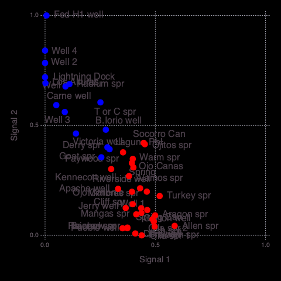
    


    
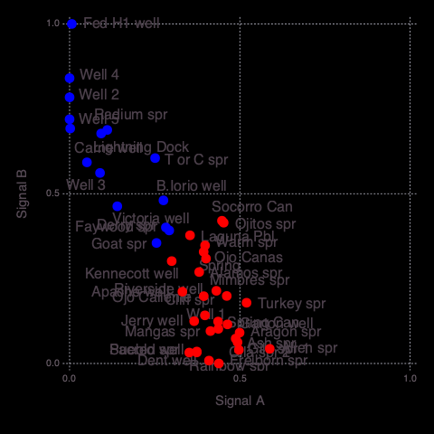
    


    


    11×2 Array{Any,2}:
     "Drainage density"            1.0
     "Lithium concentration"       0.801888
     "Crustal thickness"           0.684456
     "Magnetic intensity"          0.581662
     "State map fault density"     0.539332
     "Boron concentration"         0.431691
     "Volcanic dike density"       0.334325
     "Heat flow"                   0.283606
     "Seismicity"                  0.13724
     "Gravity anomaly"             0.126086
     "Fault intersection density"  0.097643


    7×2 Array{Any,2}:
     "Silica geothermometer"     0.690981
     "Quaternary fault density"  0.664186
     "Depth to basement"         0.61722
     "Volcanic vent density"     0.334398
     "Spring density"            0.108699
     "Hydraulic gradient"        0.0811159
     "Precipitation"             0.0


    

    


    ┌ Info: Attributes (signals=2)
    └ @ NMFk /Users/bulbulahmmed/.julia/packages/NMFk/koh08/src/NMFkPostprocess.jl:325
    ┌ Info: Signal A (S1) Count: 11
    └ @ NMFk /Users/bulbulahmmed/.julia/packages/NMFk/koh08/src/NMFkPostprocess.jl:338
    ┌ Info: Signal B (S2) Count: 7
    └ @ NMFk /Users/bulbulahmmed/.julia/packages/NMFk/koh08/src/NMFkPostprocess.jl:338
    ┌ Info: Signal A -> A Count: 11
    └ @ NMFk /Users/bulbulahmmed/.julia/packages/NMFk/koh08/src/NMFkPostprocess.jl:348
    ┌ Info: Signal B -> B Count: 7
    └ @ NMFk /Users/bulbulahmmed/.julia/packages/NMFk/koh08/src/NMFkPostprocess.jl:348
    ┌ Info: Signal A (remapped k-means clustering)
    └ @ NMFk /Users/bulbulahmmed/.julia/packages/NMFk/koh08/src/NMFkPostprocess.jl:363
    ┌ Info: Signal B (remapped k-means clustering)
    └ @ NMFk /Users/bulbulahmmed/.julia/packages/NMFk/koh08/src/NMFkPostprocess.jl:363


    

    


    


<?xml version="1.0" encoding="UTF-8"?>
<svg xmlns="http://www.w3.org/2000/svg"
     xmlns:xlink="http://www.w3.org/1999/xlink"
     xmlns:gadfly="http://www.gadflyjl.org/ns"
     version="1.2"
     width="141.42mm" height="100mm" viewBox="0 0 141.42 100"
     stroke="none"
     fill="#000000"
     stroke-width="0.3"
     font-size="3.88"

     id="img-525a7d68">
<defs>
  <marker id="arrow" markerWidth="15" markerHeight="7" refX="5" refY="3.5" orient="auto" markerUnits="strokeWidth">
    <path d="M0,0 L15,3.5 L0,7 z" stroke="context-stroke" fill="context-stroke"/>
  </marker>
</defs>
<g class="plotroot" id="img-525a7d68-1">
  <g class="guide xlabels" font-size="2.82" font-family="'PT Sans Caption','Helvetica Neue','Helvetica',sans-serif" fill="#6C606B" id="img-525a7d68-2">
    <g transform="translate(82.24,94)" gadfly:scale="1.0" visibility="visible">
      <g class="primitive">
        <text text-anchor="middle" dy="-0em">A</text>
      </g>
    </g>
    <g transform="translate(86.88,94)" gadfly:scale="1.0" visibility="visible">
      <g class="primitive">
        <text text-anchor="middle" dy="-0em">B</text>
      </g>
    </g>
  </g>
  <g stroke-width="0.11" stroke="#FFFFFF" id="img-525a7d68-3">
    <g transform="translate(91.4,77.06)">
      <path fill="none" d="M-1.14,2.32 L1.14,2.32 1.14,-2.32 -1.14,-2.32 " class="primitive"/>
    </g>
    <g transform="translate(91.4,26.05)">
      <path fill="none" d="M-1.14,2.32 L1.14,2.32 1.14,-2.32 -1.14,-2.32 " class="primitive"/>
    </g>
    <g transform="translate(91.4,63.15)">
      <path fill="none" d="M-1.14,2.32 L1.14,2.32 1.14,-2.32 -1.14,-2.32 " class="primitive"/>
    </g>
    <g transform="translate(91.4,39.96)">
      <path fill="none" d="M-1.14,2.32 L1.14,2.32 1.14,-2.32 -1.14,-2.32 " class="primitive"/>
    </g>
    <g transform="translate(91.4,86.34)">
      <path fill="none" d="M-1.14,2.32 L1.14,2.32 1.14,-2.32 -1.14,-2.32 " class="primitive"/>
    </g>
    <g transform="translate(93.12,66.63)">
      <path fill="none" d="M-2.86,3.48 L1.72,3.48 1.72,-3.48 -0.57,-3.48 " class="primitive"/>
    </g>
    <g transform="translate(91.4,53.87)">
      <path fill="none" d="M-1.14,2.32 L1.14,2.32 1.14,-2.32 -1.14,-2.32 " class="primitive"/>
    </g>
    <g transform="translate(91.4,12.14)">
      <path fill="none" d="M-1.14,2.32 L1.14,2.32 1.14,-2.32 -1.14,-2.32 " class="primitive"/>
    </g>
    <g transform="translate(93.12,29.53)">
      <path fill="none" d="M-2.86,3.48 L1.72,3.48 1.72,-3.48 -0.57,-3.48 " class="primitive"/>
    </g>
    <g transform="translate(93.12,43.44)">
      <path fill="none" d="M-2.86,3.48 L1.72,3.48 1.72,-3.48 -0.57,-3.48 " class="primitive"/>
    </g>
    <g transform="translate(95.4,71.84)">
      <path fill="none" d="M-2.86,5.22 L1.72,5.22 1.72,-5.22 -0.57,-5.22 " class="primitive"/>
    </g>
    <g transform="translate(93.12,15.62)">
      <path fill="none" d="M-2.86,3.48 L1.72,3.48 1.72,-3.48 -0.57,-3.48 " class="primitive"/>
    </g>
    <g transform="translate(95.4,48.66)">
      <path fill="none" d="M-2.86,5.22 L1.72,5.22 1.72,-5.22 -0.57,-5.22 " class="primitive"/>
    </g>
    <g transform="translate(97.12,79.09)">
      <path fill="none" d="M-4.58,7.25 L2.29,7.25 2.29,-7.25 0,-7.25 " class="primitive"/>
    </g>
    <g transform="translate(95.98,22.57)">
      <path fill="none" d="M-1.14,6.96 L1.14,6.96 1.14,-6.96 -1.14,-6.96 " class="primitive"/>
    </g>
    <g transform="translate(98.26,35.61)">
      <path fill="none" d="M-1.14,13.04 L1.14,13.04 1.14,-13.04 -1.14,-13.04 " class="primitive"/>
    </g>
    <g transform="translate(100.55,57.35)">
      <path fill="none" d="M-1.14,21.74 L1.14,21.74 1.14,-21.74 -1.14,-21.74 " class="primitive"/>
    </g>
  </g>
  <g clip-path="url(#img-525a7d68-4)">
    <g id="img-525a7d68-5">
      <g pointer-events="visible" stroke-width="0.3" fill="#000000" fill-opacity="0.000" stroke="#000000" stroke-opacity="0.000" class="guide background" id="img-525a7d68-6">
        <g transform="translate(84.56,49.24)" id="img-525a7d68-7">
          <path d="M-4.64,-41.74 L4.64,-41.74 4.64,41.74 -4.64,41.74  z" class="primitive"/>
        </g>
      </g>
      <g class="guide ygridlines xfixed" stroke-dasharray="0.5,0.5" stroke-width="0.2" stroke="#D0D0E0" id="img-525a7d68-8">
        <g transform="translate(84.56,12.14)" id="img-525a7d68-9" visibility="visible" gadfly:scale="1.0">
          <path fill="none" d="M-4.64,0 L4.64,0 " class="primitive"/>
        </g>
        <g transform="translate(84.56,16.77)" id="img-525a7d68-10" visibility="visible" gadfly:scale="1.0">
          <path fill="none" d="M-4.64,0 L4.64,0 " class="primitive"/>
        </g>
        <g transform="translate(84.56,21.41)" id="img-525a7d68-11" visibility="visible" gadfly:scale="1.0">
          <path fill="none" d="M-4.64,0 L4.64,0 " class="primitive"/>
        </g>
        <g transform="translate(84.56,26.05)" id="img-525a7d68-12" visibility="visible" gadfly:scale="1.0">
          <path fill="none" d="M-4.64,0 L4.64,0 " class="primitive"/>
        </g>
        <g transform="translate(84.56,30.69)" id="img-525a7d68-13" visibility="visible" gadfly:scale="1.0">
          <path fill="none" d="M-4.64,0 L4.64,0 " class="primitive"/>
        </g>
        <g transform="translate(84.56,35.32)" id="img-525a7d68-14" visibility="visible" gadfly:scale="1.0">
          <path fill="none" d="M-4.64,0 L4.64,0 " class="primitive"/>
        </g>
        <g transform="translate(84.56,39.96)" id="img-525a7d68-15" visibility="visible" gadfly:scale="1.0">
          <path fill="none" d="M-4.64,0 L4.64,0 " class="primitive"/>
        </g>
        <g transform="translate(84.56,44.6)" id="img-525a7d68-16" visibility="visible" gadfly:scale="1.0">
          <path fill="none" d="M-4.64,0 L4.64,0 " class="primitive"/>
        </g>
        <g transform="translate(84.56,49.24)" id="img-525a7d68-17" visibility="visible" gadfly:scale="1.0">
          <path fill="none" d="M-4.64,0 L4.64,0 " class="primitive"/>
        </g>
        <g transform="translate(84.56,53.87)" id="img-525a7d68-18" visibility="visible" gadfly:scale="1.0">
          <path fill="none" d="M-4.64,0 L4.64,0 " class="primitive"/>
        </g>
        <g transform="translate(84.56,58.51)" id="img-525a7d68-19" visibility="visible" gadfly:scale="1.0">
          <path fill="none" d="M-4.64,0 L4.64,0 " class="primitive"/>
        </g>
        <g transform="translate(84.56,63.15)" id="img-525a7d68-20" visibility="visible" gadfly:scale="1.0">
          <path fill="none" d="M-4.64,0 L4.64,0 " class="primitive"/>
        </g>
        <g transform="translate(84.56,67.79)" id="img-525a7d68-21" visibility="visible" gadfly:scale="1.0">
          <path fill="none" d="M-4.64,0 L4.64,0 " class="primitive"/>
        </g>
        <g transform="translate(84.56,72.42)" id="img-525a7d68-22" visibility="visible" gadfly:scale="1.0">
          <path fill="none" d="M-4.64,0 L4.64,0 " class="primitive"/>
        </g>
        <g transform="translate(84.56,77.06)" id="img-525a7d68-23" visibility="visible" gadfly:scale="1.0">
          <path fill="none" d="M-4.64,0 L4.64,0 " class="primitive"/>
        </g>
        <g transform="translate(84.56,81.7)" id="img-525a7d68-24" visibility="visible" gadfly:scale="1.0">
          <path fill="none" d="M-4.64,0 L4.64,0 " class="primitive"/>
        </g>
        <g transform="translate(84.56,86.34)" id="img-525a7d68-25" visibility="visible" gadfly:scale="1.0">
          <path fill="none" d="M-4.64,0 L4.64,0 " class="primitive"/>
        </g>
      </g>
      <g class="guide xgridlines yfixed" stroke-dasharray="0.5,0.5" stroke-width="0.2" stroke="#D0D0E0" visibility="visible" id="img-525a7d68-26">
        <g transform="translate(84.56,49.24)" id="img-525a7d68-27" gadfly:scale="1.0">
          <path fill="none" d="M0,-41.74 L0,41.74 " class="primitive"/>
        </g>
      </g>
      <g class="plotpanel" id="img-525a7d68-28">
        <metadata>
          <boundingbox value="79.9220042845016mm 7.5mm 9.274843870563272mm 83.47359483506945mm"/>
          <unitbox value="0.5 0.5 2.0 18.0"/>
        </metadata>
        <g shape-rendering="crispEdges" class="geometry" stroke="#000000" stroke-opacity="0.000" id="img-525a7d68-29">
          <g transform="translate(82.27,9.84)" id="img-525a7d68-30" fill="#E1ED00" fill-opacity="1">
            <path d="M-2.34,-2.34 L2.34,-2.34 2.34,2.34 -2.34,2.34  z" class="primitive"/>
          </g>
          <g transform="translate(82.27,14.48)" id="img-525a7d68-31" fill="#59A000" fill-opacity="1">
            <path d="M-2.34,-2.34 L2.34,-2.34 2.34,2.34 -2.34,2.34  z" class="primitive"/>
          </g>
          <g transform="translate(82.27,19.12)" id="img-525a7d68-32" fill="#FFE100" fill-opacity="1">
            <path d="M-2.34,-2.34 L2.34,-2.34 2.34,2.34 -2.34,2.34  z" class="primitive"/>
          </g>
          <g transform="translate(82.27,23.76)" id="img-525a7d68-33" fill="#B6D400" fill-opacity="1">
            <path d="M-2.34,-2.34 L2.34,-2.34 2.34,2.34 -2.34,2.34  z" class="primitive"/>
          </g>
          <g transform="translate(82.27,28.39)" id="img-525a7d68-34" fill="#FF0000" fill-opacity="1">
            <path d="M-2.34,-2.34 L2.34,-2.34 2.34,2.34 -2.34,2.34  z" class="primitive"/>
          </g>
          <g transform="translate(82.27,33.03)" id="img-525a7d68-35" fill="#4B9800" fill-opacity="1">
            <path d="M-2.34,-2.34 L2.34,-2.34 2.34,2.34 -2.34,2.34  z" class="primitive"/>
          </g>
          <g transform="translate(82.27,37.67)" id="img-525a7d68-36" fill="#5EA200" fill-opacity="1">
            <path d="M-2.34,-2.34 L2.34,-2.34 2.34,2.34 -2.34,2.34  z" class="primitive"/>
          </g>
          <g transform="translate(82.27,42.31)" id="img-525a7d68-37" fill="#FFF100" fill-opacity="1">
            <path d="M-2.34,-2.34 L2.34,-2.34 2.34,2.34 -2.34,2.34  z" class="primitive"/>
          </g>
          <g transform="translate(82.27,46.94)" id="img-525a7d68-38" fill="#FF8C00" fill-opacity="1">
            <path d="M-2.34,-2.34 L2.34,-2.34 2.34,2.34 -2.34,2.34  z" class="primitive"/>
          </g>
          <g transform="translate(82.27,51.58)" id="img-525a7d68-39" fill="#A0C700" fill-opacity="1">
            <path d="M-2.34,-2.34 L2.34,-2.34 2.34,2.34 -2.34,2.34  z" class="primitive"/>
          </g>
          <g transform="translate(82.27,56.22)" id="img-525a7d68-40" fill="#FFBB00" fill-opacity="1">
            <path d="M-2.34,-2.34 L2.34,-2.34 2.34,2.34 -2.34,2.34  z" class="primitive"/>
          </g>
          <g transform="translate(82.27,60.86)" id="img-525a7d68-41" fill="#008000" fill-opacity="1">
            <path d="M-2.34,-2.34 L2.34,-2.34 2.34,2.34 -2.34,2.34  z" class="primitive"/>
          </g>
          <g transform="translate(82.27,65.49)" id="img-525a7d68-42" fill="#BBD800" fill-opacity="1">
            <path d="M-2.34,-2.34 L2.34,-2.34 2.34,2.34 -2.34,2.34  z" class="primitive"/>
          </g>
          <g transform="translate(82.27,70.13)" id="img-525a7d68-43" fill="#459500" fill-opacity="1">
            <path d="M-2.34,-2.34 L2.34,-2.34 2.34,2.34 -2.34,2.34  z" class="primitive"/>
          </g>
          <g transform="translate(82.27,74.77)" id="img-525a7d68-44" fill="#FFD200" fill-opacity="1">
            <path d="M-2.34,-2.34 L2.34,-2.34 2.34,2.34 -2.34,2.34  z" class="primitive"/>
          </g>
          <g transform="translate(82.27,79.41)" id="img-525a7d68-45" fill="#B4D300" fill-opacity="1">
            <path d="M-2.34,-2.34 L2.34,-2.34 2.34,2.34 -2.34,2.34  z" class="primitive"/>
          </g>
          <g transform="translate(82.27,84.04)" id="img-525a7d68-46" fill="#F7FA00" fill-opacity="1">
            <path d="M-2.34,-2.34 L2.34,-2.34 2.34,2.34 -2.34,2.34  z" class="primitive"/>
          </g>
          <g transform="translate(82.27,88.68)" id="img-525a7d68-47" fill="#148300" fill-opacity="1">
            <path d="M-2.34,-2.34 L2.34,-2.34 2.34,2.34 -2.34,2.34  z" class="primitive"/>
          </g>
          <g transform="translate(86.9,9.84)" id="img-525a7d68-48" fill="#FFE900" fill-opacity="1">
            <path d="M-2.34,-2.34 L2.34,-2.34 2.34,2.34 -2.34,2.34  z" class="primitive"/>
          </g>
          <g transform="translate(86.9,14.48)" id="img-525a7d68-49" fill="#FF0000" fill-opacity="1">
            <path d="M-2.34,-2.34 L2.34,-2.34 2.34,2.34 -2.34,2.34  z" class="primitive"/>
          </g>
          <g transform="translate(86.9,19.12)" id="img-525a7d68-50" fill="#FAFC00" fill-opacity="1">
            <path d="M-2.34,-2.34 L2.34,-2.34 2.34,2.34 -2.34,2.34  z" class="primitive"/>
          </g>
          <g transform="translate(86.9,23.76)" id="img-525a7d68-51" fill="#2E8B00" fill-opacity="1">
            <path d="M-2.34,-2.34 L2.34,-2.34 2.34,2.34 -2.34,2.34  z" class="primitive"/>
          </g>
          <g transform="translate(86.9,28.39)" id="img-525a7d68-52" fill="#68A800" fill-opacity="1">
            <path d="M-2.34,-2.34 L2.34,-2.34 2.34,2.34 -2.34,2.34  z" class="primitive"/>
          </g>
          <g transform="translate(86.9,33.03)" id="img-525a7d68-53" fill="#A9CD00" fill-opacity="1">
            <path d="M-2.34,-2.34 L2.34,-2.34 2.34,2.34 -2.34,2.34  z" class="primitive"/>
          </g>
          <g transform="translate(86.9,37.67)" id="img-525a7d68-54" fill="#5FA300" fill-opacity="1">
            <path d="M-2.34,-2.34 L2.34,-2.34 2.34,2.34 -2.34,2.34  z" class="primitive"/>
          </g>
          <g transform="translate(86.9,42.31)" id="img-525a7d68-55" fill="#74AF00" fill-opacity="1">
            <path d="M-2.34,-2.34 L2.34,-2.34 2.34,2.34 -2.34,2.34  z" class="primitive"/>
          </g>
          <g transform="translate(86.9,46.94)" id="img-525a7d68-56" fill="#FFBB00" fill-opacity="1">
            <path d="M-2.34,-2.34 L2.34,-2.34 2.34,2.34 -2.34,2.34  z" class="primitive"/>
          </g>
          <g transform="translate(86.9,51.58)" id="img-525a7d68-57" fill="#F3F800" fill-opacity="1">
            <path d="M-2.34,-2.34 L2.34,-2.34 2.34,2.34 -2.34,2.34  z" class="primitive"/>
          </g>
          <g transform="translate(86.9,56.22)" id="img-525a7d68-58" fill="#008000" fill-opacity="1">
            <path d="M-2.34,-2.34 L2.34,-2.34 2.34,2.34 -2.34,2.34  z" class="primitive"/>
          </g>
          <g transform="translate(86.9,60.86)" id="img-525a7d68-59" fill="#FFC300" fill-opacity="1">
            <path d="M-2.34,-2.34 L2.34,-2.34 2.34,2.34 -2.34,2.34  z" class="primitive"/>
          </g>
          <g transform="translate(86.9,65.49)" id="img-525a7d68-60" fill="#509B00" fill-opacity="1">
            <path d="M-2.34,-2.34 L2.34,-2.34 2.34,2.34 -2.34,2.34  z" class="primitive"/>
          </g>
          <g transform="translate(86.9,70.13)" id="img-525a7d68-61" fill="#B6D400" fill-opacity="1">
            <path d="M-2.34,-2.34 L2.34,-2.34 2.34,2.34 -2.34,2.34  z" class="primitive"/>
          </g>
          <g transform="translate(86.9,74.77)" id="img-525a7d68-62" fill="#008000" fill-opacity="1">
            <path d="M-2.34,-2.34 L2.34,-2.34 2.34,2.34 -2.34,2.34  z" class="primitive"/>
          </g>
          <g transform="translate(86.9,79.41)" id="img-525a7d68-63" fill="#FFB800" fill-opacity="1">
            <path d="M-2.34,-2.34 L2.34,-2.34 2.34,2.34 -2.34,2.34  z" class="primitive"/>
          </g>
          <g transform="translate(86.9,84.04)" id="img-525a7d68-64" fill="#439400" fill-opacity="1">
            <path d="M-2.34,-2.34 L2.34,-2.34 2.34,2.34 -2.34,2.34  z" class="primitive"/>
          </g>
          <g transform="translate(86.9,88.68)" id="img-525a7d68-65" fill="#FFD400" fill-opacity="1">
            <path d="M-2.34,-2.34 L2.34,-2.34 2.34,2.34 -2.34,2.34  z" class="primitive"/>
          </g>
        </g>
      </g>
      <g fill-opacity="0" class="guide crosshair" id="img-525a7d68-66">
        <g class="text_box" fill="#000000" id="img-525a7d68-67">
          <g transform="translate(82.14,8.03)" id="img-525a7d68-68">
            <g class="primitive">
              <text text-anchor="end" dy="0.6em"></text>
            </g>
          </g>
        </g>
      </g>
      <g fill-opacity="0" class="guide helpscreen" id="img-525a7d68-69">
        <g class="text_box" id="img-525a7d68-70">
          <g fill="#000000" id="img-525a7d68-71">
            <g transform="translate(84.56,49.24)" id="img-525a7d68-72">
              <path d="M-27.18,-9.82 L27.18,-9.82 27.18,9.82 -27.18,9.82  z" class="primitive"/>
            </g>
          </g>
          <g fill="#FFFF74" font-size="3.88" font-family="'PT Sans','Helvetica Neue','Helvetica',sans-serif" id="img-525a7d68-73">
            <g transform="translate(84.56,42.1)" id="img-525a7d68-74">
              <g class="primitive">
                <text text-anchor="middle" dy="0.35em">h,j,k,l,arrows,drag to pan</text>
              </g>
            </g>
            <g transform="translate(84.56,45.67)" id="img-525a7d68-75">
              <g class="primitive">
                <text text-anchor="middle" dy="0.35em">i,o,+,-,scroll,shift-drag to zoom</text>
              </g>
            </g>
            <g transform="translate(84.56,49.24)" id="img-525a7d68-76">
              <g class="primitive">
                <text text-anchor="middle" dy="0.35em">r,dbl-click to reset</text>
              </g>
            </g>
            <g transform="translate(84.56,52.81)" id="img-525a7d68-77">
              <g class="primitive">
                <text text-anchor="middle" dy="0.35em">c for coordinates</text>
              </g>
            </g>
            <g transform="translate(84.56,56.38)" id="img-525a7d68-78">
              <g class="primitive">
                <text text-anchor="middle" dy="0.35em">? for help</text>
              </g>
            </g>
          </g>
        </g>
      </g>
      <g fill-opacity="0" class="guide questionmark" id="img-525a7d68-79">
        <g class="text_box" fill="#000000" id="img-525a7d68-80">
          <g transform="translate(89.2,8.03)" id="img-525a7d68-81">
            <g class="primitive">
              <text text-anchor="end" dy="0.6em">?</text>
            </g>
          </g>
        </g>
      </g>
    </g>
  </g>
  <g class="guide ylabels" font-size="2.82" font-family="'PT Sans Caption','Helvetica Neue','Helvetica',sans-serif" fill="#6C606B" id="img-525a7d68-82">
    <g transform="translate(78.92,9.82)" id="img-525a7d68-83" visibility="visible" gadfly:scale="1.0">
      <g class="primitive">
        <text text-anchor="end" dy="0.35em">Boron concentration A</text>
      </g>
    </g>
    <g transform="translate(78.92,14.46)" id="img-525a7d68-84" visibility="visible" gadfly:scale="1.0">
      <g class="primitive">
        <text text-anchor="end" dy="0.35em">Gravity anomaly A</text>
      </g>
    </g>
    <g transform="translate(78.92,19.09)" id="img-525a7d68-85" visibility="visible" gadfly:scale="1.0">
      <g class="primitive">
        <text text-anchor="end" dy="0.35em">Magnetic intensity A</text>
      </g>
    </g>
    <g transform="translate(78.92,23.73)" id="img-525a7d68-86" visibility="visible" gadfly:scale="1.0">
      <g class="primitive">
        <text text-anchor="end" dy="0.35em">Volcanic dike density A</text>
      </g>
    </g>
    <g transform="translate(78.92,28.37)" id="img-525a7d68-87" visibility="visible" gadfly:scale="1.0">
      <g class="primitive">
        <text text-anchor="end" dy="0.35em">Drainage density A</text>
      </g>
    </g>
    <g transform="translate(78.92,33.01)" id="img-525a7d68-88" visibility="visible" gadfly:scale="1.0">
      <g class="primitive">
        <text text-anchor="end" dy="0.35em">Fault intersection density A</text>
      </g>
    </g>
    <g transform="translate(78.92,37.64)" id="img-525a7d68-89" visibility="visible" gadfly:scale="1.0">
      <g class="primitive">
        <text text-anchor="end" dy="0.35em">Seismicity A</text>
      </g>
    </g>
    <g transform="translate(78.92,42.28)" id="img-525a7d68-90" visibility="visible" gadfly:scale="1.0">
      <g class="primitive">
        <text text-anchor="end" dy="0.35em">State map fault density A</text>
      </g>
    </g>
    <g transform="translate(78.92,46.92)" id="img-525a7d68-91" visibility="visible" gadfly:scale="1.0">
      <g class="primitive">
        <text text-anchor="end" dy="0.35em">Lithium concentration A</text>
      </g>
    </g>
    <g transform="translate(78.92,51.56)" id="img-525a7d68-92" visibility="visible" gadfly:scale="1.0">
      <g class="primitive">
        <text text-anchor="end" dy="0.35em">Heat flow A</text>
      </g>
    </g>
    <g transform="translate(78.92,56.19)" id="img-525a7d68-93" visibility="visible" gadfly:scale="1.0">
      <g class="primitive">
        <text text-anchor="end" dy="0.35em">Crustal thickness A</text>
      </g>
    </g>
    <g transform="translate(78.92,60.83)" id="img-525a7d68-94" visibility="visible" gadfly:scale="1.0">
      <g class="primitive">
        <text text-anchor="end" dy="0.35em">Quaternary fault density B</text>
      </g>
    </g>
    <g transform="translate(78.92,65.47)" id="img-525a7d68-95" visibility="visible" gadfly:scale="1.0">
      <g class="primitive">
        <text text-anchor="end" dy="0.35em">Spring density B</text>
      </g>
    </g>
    <g transform="translate(78.92,70.11)" id="img-525a7d68-96" visibility="visible" gadfly:scale="1.0">
      <g class="primitive">
        <text text-anchor="end" dy="0.35em">Volcanic vent density B</text>
      </g>
    </g>
    <g transform="translate(78.92,74.74)" id="img-525a7d68-97" visibility="visible" gadfly:scale="1.0">
      <g class="primitive">
        <text text-anchor="end" dy="0.35em">Precipitation B</text>
      </g>
    </g>
    <g transform="translate(78.92,79.38)" id="img-525a7d68-98" visibility="visible" gadfly:scale="1.0">
      <g class="primitive">
        <text text-anchor="end" dy="0.35em">Silica geothermometer B</text>
      </g>
    </g>
    <g transform="translate(78.92,84.02)" id="img-525a7d68-99" visibility="visible" gadfly:scale="1.0">
      <g class="primitive">
        <text text-anchor="end" dy="0.35em">Hydraulic gradient B</text>
      </g>
    </g>
    <g transform="translate(78.92,88.65)" id="img-525a7d68-100" visibility="visible" gadfly:scale="1.0">
      <g class="primitive">
        <text text-anchor="end" dy="0.35em">Depth to basement B</text>
      </g>
    </g>
  </g>
  <g stroke-width="0.11" stroke="#FFFFFF" id="img-525a7d68-101">
    <g transform="translate(84.56,5.72)" id="img-525a7d68-102">
      <path fill="none" d="M-2.32,0.72 L-2.32,-0.72 2.32,-0.72 2.32,0.72 " class="primitive"/>
    </g>
  </g>
</g>
<defs>
  <clipPath id="img-525a7d68-4">
    <path d="M79.92,7.5 L89.2,7.5 89.2,90.97 79.92,90.97 " />
  </clipPath>
</defs>
<script> <![CDATA[
(function(N){var k=/[\.\/]/,L=/\s*,\s*/,C=function(a,d){return a-d},a,v,y={n:{}},M=function(){for(var a=0,d=this.length;a<d;a++)if("undefined"!=typeof this[a])return this[a]},A=function(){for(var a=this.length;--a;)if("undefined"!=typeof this[a])return this[a]},w=function(k,d){k=String(k);var f=v,n=Array.prototype.slice.call(arguments,2),u=w.listeners(k),p=0,b,q=[],e={},l=[],r=a;l.firstDefined=M;l.lastDefined=A;a=k;for(var s=v=0,x=u.length;s<x;s++)"zIndex"in u[s]&&(q.push(u[s].zIndex),0>u[s].zIndex&&
(e[u[s].zIndex]=u[s]));for(q.sort(C);0>q[p];)if(b=e[q[p++] ],l.push(b.apply(d,n)),v)return v=f,l;for(s=0;s<x;s++)if(b=u[s],"zIndex"in b)if(b.zIndex==q[p]){l.push(b.apply(d,n));if(v)break;do if(p++,(b=e[q[p] ])&&l.push(b.apply(d,n)),v)break;while(b)}else e[b.zIndex]=b;else if(l.push(b.apply(d,n)),v)break;v=f;a=r;return l};w._events=y;w.listeners=function(a){a=a.split(k);var d=y,f,n,u,p,b,q,e,l=[d],r=[];u=0;for(p=a.length;u<p;u++){e=[];b=0;for(q=l.length;b<q;b++)for(d=l[b].n,f=[d[a[u] ],d["*"] ],n=2;n--;)if(d=
f[n])e.push(d),r=r.concat(d.f||[]);l=e}return r};w.on=function(a,d){a=String(a);if("function"!=typeof d)return function(){};for(var f=a.split(L),n=0,u=f.length;n<u;n++)(function(a){a=a.split(k);for(var b=y,f,e=0,l=a.length;e<l;e++)b=b.n,b=b.hasOwnProperty(a[e])&&b[a[e] ]||(b[a[e] ]={n:{}});b.f=b.f||[];e=0;for(l=b.f.length;e<l;e++)if(b.f[e]==d){f=!0;break}!f&&b.f.push(d)})(f[n]);return function(a){+a==+a&&(d.zIndex=+a)}};w.f=function(a){var d=[].slice.call(arguments,1);return function(){w.apply(null,
[a,null].concat(d).concat([].slice.call(arguments,0)))}};w.stop=function(){v=1};w.nt=function(k){return k?(new RegExp("(?:\\.|\\/|^)"+k+"(?:\\.|\\/|$)")).test(a):a};w.nts=function(){return a.split(k)};w.off=w.unbind=function(a,d){if(a){var f=a.split(L);if(1<f.length)for(var n=0,u=f.length;n<u;n++)w.off(f[n],d);else{for(var f=a.split(k),p,b,q,e,l=[y],n=0,u=f.length;n<u;n++)for(e=0;e<l.length;e+=q.length-2){q=[e,1];p=l[e].n;if("*"!=f[n])p[f[n] ]&&q.push(p[f[n] ]);else for(b in p)p.hasOwnProperty(b)&&
q.push(p[b]);l.splice.apply(l,q)}n=0;for(u=l.length;n<u;n++)for(p=l[n];p.n;){if(d){if(p.f){e=0;for(f=p.f.length;e<f;e++)if(p.f[e]==d){p.f.splice(e,1);break}!p.f.length&&delete p.f}for(b in p.n)if(p.n.hasOwnProperty(b)&&p.n[b].f){q=p.n[b].f;e=0;for(f=q.length;e<f;e++)if(q[e]==d){q.splice(e,1);break}!q.length&&delete p.n[b].f}}else for(b in delete p.f,p.n)p.n.hasOwnProperty(b)&&p.n[b].f&&delete p.n[b].f;p=p.n}}}else w._events=y={n:{}}};w.once=function(a,d){var f=function(){w.unbind(a,f);return d.apply(this,
arguments)};return w.on(a,f)};w.version="0.4.2";w.toString=function(){return"You are running Eve 0.4.2"};"undefined"!=typeof module&&module.exports?module.exports=w:"function"===typeof define&&define.amd?define("eve",[],function(){return w}):N.eve=w})(this);
(function(N,k){"function"===typeof define&&define.amd?define("Snap.svg",["eve"],function(L){return k(N,L)}):k(N,N.eve)})(this,function(N,k){var L=function(a){var k={},y=N.requestAnimationFrame||N.webkitRequestAnimationFrame||N.mozRequestAnimationFrame||N.oRequestAnimationFrame||N.msRequestAnimationFrame||function(a){setTimeout(a,16)},M=Array.isArray||function(a){return a instanceof Array||"[object Array]"==Object.prototype.toString.call(a)},A=0,w="M"+(+new Date).toString(36),z=function(a){if(null==
a)return this.s;var b=this.s-a;this.b+=this.dur*b;this.B+=this.dur*b;this.s=a},d=function(a){if(null==a)return this.spd;this.spd=a},f=function(a){if(null==a)return this.dur;this.s=this.s*a/this.dur;this.dur=a},n=function(){delete k[this.id];this.update();a("mina.stop."+this.id,this)},u=function(){this.pdif||(delete k[this.id],this.update(),this.pdif=this.get()-this.b)},p=function(){this.pdif&&(this.b=this.get()-this.pdif,delete this.pdif,k[this.id]=this)},b=function(){var a;if(M(this.start)){a=[];
for(var b=0,e=this.start.length;b<e;b++)a[b]=+this.start[b]+(this.end[b]-this.start[b])*this.easing(this.s)}else a=+this.start+(this.end-this.start)*this.easing(this.s);this.set(a)},q=function(){var l=0,b;for(b in k)if(k.hasOwnProperty(b)){var e=k[b],f=e.get();l++;e.s=(f-e.b)/(e.dur/e.spd);1<=e.s&&(delete k[b],e.s=1,l--,function(b){setTimeout(function(){a("mina.finish."+b.id,b)})}(e));e.update()}l&&y(q)},e=function(a,r,s,x,G,h,J){a={id:w+(A++).toString(36),start:a,end:r,b:s,s:0,dur:x-s,spd:1,get:G,
set:h,easing:J||e.linear,status:z,speed:d,duration:f,stop:n,pause:u,resume:p,update:b};k[a.id]=a;r=0;for(var K in k)if(k.hasOwnProperty(K)&&(r++,2==r))break;1==r&&y(q);return a};e.time=Date.now||function(){return+new Date};e.getById=function(a){return k[a]||null};e.linear=function(a){return a};e.easeout=function(a){return Math.pow(a,1.7)};e.easein=function(a){return Math.pow(a,0.48)};e.easeinout=function(a){if(1==a)return 1;if(0==a)return 0;var b=0.48-a/1.04,e=Math.sqrt(0.1734+b*b);a=e-b;a=Math.pow(Math.abs(a),
1/3)*(0>a?-1:1);b=-e-b;b=Math.pow(Math.abs(b),1/3)*(0>b?-1:1);a=a+b+0.5;return 3*(1-a)*a*a+a*a*a};e.backin=function(a){return 1==a?1:a*a*(2.70158*a-1.70158)};e.backout=function(a){if(0==a)return 0;a-=1;return a*a*(2.70158*a+1.70158)+1};e.elastic=function(a){return a==!!a?a:Math.pow(2,-10*a)*Math.sin(2*(a-0.075)*Math.PI/0.3)+1};e.bounce=function(a){a<1/2.75?a*=7.5625*a:a<2/2.75?(a-=1.5/2.75,a=7.5625*a*a+0.75):a<2.5/2.75?(a-=2.25/2.75,a=7.5625*a*a+0.9375):(a-=2.625/2.75,a=7.5625*a*a+0.984375);return a};
return N.mina=e}("undefined"==typeof k?function(){}:k),C=function(){function a(c,t){if(c){if(c.tagName)return x(c);if(y(c,"array")&&a.set)return a.set.apply(a,c);if(c instanceof e)return c;if(null==t)return c=G.doc.querySelector(c),x(c)}return new s(null==c?"100%":c,null==t?"100%":t)}function v(c,a){if(a){"#text"==c&&(c=G.doc.createTextNode(a.text||""));"string"==typeof c&&(c=v(c));if("string"==typeof a)return"xlink:"==a.substring(0,6)?c.getAttributeNS(m,a.substring(6)):"xml:"==a.substring(0,4)?c.getAttributeNS(la,
a.substring(4)):c.getAttribute(a);for(var da in a)if(a[h](da)){var b=J(a[da]);b?"xlink:"==da.substring(0,6)?c.setAttributeNS(m,da.substring(6),b):"xml:"==da.substring(0,4)?c.setAttributeNS(la,da.substring(4),b):c.setAttribute(da,b):c.removeAttribute(da)}}else c=G.doc.createElementNS(la,c);return c}function y(c,a){a=J.prototype.toLowerCase.call(a);return"finite"==a?isFinite(c):"array"==a&&(c instanceof Array||Array.isArray&&Array.isArray(c))?!0:"null"==a&&null===c||a==typeof c&&null!==c||"object"==
a&&c===Object(c)||$.call(c).slice(8,-1).toLowerCase()==a}function M(c){if("function"==typeof c||Object(c)!==c)return c;var a=new c.constructor,b;for(b in c)c[h](b)&&(a[b]=M(c[b]));return a}function A(c,a,b){function m(){var e=Array.prototype.slice.call(arguments,0),f=e.join("\u2400"),d=m.cache=m.cache||{},l=m.count=m.count||[];if(d[h](f)){a:for(var e=l,l=f,B=0,H=e.length;B<H;B++)if(e[B]===l){e.push(e.splice(B,1)[0]);break a}return b?b(d[f]):d[f]}1E3<=l.length&&delete d[l.shift()];l.push(f);d[f]=c.apply(a,
e);return b?b(d[f]):d[f]}return m}function w(c,a,b,m,e,f){return null==e?(c-=b,a-=m,c||a?(180*I.atan2(-a,-c)/C+540)%360:0):w(c,a,e,f)-w(b,m,e,f)}function z(c){return c%360*C/180}function d(c){var a=[];c=c.replace(/(?:^|\s)(\w+)\(([^)]+)\)/g,function(c,b,m){m=m.split(/\s*,\s*|\s+/);"rotate"==b&&1==m.length&&m.push(0,0);"scale"==b&&(2<m.length?m=m.slice(0,2):2==m.length&&m.push(0,0),1==m.length&&m.push(m[0],0,0));"skewX"==b?a.push(["m",1,0,I.tan(z(m[0])),1,0,0]):"skewY"==b?a.push(["m",1,I.tan(z(m[0])),
0,1,0,0]):a.push([b.charAt(0)].concat(m));return c});return a}function f(c,t){var b=O(c),m=new a.Matrix;if(b)for(var e=0,f=b.length;e<f;e++){var h=b[e],d=h.length,B=J(h[0]).toLowerCase(),H=h[0]!=B,l=H?m.invert():0,E;"t"==B&&2==d?m.translate(h[1],0):"t"==B&&3==d?H?(d=l.x(0,0),B=l.y(0,0),H=l.x(h[1],h[2]),l=l.y(h[1],h[2]),m.translate(H-d,l-B)):m.translate(h[1],h[2]):"r"==B?2==d?(E=E||t,m.rotate(h[1],E.x+E.width/2,E.y+E.height/2)):4==d&&(H?(H=l.x(h[2],h[3]),l=l.y(h[2],h[3]),m.rotate(h[1],H,l)):m.rotate(h[1],
h[2],h[3])):"s"==B?2==d||3==d?(E=E||t,m.scale(h[1],h[d-1],E.x+E.width/2,E.y+E.height/2)):4==d?H?(H=l.x(h[2],h[3]),l=l.y(h[2],h[3]),m.scale(h[1],h[1],H,l)):m.scale(h[1],h[1],h[2],h[3]):5==d&&(H?(H=l.x(h[3],h[4]),l=l.y(h[3],h[4]),m.scale(h[1],h[2],H,l)):m.scale(h[1],h[2],h[3],h[4])):"m"==B&&7==d&&m.add(h[1],h[2],h[3],h[4],h[5],h[6])}return m}function n(c,t){if(null==t){var m=!0;t="linearGradient"==c.type||"radialGradient"==c.type?c.node.getAttribute("gradientTransform"):"pattern"==c.type?c.node.getAttribute("patternTransform"):
c.node.getAttribute("transform");if(!t)return new a.Matrix;t=d(t)}else t=a._.rgTransform.test(t)?J(t).replace(/\.{3}|\u2026/g,c._.transform||aa):d(t),y(t,"array")&&(t=a.path?a.path.toString.call(t):J(t)),c._.transform=t;var b=f(t,c.getBBox(1));if(m)return b;c.matrix=b}function u(c){c=c.node.ownerSVGElement&&x(c.node.ownerSVGElement)||c.node.parentNode&&x(c.node.parentNode)||a.select("svg")||a(0,0);var t=c.select("defs"),t=null==t?!1:t.node;t||(t=r("defs",c.node).node);return t}function p(c){return c.node.ownerSVGElement&&
x(c.node.ownerSVGElement)||a.select("svg")}function b(c,a,m){function b(c){if(null==c)return aa;if(c==+c)return c;v(B,{width:c});try{return B.getBBox().width}catch(a){return 0}}function h(c){if(null==c)return aa;if(c==+c)return c;v(B,{height:c});try{return B.getBBox().height}catch(a){return 0}}function e(b,B){null==a?d[b]=B(c.attr(b)||0):b==a&&(d=B(null==m?c.attr(b)||0:m))}var f=p(c).node,d={},B=f.querySelector(".svg---mgr");B||(B=v("rect"),v(B,{x:-9E9,y:-9E9,width:10,height:10,"class":"svg---mgr",
fill:"none"}),f.appendChild(B));switch(c.type){case "rect":e("rx",b),e("ry",h);case "image":e("width",b),e("height",h);case "text":e("x",b);e("y",h);break;case "circle":e("cx",b);e("cy",h);e("r",b);break;case "ellipse":e("cx",b);e("cy",h);e("rx",b);e("ry",h);break;case "line":e("x1",b);e("x2",b);e("y1",h);e("y2",h);break;case "marker":e("refX",b);e("markerWidth",b);e("refY",h);e("markerHeight",h);break;case "radialGradient":e("fx",b);e("fy",h);break;case "tspan":e("dx",b);e("dy",h);break;default:e(a,
b)}f.removeChild(B);return d}function q(c){y(c,"array")||(c=Array.prototype.slice.call(arguments,0));for(var a=0,b=0,m=this.node;this[a];)delete this[a++];for(a=0;a<c.length;a++)"set"==c[a].type?c[a].forEach(function(c){m.appendChild(c.node)}):m.appendChild(c[a].node);for(var h=m.childNodes,a=0;a<h.length;a++)this[b++]=x(h[a]);return this}function e(c){if(c.snap in E)return E[c.snap];var a=this.id=V(),b;try{b=c.ownerSVGElement}catch(m){}this.node=c;b&&(this.paper=new s(b));this.type=c.tagName;this.anims=
{};this._={transform:[]};c.snap=a;E[a]=this;"g"==this.type&&(this.add=q);if(this.type in{g:1,mask:1,pattern:1})for(var e in s.prototype)s.prototype[h](e)&&(this[e]=s.prototype[e])}function l(c){this.node=c}function r(c,a){var b=v(c);a.appendChild(b);return x(b)}function s(c,a){var b,m,f,d=s.prototype;if(c&&"svg"==c.tagName){if(c.snap in E)return E[c.snap];var l=c.ownerDocument;b=new e(c);m=c.getElementsByTagName("desc")[0];f=c.getElementsByTagName("defs")[0];m||(m=v("desc"),m.appendChild(l.createTextNode("Created with Snap")),
b.node.appendChild(m));f||(f=v("defs"),b.node.appendChild(f));b.defs=f;for(var ca in d)d[h](ca)&&(b[ca]=d[ca]);b.paper=b.root=b}else b=r("svg",G.doc.body),v(b.node,{height:a,version:1.1,width:c,xmlns:la});return b}function x(c){return!c||c instanceof e||c instanceof l?c:c.tagName&&"svg"==c.tagName.toLowerCase()?new s(c):c.tagName&&"object"==c.tagName.toLowerCase()&&"image/svg+xml"==c.type?new s(c.contentDocument.getElementsByTagName("svg")[0]):new e(c)}a.version="0.3.0";a.toString=function(){return"Snap v"+
this.version};a._={};var G={win:N,doc:N.document};a._.glob=G;var h="hasOwnProperty",J=String,K=parseFloat,U=parseInt,I=Math,P=I.max,Q=I.min,Y=I.abs,C=I.PI,aa="",$=Object.prototype.toString,F=/^\s*((#[a-f\d]{6})|(#[a-f\d]{3})|rgba?\(\s*([\d\.]+%?\s*,\s*[\d\.]+%?\s*,\s*[\d\.]+%?(?:\s*,\s*[\d\.]+%?)?)\s*\)|hsba?\(\s*([\d\.]+(?:deg|\xb0|%)?\s*,\s*[\d\.]+%?\s*,\s*[\d\.]+(?:%?\s*,\s*[\d\.]+)?%?)\s*\)|hsla?\(\s*([\d\.]+(?:deg|\xb0|%)?\s*,\s*[\d\.]+%?\s*,\s*[\d\.]+(?:%?\s*,\s*[\d\.]+)?%?)\s*\))\s*$/i;a._.separator=
RegExp("[,\t\n\x0B\f\r \u00a0\u1680\u180e\u2000\u2001\u2002\u2003\u2004\u2005\u2006\u2007\u2008\u2009\u200a\u202f\u205f\u3000\u2028\u2029]+");var S=RegExp("[\t\n\x0B\f\r \u00a0\u1680\u180e\u2000\u2001\u2002\u2003\u2004\u2005\u2006\u2007\u2008\u2009\u200a\u202f\u205f\u3000\u2028\u2029]*,[\t\n\x0B\f\r \u00a0\u1680\u180e\u2000\u2001\u2002\u2003\u2004\u2005\u2006\u2007\u2008\u2009\u200a\u202f\u205f\u3000\u2028\u2029]*"),X={hs:1,rg:1},W=RegExp("([a-z])[\t\n\x0B\f\r \u00a0\u1680\u180e\u2000\u2001\u2002\u2003\u2004\u2005\u2006\u2007\u2008\u2009\u200a\u202f\u205f\u3000\u2028\u2029,]*((-?\\d*\\.?\\d*(?:e[\\-+]?\\d+)?[\t\n\x0B\f\r \u00a0\u1680\u180e\u2000\u2001\u2002\u2003\u2004\u2005\u2006\u2007\u2008\u2009\u200a\u202f\u205f\u3000\u2028\u2029]*,?[\t\n\x0B\f\r \u00a0\u1680\u180e\u2000\u2001\u2002\u2003\u2004\u2005\u2006\u2007\u2008\u2009\u200a\u202f\u205f\u3000\u2028\u2029]*)+)",
"ig"),ma=RegExp("([rstm])[\t\n\x0B\f\r \u00a0\u1680\u180e\u2000\u2001\u2002\u2003\u2004\u2005\u2006\u2007\u2008\u2009\u200a\u202f\u205f\u3000\u2028\u2029,]*((-?\\d*\\.?\\d*(?:e[\\-+]?\\d+)?[\t\n\x0B\f\r \u00a0\u1680\u180e\u2000\u2001\u2002\u2003\u2004\u2005\u2006\u2007\u2008\u2009\u200a\u202f\u205f\u3000\u2028\u2029]*,?[\t\n\x0B\f\r \u00a0\u1680\u180e\u2000\u2001\u2002\u2003\u2004\u2005\u2006\u2007\u2008\u2009\u200a\u202f\u205f\u3000\u2028\u2029]*)+)","ig"),Z=RegExp("(-?\\d*\\.?\\d*(?:e[\\-+]?\\d+)?)[\t\n\x0B\f\r \u00a0\u1680\u180e\u2000\u2001\u2002\u2003\u2004\u2005\u2006\u2007\u2008\u2009\u200a\u202f\u205f\u3000\u2028\u2029]*,?[\t\n\x0B\f\r \u00a0\u1680\u180e\u2000\u2001\u2002\u2003\u2004\u2005\u2006\u2007\u2008\u2009\u200a\u202f\u205f\u3000\u2028\u2029]*",
"ig"),na=0,ba="S"+(+new Date).toString(36),V=function(){return ba+(na++).toString(36)},m="http://www.w3.org/1999/xlink",la="http://www.w3.org/2000/svg",E={},ca=a.url=function(c){return"url('#"+c+"')"};a._.$=v;a._.id=V;a.format=function(){var c=/\{([^\}]+)\}/g,a=/(?:(?:^|\.)(.+?)(?=\[|\.|$|\()|\[('|")(.+?)\2\])(\(\))?/g,b=function(c,b,m){var h=m;b.replace(a,function(c,a,b,m,t){a=a||m;h&&(a in h&&(h=h[a]),"function"==typeof h&&t&&(h=h()))});return h=(null==h||h==m?c:h)+""};return function(a,m){return J(a).replace(c,
function(c,a){return b(c,a,m)})}}();a._.clone=M;a._.cacher=A;a.rad=z;a.deg=function(c){return 180*c/C%360};a.angle=w;a.is=y;a.snapTo=function(c,a,b){b=y(b,"finite")?b:10;if(y(c,"array"))for(var m=c.length;m--;){if(Y(c[m]-a)<=b)return c[m]}else{c=+c;m=a%c;if(m<b)return a-m;if(m>c-b)return a-m+c}return a};a.getRGB=A(function(c){if(!c||(c=J(c)).indexOf("-")+1)return{r:-1,g:-1,b:-1,hex:"none",error:1,toString:ka};if("none"==c)return{r:-1,g:-1,b:-1,hex:"none",toString:ka};!X[h](c.toLowerCase().substring(0,
2))&&"#"!=c.charAt()&&(c=T(c));if(!c)return{r:-1,g:-1,b:-1,hex:"none",error:1,toString:ka};var b,m,e,f,d;if(c=c.match(F)){c[2]&&(e=U(c[2].substring(5),16),m=U(c[2].substring(3,5),16),b=U(c[2].substring(1,3),16));c[3]&&(e=U((d=c[3].charAt(3))+d,16),m=U((d=c[3].charAt(2))+d,16),b=U((d=c[3].charAt(1))+d,16));c[4]&&(d=c[4].split(S),b=K(d[0]),"%"==d[0].slice(-1)&&(b*=2.55),m=K(d[1]),"%"==d[1].slice(-1)&&(m*=2.55),e=K(d[2]),"%"==d[2].slice(-1)&&(e*=2.55),"rgba"==c[1].toLowerCase().slice(0,4)&&(f=K(d[3])),
d[3]&&"%"==d[3].slice(-1)&&(f/=100));if(c[5])return d=c[5].split(S),b=K(d[0]),"%"==d[0].slice(-1)&&(b/=100),m=K(d[1]),"%"==d[1].slice(-1)&&(m/=100),e=K(d[2]),"%"==d[2].slice(-1)&&(e/=100),"deg"!=d[0].slice(-3)&&"\u00b0"!=d[0].slice(-1)||(b/=360),"hsba"==c[1].toLowerCase().slice(0,4)&&(f=K(d[3])),d[3]&&"%"==d[3].slice(-1)&&(f/=100),a.hsb2rgb(b,m,e,f);if(c[6])return d=c[6].split(S),b=K(d[0]),"%"==d[0].slice(-1)&&(b/=100),m=K(d[1]),"%"==d[1].slice(-1)&&(m/=100),e=K(d[2]),"%"==d[2].slice(-1)&&(e/=100),
"deg"!=d[0].slice(-3)&&"\u00b0"!=d[0].slice(-1)||(b/=360),"hsla"==c[1].toLowerCase().slice(0,4)&&(f=K(d[3])),d[3]&&"%"==d[3].slice(-1)&&(f/=100),a.hsl2rgb(b,m,e,f);b=Q(I.round(b),255);m=Q(I.round(m),255);e=Q(I.round(e),255);f=Q(P(f,0),1);c={r:b,g:m,b:e,toString:ka};c.hex="#"+(16777216|e|m<<8|b<<16).toString(16).slice(1);c.opacity=y(f,"finite")?f:1;return c}return{r:-1,g:-1,b:-1,hex:"none",error:1,toString:ka}},a);a.hsb=A(function(c,b,m){return a.hsb2rgb(c,b,m).hex});a.hsl=A(function(c,b,m){return a.hsl2rgb(c,
b,m).hex});a.rgb=A(function(c,a,b,m){if(y(m,"finite")){var e=I.round;return"rgba("+[e(c),e(a),e(b),+m.toFixed(2)]+")"}return"#"+(16777216|b|a<<8|c<<16).toString(16).slice(1)});var T=function(c){var a=G.doc.getElementsByTagName("head")[0]||G.doc.getElementsByTagName("svg")[0];T=A(function(c){if("red"==c.toLowerCase())return"rgb(255, 0, 0)";a.style.color="rgb(255, 0, 0)";a.style.color=c;c=G.doc.defaultView.getComputedStyle(a,aa).getPropertyValue("color");return"rgb(255, 0, 0)"==c?null:c});return T(c)},
qa=function(){return"hsb("+[this.h,this.s,this.b]+")"},ra=function(){return"hsl("+[this.h,this.s,this.l]+")"},ka=function(){return 1==this.opacity||null==this.opacity?this.hex:"rgba("+[this.r,this.g,this.b,this.opacity]+")"},D=function(c,b,m){null==b&&y(c,"object")&&"r"in c&&"g"in c&&"b"in c&&(m=c.b,b=c.g,c=c.r);null==b&&y(c,string)&&(m=a.getRGB(c),c=m.r,b=m.g,m=m.b);if(1<c||1<b||1<m)c/=255,b/=255,m/=255;return[c,b,m]},oa=function(c,b,m,e){c=I.round(255*c);b=I.round(255*b);m=I.round(255*m);c={r:c,
g:b,b:m,opacity:y(e,"finite")?e:1,hex:a.rgb(c,b,m),toString:ka};y(e,"finite")&&(c.opacity=e);return c};a.color=function(c){var b;y(c,"object")&&"h"in c&&"s"in c&&"b"in c?(b=a.hsb2rgb(c),c.r=b.r,c.g=b.g,c.b=b.b,c.opacity=1,c.hex=b.hex):y(c,"object")&&"h"in c&&"s"in c&&"l"in c?(b=a.hsl2rgb(c),c.r=b.r,c.g=b.g,c.b=b.b,c.opacity=1,c.hex=b.hex):(y(c,"string")&&(c=a.getRGB(c)),y(c,"object")&&"r"in c&&"g"in c&&"b"in c&&!("error"in c)?(b=a.rgb2hsl(c),c.h=b.h,c.s=b.s,c.l=b.l,b=a.rgb2hsb(c),c.v=b.b):(c={hex:"none"},
c.r=c.g=c.b=c.h=c.s=c.v=c.l=-1,c.error=1));c.toString=ka;return c};a.hsb2rgb=function(c,a,b,m){y(c,"object")&&"h"in c&&"s"in c&&"b"in c&&(b=c.b,a=c.s,c=c.h,m=c.o);var e,h,d;c=360*c%360/60;d=b*a;a=d*(1-Y(c%2-1));b=e=h=b-d;c=~~c;b+=[d,a,0,0,a,d][c];e+=[a,d,d,a,0,0][c];h+=[0,0,a,d,d,a][c];return oa(b,e,h,m)};a.hsl2rgb=function(c,a,b,m){y(c,"object")&&"h"in c&&"s"in c&&"l"in c&&(b=c.l,a=c.s,c=c.h);if(1<c||1<a||1<b)c/=360,a/=100,b/=100;var e,h,d;c=360*c%360/60;d=2*a*(0.5>b?b:1-b);a=d*(1-Y(c%2-1));b=e=
h=b-d/2;c=~~c;b+=[d,a,0,0,a,d][c];e+=[a,d,d,a,0,0][c];h+=[0,0,a,d,d,a][c];return oa(b,e,h,m)};a.rgb2hsb=function(c,a,b){b=D(c,a,b);c=b[0];a=b[1];b=b[2];var m,e;m=P(c,a,b);e=m-Q(c,a,b);c=((0==e?0:m==c?(a-b)/e:m==a?(b-c)/e+2:(c-a)/e+4)+360)%6*60/360;return{h:c,s:0==e?0:e/m,b:m,toString:qa}};a.rgb2hsl=function(c,a,b){b=D(c,a,b);c=b[0];a=b[1];b=b[2];var m,e,h;m=P(c,a,b);e=Q(c,a,b);h=m-e;c=((0==h?0:m==c?(a-b)/h:m==a?(b-c)/h+2:(c-a)/h+4)+360)%6*60/360;m=(m+e)/2;return{h:c,s:0==h?0:0.5>m?h/(2*m):h/(2-2*
m),l:m,toString:ra}};a.parsePathString=function(c){if(!c)return null;var b=a.path(c);if(b.arr)return a.path.clone(b.arr);var m={a:7,c:6,o:2,h:1,l:2,m:2,r:4,q:4,s:4,t:2,v:1,u:3,z:0},e=[];y(c,"array")&&y(c[0],"array")&&(e=a.path.clone(c));e.length||J(c).replace(W,function(c,a,b){var h=[];c=a.toLowerCase();b.replace(Z,function(c,a){a&&h.push(+a)});"m"==c&&2<h.length&&(e.push([a].concat(h.splice(0,2))),c="l",a="m"==a?"l":"L");"o"==c&&1==h.length&&e.push([a,h[0] ]);if("r"==c)e.push([a].concat(h));else for(;h.length>=
m[c]&&(e.push([a].concat(h.splice(0,m[c]))),m[c]););});e.toString=a.path.toString;b.arr=a.path.clone(e);return e};var O=a.parseTransformString=function(c){if(!c)return null;var b=[];y(c,"array")&&y(c[0],"array")&&(b=a.path.clone(c));b.length||J(c).replace(ma,function(c,a,m){var e=[];a.toLowerCase();m.replace(Z,function(c,a){a&&e.push(+a)});b.push([a].concat(e))});b.toString=a.path.toString;return b};a._.svgTransform2string=d;a._.rgTransform=RegExp("^[a-z][\t\n\x0B\f\r \u00a0\u1680\u180e\u2000\u2001\u2002\u2003\u2004\u2005\u2006\u2007\u2008\u2009\u200a\u202f\u205f\u3000\u2028\u2029]*-?\\.?\\d",
"i");a._.transform2matrix=f;a._unit2px=b;a._.getSomeDefs=u;a._.getSomeSVG=p;a.select=function(c){return x(G.doc.querySelector(c))};a.selectAll=function(c){c=G.doc.querySelectorAll(c);for(var b=(a.set||Array)(),m=0;m<c.length;m++)b.push(x(c[m]));return b};setInterval(function(){for(var c in E)if(E[h](c)){var a=E[c],b=a.node;("svg"!=a.type&&!b.ownerSVGElement||"svg"==a.type&&(!b.parentNode||"ownerSVGElement"in b.parentNode&&!b.ownerSVGElement))&&delete E[c]}},1E4);(function(c){function m(c){function a(c,
b){var m=v(c.node,b);(m=(m=m&&m.match(d))&&m[2])&&"#"==m.charAt()&&(m=m.substring(1))&&(f[m]=(f[m]||[]).concat(function(a){var m={};m[b]=ca(a);v(c.node,m)}))}function b(c){var a=v(c.node,"xlink:href");a&&"#"==a.charAt()&&(a=a.substring(1))&&(f[a]=(f[a]||[]).concat(function(a){c.attr("xlink:href","#"+a)}))}var e=c.selectAll("*"),h,d=/^\s*url\(("|'|)(.*)\1\)\s*$/;c=[];for(var f={},l=0,E=e.length;l<E;l++){h=e[l];a(h,"fill");a(h,"stroke");a(h,"filter");a(h,"mask");a(h,"clip-path");b(h);var t=v(h.node,
"id");t&&(v(h.node,{id:h.id}),c.push({old:t,id:h.id}))}l=0;for(E=c.length;l<E;l++)if(e=f[c[l].old])for(h=0,t=e.length;h<t;h++)e[h](c[l].id)}function e(c,a,b){return function(m){m=m.slice(c,a);1==m.length&&(m=m[0]);return b?b(m):m}}function d(c){return function(){var a=c?"<"+this.type:"",b=this.node.attributes,m=this.node.childNodes;if(c)for(var e=0,h=b.length;e<h;e++)a+=" "+b[e].name+'="'+b[e].value.replace(/"/g,'\\"')+'"';if(m.length){c&&(a+=">");e=0;for(h=m.length;e<h;e++)3==m[e].nodeType?a+=m[e].nodeValue:
1==m[e].nodeType&&(a+=x(m[e]).toString());c&&(a+="</"+this.type+">")}else c&&(a+="/>");return a}}c.attr=function(c,a){if(!c)return this;if(y(c,"string"))if(1<arguments.length){var b={};b[c]=a;c=b}else return k("snap.util.getattr."+c,this).firstDefined();for(var m in c)c[h](m)&&k("snap.util.attr."+m,this,c[m]);return this};c.getBBox=function(c){if(!a.Matrix||!a.path)return this.node.getBBox();var b=this,m=new a.Matrix;if(b.removed)return a._.box();for(;"use"==b.type;)if(c||(m=m.add(b.transform().localMatrix.translate(b.attr("x")||
0,b.attr("y")||0))),b.original)b=b.original;else var e=b.attr("xlink:href"),b=b.original=b.node.ownerDocument.getElementById(e.substring(e.indexOf("#")+1));var e=b._,h=a.path.get[b.type]||a.path.get.deflt;try{if(c)return e.bboxwt=h?a.path.getBBox(b.realPath=h(b)):a._.box(b.node.getBBox()),a._.box(e.bboxwt);b.realPath=h(b);b.matrix=b.transform().localMatrix;e.bbox=a.path.getBBox(a.path.map(b.realPath,m.add(b.matrix)));return a._.box(e.bbox)}catch(d){return a._.box()}};var f=function(){return this.string};
c.transform=function(c){var b=this._;if(null==c){var m=this;c=new a.Matrix(this.node.getCTM());for(var e=n(this),h=[e],d=new a.Matrix,l=e.toTransformString(),b=J(e)==J(this.matrix)?J(b.transform):l;"svg"!=m.type&&(m=m.parent());)h.push(n(m));for(m=h.length;m--;)d.add(h[m]);return{string:b,globalMatrix:c,totalMatrix:d,localMatrix:e,diffMatrix:c.clone().add(e.invert()),global:c.toTransformString(),total:d.toTransformString(),local:l,toString:f}}c instanceof a.Matrix?this.matrix=c:n(this,c);this.node&&
("linearGradient"==this.type||"radialGradient"==this.type?v(this.node,{gradientTransform:this.matrix}):"pattern"==this.type?v(this.node,{patternTransform:this.matrix}):v(this.node,{transform:this.matrix}));return this};c.parent=function(){return x(this.node.parentNode)};c.append=c.add=function(c){if(c){if("set"==c.type){var a=this;c.forEach(function(c){a.add(c)});return this}c=x(c);this.node.appendChild(c.node);c.paper=this.paper}return this};c.appendTo=function(c){c&&(c=x(c),c.append(this));return this};
c.prepend=function(c){if(c){if("set"==c.type){var a=this,b;c.forEach(function(c){b?b.after(c):a.prepend(c);b=c});return this}c=x(c);var m=c.parent();this.node.insertBefore(c.node,this.node.firstChild);this.add&&this.add();c.paper=this.paper;this.parent()&&this.parent().add();m&&m.add()}return this};c.prependTo=function(c){c=x(c);c.prepend(this);return this};c.before=function(c){if("set"==c.type){var a=this;c.forEach(function(c){var b=c.parent();a.node.parentNode.insertBefore(c.node,a.node);b&&b.add()});
this.parent().add();return this}c=x(c);var b=c.parent();this.node.parentNode.insertBefore(c.node,this.node);this.parent()&&this.parent().add();b&&b.add();c.paper=this.paper;return this};c.after=function(c){c=x(c);var a=c.parent();this.node.nextSibling?this.node.parentNode.insertBefore(c.node,this.node.nextSibling):this.node.parentNode.appendChild(c.node);this.parent()&&this.parent().add();a&&a.add();c.paper=this.paper;return this};c.insertBefore=function(c){c=x(c);var a=this.parent();c.node.parentNode.insertBefore(this.node,
c.node);this.paper=c.paper;a&&a.add();c.parent()&&c.parent().add();return this};c.insertAfter=function(c){c=x(c);var a=this.parent();c.node.parentNode.insertBefore(this.node,c.node.nextSibling);this.paper=c.paper;a&&a.add();c.parent()&&c.parent().add();return this};c.remove=function(){var c=this.parent();this.node.parentNode&&this.node.parentNode.removeChild(this.node);delete this.paper;this.removed=!0;c&&c.add();return this};c.select=function(c){return x(this.node.querySelector(c))};c.selectAll=
function(c){c=this.node.querySelectorAll(c);for(var b=(a.set||Array)(),m=0;m<c.length;m++)b.push(x(c[m]));return b};c.asPX=function(c,a){null==a&&(a=this.attr(c));return+b(this,c,a)};c.use=function(){var c,a=this.node.id;a||(a=this.id,v(this.node,{id:a}));c="linearGradient"==this.type||"radialGradient"==this.type||"pattern"==this.type?r(this.type,this.node.parentNode):r("use",this.node.parentNode);v(c.node,{"xlink:href":"#"+a});c.original=this;return c};var l=/\S+/g;c.addClass=function(c){var a=(c||
"").match(l)||[];c=this.node;var b=c.className.baseVal,m=b.match(l)||[],e,h,d;if(a.length){for(e=0;d=a[e++];)h=m.indexOf(d),~h||m.push(d);a=m.join(" ");b!=a&&(c.className.baseVal=a)}return this};c.removeClass=function(c){var a=(c||"").match(l)||[];c=this.node;var b=c.className.baseVal,m=b.match(l)||[],e,h;if(m.length){for(e=0;h=a[e++];)h=m.indexOf(h),~h&&m.splice(h,1);a=m.join(" ");b!=a&&(c.className.baseVal=a)}return this};c.hasClass=function(c){return!!~(this.node.className.baseVal.match(l)||[]).indexOf(c)};
c.toggleClass=function(c,a){if(null!=a)return a?this.addClass(c):this.removeClass(c);var b=(c||"").match(l)||[],m=this.node,e=m.className.baseVal,h=e.match(l)||[],d,f,E;for(d=0;E=b[d++];)f=h.indexOf(E),~f?h.splice(f,1):h.push(E);b=h.join(" ");e!=b&&(m.className.baseVal=b);return this};c.clone=function(){var c=x(this.node.cloneNode(!0));v(c.node,"id")&&v(c.node,{id:c.id});m(c);c.insertAfter(this);return c};c.toDefs=function(){u(this).appendChild(this.node);return this};c.pattern=c.toPattern=function(c,
a,b,m){var e=r("pattern",u(this));null==c&&(c=this.getBBox());y(c,"object")&&"x"in c&&(a=c.y,b=c.width,m=c.height,c=c.x);v(e.node,{x:c,y:a,width:b,height:m,patternUnits:"userSpaceOnUse",id:e.id,viewBox:[c,a,b,m].join(" ")});e.node.appendChild(this.node);return e};c.marker=function(c,a,b,m,e,h){var d=r("marker",u(this));null==c&&(c=this.getBBox());y(c,"object")&&"x"in c&&(a=c.y,b=c.width,m=c.height,e=c.refX||c.cx,h=c.refY||c.cy,c=c.x);v(d.node,{viewBox:[c,a,b,m].join(" "),markerWidth:b,markerHeight:m,
orient:"auto",refX:e||0,refY:h||0,id:d.id});d.node.appendChild(this.node);return d};var E=function(c,a,b,m){"function"!=typeof b||b.length||(m=b,b=L.linear);this.attr=c;this.dur=a;b&&(this.easing=b);m&&(this.callback=m)};a._.Animation=E;a.animation=function(c,a,b,m){return new E(c,a,b,m)};c.inAnim=function(){var c=[],a;for(a in this.anims)this.anims[h](a)&&function(a){c.push({anim:new E(a._attrs,a.dur,a.easing,a._callback),mina:a,curStatus:a.status(),status:function(c){return a.status(c)},stop:function(){a.stop()}})}(this.anims[a]);
return c};a.animate=function(c,a,b,m,e,h){"function"!=typeof e||e.length||(h=e,e=L.linear);var d=L.time();c=L(c,a,d,d+m,L.time,b,e);h&&k.once("mina.finish."+c.id,h);return c};c.stop=function(){for(var c=this.inAnim(),a=0,b=c.length;a<b;a++)c[a].stop();return this};c.animate=function(c,a,b,m){"function"!=typeof b||b.length||(m=b,b=L.linear);c instanceof E&&(m=c.callback,b=c.easing,a=b.dur,c=c.attr);var d=[],f=[],l={},t,ca,n,T=this,q;for(q in c)if(c[h](q)){T.equal?(n=T.equal(q,J(c[q])),t=n.from,ca=
n.to,n=n.f):(t=+T.attr(q),ca=+c[q]);var la=y(t,"array")?t.length:1;l[q]=e(d.length,d.length+la,n);d=d.concat(t);f=f.concat(ca)}t=L.time();var p=L(d,f,t,t+a,L.time,function(c){var a={},b;for(b in l)l[h](b)&&(a[b]=l[b](c));T.attr(a)},b);T.anims[p.id]=p;p._attrs=c;p._callback=m;k("snap.animcreated."+T.id,p);k.once("mina.finish."+p.id,function(){delete T.anims[p.id];m&&m.call(T)});k.once("mina.stop."+p.id,function(){delete T.anims[p.id]});return T};var T={};c.data=function(c,b){var m=T[this.id]=T[this.id]||
{};if(0==arguments.length)return k("snap.data.get."+this.id,this,m,null),m;if(1==arguments.length){if(a.is(c,"object")){for(var e in c)c[h](e)&&this.data(e,c[e]);return this}k("snap.data.get."+this.id,this,m[c],c);return m[c]}m[c]=b;k("snap.data.set."+this.id,this,b,c);return this};c.removeData=function(c){null==c?T[this.id]={}:T[this.id]&&delete T[this.id][c];return this};c.outerSVG=c.toString=d(1);c.innerSVG=d()})(e.prototype);a.parse=function(c){var a=G.doc.createDocumentFragment(),b=!0,m=G.doc.createElement("div");
c=J(c);c.match(/^\s*<\s*svg(?:\s|>)/)||(c="<svg>"+c+"</svg>",b=!1);m.innerHTML=c;if(c=m.getElementsByTagName("svg")[0])if(b)a=c;else for(;c.firstChild;)a.appendChild(c.firstChild);m.innerHTML=aa;return new l(a)};l.prototype.select=e.prototype.select;l.prototype.selectAll=e.prototype.selectAll;a.fragment=function(){for(var c=Array.prototype.slice.call(arguments,0),b=G.doc.createDocumentFragment(),m=0,e=c.length;m<e;m++){var h=c[m];h.node&&h.node.nodeType&&b.appendChild(h.node);h.nodeType&&b.appendChild(h);
"string"==typeof h&&b.appendChild(a.parse(h).node)}return new l(b)};a._.make=r;a._.wrap=x;s.prototype.el=function(c,a){var b=r(c,this.node);a&&b.attr(a);return b};k.on("snap.util.getattr",function(){var c=k.nt(),c=c.substring(c.lastIndexOf(".")+1),a=c.replace(/[A-Z]/g,function(c){return"-"+c.toLowerCase()});return pa[h](a)?this.node.ownerDocument.defaultView.getComputedStyle(this.node,null).getPropertyValue(a):v(this.node,c)});var pa={"alignment-baseline":0,"baseline-shift":0,clip:0,"clip-path":0,
"clip-rule":0,color:0,"color-interpolation":0,"color-interpolation-filters":0,"color-profile":0,"color-rendering":0,cursor:0,direction:0,display:0,"dominant-baseline":0,"enable-background":0,fill:0,"fill-opacity":0,"fill-rule":0,filter:0,"flood-color":0,"flood-opacity":0,font:0,"font-family":0,"font-size":0,"font-size-adjust":0,"font-stretch":0,"font-style":0,"font-variant":0,"font-weight":0,"glyph-orientation-horizontal":0,"glyph-orientation-vertical":0,"image-rendering":0,kerning:0,"letter-spacing":0,
"lighting-color":0,marker:0,"marker-end":0,"marker-mid":0,"marker-start":0,mask:0,opacity:0,overflow:0,"pointer-events":0,"shape-rendering":0,"stop-color":0,"stop-opacity":0,stroke:0,"stroke-dasharray":0,"stroke-dashoffset":0,"stroke-linecap":0,"stroke-linejoin":0,"stroke-miterlimit":0,"stroke-opacity":0,"stroke-width":0,"text-anchor":0,"text-decoration":0,"text-rendering":0,"unicode-bidi":0,visibility:0,"word-spacing":0,"writing-mode":0};k.on("snap.util.attr",function(c){var a=k.nt(),b={},a=a.substring(a.lastIndexOf(".")+
1);b[a]=c;var m=a.replace(/-(\w)/gi,function(c,a){return a.toUpperCase()}),a=a.replace(/[A-Z]/g,function(c){return"-"+c.toLowerCase()});pa[h](a)?this.node.style[m]=null==c?aa:c:v(this.node,b)});a.ajax=function(c,a,b,m){var e=new XMLHttpRequest,h=V();if(e){if(y(a,"function"))m=b,b=a,a=null;else if(y(a,"object")){var d=[],f;for(f in a)a.hasOwnProperty(f)&&d.push(encodeURIComponent(f)+"="+encodeURIComponent(a[f]));a=d.join("&")}e.open(a?"POST":"GET",c,!0);a&&(e.setRequestHeader("X-Requested-With","XMLHttpRequest"),
e.setRequestHeader("Content-type","application/x-www-form-urlencoded"));b&&(k.once("snap.ajax."+h+".0",b),k.once("snap.ajax."+h+".200",b),k.once("snap.ajax."+h+".304",b));e.onreadystatechange=function(){4==e.readyState&&k("snap.ajax."+h+"."+e.status,m,e)};if(4==e.readyState)return e;e.send(a);return e}};a.load=function(c,b,m){a.ajax(c,function(c){c=a.parse(c.responseText);m?b.call(m,c):b(c)})};a.getElementByPoint=function(c,a){var b,m,e=G.doc.elementFromPoint(c,a);if(G.win.opera&&"svg"==e.tagName){b=
e;m=b.getBoundingClientRect();b=b.ownerDocument;var h=b.body,d=b.documentElement;b=m.top+(g.win.pageYOffset||d.scrollTop||h.scrollTop)-(d.clientTop||h.clientTop||0);m=m.left+(g.win.pageXOffset||d.scrollLeft||h.scrollLeft)-(d.clientLeft||h.clientLeft||0);h=e.createSVGRect();h.x=c-m;h.y=a-b;h.width=h.height=1;b=e.getIntersectionList(h,null);b.length&&(e=b[b.length-1])}return e?x(e):null};a.plugin=function(c){c(a,e,s,G,l)};return G.win.Snap=a}();C.plugin(function(a,k,y,M,A){function w(a,d,f,b,q,e){null==
d&&"[object SVGMatrix]"==z.call(a)?(this.a=a.a,this.b=a.b,this.c=a.c,this.d=a.d,this.e=a.e,this.f=a.f):null!=a?(this.a=+a,this.b=+d,this.c=+f,this.d=+b,this.e=+q,this.f=+e):(this.a=1,this.c=this.b=0,this.d=1,this.f=this.e=0)}var z=Object.prototype.toString,d=String,f=Math;(function(n){function k(a){return a[0]*a[0]+a[1]*a[1]}function p(a){var d=f.sqrt(k(a));a[0]&&(a[0]/=d);a[1]&&(a[1]/=d)}n.add=function(a,d,e,f,n,p){var k=[[],[],[] ],u=[[this.a,this.c,this.e],[this.b,this.d,this.f],[0,0,1] ];d=[[a,
e,n],[d,f,p],[0,0,1] ];a&&a instanceof w&&(d=[[a.a,a.c,a.e],[a.b,a.d,a.f],[0,0,1] ]);for(a=0;3>a;a++)for(e=0;3>e;e++){for(f=n=0;3>f;f++)n+=u[a][f]*d[f][e];k[a][e]=n}this.a=k[0][0];this.b=k[1][0];this.c=k[0][1];this.d=k[1][1];this.e=k[0][2];this.f=k[1][2];return this};n.invert=function(){var a=this.a*this.d-this.b*this.c;return new w(this.d/a,-this.b/a,-this.c/a,this.a/a,(this.c*this.f-this.d*this.e)/a,(this.b*this.e-this.a*this.f)/a)};n.clone=function(){return new w(this.a,this.b,this.c,this.d,this.e,
this.f)};n.translate=function(a,d){return this.add(1,0,0,1,a,d)};n.scale=function(a,d,e,f){null==d&&(d=a);(e||f)&&this.add(1,0,0,1,e,f);this.add(a,0,0,d,0,0);(e||f)&&this.add(1,0,0,1,-e,-f);return this};n.rotate=function(b,d,e){b=a.rad(b);d=d||0;e=e||0;var l=+f.cos(b).toFixed(9);b=+f.sin(b).toFixed(9);this.add(l,b,-b,l,d,e);return this.add(1,0,0,1,-d,-e)};n.x=function(a,d){return a*this.a+d*this.c+this.e};n.y=function(a,d){return a*this.b+d*this.d+this.f};n.get=function(a){return+this[d.fromCharCode(97+
a)].toFixed(4)};n.toString=function(){return"matrix("+[this.get(0),this.get(1),this.get(2),this.get(3),this.get(4),this.get(5)].join()+")"};n.offset=function(){return[this.e.toFixed(4),this.f.toFixed(4)]};n.determinant=function(){return this.a*this.d-this.b*this.c};n.split=function(){var b={};b.dx=this.e;b.dy=this.f;var d=[[this.a,this.c],[this.b,this.d] ];b.scalex=f.sqrt(k(d[0]));p(d[0]);b.shear=d[0][0]*d[1][0]+d[0][1]*d[1][1];d[1]=[d[1][0]-d[0][0]*b.shear,d[1][1]-d[0][1]*b.shear];b.scaley=f.sqrt(k(d[1]));
p(d[1]);b.shear/=b.scaley;0>this.determinant()&&(b.scalex=-b.scalex);var e=-d[0][1],d=d[1][1];0>d?(b.rotate=a.deg(f.acos(d)),0>e&&(b.rotate=360-b.rotate)):b.rotate=a.deg(f.asin(e));b.isSimple=!+b.shear.toFixed(9)&&(b.scalex.toFixed(9)==b.scaley.toFixed(9)||!b.rotate);b.isSuperSimple=!+b.shear.toFixed(9)&&b.scalex.toFixed(9)==b.scaley.toFixed(9)&&!b.rotate;b.noRotation=!+b.shear.toFixed(9)&&!b.rotate;return b};n.toTransformString=function(a){a=a||this.split();if(+a.shear.toFixed(9))return"m"+[this.get(0),
this.get(1),this.get(2),this.get(3),this.get(4),this.get(5)];a.scalex=+a.scalex.toFixed(4);a.scaley=+a.scaley.toFixed(4);a.rotate=+a.rotate.toFixed(4);return(a.dx||a.dy?"t"+[+a.dx.toFixed(4),+a.dy.toFixed(4)]:"")+(1!=a.scalex||1!=a.scaley?"s"+[a.scalex,a.scaley,0,0]:"")+(a.rotate?"r"+[+a.rotate.toFixed(4),0,0]:"")}})(w.prototype);a.Matrix=w;a.matrix=function(a,d,f,b,k,e){return new w(a,d,f,b,k,e)}});C.plugin(function(a,v,y,M,A){function w(h){return function(d){k.stop();d instanceof A&&1==d.node.childNodes.length&&
("radialGradient"==d.node.firstChild.tagName||"linearGradient"==d.node.firstChild.tagName||"pattern"==d.node.firstChild.tagName)&&(d=d.node.firstChild,b(this).appendChild(d),d=u(d));if(d instanceof v)if("radialGradient"==d.type||"linearGradient"==d.type||"pattern"==d.type){d.node.id||e(d.node,{id:d.id});var f=l(d.node.id)}else f=d.attr(h);else f=a.color(d),f.error?(f=a(b(this).ownerSVGElement).gradient(d))?(f.node.id||e(f.node,{id:f.id}),f=l(f.node.id)):f=d:f=r(f);d={};d[h]=f;e(this.node,d);this.node.style[h]=
x}}function z(a){k.stop();a==+a&&(a+="px");this.node.style.fontSize=a}function d(a){var b=[];a=a.childNodes;for(var e=0,f=a.length;e<f;e++){var l=a[e];3==l.nodeType&&b.push(l.nodeValue);"tspan"==l.tagName&&(1==l.childNodes.length&&3==l.firstChild.nodeType?b.push(l.firstChild.nodeValue):b.push(d(l)))}return b}function f(){k.stop();return this.node.style.fontSize}var n=a._.make,u=a._.wrap,p=a.is,b=a._.getSomeDefs,q=/^url\(#?([^)]+)\)$/,e=a._.$,l=a.url,r=String,s=a._.separator,x="";k.on("snap.util.attr.mask",
function(a){if(a instanceof v||a instanceof A){k.stop();a instanceof A&&1==a.node.childNodes.length&&(a=a.node.firstChild,b(this).appendChild(a),a=u(a));if("mask"==a.type)var d=a;else d=n("mask",b(this)),d.node.appendChild(a.node);!d.node.id&&e(d.node,{id:d.id});e(this.node,{mask:l(d.id)})}});(function(a){k.on("snap.util.attr.clip",a);k.on("snap.util.attr.clip-path",a);k.on("snap.util.attr.clipPath",a)})(function(a){if(a instanceof v||a instanceof A){k.stop();if("clipPath"==a.type)var d=a;else d=
n("clipPath",b(this)),d.node.appendChild(a.node),!d.node.id&&e(d.node,{id:d.id});e(this.node,{"clip-path":l(d.id)})}});k.on("snap.util.attr.fill",w("fill"));k.on("snap.util.attr.stroke",w("stroke"));var G=/^([lr])(?:\(([^)]*)\))?(.*)$/i;k.on("snap.util.grad.parse",function(a){a=r(a);var b=a.match(G);if(!b)return null;a=b[1];var e=b[2],b=b[3],e=e.split(/\s*,\s*/).map(function(a){return+a==a?+a:a});1==e.length&&0==e[0]&&(e=[]);b=b.split("-");b=b.map(function(a){a=a.split(":");var b={color:a[0]};a[1]&&
(b.offset=parseFloat(a[1]));return b});return{type:a,params:e,stops:b}});k.on("snap.util.attr.d",function(b){k.stop();p(b,"array")&&p(b[0],"array")&&(b=a.path.toString.call(b));b=r(b);b.match(/[ruo]/i)&&(b=a.path.toAbsolute(b));e(this.node,{d:b})})(-1);k.on("snap.util.attr.#text",function(a){k.stop();a=r(a);for(a=M.doc.createTextNode(a);this.node.firstChild;)this.node.removeChild(this.node.firstChild);this.node.appendChild(a)})(-1);k.on("snap.util.attr.path",function(a){k.stop();this.attr({d:a})})(-1);
k.on("snap.util.attr.class",function(a){k.stop();this.node.className.baseVal=a})(-1);k.on("snap.util.attr.viewBox",function(a){a=p(a,"object")&&"x"in a?[a.x,a.y,a.width,a.height].join(" "):p(a,"array")?a.join(" "):a;e(this.node,{viewBox:a});k.stop()})(-1);k.on("snap.util.attr.transform",function(a){this.transform(a);k.stop()})(-1);k.on("snap.util.attr.r",function(a){"rect"==this.type&&(k.stop(),e(this.node,{rx:a,ry:a}))})(-1);k.on("snap.util.attr.textpath",function(a){k.stop();if("text"==this.type){var d,
f;if(!a&&this.textPath){for(a=this.textPath;a.node.firstChild;)this.node.appendChild(a.node.firstChild);a.remove();delete this.textPath}else if(p(a,"string")?(d=b(this),a=u(d.parentNode).path(a),d.appendChild(a.node),d=a.id,a.attr({id:d})):(a=u(a),a instanceof v&&(d=a.attr("id"),d||(d=a.id,a.attr({id:d})))),d)if(a=this.textPath,f=this.node,a)a.attr({"xlink:href":"#"+d});else{for(a=e("textPath",{"xlink:href":"#"+d});f.firstChild;)a.appendChild(f.firstChild);f.appendChild(a);this.textPath=u(a)}}})(-1);
k.on("snap.util.attr.text",function(a){if("text"==this.type){for(var b=this.node,d=function(a){var b=e("tspan");if(p(a,"array"))for(var f=0;f<a.length;f++)b.appendChild(d(a[f]));else b.appendChild(M.doc.createTextNode(a));b.normalize&&b.normalize();return b};b.firstChild;)b.removeChild(b.firstChild);for(a=d(a);a.firstChild;)b.appendChild(a.firstChild)}k.stop()})(-1);k.on("snap.util.attr.fontSize",z)(-1);k.on("snap.util.attr.font-size",z)(-1);k.on("snap.util.getattr.transform",function(){k.stop();
return this.transform()})(-1);k.on("snap.util.getattr.textpath",function(){k.stop();return this.textPath})(-1);(function(){function b(d){return function(){k.stop();var b=M.doc.defaultView.getComputedStyle(this.node,null).getPropertyValue("marker-"+d);return"none"==b?b:a(M.doc.getElementById(b.match(q)[1]))}}function d(a){return function(b){k.stop();var d="marker"+a.charAt(0).toUpperCase()+a.substring(1);if(""==b||!b)this.node.style[d]="none";else if("marker"==b.type){var f=b.node.id;f||e(b.node,{id:b.id});
this.node.style[d]=l(f)}}}k.on("snap.util.getattr.marker-end",b("end"))(-1);k.on("snap.util.getattr.markerEnd",b("end"))(-1);k.on("snap.util.getattr.marker-start",b("start"))(-1);k.on("snap.util.getattr.markerStart",b("start"))(-1);k.on("snap.util.getattr.marker-mid",b("mid"))(-1);k.on("snap.util.getattr.markerMid",b("mid"))(-1);k.on("snap.util.attr.marker-end",d("end"))(-1);k.on("snap.util.attr.markerEnd",d("end"))(-1);k.on("snap.util.attr.marker-start",d("start"))(-1);k.on("snap.util.attr.markerStart",
d("start"))(-1);k.on("snap.util.attr.marker-mid",d("mid"))(-1);k.on("snap.util.attr.markerMid",d("mid"))(-1)})();k.on("snap.util.getattr.r",function(){if("rect"==this.type&&e(this.node,"rx")==e(this.node,"ry"))return k.stop(),e(this.node,"rx")})(-1);k.on("snap.util.getattr.text",function(){if("text"==this.type||"tspan"==this.type){k.stop();var a=d(this.node);return 1==a.length?a[0]:a}})(-1);k.on("snap.util.getattr.#text",function(){return this.node.textContent})(-1);k.on("snap.util.getattr.viewBox",
function(){k.stop();var b=e(this.node,"viewBox");if(b)return b=b.split(s),a._.box(+b[0],+b[1],+b[2],+b[3])})(-1);k.on("snap.util.getattr.points",function(){var a=e(this.node,"points");k.stop();if(a)return a.split(s)})(-1);k.on("snap.util.getattr.path",function(){var a=e(this.node,"d");k.stop();return a})(-1);k.on("snap.util.getattr.class",function(){return this.node.className.baseVal})(-1);k.on("snap.util.getattr.fontSize",f)(-1);k.on("snap.util.getattr.font-size",f)(-1)});C.plugin(function(a,v,y,
M,A){function w(a){return a}function z(a){return function(b){return+b.toFixed(3)+a}}var d={"+":function(a,b){return a+b},"-":function(a,b){return a-b},"/":function(a,b){return a/b},"*":function(a,b){return a*b}},f=String,n=/[a-z]+$/i,u=/^\s*([+\-\/*])\s*=\s*([\d.eE+\-]+)\s*([^\d\s]+)?\s*$/;k.on("snap.util.attr",function(a){if(a=f(a).match(u)){var b=k.nt(),b=b.substring(b.lastIndexOf(".")+1),q=this.attr(b),e={};k.stop();var l=a[3]||"",r=q.match(n),s=d[a[1] ];r&&r==l?a=s(parseFloat(q),+a[2]):(q=this.asPX(b),
a=s(this.asPX(b),this.asPX(b,a[2]+l)));isNaN(q)||isNaN(a)||(e[b]=a,this.attr(e))}})(-10);k.on("snap.util.equal",function(a,b){var q=f(this.attr(a)||""),e=f(b).match(u);if(e){k.stop();var l=e[3]||"",r=q.match(n),s=d[e[1] ];if(r&&r==l)return{from:parseFloat(q),to:s(parseFloat(q),+e[2]),f:z(r)};q=this.asPX(a);return{from:q,to:s(q,this.asPX(a,e[2]+l)),f:w}}})(-10)});C.plugin(function(a,v,y,M,A){var w=y.prototype,z=a.is;w.rect=function(a,d,k,p,b,q){var e;null==q&&(q=b);z(a,"object")&&"[object Object]"==
a?e=a:null!=a&&(e={x:a,y:d,width:k,height:p},null!=b&&(e.rx=b,e.ry=q));return this.el("rect",e)};w.circle=function(a,d,k){var p;z(a,"object")&&"[object Object]"==a?p=a:null!=a&&(p={cx:a,cy:d,r:k});return this.el("circle",p)};var d=function(){function a(){this.parentNode.removeChild(this)}return function(d,k){var p=M.doc.createElement("img"),b=M.doc.body;p.style.cssText="position:absolute;left:-9999em;top:-9999em";p.onload=function(){k.call(p);p.onload=p.onerror=null;b.removeChild(p)};p.onerror=a;
b.appendChild(p);p.src=d}}();w.image=function(f,n,k,p,b){var q=this.el("image");if(z(f,"object")&&"src"in f)q.attr(f);else if(null!=f){var e={"xlink:href":f,preserveAspectRatio:"none"};null!=n&&null!=k&&(e.x=n,e.y=k);null!=p&&null!=b?(e.width=p,e.height=b):d(f,function(){a._.$(q.node,{width:this.offsetWidth,height:this.offsetHeight})});a._.$(q.node,e)}return q};w.ellipse=function(a,d,k,p){var b;z(a,"object")&&"[object Object]"==a?b=a:null!=a&&(b={cx:a,cy:d,rx:k,ry:p});return this.el("ellipse",b)};
w.path=function(a){var d;z(a,"object")&&!z(a,"array")?d=a:a&&(d={d:a});return this.el("path",d)};w.group=w.g=function(a){var d=this.el("g");1==arguments.length&&a&&!a.type?d.attr(a):arguments.length&&d.add(Array.prototype.slice.call(arguments,0));return d};w.svg=function(a,d,k,p,b,q,e,l){var r={};z(a,"object")&&null==d?r=a:(null!=a&&(r.x=a),null!=d&&(r.y=d),null!=k&&(r.width=k),null!=p&&(r.height=p),null!=b&&null!=q&&null!=e&&null!=l&&(r.viewBox=[b,q,e,l]));return this.el("svg",r)};w.mask=function(a){var d=
this.el("mask");1==arguments.length&&a&&!a.type?d.attr(a):arguments.length&&d.add(Array.prototype.slice.call(arguments,0));return d};w.ptrn=function(a,d,k,p,b,q,e,l){if(z(a,"object"))var r=a;else arguments.length?(r={},null!=a&&(r.x=a),null!=d&&(r.y=d),null!=k&&(r.width=k),null!=p&&(r.height=p),null!=b&&null!=q&&null!=e&&null!=l&&(r.viewBox=[b,q,e,l])):r={patternUnits:"userSpaceOnUse"};return this.el("pattern",r)};w.use=function(a){return null!=a?(make("use",this.node),a instanceof v&&(a.attr("id")||
a.attr({id:ID()}),a=a.attr("id")),this.el("use",{"xlink:href":a})):v.prototype.use.call(this)};w.text=function(a,d,k){var p={};z(a,"object")?p=a:null!=a&&(p={x:a,y:d,text:k||""});return this.el("text",p)};w.line=function(a,d,k,p){var b={};z(a,"object")?b=a:null!=a&&(b={x1:a,x2:k,y1:d,y2:p});return this.el("line",b)};w.polyline=function(a){1<arguments.length&&(a=Array.prototype.slice.call(arguments,0));var d={};z(a,"object")&&!z(a,"array")?d=a:null!=a&&(d={points:a});return this.el("polyline",d)};
w.polygon=function(a){1<arguments.length&&(a=Array.prototype.slice.call(arguments,0));var d={};z(a,"object")&&!z(a,"array")?d=a:null!=a&&(d={points:a});return this.el("polygon",d)};(function(){function d(){return this.selectAll("stop")}function n(b,d){var f=e("stop"),k={offset:+d+"%"};b=a.color(b);k["stop-color"]=b.hex;1>b.opacity&&(k["stop-opacity"]=b.opacity);e(f,k);this.node.appendChild(f);return this}function u(){if("linearGradient"==this.type){var b=e(this.node,"x1")||0,d=e(this.node,"x2")||
1,f=e(this.node,"y1")||0,k=e(this.node,"y2")||0;return a._.box(b,f,math.abs(d-b),math.abs(k-f))}b=this.node.r||0;return a._.box((this.node.cx||0.5)-b,(this.node.cy||0.5)-b,2*b,2*b)}function p(a,d){function f(a,b){for(var d=(b-u)/(a-w),e=w;e<a;e++)h[e].offset=+(+u+d*(e-w)).toFixed(2);w=a;u=b}var n=k("snap.util.grad.parse",null,d).firstDefined(),p;if(!n)return null;n.params.unshift(a);p="l"==n.type.toLowerCase()?b.apply(0,n.params):q.apply(0,n.params);n.type!=n.type.toLowerCase()&&e(p.node,{gradientUnits:"userSpaceOnUse"});
var h=n.stops,n=h.length,u=0,w=0;n--;for(var v=0;v<n;v++)"offset"in h[v]&&f(v,h[v].offset);h[n].offset=h[n].offset||100;f(n,h[n].offset);for(v=0;v<=n;v++){var y=h[v];p.addStop(y.color,y.offset)}return p}function b(b,k,p,q,w){b=a._.make("linearGradient",b);b.stops=d;b.addStop=n;b.getBBox=u;null!=k&&e(b.node,{x1:k,y1:p,x2:q,y2:w});return b}function q(b,k,p,q,w,h){b=a._.make("radialGradient",b);b.stops=d;b.addStop=n;b.getBBox=u;null!=k&&e(b.node,{cx:k,cy:p,r:q});null!=w&&null!=h&&e(b.node,{fx:w,fy:h});
return b}var e=a._.$;w.gradient=function(a){return p(this.defs,a)};w.gradientLinear=function(a,d,e,f){return b(this.defs,a,d,e,f)};w.gradientRadial=function(a,b,d,e,f){return q(this.defs,a,b,d,e,f)};w.toString=function(){var b=this.node.ownerDocument,d=b.createDocumentFragment(),b=b.createElement("div"),e=this.node.cloneNode(!0);d.appendChild(b);b.appendChild(e);a._.$(e,{xmlns:"http://www.w3.org/2000/svg"});b=b.innerHTML;d.removeChild(d.firstChild);return b};w.clear=function(){for(var a=this.node.firstChild,
b;a;)b=a.nextSibling,"defs"!=a.tagName?a.parentNode.removeChild(a):w.clear.call({node:a}),a=b}})()});C.plugin(function(a,k,y,M){function A(a){var b=A.ps=A.ps||{};b[a]?b[a].sleep=100:b[a]={sleep:100};setTimeout(function(){for(var d in b)b[L](d)&&d!=a&&(b[d].sleep--,!b[d].sleep&&delete b[d])});return b[a]}function w(a,b,d,e){null==a&&(a=b=d=e=0);null==b&&(b=a.y,d=a.width,e=a.height,a=a.x);return{x:a,y:b,width:d,w:d,height:e,h:e,x2:a+d,y2:b+e,cx:a+d/2,cy:b+e/2,r1:F.min(d,e)/2,r2:F.max(d,e)/2,r0:F.sqrt(d*
d+e*e)/2,path:s(a,b,d,e),vb:[a,b,d,e].join(" ")}}function z(){return this.join(",").replace(N,"$1")}function d(a){a=C(a);a.toString=z;return a}function f(a,b,d,h,f,k,l,n,p){if(null==p)return e(a,b,d,h,f,k,l,n);if(0>p||e(a,b,d,h,f,k,l,n)<p)p=void 0;else{var q=0.5,O=1-q,s;for(s=e(a,b,d,h,f,k,l,n,O);0.01<Z(s-p);)q/=2,O+=(s<p?1:-1)*q,s=e(a,b,d,h,f,k,l,n,O);p=O}return u(a,b,d,h,f,k,l,n,p)}function n(b,d){function e(a){return+(+a).toFixed(3)}return a._.cacher(function(a,h,l){a instanceof k&&(a=a.attr("d"));
a=I(a);for(var n,p,D,q,O="",s={},c=0,t=0,r=a.length;t<r;t++){D=a[t];if("M"==D[0])n=+D[1],p=+D[2];else{q=f(n,p,D[1],D[2],D[3],D[4],D[5],D[6]);if(c+q>h){if(d&&!s.start){n=f(n,p,D[1],D[2],D[3],D[4],D[5],D[6],h-c);O+=["C"+e(n.start.x),e(n.start.y),e(n.m.x),e(n.m.y),e(n.x),e(n.y)];if(l)return O;s.start=O;O=["M"+e(n.x),e(n.y)+"C"+e(n.n.x),e(n.n.y),e(n.end.x),e(n.end.y),e(D[5]),e(D[6])].join();c+=q;n=+D[5];p=+D[6];continue}if(!b&&!d)return n=f(n,p,D[1],D[2],D[3],D[4],D[5],D[6],h-c)}c+=q;n=+D[5];p=+D[6]}O+=
D.shift()+D}s.end=O;return n=b?c:d?s:u(n,p,D[0],D[1],D[2],D[3],D[4],D[5],1)},null,a._.clone)}function u(a,b,d,e,h,f,k,l,n){var p=1-n,q=ma(p,3),s=ma(p,2),c=n*n,t=c*n,r=q*a+3*s*n*d+3*p*n*n*h+t*k,q=q*b+3*s*n*e+3*p*n*n*f+t*l,s=a+2*n*(d-a)+c*(h-2*d+a),t=b+2*n*(e-b)+c*(f-2*e+b),x=d+2*n*(h-d)+c*(k-2*h+d),c=e+2*n*(f-e)+c*(l-2*f+e);a=p*a+n*d;b=p*b+n*e;h=p*h+n*k;f=p*f+n*l;l=90-180*F.atan2(s-x,t-c)/S;return{x:r,y:q,m:{x:s,y:t},n:{x:x,y:c},start:{x:a,y:b},end:{x:h,y:f},alpha:l}}function p(b,d,e,h,f,n,k,l){a.is(b,
"array")||(b=[b,d,e,h,f,n,k,l]);b=U.apply(null,b);return w(b.min.x,b.min.y,b.max.x-b.min.x,b.max.y-b.min.y)}function b(a,b,d){return b>=a.x&&b<=a.x+a.width&&d>=a.y&&d<=a.y+a.height}function q(a,d){a=w(a);d=w(d);return b(d,a.x,a.y)||b(d,a.x2,a.y)||b(d,a.x,a.y2)||b(d,a.x2,a.y2)||b(a,d.x,d.y)||b(a,d.x2,d.y)||b(a,d.x,d.y2)||b(a,d.x2,d.y2)||(a.x<d.x2&&a.x>d.x||d.x<a.x2&&d.x>a.x)&&(a.y<d.y2&&a.y>d.y||d.y<a.y2&&d.y>a.y)}function e(a,b,d,e,h,f,n,k,l){null==l&&(l=1);l=(1<l?1:0>l?0:l)/2;for(var p=[-0.1252,
0.1252,-0.3678,0.3678,-0.5873,0.5873,-0.7699,0.7699,-0.9041,0.9041,-0.9816,0.9816],q=[0.2491,0.2491,0.2335,0.2335,0.2032,0.2032,0.1601,0.1601,0.1069,0.1069,0.0472,0.0472],s=0,c=0;12>c;c++)var t=l*p[c]+l,r=t*(t*(-3*a+9*d-9*h+3*n)+6*a-12*d+6*h)-3*a+3*d,t=t*(t*(-3*b+9*e-9*f+3*k)+6*b-12*e+6*f)-3*b+3*e,s=s+q[c]*F.sqrt(r*r+t*t);return l*s}function l(a,b,d){a=I(a);b=I(b);for(var h,f,l,n,k,s,r,O,x,c,t=d?0:[],w=0,v=a.length;w<v;w++)if(x=a[w],"M"==x[0])h=k=x[1],f=s=x[2];else{"C"==x[0]?(x=[h,f].concat(x.slice(1)),
h=x[6],f=x[7]):(x=[h,f,h,f,k,s,k,s],h=k,f=s);for(var G=0,y=b.length;G<y;G++)if(c=b[G],"M"==c[0])l=r=c[1],n=O=c[2];else{"C"==c[0]?(c=[l,n].concat(c.slice(1)),l=c[6],n=c[7]):(c=[l,n,l,n,r,O,r,O],l=r,n=O);var z;var K=x,B=c;z=d;var H=p(K),J=p(B);if(q(H,J)){for(var H=e.apply(0,K),J=e.apply(0,B),H=~~(H/8),J=~~(J/8),U=[],A=[],F={},M=z?0:[],P=0;P<H+1;P++){var C=u.apply(0,K.concat(P/H));U.push({x:C.x,y:C.y,t:P/H})}for(P=0;P<J+1;P++)C=u.apply(0,B.concat(P/J)),A.push({x:C.x,y:C.y,t:P/J});for(P=0;P<H;P++)for(K=
0;K<J;K++){var Q=U[P],L=U[P+1],B=A[K],C=A[K+1],N=0.001>Z(L.x-Q.x)?"y":"x",S=0.001>Z(C.x-B.x)?"y":"x",R;R=Q.x;var Y=Q.y,V=L.x,ea=L.y,fa=B.x,ga=B.y,ha=C.x,ia=C.y;if(W(R,V)<X(fa,ha)||X(R,V)>W(fa,ha)||W(Y,ea)<X(ga,ia)||X(Y,ea)>W(ga,ia))R=void 0;else{var $=(R*ea-Y*V)*(fa-ha)-(R-V)*(fa*ia-ga*ha),aa=(R*ea-Y*V)*(ga-ia)-(Y-ea)*(fa*ia-ga*ha),ja=(R-V)*(ga-ia)-(Y-ea)*(fa-ha);if(ja){var $=$/ja,aa=aa/ja,ja=+$.toFixed(2),ba=+aa.toFixed(2);R=ja<+X(R,V).toFixed(2)||ja>+W(R,V).toFixed(2)||ja<+X(fa,ha).toFixed(2)||
ja>+W(fa,ha).toFixed(2)||ba<+X(Y,ea).toFixed(2)||ba>+W(Y,ea).toFixed(2)||ba<+X(ga,ia).toFixed(2)||ba>+W(ga,ia).toFixed(2)?void 0:{x:$,y:aa}}else R=void 0}R&&F[R.x.toFixed(4)]!=R.y.toFixed(4)&&(F[R.x.toFixed(4)]=R.y.toFixed(4),Q=Q.t+Z((R[N]-Q[N])/(L[N]-Q[N]))*(L.t-Q.t),B=B.t+Z((R[S]-B[S])/(C[S]-B[S]))*(C.t-B.t),0<=Q&&1>=Q&&0<=B&&1>=B&&(z?M++:M.push({x:R.x,y:R.y,t1:Q,t2:B})))}z=M}else z=z?0:[];if(d)t+=z;else{H=0;for(J=z.length;H<J;H++)z[H].segment1=w,z[H].segment2=G,z[H].bez1=x,z[H].bez2=c;t=t.concat(z)}}}return t}
function r(a){var b=A(a);if(b.bbox)return C(b.bbox);if(!a)return w();a=I(a);for(var d=0,e=0,h=[],f=[],l,n=0,k=a.length;n<k;n++)l=a[n],"M"==l[0]?(d=l[1],e=l[2],h.push(d),f.push(e)):(d=U(d,e,l[1],l[2],l[3],l[4],l[5],l[6]),h=h.concat(d.min.x,d.max.x),f=f.concat(d.min.y,d.max.y),d=l[5],e=l[6]);a=X.apply(0,h);l=X.apply(0,f);h=W.apply(0,h);f=W.apply(0,f);f=w(a,l,h-a,f-l);b.bbox=C(f);return f}function s(a,b,d,e,h){if(h)return[["M",+a+ +h,b],["l",d-2*h,0],["a",h,h,0,0,1,h,h],["l",0,e-2*h],["a",h,h,0,0,1,
-h,h],["l",2*h-d,0],["a",h,h,0,0,1,-h,-h],["l",0,2*h-e],["a",h,h,0,0,1,h,-h],["z"] ];a=[["M",a,b],["l",d,0],["l",0,e],["l",-d,0],["z"] ];a.toString=z;return a}function x(a,b,d,e,h){null==h&&null==e&&(e=d);a=+a;b=+b;d=+d;e=+e;if(null!=h){var f=Math.PI/180,l=a+d*Math.cos(-e*f);a+=d*Math.cos(-h*f);var n=b+d*Math.sin(-e*f);b+=d*Math.sin(-h*f);d=[["M",l,n],["A",d,d,0,+(180<h-e),0,a,b] ]}else d=[["M",a,b],["m",0,-e],["a",d,e,0,1,1,0,2*e],["a",d,e,0,1,1,0,-2*e],["z"] ];d.toString=z;return d}function G(b){var e=
A(b);if(e.abs)return d(e.abs);Q(b,"array")&&Q(b&&b[0],"array")||(b=a.parsePathString(b));if(!b||!b.length)return[["M",0,0] ];var h=[],f=0,l=0,n=0,k=0,p=0;"M"==b[0][0]&&(f=+b[0][1],l=+b[0][2],n=f,k=l,p++,h[0]=["M",f,l]);for(var q=3==b.length&&"M"==b[0][0]&&"R"==b[1][0].toUpperCase()&&"Z"==b[2][0].toUpperCase(),s,r,w=p,c=b.length;w<c;w++){h.push(s=[]);r=b[w];p=r[0];if(p!=p.toUpperCase())switch(s[0]=p.toUpperCase(),s[0]){case "A":s[1]=r[1];s[2]=r[2];s[3]=r[3];s[4]=r[4];s[5]=r[5];s[6]=+r[6]+f;s[7]=+r[7]+
l;break;case "V":s[1]=+r[1]+l;break;case "H":s[1]=+r[1]+f;break;case "R":for(var t=[f,l].concat(r.slice(1)),u=2,v=t.length;u<v;u++)t[u]=+t[u]+f,t[++u]=+t[u]+l;h.pop();h=h.concat(P(t,q));break;case "O":h.pop();t=x(f,l,r[1],r[2]);t.push(t[0]);h=h.concat(t);break;case "U":h.pop();h=h.concat(x(f,l,r[1],r[2],r[3]));s=["U"].concat(h[h.length-1].slice(-2));break;case "M":n=+r[1]+f,k=+r[2]+l;default:for(u=1,v=r.length;u<v;u++)s[u]=+r[u]+(u%2?f:l)}else if("R"==p)t=[f,l].concat(r.slice(1)),h.pop(),h=h.concat(P(t,
q)),s=["R"].concat(r.slice(-2));else if("O"==p)h.pop(),t=x(f,l,r[1],r[2]),t.push(t[0]),h=h.concat(t);else if("U"==p)h.pop(),h=h.concat(x(f,l,r[1],r[2],r[3])),s=["U"].concat(h[h.length-1].slice(-2));else for(t=0,u=r.length;t<u;t++)s[t]=r[t];p=p.toUpperCase();if("O"!=p)switch(s[0]){case "Z":f=+n;l=+k;break;case "H":f=s[1];break;case "V":l=s[1];break;case "M":n=s[s.length-2],k=s[s.length-1];default:f=s[s.length-2],l=s[s.length-1]}}h.toString=z;e.abs=d(h);return h}function h(a,b,d,e){return[a,b,d,e,d,
e]}function J(a,b,d,e,h,f){var l=1/3,n=2/3;return[l*a+n*d,l*b+n*e,l*h+n*d,l*f+n*e,h,f]}function K(b,d,e,h,f,l,n,k,p,s){var r=120*S/180,q=S/180*(+f||0),c=[],t,x=a._.cacher(function(a,b,c){var d=a*F.cos(c)-b*F.sin(c);a=a*F.sin(c)+b*F.cos(c);return{x:d,y:a}});if(s)v=s[0],t=s[1],l=s[2],u=s[3];else{t=x(b,d,-q);b=t.x;d=t.y;t=x(k,p,-q);k=t.x;p=t.y;F.cos(S/180*f);F.sin(S/180*f);t=(b-k)/2;v=(d-p)/2;u=t*t/(e*e)+v*v/(h*h);1<u&&(u=F.sqrt(u),e*=u,h*=u);var u=e*e,w=h*h,u=(l==n?-1:1)*F.sqrt(Z((u*w-u*v*v-w*t*t)/
(u*v*v+w*t*t)));l=u*e*v/h+(b+k)/2;var u=u*-h*t/e+(d+p)/2,v=F.asin(((d-u)/h).toFixed(9));t=F.asin(((p-u)/h).toFixed(9));v=b<l?S-v:v;t=k<l?S-t:t;0>v&&(v=2*S+v);0>t&&(t=2*S+t);n&&v>t&&(v-=2*S);!n&&t>v&&(t-=2*S)}if(Z(t-v)>r){var c=t,w=k,G=p;t=v+r*(n&&t>v?1:-1);k=l+e*F.cos(t);p=u+h*F.sin(t);c=K(k,p,e,h,f,0,n,w,G,[t,c,l,u])}l=t-v;f=F.cos(v);r=F.sin(v);n=F.cos(t);t=F.sin(t);l=F.tan(l/4);e=4/3*e*l;l*=4/3*h;h=[b,d];b=[b+e*r,d-l*f];d=[k+e*t,p-l*n];k=[k,p];b[0]=2*h[0]-b[0];b[1]=2*h[1]-b[1];if(s)return[b,d,k].concat(c);
c=[b,d,k].concat(c).join().split(",");s=[];k=0;for(p=c.length;k<p;k++)s[k]=k%2?x(c[k-1],c[k],q).y:x(c[k],c[k+1],q).x;return s}function U(a,b,d,e,h,f,l,k){for(var n=[],p=[[],[] ],s,r,c,t,q=0;2>q;++q)0==q?(r=6*a-12*d+6*h,s=-3*a+9*d-9*h+3*l,c=3*d-3*a):(r=6*b-12*e+6*f,s=-3*b+9*e-9*f+3*k,c=3*e-3*b),1E-12>Z(s)?1E-12>Z(r)||(s=-c/r,0<s&&1>s&&n.push(s)):(t=r*r-4*c*s,c=F.sqrt(t),0>t||(t=(-r+c)/(2*s),0<t&&1>t&&n.push(t),s=(-r-c)/(2*s),0<s&&1>s&&n.push(s)));for(r=q=n.length;q--;)s=n[q],c=1-s,p[0][q]=c*c*c*a+3*
c*c*s*d+3*c*s*s*h+s*s*s*l,p[1][q]=c*c*c*b+3*c*c*s*e+3*c*s*s*f+s*s*s*k;p[0][r]=a;p[1][r]=b;p[0][r+1]=l;p[1][r+1]=k;p[0].length=p[1].length=r+2;return{min:{x:X.apply(0,p[0]),y:X.apply(0,p[1])},max:{x:W.apply(0,p[0]),y:W.apply(0,p[1])}}}function I(a,b){var e=!b&&A(a);if(!b&&e.curve)return d(e.curve);var f=G(a),l=b&&G(b),n={x:0,y:0,bx:0,by:0,X:0,Y:0,qx:null,qy:null},k={x:0,y:0,bx:0,by:0,X:0,Y:0,qx:null,qy:null},p=function(a,b,c){if(!a)return["C",b.x,b.y,b.x,b.y,b.x,b.y];a[0]in{T:1,Q:1}||(b.qx=b.qy=null);
switch(a[0]){case "M":b.X=a[1];b.Y=a[2];break;case "A":a=["C"].concat(K.apply(0,[b.x,b.y].concat(a.slice(1))));break;case "S":"C"==c||"S"==c?(c=2*b.x-b.bx,b=2*b.y-b.by):(c=b.x,b=b.y);a=["C",c,b].concat(a.slice(1));break;case "T":"Q"==c||"T"==c?(b.qx=2*b.x-b.qx,b.qy=2*b.y-b.qy):(b.qx=b.x,b.qy=b.y);a=["C"].concat(J(b.x,b.y,b.qx,b.qy,a[1],a[2]));break;case "Q":b.qx=a[1];b.qy=a[2];a=["C"].concat(J(b.x,b.y,a[1],a[2],a[3],a[4]));break;case "L":a=["C"].concat(h(b.x,b.y,a[1],a[2]));break;case "H":a=["C"].concat(h(b.x,
b.y,a[1],b.y));break;case "V":a=["C"].concat(h(b.x,b.y,b.x,a[1]));break;case "Z":a=["C"].concat(h(b.x,b.y,b.X,b.Y))}return a},s=function(a,b){if(7<a[b].length){a[b].shift();for(var c=a[b];c.length;)q[b]="A",l&&(u[b]="A"),a.splice(b++,0,["C"].concat(c.splice(0,6)));a.splice(b,1);v=W(f.length,l&&l.length||0)}},r=function(a,b,c,d,e){a&&b&&"M"==a[e][0]&&"M"!=b[e][0]&&(b.splice(e,0,["M",d.x,d.y]),c.bx=0,c.by=0,c.x=a[e][1],c.y=a[e][2],v=W(f.length,l&&l.length||0))},q=[],u=[],c="",t="",x=0,v=W(f.length,
l&&l.length||0);for(;x<v;x++){f[x]&&(c=f[x][0]);"C"!=c&&(q[x]=c,x&&(t=q[x-1]));f[x]=p(f[x],n,t);"A"!=q[x]&&"C"==c&&(q[x]="C");s(f,x);l&&(l[x]&&(c=l[x][0]),"C"!=c&&(u[x]=c,x&&(t=u[x-1])),l[x]=p(l[x],k,t),"A"!=u[x]&&"C"==c&&(u[x]="C"),s(l,x));r(f,l,n,k,x);r(l,f,k,n,x);var w=f[x],z=l&&l[x],y=w.length,U=l&&z.length;n.x=w[y-2];n.y=w[y-1];n.bx=$(w[y-4])||n.x;n.by=$(w[y-3])||n.y;k.bx=l&&($(z[U-4])||k.x);k.by=l&&($(z[U-3])||k.y);k.x=l&&z[U-2];k.y=l&&z[U-1]}l||(e.curve=d(f));return l?[f,l]:f}function P(a,
b){for(var d=[],e=0,h=a.length;h-2*!b>e;e+=2){var f=[{x:+a[e-2],y:+a[e-1]},{x:+a[e],y:+a[e+1]},{x:+a[e+2],y:+a[e+3]},{x:+a[e+4],y:+a[e+5]}];b?e?h-4==e?f[3]={x:+a[0],y:+a[1]}:h-2==e&&(f[2]={x:+a[0],y:+a[1]},f[3]={x:+a[2],y:+a[3]}):f[0]={x:+a[h-2],y:+a[h-1]}:h-4==e?f[3]=f[2]:e||(f[0]={x:+a[e],y:+a[e+1]});d.push(["C",(-f[0].x+6*f[1].x+f[2].x)/6,(-f[0].y+6*f[1].y+f[2].y)/6,(f[1].x+6*f[2].x-f[3].x)/6,(f[1].y+6*f[2].y-f[3].y)/6,f[2].x,f[2].y])}return d}y=k.prototype;var Q=a.is,C=a._.clone,L="hasOwnProperty",
N=/,?([a-z]),?/gi,$=parseFloat,F=Math,S=F.PI,X=F.min,W=F.max,ma=F.pow,Z=F.abs;M=n(1);var na=n(),ba=n(0,1),V=a._unit2px;a.path=A;a.path.getTotalLength=M;a.path.getPointAtLength=na;a.path.getSubpath=function(a,b,d){if(1E-6>this.getTotalLength(a)-d)return ba(a,b).end;a=ba(a,d,1);return b?ba(a,b).end:a};y.getTotalLength=function(){if(this.node.getTotalLength)return this.node.getTotalLength()};y.getPointAtLength=function(a){return na(this.attr("d"),a)};y.getSubpath=function(b,d){return a.path.getSubpath(this.attr("d"),
b,d)};a._.box=w;a.path.findDotsAtSegment=u;a.path.bezierBBox=p;a.path.isPointInsideBBox=b;a.path.isBBoxIntersect=q;a.path.intersection=function(a,b){return l(a,b)};a.path.intersectionNumber=function(a,b){return l(a,b,1)};a.path.isPointInside=function(a,d,e){var h=r(a);return b(h,d,e)&&1==l(a,[["M",d,e],["H",h.x2+10] ],1)%2};a.path.getBBox=r;a.path.get={path:function(a){return a.attr("path")},circle:function(a){a=V(a);return x(a.cx,a.cy,a.r)},ellipse:function(a){a=V(a);return x(a.cx||0,a.cy||0,a.rx,
a.ry)},rect:function(a){a=V(a);return s(a.x||0,a.y||0,a.width,a.height,a.rx,a.ry)},image:function(a){a=V(a);return s(a.x||0,a.y||0,a.width,a.height)},line:function(a){return"M"+[a.attr("x1")||0,a.attr("y1")||0,a.attr("x2"),a.attr("y2")]},polyline:function(a){return"M"+a.attr("points")},polygon:function(a){return"M"+a.attr("points")+"z"},deflt:function(a){a=a.node.getBBox();return s(a.x,a.y,a.width,a.height)}};a.path.toRelative=function(b){var e=A(b),h=String.prototype.toLowerCase;if(e.rel)return d(e.rel);
a.is(b,"array")&&a.is(b&&b[0],"array")||(b=a.parsePathString(b));var f=[],l=0,n=0,k=0,p=0,s=0;"M"==b[0][0]&&(l=b[0][1],n=b[0][2],k=l,p=n,s++,f.push(["M",l,n]));for(var r=b.length;s<r;s++){var q=f[s]=[],x=b[s];if(x[0]!=h.call(x[0]))switch(q[0]=h.call(x[0]),q[0]){case "a":q[1]=x[1];q[2]=x[2];q[3]=x[3];q[4]=x[4];q[5]=x[5];q[6]=+(x[6]-l).toFixed(3);q[7]=+(x[7]-n).toFixed(3);break;case "v":q[1]=+(x[1]-n).toFixed(3);break;case "m":k=x[1],p=x[2];default:for(var c=1,t=x.length;c<t;c++)q[c]=+(x[c]-(c%2?l:
n)).toFixed(3)}else for(f[s]=[],"m"==x[0]&&(k=x[1]+l,p=x[2]+n),q=0,c=x.length;q<c;q++)f[s][q]=x[q];x=f[s].length;switch(f[s][0]){case "z":l=k;n=p;break;case "h":l+=+f[s][x-1];break;case "v":n+=+f[s][x-1];break;default:l+=+f[s][x-2],n+=+f[s][x-1]}}f.toString=z;e.rel=d(f);return f};a.path.toAbsolute=G;a.path.toCubic=I;a.path.map=function(a,b){if(!b)return a;var d,e,h,f,l,n,k;a=I(a);h=0;for(l=a.length;h<l;h++)for(k=a[h],f=1,n=k.length;f<n;f+=2)d=b.x(k[f],k[f+1]),e=b.y(k[f],k[f+1]),k[f]=d,k[f+1]=e;return a};
a.path.toString=z;a.path.clone=d});C.plugin(function(a,v,y,C){var A=Math.max,w=Math.min,z=function(a){this.items=[];this.bindings={};this.length=0;this.type="set";if(a)for(var f=0,n=a.length;f<n;f++)a[f]&&(this[this.items.length]=this.items[this.items.length]=a[f],this.length++)};v=z.prototype;v.push=function(){for(var a,f,n=0,k=arguments.length;n<k;n++)if(a=arguments[n])f=this.items.length,this[f]=this.items[f]=a,this.length++;return this};v.pop=function(){this.length&&delete this[this.length--];
return this.items.pop()};v.forEach=function(a,f){for(var n=0,k=this.items.length;n<k&&!1!==a.call(f,this.items[n],n);n++);return this};v.animate=function(d,f,n,u){"function"!=typeof n||n.length||(u=n,n=L.linear);d instanceof a._.Animation&&(u=d.callback,n=d.easing,f=n.dur,d=d.attr);var p=arguments;if(a.is(d,"array")&&a.is(p[p.length-1],"array"))var b=!0;var q,e=function(){q?this.b=q:q=this.b},l=0,r=u&&function(){l++==this.length&&u.call(this)};return this.forEach(function(a,l){k.once("snap.animcreated."+
a.id,e);b?p[l]&&a.animate.apply(a,p[l]):a.animate(d,f,n,r)})};v.remove=function(){for(;this.length;)this.pop().remove();return this};v.bind=function(a,f,k){var u={};if("function"==typeof f)this.bindings[a]=f;else{var p=k||a;this.bindings[a]=function(a){u[p]=a;f.attr(u)}}return this};v.attr=function(a){var f={},k;for(k in a)if(this.bindings[k])this.bindings[k](a[k]);else f[k]=a[k];a=0;for(k=this.items.length;a<k;a++)this.items[a].attr(f);return this};v.clear=function(){for(;this.length;)this.pop()};
v.splice=function(a,f,k){a=0>a?A(this.length+a,0):a;f=A(0,w(this.length-a,f));var u=[],p=[],b=[],q;for(q=2;q<arguments.length;q++)b.push(arguments[q]);for(q=0;q<f;q++)p.push(this[a+q]);for(;q<this.length-a;q++)u.push(this[a+q]);var e=b.length;for(q=0;q<e+u.length;q++)this.items[a+q]=this[a+q]=q<e?b[q]:u[q-e];for(q=this.items.length=this.length-=f-e;this[q];)delete this[q++];return new z(p)};v.exclude=function(a){for(var f=0,k=this.length;f<k;f++)if(this[f]==a)return this.splice(f,1),!0;return!1};
v.insertAfter=function(a){for(var f=this.items.length;f--;)this.items[f].insertAfter(a);return this};v.getBBox=function(){for(var a=[],f=[],k=[],u=[],p=this.items.length;p--;)if(!this.items[p].removed){var b=this.items[p].getBBox();a.push(b.x);f.push(b.y);k.push(b.x+b.width);u.push(b.y+b.height)}a=w.apply(0,a);f=w.apply(0,f);k=A.apply(0,k);u=A.apply(0,u);return{x:a,y:f,x2:k,y2:u,width:k-a,height:u-f,cx:a+(k-a)/2,cy:f+(u-f)/2}};v.clone=function(a){a=new z;for(var f=0,k=this.items.length;f<k;f++)a.push(this.items[f].clone());
return a};v.toString=function(){return"Snap\u2018s set"};v.type="set";a.set=function(){var a=new z;arguments.length&&a.push.apply(a,Array.prototype.slice.call(arguments,0));return a}});C.plugin(function(a,v,y,C){function A(a){var b=a[0];switch(b.toLowerCase()){case "t":return[b,0,0];case "m":return[b,1,0,0,1,0,0];case "r":return 4==a.length?[b,0,a[2],a[3] ]:[b,0];case "s":return 5==a.length?[b,1,1,a[3],a[4] ]:3==a.length?[b,1,1]:[b,1]}}function w(b,d,f){d=q(d).replace(/\.{3}|\u2026/g,b);b=a.parseTransformString(b)||
[];d=a.parseTransformString(d)||[];for(var k=Math.max(b.length,d.length),p=[],v=[],h=0,w,z,y,I;h<k;h++){y=b[h]||A(d[h]);I=d[h]||A(y);if(y[0]!=I[0]||"r"==y[0].toLowerCase()&&(y[2]!=I[2]||y[3]!=I[3])||"s"==y[0].toLowerCase()&&(y[3]!=I[3]||y[4]!=I[4])){b=a._.transform2matrix(b,f());d=a._.transform2matrix(d,f());p=[["m",b.a,b.b,b.c,b.d,b.e,b.f] ];v=[["m",d.a,d.b,d.c,d.d,d.e,d.f] ];break}p[h]=[];v[h]=[];w=0;for(z=Math.max(y.length,I.length);w<z;w++)w in y&&(p[h][w]=y[w]),w in I&&(v[h][w]=I[w])}return{from:u(p),
to:u(v),f:n(p)}}function z(a){return a}function d(a){return function(b){return+b.toFixed(3)+a}}function f(b){return a.rgb(b[0],b[1],b[2])}function n(a){var b=0,d,f,k,n,h,p,q=[];d=0;for(f=a.length;d<f;d++){h="[";p=['"'+a[d][0]+'"'];k=1;for(n=a[d].length;k<n;k++)p[k]="val["+b++ +"]";h+=p+"]";q[d]=h}return Function("val","return Snap.path.toString.call(["+q+"])")}function u(a){for(var b=[],d=0,f=a.length;d<f;d++)for(var k=1,n=a[d].length;k<n;k++)b.push(a[d][k]);return b}var p={},b=/[a-z]+$/i,q=String;
p.stroke=p.fill="colour";v.prototype.equal=function(a,b){return k("snap.util.equal",this,a,b).firstDefined()};k.on("snap.util.equal",function(e,k){var r,s;r=q(this.attr(e)||"");var x=this;if(r==+r&&k==+k)return{from:+r,to:+k,f:z};if("colour"==p[e])return r=a.color(r),s=a.color(k),{from:[r.r,r.g,r.b,r.opacity],to:[s.r,s.g,s.b,s.opacity],f:f};if("transform"==e||"gradientTransform"==e||"patternTransform"==e)return k instanceof a.Matrix&&(k=k.toTransformString()),a._.rgTransform.test(k)||(k=a._.svgTransform2string(k)),
w(r,k,function(){return x.getBBox(1)});if("d"==e||"path"==e)return r=a.path.toCubic(r,k),{from:u(r[0]),to:u(r[1]),f:n(r[0])};if("points"==e)return r=q(r).split(a._.separator),s=q(k).split(a._.separator),{from:r,to:s,f:function(a){return a}};aUnit=r.match(b);s=q(k).match(b);return aUnit&&aUnit==s?{from:parseFloat(r),to:parseFloat(k),f:d(aUnit)}:{from:this.asPX(e),to:this.asPX(e,k),f:z}})});C.plugin(function(a,v,y,C){var A=v.prototype,w="createTouch"in C.doc;v="click dblclick mousedown mousemove mouseout mouseover mouseup touchstart touchmove touchend touchcancel".split(" ");
var z={mousedown:"touchstart",mousemove:"touchmove",mouseup:"touchend"},d=function(a,b){var d="y"==a?"scrollTop":"scrollLeft",e=b&&b.node?b.node.ownerDocument:C.doc;return e[d in e.documentElement?"documentElement":"body"][d]},f=function(){this.returnValue=!1},n=function(){return this.originalEvent.preventDefault()},u=function(){this.cancelBubble=!0},p=function(){return this.originalEvent.stopPropagation()},b=function(){if(C.doc.addEventListener)return function(a,b,e,f){var k=w&&z[b]?z[b]:b,l=function(k){var l=
d("y",f),q=d("x",f);if(w&&z.hasOwnProperty(b))for(var r=0,u=k.targetTouches&&k.targetTouches.length;r<u;r++)if(k.targetTouches[r].target==a||a.contains(k.targetTouches[r].target)){u=k;k=k.targetTouches[r];k.originalEvent=u;k.preventDefault=n;k.stopPropagation=p;break}return e.call(f,k,k.clientX+q,k.clientY+l)};b!==k&&a.addEventListener(b,l,!1);a.addEventListener(k,l,!1);return function(){b!==k&&a.removeEventListener(b,l,!1);a.removeEventListener(k,l,!1);return!0}};if(C.doc.attachEvent)return function(a,
b,e,h){var k=function(a){a=a||h.node.ownerDocument.window.event;var b=d("y",h),k=d("x",h),k=a.clientX+k,b=a.clientY+b;a.preventDefault=a.preventDefault||f;a.stopPropagation=a.stopPropagation||u;return e.call(h,a,k,b)};a.attachEvent("on"+b,k);return function(){a.detachEvent("on"+b,k);return!0}}}(),q=[],e=function(a){for(var b=a.clientX,e=a.clientY,f=d("y"),l=d("x"),n,p=q.length;p--;){n=q[p];if(w)for(var r=a.touches&&a.touches.length,u;r--;){if(u=a.touches[r],u.identifier==n.el._drag.id||n.el.node.contains(u.target)){b=
u.clientX;e=u.clientY;(a.originalEvent?a.originalEvent:a).preventDefault();break}}else a.preventDefault();b+=l;e+=f;k("snap.drag.move."+n.el.id,n.move_scope||n.el,b-n.el._drag.x,e-n.el._drag.y,b,e,a)}},l=function(b){a.unmousemove(e).unmouseup(l);for(var d=q.length,f;d--;)f=q[d],f.el._drag={},k("snap.drag.end."+f.el.id,f.end_scope||f.start_scope||f.move_scope||f.el,b);q=[]};for(y=v.length;y--;)(function(d){a[d]=A[d]=function(e,f){a.is(e,"function")&&(this.events=this.events||[],this.events.push({name:d,
f:e,unbind:b(this.node||document,d,e,f||this)}));return this};a["un"+d]=A["un"+d]=function(a){for(var b=this.events||[],e=b.length;e--;)if(b[e].name==d&&(b[e].f==a||!a)){b[e].unbind();b.splice(e,1);!b.length&&delete this.events;break}return this}})(v[y]);A.hover=function(a,b,d,e){return this.mouseover(a,d).mouseout(b,e||d)};A.unhover=function(a,b){return this.unmouseover(a).unmouseout(b)};var r=[];A.drag=function(b,d,f,h,n,p){function u(r,v,w){(r.originalEvent||r).preventDefault();this._drag.x=v;
this._drag.y=w;this._drag.id=r.identifier;!q.length&&a.mousemove(e).mouseup(l);q.push({el:this,move_scope:h,start_scope:n,end_scope:p});d&&k.on("snap.drag.start."+this.id,d);b&&k.on("snap.drag.move."+this.id,b);f&&k.on("snap.drag.end."+this.id,f);k("snap.drag.start."+this.id,n||h||this,v,w,r)}if(!arguments.length){var v;return this.drag(function(a,b){this.attr({transform:v+(v?"T":"t")+[a,b]})},function(){v=this.transform().local})}this._drag={};r.push({el:this,start:u});this.mousedown(u);return this};
A.undrag=function(){for(var b=r.length;b--;)r[b].el==this&&(this.unmousedown(r[b].start),r.splice(b,1),k.unbind("snap.drag.*."+this.id));!r.length&&a.unmousemove(e).unmouseup(l);return this}});C.plugin(function(a,v,y,C){y=y.prototype;var A=/^\s*url\((.+)\)/,w=String,z=a._.$;a.filter={};y.filter=function(d){var f=this;"svg"!=f.type&&(f=f.paper);d=a.parse(w(d));var k=a._.id(),u=z("filter");z(u,{id:k,filterUnits:"userSpaceOnUse"});u.appendChild(d.node);f.defs.appendChild(u);return new v(u)};k.on("snap.util.getattr.filter",
function(){k.stop();var d=z(this.node,"filter");if(d)return(d=w(d).match(A))&&a.select(d[1])});k.on("snap.util.attr.filter",function(d){if(d instanceof v&&"filter"==d.type){k.stop();var f=d.node.id;f||(z(d.node,{id:d.id}),f=d.id);z(this.node,{filter:a.url(f)})}d&&"none"!=d||(k.stop(),this.node.removeAttribute("filter"))});a.filter.blur=function(d,f){null==d&&(d=2);return a.format('<feGaussianBlur stdDeviation="{def}"/>',{def:null==f?d:[d,f]})};a.filter.blur.toString=function(){return this()};a.filter.shadow=
function(d,f,k,u,p){"string"==typeof k&&(p=u=k,k=4);"string"!=typeof u&&(p=u,u="#000");null==k&&(k=4);null==p&&(p=1);null==d&&(d=0,f=2);null==f&&(f=d);u=a.color(u||"#000");return a.format('<feGaussianBlur in="SourceAlpha" stdDeviation="{blur}"/><feOffset dx="{dx}" dy="{dy}" result="offsetblur"/><feFlood flood-color="{color}"/><feComposite in2="offsetblur" operator="in"/><feComponentTransfer><feFuncA type="linear" slope="{opacity}"/></feComponentTransfer><feMerge><feMergeNode/><feMergeNode in="SourceGraphic"/></feMerge>',
{color:u,dx:d,dy:f,blur:k,opacity:p})};a.filter.shadow.toString=function(){return this()};a.filter.grayscale=function(d){null==d&&(d=1);return a.format('<feColorMatrix type="matrix" values="{a} {b} {c} 0 0 {d} {e} {f} 0 0 {g} {b} {h} 0 0 0 0 0 1 0"/>',{a:0.2126+0.7874*(1-d),b:0.7152-0.7152*(1-d),c:0.0722-0.0722*(1-d),d:0.2126-0.2126*(1-d),e:0.7152+0.2848*(1-d),f:0.0722-0.0722*(1-d),g:0.2126-0.2126*(1-d),h:0.0722+0.9278*(1-d)})};a.filter.grayscale.toString=function(){return this()};a.filter.sepia=
function(d){null==d&&(d=1);return a.format('<feColorMatrix type="matrix" values="{a} {b} {c} 0 0 {d} {e} {f} 0 0 {g} {h} {i} 0 0 0 0 0 1 0"/>',{a:0.393+0.607*(1-d),b:0.769-0.769*(1-d),c:0.189-0.189*(1-d),d:0.349-0.349*(1-d),e:0.686+0.314*(1-d),f:0.168-0.168*(1-d),g:0.272-0.272*(1-d),h:0.534-0.534*(1-d),i:0.131+0.869*(1-d)})};a.filter.sepia.toString=function(){return this()};a.filter.saturate=function(d){null==d&&(d=1);return a.format('<feColorMatrix type="saturate" values="{amount}"/>',{amount:1-
d})};a.filter.saturate.toString=function(){return this()};a.filter.hueRotate=function(d){return a.format('<feColorMatrix type="hueRotate" values="{angle}"/>',{angle:d||0})};a.filter.hueRotate.toString=function(){return this()};a.filter.invert=function(d){null==d&&(d=1);return a.format('<feComponentTransfer><feFuncR type="table" tableValues="{amount} {amount2}"/><feFuncG type="table" tableValues="{amount} {amount2}"/><feFuncB type="table" tableValues="{amount} {amount2}"/></feComponentTransfer>',{amount:d,
amount2:1-d})};a.filter.invert.toString=function(){return this()};a.filter.brightness=function(d){null==d&&(d=1);return a.format('<feComponentTransfer><feFuncR type="linear" slope="{amount}"/><feFuncG type="linear" slope="{amount}"/><feFuncB type="linear" slope="{amount}"/></feComponentTransfer>',{amount:d})};a.filter.brightness.toString=function(){return this()};a.filter.contrast=function(d){null==d&&(d=1);return a.format('<feComponentTransfer><feFuncR type="linear" slope="{amount}" intercept="{amount2}"/><feFuncG type="linear" slope="{amount}" intercept="{amount2}"/><feFuncB type="linear" slope="{amount}" intercept="{amount2}"/></feComponentTransfer>',
{amount:d,amount2:0.5-d/2})};a.filter.contrast.toString=function(){return this()}});return C});

]]> </script>
<script> <![CDATA[

(function (glob, factory) {
    // AMD support
    if (typeof define === "function" && define.amd) {
        // Define as an anonymous module
        define("Gadfly", ["Snap.svg"], function (Snap) {
            return factory(Snap);
        });
    } else {
        // Browser globals (glob is window)
        // Snap adds itself to window
        glob.Gadfly = factory(glob.Snap);
    }
}(this, function (Snap) {

var Gadfly = {};

// Get an x/y coordinate value in pixels
var xPX = function(fig, x) {
    var client_box = fig.node.getBoundingClientRect();
    return x * fig.node.viewBox.baseVal.width / client_box.width;
};

var yPX = function(fig, y) {
    var client_box = fig.node.getBoundingClientRect();
    return y * fig.node.viewBox.baseVal.height / client_box.height;
};


Snap.plugin(function (Snap, Element, Paper, global) {
    // Traverse upwards from a snap element to find and return the first
    // note with the "plotroot" class.
    Element.prototype.plotroot = function () {
        var element = this;
        while (!element.hasClass("plotroot") && element.parent() != null) {
            element = element.parent();
        }
        return element;
    };

    Element.prototype.svgroot = function () {
        var element = this;
        while (element.node.nodeName != "svg" && element.parent() != null) {
            element = element.parent();
        }
        return element;
    };

    Element.prototype.plotbounds = function () {
        var root = this.plotroot()
        var bbox = root.select(".guide.background").node.getBBox();
        return {
            x0: bbox.x,
            x1: bbox.x + bbox.width,
            y0: bbox.y,
            y1: bbox.y + bbox.height
        };
    };

    Element.prototype.plotcenter = function () {
        var root = this.plotroot()
        var bbox = root.select(".guide.background").node.getBBox();
        return {
            x: bbox.x + bbox.width / 2,
            y: bbox.y + bbox.height / 2
        };
    };

    // Emulate IE style mouseenter/mouseleave events, since Microsoft always
    // does everything right.
    // See: http://www.dynamic-tools.net/toolbox/isMouseLeaveOrEnter/
    var events = ["mouseenter", "mouseleave"];

    for (i in events) {
        (function (event_name) {
            var event_name = events[i];
            Element.prototype[event_name] = function (fn, scope) {
                if (Snap.is(fn, "function")) {
                    var fn2 = function (event) {
                        if (event.type != "mouseover" && event.type != "mouseout") {
                            return;
                        }

                        var reltg = event.relatedTarget ? event.relatedTarget :
                            event.type == "mouseout" ? event.toElement : event.fromElement;
                        while (reltg && reltg != this.node) reltg = reltg.parentNode;

                        if (reltg != this.node) {
                            return fn.apply(this, event);
                        }
                    };

                    if (event_name == "mouseenter") {
                        this.mouseover(fn2, scope);
                    } else {
                        this.mouseout(fn2, scope);
                    }
                }
                return this;
            };
        })(events[i]);
    }


    Element.prototype.mousewheel = function (fn, scope) {
        if (Snap.is(fn, "function")) {
            var el = this;
            var fn2 = function (event) {
                fn.apply(el, [event]);
            };
        }

        this.node.addEventListener(
            /Firefox/i.test(navigator.userAgent) ? "DOMMouseScroll" : "mousewheel",
            fn2);

        return this;
    };


    // Snap's attr function can be too slow for things like panning/zooming.
    // This is a function to directly update element attributes without going
    // through eve.
    Element.prototype.attribute = function(key, val) {
        if (val === undefined) {
            return this.node.getAttribute(key);
        } else {
            this.node.setAttribute(key, val);
            return this;
        }
    };

    Element.prototype.init_gadfly = function() {
        this.mouseenter(Gadfly.plot_mouseover)
            .mousemove(Gadfly.plot_mousemove)
            .mouseleave(Gadfly.plot_mouseout)
            .dblclick(Gadfly.plot_dblclick)
            .mousewheel(Gadfly.guide_background_scroll)
            .drag(Gadfly.guide_background_drag_onmove,
                  Gadfly.guide_background_drag_onstart,
                  Gadfly.guide_background_drag_onend);
        this.mouseenter(function (event) {
            init_pan_zoom(this.plotroot());
        });
        return this;
    };
});


Gadfly.plot_mousemove = function(event, x_px, y_px) {
    var root = this.plotroot();
    if (root.data("crosshair")) {
        px_per_mm = root.data("px_per_mm");
        bB = root.select('boundingbox').node.getAttribute('value').split(' ');
        uB = root.select('unitbox').node.getAttribute('value').split(' ');
        xscale = root.data("xscale");
        yscale = root.data("yscale");
        xtranslate = root.data("tx");
        ytranslate = root.data("ty");

        xoff_mm = bB[0].substr(0,bB[0].length-2)/1;
        yoff_mm = bB[1].substr(0,bB[1].length-2)/1;
        xoff_unit = uB[0]/1;
        yoff_unit = uB[1]/1;
        mm_per_xunit = bB[2].substr(0,bB[2].length-2) / uB[2];
        mm_per_yunit = bB[3].substr(0,bB[3].length-2) / uB[3];

        x_unit = ((x_px / px_per_mm - xtranslate) / xscale - xoff_mm) / mm_per_xunit + xoff_unit;
        y_unit = ((y_px / px_per_mm - ytranslate) / yscale - yoff_mm) / mm_per_yunit + yoff_unit;

        root.select('.crosshair').select('.primitive').select('text')
                .node.innerHTML = x_unit.toPrecision(3)+","+y_unit.toPrecision(3);
    };
};

Gadfly.helpscreen_visible = function(event) {
    helpscreen_visible(this.plotroot());
};
var helpscreen_visible = function(root) {
    root.select(".helpscreen").animate({"fill-opacity": 1.0}, 250);
};

Gadfly.helpscreen_hidden = function(event) {
    helpscreen_hidden(this.plotroot());
};
var helpscreen_hidden = function(root) {
    root.select(".helpscreen").animate({"fill-opacity": 0.0}, 250);
};

// When the plot is moused over, emphasize the grid lines.
Gadfly.plot_mouseover = function(event) {
    var root = this.plotroot();

    var keyboard_help = function(event) {
        if (event.which == 191) { // ?
            helpscreen_visible(root);
        }
    };
    root.data("keyboard_help", keyboard_help);
    window.addEventListener("keydown", keyboard_help);

    var keyboard_pan_zoom = function(event) {
        var bounds = root.plotbounds(),
            width = bounds.x1 - bounds.x0;
            height = bounds.y1 - bounds.y0;
        if (event.which == 187 || event.which == 73) { // plus or i
            increase_zoom_by_position(root, 0.1, true);
        } else if (event.which == 189 || event.which == 79) { // minus or o
            increase_zoom_by_position(root, -0.1, true);
        } else if (event.which == 39 || event.which == 76) { // right-arrow or l
            set_plot_pan_zoom(root, root.data("tx")-width/10, root.data("ty"),
                    root.data("xscale"), root.data("yscale"));
        } else if (event.which == 40 || event.which == 74) { // down-arrow or j
            set_plot_pan_zoom(root, root.data("tx"), root.data("ty")-height/10,
                    root.data("xscale"), root.data("yscale"));
        } else if (event.which == 37 || event.which == 72) { // left-arrow or h
            set_plot_pan_zoom(root, root.data("tx")+width/10, root.data("ty"),
                    root.data("xscale"), root.data("yscale"));
        } else if (event.which == 38 || event.which == 75) { // up-arrow or k
            set_plot_pan_zoom(root, root.data("tx"), root.data("ty")+height/10,
                    root.data("xscale"), root.data("yscale"));
        } else if (event.which == 82) { // r
            set_plot_pan_zoom(root, 0.0, 0.0, 1.0, 1.0);
        } else if (event.which == 191) { // ?
            helpscreen_hidden(root);
        } else if (event.which == 67) { // c
            root.data("crosshair",!root.data("crosshair"));
            root.select(".crosshair")
                .animate({"fill-opacity": root.data("crosshair") ? 1.0 : 0.0}, 250);
        }
    };
    root.data("keyboard_pan_zoom", keyboard_pan_zoom);
    window.addEventListener("keyup", keyboard_pan_zoom);

    var xgridlines = root.select(".xgridlines"),
        ygridlines = root.select(".ygridlines");

    if (xgridlines) {
        xgridlines.data("unfocused_strokedash",
                        xgridlines.attribute("stroke-dasharray").replace(/(\d)(,|$)/g, "$1mm$2"));
        var destcolor = root.data("focused_xgrid_color");
        xgridlines.attribute("stroke-dasharray", "none")
                  .selectAll("path")
                  .animate({stroke: destcolor}, 250);
    }

    if (ygridlines) {
        ygridlines.data("unfocused_strokedash",
                        ygridlines.attribute("stroke-dasharray").replace(/(\d)(,|$)/g, "$1mm$2"));
        var destcolor = root.data("focused_ygrid_color");
        ygridlines.attribute("stroke-dasharray", "none")
                  .selectAll("path")
                  .animate({stroke: destcolor}, 250);
    }

    root.select(".crosshair")
        .animate({"fill-opacity": root.data("crosshair") ? 1.0 : 0.0}, 250);
    root.select(".questionmark").animate({"fill-opacity": 1.0}, 250);
};

// Reset pan and zoom on double click
Gadfly.plot_dblclick = function(event) {
  set_plot_pan_zoom(this.plotroot(), 0.0, 0.0, 1.0, 1.0);
};

// Unemphasize grid lines on mouse out.
Gadfly.plot_mouseout = function(event) {
    var root = this.plotroot();

    window.removeEventListener("keyup", root.data("keyboard_pan_zoom"));
    root.data("keyboard_pan_zoom", undefined);
    window.removeEventListener("keydown", root.data("keyboard_help"));
    root.data("keyboard_help", undefined);

    var xgridlines = root.select(".xgridlines"),
        ygridlines = root.select(".ygridlines");

    if (xgridlines) {
        var destcolor = root.data("unfocused_xgrid_color");
        xgridlines.attribute("stroke-dasharray", xgridlines.data("unfocused_strokedash"))
                  .selectAll("path")
                  .animate({stroke: destcolor}, 250);
    }

    if (ygridlines) {
        var destcolor = root.data("unfocused_ygrid_color");
        ygridlines.attribute("stroke-dasharray", ygridlines.data("unfocused_strokedash"))
                  .selectAll("path")
                  .animate({stroke: destcolor}, 250);
    }

    root.select(".crosshair").animate({"fill-opacity": 0.0}, 250);
    root.select(".questionmark").animate({"fill-opacity": 0.0}, 250);
    helpscreen_hidden(root);
};


var set_geometry_transform = function(root, tx, ty, xscale, yscale) {
    var xscalable = root.hasClass("xscalable"),
        yscalable = root.hasClass("yscalable");

    var old_xscale = root.data("xscale"),
        old_yscale = root.data("yscale");

    var xscale = xscalable ? xscale : 1.0,
        yscale = yscalable ? yscale : 1.0;

    tx = xscalable ? tx : 0.0;
    ty = yscalable ? ty : 0.0;

    var t = new Snap.Matrix().translate(tx, ty).scale(xscale, yscale);
    root.selectAll(".geometry, image").forEach(function (element, i) {
            element.transform(t);
        });

    var t = new Snap.Matrix().scale(1.0/xscale, 1.0/yscale);
    root.selectAll('.marker').forEach(function (element, i) {
        element.selectAll('.primitive').forEach(function (element, i) {
            element.transform(t);
        }) });

    bounds = root.plotbounds();
    px_per_mm = root.data("px_per_mm");

    if (yscalable) {
        var xfixed_t = new Snap.Matrix().translate(0, ty).scale(1.0, yscale);
        root.selectAll(".xfixed")
            .forEach(function (element, i) {
                element.transform(xfixed_t);
            });

        ylabels = root.select(".ylabels");
        if (ylabels) {
            ylabels.transform(xfixed_t)
                   .selectAll("g")
                   .forEach(function (element, i) {
                       if (element.attribute("gadfly:inscale") == "true") {
                           unscale_t = new Snap.Matrix();
                           unscale_t.scale(1, 1/yscale);
                           element.select("text").transform(unscale_t);

                           var y = element.attr("transform").globalMatrix.f / px_per_mm;
                           element.attr("visibility",
                               bounds.y0 <= y && y <= bounds.y1 ? "visible" : "hidden");
                       }
                   });
        }
    }

    if (xscalable) {
        var yfixed_t = new Snap.Matrix().translate(tx, 0).scale(xscale, 1.0);
        var xtrans = new Snap.Matrix().translate(tx, 0);
        root.selectAll(".yfixed")
            .forEach(function (element, i) {
                element.transform(yfixed_t);
            });

        xlabels = root.select(".xlabels");
        if (xlabels) {
            xlabels.transform(yfixed_t)
                   .selectAll("g")
                   .forEach(function (element, i) {
                       if (element.attribute("gadfly:inscale") == "true") {
                           unscale_t = new Snap.Matrix();
                           unscale_t.scale(1/xscale, 1);
                           element.select("text").transform(unscale_t);

                           var x = element.attr("transform").globalMatrix.e / px_per_mm;
                           element.attr("visibility",
                               bounds.x0 <= x && x <= bounds.x1 ? "visible" : "hidden");
                           }
                   });
        }
    }
};


// Find the most appropriate tick scale and update label visibility.
var update_tickscale = function(root, scale, axis) {
    if (!root.hasClass(axis + "scalable")) return;

    var tickscales = root.data(axis + "tickscales");
    var best_tickscale = 1.0;
    var best_tickscale_dist = Infinity;
    for (tickscale in tickscales) {
        var dist = Math.abs(Math.log(tickscale) - Math.log(scale));
        if (dist < best_tickscale_dist) {
            best_tickscale_dist = dist;
            best_tickscale = tickscale;
        }
    }

    if (best_tickscale != root.data(axis + "tickscale")) {
        root.data(axis + "tickscale", best_tickscale);
        var mark_inscale_gridlines = function (element, i) {
            if (element.attribute("gadfly:inscale") == null) { return; }
            var inscale = element.attr("gadfly:scale") == best_tickscale;
            element.attribute("gadfly:inscale", inscale);
            element.attr("visibility", inscale ? "visible" : "hidden");
        };

        var mark_inscale_labels = function (element, i) {
            if (element.attribute("gadfly:inscale") == null) { return; }
            var inscale = element.attr("gadfly:scale") == best_tickscale;
            element.attribute("gadfly:inscale", inscale);
            element.attr("visibility", inscale ? "visible" : "hidden");
        };

        root.select("." + axis + "gridlines").selectAll("g").forEach(mark_inscale_gridlines);
        root.select("." + axis + "labels").selectAll("g").forEach(mark_inscale_labels);
    }
};


var set_plot_pan_zoom = function(root, tx, ty, xscale, yscale) {
    var old_xscale = root.data("xscale"),
        old_yscale = root.data("yscale");
    var bounds = root.plotbounds();

    var width = bounds.x1 - bounds.x0,
        height = bounds.y1 - bounds.y0;

    // compute the viewport derived from tx, ty, xscale, and yscale
    var x_min = -width * xscale - (xscale * width - width),
        x_max = width * xscale,
        y_min = -height * yscale - (yscale * height - height),
        y_max = height * yscale;

    var x0 = bounds.x0 - xscale * bounds.x0,
        y0 = bounds.y0 - yscale * bounds.y0;

    var tx = Math.max(Math.min(tx - x0, x_max), x_min),
        ty = Math.max(Math.min(ty - y0, y_max), y_min);

    tx += x0;
    ty += y0;

    // when the scale changes, we may need to alter which set of
    // ticks are being displayed
    if (xscale != old_xscale) {
        update_tickscale(root, xscale, "x");
    }
    if (yscale != old_yscale) {
        update_tickscale(root, yscale, "y");
    }

    set_geometry_transform(root, tx, ty, xscale, yscale);

    root.data("xscale", xscale);
    root.data("yscale", yscale);
    root.data("tx", tx);
    root.data("ty", ty);
};


var scale_centered_translation = function(root, xscale, yscale) {
    var bounds = root.plotbounds();

    var width = bounds.x1 - bounds.x0,
        height = bounds.y1 - bounds.y0;

    var tx0 = root.data("tx"),
        ty0 = root.data("ty");

    var xscale0 = root.data("xscale"),
        yscale0 = root.data("yscale");

    // how off from center the current view is
    var xoff = tx0 - (bounds.x0 * (1 - xscale0) + (width * (1 - xscale0)) / 2),
        yoff = ty0 - (bounds.y0 * (1 - yscale0) + (height * (1 - yscale0)) / 2);

    // rescale offsets
    xoff = xoff * xscale / xscale0;
    yoff = yoff * yscale / yscale0;

    // adjust for the panel position being scaled
    var x_edge_adjust = bounds.x0 * (1 - xscale),
        y_edge_adjust = bounds.y0 * (1 - yscale);

    return {
        x: xoff + x_edge_adjust + (width - width * xscale) / 2,
        y: yoff + y_edge_adjust + (height - height * yscale) / 2
    };
};


// Initialize data for panning zooming if it isn't already.
var init_pan_zoom = function(root) {
    if (root.data("zoompan-ready")) {
        return;
    }

    root.data("crosshair",false);

    // The non-scaling-stroke trick. Rather than try to correct for the
    // stroke-width when zooming, we force it to a fixed value.
    var px_per_mm = root.node.getCTM().a;

    // Drag events report deltas in pixels, which we'd like to convert to
    // millimeters.
    root.data("px_per_mm", px_per_mm);

    root.selectAll("path")
        .forEach(function (element, i) {
        sw = element.asPX("stroke-width") * px_per_mm;
        if (sw > 0) {
            element.attribute("stroke-width", sw);
            element.attribute("vector-effect", "non-scaling-stroke");
        }
    });

    // Store ticks labels original tranformation
    root.selectAll(".xlabels > g, .ylabels > g")
        .forEach(function (element, i) {
            var lm = element.transform().localMatrix;
            element.data("static_transform",
                new Snap.Matrix(lm.a, lm.b, lm.c, lm.d, lm.e, lm.f));
        });

    var xgridlines = root.select(".xgridlines");
    var ygridlines = root.select(".ygridlines");
    var xlabels = root.select(".xlabels");
    var ylabels = root.select(".ylabels");

    if (root.data("tx") === undefined) root.data("tx", 0);
    if (root.data("ty") === undefined) root.data("ty", 0);
    if (root.data("xscale") === undefined) root.data("xscale", 1.0);
    if (root.data("yscale") === undefined) root.data("yscale", 1.0);
    if (root.data("xtickscales") === undefined) {

        // index all the tick scales that are listed
        var xtickscales = {};
        var ytickscales = {};
        var add_x_tick_scales = function (element, i) {
            if (element.attribute("gadfly:scale")==null) { return; }
            xtickscales[element.attribute("gadfly:scale")] = true;
        };
        var add_y_tick_scales = function (element, i) {
            if (element.attribute("gadfly:scale")==null) { return; }
            ytickscales[element.attribute("gadfly:scale")] = true;
        };

        if (xgridlines) xgridlines.selectAll("g").forEach(add_x_tick_scales);
        if (ygridlines) ygridlines.selectAll("g").forEach(add_y_tick_scales);
        if (xlabels) xlabels.selectAll("g").forEach(add_x_tick_scales);
        if (ylabels) ylabels.selectAll("g").forEach(add_y_tick_scales);

        root.data("xtickscales", xtickscales);
        root.data("ytickscales", ytickscales);
        root.data("xtickscale", 1.0);
        root.data("ytickscale", 1.0);  // ???
    }

    var min_scale = 1.0, max_scale = 1.0;
    for (scale in xtickscales) {
        min_scale = Math.min(min_scale, scale);
        max_scale = Math.max(max_scale, scale);
    }
    for (scale in ytickscales) {
        min_scale = Math.min(min_scale, scale);
        max_scale = Math.max(max_scale, scale);
    }
    root.data("min_scale", min_scale);
    root.data("max_scale", max_scale);

    // store the original positions of labels
    if (xlabels) {
        xlabels.selectAll("g")
               .forEach(function (element, i) {
                   element.data("x", element.asPX("x"));
               });
    }

    if (ylabels) {
        ylabels.selectAll("g")
               .forEach(function (element, i) {
                   element.data("y", element.asPX("y"));
               });
    }

    // mark grid lines and ticks as in or out of scale.
    var mark_inscale = function (element, i) {
        if (element.attribute("gadfly:scale") == null) { return; }
        element.attribute("gadfly:inscale", element.attribute("gadfly:scale") == 1.0);
    };

    if (xgridlines) xgridlines.selectAll("g").forEach(mark_inscale);
    if (ygridlines) ygridlines.selectAll("g").forEach(mark_inscale);
    if (xlabels) xlabels.selectAll("g").forEach(mark_inscale);
    if (ylabels) ylabels.selectAll("g").forEach(mark_inscale);

    // figure out the upper ond lower bounds on panning using the maximum
    // and minum grid lines
    var bounds = root.plotbounds();
    var pan_bounds = {
        x0: 0.0,
        y0: 0.0,
        x1: 0.0,
        y1: 0.0
    };

    if (xgridlines) {
        xgridlines
            .selectAll("g")
            .forEach(function (element, i) {
                if (element.attribute("gadfly:inscale") == "true") {
                    var bbox = element.node.getBBox();
                    if (bounds.x1 - bbox.x < pan_bounds.x0) {
                        pan_bounds.x0 = bounds.x1 - bbox.x;
                    }
                    if (bounds.x0 - bbox.x > pan_bounds.x1) {
                        pan_bounds.x1 = bounds.x0 - bbox.x;
                    }
                    element.attr("visibility", "visible");
                }
            });
    }

    if (ygridlines) {
        ygridlines
            .selectAll("g")
            .forEach(function (element, i) {
                if (element.attribute("gadfly:inscale") == "true") {
                    var bbox = element.node.getBBox();
                    if (bounds.y1 - bbox.y < pan_bounds.y0) {
                        pan_bounds.y0 = bounds.y1 - bbox.y;
                    }
                    if (bounds.y0 - bbox.y > pan_bounds.y1) {
                        pan_bounds.y1 = bounds.y0 - bbox.y;
                    }
                    element.attr("visibility", "visible");
                }
            });
    }

    // nudge these values a little
    pan_bounds.x0 -= 5;
    pan_bounds.x1 += 5;
    pan_bounds.y0 -= 5;
    pan_bounds.y1 += 5;
    root.data("pan_bounds", pan_bounds);

    root.data("zoompan-ready", true)
};


// drag actions, i.e. zooming and panning
var pan_action = {
    start: function(root, x, y, event) {
        root.data("dx", 0);
        root.data("dy", 0);
        root.data("tx0", root.data("tx"));
        root.data("ty0", root.data("ty"));
    },
    update: function(root, dx, dy, x, y, event) {
        var px_per_mm = root.data("px_per_mm");
        dx /= px_per_mm;
        dy /= px_per_mm;

        var tx0 = root.data("tx"),
            ty0 = root.data("ty");

        var dx0 = root.data("dx"),
            dy0 = root.data("dy");

        root.data("dx", dx);
        root.data("dy", dy);

        dx = dx - dx0;
        dy = dy - dy0;

        var tx = tx0 + dx,
            ty = ty0 + dy;

        set_plot_pan_zoom(root, tx, ty, root.data("xscale"), root.data("yscale"));
    },
    end: function(root, event) {

    },
    cancel: function(root) {
        set_plot_pan_zoom(root, root.data("tx0"), root.data("ty0"),
                root.data("xscale"), root.data("yscale"));
    }
};

var zoom_box;
var zoom_action = {
    start: function(root, x, y, event) {
        var bounds = root.plotbounds();
        var width = bounds.x1 - bounds.x0,
            height = bounds.y1 - bounds.y0;
        var xscalable = root.hasClass("xscalable"),
            yscalable = root.hasClass("yscalable");
        var px_per_mm = root.data("px_per_mm");
        x = xscalable ? x / px_per_mm : bounds.x0;
        y = yscalable ? y / px_per_mm : bounds.y0;
        var w = xscalable ? 0 : width;
        var h = yscalable ? 0 : height;
        zoom_box = root.rect(x, y, w, h).attr({
            "fill": "#000",
            "fill-opacity": 0.25
        });
    },
    update: function(root, dx, dy, x, y, event) {
        var xscalable = root.hasClass("xscalable"),
            yscalable = root.hasClass("yscalable");
        var px_per_mm = root.data("px_per_mm");
        var bounds = root.plotbounds();
        if (yscalable) {
            y /= px_per_mm;
            y = Math.max(bounds.y0, y);
            y = Math.min(bounds.y1, y);
        } else {
            y = bounds.y1;
        }
        if (xscalable) {
            x /= px_per_mm;
            x = Math.max(bounds.x0, x);
            x = Math.min(bounds.x1, x);
        } else {
            x = bounds.x1;
        }

        dx = x - zoom_box.attr("x");
        dy = y - zoom_box.attr("y");
        var xoffset = 0,
            yoffset = 0;
        if (dx < 0) {
            xoffset = dx;
            dx = -1 * dx;
        }
        if (dy < 0) {
            yoffset = dy;
            dy = -1 * dy;
        }
        if (isNaN(dy)) {
            dy = 0.0;
        }
        if (isNaN(dx)) {
            dx = 0.0;
        }
        zoom_box.transform("T" + xoffset + "," + yoffset);
        zoom_box.attr("width", dx);
        zoom_box.attr("height", dy);
    },
    end: function(root, event) {
        var xscalable = root.hasClass("xscalable"),
            yscalable = root.hasClass("yscalable");
        var zoom_bounds = zoom_box.getBBox();
        if (zoom_bounds.width * zoom_bounds.height <= 0) {
            return;
        }
        var plot_bounds = root.plotbounds();
        var xzoom_factor = 1.0,
            yzoom_factor = 1.0;
        if (xscalable) {
            xzoom_factor = (plot_bounds.x1 - plot_bounds.x0) / zoom_bounds.width;
        }
        if (yscalable) {
            yzoom_factor = (plot_bounds.y1 - plot_bounds.y0) / zoom_bounds.height;
        }
        var tx = (root.data("tx") - zoom_bounds.x) * xzoom_factor + plot_bounds.x0,
            ty = (root.data("ty") - zoom_bounds.y) * yzoom_factor + plot_bounds.y0;
        set_plot_pan_zoom(root, tx, ty,
                root.data("xscale") * xzoom_factor, root.data("yscale") * yzoom_factor);
        zoom_box.remove();
    },
    cancel: function(root) {
        zoom_box.remove();
    }
};


Gadfly.guide_background_drag_onstart = function(x, y, event) {
    var root = this.plotroot();
    var scalable = root.hasClass("xscalable") || root.hasClass("yscalable");
    var zoomable = !event.altKey && !event.ctrlKey && event.shiftKey && scalable;
    var panable = !event.altKey && !event.ctrlKey && !event.shiftKey && scalable;
    var drag_action = zoomable ? zoom_action :
                      panable  ? pan_action :
                                 undefined;
    root.data("drag_action", drag_action);
    if (drag_action) {
        var cancel_drag_action = function(event) {
            if (event.which == 27) { // esc key
                drag_action.cancel(root);
                root.data("drag_action", undefined);
            }
        };
        window.addEventListener("keyup", cancel_drag_action);
        root.data("cancel_drag_action", cancel_drag_action);
        drag_action.start(root, x, y, event);
    }
};


Gadfly.guide_background_drag_onmove = function(dx, dy, x, y, event) {
    var root = this.plotroot();
    var drag_action = root.data("drag_action");
    if (drag_action) {
        drag_action.update(root, dx, dy, x, y, event);
    }
};


Gadfly.guide_background_drag_onend = function(event) {
    var root = this.plotroot();
    window.removeEventListener("keyup", root.data("cancel_drag_action"));
    root.data("cancel_drag_action", undefined);
    var drag_action = root.data("drag_action");
    if (drag_action) {
        drag_action.end(root, event);
    }
    root.data("drag_action", undefined);
};


Gadfly.guide_background_scroll = function(event) {
    if (event.shiftKey) {
        increase_zoom_by_position(this.plotroot(), 0.001 * event.wheelDelta);
        event.preventDefault();
    }
};

// Map slider position x to scale y using the function y = a*exp(b*x)+c.
// The constants a, b, and c are solved using the constraint that the function
// should go through the points (0; min_scale), (0.5; 1), and (1; max_scale).
var scale_from_slider_position = function(position, min_scale, max_scale) {
    if (min_scale==max_scale) { return 1; }
    var a = (1 - 2 * min_scale + min_scale * min_scale) / (min_scale + max_scale - 2),
        b = 2 * Math.log((max_scale - 1) / (1 - min_scale)),
        c = (min_scale * max_scale - 1) / (min_scale + max_scale - 2);
    return a * Math.exp(b * position) + c;
}

// inverse of scale_from_slider_position
var slider_position_from_scale = function(scale, min_scale, max_scale) {
    if (min_scale==max_scale) { return min_scale; }
    var a = (1 - 2 * min_scale + min_scale * min_scale) / (min_scale + max_scale - 2),
        b = 2 * Math.log((max_scale - 1) / (1 - min_scale)),
        c = (min_scale * max_scale - 1) / (min_scale + max_scale - 2);
    return 1 / b * Math.log((scale - c) / a);
}

var increase_zoom_by_position = function(root, delta_position, animate) {
    var old_xscale = root.data("xscale"),
        old_yscale = root.data("yscale"),
        min_scale = root.data("min_scale"),
        max_scale = root.data("max_scale");
    var xposition = slider_position_from_scale(old_xscale, min_scale, max_scale),
        yposition = slider_position_from_scale(old_yscale, min_scale, max_scale);
    xposition += (root.hasClass("xscalable") ? delta_position : 0.0);
    yposition += (root.hasClass("yscalable") ? delta_position : 0.0);
    old_xscale = scale_from_slider_position(xposition, min_scale, max_scale);
    old_yscale = scale_from_slider_position(yposition, min_scale, max_scale);
    var new_xscale = Math.max(min_scale, Math.min(old_xscale, max_scale)),
        new_yscale = Math.max(min_scale, Math.min(old_yscale, max_scale));
    if (animate) {
        Snap.animate(
            [old_xscale, old_yscale],
            [new_xscale, new_yscale],
            function (new_scale) {
                update_plot_scale(root, new_scale[0], new_scale[1]);
            },
            200);
    } else {
        update_plot_scale(root, new_xscale, new_yscale);
    }
}


var update_plot_scale = function(root, new_xscale, new_yscale) {
    var trans = scale_centered_translation(root, new_xscale, new_yscale);
    set_plot_pan_zoom(root, trans.x, trans.y, new_xscale, new_yscale);
};


var toggle_color_class = function(root, color_class, ison) {
    var escaped_color_class = color_class.replace(/([^0-9a-zA-z])/g,"\\$1");
    var guides = root.selectAll(".guide." + escaped_color_class + ",.guide ." + escaped_color_class);
    var geoms = root.selectAll(".geometry." + escaped_color_class + ",.geometry ." + escaped_color_class);
    if (ison) {
        guides.animate({opacity: 0.5}, 250);
        geoms.animate({opacity: 0.0}, 250);
    } else {
        guides.animate({opacity: 1.0}, 250);
        geoms.animate({opacity: 1.0}, 250);
    }
};


Gadfly.colorkey_swatch_click = function(event) {
    var root = this.plotroot();
    var color_class = this.data("color_class");

    if (event.shiftKey) {
        root.selectAll(".colorkey g")
            .forEach(function (element) {
                var other_color_class = element.data("color_class");
                if (typeof other_color_class !== 'undefined' && other_color_class != color_class) {
                    toggle_color_class(root, other_color_class,
                                       element.attr("opacity") == 1.0);
                }
            });
    } else {
        toggle_color_class(root, color_class, this.attr("opacity") == 1.0);
    }
};


return Gadfly;

}));


//@ sourceURL=gadfly.js

(function (glob, factory) {
    // AMD support
      if (typeof require === "function" && typeof define === "function" && define.amd) {
        require(["Snap.svg", "Gadfly"], function (Snap, Gadfly) {
            factory(Snap, Gadfly);
        });
      } else {
          factory(glob.Snap, glob.Gadfly);
      }
})(window, function (Snap, Gadfly) {
    var fig = Snap("#img-525a7d68");
fig.select("#img-525a7d68-5")
   .init_gadfly();
fig.select("#img-525a7d68-8")
   .plotroot().data("unfocused_ygrid_color", "#D0D0E0")
;
fig.select("#img-525a7d68-8")
   .plotroot().data("focused_ygrid_color", "#A0A0A0")
;
fig.select("#img-525a7d68-26")
   .plotroot().data("unfocused_xgrid_color", "#D0D0E0")
;
fig.select("#img-525a7d68-26")
   .plotroot().data("focused_xgrid_color", "#A0A0A0")
;
fig.select("#img-525a7d68-80")
   .mouseenter(Gadfly.helpscreen_visible)
.mouseleave(Gadfly.helpscreen_hidden)
;
    });
]]> </script>
</svg>


    

    


    

    


    


    

    


    

    


    Signal importance (high->low): [1, 2, 3]


    ┌ Info: Number of signals: 3
    └ @ NMFk /Users/bulbulahmmed/.julia/packages/NMFk/koh08/src/NMFkPostprocess.jl:144
    ┌ Info: Locations (signals=3)
    └ @ NMFk /Users/bulbulahmmed/.julia/packages/NMFk/koh08/src/NMFkPostprocess.jl:148
    ┌ Warning: type Clustering.KmeansResult{Core.Array{Core.Float64,2},Core.Float64,Core.Int64} not present in workspace; reconstructing
    └ @ JLD /Users/bulbulahmmed/.julia/packages/JLD/3UXN2/src/jld_types.jl:697
    ┌ Info: Robust k-means analysis results are loaded from file results-case01/Hmatrix-3-3_44-1000.jld!
    └ @ NMFk /Users/bulbulahmmed/.julia/packages/NMFk/koh08/src/NMFkCluster.jl:67
    ┌ Warning: Procedure to find unique signals could not identify a solution ...
    └ @ NMFk /Users/bulbulahmmed/.julia/packages/NMFk/koh08/src/NMFkCluster.jl:158
    ┌ Warning: Procedure to find unique signals could not identify a solution ...
    └ @ NMFk /Users/bulbulahmmed/.julia/packages/NMFk/koh08/src/NMFkCluster.jl:158
    ┌ Warning: Procedure to find unique signals could not identify a solution ...
    └ @ NMFk /Users/bulbulahmmed/.julia/packages/NMFk/koh08/src/NMFkCluster.jl:158
    ┌ Warning: type Clustering.KmeansResult{Core.Array{Core.Float64,2},Core.Float64,Core.Int64} not present in workspace; reconstructing
    └ @ JLD /Users/bulbulahmmed/.julia/packages/JLD/3UXN2/src/jld_types.jl:697
    ┌ Info: Robust k-means analysis results are loaded from file results-case01/Wmatrix-3-3_18-1000.jld!
    └ @ NMFk /Users/bulbulahmmed/.julia/packages/NMFk/koh08/src/NMFkCluster.jl:67


    23×2 Array{Any,2}:
     "Allen spr"       1.0
     "Turkey spr"      0.916375
     "Ash spr"         0.86
     "Gila spr 2"      0.81917
     "Garton well"     0.814428
     "Mimbres spr"     0.810983
     "Gila spr 1"      0.804735
     "Aragon spr"      0.760672
     "Spring Can"      0.74146
     "Riverside well"  0.729138
     "Freiborn spr"    0.726089
     "Well 1"          0.721013
     "Mangas spr"      0.710025
     "Spring"          0.702419
     "Cliff spr"       0.681147
     "Dent well"       0.67989
     "Ojo Caliente"    0.678069
     "Pueblo well"     0.624881
     "Rainbow spr"     0.623511
     "Jerry well"      0.59157
     "Apache well"     0.58789
     "Sacred spr"      0.586264
     "Kennecott well"  0.545995


    13×2 Array{Any,2}:
     "Fed H1 well"     1.0
     "Well 4"          0.821925
     "Well 5"          0.773654
     "Los Alturas"     0.773565
     "Well 2"          0.752558
     "Lightning Dock"  0.71038
     "Radium spr"      0.671286
     "Carne well"      0.644475
     "Well 3"          0.610426
     "Victoria well"   0.492095
     "Faywood spr"     0.385637
     "Goat spr"        0.341865
     "Derry spr"       0.336225


    8×2 Array{Any,2}:
     "Socorro Can"   1.0
     "Ojitos spr"    0.902801
     "Ojo Canas"     0.734799
     "T or C spr"    0.443392
     "B.Iorio well"  0.437021
     "Laguna Pbl"    0.288994
     "Warm spr"      0.177227
     "Alamos spr"    0.139853


    

    


    ┌ Warning: Procedure to find unique signals could not identify a solution ...
    └ @ NMFk /Users/bulbulahmmed/.julia/packages/NMFk/koh08/src/NMFkCluster.jl:158
    ┌ Info: Signal A -> A Count: 23
    └ @ NMFk /Users/bulbulahmmed/.julia/packages/NMFk/koh08/src/NMFkPostprocess.jl:255
    ┌ Info: Signal B -> B Count: 13
    └ @ NMFk /Users/bulbulahmmed/.julia/packages/NMFk/koh08/src/NMFkPostprocess.jl:255
    ┌ Info: Signal C -> C Count: 8
    └ @ NMFk /Users/bulbulahmmed/.julia/packages/NMFk/koh08/src/NMFkPostprocess.jl:255
    ┌ Info: Signal A (S1) (k-means clustering)
    └ @ NMFk /Users/bulbulahmmed/.julia/packages/NMFk/koh08/src/NMFkPostprocess.jl:272
    ┌ Info: Signal B (S2) (k-means clustering)
    └ @ NMFk /Users/bulbulahmmed/.julia/packages/NMFk/koh08/src/NMFkPostprocess.jl:272
    ┌ Info: Signal C (S3) (k-means clustering)
    └ @ NMFk /Users/bulbulahmmed/.julia/packages/NMFk/koh08/src/NMFkPostprocess.jl:272


    

    


    


<?xml version="1.0" encoding="UTF-8"?>
<svg xmlns="http://www.w3.org/2000/svg"
     xmlns:xlink="http://www.w3.org/1999/xlink"
     xmlns:gadfly="http://www.gadflyjl.org/ns"
     version="1.2"
     width="141.42mm" height="100mm" viewBox="0 0 141.42 100"
     stroke="none"
     fill="#000000"
     stroke-width="0.3"
     font-size="3.88"

     id="img-87f94420">
<defs>
  <marker id="arrow" markerWidth="15" markerHeight="7" refX="5" refY="3.5" orient="auto" markerUnits="strokeWidth">
    <path d="M0,0 L15,3.5 L0,7 z" stroke="context-stroke" fill="context-stroke"/>
  </marker>
</defs>
<g class="plotroot" id="img-87f94420-1">
  <g class="guide xlabels" font-size="2.82" font-family="'PT Sans Caption','Helvetica Neue','Helvetica',sans-serif" fill="#6C606B" id="img-87f94420-2">
    <g transform="translate(67.91,92.22)" gadfly:scale="1.0" visibility="visible">
      <g class="primitive">
        <text text-anchor="end" dy="-0em" transform="rotate(-90,0, 0)">A</text>
      </g>
    </g>
    <g transform="translate(69.75,92.22)" gadfly:scale="1.0" visibility="visible">
      <g class="primitive">
        <text text-anchor="end" dy="-0em" transform="rotate(-90,0, 0)">B</text>
      </g>
    </g>
    <g transform="translate(71.6,92.22)" gadfly:scale="1.0" visibility="visible">
      <g class="primitive">
        <text text-anchor="end" dy="-0em" transform="rotate(-90,0, 0)">C</text>
      </g>
    </g>
  </g>
  <g stroke-width="0.11" stroke="#FFFFFF" id="img-87f94420-3">
    <g transform="translate(74.78,52.46)">
      <path fill="none" d="M-1.2,0.92 L1.2,0.92 1.2,-0.92 -1.2,-0.92 " class="primitive"/>
    </g>
    <g transform="translate(76.59,53.84)">
      <path fill="none" d="M-3,1.38 L1.8,1.38 1.8,-1.38 -0.6,-1.38 " class="primitive"/>
    </g>
    <g transform="translate(74.78,46.92)">
      <path fill="none" d="M-1.2,0.92 L1.2,0.92 1.2,-0.92 -1.2,-0.92 " class="primitive"/>
    </g>
    <g transform="translate(78.39,55.46)">
      <path fill="none" d="M-4.81,1.62 L2.4,1.62 2.4,-1.62 0,-1.62 " class="primitive"/>
    </g>
    <g transform="translate(76.59,48.3)">
      <path fill="none" d="M-3,1.38 L1.8,1.38 1.8,-1.38 -0.6,-1.38 " class="primitive"/>
    </g>
    <g transform="translate(74.78,59.84)">
      <path fill="none" d="M-1.2,0.92 L1.2,0.92 1.2,-0.92 -1.2,-0.92 " class="primitive"/>
    </g>
    <g transform="translate(74.78,39.54)">
      <path fill="none" d="M-1.2,0.92 L1.2,0.92 1.2,-0.92 -1.2,-0.92 " class="primitive"/>
    </g>
    <g transform="translate(74.78,74.61)">
      <path fill="none" d="M-1.2,0.92 L1.2,0.92 1.2,-0.92 -1.2,-0.92 " class="primitive"/>
    </g>
    <g transform="translate(74.78,87.53)">
      <path fill="none" d="M-1.2,0.92 L1.2,0.92 1.2,-0.92 -1.2,-0.92 " class="primitive"/>
    </g>
    <g transform="translate(81.39,51.88)">
      <path fill="none" d="M-0.6,3.58 L1.8,3.58 1.8,-3.58 -3,-3.58 " class="primitive"/>
    </g>
    <g transform="translate(74.78,35.84)">
      <path fill="none" d="M-1.2,0.92 L1.2,0.92 1.2,-0.92 -1.2,-0.92 " class="primitive"/>
    </g>
    <g transform="translate(74.78,43.23)">
      <path fill="none" d="M-1.2,0.92 L1.2,0.92 1.2,-0.92 -1.2,-0.92 " class="primitive"/>
    </g>
    <g transform="translate(74.78,69.07)">
      <path fill="none" d="M-1.2,0.92 L1.2,0.92 1.2,-0.92 -1.2,-0.92 " class="primitive"/>
    </g>
    <g transform="translate(77.19,37.69)">
      <path fill="none" d="M-1.2,1.85 L1.2,1.85 1.2,-1.85 -1.2,-1.85 " class="primitive"/>
    </g>
    <g transform="translate(74.78,26.61)">
      <path fill="none" d="M-1.2,0.92 L1.2,0.92 1.2,-0.92 -1.2,-0.92 " class="primitive"/>
    </g>
    <g transform="translate(76.59,88.92)">
      <path fill="none" d="M-3,1.38 L1.8,1.38 1.8,-1.38 -0.6,-1.38 " class="primitive"/>
    </g>
    <g transform="translate(74.78,30.31)">
      <path fill="none" d="M-1.2,0.92 L1.2,0.92 1.2,-0.92 -1.2,-0.92 " class="primitive"/>
    </g>
    <g transform="translate(82.6,55.86)">
      <path fill="none" d="M-6.61,3.98 L3,3.98 3,-3.98 0.6,-3.98 " class="primitive"/>
    </g>
    <g transform="translate(76.59,70.46)">
      <path fill="none" d="M-3,1.38 L1.8,1.38 1.8,-1.38 -0.6,-1.38 " class="primitive"/>
    </g>
    <g transform="translate(74.78,65.38)">
      <path fill="none" d="M-1.2,0.92 L1.2,0.92 1.2,-0.92 -1.2,-0.92 " class="primitive"/>
    </g>
    <g transform="translate(74.78,17.38)">
      <path fill="none" d="M-1.2,0.92 L1.2,0.92 1.2,-0.92 -1.2,-0.92 " class="primitive"/>
    </g>
    <g transform="translate(78.99,40.46)">
      <path fill="none" d="M-3,2.77 L1.8,2.77 1.8,-2.77 -0.6,-2.77 " class="primitive"/>
    </g>
    <g transform="translate(74.78,83.84)">
      <path fill="none" d="M-1.2,0.92 L1.2,0.92 1.2,-0.92 -1.2,-0.92 " class="primitive"/>
    </g>
    <g transform="translate(74.78,22.92)">
      <path fill="none" d="M-1.2,0.92 L1.2,0.92 1.2,-0.92 -1.2,-0.92 " class="primitive"/>
    </g>
    <g transform="translate(76.59,76)">
      <path fill="none" d="M-3,1.38 L1.8,1.38 1.8,-1.38 -0.6,-1.38 " class="primitive"/>
    </g>
    <g transform="translate(85.6,48.16)">
      <path fill="none" d="M0,7.7 L2.4,7.7 2.4,-7.7 -4.81,-7.7 " class="primitive"/>
    </g>
    <g transform="translate(76.59,18.77)">
      <path fill="none" d="M-3,1.38 L1.8,1.38 1.8,-1.38 -0.6,-1.38 " class="primitive"/>
    </g>
    <g transform="translate(78.99,67.92)">
      <path fill="none" d="M-0.6,2.54 L1.8,2.54 1.8,-2.54 -3,-2.54 " class="primitive"/>
    </g>
    <g transform="translate(78.39,77.61)">
      <path fill="none" d="M-4.81,1.62 L2.4,1.62 2.4,-1.62 0,-1.62 " class="primitive"/>
    </g>
    <g transform="translate(85.6,55.39)">
      <path fill="none" d="M-12.02,7.23 L4.81,7.23 4.81,-7.23 2.4,-7.23 " class="primitive"/>
    </g>
    <g transform="translate(78.99,86.38)">
      <path fill="none" d="M-0.6,2.54 L1.8,2.54 1.8,-2.54 -3,-2.54 " class="primitive"/>
    </g>
    <g transform="translate(74.78,11.85)">
      <path fill="none" d="M-1.2,0.92 L1.2,0.92 1.2,-0.92 -1.2,-0.92 " class="primitive"/>
    </g>
    <g transform="translate(76.59,31.69)">
      <path fill="none" d="M-3,1.38 L1.8,1.38 1.8,-1.38 -0.6,-1.38 " class="primitive"/>
    </g>
    <g transform="translate(77.19,24.77)">
      <path fill="none" d="M-1.2,1.85 L1.2,1.85 1.2,-1.85 -1.2,-1.85 " class="primitive"/>
    </g>
    <g transform="translate(80.19,79.34)">
      <path fill="none" d="M-6.61,1.73 L3,1.73 3,-1.73 0.6,-1.73 " class="primitive"/>
    </g>
    <g transform="translate(89.21,61.65)">
      <path fill="none" d="M-8.41,6.27 L3.61,6.27 3.61,-6.27 1.2,-6.27 " class="primitive"/>
    </g>
    <g transform="translate(79.59,28.23)">
      <path fill="none" d="M-1.2,3.46 L1.2,3.46 1.2,-3.46 -1.2,-3.46 " class="primitive"/>
    </g>
    <g transform="translate(76.59,13.23)">
      <path fill="none" d="M-3,1.38 L1.8,1.38 1.8,-1.38 -0.6,-1.38 " class="primitive"/>
    </g>
    <g transform="translate(83.8,82.86)">
      <path fill="none" d="M-3,3.52 L1.8,3.52 1.8,-3.52 -0.6,-3.52 " class="primitive"/>
    </g>
    <g transform="translate(91.01,44.94)">
      <path fill="none" d="M1.8,16.71 L4.21,16.71 4.21,-16.71 -10.22,-16.71 " class="primitive"/>
    </g>
    <g transform="translate(79.59,16)">
      <path fill="none" d="M-1.2,2.77 L1.2,2.77 1.2,-2.77 -1.2,-2.77 " class="primitive"/>
    </g>
    <g transform="translate(92.81,30.47)">
      <path fill="none" d="M2.4,14.47 L4.81,14.47 4.81,-14.47 -12.02,-14.47 " class="primitive"/>
    </g>
    <g transform="translate(95.82,56.67)">
      <path fill="none" d="M-10.22,26.19 L4.21,26.19 4.21,-26.19 1.8,-26.19 " class="primitive"/>
    </g>
  </g>
  <g clip-path="url(#img-87f94420-4)">
    <g id="img-87f94420-5">
      <g pointer-events="visible" stroke-width="0.3" fill="#000000" fill-opacity="0.000" stroke="#000000" stroke-opacity="0.000" class="guide background" id="img-87f94420-6">
        <g transform="translate(69.75,50.61)" id="img-87f94420-7">
          <path d="M-2.77,-40.61 L2.77,-40.61 2.77,40.61 -2.77,40.61  z" class="primitive"/>
        </g>
      </g>
      <g class="guide ygridlines xfixed" stroke-dasharray="0.5,0.5" stroke-width="0.2" stroke="#D0D0E0" id="img-87f94420-8">
        <g transform="translate(69.75,11.85)" id="img-87f94420-9" visibility="visible" gadfly:scale="1.0">
          <path fill="none" d="M-2.77,0 L2.77,0 " class="primitive"/>
        </g>
        <g transform="translate(69.75,13.69)" id="img-87f94420-10" visibility="visible" gadfly:scale="1.0">
          <path fill="none" d="M-2.77,0 L2.77,0 " class="primitive"/>
        </g>
        <g transform="translate(69.75,15.54)" id="img-87f94420-11" visibility="visible" gadfly:scale="1.0">
          <path fill="none" d="M-2.77,0 L2.77,0 " class="primitive"/>
        </g>
        <g transform="translate(69.75,17.38)" id="img-87f94420-12" visibility="visible" gadfly:scale="1.0">
          <path fill="none" d="M-2.77,0 L2.77,0 " class="primitive"/>
        </g>
        <g transform="translate(69.75,19.23)" id="img-87f94420-13" visibility="visible" gadfly:scale="1.0">
          <path fill="none" d="M-2.77,0 L2.77,0 " class="primitive"/>
        </g>
        <g transform="translate(69.75,21.08)" id="img-87f94420-14" visibility="visible" gadfly:scale="1.0">
          <path fill="none" d="M-2.77,0 L2.77,0 " class="primitive"/>
        </g>
        <g transform="translate(69.75,22.92)" id="img-87f94420-15" visibility="visible" gadfly:scale="1.0">
          <path fill="none" d="M-2.77,0 L2.77,0 " class="primitive"/>
        </g>
        <g transform="translate(69.75,24.77)" id="img-87f94420-16" visibility="visible" gadfly:scale="1.0">
          <path fill="none" d="M-2.77,0 L2.77,0 " class="primitive"/>
        </g>
        <g transform="translate(69.75,26.61)" id="img-87f94420-17" visibility="visible" gadfly:scale="1.0">
          <path fill="none" d="M-2.77,0 L2.77,0 " class="primitive"/>
        </g>
        <g transform="translate(69.75,28.46)" id="img-87f94420-18" visibility="visible" gadfly:scale="1.0">
          <path fill="none" d="M-2.77,0 L2.77,0 " class="primitive"/>
        </g>
        <g transform="translate(69.75,30.31)" id="img-87f94420-19" visibility="visible" gadfly:scale="1.0">
          <path fill="none" d="M-2.77,0 L2.77,0 " class="primitive"/>
        </g>
        <g transform="translate(69.75,32.15)" id="img-87f94420-20" visibility="visible" gadfly:scale="1.0">
          <path fill="none" d="M-2.77,0 L2.77,0 " class="primitive"/>
        </g>
        <g transform="translate(69.75,34)" id="img-87f94420-21" visibility="visible" gadfly:scale="1.0">
          <path fill="none" d="M-2.77,0 L2.77,0 " class="primitive"/>
        </g>
        <g transform="translate(69.75,35.84)" id="img-87f94420-22" visibility="visible" gadfly:scale="1.0">
          <path fill="none" d="M-2.77,0 L2.77,0 " class="primitive"/>
        </g>
        <g transform="translate(69.75,37.69)" id="img-87f94420-23" visibility="visible" gadfly:scale="1.0">
          <path fill="none" d="M-2.77,0 L2.77,0 " class="primitive"/>
        </g>
        <g transform="translate(69.75,39.54)" id="img-87f94420-24" visibility="visible" gadfly:scale="1.0">
          <path fill="none" d="M-2.77,0 L2.77,0 " class="primitive"/>
        </g>
        <g transform="translate(69.75,41.38)" id="img-87f94420-25" visibility="visible" gadfly:scale="1.0">
          <path fill="none" d="M-2.77,0 L2.77,0 " class="primitive"/>
        </g>
        <g transform="translate(69.75,43.23)" id="img-87f94420-26" visibility="visible" gadfly:scale="1.0">
          <path fill="none" d="M-2.77,0 L2.77,0 " class="primitive"/>
        </g>
        <g transform="translate(69.75,45.07)" id="img-87f94420-27" visibility="visible" gadfly:scale="1.0">
          <path fill="none" d="M-2.77,0 L2.77,0 " class="primitive"/>
        </g>
        <g transform="translate(69.75,46.92)" id="img-87f94420-28" visibility="visible" gadfly:scale="1.0">
          <path fill="none" d="M-2.77,0 L2.77,0 " class="primitive"/>
        </g>
        <g transform="translate(69.75,48.77)" id="img-87f94420-29" visibility="visible" gadfly:scale="1.0">
          <path fill="none" d="M-2.77,0 L2.77,0 " class="primitive"/>
        </g>
        <g transform="translate(69.75,50.61)" id="img-87f94420-30" visibility="visible" gadfly:scale="1.0">
          <path fill="none" d="M-2.77,0 L2.77,0 " class="primitive"/>
        </g>
        <g transform="translate(69.75,52.46)" id="img-87f94420-31" visibility="visible" gadfly:scale="1.0">
          <path fill="none" d="M-2.77,0 L2.77,0 " class="primitive"/>
        </g>
        <g transform="translate(69.75,54.3)" id="img-87f94420-32" visibility="visible" gadfly:scale="1.0">
          <path fill="none" d="M-2.77,0 L2.77,0 " class="primitive"/>
        </g>
        <g transform="translate(69.75,56.15)" id="img-87f94420-33" visibility="visible" gadfly:scale="1.0">
          <path fill="none" d="M-2.77,0 L2.77,0 " class="primitive"/>
        </g>
        <g transform="translate(69.75,58)" id="img-87f94420-34" visibility="visible" gadfly:scale="1.0">
          <path fill="none" d="M-2.77,0 L2.77,0 " class="primitive"/>
        </g>
        <g transform="translate(69.75,59.84)" id="img-87f94420-35" visibility="visible" gadfly:scale="1.0">
          <path fill="none" d="M-2.77,0 L2.77,0 " class="primitive"/>
        </g>
        <g transform="translate(69.75,61.69)" id="img-87f94420-36" visibility="visible" gadfly:scale="1.0">
          <path fill="none" d="M-2.77,0 L2.77,0 " class="primitive"/>
        </g>
        <g transform="translate(69.75,63.53)" id="img-87f94420-37" visibility="visible" gadfly:scale="1.0">
          <path fill="none" d="M-2.77,0 L2.77,0 " class="primitive"/>
        </g>
        <g transform="translate(69.75,65.38)" id="img-87f94420-38" visibility="visible" gadfly:scale="1.0">
          <path fill="none" d="M-2.77,0 L2.77,0 " class="primitive"/>
        </g>
        <g transform="translate(69.75,67.23)" id="img-87f94420-39" visibility="visible" gadfly:scale="1.0">
          <path fill="none" d="M-2.77,0 L2.77,0 " class="primitive"/>
        </g>
        <g transform="translate(69.75,69.07)" id="img-87f94420-40" visibility="visible" gadfly:scale="1.0">
          <path fill="none" d="M-2.77,0 L2.77,0 " class="primitive"/>
        </g>
        <g transform="translate(69.75,70.92)" id="img-87f94420-41" visibility="visible" gadfly:scale="1.0">
          <path fill="none" d="M-2.77,0 L2.77,0 " class="primitive"/>
        </g>
        <g transform="translate(69.75,72.76)" id="img-87f94420-42" visibility="visible" gadfly:scale="1.0">
          <path fill="none" d="M-2.77,0 L2.77,0 " class="primitive"/>
        </g>
        <g transform="translate(69.75,74.61)" id="img-87f94420-43" visibility="visible" gadfly:scale="1.0">
          <path fill="none" d="M-2.77,0 L2.77,0 " class="primitive"/>
        </g>
        <g transform="translate(69.75,76.46)" id="img-87f94420-44" visibility="visible" gadfly:scale="1.0">
          <path fill="none" d="M-2.77,0 L2.77,0 " class="primitive"/>
        </g>
        <g transform="translate(69.75,78.3)" id="img-87f94420-45" visibility="visible" gadfly:scale="1.0">
          <path fill="none" d="M-2.77,0 L2.77,0 " class="primitive"/>
        </g>
        <g transform="translate(69.75,80.15)" id="img-87f94420-46" visibility="visible" gadfly:scale="1.0">
          <path fill="none" d="M-2.77,0 L2.77,0 " class="primitive"/>
        </g>
        <g transform="translate(69.75,81.99)" id="img-87f94420-47" visibility="visible" gadfly:scale="1.0">
          <path fill="none" d="M-2.77,0 L2.77,0 " class="primitive"/>
        </g>
        <g transform="translate(69.75,83.84)" id="img-87f94420-48" visibility="visible" gadfly:scale="1.0">
          <path fill="none" d="M-2.77,0 L2.77,0 " class="primitive"/>
        </g>
        <g transform="translate(69.75,85.69)" id="img-87f94420-49" visibility="visible" gadfly:scale="1.0">
          <path fill="none" d="M-2.77,0 L2.77,0 " class="primitive"/>
        </g>
        <g transform="translate(69.75,87.53)" id="img-87f94420-50" visibility="visible" gadfly:scale="1.0">
          <path fill="none" d="M-2.77,0 L2.77,0 " class="primitive"/>
        </g>
        <g transform="translate(69.75,89.38)" id="img-87f94420-51" visibility="visible" gadfly:scale="1.0">
          <path fill="none" d="M-2.77,0 L2.77,0 " class="primitive"/>
        </g>
      </g>
      <g class="guide xgridlines yfixed" stroke-dasharray="0.5,0.5" stroke-width="0.2" stroke="#D0D0E0" id="img-87f94420-52">
        <g transform="translate(68.83,50.61)" id="img-87f94420-53" visibility="visible" gadfly:scale="1.0">
          <path fill="none" d="M0,-40.61 L0,40.61 " class="primitive"/>
        </g>
        <g transform="translate(70.68,50.61)" id="img-87f94420-54" visibility="visible" gadfly:scale="1.0">
          <path fill="none" d="M0,-40.61 L0,40.61 " class="primitive"/>
        </g>
      </g>
      <g class="plotpanel" id="img-87f94420-55">
        <metadata>
          <boundingbox value="66.98473142639031mm 10.0mm 5.538050611091382mm 81.22474229600694mm"/>
          <unitbox value="0.5 0.5 3.0 44.0"/>
        </metadata>
        <g shape-rendering="crispEdges" class="geometry" stroke="#000000" stroke-opacity="0.000" id="img-87f94420-56">
          <g transform="translate(67.93,10.95)" id="img-87f94420-57" fill="#FFE000" fill-opacity="1">
            <path d="M-0.95,-0.95 L0.95,-0.95 0.95,0.95 -0.95,0.95  z" class="primitive"/>
          </g>
          <g transform="translate(67.93,12.79)" id="img-87f94420-58" fill="#FFD200" fill-opacity="1">
            <path d="M-0.95,-0.95 L0.95,-0.95 0.95,0.95 -0.95,0.95  z" class="primitive"/>
          </g>
          <g transform="translate(67.93,14.64)" id="img-87f94420-59" fill="#FFBD00" fill-opacity="1">
            <path d="M-0.95,-0.95 L0.95,-0.95 0.95,0.95 -0.95,0.95  z" class="primitive"/>
          </g>
          <g transform="translate(67.93,16.49)" id="img-87f94420-60" fill="#FFDE00" fill-opacity="1">
            <path d="M-0.95,-0.95 L0.95,-0.95 0.95,0.95 -0.95,0.95  z" class="primitive"/>
          </g>
          <g transform="translate(67.93,18.33)" id="img-87f94420-61" fill="#FFD100" fill-opacity="1">
            <path d="M-0.95,-0.95 L0.95,-0.95 0.95,0.95 -0.95,0.95  z" class="primitive"/>
          </g>
          <g transform="translate(67.93,20.18)" id="img-87f94420-62" fill="#FFAD00" fill-opacity="1">
            <path d="M-0.95,-0.95 L0.95,-0.95 0.95,0.95 -0.95,0.95  z" class="primitive"/>
          </g>
          <g transform="translate(67.93,22.02)" id="img-87f94420-63" fill="#FF9D00" fill-opacity="1">
            <path d="M-0.95,-0.95 L0.95,-0.95 0.95,0.95 -0.95,0.95  z" class="primitive"/>
          </g>
          <g transform="translate(67.93,23.87)" id="img-87f94420-64" fill="#FFAB00" fill-opacity="1">
            <path d="M-0.95,-0.95 L0.95,-0.95 0.95,0.95 -0.95,0.95  z" class="primitive"/>
          </g>
          <g transform="translate(67.93,25.72)" id="img-87f94420-65" fill="#FFBD00" fill-opacity="1">
            <path d="M-0.95,-0.95 L0.95,-0.95 0.95,0.95 -0.95,0.95  z" class="primitive"/>
          </g>
          <g transform="translate(67.93,27.56)" id="img-87f94420-66" fill="#FF8B00" fill-opacity="1">
            <path d="M-0.95,-0.95 L0.95,-0.95 0.95,0.95 -0.95,0.95  z" class="primitive"/>
          </g>
          <g transform="translate(67.93,29.41)" id="img-87f94420-67" fill="#FF8500" fill-opacity="1">
            <path d="M-0.95,-0.95 L0.95,-0.95 0.95,0.95 -0.95,0.95  z" class="primitive"/>
          </g>
          <g transform="translate(67.93,31.25)" id="img-87f94420-68" fill="#FF5600" fill-opacity="1">
            <path d="M-0.95,-0.95 L0.95,-0.95 0.95,0.95 -0.95,0.95  z" class="primitive"/>
          </g>
          <g transform="translate(67.93,33.1)" id="img-87f94420-69" fill="#FFAA00" fill-opacity="1">
            <path d="M-0.95,-0.95 L0.95,-0.95 0.95,0.95 -0.95,0.95  z" class="primitive"/>
          </g>
          <g transform="translate(67.93,34.95)" id="img-87f94420-70" fill="#FFB400" fill-opacity="1">
            <path d="M-0.95,-0.95 L0.95,-0.95 0.95,0.95 -0.95,0.95  z" class="primitive"/>
          </g>
          <g transform="translate(67.93,36.79)" id="img-87f94420-71" fill="#FFBC00" fill-opacity="1">
            <path d="M-0.95,-0.95 L0.95,-0.95 0.95,0.95 -0.95,0.95  z" class="primitive"/>
          </g>
          <g transform="translate(67.93,38.64)" id="img-87f94420-72" fill="#FF7300" fill-opacity="1">
            <path d="M-0.95,-0.95 L0.95,-0.95 0.95,0.95 -0.95,0.95  z" class="primitive"/>
          </g>
          <g transform="translate(67.93,40.48)" id="img-87f94420-73" fill="#FFB100" fill-opacity="1">
            <path d="M-0.95,-0.95 L0.95,-0.95 0.95,0.95 -0.95,0.95  z" class="primitive"/>
          </g>
          <g transform="translate(67.93,42.33)" id="img-87f94420-74" fill="#FFA500" fill-opacity="1">
            <path d="M-0.95,-0.95 L0.95,-0.95 0.95,0.95 -0.95,0.95  z" class="primitive"/>
          </g>
          <g transform="translate(67.93,44.18)" id="img-87f94420-75" fill="#FF0000" fill-opacity="1">
            <path d="M-0.95,-0.95 L0.95,-0.95 0.95,0.95 -0.95,0.95  z" class="primitive"/>
          </g>
          <g transform="translate(67.93,46.02)" id="img-87f94420-76" fill="#FF8800" fill-opacity="1">
            <path d="M-0.95,-0.95 L0.95,-0.95 0.95,0.95 -0.95,0.95  z" class="primitive"/>
          </g>
          <g transform="translate(67.93,47.87)" id="img-87f94420-77" fill="#FF8700" fill-opacity="1">
            <path d="M-0.95,-0.95 L0.95,-0.95 0.95,0.95 -0.95,0.95  z" class="primitive"/>
          </g>
          <g transform="translate(67.93,49.71)" id="img-87f94420-78" fill="#FFEE00" fill-opacity="1">
            <path d="M-0.95,-0.95 L0.95,-0.95 0.95,0.95 -0.95,0.95  z" class="primitive"/>
          </g>
          <g transform="translate(67.93,51.56)" id="img-87f94420-79" fill="#FFDF00" fill-opacity="1">
            <path d="M-0.95,-0.95 L0.95,-0.95 0.95,0.95 -0.95,0.95  z" class="primitive"/>
          </g>
          <g transform="translate(67.93,53.41)" id="img-87f94420-80" fill="#9FC700" fill-opacity="1">
            <path d="M-0.95,-0.95 L0.95,-0.95 0.95,0.95 -0.95,0.95  z" class="primitive"/>
          </g>
          <g transform="translate(67.93,55.25)" id="img-87f94420-81" fill="#E3EE00" fill-opacity="1">
            <path d="M-0.95,-0.95 L0.95,-0.95 0.95,0.95 -0.95,0.95  z" class="primitive"/>
          </g>
          <g transform="translate(67.93,57.1)" id="img-87f94420-82" fill="#E8F200" fill-opacity="1">
            <path d="M-0.95,-0.95 L0.95,-0.95 0.95,0.95 -0.95,0.95  z" class="primitive"/>
          </g>
          <g transform="translate(67.93,58.94)" id="img-87f94420-83" fill="#FFF000" fill-opacity="1">
            <path d="M-0.95,-0.95 L0.95,-0.95 0.95,0.95 -0.95,0.95  z" class="primitive"/>
          </g>
          <g transform="translate(67.93,60.79)" id="img-87f94420-84" fill="#71AC00" fill-opacity="1">
            <path d="M-0.95,-0.95 L0.95,-0.95 0.95,0.95 -0.95,0.95  z" class="primitive"/>
          </g>
          <g transform="translate(67.93,62.64)" id="img-87f94420-85" fill="#008000" fill-opacity="1">
            <path d="M-0.95,-0.95 L0.95,-0.95 0.95,0.95 -0.95,0.95  z" class="primitive"/>
          </g>
          <g transform="translate(67.93,64.48)" id="img-87f94420-86" fill="#62A400" fill-opacity="1">
            <path d="M-0.95,-0.95 L0.95,-0.95 0.95,0.95 -0.95,0.95  z" class="primitive"/>
          </g>
          <g transform="translate(67.93,66.33)" id="img-87f94420-87" fill="#399000" fill-opacity="1">
            <path d="M-0.95,-0.95 L0.95,-0.95 0.95,0.95 -0.95,0.95  z" class="primitive"/>
          </g>
          <g transform="translate(67.93,68.17)" id="img-87f94420-88" fill="#008000" fill-opacity="1">
            <path d="M-0.95,-0.95 L0.95,-0.95 0.95,0.95 -0.95,0.95  z" class="primitive"/>
          </g>
          <g transform="translate(67.93,70.02)" id="img-87f94420-89" fill="#80B500" fill-opacity="1">
            <path d="M-0.95,-0.95 L0.95,-0.95 0.95,0.95 -0.95,0.95  z" class="primitive"/>
          </g>
          <g transform="translate(67.93,71.87)" id="img-87f94420-90" fill="#008000" fill-opacity="1">
            <path d="M-0.95,-0.95 L0.95,-0.95 0.95,0.95 -0.95,0.95  z" class="primitive"/>
          </g>
          <g transform="translate(67.93,73.71)" id="img-87f94420-91" fill="#88BA00" fill-opacity="1">
            <path d="M-0.95,-0.95 L0.95,-0.95 0.95,0.95 -0.95,0.95  z" class="primitive"/>
          </g>
          <g transform="translate(67.93,75.56)" id="img-87f94420-92" fill="#148300" fill-opacity="1">
            <path d="M-0.95,-0.95 L0.95,-0.95 0.95,0.95 -0.95,0.95  z" class="primitive"/>
          </g>
          <g transform="translate(67.93,77.4)" id="img-87f94420-93" fill="#FFEF00" fill-opacity="1">
            <path d="M-0.95,-0.95 L0.95,-0.95 0.95,0.95 -0.95,0.95  z" class="primitive"/>
          </g>
          <g transform="translate(67.93,79.25)" id="img-87f94420-94" fill="#CDE200" fill-opacity="1">
            <path d="M-0.95,-0.95 L0.95,-0.95 0.95,0.95 -0.95,0.95  z" class="primitive"/>
          </g>
          <g transform="translate(67.93,81.1)" id="img-87f94420-95" fill="#499700" fill-opacity="1">
            <path d="M-0.95,-0.95 L0.95,-0.95 0.95,0.95 -0.95,0.95  z" class="primitive"/>
          </g>
          <g transform="translate(67.93,82.94)" id="img-87f94420-96" fill="#569E00" fill-opacity="1">
            <path d="M-0.95,-0.95 L0.95,-0.95 0.95,0.95 -0.95,0.95  z" class="primitive"/>
          </g>
          <g transform="translate(67.93,84.79)" id="img-87f94420-97" fill="#108200" fill-opacity="1">
            <path d="M-0.95,-0.95 L0.95,-0.95 0.95,0.95 -0.95,0.95  z" class="primitive"/>
          </g>
          <g transform="translate(67.93,86.63)" id="img-87f94420-98" fill="#FFE300" fill-opacity="1">
            <path d="M-0.95,-0.95 L0.95,-0.95 0.95,0.95 -0.95,0.95  z" class="primitive"/>
          </g>
          <g transform="translate(67.93,88.48)" id="img-87f94420-99" fill="#6BA900" fill-opacity="1">
            <path d="M-0.95,-0.95 L0.95,-0.95 0.95,0.95 -0.95,0.95  z" class="primitive"/>
          </g>
          <g transform="translate(67.93,90.33)" id="img-87f94420-100" fill="#7CB300" fill-opacity="1">
            <path d="M-0.95,-0.95 L0.95,-0.95 0.95,0.95 -0.95,0.95  z" class="primitive"/>
          </g>
          <g transform="translate(69.78,10.95)" id="img-87f94420-101" fill="#168400" fill-opacity="1">
            <path d="M-0.95,-0.95 L0.95,-0.95 0.95,0.95 -0.95,0.95  z" class="primitive"/>
          </g>
          <g transform="translate(69.78,12.79)" id="img-87f94420-102" fill="#148300" fill-opacity="1">
            <path d="M-0.95,-0.95 L0.95,-0.95 0.95,0.95 -0.95,0.95  z" class="primitive"/>
          </g>
          <g transform="translate(69.78,14.64)" id="img-87f94420-103" fill="#008000" fill-opacity="1">
            <path d="M-0.95,-0.95 L0.95,-0.95 0.95,0.95 -0.95,0.95  z" class="primitive"/>
          </g>
          <g transform="translate(69.78,16.49)" id="img-87f94420-104" fill="#4A9800" fill-opacity="1">
            <path d="M-0.95,-0.95 L0.95,-0.95 0.95,0.95 -0.95,0.95  z" class="primitive"/>
          </g>
          <g transform="translate(69.78,18.33)" id="img-87f94420-105" fill="#168400" fill-opacity="1">
            <path d="M-0.95,-0.95 L0.95,-0.95 0.95,0.95 -0.95,0.95  z" class="primitive"/>
          </g>
          <g transform="translate(69.78,20.18)" id="img-87f94420-106" fill="#328D00" fill-opacity="1">
            <path d="M-0.95,-0.95 L0.95,-0.95 0.95,0.95 -0.95,0.95  z" class="primitive"/>
          </g>
          <g transform="translate(69.78,22.02)" id="img-87f94420-107" fill="#008000" fill-opacity="1">
            <path d="M-0.95,-0.95 L0.95,-0.95 0.95,0.95 -0.95,0.95  z" class="primitive"/>
          </g>
          <g transform="translate(69.78,23.87)" id="img-87f94420-108" fill="#008000" fill-opacity="1">
            <path d="M-0.95,-0.95 L0.95,-0.95 0.95,0.95 -0.95,0.95  z" class="primitive"/>
          </g>
          <g transform="translate(69.78,25.72)" id="img-87f94420-109" fill="#6DAA00" fill-opacity="1">
            <path d="M-0.95,-0.95 L0.95,-0.95 0.95,0.95 -0.95,0.95  z" class="primitive"/>
          </g>
          <g transform="translate(69.78,27.56)" id="img-87f94420-110" fill="#008000" fill-opacity="1">
            <path d="M-0.95,-0.95 L0.95,-0.95 0.95,0.95 -0.95,0.95  z" class="primitive"/>
          </g>
          <g transform="translate(69.78,29.41)" id="img-87f94420-111" fill="#008000" fill-opacity="1">
            <path d="M-0.95,-0.95 L0.95,-0.95 0.95,0.95 -0.95,0.95  z" class="primitive"/>
          </g>
          <g transform="translate(69.78,31.25)" id="img-87f94420-112" fill="#519C00" fill-opacity="1">
            <path d="M-0.95,-0.95 L0.95,-0.95 0.95,0.95 -0.95,0.95  z" class="primitive"/>
          </g>
          <g transform="translate(69.78,33.1)" id="img-87f94420-113" fill="#64A500" fill-opacity="1">
            <path d="M-0.95,-0.95 L0.95,-0.95 0.95,0.95 -0.95,0.95  z" class="primitive"/>
          </g>
          <g transform="translate(69.78,34.95)" id="img-87f94420-114" fill="#A0C700" fill-opacity="1">
            <path d="M-0.95,-0.95 L0.95,-0.95 0.95,0.95 -0.95,0.95  z" class="primitive"/>
          </g>
          <g transform="translate(69.78,36.79)" id="img-87f94420-115" fill="#449500" fill-opacity="1">
            <path d="M-0.95,-0.95 L0.95,-0.95 0.95,0.95 -0.95,0.95  z" class="primitive"/>
          </g>
          <g transform="translate(69.78,38.64)" id="img-87f94420-116" fill="#038000" fill-opacity="1">
            <path d="M-0.95,-0.95 L0.95,-0.95 0.95,0.95 -0.95,0.95  z" class="primitive"/>
          </g>
          <g transform="translate(69.78,40.48)" id="img-87f94420-117" fill="#258800" fill-opacity="1">
            <path d="M-0.95,-0.95 L0.95,-0.95 0.95,0.95 -0.95,0.95  z" class="primitive"/>
          </g>
          <g transform="translate(69.78,42.33)" id="img-87f94420-118" fill="#399000" fill-opacity="1">
            <path d="M-0.95,-0.95 L0.95,-0.95 0.95,0.95 -0.95,0.95  z" class="primitive"/>
          </g>
          <g transform="translate(69.78,44.18)" id="img-87f94420-119" fill="#008000" fill-opacity="1">
            <path d="M-0.95,-0.95 L0.95,-0.95 0.95,0.95 -0.95,0.95  z" class="primitive"/>
          </g>
          <g transform="translate(69.78,46.02)" id="img-87f94420-120" fill="#64A500" fill-opacity="1">
            <path d="M-0.95,-0.95 L0.95,-0.95 0.95,0.95 -0.95,0.95  z" class="primitive"/>
          </g>
          <g transform="translate(69.78,47.87)" id="img-87f94420-121" fill="#338D00" fill-opacity="1">
            <path d="M-0.95,-0.95 L0.95,-0.95 0.95,0.95 -0.95,0.95  z" class="primitive"/>
          </g>
          <g transform="translate(69.78,49.71)" id="img-87f94420-122" fill="#A1C800" fill-opacity="1">
            <path d="M-0.95,-0.95 L0.95,-0.95 0.95,0.95 -0.95,0.95  z" class="primitive"/>
          </g>
          <g transform="translate(69.78,51.56)" id="img-87f94420-123" fill="#75AF00" fill-opacity="1">
            <path d="M-0.95,-0.95 L0.95,-0.95 0.95,0.95 -0.95,0.95  z" class="primitive"/>
          </g>
          <g transform="translate(69.78,53.41)" id="img-87f94420-124" fill="#FBFD00" fill-opacity="1">
            <path d="M-0.95,-0.95 L0.95,-0.95 0.95,0.95 -0.95,0.95  z" class="primitive"/>
          </g>
          <g transform="translate(69.78,55.25)" id="img-87f94420-125" fill="#B7D500" fill-opacity="1">
            <path d="M-0.95,-0.95 L0.95,-0.95 0.95,0.95 -0.95,0.95  z" class="primitive"/>
          </g>
          <g transform="translate(69.78,57.1)" id="img-87f94420-126" fill="#B9D600" fill-opacity="1">
            <path d="M-0.95,-0.95 L0.95,-0.95 0.95,0.95 -0.95,0.95  z" class="primitive"/>
          </g>
          <g transform="translate(69.78,58.94)" id="img-87f94420-127" fill="#CCE100" fill-opacity="1">
            <path d="M-0.95,-0.95 L0.95,-0.95 0.95,0.95 -0.95,0.95  z" class="primitive"/>
          </g>
          <g transform="translate(69.78,60.79)" id="img-87f94420-128" fill="#FFC000" fill-opacity="1">
            <path d="M-0.95,-0.95 L0.95,-0.95 0.95,0.95 -0.95,0.95  z" class="primitive"/>
          </g>
          <g transform="translate(69.78,62.64)" id="img-87f94420-129" fill="#FF8400" fill-opacity="1">
            <path d="M-0.95,-0.95 L0.95,-0.95 0.95,0.95 -0.95,0.95  z" class="primitive"/>
          </g>
          <g transform="translate(69.78,64.48)" id="img-87f94420-130" fill="#FFCA00" fill-opacity="1">
            <path d="M-0.95,-0.95 L0.95,-0.95 0.95,0.95 -0.95,0.95  z" class="primitive"/>
          </g>
          <g transform="translate(69.78,66.33)" id="img-87f94420-131" fill="#FF9800" fill-opacity="1">
            <path d="M-0.95,-0.95 L0.95,-0.95 0.95,0.95 -0.95,0.95  z" class="primitive"/>
          </g>
          <g transform="translate(69.78,68.17)" id="img-87f94420-132" fill="#FFA000" fill-opacity="1">
            <path d="M-0.95,-0.95 L0.95,-0.95 0.95,0.95 -0.95,0.95  z" class="primitive"/>
          </g>
          <g transform="translate(69.78,70.02)" id="img-87f94420-133" fill="#FFD700" fill-opacity="1">
            <path d="M-0.95,-0.95 L0.95,-0.95 0.95,0.95 -0.95,0.95  z" class="primitive"/>
          </g>
          <g transform="translate(69.78,71.87)" id="img-87f94420-134" fill="#FF9800" fill-opacity="1">
            <path d="M-0.95,-0.95 L0.95,-0.95 0.95,0.95 -0.95,0.95  z" class="primitive"/>
          </g>
          <g transform="translate(69.78,73.71)" id="img-87f94420-135" fill="#FFB100" fill-opacity="1">
            <path d="M-0.95,-0.95 L0.95,-0.95 0.95,0.95 -0.95,0.95  z" class="primitive"/>
          </g>
          <g transform="translate(69.78,75.56)" id="img-87f94420-136" fill="#FF0000" fill-opacity="1">
            <path d="M-0.95,-0.95 L0.95,-0.95 0.95,0.95 -0.95,0.95  z" class="primitive"/>
          </g>
          <g transform="translate(69.78,77.4)" id="img-87f94420-137" fill="#81B600" fill-opacity="1">
            <path d="M-0.95,-0.95 L0.95,-0.95 0.95,0.95 -0.95,0.95  z" class="primitive"/>
          </g>
          <g transform="translate(69.78,79.25)" id="img-87f94420-138" fill="#9CC600" fill-opacity="1">
            <path d="M-0.95,-0.95 L0.95,-0.95 0.95,0.95 -0.95,0.95  z" class="primitive"/>
          </g>
          <g transform="translate(69.78,81.1)" id="img-87f94420-139" fill="#228700" fill-opacity="1">
            <path d="M-0.95,-0.95 L0.95,-0.95 0.95,0.95 -0.95,0.95  z" class="primitive"/>
          </g>
          <g transform="translate(69.78,82.94)" id="img-87f94420-140" fill="#008000" fill-opacity="1">
            <path d="M-0.95,-0.95 L0.95,-0.95 0.95,0.95 -0.95,0.95  z" class="primitive"/>
          </g>
          <g transform="translate(69.78,84.79)" id="img-87f94420-141" fill="#008000" fill-opacity="1">
            <path d="M-0.95,-0.95 L0.95,-0.95 0.95,0.95 -0.95,0.95  z" class="primitive"/>
          </g>
          <g transform="translate(69.78,86.63)" id="img-87f94420-142" fill="#8FBE00" fill-opacity="1">
            <path d="M-0.95,-0.95 L0.95,-0.95 0.95,0.95 -0.95,0.95  z" class="primitive"/>
          </g>
          <g transform="translate(69.78,88.48)" id="img-87f94420-143" fill="#D2E500" fill-opacity="1">
            <path d="M-0.95,-0.95 L0.95,-0.95 0.95,0.95 -0.95,0.95  z" class="primitive"/>
          </g>
          <g transform="translate(69.78,90.33)" id="img-87f94420-144" fill="#96C200" fill-opacity="1">
            <path d="M-0.95,-0.95 L0.95,-0.95 0.95,0.95 -0.95,0.95  z" class="primitive"/>
          </g>
          <g transform="translate(71.62,10.95)" id="img-87f94420-145" fill="#008000" fill-opacity="1">
            <path d="M-0.95,-0.95 L0.95,-0.95 0.95,0.95 -0.95,0.95  z" class="primitive"/>
          </g>
          <g transform="translate(71.62,12.79)" id="img-87f94420-146" fill="#008000" fill-opacity="1">
            <path d="M-0.95,-0.95 L0.95,-0.95 0.95,0.95 -0.95,0.95  z" class="primitive"/>
          </g>
          <g transform="translate(71.62,14.64)" id="img-87f94420-147" fill="#008000" fill-opacity="1">
            <path d="M-0.95,-0.95 L0.95,-0.95 0.95,0.95 -0.95,0.95  z" class="primitive"/>
          </g>
          <g transform="translate(71.62,16.49)" id="img-87f94420-148" fill="#288900" fill-opacity="1">
            <path d="M-0.95,-0.95 L0.95,-0.95 0.95,0.95 -0.95,0.95  z" class="primitive"/>
          </g>
          <g transform="translate(71.62,18.33)" id="img-87f94420-149" fill="#008000" fill-opacity="1">
            <path d="M-0.95,-0.95 L0.95,-0.95 0.95,0.95 -0.95,0.95  z" class="primitive"/>
          </g>
          <g transform="translate(71.62,20.18)" id="img-87f94420-150" fill="#268900" fill-opacity="1">
            <path d="M-0.95,-0.95 L0.95,-0.95 0.95,0.95 -0.95,0.95  z" class="primitive"/>
          </g>
          <g transform="translate(71.62,22.02)" id="img-87f94420-151" fill="#549D00" fill-opacity="1">
            <path d="M-0.95,-0.95 L0.95,-0.95 0.95,0.95 -0.95,0.95  z" class="primitive"/>
          </g>
          <g transform="translate(71.62,23.87)" id="img-87f94420-152" fill="#008000" fill-opacity="1">
            <path d="M-0.95,-0.95 L0.95,-0.95 0.95,0.95 -0.95,0.95  z" class="primitive"/>
          </g>
          <g transform="translate(71.62,25.72)" id="img-87f94420-153" fill="#108200" fill-opacity="1">
            <path d="M-0.95,-0.95 L0.95,-0.95 0.95,0.95 -0.95,0.95  z" class="primitive"/>
          </g>
          <g transform="translate(71.62,27.56)" id="img-87f94420-154" fill="#2A8A00" fill-opacity="1">
            <path d="M-0.95,-0.95 L0.95,-0.95 0.95,0.95 -0.95,0.95  z" class="primitive"/>
          </g>
          <g transform="translate(71.62,29.41)" id="img-87f94420-155" fill="#248800" fill-opacity="1">
            <path d="M-0.95,-0.95 L0.95,-0.95 0.95,0.95 -0.95,0.95  z" class="primitive"/>
          </g>
          <g transform="translate(71.62,31.25)" id="img-87f94420-156" fill="#028000" fill-opacity="1">
            <path d="M-0.95,-0.95 L0.95,-0.95 0.95,0.95 -0.95,0.95  z" class="primitive"/>
          </g>
          <g transform="translate(71.62,33.1)" id="img-87f94420-157" fill="#2C8B00" fill-opacity="1">
            <path d="M-0.95,-0.95 L0.95,-0.95 0.95,0.95 -0.95,0.95  z" class="primitive"/>
          </g>
          <g transform="translate(71.62,34.95)" id="img-87f94420-158" fill="#168400" fill-opacity="1">
            <path d="M-0.95,-0.95 L0.95,-0.95 0.95,0.95 -0.95,0.95  z" class="primitive"/>
          </g>
          <g transform="translate(71.62,36.79)" id="img-87f94420-159" fill="#1E8600" fill-opacity="1">
            <path d="M-0.95,-0.95 L0.95,-0.95 0.95,0.95 -0.95,0.95  z" class="primitive"/>
          </g>
          <g transform="translate(71.62,38.64)" id="img-87f94420-160" fill="#008000" fill-opacity="1">
            <path d="M-0.95,-0.95 L0.95,-0.95 0.95,0.95 -0.95,0.95  z" class="primitive"/>
          </g>
          <g transform="translate(71.62,40.48)" id="img-87f94420-161" fill="#198400" fill-opacity="1">
            <path d="M-0.95,-0.95 L0.95,-0.95 0.95,0.95 -0.95,0.95  z" class="primitive"/>
          </g>
          <g transform="translate(71.62,42.33)" id="img-87f94420-162" fill="#1E8600" fill-opacity="1">
            <path d="M-0.95,-0.95 L0.95,-0.95 0.95,0.95 -0.95,0.95  z" class="primitive"/>
          </g>
          <g transform="translate(71.62,44.18)" id="img-87f94420-163" fill="#008000" fill-opacity="1">
            <path d="M-0.95,-0.95 L0.95,-0.95 0.95,0.95 -0.95,0.95  z" class="primitive"/>
          </g>
          <g transform="translate(71.62,46.02)" id="img-87f94420-164" fill="#028000" fill-opacity="1">
            <path d="M-0.95,-0.95 L0.95,-0.95 0.95,0.95 -0.95,0.95  z" class="primitive"/>
          </g>
          <g transform="translate(71.62,47.87)" id="img-87f94420-165" fill="#008000" fill-opacity="1">
            <path d="M-0.95,-0.95 L0.95,-0.95 0.95,0.95 -0.95,0.95  z" class="primitive"/>
          </g>
          <g transform="translate(71.62,49.71)" id="img-87f94420-166" fill="#008000" fill-opacity="1">
            <path d="M-0.95,-0.95 L0.95,-0.95 0.95,0.95 -0.95,0.95  z" class="primitive"/>
          </g>
          <g transform="translate(71.62,51.56)" id="img-87f94420-167" fill="#008000" fill-opacity="1">
            <path d="M-0.95,-0.95 L0.95,-0.95 0.95,0.95 -0.95,0.95  z" class="primitive"/>
          </g>
          <g transform="translate(71.62,53.41)" id="img-87f94420-168" fill="#008000" fill-opacity="1">
            <path d="M-0.95,-0.95 L0.95,-0.95 0.95,0.95 -0.95,0.95  z" class="primitive"/>
          </g>
          <g transform="translate(71.62,55.25)" id="img-87f94420-169" fill="#559E00" fill-opacity="1">
            <path d="M-0.95,-0.95 L0.95,-0.95 0.95,0.95 -0.95,0.95  z" class="primitive"/>
          </g>
          <g transform="translate(71.62,57.1)" id="img-87f94420-170" fill="#1F8600" fill-opacity="1">
            <path d="M-0.95,-0.95 L0.95,-0.95 0.95,0.95 -0.95,0.95  z" class="primitive"/>
          </g>
          <g transform="translate(71.62,58.94)" id="img-87f94420-171" fill="#008000" fill-opacity="1">
            <path d="M-0.95,-0.95 L0.95,-0.95 0.95,0.95 -0.95,0.95  z" class="primitive"/>
          </g>
          <g transform="translate(71.62,60.79)" id="img-87f94420-172" fill="#509B00" fill-opacity="1">
            <path d="M-0.95,-0.95 L0.95,-0.95 0.95,0.95 -0.95,0.95  z" class="primitive"/>
          </g>
          <g transform="translate(71.62,62.64)" id="img-87f94420-173" fill="#5AA000" fill-opacity="1">
            <path d="M-0.95,-0.95 L0.95,-0.95 0.95,0.95 -0.95,0.95  z" class="primitive"/>
          </g>
          <g transform="translate(71.62,64.48)" id="img-87f94420-174" fill="#008000" fill-opacity="1">
            <path d="M-0.95,-0.95 L0.95,-0.95 0.95,0.95 -0.95,0.95  z" class="primitive"/>
          </g>
          <g transform="translate(71.62,66.33)" id="img-87f94420-175" fill="#008000" fill-opacity="1">
            <path d="M-0.95,-0.95 L0.95,-0.95 0.95,0.95 -0.95,0.95  z" class="primitive"/>
          </g>
          <g transform="translate(71.62,68.17)" id="img-87f94420-176" fill="#60A300" fill-opacity="1">
            <path d="M-0.95,-0.95 L0.95,-0.95 0.95,0.95 -0.95,0.95  z" class="primitive"/>
          </g>
          <g transform="translate(71.62,70.02)" id="img-87f94420-177" fill="#008000" fill-opacity="1">
            <path d="M-0.95,-0.95 L0.95,-0.95 0.95,0.95 -0.95,0.95  z" class="primitive"/>
          </g>
          <g transform="translate(71.62,71.87)" id="img-87f94420-178" fill="#2B8A00" fill-opacity="1">
            <path d="M-0.95,-0.95 L0.95,-0.95 0.95,0.95 -0.95,0.95  z" class="primitive"/>
          </g>
          <g transform="translate(71.62,73.71)" id="img-87f94420-179" fill="#008000" fill-opacity="1">
            <path d="M-0.95,-0.95 L0.95,-0.95 0.95,0.95 -0.95,0.95  z" class="primitive"/>
          </g>
          <g transform="translate(71.62,75.56)" id="img-87f94420-180" fill="#5EA200" fill-opacity="1">
            <path d="M-0.95,-0.95 L0.95,-0.95 0.95,0.95 -0.95,0.95  z" class="primitive"/>
          </g>
          <g transform="translate(71.62,77.4)" id="img-87f94420-181" fill="#5FA300" fill-opacity="1">
            <path d="M-0.95,-0.95 L0.95,-0.95 0.95,0.95 -0.95,0.95  z" class="primitive"/>
          </g>
          <g transform="translate(71.62,79.25)" id="img-87f94420-182" fill="#A2C900" fill-opacity="1">
            <path d="M-0.95,-0.95 L0.95,-0.95 0.95,0.95 -0.95,0.95  z" class="primitive"/>
          </g>
          <g transform="translate(71.62,81.1)" id="img-87f94420-183" fill="#FF5D00" fill-opacity="1">
            <path d="M-0.95,-0.95 L0.95,-0.95 0.95,0.95 -0.95,0.95  z" class="primitive"/>
          </g>
          <g transform="translate(71.62,82.94)" id="img-87f94420-184" fill="#FFA700" fill-opacity="1">
            <path d="M-0.95,-0.95 L0.95,-0.95 0.95,0.95 -0.95,0.95  z" class="primitive"/>
          </g>
          <g transform="translate(71.62,84.79)" id="img-87f94420-185" fill="#FF0000" fill-opacity="1">
            <path d="M-0.95,-0.95 L0.95,-0.95 0.95,0.95 -0.95,0.95  z" class="primitive"/>
          </g>
          <g transform="translate(71.62,86.63)" id="img-87f94420-186" fill="#70AC00" fill-opacity="1">
            <path d="M-0.95,-0.95 L0.95,-0.95 0.95,0.95 -0.95,0.95  z" class="primitive"/>
          </g>
          <g transform="translate(71.62,88.48)" id="img-87f94420-187" fill="#E6F000" fill-opacity="1">
            <path d="M-0.95,-0.95 L0.95,-0.95 0.95,0.95 -0.95,0.95  z" class="primitive"/>
          </g>
          <g transform="translate(71.62,90.33)" id="img-87f94420-188" fill="#E3EF00" fill-opacity="1">
            <path d="M-0.95,-0.95 L0.95,-0.95 0.95,0.95 -0.95,0.95  z" class="primitive"/>
          </g>
        </g>
      </g>
      <g fill-opacity="0" class="guide crosshair" id="img-87f94420-189">
        <g class="text_box" fill="#000000" id="img-87f94420-190">
          <g transform="translate(65.47,10.53)" id="img-87f94420-191">
            <g class="primitive">
              <text text-anchor="end" dy="0.6em"></text>
            </g>
          </g>
        </g>
      </g>
      <g fill-opacity="0" class="guide helpscreen" id="img-87f94420-192">
        <g class="text_box" id="img-87f94420-193">
          <g fill="#000000" id="img-87f94420-194">
            <g transform="translate(69.75,50.61)" id="img-87f94420-195">
              <path d="M-27.18,-9.82 L27.18,-9.82 27.18,9.82 -27.18,9.82  z" class="primitive"/>
            </g>
          </g>
          <g fill="#FFFF74" font-size="3.88" font-family="'PT Sans','Helvetica Neue','Helvetica',sans-serif" id="img-87f94420-196">
            <g transform="translate(69.75,43.47)" id="img-87f94420-197">
              <g class="primitive">
                <text text-anchor="middle" dy="0.35em">h,j,k,l,arrows,drag to pan</text>
              </g>
            </g>
            <g transform="translate(69.75,47.04)" id="img-87f94420-198">
              <g class="primitive">
                <text text-anchor="middle" dy="0.35em">i,o,+,-,scroll,shift-drag to zoom</text>
              </g>
            </g>
            <g transform="translate(69.75,50.61)" id="img-87f94420-199">
              <g class="primitive">
                <text text-anchor="middle" dy="0.35em">r,dbl-click to reset</text>
              </g>
            </g>
            <g transform="translate(69.75,54.18)" id="img-87f94420-200">
              <g class="primitive">
                <text text-anchor="middle" dy="0.35em">c for coordinates</text>
              </g>
            </g>
            <g transform="translate(69.75,57.75)" id="img-87f94420-201">
              <g class="primitive">
                <text text-anchor="middle" dy="0.35em">? for help</text>
              </g>
            </g>
          </g>
        </g>
      </g>
      <g fill-opacity="0" class="guide questionmark" id="img-87f94420-202">
        <g class="text_box" fill="#000000" id="img-87f94420-203">
          <g transform="translate(72.52,10.53)" id="img-87f94420-204">
            <g class="primitive">
              <text text-anchor="end" dy="0.6em">?</text>
            </g>
          </g>
        </g>
      </g>
    </g>
  </g>
  <g class="guide ylabels" font-size="2.82" font-family="'PT Sans Caption','Helvetica Neue','Helvetica',sans-serif" fill="#6C606B" id="img-87f94420-205">
    <g transform="translate(65.98,10.92)" id="img-87f94420-206" visibility="visible" gadfly:scale="1.0">
      <g class="primitive">
        <text text-anchor="end" dy="0.35em">Sacred spr A</text>
      </g>
    </g>
    <g transform="translate(65.98,12.77)" id="img-87f94420-207" visibility="visible" gadfly:scale="1.0">
      <g class="primitive">
        <text text-anchor="end" dy="0.35em">Rainbow spr A</text>
      </g>
    </g>
    <g transform="translate(65.98,14.62)" id="img-87f94420-208" visibility="visible" gadfly:scale="1.0">
      <g class="primitive">
        <text text-anchor="end" dy="0.35em">Dent well A</text>
      </g>
    </g>
    <g transform="translate(65.98,16.46)" id="img-87f94420-209" visibility="visible" gadfly:scale="1.0">
      <g class="primitive">
        <text text-anchor="end" dy="0.35em">Jerry well A</text>
      </g>
    </g>
    <g transform="translate(65.98,18.31)" id="img-87f94420-210" visibility="visible" gadfly:scale="1.0">
      <g class="primitive">
        <text text-anchor="end" dy="0.35em">Pueblo well A</text>
      </g>
    </g>
    <g transform="translate(65.98,20.15)" id="img-87f94420-211" visibility="visible" gadfly:scale="1.0">
      <g class="primitive">
        <text text-anchor="end" dy="0.35em">Well 1 A</text>
      </g>
    </g>
    <g transform="translate(65.98,22)" id="img-87f94420-212" visibility="visible" gadfly:scale="1.0">
      <g class="primitive">
        <text text-anchor="end" dy="0.35em">Aragon spr A</text>
      </g>
    </g>
    <g transform="translate(65.98,23.85)" id="img-87f94420-213" visibility="visible" gadfly:scale="1.0">
      <g class="primitive">
        <text text-anchor="end" dy="0.35em">Freiborn spr A</text>
      </g>
    </g>
    <g transform="translate(65.98,25.69)" id="img-87f94420-214" visibility="visible" gadfly:scale="1.0">
      <g class="primitive">
        <text text-anchor="end" dy="0.35em">Ojo Caliente A</text>
      </g>
    </g>
    <g transform="translate(65.98,27.54)" id="img-87f94420-215" visibility="visible" gadfly:scale="1.0">
      <g class="primitive">
        <text text-anchor="end" dy="0.35em">Gila spr 1 A</text>
      </g>
    </g>
    <g transform="translate(65.98,29.38)" id="img-87f94420-216" visibility="visible" gadfly:scale="1.0">
      <g class="primitive">
        <text text-anchor="end" dy="0.35em">Gila spr 2 A</text>
      </g>
    </g>
    <g transform="translate(65.98,31.23)" id="img-87f94420-217" visibility="visible" gadfly:scale="1.0">
      <g class="primitive">
        <text text-anchor="end" dy="0.35em">Turkey spr A</text>
      </g>
    </g>
    <g transform="translate(65.98,33.08)" id="img-87f94420-218" visibility="visible" gadfly:scale="1.0">
      <g class="primitive">
        <text text-anchor="end" dy="0.35em">Riverside well A</text>
      </g>
    </g>
    <g transform="translate(65.98,34.92)" id="img-87f94420-219" visibility="visible" gadfly:scale="1.0">
      <g class="primitive">
        <text text-anchor="end" dy="0.35em">Spring A</text>
      </g>
    </g>
    <g transform="translate(65.98,36.77)" id="img-87f94420-220" visibility="visible" gadfly:scale="1.0">
      <g class="primitive">
        <text text-anchor="end" dy="0.35em">Cliff spr A</text>
      </g>
    </g>
    <g transform="translate(65.98,38.61)" id="img-87f94420-221" visibility="visible" gadfly:scale="1.0">
      <g class="primitive">
        <text text-anchor="end" dy="0.35em">Ash spr A</text>
      </g>
    </g>
    <g transform="translate(65.98,40.46)" id="img-87f94420-222" visibility="visible" gadfly:scale="1.0">
      <g class="primitive">
        <text text-anchor="end" dy="0.35em">Mangas spr A</text>
      </g>
    </g>
    <g transform="translate(65.98,42.31)" id="img-87f94420-223" visibility="visible" gadfly:scale="1.0">
      <g class="primitive">
        <text text-anchor="end" dy="0.35em">Spring Can A</text>
      </g>
    </g>
    <g transform="translate(65.98,44.15)" id="img-87f94420-224" visibility="visible" gadfly:scale="1.0">
      <g class="primitive">
        <text text-anchor="end" dy="0.35em">Allen spr A</text>
      </g>
    </g>
    <g transform="translate(65.98,46)" id="img-87f94420-225" visibility="visible" gadfly:scale="1.0">
      <g class="primitive">
        <text text-anchor="end" dy="0.35em">Mimbres spr A</text>
      </g>
    </g>
    <g transform="translate(65.98,47.84)" id="img-87f94420-226" visibility="visible" gadfly:scale="1.0">
      <g class="primitive">
        <text text-anchor="end" dy="0.35em">Garton well A</text>
      </g>
    </g>
    <g transform="translate(65.98,49.69)" id="img-87f94420-227" visibility="visible" gadfly:scale="1.0">
      <g class="primitive">
        <text text-anchor="end" dy="0.35em">Kennecott well A</text>
      </g>
    </g>
    <g transform="translate(65.98,51.54)" id="img-87f94420-228" visibility="visible" gadfly:scale="1.0">
      <g class="primitive">
        <text text-anchor="end" dy="0.35em">Apache well A</text>
      </g>
    </g>
    <g transform="translate(65.98,53.38)" id="img-87f94420-229" visibility="visible" gadfly:scale="1.0">
      <g class="primitive">
        <text text-anchor="end" dy="0.35em">Victoria well B</text>
      </g>
    </g>
    <g transform="translate(65.98,55.23)" id="img-87f94420-230" visibility="visible" gadfly:scale="1.0">
      <g class="primitive">
        <text text-anchor="end" dy="0.35em">Derry spr B</text>
      </g>
    </g>
    <g transform="translate(65.98,57.07)" id="img-87f94420-231" visibility="visible" gadfly:scale="1.0">
      <g class="primitive">
        <text text-anchor="end" dy="0.35em">Goat spr B</text>
      </g>
    </g>
    <g transform="translate(65.98,58.92)" id="img-87f94420-232" visibility="visible" gadfly:scale="1.0">
      <g class="primitive">
        <text text-anchor="end" dy="0.35em">Faywood spr B</text>
      </g>
    </g>
    <g transform="translate(65.98,60.77)" id="img-87f94420-233" visibility="visible" gadfly:scale="1.0">
      <g class="primitive">
        <text text-anchor="end" dy="0.35em">Radium spr B</text>
      </g>
    </g>
    <g transform="translate(65.98,62.61)" id="img-87f94420-234" visibility="visible" gadfly:scale="1.0">
      <g class="primitive">
        <text text-anchor="end" dy="0.35em">Well 4 B</text>
      </g>
    </g>
    <g transform="translate(65.98,64.46)" id="img-87f94420-235" visibility="visible" gadfly:scale="1.0">
      <g class="primitive">
        <text text-anchor="end" dy="0.35em">Carne well B</text>
      </g>
    </g>
    <g transform="translate(65.98,66.3)" id="img-87f94420-236" visibility="visible" gadfly:scale="1.0">
      <g class="primitive">
        <text text-anchor="end" dy="0.35em">Los Alturas B</text>
      </g>
    </g>
    <g transform="translate(65.98,68.15)" id="img-87f94420-237" visibility="visible" gadfly:scale="1.0">
      <g class="primitive">
        <text text-anchor="end" dy="0.35em">Well 2 B</text>
      </g>
    </g>
    <g transform="translate(65.98,70)" id="img-87f94420-238" visibility="visible" gadfly:scale="1.0">
      <g class="primitive">
        <text text-anchor="end" dy="0.35em">Well 3 B</text>
      </g>
    </g>
    <g transform="translate(65.98,71.84)" id="img-87f94420-239" visibility="visible" gadfly:scale="1.0">
      <g class="primitive">
        <text text-anchor="end" dy="0.35em">Well 5 B</text>
      </g>
    </g>
    <g transform="translate(65.98,73.69)" id="img-87f94420-240" visibility="visible" gadfly:scale="1.0">
      <g class="primitive">
        <text text-anchor="end" dy="0.35em">Lightning Dock B</text>
      </g>
    </g>
    <g transform="translate(65.98,75.53)" id="img-87f94420-241" visibility="visible" gadfly:scale="1.0">
      <g class="primitive">
        <text text-anchor="end" dy="0.35em">Fed H1 well B</text>
      </g>
    </g>
    <g transform="translate(65.98,77.38)" id="img-87f94420-242" visibility="visible" gadfly:scale="1.0">
      <g class="primitive">
        <text text-anchor="end" dy="0.35em">Alamos spr C</text>
      </g>
    </g>
    <g transform="translate(65.98,79.23)" id="img-87f94420-243" visibility="visible" gadfly:scale="1.0">
      <g class="primitive">
        <text text-anchor="end" dy="0.35em">Laguna Pbl C</text>
      </g>
    </g>
    <g transform="translate(65.98,81.07)" id="img-87f94420-244" visibility="visible" gadfly:scale="1.0">
      <g class="primitive">
        <text text-anchor="end" dy="0.35em">Ojitos spr C</text>
      </g>
    </g>
    <g transform="translate(65.98,82.92)" id="img-87f94420-245" visibility="visible" gadfly:scale="1.0">
      <g class="primitive">
        <text text-anchor="end" dy="0.35em">Ojo Canas C</text>
      </g>
    </g>
    <g transform="translate(65.98,84.76)" id="img-87f94420-246" visibility="visible" gadfly:scale="1.0">
      <g class="primitive">
        <text text-anchor="end" dy="0.35em">Socorro Can C</text>
      </g>
    </g>
    <g transform="translate(65.98,86.61)" id="img-87f94420-247" visibility="visible" gadfly:scale="1.0">
      <g class="primitive">
        <text text-anchor="end" dy="0.35em">Warm spr C</text>
      </g>
    </g>
    <g transform="translate(65.98,88.46)" id="img-87f94420-248" visibility="visible" gadfly:scale="1.0">
      <g class="primitive">
        <text text-anchor="end" dy="0.35em">T or C spr C</text>
      </g>
    </g>
    <g transform="translate(65.98,90.3)" id="img-87f94420-249" visibility="visible" gadfly:scale="1.0">
      <g class="primitive">
        <text text-anchor="end" dy="0.35em">B.Iorio well C</text>
      </g>
    </g>
  </g>
  <g stroke-width="0.11" stroke="#FFFFFF" id="img-87f94420-250">
    <g transform="translate(70.68,7.96)" id="img-87f94420-251">
      <path fill="none" d="M-0.92,0.99 L-0.92,-0.99 0.92,-0.99 0.92,0.99 " class="primitive"/>
    </g>
    <g transform="translate(69.29,6.48)" id="img-87f94420-252">
      <path fill="none" d="M-1.38,2.46 L-1.38,-1.48 1.38,-1.48 1.38,0.49 " class="primitive"/>
    </g>
  </g>
</g>
<defs>
  <clipPath id="img-87f94420-4">
    <path d="M66.98,10 L72.52,10 72.52,91.22 66.98,91.22 " />
  </clipPath>
</defs>
<script> <![CDATA[
(function(N){var k=/[\.\/]/,L=/\s*,\s*/,C=function(a,d){return a-d},a,v,y={n:{}},M=function(){for(var a=0,d=this.length;a<d;a++)if("undefined"!=typeof this[a])return this[a]},A=function(){for(var a=this.length;--a;)if("undefined"!=typeof this[a])return this[a]},w=function(k,d){k=String(k);var f=v,n=Array.prototype.slice.call(arguments,2),u=w.listeners(k),p=0,b,q=[],e={},l=[],r=a;l.firstDefined=M;l.lastDefined=A;a=k;for(var s=v=0,x=u.length;s<x;s++)"zIndex"in u[s]&&(q.push(u[s].zIndex),0>u[s].zIndex&&
(e[u[s].zIndex]=u[s]));for(q.sort(C);0>q[p];)if(b=e[q[p++] ],l.push(b.apply(d,n)),v)return v=f,l;for(s=0;s<x;s++)if(b=u[s],"zIndex"in b)if(b.zIndex==q[p]){l.push(b.apply(d,n));if(v)break;do if(p++,(b=e[q[p] ])&&l.push(b.apply(d,n)),v)break;while(b)}else e[b.zIndex]=b;else if(l.push(b.apply(d,n)),v)break;v=f;a=r;return l};w._events=y;w.listeners=function(a){a=a.split(k);var d=y,f,n,u,p,b,q,e,l=[d],r=[];u=0;for(p=a.length;u<p;u++){e=[];b=0;for(q=l.length;b<q;b++)for(d=l[b].n,f=[d[a[u] ],d["*"] ],n=2;n--;)if(d=
f[n])e.push(d),r=r.concat(d.f||[]);l=e}return r};w.on=function(a,d){a=String(a);if("function"!=typeof d)return function(){};for(var f=a.split(L),n=0,u=f.length;n<u;n++)(function(a){a=a.split(k);for(var b=y,f,e=0,l=a.length;e<l;e++)b=b.n,b=b.hasOwnProperty(a[e])&&b[a[e] ]||(b[a[e] ]={n:{}});b.f=b.f||[];e=0;for(l=b.f.length;e<l;e++)if(b.f[e]==d){f=!0;break}!f&&b.f.push(d)})(f[n]);return function(a){+a==+a&&(d.zIndex=+a)}};w.f=function(a){var d=[].slice.call(arguments,1);return function(){w.apply(null,
[a,null].concat(d).concat([].slice.call(arguments,0)))}};w.stop=function(){v=1};w.nt=function(k){return k?(new RegExp("(?:\\.|\\/|^)"+k+"(?:\\.|\\/|$)")).test(a):a};w.nts=function(){return a.split(k)};w.off=w.unbind=function(a,d){if(a){var f=a.split(L);if(1<f.length)for(var n=0,u=f.length;n<u;n++)w.off(f[n],d);else{for(var f=a.split(k),p,b,q,e,l=[y],n=0,u=f.length;n<u;n++)for(e=0;e<l.length;e+=q.length-2){q=[e,1];p=l[e].n;if("*"!=f[n])p[f[n] ]&&q.push(p[f[n] ]);else for(b in p)p.hasOwnProperty(b)&&
q.push(p[b]);l.splice.apply(l,q)}n=0;for(u=l.length;n<u;n++)for(p=l[n];p.n;){if(d){if(p.f){e=0;for(f=p.f.length;e<f;e++)if(p.f[e]==d){p.f.splice(e,1);break}!p.f.length&&delete p.f}for(b in p.n)if(p.n.hasOwnProperty(b)&&p.n[b].f){q=p.n[b].f;e=0;for(f=q.length;e<f;e++)if(q[e]==d){q.splice(e,1);break}!q.length&&delete p.n[b].f}}else for(b in delete p.f,p.n)p.n.hasOwnProperty(b)&&p.n[b].f&&delete p.n[b].f;p=p.n}}}else w._events=y={n:{}}};w.once=function(a,d){var f=function(){w.unbind(a,f);return d.apply(this,
arguments)};return w.on(a,f)};w.version="0.4.2";w.toString=function(){return"You are running Eve 0.4.2"};"undefined"!=typeof module&&module.exports?module.exports=w:"function"===typeof define&&define.amd?define("eve",[],function(){return w}):N.eve=w})(this);
(function(N,k){"function"===typeof define&&define.amd?define("Snap.svg",["eve"],function(L){return k(N,L)}):k(N,N.eve)})(this,function(N,k){var L=function(a){var k={},y=N.requestAnimationFrame||N.webkitRequestAnimationFrame||N.mozRequestAnimationFrame||N.oRequestAnimationFrame||N.msRequestAnimationFrame||function(a){setTimeout(a,16)},M=Array.isArray||function(a){return a instanceof Array||"[object Array]"==Object.prototype.toString.call(a)},A=0,w="M"+(+new Date).toString(36),z=function(a){if(null==
a)return this.s;var b=this.s-a;this.b+=this.dur*b;this.B+=this.dur*b;this.s=a},d=function(a){if(null==a)return this.spd;this.spd=a},f=function(a){if(null==a)return this.dur;this.s=this.s*a/this.dur;this.dur=a},n=function(){delete k[this.id];this.update();a("mina.stop."+this.id,this)},u=function(){this.pdif||(delete k[this.id],this.update(),this.pdif=this.get()-this.b)},p=function(){this.pdif&&(this.b=this.get()-this.pdif,delete this.pdif,k[this.id]=this)},b=function(){var a;if(M(this.start)){a=[];
for(var b=0,e=this.start.length;b<e;b++)a[b]=+this.start[b]+(this.end[b]-this.start[b])*this.easing(this.s)}else a=+this.start+(this.end-this.start)*this.easing(this.s);this.set(a)},q=function(){var l=0,b;for(b in k)if(k.hasOwnProperty(b)){var e=k[b],f=e.get();l++;e.s=(f-e.b)/(e.dur/e.spd);1<=e.s&&(delete k[b],e.s=1,l--,function(b){setTimeout(function(){a("mina.finish."+b.id,b)})}(e));e.update()}l&&y(q)},e=function(a,r,s,x,G,h,J){a={id:w+(A++).toString(36),start:a,end:r,b:s,s:0,dur:x-s,spd:1,get:G,
set:h,easing:J||e.linear,status:z,speed:d,duration:f,stop:n,pause:u,resume:p,update:b};k[a.id]=a;r=0;for(var K in k)if(k.hasOwnProperty(K)&&(r++,2==r))break;1==r&&y(q);return a};e.time=Date.now||function(){return+new Date};e.getById=function(a){return k[a]||null};e.linear=function(a){return a};e.easeout=function(a){return Math.pow(a,1.7)};e.easein=function(a){return Math.pow(a,0.48)};e.easeinout=function(a){if(1==a)return 1;if(0==a)return 0;var b=0.48-a/1.04,e=Math.sqrt(0.1734+b*b);a=e-b;a=Math.pow(Math.abs(a),
1/3)*(0>a?-1:1);b=-e-b;b=Math.pow(Math.abs(b),1/3)*(0>b?-1:1);a=a+b+0.5;return 3*(1-a)*a*a+a*a*a};e.backin=function(a){return 1==a?1:a*a*(2.70158*a-1.70158)};e.backout=function(a){if(0==a)return 0;a-=1;return a*a*(2.70158*a+1.70158)+1};e.elastic=function(a){return a==!!a?a:Math.pow(2,-10*a)*Math.sin(2*(a-0.075)*Math.PI/0.3)+1};e.bounce=function(a){a<1/2.75?a*=7.5625*a:a<2/2.75?(a-=1.5/2.75,a=7.5625*a*a+0.75):a<2.5/2.75?(a-=2.25/2.75,a=7.5625*a*a+0.9375):(a-=2.625/2.75,a=7.5625*a*a+0.984375);return a};
return N.mina=e}("undefined"==typeof k?function(){}:k),C=function(){function a(c,t){if(c){if(c.tagName)return x(c);if(y(c,"array")&&a.set)return a.set.apply(a,c);if(c instanceof e)return c;if(null==t)return c=G.doc.querySelector(c),x(c)}return new s(null==c?"100%":c,null==t?"100%":t)}function v(c,a){if(a){"#text"==c&&(c=G.doc.createTextNode(a.text||""));"string"==typeof c&&(c=v(c));if("string"==typeof a)return"xlink:"==a.substring(0,6)?c.getAttributeNS(m,a.substring(6)):"xml:"==a.substring(0,4)?c.getAttributeNS(la,
a.substring(4)):c.getAttribute(a);for(var da in a)if(a[h](da)){var b=J(a[da]);b?"xlink:"==da.substring(0,6)?c.setAttributeNS(m,da.substring(6),b):"xml:"==da.substring(0,4)?c.setAttributeNS(la,da.substring(4),b):c.setAttribute(da,b):c.removeAttribute(da)}}else c=G.doc.createElementNS(la,c);return c}function y(c,a){a=J.prototype.toLowerCase.call(a);return"finite"==a?isFinite(c):"array"==a&&(c instanceof Array||Array.isArray&&Array.isArray(c))?!0:"null"==a&&null===c||a==typeof c&&null!==c||"object"==
a&&c===Object(c)||$.call(c).slice(8,-1).toLowerCase()==a}function M(c){if("function"==typeof c||Object(c)!==c)return c;var a=new c.constructor,b;for(b in c)c[h](b)&&(a[b]=M(c[b]));return a}function A(c,a,b){function m(){var e=Array.prototype.slice.call(arguments,0),f=e.join("\u2400"),d=m.cache=m.cache||{},l=m.count=m.count||[];if(d[h](f)){a:for(var e=l,l=f,B=0,H=e.length;B<H;B++)if(e[B]===l){e.push(e.splice(B,1)[0]);break a}return b?b(d[f]):d[f]}1E3<=l.length&&delete d[l.shift()];l.push(f);d[f]=c.apply(a,
e);return b?b(d[f]):d[f]}return m}function w(c,a,b,m,e,f){return null==e?(c-=b,a-=m,c||a?(180*I.atan2(-a,-c)/C+540)%360:0):w(c,a,e,f)-w(b,m,e,f)}function z(c){return c%360*C/180}function d(c){var a=[];c=c.replace(/(?:^|\s)(\w+)\(([^)]+)\)/g,function(c,b,m){m=m.split(/\s*,\s*|\s+/);"rotate"==b&&1==m.length&&m.push(0,0);"scale"==b&&(2<m.length?m=m.slice(0,2):2==m.length&&m.push(0,0),1==m.length&&m.push(m[0],0,0));"skewX"==b?a.push(["m",1,0,I.tan(z(m[0])),1,0,0]):"skewY"==b?a.push(["m",1,I.tan(z(m[0])),
0,1,0,0]):a.push([b.charAt(0)].concat(m));return c});return a}function f(c,t){var b=O(c),m=new a.Matrix;if(b)for(var e=0,f=b.length;e<f;e++){var h=b[e],d=h.length,B=J(h[0]).toLowerCase(),H=h[0]!=B,l=H?m.invert():0,E;"t"==B&&2==d?m.translate(h[1],0):"t"==B&&3==d?H?(d=l.x(0,0),B=l.y(0,0),H=l.x(h[1],h[2]),l=l.y(h[1],h[2]),m.translate(H-d,l-B)):m.translate(h[1],h[2]):"r"==B?2==d?(E=E||t,m.rotate(h[1],E.x+E.width/2,E.y+E.height/2)):4==d&&(H?(H=l.x(h[2],h[3]),l=l.y(h[2],h[3]),m.rotate(h[1],H,l)):m.rotate(h[1],
h[2],h[3])):"s"==B?2==d||3==d?(E=E||t,m.scale(h[1],h[d-1],E.x+E.width/2,E.y+E.height/2)):4==d?H?(H=l.x(h[2],h[3]),l=l.y(h[2],h[3]),m.scale(h[1],h[1],H,l)):m.scale(h[1],h[1],h[2],h[3]):5==d&&(H?(H=l.x(h[3],h[4]),l=l.y(h[3],h[4]),m.scale(h[1],h[2],H,l)):m.scale(h[1],h[2],h[3],h[4])):"m"==B&&7==d&&m.add(h[1],h[2],h[3],h[4],h[5],h[6])}return m}function n(c,t){if(null==t){var m=!0;t="linearGradient"==c.type||"radialGradient"==c.type?c.node.getAttribute("gradientTransform"):"pattern"==c.type?c.node.getAttribute("patternTransform"):
c.node.getAttribute("transform");if(!t)return new a.Matrix;t=d(t)}else t=a._.rgTransform.test(t)?J(t).replace(/\.{3}|\u2026/g,c._.transform||aa):d(t),y(t,"array")&&(t=a.path?a.path.toString.call(t):J(t)),c._.transform=t;var b=f(t,c.getBBox(1));if(m)return b;c.matrix=b}function u(c){c=c.node.ownerSVGElement&&x(c.node.ownerSVGElement)||c.node.parentNode&&x(c.node.parentNode)||a.select("svg")||a(0,0);var t=c.select("defs"),t=null==t?!1:t.node;t||(t=r("defs",c.node).node);return t}function p(c){return c.node.ownerSVGElement&&
x(c.node.ownerSVGElement)||a.select("svg")}function b(c,a,m){function b(c){if(null==c)return aa;if(c==+c)return c;v(B,{width:c});try{return B.getBBox().width}catch(a){return 0}}function h(c){if(null==c)return aa;if(c==+c)return c;v(B,{height:c});try{return B.getBBox().height}catch(a){return 0}}function e(b,B){null==a?d[b]=B(c.attr(b)||0):b==a&&(d=B(null==m?c.attr(b)||0:m))}var f=p(c).node,d={},B=f.querySelector(".svg---mgr");B||(B=v("rect"),v(B,{x:-9E9,y:-9E9,width:10,height:10,"class":"svg---mgr",
fill:"none"}),f.appendChild(B));switch(c.type){case "rect":e("rx",b),e("ry",h);case "image":e("width",b),e("height",h);case "text":e("x",b);e("y",h);break;case "circle":e("cx",b);e("cy",h);e("r",b);break;case "ellipse":e("cx",b);e("cy",h);e("rx",b);e("ry",h);break;case "line":e("x1",b);e("x2",b);e("y1",h);e("y2",h);break;case "marker":e("refX",b);e("markerWidth",b);e("refY",h);e("markerHeight",h);break;case "radialGradient":e("fx",b);e("fy",h);break;case "tspan":e("dx",b);e("dy",h);break;default:e(a,
b)}f.removeChild(B);return d}function q(c){y(c,"array")||(c=Array.prototype.slice.call(arguments,0));for(var a=0,b=0,m=this.node;this[a];)delete this[a++];for(a=0;a<c.length;a++)"set"==c[a].type?c[a].forEach(function(c){m.appendChild(c.node)}):m.appendChild(c[a].node);for(var h=m.childNodes,a=0;a<h.length;a++)this[b++]=x(h[a]);return this}function e(c){if(c.snap in E)return E[c.snap];var a=this.id=V(),b;try{b=c.ownerSVGElement}catch(m){}this.node=c;b&&(this.paper=new s(b));this.type=c.tagName;this.anims=
{};this._={transform:[]};c.snap=a;E[a]=this;"g"==this.type&&(this.add=q);if(this.type in{g:1,mask:1,pattern:1})for(var e in s.prototype)s.prototype[h](e)&&(this[e]=s.prototype[e])}function l(c){this.node=c}function r(c,a){var b=v(c);a.appendChild(b);return x(b)}function s(c,a){var b,m,f,d=s.prototype;if(c&&"svg"==c.tagName){if(c.snap in E)return E[c.snap];var l=c.ownerDocument;b=new e(c);m=c.getElementsByTagName("desc")[0];f=c.getElementsByTagName("defs")[0];m||(m=v("desc"),m.appendChild(l.createTextNode("Created with Snap")),
b.node.appendChild(m));f||(f=v("defs"),b.node.appendChild(f));b.defs=f;for(var ca in d)d[h](ca)&&(b[ca]=d[ca]);b.paper=b.root=b}else b=r("svg",G.doc.body),v(b.node,{height:a,version:1.1,width:c,xmlns:la});return b}function x(c){return!c||c instanceof e||c instanceof l?c:c.tagName&&"svg"==c.tagName.toLowerCase()?new s(c):c.tagName&&"object"==c.tagName.toLowerCase()&&"image/svg+xml"==c.type?new s(c.contentDocument.getElementsByTagName("svg")[0]):new e(c)}a.version="0.3.0";a.toString=function(){return"Snap v"+
this.version};a._={};var G={win:N,doc:N.document};a._.glob=G;var h="hasOwnProperty",J=String,K=parseFloat,U=parseInt,I=Math,P=I.max,Q=I.min,Y=I.abs,C=I.PI,aa="",$=Object.prototype.toString,F=/^\s*((#[a-f\d]{6})|(#[a-f\d]{3})|rgba?\(\s*([\d\.]+%?\s*,\s*[\d\.]+%?\s*,\s*[\d\.]+%?(?:\s*,\s*[\d\.]+%?)?)\s*\)|hsba?\(\s*([\d\.]+(?:deg|\xb0|%)?\s*,\s*[\d\.]+%?\s*,\s*[\d\.]+(?:%?\s*,\s*[\d\.]+)?%?)\s*\)|hsla?\(\s*([\d\.]+(?:deg|\xb0|%)?\s*,\s*[\d\.]+%?\s*,\s*[\d\.]+(?:%?\s*,\s*[\d\.]+)?%?)\s*\))\s*$/i;a._.separator=
RegExp("[,\t\n\x0B\f\r \u00a0\u1680\u180e\u2000\u2001\u2002\u2003\u2004\u2005\u2006\u2007\u2008\u2009\u200a\u202f\u205f\u3000\u2028\u2029]+");var S=RegExp("[\t\n\x0B\f\r \u00a0\u1680\u180e\u2000\u2001\u2002\u2003\u2004\u2005\u2006\u2007\u2008\u2009\u200a\u202f\u205f\u3000\u2028\u2029]*,[\t\n\x0B\f\r \u00a0\u1680\u180e\u2000\u2001\u2002\u2003\u2004\u2005\u2006\u2007\u2008\u2009\u200a\u202f\u205f\u3000\u2028\u2029]*"),X={hs:1,rg:1},W=RegExp("([a-z])[\t\n\x0B\f\r \u00a0\u1680\u180e\u2000\u2001\u2002\u2003\u2004\u2005\u2006\u2007\u2008\u2009\u200a\u202f\u205f\u3000\u2028\u2029,]*((-?\\d*\\.?\\d*(?:e[\\-+]?\\d+)?[\t\n\x0B\f\r \u00a0\u1680\u180e\u2000\u2001\u2002\u2003\u2004\u2005\u2006\u2007\u2008\u2009\u200a\u202f\u205f\u3000\u2028\u2029]*,?[\t\n\x0B\f\r \u00a0\u1680\u180e\u2000\u2001\u2002\u2003\u2004\u2005\u2006\u2007\u2008\u2009\u200a\u202f\u205f\u3000\u2028\u2029]*)+)",
"ig"),ma=RegExp("([rstm])[\t\n\x0B\f\r \u00a0\u1680\u180e\u2000\u2001\u2002\u2003\u2004\u2005\u2006\u2007\u2008\u2009\u200a\u202f\u205f\u3000\u2028\u2029,]*((-?\\d*\\.?\\d*(?:e[\\-+]?\\d+)?[\t\n\x0B\f\r \u00a0\u1680\u180e\u2000\u2001\u2002\u2003\u2004\u2005\u2006\u2007\u2008\u2009\u200a\u202f\u205f\u3000\u2028\u2029]*,?[\t\n\x0B\f\r \u00a0\u1680\u180e\u2000\u2001\u2002\u2003\u2004\u2005\u2006\u2007\u2008\u2009\u200a\u202f\u205f\u3000\u2028\u2029]*)+)","ig"),Z=RegExp("(-?\\d*\\.?\\d*(?:e[\\-+]?\\d+)?)[\t\n\x0B\f\r \u00a0\u1680\u180e\u2000\u2001\u2002\u2003\u2004\u2005\u2006\u2007\u2008\u2009\u200a\u202f\u205f\u3000\u2028\u2029]*,?[\t\n\x0B\f\r \u00a0\u1680\u180e\u2000\u2001\u2002\u2003\u2004\u2005\u2006\u2007\u2008\u2009\u200a\u202f\u205f\u3000\u2028\u2029]*",
"ig"),na=0,ba="S"+(+new Date).toString(36),V=function(){return ba+(na++).toString(36)},m="http://www.w3.org/1999/xlink",la="http://www.w3.org/2000/svg",E={},ca=a.url=function(c){return"url('#"+c+"')"};a._.$=v;a._.id=V;a.format=function(){var c=/\{([^\}]+)\}/g,a=/(?:(?:^|\.)(.+?)(?=\[|\.|$|\()|\[('|")(.+?)\2\])(\(\))?/g,b=function(c,b,m){var h=m;b.replace(a,function(c,a,b,m,t){a=a||m;h&&(a in h&&(h=h[a]),"function"==typeof h&&t&&(h=h()))});return h=(null==h||h==m?c:h)+""};return function(a,m){return J(a).replace(c,
function(c,a){return b(c,a,m)})}}();a._.clone=M;a._.cacher=A;a.rad=z;a.deg=function(c){return 180*c/C%360};a.angle=w;a.is=y;a.snapTo=function(c,a,b){b=y(b,"finite")?b:10;if(y(c,"array"))for(var m=c.length;m--;){if(Y(c[m]-a)<=b)return c[m]}else{c=+c;m=a%c;if(m<b)return a-m;if(m>c-b)return a-m+c}return a};a.getRGB=A(function(c){if(!c||(c=J(c)).indexOf("-")+1)return{r:-1,g:-1,b:-1,hex:"none",error:1,toString:ka};if("none"==c)return{r:-1,g:-1,b:-1,hex:"none",toString:ka};!X[h](c.toLowerCase().substring(0,
2))&&"#"!=c.charAt()&&(c=T(c));if(!c)return{r:-1,g:-1,b:-1,hex:"none",error:1,toString:ka};var b,m,e,f,d;if(c=c.match(F)){c[2]&&(e=U(c[2].substring(5),16),m=U(c[2].substring(3,5),16),b=U(c[2].substring(1,3),16));c[3]&&(e=U((d=c[3].charAt(3))+d,16),m=U((d=c[3].charAt(2))+d,16),b=U((d=c[3].charAt(1))+d,16));c[4]&&(d=c[4].split(S),b=K(d[0]),"%"==d[0].slice(-1)&&(b*=2.55),m=K(d[1]),"%"==d[1].slice(-1)&&(m*=2.55),e=K(d[2]),"%"==d[2].slice(-1)&&(e*=2.55),"rgba"==c[1].toLowerCase().slice(0,4)&&(f=K(d[3])),
d[3]&&"%"==d[3].slice(-1)&&(f/=100));if(c[5])return d=c[5].split(S),b=K(d[0]),"%"==d[0].slice(-1)&&(b/=100),m=K(d[1]),"%"==d[1].slice(-1)&&(m/=100),e=K(d[2]),"%"==d[2].slice(-1)&&(e/=100),"deg"!=d[0].slice(-3)&&"\u00b0"!=d[0].slice(-1)||(b/=360),"hsba"==c[1].toLowerCase().slice(0,4)&&(f=K(d[3])),d[3]&&"%"==d[3].slice(-1)&&(f/=100),a.hsb2rgb(b,m,e,f);if(c[6])return d=c[6].split(S),b=K(d[0]),"%"==d[0].slice(-1)&&(b/=100),m=K(d[1]),"%"==d[1].slice(-1)&&(m/=100),e=K(d[2]),"%"==d[2].slice(-1)&&(e/=100),
"deg"!=d[0].slice(-3)&&"\u00b0"!=d[0].slice(-1)||(b/=360),"hsla"==c[1].toLowerCase().slice(0,4)&&(f=K(d[3])),d[3]&&"%"==d[3].slice(-1)&&(f/=100),a.hsl2rgb(b,m,e,f);b=Q(I.round(b),255);m=Q(I.round(m),255);e=Q(I.round(e),255);f=Q(P(f,0),1);c={r:b,g:m,b:e,toString:ka};c.hex="#"+(16777216|e|m<<8|b<<16).toString(16).slice(1);c.opacity=y(f,"finite")?f:1;return c}return{r:-1,g:-1,b:-1,hex:"none",error:1,toString:ka}},a);a.hsb=A(function(c,b,m){return a.hsb2rgb(c,b,m).hex});a.hsl=A(function(c,b,m){return a.hsl2rgb(c,
b,m).hex});a.rgb=A(function(c,a,b,m){if(y(m,"finite")){var e=I.round;return"rgba("+[e(c),e(a),e(b),+m.toFixed(2)]+")"}return"#"+(16777216|b|a<<8|c<<16).toString(16).slice(1)});var T=function(c){var a=G.doc.getElementsByTagName("head")[0]||G.doc.getElementsByTagName("svg")[0];T=A(function(c){if("red"==c.toLowerCase())return"rgb(255, 0, 0)";a.style.color="rgb(255, 0, 0)";a.style.color=c;c=G.doc.defaultView.getComputedStyle(a,aa).getPropertyValue("color");return"rgb(255, 0, 0)"==c?null:c});return T(c)},
qa=function(){return"hsb("+[this.h,this.s,this.b]+")"},ra=function(){return"hsl("+[this.h,this.s,this.l]+")"},ka=function(){return 1==this.opacity||null==this.opacity?this.hex:"rgba("+[this.r,this.g,this.b,this.opacity]+")"},D=function(c,b,m){null==b&&y(c,"object")&&"r"in c&&"g"in c&&"b"in c&&(m=c.b,b=c.g,c=c.r);null==b&&y(c,string)&&(m=a.getRGB(c),c=m.r,b=m.g,m=m.b);if(1<c||1<b||1<m)c/=255,b/=255,m/=255;return[c,b,m]},oa=function(c,b,m,e){c=I.round(255*c);b=I.round(255*b);m=I.round(255*m);c={r:c,
g:b,b:m,opacity:y(e,"finite")?e:1,hex:a.rgb(c,b,m),toString:ka};y(e,"finite")&&(c.opacity=e);return c};a.color=function(c){var b;y(c,"object")&&"h"in c&&"s"in c&&"b"in c?(b=a.hsb2rgb(c),c.r=b.r,c.g=b.g,c.b=b.b,c.opacity=1,c.hex=b.hex):y(c,"object")&&"h"in c&&"s"in c&&"l"in c?(b=a.hsl2rgb(c),c.r=b.r,c.g=b.g,c.b=b.b,c.opacity=1,c.hex=b.hex):(y(c,"string")&&(c=a.getRGB(c)),y(c,"object")&&"r"in c&&"g"in c&&"b"in c&&!("error"in c)?(b=a.rgb2hsl(c),c.h=b.h,c.s=b.s,c.l=b.l,b=a.rgb2hsb(c),c.v=b.b):(c={hex:"none"},
c.r=c.g=c.b=c.h=c.s=c.v=c.l=-1,c.error=1));c.toString=ka;return c};a.hsb2rgb=function(c,a,b,m){y(c,"object")&&"h"in c&&"s"in c&&"b"in c&&(b=c.b,a=c.s,c=c.h,m=c.o);var e,h,d;c=360*c%360/60;d=b*a;a=d*(1-Y(c%2-1));b=e=h=b-d;c=~~c;b+=[d,a,0,0,a,d][c];e+=[a,d,d,a,0,0][c];h+=[0,0,a,d,d,a][c];return oa(b,e,h,m)};a.hsl2rgb=function(c,a,b,m){y(c,"object")&&"h"in c&&"s"in c&&"l"in c&&(b=c.l,a=c.s,c=c.h);if(1<c||1<a||1<b)c/=360,a/=100,b/=100;var e,h,d;c=360*c%360/60;d=2*a*(0.5>b?b:1-b);a=d*(1-Y(c%2-1));b=e=
h=b-d/2;c=~~c;b+=[d,a,0,0,a,d][c];e+=[a,d,d,a,0,0][c];h+=[0,0,a,d,d,a][c];return oa(b,e,h,m)};a.rgb2hsb=function(c,a,b){b=D(c,a,b);c=b[0];a=b[1];b=b[2];var m,e;m=P(c,a,b);e=m-Q(c,a,b);c=((0==e?0:m==c?(a-b)/e:m==a?(b-c)/e+2:(c-a)/e+4)+360)%6*60/360;return{h:c,s:0==e?0:e/m,b:m,toString:qa}};a.rgb2hsl=function(c,a,b){b=D(c,a,b);c=b[0];a=b[1];b=b[2];var m,e,h;m=P(c,a,b);e=Q(c,a,b);h=m-e;c=((0==h?0:m==c?(a-b)/h:m==a?(b-c)/h+2:(c-a)/h+4)+360)%6*60/360;m=(m+e)/2;return{h:c,s:0==h?0:0.5>m?h/(2*m):h/(2-2*
m),l:m,toString:ra}};a.parsePathString=function(c){if(!c)return null;var b=a.path(c);if(b.arr)return a.path.clone(b.arr);var m={a:7,c:6,o:2,h:1,l:2,m:2,r:4,q:4,s:4,t:2,v:1,u:3,z:0},e=[];y(c,"array")&&y(c[0],"array")&&(e=a.path.clone(c));e.length||J(c).replace(W,function(c,a,b){var h=[];c=a.toLowerCase();b.replace(Z,function(c,a){a&&h.push(+a)});"m"==c&&2<h.length&&(e.push([a].concat(h.splice(0,2))),c="l",a="m"==a?"l":"L");"o"==c&&1==h.length&&e.push([a,h[0] ]);if("r"==c)e.push([a].concat(h));else for(;h.length>=
m[c]&&(e.push([a].concat(h.splice(0,m[c]))),m[c]););});e.toString=a.path.toString;b.arr=a.path.clone(e);return e};var O=a.parseTransformString=function(c){if(!c)return null;var b=[];y(c,"array")&&y(c[0],"array")&&(b=a.path.clone(c));b.length||J(c).replace(ma,function(c,a,m){var e=[];a.toLowerCase();m.replace(Z,function(c,a){a&&e.push(+a)});b.push([a].concat(e))});b.toString=a.path.toString;return b};a._.svgTransform2string=d;a._.rgTransform=RegExp("^[a-z][\t\n\x0B\f\r \u00a0\u1680\u180e\u2000\u2001\u2002\u2003\u2004\u2005\u2006\u2007\u2008\u2009\u200a\u202f\u205f\u3000\u2028\u2029]*-?\\.?\\d",
"i");a._.transform2matrix=f;a._unit2px=b;a._.getSomeDefs=u;a._.getSomeSVG=p;a.select=function(c){return x(G.doc.querySelector(c))};a.selectAll=function(c){c=G.doc.querySelectorAll(c);for(var b=(a.set||Array)(),m=0;m<c.length;m++)b.push(x(c[m]));return b};setInterval(function(){for(var c in E)if(E[h](c)){var a=E[c],b=a.node;("svg"!=a.type&&!b.ownerSVGElement||"svg"==a.type&&(!b.parentNode||"ownerSVGElement"in b.parentNode&&!b.ownerSVGElement))&&delete E[c]}},1E4);(function(c){function m(c){function a(c,
b){var m=v(c.node,b);(m=(m=m&&m.match(d))&&m[2])&&"#"==m.charAt()&&(m=m.substring(1))&&(f[m]=(f[m]||[]).concat(function(a){var m={};m[b]=ca(a);v(c.node,m)}))}function b(c){var a=v(c.node,"xlink:href");a&&"#"==a.charAt()&&(a=a.substring(1))&&(f[a]=(f[a]||[]).concat(function(a){c.attr("xlink:href","#"+a)}))}var e=c.selectAll("*"),h,d=/^\s*url\(("|'|)(.*)\1\)\s*$/;c=[];for(var f={},l=0,E=e.length;l<E;l++){h=e[l];a(h,"fill");a(h,"stroke");a(h,"filter");a(h,"mask");a(h,"clip-path");b(h);var t=v(h.node,
"id");t&&(v(h.node,{id:h.id}),c.push({old:t,id:h.id}))}l=0;for(E=c.length;l<E;l++)if(e=f[c[l].old])for(h=0,t=e.length;h<t;h++)e[h](c[l].id)}function e(c,a,b){return function(m){m=m.slice(c,a);1==m.length&&(m=m[0]);return b?b(m):m}}function d(c){return function(){var a=c?"<"+this.type:"",b=this.node.attributes,m=this.node.childNodes;if(c)for(var e=0,h=b.length;e<h;e++)a+=" "+b[e].name+'="'+b[e].value.replace(/"/g,'\\"')+'"';if(m.length){c&&(a+=">");e=0;for(h=m.length;e<h;e++)3==m[e].nodeType?a+=m[e].nodeValue:
1==m[e].nodeType&&(a+=x(m[e]).toString());c&&(a+="</"+this.type+">")}else c&&(a+="/>");return a}}c.attr=function(c,a){if(!c)return this;if(y(c,"string"))if(1<arguments.length){var b={};b[c]=a;c=b}else return k("snap.util.getattr."+c,this).firstDefined();for(var m in c)c[h](m)&&k("snap.util.attr."+m,this,c[m]);return this};c.getBBox=function(c){if(!a.Matrix||!a.path)return this.node.getBBox();var b=this,m=new a.Matrix;if(b.removed)return a._.box();for(;"use"==b.type;)if(c||(m=m.add(b.transform().localMatrix.translate(b.attr("x")||
0,b.attr("y")||0))),b.original)b=b.original;else var e=b.attr("xlink:href"),b=b.original=b.node.ownerDocument.getElementById(e.substring(e.indexOf("#")+1));var e=b._,h=a.path.get[b.type]||a.path.get.deflt;try{if(c)return e.bboxwt=h?a.path.getBBox(b.realPath=h(b)):a._.box(b.node.getBBox()),a._.box(e.bboxwt);b.realPath=h(b);b.matrix=b.transform().localMatrix;e.bbox=a.path.getBBox(a.path.map(b.realPath,m.add(b.matrix)));return a._.box(e.bbox)}catch(d){return a._.box()}};var f=function(){return this.string};
c.transform=function(c){var b=this._;if(null==c){var m=this;c=new a.Matrix(this.node.getCTM());for(var e=n(this),h=[e],d=new a.Matrix,l=e.toTransformString(),b=J(e)==J(this.matrix)?J(b.transform):l;"svg"!=m.type&&(m=m.parent());)h.push(n(m));for(m=h.length;m--;)d.add(h[m]);return{string:b,globalMatrix:c,totalMatrix:d,localMatrix:e,diffMatrix:c.clone().add(e.invert()),global:c.toTransformString(),total:d.toTransformString(),local:l,toString:f}}c instanceof a.Matrix?this.matrix=c:n(this,c);this.node&&
("linearGradient"==this.type||"radialGradient"==this.type?v(this.node,{gradientTransform:this.matrix}):"pattern"==this.type?v(this.node,{patternTransform:this.matrix}):v(this.node,{transform:this.matrix}));return this};c.parent=function(){return x(this.node.parentNode)};c.append=c.add=function(c){if(c){if("set"==c.type){var a=this;c.forEach(function(c){a.add(c)});return this}c=x(c);this.node.appendChild(c.node);c.paper=this.paper}return this};c.appendTo=function(c){c&&(c=x(c),c.append(this));return this};
c.prepend=function(c){if(c){if("set"==c.type){var a=this,b;c.forEach(function(c){b?b.after(c):a.prepend(c);b=c});return this}c=x(c);var m=c.parent();this.node.insertBefore(c.node,this.node.firstChild);this.add&&this.add();c.paper=this.paper;this.parent()&&this.parent().add();m&&m.add()}return this};c.prependTo=function(c){c=x(c);c.prepend(this);return this};c.before=function(c){if("set"==c.type){var a=this;c.forEach(function(c){var b=c.parent();a.node.parentNode.insertBefore(c.node,a.node);b&&b.add()});
this.parent().add();return this}c=x(c);var b=c.parent();this.node.parentNode.insertBefore(c.node,this.node);this.parent()&&this.parent().add();b&&b.add();c.paper=this.paper;return this};c.after=function(c){c=x(c);var a=c.parent();this.node.nextSibling?this.node.parentNode.insertBefore(c.node,this.node.nextSibling):this.node.parentNode.appendChild(c.node);this.parent()&&this.parent().add();a&&a.add();c.paper=this.paper;return this};c.insertBefore=function(c){c=x(c);var a=this.parent();c.node.parentNode.insertBefore(this.node,
c.node);this.paper=c.paper;a&&a.add();c.parent()&&c.parent().add();return this};c.insertAfter=function(c){c=x(c);var a=this.parent();c.node.parentNode.insertBefore(this.node,c.node.nextSibling);this.paper=c.paper;a&&a.add();c.parent()&&c.parent().add();return this};c.remove=function(){var c=this.parent();this.node.parentNode&&this.node.parentNode.removeChild(this.node);delete this.paper;this.removed=!0;c&&c.add();return this};c.select=function(c){return x(this.node.querySelector(c))};c.selectAll=
function(c){c=this.node.querySelectorAll(c);for(var b=(a.set||Array)(),m=0;m<c.length;m++)b.push(x(c[m]));return b};c.asPX=function(c,a){null==a&&(a=this.attr(c));return+b(this,c,a)};c.use=function(){var c,a=this.node.id;a||(a=this.id,v(this.node,{id:a}));c="linearGradient"==this.type||"radialGradient"==this.type||"pattern"==this.type?r(this.type,this.node.parentNode):r("use",this.node.parentNode);v(c.node,{"xlink:href":"#"+a});c.original=this;return c};var l=/\S+/g;c.addClass=function(c){var a=(c||
"").match(l)||[];c=this.node;var b=c.className.baseVal,m=b.match(l)||[],e,h,d;if(a.length){for(e=0;d=a[e++];)h=m.indexOf(d),~h||m.push(d);a=m.join(" ");b!=a&&(c.className.baseVal=a)}return this};c.removeClass=function(c){var a=(c||"").match(l)||[];c=this.node;var b=c.className.baseVal,m=b.match(l)||[],e,h;if(m.length){for(e=0;h=a[e++];)h=m.indexOf(h),~h&&m.splice(h,1);a=m.join(" ");b!=a&&(c.className.baseVal=a)}return this};c.hasClass=function(c){return!!~(this.node.className.baseVal.match(l)||[]).indexOf(c)};
c.toggleClass=function(c,a){if(null!=a)return a?this.addClass(c):this.removeClass(c);var b=(c||"").match(l)||[],m=this.node,e=m.className.baseVal,h=e.match(l)||[],d,f,E;for(d=0;E=b[d++];)f=h.indexOf(E),~f?h.splice(f,1):h.push(E);b=h.join(" ");e!=b&&(m.className.baseVal=b);return this};c.clone=function(){var c=x(this.node.cloneNode(!0));v(c.node,"id")&&v(c.node,{id:c.id});m(c);c.insertAfter(this);return c};c.toDefs=function(){u(this).appendChild(this.node);return this};c.pattern=c.toPattern=function(c,
a,b,m){var e=r("pattern",u(this));null==c&&(c=this.getBBox());y(c,"object")&&"x"in c&&(a=c.y,b=c.width,m=c.height,c=c.x);v(e.node,{x:c,y:a,width:b,height:m,patternUnits:"userSpaceOnUse",id:e.id,viewBox:[c,a,b,m].join(" ")});e.node.appendChild(this.node);return e};c.marker=function(c,a,b,m,e,h){var d=r("marker",u(this));null==c&&(c=this.getBBox());y(c,"object")&&"x"in c&&(a=c.y,b=c.width,m=c.height,e=c.refX||c.cx,h=c.refY||c.cy,c=c.x);v(d.node,{viewBox:[c,a,b,m].join(" "),markerWidth:b,markerHeight:m,
orient:"auto",refX:e||0,refY:h||0,id:d.id});d.node.appendChild(this.node);return d};var E=function(c,a,b,m){"function"!=typeof b||b.length||(m=b,b=L.linear);this.attr=c;this.dur=a;b&&(this.easing=b);m&&(this.callback=m)};a._.Animation=E;a.animation=function(c,a,b,m){return new E(c,a,b,m)};c.inAnim=function(){var c=[],a;for(a in this.anims)this.anims[h](a)&&function(a){c.push({anim:new E(a._attrs,a.dur,a.easing,a._callback),mina:a,curStatus:a.status(),status:function(c){return a.status(c)},stop:function(){a.stop()}})}(this.anims[a]);
return c};a.animate=function(c,a,b,m,e,h){"function"!=typeof e||e.length||(h=e,e=L.linear);var d=L.time();c=L(c,a,d,d+m,L.time,b,e);h&&k.once("mina.finish."+c.id,h);return c};c.stop=function(){for(var c=this.inAnim(),a=0,b=c.length;a<b;a++)c[a].stop();return this};c.animate=function(c,a,b,m){"function"!=typeof b||b.length||(m=b,b=L.linear);c instanceof E&&(m=c.callback,b=c.easing,a=b.dur,c=c.attr);var d=[],f=[],l={},t,ca,n,T=this,q;for(q in c)if(c[h](q)){T.equal?(n=T.equal(q,J(c[q])),t=n.from,ca=
n.to,n=n.f):(t=+T.attr(q),ca=+c[q]);var la=y(t,"array")?t.length:1;l[q]=e(d.length,d.length+la,n);d=d.concat(t);f=f.concat(ca)}t=L.time();var p=L(d,f,t,t+a,L.time,function(c){var a={},b;for(b in l)l[h](b)&&(a[b]=l[b](c));T.attr(a)},b);T.anims[p.id]=p;p._attrs=c;p._callback=m;k("snap.animcreated."+T.id,p);k.once("mina.finish."+p.id,function(){delete T.anims[p.id];m&&m.call(T)});k.once("mina.stop."+p.id,function(){delete T.anims[p.id]});return T};var T={};c.data=function(c,b){var m=T[this.id]=T[this.id]||
{};if(0==arguments.length)return k("snap.data.get."+this.id,this,m,null),m;if(1==arguments.length){if(a.is(c,"object")){for(var e in c)c[h](e)&&this.data(e,c[e]);return this}k("snap.data.get."+this.id,this,m[c],c);return m[c]}m[c]=b;k("snap.data.set."+this.id,this,b,c);return this};c.removeData=function(c){null==c?T[this.id]={}:T[this.id]&&delete T[this.id][c];return this};c.outerSVG=c.toString=d(1);c.innerSVG=d()})(e.prototype);a.parse=function(c){var a=G.doc.createDocumentFragment(),b=!0,m=G.doc.createElement("div");
c=J(c);c.match(/^\s*<\s*svg(?:\s|>)/)||(c="<svg>"+c+"</svg>",b=!1);m.innerHTML=c;if(c=m.getElementsByTagName("svg")[0])if(b)a=c;else for(;c.firstChild;)a.appendChild(c.firstChild);m.innerHTML=aa;return new l(a)};l.prototype.select=e.prototype.select;l.prototype.selectAll=e.prototype.selectAll;a.fragment=function(){for(var c=Array.prototype.slice.call(arguments,0),b=G.doc.createDocumentFragment(),m=0,e=c.length;m<e;m++){var h=c[m];h.node&&h.node.nodeType&&b.appendChild(h.node);h.nodeType&&b.appendChild(h);
"string"==typeof h&&b.appendChild(a.parse(h).node)}return new l(b)};a._.make=r;a._.wrap=x;s.prototype.el=function(c,a){var b=r(c,this.node);a&&b.attr(a);return b};k.on("snap.util.getattr",function(){var c=k.nt(),c=c.substring(c.lastIndexOf(".")+1),a=c.replace(/[A-Z]/g,function(c){return"-"+c.toLowerCase()});return pa[h](a)?this.node.ownerDocument.defaultView.getComputedStyle(this.node,null).getPropertyValue(a):v(this.node,c)});var pa={"alignment-baseline":0,"baseline-shift":0,clip:0,"clip-path":0,
"clip-rule":0,color:0,"color-interpolation":0,"color-interpolation-filters":0,"color-profile":0,"color-rendering":0,cursor:0,direction:0,display:0,"dominant-baseline":0,"enable-background":0,fill:0,"fill-opacity":0,"fill-rule":0,filter:0,"flood-color":0,"flood-opacity":0,font:0,"font-family":0,"font-size":0,"font-size-adjust":0,"font-stretch":0,"font-style":0,"font-variant":0,"font-weight":0,"glyph-orientation-horizontal":0,"glyph-orientation-vertical":0,"image-rendering":0,kerning:0,"letter-spacing":0,
"lighting-color":0,marker:0,"marker-end":0,"marker-mid":0,"marker-start":0,mask:0,opacity:0,overflow:0,"pointer-events":0,"shape-rendering":0,"stop-color":0,"stop-opacity":0,stroke:0,"stroke-dasharray":0,"stroke-dashoffset":0,"stroke-linecap":0,"stroke-linejoin":0,"stroke-miterlimit":0,"stroke-opacity":0,"stroke-width":0,"text-anchor":0,"text-decoration":0,"text-rendering":0,"unicode-bidi":0,visibility:0,"word-spacing":0,"writing-mode":0};k.on("snap.util.attr",function(c){var a=k.nt(),b={},a=a.substring(a.lastIndexOf(".")+
1);b[a]=c;var m=a.replace(/-(\w)/gi,function(c,a){return a.toUpperCase()}),a=a.replace(/[A-Z]/g,function(c){return"-"+c.toLowerCase()});pa[h](a)?this.node.style[m]=null==c?aa:c:v(this.node,b)});a.ajax=function(c,a,b,m){var e=new XMLHttpRequest,h=V();if(e){if(y(a,"function"))m=b,b=a,a=null;else if(y(a,"object")){var d=[],f;for(f in a)a.hasOwnProperty(f)&&d.push(encodeURIComponent(f)+"="+encodeURIComponent(a[f]));a=d.join("&")}e.open(a?"POST":"GET",c,!0);a&&(e.setRequestHeader("X-Requested-With","XMLHttpRequest"),
e.setRequestHeader("Content-type","application/x-www-form-urlencoded"));b&&(k.once("snap.ajax."+h+".0",b),k.once("snap.ajax."+h+".200",b),k.once("snap.ajax."+h+".304",b));e.onreadystatechange=function(){4==e.readyState&&k("snap.ajax."+h+"."+e.status,m,e)};if(4==e.readyState)return e;e.send(a);return e}};a.load=function(c,b,m){a.ajax(c,function(c){c=a.parse(c.responseText);m?b.call(m,c):b(c)})};a.getElementByPoint=function(c,a){var b,m,e=G.doc.elementFromPoint(c,a);if(G.win.opera&&"svg"==e.tagName){b=
e;m=b.getBoundingClientRect();b=b.ownerDocument;var h=b.body,d=b.documentElement;b=m.top+(g.win.pageYOffset||d.scrollTop||h.scrollTop)-(d.clientTop||h.clientTop||0);m=m.left+(g.win.pageXOffset||d.scrollLeft||h.scrollLeft)-(d.clientLeft||h.clientLeft||0);h=e.createSVGRect();h.x=c-m;h.y=a-b;h.width=h.height=1;b=e.getIntersectionList(h,null);b.length&&(e=b[b.length-1])}return e?x(e):null};a.plugin=function(c){c(a,e,s,G,l)};return G.win.Snap=a}();C.plugin(function(a,k,y,M,A){function w(a,d,f,b,q,e){null==
d&&"[object SVGMatrix]"==z.call(a)?(this.a=a.a,this.b=a.b,this.c=a.c,this.d=a.d,this.e=a.e,this.f=a.f):null!=a?(this.a=+a,this.b=+d,this.c=+f,this.d=+b,this.e=+q,this.f=+e):(this.a=1,this.c=this.b=0,this.d=1,this.f=this.e=0)}var z=Object.prototype.toString,d=String,f=Math;(function(n){function k(a){return a[0]*a[0]+a[1]*a[1]}function p(a){var d=f.sqrt(k(a));a[0]&&(a[0]/=d);a[1]&&(a[1]/=d)}n.add=function(a,d,e,f,n,p){var k=[[],[],[] ],u=[[this.a,this.c,this.e],[this.b,this.d,this.f],[0,0,1] ];d=[[a,
e,n],[d,f,p],[0,0,1] ];a&&a instanceof w&&(d=[[a.a,a.c,a.e],[a.b,a.d,a.f],[0,0,1] ]);for(a=0;3>a;a++)for(e=0;3>e;e++){for(f=n=0;3>f;f++)n+=u[a][f]*d[f][e];k[a][e]=n}this.a=k[0][0];this.b=k[1][0];this.c=k[0][1];this.d=k[1][1];this.e=k[0][2];this.f=k[1][2];return this};n.invert=function(){var a=this.a*this.d-this.b*this.c;return new w(this.d/a,-this.b/a,-this.c/a,this.a/a,(this.c*this.f-this.d*this.e)/a,(this.b*this.e-this.a*this.f)/a)};n.clone=function(){return new w(this.a,this.b,this.c,this.d,this.e,
this.f)};n.translate=function(a,d){return this.add(1,0,0,1,a,d)};n.scale=function(a,d,e,f){null==d&&(d=a);(e||f)&&this.add(1,0,0,1,e,f);this.add(a,0,0,d,0,0);(e||f)&&this.add(1,0,0,1,-e,-f);return this};n.rotate=function(b,d,e){b=a.rad(b);d=d||0;e=e||0;var l=+f.cos(b).toFixed(9);b=+f.sin(b).toFixed(9);this.add(l,b,-b,l,d,e);return this.add(1,0,0,1,-d,-e)};n.x=function(a,d){return a*this.a+d*this.c+this.e};n.y=function(a,d){return a*this.b+d*this.d+this.f};n.get=function(a){return+this[d.fromCharCode(97+
a)].toFixed(4)};n.toString=function(){return"matrix("+[this.get(0),this.get(1),this.get(2),this.get(3),this.get(4),this.get(5)].join()+")"};n.offset=function(){return[this.e.toFixed(4),this.f.toFixed(4)]};n.determinant=function(){return this.a*this.d-this.b*this.c};n.split=function(){var b={};b.dx=this.e;b.dy=this.f;var d=[[this.a,this.c],[this.b,this.d] ];b.scalex=f.sqrt(k(d[0]));p(d[0]);b.shear=d[0][0]*d[1][0]+d[0][1]*d[1][1];d[1]=[d[1][0]-d[0][0]*b.shear,d[1][1]-d[0][1]*b.shear];b.scaley=f.sqrt(k(d[1]));
p(d[1]);b.shear/=b.scaley;0>this.determinant()&&(b.scalex=-b.scalex);var e=-d[0][1],d=d[1][1];0>d?(b.rotate=a.deg(f.acos(d)),0>e&&(b.rotate=360-b.rotate)):b.rotate=a.deg(f.asin(e));b.isSimple=!+b.shear.toFixed(9)&&(b.scalex.toFixed(9)==b.scaley.toFixed(9)||!b.rotate);b.isSuperSimple=!+b.shear.toFixed(9)&&b.scalex.toFixed(9)==b.scaley.toFixed(9)&&!b.rotate;b.noRotation=!+b.shear.toFixed(9)&&!b.rotate;return b};n.toTransformString=function(a){a=a||this.split();if(+a.shear.toFixed(9))return"m"+[this.get(0),
this.get(1),this.get(2),this.get(3),this.get(4),this.get(5)];a.scalex=+a.scalex.toFixed(4);a.scaley=+a.scaley.toFixed(4);a.rotate=+a.rotate.toFixed(4);return(a.dx||a.dy?"t"+[+a.dx.toFixed(4),+a.dy.toFixed(4)]:"")+(1!=a.scalex||1!=a.scaley?"s"+[a.scalex,a.scaley,0,0]:"")+(a.rotate?"r"+[+a.rotate.toFixed(4),0,0]:"")}})(w.prototype);a.Matrix=w;a.matrix=function(a,d,f,b,k,e){return new w(a,d,f,b,k,e)}});C.plugin(function(a,v,y,M,A){function w(h){return function(d){k.stop();d instanceof A&&1==d.node.childNodes.length&&
("radialGradient"==d.node.firstChild.tagName||"linearGradient"==d.node.firstChild.tagName||"pattern"==d.node.firstChild.tagName)&&(d=d.node.firstChild,b(this).appendChild(d),d=u(d));if(d instanceof v)if("radialGradient"==d.type||"linearGradient"==d.type||"pattern"==d.type){d.node.id||e(d.node,{id:d.id});var f=l(d.node.id)}else f=d.attr(h);else f=a.color(d),f.error?(f=a(b(this).ownerSVGElement).gradient(d))?(f.node.id||e(f.node,{id:f.id}),f=l(f.node.id)):f=d:f=r(f);d={};d[h]=f;e(this.node,d);this.node.style[h]=
x}}function z(a){k.stop();a==+a&&(a+="px");this.node.style.fontSize=a}function d(a){var b=[];a=a.childNodes;for(var e=0,f=a.length;e<f;e++){var l=a[e];3==l.nodeType&&b.push(l.nodeValue);"tspan"==l.tagName&&(1==l.childNodes.length&&3==l.firstChild.nodeType?b.push(l.firstChild.nodeValue):b.push(d(l)))}return b}function f(){k.stop();return this.node.style.fontSize}var n=a._.make,u=a._.wrap,p=a.is,b=a._.getSomeDefs,q=/^url\(#?([^)]+)\)$/,e=a._.$,l=a.url,r=String,s=a._.separator,x="";k.on("snap.util.attr.mask",
function(a){if(a instanceof v||a instanceof A){k.stop();a instanceof A&&1==a.node.childNodes.length&&(a=a.node.firstChild,b(this).appendChild(a),a=u(a));if("mask"==a.type)var d=a;else d=n("mask",b(this)),d.node.appendChild(a.node);!d.node.id&&e(d.node,{id:d.id});e(this.node,{mask:l(d.id)})}});(function(a){k.on("snap.util.attr.clip",a);k.on("snap.util.attr.clip-path",a);k.on("snap.util.attr.clipPath",a)})(function(a){if(a instanceof v||a instanceof A){k.stop();if("clipPath"==a.type)var d=a;else d=
n("clipPath",b(this)),d.node.appendChild(a.node),!d.node.id&&e(d.node,{id:d.id});e(this.node,{"clip-path":l(d.id)})}});k.on("snap.util.attr.fill",w("fill"));k.on("snap.util.attr.stroke",w("stroke"));var G=/^([lr])(?:\(([^)]*)\))?(.*)$/i;k.on("snap.util.grad.parse",function(a){a=r(a);var b=a.match(G);if(!b)return null;a=b[1];var e=b[2],b=b[3],e=e.split(/\s*,\s*/).map(function(a){return+a==a?+a:a});1==e.length&&0==e[0]&&(e=[]);b=b.split("-");b=b.map(function(a){a=a.split(":");var b={color:a[0]};a[1]&&
(b.offset=parseFloat(a[1]));return b});return{type:a,params:e,stops:b}});k.on("snap.util.attr.d",function(b){k.stop();p(b,"array")&&p(b[0],"array")&&(b=a.path.toString.call(b));b=r(b);b.match(/[ruo]/i)&&(b=a.path.toAbsolute(b));e(this.node,{d:b})})(-1);k.on("snap.util.attr.#text",function(a){k.stop();a=r(a);for(a=M.doc.createTextNode(a);this.node.firstChild;)this.node.removeChild(this.node.firstChild);this.node.appendChild(a)})(-1);k.on("snap.util.attr.path",function(a){k.stop();this.attr({d:a})})(-1);
k.on("snap.util.attr.class",function(a){k.stop();this.node.className.baseVal=a})(-1);k.on("snap.util.attr.viewBox",function(a){a=p(a,"object")&&"x"in a?[a.x,a.y,a.width,a.height].join(" "):p(a,"array")?a.join(" "):a;e(this.node,{viewBox:a});k.stop()})(-1);k.on("snap.util.attr.transform",function(a){this.transform(a);k.stop()})(-1);k.on("snap.util.attr.r",function(a){"rect"==this.type&&(k.stop(),e(this.node,{rx:a,ry:a}))})(-1);k.on("snap.util.attr.textpath",function(a){k.stop();if("text"==this.type){var d,
f;if(!a&&this.textPath){for(a=this.textPath;a.node.firstChild;)this.node.appendChild(a.node.firstChild);a.remove();delete this.textPath}else if(p(a,"string")?(d=b(this),a=u(d.parentNode).path(a),d.appendChild(a.node),d=a.id,a.attr({id:d})):(a=u(a),a instanceof v&&(d=a.attr("id"),d||(d=a.id,a.attr({id:d})))),d)if(a=this.textPath,f=this.node,a)a.attr({"xlink:href":"#"+d});else{for(a=e("textPath",{"xlink:href":"#"+d});f.firstChild;)a.appendChild(f.firstChild);f.appendChild(a);this.textPath=u(a)}}})(-1);
k.on("snap.util.attr.text",function(a){if("text"==this.type){for(var b=this.node,d=function(a){var b=e("tspan");if(p(a,"array"))for(var f=0;f<a.length;f++)b.appendChild(d(a[f]));else b.appendChild(M.doc.createTextNode(a));b.normalize&&b.normalize();return b};b.firstChild;)b.removeChild(b.firstChild);for(a=d(a);a.firstChild;)b.appendChild(a.firstChild)}k.stop()})(-1);k.on("snap.util.attr.fontSize",z)(-1);k.on("snap.util.attr.font-size",z)(-1);k.on("snap.util.getattr.transform",function(){k.stop();
return this.transform()})(-1);k.on("snap.util.getattr.textpath",function(){k.stop();return this.textPath})(-1);(function(){function b(d){return function(){k.stop();var b=M.doc.defaultView.getComputedStyle(this.node,null).getPropertyValue("marker-"+d);return"none"==b?b:a(M.doc.getElementById(b.match(q)[1]))}}function d(a){return function(b){k.stop();var d="marker"+a.charAt(0).toUpperCase()+a.substring(1);if(""==b||!b)this.node.style[d]="none";else if("marker"==b.type){var f=b.node.id;f||e(b.node,{id:b.id});
this.node.style[d]=l(f)}}}k.on("snap.util.getattr.marker-end",b("end"))(-1);k.on("snap.util.getattr.markerEnd",b("end"))(-1);k.on("snap.util.getattr.marker-start",b("start"))(-1);k.on("snap.util.getattr.markerStart",b("start"))(-1);k.on("snap.util.getattr.marker-mid",b("mid"))(-1);k.on("snap.util.getattr.markerMid",b("mid"))(-1);k.on("snap.util.attr.marker-end",d("end"))(-1);k.on("snap.util.attr.markerEnd",d("end"))(-1);k.on("snap.util.attr.marker-start",d("start"))(-1);k.on("snap.util.attr.markerStart",
d("start"))(-1);k.on("snap.util.attr.marker-mid",d("mid"))(-1);k.on("snap.util.attr.markerMid",d("mid"))(-1)})();k.on("snap.util.getattr.r",function(){if("rect"==this.type&&e(this.node,"rx")==e(this.node,"ry"))return k.stop(),e(this.node,"rx")})(-1);k.on("snap.util.getattr.text",function(){if("text"==this.type||"tspan"==this.type){k.stop();var a=d(this.node);return 1==a.length?a[0]:a}})(-1);k.on("snap.util.getattr.#text",function(){return this.node.textContent})(-1);k.on("snap.util.getattr.viewBox",
function(){k.stop();var b=e(this.node,"viewBox");if(b)return b=b.split(s),a._.box(+b[0],+b[1],+b[2],+b[3])})(-1);k.on("snap.util.getattr.points",function(){var a=e(this.node,"points");k.stop();if(a)return a.split(s)})(-1);k.on("snap.util.getattr.path",function(){var a=e(this.node,"d");k.stop();return a})(-1);k.on("snap.util.getattr.class",function(){return this.node.className.baseVal})(-1);k.on("snap.util.getattr.fontSize",f)(-1);k.on("snap.util.getattr.font-size",f)(-1)});C.plugin(function(a,v,y,
M,A){function w(a){return a}function z(a){return function(b){return+b.toFixed(3)+a}}var d={"+":function(a,b){return a+b},"-":function(a,b){return a-b},"/":function(a,b){return a/b},"*":function(a,b){return a*b}},f=String,n=/[a-z]+$/i,u=/^\s*([+\-\/*])\s*=\s*([\d.eE+\-]+)\s*([^\d\s]+)?\s*$/;k.on("snap.util.attr",function(a){if(a=f(a).match(u)){var b=k.nt(),b=b.substring(b.lastIndexOf(".")+1),q=this.attr(b),e={};k.stop();var l=a[3]||"",r=q.match(n),s=d[a[1] ];r&&r==l?a=s(parseFloat(q),+a[2]):(q=this.asPX(b),
a=s(this.asPX(b),this.asPX(b,a[2]+l)));isNaN(q)||isNaN(a)||(e[b]=a,this.attr(e))}})(-10);k.on("snap.util.equal",function(a,b){var q=f(this.attr(a)||""),e=f(b).match(u);if(e){k.stop();var l=e[3]||"",r=q.match(n),s=d[e[1] ];if(r&&r==l)return{from:parseFloat(q),to:s(parseFloat(q),+e[2]),f:z(r)};q=this.asPX(a);return{from:q,to:s(q,this.asPX(a,e[2]+l)),f:w}}})(-10)});C.plugin(function(a,v,y,M,A){var w=y.prototype,z=a.is;w.rect=function(a,d,k,p,b,q){var e;null==q&&(q=b);z(a,"object")&&"[object Object]"==
a?e=a:null!=a&&(e={x:a,y:d,width:k,height:p},null!=b&&(e.rx=b,e.ry=q));return this.el("rect",e)};w.circle=function(a,d,k){var p;z(a,"object")&&"[object Object]"==a?p=a:null!=a&&(p={cx:a,cy:d,r:k});return this.el("circle",p)};var d=function(){function a(){this.parentNode.removeChild(this)}return function(d,k){var p=M.doc.createElement("img"),b=M.doc.body;p.style.cssText="position:absolute;left:-9999em;top:-9999em";p.onload=function(){k.call(p);p.onload=p.onerror=null;b.removeChild(p)};p.onerror=a;
b.appendChild(p);p.src=d}}();w.image=function(f,n,k,p,b){var q=this.el("image");if(z(f,"object")&&"src"in f)q.attr(f);else if(null!=f){var e={"xlink:href":f,preserveAspectRatio:"none"};null!=n&&null!=k&&(e.x=n,e.y=k);null!=p&&null!=b?(e.width=p,e.height=b):d(f,function(){a._.$(q.node,{width:this.offsetWidth,height:this.offsetHeight})});a._.$(q.node,e)}return q};w.ellipse=function(a,d,k,p){var b;z(a,"object")&&"[object Object]"==a?b=a:null!=a&&(b={cx:a,cy:d,rx:k,ry:p});return this.el("ellipse",b)};
w.path=function(a){var d;z(a,"object")&&!z(a,"array")?d=a:a&&(d={d:a});return this.el("path",d)};w.group=w.g=function(a){var d=this.el("g");1==arguments.length&&a&&!a.type?d.attr(a):arguments.length&&d.add(Array.prototype.slice.call(arguments,0));return d};w.svg=function(a,d,k,p,b,q,e,l){var r={};z(a,"object")&&null==d?r=a:(null!=a&&(r.x=a),null!=d&&(r.y=d),null!=k&&(r.width=k),null!=p&&(r.height=p),null!=b&&null!=q&&null!=e&&null!=l&&(r.viewBox=[b,q,e,l]));return this.el("svg",r)};w.mask=function(a){var d=
this.el("mask");1==arguments.length&&a&&!a.type?d.attr(a):arguments.length&&d.add(Array.prototype.slice.call(arguments,0));return d};w.ptrn=function(a,d,k,p,b,q,e,l){if(z(a,"object"))var r=a;else arguments.length?(r={},null!=a&&(r.x=a),null!=d&&(r.y=d),null!=k&&(r.width=k),null!=p&&(r.height=p),null!=b&&null!=q&&null!=e&&null!=l&&(r.viewBox=[b,q,e,l])):r={patternUnits:"userSpaceOnUse"};return this.el("pattern",r)};w.use=function(a){return null!=a?(make("use",this.node),a instanceof v&&(a.attr("id")||
a.attr({id:ID()}),a=a.attr("id")),this.el("use",{"xlink:href":a})):v.prototype.use.call(this)};w.text=function(a,d,k){var p={};z(a,"object")?p=a:null!=a&&(p={x:a,y:d,text:k||""});return this.el("text",p)};w.line=function(a,d,k,p){var b={};z(a,"object")?b=a:null!=a&&(b={x1:a,x2:k,y1:d,y2:p});return this.el("line",b)};w.polyline=function(a){1<arguments.length&&(a=Array.prototype.slice.call(arguments,0));var d={};z(a,"object")&&!z(a,"array")?d=a:null!=a&&(d={points:a});return this.el("polyline",d)};
w.polygon=function(a){1<arguments.length&&(a=Array.prototype.slice.call(arguments,0));var d={};z(a,"object")&&!z(a,"array")?d=a:null!=a&&(d={points:a});return this.el("polygon",d)};(function(){function d(){return this.selectAll("stop")}function n(b,d){var f=e("stop"),k={offset:+d+"%"};b=a.color(b);k["stop-color"]=b.hex;1>b.opacity&&(k["stop-opacity"]=b.opacity);e(f,k);this.node.appendChild(f);return this}function u(){if("linearGradient"==this.type){var b=e(this.node,"x1")||0,d=e(this.node,"x2")||
1,f=e(this.node,"y1")||0,k=e(this.node,"y2")||0;return a._.box(b,f,math.abs(d-b),math.abs(k-f))}b=this.node.r||0;return a._.box((this.node.cx||0.5)-b,(this.node.cy||0.5)-b,2*b,2*b)}function p(a,d){function f(a,b){for(var d=(b-u)/(a-w),e=w;e<a;e++)h[e].offset=+(+u+d*(e-w)).toFixed(2);w=a;u=b}var n=k("snap.util.grad.parse",null,d).firstDefined(),p;if(!n)return null;n.params.unshift(a);p="l"==n.type.toLowerCase()?b.apply(0,n.params):q.apply(0,n.params);n.type!=n.type.toLowerCase()&&e(p.node,{gradientUnits:"userSpaceOnUse"});
var h=n.stops,n=h.length,u=0,w=0;n--;for(var v=0;v<n;v++)"offset"in h[v]&&f(v,h[v].offset);h[n].offset=h[n].offset||100;f(n,h[n].offset);for(v=0;v<=n;v++){var y=h[v];p.addStop(y.color,y.offset)}return p}function b(b,k,p,q,w){b=a._.make("linearGradient",b);b.stops=d;b.addStop=n;b.getBBox=u;null!=k&&e(b.node,{x1:k,y1:p,x2:q,y2:w});return b}function q(b,k,p,q,w,h){b=a._.make("radialGradient",b);b.stops=d;b.addStop=n;b.getBBox=u;null!=k&&e(b.node,{cx:k,cy:p,r:q});null!=w&&null!=h&&e(b.node,{fx:w,fy:h});
return b}var e=a._.$;w.gradient=function(a){return p(this.defs,a)};w.gradientLinear=function(a,d,e,f){return b(this.defs,a,d,e,f)};w.gradientRadial=function(a,b,d,e,f){return q(this.defs,a,b,d,e,f)};w.toString=function(){var b=this.node.ownerDocument,d=b.createDocumentFragment(),b=b.createElement("div"),e=this.node.cloneNode(!0);d.appendChild(b);b.appendChild(e);a._.$(e,{xmlns:"http://www.w3.org/2000/svg"});b=b.innerHTML;d.removeChild(d.firstChild);return b};w.clear=function(){for(var a=this.node.firstChild,
b;a;)b=a.nextSibling,"defs"!=a.tagName?a.parentNode.removeChild(a):w.clear.call({node:a}),a=b}})()});C.plugin(function(a,k,y,M){function A(a){var b=A.ps=A.ps||{};b[a]?b[a].sleep=100:b[a]={sleep:100};setTimeout(function(){for(var d in b)b[L](d)&&d!=a&&(b[d].sleep--,!b[d].sleep&&delete b[d])});return b[a]}function w(a,b,d,e){null==a&&(a=b=d=e=0);null==b&&(b=a.y,d=a.width,e=a.height,a=a.x);return{x:a,y:b,width:d,w:d,height:e,h:e,x2:a+d,y2:b+e,cx:a+d/2,cy:b+e/2,r1:F.min(d,e)/2,r2:F.max(d,e)/2,r0:F.sqrt(d*
d+e*e)/2,path:s(a,b,d,e),vb:[a,b,d,e].join(" ")}}function z(){return this.join(",").replace(N,"$1")}function d(a){a=C(a);a.toString=z;return a}function f(a,b,d,h,f,k,l,n,p){if(null==p)return e(a,b,d,h,f,k,l,n);if(0>p||e(a,b,d,h,f,k,l,n)<p)p=void 0;else{var q=0.5,O=1-q,s;for(s=e(a,b,d,h,f,k,l,n,O);0.01<Z(s-p);)q/=2,O+=(s<p?1:-1)*q,s=e(a,b,d,h,f,k,l,n,O);p=O}return u(a,b,d,h,f,k,l,n,p)}function n(b,d){function e(a){return+(+a).toFixed(3)}return a._.cacher(function(a,h,l){a instanceof k&&(a=a.attr("d"));
a=I(a);for(var n,p,D,q,O="",s={},c=0,t=0,r=a.length;t<r;t++){D=a[t];if("M"==D[0])n=+D[1],p=+D[2];else{q=f(n,p,D[1],D[2],D[3],D[4],D[5],D[6]);if(c+q>h){if(d&&!s.start){n=f(n,p,D[1],D[2],D[3],D[4],D[5],D[6],h-c);O+=["C"+e(n.start.x),e(n.start.y),e(n.m.x),e(n.m.y),e(n.x),e(n.y)];if(l)return O;s.start=O;O=["M"+e(n.x),e(n.y)+"C"+e(n.n.x),e(n.n.y),e(n.end.x),e(n.end.y),e(D[5]),e(D[6])].join();c+=q;n=+D[5];p=+D[6];continue}if(!b&&!d)return n=f(n,p,D[1],D[2],D[3],D[4],D[5],D[6],h-c)}c+=q;n=+D[5];p=+D[6]}O+=
D.shift()+D}s.end=O;return n=b?c:d?s:u(n,p,D[0],D[1],D[2],D[3],D[4],D[5],1)},null,a._.clone)}function u(a,b,d,e,h,f,k,l,n){var p=1-n,q=ma(p,3),s=ma(p,2),c=n*n,t=c*n,r=q*a+3*s*n*d+3*p*n*n*h+t*k,q=q*b+3*s*n*e+3*p*n*n*f+t*l,s=a+2*n*(d-a)+c*(h-2*d+a),t=b+2*n*(e-b)+c*(f-2*e+b),x=d+2*n*(h-d)+c*(k-2*h+d),c=e+2*n*(f-e)+c*(l-2*f+e);a=p*a+n*d;b=p*b+n*e;h=p*h+n*k;f=p*f+n*l;l=90-180*F.atan2(s-x,t-c)/S;return{x:r,y:q,m:{x:s,y:t},n:{x:x,y:c},start:{x:a,y:b},end:{x:h,y:f},alpha:l}}function p(b,d,e,h,f,n,k,l){a.is(b,
"array")||(b=[b,d,e,h,f,n,k,l]);b=U.apply(null,b);return w(b.min.x,b.min.y,b.max.x-b.min.x,b.max.y-b.min.y)}function b(a,b,d){return b>=a.x&&b<=a.x+a.width&&d>=a.y&&d<=a.y+a.height}function q(a,d){a=w(a);d=w(d);return b(d,a.x,a.y)||b(d,a.x2,a.y)||b(d,a.x,a.y2)||b(d,a.x2,a.y2)||b(a,d.x,d.y)||b(a,d.x2,d.y)||b(a,d.x,d.y2)||b(a,d.x2,d.y2)||(a.x<d.x2&&a.x>d.x||d.x<a.x2&&d.x>a.x)&&(a.y<d.y2&&a.y>d.y||d.y<a.y2&&d.y>a.y)}function e(a,b,d,e,h,f,n,k,l){null==l&&(l=1);l=(1<l?1:0>l?0:l)/2;for(var p=[-0.1252,
0.1252,-0.3678,0.3678,-0.5873,0.5873,-0.7699,0.7699,-0.9041,0.9041,-0.9816,0.9816],q=[0.2491,0.2491,0.2335,0.2335,0.2032,0.2032,0.1601,0.1601,0.1069,0.1069,0.0472,0.0472],s=0,c=0;12>c;c++)var t=l*p[c]+l,r=t*(t*(-3*a+9*d-9*h+3*n)+6*a-12*d+6*h)-3*a+3*d,t=t*(t*(-3*b+9*e-9*f+3*k)+6*b-12*e+6*f)-3*b+3*e,s=s+q[c]*F.sqrt(r*r+t*t);return l*s}function l(a,b,d){a=I(a);b=I(b);for(var h,f,l,n,k,s,r,O,x,c,t=d?0:[],w=0,v=a.length;w<v;w++)if(x=a[w],"M"==x[0])h=k=x[1],f=s=x[2];else{"C"==x[0]?(x=[h,f].concat(x.slice(1)),
h=x[6],f=x[7]):(x=[h,f,h,f,k,s,k,s],h=k,f=s);for(var G=0,y=b.length;G<y;G++)if(c=b[G],"M"==c[0])l=r=c[1],n=O=c[2];else{"C"==c[0]?(c=[l,n].concat(c.slice(1)),l=c[6],n=c[7]):(c=[l,n,l,n,r,O,r,O],l=r,n=O);var z;var K=x,B=c;z=d;var H=p(K),J=p(B);if(q(H,J)){for(var H=e.apply(0,K),J=e.apply(0,B),H=~~(H/8),J=~~(J/8),U=[],A=[],F={},M=z?0:[],P=0;P<H+1;P++){var C=u.apply(0,K.concat(P/H));U.push({x:C.x,y:C.y,t:P/H})}for(P=0;P<J+1;P++)C=u.apply(0,B.concat(P/J)),A.push({x:C.x,y:C.y,t:P/J});for(P=0;P<H;P++)for(K=
0;K<J;K++){var Q=U[P],L=U[P+1],B=A[K],C=A[K+1],N=0.001>Z(L.x-Q.x)?"y":"x",S=0.001>Z(C.x-B.x)?"y":"x",R;R=Q.x;var Y=Q.y,V=L.x,ea=L.y,fa=B.x,ga=B.y,ha=C.x,ia=C.y;if(W(R,V)<X(fa,ha)||X(R,V)>W(fa,ha)||W(Y,ea)<X(ga,ia)||X(Y,ea)>W(ga,ia))R=void 0;else{var $=(R*ea-Y*V)*(fa-ha)-(R-V)*(fa*ia-ga*ha),aa=(R*ea-Y*V)*(ga-ia)-(Y-ea)*(fa*ia-ga*ha),ja=(R-V)*(ga-ia)-(Y-ea)*(fa-ha);if(ja){var $=$/ja,aa=aa/ja,ja=+$.toFixed(2),ba=+aa.toFixed(2);R=ja<+X(R,V).toFixed(2)||ja>+W(R,V).toFixed(2)||ja<+X(fa,ha).toFixed(2)||
ja>+W(fa,ha).toFixed(2)||ba<+X(Y,ea).toFixed(2)||ba>+W(Y,ea).toFixed(2)||ba<+X(ga,ia).toFixed(2)||ba>+W(ga,ia).toFixed(2)?void 0:{x:$,y:aa}}else R=void 0}R&&F[R.x.toFixed(4)]!=R.y.toFixed(4)&&(F[R.x.toFixed(4)]=R.y.toFixed(4),Q=Q.t+Z((R[N]-Q[N])/(L[N]-Q[N]))*(L.t-Q.t),B=B.t+Z((R[S]-B[S])/(C[S]-B[S]))*(C.t-B.t),0<=Q&&1>=Q&&0<=B&&1>=B&&(z?M++:M.push({x:R.x,y:R.y,t1:Q,t2:B})))}z=M}else z=z?0:[];if(d)t+=z;else{H=0;for(J=z.length;H<J;H++)z[H].segment1=w,z[H].segment2=G,z[H].bez1=x,z[H].bez2=c;t=t.concat(z)}}}return t}
function r(a){var b=A(a);if(b.bbox)return C(b.bbox);if(!a)return w();a=I(a);for(var d=0,e=0,h=[],f=[],l,n=0,k=a.length;n<k;n++)l=a[n],"M"==l[0]?(d=l[1],e=l[2],h.push(d),f.push(e)):(d=U(d,e,l[1],l[2],l[3],l[4],l[5],l[6]),h=h.concat(d.min.x,d.max.x),f=f.concat(d.min.y,d.max.y),d=l[5],e=l[6]);a=X.apply(0,h);l=X.apply(0,f);h=W.apply(0,h);f=W.apply(0,f);f=w(a,l,h-a,f-l);b.bbox=C(f);return f}function s(a,b,d,e,h){if(h)return[["M",+a+ +h,b],["l",d-2*h,0],["a",h,h,0,0,1,h,h],["l",0,e-2*h],["a",h,h,0,0,1,
-h,h],["l",2*h-d,0],["a",h,h,0,0,1,-h,-h],["l",0,2*h-e],["a",h,h,0,0,1,h,-h],["z"] ];a=[["M",a,b],["l",d,0],["l",0,e],["l",-d,0],["z"] ];a.toString=z;return a}function x(a,b,d,e,h){null==h&&null==e&&(e=d);a=+a;b=+b;d=+d;e=+e;if(null!=h){var f=Math.PI/180,l=a+d*Math.cos(-e*f);a+=d*Math.cos(-h*f);var n=b+d*Math.sin(-e*f);b+=d*Math.sin(-h*f);d=[["M",l,n],["A",d,d,0,+(180<h-e),0,a,b] ]}else d=[["M",a,b],["m",0,-e],["a",d,e,0,1,1,0,2*e],["a",d,e,0,1,1,0,-2*e],["z"] ];d.toString=z;return d}function G(b){var e=
A(b);if(e.abs)return d(e.abs);Q(b,"array")&&Q(b&&b[0],"array")||(b=a.parsePathString(b));if(!b||!b.length)return[["M",0,0] ];var h=[],f=0,l=0,n=0,k=0,p=0;"M"==b[0][0]&&(f=+b[0][1],l=+b[0][2],n=f,k=l,p++,h[0]=["M",f,l]);for(var q=3==b.length&&"M"==b[0][0]&&"R"==b[1][0].toUpperCase()&&"Z"==b[2][0].toUpperCase(),s,r,w=p,c=b.length;w<c;w++){h.push(s=[]);r=b[w];p=r[0];if(p!=p.toUpperCase())switch(s[0]=p.toUpperCase(),s[0]){case "A":s[1]=r[1];s[2]=r[2];s[3]=r[3];s[4]=r[4];s[5]=r[5];s[6]=+r[6]+f;s[7]=+r[7]+
l;break;case "V":s[1]=+r[1]+l;break;case "H":s[1]=+r[1]+f;break;case "R":for(var t=[f,l].concat(r.slice(1)),u=2,v=t.length;u<v;u++)t[u]=+t[u]+f,t[++u]=+t[u]+l;h.pop();h=h.concat(P(t,q));break;case "O":h.pop();t=x(f,l,r[1],r[2]);t.push(t[0]);h=h.concat(t);break;case "U":h.pop();h=h.concat(x(f,l,r[1],r[2],r[3]));s=["U"].concat(h[h.length-1].slice(-2));break;case "M":n=+r[1]+f,k=+r[2]+l;default:for(u=1,v=r.length;u<v;u++)s[u]=+r[u]+(u%2?f:l)}else if("R"==p)t=[f,l].concat(r.slice(1)),h.pop(),h=h.concat(P(t,
q)),s=["R"].concat(r.slice(-2));else if("O"==p)h.pop(),t=x(f,l,r[1],r[2]),t.push(t[0]),h=h.concat(t);else if("U"==p)h.pop(),h=h.concat(x(f,l,r[1],r[2],r[3])),s=["U"].concat(h[h.length-1].slice(-2));else for(t=0,u=r.length;t<u;t++)s[t]=r[t];p=p.toUpperCase();if("O"!=p)switch(s[0]){case "Z":f=+n;l=+k;break;case "H":f=s[1];break;case "V":l=s[1];break;case "M":n=s[s.length-2],k=s[s.length-1];default:f=s[s.length-2],l=s[s.length-1]}}h.toString=z;e.abs=d(h);return h}function h(a,b,d,e){return[a,b,d,e,d,
e]}function J(a,b,d,e,h,f){var l=1/3,n=2/3;return[l*a+n*d,l*b+n*e,l*h+n*d,l*f+n*e,h,f]}function K(b,d,e,h,f,l,n,k,p,s){var r=120*S/180,q=S/180*(+f||0),c=[],t,x=a._.cacher(function(a,b,c){var d=a*F.cos(c)-b*F.sin(c);a=a*F.sin(c)+b*F.cos(c);return{x:d,y:a}});if(s)v=s[0],t=s[1],l=s[2],u=s[3];else{t=x(b,d,-q);b=t.x;d=t.y;t=x(k,p,-q);k=t.x;p=t.y;F.cos(S/180*f);F.sin(S/180*f);t=(b-k)/2;v=(d-p)/2;u=t*t/(e*e)+v*v/(h*h);1<u&&(u=F.sqrt(u),e*=u,h*=u);var u=e*e,w=h*h,u=(l==n?-1:1)*F.sqrt(Z((u*w-u*v*v-w*t*t)/
(u*v*v+w*t*t)));l=u*e*v/h+(b+k)/2;var u=u*-h*t/e+(d+p)/2,v=F.asin(((d-u)/h).toFixed(9));t=F.asin(((p-u)/h).toFixed(9));v=b<l?S-v:v;t=k<l?S-t:t;0>v&&(v=2*S+v);0>t&&(t=2*S+t);n&&v>t&&(v-=2*S);!n&&t>v&&(t-=2*S)}if(Z(t-v)>r){var c=t,w=k,G=p;t=v+r*(n&&t>v?1:-1);k=l+e*F.cos(t);p=u+h*F.sin(t);c=K(k,p,e,h,f,0,n,w,G,[t,c,l,u])}l=t-v;f=F.cos(v);r=F.sin(v);n=F.cos(t);t=F.sin(t);l=F.tan(l/4);e=4/3*e*l;l*=4/3*h;h=[b,d];b=[b+e*r,d-l*f];d=[k+e*t,p-l*n];k=[k,p];b[0]=2*h[0]-b[0];b[1]=2*h[1]-b[1];if(s)return[b,d,k].concat(c);
c=[b,d,k].concat(c).join().split(",");s=[];k=0;for(p=c.length;k<p;k++)s[k]=k%2?x(c[k-1],c[k],q).y:x(c[k],c[k+1],q).x;return s}function U(a,b,d,e,h,f,l,k){for(var n=[],p=[[],[] ],s,r,c,t,q=0;2>q;++q)0==q?(r=6*a-12*d+6*h,s=-3*a+9*d-9*h+3*l,c=3*d-3*a):(r=6*b-12*e+6*f,s=-3*b+9*e-9*f+3*k,c=3*e-3*b),1E-12>Z(s)?1E-12>Z(r)||(s=-c/r,0<s&&1>s&&n.push(s)):(t=r*r-4*c*s,c=F.sqrt(t),0>t||(t=(-r+c)/(2*s),0<t&&1>t&&n.push(t),s=(-r-c)/(2*s),0<s&&1>s&&n.push(s)));for(r=q=n.length;q--;)s=n[q],c=1-s,p[0][q]=c*c*c*a+3*
c*c*s*d+3*c*s*s*h+s*s*s*l,p[1][q]=c*c*c*b+3*c*c*s*e+3*c*s*s*f+s*s*s*k;p[0][r]=a;p[1][r]=b;p[0][r+1]=l;p[1][r+1]=k;p[0].length=p[1].length=r+2;return{min:{x:X.apply(0,p[0]),y:X.apply(0,p[1])},max:{x:W.apply(0,p[0]),y:W.apply(0,p[1])}}}function I(a,b){var e=!b&&A(a);if(!b&&e.curve)return d(e.curve);var f=G(a),l=b&&G(b),n={x:0,y:0,bx:0,by:0,X:0,Y:0,qx:null,qy:null},k={x:0,y:0,bx:0,by:0,X:0,Y:0,qx:null,qy:null},p=function(a,b,c){if(!a)return["C",b.x,b.y,b.x,b.y,b.x,b.y];a[0]in{T:1,Q:1}||(b.qx=b.qy=null);
switch(a[0]){case "M":b.X=a[1];b.Y=a[2];break;case "A":a=["C"].concat(K.apply(0,[b.x,b.y].concat(a.slice(1))));break;case "S":"C"==c||"S"==c?(c=2*b.x-b.bx,b=2*b.y-b.by):(c=b.x,b=b.y);a=["C",c,b].concat(a.slice(1));break;case "T":"Q"==c||"T"==c?(b.qx=2*b.x-b.qx,b.qy=2*b.y-b.qy):(b.qx=b.x,b.qy=b.y);a=["C"].concat(J(b.x,b.y,b.qx,b.qy,a[1],a[2]));break;case "Q":b.qx=a[1];b.qy=a[2];a=["C"].concat(J(b.x,b.y,a[1],a[2],a[3],a[4]));break;case "L":a=["C"].concat(h(b.x,b.y,a[1],a[2]));break;case "H":a=["C"].concat(h(b.x,
b.y,a[1],b.y));break;case "V":a=["C"].concat(h(b.x,b.y,b.x,a[1]));break;case "Z":a=["C"].concat(h(b.x,b.y,b.X,b.Y))}return a},s=function(a,b){if(7<a[b].length){a[b].shift();for(var c=a[b];c.length;)q[b]="A",l&&(u[b]="A"),a.splice(b++,0,["C"].concat(c.splice(0,6)));a.splice(b,1);v=W(f.length,l&&l.length||0)}},r=function(a,b,c,d,e){a&&b&&"M"==a[e][0]&&"M"!=b[e][0]&&(b.splice(e,0,["M",d.x,d.y]),c.bx=0,c.by=0,c.x=a[e][1],c.y=a[e][2],v=W(f.length,l&&l.length||0))},q=[],u=[],c="",t="",x=0,v=W(f.length,
l&&l.length||0);for(;x<v;x++){f[x]&&(c=f[x][0]);"C"!=c&&(q[x]=c,x&&(t=q[x-1]));f[x]=p(f[x],n,t);"A"!=q[x]&&"C"==c&&(q[x]="C");s(f,x);l&&(l[x]&&(c=l[x][0]),"C"!=c&&(u[x]=c,x&&(t=u[x-1])),l[x]=p(l[x],k,t),"A"!=u[x]&&"C"==c&&(u[x]="C"),s(l,x));r(f,l,n,k,x);r(l,f,k,n,x);var w=f[x],z=l&&l[x],y=w.length,U=l&&z.length;n.x=w[y-2];n.y=w[y-1];n.bx=$(w[y-4])||n.x;n.by=$(w[y-3])||n.y;k.bx=l&&($(z[U-4])||k.x);k.by=l&&($(z[U-3])||k.y);k.x=l&&z[U-2];k.y=l&&z[U-1]}l||(e.curve=d(f));return l?[f,l]:f}function P(a,
b){for(var d=[],e=0,h=a.length;h-2*!b>e;e+=2){var f=[{x:+a[e-2],y:+a[e-1]},{x:+a[e],y:+a[e+1]},{x:+a[e+2],y:+a[e+3]},{x:+a[e+4],y:+a[e+5]}];b?e?h-4==e?f[3]={x:+a[0],y:+a[1]}:h-2==e&&(f[2]={x:+a[0],y:+a[1]},f[3]={x:+a[2],y:+a[3]}):f[0]={x:+a[h-2],y:+a[h-1]}:h-4==e?f[3]=f[2]:e||(f[0]={x:+a[e],y:+a[e+1]});d.push(["C",(-f[0].x+6*f[1].x+f[2].x)/6,(-f[0].y+6*f[1].y+f[2].y)/6,(f[1].x+6*f[2].x-f[3].x)/6,(f[1].y+6*f[2].y-f[3].y)/6,f[2].x,f[2].y])}return d}y=k.prototype;var Q=a.is,C=a._.clone,L="hasOwnProperty",
N=/,?([a-z]),?/gi,$=parseFloat,F=Math,S=F.PI,X=F.min,W=F.max,ma=F.pow,Z=F.abs;M=n(1);var na=n(),ba=n(0,1),V=a._unit2px;a.path=A;a.path.getTotalLength=M;a.path.getPointAtLength=na;a.path.getSubpath=function(a,b,d){if(1E-6>this.getTotalLength(a)-d)return ba(a,b).end;a=ba(a,d,1);return b?ba(a,b).end:a};y.getTotalLength=function(){if(this.node.getTotalLength)return this.node.getTotalLength()};y.getPointAtLength=function(a){return na(this.attr("d"),a)};y.getSubpath=function(b,d){return a.path.getSubpath(this.attr("d"),
b,d)};a._.box=w;a.path.findDotsAtSegment=u;a.path.bezierBBox=p;a.path.isPointInsideBBox=b;a.path.isBBoxIntersect=q;a.path.intersection=function(a,b){return l(a,b)};a.path.intersectionNumber=function(a,b){return l(a,b,1)};a.path.isPointInside=function(a,d,e){var h=r(a);return b(h,d,e)&&1==l(a,[["M",d,e],["H",h.x2+10] ],1)%2};a.path.getBBox=r;a.path.get={path:function(a){return a.attr("path")},circle:function(a){a=V(a);return x(a.cx,a.cy,a.r)},ellipse:function(a){a=V(a);return x(a.cx||0,a.cy||0,a.rx,
a.ry)},rect:function(a){a=V(a);return s(a.x||0,a.y||0,a.width,a.height,a.rx,a.ry)},image:function(a){a=V(a);return s(a.x||0,a.y||0,a.width,a.height)},line:function(a){return"M"+[a.attr("x1")||0,a.attr("y1")||0,a.attr("x2"),a.attr("y2")]},polyline:function(a){return"M"+a.attr("points")},polygon:function(a){return"M"+a.attr("points")+"z"},deflt:function(a){a=a.node.getBBox();return s(a.x,a.y,a.width,a.height)}};a.path.toRelative=function(b){var e=A(b),h=String.prototype.toLowerCase;if(e.rel)return d(e.rel);
a.is(b,"array")&&a.is(b&&b[0],"array")||(b=a.parsePathString(b));var f=[],l=0,n=0,k=0,p=0,s=0;"M"==b[0][0]&&(l=b[0][1],n=b[0][2],k=l,p=n,s++,f.push(["M",l,n]));for(var r=b.length;s<r;s++){var q=f[s]=[],x=b[s];if(x[0]!=h.call(x[0]))switch(q[0]=h.call(x[0]),q[0]){case "a":q[1]=x[1];q[2]=x[2];q[3]=x[3];q[4]=x[4];q[5]=x[5];q[6]=+(x[6]-l).toFixed(3);q[7]=+(x[7]-n).toFixed(3);break;case "v":q[1]=+(x[1]-n).toFixed(3);break;case "m":k=x[1],p=x[2];default:for(var c=1,t=x.length;c<t;c++)q[c]=+(x[c]-(c%2?l:
n)).toFixed(3)}else for(f[s]=[],"m"==x[0]&&(k=x[1]+l,p=x[2]+n),q=0,c=x.length;q<c;q++)f[s][q]=x[q];x=f[s].length;switch(f[s][0]){case "z":l=k;n=p;break;case "h":l+=+f[s][x-1];break;case "v":n+=+f[s][x-1];break;default:l+=+f[s][x-2],n+=+f[s][x-1]}}f.toString=z;e.rel=d(f);return f};a.path.toAbsolute=G;a.path.toCubic=I;a.path.map=function(a,b){if(!b)return a;var d,e,h,f,l,n,k;a=I(a);h=0;for(l=a.length;h<l;h++)for(k=a[h],f=1,n=k.length;f<n;f+=2)d=b.x(k[f],k[f+1]),e=b.y(k[f],k[f+1]),k[f]=d,k[f+1]=e;return a};
a.path.toString=z;a.path.clone=d});C.plugin(function(a,v,y,C){var A=Math.max,w=Math.min,z=function(a){this.items=[];this.bindings={};this.length=0;this.type="set";if(a)for(var f=0,n=a.length;f<n;f++)a[f]&&(this[this.items.length]=this.items[this.items.length]=a[f],this.length++)};v=z.prototype;v.push=function(){for(var a,f,n=0,k=arguments.length;n<k;n++)if(a=arguments[n])f=this.items.length,this[f]=this.items[f]=a,this.length++;return this};v.pop=function(){this.length&&delete this[this.length--];
return this.items.pop()};v.forEach=function(a,f){for(var n=0,k=this.items.length;n<k&&!1!==a.call(f,this.items[n],n);n++);return this};v.animate=function(d,f,n,u){"function"!=typeof n||n.length||(u=n,n=L.linear);d instanceof a._.Animation&&(u=d.callback,n=d.easing,f=n.dur,d=d.attr);var p=arguments;if(a.is(d,"array")&&a.is(p[p.length-1],"array"))var b=!0;var q,e=function(){q?this.b=q:q=this.b},l=0,r=u&&function(){l++==this.length&&u.call(this)};return this.forEach(function(a,l){k.once("snap.animcreated."+
a.id,e);b?p[l]&&a.animate.apply(a,p[l]):a.animate(d,f,n,r)})};v.remove=function(){for(;this.length;)this.pop().remove();return this};v.bind=function(a,f,k){var u={};if("function"==typeof f)this.bindings[a]=f;else{var p=k||a;this.bindings[a]=function(a){u[p]=a;f.attr(u)}}return this};v.attr=function(a){var f={},k;for(k in a)if(this.bindings[k])this.bindings[k](a[k]);else f[k]=a[k];a=0;for(k=this.items.length;a<k;a++)this.items[a].attr(f);return this};v.clear=function(){for(;this.length;)this.pop()};
v.splice=function(a,f,k){a=0>a?A(this.length+a,0):a;f=A(0,w(this.length-a,f));var u=[],p=[],b=[],q;for(q=2;q<arguments.length;q++)b.push(arguments[q]);for(q=0;q<f;q++)p.push(this[a+q]);for(;q<this.length-a;q++)u.push(this[a+q]);var e=b.length;for(q=0;q<e+u.length;q++)this.items[a+q]=this[a+q]=q<e?b[q]:u[q-e];for(q=this.items.length=this.length-=f-e;this[q];)delete this[q++];return new z(p)};v.exclude=function(a){for(var f=0,k=this.length;f<k;f++)if(this[f]==a)return this.splice(f,1),!0;return!1};
v.insertAfter=function(a){for(var f=this.items.length;f--;)this.items[f].insertAfter(a);return this};v.getBBox=function(){for(var a=[],f=[],k=[],u=[],p=this.items.length;p--;)if(!this.items[p].removed){var b=this.items[p].getBBox();a.push(b.x);f.push(b.y);k.push(b.x+b.width);u.push(b.y+b.height)}a=w.apply(0,a);f=w.apply(0,f);k=A.apply(0,k);u=A.apply(0,u);return{x:a,y:f,x2:k,y2:u,width:k-a,height:u-f,cx:a+(k-a)/2,cy:f+(u-f)/2}};v.clone=function(a){a=new z;for(var f=0,k=this.items.length;f<k;f++)a.push(this.items[f].clone());
return a};v.toString=function(){return"Snap\u2018s set"};v.type="set";a.set=function(){var a=new z;arguments.length&&a.push.apply(a,Array.prototype.slice.call(arguments,0));return a}});C.plugin(function(a,v,y,C){function A(a){var b=a[0];switch(b.toLowerCase()){case "t":return[b,0,0];case "m":return[b,1,0,0,1,0,0];case "r":return 4==a.length?[b,0,a[2],a[3] ]:[b,0];case "s":return 5==a.length?[b,1,1,a[3],a[4] ]:3==a.length?[b,1,1]:[b,1]}}function w(b,d,f){d=q(d).replace(/\.{3}|\u2026/g,b);b=a.parseTransformString(b)||
[];d=a.parseTransformString(d)||[];for(var k=Math.max(b.length,d.length),p=[],v=[],h=0,w,z,y,I;h<k;h++){y=b[h]||A(d[h]);I=d[h]||A(y);if(y[0]!=I[0]||"r"==y[0].toLowerCase()&&(y[2]!=I[2]||y[3]!=I[3])||"s"==y[0].toLowerCase()&&(y[3]!=I[3]||y[4]!=I[4])){b=a._.transform2matrix(b,f());d=a._.transform2matrix(d,f());p=[["m",b.a,b.b,b.c,b.d,b.e,b.f] ];v=[["m",d.a,d.b,d.c,d.d,d.e,d.f] ];break}p[h]=[];v[h]=[];w=0;for(z=Math.max(y.length,I.length);w<z;w++)w in y&&(p[h][w]=y[w]),w in I&&(v[h][w]=I[w])}return{from:u(p),
to:u(v),f:n(p)}}function z(a){return a}function d(a){return function(b){return+b.toFixed(3)+a}}function f(b){return a.rgb(b[0],b[1],b[2])}function n(a){var b=0,d,f,k,n,h,p,q=[];d=0;for(f=a.length;d<f;d++){h="[";p=['"'+a[d][0]+'"'];k=1;for(n=a[d].length;k<n;k++)p[k]="val["+b++ +"]";h+=p+"]";q[d]=h}return Function("val","return Snap.path.toString.call(["+q+"])")}function u(a){for(var b=[],d=0,f=a.length;d<f;d++)for(var k=1,n=a[d].length;k<n;k++)b.push(a[d][k]);return b}var p={},b=/[a-z]+$/i,q=String;
p.stroke=p.fill="colour";v.prototype.equal=function(a,b){return k("snap.util.equal",this,a,b).firstDefined()};k.on("snap.util.equal",function(e,k){var r,s;r=q(this.attr(e)||"");var x=this;if(r==+r&&k==+k)return{from:+r,to:+k,f:z};if("colour"==p[e])return r=a.color(r),s=a.color(k),{from:[r.r,r.g,r.b,r.opacity],to:[s.r,s.g,s.b,s.opacity],f:f};if("transform"==e||"gradientTransform"==e||"patternTransform"==e)return k instanceof a.Matrix&&(k=k.toTransformString()),a._.rgTransform.test(k)||(k=a._.svgTransform2string(k)),
w(r,k,function(){return x.getBBox(1)});if("d"==e||"path"==e)return r=a.path.toCubic(r,k),{from:u(r[0]),to:u(r[1]),f:n(r[0])};if("points"==e)return r=q(r).split(a._.separator),s=q(k).split(a._.separator),{from:r,to:s,f:function(a){return a}};aUnit=r.match(b);s=q(k).match(b);return aUnit&&aUnit==s?{from:parseFloat(r),to:parseFloat(k),f:d(aUnit)}:{from:this.asPX(e),to:this.asPX(e,k),f:z}})});C.plugin(function(a,v,y,C){var A=v.prototype,w="createTouch"in C.doc;v="click dblclick mousedown mousemove mouseout mouseover mouseup touchstart touchmove touchend touchcancel".split(" ");
var z={mousedown:"touchstart",mousemove:"touchmove",mouseup:"touchend"},d=function(a,b){var d="y"==a?"scrollTop":"scrollLeft",e=b&&b.node?b.node.ownerDocument:C.doc;return e[d in e.documentElement?"documentElement":"body"][d]},f=function(){this.returnValue=!1},n=function(){return this.originalEvent.preventDefault()},u=function(){this.cancelBubble=!0},p=function(){return this.originalEvent.stopPropagation()},b=function(){if(C.doc.addEventListener)return function(a,b,e,f){var k=w&&z[b]?z[b]:b,l=function(k){var l=
d("y",f),q=d("x",f);if(w&&z.hasOwnProperty(b))for(var r=0,u=k.targetTouches&&k.targetTouches.length;r<u;r++)if(k.targetTouches[r].target==a||a.contains(k.targetTouches[r].target)){u=k;k=k.targetTouches[r];k.originalEvent=u;k.preventDefault=n;k.stopPropagation=p;break}return e.call(f,k,k.clientX+q,k.clientY+l)};b!==k&&a.addEventListener(b,l,!1);a.addEventListener(k,l,!1);return function(){b!==k&&a.removeEventListener(b,l,!1);a.removeEventListener(k,l,!1);return!0}};if(C.doc.attachEvent)return function(a,
b,e,h){var k=function(a){a=a||h.node.ownerDocument.window.event;var b=d("y",h),k=d("x",h),k=a.clientX+k,b=a.clientY+b;a.preventDefault=a.preventDefault||f;a.stopPropagation=a.stopPropagation||u;return e.call(h,a,k,b)};a.attachEvent("on"+b,k);return function(){a.detachEvent("on"+b,k);return!0}}}(),q=[],e=function(a){for(var b=a.clientX,e=a.clientY,f=d("y"),l=d("x"),n,p=q.length;p--;){n=q[p];if(w)for(var r=a.touches&&a.touches.length,u;r--;){if(u=a.touches[r],u.identifier==n.el._drag.id||n.el.node.contains(u.target)){b=
u.clientX;e=u.clientY;(a.originalEvent?a.originalEvent:a).preventDefault();break}}else a.preventDefault();b+=l;e+=f;k("snap.drag.move."+n.el.id,n.move_scope||n.el,b-n.el._drag.x,e-n.el._drag.y,b,e,a)}},l=function(b){a.unmousemove(e).unmouseup(l);for(var d=q.length,f;d--;)f=q[d],f.el._drag={},k("snap.drag.end."+f.el.id,f.end_scope||f.start_scope||f.move_scope||f.el,b);q=[]};for(y=v.length;y--;)(function(d){a[d]=A[d]=function(e,f){a.is(e,"function")&&(this.events=this.events||[],this.events.push({name:d,
f:e,unbind:b(this.node||document,d,e,f||this)}));return this};a["un"+d]=A["un"+d]=function(a){for(var b=this.events||[],e=b.length;e--;)if(b[e].name==d&&(b[e].f==a||!a)){b[e].unbind();b.splice(e,1);!b.length&&delete this.events;break}return this}})(v[y]);A.hover=function(a,b,d,e){return this.mouseover(a,d).mouseout(b,e||d)};A.unhover=function(a,b){return this.unmouseover(a).unmouseout(b)};var r=[];A.drag=function(b,d,f,h,n,p){function u(r,v,w){(r.originalEvent||r).preventDefault();this._drag.x=v;
this._drag.y=w;this._drag.id=r.identifier;!q.length&&a.mousemove(e).mouseup(l);q.push({el:this,move_scope:h,start_scope:n,end_scope:p});d&&k.on("snap.drag.start."+this.id,d);b&&k.on("snap.drag.move."+this.id,b);f&&k.on("snap.drag.end."+this.id,f);k("snap.drag.start."+this.id,n||h||this,v,w,r)}if(!arguments.length){var v;return this.drag(function(a,b){this.attr({transform:v+(v?"T":"t")+[a,b]})},function(){v=this.transform().local})}this._drag={};r.push({el:this,start:u});this.mousedown(u);return this};
A.undrag=function(){for(var b=r.length;b--;)r[b].el==this&&(this.unmousedown(r[b].start),r.splice(b,1),k.unbind("snap.drag.*."+this.id));!r.length&&a.unmousemove(e).unmouseup(l);return this}});C.plugin(function(a,v,y,C){y=y.prototype;var A=/^\s*url\((.+)\)/,w=String,z=a._.$;a.filter={};y.filter=function(d){var f=this;"svg"!=f.type&&(f=f.paper);d=a.parse(w(d));var k=a._.id(),u=z("filter");z(u,{id:k,filterUnits:"userSpaceOnUse"});u.appendChild(d.node);f.defs.appendChild(u);return new v(u)};k.on("snap.util.getattr.filter",
function(){k.stop();var d=z(this.node,"filter");if(d)return(d=w(d).match(A))&&a.select(d[1])});k.on("snap.util.attr.filter",function(d){if(d instanceof v&&"filter"==d.type){k.stop();var f=d.node.id;f||(z(d.node,{id:d.id}),f=d.id);z(this.node,{filter:a.url(f)})}d&&"none"!=d||(k.stop(),this.node.removeAttribute("filter"))});a.filter.blur=function(d,f){null==d&&(d=2);return a.format('<feGaussianBlur stdDeviation="{def}"/>',{def:null==f?d:[d,f]})};a.filter.blur.toString=function(){return this()};a.filter.shadow=
function(d,f,k,u,p){"string"==typeof k&&(p=u=k,k=4);"string"!=typeof u&&(p=u,u="#000");null==k&&(k=4);null==p&&(p=1);null==d&&(d=0,f=2);null==f&&(f=d);u=a.color(u||"#000");return a.format('<feGaussianBlur in="SourceAlpha" stdDeviation="{blur}"/><feOffset dx="{dx}" dy="{dy}" result="offsetblur"/><feFlood flood-color="{color}"/><feComposite in2="offsetblur" operator="in"/><feComponentTransfer><feFuncA type="linear" slope="{opacity}"/></feComponentTransfer><feMerge><feMergeNode/><feMergeNode in="SourceGraphic"/></feMerge>',
{color:u,dx:d,dy:f,blur:k,opacity:p})};a.filter.shadow.toString=function(){return this()};a.filter.grayscale=function(d){null==d&&(d=1);return a.format('<feColorMatrix type="matrix" values="{a} {b} {c} 0 0 {d} {e} {f} 0 0 {g} {b} {h} 0 0 0 0 0 1 0"/>',{a:0.2126+0.7874*(1-d),b:0.7152-0.7152*(1-d),c:0.0722-0.0722*(1-d),d:0.2126-0.2126*(1-d),e:0.7152+0.2848*(1-d),f:0.0722-0.0722*(1-d),g:0.2126-0.2126*(1-d),h:0.0722+0.9278*(1-d)})};a.filter.grayscale.toString=function(){return this()};a.filter.sepia=
function(d){null==d&&(d=1);return a.format('<feColorMatrix type="matrix" values="{a} {b} {c} 0 0 {d} {e} {f} 0 0 {g} {h} {i} 0 0 0 0 0 1 0"/>',{a:0.393+0.607*(1-d),b:0.769-0.769*(1-d),c:0.189-0.189*(1-d),d:0.349-0.349*(1-d),e:0.686+0.314*(1-d),f:0.168-0.168*(1-d),g:0.272-0.272*(1-d),h:0.534-0.534*(1-d),i:0.131+0.869*(1-d)})};a.filter.sepia.toString=function(){return this()};a.filter.saturate=function(d){null==d&&(d=1);return a.format('<feColorMatrix type="saturate" values="{amount}"/>',{amount:1-
d})};a.filter.saturate.toString=function(){return this()};a.filter.hueRotate=function(d){return a.format('<feColorMatrix type="hueRotate" values="{angle}"/>',{angle:d||0})};a.filter.hueRotate.toString=function(){return this()};a.filter.invert=function(d){null==d&&(d=1);return a.format('<feComponentTransfer><feFuncR type="table" tableValues="{amount} {amount2}"/><feFuncG type="table" tableValues="{amount} {amount2}"/><feFuncB type="table" tableValues="{amount} {amount2}"/></feComponentTransfer>',{amount:d,
amount2:1-d})};a.filter.invert.toString=function(){return this()};a.filter.brightness=function(d){null==d&&(d=1);return a.format('<feComponentTransfer><feFuncR type="linear" slope="{amount}"/><feFuncG type="linear" slope="{amount}"/><feFuncB type="linear" slope="{amount}"/></feComponentTransfer>',{amount:d})};a.filter.brightness.toString=function(){return this()};a.filter.contrast=function(d){null==d&&(d=1);return a.format('<feComponentTransfer><feFuncR type="linear" slope="{amount}" intercept="{amount2}"/><feFuncG type="linear" slope="{amount}" intercept="{amount2}"/><feFuncB type="linear" slope="{amount}" intercept="{amount2}"/></feComponentTransfer>',
{amount:d,amount2:0.5-d/2})};a.filter.contrast.toString=function(){return this()}});return C});

]]> </script>
<script> <![CDATA[

(function (glob, factory) {
    // AMD support
    if (typeof define === "function" && define.amd) {
        // Define as an anonymous module
        define("Gadfly", ["Snap.svg"], function (Snap) {
            return factory(Snap);
        });
    } else {
        // Browser globals (glob is window)
        // Snap adds itself to window
        glob.Gadfly = factory(glob.Snap);
    }
}(this, function (Snap) {

var Gadfly = {};

// Get an x/y coordinate value in pixels
var xPX = function(fig, x) {
    var client_box = fig.node.getBoundingClientRect();
    return x * fig.node.viewBox.baseVal.width / client_box.width;
};

var yPX = function(fig, y) {
    var client_box = fig.node.getBoundingClientRect();
    return y * fig.node.viewBox.baseVal.height / client_box.height;
};


Snap.plugin(function (Snap, Element, Paper, global) {
    // Traverse upwards from a snap element to find and return the first
    // note with the "plotroot" class.
    Element.prototype.plotroot = function () {
        var element = this;
        while (!element.hasClass("plotroot") && element.parent() != null) {
            element = element.parent();
        }
        return element;
    };

    Element.prototype.svgroot = function () {
        var element = this;
        while (element.node.nodeName != "svg" && element.parent() != null) {
            element = element.parent();
        }
        return element;
    };

    Element.prototype.plotbounds = function () {
        var root = this.plotroot()
        var bbox = root.select(".guide.background").node.getBBox();
        return {
            x0: bbox.x,
            x1: bbox.x + bbox.width,
            y0: bbox.y,
            y1: bbox.y + bbox.height
        };
    };

    Element.prototype.plotcenter = function () {
        var root = this.plotroot()
        var bbox = root.select(".guide.background").node.getBBox();
        return {
            x: bbox.x + bbox.width / 2,
            y: bbox.y + bbox.height / 2
        };
    };

    // Emulate IE style mouseenter/mouseleave events, since Microsoft always
    // does everything right.
    // See: http://www.dynamic-tools.net/toolbox/isMouseLeaveOrEnter/
    var events = ["mouseenter", "mouseleave"];

    for (i in events) {
        (function (event_name) {
            var event_name = events[i];
            Element.prototype[event_name] = function (fn, scope) {
                if (Snap.is(fn, "function")) {
                    var fn2 = function (event) {
                        if (event.type != "mouseover" && event.type != "mouseout") {
                            return;
                        }

                        var reltg = event.relatedTarget ? event.relatedTarget :
                            event.type == "mouseout" ? event.toElement : event.fromElement;
                        while (reltg && reltg != this.node) reltg = reltg.parentNode;

                        if (reltg != this.node) {
                            return fn.apply(this, event);
                        }
                    };

                    if (event_name == "mouseenter") {
                        this.mouseover(fn2, scope);
                    } else {
                        this.mouseout(fn2, scope);
                    }
                }
                return this;
            };
        })(events[i]);
    }


    Element.prototype.mousewheel = function (fn, scope) {
        if (Snap.is(fn, "function")) {
            var el = this;
            var fn2 = function (event) {
                fn.apply(el, [event]);
            };
        }

        this.node.addEventListener(
            /Firefox/i.test(navigator.userAgent) ? "DOMMouseScroll" : "mousewheel",
            fn2);

        return this;
    };


    // Snap's attr function can be too slow for things like panning/zooming.
    // This is a function to directly update element attributes without going
    // through eve.
    Element.prototype.attribute = function(key, val) {
        if (val === undefined) {
            return this.node.getAttribute(key);
        } else {
            this.node.setAttribute(key, val);
            return this;
        }
    };

    Element.prototype.init_gadfly = function() {
        this.mouseenter(Gadfly.plot_mouseover)
            .mousemove(Gadfly.plot_mousemove)
            .mouseleave(Gadfly.plot_mouseout)
            .dblclick(Gadfly.plot_dblclick)
            .mousewheel(Gadfly.guide_background_scroll)
            .drag(Gadfly.guide_background_drag_onmove,
                  Gadfly.guide_background_drag_onstart,
                  Gadfly.guide_background_drag_onend);
        this.mouseenter(function (event) {
            init_pan_zoom(this.plotroot());
        });
        return this;
    };
});


Gadfly.plot_mousemove = function(event, x_px, y_px) {
    var root = this.plotroot();
    if (root.data("crosshair")) {
        px_per_mm = root.data("px_per_mm");
        bB = root.select('boundingbox').node.getAttribute('value').split(' ');
        uB = root.select('unitbox').node.getAttribute('value').split(' ');
        xscale = root.data("xscale");
        yscale = root.data("yscale");
        xtranslate = root.data("tx");
        ytranslate = root.data("ty");

        xoff_mm = bB[0].substr(0,bB[0].length-2)/1;
        yoff_mm = bB[1].substr(0,bB[1].length-2)/1;
        xoff_unit = uB[0]/1;
        yoff_unit = uB[1]/1;
        mm_per_xunit = bB[2].substr(0,bB[2].length-2) / uB[2];
        mm_per_yunit = bB[3].substr(0,bB[3].length-2) / uB[3];

        x_unit = ((x_px / px_per_mm - xtranslate) / xscale - xoff_mm) / mm_per_xunit + xoff_unit;
        y_unit = ((y_px / px_per_mm - ytranslate) / yscale - yoff_mm) / mm_per_yunit + yoff_unit;

        root.select('.crosshair').select('.primitive').select('text')
                .node.innerHTML = x_unit.toPrecision(3)+","+y_unit.toPrecision(3);
    };
};

Gadfly.helpscreen_visible = function(event) {
    helpscreen_visible(this.plotroot());
};
var helpscreen_visible = function(root) {
    root.select(".helpscreen").animate({"fill-opacity": 1.0}, 250);
};

Gadfly.helpscreen_hidden = function(event) {
    helpscreen_hidden(this.plotroot());
};
var helpscreen_hidden = function(root) {
    root.select(".helpscreen").animate({"fill-opacity": 0.0}, 250);
};

// When the plot is moused over, emphasize the grid lines.
Gadfly.plot_mouseover = function(event) {
    var root = this.plotroot();

    var keyboard_help = function(event) {
        if (event.which == 191) { // ?
            helpscreen_visible(root);
        }
    };
    root.data("keyboard_help", keyboard_help);
    window.addEventListener("keydown", keyboard_help);

    var keyboard_pan_zoom = function(event) {
        var bounds = root.plotbounds(),
            width = bounds.x1 - bounds.x0;
            height = bounds.y1 - bounds.y0;
        if (event.which == 187 || event.which == 73) { // plus or i
            increase_zoom_by_position(root, 0.1, true);
        } else if (event.which == 189 || event.which == 79) { // minus or o
            increase_zoom_by_position(root, -0.1, true);
        } else if (event.which == 39 || event.which == 76) { // right-arrow or l
            set_plot_pan_zoom(root, root.data("tx")-width/10, root.data("ty"),
                    root.data("xscale"), root.data("yscale"));
        } else if (event.which == 40 || event.which == 74) { // down-arrow or j
            set_plot_pan_zoom(root, root.data("tx"), root.data("ty")-height/10,
                    root.data("xscale"), root.data("yscale"));
        } else if (event.which == 37 || event.which == 72) { // left-arrow or h
            set_plot_pan_zoom(root, root.data("tx")+width/10, root.data("ty"),
                    root.data("xscale"), root.data("yscale"));
        } else if (event.which == 38 || event.which == 75) { // up-arrow or k
            set_plot_pan_zoom(root, root.data("tx"), root.data("ty")+height/10,
                    root.data("xscale"), root.data("yscale"));
        } else if (event.which == 82) { // r
            set_plot_pan_zoom(root, 0.0, 0.0, 1.0, 1.0);
        } else if (event.which == 191) { // ?
            helpscreen_hidden(root);
        } else if (event.which == 67) { // c
            root.data("crosshair",!root.data("crosshair"));
            root.select(".crosshair")
                .animate({"fill-opacity": root.data("crosshair") ? 1.0 : 0.0}, 250);
        }
    };
    root.data("keyboard_pan_zoom", keyboard_pan_zoom);
    window.addEventListener("keyup", keyboard_pan_zoom);

    var xgridlines = root.select(".xgridlines"),
        ygridlines = root.select(".ygridlines");

    if (xgridlines) {
        xgridlines.data("unfocused_strokedash",
                        xgridlines.attribute("stroke-dasharray").replace(/(\d)(,|$)/g, "$1mm$2"));
        var destcolor = root.data("focused_xgrid_color");
        xgridlines.attribute("stroke-dasharray", "none")
                  .selectAll("path")
                  .animate({stroke: destcolor}, 250);
    }

    if (ygridlines) {
        ygridlines.data("unfocused_strokedash",
                        ygridlines.attribute("stroke-dasharray").replace(/(\d)(,|$)/g, "$1mm$2"));
        var destcolor = root.data("focused_ygrid_color");
        ygridlines.attribute("stroke-dasharray", "none")
                  .selectAll("path")
                  .animate({stroke: destcolor}, 250);
    }

    root.select(".crosshair")
        .animate({"fill-opacity": root.data("crosshair") ? 1.0 : 0.0}, 250);
    root.select(".questionmark").animate({"fill-opacity": 1.0}, 250);
};

// Reset pan and zoom on double click
Gadfly.plot_dblclick = function(event) {
  set_plot_pan_zoom(this.plotroot(), 0.0, 0.0, 1.0, 1.0);
};

// Unemphasize grid lines on mouse out.
Gadfly.plot_mouseout = function(event) {
    var root = this.plotroot();

    window.removeEventListener("keyup", root.data("keyboard_pan_zoom"));
    root.data("keyboard_pan_zoom", undefined);
    window.removeEventListener("keydown", root.data("keyboard_help"));
    root.data("keyboard_help", undefined);

    var xgridlines = root.select(".xgridlines"),
        ygridlines = root.select(".ygridlines");

    if (xgridlines) {
        var destcolor = root.data("unfocused_xgrid_color");
        xgridlines.attribute("stroke-dasharray", xgridlines.data("unfocused_strokedash"))
                  .selectAll("path")
                  .animate({stroke: destcolor}, 250);
    }

    if (ygridlines) {
        var destcolor = root.data("unfocused_ygrid_color");
        ygridlines.attribute("stroke-dasharray", ygridlines.data("unfocused_strokedash"))
                  .selectAll("path")
                  .animate({stroke: destcolor}, 250);
    }

    root.select(".crosshair").animate({"fill-opacity": 0.0}, 250);
    root.select(".questionmark").animate({"fill-opacity": 0.0}, 250);
    helpscreen_hidden(root);
};


var set_geometry_transform = function(root, tx, ty, xscale, yscale) {
    var xscalable = root.hasClass("xscalable"),
        yscalable = root.hasClass("yscalable");

    var old_xscale = root.data("xscale"),
        old_yscale = root.data("yscale");

    var xscale = xscalable ? xscale : 1.0,
        yscale = yscalable ? yscale : 1.0;

    tx = xscalable ? tx : 0.0;
    ty = yscalable ? ty : 0.0;

    var t = new Snap.Matrix().translate(tx, ty).scale(xscale, yscale);
    root.selectAll(".geometry, image").forEach(function (element, i) {
            element.transform(t);
        });

    var t = new Snap.Matrix().scale(1.0/xscale, 1.0/yscale);
    root.selectAll('.marker').forEach(function (element, i) {
        element.selectAll('.primitive').forEach(function (element, i) {
            element.transform(t);
        }) });

    bounds = root.plotbounds();
    px_per_mm = root.data("px_per_mm");

    if (yscalable) {
        var xfixed_t = new Snap.Matrix().translate(0, ty).scale(1.0, yscale);
        root.selectAll(".xfixed")
            .forEach(function (element, i) {
                element.transform(xfixed_t);
            });

        ylabels = root.select(".ylabels");
        if (ylabels) {
            ylabels.transform(xfixed_t)
                   .selectAll("g")
                   .forEach(function (element, i) {
                       if (element.attribute("gadfly:inscale") == "true") {
                           unscale_t = new Snap.Matrix();
                           unscale_t.scale(1, 1/yscale);
                           element.select("text").transform(unscale_t);

                           var y = element.attr("transform").globalMatrix.f / px_per_mm;
                           element.attr("visibility",
                               bounds.y0 <= y && y <= bounds.y1 ? "visible" : "hidden");
                       }
                   });
        }
    }

    if (xscalable) {
        var yfixed_t = new Snap.Matrix().translate(tx, 0).scale(xscale, 1.0);
        var xtrans = new Snap.Matrix().translate(tx, 0);
        root.selectAll(".yfixed")
            .forEach(function (element, i) {
                element.transform(yfixed_t);
            });

        xlabels = root.select(".xlabels");
        if (xlabels) {
            xlabels.transform(yfixed_t)
                   .selectAll("g")
                   .forEach(function (element, i) {
                       if (element.attribute("gadfly:inscale") == "true") {
                           unscale_t = new Snap.Matrix();
                           unscale_t.scale(1/xscale, 1);
                           element.select("text").transform(unscale_t);

                           var x = element.attr("transform").globalMatrix.e / px_per_mm;
                           element.attr("visibility",
                               bounds.x0 <= x && x <= bounds.x1 ? "visible" : "hidden");
                           }
                   });
        }
    }
};


// Find the most appropriate tick scale and update label visibility.
var update_tickscale = function(root, scale, axis) {
    if (!root.hasClass(axis + "scalable")) return;

    var tickscales = root.data(axis + "tickscales");
    var best_tickscale = 1.0;
    var best_tickscale_dist = Infinity;
    for (tickscale in tickscales) {
        var dist = Math.abs(Math.log(tickscale) - Math.log(scale));
        if (dist < best_tickscale_dist) {
            best_tickscale_dist = dist;
            best_tickscale = tickscale;
        }
    }

    if (best_tickscale != root.data(axis + "tickscale")) {
        root.data(axis + "tickscale", best_tickscale);
        var mark_inscale_gridlines = function (element, i) {
            if (element.attribute("gadfly:inscale") == null) { return; }
            var inscale = element.attr("gadfly:scale") == best_tickscale;
            element.attribute("gadfly:inscale", inscale);
            element.attr("visibility", inscale ? "visible" : "hidden");
        };

        var mark_inscale_labels = function (element, i) {
            if (element.attribute("gadfly:inscale") == null) { return; }
            var inscale = element.attr("gadfly:scale") == best_tickscale;
            element.attribute("gadfly:inscale", inscale);
            element.attr("visibility", inscale ? "visible" : "hidden");
        };

        root.select("." + axis + "gridlines").selectAll("g").forEach(mark_inscale_gridlines);
        root.select("." + axis + "labels").selectAll("g").forEach(mark_inscale_labels);
    }
};


var set_plot_pan_zoom = function(root, tx, ty, xscale, yscale) {
    var old_xscale = root.data("xscale"),
        old_yscale = root.data("yscale");
    var bounds = root.plotbounds();

    var width = bounds.x1 - bounds.x0,
        height = bounds.y1 - bounds.y0;

    // compute the viewport derived from tx, ty, xscale, and yscale
    var x_min = -width * xscale - (xscale * width - width),
        x_max = width * xscale,
        y_min = -height * yscale - (yscale * height - height),
        y_max = height * yscale;

    var x0 = bounds.x0 - xscale * bounds.x0,
        y0 = bounds.y0 - yscale * bounds.y0;

    var tx = Math.max(Math.min(tx - x0, x_max), x_min),
        ty = Math.max(Math.min(ty - y0, y_max), y_min);

    tx += x0;
    ty += y0;

    // when the scale changes, we may need to alter which set of
    // ticks are being displayed
    if (xscale != old_xscale) {
        update_tickscale(root, xscale, "x");
    }
    if (yscale != old_yscale) {
        update_tickscale(root, yscale, "y");
    }

    set_geometry_transform(root, tx, ty, xscale, yscale);

    root.data("xscale", xscale);
    root.data("yscale", yscale);
    root.data("tx", tx);
    root.data("ty", ty);
};


var scale_centered_translation = function(root, xscale, yscale) {
    var bounds = root.plotbounds();

    var width = bounds.x1 - bounds.x0,
        height = bounds.y1 - bounds.y0;

    var tx0 = root.data("tx"),
        ty0 = root.data("ty");

    var xscale0 = root.data("xscale"),
        yscale0 = root.data("yscale");

    // how off from center the current view is
    var xoff = tx0 - (bounds.x0 * (1 - xscale0) + (width * (1 - xscale0)) / 2),
        yoff = ty0 - (bounds.y0 * (1 - yscale0) + (height * (1 - yscale0)) / 2);

    // rescale offsets
    xoff = xoff * xscale / xscale0;
    yoff = yoff * yscale / yscale0;

    // adjust for the panel position being scaled
    var x_edge_adjust = bounds.x0 * (1 - xscale),
        y_edge_adjust = bounds.y0 * (1 - yscale);

    return {
        x: xoff + x_edge_adjust + (width - width * xscale) / 2,
        y: yoff + y_edge_adjust + (height - height * yscale) / 2
    };
};


// Initialize data for panning zooming if it isn't already.
var init_pan_zoom = function(root) {
    if (root.data("zoompan-ready")) {
        return;
    }

    root.data("crosshair",false);

    // The non-scaling-stroke trick. Rather than try to correct for the
    // stroke-width when zooming, we force it to a fixed value.
    var px_per_mm = root.node.getCTM().a;

    // Drag events report deltas in pixels, which we'd like to convert to
    // millimeters.
    root.data("px_per_mm", px_per_mm);

    root.selectAll("path")
        .forEach(function (element, i) {
        sw = element.asPX("stroke-width") * px_per_mm;
        if (sw > 0) {
            element.attribute("stroke-width", sw);
            element.attribute("vector-effect", "non-scaling-stroke");
        }
    });

    // Store ticks labels original tranformation
    root.selectAll(".xlabels > g, .ylabels > g")
        .forEach(function (element, i) {
            var lm = element.transform().localMatrix;
            element.data("static_transform",
                new Snap.Matrix(lm.a, lm.b, lm.c, lm.d, lm.e, lm.f));
        });

    var xgridlines = root.select(".xgridlines");
    var ygridlines = root.select(".ygridlines");
    var xlabels = root.select(".xlabels");
    var ylabels = root.select(".ylabels");

    if (root.data("tx") === undefined) root.data("tx", 0);
    if (root.data("ty") === undefined) root.data("ty", 0);
    if (root.data("xscale") === undefined) root.data("xscale", 1.0);
    if (root.data("yscale") === undefined) root.data("yscale", 1.0);
    if (root.data("xtickscales") === undefined) {

        // index all the tick scales that are listed
        var xtickscales = {};
        var ytickscales = {};
        var add_x_tick_scales = function (element, i) {
            if (element.attribute("gadfly:scale")==null) { return; }
            xtickscales[element.attribute("gadfly:scale")] = true;
        };
        var add_y_tick_scales = function (element, i) {
            if (element.attribute("gadfly:scale")==null) { return; }
            ytickscales[element.attribute("gadfly:scale")] = true;
        };

        if (xgridlines) xgridlines.selectAll("g").forEach(add_x_tick_scales);
        if (ygridlines) ygridlines.selectAll("g").forEach(add_y_tick_scales);
        if (xlabels) xlabels.selectAll("g").forEach(add_x_tick_scales);
        if (ylabels) ylabels.selectAll("g").forEach(add_y_tick_scales);

        root.data("xtickscales", xtickscales);
        root.data("ytickscales", ytickscales);
        root.data("xtickscale", 1.0);
        root.data("ytickscale", 1.0);  // ???
    }

    var min_scale = 1.0, max_scale = 1.0;
    for (scale in xtickscales) {
        min_scale = Math.min(min_scale, scale);
        max_scale = Math.max(max_scale, scale);
    }
    for (scale in ytickscales) {
        min_scale = Math.min(min_scale, scale);
        max_scale = Math.max(max_scale, scale);
    }
    root.data("min_scale", min_scale);
    root.data("max_scale", max_scale);

    // store the original positions of labels
    if (xlabels) {
        xlabels.selectAll("g")
               .forEach(function (element, i) {
                   element.data("x", element.asPX("x"));
               });
    }

    if (ylabels) {
        ylabels.selectAll("g")
               .forEach(function (element, i) {
                   element.data("y", element.asPX("y"));
               });
    }

    // mark grid lines and ticks as in or out of scale.
    var mark_inscale = function (element, i) {
        if (element.attribute("gadfly:scale") == null) { return; }
        element.attribute("gadfly:inscale", element.attribute("gadfly:scale") == 1.0);
    };

    if (xgridlines) xgridlines.selectAll("g").forEach(mark_inscale);
    if (ygridlines) ygridlines.selectAll("g").forEach(mark_inscale);
    if (xlabels) xlabels.selectAll("g").forEach(mark_inscale);
    if (ylabels) ylabels.selectAll("g").forEach(mark_inscale);

    // figure out the upper ond lower bounds on panning using the maximum
    // and minum grid lines
    var bounds = root.plotbounds();
    var pan_bounds = {
        x0: 0.0,
        y0: 0.0,
        x1: 0.0,
        y1: 0.0
    };

    if (xgridlines) {
        xgridlines
            .selectAll("g")
            .forEach(function (element, i) {
                if (element.attribute("gadfly:inscale") == "true") {
                    var bbox = element.node.getBBox();
                    if (bounds.x1 - bbox.x < pan_bounds.x0) {
                        pan_bounds.x0 = bounds.x1 - bbox.x;
                    }
                    if (bounds.x0 - bbox.x > pan_bounds.x1) {
                        pan_bounds.x1 = bounds.x0 - bbox.x;
                    }
                    element.attr("visibility", "visible");
                }
            });
    }

    if (ygridlines) {
        ygridlines
            .selectAll("g")
            .forEach(function (element, i) {
                if (element.attribute("gadfly:inscale") == "true") {
                    var bbox = element.node.getBBox();
                    if (bounds.y1 - bbox.y < pan_bounds.y0) {
                        pan_bounds.y0 = bounds.y1 - bbox.y;
                    }
                    if (bounds.y0 - bbox.y > pan_bounds.y1) {
                        pan_bounds.y1 = bounds.y0 - bbox.y;
                    }
                    element.attr("visibility", "visible");
                }
            });
    }

    // nudge these values a little
    pan_bounds.x0 -= 5;
    pan_bounds.x1 += 5;
    pan_bounds.y0 -= 5;
    pan_bounds.y1 += 5;
    root.data("pan_bounds", pan_bounds);

    root.data("zoompan-ready", true)
};


// drag actions, i.e. zooming and panning
var pan_action = {
    start: function(root, x, y, event) {
        root.data("dx", 0);
        root.data("dy", 0);
        root.data("tx0", root.data("tx"));
        root.data("ty0", root.data("ty"));
    },
    update: function(root, dx, dy, x, y, event) {
        var px_per_mm = root.data("px_per_mm");
        dx /= px_per_mm;
        dy /= px_per_mm;

        var tx0 = root.data("tx"),
            ty0 = root.data("ty");

        var dx0 = root.data("dx"),
            dy0 = root.data("dy");

        root.data("dx", dx);
        root.data("dy", dy);

        dx = dx - dx0;
        dy = dy - dy0;

        var tx = tx0 + dx,
            ty = ty0 + dy;

        set_plot_pan_zoom(root, tx, ty, root.data("xscale"), root.data("yscale"));
    },
    end: function(root, event) {

    },
    cancel: function(root) {
        set_plot_pan_zoom(root, root.data("tx0"), root.data("ty0"),
                root.data("xscale"), root.data("yscale"));
    }
};

var zoom_box;
var zoom_action = {
    start: function(root, x, y, event) {
        var bounds = root.plotbounds();
        var width = bounds.x1 - bounds.x0,
            height = bounds.y1 - bounds.y0;
        var xscalable = root.hasClass("xscalable"),
            yscalable = root.hasClass("yscalable");
        var px_per_mm = root.data("px_per_mm");
        x = xscalable ? x / px_per_mm : bounds.x0;
        y = yscalable ? y / px_per_mm : bounds.y0;
        var w = xscalable ? 0 : width;
        var h = yscalable ? 0 : height;
        zoom_box = root.rect(x, y, w, h).attr({
            "fill": "#000",
            "fill-opacity": 0.25
        });
    },
    update: function(root, dx, dy, x, y, event) {
        var xscalable = root.hasClass("xscalable"),
            yscalable = root.hasClass("yscalable");
        var px_per_mm = root.data("px_per_mm");
        var bounds = root.plotbounds();
        if (yscalable) {
            y /= px_per_mm;
            y = Math.max(bounds.y0, y);
            y = Math.min(bounds.y1, y);
        } else {
            y = bounds.y1;
        }
        if (xscalable) {
            x /= px_per_mm;
            x = Math.max(bounds.x0, x);
            x = Math.min(bounds.x1, x);
        } else {
            x = bounds.x1;
        }

        dx = x - zoom_box.attr("x");
        dy = y - zoom_box.attr("y");
        var xoffset = 0,
            yoffset = 0;
        if (dx < 0) {
            xoffset = dx;
            dx = -1 * dx;
        }
        if (dy < 0) {
            yoffset = dy;
            dy = -1 * dy;
        }
        if (isNaN(dy)) {
            dy = 0.0;
        }
        if (isNaN(dx)) {
            dx = 0.0;
        }
        zoom_box.transform("T" + xoffset + "," + yoffset);
        zoom_box.attr("width", dx);
        zoom_box.attr("height", dy);
    },
    end: function(root, event) {
        var xscalable = root.hasClass("xscalable"),
            yscalable = root.hasClass("yscalable");
        var zoom_bounds = zoom_box.getBBox();
        if (zoom_bounds.width * zoom_bounds.height <= 0) {
            return;
        }
        var plot_bounds = root.plotbounds();
        var xzoom_factor = 1.0,
            yzoom_factor = 1.0;
        if (xscalable) {
            xzoom_factor = (plot_bounds.x1 - plot_bounds.x0) / zoom_bounds.width;
        }
        if (yscalable) {
            yzoom_factor = (plot_bounds.y1 - plot_bounds.y0) / zoom_bounds.height;
        }
        var tx = (root.data("tx") - zoom_bounds.x) * xzoom_factor + plot_bounds.x0,
            ty = (root.data("ty") - zoom_bounds.y) * yzoom_factor + plot_bounds.y0;
        set_plot_pan_zoom(root, tx, ty,
                root.data("xscale") * xzoom_factor, root.data("yscale") * yzoom_factor);
        zoom_box.remove();
    },
    cancel: function(root) {
        zoom_box.remove();
    }
};


Gadfly.guide_background_drag_onstart = function(x, y, event) {
    var root = this.plotroot();
    var scalable = root.hasClass("xscalable") || root.hasClass("yscalable");
    var zoomable = !event.altKey && !event.ctrlKey && event.shiftKey && scalable;
    var panable = !event.altKey && !event.ctrlKey && !event.shiftKey && scalable;
    var drag_action = zoomable ? zoom_action :
                      panable  ? pan_action :
                                 undefined;
    root.data("drag_action", drag_action);
    if (drag_action) {
        var cancel_drag_action = function(event) {
            if (event.which == 27) { // esc key
                drag_action.cancel(root);
                root.data("drag_action", undefined);
            }
        };
        window.addEventListener("keyup", cancel_drag_action);
        root.data("cancel_drag_action", cancel_drag_action);
        drag_action.start(root, x, y, event);
    }
};


Gadfly.guide_background_drag_onmove = function(dx, dy, x, y, event) {
    var root = this.plotroot();
    var drag_action = root.data("drag_action");
    if (drag_action) {
        drag_action.update(root, dx, dy, x, y, event);
    }
};


Gadfly.guide_background_drag_onend = function(event) {
    var root = this.plotroot();
    window.removeEventListener("keyup", root.data("cancel_drag_action"));
    root.data("cancel_drag_action", undefined);
    var drag_action = root.data("drag_action");
    if (drag_action) {
        drag_action.end(root, event);
    }
    root.data("drag_action", undefined);
};


Gadfly.guide_background_scroll = function(event) {
    if (event.shiftKey) {
        increase_zoom_by_position(this.plotroot(), 0.001 * event.wheelDelta);
        event.preventDefault();
    }
};

// Map slider position x to scale y using the function y = a*exp(b*x)+c.
// The constants a, b, and c are solved using the constraint that the function
// should go through the points (0; min_scale), (0.5; 1), and (1; max_scale).
var scale_from_slider_position = function(position, min_scale, max_scale) {
    if (min_scale==max_scale) { return 1; }
    var a = (1 - 2 * min_scale + min_scale * min_scale) / (min_scale + max_scale - 2),
        b = 2 * Math.log((max_scale - 1) / (1 - min_scale)),
        c = (min_scale * max_scale - 1) / (min_scale + max_scale - 2);
    return a * Math.exp(b * position) + c;
}

// inverse of scale_from_slider_position
var slider_position_from_scale = function(scale, min_scale, max_scale) {
    if (min_scale==max_scale) { return min_scale; }
    var a = (1 - 2 * min_scale + min_scale * min_scale) / (min_scale + max_scale - 2),
        b = 2 * Math.log((max_scale - 1) / (1 - min_scale)),
        c = (min_scale * max_scale - 1) / (min_scale + max_scale - 2);
    return 1 / b * Math.log((scale - c) / a);
}

var increase_zoom_by_position = function(root, delta_position, animate) {
    var old_xscale = root.data("xscale"),
        old_yscale = root.data("yscale"),
        min_scale = root.data("min_scale"),
        max_scale = root.data("max_scale");
    var xposition = slider_position_from_scale(old_xscale, min_scale, max_scale),
        yposition = slider_position_from_scale(old_yscale, min_scale, max_scale);
    xposition += (root.hasClass("xscalable") ? delta_position : 0.0);
    yposition += (root.hasClass("yscalable") ? delta_position : 0.0);
    old_xscale = scale_from_slider_position(xposition, min_scale, max_scale);
    old_yscale = scale_from_slider_position(yposition, min_scale, max_scale);
    var new_xscale = Math.max(min_scale, Math.min(old_xscale, max_scale)),
        new_yscale = Math.max(min_scale, Math.min(old_yscale, max_scale));
    if (animate) {
        Snap.animate(
            [old_xscale, old_yscale],
            [new_xscale, new_yscale],
            function (new_scale) {
                update_plot_scale(root, new_scale[0], new_scale[1]);
            },
            200);
    } else {
        update_plot_scale(root, new_xscale, new_yscale);
    }
}


var update_plot_scale = function(root, new_xscale, new_yscale) {
    var trans = scale_centered_translation(root, new_xscale, new_yscale);
    set_plot_pan_zoom(root, trans.x, trans.y, new_xscale, new_yscale);
};


var toggle_color_class = function(root, color_class, ison) {
    var escaped_color_class = color_class.replace(/([^0-9a-zA-z])/g,"\\$1");
    var guides = root.selectAll(".guide." + escaped_color_class + ",.guide ." + escaped_color_class);
    var geoms = root.selectAll(".geometry." + escaped_color_class + ",.geometry ." + escaped_color_class);
    if (ison) {
        guides.animate({opacity: 0.5}, 250);
        geoms.animate({opacity: 0.0}, 250);
    } else {
        guides.animate({opacity: 1.0}, 250);
        geoms.animate({opacity: 1.0}, 250);
    }
};


Gadfly.colorkey_swatch_click = function(event) {
    var root = this.plotroot();
    var color_class = this.data("color_class");

    if (event.shiftKey) {
        root.selectAll(".colorkey g")
            .forEach(function (element) {
                var other_color_class = element.data("color_class");
                if (typeof other_color_class !== 'undefined' && other_color_class != color_class) {
                    toggle_color_class(root, other_color_class,
                                       element.attr("opacity") == 1.0);
                }
            });
    } else {
        toggle_color_class(root, color_class, this.attr("opacity") == 1.0);
    }
};


return Gadfly;

}));


//@ sourceURL=gadfly.js

(function (glob, factory) {
    // AMD support
      if (typeof require === "function" && typeof define === "function" && define.amd) {
        require(["Snap.svg", "Gadfly"], function (Snap, Gadfly) {
            factory(Snap, Gadfly);
        });
      } else {
          factory(glob.Snap, glob.Gadfly);
      }
})(window, function (Snap, Gadfly) {
    var fig = Snap("#img-87f94420");
fig.select("#img-87f94420-5")
   .init_gadfly();
fig.select("#img-87f94420-8")
   .plotroot().data("unfocused_ygrid_color", "#D0D0E0")
;
fig.select("#img-87f94420-8")
   .plotroot().data("focused_ygrid_color", "#A0A0A0")
;
fig.select("#img-87f94420-52")
   .plotroot().data("unfocused_xgrid_color", "#D0D0E0")
;
fig.select("#img-87f94420-52")
   .plotroot().data("focused_xgrid_color", "#A0A0A0")
;
fig.select("#img-87f94420-203")
   .mouseenter(Gadfly.helpscreen_visible)
.mouseleave(Gadfly.helpscreen_hidden)
;
    });
]]> </script>
</svg>


    

    


    
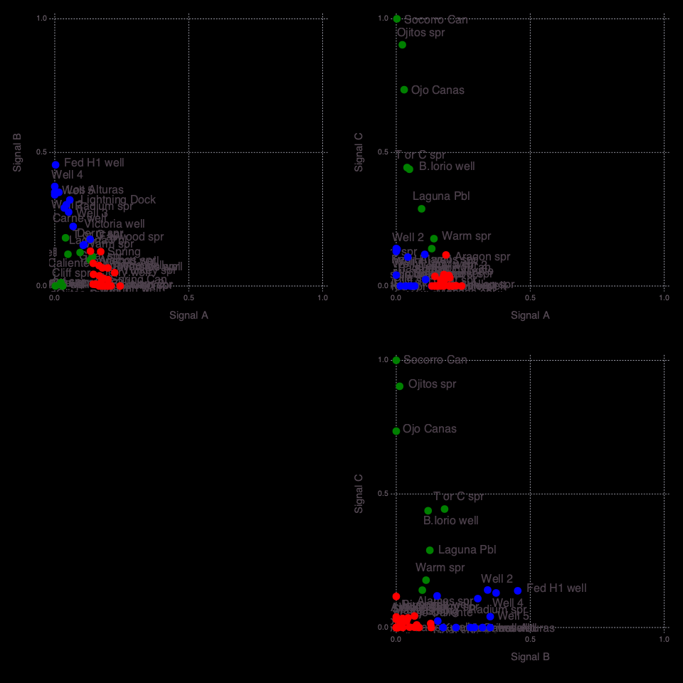
    


    


    3×2 Array{Any,2}:
     "State map fault density"  0.496198
     "Hydraulic gradient"       0.469537
     "Silica geothermometer"    0.439841


    6×2 Array{Any,2}:
     "Depth to basement"         0.676939
     "Boron concentration"       0.511079
     "Quaternary fault density"  0.460437
     "Volcanic vent density"     0.27834
     "Spring density"            0.0
     "Precipitation"             0.0


    9×2 Array{Any,2}:
     "Fault intersection density"  1.0
     "Seismicity"                  0.967935
     "Drainage density"            0.952827
     "Lithium concentration"       0.858236
     "Magnetic intensity"          0.403114
     "Crustal thickness"           0.346896
     "Gravity anomaly"             0.297228
     "Heat flow"                   0.290886
     "Volcanic dike density"       0.28542


    

    


    ┌ Info: Attributes (signals=3)
    └ @ NMFk /Users/bulbulahmmed/.julia/packages/NMFk/koh08/src/NMFkPostprocess.jl:325
    ┌ Info: Signal A (S3) Count: 9
    └ @ NMFk /Users/bulbulahmmed/.julia/packages/NMFk/koh08/src/NMFkPostprocess.jl:338
    ┌ Info: Signal B (S2) Count: 6
    └ @ NMFk /Users/bulbulahmmed/.julia/packages/NMFk/koh08/src/NMFkPostprocess.jl:338
    ┌ Info: Signal C (S1) Count: 3
    └ @ NMFk /Users/bulbulahmmed/.julia/packages/NMFk/koh08/src/NMFkPostprocess.jl:338
    ┌ Info: Signal C -> A Count: 3
    └ @ NMFk /Users/bulbulahmmed/.julia/packages/NMFk/koh08/src/NMFkPostprocess.jl:348
    ┌ Info: Signal B -> B Count: 6
    └ @ NMFk /Users/bulbulahmmed/.julia/packages/NMFk/koh08/src/NMFkPostprocess.jl:348
    ┌ Info: Signal A -> C Count: 9
    └ @ NMFk /Users/bulbulahmmed/.julia/packages/NMFk/koh08/src/NMFkPostprocess.jl:348
    ┌ Info: Signal A (remapped k-means clustering)
    └ @ NMFk /Users/bulbulahmmed/.julia/packages/NMFk/koh08/src/NMFkPostprocess.jl:363
    ┌ Info: Signal B (remapped k-means clustering)
    └ @ NMFk /Users/bulbulahmmed/.julia/packages/NMFk/koh08/src/NMFkPostprocess.jl:363
    ┌ Info: Signal C (remapped k-means clustering)
    └ @ NMFk /Users/bulbulahmmed/.julia/packages/NMFk/koh08/src/NMFkPostprocess.jl:363


    
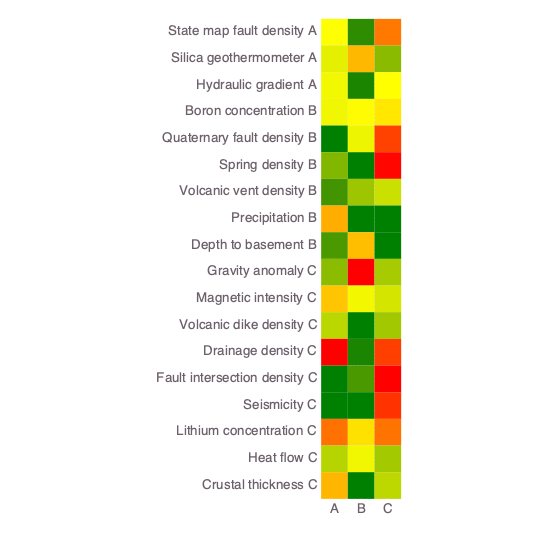
    


    


<?xml version="1.0" encoding="UTF-8"?>
<svg xmlns="http://www.w3.org/2000/svg"
     xmlns:xlink="http://www.w3.org/1999/xlink"
     xmlns:gadfly="http://www.gadflyjl.org/ns"
     version="1.2"
     width="141.42mm" height="100mm" viewBox="0 0 141.42 100"
     stroke="none"
     fill="#000000"
     stroke-width="0.3"
     font-size="3.88"

     id="img-5fd3f128">
<defs>
  <marker id="arrow" markerWidth="15" markerHeight="7" refX="5" refY="3.5" orient="auto" markerUnits="strokeWidth">
    <path d="M0,0 L15,3.5 L0,7 z" stroke="context-stroke" fill="context-stroke"/>
  </marker>
</defs>
<g class="plotroot" id="img-5fd3f128-1">
  <g class="guide xlabels" font-size="2.82" font-family="'PT Sans Caption','Helvetica Neue','Helvetica',sans-serif" fill="#6C606B" id="img-5fd3f128-2">
    <g transform="translate(78.74,94)" gadfly:scale="1.0" visibility="visible">
      <g class="primitive">
        <text text-anchor="middle" dy="-0em">A</text>
      </g>
    </g>
    <g transform="translate(83.23,94)" gadfly:scale="1.0" visibility="visible">
      <g class="primitive">
        <text text-anchor="middle" dy="-0em">B</text>
      </g>
    </g>
    <g transform="translate(87.73,94)" gadfly:scale="1.0" visibility="visible">
      <g class="primitive">
        <text text-anchor="middle" dy="-0em">C</text>
      </g>
    </g>
  </g>
  <g stroke-width="0.11" stroke="#FFFFFF" id="img-5fd3f128-3">
    <g transform="translate(92.2,77.46)">
      <path fill="none" d="M-1.16,2.25 L1.16,2.25 1.16,-2.25 -1.16,-2.25 " class="primitive"/>
    </g>
    <g transform="translate(92.2,63.97)">
      <path fill="none" d="M-1.16,2.25 L1.16,2.25 1.16,-2.25 -1.16,-2.25 " class="primitive"/>
    </g>
    <g transform="translate(93.94,80.83)">
      <path fill="none" d="M-2.9,3.37 L1.74,3.37 1.74,-3.37 -0.58,-3.37 " class="primitive"/>
    </g>
    <g transform="translate(92.2,14.5)">
      <path fill="none" d="M-1.16,2.25 L1.16,2.25 1.16,-2.25 -1.16,-2.25 " class="primitive"/>
    </g>
    <g transform="translate(92.2,27.99)">
      <path fill="none" d="M-1.16,2.25 L1.16,2.25 1.16,-2.25 -1.16,-2.25 " class="primitive"/>
    </g>
    <g transform="translate(93.94,67.34)">
      <path fill="none" d="M-2.9,3.37 L1.74,3.37 1.74,-3.37 -0.58,-3.37 " class="primitive"/>
    </g>
    <g transform="translate(92.2,54.97)">
      <path fill="none" d="M-1.16,2.25 L1.16,2.25 1.16,-2.25 -1.16,-2.25 " class="primitive"/>
    </g>
    <g transform="translate(93.94,17.87)">
      <path fill="none" d="M-2.9,3.37 L1.74,3.37 1.74,-3.37 -0.58,-3.37 " class="primitive"/>
    </g>
    <g transform="translate(92.2,36.98)">
      <path fill="none" d="M-1.16,2.25 L1.16,2.25 1.16,-2.25 -1.16,-2.25 " class="primitive"/>
    </g>
    <g transform="translate(95.69,84.77)">
      <path fill="none" d="M-4.65,3.94 L2.32,3.94 2.32,-3.94 0,-3.94 " class="primitive"/>
    </g>
    <g transform="translate(92.2,45.98)">
      <path fill="none" d="M-1.16,2.25 L1.16,2.25 1.16,-2.25 -1.16,-2.25 " class="primitive"/>
    </g>
    <g transform="translate(96.27,22.93)">
      <path fill="none" d="M-2.9,5.06 L1.74,5.06 1.74,-5.06 -0.58,-5.06 " class="primitive"/>
    </g>
    <g transform="translate(96.27,61.16)">
      <path fill="none" d="M-0.58,6.18 L1.74,6.18 1.74,-6.18 -2.9,-6.18 " class="primitive"/>
    </g>
    <g transform="translate(99.17,72.96)">
      <path fill="none" d="M-1.16,11.81 L1.16,11.81 1.16,-11.81 -1.16,-11.81 " class="primitive"/>
    </g>
    <g transform="translate(98.01,29.96)">
      <path fill="none" d="M-4.65,7.03 L2.32,7.03 2.32,-7.03 0,-7.03 " class="primitive"/>
    </g>
    <g transform="translate(99.75,37.97)">
      <path fill="none" d="M-6.39,8.01 L2.9,8.01 2.9,-8.01 0.58,-8.01 " class="primitive"/>
    </g>
    <g transform="translate(103.24,55.46)">
      <path fill="none" d="M-2.9,17.5 L1.74,17.5 1.74,-17.5 -0.58,-17.5 " class="primitive"/>
    </g>
  </g>
  <g clip-path="url(#img-5fd3f128-4)">
    <g id="img-5fd3f128-5">
      <g pointer-events="visible" stroke-width="0.3" fill="#000000" fill-opacity="0.000" stroke="#000000" stroke-opacity="0.000" class="guide background" id="img-5fd3f128-6">
        <g transform="translate(83.23,50.48)" id="img-5fd3f128-7">
          <path d="M-6.75,-40.48 L6.75,-40.48 6.75,40.48 -6.75,40.48  z" class="primitive"/>
        </g>
      </g>
      <g class="guide ygridlines xfixed" stroke-dasharray="0.5,0.5" stroke-width="0.2" stroke="#D0D0E0" id="img-5fd3f128-8">
        <g transform="translate(83.23,14.5)" id="img-5fd3f128-9" visibility="visible" gadfly:scale="1.0">
          <path fill="none" d="M-6.75,0 L6.75,0 " class="primitive"/>
        </g>
        <g transform="translate(83.23,18.99)" id="img-5fd3f128-10" visibility="visible" gadfly:scale="1.0">
          <path fill="none" d="M-6.75,0 L6.75,0 " class="primitive"/>
        </g>
        <g transform="translate(83.23,23.49)" id="img-5fd3f128-11" visibility="visible" gadfly:scale="1.0">
          <path fill="none" d="M-6.75,0 L6.75,0 " class="primitive"/>
        </g>
        <g transform="translate(83.23,27.99)" id="img-5fd3f128-12" visibility="visible" gadfly:scale="1.0">
          <path fill="none" d="M-6.75,0 L6.75,0 " class="primitive"/>
        </g>
        <g transform="translate(83.23,32.49)" id="img-5fd3f128-13" visibility="visible" gadfly:scale="1.0">
          <path fill="none" d="M-6.75,0 L6.75,0 " class="primitive"/>
        </g>
        <g transform="translate(83.23,36.98)" id="img-5fd3f128-14" visibility="visible" gadfly:scale="1.0">
          <path fill="none" d="M-6.75,0 L6.75,0 " class="primitive"/>
        </g>
        <g transform="translate(83.23,41.48)" id="img-5fd3f128-15" visibility="visible" gadfly:scale="1.0">
          <path fill="none" d="M-6.75,0 L6.75,0 " class="primitive"/>
        </g>
        <g transform="translate(83.23,45.98)" id="img-5fd3f128-16" visibility="visible" gadfly:scale="1.0">
          <path fill="none" d="M-6.75,0 L6.75,0 " class="primitive"/>
        </g>
        <g transform="translate(83.23,50.48)" id="img-5fd3f128-17" visibility="visible" gadfly:scale="1.0">
          <path fill="none" d="M-6.75,0 L6.75,0 " class="primitive"/>
        </g>
        <g transform="translate(83.23,54.97)" id="img-5fd3f128-18" visibility="visible" gadfly:scale="1.0">
          <path fill="none" d="M-6.75,0 L6.75,0 " class="primitive"/>
        </g>
        <g transform="translate(83.23,59.47)" id="img-5fd3f128-19" visibility="visible" gadfly:scale="1.0">
          <path fill="none" d="M-6.75,0 L6.75,0 " class="primitive"/>
        </g>
        <g transform="translate(83.23,63.97)" id="img-5fd3f128-20" visibility="visible" gadfly:scale="1.0">
          <path fill="none" d="M-6.75,0 L6.75,0 " class="primitive"/>
        </g>
        <g transform="translate(83.23,68.46)" id="img-5fd3f128-21" visibility="visible" gadfly:scale="1.0">
          <path fill="none" d="M-6.75,0 L6.75,0 " class="primitive"/>
        </g>
        <g transform="translate(83.23,72.96)" id="img-5fd3f128-22" visibility="visible" gadfly:scale="1.0">
          <path fill="none" d="M-6.75,0 L6.75,0 " class="primitive"/>
        </g>
        <g transform="translate(83.23,77.46)" id="img-5fd3f128-23" visibility="visible" gadfly:scale="1.0">
          <path fill="none" d="M-6.75,0 L6.75,0 " class="primitive"/>
        </g>
        <g transform="translate(83.23,81.96)" id="img-5fd3f128-24" visibility="visible" gadfly:scale="1.0">
          <path fill="none" d="M-6.75,0 L6.75,0 " class="primitive"/>
        </g>
        <g transform="translate(83.23,86.45)" id="img-5fd3f128-25" visibility="visible" gadfly:scale="1.0">
          <path fill="none" d="M-6.75,0 L6.75,0 " class="primitive"/>
        </g>
      </g>
      <g class="guide xgridlines yfixed" stroke-dasharray="0.5,0.5" stroke-width="0.2" stroke="#D0D0E0" id="img-5fd3f128-26">
        <g transform="translate(80.99,50.48)" id="img-5fd3f128-27" visibility="visible" gadfly:scale="1.0">
          <path fill="none" d="M0,-40.48 L0,40.48 " class="primitive"/>
        </g>
        <g transform="translate(85.48,50.48)" id="img-5fd3f128-28" visibility="visible" gadfly:scale="1.0">
          <path fill="none" d="M0,-40.48 L0,40.48 " class="primitive"/>
        </g>
      </g>
      <g class="plotpanel" id="img-5fd3f128-29">
        <metadata>
          <boundingbox value="76.4885619167595mm 10.0mm 13.491866952401619mm 80.95120171440972mm"/>
          <unitbox value="0.5 0.5 3.0 18.0"/>
        </metadata>
        <g shape-rendering="crispEdges" class="geometry" stroke="#000000" stroke-opacity="0.000" id="img-5fd3f128-30">
          <g transform="translate(78.76,12.27)" id="img-5fd3f128-31" fill="#FDFE00" fill-opacity="1">
            <path d="M-2.27,-2.27 L2.27,-2.27 2.27,2.27 -2.27,2.27  z" class="primitive"/>
          </g>
          <g transform="translate(78.76,16.77)" id="img-5fd3f128-32" fill="#E4EF00" fill-opacity="1">
            <path d="M-2.27,-2.27 L2.27,-2.27 2.27,2.27 -2.27,2.27  z" class="primitive"/>
          </g>
          <g transform="translate(78.76,21.27)" id="img-5fd3f128-33" fill="#F1F700" fill-opacity="1">
            <path d="M-2.27,-2.27 L2.27,-2.27 2.27,2.27 -2.27,2.27  z" class="primitive"/>
          </g>
          <g transform="translate(78.76,25.77)" id="img-5fd3f128-34" fill="#F1F700" fill-opacity="1">
            <path d="M-2.27,-2.27 L2.27,-2.27 2.27,2.27 -2.27,2.27  z" class="primitive"/>
          </g>
          <g transform="translate(78.76,30.26)" id="img-5fd3f128-35" fill="#008000" fill-opacity="1">
            <path d="M-2.27,-2.27 L2.27,-2.27 2.27,2.27 -2.27,2.27  z" class="primitive"/>
          </g>
          <g transform="translate(78.76,34.76)" id="img-5fd3f128-36" fill="#82B600" fill-opacity="1">
            <path d="M-2.27,-2.27 L2.27,-2.27 2.27,2.27 -2.27,2.27  z" class="primitive"/>
          </g>
          <g transform="translate(78.76,39.26)" id="img-5fd3f128-37" fill="#429400" fill-opacity="1">
            <path d="M-2.27,-2.27 L2.27,-2.27 2.27,2.27 -2.27,2.27  z" class="primitive"/>
          </g>
          <g transform="translate(78.76,43.75)" id="img-5fd3f128-38" fill="#FFAE00" fill-opacity="1">
            <path d="M-2.27,-2.27 L2.27,-2.27 2.27,2.27 -2.27,2.27  z" class="primitive"/>
          </g>
          <g transform="translate(78.76,48.25)" id="img-5fd3f128-39" fill="#4B9900" fill-opacity="1">
            <path d="M-2.27,-2.27 L2.27,-2.27 2.27,2.27 -2.27,2.27  z" class="primitive"/>
          </g>
          <g transform="translate(78.76,52.75)" id="img-5fd3f128-40" fill="#8CBC00" fill-opacity="1">
            <path d="M-2.27,-2.27 L2.27,-2.27 2.27,2.27 -2.27,2.27  z" class="primitive"/>
          </g>
          <g transform="translate(78.76,57.25)" id="img-5fd3f128-41" fill="#FFC500" fill-opacity="1">
            <path d="M-2.27,-2.27 L2.27,-2.27 2.27,2.27 -2.27,2.27  z" class="primitive"/>
          </g>
          <g transform="translate(78.76,61.74)" id="img-5fd3f128-42" fill="#B9D600" fill-opacity="1">
            <path d="M-2.27,-2.27 L2.27,-2.27 2.27,2.27 -2.27,2.27  z" class="primitive"/>
          </g>
          <g transform="translate(78.76,66.24)" id="img-5fd3f128-43" fill="#FF0000" fill-opacity="1">
            <path d="M-2.27,-2.27 L2.27,-2.27 2.27,2.27 -2.27,2.27  z" class="primitive"/>
          </g>
          <g transform="translate(78.76,70.74)" id="img-5fd3f128-44" fill="#008000" fill-opacity="1">
            <path d="M-2.27,-2.27 L2.27,-2.27 2.27,2.27 -2.27,2.27  z" class="primitive"/>
          </g>
          <g transform="translate(78.76,75.24)" id="img-5fd3f128-45" fill="#008000" fill-opacity="1">
            <path d="M-2.27,-2.27 L2.27,-2.27 2.27,2.27 -2.27,2.27  z" class="primitive"/>
          </g>
          <g transform="translate(78.76,79.73)" id="img-5fd3f128-46" fill="#FF7100" fill-opacity="1">
            <path d="M-2.27,-2.27 L2.27,-2.27 2.27,2.27 -2.27,2.27  z" class="primitive"/>
          </g>
          <g transform="translate(78.76,84.23)" id="img-5fd3f128-47" fill="#B6D500" fill-opacity="1">
            <path d="M-2.27,-2.27 L2.27,-2.27 2.27,2.27 -2.27,2.27  z" class="primitive"/>
          </g>
          <g transform="translate(78.76,88.73)" id="img-5fd3f128-48" fill="#FFB500" fill-opacity="1">
            <path d="M-2.27,-2.27 L2.27,-2.27 2.27,2.27 -2.27,2.27  z" class="primitive"/>
          </g>
          <g transform="translate(83.26,12.27)" id="img-5fd3f128-49" fill="#2F8C00" fill-opacity="1">
            <path d="M-2.27,-2.27 L2.27,-2.27 2.27,2.27 -2.27,2.27  z" class="primitive"/>
          </g>
          <g transform="translate(83.26,16.77)" id="img-5fd3f128-50" fill="#FFB800" fill-opacity="1">
            <path d="M-2.27,-2.27 L2.27,-2.27 2.27,2.27 -2.27,2.27  z" class="primitive"/>
          </g>
          <g transform="translate(83.26,21.27)" id="img-5fd3f128-51" fill="#1C8500" fill-opacity="1">
            <path d="M-2.27,-2.27 L2.27,-2.27 2.27,2.27 -2.27,2.27  z" class="primitive"/>
          </g>
          <g transform="translate(83.26,25.77)" id="img-5fd3f128-52" fill="#FFFB00" fill-opacity="1">
            <path d="M-2.27,-2.27 L2.27,-2.27 2.27,2.27 -2.27,2.27  z" class="primitive"/>
          </g>
          <g transform="translate(83.26,30.26)" id="img-5fd3f128-53" fill="#EDF500" fill-opacity="1">
            <path d="M-2.27,-2.27 L2.27,-2.27 2.27,2.27 -2.27,2.27  z" class="primitive"/>
          </g>
          <g transform="translate(83.26,34.76)" id="img-5fd3f128-54" fill="#008000" fill-opacity="1">
            <path d="M-2.27,-2.27 L2.27,-2.27 2.27,2.27 -2.27,2.27  z" class="primitive"/>
          </g>
          <g transform="translate(83.26,39.26)" id="img-5fd3f128-55" fill="#9DC600" fill-opacity="1">
            <path d="M-2.27,-2.27 L2.27,-2.27 2.27,2.27 -2.27,2.27  z" class="primitive"/>
          </g>
          <g transform="translate(83.26,43.75)" id="img-5fd3f128-56" fill="#008000" fill-opacity="1">
            <path d="M-2.27,-2.27 L2.27,-2.27 2.27,2.27 -2.27,2.27  z" class="primitive"/>
          </g>
          <g transform="translate(83.26,48.25)" id="img-5fd3f128-57" fill="#FFBE00" fill-opacity="1">
            <path d="M-2.27,-2.27 L2.27,-2.27 2.27,2.27 -2.27,2.27  z" class="primitive"/>
          </g>
          <g transform="translate(83.26,52.75)" id="img-5fd3f128-58" fill="#FF0000" fill-opacity="1">
            <path d="M-2.27,-2.27 L2.27,-2.27 2.27,2.27 -2.27,2.27  z" class="primitive"/>
          </g>
          <g transform="translate(83.26,57.25)" id="img-5fd3f128-59" fill="#F3F800" fill-opacity="1">
            <path d="M-2.27,-2.27 L2.27,-2.27 2.27,2.27 -2.27,2.27  z" class="primitive"/>
          </g>
          <g transform="translate(83.26,61.74)" id="img-5fd3f128-60" fill="#008000" fill-opacity="1">
            <path d="M-2.27,-2.27 L2.27,-2.27 2.27,2.27 -2.27,2.27  z" class="primitive"/>
          </g>
          <g transform="translate(83.26,66.24)" id="img-5fd3f128-61" fill="#1A8500" fill-opacity="1">
            <path d="M-2.27,-2.27 L2.27,-2.27 2.27,2.27 -2.27,2.27  z" class="primitive"/>
          </g>
          <g transform="translate(83.26,70.74)" id="img-5fd3f128-62" fill="#4B9800" fill-opacity="1">
            <path d="M-2.27,-2.27 L2.27,-2.27 2.27,2.27 -2.27,2.27  z" class="primitive"/>
          </g>
          <g transform="translate(83.26,75.24)" id="img-5fd3f128-63" fill="#008000" fill-opacity="1">
            <path d="M-2.27,-2.27 L2.27,-2.27 2.27,2.27 -2.27,2.27  z" class="primitive"/>
          </g>
          <g transform="translate(83.26,79.73)" id="img-5fd3f128-64" fill="#FFE000" fill-opacity="1">
            <path d="M-2.27,-2.27 L2.27,-2.27 2.27,2.27 -2.27,2.27  z" class="primitive"/>
          </g>
          <g transform="translate(83.26,84.23)" id="img-5fd3f128-65" fill="#F1F700" fill-opacity="1">
            <path d="M-2.27,-2.27 L2.27,-2.27 2.27,2.27 -2.27,2.27  z" class="primitive"/>
          </g>
          <g transform="translate(83.26,88.73)" id="img-5fd3f128-66" fill="#008000" fill-opacity="1">
            <path d="M-2.27,-2.27 L2.27,-2.27 2.27,2.27 -2.27,2.27  z" class="primitive"/>
          </g>
          <g transform="translate(87.76,12.27)" id="img-5fd3f128-67" fill="#FF7800" fill-opacity="1">
            <path d="M-2.27,-2.27 L2.27,-2.27 2.27,2.27 -2.27,2.27  z" class="primitive"/>
          </g>
          <g transform="translate(87.76,16.77)" id="img-5fd3f128-68" fill="#8ABB00" fill-opacity="1">
            <path d="M-2.27,-2.27 L2.27,-2.27 2.27,2.27 -2.27,2.27  z" class="primitive"/>
          </g>
          <g transform="translate(87.76,21.27)" id="img-5fd3f128-69" fill="#FEFF00" fill-opacity="1">
            <path d="M-2.27,-2.27 L2.27,-2.27 2.27,2.27 -2.27,2.27  z" class="primitive"/>
          </g>
          <g transform="translate(87.76,25.77)" id="img-5fd3f128-70" fill="#FFE700" fill-opacity="1">
            <path d="M-2.27,-2.27 L2.27,-2.27 2.27,2.27 -2.27,2.27  z" class="primitive"/>
          </g>
          <g transform="translate(87.76,30.26)" id="img-5fd3f128-71" fill="#FF4200" fill-opacity="1">
            <path d="M-2.27,-2.27 L2.27,-2.27 2.27,2.27 -2.27,2.27  z" class="primitive"/>
          </g>
          <g transform="translate(87.76,34.76)" id="img-5fd3f128-72" fill="#FF0700" fill-opacity="1">
            <path d="M-2.27,-2.27 L2.27,-2.27 2.27,2.27 -2.27,2.27  z" class="primitive"/>
          </g>
          <g transform="translate(87.76,39.26)" id="img-5fd3f128-73" fill="#C9E000" fill-opacity="1">
            <path d="M-2.27,-2.27 L2.27,-2.27 2.27,2.27 -2.27,2.27  z" class="primitive"/>
          </g>
          <g transform="translate(87.76,43.75)" id="img-5fd3f128-74" fill="#008000" fill-opacity="1">
            <path d="M-2.27,-2.27 L2.27,-2.27 2.27,2.27 -2.27,2.27  z" class="primitive"/>
          </g>
          <g transform="translate(87.76,48.25)" id="img-5fd3f128-75" fill="#008000" fill-opacity="1">
            <path d="M-2.27,-2.27 L2.27,-2.27 2.27,2.27 -2.27,2.27  z" class="primitive"/>
          </g>
          <g transform="translate(87.76,52.75)" id="img-5fd3f128-76" fill="#A6CB00" fill-opacity="1">
            <path d="M-2.27,-2.27 L2.27,-2.27 2.27,2.27 -2.27,2.27  z" class="primitive"/>
          </g>
          <g transform="translate(87.76,57.25)" id="img-5fd3f128-77" fill="#D4E600" fill-opacity="1">
            <path d="M-2.27,-2.27 L2.27,-2.27 2.27,2.27 -2.27,2.27  z" class="primitive"/>
          </g>
          <g transform="translate(87.76,61.74)" id="img-5fd3f128-78" fill="#A0C800" fill-opacity="1">
            <path d="M-2.27,-2.27 L2.27,-2.27 2.27,2.27 -2.27,2.27  z" class="primitive"/>
          </g>
          <g transform="translate(87.76,66.24)" id="img-5fd3f128-79" fill="#FF3F00" fill-opacity="1">
            <path d="M-2.27,-2.27 L2.27,-2.27 2.27,2.27 -2.27,2.27  z" class="primitive"/>
          </g>
          <g transform="translate(87.76,70.74)" id="img-5fd3f128-80" fill="#FF0000" fill-opacity="1">
            <path d="M-2.27,-2.27 L2.27,-2.27 2.27,2.27 -2.27,2.27  z" class="primitive"/>
          </g>
          <g transform="translate(87.76,75.24)" id="img-5fd3f128-81" fill="#FF3300" fill-opacity="1">
            <path d="M-2.27,-2.27 L2.27,-2.27 2.27,2.27 -2.27,2.27  z" class="primitive"/>
          </g>
          <g transform="translate(87.76,79.73)" id="img-5fd3f128-82" fill="#FF7300" fill-opacity="1">
            <path d="M-2.27,-2.27 L2.27,-2.27 2.27,2.27 -2.27,2.27  z" class="primitive"/>
          </g>
          <g transform="translate(87.76,84.23)" id="img-5fd3f128-83" fill="#A3C900" fill-opacity="1">
            <path d="M-2.27,-2.27 L2.27,-2.27 2.27,2.27 -2.27,2.27  z" class="primitive"/>
          </g>
          <g transform="translate(87.76,88.73)" id="img-5fd3f128-84" fill="#BBD800" fill-opacity="1">
            <path d="M-2.27,-2.27 L2.27,-2.27 2.27,2.27 -2.27,2.27  z" class="primitive"/>
          </g>
        </g>
      </g>
      <g fill-opacity="0" class="guide crosshair" id="img-5fd3f128-85">
        <g class="text_box" fill="#000000" id="img-5fd3f128-86">
          <g transform="translate(82.92,10.53)" id="img-5fd3f128-87">
            <g class="primitive">
              <text text-anchor="end" dy="0.6em"></text>
            </g>
          </g>
        </g>
      </g>
      <g fill-opacity="0" class="guide helpscreen" id="img-5fd3f128-88">
        <g class="text_box" id="img-5fd3f128-89">
          <g fill="#000000" id="img-5fd3f128-90">
            <g transform="translate(83.23,50.48)" id="img-5fd3f128-91">
              <path d="M-27.18,-9.82 L27.18,-9.82 27.18,9.82 -27.18,9.82  z" class="primitive"/>
            </g>
          </g>
          <g fill="#FFFF74" font-size="3.88" font-family="'PT Sans','Helvetica Neue','Helvetica',sans-serif" id="img-5fd3f128-92">
            <g transform="translate(83.23,43.34)" id="img-5fd3f128-93">
              <g class="primitive">
                <text text-anchor="middle" dy="0.35em">h,j,k,l,arrows,drag to pan</text>
              </g>
            </g>
            <g transform="translate(83.23,46.91)" id="img-5fd3f128-94">
              <g class="primitive">
                <text text-anchor="middle" dy="0.35em">i,o,+,-,scroll,shift-drag to zoom</text>
              </g>
            </g>
            <g transform="translate(83.23,50.48)" id="img-5fd3f128-95">
              <g class="primitive">
                <text text-anchor="middle" dy="0.35em">r,dbl-click to reset</text>
              </g>
            </g>
            <g transform="translate(83.23,54.05)" id="img-5fd3f128-96">
              <g class="primitive">
                <text text-anchor="middle" dy="0.35em">c for coordinates</text>
              </g>
            </g>
            <g transform="translate(83.23,57.62)" id="img-5fd3f128-97">
              <g class="primitive">
                <text text-anchor="middle" dy="0.35em">? for help</text>
              </g>
            </g>
          </g>
        </g>
      </g>
      <g fill-opacity="0" class="guide questionmark" id="img-5fd3f128-98">
        <g class="text_box" fill="#000000" id="img-5fd3f128-99">
          <g transform="translate(89.98,10.53)" id="img-5fd3f128-100">
            <g class="primitive">
              <text text-anchor="end" dy="0.6em">?</text>
            </g>
          </g>
        </g>
      </g>
    </g>
  </g>
  <g class="guide ylabels" font-size="2.82" font-family="'PT Sans Caption','Helvetica Neue','Helvetica',sans-serif" fill="#6C606B" id="img-5fd3f128-101">
    <g transform="translate(75.49,12.25)" id="img-5fd3f128-102" visibility="visible" gadfly:scale="1.0">
      <g class="primitive">
        <text text-anchor="end" dy="0.35em">State map fault density A</text>
      </g>
    </g>
    <g transform="translate(75.49,16.75)" id="img-5fd3f128-103" visibility="visible" gadfly:scale="1.0">
      <g class="primitive">
        <text text-anchor="end" dy="0.35em">Silica geothermometer A</text>
      </g>
    </g>
    <g transform="translate(75.49,21.24)" id="img-5fd3f128-104" visibility="visible" gadfly:scale="1.0">
      <g class="primitive">
        <text text-anchor="end" dy="0.35em">Hydraulic gradient A</text>
      </g>
    </g>
    <g transform="translate(75.49,25.74)" id="img-5fd3f128-105" visibility="visible" gadfly:scale="1.0">
      <g class="primitive">
        <text text-anchor="end" dy="0.35em">Boron concentration B</text>
      </g>
    </g>
    <g transform="translate(75.49,30.24)" id="img-5fd3f128-106" visibility="visible" gadfly:scale="1.0">
      <g class="primitive">
        <text text-anchor="end" dy="0.35em">Quaternary fault density B</text>
      </g>
    </g>
    <g transform="translate(75.49,34.74)" id="img-5fd3f128-107" visibility="visible" gadfly:scale="1.0">
      <g class="primitive">
        <text text-anchor="end" dy="0.35em">Spring density B</text>
      </g>
    </g>
    <g transform="translate(75.49,39.23)" id="img-5fd3f128-108" visibility="visible" gadfly:scale="1.0">
      <g class="primitive">
        <text text-anchor="end" dy="0.35em">Volcanic vent density B</text>
      </g>
    </g>
    <g transform="translate(75.49,43.73)" id="img-5fd3f128-109" visibility="visible" gadfly:scale="1.0">
      <g class="primitive">
        <text text-anchor="end" dy="0.35em">Precipitation B</text>
      </g>
    </g>
    <g transform="translate(75.49,48.23)" id="img-5fd3f128-110" visibility="visible" gadfly:scale="1.0">
      <g class="primitive">
        <text text-anchor="end" dy="0.35em">Depth to basement B</text>
      </g>
    </g>
    <g transform="translate(75.49,52.72)" id="img-5fd3f128-111" visibility="visible" gadfly:scale="1.0">
      <g class="primitive">
        <text text-anchor="end" dy="0.35em">Gravity anomaly C</text>
      </g>
    </g>
    <g transform="translate(75.49,57.22)" id="img-5fd3f128-112" visibility="visible" gadfly:scale="1.0">
      <g class="primitive">
        <text text-anchor="end" dy="0.35em">Magnetic intensity C</text>
      </g>
    </g>
    <g transform="translate(75.49,61.72)" id="img-5fd3f128-113" visibility="visible" gadfly:scale="1.0">
      <g class="primitive">
        <text text-anchor="end" dy="0.35em">Volcanic dike density C</text>
      </g>
    </g>
    <g transform="translate(75.49,66.22)" id="img-5fd3f128-114" visibility="visible" gadfly:scale="1.0">
      <g class="primitive">
        <text text-anchor="end" dy="0.35em">Drainage density C</text>
      </g>
    </g>
    <g transform="translate(75.49,70.71)" id="img-5fd3f128-115" visibility="visible" gadfly:scale="1.0">
      <g class="primitive">
        <text text-anchor="end" dy="0.35em">Fault intersection density C</text>
      </g>
    </g>
    <g transform="translate(75.49,75.21)" id="img-5fd3f128-116" visibility="visible" gadfly:scale="1.0">
      <g class="primitive">
        <text text-anchor="end" dy="0.35em">Seismicity C</text>
      </g>
    </g>
    <g transform="translate(75.49,79.71)" id="img-5fd3f128-117" visibility="visible" gadfly:scale="1.0">
      <g class="primitive">
        <text text-anchor="end" dy="0.35em">Lithium concentration C</text>
      </g>
    </g>
    <g transform="translate(75.49,84.21)" id="img-5fd3f128-118" visibility="visible" gadfly:scale="1.0">
      <g class="primitive">
        <text text-anchor="end" dy="0.35em">Heat flow C</text>
      </g>
    </g>
    <g transform="translate(75.49,88.7)" id="img-5fd3f128-119" visibility="visible" gadfly:scale="1.0">
      <g class="primitive">
        <text text-anchor="end" dy="0.35em">Crustal thickness C</text>
      </g>
    </g>
  </g>
  <g stroke-width="0.11" stroke="#FFFFFF" id="img-5fd3f128-120">
    <g transform="translate(85.48,7.96)" id="img-5fd3f128-121">
      <path fill="none" d="M-2.25,0.99 L-2.25,-0.99 2.25,-0.99 2.25,0.99 " class="primitive"/>
    </g>
    <g transform="translate(82.11,6.48)" id="img-5fd3f128-122">
      <path fill="none" d="M-3.37,2.46 L-3.37,-1.48 3.37,-1.48 3.37,0.49 " class="primitive"/>
    </g>
  </g>
</g>
<defs>
  <clipPath id="img-5fd3f128-4">
    <path d="M76.49,10 L89.98,10 89.98,90.95 76.49,90.95 " />
  </clipPath>
</defs>
<script> <![CDATA[
(function(N){var k=/[\.\/]/,L=/\s*,\s*/,C=function(a,d){return a-d},a,v,y={n:{}},M=function(){for(var a=0,d=this.length;a<d;a++)if("undefined"!=typeof this[a])return this[a]},A=function(){for(var a=this.length;--a;)if("undefined"!=typeof this[a])return this[a]},w=function(k,d){k=String(k);var f=v,n=Array.prototype.slice.call(arguments,2),u=w.listeners(k),p=0,b,q=[],e={},l=[],r=a;l.firstDefined=M;l.lastDefined=A;a=k;for(var s=v=0,x=u.length;s<x;s++)"zIndex"in u[s]&&(q.push(u[s].zIndex),0>u[s].zIndex&&
(e[u[s].zIndex]=u[s]));for(q.sort(C);0>q[p];)if(b=e[q[p++] ],l.push(b.apply(d,n)),v)return v=f,l;for(s=0;s<x;s++)if(b=u[s],"zIndex"in b)if(b.zIndex==q[p]){l.push(b.apply(d,n));if(v)break;do if(p++,(b=e[q[p] ])&&l.push(b.apply(d,n)),v)break;while(b)}else e[b.zIndex]=b;else if(l.push(b.apply(d,n)),v)break;v=f;a=r;return l};w._events=y;w.listeners=function(a){a=a.split(k);var d=y,f,n,u,p,b,q,e,l=[d],r=[];u=0;for(p=a.length;u<p;u++){e=[];b=0;for(q=l.length;b<q;b++)for(d=l[b].n,f=[d[a[u] ],d["*"] ],n=2;n--;)if(d=
f[n])e.push(d),r=r.concat(d.f||[]);l=e}return r};w.on=function(a,d){a=String(a);if("function"!=typeof d)return function(){};for(var f=a.split(L),n=0,u=f.length;n<u;n++)(function(a){a=a.split(k);for(var b=y,f,e=0,l=a.length;e<l;e++)b=b.n,b=b.hasOwnProperty(a[e])&&b[a[e] ]||(b[a[e] ]={n:{}});b.f=b.f||[];e=0;for(l=b.f.length;e<l;e++)if(b.f[e]==d){f=!0;break}!f&&b.f.push(d)})(f[n]);return function(a){+a==+a&&(d.zIndex=+a)}};w.f=function(a){var d=[].slice.call(arguments,1);return function(){w.apply(null,
[a,null].concat(d).concat([].slice.call(arguments,0)))}};w.stop=function(){v=1};w.nt=function(k){return k?(new RegExp("(?:\\.|\\/|^)"+k+"(?:\\.|\\/|$)")).test(a):a};w.nts=function(){return a.split(k)};w.off=w.unbind=function(a,d){if(a){var f=a.split(L);if(1<f.length)for(var n=0,u=f.length;n<u;n++)w.off(f[n],d);else{for(var f=a.split(k),p,b,q,e,l=[y],n=0,u=f.length;n<u;n++)for(e=0;e<l.length;e+=q.length-2){q=[e,1];p=l[e].n;if("*"!=f[n])p[f[n] ]&&q.push(p[f[n] ]);else for(b in p)p.hasOwnProperty(b)&&
q.push(p[b]);l.splice.apply(l,q)}n=0;for(u=l.length;n<u;n++)for(p=l[n];p.n;){if(d){if(p.f){e=0;for(f=p.f.length;e<f;e++)if(p.f[e]==d){p.f.splice(e,1);break}!p.f.length&&delete p.f}for(b in p.n)if(p.n.hasOwnProperty(b)&&p.n[b].f){q=p.n[b].f;e=0;for(f=q.length;e<f;e++)if(q[e]==d){q.splice(e,1);break}!q.length&&delete p.n[b].f}}else for(b in delete p.f,p.n)p.n.hasOwnProperty(b)&&p.n[b].f&&delete p.n[b].f;p=p.n}}}else w._events=y={n:{}}};w.once=function(a,d){var f=function(){w.unbind(a,f);return d.apply(this,
arguments)};return w.on(a,f)};w.version="0.4.2";w.toString=function(){return"You are running Eve 0.4.2"};"undefined"!=typeof module&&module.exports?module.exports=w:"function"===typeof define&&define.amd?define("eve",[],function(){return w}):N.eve=w})(this);
(function(N,k){"function"===typeof define&&define.amd?define("Snap.svg",["eve"],function(L){return k(N,L)}):k(N,N.eve)})(this,function(N,k){var L=function(a){var k={},y=N.requestAnimationFrame||N.webkitRequestAnimationFrame||N.mozRequestAnimationFrame||N.oRequestAnimationFrame||N.msRequestAnimationFrame||function(a){setTimeout(a,16)},M=Array.isArray||function(a){return a instanceof Array||"[object Array]"==Object.prototype.toString.call(a)},A=0,w="M"+(+new Date).toString(36),z=function(a){if(null==
a)return this.s;var b=this.s-a;this.b+=this.dur*b;this.B+=this.dur*b;this.s=a},d=function(a){if(null==a)return this.spd;this.spd=a},f=function(a){if(null==a)return this.dur;this.s=this.s*a/this.dur;this.dur=a},n=function(){delete k[this.id];this.update();a("mina.stop."+this.id,this)},u=function(){this.pdif||(delete k[this.id],this.update(),this.pdif=this.get()-this.b)},p=function(){this.pdif&&(this.b=this.get()-this.pdif,delete this.pdif,k[this.id]=this)},b=function(){var a;if(M(this.start)){a=[];
for(var b=0,e=this.start.length;b<e;b++)a[b]=+this.start[b]+(this.end[b]-this.start[b])*this.easing(this.s)}else a=+this.start+(this.end-this.start)*this.easing(this.s);this.set(a)},q=function(){var l=0,b;for(b in k)if(k.hasOwnProperty(b)){var e=k[b],f=e.get();l++;e.s=(f-e.b)/(e.dur/e.spd);1<=e.s&&(delete k[b],e.s=1,l--,function(b){setTimeout(function(){a("mina.finish."+b.id,b)})}(e));e.update()}l&&y(q)},e=function(a,r,s,x,G,h,J){a={id:w+(A++).toString(36),start:a,end:r,b:s,s:0,dur:x-s,spd:1,get:G,
set:h,easing:J||e.linear,status:z,speed:d,duration:f,stop:n,pause:u,resume:p,update:b};k[a.id]=a;r=0;for(var K in k)if(k.hasOwnProperty(K)&&(r++,2==r))break;1==r&&y(q);return a};e.time=Date.now||function(){return+new Date};e.getById=function(a){return k[a]||null};e.linear=function(a){return a};e.easeout=function(a){return Math.pow(a,1.7)};e.easein=function(a){return Math.pow(a,0.48)};e.easeinout=function(a){if(1==a)return 1;if(0==a)return 0;var b=0.48-a/1.04,e=Math.sqrt(0.1734+b*b);a=e-b;a=Math.pow(Math.abs(a),
1/3)*(0>a?-1:1);b=-e-b;b=Math.pow(Math.abs(b),1/3)*(0>b?-1:1);a=a+b+0.5;return 3*(1-a)*a*a+a*a*a};e.backin=function(a){return 1==a?1:a*a*(2.70158*a-1.70158)};e.backout=function(a){if(0==a)return 0;a-=1;return a*a*(2.70158*a+1.70158)+1};e.elastic=function(a){return a==!!a?a:Math.pow(2,-10*a)*Math.sin(2*(a-0.075)*Math.PI/0.3)+1};e.bounce=function(a){a<1/2.75?a*=7.5625*a:a<2/2.75?(a-=1.5/2.75,a=7.5625*a*a+0.75):a<2.5/2.75?(a-=2.25/2.75,a=7.5625*a*a+0.9375):(a-=2.625/2.75,a=7.5625*a*a+0.984375);return a};
return N.mina=e}("undefined"==typeof k?function(){}:k),C=function(){function a(c,t){if(c){if(c.tagName)return x(c);if(y(c,"array")&&a.set)return a.set.apply(a,c);if(c instanceof e)return c;if(null==t)return c=G.doc.querySelector(c),x(c)}return new s(null==c?"100%":c,null==t?"100%":t)}function v(c,a){if(a){"#text"==c&&(c=G.doc.createTextNode(a.text||""));"string"==typeof c&&(c=v(c));if("string"==typeof a)return"xlink:"==a.substring(0,6)?c.getAttributeNS(m,a.substring(6)):"xml:"==a.substring(0,4)?c.getAttributeNS(la,
a.substring(4)):c.getAttribute(a);for(var da in a)if(a[h](da)){var b=J(a[da]);b?"xlink:"==da.substring(0,6)?c.setAttributeNS(m,da.substring(6),b):"xml:"==da.substring(0,4)?c.setAttributeNS(la,da.substring(4),b):c.setAttribute(da,b):c.removeAttribute(da)}}else c=G.doc.createElementNS(la,c);return c}function y(c,a){a=J.prototype.toLowerCase.call(a);return"finite"==a?isFinite(c):"array"==a&&(c instanceof Array||Array.isArray&&Array.isArray(c))?!0:"null"==a&&null===c||a==typeof c&&null!==c||"object"==
a&&c===Object(c)||$.call(c).slice(8,-1).toLowerCase()==a}function M(c){if("function"==typeof c||Object(c)!==c)return c;var a=new c.constructor,b;for(b in c)c[h](b)&&(a[b]=M(c[b]));return a}function A(c,a,b){function m(){var e=Array.prototype.slice.call(arguments,0),f=e.join("\u2400"),d=m.cache=m.cache||{},l=m.count=m.count||[];if(d[h](f)){a:for(var e=l,l=f,B=0,H=e.length;B<H;B++)if(e[B]===l){e.push(e.splice(B,1)[0]);break a}return b?b(d[f]):d[f]}1E3<=l.length&&delete d[l.shift()];l.push(f);d[f]=c.apply(a,
e);return b?b(d[f]):d[f]}return m}function w(c,a,b,m,e,f){return null==e?(c-=b,a-=m,c||a?(180*I.atan2(-a,-c)/C+540)%360:0):w(c,a,e,f)-w(b,m,e,f)}function z(c){return c%360*C/180}function d(c){var a=[];c=c.replace(/(?:^|\s)(\w+)\(([^)]+)\)/g,function(c,b,m){m=m.split(/\s*,\s*|\s+/);"rotate"==b&&1==m.length&&m.push(0,0);"scale"==b&&(2<m.length?m=m.slice(0,2):2==m.length&&m.push(0,0),1==m.length&&m.push(m[0],0,0));"skewX"==b?a.push(["m",1,0,I.tan(z(m[0])),1,0,0]):"skewY"==b?a.push(["m",1,I.tan(z(m[0])),
0,1,0,0]):a.push([b.charAt(0)].concat(m));return c});return a}function f(c,t){var b=O(c),m=new a.Matrix;if(b)for(var e=0,f=b.length;e<f;e++){var h=b[e],d=h.length,B=J(h[0]).toLowerCase(),H=h[0]!=B,l=H?m.invert():0,E;"t"==B&&2==d?m.translate(h[1],0):"t"==B&&3==d?H?(d=l.x(0,0),B=l.y(0,0),H=l.x(h[1],h[2]),l=l.y(h[1],h[2]),m.translate(H-d,l-B)):m.translate(h[1],h[2]):"r"==B?2==d?(E=E||t,m.rotate(h[1],E.x+E.width/2,E.y+E.height/2)):4==d&&(H?(H=l.x(h[2],h[3]),l=l.y(h[2],h[3]),m.rotate(h[1],H,l)):m.rotate(h[1],
h[2],h[3])):"s"==B?2==d||3==d?(E=E||t,m.scale(h[1],h[d-1],E.x+E.width/2,E.y+E.height/2)):4==d?H?(H=l.x(h[2],h[3]),l=l.y(h[2],h[3]),m.scale(h[1],h[1],H,l)):m.scale(h[1],h[1],h[2],h[3]):5==d&&(H?(H=l.x(h[3],h[4]),l=l.y(h[3],h[4]),m.scale(h[1],h[2],H,l)):m.scale(h[1],h[2],h[3],h[4])):"m"==B&&7==d&&m.add(h[1],h[2],h[3],h[4],h[5],h[6])}return m}function n(c,t){if(null==t){var m=!0;t="linearGradient"==c.type||"radialGradient"==c.type?c.node.getAttribute("gradientTransform"):"pattern"==c.type?c.node.getAttribute("patternTransform"):
c.node.getAttribute("transform");if(!t)return new a.Matrix;t=d(t)}else t=a._.rgTransform.test(t)?J(t).replace(/\.{3}|\u2026/g,c._.transform||aa):d(t),y(t,"array")&&(t=a.path?a.path.toString.call(t):J(t)),c._.transform=t;var b=f(t,c.getBBox(1));if(m)return b;c.matrix=b}function u(c){c=c.node.ownerSVGElement&&x(c.node.ownerSVGElement)||c.node.parentNode&&x(c.node.parentNode)||a.select("svg")||a(0,0);var t=c.select("defs"),t=null==t?!1:t.node;t||(t=r("defs",c.node).node);return t}function p(c){return c.node.ownerSVGElement&&
x(c.node.ownerSVGElement)||a.select("svg")}function b(c,a,m){function b(c){if(null==c)return aa;if(c==+c)return c;v(B,{width:c});try{return B.getBBox().width}catch(a){return 0}}function h(c){if(null==c)return aa;if(c==+c)return c;v(B,{height:c});try{return B.getBBox().height}catch(a){return 0}}function e(b,B){null==a?d[b]=B(c.attr(b)||0):b==a&&(d=B(null==m?c.attr(b)||0:m))}var f=p(c).node,d={},B=f.querySelector(".svg---mgr");B||(B=v("rect"),v(B,{x:-9E9,y:-9E9,width:10,height:10,"class":"svg---mgr",
fill:"none"}),f.appendChild(B));switch(c.type){case "rect":e("rx",b),e("ry",h);case "image":e("width",b),e("height",h);case "text":e("x",b);e("y",h);break;case "circle":e("cx",b);e("cy",h);e("r",b);break;case "ellipse":e("cx",b);e("cy",h);e("rx",b);e("ry",h);break;case "line":e("x1",b);e("x2",b);e("y1",h);e("y2",h);break;case "marker":e("refX",b);e("markerWidth",b);e("refY",h);e("markerHeight",h);break;case "radialGradient":e("fx",b);e("fy",h);break;case "tspan":e("dx",b);e("dy",h);break;default:e(a,
b)}f.removeChild(B);return d}function q(c){y(c,"array")||(c=Array.prototype.slice.call(arguments,0));for(var a=0,b=0,m=this.node;this[a];)delete this[a++];for(a=0;a<c.length;a++)"set"==c[a].type?c[a].forEach(function(c){m.appendChild(c.node)}):m.appendChild(c[a].node);for(var h=m.childNodes,a=0;a<h.length;a++)this[b++]=x(h[a]);return this}function e(c){if(c.snap in E)return E[c.snap];var a=this.id=V(),b;try{b=c.ownerSVGElement}catch(m){}this.node=c;b&&(this.paper=new s(b));this.type=c.tagName;this.anims=
{};this._={transform:[]};c.snap=a;E[a]=this;"g"==this.type&&(this.add=q);if(this.type in{g:1,mask:1,pattern:1})for(var e in s.prototype)s.prototype[h](e)&&(this[e]=s.prototype[e])}function l(c){this.node=c}function r(c,a){var b=v(c);a.appendChild(b);return x(b)}function s(c,a){var b,m,f,d=s.prototype;if(c&&"svg"==c.tagName){if(c.snap in E)return E[c.snap];var l=c.ownerDocument;b=new e(c);m=c.getElementsByTagName("desc")[0];f=c.getElementsByTagName("defs")[0];m||(m=v("desc"),m.appendChild(l.createTextNode("Created with Snap")),
b.node.appendChild(m));f||(f=v("defs"),b.node.appendChild(f));b.defs=f;for(var ca in d)d[h](ca)&&(b[ca]=d[ca]);b.paper=b.root=b}else b=r("svg",G.doc.body),v(b.node,{height:a,version:1.1,width:c,xmlns:la});return b}function x(c){return!c||c instanceof e||c instanceof l?c:c.tagName&&"svg"==c.tagName.toLowerCase()?new s(c):c.tagName&&"object"==c.tagName.toLowerCase()&&"image/svg+xml"==c.type?new s(c.contentDocument.getElementsByTagName("svg")[0]):new e(c)}a.version="0.3.0";a.toString=function(){return"Snap v"+
this.version};a._={};var G={win:N,doc:N.document};a._.glob=G;var h="hasOwnProperty",J=String,K=parseFloat,U=parseInt,I=Math,P=I.max,Q=I.min,Y=I.abs,C=I.PI,aa="",$=Object.prototype.toString,F=/^\s*((#[a-f\d]{6})|(#[a-f\d]{3})|rgba?\(\s*([\d\.]+%?\s*,\s*[\d\.]+%?\s*,\s*[\d\.]+%?(?:\s*,\s*[\d\.]+%?)?)\s*\)|hsba?\(\s*([\d\.]+(?:deg|\xb0|%)?\s*,\s*[\d\.]+%?\s*,\s*[\d\.]+(?:%?\s*,\s*[\d\.]+)?%?)\s*\)|hsla?\(\s*([\d\.]+(?:deg|\xb0|%)?\s*,\s*[\d\.]+%?\s*,\s*[\d\.]+(?:%?\s*,\s*[\d\.]+)?%?)\s*\))\s*$/i;a._.separator=
RegExp("[,\t\n\x0B\f\r \u00a0\u1680\u180e\u2000\u2001\u2002\u2003\u2004\u2005\u2006\u2007\u2008\u2009\u200a\u202f\u205f\u3000\u2028\u2029]+");var S=RegExp("[\t\n\x0B\f\r \u00a0\u1680\u180e\u2000\u2001\u2002\u2003\u2004\u2005\u2006\u2007\u2008\u2009\u200a\u202f\u205f\u3000\u2028\u2029]*,[\t\n\x0B\f\r \u00a0\u1680\u180e\u2000\u2001\u2002\u2003\u2004\u2005\u2006\u2007\u2008\u2009\u200a\u202f\u205f\u3000\u2028\u2029]*"),X={hs:1,rg:1},W=RegExp("([a-z])[\t\n\x0B\f\r \u00a0\u1680\u180e\u2000\u2001\u2002\u2003\u2004\u2005\u2006\u2007\u2008\u2009\u200a\u202f\u205f\u3000\u2028\u2029,]*((-?\\d*\\.?\\d*(?:e[\\-+]?\\d+)?[\t\n\x0B\f\r \u00a0\u1680\u180e\u2000\u2001\u2002\u2003\u2004\u2005\u2006\u2007\u2008\u2009\u200a\u202f\u205f\u3000\u2028\u2029]*,?[\t\n\x0B\f\r \u00a0\u1680\u180e\u2000\u2001\u2002\u2003\u2004\u2005\u2006\u2007\u2008\u2009\u200a\u202f\u205f\u3000\u2028\u2029]*)+)",
"ig"),ma=RegExp("([rstm])[\t\n\x0B\f\r \u00a0\u1680\u180e\u2000\u2001\u2002\u2003\u2004\u2005\u2006\u2007\u2008\u2009\u200a\u202f\u205f\u3000\u2028\u2029,]*((-?\\d*\\.?\\d*(?:e[\\-+]?\\d+)?[\t\n\x0B\f\r \u00a0\u1680\u180e\u2000\u2001\u2002\u2003\u2004\u2005\u2006\u2007\u2008\u2009\u200a\u202f\u205f\u3000\u2028\u2029]*,?[\t\n\x0B\f\r \u00a0\u1680\u180e\u2000\u2001\u2002\u2003\u2004\u2005\u2006\u2007\u2008\u2009\u200a\u202f\u205f\u3000\u2028\u2029]*)+)","ig"),Z=RegExp("(-?\\d*\\.?\\d*(?:e[\\-+]?\\d+)?)[\t\n\x0B\f\r \u00a0\u1680\u180e\u2000\u2001\u2002\u2003\u2004\u2005\u2006\u2007\u2008\u2009\u200a\u202f\u205f\u3000\u2028\u2029]*,?[\t\n\x0B\f\r \u00a0\u1680\u180e\u2000\u2001\u2002\u2003\u2004\u2005\u2006\u2007\u2008\u2009\u200a\u202f\u205f\u3000\u2028\u2029]*",
"ig"),na=0,ba="S"+(+new Date).toString(36),V=function(){return ba+(na++).toString(36)},m="http://www.w3.org/1999/xlink",la="http://www.w3.org/2000/svg",E={},ca=a.url=function(c){return"url('#"+c+"')"};a._.$=v;a._.id=V;a.format=function(){var c=/\{([^\}]+)\}/g,a=/(?:(?:^|\.)(.+?)(?=\[|\.|$|\()|\[('|")(.+?)\2\])(\(\))?/g,b=function(c,b,m){var h=m;b.replace(a,function(c,a,b,m,t){a=a||m;h&&(a in h&&(h=h[a]),"function"==typeof h&&t&&(h=h()))});return h=(null==h||h==m?c:h)+""};return function(a,m){return J(a).replace(c,
function(c,a){return b(c,a,m)})}}();a._.clone=M;a._.cacher=A;a.rad=z;a.deg=function(c){return 180*c/C%360};a.angle=w;a.is=y;a.snapTo=function(c,a,b){b=y(b,"finite")?b:10;if(y(c,"array"))for(var m=c.length;m--;){if(Y(c[m]-a)<=b)return c[m]}else{c=+c;m=a%c;if(m<b)return a-m;if(m>c-b)return a-m+c}return a};a.getRGB=A(function(c){if(!c||(c=J(c)).indexOf("-")+1)return{r:-1,g:-1,b:-1,hex:"none",error:1,toString:ka};if("none"==c)return{r:-1,g:-1,b:-1,hex:"none",toString:ka};!X[h](c.toLowerCase().substring(0,
2))&&"#"!=c.charAt()&&(c=T(c));if(!c)return{r:-1,g:-1,b:-1,hex:"none",error:1,toString:ka};var b,m,e,f,d;if(c=c.match(F)){c[2]&&(e=U(c[2].substring(5),16),m=U(c[2].substring(3,5),16),b=U(c[2].substring(1,3),16));c[3]&&(e=U((d=c[3].charAt(3))+d,16),m=U((d=c[3].charAt(2))+d,16),b=U((d=c[3].charAt(1))+d,16));c[4]&&(d=c[4].split(S),b=K(d[0]),"%"==d[0].slice(-1)&&(b*=2.55),m=K(d[1]),"%"==d[1].slice(-1)&&(m*=2.55),e=K(d[2]),"%"==d[2].slice(-1)&&(e*=2.55),"rgba"==c[1].toLowerCase().slice(0,4)&&(f=K(d[3])),
d[3]&&"%"==d[3].slice(-1)&&(f/=100));if(c[5])return d=c[5].split(S),b=K(d[0]),"%"==d[0].slice(-1)&&(b/=100),m=K(d[1]),"%"==d[1].slice(-1)&&(m/=100),e=K(d[2]),"%"==d[2].slice(-1)&&(e/=100),"deg"!=d[0].slice(-3)&&"\u00b0"!=d[0].slice(-1)||(b/=360),"hsba"==c[1].toLowerCase().slice(0,4)&&(f=K(d[3])),d[3]&&"%"==d[3].slice(-1)&&(f/=100),a.hsb2rgb(b,m,e,f);if(c[6])return d=c[6].split(S),b=K(d[0]),"%"==d[0].slice(-1)&&(b/=100),m=K(d[1]),"%"==d[1].slice(-1)&&(m/=100),e=K(d[2]),"%"==d[2].slice(-1)&&(e/=100),
"deg"!=d[0].slice(-3)&&"\u00b0"!=d[0].slice(-1)||(b/=360),"hsla"==c[1].toLowerCase().slice(0,4)&&(f=K(d[3])),d[3]&&"%"==d[3].slice(-1)&&(f/=100),a.hsl2rgb(b,m,e,f);b=Q(I.round(b),255);m=Q(I.round(m),255);e=Q(I.round(e),255);f=Q(P(f,0),1);c={r:b,g:m,b:e,toString:ka};c.hex="#"+(16777216|e|m<<8|b<<16).toString(16).slice(1);c.opacity=y(f,"finite")?f:1;return c}return{r:-1,g:-1,b:-1,hex:"none",error:1,toString:ka}},a);a.hsb=A(function(c,b,m){return a.hsb2rgb(c,b,m).hex});a.hsl=A(function(c,b,m){return a.hsl2rgb(c,
b,m).hex});a.rgb=A(function(c,a,b,m){if(y(m,"finite")){var e=I.round;return"rgba("+[e(c),e(a),e(b),+m.toFixed(2)]+")"}return"#"+(16777216|b|a<<8|c<<16).toString(16).slice(1)});var T=function(c){var a=G.doc.getElementsByTagName("head")[0]||G.doc.getElementsByTagName("svg")[0];T=A(function(c){if("red"==c.toLowerCase())return"rgb(255, 0, 0)";a.style.color="rgb(255, 0, 0)";a.style.color=c;c=G.doc.defaultView.getComputedStyle(a,aa).getPropertyValue("color");return"rgb(255, 0, 0)"==c?null:c});return T(c)},
qa=function(){return"hsb("+[this.h,this.s,this.b]+")"},ra=function(){return"hsl("+[this.h,this.s,this.l]+")"},ka=function(){return 1==this.opacity||null==this.opacity?this.hex:"rgba("+[this.r,this.g,this.b,this.opacity]+")"},D=function(c,b,m){null==b&&y(c,"object")&&"r"in c&&"g"in c&&"b"in c&&(m=c.b,b=c.g,c=c.r);null==b&&y(c,string)&&(m=a.getRGB(c),c=m.r,b=m.g,m=m.b);if(1<c||1<b||1<m)c/=255,b/=255,m/=255;return[c,b,m]},oa=function(c,b,m,e){c=I.round(255*c);b=I.round(255*b);m=I.round(255*m);c={r:c,
g:b,b:m,opacity:y(e,"finite")?e:1,hex:a.rgb(c,b,m),toString:ka};y(e,"finite")&&(c.opacity=e);return c};a.color=function(c){var b;y(c,"object")&&"h"in c&&"s"in c&&"b"in c?(b=a.hsb2rgb(c),c.r=b.r,c.g=b.g,c.b=b.b,c.opacity=1,c.hex=b.hex):y(c,"object")&&"h"in c&&"s"in c&&"l"in c?(b=a.hsl2rgb(c),c.r=b.r,c.g=b.g,c.b=b.b,c.opacity=1,c.hex=b.hex):(y(c,"string")&&(c=a.getRGB(c)),y(c,"object")&&"r"in c&&"g"in c&&"b"in c&&!("error"in c)?(b=a.rgb2hsl(c),c.h=b.h,c.s=b.s,c.l=b.l,b=a.rgb2hsb(c),c.v=b.b):(c={hex:"none"},
c.r=c.g=c.b=c.h=c.s=c.v=c.l=-1,c.error=1));c.toString=ka;return c};a.hsb2rgb=function(c,a,b,m){y(c,"object")&&"h"in c&&"s"in c&&"b"in c&&(b=c.b,a=c.s,c=c.h,m=c.o);var e,h,d;c=360*c%360/60;d=b*a;a=d*(1-Y(c%2-1));b=e=h=b-d;c=~~c;b+=[d,a,0,0,a,d][c];e+=[a,d,d,a,0,0][c];h+=[0,0,a,d,d,a][c];return oa(b,e,h,m)};a.hsl2rgb=function(c,a,b,m){y(c,"object")&&"h"in c&&"s"in c&&"l"in c&&(b=c.l,a=c.s,c=c.h);if(1<c||1<a||1<b)c/=360,a/=100,b/=100;var e,h,d;c=360*c%360/60;d=2*a*(0.5>b?b:1-b);a=d*(1-Y(c%2-1));b=e=
h=b-d/2;c=~~c;b+=[d,a,0,0,a,d][c];e+=[a,d,d,a,0,0][c];h+=[0,0,a,d,d,a][c];return oa(b,e,h,m)};a.rgb2hsb=function(c,a,b){b=D(c,a,b);c=b[0];a=b[1];b=b[2];var m,e;m=P(c,a,b);e=m-Q(c,a,b);c=((0==e?0:m==c?(a-b)/e:m==a?(b-c)/e+2:(c-a)/e+4)+360)%6*60/360;return{h:c,s:0==e?0:e/m,b:m,toString:qa}};a.rgb2hsl=function(c,a,b){b=D(c,a,b);c=b[0];a=b[1];b=b[2];var m,e,h;m=P(c,a,b);e=Q(c,a,b);h=m-e;c=((0==h?0:m==c?(a-b)/h:m==a?(b-c)/h+2:(c-a)/h+4)+360)%6*60/360;m=(m+e)/2;return{h:c,s:0==h?0:0.5>m?h/(2*m):h/(2-2*
m),l:m,toString:ra}};a.parsePathString=function(c){if(!c)return null;var b=a.path(c);if(b.arr)return a.path.clone(b.arr);var m={a:7,c:6,o:2,h:1,l:2,m:2,r:4,q:4,s:4,t:2,v:1,u:3,z:0},e=[];y(c,"array")&&y(c[0],"array")&&(e=a.path.clone(c));e.length||J(c).replace(W,function(c,a,b){var h=[];c=a.toLowerCase();b.replace(Z,function(c,a){a&&h.push(+a)});"m"==c&&2<h.length&&(e.push([a].concat(h.splice(0,2))),c="l",a="m"==a?"l":"L");"o"==c&&1==h.length&&e.push([a,h[0] ]);if("r"==c)e.push([a].concat(h));else for(;h.length>=
m[c]&&(e.push([a].concat(h.splice(0,m[c]))),m[c]););});e.toString=a.path.toString;b.arr=a.path.clone(e);return e};var O=a.parseTransformString=function(c){if(!c)return null;var b=[];y(c,"array")&&y(c[0],"array")&&(b=a.path.clone(c));b.length||J(c).replace(ma,function(c,a,m){var e=[];a.toLowerCase();m.replace(Z,function(c,a){a&&e.push(+a)});b.push([a].concat(e))});b.toString=a.path.toString;return b};a._.svgTransform2string=d;a._.rgTransform=RegExp("^[a-z][\t\n\x0B\f\r \u00a0\u1680\u180e\u2000\u2001\u2002\u2003\u2004\u2005\u2006\u2007\u2008\u2009\u200a\u202f\u205f\u3000\u2028\u2029]*-?\\.?\\d",
"i");a._.transform2matrix=f;a._unit2px=b;a._.getSomeDefs=u;a._.getSomeSVG=p;a.select=function(c){return x(G.doc.querySelector(c))};a.selectAll=function(c){c=G.doc.querySelectorAll(c);for(var b=(a.set||Array)(),m=0;m<c.length;m++)b.push(x(c[m]));return b};setInterval(function(){for(var c in E)if(E[h](c)){var a=E[c],b=a.node;("svg"!=a.type&&!b.ownerSVGElement||"svg"==a.type&&(!b.parentNode||"ownerSVGElement"in b.parentNode&&!b.ownerSVGElement))&&delete E[c]}},1E4);(function(c){function m(c){function a(c,
b){var m=v(c.node,b);(m=(m=m&&m.match(d))&&m[2])&&"#"==m.charAt()&&(m=m.substring(1))&&(f[m]=(f[m]||[]).concat(function(a){var m={};m[b]=ca(a);v(c.node,m)}))}function b(c){var a=v(c.node,"xlink:href");a&&"#"==a.charAt()&&(a=a.substring(1))&&(f[a]=(f[a]||[]).concat(function(a){c.attr("xlink:href","#"+a)}))}var e=c.selectAll("*"),h,d=/^\s*url\(("|'|)(.*)\1\)\s*$/;c=[];for(var f={},l=0,E=e.length;l<E;l++){h=e[l];a(h,"fill");a(h,"stroke");a(h,"filter");a(h,"mask");a(h,"clip-path");b(h);var t=v(h.node,
"id");t&&(v(h.node,{id:h.id}),c.push({old:t,id:h.id}))}l=0;for(E=c.length;l<E;l++)if(e=f[c[l].old])for(h=0,t=e.length;h<t;h++)e[h](c[l].id)}function e(c,a,b){return function(m){m=m.slice(c,a);1==m.length&&(m=m[0]);return b?b(m):m}}function d(c){return function(){var a=c?"<"+this.type:"",b=this.node.attributes,m=this.node.childNodes;if(c)for(var e=0,h=b.length;e<h;e++)a+=" "+b[e].name+'="'+b[e].value.replace(/"/g,'\\"')+'"';if(m.length){c&&(a+=">");e=0;for(h=m.length;e<h;e++)3==m[e].nodeType?a+=m[e].nodeValue:
1==m[e].nodeType&&(a+=x(m[e]).toString());c&&(a+="</"+this.type+">")}else c&&(a+="/>");return a}}c.attr=function(c,a){if(!c)return this;if(y(c,"string"))if(1<arguments.length){var b={};b[c]=a;c=b}else return k("snap.util.getattr."+c,this).firstDefined();for(var m in c)c[h](m)&&k("snap.util.attr."+m,this,c[m]);return this};c.getBBox=function(c){if(!a.Matrix||!a.path)return this.node.getBBox();var b=this,m=new a.Matrix;if(b.removed)return a._.box();for(;"use"==b.type;)if(c||(m=m.add(b.transform().localMatrix.translate(b.attr("x")||
0,b.attr("y")||0))),b.original)b=b.original;else var e=b.attr("xlink:href"),b=b.original=b.node.ownerDocument.getElementById(e.substring(e.indexOf("#")+1));var e=b._,h=a.path.get[b.type]||a.path.get.deflt;try{if(c)return e.bboxwt=h?a.path.getBBox(b.realPath=h(b)):a._.box(b.node.getBBox()),a._.box(e.bboxwt);b.realPath=h(b);b.matrix=b.transform().localMatrix;e.bbox=a.path.getBBox(a.path.map(b.realPath,m.add(b.matrix)));return a._.box(e.bbox)}catch(d){return a._.box()}};var f=function(){return this.string};
c.transform=function(c){var b=this._;if(null==c){var m=this;c=new a.Matrix(this.node.getCTM());for(var e=n(this),h=[e],d=new a.Matrix,l=e.toTransformString(),b=J(e)==J(this.matrix)?J(b.transform):l;"svg"!=m.type&&(m=m.parent());)h.push(n(m));for(m=h.length;m--;)d.add(h[m]);return{string:b,globalMatrix:c,totalMatrix:d,localMatrix:e,diffMatrix:c.clone().add(e.invert()),global:c.toTransformString(),total:d.toTransformString(),local:l,toString:f}}c instanceof a.Matrix?this.matrix=c:n(this,c);this.node&&
("linearGradient"==this.type||"radialGradient"==this.type?v(this.node,{gradientTransform:this.matrix}):"pattern"==this.type?v(this.node,{patternTransform:this.matrix}):v(this.node,{transform:this.matrix}));return this};c.parent=function(){return x(this.node.parentNode)};c.append=c.add=function(c){if(c){if("set"==c.type){var a=this;c.forEach(function(c){a.add(c)});return this}c=x(c);this.node.appendChild(c.node);c.paper=this.paper}return this};c.appendTo=function(c){c&&(c=x(c),c.append(this));return this};
c.prepend=function(c){if(c){if("set"==c.type){var a=this,b;c.forEach(function(c){b?b.after(c):a.prepend(c);b=c});return this}c=x(c);var m=c.parent();this.node.insertBefore(c.node,this.node.firstChild);this.add&&this.add();c.paper=this.paper;this.parent()&&this.parent().add();m&&m.add()}return this};c.prependTo=function(c){c=x(c);c.prepend(this);return this};c.before=function(c){if("set"==c.type){var a=this;c.forEach(function(c){var b=c.parent();a.node.parentNode.insertBefore(c.node,a.node);b&&b.add()});
this.parent().add();return this}c=x(c);var b=c.parent();this.node.parentNode.insertBefore(c.node,this.node);this.parent()&&this.parent().add();b&&b.add();c.paper=this.paper;return this};c.after=function(c){c=x(c);var a=c.parent();this.node.nextSibling?this.node.parentNode.insertBefore(c.node,this.node.nextSibling):this.node.parentNode.appendChild(c.node);this.parent()&&this.parent().add();a&&a.add();c.paper=this.paper;return this};c.insertBefore=function(c){c=x(c);var a=this.parent();c.node.parentNode.insertBefore(this.node,
c.node);this.paper=c.paper;a&&a.add();c.parent()&&c.parent().add();return this};c.insertAfter=function(c){c=x(c);var a=this.parent();c.node.parentNode.insertBefore(this.node,c.node.nextSibling);this.paper=c.paper;a&&a.add();c.parent()&&c.parent().add();return this};c.remove=function(){var c=this.parent();this.node.parentNode&&this.node.parentNode.removeChild(this.node);delete this.paper;this.removed=!0;c&&c.add();return this};c.select=function(c){return x(this.node.querySelector(c))};c.selectAll=
function(c){c=this.node.querySelectorAll(c);for(var b=(a.set||Array)(),m=0;m<c.length;m++)b.push(x(c[m]));return b};c.asPX=function(c,a){null==a&&(a=this.attr(c));return+b(this,c,a)};c.use=function(){var c,a=this.node.id;a||(a=this.id,v(this.node,{id:a}));c="linearGradient"==this.type||"radialGradient"==this.type||"pattern"==this.type?r(this.type,this.node.parentNode):r("use",this.node.parentNode);v(c.node,{"xlink:href":"#"+a});c.original=this;return c};var l=/\S+/g;c.addClass=function(c){var a=(c||
"").match(l)||[];c=this.node;var b=c.className.baseVal,m=b.match(l)||[],e,h,d;if(a.length){for(e=0;d=a[e++];)h=m.indexOf(d),~h||m.push(d);a=m.join(" ");b!=a&&(c.className.baseVal=a)}return this};c.removeClass=function(c){var a=(c||"").match(l)||[];c=this.node;var b=c.className.baseVal,m=b.match(l)||[],e,h;if(m.length){for(e=0;h=a[e++];)h=m.indexOf(h),~h&&m.splice(h,1);a=m.join(" ");b!=a&&(c.className.baseVal=a)}return this};c.hasClass=function(c){return!!~(this.node.className.baseVal.match(l)||[]).indexOf(c)};
c.toggleClass=function(c,a){if(null!=a)return a?this.addClass(c):this.removeClass(c);var b=(c||"").match(l)||[],m=this.node,e=m.className.baseVal,h=e.match(l)||[],d,f,E;for(d=0;E=b[d++];)f=h.indexOf(E),~f?h.splice(f,1):h.push(E);b=h.join(" ");e!=b&&(m.className.baseVal=b);return this};c.clone=function(){var c=x(this.node.cloneNode(!0));v(c.node,"id")&&v(c.node,{id:c.id});m(c);c.insertAfter(this);return c};c.toDefs=function(){u(this).appendChild(this.node);return this};c.pattern=c.toPattern=function(c,
a,b,m){var e=r("pattern",u(this));null==c&&(c=this.getBBox());y(c,"object")&&"x"in c&&(a=c.y,b=c.width,m=c.height,c=c.x);v(e.node,{x:c,y:a,width:b,height:m,patternUnits:"userSpaceOnUse",id:e.id,viewBox:[c,a,b,m].join(" ")});e.node.appendChild(this.node);return e};c.marker=function(c,a,b,m,e,h){var d=r("marker",u(this));null==c&&(c=this.getBBox());y(c,"object")&&"x"in c&&(a=c.y,b=c.width,m=c.height,e=c.refX||c.cx,h=c.refY||c.cy,c=c.x);v(d.node,{viewBox:[c,a,b,m].join(" "),markerWidth:b,markerHeight:m,
orient:"auto",refX:e||0,refY:h||0,id:d.id});d.node.appendChild(this.node);return d};var E=function(c,a,b,m){"function"!=typeof b||b.length||(m=b,b=L.linear);this.attr=c;this.dur=a;b&&(this.easing=b);m&&(this.callback=m)};a._.Animation=E;a.animation=function(c,a,b,m){return new E(c,a,b,m)};c.inAnim=function(){var c=[],a;for(a in this.anims)this.anims[h](a)&&function(a){c.push({anim:new E(a._attrs,a.dur,a.easing,a._callback),mina:a,curStatus:a.status(),status:function(c){return a.status(c)},stop:function(){a.stop()}})}(this.anims[a]);
return c};a.animate=function(c,a,b,m,e,h){"function"!=typeof e||e.length||(h=e,e=L.linear);var d=L.time();c=L(c,a,d,d+m,L.time,b,e);h&&k.once("mina.finish."+c.id,h);return c};c.stop=function(){for(var c=this.inAnim(),a=0,b=c.length;a<b;a++)c[a].stop();return this};c.animate=function(c,a,b,m){"function"!=typeof b||b.length||(m=b,b=L.linear);c instanceof E&&(m=c.callback,b=c.easing,a=b.dur,c=c.attr);var d=[],f=[],l={},t,ca,n,T=this,q;for(q in c)if(c[h](q)){T.equal?(n=T.equal(q,J(c[q])),t=n.from,ca=
n.to,n=n.f):(t=+T.attr(q),ca=+c[q]);var la=y(t,"array")?t.length:1;l[q]=e(d.length,d.length+la,n);d=d.concat(t);f=f.concat(ca)}t=L.time();var p=L(d,f,t,t+a,L.time,function(c){var a={},b;for(b in l)l[h](b)&&(a[b]=l[b](c));T.attr(a)},b);T.anims[p.id]=p;p._attrs=c;p._callback=m;k("snap.animcreated."+T.id,p);k.once("mina.finish."+p.id,function(){delete T.anims[p.id];m&&m.call(T)});k.once("mina.stop."+p.id,function(){delete T.anims[p.id]});return T};var T={};c.data=function(c,b){var m=T[this.id]=T[this.id]||
{};if(0==arguments.length)return k("snap.data.get."+this.id,this,m,null),m;if(1==arguments.length){if(a.is(c,"object")){for(var e in c)c[h](e)&&this.data(e,c[e]);return this}k("snap.data.get."+this.id,this,m[c],c);return m[c]}m[c]=b;k("snap.data.set."+this.id,this,b,c);return this};c.removeData=function(c){null==c?T[this.id]={}:T[this.id]&&delete T[this.id][c];return this};c.outerSVG=c.toString=d(1);c.innerSVG=d()})(e.prototype);a.parse=function(c){var a=G.doc.createDocumentFragment(),b=!0,m=G.doc.createElement("div");
c=J(c);c.match(/^\s*<\s*svg(?:\s|>)/)||(c="<svg>"+c+"</svg>",b=!1);m.innerHTML=c;if(c=m.getElementsByTagName("svg")[0])if(b)a=c;else for(;c.firstChild;)a.appendChild(c.firstChild);m.innerHTML=aa;return new l(a)};l.prototype.select=e.prototype.select;l.prototype.selectAll=e.prototype.selectAll;a.fragment=function(){for(var c=Array.prototype.slice.call(arguments,0),b=G.doc.createDocumentFragment(),m=0,e=c.length;m<e;m++){var h=c[m];h.node&&h.node.nodeType&&b.appendChild(h.node);h.nodeType&&b.appendChild(h);
"string"==typeof h&&b.appendChild(a.parse(h).node)}return new l(b)};a._.make=r;a._.wrap=x;s.prototype.el=function(c,a){var b=r(c,this.node);a&&b.attr(a);return b};k.on("snap.util.getattr",function(){var c=k.nt(),c=c.substring(c.lastIndexOf(".")+1),a=c.replace(/[A-Z]/g,function(c){return"-"+c.toLowerCase()});return pa[h](a)?this.node.ownerDocument.defaultView.getComputedStyle(this.node,null).getPropertyValue(a):v(this.node,c)});var pa={"alignment-baseline":0,"baseline-shift":0,clip:0,"clip-path":0,
"clip-rule":0,color:0,"color-interpolation":0,"color-interpolation-filters":0,"color-profile":0,"color-rendering":0,cursor:0,direction:0,display:0,"dominant-baseline":0,"enable-background":0,fill:0,"fill-opacity":0,"fill-rule":0,filter:0,"flood-color":0,"flood-opacity":0,font:0,"font-family":0,"font-size":0,"font-size-adjust":0,"font-stretch":0,"font-style":0,"font-variant":0,"font-weight":0,"glyph-orientation-horizontal":0,"glyph-orientation-vertical":0,"image-rendering":0,kerning:0,"letter-spacing":0,
"lighting-color":0,marker:0,"marker-end":0,"marker-mid":0,"marker-start":0,mask:0,opacity:0,overflow:0,"pointer-events":0,"shape-rendering":0,"stop-color":0,"stop-opacity":0,stroke:0,"stroke-dasharray":0,"stroke-dashoffset":0,"stroke-linecap":0,"stroke-linejoin":0,"stroke-miterlimit":0,"stroke-opacity":0,"stroke-width":0,"text-anchor":0,"text-decoration":0,"text-rendering":0,"unicode-bidi":0,visibility:0,"word-spacing":0,"writing-mode":0};k.on("snap.util.attr",function(c){var a=k.nt(),b={},a=a.substring(a.lastIndexOf(".")+
1);b[a]=c;var m=a.replace(/-(\w)/gi,function(c,a){return a.toUpperCase()}),a=a.replace(/[A-Z]/g,function(c){return"-"+c.toLowerCase()});pa[h](a)?this.node.style[m]=null==c?aa:c:v(this.node,b)});a.ajax=function(c,a,b,m){var e=new XMLHttpRequest,h=V();if(e){if(y(a,"function"))m=b,b=a,a=null;else if(y(a,"object")){var d=[],f;for(f in a)a.hasOwnProperty(f)&&d.push(encodeURIComponent(f)+"="+encodeURIComponent(a[f]));a=d.join("&")}e.open(a?"POST":"GET",c,!0);a&&(e.setRequestHeader("X-Requested-With","XMLHttpRequest"),
e.setRequestHeader("Content-type","application/x-www-form-urlencoded"));b&&(k.once("snap.ajax."+h+".0",b),k.once("snap.ajax."+h+".200",b),k.once("snap.ajax."+h+".304",b));e.onreadystatechange=function(){4==e.readyState&&k("snap.ajax."+h+"."+e.status,m,e)};if(4==e.readyState)return e;e.send(a);return e}};a.load=function(c,b,m){a.ajax(c,function(c){c=a.parse(c.responseText);m?b.call(m,c):b(c)})};a.getElementByPoint=function(c,a){var b,m,e=G.doc.elementFromPoint(c,a);if(G.win.opera&&"svg"==e.tagName){b=
e;m=b.getBoundingClientRect();b=b.ownerDocument;var h=b.body,d=b.documentElement;b=m.top+(g.win.pageYOffset||d.scrollTop||h.scrollTop)-(d.clientTop||h.clientTop||0);m=m.left+(g.win.pageXOffset||d.scrollLeft||h.scrollLeft)-(d.clientLeft||h.clientLeft||0);h=e.createSVGRect();h.x=c-m;h.y=a-b;h.width=h.height=1;b=e.getIntersectionList(h,null);b.length&&(e=b[b.length-1])}return e?x(e):null};a.plugin=function(c){c(a,e,s,G,l)};return G.win.Snap=a}();C.plugin(function(a,k,y,M,A){function w(a,d,f,b,q,e){null==
d&&"[object SVGMatrix]"==z.call(a)?(this.a=a.a,this.b=a.b,this.c=a.c,this.d=a.d,this.e=a.e,this.f=a.f):null!=a?(this.a=+a,this.b=+d,this.c=+f,this.d=+b,this.e=+q,this.f=+e):(this.a=1,this.c=this.b=0,this.d=1,this.f=this.e=0)}var z=Object.prototype.toString,d=String,f=Math;(function(n){function k(a){return a[0]*a[0]+a[1]*a[1]}function p(a){var d=f.sqrt(k(a));a[0]&&(a[0]/=d);a[1]&&(a[1]/=d)}n.add=function(a,d,e,f,n,p){var k=[[],[],[] ],u=[[this.a,this.c,this.e],[this.b,this.d,this.f],[0,0,1] ];d=[[a,
e,n],[d,f,p],[0,0,1] ];a&&a instanceof w&&(d=[[a.a,a.c,a.e],[a.b,a.d,a.f],[0,0,1] ]);for(a=0;3>a;a++)for(e=0;3>e;e++){for(f=n=0;3>f;f++)n+=u[a][f]*d[f][e];k[a][e]=n}this.a=k[0][0];this.b=k[1][0];this.c=k[0][1];this.d=k[1][1];this.e=k[0][2];this.f=k[1][2];return this};n.invert=function(){var a=this.a*this.d-this.b*this.c;return new w(this.d/a,-this.b/a,-this.c/a,this.a/a,(this.c*this.f-this.d*this.e)/a,(this.b*this.e-this.a*this.f)/a)};n.clone=function(){return new w(this.a,this.b,this.c,this.d,this.e,
this.f)};n.translate=function(a,d){return this.add(1,0,0,1,a,d)};n.scale=function(a,d,e,f){null==d&&(d=a);(e||f)&&this.add(1,0,0,1,e,f);this.add(a,0,0,d,0,0);(e||f)&&this.add(1,0,0,1,-e,-f);return this};n.rotate=function(b,d,e){b=a.rad(b);d=d||0;e=e||0;var l=+f.cos(b).toFixed(9);b=+f.sin(b).toFixed(9);this.add(l,b,-b,l,d,e);return this.add(1,0,0,1,-d,-e)};n.x=function(a,d){return a*this.a+d*this.c+this.e};n.y=function(a,d){return a*this.b+d*this.d+this.f};n.get=function(a){return+this[d.fromCharCode(97+
a)].toFixed(4)};n.toString=function(){return"matrix("+[this.get(0),this.get(1),this.get(2),this.get(3),this.get(4),this.get(5)].join()+")"};n.offset=function(){return[this.e.toFixed(4),this.f.toFixed(4)]};n.determinant=function(){return this.a*this.d-this.b*this.c};n.split=function(){var b={};b.dx=this.e;b.dy=this.f;var d=[[this.a,this.c],[this.b,this.d] ];b.scalex=f.sqrt(k(d[0]));p(d[0]);b.shear=d[0][0]*d[1][0]+d[0][1]*d[1][1];d[1]=[d[1][0]-d[0][0]*b.shear,d[1][1]-d[0][1]*b.shear];b.scaley=f.sqrt(k(d[1]));
p(d[1]);b.shear/=b.scaley;0>this.determinant()&&(b.scalex=-b.scalex);var e=-d[0][1],d=d[1][1];0>d?(b.rotate=a.deg(f.acos(d)),0>e&&(b.rotate=360-b.rotate)):b.rotate=a.deg(f.asin(e));b.isSimple=!+b.shear.toFixed(9)&&(b.scalex.toFixed(9)==b.scaley.toFixed(9)||!b.rotate);b.isSuperSimple=!+b.shear.toFixed(9)&&b.scalex.toFixed(9)==b.scaley.toFixed(9)&&!b.rotate;b.noRotation=!+b.shear.toFixed(9)&&!b.rotate;return b};n.toTransformString=function(a){a=a||this.split();if(+a.shear.toFixed(9))return"m"+[this.get(0),
this.get(1),this.get(2),this.get(3),this.get(4),this.get(5)];a.scalex=+a.scalex.toFixed(4);a.scaley=+a.scaley.toFixed(4);a.rotate=+a.rotate.toFixed(4);return(a.dx||a.dy?"t"+[+a.dx.toFixed(4),+a.dy.toFixed(4)]:"")+(1!=a.scalex||1!=a.scaley?"s"+[a.scalex,a.scaley,0,0]:"")+(a.rotate?"r"+[+a.rotate.toFixed(4),0,0]:"")}})(w.prototype);a.Matrix=w;a.matrix=function(a,d,f,b,k,e){return new w(a,d,f,b,k,e)}});C.plugin(function(a,v,y,M,A){function w(h){return function(d){k.stop();d instanceof A&&1==d.node.childNodes.length&&
("radialGradient"==d.node.firstChild.tagName||"linearGradient"==d.node.firstChild.tagName||"pattern"==d.node.firstChild.tagName)&&(d=d.node.firstChild,b(this).appendChild(d),d=u(d));if(d instanceof v)if("radialGradient"==d.type||"linearGradient"==d.type||"pattern"==d.type){d.node.id||e(d.node,{id:d.id});var f=l(d.node.id)}else f=d.attr(h);else f=a.color(d),f.error?(f=a(b(this).ownerSVGElement).gradient(d))?(f.node.id||e(f.node,{id:f.id}),f=l(f.node.id)):f=d:f=r(f);d={};d[h]=f;e(this.node,d);this.node.style[h]=
x}}function z(a){k.stop();a==+a&&(a+="px");this.node.style.fontSize=a}function d(a){var b=[];a=a.childNodes;for(var e=0,f=a.length;e<f;e++){var l=a[e];3==l.nodeType&&b.push(l.nodeValue);"tspan"==l.tagName&&(1==l.childNodes.length&&3==l.firstChild.nodeType?b.push(l.firstChild.nodeValue):b.push(d(l)))}return b}function f(){k.stop();return this.node.style.fontSize}var n=a._.make,u=a._.wrap,p=a.is,b=a._.getSomeDefs,q=/^url\(#?([^)]+)\)$/,e=a._.$,l=a.url,r=String,s=a._.separator,x="";k.on("snap.util.attr.mask",
function(a){if(a instanceof v||a instanceof A){k.stop();a instanceof A&&1==a.node.childNodes.length&&(a=a.node.firstChild,b(this).appendChild(a),a=u(a));if("mask"==a.type)var d=a;else d=n("mask",b(this)),d.node.appendChild(a.node);!d.node.id&&e(d.node,{id:d.id});e(this.node,{mask:l(d.id)})}});(function(a){k.on("snap.util.attr.clip",a);k.on("snap.util.attr.clip-path",a);k.on("snap.util.attr.clipPath",a)})(function(a){if(a instanceof v||a instanceof A){k.stop();if("clipPath"==a.type)var d=a;else d=
n("clipPath",b(this)),d.node.appendChild(a.node),!d.node.id&&e(d.node,{id:d.id});e(this.node,{"clip-path":l(d.id)})}});k.on("snap.util.attr.fill",w("fill"));k.on("snap.util.attr.stroke",w("stroke"));var G=/^([lr])(?:\(([^)]*)\))?(.*)$/i;k.on("snap.util.grad.parse",function(a){a=r(a);var b=a.match(G);if(!b)return null;a=b[1];var e=b[2],b=b[3],e=e.split(/\s*,\s*/).map(function(a){return+a==a?+a:a});1==e.length&&0==e[0]&&(e=[]);b=b.split("-");b=b.map(function(a){a=a.split(":");var b={color:a[0]};a[1]&&
(b.offset=parseFloat(a[1]));return b});return{type:a,params:e,stops:b}});k.on("snap.util.attr.d",function(b){k.stop();p(b,"array")&&p(b[0],"array")&&(b=a.path.toString.call(b));b=r(b);b.match(/[ruo]/i)&&(b=a.path.toAbsolute(b));e(this.node,{d:b})})(-1);k.on("snap.util.attr.#text",function(a){k.stop();a=r(a);for(a=M.doc.createTextNode(a);this.node.firstChild;)this.node.removeChild(this.node.firstChild);this.node.appendChild(a)})(-1);k.on("snap.util.attr.path",function(a){k.stop();this.attr({d:a})})(-1);
k.on("snap.util.attr.class",function(a){k.stop();this.node.className.baseVal=a})(-1);k.on("snap.util.attr.viewBox",function(a){a=p(a,"object")&&"x"in a?[a.x,a.y,a.width,a.height].join(" "):p(a,"array")?a.join(" "):a;e(this.node,{viewBox:a});k.stop()})(-1);k.on("snap.util.attr.transform",function(a){this.transform(a);k.stop()})(-1);k.on("snap.util.attr.r",function(a){"rect"==this.type&&(k.stop(),e(this.node,{rx:a,ry:a}))})(-1);k.on("snap.util.attr.textpath",function(a){k.stop();if("text"==this.type){var d,
f;if(!a&&this.textPath){for(a=this.textPath;a.node.firstChild;)this.node.appendChild(a.node.firstChild);a.remove();delete this.textPath}else if(p(a,"string")?(d=b(this),a=u(d.parentNode).path(a),d.appendChild(a.node),d=a.id,a.attr({id:d})):(a=u(a),a instanceof v&&(d=a.attr("id"),d||(d=a.id,a.attr({id:d})))),d)if(a=this.textPath,f=this.node,a)a.attr({"xlink:href":"#"+d});else{for(a=e("textPath",{"xlink:href":"#"+d});f.firstChild;)a.appendChild(f.firstChild);f.appendChild(a);this.textPath=u(a)}}})(-1);
k.on("snap.util.attr.text",function(a){if("text"==this.type){for(var b=this.node,d=function(a){var b=e("tspan");if(p(a,"array"))for(var f=0;f<a.length;f++)b.appendChild(d(a[f]));else b.appendChild(M.doc.createTextNode(a));b.normalize&&b.normalize();return b};b.firstChild;)b.removeChild(b.firstChild);for(a=d(a);a.firstChild;)b.appendChild(a.firstChild)}k.stop()})(-1);k.on("snap.util.attr.fontSize",z)(-1);k.on("snap.util.attr.font-size",z)(-1);k.on("snap.util.getattr.transform",function(){k.stop();
return this.transform()})(-1);k.on("snap.util.getattr.textpath",function(){k.stop();return this.textPath})(-1);(function(){function b(d){return function(){k.stop();var b=M.doc.defaultView.getComputedStyle(this.node,null).getPropertyValue("marker-"+d);return"none"==b?b:a(M.doc.getElementById(b.match(q)[1]))}}function d(a){return function(b){k.stop();var d="marker"+a.charAt(0).toUpperCase()+a.substring(1);if(""==b||!b)this.node.style[d]="none";else if("marker"==b.type){var f=b.node.id;f||e(b.node,{id:b.id});
this.node.style[d]=l(f)}}}k.on("snap.util.getattr.marker-end",b("end"))(-1);k.on("snap.util.getattr.markerEnd",b("end"))(-1);k.on("snap.util.getattr.marker-start",b("start"))(-1);k.on("snap.util.getattr.markerStart",b("start"))(-1);k.on("snap.util.getattr.marker-mid",b("mid"))(-1);k.on("snap.util.getattr.markerMid",b("mid"))(-1);k.on("snap.util.attr.marker-end",d("end"))(-1);k.on("snap.util.attr.markerEnd",d("end"))(-1);k.on("snap.util.attr.marker-start",d("start"))(-1);k.on("snap.util.attr.markerStart",
d("start"))(-1);k.on("snap.util.attr.marker-mid",d("mid"))(-1);k.on("snap.util.attr.markerMid",d("mid"))(-1)})();k.on("snap.util.getattr.r",function(){if("rect"==this.type&&e(this.node,"rx")==e(this.node,"ry"))return k.stop(),e(this.node,"rx")})(-1);k.on("snap.util.getattr.text",function(){if("text"==this.type||"tspan"==this.type){k.stop();var a=d(this.node);return 1==a.length?a[0]:a}})(-1);k.on("snap.util.getattr.#text",function(){return this.node.textContent})(-1);k.on("snap.util.getattr.viewBox",
function(){k.stop();var b=e(this.node,"viewBox");if(b)return b=b.split(s),a._.box(+b[0],+b[1],+b[2],+b[3])})(-1);k.on("snap.util.getattr.points",function(){var a=e(this.node,"points");k.stop();if(a)return a.split(s)})(-1);k.on("snap.util.getattr.path",function(){var a=e(this.node,"d");k.stop();return a})(-1);k.on("snap.util.getattr.class",function(){return this.node.className.baseVal})(-1);k.on("snap.util.getattr.fontSize",f)(-1);k.on("snap.util.getattr.font-size",f)(-1)});C.plugin(function(a,v,y,
M,A){function w(a){return a}function z(a){return function(b){return+b.toFixed(3)+a}}var d={"+":function(a,b){return a+b},"-":function(a,b){return a-b},"/":function(a,b){return a/b},"*":function(a,b){return a*b}},f=String,n=/[a-z]+$/i,u=/^\s*([+\-\/*])\s*=\s*([\d.eE+\-]+)\s*([^\d\s]+)?\s*$/;k.on("snap.util.attr",function(a){if(a=f(a).match(u)){var b=k.nt(),b=b.substring(b.lastIndexOf(".")+1),q=this.attr(b),e={};k.stop();var l=a[3]||"",r=q.match(n),s=d[a[1] ];r&&r==l?a=s(parseFloat(q),+a[2]):(q=this.asPX(b),
a=s(this.asPX(b),this.asPX(b,a[2]+l)));isNaN(q)||isNaN(a)||(e[b]=a,this.attr(e))}})(-10);k.on("snap.util.equal",function(a,b){var q=f(this.attr(a)||""),e=f(b).match(u);if(e){k.stop();var l=e[3]||"",r=q.match(n),s=d[e[1] ];if(r&&r==l)return{from:parseFloat(q),to:s(parseFloat(q),+e[2]),f:z(r)};q=this.asPX(a);return{from:q,to:s(q,this.asPX(a,e[2]+l)),f:w}}})(-10)});C.plugin(function(a,v,y,M,A){var w=y.prototype,z=a.is;w.rect=function(a,d,k,p,b,q){var e;null==q&&(q=b);z(a,"object")&&"[object Object]"==
a?e=a:null!=a&&(e={x:a,y:d,width:k,height:p},null!=b&&(e.rx=b,e.ry=q));return this.el("rect",e)};w.circle=function(a,d,k){var p;z(a,"object")&&"[object Object]"==a?p=a:null!=a&&(p={cx:a,cy:d,r:k});return this.el("circle",p)};var d=function(){function a(){this.parentNode.removeChild(this)}return function(d,k){var p=M.doc.createElement("img"),b=M.doc.body;p.style.cssText="position:absolute;left:-9999em;top:-9999em";p.onload=function(){k.call(p);p.onload=p.onerror=null;b.removeChild(p)};p.onerror=a;
b.appendChild(p);p.src=d}}();w.image=function(f,n,k,p,b){var q=this.el("image");if(z(f,"object")&&"src"in f)q.attr(f);else if(null!=f){var e={"xlink:href":f,preserveAspectRatio:"none"};null!=n&&null!=k&&(e.x=n,e.y=k);null!=p&&null!=b?(e.width=p,e.height=b):d(f,function(){a._.$(q.node,{width:this.offsetWidth,height:this.offsetHeight})});a._.$(q.node,e)}return q};w.ellipse=function(a,d,k,p){var b;z(a,"object")&&"[object Object]"==a?b=a:null!=a&&(b={cx:a,cy:d,rx:k,ry:p});return this.el("ellipse",b)};
w.path=function(a){var d;z(a,"object")&&!z(a,"array")?d=a:a&&(d={d:a});return this.el("path",d)};w.group=w.g=function(a){var d=this.el("g");1==arguments.length&&a&&!a.type?d.attr(a):arguments.length&&d.add(Array.prototype.slice.call(arguments,0));return d};w.svg=function(a,d,k,p,b,q,e,l){var r={};z(a,"object")&&null==d?r=a:(null!=a&&(r.x=a),null!=d&&(r.y=d),null!=k&&(r.width=k),null!=p&&(r.height=p),null!=b&&null!=q&&null!=e&&null!=l&&(r.viewBox=[b,q,e,l]));return this.el("svg",r)};w.mask=function(a){var d=
this.el("mask");1==arguments.length&&a&&!a.type?d.attr(a):arguments.length&&d.add(Array.prototype.slice.call(arguments,0));return d};w.ptrn=function(a,d,k,p,b,q,e,l){if(z(a,"object"))var r=a;else arguments.length?(r={},null!=a&&(r.x=a),null!=d&&(r.y=d),null!=k&&(r.width=k),null!=p&&(r.height=p),null!=b&&null!=q&&null!=e&&null!=l&&(r.viewBox=[b,q,e,l])):r={patternUnits:"userSpaceOnUse"};return this.el("pattern",r)};w.use=function(a){return null!=a?(make("use",this.node),a instanceof v&&(a.attr("id")||
a.attr({id:ID()}),a=a.attr("id")),this.el("use",{"xlink:href":a})):v.prototype.use.call(this)};w.text=function(a,d,k){var p={};z(a,"object")?p=a:null!=a&&(p={x:a,y:d,text:k||""});return this.el("text",p)};w.line=function(a,d,k,p){var b={};z(a,"object")?b=a:null!=a&&(b={x1:a,x2:k,y1:d,y2:p});return this.el("line",b)};w.polyline=function(a){1<arguments.length&&(a=Array.prototype.slice.call(arguments,0));var d={};z(a,"object")&&!z(a,"array")?d=a:null!=a&&(d={points:a});return this.el("polyline",d)};
w.polygon=function(a){1<arguments.length&&(a=Array.prototype.slice.call(arguments,0));var d={};z(a,"object")&&!z(a,"array")?d=a:null!=a&&(d={points:a});return this.el("polygon",d)};(function(){function d(){return this.selectAll("stop")}function n(b,d){var f=e("stop"),k={offset:+d+"%"};b=a.color(b);k["stop-color"]=b.hex;1>b.opacity&&(k["stop-opacity"]=b.opacity);e(f,k);this.node.appendChild(f);return this}function u(){if("linearGradient"==this.type){var b=e(this.node,"x1")||0,d=e(this.node,"x2")||
1,f=e(this.node,"y1")||0,k=e(this.node,"y2")||0;return a._.box(b,f,math.abs(d-b),math.abs(k-f))}b=this.node.r||0;return a._.box((this.node.cx||0.5)-b,(this.node.cy||0.5)-b,2*b,2*b)}function p(a,d){function f(a,b){for(var d=(b-u)/(a-w),e=w;e<a;e++)h[e].offset=+(+u+d*(e-w)).toFixed(2);w=a;u=b}var n=k("snap.util.grad.parse",null,d).firstDefined(),p;if(!n)return null;n.params.unshift(a);p="l"==n.type.toLowerCase()?b.apply(0,n.params):q.apply(0,n.params);n.type!=n.type.toLowerCase()&&e(p.node,{gradientUnits:"userSpaceOnUse"});
var h=n.stops,n=h.length,u=0,w=0;n--;for(var v=0;v<n;v++)"offset"in h[v]&&f(v,h[v].offset);h[n].offset=h[n].offset||100;f(n,h[n].offset);for(v=0;v<=n;v++){var y=h[v];p.addStop(y.color,y.offset)}return p}function b(b,k,p,q,w){b=a._.make("linearGradient",b);b.stops=d;b.addStop=n;b.getBBox=u;null!=k&&e(b.node,{x1:k,y1:p,x2:q,y2:w});return b}function q(b,k,p,q,w,h){b=a._.make("radialGradient",b);b.stops=d;b.addStop=n;b.getBBox=u;null!=k&&e(b.node,{cx:k,cy:p,r:q});null!=w&&null!=h&&e(b.node,{fx:w,fy:h});
return b}var e=a._.$;w.gradient=function(a){return p(this.defs,a)};w.gradientLinear=function(a,d,e,f){return b(this.defs,a,d,e,f)};w.gradientRadial=function(a,b,d,e,f){return q(this.defs,a,b,d,e,f)};w.toString=function(){var b=this.node.ownerDocument,d=b.createDocumentFragment(),b=b.createElement("div"),e=this.node.cloneNode(!0);d.appendChild(b);b.appendChild(e);a._.$(e,{xmlns:"http://www.w3.org/2000/svg"});b=b.innerHTML;d.removeChild(d.firstChild);return b};w.clear=function(){for(var a=this.node.firstChild,
b;a;)b=a.nextSibling,"defs"!=a.tagName?a.parentNode.removeChild(a):w.clear.call({node:a}),a=b}})()});C.plugin(function(a,k,y,M){function A(a){var b=A.ps=A.ps||{};b[a]?b[a].sleep=100:b[a]={sleep:100};setTimeout(function(){for(var d in b)b[L](d)&&d!=a&&(b[d].sleep--,!b[d].sleep&&delete b[d])});return b[a]}function w(a,b,d,e){null==a&&(a=b=d=e=0);null==b&&(b=a.y,d=a.width,e=a.height,a=a.x);return{x:a,y:b,width:d,w:d,height:e,h:e,x2:a+d,y2:b+e,cx:a+d/2,cy:b+e/2,r1:F.min(d,e)/2,r2:F.max(d,e)/2,r0:F.sqrt(d*
d+e*e)/2,path:s(a,b,d,e),vb:[a,b,d,e].join(" ")}}function z(){return this.join(",").replace(N,"$1")}function d(a){a=C(a);a.toString=z;return a}function f(a,b,d,h,f,k,l,n,p){if(null==p)return e(a,b,d,h,f,k,l,n);if(0>p||e(a,b,d,h,f,k,l,n)<p)p=void 0;else{var q=0.5,O=1-q,s;for(s=e(a,b,d,h,f,k,l,n,O);0.01<Z(s-p);)q/=2,O+=(s<p?1:-1)*q,s=e(a,b,d,h,f,k,l,n,O);p=O}return u(a,b,d,h,f,k,l,n,p)}function n(b,d){function e(a){return+(+a).toFixed(3)}return a._.cacher(function(a,h,l){a instanceof k&&(a=a.attr("d"));
a=I(a);for(var n,p,D,q,O="",s={},c=0,t=0,r=a.length;t<r;t++){D=a[t];if("M"==D[0])n=+D[1],p=+D[2];else{q=f(n,p,D[1],D[2],D[3],D[4],D[5],D[6]);if(c+q>h){if(d&&!s.start){n=f(n,p,D[1],D[2],D[3],D[4],D[5],D[6],h-c);O+=["C"+e(n.start.x),e(n.start.y),e(n.m.x),e(n.m.y),e(n.x),e(n.y)];if(l)return O;s.start=O;O=["M"+e(n.x),e(n.y)+"C"+e(n.n.x),e(n.n.y),e(n.end.x),e(n.end.y),e(D[5]),e(D[6])].join();c+=q;n=+D[5];p=+D[6];continue}if(!b&&!d)return n=f(n,p,D[1],D[2],D[3],D[4],D[5],D[6],h-c)}c+=q;n=+D[5];p=+D[6]}O+=
D.shift()+D}s.end=O;return n=b?c:d?s:u(n,p,D[0],D[1],D[2],D[3],D[4],D[5],1)},null,a._.clone)}function u(a,b,d,e,h,f,k,l,n){var p=1-n,q=ma(p,3),s=ma(p,2),c=n*n,t=c*n,r=q*a+3*s*n*d+3*p*n*n*h+t*k,q=q*b+3*s*n*e+3*p*n*n*f+t*l,s=a+2*n*(d-a)+c*(h-2*d+a),t=b+2*n*(e-b)+c*(f-2*e+b),x=d+2*n*(h-d)+c*(k-2*h+d),c=e+2*n*(f-e)+c*(l-2*f+e);a=p*a+n*d;b=p*b+n*e;h=p*h+n*k;f=p*f+n*l;l=90-180*F.atan2(s-x,t-c)/S;return{x:r,y:q,m:{x:s,y:t},n:{x:x,y:c},start:{x:a,y:b},end:{x:h,y:f},alpha:l}}function p(b,d,e,h,f,n,k,l){a.is(b,
"array")||(b=[b,d,e,h,f,n,k,l]);b=U.apply(null,b);return w(b.min.x,b.min.y,b.max.x-b.min.x,b.max.y-b.min.y)}function b(a,b,d){return b>=a.x&&b<=a.x+a.width&&d>=a.y&&d<=a.y+a.height}function q(a,d){a=w(a);d=w(d);return b(d,a.x,a.y)||b(d,a.x2,a.y)||b(d,a.x,a.y2)||b(d,a.x2,a.y2)||b(a,d.x,d.y)||b(a,d.x2,d.y)||b(a,d.x,d.y2)||b(a,d.x2,d.y2)||(a.x<d.x2&&a.x>d.x||d.x<a.x2&&d.x>a.x)&&(a.y<d.y2&&a.y>d.y||d.y<a.y2&&d.y>a.y)}function e(a,b,d,e,h,f,n,k,l){null==l&&(l=1);l=(1<l?1:0>l?0:l)/2;for(var p=[-0.1252,
0.1252,-0.3678,0.3678,-0.5873,0.5873,-0.7699,0.7699,-0.9041,0.9041,-0.9816,0.9816],q=[0.2491,0.2491,0.2335,0.2335,0.2032,0.2032,0.1601,0.1601,0.1069,0.1069,0.0472,0.0472],s=0,c=0;12>c;c++)var t=l*p[c]+l,r=t*(t*(-3*a+9*d-9*h+3*n)+6*a-12*d+6*h)-3*a+3*d,t=t*(t*(-3*b+9*e-9*f+3*k)+6*b-12*e+6*f)-3*b+3*e,s=s+q[c]*F.sqrt(r*r+t*t);return l*s}function l(a,b,d){a=I(a);b=I(b);for(var h,f,l,n,k,s,r,O,x,c,t=d?0:[],w=0,v=a.length;w<v;w++)if(x=a[w],"M"==x[0])h=k=x[1],f=s=x[2];else{"C"==x[0]?(x=[h,f].concat(x.slice(1)),
h=x[6],f=x[7]):(x=[h,f,h,f,k,s,k,s],h=k,f=s);for(var G=0,y=b.length;G<y;G++)if(c=b[G],"M"==c[0])l=r=c[1],n=O=c[2];else{"C"==c[0]?(c=[l,n].concat(c.slice(1)),l=c[6],n=c[7]):(c=[l,n,l,n,r,O,r,O],l=r,n=O);var z;var K=x,B=c;z=d;var H=p(K),J=p(B);if(q(H,J)){for(var H=e.apply(0,K),J=e.apply(0,B),H=~~(H/8),J=~~(J/8),U=[],A=[],F={},M=z?0:[],P=0;P<H+1;P++){var C=u.apply(0,K.concat(P/H));U.push({x:C.x,y:C.y,t:P/H})}for(P=0;P<J+1;P++)C=u.apply(0,B.concat(P/J)),A.push({x:C.x,y:C.y,t:P/J});for(P=0;P<H;P++)for(K=
0;K<J;K++){var Q=U[P],L=U[P+1],B=A[K],C=A[K+1],N=0.001>Z(L.x-Q.x)?"y":"x",S=0.001>Z(C.x-B.x)?"y":"x",R;R=Q.x;var Y=Q.y,V=L.x,ea=L.y,fa=B.x,ga=B.y,ha=C.x,ia=C.y;if(W(R,V)<X(fa,ha)||X(R,V)>W(fa,ha)||W(Y,ea)<X(ga,ia)||X(Y,ea)>W(ga,ia))R=void 0;else{var $=(R*ea-Y*V)*(fa-ha)-(R-V)*(fa*ia-ga*ha),aa=(R*ea-Y*V)*(ga-ia)-(Y-ea)*(fa*ia-ga*ha),ja=(R-V)*(ga-ia)-(Y-ea)*(fa-ha);if(ja){var $=$/ja,aa=aa/ja,ja=+$.toFixed(2),ba=+aa.toFixed(2);R=ja<+X(R,V).toFixed(2)||ja>+W(R,V).toFixed(2)||ja<+X(fa,ha).toFixed(2)||
ja>+W(fa,ha).toFixed(2)||ba<+X(Y,ea).toFixed(2)||ba>+W(Y,ea).toFixed(2)||ba<+X(ga,ia).toFixed(2)||ba>+W(ga,ia).toFixed(2)?void 0:{x:$,y:aa}}else R=void 0}R&&F[R.x.toFixed(4)]!=R.y.toFixed(4)&&(F[R.x.toFixed(4)]=R.y.toFixed(4),Q=Q.t+Z((R[N]-Q[N])/(L[N]-Q[N]))*(L.t-Q.t),B=B.t+Z((R[S]-B[S])/(C[S]-B[S]))*(C.t-B.t),0<=Q&&1>=Q&&0<=B&&1>=B&&(z?M++:M.push({x:R.x,y:R.y,t1:Q,t2:B})))}z=M}else z=z?0:[];if(d)t+=z;else{H=0;for(J=z.length;H<J;H++)z[H].segment1=w,z[H].segment2=G,z[H].bez1=x,z[H].bez2=c;t=t.concat(z)}}}return t}
function r(a){var b=A(a);if(b.bbox)return C(b.bbox);if(!a)return w();a=I(a);for(var d=0,e=0,h=[],f=[],l,n=0,k=a.length;n<k;n++)l=a[n],"M"==l[0]?(d=l[1],e=l[2],h.push(d),f.push(e)):(d=U(d,e,l[1],l[2],l[3],l[4],l[5],l[6]),h=h.concat(d.min.x,d.max.x),f=f.concat(d.min.y,d.max.y),d=l[5],e=l[6]);a=X.apply(0,h);l=X.apply(0,f);h=W.apply(0,h);f=W.apply(0,f);f=w(a,l,h-a,f-l);b.bbox=C(f);return f}function s(a,b,d,e,h){if(h)return[["M",+a+ +h,b],["l",d-2*h,0],["a",h,h,0,0,1,h,h],["l",0,e-2*h],["a",h,h,0,0,1,
-h,h],["l",2*h-d,0],["a",h,h,0,0,1,-h,-h],["l",0,2*h-e],["a",h,h,0,0,1,h,-h],["z"] ];a=[["M",a,b],["l",d,0],["l",0,e],["l",-d,0],["z"] ];a.toString=z;return a}function x(a,b,d,e,h){null==h&&null==e&&(e=d);a=+a;b=+b;d=+d;e=+e;if(null!=h){var f=Math.PI/180,l=a+d*Math.cos(-e*f);a+=d*Math.cos(-h*f);var n=b+d*Math.sin(-e*f);b+=d*Math.sin(-h*f);d=[["M",l,n],["A",d,d,0,+(180<h-e),0,a,b] ]}else d=[["M",a,b],["m",0,-e],["a",d,e,0,1,1,0,2*e],["a",d,e,0,1,1,0,-2*e],["z"] ];d.toString=z;return d}function G(b){var e=
A(b);if(e.abs)return d(e.abs);Q(b,"array")&&Q(b&&b[0],"array")||(b=a.parsePathString(b));if(!b||!b.length)return[["M",0,0] ];var h=[],f=0,l=0,n=0,k=0,p=0;"M"==b[0][0]&&(f=+b[0][1],l=+b[0][2],n=f,k=l,p++,h[0]=["M",f,l]);for(var q=3==b.length&&"M"==b[0][0]&&"R"==b[1][0].toUpperCase()&&"Z"==b[2][0].toUpperCase(),s,r,w=p,c=b.length;w<c;w++){h.push(s=[]);r=b[w];p=r[0];if(p!=p.toUpperCase())switch(s[0]=p.toUpperCase(),s[0]){case "A":s[1]=r[1];s[2]=r[2];s[3]=r[3];s[4]=r[4];s[5]=r[5];s[6]=+r[6]+f;s[7]=+r[7]+
l;break;case "V":s[1]=+r[1]+l;break;case "H":s[1]=+r[1]+f;break;case "R":for(var t=[f,l].concat(r.slice(1)),u=2,v=t.length;u<v;u++)t[u]=+t[u]+f,t[++u]=+t[u]+l;h.pop();h=h.concat(P(t,q));break;case "O":h.pop();t=x(f,l,r[1],r[2]);t.push(t[0]);h=h.concat(t);break;case "U":h.pop();h=h.concat(x(f,l,r[1],r[2],r[3]));s=["U"].concat(h[h.length-1].slice(-2));break;case "M":n=+r[1]+f,k=+r[2]+l;default:for(u=1,v=r.length;u<v;u++)s[u]=+r[u]+(u%2?f:l)}else if("R"==p)t=[f,l].concat(r.slice(1)),h.pop(),h=h.concat(P(t,
q)),s=["R"].concat(r.slice(-2));else if("O"==p)h.pop(),t=x(f,l,r[1],r[2]),t.push(t[0]),h=h.concat(t);else if("U"==p)h.pop(),h=h.concat(x(f,l,r[1],r[2],r[3])),s=["U"].concat(h[h.length-1].slice(-2));else for(t=0,u=r.length;t<u;t++)s[t]=r[t];p=p.toUpperCase();if("O"!=p)switch(s[0]){case "Z":f=+n;l=+k;break;case "H":f=s[1];break;case "V":l=s[1];break;case "M":n=s[s.length-2],k=s[s.length-1];default:f=s[s.length-2],l=s[s.length-1]}}h.toString=z;e.abs=d(h);return h}function h(a,b,d,e){return[a,b,d,e,d,
e]}function J(a,b,d,e,h,f){var l=1/3,n=2/3;return[l*a+n*d,l*b+n*e,l*h+n*d,l*f+n*e,h,f]}function K(b,d,e,h,f,l,n,k,p,s){var r=120*S/180,q=S/180*(+f||0),c=[],t,x=a._.cacher(function(a,b,c){var d=a*F.cos(c)-b*F.sin(c);a=a*F.sin(c)+b*F.cos(c);return{x:d,y:a}});if(s)v=s[0],t=s[1],l=s[2],u=s[3];else{t=x(b,d,-q);b=t.x;d=t.y;t=x(k,p,-q);k=t.x;p=t.y;F.cos(S/180*f);F.sin(S/180*f);t=(b-k)/2;v=(d-p)/2;u=t*t/(e*e)+v*v/(h*h);1<u&&(u=F.sqrt(u),e*=u,h*=u);var u=e*e,w=h*h,u=(l==n?-1:1)*F.sqrt(Z((u*w-u*v*v-w*t*t)/
(u*v*v+w*t*t)));l=u*e*v/h+(b+k)/2;var u=u*-h*t/e+(d+p)/2,v=F.asin(((d-u)/h).toFixed(9));t=F.asin(((p-u)/h).toFixed(9));v=b<l?S-v:v;t=k<l?S-t:t;0>v&&(v=2*S+v);0>t&&(t=2*S+t);n&&v>t&&(v-=2*S);!n&&t>v&&(t-=2*S)}if(Z(t-v)>r){var c=t,w=k,G=p;t=v+r*(n&&t>v?1:-1);k=l+e*F.cos(t);p=u+h*F.sin(t);c=K(k,p,e,h,f,0,n,w,G,[t,c,l,u])}l=t-v;f=F.cos(v);r=F.sin(v);n=F.cos(t);t=F.sin(t);l=F.tan(l/4);e=4/3*e*l;l*=4/3*h;h=[b,d];b=[b+e*r,d-l*f];d=[k+e*t,p-l*n];k=[k,p];b[0]=2*h[0]-b[0];b[1]=2*h[1]-b[1];if(s)return[b,d,k].concat(c);
c=[b,d,k].concat(c).join().split(",");s=[];k=0;for(p=c.length;k<p;k++)s[k]=k%2?x(c[k-1],c[k],q).y:x(c[k],c[k+1],q).x;return s}function U(a,b,d,e,h,f,l,k){for(var n=[],p=[[],[] ],s,r,c,t,q=0;2>q;++q)0==q?(r=6*a-12*d+6*h,s=-3*a+9*d-9*h+3*l,c=3*d-3*a):(r=6*b-12*e+6*f,s=-3*b+9*e-9*f+3*k,c=3*e-3*b),1E-12>Z(s)?1E-12>Z(r)||(s=-c/r,0<s&&1>s&&n.push(s)):(t=r*r-4*c*s,c=F.sqrt(t),0>t||(t=(-r+c)/(2*s),0<t&&1>t&&n.push(t),s=(-r-c)/(2*s),0<s&&1>s&&n.push(s)));for(r=q=n.length;q--;)s=n[q],c=1-s,p[0][q]=c*c*c*a+3*
c*c*s*d+3*c*s*s*h+s*s*s*l,p[1][q]=c*c*c*b+3*c*c*s*e+3*c*s*s*f+s*s*s*k;p[0][r]=a;p[1][r]=b;p[0][r+1]=l;p[1][r+1]=k;p[0].length=p[1].length=r+2;return{min:{x:X.apply(0,p[0]),y:X.apply(0,p[1])},max:{x:W.apply(0,p[0]),y:W.apply(0,p[1])}}}function I(a,b){var e=!b&&A(a);if(!b&&e.curve)return d(e.curve);var f=G(a),l=b&&G(b),n={x:0,y:0,bx:0,by:0,X:0,Y:0,qx:null,qy:null},k={x:0,y:0,bx:0,by:0,X:0,Y:0,qx:null,qy:null},p=function(a,b,c){if(!a)return["C",b.x,b.y,b.x,b.y,b.x,b.y];a[0]in{T:1,Q:1}||(b.qx=b.qy=null);
switch(a[0]){case "M":b.X=a[1];b.Y=a[2];break;case "A":a=["C"].concat(K.apply(0,[b.x,b.y].concat(a.slice(1))));break;case "S":"C"==c||"S"==c?(c=2*b.x-b.bx,b=2*b.y-b.by):(c=b.x,b=b.y);a=["C",c,b].concat(a.slice(1));break;case "T":"Q"==c||"T"==c?(b.qx=2*b.x-b.qx,b.qy=2*b.y-b.qy):(b.qx=b.x,b.qy=b.y);a=["C"].concat(J(b.x,b.y,b.qx,b.qy,a[1],a[2]));break;case "Q":b.qx=a[1];b.qy=a[2];a=["C"].concat(J(b.x,b.y,a[1],a[2],a[3],a[4]));break;case "L":a=["C"].concat(h(b.x,b.y,a[1],a[2]));break;case "H":a=["C"].concat(h(b.x,
b.y,a[1],b.y));break;case "V":a=["C"].concat(h(b.x,b.y,b.x,a[1]));break;case "Z":a=["C"].concat(h(b.x,b.y,b.X,b.Y))}return a},s=function(a,b){if(7<a[b].length){a[b].shift();for(var c=a[b];c.length;)q[b]="A",l&&(u[b]="A"),a.splice(b++,0,["C"].concat(c.splice(0,6)));a.splice(b,1);v=W(f.length,l&&l.length||0)}},r=function(a,b,c,d,e){a&&b&&"M"==a[e][0]&&"M"!=b[e][0]&&(b.splice(e,0,["M",d.x,d.y]),c.bx=0,c.by=0,c.x=a[e][1],c.y=a[e][2],v=W(f.length,l&&l.length||0))},q=[],u=[],c="",t="",x=0,v=W(f.length,
l&&l.length||0);for(;x<v;x++){f[x]&&(c=f[x][0]);"C"!=c&&(q[x]=c,x&&(t=q[x-1]));f[x]=p(f[x],n,t);"A"!=q[x]&&"C"==c&&(q[x]="C");s(f,x);l&&(l[x]&&(c=l[x][0]),"C"!=c&&(u[x]=c,x&&(t=u[x-1])),l[x]=p(l[x],k,t),"A"!=u[x]&&"C"==c&&(u[x]="C"),s(l,x));r(f,l,n,k,x);r(l,f,k,n,x);var w=f[x],z=l&&l[x],y=w.length,U=l&&z.length;n.x=w[y-2];n.y=w[y-1];n.bx=$(w[y-4])||n.x;n.by=$(w[y-3])||n.y;k.bx=l&&($(z[U-4])||k.x);k.by=l&&($(z[U-3])||k.y);k.x=l&&z[U-2];k.y=l&&z[U-1]}l||(e.curve=d(f));return l?[f,l]:f}function P(a,
b){for(var d=[],e=0,h=a.length;h-2*!b>e;e+=2){var f=[{x:+a[e-2],y:+a[e-1]},{x:+a[e],y:+a[e+1]},{x:+a[e+2],y:+a[e+3]},{x:+a[e+4],y:+a[e+5]}];b?e?h-4==e?f[3]={x:+a[0],y:+a[1]}:h-2==e&&(f[2]={x:+a[0],y:+a[1]},f[3]={x:+a[2],y:+a[3]}):f[0]={x:+a[h-2],y:+a[h-1]}:h-4==e?f[3]=f[2]:e||(f[0]={x:+a[e],y:+a[e+1]});d.push(["C",(-f[0].x+6*f[1].x+f[2].x)/6,(-f[0].y+6*f[1].y+f[2].y)/6,(f[1].x+6*f[2].x-f[3].x)/6,(f[1].y+6*f[2].y-f[3].y)/6,f[2].x,f[2].y])}return d}y=k.prototype;var Q=a.is,C=a._.clone,L="hasOwnProperty",
N=/,?([a-z]),?/gi,$=parseFloat,F=Math,S=F.PI,X=F.min,W=F.max,ma=F.pow,Z=F.abs;M=n(1);var na=n(),ba=n(0,1),V=a._unit2px;a.path=A;a.path.getTotalLength=M;a.path.getPointAtLength=na;a.path.getSubpath=function(a,b,d){if(1E-6>this.getTotalLength(a)-d)return ba(a,b).end;a=ba(a,d,1);return b?ba(a,b).end:a};y.getTotalLength=function(){if(this.node.getTotalLength)return this.node.getTotalLength()};y.getPointAtLength=function(a){return na(this.attr("d"),a)};y.getSubpath=function(b,d){return a.path.getSubpath(this.attr("d"),
b,d)};a._.box=w;a.path.findDotsAtSegment=u;a.path.bezierBBox=p;a.path.isPointInsideBBox=b;a.path.isBBoxIntersect=q;a.path.intersection=function(a,b){return l(a,b)};a.path.intersectionNumber=function(a,b){return l(a,b,1)};a.path.isPointInside=function(a,d,e){var h=r(a);return b(h,d,e)&&1==l(a,[["M",d,e],["H",h.x2+10] ],1)%2};a.path.getBBox=r;a.path.get={path:function(a){return a.attr("path")},circle:function(a){a=V(a);return x(a.cx,a.cy,a.r)},ellipse:function(a){a=V(a);return x(a.cx||0,a.cy||0,a.rx,
a.ry)},rect:function(a){a=V(a);return s(a.x||0,a.y||0,a.width,a.height,a.rx,a.ry)},image:function(a){a=V(a);return s(a.x||0,a.y||0,a.width,a.height)},line:function(a){return"M"+[a.attr("x1")||0,a.attr("y1")||0,a.attr("x2"),a.attr("y2")]},polyline:function(a){return"M"+a.attr("points")},polygon:function(a){return"M"+a.attr("points")+"z"},deflt:function(a){a=a.node.getBBox();return s(a.x,a.y,a.width,a.height)}};a.path.toRelative=function(b){var e=A(b),h=String.prototype.toLowerCase;if(e.rel)return d(e.rel);
a.is(b,"array")&&a.is(b&&b[0],"array")||(b=a.parsePathString(b));var f=[],l=0,n=0,k=0,p=0,s=0;"M"==b[0][0]&&(l=b[0][1],n=b[0][2],k=l,p=n,s++,f.push(["M",l,n]));for(var r=b.length;s<r;s++){var q=f[s]=[],x=b[s];if(x[0]!=h.call(x[0]))switch(q[0]=h.call(x[0]),q[0]){case "a":q[1]=x[1];q[2]=x[2];q[3]=x[3];q[4]=x[4];q[5]=x[5];q[6]=+(x[6]-l).toFixed(3);q[7]=+(x[7]-n).toFixed(3);break;case "v":q[1]=+(x[1]-n).toFixed(3);break;case "m":k=x[1],p=x[2];default:for(var c=1,t=x.length;c<t;c++)q[c]=+(x[c]-(c%2?l:
n)).toFixed(3)}else for(f[s]=[],"m"==x[0]&&(k=x[1]+l,p=x[2]+n),q=0,c=x.length;q<c;q++)f[s][q]=x[q];x=f[s].length;switch(f[s][0]){case "z":l=k;n=p;break;case "h":l+=+f[s][x-1];break;case "v":n+=+f[s][x-1];break;default:l+=+f[s][x-2],n+=+f[s][x-1]}}f.toString=z;e.rel=d(f);return f};a.path.toAbsolute=G;a.path.toCubic=I;a.path.map=function(a,b){if(!b)return a;var d,e,h,f,l,n,k;a=I(a);h=0;for(l=a.length;h<l;h++)for(k=a[h],f=1,n=k.length;f<n;f+=2)d=b.x(k[f],k[f+1]),e=b.y(k[f],k[f+1]),k[f]=d,k[f+1]=e;return a};
a.path.toString=z;a.path.clone=d});C.plugin(function(a,v,y,C){var A=Math.max,w=Math.min,z=function(a){this.items=[];this.bindings={};this.length=0;this.type="set";if(a)for(var f=0,n=a.length;f<n;f++)a[f]&&(this[this.items.length]=this.items[this.items.length]=a[f],this.length++)};v=z.prototype;v.push=function(){for(var a,f,n=0,k=arguments.length;n<k;n++)if(a=arguments[n])f=this.items.length,this[f]=this.items[f]=a,this.length++;return this};v.pop=function(){this.length&&delete this[this.length--];
return this.items.pop()};v.forEach=function(a,f){for(var n=0,k=this.items.length;n<k&&!1!==a.call(f,this.items[n],n);n++);return this};v.animate=function(d,f,n,u){"function"!=typeof n||n.length||(u=n,n=L.linear);d instanceof a._.Animation&&(u=d.callback,n=d.easing,f=n.dur,d=d.attr);var p=arguments;if(a.is(d,"array")&&a.is(p[p.length-1],"array"))var b=!0;var q,e=function(){q?this.b=q:q=this.b},l=0,r=u&&function(){l++==this.length&&u.call(this)};return this.forEach(function(a,l){k.once("snap.animcreated."+
a.id,e);b?p[l]&&a.animate.apply(a,p[l]):a.animate(d,f,n,r)})};v.remove=function(){for(;this.length;)this.pop().remove();return this};v.bind=function(a,f,k){var u={};if("function"==typeof f)this.bindings[a]=f;else{var p=k||a;this.bindings[a]=function(a){u[p]=a;f.attr(u)}}return this};v.attr=function(a){var f={},k;for(k in a)if(this.bindings[k])this.bindings[k](a[k]);else f[k]=a[k];a=0;for(k=this.items.length;a<k;a++)this.items[a].attr(f);return this};v.clear=function(){for(;this.length;)this.pop()};
v.splice=function(a,f,k){a=0>a?A(this.length+a,0):a;f=A(0,w(this.length-a,f));var u=[],p=[],b=[],q;for(q=2;q<arguments.length;q++)b.push(arguments[q]);for(q=0;q<f;q++)p.push(this[a+q]);for(;q<this.length-a;q++)u.push(this[a+q]);var e=b.length;for(q=0;q<e+u.length;q++)this.items[a+q]=this[a+q]=q<e?b[q]:u[q-e];for(q=this.items.length=this.length-=f-e;this[q];)delete this[q++];return new z(p)};v.exclude=function(a){for(var f=0,k=this.length;f<k;f++)if(this[f]==a)return this.splice(f,1),!0;return!1};
v.insertAfter=function(a){for(var f=this.items.length;f--;)this.items[f].insertAfter(a);return this};v.getBBox=function(){for(var a=[],f=[],k=[],u=[],p=this.items.length;p--;)if(!this.items[p].removed){var b=this.items[p].getBBox();a.push(b.x);f.push(b.y);k.push(b.x+b.width);u.push(b.y+b.height)}a=w.apply(0,a);f=w.apply(0,f);k=A.apply(0,k);u=A.apply(0,u);return{x:a,y:f,x2:k,y2:u,width:k-a,height:u-f,cx:a+(k-a)/2,cy:f+(u-f)/2}};v.clone=function(a){a=new z;for(var f=0,k=this.items.length;f<k;f++)a.push(this.items[f].clone());
return a};v.toString=function(){return"Snap\u2018s set"};v.type="set";a.set=function(){var a=new z;arguments.length&&a.push.apply(a,Array.prototype.slice.call(arguments,0));return a}});C.plugin(function(a,v,y,C){function A(a){var b=a[0];switch(b.toLowerCase()){case "t":return[b,0,0];case "m":return[b,1,0,0,1,0,0];case "r":return 4==a.length?[b,0,a[2],a[3] ]:[b,0];case "s":return 5==a.length?[b,1,1,a[3],a[4] ]:3==a.length?[b,1,1]:[b,1]}}function w(b,d,f){d=q(d).replace(/\.{3}|\u2026/g,b);b=a.parseTransformString(b)||
[];d=a.parseTransformString(d)||[];for(var k=Math.max(b.length,d.length),p=[],v=[],h=0,w,z,y,I;h<k;h++){y=b[h]||A(d[h]);I=d[h]||A(y);if(y[0]!=I[0]||"r"==y[0].toLowerCase()&&(y[2]!=I[2]||y[3]!=I[3])||"s"==y[0].toLowerCase()&&(y[3]!=I[3]||y[4]!=I[4])){b=a._.transform2matrix(b,f());d=a._.transform2matrix(d,f());p=[["m",b.a,b.b,b.c,b.d,b.e,b.f] ];v=[["m",d.a,d.b,d.c,d.d,d.e,d.f] ];break}p[h]=[];v[h]=[];w=0;for(z=Math.max(y.length,I.length);w<z;w++)w in y&&(p[h][w]=y[w]),w in I&&(v[h][w]=I[w])}return{from:u(p),
to:u(v),f:n(p)}}function z(a){return a}function d(a){return function(b){return+b.toFixed(3)+a}}function f(b){return a.rgb(b[0],b[1],b[2])}function n(a){var b=0,d,f,k,n,h,p,q=[];d=0;for(f=a.length;d<f;d++){h="[";p=['"'+a[d][0]+'"'];k=1;for(n=a[d].length;k<n;k++)p[k]="val["+b++ +"]";h+=p+"]";q[d]=h}return Function("val","return Snap.path.toString.call(["+q+"])")}function u(a){for(var b=[],d=0,f=a.length;d<f;d++)for(var k=1,n=a[d].length;k<n;k++)b.push(a[d][k]);return b}var p={},b=/[a-z]+$/i,q=String;
p.stroke=p.fill="colour";v.prototype.equal=function(a,b){return k("snap.util.equal",this,a,b).firstDefined()};k.on("snap.util.equal",function(e,k){var r,s;r=q(this.attr(e)||"");var x=this;if(r==+r&&k==+k)return{from:+r,to:+k,f:z};if("colour"==p[e])return r=a.color(r),s=a.color(k),{from:[r.r,r.g,r.b,r.opacity],to:[s.r,s.g,s.b,s.opacity],f:f};if("transform"==e||"gradientTransform"==e||"patternTransform"==e)return k instanceof a.Matrix&&(k=k.toTransformString()),a._.rgTransform.test(k)||(k=a._.svgTransform2string(k)),
w(r,k,function(){return x.getBBox(1)});if("d"==e||"path"==e)return r=a.path.toCubic(r,k),{from:u(r[0]),to:u(r[1]),f:n(r[0])};if("points"==e)return r=q(r).split(a._.separator),s=q(k).split(a._.separator),{from:r,to:s,f:function(a){return a}};aUnit=r.match(b);s=q(k).match(b);return aUnit&&aUnit==s?{from:parseFloat(r),to:parseFloat(k),f:d(aUnit)}:{from:this.asPX(e),to:this.asPX(e,k),f:z}})});C.plugin(function(a,v,y,C){var A=v.prototype,w="createTouch"in C.doc;v="click dblclick mousedown mousemove mouseout mouseover mouseup touchstart touchmove touchend touchcancel".split(" ");
var z={mousedown:"touchstart",mousemove:"touchmove",mouseup:"touchend"},d=function(a,b){var d="y"==a?"scrollTop":"scrollLeft",e=b&&b.node?b.node.ownerDocument:C.doc;return e[d in e.documentElement?"documentElement":"body"][d]},f=function(){this.returnValue=!1},n=function(){return this.originalEvent.preventDefault()},u=function(){this.cancelBubble=!0},p=function(){return this.originalEvent.stopPropagation()},b=function(){if(C.doc.addEventListener)return function(a,b,e,f){var k=w&&z[b]?z[b]:b,l=function(k){var l=
d("y",f),q=d("x",f);if(w&&z.hasOwnProperty(b))for(var r=0,u=k.targetTouches&&k.targetTouches.length;r<u;r++)if(k.targetTouches[r].target==a||a.contains(k.targetTouches[r].target)){u=k;k=k.targetTouches[r];k.originalEvent=u;k.preventDefault=n;k.stopPropagation=p;break}return e.call(f,k,k.clientX+q,k.clientY+l)};b!==k&&a.addEventListener(b,l,!1);a.addEventListener(k,l,!1);return function(){b!==k&&a.removeEventListener(b,l,!1);a.removeEventListener(k,l,!1);return!0}};if(C.doc.attachEvent)return function(a,
b,e,h){var k=function(a){a=a||h.node.ownerDocument.window.event;var b=d("y",h),k=d("x",h),k=a.clientX+k,b=a.clientY+b;a.preventDefault=a.preventDefault||f;a.stopPropagation=a.stopPropagation||u;return e.call(h,a,k,b)};a.attachEvent("on"+b,k);return function(){a.detachEvent("on"+b,k);return!0}}}(),q=[],e=function(a){for(var b=a.clientX,e=a.clientY,f=d("y"),l=d("x"),n,p=q.length;p--;){n=q[p];if(w)for(var r=a.touches&&a.touches.length,u;r--;){if(u=a.touches[r],u.identifier==n.el._drag.id||n.el.node.contains(u.target)){b=
u.clientX;e=u.clientY;(a.originalEvent?a.originalEvent:a).preventDefault();break}}else a.preventDefault();b+=l;e+=f;k("snap.drag.move."+n.el.id,n.move_scope||n.el,b-n.el._drag.x,e-n.el._drag.y,b,e,a)}},l=function(b){a.unmousemove(e).unmouseup(l);for(var d=q.length,f;d--;)f=q[d],f.el._drag={},k("snap.drag.end."+f.el.id,f.end_scope||f.start_scope||f.move_scope||f.el,b);q=[]};for(y=v.length;y--;)(function(d){a[d]=A[d]=function(e,f){a.is(e,"function")&&(this.events=this.events||[],this.events.push({name:d,
f:e,unbind:b(this.node||document,d,e,f||this)}));return this};a["un"+d]=A["un"+d]=function(a){for(var b=this.events||[],e=b.length;e--;)if(b[e].name==d&&(b[e].f==a||!a)){b[e].unbind();b.splice(e,1);!b.length&&delete this.events;break}return this}})(v[y]);A.hover=function(a,b,d,e){return this.mouseover(a,d).mouseout(b,e||d)};A.unhover=function(a,b){return this.unmouseover(a).unmouseout(b)};var r=[];A.drag=function(b,d,f,h,n,p){function u(r,v,w){(r.originalEvent||r).preventDefault();this._drag.x=v;
this._drag.y=w;this._drag.id=r.identifier;!q.length&&a.mousemove(e).mouseup(l);q.push({el:this,move_scope:h,start_scope:n,end_scope:p});d&&k.on("snap.drag.start."+this.id,d);b&&k.on("snap.drag.move."+this.id,b);f&&k.on("snap.drag.end."+this.id,f);k("snap.drag.start."+this.id,n||h||this,v,w,r)}if(!arguments.length){var v;return this.drag(function(a,b){this.attr({transform:v+(v?"T":"t")+[a,b]})},function(){v=this.transform().local})}this._drag={};r.push({el:this,start:u});this.mousedown(u);return this};
A.undrag=function(){for(var b=r.length;b--;)r[b].el==this&&(this.unmousedown(r[b].start),r.splice(b,1),k.unbind("snap.drag.*."+this.id));!r.length&&a.unmousemove(e).unmouseup(l);return this}});C.plugin(function(a,v,y,C){y=y.prototype;var A=/^\s*url\((.+)\)/,w=String,z=a._.$;a.filter={};y.filter=function(d){var f=this;"svg"!=f.type&&(f=f.paper);d=a.parse(w(d));var k=a._.id(),u=z("filter");z(u,{id:k,filterUnits:"userSpaceOnUse"});u.appendChild(d.node);f.defs.appendChild(u);return new v(u)};k.on("snap.util.getattr.filter",
function(){k.stop();var d=z(this.node,"filter");if(d)return(d=w(d).match(A))&&a.select(d[1])});k.on("snap.util.attr.filter",function(d){if(d instanceof v&&"filter"==d.type){k.stop();var f=d.node.id;f||(z(d.node,{id:d.id}),f=d.id);z(this.node,{filter:a.url(f)})}d&&"none"!=d||(k.stop(),this.node.removeAttribute("filter"))});a.filter.blur=function(d,f){null==d&&(d=2);return a.format('<feGaussianBlur stdDeviation="{def}"/>',{def:null==f?d:[d,f]})};a.filter.blur.toString=function(){return this()};a.filter.shadow=
function(d,f,k,u,p){"string"==typeof k&&(p=u=k,k=4);"string"!=typeof u&&(p=u,u="#000");null==k&&(k=4);null==p&&(p=1);null==d&&(d=0,f=2);null==f&&(f=d);u=a.color(u||"#000");return a.format('<feGaussianBlur in="SourceAlpha" stdDeviation="{blur}"/><feOffset dx="{dx}" dy="{dy}" result="offsetblur"/><feFlood flood-color="{color}"/><feComposite in2="offsetblur" operator="in"/><feComponentTransfer><feFuncA type="linear" slope="{opacity}"/></feComponentTransfer><feMerge><feMergeNode/><feMergeNode in="SourceGraphic"/></feMerge>',
{color:u,dx:d,dy:f,blur:k,opacity:p})};a.filter.shadow.toString=function(){return this()};a.filter.grayscale=function(d){null==d&&(d=1);return a.format('<feColorMatrix type="matrix" values="{a} {b} {c} 0 0 {d} {e} {f} 0 0 {g} {b} {h} 0 0 0 0 0 1 0"/>',{a:0.2126+0.7874*(1-d),b:0.7152-0.7152*(1-d),c:0.0722-0.0722*(1-d),d:0.2126-0.2126*(1-d),e:0.7152+0.2848*(1-d),f:0.0722-0.0722*(1-d),g:0.2126-0.2126*(1-d),h:0.0722+0.9278*(1-d)})};a.filter.grayscale.toString=function(){return this()};a.filter.sepia=
function(d){null==d&&(d=1);return a.format('<feColorMatrix type="matrix" values="{a} {b} {c} 0 0 {d} {e} {f} 0 0 {g} {h} {i} 0 0 0 0 0 1 0"/>',{a:0.393+0.607*(1-d),b:0.769-0.769*(1-d),c:0.189-0.189*(1-d),d:0.349-0.349*(1-d),e:0.686+0.314*(1-d),f:0.168-0.168*(1-d),g:0.272-0.272*(1-d),h:0.534-0.534*(1-d),i:0.131+0.869*(1-d)})};a.filter.sepia.toString=function(){return this()};a.filter.saturate=function(d){null==d&&(d=1);return a.format('<feColorMatrix type="saturate" values="{amount}"/>',{amount:1-
d})};a.filter.saturate.toString=function(){return this()};a.filter.hueRotate=function(d){return a.format('<feColorMatrix type="hueRotate" values="{angle}"/>',{angle:d||0})};a.filter.hueRotate.toString=function(){return this()};a.filter.invert=function(d){null==d&&(d=1);return a.format('<feComponentTransfer><feFuncR type="table" tableValues="{amount} {amount2}"/><feFuncG type="table" tableValues="{amount} {amount2}"/><feFuncB type="table" tableValues="{amount} {amount2}"/></feComponentTransfer>',{amount:d,
amount2:1-d})};a.filter.invert.toString=function(){return this()};a.filter.brightness=function(d){null==d&&(d=1);return a.format('<feComponentTransfer><feFuncR type="linear" slope="{amount}"/><feFuncG type="linear" slope="{amount}"/><feFuncB type="linear" slope="{amount}"/></feComponentTransfer>',{amount:d})};a.filter.brightness.toString=function(){return this()};a.filter.contrast=function(d){null==d&&(d=1);return a.format('<feComponentTransfer><feFuncR type="linear" slope="{amount}" intercept="{amount2}"/><feFuncG type="linear" slope="{amount}" intercept="{amount2}"/><feFuncB type="linear" slope="{amount}" intercept="{amount2}"/></feComponentTransfer>',
{amount:d,amount2:0.5-d/2})};a.filter.contrast.toString=function(){return this()}});return C});

]]> </script>
<script> <![CDATA[

(function (glob, factory) {
    // AMD support
    if (typeof define === "function" && define.amd) {
        // Define as an anonymous module
        define("Gadfly", ["Snap.svg"], function (Snap) {
            return factory(Snap);
        });
    } else {
        // Browser globals (glob is window)
        // Snap adds itself to window
        glob.Gadfly = factory(glob.Snap);
    }
}(this, function (Snap) {

var Gadfly = {};

// Get an x/y coordinate value in pixels
var xPX = function(fig, x) {
    var client_box = fig.node.getBoundingClientRect();
    return x * fig.node.viewBox.baseVal.width / client_box.width;
};

var yPX = function(fig, y) {
    var client_box = fig.node.getBoundingClientRect();
    return y * fig.node.viewBox.baseVal.height / client_box.height;
};


Snap.plugin(function (Snap, Element, Paper, global) {
    // Traverse upwards from a snap element to find and return the first
    // note with the "plotroot" class.
    Element.prototype.plotroot = function () {
        var element = this;
        while (!element.hasClass("plotroot") && element.parent() != null) {
            element = element.parent();
        }
        return element;
    };

    Element.prototype.svgroot = function () {
        var element = this;
        while (element.node.nodeName != "svg" && element.parent() != null) {
            element = element.parent();
        }
        return element;
    };

    Element.prototype.plotbounds = function () {
        var root = this.plotroot()
        var bbox = root.select(".guide.background").node.getBBox();
        return {
            x0: bbox.x,
            x1: bbox.x + bbox.width,
            y0: bbox.y,
            y1: bbox.y + bbox.height
        };
    };

    Element.prototype.plotcenter = function () {
        var root = this.plotroot()
        var bbox = root.select(".guide.background").node.getBBox();
        return {
            x: bbox.x + bbox.width / 2,
            y: bbox.y + bbox.height / 2
        };
    };

    // Emulate IE style mouseenter/mouseleave events, since Microsoft always
    // does everything right.
    // See: http://www.dynamic-tools.net/toolbox/isMouseLeaveOrEnter/
    var events = ["mouseenter", "mouseleave"];

    for (i in events) {
        (function (event_name) {
            var event_name = events[i];
            Element.prototype[event_name] = function (fn, scope) {
                if (Snap.is(fn, "function")) {
                    var fn2 = function (event) {
                        if (event.type != "mouseover" && event.type != "mouseout") {
                            return;
                        }

                        var reltg = event.relatedTarget ? event.relatedTarget :
                            event.type == "mouseout" ? event.toElement : event.fromElement;
                        while (reltg && reltg != this.node) reltg = reltg.parentNode;

                        if (reltg != this.node) {
                            return fn.apply(this, event);
                        }
                    };

                    if (event_name == "mouseenter") {
                        this.mouseover(fn2, scope);
                    } else {
                        this.mouseout(fn2, scope);
                    }
                }
                return this;
            };
        })(events[i]);
    }


    Element.prototype.mousewheel = function (fn, scope) {
        if (Snap.is(fn, "function")) {
            var el = this;
            var fn2 = function (event) {
                fn.apply(el, [event]);
            };
        }

        this.node.addEventListener(
            /Firefox/i.test(navigator.userAgent) ? "DOMMouseScroll" : "mousewheel",
            fn2);

        return this;
    };


    // Snap's attr function can be too slow for things like panning/zooming.
    // This is a function to directly update element attributes without going
    // through eve.
    Element.prototype.attribute = function(key, val) {
        if (val === undefined) {
            return this.node.getAttribute(key);
        } else {
            this.node.setAttribute(key, val);
            return this;
        }
    };

    Element.prototype.init_gadfly = function() {
        this.mouseenter(Gadfly.plot_mouseover)
            .mousemove(Gadfly.plot_mousemove)
            .mouseleave(Gadfly.plot_mouseout)
            .dblclick(Gadfly.plot_dblclick)
            .mousewheel(Gadfly.guide_background_scroll)
            .drag(Gadfly.guide_background_drag_onmove,
                  Gadfly.guide_background_drag_onstart,
                  Gadfly.guide_background_drag_onend);
        this.mouseenter(function (event) {
            init_pan_zoom(this.plotroot());
        });
        return this;
    };
});


Gadfly.plot_mousemove = function(event, x_px, y_px) {
    var root = this.plotroot();
    if (root.data("crosshair")) {
        px_per_mm = root.data("px_per_mm");
        bB = root.select('boundingbox').node.getAttribute('value').split(' ');
        uB = root.select('unitbox').node.getAttribute('value').split(' ');
        xscale = root.data("xscale");
        yscale = root.data("yscale");
        xtranslate = root.data("tx");
        ytranslate = root.data("ty");

        xoff_mm = bB[0].substr(0,bB[0].length-2)/1;
        yoff_mm = bB[1].substr(0,bB[1].length-2)/1;
        xoff_unit = uB[0]/1;
        yoff_unit = uB[1]/1;
        mm_per_xunit = bB[2].substr(0,bB[2].length-2) / uB[2];
        mm_per_yunit = bB[3].substr(0,bB[3].length-2) / uB[3];

        x_unit = ((x_px / px_per_mm - xtranslate) / xscale - xoff_mm) / mm_per_xunit + xoff_unit;
        y_unit = ((y_px / px_per_mm - ytranslate) / yscale - yoff_mm) / mm_per_yunit + yoff_unit;

        root.select('.crosshair').select('.primitive').select('text')
                .node.innerHTML = x_unit.toPrecision(3)+","+y_unit.toPrecision(3);
    };
};

Gadfly.helpscreen_visible = function(event) {
    helpscreen_visible(this.plotroot());
};
var helpscreen_visible = function(root) {
    root.select(".helpscreen").animate({"fill-opacity": 1.0}, 250);
};

Gadfly.helpscreen_hidden = function(event) {
    helpscreen_hidden(this.plotroot());
};
var helpscreen_hidden = function(root) {
    root.select(".helpscreen").animate({"fill-opacity": 0.0}, 250);
};

// When the plot is moused over, emphasize the grid lines.
Gadfly.plot_mouseover = function(event) {
    var root = this.plotroot();

    var keyboard_help = function(event) {
        if (event.which == 191) { // ?
            helpscreen_visible(root);
        }
    };
    root.data("keyboard_help", keyboard_help);
    window.addEventListener("keydown", keyboard_help);

    var keyboard_pan_zoom = function(event) {
        var bounds = root.plotbounds(),
            width = bounds.x1 - bounds.x0;
            height = bounds.y1 - bounds.y0;
        if (event.which == 187 || event.which == 73) { // plus or i
            increase_zoom_by_position(root, 0.1, true);
        } else if (event.which == 189 || event.which == 79) { // minus or o
            increase_zoom_by_position(root, -0.1, true);
        } else if (event.which == 39 || event.which == 76) { // right-arrow or l
            set_plot_pan_zoom(root, root.data("tx")-width/10, root.data("ty"),
                    root.data("xscale"), root.data("yscale"));
        } else if (event.which == 40 || event.which == 74) { // down-arrow or j
            set_plot_pan_zoom(root, root.data("tx"), root.data("ty")-height/10,
                    root.data("xscale"), root.data("yscale"));
        } else if (event.which == 37 || event.which == 72) { // left-arrow or h
            set_plot_pan_zoom(root, root.data("tx")+width/10, root.data("ty"),
                    root.data("xscale"), root.data("yscale"));
        } else if (event.which == 38 || event.which == 75) { // up-arrow or k
            set_plot_pan_zoom(root, root.data("tx"), root.data("ty")+height/10,
                    root.data("xscale"), root.data("yscale"));
        } else if (event.which == 82) { // r
            set_plot_pan_zoom(root, 0.0, 0.0, 1.0, 1.0);
        } else if (event.which == 191) { // ?
            helpscreen_hidden(root);
        } else if (event.which == 67) { // c
            root.data("crosshair",!root.data("crosshair"));
            root.select(".crosshair")
                .animate({"fill-opacity": root.data("crosshair") ? 1.0 : 0.0}, 250);
        }
    };
    root.data("keyboard_pan_zoom", keyboard_pan_zoom);
    window.addEventListener("keyup", keyboard_pan_zoom);

    var xgridlines = root.select(".xgridlines"),
        ygridlines = root.select(".ygridlines");

    if (xgridlines) {
        xgridlines.data("unfocused_strokedash",
                        xgridlines.attribute("stroke-dasharray").replace(/(\d)(,|$)/g, "$1mm$2"));
        var destcolor = root.data("focused_xgrid_color");
        xgridlines.attribute("stroke-dasharray", "none")
                  .selectAll("path")
                  .animate({stroke: destcolor}, 250);
    }

    if (ygridlines) {
        ygridlines.data("unfocused_strokedash",
                        ygridlines.attribute("stroke-dasharray").replace(/(\d)(,|$)/g, "$1mm$2"));
        var destcolor = root.data("focused_ygrid_color");
        ygridlines.attribute("stroke-dasharray", "none")
                  .selectAll("path")
                  .animate({stroke: destcolor}, 250);
    }

    root.select(".crosshair")
        .animate({"fill-opacity": root.data("crosshair") ? 1.0 : 0.0}, 250);
    root.select(".questionmark").animate({"fill-opacity": 1.0}, 250);
};

// Reset pan and zoom on double click
Gadfly.plot_dblclick = function(event) {
  set_plot_pan_zoom(this.plotroot(), 0.0, 0.0, 1.0, 1.0);
};

// Unemphasize grid lines on mouse out.
Gadfly.plot_mouseout = function(event) {
    var root = this.plotroot();

    window.removeEventListener("keyup", root.data("keyboard_pan_zoom"));
    root.data("keyboard_pan_zoom", undefined);
    window.removeEventListener("keydown", root.data("keyboard_help"));
    root.data("keyboard_help", undefined);

    var xgridlines = root.select(".xgridlines"),
        ygridlines = root.select(".ygridlines");

    if (xgridlines) {
        var destcolor = root.data("unfocused_xgrid_color");
        xgridlines.attribute("stroke-dasharray", xgridlines.data("unfocused_strokedash"))
                  .selectAll("path")
                  .animate({stroke: destcolor}, 250);
    }

    if (ygridlines) {
        var destcolor = root.data("unfocused_ygrid_color");
        ygridlines.attribute("stroke-dasharray", ygridlines.data("unfocused_strokedash"))
                  .selectAll("path")
                  .animate({stroke: destcolor}, 250);
    }

    root.select(".crosshair").animate({"fill-opacity": 0.0}, 250);
    root.select(".questionmark").animate({"fill-opacity": 0.0}, 250);
    helpscreen_hidden(root);
};


var set_geometry_transform = function(root, tx, ty, xscale, yscale) {
    var xscalable = root.hasClass("xscalable"),
        yscalable = root.hasClass("yscalable");

    var old_xscale = root.data("xscale"),
        old_yscale = root.data("yscale");

    var xscale = xscalable ? xscale : 1.0,
        yscale = yscalable ? yscale : 1.0;

    tx = xscalable ? tx : 0.0;
    ty = yscalable ? ty : 0.0;

    var t = new Snap.Matrix().translate(tx, ty).scale(xscale, yscale);
    root.selectAll(".geometry, image").forEach(function (element, i) {
            element.transform(t);
        });

    var t = new Snap.Matrix().scale(1.0/xscale, 1.0/yscale);
    root.selectAll('.marker').forEach(function (element, i) {
        element.selectAll('.primitive').forEach(function (element, i) {
            element.transform(t);
        }) });

    bounds = root.plotbounds();
    px_per_mm = root.data("px_per_mm");

    if (yscalable) {
        var xfixed_t = new Snap.Matrix().translate(0, ty).scale(1.0, yscale);
        root.selectAll(".xfixed")
            .forEach(function (element, i) {
                element.transform(xfixed_t);
            });

        ylabels = root.select(".ylabels");
        if (ylabels) {
            ylabels.transform(xfixed_t)
                   .selectAll("g")
                   .forEach(function (element, i) {
                       if (element.attribute("gadfly:inscale") == "true") {
                           unscale_t = new Snap.Matrix();
                           unscale_t.scale(1, 1/yscale);
                           element.select("text").transform(unscale_t);

                           var y = element.attr("transform").globalMatrix.f / px_per_mm;
                           element.attr("visibility",
                               bounds.y0 <= y && y <= bounds.y1 ? "visible" : "hidden");
                       }
                   });
        }
    }

    if (xscalable) {
        var yfixed_t = new Snap.Matrix().translate(tx, 0).scale(xscale, 1.0);
        var xtrans = new Snap.Matrix().translate(tx, 0);
        root.selectAll(".yfixed")
            .forEach(function (element, i) {
                element.transform(yfixed_t);
            });

        xlabels = root.select(".xlabels");
        if (xlabels) {
            xlabels.transform(yfixed_t)
                   .selectAll("g")
                   .forEach(function (element, i) {
                       if (element.attribute("gadfly:inscale") == "true") {
                           unscale_t = new Snap.Matrix();
                           unscale_t.scale(1/xscale, 1);
                           element.select("text").transform(unscale_t);

                           var x = element.attr("transform").globalMatrix.e / px_per_mm;
                           element.attr("visibility",
                               bounds.x0 <= x && x <= bounds.x1 ? "visible" : "hidden");
                           }
                   });
        }
    }
};


// Find the most appropriate tick scale and update label visibility.
var update_tickscale = function(root, scale, axis) {
    if (!root.hasClass(axis + "scalable")) return;

    var tickscales = root.data(axis + "tickscales");
    var best_tickscale = 1.0;
    var best_tickscale_dist = Infinity;
    for (tickscale in tickscales) {
        var dist = Math.abs(Math.log(tickscale) - Math.log(scale));
        if (dist < best_tickscale_dist) {
            best_tickscale_dist = dist;
            best_tickscale = tickscale;
        }
    }

    if (best_tickscale != root.data(axis + "tickscale")) {
        root.data(axis + "tickscale", best_tickscale);
        var mark_inscale_gridlines = function (element, i) {
            if (element.attribute("gadfly:inscale") == null) { return; }
            var inscale = element.attr("gadfly:scale") == best_tickscale;
            element.attribute("gadfly:inscale", inscale);
            element.attr("visibility", inscale ? "visible" : "hidden");
        };

        var mark_inscale_labels = function (element, i) {
            if (element.attribute("gadfly:inscale") == null) { return; }
            var inscale = element.attr("gadfly:scale") == best_tickscale;
            element.attribute("gadfly:inscale", inscale);
            element.attr("visibility", inscale ? "visible" : "hidden");
        };

        root.select("." + axis + "gridlines").selectAll("g").forEach(mark_inscale_gridlines);
        root.select("." + axis + "labels").selectAll("g").forEach(mark_inscale_labels);
    }
};


var set_plot_pan_zoom = function(root, tx, ty, xscale, yscale) {
    var old_xscale = root.data("xscale"),
        old_yscale = root.data("yscale");
    var bounds = root.plotbounds();

    var width = bounds.x1 - bounds.x0,
        height = bounds.y1 - bounds.y0;

    // compute the viewport derived from tx, ty, xscale, and yscale
    var x_min = -width * xscale - (xscale * width - width),
        x_max = width * xscale,
        y_min = -height * yscale - (yscale * height - height),
        y_max = height * yscale;

    var x0 = bounds.x0 - xscale * bounds.x0,
        y0 = bounds.y0 - yscale * bounds.y0;

    var tx = Math.max(Math.min(tx - x0, x_max), x_min),
        ty = Math.max(Math.min(ty - y0, y_max), y_min);

    tx += x0;
    ty += y0;

    // when the scale changes, we may need to alter which set of
    // ticks are being displayed
    if (xscale != old_xscale) {
        update_tickscale(root, xscale, "x");
    }
    if (yscale != old_yscale) {
        update_tickscale(root, yscale, "y");
    }

    set_geometry_transform(root, tx, ty, xscale, yscale);

    root.data("xscale", xscale);
    root.data("yscale", yscale);
    root.data("tx", tx);
    root.data("ty", ty);
};


var scale_centered_translation = function(root, xscale, yscale) {
    var bounds = root.plotbounds();

    var width = bounds.x1 - bounds.x0,
        height = bounds.y1 - bounds.y0;

    var tx0 = root.data("tx"),
        ty0 = root.data("ty");

    var xscale0 = root.data("xscale"),
        yscale0 = root.data("yscale");

    // how off from center the current view is
    var xoff = tx0 - (bounds.x0 * (1 - xscale0) + (width * (1 - xscale0)) / 2),
        yoff = ty0 - (bounds.y0 * (1 - yscale0) + (height * (1 - yscale0)) / 2);

    // rescale offsets
    xoff = xoff * xscale / xscale0;
    yoff = yoff * yscale / yscale0;

    // adjust for the panel position being scaled
    var x_edge_adjust = bounds.x0 * (1 - xscale),
        y_edge_adjust = bounds.y0 * (1 - yscale);

    return {
        x: xoff + x_edge_adjust + (width - width * xscale) / 2,
        y: yoff + y_edge_adjust + (height - height * yscale) / 2
    };
};


// Initialize data for panning zooming if it isn't already.
var init_pan_zoom = function(root) {
    if (root.data("zoompan-ready")) {
        return;
    }

    root.data("crosshair",false);

    // The non-scaling-stroke trick. Rather than try to correct for the
    // stroke-width when zooming, we force it to a fixed value.
    var px_per_mm = root.node.getCTM().a;

    // Drag events report deltas in pixels, which we'd like to convert to
    // millimeters.
    root.data("px_per_mm", px_per_mm);

    root.selectAll("path")
        .forEach(function (element, i) {
        sw = element.asPX("stroke-width") * px_per_mm;
        if (sw > 0) {
            element.attribute("stroke-width", sw);
            element.attribute("vector-effect", "non-scaling-stroke");
        }
    });

    // Store ticks labels original tranformation
    root.selectAll(".xlabels > g, .ylabels > g")
        .forEach(function (element, i) {
            var lm = element.transform().localMatrix;
            element.data("static_transform",
                new Snap.Matrix(lm.a, lm.b, lm.c, lm.d, lm.e, lm.f));
        });

    var xgridlines = root.select(".xgridlines");
    var ygridlines = root.select(".ygridlines");
    var xlabels = root.select(".xlabels");
    var ylabels = root.select(".ylabels");

    if (root.data("tx") === undefined) root.data("tx", 0);
    if (root.data("ty") === undefined) root.data("ty", 0);
    if (root.data("xscale") === undefined) root.data("xscale", 1.0);
    if (root.data("yscale") === undefined) root.data("yscale", 1.0);
    if (root.data("xtickscales") === undefined) {

        // index all the tick scales that are listed
        var xtickscales = {};
        var ytickscales = {};
        var add_x_tick_scales = function (element, i) {
            if (element.attribute("gadfly:scale")==null) { return; }
            xtickscales[element.attribute("gadfly:scale")] = true;
        };
        var add_y_tick_scales = function (element, i) {
            if (element.attribute("gadfly:scale")==null) { return; }
            ytickscales[element.attribute("gadfly:scale")] = true;
        };

        if (xgridlines) xgridlines.selectAll("g").forEach(add_x_tick_scales);
        if (ygridlines) ygridlines.selectAll("g").forEach(add_y_tick_scales);
        if (xlabels) xlabels.selectAll("g").forEach(add_x_tick_scales);
        if (ylabels) ylabels.selectAll("g").forEach(add_y_tick_scales);

        root.data("xtickscales", xtickscales);
        root.data("ytickscales", ytickscales);
        root.data("xtickscale", 1.0);
        root.data("ytickscale", 1.0);  // ???
    }

    var min_scale = 1.0, max_scale = 1.0;
    for (scale in xtickscales) {
        min_scale = Math.min(min_scale, scale);
        max_scale = Math.max(max_scale, scale);
    }
    for (scale in ytickscales) {
        min_scale = Math.min(min_scale, scale);
        max_scale = Math.max(max_scale, scale);
    }
    root.data("min_scale", min_scale);
    root.data("max_scale", max_scale);

    // store the original positions of labels
    if (xlabels) {
        xlabels.selectAll("g")
               .forEach(function (element, i) {
                   element.data("x", element.asPX("x"));
               });
    }

    if (ylabels) {
        ylabels.selectAll("g")
               .forEach(function (element, i) {
                   element.data("y", element.asPX("y"));
               });
    }

    // mark grid lines and ticks as in or out of scale.
    var mark_inscale = function (element, i) {
        if (element.attribute("gadfly:scale") == null) { return; }
        element.attribute("gadfly:inscale", element.attribute("gadfly:scale") == 1.0);
    };

    if (xgridlines) xgridlines.selectAll("g").forEach(mark_inscale);
    if (ygridlines) ygridlines.selectAll("g").forEach(mark_inscale);
    if (xlabels) xlabels.selectAll("g").forEach(mark_inscale);
    if (ylabels) ylabels.selectAll("g").forEach(mark_inscale);

    // figure out the upper ond lower bounds on panning using the maximum
    // and minum grid lines
    var bounds = root.plotbounds();
    var pan_bounds = {
        x0: 0.0,
        y0: 0.0,
        x1: 0.0,
        y1: 0.0
    };

    if (xgridlines) {
        xgridlines
            .selectAll("g")
            .forEach(function (element, i) {
                if (element.attribute("gadfly:inscale") == "true") {
                    var bbox = element.node.getBBox();
                    if (bounds.x1 - bbox.x < pan_bounds.x0) {
                        pan_bounds.x0 = bounds.x1 - bbox.x;
                    }
                    if (bounds.x0 - bbox.x > pan_bounds.x1) {
                        pan_bounds.x1 = bounds.x0 - bbox.x;
                    }
                    element.attr("visibility", "visible");
                }
            });
    }

    if (ygridlines) {
        ygridlines
            .selectAll("g")
            .forEach(function (element, i) {
                if (element.attribute("gadfly:inscale") == "true") {
                    var bbox = element.node.getBBox();
                    if (bounds.y1 - bbox.y < pan_bounds.y0) {
                        pan_bounds.y0 = bounds.y1 - bbox.y;
                    }
                    if (bounds.y0 - bbox.y > pan_bounds.y1) {
                        pan_bounds.y1 = bounds.y0 - bbox.y;
                    }
                    element.attr("visibility", "visible");
                }
            });
    }

    // nudge these values a little
    pan_bounds.x0 -= 5;
    pan_bounds.x1 += 5;
    pan_bounds.y0 -= 5;
    pan_bounds.y1 += 5;
    root.data("pan_bounds", pan_bounds);

    root.data("zoompan-ready", true)
};


// drag actions, i.e. zooming and panning
var pan_action = {
    start: function(root, x, y, event) {
        root.data("dx", 0);
        root.data("dy", 0);
        root.data("tx0", root.data("tx"));
        root.data("ty0", root.data("ty"));
    },
    update: function(root, dx, dy, x, y, event) {
        var px_per_mm = root.data("px_per_mm");
        dx /= px_per_mm;
        dy /= px_per_mm;

        var tx0 = root.data("tx"),
            ty0 = root.data("ty");

        var dx0 = root.data("dx"),
            dy0 = root.data("dy");

        root.data("dx", dx);
        root.data("dy", dy);

        dx = dx - dx0;
        dy = dy - dy0;

        var tx = tx0 + dx,
            ty = ty0 + dy;

        set_plot_pan_zoom(root, tx, ty, root.data("xscale"), root.data("yscale"));
    },
    end: function(root, event) {

    },
    cancel: function(root) {
        set_plot_pan_zoom(root, root.data("tx0"), root.data("ty0"),
                root.data("xscale"), root.data("yscale"));
    }
};

var zoom_box;
var zoom_action = {
    start: function(root, x, y, event) {
        var bounds = root.plotbounds();
        var width = bounds.x1 - bounds.x0,
            height = bounds.y1 - bounds.y0;
        var xscalable = root.hasClass("xscalable"),
            yscalable = root.hasClass("yscalable");
        var px_per_mm = root.data("px_per_mm");
        x = xscalable ? x / px_per_mm : bounds.x0;
        y = yscalable ? y / px_per_mm : bounds.y0;
        var w = xscalable ? 0 : width;
        var h = yscalable ? 0 : height;
        zoom_box = root.rect(x, y, w, h).attr({
            "fill": "#000",
            "fill-opacity": 0.25
        });
    },
    update: function(root, dx, dy, x, y, event) {
        var xscalable = root.hasClass("xscalable"),
            yscalable = root.hasClass("yscalable");
        var px_per_mm = root.data("px_per_mm");
        var bounds = root.plotbounds();
        if (yscalable) {
            y /= px_per_mm;
            y = Math.max(bounds.y0, y);
            y = Math.min(bounds.y1, y);
        } else {
            y = bounds.y1;
        }
        if (xscalable) {
            x /= px_per_mm;
            x = Math.max(bounds.x0, x);
            x = Math.min(bounds.x1, x);
        } else {
            x = bounds.x1;
        }

        dx = x - zoom_box.attr("x");
        dy = y - zoom_box.attr("y");
        var xoffset = 0,
            yoffset = 0;
        if (dx < 0) {
            xoffset = dx;
            dx = -1 * dx;
        }
        if (dy < 0) {
            yoffset = dy;
            dy = -1 * dy;
        }
        if (isNaN(dy)) {
            dy = 0.0;
        }
        if (isNaN(dx)) {
            dx = 0.0;
        }
        zoom_box.transform("T" + xoffset + "," + yoffset);
        zoom_box.attr("width", dx);
        zoom_box.attr("height", dy);
    },
    end: function(root, event) {
        var xscalable = root.hasClass("xscalable"),
            yscalable = root.hasClass("yscalable");
        var zoom_bounds = zoom_box.getBBox();
        if (zoom_bounds.width * zoom_bounds.height <= 0) {
            return;
        }
        var plot_bounds = root.plotbounds();
        var xzoom_factor = 1.0,
            yzoom_factor = 1.0;
        if (xscalable) {
            xzoom_factor = (plot_bounds.x1 - plot_bounds.x0) / zoom_bounds.width;
        }
        if (yscalable) {
            yzoom_factor = (plot_bounds.y1 - plot_bounds.y0) / zoom_bounds.height;
        }
        var tx = (root.data("tx") - zoom_bounds.x) * xzoom_factor + plot_bounds.x0,
            ty = (root.data("ty") - zoom_bounds.y) * yzoom_factor + plot_bounds.y0;
        set_plot_pan_zoom(root, tx, ty,
                root.data("xscale") * xzoom_factor, root.data("yscale") * yzoom_factor);
        zoom_box.remove();
    },
    cancel: function(root) {
        zoom_box.remove();
    }
};


Gadfly.guide_background_drag_onstart = function(x, y, event) {
    var root = this.plotroot();
    var scalable = root.hasClass("xscalable") || root.hasClass("yscalable");
    var zoomable = !event.altKey && !event.ctrlKey && event.shiftKey && scalable;
    var panable = !event.altKey && !event.ctrlKey && !event.shiftKey && scalable;
    var drag_action = zoomable ? zoom_action :
                      panable  ? pan_action :
                                 undefined;
    root.data("drag_action", drag_action);
    if (drag_action) {
        var cancel_drag_action = function(event) {
            if (event.which == 27) { // esc key
                drag_action.cancel(root);
                root.data("drag_action", undefined);
            }
        };
        window.addEventListener("keyup", cancel_drag_action);
        root.data("cancel_drag_action", cancel_drag_action);
        drag_action.start(root, x, y, event);
    }
};


Gadfly.guide_background_drag_onmove = function(dx, dy, x, y, event) {
    var root = this.plotroot();
    var drag_action = root.data("drag_action");
    if (drag_action) {
        drag_action.update(root, dx, dy, x, y, event);
    }
};


Gadfly.guide_background_drag_onend = function(event) {
    var root = this.plotroot();
    window.removeEventListener("keyup", root.data("cancel_drag_action"));
    root.data("cancel_drag_action", undefined);
    var drag_action = root.data("drag_action");
    if (drag_action) {
        drag_action.end(root, event);
    }
    root.data("drag_action", undefined);
};


Gadfly.guide_background_scroll = function(event) {
    if (event.shiftKey) {
        increase_zoom_by_position(this.plotroot(), 0.001 * event.wheelDelta);
        event.preventDefault();
    }
};

// Map slider position x to scale y using the function y = a*exp(b*x)+c.
// The constants a, b, and c are solved using the constraint that the function
// should go through the points (0; min_scale), (0.5; 1), and (1; max_scale).
var scale_from_slider_position = function(position, min_scale, max_scale) {
    if (min_scale==max_scale) { return 1; }
    var a = (1 - 2 * min_scale + min_scale * min_scale) / (min_scale + max_scale - 2),
        b = 2 * Math.log((max_scale - 1) / (1 - min_scale)),
        c = (min_scale * max_scale - 1) / (min_scale + max_scale - 2);
    return a * Math.exp(b * position) + c;
}

// inverse of scale_from_slider_position
var slider_position_from_scale = function(scale, min_scale, max_scale) {
    if (min_scale==max_scale) { return min_scale; }
    var a = (1 - 2 * min_scale + min_scale * min_scale) / (min_scale + max_scale - 2),
        b = 2 * Math.log((max_scale - 1) / (1 - min_scale)),
        c = (min_scale * max_scale - 1) / (min_scale + max_scale - 2);
    return 1 / b * Math.log((scale - c) / a);
}

var increase_zoom_by_position = function(root, delta_position, animate) {
    var old_xscale = root.data("xscale"),
        old_yscale = root.data("yscale"),
        min_scale = root.data("min_scale"),
        max_scale = root.data("max_scale");
    var xposition = slider_position_from_scale(old_xscale, min_scale, max_scale),
        yposition = slider_position_from_scale(old_yscale, min_scale, max_scale);
    xposition += (root.hasClass("xscalable") ? delta_position : 0.0);
    yposition += (root.hasClass("yscalable") ? delta_position : 0.0);
    old_xscale = scale_from_slider_position(xposition, min_scale, max_scale);
    old_yscale = scale_from_slider_position(yposition, min_scale, max_scale);
    var new_xscale = Math.max(min_scale, Math.min(old_xscale, max_scale)),
        new_yscale = Math.max(min_scale, Math.min(old_yscale, max_scale));
    if (animate) {
        Snap.animate(
            [old_xscale, old_yscale],
            [new_xscale, new_yscale],
            function (new_scale) {
                update_plot_scale(root, new_scale[0], new_scale[1]);
            },
            200);
    } else {
        update_plot_scale(root, new_xscale, new_yscale);
    }
}


var update_plot_scale = function(root, new_xscale, new_yscale) {
    var trans = scale_centered_translation(root, new_xscale, new_yscale);
    set_plot_pan_zoom(root, trans.x, trans.y, new_xscale, new_yscale);
};


var toggle_color_class = function(root, color_class, ison) {
    var escaped_color_class = color_class.replace(/([^0-9a-zA-z])/g,"\\$1");
    var guides = root.selectAll(".guide." + escaped_color_class + ",.guide ." + escaped_color_class);
    var geoms = root.selectAll(".geometry." + escaped_color_class + ",.geometry ." + escaped_color_class);
    if (ison) {
        guides.animate({opacity: 0.5}, 250);
        geoms.animate({opacity: 0.0}, 250);
    } else {
        guides.animate({opacity: 1.0}, 250);
        geoms.animate({opacity: 1.0}, 250);
    }
};


Gadfly.colorkey_swatch_click = function(event) {
    var root = this.plotroot();
    var color_class = this.data("color_class");

    if (event.shiftKey) {
        root.selectAll(".colorkey g")
            .forEach(function (element) {
                var other_color_class = element.data("color_class");
                if (typeof other_color_class !== 'undefined' && other_color_class != color_class) {
                    toggle_color_class(root, other_color_class,
                                       element.attr("opacity") == 1.0);
                }
            });
    } else {
        toggle_color_class(root, color_class, this.attr("opacity") == 1.0);
    }
};


return Gadfly;

}));


//@ sourceURL=gadfly.js

(function (glob, factory) {
    // AMD support
      if (typeof require === "function" && typeof define === "function" && define.amd) {
        require(["Snap.svg", "Gadfly"], function (Snap, Gadfly) {
            factory(Snap, Gadfly);
        });
      } else {
          factory(glob.Snap, glob.Gadfly);
      }
})(window, function (Snap, Gadfly) {
    var fig = Snap("#img-5fd3f128");
fig.select("#img-5fd3f128-5")
   .init_gadfly();
fig.select("#img-5fd3f128-8")
   .plotroot().data("unfocused_ygrid_color", "#D0D0E0")
;
fig.select("#img-5fd3f128-8")
   .plotroot().data("focused_ygrid_color", "#A0A0A0")
;
fig.select("#img-5fd3f128-26")
   .plotroot().data("unfocused_xgrid_color", "#D0D0E0")
;
fig.select("#img-5fd3f128-26")
   .plotroot().data("focused_xgrid_color", "#A0A0A0")
;
fig.select("#img-5fd3f128-99")
   .mouseenter(Gadfly.helpscreen_visible)
.mouseleave(Gadfly.helpscreen_hidden)
;
    });
]]> </script>
</svg>


    
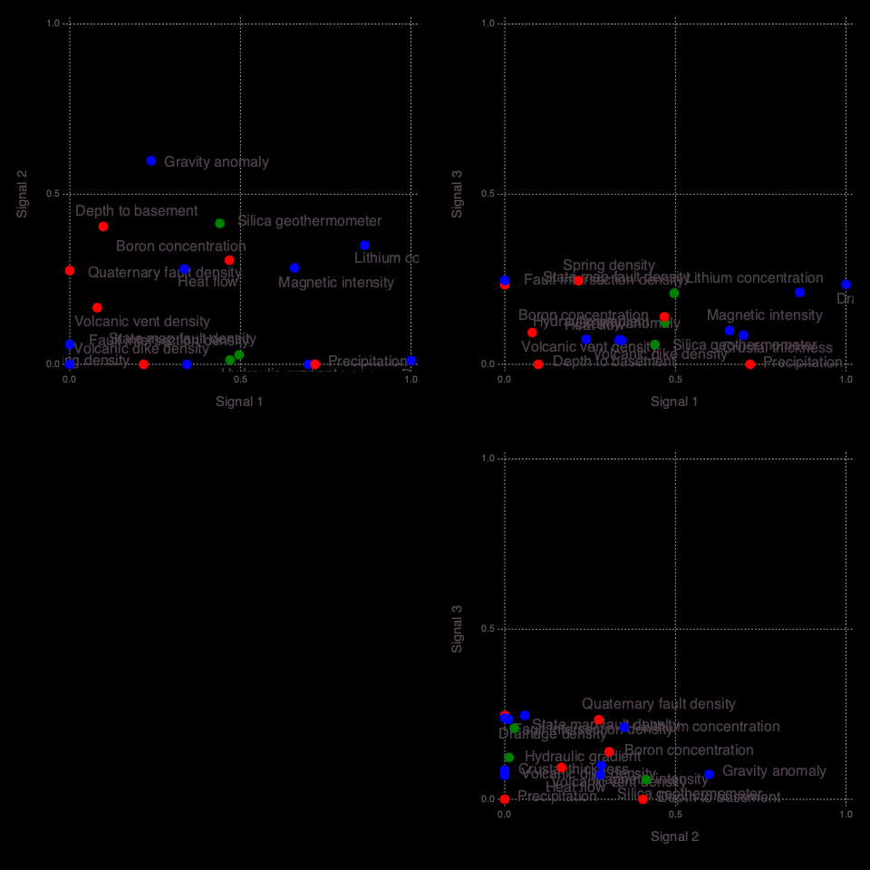
    


    

    


    


    
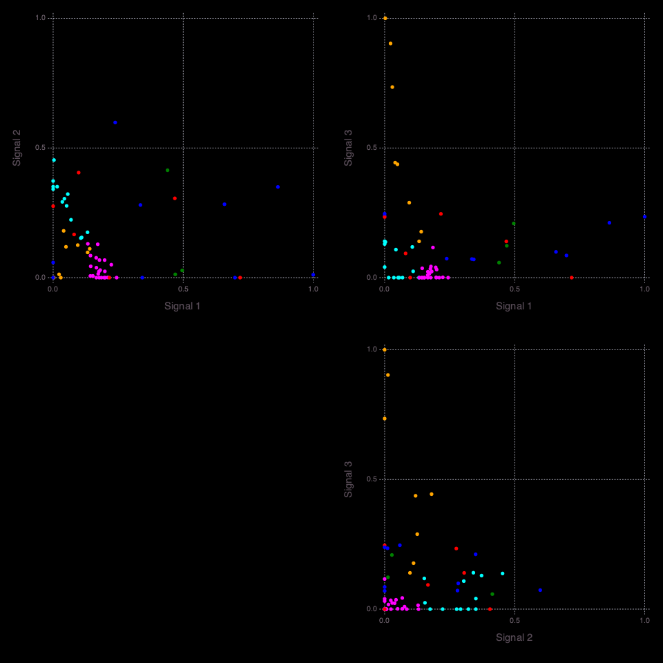
    


    

    


    Signal importance (high->low): [2, 1, 4, 3]


    ┌ Info: Number of signals: 4
    └ @ NMFk /Users/bulbulahmmed/.julia/packages/NMFk/koh08/src/NMFkPostprocess.jl:144
    ┌ Info: Locations (signals=4)
    └ @ NMFk /Users/bulbulahmmed/.julia/packages/NMFk/koh08/src/NMFkPostprocess.jl:148
    ┌ Warning: type Clustering.KmeansResult{Core.Array{Core.Float64,2},Core.Float64,Core.Int64} not present in workspace; reconstructing
    └ @ JLD /Users/bulbulahmmed/.julia/packages/JLD/3UXN2/src/jld_types.jl:697
    ┌ Info: Robust k-means analysis results are loaded from file results-case01/Hmatrix-4-4_44-1000.jld!
    └ @ NMFk /Users/bulbulahmmed/.julia/packages/NMFk/koh08/src/NMFkCluster.jl:67
    ┌ Warning: Procedure to find unique signals could not identify a solution ...
    └ @ NMFk /Users/bulbulahmmed/.julia/packages/NMFk/koh08/src/NMFkCluster.jl:158
    ┌ Warning: Procedure to find unique signals could not identify a solution ...
    └ @ NMFk /Users/bulbulahmmed/.julia/packages/NMFk/koh08/src/NMFkCluster.jl:158
    ┌ Warning: Procedure to find unique signals could not identify a solution ...
    └ @ NMFk /Users/bulbulahmmed/.julia/packages/NMFk/koh08/src/NMFkCluster.jl:158
    ┌ Warning: Procedure to find unique signals could not identify a solution ...
    └ @ NMFk /Users/bulbulahmmed/.julia/packages/NMFk/koh08/src/NMFkCluster.jl:158
    ┌ Warning: type Clustering.KmeansResult{Core.Array{Core.Float64,2},Core.Float64,Core.Int64} not present in workspace; reconstructing
    └ @ JLD /Users/bulbulahmmed/.julia/packages/JLD/3UXN2/src/jld_types.jl:697


    15×2 Array{Any,2}:
     "Allen spr"       1.0
     "Turkey spr"      0.890671
     "Ash spr"         0.860399
     "Garton well"     0.837981
     "Mimbres spr"     0.756788
     "Spring"          0.727799
     "Mangas spr"      0.697281
     "Gila spr 1"      0.667903
     "Spring Can"      0.647347
     "Gila spr 2"      0.646943
     "Riverside well"  0.602983
     "Cliff spr"       0.592572
     "Freiborn spr"    0.579998
     "Apache well"     0.569518
     "Kennecott well"  0.546961


    13×2 Array{Any,2}:
     "Fed H1 well"     1.0
     "Well 4"          0.820447
     "Los Alturas"     0.774358
     "Well 5"          0.771269
     "Well 2"          0.755708
     "Lightning Dock"  0.70557
     "Radium spr"      0.666575
     "Carne well"      0.631706
     "Well 3"          0.596359
     "Victoria well"   0.477645
     "Faywood spr"     0.378783
     "Goat spr"        0.330589
     "Derry spr"       0.324788


    10×2 Array{Any,2}:
     "Jerry well"    1.0
     "Pueblo well"   0.978656
     "Rainbow spr"   0.926226
     "Sacred spr"    0.920803
     "Dent well"     0.911277
     "Alamos spr"    0.869018
     "Laguna Pbl"    0.779479
     "Well 1"        0.701792
     "Aragon spr"    0.678922
     "Ojo Caliente"  0.473437


    6×2 Array{Any,2}:
     "Socorro Can"   1.0
     "Ojitos spr"    0.897681
     "Ojo Canas"     0.725719
     "T or C spr"    0.449617
     "B.Iorio well"  0.445734
     "Warm spr"      0.177576


    

    


    ┌ Info: Robust k-means analysis results are loaded from file results-case01/Wmatrix-4-4_18-1000.jld!
    └ @ NMFk /Users/bulbulahmmed/.julia/packages/NMFk/koh08/src/NMFkCluster.jl:67
    ┌ Info: Signal A -> A Count: 15
    └ @ NMFk /Users/bulbulahmmed/.julia/packages/NMFk/koh08/src/NMFkPostprocess.jl:255
    ┌ Info: Signal B -> B Count: 13
    └ @ NMFk /Users/bulbulahmmed/.julia/packages/NMFk/koh08/src/NMFkPostprocess.jl:255
    ┌ Info: Signal C -> C Count: 10
    └ @ NMFk /Users/bulbulahmmed/.julia/packages/NMFk/koh08/src/NMFkPostprocess.jl:255
    ┌ Info: Signal D -> D Count: 6
    └ @ NMFk /Users/bulbulahmmed/.julia/packages/NMFk/koh08/src/NMFkPostprocess.jl:255
    ┌ Info: Signal A (S2) (k-means clustering)
    └ @ NMFk /Users/bulbulahmmed/.julia/packages/NMFk/koh08/src/NMFkPostprocess.jl:272
    ┌ Info: Signal B (S1) (k-means clustering)
    └ @ NMFk /Users/bulbulahmmed/.julia/packages/NMFk/koh08/src/NMFkPostprocess.jl:272
    ┌ Info: Signal C (S4) (k-means clustering)
    └ @ NMFk /Users/bulbulahmmed/.julia/packages/NMFk/koh08/src/NMFkPostprocess.jl:272
    ┌ Info: Signal D (S3) (k-means clustering)
    └ @ NMFk /Users/bulbulahmmed/.julia/packages/NMFk/koh08/src/NMFkPostprocess.jl:272


    

    


    


<?xml version="1.0" encoding="UTF-8"?>
<svg xmlns="http://www.w3.org/2000/svg"
     xmlns:xlink="http://www.w3.org/1999/xlink"
     xmlns:gadfly="http://www.gadflyjl.org/ns"
     version="1.2"
     width="141.42mm" height="100mm" viewBox="0 0 141.42 100"
     stroke="none"
     fill="#000000"
     stroke-width="0.3"
     font-size="3.88"

     id="img-cc703359">
<defs>
  <marker id="arrow" markerWidth="15" markerHeight="7" refX="5" refY="3.5" orient="auto" markerUnits="strokeWidth">
    <path d="M0,0 L15,3.5 L0,7 z" stroke="context-stroke" fill="context-stroke"/>
  </marker>
</defs>
<g class="plotroot" id="img-cc703359-1">
  <g class="guide xlabels" font-size="2.82" font-family="'PT Sans Caption','Helvetica Neue','Helvetica',sans-serif" fill="#6C606B" id="img-cc703359-2">
    <g transform="translate(69.48,92.22)" gadfly:scale="1.0" visibility="visible">
      <g class="primitive">
        <text text-anchor="end" dy="-0em" transform="rotate(-90,0, 0)">A</text>
      </g>
    </g>
    <g transform="translate(71.33,92.22)" gadfly:scale="1.0" visibility="visible">
      <g class="primitive">
        <text text-anchor="end" dy="-0em" transform="rotate(-90,0, 0)">B</text>
      </g>
    </g>
    <g transform="translate(73.18,92.22)" gadfly:scale="1.0" visibility="visible">
      <g class="primitive">
        <text text-anchor="end" dy="-0em" transform="rotate(-90,0, 0)">C</text>
      </g>
    </g>
    <g transform="translate(75.02,92.22)" gadfly:scale="1.0" visibility="visible">
      <g class="primitive">
        <text text-anchor="end" dy="-0em" transform="rotate(-90,0, 0)">D</text>
      </g>
    </g>
  </g>
  <g stroke-width="0.11" stroke="#FFFFFF" id="img-cc703359-3">
    <g transform="translate(78.2,59.84)">
      <path fill="none" d="M-1.19,0.92 L1.19,0.92 1.19,-0.92 -1.19,-0.92 " class="primitive"/>
    </g>
    <g transform="translate(78.2,39.54)">
      <path fill="none" d="M-1.19,0.92 L1.19,0.92 1.19,-0.92 -1.19,-0.92 " class="primitive"/>
    </g>
    <g transform="translate(78.2,85.69)">
      <path fill="none" d="M-1.19,0.92 L1.19,0.92 1.19,-0.92 -1.19,-0.92 " class="primitive"/>
    </g>
    <g transform="translate(79.98,61.23)">
      <path fill="none" d="M-2.98,1.38 L1.79,1.38 1.79,-1.38 -0.6,-1.38 " class="primitive"/>
    </g>
    <g transform="translate(78.2,24.77)">
      <path fill="none" d="M-1.19,0.92 L1.19,0.92 1.19,-0.92 -1.19,-0.92 " class="primitive"/>
    </g>
    <g transform="translate(78.2,50.61)">
      <path fill="none" d="M-1.19,0.92 L1.19,0.92 1.19,-0.92 -1.19,-0.92 " class="primitive"/>
    </g>
    <g transform="translate(78.2,30.31)">
      <path fill="none" d="M-1.19,0.92 L1.19,0.92 1.19,-0.92 -1.19,-0.92 " class="primitive"/>
    </g>
    <g transform="translate(79.98,40.92)">
      <path fill="none" d="M-2.98,1.38 L1.79,1.38 1.79,-1.38 -0.6,-1.38 " class="primitive"/>
    </g>
    <g transform="translate(78.2,74.61)">
      <path fill="none" d="M-1.19,0.92 L1.19,0.92 1.19,-0.92 -1.19,-0.92 " class="primitive"/>
    </g>
    <g transform="translate(79.98,87.07)">
      <path fill="none" d="M-2.98,1.38 L1.79,1.38 1.79,-1.38 -0.6,-1.38 " class="primitive"/>
    </g>
    <g transform="translate(81.77,62.84)">
      <path fill="none" d="M-4.76,1.62 L2.38,1.62 2.38,-1.62 0,-1.62 " class="primitive"/>
    </g>
    <g transform="translate(78.2,17.38)">
      <path fill="none" d="M-1.19,0.92 L1.19,0.92 1.19,-0.92 -1.19,-0.92 " class="primitive"/>
    </g>
    <g transform="translate(81.77,42.54)">
      <path fill="none" d="M-4.76,1.62 L2.38,1.62 2.38,-1.62 0,-1.62 " class="primitive"/>
    </g>
    <g transform="translate(78.2,81.99)">
      <path fill="none" d="M-1.19,0.92 L1.19,0.92 1.19,-0.92 -1.19,-0.92 " class="primitive"/>
    </g>
    <g transform="translate(79.98,31.69)">
      <path fill="none" d="M-2.98,1.38 L1.79,1.38 1.79,-1.38 -0.6,-1.38 " class="primitive"/>
    </g>
    <g transform="translate(78.2,35.84)">
      <path fill="none" d="M-1.19,0.92 L1.19,0.92 1.19,-0.92 -1.19,-0.92 " class="primitive"/>
    </g>
    <g transform="translate(83.56,64.57)">
      <path fill="none" d="M-6.55,1.73 L2.98,1.73 2.98,-1.73 0.6,-1.73 " class="primitive"/>
    </g>
    <g transform="translate(79.98,76)">
      <path fill="none" d="M-2.98,1.38 L1.79,1.38 1.79,-1.38 -0.6,-1.38 " class="primitive"/>
    </g>
    <g transform="translate(78.2,69.07)">
      <path fill="none" d="M-1.19,0.92 L1.19,0.92 1.19,-0.92 -1.19,-0.92 " class="primitive"/>
    </g>
    <g transform="translate(78.2,11.85)">
      <path fill="none" d="M-1.19,0.92 L1.19,0.92 1.19,-0.92 -1.19,-0.92 " class="primitive"/>
    </g>
    <g transform="translate(79.98,26.15)">
      <path fill="none" d="M-2.98,1.38 L1.79,1.38 1.79,-1.38 -0.6,-1.38 " class="primitive"/>
    </g>
    <g transform="translate(79.98,13.23)">
      <path fill="none" d="M-2.98,1.38 L1.79,1.38 1.79,-1.38 -0.6,-1.38 " class="primitive"/>
    </g>
    <g transform="translate(79.98,52)">
      <path fill="none" d="M-2.98,1.38 L1.79,1.38 1.79,-1.38 -0.6,-1.38 " class="primitive"/>
    </g>
    <g transform="translate(78.2,56.15)">
      <path fill="none" d="M-1.19,0.92 L1.19,0.92 1.19,-0.92 -1.19,-0.92 " class="primitive"/>
    </g>
    <g transform="translate(84.15,39.19)">
      <path fill="none" d="M0,3.35 L2.38,3.35 2.38,-3.35 -4.76,-3.35 " class="primitive"/>
    </g>
    <g transform="translate(78.2,46.92)">
      <path fill="none" d="M-1.19,0.92 L1.19,0.92 1.19,-0.92 -1.19,-0.92 " class="primitive"/>
    </g>
    <g transform="translate(82.36,84.53)">
      <path fill="none" d="M-0.6,2.54 L1.79,2.54 1.79,-2.54 -2.98,-2.54 " class="primitive"/>
    </g>
    <g transform="translate(82.96,28.92)">
      <path fill="none" d="M-1.19,2.77 L1.19,2.77 1.19,-2.77 -1.19,-2.77 " class="primitive"/>
    </g>
    <g transform="translate(83.56,87.42)">
      <path fill="none" d="M-6.55,2.88 L2.98,2.88 2.98,-2.88 0.6,-2.88 " class="primitive"/>
    </g>
    <g transform="translate(78.2,21.08)">
      <path fill="none" d="M-1.19,0.92 L1.19,0.92 1.19,-0.92 -1.19,-0.92 " class="primitive"/>
    </g>
    <g transform="translate(79.98,70.46)">
      <path fill="none" d="M-2.98,1.38 L1.79,1.38 1.79,-1.38 -0.6,-1.38 " class="primitive"/>
    </g>
    <g transform="translate(82.36,15.31)">
      <path fill="none" d="M-2.98,2.08 L1.79,2.08 1.79,-2.08 -0.6,-2.08 " class="primitive"/>
    </g>
    <g transform="translate(81.77,77.61)">
      <path fill="none" d="M-4.76,1.62 L2.38,1.62 2.38,-1.62 0,-1.62 " class="primitive"/>
    </g>
    <g transform="translate(85.94,60.36)">
      <path fill="none" d="M0.6,4.21 L2.98,4.21 2.98,-4.21 -6.55,-4.21 " class="primitive"/>
    </g>
    <g transform="translate(87.13,34.06)">
      <path fill="none" d="M-0.6,5.13 L1.79,5.13 1.79,-5.13 -2.98,-5.13 " class="primitive"/>
    </g>
    <g transform="translate(87.13,82.51)">
      <path fill="none" d="M-0.6,4.9 L1.79,4.9 1.79,-4.9 -2.98,-4.9 " class="primitive"/>
    </g>
    <g transform="translate(84.15,18.19)">
      <path fill="none" d="M-4.76,2.88 L2.38,2.88 2.38,-2.88 0,-2.88 " class="primitive"/>
    </g>
    <g transform="translate(88.32,65.41)">
      <path fill="none" d="M-6.55,5.05 L2.98,5.05 2.98,-5.05 0.6,-5.05 " class="primitive"/>
    </g>
    <g transform="translate(82.36,49.46)">
      <path fill="none" d="M-0.6,2.54 L1.79,2.54 1.79,-2.54 -2.98,-2.54 " class="primitive"/>
    </g>
    <g transform="translate(89.51,26.12)">
      <path fill="none" d="M-0.6,7.93 L1.79,7.93 1.79,-7.93 -2.98,-7.93 " class="primitive"/>
    </g>
    <g transform="translate(90.7,37.79)">
      <path fill="none" d="M-6.55,11.67 L2.98,11.67 2.98,-11.67 0.6,-11.67 " class="primitive"/>
    </g>
    <g transform="translate(94.28,51.6)">
      <path fill="none" d="M-2.98,13.81 L1.79,13.81 1.79,-13.81 -0.6,-13.81 " class="primitive"/>
    </g>
    <g transform="translate(95.47,67.06)">
      <path fill="none" d="M-6.55,15.46 L2.98,15.46 2.98,-15.46 0.6,-15.46 " class="primitive"/>
    </g>
  </g>
  <g clip-path="url(#img-cc703359-4)">
    <g id="img-cc703359-5">
      <g pointer-events="visible" stroke-width="0.3" fill="#000000" fill-opacity="0.000" stroke="#000000" stroke-opacity="0.000" class="guide background" id="img-cc703359-6">
        <g transform="translate(72.25,50.61)" id="img-cc703359-7">
          <path d="M-3.69,-40.61 L3.69,-40.61 3.69,40.61 -3.69,40.61  z" class="primitive"/>
        </g>
      </g>
      <g class="guide ygridlines xfixed" stroke-dasharray="0.5,0.5" stroke-width="0.2" stroke="#D0D0E0" id="img-cc703359-8">
        <g transform="translate(72.25,11.85)" id="img-cc703359-9" visibility="visible" gadfly:scale="1.0">
          <path fill="none" d="M-3.69,0 L3.69,0 " class="primitive"/>
        </g>
        <g transform="translate(72.25,13.69)" id="img-cc703359-10" visibility="visible" gadfly:scale="1.0">
          <path fill="none" d="M-3.69,0 L3.69,0 " class="primitive"/>
        </g>
        <g transform="translate(72.25,15.54)" id="img-cc703359-11" visibility="visible" gadfly:scale="1.0">
          <path fill="none" d="M-3.69,0 L3.69,0 " class="primitive"/>
        </g>
        <g transform="translate(72.25,17.38)" id="img-cc703359-12" visibility="visible" gadfly:scale="1.0">
          <path fill="none" d="M-3.69,0 L3.69,0 " class="primitive"/>
        </g>
        <g transform="translate(72.25,19.23)" id="img-cc703359-13" visibility="visible" gadfly:scale="1.0">
          <path fill="none" d="M-3.69,0 L3.69,0 " class="primitive"/>
        </g>
        <g transform="translate(72.25,21.08)" id="img-cc703359-14" visibility="visible" gadfly:scale="1.0">
          <path fill="none" d="M-3.69,0 L3.69,0 " class="primitive"/>
        </g>
        <g transform="translate(72.25,22.92)" id="img-cc703359-15" visibility="visible" gadfly:scale="1.0">
          <path fill="none" d="M-3.69,0 L3.69,0 " class="primitive"/>
        </g>
        <g transform="translate(72.25,24.77)" id="img-cc703359-16" visibility="visible" gadfly:scale="1.0">
          <path fill="none" d="M-3.69,0 L3.69,0 " class="primitive"/>
        </g>
        <g transform="translate(72.25,26.61)" id="img-cc703359-17" visibility="visible" gadfly:scale="1.0">
          <path fill="none" d="M-3.69,0 L3.69,0 " class="primitive"/>
        </g>
        <g transform="translate(72.25,28.46)" id="img-cc703359-18" visibility="visible" gadfly:scale="1.0">
          <path fill="none" d="M-3.69,0 L3.69,0 " class="primitive"/>
        </g>
        <g transform="translate(72.25,30.31)" id="img-cc703359-19" visibility="visible" gadfly:scale="1.0">
          <path fill="none" d="M-3.69,0 L3.69,0 " class="primitive"/>
        </g>
        <g transform="translate(72.25,32.15)" id="img-cc703359-20" visibility="visible" gadfly:scale="1.0">
          <path fill="none" d="M-3.69,0 L3.69,0 " class="primitive"/>
        </g>
        <g transform="translate(72.25,34)" id="img-cc703359-21" visibility="visible" gadfly:scale="1.0">
          <path fill="none" d="M-3.69,0 L3.69,0 " class="primitive"/>
        </g>
        <g transform="translate(72.25,35.84)" id="img-cc703359-22" visibility="visible" gadfly:scale="1.0">
          <path fill="none" d="M-3.69,0 L3.69,0 " class="primitive"/>
        </g>
        <g transform="translate(72.25,37.69)" id="img-cc703359-23" visibility="visible" gadfly:scale="1.0">
          <path fill="none" d="M-3.69,0 L3.69,0 " class="primitive"/>
        </g>
        <g transform="translate(72.25,39.54)" id="img-cc703359-24" visibility="visible" gadfly:scale="1.0">
          <path fill="none" d="M-3.69,0 L3.69,0 " class="primitive"/>
        </g>
        <g transform="translate(72.25,41.38)" id="img-cc703359-25" visibility="visible" gadfly:scale="1.0">
          <path fill="none" d="M-3.69,0 L3.69,0 " class="primitive"/>
        </g>
        <g transform="translate(72.25,43.23)" id="img-cc703359-26" visibility="visible" gadfly:scale="1.0">
          <path fill="none" d="M-3.69,0 L3.69,0 " class="primitive"/>
        </g>
        <g transform="translate(72.25,45.07)" id="img-cc703359-27" visibility="visible" gadfly:scale="1.0">
          <path fill="none" d="M-3.69,0 L3.69,0 " class="primitive"/>
        </g>
        <g transform="translate(72.25,46.92)" id="img-cc703359-28" visibility="visible" gadfly:scale="1.0">
          <path fill="none" d="M-3.69,0 L3.69,0 " class="primitive"/>
        </g>
        <g transform="translate(72.25,48.77)" id="img-cc703359-29" visibility="visible" gadfly:scale="1.0">
          <path fill="none" d="M-3.69,0 L3.69,0 " class="primitive"/>
        </g>
        <g transform="translate(72.25,50.61)" id="img-cc703359-30" visibility="visible" gadfly:scale="1.0">
          <path fill="none" d="M-3.69,0 L3.69,0 " class="primitive"/>
        </g>
        <g transform="translate(72.25,52.46)" id="img-cc703359-31" visibility="visible" gadfly:scale="1.0">
          <path fill="none" d="M-3.69,0 L3.69,0 " class="primitive"/>
        </g>
        <g transform="translate(72.25,54.3)" id="img-cc703359-32" visibility="visible" gadfly:scale="1.0">
          <path fill="none" d="M-3.69,0 L3.69,0 " class="primitive"/>
        </g>
        <g transform="translate(72.25,56.15)" id="img-cc703359-33" visibility="visible" gadfly:scale="1.0">
          <path fill="none" d="M-3.69,0 L3.69,0 " class="primitive"/>
        </g>
        <g transform="translate(72.25,58)" id="img-cc703359-34" visibility="visible" gadfly:scale="1.0">
          <path fill="none" d="M-3.69,0 L3.69,0 " class="primitive"/>
        </g>
        <g transform="translate(72.25,59.84)" id="img-cc703359-35" visibility="visible" gadfly:scale="1.0">
          <path fill="none" d="M-3.69,0 L3.69,0 " class="primitive"/>
        </g>
        <g transform="translate(72.25,61.69)" id="img-cc703359-36" visibility="visible" gadfly:scale="1.0">
          <path fill="none" d="M-3.69,0 L3.69,0 " class="primitive"/>
        </g>
        <g transform="translate(72.25,63.53)" id="img-cc703359-37" visibility="visible" gadfly:scale="1.0">
          <path fill="none" d="M-3.69,0 L3.69,0 " class="primitive"/>
        </g>
        <g transform="translate(72.25,65.38)" id="img-cc703359-38" visibility="visible" gadfly:scale="1.0">
          <path fill="none" d="M-3.69,0 L3.69,0 " class="primitive"/>
        </g>
        <g transform="translate(72.25,67.23)" id="img-cc703359-39" visibility="visible" gadfly:scale="1.0">
          <path fill="none" d="M-3.69,0 L3.69,0 " class="primitive"/>
        </g>
        <g transform="translate(72.25,69.07)" id="img-cc703359-40" visibility="visible" gadfly:scale="1.0">
          <path fill="none" d="M-3.69,0 L3.69,0 " class="primitive"/>
        </g>
        <g transform="translate(72.25,70.92)" id="img-cc703359-41" visibility="visible" gadfly:scale="1.0">
          <path fill="none" d="M-3.69,0 L3.69,0 " class="primitive"/>
        </g>
        <g transform="translate(72.25,72.76)" id="img-cc703359-42" visibility="visible" gadfly:scale="1.0">
          <path fill="none" d="M-3.69,0 L3.69,0 " class="primitive"/>
        </g>
        <g transform="translate(72.25,74.61)" id="img-cc703359-43" visibility="visible" gadfly:scale="1.0">
          <path fill="none" d="M-3.69,0 L3.69,0 " class="primitive"/>
        </g>
        <g transform="translate(72.25,76.46)" id="img-cc703359-44" visibility="visible" gadfly:scale="1.0">
          <path fill="none" d="M-3.69,0 L3.69,0 " class="primitive"/>
        </g>
        <g transform="translate(72.25,78.3)" id="img-cc703359-45" visibility="visible" gadfly:scale="1.0">
          <path fill="none" d="M-3.69,0 L3.69,0 " class="primitive"/>
        </g>
        <g transform="translate(72.25,80.15)" id="img-cc703359-46" visibility="visible" gadfly:scale="1.0">
          <path fill="none" d="M-3.69,0 L3.69,0 " class="primitive"/>
        </g>
        <g transform="translate(72.25,81.99)" id="img-cc703359-47" visibility="visible" gadfly:scale="1.0">
          <path fill="none" d="M-3.69,0 L3.69,0 " class="primitive"/>
        </g>
        <g transform="translate(72.25,83.84)" id="img-cc703359-48" visibility="visible" gadfly:scale="1.0">
          <path fill="none" d="M-3.69,0 L3.69,0 " class="primitive"/>
        </g>
        <g transform="translate(72.25,85.69)" id="img-cc703359-49" visibility="visible" gadfly:scale="1.0">
          <path fill="none" d="M-3.69,0 L3.69,0 " class="primitive"/>
        </g>
        <g transform="translate(72.25,87.53)" id="img-cc703359-50" visibility="visible" gadfly:scale="1.0">
          <path fill="none" d="M-3.69,0 L3.69,0 " class="primitive"/>
        </g>
        <g transform="translate(72.25,89.38)" id="img-cc703359-51" visibility="visible" gadfly:scale="1.0">
          <path fill="none" d="M-3.69,0 L3.69,0 " class="primitive"/>
        </g>
      </g>
      <g class="guide xgridlines yfixed" stroke-dasharray="0.5,0.5" stroke-width="0.2" stroke="#D0D0E0" id="img-cc703359-52">
        <g transform="translate(70.41,50.61)" id="img-cc703359-53" visibility="visible" gadfly:scale="1.0">
          <path fill="none" d="M0,-40.61 L0,40.61 " class="primitive"/>
        </g>
        <g transform="translate(72.25,50.61)" id="img-cc703359-54" visibility="visible" gadfly:scale="1.0">
          <path fill="none" d="M0,-40.61 L0,40.61 " class="primitive"/>
        </g>
        <g transform="translate(74.1,50.61)" id="img-cc703359-55" visibility="visible" gadfly:scale="1.0">
          <path fill="none" d="M0,-40.61 L0,40.61 " class="primitive"/>
        </g>
      </g>
      <g class="plotpanel" id="img-cc703359-56">
        <metadata>
          <boundingbox value="68.56172299120841mm 10.0mm 7.384067481455177mm 81.22474229600695mm"/>
          <unitbox value="0.5 0.5 4.0 44.0"/>
        </metadata>
        <g shape-rendering="crispEdges" class="geometry" stroke="#000000" stroke-opacity="0.000" id="img-cc703359-57">
          <g transform="translate(69.51,10.95)" id="img-cc703359-58" fill="#FFE200" fill-opacity="1">
            <path d="M-0.95,-0.95 L0.95,-0.95 0.95,0.95 -0.95,0.95  z" class="primitive"/>
          </g>
          <g transform="translate(69.51,12.79)" id="img-cc703359-59" fill="#FFC100" fill-opacity="1">
            <path d="M-0.95,-0.95 L0.95,-0.95 0.95,0.95 -0.95,0.95  z" class="primitive"/>
          </g>
          <g transform="translate(69.51,14.64)" id="img-cc703359-60" fill="#FFC900" fill-opacity="1">
            <path d="M-0.95,-0.95 L0.95,-0.95 0.95,0.95 -0.95,0.95  z" class="primitive"/>
          </g>
          <g transform="translate(69.51,16.49)" id="img-cc703359-61" fill="#FF6400" fill-opacity="1">
            <path d="M-0.95,-0.95 L0.95,-0.95 0.95,0.95 -0.95,0.95  z" class="primitive"/>
          </g>
          <g transform="translate(69.51,18.33)" id="img-cc703359-62" fill="#FFD900" fill-opacity="1">
            <path d="M-0.95,-0.95 L0.95,-0.95 0.95,0.95 -0.95,0.95  z" class="primitive"/>
          </g>
          <g transform="translate(69.51,20.18)" id="img-cc703359-63" fill="#FFAA00" fill-opacity="1">
            <path d="M-0.95,-0.95 L0.95,-0.95 0.95,0.95 -0.95,0.95  z" class="primitive"/>
          </g>
          <g transform="translate(69.51,22.02)" id="img-cc703359-64" fill="#FFDD00" fill-opacity="1">
            <path d="M-0.95,-0.95 L0.95,-0.95 0.95,0.95 -0.95,0.95  z" class="primitive"/>
          </g>
          <g transform="translate(69.51,23.87)" id="img-cc703359-65" fill="#FF7200" fill-opacity="1">
            <path d="M-0.95,-0.95 L0.95,-0.95 0.95,0.95 -0.95,0.95  z" class="primitive"/>
          </g>
          <g transform="translate(69.51,25.72)" id="img-cc703359-66" fill="#FFB600" fill-opacity="1">
            <path d="M-0.95,-0.95 L0.95,-0.95 0.95,0.95 -0.95,0.95  z" class="primitive"/>
          </g>
          <g transform="translate(69.51,27.56)" id="img-cc703359-67" fill="#FFC900" fill-opacity="1">
            <path d="M-0.95,-0.95 L0.95,-0.95 0.95,0.95 -0.95,0.95  z" class="primitive"/>
          </g>
          <g transform="translate(69.51,29.41)" id="img-cc703359-68" fill="#FF0000" fill-opacity="1">
            <path d="M-0.95,-0.95 L0.95,-0.95 0.95,0.95 -0.95,0.95  z" class="primitive"/>
          </g>
          <g transform="translate(69.51,31.25)" id="img-cc703359-69" fill="#FF9F00" fill-opacity="1">
            <path d="M-0.95,-0.95 L0.95,-0.95 0.95,0.95 -0.95,0.95  z" class="primitive"/>
          </g>
          <g transform="translate(69.51,33.1)" id="img-cc703359-70" fill="#FF7D00" fill-opacity="1">
            <path d="M-0.95,-0.95 L0.95,-0.95 0.95,0.95 -0.95,0.95  z" class="primitive"/>
          </g>
          <g transform="translate(69.51,34.95)" id="img-cc703359-71" fill="#FFEE00" fill-opacity="1">
            <path d="M-0.95,-0.95 L0.95,-0.95 0.95,0.95 -0.95,0.95  z" class="primitive"/>
          </g>
          <g transform="translate(69.51,36.79)" id="img-cc703359-72" fill="#FFE600" fill-opacity="1">
            <path d="M-0.95,-0.95 L0.95,-0.95 0.95,0.95 -0.95,0.95  z" class="primitive"/>
          </g>
          <g transform="translate(69.51,38.64)" id="img-cc703359-73" fill="#6DAA00" fill-opacity="1">
            <path d="M-0.95,-0.95 L0.95,-0.95 0.95,0.95 -0.95,0.95  z" class="primitive"/>
          </g>
          <g transform="translate(69.51,40.48)" id="img-cc703359-74" fill="#C0DA00" fill-opacity="1">
            <path d="M-0.95,-0.95 L0.95,-0.95 0.95,0.95 -0.95,0.95  z" class="primitive"/>
          </g>
          <g transform="translate(69.51,42.33)" id="img-cc703359-75" fill="#E0ED00" fill-opacity="1">
            <path d="M-0.95,-0.95 L0.95,-0.95 0.95,0.95 -0.95,0.95  z" class="primitive"/>
          </g>
          <g transform="translate(69.51,44.18)" id="img-cc703359-76" fill="#FFF600" fill-opacity="1">
            <path d="M-0.95,-0.95 L0.95,-0.95 0.95,0.95 -0.95,0.95  z" class="primitive"/>
          </g>
          <g transform="translate(69.51,46.02)" id="img-cc703359-77" fill="#64A600" fill-opacity="1">
            <path d="M-0.95,-0.95 L0.95,-0.95 0.95,0.95 -0.95,0.95  z" class="primitive"/>
          </g>
          <g transform="translate(69.51,47.87)" id="img-cc703359-78" fill="#008000" fill-opacity="1">
            <path d="M-0.95,-0.95 L0.95,-0.95 0.95,0.95 -0.95,0.95  z" class="primitive"/>
          </g>
          <g transform="translate(69.51,49.71)" id="img-cc703359-79" fill="#70AC00" fill-opacity="1">
            <path d="M-0.95,-0.95 L0.95,-0.95 0.95,0.95 -0.95,0.95  z" class="primitive"/>
          </g>
          <g transform="translate(69.51,51.56)" id="img-cc703359-80" fill="#348E00" fill-opacity="1">
            <path d="M-0.95,-0.95 L0.95,-0.95 0.95,0.95 -0.95,0.95  z" class="primitive"/>
          </g>
          <g transform="translate(69.51,53.41)" id="img-cc703359-81" fill="#008000" fill-opacity="1">
            <path d="M-0.95,-0.95 L0.95,-0.95 0.95,0.95 -0.95,0.95  z" class="primitive"/>
          </g>
          <g transform="translate(69.51,55.25)" id="img-cc703359-82" fill="#92BF00" fill-opacity="1">
            <path d="M-0.95,-0.95 L0.95,-0.95 0.95,0.95 -0.95,0.95  z" class="primitive"/>
          </g>
          <g transform="translate(69.51,57.1)" id="img-cc703359-83" fill="#008000" fill-opacity="1">
            <path d="M-0.95,-0.95 L0.95,-0.95 0.95,0.95 -0.95,0.95  z" class="primitive"/>
          </g>
          <g transform="translate(69.51,58.94)" id="img-cc703359-84" fill="#86B900" fill-opacity="1">
            <path d="M-0.95,-0.95 L0.95,-0.95 0.95,0.95 -0.95,0.95  z" class="primitive"/>
          </g>
          <g transform="translate(69.51,60.79)" id="img-cc703359-85" fill="#238700" fill-opacity="1">
            <path d="M-0.95,-0.95 L0.95,-0.95 0.95,0.95 -0.95,0.95  z" class="primitive"/>
          </g>
          <g transform="translate(69.51,62.64)" id="img-cc703359-86" fill="#2C8B00" fill-opacity="1">
            <path d="M-0.95,-0.95 L0.95,-0.95 0.95,0.95 -0.95,0.95  z" class="primitive"/>
          </g>
          <g transform="translate(69.51,64.48)" id="img-cc703359-87" fill="#008000" fill-opacity="1">
            <path d="M-0.95,-0.95 L0.95,-0.95 0.95,0.95 -0.95,0.95  z" class="primitive"/>
          </g>
          <g transform="translate(69.51,66.33)" id="img-cc703359-88" fill="#238700" fill-opacity="1">
            <path d="M-0.95,-0.95 L0.95,-0.95 0.95,0.95 -0.95,0.95  z" class="primitive"/>
          </g>
          <g transform="translate(69.51,68.17)" id="img-cc703359-89" fill="#008000" fill-opacity="1">
            <path d="M-0.95,-0.95 L0.95,-0.95 0.95,0.95 -0.95,0.95  z" class="primitive"/>
          </g>
          <g transform="translate(69.51,70.02)" id="img-cc703359-90" fill="#479700" fill-opacity="1">
            <path d="M-0.95,-0.95 L0.95,-0.95 0.95,0.95 -0.95,0.95  z" class="primitive"/>
          </g>
          <g transform="translate(69.51,71.87)" id="img-cc703359-91" fill="#008000" fill-opacity="1">
            <path d="M-0.95,-0.95 L0.95,-0.95 0.95,0.95 -0.95,0.95  z" class="primitive"/>
          </g>
          <g transform="translate(69.51,73.71)" id="img-cc703359-92" fill="#008000" fill-opacity="1">
            <path d="M-0.95,-0.95 L0.95,-0.95 0.95,0.95 -0.95,0.95  z" class="primitive"/>
          </g>
          <g transform="translate(69.51,75.56)" id="img-cc703359-93" fill="#ACCE00" fill-opacity="1">
            <path d="M-0.95,-0.95 L0.95,-0.95 0.95,0.95 -0.95,0.95  z" class="primitive"/>
          </g>
          <g transform="translate(69.51,77.4)" id="img-cc703359-94" fill="#C1DB00" fill-opacity="1">
            <path d="M-0.95,-0.95 L0.95,-0.95 0.95,0.95 -0.95,0.95  z" class="primitive"/>
          </g>
          <g transform="translate(69.51,79.25)" id="img-cc703359-95" fill="#D5E600" fill-opacity="1">
            <path d="M-0.95,-0.95 L0.95,-0.95 0.95,0.95 -0.95,0.95  z" class="primitive"/>
          </g>
          <g transform="translate(69.51,81.1)" id="img-cc703359-96" fill="#3D9200" fill-opacity="1">
            <path d="M-0.95,-0.95 L0.95,-0.95 0.95,0.95 -0.95,0.95  z" class="primitive"/>
          </g>
          <g transform="translate(69.51,82.94)" id="img-cc703359-97" fill="#429400" fill-opacity="1">
            <path d="M-0.95,-0.95 L0.95,-0.95 0.95,0.95 -0.95,0.95  z" class="primitive"/>
          </g>
          <g transform="translate(69.51,84.79)" id="img-cc703359-98" fill="#348E00" fill-opacity="1">
            <path d="M-0.95,-0.95 L0.95,-0.95 0.95,0.95 -0.95,0.95  z" class="primitive"/>
          </g>
          <g transform="translate(69.51,86.63)" id="img-cc703359-99" fill="#E0ED00" fill-opacity="1">
            <path d="M-0.95,-0.95 L0.95,-0.95 0.95,0.95 -0.95,0.95  z" class="primitive"/>
          </g>
          <g transform="translate(69.51,88.48)" id="img-cc703359-100" fill="#82B600" fill-opacity="1">
            <path d="M-0.95,-0.95 L0.95,-0.95 0.95,0.95 -0.95,0.95  z" class="primitive"/>
          </g>
          <g transform="translate(69.51,90.33)" id="img-cc703359-101" fill="#90BE00" fill-opacity="1">
            <path d="M-0.95,-0.95 L0.95,-0.95 0.95,0.95 -0.95,0.95  z" class="primitive"/>
          </g>
          <g transform="translate(71.36,10.95)" id="img-cc703359-102" fill="#008000" fill-opacity="1">
            <path d="M-0.95,-0.95 L0.95,-0.95 0.95,0.95 -0.95,0.95  z" class="primitive"/>
          </g>
          <g transform="translate(71.36,12.79)" id="img-cc703359-103" fill="#008000" fill-opacity="1">
            <path d="M-0.95,-0.95 L0.95,-0.95 0.95,0.95 -0.95,0.95  z" class="primitive"/>
          </g>
          <g transform="translate(71.36,14.64)" id="img-cc703359-104" fill="#008000" fill-opacity="1">
            <path d="M-0.95,-0.95 L0.95,-0.95 0.95,0.95 -0.95,0.95  z" class="primitive"/>
          </g>
          <g transform="translate(71.36,16.49)" id="img-cc703359-105" fill="#489700" fill-opacity="1">
            <path d="M-0.95,-0.95 L0.95,-0.95 0.95,0.95 -0.95,0.95  z" class="primitive"/>
          </g>
          <g transform="translate(71.36,18.33)" id="img-cc703359-106" fill="#5CA100" fill-opacity="1">
            <path d="M-0.95,-0.95 L0.95,-0.95 0.95,0.95 -0.95,0.95  z" class="primitive"/>
          </g>
          <g transform="translate(71.36,20.18)" id="img-cc703359-107" fill="#94C100" fill-opacity="1">
            <path d="M-0.95,-0.95 L0.95,-0.95 0.95,0.95 -0.95,0.95  z" class="primitive"/>
          </g>
          <g transform="translate(71.36,22.02)" id="img-cc703359-108" fill="#3C9100" fill-opacity="1">
            <path d="M-0.95,-0.95 L0.95,-0.95 0.95,0.95 -0.95,0.95  z" class="primitive"/>
          </g>
          <g transform="translate(71.36,23.87)" id="img-cc703359-109" fill="#008000" fill-opacity="1">
            <path d="M-0.95,-0.95 L0.95,-0.95 0.95,0.95 -0.95,0.95  z" class="primitive"/>
          </g>
          <g transform="translate(71.36,25.72)" id="img-cc703359-110" fill="#1C8500" fill-opacity="1">
            <path d="M-0.95,-0.95 L0.95,-0.95 0.95,0.95 -0.95,0.95  z" class="primitive"/>
          </g>
          <g transform="translate(71.36,27.56)" id="img-cc703359-111" fill="#308C00" fill-opacity="1">
            <path d="M-0.95,-0.95 L0.95,-0.95 0.95,0.95 -0.95,0.95  z" class="primitive"/>
          </g>
          <g transform="translate(71.36,29.41)" id="img-cc703359-112" fill="#008000" fill-opacity="1">
            <path d="M-0.95,-0.95 L0.95,-0.95 0.95,0.95 -0.95,0.95  z" class="primitive"/>
          </g>
          <g transform="translate(71.36,31.25)" id="img-cc703359-113" fill="#5DA200" fill-opacity="1">
            <path d="M-0.95,-0.95 L0.95,-0.95 0.95,0.95 -0.95,0.95  z" class="primitive"/>
          </g>
          <g transform="translate(71.36,33.1)" id="img-cc703359-114" fill="#2C8A00" fill-opacity="1">
            <path d="M-0.95,-0.95 L0.95,-0.95 0.95,0.95 -0.95,0.95  z" class="primitive"/>
          </g>
          <g transform="translate(71.36,34.95)" id="img-cc703359-115" fill="#9FC700" fill-opacity="1">
            <path d="M-0.95,-0.95 L0.95,-0.95 0.95,0.95 -0.95,0.95  z" class="primitive"/>
          </g>
          <g transform="translate(71.36,36.79)" id="img-cc703359-116" fill="#73AE00" fill-opacity="1">
            <path d="M-0.95,-0.95 L0.95,-0.95 0.95,0.95 -0.95,0.95  z" class="primitive"/>
          </g>
          <g transform="translate(71.36,38.64)" id="img-cc703359-117" fill="#F5F900" fill-opacity="1">
            <path d="M-0.95,-0.95 L0.95,-0.95 0.95,0.95 -0.95,0.95  z" class="primitive"/>
          </g>
          <g transform="translate(71.36,40.48)" id="img-cc703359-118" fill="#B2D200" fill-opacity="1">
            <path d="M-0.95,-0.95 L0.95,-0.95 0.95,0.95 -0.95,0.95  z" class="primitive"/>
          </g>
          <g transform="translate(71.36,42.33)" id="img-cc703359-119" fill="#B4D300" fill-opacity="1">
            <path d="M-0.95,-0.95 L0.95,-0.95 0.95,0.95 -0.95,0.95  z" class="primitive"/>
          </g>
          <g transform="translate(71.36,44.18)" id="img-cc703359-120" fill="#C9E000" fill-opacity="1">
            <path d="M-0.95,-0.95 L0.95,-0.95 0.95,0.95 -0.95,0.95  z" class="primitive"/>
          </g>
          <g transform="translate(71.36,46.02)" id="img-cc703359-121" fill="#FFC200" fill-opacity="1">
            <path d="M-0.95,-0.95 L0.95,-0.95 0.95,0.95 -0.95,0.95  z" class="primitive"/>
          </g>
          <g transform="translate(71.36,47.87)" id="img-cc703359-122" fill="#FF8400" fill-opacity="1">
            <path d="M-0.95,-0.95 L0.95,-0.95 0.95,0.95 -0.95,0.95  z" class="primitive"/>
          </g>
          <g transform="translate(71.36,49.71)" id="img-cc703359-123" fill="#FFCF00" fill-opacity="1">
            <path d="M-0.95,-0.95 L0.95,-0.95 0.95,0.95 -0.95,0.95  z" class="primitive"/>
          </g>
          <g transform="translate(71.36,51.56)" id="img-cc703359-124" fill="#FF9800" fill-opacity="1">
            <path d="M-0.95,-0.95 L0.95,-0.95 0.95,0.95 -0.95,0.95  z" class="primitive"/>
          </g>
          <g transform="translate(71.36,53.41)" id="img-cc703359-125" fill="#FF9F00" fill-opacity="1">
            <path d="M-0.95,-0.95 L0.95,-0.95 0.95,0.95 -0.95,0.95  z" class="primitive"/>
          </g>
          <g transform="translate(71.36,55.25)" id="img-cc703359-126" fill="#FFDC00" fill-opacity="1">
            <path d="M-0.95,-0.95 L0.95,-0.95 0.95,0.95 -0.95,0.95  z" class="primitive"/>
          </g>
          <g transform="translate(71.36,57.1)" id="img-cc703359-127" fill="#FF9900" fill-opacity="1">
            <path d="M-0.95,-0.95 L0.95,-0.95 0.95,0.95 -0.95,0.95  z" class="primitive"/>
          </g>
          <g transform="translate(71.36,58.94)" id="img-cc703359-128" fill="#FFB300" fill-opacity="1">
            <path d="M-0.95,-0.95 L0.95,-0.95 0.95,0.95 -0.95,0.95  z" class="primitive"/>
          </g>
          <g transform="translate(71.36,60.79)" id="img-cc703359-129" fill="#FF0000" fill-opacity="1">
            <path d="M-0.95,-0.95 L0.95,-0.95 0.95,0.95 -0.95,0.95  z" class="primitive"/>
          </g>
          <g transform="translate(71.36,62.64)" id="img-cc703359-130" fill="#75AF00" fill-opacity="1">
            <path d="M-0.95,-0.95 L0.95,-0.95 0.95,0.95 -0.95,0.95  z" class="primitive"/>
          </g>
          <g transform="translate(71.36,64.48)" id="img-cc703359-131" fill="#008000" fill-opacity="1">
            <path d="M-0.95,-0.95 L0.95,-0.95 0.95,0.95 -0.95,0.95  z" class="primitive"/>
          </g>
          <g transform="translate(71.36,66.33)" id="img-cc703359-132" fill="#008000" fill-opacity="1">
            <path d="M-0.95,-0.95 L0.95,-0.95 0.95,0.95 -0.95,0.95  z" class="primitive"/>
          </g>
          <g transform="translate(71.36,68.17)" id="img-cc703359-133" fill="#8CBC00" fill-opacity="1">
            <path d="M-0.95,-0.95 L0.95,-0.95 0.95,0.95 -0.95,0.95  z" class="primitive"/>
          </g>
          <g transform="translate(71.36,70.02)" id="img-cc703359-134" fill="#008000" fill-opacity="1">
            <path d="M-0.95,-0.95 L0.95,-0.95 0.95,0.95 -0.95,0.95  z" class="primitive"/>
          </g>
          <g transform="translate(71.36,71.87)" id="img-cc703359-135" fill="#378F00" fill-opacity="1">
            <path d="M-0.95,-0.95 L0.95,-0.95 0.95,0.95 -0.95,0.95  z" class="primitive"/>
          </g>
          <g transform="translate(71.36,73.71)" id="img-cc703359-136" fill="#008000" fill-opacity="1">
            <path d="M-0.95,-0.95 L0.95,-0.95 0.95,0.95 -0.95,0.95  z" class="primitive"/>
          </g>
          <g transform="translate(71.36,75.56)" id="img-cc703359-137" fill="#218700" fill-opacity="1">
            <path d="M-0.95,-0.95 L0.95,-0.95 0.95,0.95 -0.95,0.95  z" class="primitive"/>
          </g>
          <g transform="translate(71.36,77.4)" id="img-cc703359-138" fill="#008000" fill-opacity="1">
            <path d="M-0.95,-0.95 L0.95,-0.95 0.95,0.95 -0.95,0.95  z" class="primitive"/>
          </g>
          <g transform="translate(71.36,79.25)" id="img-cc703359-139" fill="#63A500" fill-opacity="1">
            <path d="M-0.95,-0.95 L0.95,-0.95 0.95,0.95 -0.95,0.95  z" class="primitive"/>
          </g>
          <g transform="translate(71.36,81.1)" id="img-cc703359-140" fill="#098100" fill-opacity="1">
            <path d="M-0.95,-0.95 L0.95,-0.95 0.95,0.95 -0.95,0.95  z" class="primitive"/>
          </g>
          <g transform="translate(71.36,82.94)" id="img-cc703359-141" fill="#008000" fill-opacity="1">
            <path d="M-0.95,-0.95 L0.95,-0.95 0.95,0.95 -0.95,0.95  z" class="primitive"/>
          </g>
          <g transform="translate(71.36,84.79)" id="img-cc703359-142" fill="#008000" fill-opacity="1">
            <path d="M-0.95,-0.95 L0.95,-0.95 0.95,0.95 -0.95,0.95  z" class="primitive"/>
          </g>
          <g transform="translate(71.36,86.63)" id="img-cc703359-143" fill="#84B800" fill-opacity="1">
            <path d="M-0.95,-0.95 L0.95,-0.95 0.95,0.95 -0.95,0.95  z" class="primitive"/>
          </g>
          <g transform="translate(71.36,88.48)" id="img-cc703359-144" fill="#CAE000" fill-opacity="1">
            <path d="M-0.95,-0.95 L0.95,-0.95 0.95,0.95 -0.95,0.95  z" class="primitive"/>
          </g>
          <g transform="translate(71.36,90.33)" id="img-cc703359-145" fill="#8EBD00" fill-opacity="1">
            <path d="M-0.95,-0.95 L0.95,-0.95 0.95,0.95 -0.95,0.95  z" class="primitive"/>
          </g>
          <g transform="translate(73.2,10.95)" id="img-cc703359-146" fill="#91BF00" fill-opacity="1">
            <path d="M-0.95,-0.95 L0.95,-0.95 0.95,0.95 -0.95,0.95  z" class="primitive"/>
          </g>
          <g transform="translate(73.2,12.79)" id="img-cc703359-147" fill="#8BBB00" fill-opacity="1">
            <path d="M-0.95,-0.95 L0.95,-0.95 0.95,0.95 -0.95,0.95  z" class="primitive"/>
          </g>
          <g transform="translate(73.2,14.64)" id="img-cc703359-148" fill="#A4CA00" fill-opacity="1">
            <path d="M-0.95,-0.95 L0.95,-0.95 0.95,0.95 -0.95,0.95  z" class="primitive"/>
          </g>
          <g transform="translate(73.2,16.49)" id="img-cc703359-149" fill="#3C9100" fill-opacity="1">
            <path d="M-0.95,-0.95 L0.95,-0.95 0.95,0.95 -0.95,0.95  z" class="primitive"/>
          </g>
          <g transform="translate(73.2,18.33)" id="img-cc703359-150" fill="#8DBC00" fill-opacity="1">
            <path d="M-0.95,-0.95 L0.95,-0.95 0.95,0.95 -0.95,0.95  z" class="primitive"/>
          </g>
          <g transform="translate(73.2,20.18)" id="img-cc703359-151" fill="#008000" fill-opacity="1">
            <path d="M-0.95,-0.95 L0.95,-0.95 0.95,0.95 -0.95,0.95  z" class="primitive"/>
          </g>
          <g transform="translate(73.2,22.02)" id="img-cc703359-152" fill="#6DAA00" fill-opacity="1">
            <path d="M-0.95,-0.95 L0.95,-0.95 0.95,0.95 -0.95,0.95  z" class="primitive"/>
          </g>
          <g transform="translate(73.2,23.87)" id="img-cc703359-153" fill="#318C00" fill-opacity="1">
            <path d="M-0.95,-0.95 L0.95,-0.95 0.95,0.95 -0.95,0.95  z" class="primitive"/>
          </g>
          <g transform="translate(73.2,25.72)" id="img-cc703359-154" fill="#338D00" fill-opacity="1">
            <path d="M-0.95,-0.95 L0.95,-0.95 0.95,0.95 -0.95,0.95  z" class="primitive"/>
          </g>
          <g transform="translate(73.2,27.56)" id="img-cc703359-155" fill="#73AE00" fill-opacity="1">
            <path d="M-0.95,-0.95 L0.95,-0.95 0.95,0.95 -0.95,0.95  z" class="primitive"/>
          </g>
          <g transform="translate(73.2,29.41)" id="img-cc703359-156" fill="#348E00" fill-opacity="1">
            <path d="M-0.95,-0.95 L0.95,-0.95 0.95,0.95 -0.95,0.95  z" class="primitive"/>
          </g>
          <g transform="translate(73.2,31.25)" id="img-cc703359-157" fill="#549D00" fill-opacity="1">
            <path d="M-0.95,-0.95 L0.95,-0.95 0.95,0.95 -0.95,0.95  z" class="primitive"/>
          </g>
          <g transform="translate(73.2,33.1)" id="img-cc703359-158" fill="#0A8100" fill-opacity="1">
            <path d="M-0.95,-0.95 L0.95,-0.95 0.95,0.95 -0.95,0.95  z" class="primitive"/>
          </g>
          <g transform="translate(73.2,34.95)" id="img-cc703359-159" fill="#288900" fill-opacity="1">
            <path d="M-0.95,-0.95 L0.95,-0.95 0.95,0.95 -0.95,0.95  z" class="primitive"/>
          </g>
          <g transform="translate(73.2,36.79)" id="img-cc703359-160" fill="#3C9100" fill-opacity="1">
            <path d="M-0.95,-0.95 L0.95,-0.95 0.95,0.95 -0.95,0.95  z" class="primitive"/>
          </g>
          <g transform="translate(73.2,38.64)" id="img-cc703359-161" fill="#7DB300" fill-opacity="1">
            <path d="M-0.95,-0.95 L0.95,-0.95 0.95,0.95 -0.95,0.95  z" class="primitive"/>
          </g>
          <g transform="translate(73.2,40.48)" id="img-cc703359-162" fill="#68A800" fill-opacity="1">
            <path d="M-0.95,-0.95 L0.95,-0.95 0.95,0.95 -0.95,0.95  z" class="primitive"/>
          </g>
          <g transform="translate(73.2,42.33)" id="img-cc703359-163" fill="#358E00" fill-opacity="1">
            <path d="M-0.95,-0.95 L0.95,-0.95 0.95,0.95 -0.95,0.95  z" class="primitive"/>
          </g>
          <g transform="translate(73.2,44.18)" id="img-cc703359-164" fill="#3A9000" fill-opacity="1">
            <path d="M-0.95,-0.95 L0.95,-0.95 0.95,0.95 -0.95,0.95  z" class="primitive"/>
          </g>
          <g transform="translate(73.2,46.02)" id="img-cc703359-165" fill="#3E9200" fill-opacity="1">
            <path d="M-0.95,-0.95 L0.95,-0.95 0.95,0.95 -0.95,0.95  z" class="primitive"/>
          </g>
          <g transform="translate(73.2,47.87)" id="img-cc703359-166" fill="#008000" fill-opacity="1">
            <path d="M-0.95,-0.95 L0.95,-0.95 0.95,0.95 -0.95,0.95  z" class="primitive"/>
          </g>
          <g transform="translate(73.2,49.71)" id="img-cc703359-167" fill="#008000" fill-opacity="1">
            <path d="M-0.95,-0.95 L0.95,-0.95 0.95,0.95 -0.95,0.95  z" class="primitive"/>
          </g>
          <g transform="translate(73.2,51.56)" id="img-cc703359-168" fill="#248800" fill-opacity="1">
            <path d="M-0.95,-0.95 L0.95,-0.95 0.95,0.95 -0.95,0.95  z" class="primitive"/>
          </g>
          <g transform="translate(73.2,53.41)" id="img-cc703359-169" fill="#008000" fill-opacity="1">
            <path d="M-0.95,-0.95 L0.95,-0.95 0.95,0.95 -0.95,0.95  z" class="primitive"/>
          </g>
          <g transform="translate(73.2,55.25)" id="img-cc703359-170" fill="#008000" fill-opacity="1">
            <path d="M-0.95,-0.95 L0.95,-0.95 0.95,0.95 -0.95,0.95  z" class="primitive"/>
          </g>
          <g transform="translate(73.2,57.1)" id="img-cc703359-171" fill="#208700" fill-opacity="1">
            <path d="M-0.95,-0.95 L0.95,-0.95 0.95,0.95 -0.95,0.95  z" class="primitive"/>
          </g>
          <g transform="translate(73.2,58.94)" id="img-cc703359-172" fill="#278900" fill-opacity="1">
            <path d="M-0.95,-0.95 L0.95,-0.95 0.95,0.95 -0.95,0.95  z" class="primitive"/>
          </g>
          <g transform="translate(73.2,60.79)" id="img-cc703359-173" fill="#018000" fill-opacity="1">
            <path d="M-0.95,-0.95 L0.95,-0.95 0.95,0.95 -0.95,0.95  z" class="primitive"/>
          </g>
          <g transform="translate(73.2,62.64)" id="img-cc703359-174" fill="#FF6E00" fill-opacity="1">
            <path d="M-0.95,-0.95 L0.95,-0.95 0.95,0.95 -0.95,0.95  z" class="primitive"/>
          </g>
          <g transform="translate(73.2,64.48)" id="img-cc703359-175" fill="#FF5300" fill-opacity="1">
            <path d="M-0.95,-0.95 L0.95,-0.95 0.95,0.95 -0.95,0.95  z" class="primitive"/>
          </g>
          <g transform="translate(73.2,66.33)" id="img-cc703359-176" fill="#FF5000" fill-opacity="1">
            <path d="M-0.95,-0.95 L0.95,-0.95 0.95,0.95 -0.95,0.95  z" class="primitive"/>
          </g>
          <g transform="translate(73.2,68.17)" id="img-cc703359-177" fill="#FF9600" fill-opacity="1">
            <path d="M-0.95,-0.95 L0.95,-0.95 0.95,0.95 -0.95,0.95  z" class="primitive"/>
          </g>
          <g transform="translate(73.2,70.02)" id="img-cc703359-178" fill="#FF5900" fill-opacity="1">
            <path d="M-0.95,-0.95 L0.95,-0.95 0.95,0.95 -0.95,0.95  z" class="primitive"/>
          </g>
          <g transform="translate(73.2,71.87)" id="img-cc703359-179" fill="#FF0000" fill-opacity="1">
            <path d="M-0.95,-0.95 L0.95,-0.95 0.95,0.95 -0.95,0.95  z" class="primitive"/>
          </g>
          <g transform="translate(73.2,73.71)" id="img-cc703359-180" fill="#FF2800" fill-opacity="1">
            <path d="M-0.95,-0.95 L0.95,-0.95 0.95,0.95 -0.95,0.95  z" class="primitive"/>
          </g>
          <g transform="translate(73.2,75.56)" id="img-cc703359-181" fill="#FFB400" fill-opacity="1">
            <path d="M-0.95,-0.95 L0.95,-0.95 0.95,0.95 -0.95,0.95  z" class="primitive"/>
          </g>
          <g transform="translate(73.2,77.4)" id="img-cc703359-182" fill="#FFBD00" fill-opacity="1">
            <path d="M-0.95,-0.95 L0.95,-0.95 0.95,0.95 -0.95,0.95  z" class="primitive"/>
          </g>
          <g transform="translate(73.2,79.25)" id="img-cc703359-183" fill="#F3F800" fill-opacity="1">
            <path d="M-0.95,-0.95 L0.95,-0.95 0.95,0.95 -0.95,0.95  z" class="primitive"/>
          </g>
          <g transform="translate(73.2,81.1)" id="img-cc703359-184" fill="#66A700" fill-opacity="1">
            <path d="M-0.95,-0.95 L0.95,-0.95 0.95,0.95 -0.95,0.95  z" class="primitive"/>
          </g>
          <g transform="translate(73.2,82.94)" id="img-cc703359-185" fill="#67A700" fill-opacity="1">
            <path d="M-0.95,-0.95 L0.95,-0.95 0.95,0.95 -0.95,0.95  z" class="primitive"/>
          </g>
          <g transform="translate(73.2,84.79)" id="img-cc703359-186" fill="#268800" fill-opacity="1">
            <path d="M-0.95,-0.95 L0.95,-0.95 0.95,0.95 -0.95,0.95  z" class="primitive"/>
          </g>
          <g transform="translate(73.2,86.63)" id="img-cc703359-187" fill="#A3C900" fill-opacity="1">
            <path d="M-0.95,-0.95 L0.95,-0.95 0.95,0.95 -0.95,0.95  z" class="primitive"/>
          </g>
          <g transform="translate(73.2,88.48)" id="img-cc703359-188" fill="#008000" fill-opacity="1">
            <path d="M-0.95,-0.95 L0.95,-0.95 0.95,0.95 -0.95,0.95  z" class="primitive"/>
          </g>
          <g transform="translate(73.2,90.33)" id="img-cc703359-189" fill="#008000" fill-opacity="1">
            <path d="M-0.95,-0.95 L0.95,-0.95 0.95,0.95 -0.95,0.95  z" class="primitive"/>
          </g>
          <g transform="translate(75.05,10.95)" id="img-cc703359-190" fill="#008000" fill-opacity="1">
            <path d="M-0.95,-0.95 L0.95,-0.95 0.95,0.95 -0.95,0.95  z" class="primitive"/>
          </g>
          <g transform="translate(75.05,12.79)" id="img-cc703359-191" fill="#308C00" fill-opacity="1">
            <path d="M-0.95,-0.95 L0.95,-0.95 0.95,0.95 -0.95,0.95  z" class="primitive"/>
          </g>
          <g transform="translate(75.05,14.64)" id="img-cc703359-192" fill="#278900" fill-opacity="1">
            <path d="M-0.95,-0.95 L0.95,-0.95 0.95,0.95 -0.95,0.95  z" class="primitive"/>
          </g>
          <g transform="translate(75.05,16.49)" id="img-cc703359-193" fill="#218700" fill-opacity="1">
            <path d="M-0.95,-0.95 L0.95,-0.95 0.95,0.95 -0.95,0.95  z" class="primitive"/>
          </g>
          <g transform="translate(75.05,18.33)" id="img-cc703359-194" fill="#2F8C00" fill-opacity="1">
            <path d="M-0.95,-0.95 L0.95,-0.95 0.95,0.95 -0.95,0.95  z" class="primitive"/>
          </g>
          <g transform="translate(75.05,20.18)" id="img-cc703359-195" fill="#2B8A00" fill-opacity="1">
            <path d="M-0.95,-0.95 L0.95,-0.95 0.95,0.95 -0.95,0.95  z" class="primitive"/>
          </g>
          <g transform="translate(75.05,22.02)" id="img-cc703359-196" fill="#268800" fill-opacity="1">
            <path d="M-0.95,-0.95 L0.95,-0.95 0.95,0.95 -0.95,0.95  z" class="primitive"/>
          </g>
          <g transform="translate(75.05,23.87)" id="img-cc703359-197" fill="#008000" fill-opacity="1">
            <path d="M-0.95,-0.95 L0.95,-0.95 0.95,0.95 -0.95,0.95  z" class="primitive"/>
          </g>
          <g transform="translate(75.05,25.72)" id="img-cc703359-198" fill="#258800" fill-opacity="1">
            <path d="M-0.95,-0.95 L0.95,-0.95 0.95,0.95 -0.95,0.95  z" class="primitive"/>
          </g>
          <g transform="translate(75.05,27.56)" id="img-cc703359-199" fill="#268800" fill-opacity="1">
            <path d="M-0.95,-0.95 L0.95,-0.95 0.95,0.95 -0.95,0.95  z" class="primitive"/>
          </g>
          <g transform="translate(75.05,29.41)" id="img-cc703359-200" fill="#008000" fill-opacity="1">
            <path d="M-0.95,-0.95 L0.95,-0.95 0.95,0.95 -0.95,0.95  z" class="primitive"/>
          </g>
          <g transform="translate(75.05,31.25)" id="img-cc703359-201" fill="#198400" fill-opacity="1">
            <path d="M-0.95,-0.95 L0.95,-0.95 0.95,0.95 -0.95,0.95  z" class="primitive"/>
          </g>
          <g transform="translate(75.05,33.1)" id="img-cc703359-202" fill="#0E8200" fill-opacity="1">
            <path d="M-0.95,-0.95 L0.95,-0.95 0.95,0.95 -0.95,0.95  z" class="primitive"/>
          </g>
          <g transform="translate(75.05,34.95)" id="img-cc703359-203" fill="#008000" fill-opacity="1">
            <path d="M-0.95,-0.95 L0.95,-0.95 0.95,0.95 -0.95,0.95  z" class="primitive"/>
          </g>
          <g transform="translate(75.05,36.79)" id="img-cc703359-204" fill="#008000" fill-opacity="1">
            <path d="M-0.95,-0.95 L0.95,-0.95 0.95,0.95 -0.95,0.95  z" class="primitive"/>
          </g>
          <g transform="translate(75.05,38.64)" id="img-cc703359-205" fill="#008000" fill-opacity="1">
            <path d="M-0.95,-0.95 L0.95,-0.95 0.95,0.95 -0.95,0.95  z" class="primitive"/>
          </g>
          <g transform="translate(75.05,40.48)" id="img-cc703359-206" fill="#579E00" fill-opacity="1">
            <path d="M-0.95,-0.95 L0.95,-0.95 0.95,0.95 -0.95,0.95  z" class="primitive"/>
          </g>
          <g transform="translate(75.05,42.33)" id="img-cc703359-207" fill="#278900" fill-opacity="1">
            <path d="M-0.95,-0.95 L0.95,-0.95 0.95,0.95 -0.95,0.95  z" class="primitive"/>
          </g>
          <g transform="translate(75.05,44.18)" id="img-cc703359-208" fill="#008000" fill-opacity="1">
            <path d="M-0.95,-0.95 L0.95,-0.95 0.95,0.95 -0.95,0.95  z" class="primitive"/>
          </g>
          <g transform="translate(75.05,46.02)" id="img-cc703359-209" fill="#519B00" fill-opacity="1">
            <path d="M-0.95,-0.95 L0.95,-0.95 0.95,0.95 -0.95,0.95  z" class="primitive"/>
          </g>
          <g transform="translate(75.05,47.87)" id="img-cc703359-210" fill="#63A500" fill-opacity="1">
            <path d="M-0.95,-0.95 L0.95,-0.95 0.95,0.95 -0.95,0.95  z" class="primitive"/>
          </g>
          <g transform="translate(75.05,49.71)" id="img-cc703359-211" fill="#008000" fill-opacity="1">
            <path d="M-0.95,-0.95 L0.95,-0.95 0.95,0.95 -0.95,0.95  z" class="primitive"/>
          </g>
          <g transform="translate(75.05,51.56)" id="img-cc703359-212" fill="#008000" fill-opacity="1">
            <path d="M-0.95,-0.95 L0.95,-0.95 0.95,0.95 -0.95,0.95  z" class="primitive"/>
          </g>
          <g transform="translate(75.05,53.41)" id="img-cc703359-213" fill="#66A600" fill-opacity="1">
            <path d="M-0.95,-0.95 L0.95,-0.95 0.95,0.95 -0.95,0.95  z" class="primitive"/>
          </g>
          <g transform="translate(75.05,55.25)" id="img-cc703359-214" fill="#008000" fill-opacity="1">
            <path d="M-0.95,-0.95 L0.95,-0.95 0.95,0.95 -0.95,0.95  z" class="primitive"/>
          </g>
          <g transform="translate(75.05,57.1)" id="img-cc703359-215" fill="#2B8A00" fill-opacity="1">
            <path d="M-0.95,-0.95 L0.95,-0.95 0.95,0.95 -0.95,0.95  z" class="primitive"/>
          </g>
          <g transform="translate(75.05,58.94)" id="img-cc703359-216" fill="#008000" fill-opacity="1">
            <path d="M-0.95,-0.95 L0.95,-0.95 0.95,0.95 -0.95,0.95  z" class="primitive"/>
          </g>
          <g transform="translate(75.05,60.79)" id="img-cc703359-217" fill="#60A400" fill-opacity="1">
            <path d="M-0.95,-0.95 L0.95,-0.95 0.95,0.95 -0.95,0.95  z" class="primitive"/>
          </g>
          <g transform="translate(75.05,62.64)" id="img-cc703359-218" fill="#499700" fill-opacity="1">
            <path d="M-0.95,-0.95 L0.95,-0.95 0.95,0.95 -0.95,0.95  z" class="primitive"/>
          </g>
          <g transform="translate(75.05,64.48)" id="img-cc703359-219" fill="#008000" fill-opacity="1">
            <path d="M-0.95,-0.95 L0.95,-0.95 0.95,0.95 -0.95,0.95  z" class="primitive"/>
          </g>
          <g transform="translate(75.05,66.33)" id="img-cc703359-220" fill="#008000" fill-opacity="1">
            <path d="M-0.95,-0.95 L0.95,-0.95 0.95,0.95 -0.95,0.95  z" class="primitive"/>
          </g>
          <g transform="translate(75.05,68.17)" id="img-cc703359-221" fill="#86B800" fill-opacity="1">
            <path d="M-0.95,-0.95 L0.95,-0.95 0.95,0.95 -0.95,0.95  z" class="primitive"/>
          </g>
          <g transform="translate(75.05,70.02)" id="img-cc703359-222" fill="#008000" fill-opacity="1">
            <path d="M-0.95,-0.95 L0.95,-0.95 0.95,0.95 -0.95,0.95  z" class="primitive"/>
          </g>
          <g transform="translate(75.05,71.87)" id="img-cc703359-223" fill="#008000" fill-opacity="1">
            <path d="M-0.95,-0.95 L0.95,-0.95 0.95,0.95 -0.95,0.95  z" class="primitive"/>
          </g>
          <g transform="translate(75.05,73.71)" id="img-cc703359-224" fill="#008000" fill-opacity="1">
            <path d="M-0.95,-0.95 L0.95,-0.95 0.95,0.95 -0.95,0.95  z" class="primitive"/>
          </g>
          <g transform="translate(75.05,75.56)" id="img-cc703359-225" fill="#108200" fill-opacity="1">
            <path d="M-0.95,-0.95 L0.95,-0.95 0.95,0.95 -0.95,0.95  z" class="primitive"/>
          </g>
          <g transform="translate(75.05,77.4)" id="img-cc703359-226" fill="#479600" fill-opacity="1">
            <path d="M-0.95,-0.95 L0.95,-0.95 0.95,0.95 -0.95,0.95  z" class="primitive"/>
          </g>
          <g transform="translate(75.05,79.25)" id="img-cc703359-227" fill="#008000" fill-opacity="1">
            <path d="M-0.95,-0.95 L0.95,-0.95 0.95,0.95 -0.95,0.95  z" class="primitive"/>
          </g>
          <g transform="translate(75.05,81.1)" id="img-cc703359-228" fill="#FF6000" fill-opacity="1">
            <path d="M-0.95,-0.95 L0.95,-0.95 0.95,0.95 -0.95,0.95  z" class="primitive"/>
          </g>
          <g transform="translate(75.05,82.94)" id="img-cc703359-229" fill="#FFAB00" fill-opacity="1">
            <path d="M-0.95,-0.95 L0.95,-0.95 0.95,0.95 -0.95,0.95  z" class="primitive"/>
          </g>
          <g transform="translate(75.05,84.79)" id="img-cc703359-230" fill="#FF0000" fill-opacity="1">
            <path d="M-0.95,-0.95 L0.95,-0.95 0.95,0.95 -0.95,0.95  z" class="primitive"/>
          </g>
          <g transform="translate(75.05,86.63)" id="img-cc703359-231" fill="#71AD00" fill-opacity="1">
            <path d="M-0.95,-0.95 L0.95,-0.95 0.95,0.95 -0.95,0.95  z" class="primitive"/>
          </g>
          <g transform="translate(75.05,88.48)" id="img-cc703359-232" fill="#E9F200" fill-opacity="1">
            <path d="M-0.95,-0.95 L0.95,-0.95 0.95,0.95 -0.95,0.95  z" class="primitive"/>
          </g>
          <g transform="translate(75.05,90.33)" id="img-cc703359-233" fill="#E7F100" fill-opacity="1">
            <path d="M-0.95,-0.95 L0.95,-0.95 0.95,0.95 -0.95,0.95  z" class="primitive"/>
          </g>
        </g>
      </g>
      <g fill-opacity="0" class="guide crosshair" id="img-cc703359-234">
        <g class="text_box" fill="#000000" id="img-cc703359-235">
          <g transform="translate(68.89,10.53)" id="img-cc703359-236">
            <g class="primitive">
              <text text-anchor="end" dy="0.6em"></text>
            </g>
          </g>
        </g>
      </g>
      <g fill-opacity="0" class="guide helpscreen" id="img-cc703359-237">
        <g class="text_box" id="img-cc703359-238">
          <g fill="#000000" id="img-cc703359-239">
            <g transform="translate(72.25,50.61)" id="img-cc703359-240">
              <path d="M-27.18,-9.82 L27.18,-9.82 27.18,9.82 -27.18,9.82  z" class="primitive"/>
            </g>
          </g>
          <g fill="#FFFF74" font-size="3.88" font-family="'PT Sans','Helvetica Neue','Helvetica',sans-serif" id="img-cc703359-241">
            <g transform="translate(72.25,43.47)" id="img-cc703359-242">
              <g class="primitive">
                <text text-anchor="middle" dy="0.35em">h,j,k,l,arrows,drag to pan</text>
              </g>
            </g>
            <g transform="translate(72.25,47.04)" id="img-cc703359-243">
              <g class="primitive">
                <text text-anchor="middle" dy="0.35em">i,o,+,-,scroll,shift-drag to zoom</text>
              </g>
            </g>
            <g transform="translate(72.25,50.61)" id="img-cc703359-244">
              <g class="primitive">
                <text text-anchor="middle" dy="0.35em">r,dbl-click to reset</text>
              </g>
            </g>
            <g transform="translate(72.25,54.18)" id="img-cc703359-245">
              <g class="primitive">
                <text text-anchor="middle" dy="0.35em">c for coordinates</text>
              </g>
            </g>
            <g transform="translate(72.25,57.75)" id="img-cc703359-246">
              <g class="primitive">
                <text text-anchor="middle" dy="0.35em">? for help</text>
              </g>
            </g>
          </g>
        </g>
      </g>
      <g fill-opacity="0" class="guide questionmark" id="img-cc703359-247">
        <g class="text_box" fill="#000000" id="img-cc703359-248">
          <g transform="translate(75.95,10.53)" id="img-cc703359-249">
            <g class="primitive">
              <text text-anchor="end" dy="0.6em">?</text>
            </g>
          </g>
        </g>
      </g>
    </g>
  </g>
  <g class="guide ylabels" font-size="2.82" font-family="'PT Sans Caption','Helvetica Neue','Helvetica',sans-serif" fill="#6C606B" id="img-cc703359-250">
    <g transform="translate(67.56,10.92)" id="img-cc703359-251" visibility="visible" gadfly:scale="1.0">
      <g class="primitive">
        <text text-anchor="end" dy="0.35em">Freiborn spr A</text>
      </g>
    </g>
    <g transform="translate(67.56,12.77)" id="img-cc703359-252" visibility="visible" gadfly:scale="1.0">
      <g class="primitive">
        <text text-anchor="end" dy="0.35em">Gila spr 1 A</text>
      </g>
    </g>
    <g transform="translate(67.56,14.62)" id="img-cc703359-253" visibility="visible" gadfly:scale="1.0">
      <g class="primitive">
        <text text-anchor="end" dy="0.35em">Gila spr 2 A</text>
      </g>
    </g>
    <g transform="translate(67.56,16.46)" id="img-cc703359-254" visibility="visible" gadfly:scale="1.0">
      <g class="primitive">
        <text text-anchor="end" dy="0.35em">Turkey spr A</text>
      </g>
    </g>
    <g transform="translate(67.56,18.31)" id="img-cc703359-255" visibility="visible" gadfly:scale="1.0">
      <g class="primitive">
        <text text-anchor="end" dy="0.35em">Riverside well A</text>
      </g>
    </g>
    <g transform="translate(67.56,20.15)" id="img-cc703359-256" visibility="visible" gadfly:scale="1.0">
      <g class="primitive">
        <text text-anchor="end" dy="0.35em">Spring A</text>
      </g>
    </g>
    <g transform="translate(67.56,22)" id="img-cc703359-257" visibility="visible" gadfly:scale="1.0">
      <g class="primitive">
        <text text-anchor="end" dy="0.35em">Cliff spr A</text>
      </g>
    </g>
    <g transform="translate(67.56,23.85)" id="img-cc703359-258" visibility="visible" gadfly:scale="1.0">
      <g class="primitive">
        <text text-anchor="end" dy="0.35em">Ash spr A</text>
      </g>
    </g>
    <g transform="translate(67.56,25.69)" id="img-cc703359-259" visibility="visible" gadfly:scale="1.0">
      <g class="primitive">
        <text text-anchor="end" dy="0.35em">Mangas spr A</text>
      </g>
    </g>
    <g transform="translate(67.56,27.54)" id="img-cc703359-260" visibility="visible" gadfly:scale="1.0">
      <g class="primitive">
        <text text-anchor="end" dy="0.35em">Spring Can A</text>
      </g>
    </g>
    <g transform="translate(67.56,29.38)" id="img-cc703359-261" visibility="visible" gadfly:scale="1.0">
      <g class="primitive">
        <text text-anchor="end" dy="0.35em">Allen spr A</text>
      </g>
    </g>
    <g transform="translate(67.56,31.23)" id="img-cc703359-262" visibility="visible" gadfly:scale="1.0">
      <g class="primitive">
        <text text-anchor="end" dy="0.35em">Mimbres spr A</text>
      </g>
    </g>
    <g transform="translate(67.56,33.08)" id="img-cc703359-263" visibility="visible" gadfly:scale="1.0">
      <g class="primitive">
        <text text-anchor="end" dy="0.35em">Garton well A</text>
      </g>
    </g>
    <g transform="translate(67.56,34.92)" id="img-cc703359-264" visibility="visible" gadfly:scale="1.0">
      <g class="primitive">
        <text text-anchor="end" dy="0.35em">Kennecott well A</text>
      </g>
    </g>
    <g transform="translate(67.56,36.77)" id="img-cc703359-265" visibility="visible" gadfly:scale="1.0">
      <g class="primitive">
        <text text-anchor="end" dy="0.35em">Apache well A</text>
      </g>
    </g>
    <g transform="translate(67.56,38.61)" id="img-cc703359-266" visibility="visible" gadfly:scale="1.0">
      <g class="primitive">
        <text text-anchor="end" dy="0.35em">Victoria well B</text>
      </g>
    </g>
    <g transform="translate(67.56,40.46)" id="img-cc703359-267" visibility="visible" gadfly:scale="1.0">
      <g class="primitive">
        <text text-anchor="end" dy="0.35em">Derry spr B</text>
      </g>
    </g>
    <g transform="translate(67.56,42.31)" id="img-cc703359-268" visibility="visible" gadfly:scale="1.0">
      <g class="primitive">
        <text text-anchor="end" dy="0.35em">Goat spr B</text>
      </g>
    </g>
    <g transform="translate(67.56,44.15)" id="img-cc703359-269" visibility="visible" gadfly:scale="1.0">
      <g class="primitive">
        <text text-anchor="end" dy="0.35em">Faywood spr B</text>
      </g>
    </g>
    <g transform="translate(67.56,46)" id="img-cc703359-270" visibility="visible" gadfly:scale="1.0">
      <g class="primitive">
        <text text-anchor="end" dy="0.35em">Radium spr B</text>
      </g>
    </g>
    <g transform="translate(67.56,47.84)" id="img-cc703359-271" visibility="visible" gadfly:scale="1.0">
      <g class="primitive">
        <text text-anchor="end" dy="0.35em">Well 4 B</text>
      </g>
    </g>
    <g transform="translate(67.56,49.69)" id="img-cc703359-272" visibility="visible" gadfly:scale="1.0">
      <g class="primitive">
        <text text-anchor="end" dy="0.35em">Carne well B</text>
      </g>
    </g>
    <g transform="translate(67.56,51.54)" id="img-cc703359-273" visibility="visible" gadfly:scale="1.0">
      <g class="primitive">
        <text text-anchor="end" dy="0.35em">Los Alturas B</text>
      </g>
    </g>
    <g transform="translate(67.56,53.38)" id="img-cc703359-274" visibility="visible" gadfly:scale="1.0">
      <g class="primitive">
        <text text-anchor="end" dy="0.35em">Well 2 B</text>
      </g>
    </g>
    <g transform="translate(67.56,55.23)" id="img-cc703359-275" visibility="visible" gadfly:scale="1.0">
      <g class="primitive">
        <text text-anchor="end" dy="0.35em">Well 3 B</text>
      </g>
    </g>
    <g transform="translate(67.56,57.07)" id="img-cc703359-276" visibility="visible" gadfly:scale="1.0">
      <g class="primitive">
        <text text-anchor="end" dy="0.35em">Well 5 B</text>
      </g>
    </g>
    <g transform="translate(67.56,58.92)" id="img-cc703359-277" visibility="visible" gadfly:scale="1.0">
      <g class="primitive">
        <text text-anchor="end" dy="0.35em">Lightning Dock B</text>
      </g>
    </g>
    <g transform="translate(67.56,60.77)" id="img-cc703359-278" visibility="visible" gadfly:scale="1.0">
      <g class="primitive">
        <text text-anchor="end" dy="0.35em">Fed H1 well B</text>
      </g>
    </g>
    <g transform="translate(67.56,62.61)" id="img-cc703359-279" visibility="visible" gadfly:scale="1.0">
      <g class="primitive">
        <text text-anchor="end" dy="0.35em">Alamos spr C</text>
      </g>
    </g>
    <g transform="translate(67.56,64.46)" id="img-cc703359-280" visibility="visible" gadfly:scale="1.0">
      <g class="primitive">
        <text text-anchor="end" dy="0.35em">Sacred spr C</text>
      </g>
    </g>
    <g transform="translate(67.56,66.3)" id="img-cc703359-281" visibility="visible" gadfly:scale="1.0">
      <g class="primitive">
        <text text-anchor="end" dy="0.35em">Rainbow spr C</text>
      </g>
    </g>
    <g transform="translate(67.56,68.15)" id="img-cc703359-282" visibility="visible" gadfly:scale="1.0">
      <g class="primitive">
        <text text-anchor="end" dy="0.35em">Laguna Pbl C</text>
      </g>
    </g>
    <g transform="translate(67.56,70)" id="img-cc703359-283" visibility="visible" gadfly:scale="1.0">
      <g class="primitive">
        <text text-anchor="end" dy="0.35em">Dent well C</text>
      </g>
    </g>
    <g transform="translate(67.56,71.84)" id="img-cc703359-284" visibility="visible" gadfly:scale="1.0">
      <g class="primitive">
        <text text-anchor="end" dy="0.35em">Jerry well C</text>
      </g>
    </g>
    <g transform="translate(67.56,73.69)" id="img-cc703359-285" visibility="visible" gadfly:scale="1.0">
      <g class="primitive">
        <text text-anchor="end" dy="0.35em">Pueblo well C</text>
      </g>
    </g>
    <g transform="translate(67.56,75.53)" id="img-cc703359-286" visibility="visible" gadfly:scale="1.0">
      <g class="primitive">
        <text text-anchor="end" dy="0.35em">Well 1 C</text>
      </g>
    </g>
    <g transform="translate(67.56,77.38)" id="img-cc703359-287" visibility="visible" gadfly:scale="1.0">
      <g class="primitive">
        <text text-anchor="end" dy="0.35em">Aragon spr C</text>
      </g>
    </g>
    <g transform="translate(67.56,79.23)" id="img-cc703359-288" visibility="visible" gadfly:scale="1.0">
      <g class="primitive">
        <text text-anchor="end" dy="0.35em">Ojo Caliente C</text>
      </g>
    </g>
    <g transform="translate(67.56,81.07)" id="img-cc703359-289" visibility="visible" gadfly:scale="1.0">
      <g class="primitive">
        <text text-anchor="end" dy="0.35em">Ojitos spr D</text>
      </g>
    </g>
    <g transform="translate(67.56,82.92)" id="img-cc703359-290" visibility="visible" gadfly:scale="1.0">
      <g class="primitive">
        <text text-anchor="end" dy="0.35em">Ojo Canas D</text>
      </g>
    </g>
    <g transform="translate(67.56,84.76)" id="img-cc703359-291" visibility="visible" gadfly:scale="1.0">
      <g class="primitive">
        <text text-anchor="end" dy="0.35em">Socorro Can D</text>
      </g>
    </g>
    <g transform="translate(67.56,86.61)" id="img-cc703359-292" visibility="visible" gadfly:scale="1.0">
      <g class="primitive">
        <text text-anchor="end" dy="0.35em">Warm spr D</text>
      </g>
    </g>
    <g transform="translate(67.56,88.46)" id="img-cc703359-293" visibility="visible" gadfly:scale="1.0">
      <g class="primitive">
        <text text-anchor="end" dy="0.35em">T or C spr D</text>
      </g>
    </g>
    <g transform="translate(67.56,90.3)" id="img-cc703359-294" visibility="visible" gadfly:scale="1.0">
      <g class="primitive">
        <text text-anchor="end" dy="0.35em">B.Iorio well D</text>
      </g>
    </g>
  </g>
  <g stroke-width="0.11" stroke="#FFFFFF" id="img-cc703359-295">
    <g transform="translate(70.41,7.96)" id="img-cc703359-296">
      <path fill="none" d="M-0.92,0.99 L-0.92,-0.99 0.92,-0.99 0.92,0.99 " class="primitive"/>
    </g>
    <g transform="translate(74.1,7.96)" id="img-cc703359-297">
      <path fill="none" d="M-0.92,0.99 L-0.92,-0.99 0.92,-0.99 0.92,0.99 " class="primitive"/>
    </g>
    <g transform="translate(72.25,5.99)" id="img-cc703359-298">
      <path fill="none" d="M-1.85,0.99 L-1.85,-0.99 1.85,-0.99 1.85,0.99 " class="primitive"/>
    </g>
  </g>
</g>
<defs>
  <clipPath id="img-cc703359-4">
    <path d="M68.56,10 L75.95,10 75.95,91.22 68.56,91.22 " />
  </clipPath>
</defs>
<script> <![CDATA[
(function(N){var k=/[\.\/]/,L=/\s*,\s*/,C=function(a,d){return a-d},a,v,y={n:{}},M=function(){for(var a=0,d=this.length;a<d;a++)if("undefined"!=typeof this[a])return this[a]},A=function(){for(var a=this.length;--a;)if("undefined"!=typeof this[a])return this[a]},w=function(k,d){k=String(k);var f=v,n=Array.prototype.slice.call(arguments,2),u=w.listeners(k),p=0,b,q=[],e={},l=[],r=a;l.firstDefined=M;l.lastDefined=A;a=k;for(var s=v=0,x=u.length;s<x;s++)"zIndex"in u[s]&&(q.push(u[s].zIndex),0>u[s].zIndex&&
(e[u[s].zIndex]=u[s]));for(q.sort(C);0>q[p];)if(b=e[q[p++] ],l.push(b.apply(d,n)),v)return v=f,l;for(s=0;s<x;s++)if(b=u[s],"zIndex"in b)if(b.zIndex==q[p]){l.push(b.apply(d,n));if(v)break;do if(p++,(b=e[q[p] ])&&l.push(b.apply(d,n)),v)break;while(b)}else e[b.zIndex]=b;else if(l.push(b.apply(d,n)),v)break;v=f;a=r;return l};w._events=y;w.listeners=function(a){a=a.split(k);var d=y,f,n,u,p,b,q,e,l=[d],r=[];u=0;for(p=a.length;u<p;u++){e=[];b=0;for(q=l.length;b<q;b++)for(d=l[b].n,f=[d[a[u] ],d["*"] ],n=2;n--;)if(d=
f[n])e.push(d),r=r.concat(d.f||[]);l=e}return r};w.on=function(a,d){a=String(a);if("function"!=typeof d)return function(){};for(var f=a.split(L),n=0,u=f.length;n<u;n++)(function(a){a=a.split(k);for(var b=y,f,e=0,l=a.length;e<l;e++)b=b.n,b=b.hasOwnProperty(a[e])&&b[a[e] ]||(b[a[e] ]={n:{}});b.f=b.f||[];e=0;for(l=b.f.length;e<l;e++)if(b.f[e]==d){f=!0;break}!f&&b.f.push(d)})(f[n]);return function(a){+a==+a&&(d.zIndex=+a)}};w.f=function(a){var d=[].slice.call(arguments,1);return function(){w.apply(null,
[a,null].concat(d).concat([].slice.call(arguments,0)))}};w.stop=function(){v=1};w.nt=function(k){return k?(new RegExp("(?:\\.|\\/|^)"+k+"(?:\\.|\\/|$)")).test(a):a};w.nts=function(){return a.split(k)};w.off=w.unbind=function(a,d){if(a){var f=a.split(L);if(1<f.length)for(var n=0,u=f.length;n<u;n++)w.off(f[n],d);else{for(var f=a.split(k),p,b,q,e,l=[y],n=0,u=f.length;n<u;n++)for(e=0;e<l.length;e+=q.length-2){q=[e,1];p=l[e].n;if("*"!=f[n])p[f[n] ]&&q.push(p[f[n] ]);else for(b in p)p.hasOwnProperty(b)&&
q.push(p[b]);l.splice.apply(l,q)}n=0;for(u=l.length;n<u;n++)for(p=l[n];p.n;){if(d){if(p.f){e=0;for(f=p.f.length;e<f;e++)if(p.f[e]==d){p.f.splice(e,1);break}!p.f.length&&delete p.f}for(b in p.n)if(p.n.hasOwnProperty(b)&&p.n[b].f){q=p.n[b].f;e=0;for(f=q.length;e<f;e++)if(q[e]==d){q.splice(e,1);break}!q.length&&delete p.n[b].f}}else for(b in delete p.f,p.n)p.n.hasOwnProperty(b)&&p.n[b].f&&delete p.n[b].f;p=p.n}}}else w._events=y={n:{}}};w.once=function(a,d){var f=function(){w.unbind(a,f);return d.apply(this,
arguments)};return w.on(a,f)};w.version="0.4.2";w.toString=function(){return"You are running Eve 0.4.2"};"undefined"!=typeof module&&module.exports?module.exports=w:"function"===typeof define&&define.amd?define("eve",[],function(){return w}):N.eve=w})(this);
(function(N,k){"function"===typeof define&&define.amd?define("Snap.svg",["eve"],function(L){return k(N,L)}):k(N,N.eve)})(this,function(N,k){var L=function(a){var k={},y=N.requestAnimationFrame||N.webkitRequestAnimationFrame||N.mozRequestAnimationFrame||N.oRequestAnimationFrame||N.msRequestAnimationFrame||function(a){setTimeout(a,16)},M=Array.isArray||function(a){return a instanceof Array||"[object Array]"==Object.prototype.toString.call(a)},A=0,w="M"+(+new Date).toString(36),z=function(a){if(null==
a)return this.s;var b=this.s-a;this.b+=this.dur*b;this.B+=this.dur*b;this.s=a},d=function(a){if(null==a)return this.spd;this.spd=a},f=function(a){if(null==a)return this.dur;this.s=this.s*a/this.dur;this.dur=a},n=function(){delete k[this.id];this.update();a("mina.stop."+this.id,this)},u=function(){this.pdif||(delete k[this.id],this.update(),this.pdif=this.get()-this.b)},p=function(){this.pdif&&(this.b=this.get()-this.pdif,delete this.pdif,k[this.id]=this)},b=function(){var a;if(M(this.start)){a=[];
for(var b=0,e=this.start.length;b<e;b++)a[b]=+this.start[b]+(this.end[b]-this.start[b])*this.easing(this.s)}else a=+this.start+(this.end-this.start)*this.easing(this.s);this.set(a)},q=function(){var l=0,b;for(b in k)if(k.hasOwnProperty(b)){var e=k[b],f=e.get();l++;e.s=(f-e.b)/(e.dur/e.spd);1<=e.s&&(delete k[b],e.s=1,l--,function(b){setTimeout(function(){a("mina.finish."+b.id,b)})}(e));e.update()}l&&y(q)},e=function(a,r,s,x,G,h,J){a={id:w+(A++).toString(36),start:a,end:r,b:s,s:0,dur:x-s,spd:1,get:G,
set:h,easing:J||e.linear,status:z,speed:d,duration:f,stop:n,pause:u,resume:p,update:b};k[a.id]=a;r=0;for(var K in k)if(k.hasOwnProperty(K)&&(r++,2==r))break;1==r&&y(q);return a};e.time=Date.now||function(){return+new Date};e.getById=function(a){return k[a]||null};e.linear=function(a){return a};e.easeout=function(a){return Math.pow(a,1.7)};e.easein=function(a){return Math.pow(a,0.48)};e.easeinout=function(a){if(1==a)return 1;if(0==a)return 0;var b=0.48-a/1.04,e=Math.sqrt(0.1734+b*b);a=e-b;a=Math.pow(Math.abs(a),
1/3)*(0>a?-1:1);b=-e-b;b=Math.pow(Math.abs(b),1/3)*(0>b?-1:1);a=a+b+0.5;return 3*(1-a)*a*a+a*a*a};e.backin=function(a){return 1==a?1:a*a*(2.70158*a-1.70158)};e.backout=function(a){if(0==a)return 0;a-=1;return a*a*(2.70158*a+1.70158)+1};e.elastic=function(a){return a==!!a?a:Math.pow(2,-10*a)*Math.sin(2*(a-0.075)*Math.PI/0.3)+1};e.bounce=function(a){a<1/2.75?a*=7.5625*a:a<2/2.75?(a-=1.5/2.75,a=7.5625*a*a+0.75):a<2.5/2.75?(a-=2.25/2.75,a=7.5625*a*a+0.9375):(a-=2.625/2.75,a=7.5625*a*a+0.984375);return a};
return N.mina=e}("undefined"==typeof k?function(){}:k),C=function(){function a(c,t){if(c){if(c.tagName)return x(c);if(y(c,"array")&&a.set)return a.set.apply(a,c);if(c instanceof e)return c;if(null==t)return c=G.doc.querySelector(c),x(c)}return new s(null==c?"100%":c,null==t?"100%":t)}function v(c,a){if(a){"#text"==c&&(c=G.doc.createTextNode(a.text||""));"string"==typeof c&&(c=v(c));if("string"==typeof a)return"xlink:"==a.substring(0,6)?c.getAttributeNS(m,a.substring(6)):"xml:"==a.substring(0,4)?c.getAttributeNS(la,
a.substring(4)):c.getAttribute(a);for(var da in a)if(a[h](da)){var b=J(a[da]);b?"xlink:"==da.substring(0,6)?c.setAttributeNS(m,da.substring(6),b):"xml:"==da.substring(0,4)?c.setAttributeNS(la,da.substring(4),b):c.setAttribute(da,b):c.removeAttribute(da)}}else c=G.doc.createElementNS(la,c);return c}function y(c,a){a=J.prototype.toLowerCase.call(a);return"finite"==a?isFinite(c):"array"==a&&(c instanceof Array||Array.isArray&&Array.isArray(c))?!0:"null"==a&&null===c||a==typeof c&&null!==c||"object"==
a&&c===Object(c)||$.call(c).slice(8,-1).toLowerCase()==a}function M(c){if("function"==typeof c||Object(c)!==c)return c;var a=new c.constructor,b;for(b in c)c[h](b)&&(a[b]=M(c[b]));return a}function A(c,a,b){function m(){var e=Array.prototype.slice.call(arguments,0),f=e.join("\u2400"),d=m.cache=m.cache||{},l=m.count=m.count||[];if(d[h](f)){a:for(var e=l,l=f,B=0,H=e.length;B<H;B++)if(e[B]===l){e.push(e.splice(B,1)[0]);break a}return b?b(d[f]):d[f]}1E3<=l.length&&delete d[l.shift()];l.push(f);d[f]=c.apply(a,
e);return b?b(d[f]):d[f]}return m}function w(c,a,b,m,e,f){return null==e?(c-=b,a-=m,c||a?(180*I.atan2(-a,-c)/C+540)%360:0):w(c,a,e,f)-w(b,m,e,f)}function z(c){return c%360*C/180}function d(c){var a=[];c=c.replace(/(?:^|\s)(\w+)\(([^)]+)\)/g,function(c,b,m){m=m.split(/\s*,\s*|\s+/);"rotate"==b&&1==m.length&&m.push(0,0);"scale"==b&&(2<m.length?m=m.slice(0,2):2==m.length&&m.push(0,0),1==m.length&&m.push(m[0],0,0));"skewX"==b?a.push(["m",1,0,I.tan(z(m[0])),1,0,0]):"skewY"==b?a.push(["m",1,I.tan(z(m[0])),
0,1,0,0]):a.push([b.charAt(0)].concat(m));return c});return a}function f(c,t){var b=O(c),m=new a.Matrix;if(b)for(var e=0,f=b.length;e<f;e++){var h=b[e],d=h.length,B=J(h[0]).toLowerCase(),H=h[0]!=B,l=H?m.invert():0,E;"t"==B&&2==d?m.translate(h[1],0):"t"==B&&3==d?H?(d=l.x(0,0),B=l.y(0,0),H=l.x(h[1],h[2]),l=l.y(h[1],h[2]),m.translate(H-d,l-B)):m.translate(h[1],h[2]):"r"==B?2==d?(E=E||t,m.rotate(h[1],E.x+E.width/2,E.y+E.height/2)):4==d&&(H?(H=l.x(h[2],h[3]),l=l.y(h[2],h[3]),m.rotate(h[1],H,l)):m.rotate(h[1],
h[2],h[3])):"s"==B?2==d||3==d?(E=E||t,m.scale(h[1],h[d-1],E.x+E.width/2,E.y+E.height/2)):4==d?H?(H=l.x(h[2],h[3]),l=l.y(h[2],h[3]),m.scale(h[1],h[1],H,l)):m.scale(h[1],h[1],h[2],h[3]):5==d&&(H?(H=l.x(h[3],h[4]),l=l.y(h[3],h[4]),m.scale(h[1],h[2],H,l)):m.scale(h[1],h[2],h[3],h[4])):"m"==B&&7==d&&m.add(h[1],h[2],h[3],h[4],h[5],h[6])}return m}function n(c,t){if(null==t){var m=!0;t="linearGradient"==c.type||"radialGradient"==c.type?c.node.getAttribute("gradientTransform"):"pattern"==c.type?c.node.getAttribute("patternTransform"):
c.node.getAttribute("transform");if(!t)return new a.Matrix;t=d(t)}else t=a._.rgTransform.test(t)?J(t).replace(/\.{3}|\u2026/g,c._.transform||aa):d(t),y(t,"array")&&(t=a.path?a.path.toString.call(t):J(t)),c._.transform=t;var b=f(t,c.getBBox(1));if(m)return b;c.matrix=b}function u(c){c=c.node.ownerSVGElement&&x(c.node.ownerSVGElement)||c.node.parentNode&&x(c.node.parentNode)||a.select("svg")||a(0,0);var t=c.select("defs"),t=null==t?!1:t.node;t||(t=r("defs",c.node).node);return t}function p(c){return c.node.ownerSVGElement&&
x(c.node.ownerSVGElement)||a.select("svg")}function b(c,a,m){function b(c){if(null==c)return aa;if(c==+c)return c;v(B,{width:c});try{return B.getBBox().width}catch(a){return 0}}function h(c){if(null==c)return aa;if(c==+c)return c;v(B,{height:c});try{return B.getBBox().height}catch(a){return 0}}function e(b,B){null==a?d[b]=B(c.attr(b)||0):b==a&&(d=B(null==m?c.attr(b)||0:m))}var f=p(c).node,d={},B=f.querySelector(".svg---mgr");B||(B=v("rect"),v(B,{x:-9E9,y:-9E9,width:10,height:10,"class":"svg---mgr",
fill:"none"}),f.appendChild(B));switch(c.type){case "rect":e("rx",b),e("ry",h);case "image":e("width",b),e("height",h);case "text":e("x",b);e("y",h);break;case "circle":e("cx",b);e("cy",h);e("r",b);break;case "ellipse":e("cx",b);e("cy",h);e("rx",b);e("ry",h);break;case "line":e("x1",b);e("x2",b);e("y1",h);e("y2",h);break;case "marker":e("refX",b);e("markerWidth",b);e("refY",h);e("markerHeight",h);break;case "radialGradient":e("fx",b);e("fy",h);break;case "tspan":e("dx",b);e("dy",h);break;default:e(a,
b)}f.removeChild(B);return d}function q(c){y(c,"array")||(c=Array.prototype.slice.call(arguments,0));for(var a=0,b=0,m=this.node;this[a];)delete this[a++];for(a=0;a<c.length;a++)"set"==c[a].type?c[a].forEach(function(c){m.appendChild(c.node)}):m.appendChild(c[a].node);for(var h=m.childNodes,a=0;a<h.length;a++)this[b++]=x(h[a]);return this}function e(c){if(c.snap in E)return E[c.snap];var a=this.id=V(),b;try{b=c.ownerSVGElement}catch(m){}this.node=c;b&&(this.paper=new s(b));this.type=c.tagName;this.anims=
{};this._={transform:[]};c.snap=a;E[a]=this;"g"==this.type&&(this.add=q);if(this.type in{g:1,mask:1,pattern:1})for(var e in s.prototype)s.prototype[h](e)&&(this[e]=s.prototype[e])}function l(c){this.node=c}function r(c,a){var b=v(c);a.appendChild(b);return x(b)}function s(c,a){var b,m,f,d=s.prototype;if(c&&"svg"==c.tagName){if(c.snap in E)return E[c.snap];var l=c.ownerDocument;b=new e(c);m=c.getElementsByTagName("desc")[0];f=c.getElementsByTagName("defs")[0];m||(m=v("desc"),m.appendChild(l.createTextNode("Created with Snap")),
b.node.appendChild(m));f||(f=v("defs"),b.node.appendChild(f));b.defs=f;for(var ca in d)d[h](ca)&&(b[ca]=d[ca]);b.paper=b.root=b}else b=r("svg",G.doc.body),v(b.node,{height:a,version:1.1,width:c,xmlns:la});return b}function x(c){return!c||c instanceof e||c instanceof l?c:c.tagName&&"svg"==c.tagName.toLowerCase()?new s(c):c.tagName&&"object"==c.tagName.toLowerCase()&&"image/svg+xml"==c.type?new s(c.contentDocument.getElementsByTagName("svg")[0]):new e(c)}a.version="0.3.0";a.toString=function(){return"Snap v"+
this.version};a._={};var G={win:N,doc:N.document};a._.glob=G;var h="hasOwnProperty",J=String,K=parseFloat,U=parseInt,I=Math,P=I.max,Q=I.min,Y=I.abs,C=I.PI,aa="",$=Object.prototype.toString,F=/^\s*((#[a-f\d]{6})|(#[a-f\d]{3})|rgba?\(\s*([\d\.]+%?\s*,\s*[\d\.]+%?\s*,\s*[\d\.]+%?(?:\s*,\s*[\d\.]+%?)?)\s*\)|hsba?\(\s*([\d\.]+(?:deg|\xb0|%)?\s*,\s*[\d\.]+%?\s*,\s*[\d\.]+(?:%?\s*,\s*[\d\.]+)?%?)\s*\)|hsla?\(\s*([\d\.]+(?:deg|\xb0|%)?\s*,\s*[\d\.]+%?\s*,\s*[\d\.]+(?:%?\s*,\s*[\d\.]+)?%?)\s*\))\s*$/i;a._.separator=
RegExp("[,\t\n\x0B\f\r \u00a0\u1680\u180e\u2000\u2001\u2002\u2003\u2004\u2005\u2006\u2007\u2008\u2009\u200a\u202f\u205f\u3000\u2028\u2029]+");var S=RegExp("[\t\n\x0B\f\r \u00a0\u1680\u180e\u2000\u2001\u2002\u2003\u2004\u2005\u2006\u2007\u2008\u2009\u200a\u202f\u205f\u3000\u2028\u2029]*,[\t\n\x0B\f\r \u00a0\u1680\u180e\u2000\u2001\u2002\u2003\u2004\u2005\u2006\u2007\u2008\u2009\u200a\u202f\u205f\u3000\u2028\u2029]*"),X={hs:1,rg:1},W=RegExp("([a-z])[\t\n\x0B\f\r \u00a0\u1680\u180e\u2000\u2001\u2002\u2003\u2004\u2005\u2006\u2007\u2008\u2009\u200a\u202f\u205f\u3000\u2028\u2029,]*((-?\\d*\\.?\\d*(?:e[\\-+]?\\d+)?[\t\n\x0B\f\r \u00a0\u1680\u180e\u2000\u2001\u2002\u2003\u2004\u2005\u2006\u2007\u2008\u2009\u200a\u202f\u205f\u3000\u2028\u2029]*,?[\t\n\x0B\f\r \u00a0\u1680\u180e\u2000\u2001\u2002\u2003\u2004\u2005\u2006\u2007\u2008\u2009\u200a\u202f\u205f\u3000\u2028\u2029]*)+)",
"ig"),ma=RegExp("([rstm])[\t\n\x0B\f\r \u00a0\u1680\u180e\u2000\u2001\u2002\u2003\u2004\u2005\u2006\u2007\u2008\u2009\u200a\u202f\u205f\u3000\u2028\u2029,]*((-?\\d*\\.?\\d*(?:e[\\-+]?\\d+)?[\t\n\x0B\f\r \u00a0\u1680\u180e\u2000\u2001\u2002\u2003\u2004\u2005\u2006\u2007\u2008\u2009\u200a\u202f\u205f\u3000\u2028\u2029]*,?[\t\n\x0B\f\r \u00a0\u1680\u180e\u2000\u2001\u2002\u2003\u2004\u2005\u2006\u2007\u2008\u2009\u200a\u202f\u205f\u3000\u2028\u2029]*)+)","ig"),Z=RegExp("(-?\\d*\\.?\\d*(?:e[\\-+]?\\d+)?)[\t\n\x0B\f\r \u00a0\u1680\u180e\u2000\u2001\u2002\u2003\u2004\u2005\u2006\u2007\u2008\u2009\u200a\u202f\u205f\u3000\u2028\u2029]*,?[\t\n\x0B\f\r \u00a0\u1680\u180e\u2000\u2001\u2002\u2003\u2004\u2005\u2006\u2007\u2008\u2009\u200a\u202f\u205f\u3000\u2028\u2029]*",
"ig"),na=0,ba="S"+(+new Date).toString(36),V=function(){return ba+(na++).toString(36)},m="http://www.w3.org/1999/xlink",la="http://www.w3.org/2000/svg",E={},ca=a.url=function(c){return"url('#"+c+"')"};a._.$=v;a._.id=V;a.format=function(){var c=/\{([^\}]+)\}/g,a=/(?:(?:^|\.)(.+?)(?=\[|\.|$|\()|\[('|")(.+?)\2\])(\(\))?/g,b=function(c,b,m){var h=m;b.replace(a,function(c,a,b,m,t){a=a||m;h&&(a in h&&(h=h[a]),"function"==typeof h&&t&&(h=h()))});return h=(null==h||h==m?c:h)+""};return function(a,m){return J(a).replace(c,
function(c,a){return b(c,a,m)})}}();a._.clone=M;a._.cacher=A;a.rad=z;a.deg=function(c){return 180*c/C%360};a.angle=w;a.is=y;a.snapTo=function(c,a,b){b=y(b,"finite")?b:10;if(y(c,"array"))for(var m=c.length;m--;){if(Y(c[m]-a)<=b)return c[m]}else{c=+c;m=a%c;if(m<b)return a-m;if(m>c-b)return a-m+c}return a};a.getRGB=A(function(c){if(!c||(c=J(c)).indexOf("-")+1)return{r:-1,g:-1,b:-1,hex:"none",error:1,toString:ka};if("none"==c)return{r:-1,g:-1,b:-1,hex:"none",toString:ka};!X[h](c.toLowerCase().substring(0,
2))&&"#"!=c.charAt()&&(c=T(c));if(!c)return{r:-1,g:-1,b:-1,hex:"none",error:1,toString:ka};var b,m,e,f,d;if(c=c.match(F)){c[2]&&(e=U(c[2].substring(5),16),m=U(c[2].substring(3,5),16),b=U(c[2].substring(1,3),16));c[3]&&(e=U((d=c[3].charAt(3))+d,16),m=U((d=c[3].charAt(2))+d,16),b=U((d=c[3].charAt(1))+d,16));c[4]&&(d=c[4].split(S),b=K(d[0]),"%"==d[0].slice(-1)&&(b*=2.55),m=K(d[1]),"%"==d[1].slice(-1)&&(m*=2.55),e=K(d[2]),"%"==d[2].slice(-1)&&(e*=2.55),"rgba"==c[1].toLowerCase().slice(0,4)&&(f=K(d[3])),
d[3]&&"%"==d[3].slice(-1)&&(f/=100));if(c[5])return d=c[5].split(S),b=K(d[0]),"%"==d[0].slice(-1)&&(b/=100),m=K(d[1]),"%"==d[1].slice(-1)&&(m/=100),e=K(d[2]),"%"==d[2].slice(-1)&&(e/=100),"deg"!=d[0].slice(-3)&&"\u00b0"!=d[0].slice(-1)||(b/=360),"hsba"==c[1].toLowerCase().slice(0,4)&&(f=K(d[3])),d[3]&&"%"==d[3].slice(-1)&&(f/=100),a.hsb2rgb(b,m,e,f);if(c[6])return d=c[6].split(S),b=K(d[0]),"%"==d[0].slice(-1)&&(b/=100),m=K(d[1]),"%"==d[1].slice(-1)&&(m/=100),e=K(d[2]),"%"==d[2].slice(-1)&&(e/=100),
"deg"!=d[0].slice(-3)&&"\u00b0"!=d[0].slice(-1)||(b/=360),"hsla"==c[1].toLowerCase().slice(0,4)&&(f=K(d[3])),d[3]&&"%"==d[3].slice(-1)&&(f/=100),a.hsl2rgb(b,m,e,f);b=Q(I.round(b),255);m=Q(I.round(m),255);e=Q(I.round(e),255);f=Q(P(f,0),1);c={r:b,g:m,b:e,toString:ka};c.hex="#"+(16777216|e|m<<8|b<<16).toString(16).slice(1);c.opacity=y(f,"finite")?f:1;return c}return{r:-1,g:-1,b:-1,hex:"none",error:1,toString:ka}},a);a.hsb=A(function(c,b,m){return a.hsb2rgb(c,b,m).hex});a.hsl=A(function(c,b,m){return a.hsl2rgb(c,
b,m).hex});a.rgb=A(function(c,a,b,m){if(y(m,"finite")){var e=I.round;return"rgba("+[e(c),e(a),e(b),+m.toFixed(2)]+")"}return"#"+(16777216|b|a<<8|c<<16).toString(16).slice(1)});var T=function(c){var a=G.doc.getElementsByTagName("head")[0]||G.doc.getElementsByTagName("svg")[0];T=A(function(c){if("red"==c.toLowerCase())return"rgb(255, 0, 0)";a.style.color="rgb(255, 0, 0)";a.style.color=c;c=G.doc.defaultView.getComputedStyle(a,aa).getPropertyValue("color");return"rgb(255, 0, 0)"==c?null:c});return T(c)},
qa=function(){return"hsb("+[this.h,this.s,this.b]+")"},ra=function(){return"hsl("+[this.h,this.s,this.l]+")"},ka=function(){return 1==this.opacity||null==this.opacity?this.hex:"rgba("+[this.r,this.g,this.b,this.opacity]+")"},D=function(c,b,m){null==b&&y(c,"object")&&"r"in c&&"g"in c&&"b"in c&&(m=c.b,b=c.g,c=c.r);null==b&&y(c,string)&&(m=a.getRGB(c),c=m.r,b=m.g,m=m.b);if(1<c||1<b||1<m)c/=255,b/=255,m/=255;return[c,b,m]},oa=function(c,b,m,e){c=I.round(255*c);b=I.round(255*b);m=I.round(255*m);c={r:c,
g:b,b:m,opacity:y(e,"finite")?e:1,hex:a.rgb(c,b,m),toString:ka};y(e,"finite")&&(c.opacity=e);return c};a.color=function(c){var b;y(c,"object")&&"h"in c&&"s"in c&&"b"in c?(b=a.hsb2rgb(c),c.r=b.r,c.g=b.g,c.b=b.b,c.opacity=1,c.hex=b.hex):y(c,"object")&&"h"in c&&"s"in c&&"l"in c?(b=a.hsl2rgb(c),c.r=b.r,c.g=b.g,c.b=b.b,c.opacity=1,c.hex=b.hex):(y(c,"string")&&(c=a.getRGB(c)),y(c,"object")&&"r"in c&&"g"in c&&"b"in c&&!("error"in c)?(b=a.rgb2hsl(c),c.h=b.h,c.s=b.s,c.l=b.l,b=a.rgb2hsb(c),c.v=b.b):(c={hex:"none"},
c.r=c.g=c.b=c.h=c.s=c.v=c.l=-1,c.error=1));c.toString=ka;return c};a.hsb2rgb=function(c,a,b,m){y(c,"object")&&"h"in c&&"s"in c&&"b"in c&&(b=c.b,a=c.s,c=c.h,m=c.o);var e,h,d;c=360*c%360/60;d=b*a;a=d*(1-Y(c%2-1));b=e=h=b-d;c=~~c;b+=[d,a,0,0,a,d][c];e+=[a,d,d,a,0,0][c];h+=[0,0,a,d,d,a][c];return oa(b,e,h,m)};a.hsl2rgb=function(c,a,b,m){y(c,"object")&&"h"in c&&"s"in c&&"l"in c&&(b=c.l,a=c.s,c=c.h);if(1<c||1<a||1<b)c/=360,a/=100,b/=100;var e,h,d;c=360*c%360/60;d=2*a*(0.5>b?b:1-b);a=d*(1-Y(c%2-1));b=e=
h=b-d/2;c=~~c;b+=[d,a,0,0,a,d][c];e+=[a,d,d,a,0,0][c];h+=[0,0,a,d,d,a][c];return oa(b,e,h,m)};a.rgb2hsb=function(c,a,b){b=D(c,a,b);c=b[0];a=b[1];b=b[2];var m,e;m=P(c,a,b);e=m-Q(c,a,b);c=((0==e?0:m==c?(a-b)/e:m==a?(b-c)/e+2:(c-a)/e+4)+360)%6*60/360;return{h:c,s:0==e?0:e/m,b:m,toString:qa}};a.rgb2hsl=function(c,a,b){b=D(c,a,b);c=b[0];a=b[1];b=b[2];var m,e,h;m=P(c,a,b);e=Q(c,a,b);h=m-e;c=((0==h?0:m==c?(a-b)/h:m==a?(b-c)/h+2:(c-a)/h+4)+360)%6*60/360;m=(m+e)/2;return{h:c,s:0==h?0:0.5>m?h/(2*m):h/(2-2*
m),l:m,toString:ra}};a.parsePathString=function(c){if(!c)return null;var b=a.path(c);if(b.arr)return a.path.clone(b.arr);var m={a:7,c:6,o:2,h:1,l:2,m:2,r:4,q:4,s:4,t:2,v:1,u:3,z:0},e=[];y(c,"array")&&y(c[0],"array")&&(e=a.path.clone(c));e.length||J(c).replace(W,function(c,a,b){var h=[];c=a.toLowerCase();b.replace(Z,function(c,a){a&&h.push(+a)});"m"==c&&2<h.length&&(e.push([a].concat(h.splice(0,2))),c="l",a="m"==a?"l":"L");"o"==c&&1==h.length&&e.push([a,h[0] ]);if("r"==c)e.push([a].concat(h));else for(;h.length>=
m[c]&&(e.push([a].concat(h.splice(0,m[c]))),m[c]););});e.toString=a.path.toString;b.arr=a.path.clone(e);return e};var O=a.parseTransformString=function(c){if(!c)return null;var b=[];y(c,"array")&&y(c[0],"array")&&(b=a.path.clone(c));b.length||J(c).replace(ma,function(c,a,m){var e=[];a.toLowerCase();m.replace(Z,function(c,a){a&&e.push(+a)});b.push([a].concat(e))});b.toString=a.path.toString;return b};a._.svgTransform2string=d;a._.rgTransform=RegExp("^[a-z][\t\n\x0B\f\r \u00a0\u1680\u180e\u2000\u2001\u2002\u2003\u2004\u2005\u2006\u2007\u2008\u2009\u200a\u202f\u205f\u3000\u2028\u2029]*-?\\.?\\d",
"i");a._.transform2matrix=f;a._unit2px=b;a._.getSomeDefs=u;a._.getSomeSVG=p;a.select=function(c){return x(G.doc.querySelector(c))};a.selectAll=function(c){c=G.doc.querySelectorAll(c);for(var b=(a.set||Array)(),m=0;m<c.length;m++)b.push(x(c[m]));return b};setInterval(function(){for(var c in E)if(E[h](c)){var a=E[c],b=a.node;("svg"!=a.type&&!b.ownerSVGElement||"svg"==a.type&&(!b.parentNode||"ownerSVGElement"in b.parentNode&&!b.ownerSVGElement))&&delete E[c]}},1E4);(function(c){function m(c){function a(c,
b){var m=v(c.node,b);(m=(m=m&&m.match(d))&&m[2])&&"#"==m.charAt()&&(m=m.substring(1))&&(f[m]=(f[m]||[]).concat(function(a){var m={};m[b]=ca(a);v(c.node,m)}))}function b(c){var a=v(c.node,"xlink:href");a&&"#"==a.charAt()&&(a=a.substring(1))&&(f[a]=(f[a]||[]).concat(function(a){c.attr("xlink:href","#"+a)}))}var e=c.selectAll("*"),h,d=/^\s*url\(("|'|)(.*)\1\)\s*$/;c=[];for(var f={},l=0,E=e.length;l<E;l++){h=e[l];a(h,"fill");a(h,"stroke");a(h,"filter");a(h,"mask");a(h,"clip-path");b(h);var t=v(h.node,
"id");t&&(v(h.node,{id:h.id}),c.push({old:t,id:h.id}))}l=0;for(E=c.length;l<E;l++)if(e=f[c[l].old])for(h=0,t=e.length;h<t;h++)e[h](c[l].id)}function e(c,a,b){return function(m){m=m.slice(c,a);1==m.length&&(m=m[0]);return b?b(m):m}}function d(c){return function(){var a=c?"<"+this.type:"",b=this.node.attributes,m=this.node.childNodes;if(c)for(var e=0,h=b.length;e<h;e++)a+=" "+b[e].name+'="'+b[e].value.replace(/"/g,'\\"')+'"';if(m.length){c&&(a+=">");e=0;for(h=m.length;e<h;e++)3==m[e].nodeType?a+=m[e].nodeValue:
1==m[e].nodeType&&(a+=x(m[e]).toString());c&&(a+="</"+this.type+">")}else c&&(a+="/>");return a}}c.attr=function(c,a){if(!c)return this;if(y(c,"string"))if(1<arguments.length){var b={};b[c]=a;c=b}else return k("snap.util.getattr."+c,this).firstDefined();for(var m in c)c[h](m)&&k("snap.util.attr."+m,this,c[m]);return this};c.getBBox=function(c){if(!a.Matrix||!a.path)return this.node.getBBox();var b=this,m=new a.Matrix;if(b.removed)return a._.box();for(;"use"==b.type;)if(c||(m=m.add(b.transform().localMatrix.translate(b.attr("x")||
0,b.attr("y")||0))),b.original)b=b.original;else var e=b.attr("xlink:href"),b=b.original=b.node.ownerDocument.getElementById(e.substring(e.indexOf("#")+1));var e=b._,h=a.path.get[b.type]||a.path.get.deflt;try{if(c)return e.bboxwt=h?a.path.getBBox(b.realPath=h(b)):a._.box(b.node.getBBox()),a._.box(e.bboxwt);b.realPath=h(b);b.matrix=b.transform().localMatrix;e.bbox=a.path.getBBox(a.path.map(b.realPath,m.add(b.matrix)));return a._.box(e.bbox)}catch(d){return a._.box()}};var f=function(){return this.string};
c.transform=function(c){var b=this._;if(null==c){var m=this;c=new a.Matrix(this.node.getCTM());for(var e=n(this),h=[e],d=new a.Matrix,l=e.toTransformString(),b=J(e)==J(this.matrix)?J(b.transform):l;"svg"!=m.type&&(m=m.parent());)h.push(n(m));for(m=h.length;m--;)d.add(h[m]);return{string:b,globalMatrix:c,totalMatrix:d,localMatrix:e,diffMatrix:c.clone().add(e.invert()),global:c.toTransformString(),total:d.toTransformString(),local:l,toString:f}}c instanceof a.Matrix?this.matrix=c:n(this,c);this.node&&
("linearGradient"==this.type||"radialGradient"==this.type?v(this.node,{gradientTransform:this.matrix}):"pattern"==this.type?v(this.node,{patternTransform:this.matrix}):v(this.node,{transform:this.matrix}));return this};c.parent=function(){return x(this.node.parentNode)};c.append=c.add=function(c){if(c){if("set"==c.type){var a=this;c.forEach(function(c){a.add(c)});return this}c=x(c);this.node.appendChild(c.node);c.paper=this.paper}return this};c.appendTo=function(c){c&&(c=x(c),c.append(this));return this};
c.prepend=function(c){if(c){if("set"==c.type){var a=this,b;c.forEach(function(c){b?b.after(c):a.prepend(c);b=c});return this}c=x(c);var m=c.parent();this.node.insertBefore(c.node,this.node.firstChild);this.add&&this.add();c.paper=this.paper;this.parent()&&this.parent().add();m&&m.add()}return this};c.prependTo=function(c){c=x(c);c.prepend(this);return this};c.before=function(c){if("set"==c.type){var a=this;c.forEach(function(c){var b=c.parent();a.node.parentNode.insertBefore(c.node,a.node);b&&b.add()});
this.parent().add();return this}c=x(c);var b=c.parent();this.node.parentNode.insertBefore(c.node,this.node);this.parent()&&this.parent().add();b&&b.add();c.paper=this.paper;return this};c.after=function(c){c=x(c);var a=c.parent();this.node.nextSibling?this.node.parentNode.insertBefore(c.node,this.node.nextSibling):this.node.parentNode.appendChild(c.node);this.parent()&&this.parent().add();a&&a.add();c.paper=this.paper;return this};c.insertBefore=function(c){c=x(c);var a=this.parent();c.node.parentNode.insertBefore(this.node,
c.node);this.paper=c.paper;a&&a.add();c.parent()&&c.parent().add();return this};c.insertAfter=function(c){c=x(c);var a=this.parent();c.node.parentNode.insertBefore(this.node,c.node.nextSibling);this.paper=c.paper;a&&a.add();c.parent()&&c.parent().add();return this};c.remove=function(){var c=this.parent();this.node.parentNode&&this.node.parentNode.removeChild(this.node);delete this.paper;this.removed=!0;c&&c.add();return this};c.select=function(c){return x(this.node.querySelector(c))};c.selectAll=
function(c){c=this.node.querySelectorAll(c);for(var b=(a.set||Array)(),m=0;m<c.length;m++)b.push(x(c[m]));return b};c.asPX=function(c,a){null==a&&(a=this.attr(c));return+b(this,c,a)};c.use=function(){var c,a=this.node.id;a||(a=this.id,v(this.node,{id:a}));c="linearGradient"==this.type||"radialGradient"==this.type||"pattern"==this.type?r(this.type,this.node.parentNode):r("use",this.node.parentNode);v(c.node,{"xlink:href":"#"+a});c.original=this;return c};var l=/\S+/g;c.addClass=function(c){var a=(c||
"").match(l)||[];c=this.node;var b=c.className.baseVal,m=b.match(l)||[],e,h,d;if(a.length){for(e=0;d=a[e++];)h=m.indexOf(d),~h||m.push(d);a=m.join(" ");b!=a&&(c.className.baseVal=a)}return this};c.removeClass=function(c){var a=(c||"").match(l)||[];c=this.node;var b=c.className.baseVal,m=b.match(l)||[],e,h;if(m.length){for(e=0;h=a[e++];)h=m.indexOf(h),~h&&m.splice(h,1);a=m.join(" ");b!=a&&(c.className.baseVal=a)}return this};c.hasClass=function(c){return!!~(this.node.className.baseVal.match(l)||[]).indexOf(c)};
c.toggleClass=function(c,a){if(null!=a)return a?this.addClass(c):this.removeClass(c);var b=(c||"").match(l)||[],m=this.node,e=m.className.baseVal,h=e.match(l)||[],d,f,E;for(d=0;E=b[d++];)f=h.indexOf(E),~f?h.splice(f,1):h.push(E);b=h.join(" ");e!=b&&(m.className.baseVal=b);return this};c.clone=function(){var c=x(this.node.cloneNode(!0));v(c.node,"id")&&v(c.node,{id:c.id});m(c);c.insertAfter(this);return c};c.toDefs=function(){u(this).appendChild(this.node);return this};c.pattern=c.toPattern=function(c,
a,b,m){var e=r("pattern",u(this));null==c&&(c=this.getBBox());y(c,"object")&&"x"in c&&(a=c.y,b=c.width,m=c.height,c=c.x);v(e.node,{x:c,y:a,width:b,height:m,patternUnits:"userSpaceOnUse",id:e.id,viewBox:[c,a,b,m].join(" ")});e.node.appendChild(this.node);return e};c.marker=function(c,a,b,m,e,h){var d=r("marker",u(this));null==c&&(c=this.getBBox());y(c,"object")&&"x"in c&&(a=c.y,b=c.width,m=c.height,e=c.refX||c.cx,h=c.refY||c.cy,c=c.x);v(d.node,{viewBox:[c,a,b,m].join(" "),markerWidth:b,markerHeight:m,
orient:"auto",refX:e||0,refY:h||0,id:d.id});d.node.appendChild(this.node);return d};var E=function(c,a,b,m){"function"!=typeof b||b.length||(m=b,b=L.linear);this.attr=c;this.dur=a;b&&(this.easing=b);m&&(this.callback=m)};a._.Animation=E;a.animation=function(c,a,b,m){return new E(c,a,b,m)};c.inAnim=function(){var c=[],a;for(a in this.anims)this.anims[h](a)&&function(a){c.push({anim:new E(a._attrs,a.dur,a.easing,a._callback),mina:a,curStatus:a.status(),status:function(c){return a.status(c)},stop:function(){a.stop()}})}(this.anims[a]);
return c};a.animate=function(c,a,b,m,e,h){"function"!=typeof e||e.length||(h=e,e=L.linear);var d=L.time();c=L(c,a,d,d+m,L.time,b,e);h&&k.once("mina.finish."+c.id,h);return c};c.stop=function(){for(var c=this.inAnim(),a=0,b=c.length;a<b;a++)c[a].stop();return this};c.animate=function(c,a,b,m){"function"!=typeof b||b.length||(m=b,b=L.linear);c instanceof E&&(m=c.callback,b=c.easing,a=b.dur,c=c.attr);var d=[],f=[],l={},t,ca,n,T=this,q;for(q in c)if(c[h](q)){T.equal?(n=T.equal(q,J(c[q])),t=n.from,ca=
n.to,n=n.f):(t=+T.attr(q),ca=+c[q]);var la=y(t,"array")?t.length:1;l[q]=e(d.length,d.length+la,n);d=d.concat(t);f=f.concat(ca)}t=L.time();var p=L(d,f,t,t+a,L.time,function(c){var a={},b;for(b in l)l[h](b)&&(a[b]=l[b](c));T.attr(a)},b);T.anims[p.id]=p;p._attrs=c;p._callback=m;k("snap.animcreated."+T.id,p);k.once("mina.finish."+p.id,function(){delete T.anims[p.id];m&&m.call(T)});k.once("mina.stop."+p.id,function(){delete T.anims[p.id]});return T};var T={};c.data=function(c,b){var m=T[this.id]=T[this.id]||
{};if(0==arguments.length)return k("snap.data.get."+this.id,this,m,null),m;if(1==arguments.length){if(a.is(c,"object")){for(var e in c)c[h](e)&&this.data(e,c[e]);return this}k("snap.data.get."+this.id,this,m[c],c);return m[c]}m[c]=b;k("snap.data.set."+this.id,this,b,c);return this};c.removeData=function(c){null==c?T[this.id]={}:T[this.id]&&delete T[this.id][c];return this};c.outerSVG=c.toString=d(1);c.innerSVG=d()})(e.prototype);a.parse=function(c){var a=G.doc.createDocumentFragment(),b=!0,m=G.doc.createElement("div");
c=J(c);c.match(/^\s*<\s*svg(?:\s|>)/)||(c="<svg>"+c+"</svg>",b=!1);m.innerHTML=c;if(c=m.getElementsByTagName("svg")[0])if(b)a=c;else for(;c.firstChild;)a.appendChild(c.firstChild);m.innerHTML=aa;return new l(a)};l.prototype.select=e.prototype.select;l.prototype.selectAll=e.prototype.selectAll;a.fragment=function(){for(var c=Array.prototype.slice.call(arguments,0),b=G.doc.createDocumentFragment(),m=0,e=c.length;m<e;m++){var h=c[m];h.node&&h.node.nodeType&&b.appendChild(h.node);h.nodeType&&b.appendChild(h);
"string"==typeof h&&b.appendChild(a.parse(h).node)}return new l(b)};a._.make=r;a._.wrap=x;s.prototype.el=function(c,a){var b=r(c,this.node);a&&b.attr(a);return b};k.on("snap.util.getattr",function(){var c=k.nt(),c=c.substring(c.lastIndexOf(".")+1),a=c.replace(/[A-Z]/g,function(c){return"-"+c.toLowerCase()});return pa[h](a)?this.node.ownerDocument.defaultView.getComputedStyle(this.node,null).getPropertyValue(a):v(this.node,c)});var pa={"alignment-baseline":0,"baseline-shift":0,clip:0,"clip-path":0,
"clip-rule":0,color:0,"color-interpolation":0,"color-interpolation-filters":0,"color-profile":0,"color-rendering":0,cursor:0,direction:0,display:0,"dominant-baseline":0,"enable-background":0,fill:0,"fill-opacity":0,"fill-rule":0,filter:0,"flood-color":0,"flood-opacity":0,font:0,"font-family":0,"font-size":0,"font-size-adjust":0,"font-stretch":0,"font-style":0,"font-variant":0,"font-weight":0,"glyph-orientation-horizontal":0,"glyph-orientation-vertical":0,"image-rendering":0,kerning:0,"letter-spacing":0,
"lighting-color":0,marker:0,"marker-end":0,"marker-mid":0,"marker-start":0,mask:0,opacity:0,overflow:0,"pointer-events":0,"shape-rendering":0,"stop-color":0,"stop-opacity":0,stroke:0,"stroke-dasharray":0,"stroke-dashoffset":0,"stroke-linecap":0,"stroke-linejoin":0,"stroke-miterlimit":0,"stroke-opacity":0,"stroke-width":0,"text-anchor":0,"text-decoration":0,"text-rendering":0,"unicode-bidi":0,visibility:0,"word-spacing":0,"writing-mode":0};k.on("snap.util.attr",function(c){var a=k.nt(),b={},a=a.substring(a.lastIndexOf(".")+
1);b[a]=c;var m=a.replace(/-(\w)/gi,function(c,a){return a.toUpperCase()}),a=a.replace(/[A-Z]/g,function(c){return"-"+c.toLowerCase()});pa[h](a)?this.node.style[m]=null==c?aa:c:v(this.node,b)});a.ajax=function(c,a,b,m){var e=new XMLHttpRequest,h=V();if(e){if(y(a,"function"))m=b,b=a,a=null;else if(y(a,"object")){var d=[],f;for(f in a)a.hasOwnProperty(f)&&d.push(encodeURIComponent(f)+"="+encodeURIComponent(a[f]));a=d.join("&")}e.open(a?"POST":"GET",c,!0);a&&(e.setRequestHeader("X-Requested-With","XMLHttpRequest"),
e.setRequestHeader("Content-type","application/x-www-form-urlencoded"));b&&(k.once("snap.ajax."+h+".0",b),k.once("snap.ajax."+h+".200",b),k.once("snap.ajax."+h+".304",b));e.onreadystatechange=function(){4==e.readyState&&k("snap.ajax."+h+"."+e.status,m,e)};if(4==e.readyState)return e;e.send(a);return e}};a.load=function(c,b,m){a.ajax(c,function(c){c=a.parse(c.responseText);m?b.call(m,c):b(c)})};a.getElementByPoint=function(c,a){var b,m,e=G.doc.elementFromPoint(c,a);if(G.win.opera&&"svg"==e.tagName){b=
e;m=b.getBoundingClientRect();b=b.ownerDocument;var h=b.body,d=b.documentElement;b=m.top+(g.win.pageYOffset||d.scrollTop||h.scrollTop)-(d.clientTop||h.clientTop||0);m=m.left+(g.win.pageXOffset||d.scrollLeft||h.scrollLeft)-(d.clientLeft||h.clientLeft||0);h=e.createSVGRect();h.x=c-m;h.y=a-b;h.width=h.height=1;b=e.getIntersectionList(h,null);b.length&&(e=b[b.length-1])}return e?x(e):null};a.plugin=function(c){c(a,e,s,G,l)};return G.win.Snap=a}();C.plugin(function(a,k,y,M,A){function w(a,d,f,b,q,e){null==
d&&"[object SVGMatrix]"==z.call(a)?(this.a=a.a,this.b=a.b,this.c=a.c,this.d=a.d,this.e=a.e,this.f=a.f):null!=a?(this.a=+a,this.b=+d,this.c=+f,this.d=+b,this.e=+q,this.f=+e):(this.a=1,this.c=this.b=0,this.d=1,this.f=this.e=0)}var z=Object.prototype.toString,d=String,f=Math;(function(n){function k(a){return a[0]*a[0]+a[1]*a[1]}function p(a){var d=f.sqrt(k(a));a[0]&&(a[0]/=d);a[1]&&(a[1]/=d)}n.add=function(a,d,e,f,n,p){var k=[[],[],[] ],u=[[this.a,this.c,this.e],[this.b,this.d,this.f],[0,0,1] ];d=[[a,
e,n],[d,f,p],[0,0,1] ];a&&a instanceof w&&(d=[[a.a,a.c,a.e],[a.b,a.d,a.f],[0,0,1] ]);for(a=0;3>a;a++)for(e=0;3>e;e++){for(f=n=0;3>f;f++)n+=u[a][f]*d[f][e];k[a][e]=n}this.a=k[0][0];this.b=k[1][0];this.c=k[0][1];this.d=k[1][1];this.e=k[0][2];this.f=k[1][2];return this};n.invert=function(){var a=this.a*this.d-this.b*this.c;return new w(this.d/a,-this.b/a,-this.c/a,this.a/a,(this.c*this.f-this.d*this.e)/a,(this.b*this.e-this.a*this.f)/a)};n.clone=function(){return new w(this.a,this.b,this.c,this.d,this.e,
this.f)};n.translate=function(a,d){return this.add(1,0,0,1,a,d)};n.scale=function(a,d,e,f){null==d&&(d=a);(e||f)&&this.add(1,0,0,1,e,f);this.add(a,0,0,d,0,0);(e||f)&&this.add(1,0,0,1,-e,-f);return this};n.rotate=function(b,d,e){b=a.rad(b);d=d||0;e=e||0;var l=+f.cos(b).toFixed(9);b=+f.sin(b).toFixed(9);this.add(l,b,-b,l,d,e);return this.add(1,0,0,1,-d,-e)};n.x=function(a,d){return a*this.a+d*this.c+this.e};n.y=function(a,d){return a*this.b+d*this.d+this.f};n.get=function(a){return+this[d.fromCharCode(97+
a)].toFixed(4)};n.toString=function(){return"matrix("+[this.get(0),this.get(1),this.get(2),this.get(3),this.get(4),this.get(5)].join()+")"};n.offset=function(){return[this.e.toFixed(4),this.f.toFixed(4)]};n.determinant=function(){return this.a*this.d-this.b*this.c};n.split=function(){var b={};b.dx=this.e;b.dy=this.f;var d=[[this.a,this.c],[this.b,this.d] ];b.scalex=f.sqrt(k(d[0]));p(d[0]);b.shear=d[0][0]*d[1][0]+d[0][1]*d[1][1];d[1]=[d[1][0]-d[0][0]*b.shear,d[1][1]-d[0][1]*b.shear];b.scaley=f.sqrt(k(d[1]));
p(d[1]);b.shear/=b.scaley;0>this.determinant()&&(b.scalex=-b.scalex);var e=-d[0][1],d=d[1][1];0>d?(b.rotate=a.deg(f.acos(d)),0>e&&(b.rotate=360-b.rotate)):b.rotate=a.deg(f.asin(e));b.isSimple=!+b.shear.toFixed(9)&&(b.scalex.toFixed(9)==b.scaley.toFixed(9)||!b.rotate);b.isSuperSimple=!+b.shear.toFixed(9)&&b.scalex.toFixed(9)==b.scaley.toFixed(9)&&!b.rotate;b.noRotation=!+b.shear.toFixed(9)&&!b.rotate;return b};n.toTransformString=function(a){a=a||this.split();if(+a.shear.toFixed(9))return"m"+[this.get(0),
this.get(1),this.get(2),this.get(3),this.get(4),this.get(5)];a.scalex=+a.scalex.toFixed(4);a.scaley=+a.scaley.toFixed(4);a.rotate=+a.rotate.toFixed(4);return(a.dx||a.dy?"t"+[+a.dx.toFixed(4),+a.dy.toFixed(4)]:"")+(1!=a.scalex||1!=a.scaley?"s"+[a.scalex,a.scaley,0,0]:"")+(a.rotate?"r"+[+a.rotate.toFixed(4),0,0]:"")}})(w.prototype);a.Matrix=w;a.matrix=function(a,d,f,b,k,e){return new w(a,d,f,b,k,e)}});C.plugin(function(a,v,y,M,A){function w(h){return function(d){k.stop();d instanceof A&&1==d.node.childNodes.length&&
("radialGradient"==d.node.firstChild.tagName||"linearGradient"==d.node.firstChild.tagName||"pattern"==d.node.firstChild.tagName)&&(d=d.node.firstChild,b(this).appendChild(d),d=u(d));if(d instanceof v)if("radialGradient"==d.type||"linearGradient"==d.type||"pattern"==d.type){d.node.id||e(d.node,{id:d.id});var f=l(d.node.id)}else f=d.attr(h);else f=a.color(d),f.error?(f=a(b(this).ownerSVGElement).gradient(d))?(f.node.id||e(f.node,{id:f.id}),f=l(f.node.id)):f=d:f=r(f);d={};d[h]=f;e(this.node,d);this.node.style[h]=
x}}function z(a){k.stop();a==+a&&(a+="px");this.node.style.fontSize=a}function d(a){var b=[];a=a.childNodes;for(var e=0,f=a.length;e<f;e++){var l=a[e];3==l.nodeType&&b.push(l.nodeValue);"tspan"==l.tagName&&(1==l.childNodes.length&&3==l.firstChild.nodeType?b.push(l.firstChild.nodeValue):b.push(d(l)))}return b}function f(){k.stop();return this.node.style.fontSize}var n=a._.make,u=a._.wrap,p=a.is,b=a._.getSomeDefs,q=/^url\(#?([^)]+)\)$/,e=a._.$,l=a.url,r=String,s=a._.separator,x="";k.on("snap.util.attr.mask",
function(a){if(a instanceof v||a instanceof A){k.stop();a instanceof A&&1==a.node.childNodes.length&&(a=a.node.firstChild,b(this).appendChild(a),a=u(a));if("mask"==a.type)var d=a;else d=n("mask",b(this)),d.node.appendChild(a.node);!d.node.id&&e(d.node,{id:d.id});e(this.node,{mask:l(d.id)})}});(function(a){k.on("snap.util.attr.clip",a);k.on("snap.util.attr.clip-path",a);k.on("snap.util.attr.clipPath",a)})(function(a){if(a instanceof v||a instanceof A){k.stop();if("clipPath"==a.type)var d=a;else d=
n("clipPath",b(this)),d.node.appendChild(a.node),!d.node.id&&e(d.node,{id:d.id});e(this.node,{"clip-path":l(d.id)})}});k.on("snap.util.attr.fill",w("fill"));k.on("snap.util.attr.stroke",w("stroke"));var G=/^([lr])(?:\(([^)]*)\))?(.*)$/i;k.on("snap.util.grad.parse",function(a){a=r(a);var b=a.match(G);if(!b)return null;a=b[1];var e=b[2],b=b[3],e=e.split(/\s*,\s*/).map(function(a){return+a==a?+a:a});1==e.length&&0==e[0]&&(e=[]);b=b.split("-");b=b.map(function(a){a=a.split(":");var b={color:a[0]};a[1]&&
(b.offset=parseFloat(a[1]));return b});return{type:a,params:e,stops:b}});k.on("snap.util.attr.d",function(b){k.stop();p(b,"array")&&p(b[0],"array")&&(b=a.path.toString.call(b));b=r(b);b.match(/[ruo]/i)&&(b=a.path.toAbsolute(b));e(this.node,{d:b})})(-1);k.on("snap.util.attr.#text",function(a){k.stop();a=r(a);for(a=M.doc.createTextNode(a);this.node.firstChild;)this.node.removeChild(this.node.firstChild);this.node.appendChild(a)})(-1);k.on("snap.util.attr.path",function(a){k.stop();this.attr({d:a})})(-1);
k.on("snap.util.attr.class",function(a){k.stop();this.node.className.baseVal=a})(-1);k.on("snap.util.attr.viewBox",function(a){a=p(a,"object")&&"x"in a?[a.x,a.y,a.width,a.height].join(" "):p(a,"array")?a.join(" "):a;e(this.node,{viewBox:a});k.stop()})(-1);k.on("snap.util.attr.transform",function(a){this.transform(a);k.stop()})(-1);k.on("snap.util.attr.r",function(a){"rect"==this.type&&(k.stop(),e(this.node,{rx:a,ry:a}))})(-1);k.on("snap.util.attr.textpath",function(a){k.stop();if("text"==this.type){var d,
f;if(!a&&this.textPath){for(a=this.textPath;a.node.firstChild;)this.node.appendChild(a.node.firstChild);a.remove();delete this.textPath}else if(p(a,"string")?(d=b(this),a=u(d.parentNode).path(a),d.appendChild(a.node),d=a.id,a.attr({id:d})):(a=u(a),a instanceof v&&(d=a.attr("id"),d||(d=a.id,a.attr({id:d})))),d)if(a=this.textPath,f=this.node,a)a.attr({"xlink:href":"#"+d});else{for(a=e("textPath",{"xlink:href":"#"+d});f.firstChild;)a.appendChild(f.firstChild);f.appendChild(a);this.textPath=u(a)}}})(-1);
k.on("snap.util.attr.text",function(a){if("text"==this.type){for(var b=this.node,d=function(a){var b=e("tspan");if(p(a,"array"))for(var f=0;f<a.length;f++)b.appendChild(d(a[f]));else b.appendChild(M.doc.createTextNode(a));b.normalize&&b.normalize();return b};b.firstChild;)b.removeChild(b.firstChild);for(a=d(a);a.firstChild;)b.appendChild(a.firstChild)}k.stop()})(-1);k.on("snap.util.attr.fontSize",z)(-1);k.on("snap.util.attr.font-size",z)(-1);k.on("snap.util.getattr.transform",function(){k.stop();
return this.transform()})(-1);k.on("snap.util.getattr.textpath",function(){k.stop();return this.textPath})(-1);(function(){function b(d){return function(){k.stop();var b=M.doc.defaultView.getComputedStyle(this.node,null).getPropertyValue("marker-"+d);return"none"==b?b:a(M.doc.getElementById(b.match(q)[1]))}}function d(a){return function(b){k.stop();var d="marker"+a.charAt(0).toUpperCase()+a.substring(1);if(""==b||!b)this.node.style[d]="none";else if("marker"==b.type){var f=b.node.id;f||e(b.node,{id:b.id});
this.node.style[d]=l(f)}}}k.on("snap.util.getattr.marker-end",b("end"))(-1);k.on("snap.util.getattr.markerEnd",b("end"))(-1);k.on("snap.util.getattr.marker-start",b("start"))(-1);k.on("snap.util.getattr.markerStart",b("start"))(-1);k.on("snap.util.getattr.marker-mid",b("mid"))(-1);k.on("snap.util.getattr.markerMid",b("mid"))(-1);k.on("snap.util.attr.marker-end",d("end"))(-1);k.on("snap.util.attr.markerEnd",d("end"))(-1);k.on("snap.util.attr.marker-start",d("start"))(-1);k.on("snap.util.attr.markerStart",
d("start"))(-1);k.on("snap.util.attr.marker-mid",d("mid"))(-1);k.on("snap.util.attr.markerMid",d("mid"))(-1)})();k.on("snap.util.getattr.r",function(){if("rect"==this.type&&e(this.node,"rx")==e(this.node,"ry"))return k.stop(),e(this.node,"rx")})(-1);k.on("snap.util.getattr.text",function(){if("text"==this.type||"tspan"==this.type){k.stop();var a=d(this.node);return 1==a.length?a[0]:a}})(-1);k.on("snap.util.getattr.#text",function(){return this.node.textContent})(-1);k.on("snap.util.getattr.viewBox",
function(){k.stop();var b=e(this.node,"viewBox");if(b)return b=b.split(s),a._.box(+b[0],+b[1],+b[2],+b[3])})(-1);k.on("snap.util.getattr.points",function(){var a=e(this.node,"points");k.stop();if(a)return a.split(s)})(-1);k.on("snap.util.getattr.path",function(){var a=e(this.node,"d");k.stop();return a})(-1);k.on("snap.util.getattr.class",function(){return this.node.className.baseVal})(-1);k.on("snap.util.getattr.fontSize",f)(-1);k.on("snap.util.getattr.font-size",f)(-1)});C.plugin(function(a,v,y,
M,A){function w(a){return a}function z(a){return function(b){return+b.toFixed(3)+a}}var d={"+":function(a,b){return a+b},"-":function(a,b){return a-b},"/":function(a,b){return a/b},"*":function(a,b){return a*b}},f=String,n=/[a-z]+$/i,u=/^\s*([+\-\/*])\s*=\s*([\d.eE+\-]+)\s*([^\d\s]+)?\s*$/;k.on("snap.util.attr",function(a){if(a=f(a).match(u)){var b=k.nt(),b=b.substring(b.lastIndexOf(".")+1),q=this.attr(b),e={};k.stop();var l=a[3]||"",r=q.match(n),s=d[a[1] ];r&&r==l?a=s(parseFloat(q),+a[2]):(q=this.asPX(b),
a=s(this.asPX(b),this.asPX(b,a[2]+l)));isNaN(q)||isNaN(a)||(e[b]=a,this.attr(e))}})(-10);k.on("snap.util.equal",function(a,b){var q=f(this.attr(a)||""),e=f(b).match(u);if(e){k.stop();var l=e[3]||"",r=q.match(n),s=d[e[1] ];if(r&&r==l)return{from:parseFloat(q),to:s(parseFloat(q),+e[2]),f:z(r)};q=this.asPX(a);return{from:q,to:s(q,this.asPX(a,e[2]+l)),f:w}}})(-10)});C.plugin(function(a,v,y,M,A){var w=y.prototype,z=a.is;w.rect=function(a,d,k,p,b,q){var e;null==q&&(q=b);z(a,"object")&&"[object Object]"==
a?e=a:null!=a&&(e={x:a,y:d,width:k,height:p},null!=b&&(e.rx=b,e.ry=q));return this.el("rect",e)};w.circle=function(a,d,k){var p;z(a,"object")&&"[object Object]"==a?p=a:null!=a&&(p={cx:a,cy:d,r:k});return this.el("circle",p)};var d=function(){function a(){this.parentNode.removeChild(this)}return function(d,k){var p=M.doc.createElement("img"),b=M.doc.body;p.style.cssText="position:absolute;left:-9999em;top:-9999em";p.onload=function(){k.call(p);p.onload=p.onerror=null;b.removeChild(p)};p.onerror=a;
b.appendChild(p);p.src=d}}();w.image=function(f,n,k,p,b){var q=this.el("image");if(z(f,"object")&&"src"in f)q.attr(f);else if(null!=f){var e={"xlink:href":f,preserveAspectRatio:"none"};null!=n&&null!=k&&(e.x=n,e.y=k);null!=p&&null!=b?(e.width=p,e.height=b):d(f,function(){a._.$(q.node,{width:this.offsetWidth,height:this.offsetHeight})});a._.$(q.node,e)}return q};w.ellipse=function(a,d,k,p){var b;z(a,"object")&&"[object Object]"==a?b=a:null!=a&&(b={cx:a,cy:d,rx:k,ry:p});return this.el("ellipse",b)};
w.path=function(a){var d;z(a,"object")&&!z(a,"array")?d=a:a&&(d={d:a});return this.el("path",d)};w.group=w.g=function(a){var d=this.el("g");1==arguments.length&&a&&!a.type?d.attr(a):arguments.length&&d.add(Array.prototype.slice.call(arguments,0));return d};w.svg=function(a,d,k,p,b,q,e,l){var r={};z(a,"object")&&null==d?r=a:(null!=a&&(r.x=a),null!=d&&(r.y=d),null!=k&&(r.width=k),null!=p&&(r.height=p),null!=b&&null!=q&&null!=e&&null!=l&&(r.viewBox=[b,q,e,l]));return this.el("svg",r)};w.mask=function(a){var d=
this.el("mask");1==arguments.length&&a&&!a.type?d.attr(a):arguments.length&&d.add(Array.prototype.slice.call(arguments,0));return d};w.ptrn=function(a,d,k,p,b,q,e,l){if(z(a,"object"))var r=a;else arguments.length?(r={},null!=a&&(r.x=a),null!=d&&(r.y=d),null!=k&&(r.width=k),null!=p&&(r.height=p),null!=b&&null!=q&&null!=e&&null!=l&&(r.viewBox=[b,q,e,l])):r={patternUnits:"userSpaceOnUse"};return this.el("pattern",r)};w.use=function(a){return null!=a?(make("use",this.node),a instanceof v&&(a.attr("id")||
a.attr({id:ID()}),a=a.attr("id")),this.el("use",{"xlink:href":a})):v.prototype.use.call(this)};w.text=function(a,d,k){var p={};z(a,"object")?p=a:null!=a&&(p={x:a,y:d,text:k||""});return this.el("text",p)};w.line=function(a,d,k,p){var b={};z(a,"object")?b=a:null!=a&&(b={x1:a,x2:k,y1:d,y2:p});return this.el("line",b)};w.polyline=function(a){1<arguments.length&&(a=Array.prototype.slice.call(arguments,0));var d={};z(a,"object")&&!z(a,"array")?d=a:null!=a&&(d={points:a});return this.el("polyline",d)};
w.polygon=function(a){1<arguments.length&&(a=Array.prototype.slice.call(arguments,0));var d={};z(a,"object")&&!z(a,"array")?d=a:null!=a&&(d={points:a});return this.el("polygon",d)};(function(){function d(){return this.selectAll("stop")}function n(b,d){var f=e("stop"),k={offset:+d+"%"};b=a.color(b);k["stop-color"]=b.hex;1>b.opacity&&(k["stop-opacity"]=b.opacity);e(f,k);this.node.appendChild(f);return this}function u(){if("linearGradient"==this.type){var b=e(this.node,"x1")||0,d=e(this.node,"x2")||
1,f=e(this.node,"y1")||0,k=e(this.node,"y2")||0;return a._.box(b,f,math.abs(d-b),math.abs(k-f))}b=this.node.r||0;return a._.box((this.node.cx||0.5)-b,(this.node.cy||0.5)-b,2*b,2*b)}function p(a,d){function f(a,b){for(var d=(b-u)/(a-w),e=w;e<a;e++)h[e].offset=+(+u+d*(e-w)).toFixed(2);w=a;u=b}var n=k("snap.util.grad.parse",null,d).firstDefined(),p;if(!n)return null;n.params.unshift(a);p="l"==n.type.toLowerCase()?b.apply(0,n.params):q.apply(0,n.params);n.type!=n.type.toLowerCase()&&e(p.node,{gradientUnits:"userSpaceOnUse"});
var h=n.stops,n=h.length,u=0,w=0;n--;for(var v=0;v<n;v++)"offset"in h[v]&&f(v,h[v].offset);h[n].offset=h[n].offset||100;f(n,h[n].offset);for(v=0;v<=n;v++){var y=h[v];p.addStop(y.color,y.offset)}return p}function b(b,k,p,q,w){b=a._.make("linearGradient",b);b.stops=d;b.addStop=n;b.getBBox=u;null!=k&&e(b.node,{x1:k,y1:p,x2:q,y2:w});return b}function q(b,k,p,q,w,h){b=a._.make("radialGradient",b);b.stops=d;b.addStop=n;b.getBBox=u;null!=k&&e(b.node,{cx:k,cy:p,r:q});null!=w&&null!=h&&e(b.node,{fx:w,fy:h});
return b}var e=a._.$;w.gradient=function(a){return p(this.defs,a)};w.gradientLinear=function(a,d,e,f){return b(this.defs,a,d,e,f)};w.gradientRadial=function(a,b,d,e,f){return q(this.defs,a,b,d,e,f)};w.toString=function(){var b=this.node.ownerDocument,d=b.createDocumentFragment(),b=b.createElement("div"),e=this.node.cloneNode(!0);d.appendChild(b);b.appendChild(e);a._.$(e,{xmlns:"http://www.w3.org/2000/svg"});b=b.innerHTML;d.removeChild(d.firstChild);return b};w.clear=function(){for(var a=this.node.firstChild,
b;a;)b=a.nextSibling,"defs"!=a.tagName?a.parentNode.removeChild(a):w.clear.call({node:a}),a=b}})()});C.plugin(function(a,k,y,M){function A(a){var b=A.ps=A.ps||{};b[a]?b[a].sleep=100:b[a]={sleep:100};setTimeout(function(){for(var d in b)b[L](d)&&d!=a&&(b[d].sleep--,!b[d].sleep&&delete b[d])});return b[a]}function w(a,b,d,e){null==a&&(a=b=d=e=0);null==b&&(b=a.y,d=a.width,e=a.height,a=a.x);return{x:a,y:b,width:d,w:d,height:e,h:e,x2:a+d,y2:b+e,cx:a+d/2,cy:b+e/2,r1:F.min(d,e)/2,r2:F.max(d,e)/2,r0:F.sqrt(d*
d+e*e)/2,path:s(a,b,d,e),vb:[a,b,d,e].join(" ")}}function z(){return this.join(",").replace(N,"$1")}function d(a){a=C(a);a.toString=z;return a}function f(a,b,d,h,f,k,l,n,p){if(null==p)return e(a,b,d,h,f,k,l,n);if(0>p||e(a,b,d,h,f,k,l,n)<p)p=void 0;else{var q=0.5,O=1-q,s;for(s=e(a,b,d,h,f,k,l,n,O);0.01<Z(s-p);)q/=2,O+=(s<p?1:-1)*q,s=e(a,b,d,h,f,k,l,n,O);p=O}return u(a,b,d,h,f,k,l,n,p)}function n(b,d){function e(a){return+(+a).toFixed(3)}return a._.cacher(function(a,h,l){a instanceof k&&(a=a.attr("d"));
a=I(a);for(var n,p,D,q,O="",s={},c=0,t=0,r=a.length;t<r;t++){D=a[t];if("M"==D[0])n=+D[1],p=+D[2];else{q=f(n,p,D[1],D[2],D[3],D[4],D[5],D[6]);if(c+q>h){if(d&&!s.start){n=f(n,p,D[1],D[2],D[3],D[4],D[5],D[6],h-c);O+=["C"+e(n.start.x),e(n.start.y),e(n.m.x),e(n.m.y),e(n.x),e(n.y)];if(l)return O;s.start=O;O=["M"+e(n.x),e(n.y)+"C"+e(n.n.x),e(n.n.y),e(n.end.x),e(n.end.y),e(D[5]),e(D[6])].join();c+=q;n=+D[5];p=+D[6];continue}if(!b&&!d)return n=f(n,p,D[1],D[2],D[3],D[4],D[5],D[6],h-c)}c+=q;n=+D[5];p=+D[6]}O+=
D.shift()+D}s.end=O;return n=b?c:d?s:u(n,p,D[0],D[1],D[2],D[3],D[4],D[5],1)},null,a._.clone)}function u(a,b,d,e,h,f,k,l,n){var p=1-n,q=ma(p,3),s=ma(p,2),c=n*n,t=c*n,r=q*a+3*s*n*d+3*p*n*n*h+t*k,q=q*b+3*s*n*e+3*p*n*n*f+t*l,s=a+2*n*(d-a)+c*(h-2*d+a),t=b+2*n*(e-b)+c*(f-2*e+b),x=d+2*n*(h-d)+c*(k-2*h+d),c=e+2*n*(f-e)+c*(l-2*f+e);a=p*a+n*d;b=p*b+n*e;h=p*h+n*k;f=p*f+n*l;l=90-180*F.atan2(s-x,t-c)/S;return{x:r,y:q,m:{x:s,y:t},n:{x:x,y:c},start:{x:a,y:b},end:{x:h,y:f},alpha:l}}function p(b,d,e,h,f,n,k,l){a.is(b,
"array")||(b=[b,d,e,h,f,n,k,l]);b=U.apply(null,b);return w(b.min.x,b.min.y,b.max.x-b.min.x,b.max.y-b.min.y)}function b(a,b,d){return b>=a.x&&b<=a.x+a.width&&d>=a.y&&d<=a.y+a.height}function q(a,d){a=w(a);d=w(d);return b(d,a.x,a.y)||b(d,a.x2,a.y)||b(d,a.x,a.y2)||b(d,a.x2,a.y2)||b(a,d.x,d.y)||b(a,d.x2,d.y)||b(a,d.x,d.y2)||b(a,d.x2,d.y2)||(a.x<d.x2&&a.x>d.x||d.x<a.x2&&d.x>a.x)&&(a.y<d.y2&&a.y>d.y||d.y<a.y2&&d.y>a.y)}function e(a,b,d,e,h,f,n,k,l){null==l&&(l=1);l=(1<l?1:0>l?0:l)/2;for(var p=[-0.1252,
0.1252,-0.3678,0.3678,-0.5873,0.5873,-0.7699,0.7699,-0.9041,0.9041,-0.9816,0.9816],q=[0.2491,0.2491,0.2335,0.2335,0.2032,0.2032,0.1601,0.1601,0.1069,0.1069,0.0472,0.0472],s=0,c=0;12>c;c++)var t=l*p[c]+l,r=t*(t*(-3*a+9*d-9*h+3*n)+6*a-12*d+6*h)-3*a+3*d,t=t*(t*(-3*b+9*e-9*f+3*k)+6*b-12*e+6*f)-3*b+3*e,s=s+q[c]*F.sqrt(r*r+t*t);return l*s}function l(a,b,d){a=I(a);b=I(b);for(var h,f,l,n,k,s,r,O,x,c,t=d?0:[],w=0,v=a.length;w<v;w++)if(x=a[w],"M"==x[0])h=k=x[1],f=s=x[2];else{"C"==x[0]?(x=[h,f].concat(x.slice(1)),
h=x[6],f=x[7]):(x=[h,f,h,f,k,s,k,s],h=k,f=s);for(var G=0,y=b.length;G<y;G++)if(c=b[G],"M"==c[0])l=r=c[1],n=O=c[2];else{"C"==c[0]?(c=[l,n].concat(c.slice(1)),l=c[6],n=c[7]):(c=[l,n,l,n,r,O,r,O],l=r,n=O);var z;var K=x,B=c;z=d;var H=p(K),J=p(B);if(q(H,J)){for(var H=e.apply(0,K),J=e.apply(0,B),H=~~(H/8),J=~~(J/8),U=[],A=[],F={},M=z?0:[],P=0;P<H+1;P++){var C=u.apply(0,K.concat(P/H));U.push({x:C.x,y:C.y,t:P/H})}for(P=0;P<J+1;P++)C=u.apply(0,B.concat(P/J)),A.push({x:C.x,y:C.y,t:P/J});for(P=0;P<H;P++)for(K=
0;K<J;K++){var Q=U[P],L=U[P+1],B=A[K],C=A[K+1],N=0.001>Z(L.x-Q.x)?"y":"x",S=0.001>Z(C.x-B.x)?"y":"x",R;R=Q.x;var Y=Q.y,V=L.x,ea=L.y,fa=B.x,ga=B.y,ha=C.x,ia=C.y;if(W(R,V)<X(fa,ha)||X(R,V)>W(fa,ha)||W(Y,ea)<X(ga,ia)||X(Y,ea)>W(ga,ia))R=void 0;else{var $=(R*ea-Y*V)*(fa-ha)-(R-V)*(fa*ia-ga*ha),aa=(R*ea-Y*V)*(ga-ia)-(Y-ea)*(fa*ia-ga*ha),ja=(R-V)*(ga-ia)-(Y-ea)*(fa-ha);if(ja){var $=$/ja,aa=aa/ja,ja=+$.toFixed(2),ba=+aa.toFixed(2);R=ja<+X(R,V).toFixed(2)||ja>+W(R,V).toFixed(2)||ja<+X(fa,ha).toFixed(2)||
ja>+W(fa,ha).toFixed(2)||ba<+X(Y,ea).toFixed(2)||ba>+W(Y,ea).toFixed(2)||ba<+X(ga,ia).toFixed(2)||ba>+W(ga,ia).toFixed(2)?void 0:{x:$,y:aa}}else R=void 0}R&&F[R.x.toFixed(4)]!=R.y.toFixed(4)&&(F[R.x.toFixed(4)]=R.y.toFixed(4),Q=Q.t+Z((R[N]-Q[N])/(L[N]-Q[N]))*(L.t-Q.t),B=B.t+Z((R[S]-B[S])/(C[S]-B[S]))*(C.t-B.t),0<=Q&&1>=Q&&0<=B&&1>=B&&(z?M++:M.push({x:R.x,y:R.y,t1:Q,t2:B})))}z=M}else z=z?0:[];if(d)t+=z;else{H=0;for(J=z.length;H<J;H++)z[H].segment1=w,z[H].segment2=G,z[H].bez1=x,z[H].bez2=c;t=t.concat(z)}}}return t}
function r(a){var b=A(a);if(b.bbox)return C(b.bbox);if(!a)return w();a=I(a);for(var d=0,e=0,h=[],f=[],l,n=0,k=a.length;n<k;n++)l=a[n],"M"==l[0]?(d=l[1],e=l[2],h.push(d),f.push(e)):(d=U(d,e,l[1],l[2],l[3],l[4],l[5],l[6]),h=h.concat(d.min.x,d.max.x),f=f.concat(d.min.y,d.max.y),d=l[5],e=l[6]);a=X.apply(0,h);l=X.apply(0,f);h=W.apply(0,h);f=W.apply(0,f);f=w(a,l,h-a,f-l);b.bbox=C(f);return f}function s(a,b,d,e,h){if(h)return[["M",+a+ +h,b],["l",d-2*h,0],["a",h,h,0,0,1,h,h],["l",0,e-2*h],["a",h,h,0,0,1,
-h,h],["l",2*h-d,0],["a",h,h,0,0,1,-h,-h],["l",0,2*h-e],["a",h,h,0,0,1,h,-h],["z"] ];a=[["M",a,b],["l",d,0],["l",0,e],["l",-d,0],["z"] ];a.toString=z;return a}function x(a,b,d,e,h){null==h&&null==e&&(e=d);a=+a;b=+b;d=+d;e=+e;if(null!=h){var f=Math.PI/180,l=a+d*Math.cos(-e*f);a+=d*Math.cos(-h*f);var n=b+d*Math.sin(-e*f);b+=d*Math.sin(-h*f);d=[["M",l,n],["A",d,d,0,+(180<h-e),0,a,b] ]}else d=[["M",a,b],["m",0,-e],["a",d,e,0,1,1,0,2*e],["a",d,e,0,1,1,0,-2*e],["z"] ];d.toString=z;return d}function G(b){var e=
A(b);if(e.abs)return d(e.abs);Q(b,"array")&&Q(b&&b[0],"array")||(b=a.parsePathString(b));if(!b||!b.length)return[["M",0,0] ];var h=[],f=0,l=0,n=0,k=0,p=0;"M"==b[0][0]&&(f=+b[0][1],l=+b[0][2],n=f,k=l,p++,h[0]=["M",f,l]);for(var q=3==b.length&&"M"==b[0][0]&&"R"==b[1][0].toUpperCase()&&"Z"==b[2][0].toUpperCase(),s,r,w=p,c=b.length;w<c;w++){h.push(s=[]);r=b[w];p=r[0];if(p!=p.toUpperCase())switch(s[0]=p.toUpperCase(),s[0]){case "A":s[1]=r[1];s[2]=r[2];s[3]=r[3];s[4]=r[4];s[5]=r[5];s[6]=+r[6]+f;s[7]=+r[7]+
l;break;case "V":s[1]=+r[1]+l;break;case "H":s[1]=+r[1]+f;break;case "R":for(var t=[f,l].concat(r.slice(1)),u=2,v=t.length;u<v;u++)t[u]=+t[u]+f,t[++u]=+t[u]+l;h.pop();h=h.concat(P(t,q));break;case "O":h.pop();t=x(f,l,r[1],r[2]);t.push(t[0]);h=h.concat(t);break;case "U":h.pop();h=h.concat(x(f,l,r[1],r[2],r[3]));s=["U"].concat(h[h.length-1].slice(-2));break;case "M":n=+r[1]+f,k=+r[2]+l;default:for(u=1,v=r.length;u<v;u++)s[u]=+r[u]+(u%2?f:l)}else if("R"==p)t=[f,l].concat(r.slice(1)),h.pop(),h=h.concat(P(t,
q)),s=["R"].concat(r.slice(-2));else if("O"==p)h.pop(),t=x(f,l,r[1],r[2]),t.push(t[0]),h=h.concat(t);else if("U"==p)h.pop(),h=h.concat(x(f,l,r[1],r[2],r[3])),s=["U"].concat(h[h.length-1].slice(-2));else for(t=0,u=r.length;t<u;t++)s[t]=r[t];p=p.toUpperCase();if("O"!=p)switch(s[0]){case "Z":f=+n;l=+k;break;case "H":f=s[1];break;case "V":l=s[1];break;case "M":n=s[s.length-2],k=s[s.length-1];default:f=s[s.length-2],l=s[s.length-1]}}h.toString=z;e.abs=d(h);return h}function h(a,b,d,e){return[a,b,d,e,d,
e]}function J(a,b,d,e,h,f){var l=1/3,n=2/3;return[l*a+n*d,l*b+n*e,l*h+n*d,l*f+n*e,h,f]}function K(b,d,e,h,f,l,n,k,p,s){var r=120*S/180,q=S/180*(+f||0),c=[],t,x=a._.cacher(function(a,b,c){var d=a*F.cos(c)-b*F.sin(c);a=a*F.sin(c)+b*F.cos(c);return{x:d,y:a}});if(s)v=s[0],t=s[1],l=s[2],u=s[3];else{t=x(b,d,-q);b=t.x;d=t.y;t=x(k,p,-q);k=t.x;p=t.y;F.cos(S/180*f);F.sin(S/180*f);t=(b-k)/2;v=(d-p)/2;u=t*t/(e*e)+v*v/(h*h);1<u&&(u=F.sqrt(u),e*=u,h*=u);var u=e*e,w=h*h,u=(l==n?-1:1)*F.sqrt(Z((u*w-u*v*v-w*t*t)/
(u*v*v+w*t*t)));l=u*e*v/h+(b+k)/2;var u=u*-h*t/e+(d+p)/2,v=F.asin(((d-u)/h).toFixed(9));t=F.asin(((p-u)/h).toFixed(9));v=b<l?S-v:v;t=k<l?S-t:t;0>v&&(v=2*S+v);0>t&&(t=2*S+t);n&&v>t&&(v-=2*S);!n&&t>v&&(t-=2*S)}if(Z(t-v)>r){var c=t,w=k,G=p;t=v+r*(n&&t>v?1:-1);k=l+e*F.cos(t);p=u+h*F.sin(t);c=K(k,p,e,h,f,0,n,w,G,[t,c,l,u])}l=t-v;f=F.cos(v);r=F.sin(v);n=F.cos(t);t=F.sin(t);l=F.tan(l/4);e=4/3*e*l;l*=4/3*h;h=[b,d];b=[b+e*r,d-l*f];d=[k+e*t,p-l*n];k=[k,p];b[0]=2*h[0]-b[0];b[1]=2*h[1]-b[1];if(s)return[b,d,k].concat(c);
c=[b,d,k].concat(c).join().split(",");s=[];k=0;for(p=c.length;k<p;k++)s[k]=k%2?x(c[k-1],c[k],q).y:x(c[k],c[k+1],q).x;return s}function U(a,b,d,e,h,f,l,k){for(var n=[],p=[[],[] ],s,r,c,t,q=0;2>q;++q)0==q?(r=6*a-12*d+6*h,s=-3*a+9*d-9*h+3*l,c=3*d-3*a):(r=6*b-12*e+6*f,s=-3*b+9*e-9*f+3*k,c=3*e-3*b),1E-12>Z(s)?1E-12>Z(r)||(s=-c/r,0<s&&1>s&&n.push(s)):(t=r*r-4*c*s,c=F.sqrt(t),0>t||(t=(-r+c)/(2*s),0<t&&1>t&&n.push(t),s=(-r-c)/(2*s),0<s&&1>s&&n.push(s)));for(r=q=n.length;q--;)s=n[q],c=1-s,p[0][q]=c*c*c*a+3*
c*c*s*d+3*c*s*s*h+s*s*s*l,p[1][q]=c*c*c*b+3*c*c*s*e+3*c*s*s*f+s*s*s*k;p[0][r]=a;p[1][r]=b;p[0][r+1]=l;p[1][r+1]=k;p[0].length=p[1].length=r+2;return{min:{x:X.apply(0,p[0]),y:X.apply(0,p[1])},max:{x:W.apply(0,p[0]),y:W.apply(0,p[1])}}}function I(a,b){var e=!b&&A(a);if(!b&&e.curve)return d(e.curve);var f=G(a),l=b&&G(b),n={x:0,y:0,bx:0,by:0,X:0,Y:0,qx:null,qy:null},k={x:0,y:0,bx:0,by:0,X:0,Y:0,qx:null,qy:null},p=function(a,b,c){if(!a)return["C",b.x,b.y,b.x,b.y,b.x,b.y];a[0]in{T:1,Q:1}||(b.qx=b.qy=null);
switch(a[0]){case "M":b.X=a[1];b.Y=a[2];break;case "A":a=["C"].concat(K.apply(0,[b.x,b.y].concat(a.slice(1))));break;case "S":"C"==c||"S"==c?(c=2*b.x-b.bx,b=2*b.y-b.by):(c=b.x,b=b.y);a=["C",c,b].concat(a.slice(1));break;case "T":"Q"==c||"T"==c?(b.qx=2*b.x-b.qx,b.qy=2*b.y-b.qy):(b.qx=b.x,b.qy=b.y);a=["C"].concat(J(b.x,b.y,b.qx,b.qy,a[1],a[2]));break;case "Q":b.qx=a[1];b.qy=a[2];a=["C"].concat(J(b.x,b.y,a[1],a[2],a[3],a[4]));break;case "L":a=["C"].concat(h(b.x,b.y,a[1],a[2]));break;case "H":a=["C"].concat(h(b.x,
b.y,a[1],b.y));break;case "V":a=["C"].concat(h(b.x,b.y,b.x,a[1]));break;case "Z":a=["C"].concat(h(b.x,b.y,b.X,b.Y))}return a},s=function(a,b){if(7<a[b].length){a[b].shift();for(var c=a[b];c.length;)q[b]="A",l&&(u[b]="A"),a.splice(b++,0,["C"].concat(c.splice(0,6)));a.splice(b,1);v=W(f.length,l&&l.length||0)}},r=function(a,b,c,d,e){a&&b&&"M"==a[e][0]&&"M"!=b[e][0]&&(b.splice(e,0,["M",d.x,d.y]),c.bx=0,c.by=0,c.x=a[e][1],c.y=a[e][2],v=W(f.length,l&&l.length||0))},q=[],u=[],c="",t="",x=0,v=W(f.length,
l&&l.length||0);for(;x<v;x++){f[x]&&(c=f[x][0]);"C"!=c&&(q[x]=c,x&&(t=q[x-1]));f[x]=p(f[x],n,t);"A"!=q[x]&&"C"==c&&(q[x]="C");s(f,x);l&&(l[x]&&(c=l[x][0]),"C"!=c&&(u[x]=c,x&&(t=u[x-1])),l[x]=p(l[x],k,t),"A"!=u[x]&&"C"==c&&(u[x]="C"),s(l,x));r(f,l,n,k,x);r(l,f,k,n,x);var w=f[x],z=l&&l[x],y=w.length,U=l&&z.length;n.x=w[y-2];n.y=w[y-1];n.bx=$(w[y-4])||n.x;n.by=$(w[y-3])||n.y;k.bx=l&&($(z[U-4])||k.x);k.by=l&&($(z[U-3])||k.y);k.x=l&&z[U-2];k.y=l&&z[U-1]}l||(e.curve=d(f));return l?[f,l]:f}function P(a,
b){for(var d=[],e=0,h=a.length;h-2*!b>e;e+=2){var f=[{x:+a[e-2],y:+a[e-1]},{x:+a[e],y:+a[e+1]},{x:+a[e+2],y:+a[e+3]},{x:+a[e+4],y:+a[e+5]}];b?e?h-4==e?f[3]={x:+a[0],y:+a[1]}:h-2==e&&(f[2]={x:+a[0],y:+a[1]},f[3]={x:+a[2],y:+a[3]}):f[0]={x:+a[h-2],y:+a[h-1]}:h-4==e?f[3]=f[2]:e||(f[0]={x:+a[e],y:+a[e+1]});d.push(["C",(-f[0].x+6*f[1].x+f[2].x)/6,(-f[0].y+6*f[1].y+f[2].y)/6,(f[1].x+6*f[2].x-f[3].x)/6,(f[1].y+6*f[2].y-f[3].y)/6,f[2].x,f[2].y])}return d}y=k.prototype;var Q=a.is,C=a._.clone,L="hasOwnProperty",
N=/,?([a-z]),?/gi,$=parseFloat,F=Math,S=F.PI,X=F.min,W=F.max,ma=F.pow,Z=F.abs;M=n(1);var na=n(),ba=n(0,1),V=a._unit2px;a.path=A;a.path.getTotalLength=M;a.path.getPointAtLength=na;a.path.getSubpath=function(a,b,d){if(1E-6>this.getTotalLength(a)-d)return ba(a,b).end;a=ba(a,d,1);return b?ba(a,b).end:a};y.getTotalLength=function(){if(this.node.getTotalLength)return this.node.getTotalLength()};y.getPointAtLength=function(a){return na(this.attr("d"),a)};y.getSubpath=function(b,d){return a.path.getSubpath(this.attr("d"),
b,d)};a._.box=w;a.path.findDotsAtSegment=u;a.path.bezierBBox=p;a.path.isPointInsideBBox=b;a.path.isBBoxIntersect=q;a.path.intersection=function(a,b){return l(a,b)};a.path.intersectionNumber=function(a,b){return l(a,b,1)};a.path.isPointInside=function(a,d,e){var h=r(a);return b(h,d,e)&&1==l(a,[["M",d,e],["H",h.x2+10] ],1)%2};a.path.getBBox=r;a.path.get={path:function(a){return a.attr("path")},circle:function(a){a=V(a);return x(a.cx,a.cy,a.r)},ellipse:function(a){a=V(a);return x(a.cx||0,a.cy||0,a.rx,
a.ry)},rect:function(a){a=V(a);return s(a.x||0,a.y||0,a.width,a.height,a.rx,a.ry)},image:function(a){a=V(a);return s(a.x||0,a.y||0,a.width,a.height)},line:function(a){return"M"+[a.attr("x1")||0,a.attr("y1")||0,a.attr("x2"),a.attr("y2")]},polyline:function(a){return"M"+a.attr("points")},polygon:function(a){return"M"+a.attr("points")+"z"},deflt:function(a){a=a.node.getBBox();return s(a.x,a.y,a.width,a.height)}};a.path.toRelative=function(b){var e=A(b),h=String.prototype.toLowerCase;if(e.rel)return d(e.rel);
a.is(b,"array")&&a.is(b&&b[0],"array")||(b=a.parsePathString(b));var f=[],l=0,n=0,k=0,p=0,s=0;"M"==b[0][0]&&(l=b[0][1],n=b[0][2],k=l,p=n,s++,f.push(["M",l,n]));for(var r=b.length;s<r;s++){var q=f[s]=[],x=b[s];if(x[0]!=h.call(x[0]))switch(q[0]=h.call(x[0]),q[0]){case "a":q[1]=x[1];q[2]=x[2];q[3]=x[3];q[4]=x[4];q[5]=x[5];q[6]=+(x[6]-l).toFixed(3);q[7]=+(x[7]-n).toFixed(3);break;case "v":q[1]=+(x[1]-n).toFixed(3);break;case "m":k=x[1],p=x[2];default:for(var c=1,t=x.length;c<t;c++)q[c]=+(x[c]-(c%2?l:
n)).toFixed(3)}else for(f[s]=[],"m"==x[0]&&(k=x[1]+l,p=x[2]+n),q=0,c=x.length;q<c;q++)f[s][q]=x[q];x=f[s].length;switch(f[s][0]){case "z":l=k;n=p;break;case "h":l+=+f[s][x-1];break;case "v":n+=+f[s][x-1];break;default:l+=+f[s][x-2],n+=+f[s][x-1]}}f.toString=z;e.rel=d(f);return f};a.path.toAbsolute=G;a.path.toCubic=I;a.path.map=function(a,b){if(!b)return a;var d,e,h,f,l,n,k;a=I(a);h=0;for(l=a.length;h<l;h++)for(k=a[h],f=1,n=k.length;f<n;f+=2)d=b.x(k[f],k[f+1]),e=b.y(k[f],k[f+1]),k[f]=d,k[f+1]=e;return a};
a.path.toString=z;a.path.clone=d});C.plugin(function(a,v,y,C){var A=Math.max,w=Math.min,z=function(a){this.items=[];this.bindings={};this.length=0;this.type="set";if(a)for(var f=0,n=a.length;f<n;f++)a[f]&&(this[this.items.length]=this.items[this.items.length]=a[f],this.length++)};v=z.prototype;v.push=function(){for(var a,f,n=0,k=arguments.length;n<k;n++)if(a=arguments[n])f=this.items.length,this[f]=this.items[f]=a,this.length++;return this};v.pop=function(){this.length&&delete this[this.length--];
return this.items.pop()};v.forEach=function(a,f){for(var n=0,k=this.items.length;n<k&&!1!==a.call(f,this.items[n],n);n++);return this};v.animate=function(d,f,n,u){"function"!=typeof n||n.length||(u=n,n=L.linear);d instanceof a._.Animation&&(u=d.callback,n=d.easing,f=n.dur,d=d.attr);var p=arguments;if(a.is(d,"array")&&a.is(p[p.length-1],"array"))var b=!0;var q,e=function(){q?this.b=q:q=this.b},l=0,r=u&&function(){l++==this.length&&u.call(this)};return this.forEach(function(a,l){k.once("snap.animcreated."+
a.id,e);b?p[l]&&a.animate.apply(a,p[l]):a.animate(d,f,n,r)})};v.remove=function(){for(;this.length;)this.pop().remove();return this};v.bind=function(a,f,k){var u={};if("function"==typeof f)this.bindings[a]=f;else{var p=k||a;this.bindings[a]=function(a){u[p]=a;f.attr(u)}}return this};v.attr=function(a){var f={},k;for(k in a)if(this.bindings[k])this.bindings[k](a[k]);else f[k]=a[k];a=0;for(k=this.items.length;a<k;a++)this.items[a].attr(f);return this};v.clear=function(){for(;this.length;)this.pop()};
v.splice=function(a,f,k){a=0>a?A(this.length+a,0):a;f=A(0,w(this.length-a,f));var u=[],p=[],b=[],q;for(q=2;q<arguments.length;q++)b.push(arguments[q]);for(q=0;q<f;q++)p.push(this[a+q]);for(;q<this.length-a;q++)u.push(this[a+q]);var e=b.length;for(q=0;q<e+u.length;q++)this.items[a+q]=this[a+q]=q<e?b[q]:u[q-e];for(q=this.items.length=this.length-=f-e;this[q];)delete this[q++];return new z(p)};v.exclude=function(a){for(var f=0,k=this.length;f<k;f++)if(this[f]==a)return this.splice(f,1),!0;return!1};
v.insertAfter=function(a){for(var f=this.items.length;f--;)this.items[f].insertAfter(a);return this};v.getBBox=function(){for(var a=[],f=[],k=[],u=[],p=this.items.length;p--;)if(!this.items[p].removed){var b=this.items[p].getBBox();a.push(b.x);f.push(b.y);k.push(b.x+b.width);u.push(b.y+b.height)}a=w.apply(0,a);f=w.apply(0,f);k=A.apply(0,k);u=A.apply(0,u);return{x:a,y:f,x2:k,y2:u,width:k-a,height:u-f,cx:a+(k-a)/2,cy:f+(u-f)/2}};v.clone=function(a){a=new z;for(var f=0,k=this.items.length;f<k;f++)a.push(this.items[f].clone());
return a};v.toString=function(){return"Snap\u2018s set"};v.type="set";a.set=function(){var a=new z;arguments.length&&a.push.apply(a,Array.prototype.slice.call(arguments,0));return a}});C.plugin(function(a,v,y,C){function A(a){var b=a[0];switch(b.toLowerCase()){case "t":return[b,0,0];case "m":return[b,1,0,0,1,0,0];case "r":return 4==a.length?[b,0,a[2],a[3] ]:[b,0];case "s":return 5==a.length?[b,1,1,a[3],a[4] ]:3==a.length?[b,1,1]:[b,1]}}function w(b,d,f){d=q(d).replace(/\.{3}|\u2026/g,b);b=a.parseTransformString(b)||
[];d=a.parseTransformString(d)||[];for(var k=Math.max(b.length,d.length),p=[],v=[],h=0,w,z,y,I;h<k;h++){y=b[h]||A(d[h]);I=d[h]||A(y);if(y[0]!=I[0]||"r"==y[0].toLowerCase()&&(y[2]!=I[2]||y[3]!=I[3])||"s"==y[0].toLowerCase()&&(y[3]!=I[3]||y[4]!=I[4])){b=a._.transform2matrix(b,f());d=a._.transform2matrix(d,f());p=[["m",b.a,b.b,b.c,b.d,b.e,b.f] ];v=[["m",d.a,d.b,d.c,d.d,d.e,d.f] ];break}p[h]=[];v[h]=[];w=0;for(z=Math.max(y.length,I.length);w<z;w++)w in y&&(p[h][w]=y[w]),w in I&&(v[h][w]=I[w])}return{from:u(p),
to:u(v),f:n(p)}}function z(a){return a}function d(a){return function(b){return+b.toFixed(3)+a}}function f(b){return a.rgb(b[0],b[1],b[2])}function n(a){var b=0,d,f,k,n,h,p,q=[];d=0;for(f=a.length;d<f;d++){h="[";p=['"'+a[d][0]+'"'];k=1;for(n=a[d].length;k<n;k++)p[k]="val["+b++ +"]";h+=p+"]";q[d]=h}return Function("val","return Snap.path.toString.call(["+q+"])")}function u(a){for(var b=[],d=0,f=a.length;d<f;d++)for(var k=1,n=a[d].length;k<n;k++)b.push(a[d][k]);return b}var p={},b=/[a-z]+$/i,q=String;
p.stroke=p.fill="colour";v.prototype.equal=function(a,b){return k("snap.util.equal",this,a,b).firstDefined()};k.on("snap.util.equal",function(e,k){var r,s;r=q(this.attr(e)||"");var x=this;if(r==+r&&k==+k)return{from:+r,to:+k,f:z};if("colour"==p[e])return r=a.color(r),s=a.color(k),{from:[r.r,r.g,r.b,r.opacity],to:[s.r,s.g,s.b,s.opacity],f:f};if("transform"==e||"gradientTransform"==e||"patternTransform"==e)return k instanceof a.Matrix&&(k=k.toTransformString()),a._.rgTransform.test(k)||(k=a._.svgTransform2string(k)),
w(r,k,function(){return x.getBBox(1)});if("d"==e||"path"==e)return r=a.path.toCubic(r,k),{from:u(r[0]),to:u(r[1]),f:n(r[0])};if("points"==e)return r=q(r).split(a._.separator),s=q(k).split(a._.separator),{from:r,to:s,f:function(a){return a}};aUnit=r.match(b);s=q(k).match(b);return aUnit&&aUnit==s?{from:parseFloat(r),to:parseFloat(k),f:d(aUnit)}:{from:this.asPX(e),to:this.asPX(e,k),f:z}})});C.plugin(function(a,v,y,C){var A=v.prototype,w="createTouch"in C.doc;v="click dblclick mousedown mousemove mouseout mouseover mouseup touchstart touchmove touchend touchcancel".split(" ");
var z={mousedown:"touchstart",mousemove:"touchmove",mouseup:"touchend"},d=function(a,b){var d="y"==a?"scrollTop":"scrollLeft",e=b&&b.node?b.node.ownerDocument:C.doc;return e[d in e.documentElement?"documentElement":"body"][d]},f=function(){this.returnValue=!1},n=function(){return this.originalEvent.preventDefault()},u=function(){this.cancelBubble=!0},p=function(){return this.originalEvent.stopPropagation()},b=function(){if(C.doc.addEventListener)return function(a,b,e,f){var k=w&&z[b]?z[b]:b,l=function(k){var l=
d("y",f),q=d("x",f);if(w&&z.hasOwnProperty(b))for(var r=0,u=k.targetTouches&&k.targetTouches.length;r<u;r++)if(k.targetTouches[r].target==a||a.contains(k.targetTouches[r].target)){u=k;k=k.targetTouches[r];k.originalEvent=u;k.preventDefault=n;k.stopPropagation=p;break}return e.call(f,k,k.clientX+q,k.clientY+l)};b!==k&&a.addEventListener(b,l,!1);a.addEventListener(k,l,!1);return function(){b!==k&&a.removeEventListener(b,l,!1);a.removeEventListener(k,l,!1);return!0}};if(C.doc.attachEvent)return function(a,
b,e,h){var k=function(a){a=a||h.node.ownerDocument.window.event;var b=d("y",h),k=d("x",h),k=a.clientX+k,b=a.clientY+b;a.preventDefault=a.preventDefault||f;a.stopPropagation=a.stopPropagation||u;return e.call(h,a,k,b)};a.attachEvent("on"+b,k);return function(){a.detachEvent("on"+b,k);return!0}}}(),q=[],e=function(a){for(var b=a.clientX,e=a.clientY,f=d("y"),l=d("x"),n,p=q.length;p--;){n=q[p];if(w)for(var r=a.touches&&a.touches.length,u;r--;){if(u=a.touches[r],u.identifier==n.el._drag.id||n.el.node.contains(u.target)){b=
u.clientX;e=u.clientY;(a.originalEvent?a.originalEvent:a).preventDefault();break}}else a.preventDefault();b+=l;e+=f;k("snap.drag.move."+n.el.id,n.move_scope||n.el,b-n.el._drag.x,e-n.el._drag.y,b,e,a)}},l=function(b){a.unmousemove(e).unmouseup(l);for(var d=q.length,f;d--;)f=q[d],f.el._drag={},k("snap.drag.end."+f.el.id,f.end_scope||f.start_scope||f.move_scope||f.el,b);q=[]};for(y=v.length;y--;)(function(d){a[d]=A[d]=function(e,f){a.is(e,"function")&&(this.events=this.events||[],this.events.push({name:d,
f:e,unbind:b(this.node||document,d,e,f||this)}));return this};a["un"+d]=A["un"+d]=function(a){for(var b=this.events||[],e=b.length;e--;)if(b[e].name==d&&(b[e].f==a||!a)){b[e].unbind();b.splice(e,1);!b.length&&delete this.events;break}return this}})(v[y]);A.hover=function(a,b,d,e){return this.mouseover(a,d).mouseout(b,e||d)};A.unhover=function(a,b){return this.unmouseover(a).unmouseout(b)};var r=[];A.drag=function(b,d,f,h,n,p){function u(r,v,w){(r.originalEvent||r).preventDefault();this._drag.x=v;
this._drag.y=w;this._drag.id=r.identifier;!q.length&&a.mousemove(e).mouseup(l);q.push({el:this,move_scope:h,start_scope:n,end_scope:p});d&&k.on("snap.drag.start."+this.id,d);b&&k.on("snap.drag.move."+this.id,b);f&&k.on("snap.drag.end."+this.id,f);k("snap.drag.start."+this.id,n||h||this,v,w,r)}if(!arguments.length){var v;return this.drag(function(a,b){this.attr({transform:v+(v?"T":"t")+[a,b]})},function(){v=this.transform().local})}this._drag={};r.push({el:this,start:u});this.mousedown(u);return this};
A.undrag=function(){for(var b=r.length;b--;)r[b].el==this&&(this.unmousedown(r[b].start),r.splice(b,1),k.unbind("snap.drag.*."+this.id));!r.length&&a.unmousemove(e).unmouseup(l);return this}});C.plugin(function(a,v,y,C){y=y.prototype;var A=/^\s*url\((.+)\)/,w=String,z=a._.$;a.filter={};y.filter=function(d){var f=this;"svg"!=f.type&&(f=f.paper);d=a.parse(w(d));var k=a._.id(),u=z("filter");z(u,{id:k,filterUnits:"userSpaceOnUse"});u.appendChild(d.node);f.defs.appendChild(u);return new v(u)};k.on("snap.util.getattr.filter",
function(){k.stop();var d=z(this.node,"filter");if(d)return(d=w(d).match(A))&&a.select(d[1])});k.on("snap.util.attr.filter",function(d){if(d instanceof v&&"filter"==d.type){k.stop();var f=d.node.id;f||(z(d.node,{id:d.id}),f=d.id);z(this.node,{filter:a.url(f)})}d&&"none"!=d||(k.stop(),this.node.removeAttribute("filter"))});a.filter.blur=function(d,f){null==d&&(d=2);return a.format('<feGaussianBlur stdDeviation="{def}"/>',{def:null==f?d:[d,f]})};a.filter.blur.toString=function(){return this()};a.filter.shadow=
function(d,f,k,u,p){"string"==typeof k&&(p=u=k,k=4);"string"!=typeof u&&(p=u,u="#000");null==k&&(k=4);null==p&&(p=1);null==d&&(d=0,f=2);null==f&&(f=d);u=a.color(u||"#000");return a.format('<feGaussianBlur in="SourceAlpha" stdDeviation="{blur}"/><feOffset dx="{dx}" dy="{dy}" result="offsetblur"/><feFlood flood-color="{color}"/><feComposite in2="offsetblur" operator="in"/><feComponentTransfer><feFuncA type="linear" slope="{opacity}"/></feComponentTransfer><feMerge><feMergeNode/><feMergeNode in="SourceGraphic"/></feMerge>',
{color:u,dx:d,dy:f,blur:k,opacity:p})};a.filter.shadow.toString=function(){return this()};a.filter.grayscale=function(d){null==d&&(d=1);return a.format('<feColorMatrix type="matrix" values="{a} {b} {c} 0 0 {d} {e} {f} 0 0 {g} {b} {h} 0 0 0 0 0 1 0"/>',{a:0.2126+0.7874*(1-d),b:0.7152-0.7152*(1-d),c:0.0722-0.0722*(1-d),d:0.2126-0.2126*(1-d),e:0.7152+0.2848*(1-d),f:0.0722-0.0722*(1-d),g:0.2126-0.2126*(1-d),h:0.0722+0.9278*(1-d)})};a.filter.grayscale.toString=function(){return this()};a.filter.sepia=
function(d){null==d&&(d=1);return a.format('<feColorMatrix type="matrix" values="{a} {b} {c} 0 0 {d} {e} {f} 0 0 {g} {h} {i} 0 0 0 0 0 1 0"/>',{a:0.393+0.607*(1-d),b:0.769-0.769*(1-d),c:0.189-0.189*(1-d),d:0.349-0.349*(1-d),e:0.686+0.314*(1-d),f:0.168-0.168*(1-d),g:0.272-0.272*(1-d),h:0.534-0.534*(1-d),i:0.131+0.869*(1-d)})};a.filter.sepia.toString=function(){return this()};a.filter.saturate=function(d){null==d&&(d=1);return a.format('<feColorMatrix type="saturate" values="{amount}"/>',{amount:1-
d})};a.filter.saturate.toString=function(){return this()};a.filter.hueRotate=function(d){return a.format('<feColorMatrix type="hueRotate" values="{angle}"/>',{angle:d||0})};a.filter.hueRotate.toString=function(){return this()};a.filter.invert=function(d){null==d&&(d=1);return a.format('<feComponentTransfer><feFuncR type="table" tableValues="{amount} {amount2}"/><feFuncG type="table" tableValues="{amount} {amount2}"/><feFuncB type="table" tableValues="{amount} {amount2}"/></feComponentTransfer>',{amount:d,
amount2:1-d})};a.filter.invert.toString=function(){return this()};a.filter.brightness=function(d){null==d&&(d=1);return a.format('<feComponentTransfer><feFuncR type="linear" slope="{amount}"/><feFuncG type="linear" slope="{amount}"/><feFuncB type="linear" slope="{amount}"/></feComponentTransfer>',{amount:d})};a.filter.brightness.toString=function(){return this()};a.filter.contrast=function(d){null==d&&(d=1);return a.format('<feComponentTransfer><feFuncR type="linear" slope="{amount}" intercept="{amount2}"/><feFuncG type="linear" slope="{amount}" intercept="{amount2}"/><feFuncB type="linear" slope="{amount}" intercept="{amount2}"/></feComponentTransfer>',
{amount:d,amount2:0.5-d/2})};a.filter.contrast.toString=function(){return this()}});return C});

]]> </script>
<script> <![CDATA[

(function (glob, factory) {
    // AMD support
    if (typeof define === "function" && define.amd) {
        // Define as an anonymous module
        define("Gadfly", ["Snap.svg"], function (Snap) {
            return factory(Snap);
        });
    } else {
        // Browser globals (glob is window)
        // Snap adds itself to window
        glob.Gadfly = factory(glob.Snap);
    }
}(this, function (Snap) {

var Gadfly = {};

// Get an x/y coordinate value in pixels
var xPX = function(fig, x) {
    var client_box = fig.node.getBoundingClientRect();
    return x * fig.node.viewBox.baseVal.width / client_box.width;
};

var yPX = function(fig, y) {
    var client_box = fig.node.getBoundingClientRect();
    return y * fig.node.viewBox.baseVal.height / client_box.height;
};


Snap.plugin(function (Snap, Element, Paper, global) {
    // Traverse upwards from a snap element to find and return the first
    // note with the "plotroot" class.
    Element.prototype.plotroot = function () {
        var element = this;
        while (!element.hasClass("plotroot") && element.parent() != null) {
            element = element.parent();
        }
        return element;
    };

    Element.prototype.svgroot = function () {
        var element = this;
        while (element.node.nodeName != "svg" && element.parent() != null) {
            element = element.parent();
        }
        return element;
    };

    Element.prototype.plotbounds = function () {
        var root = this.plotroot()
        var bbox = root.select(".guide.background").node.getBBox();
        return {
            x0: bbox.x,
            x1: bbox.x + bbox.width,
            y0: bbox.y,
            y1: bbox.y + bbox.height
        };
    };

    Element.prototype.plotcenter = function () {
        var root = this.plotroot()
        var bbox = root.select(".guide.background").node.getBBox();
        return {
            x: bbox.x + bbox.width / 2,
            y: bbox.y + bbox.height / 2
        };
    };

    // Emulate IE style mouseenter/mouseleave events, since Microsoft always
    // does everything right.
    // See: http://www.dynamic-tools.net/toolbox/isMouseLeaveOrEnter/
    var events = ["mouseenter", "mouseleave"];

    for (i in events) {
        (function (event_name) {
            var event_name = events[i];
            Element.prototype[event_name] = function (fn, scope) {
                if (Snap.is(fn, "function")) {
                    var fn2 = function (event) {
                        if (event.type != "mouseover" && event.type != "mouseout") {
                            return;
                        }

                        var reltg = event.relatedTarget ? event.relatedTarget :
                            event.type == "mouseout" ? event.toElement : event.fromElement;
                        while (reltg && reltg != this.node) reltg = reltg.parentNode;

                        if (reltg != this.node) {
                            return fn.apply(this, event);
                        }
                    };

                    if (event_name == "mouseenter") {
                        this.mouseover(fn2, scope);
                    } else {
                        this.mouseout(fn2, scope);
                    }
                }
                return this;
            };
        })(events[i]);
    }


    Element.prototype.mousewheel = function (fn, scope) {
        if (Snap.is(fn, "function")) {
            var el = this;
            var fn2 = function (event) {
                fn.apply(el, [event]);
            };
        }

        this.node.addEventListener(
            /Firefox/i.test(navigator.userAgent) ? "DOMMouseScroll" : "mousewheel",
            fn2);

        return this;
    };


    // Snap's attr function can be too slow for things like panning/zooming.
    // This is a function to directly update element attributes without going
    // through eve.
    Element.prototype.attribute = function(key, val) {
        if (val === undefined) {
            return this.node.getAttribute(key);
        } else {
            this.node.setAttribute(key, val);
            return this;
        }
    };

    Element.prototype.init_gadfly = function() {
        this.mouseenter(Gadfly.plot_mouseover)
            .mousemove(Gadfly.plot_mousemove)
            .mouseleave(Gadfly.plot_mouseout)
            .dblclick(Gadfly.plot_dblclick)
            .mousewheel(Gadfly.guide_background_scroll)
            .drag(Gadfly.guide_background_drag_onmove,
                  Gadfly.guide_background_drag_onstart,
                  Gadfly.guide_background_drag_onend);
        this.mouseenter(function (event) {
            init_pan_zoom(this.plotroot());
        });
        return this;
    };
});


Gadfly.plot_mousemove = function(event, x_px, y_px) {
    var root = this.plotroot();
    if (root.data("crosshair")) {
        px_per_mm = root.data("px_per_mm");
        bB = root.select('boundingbox').node.getAttribute('value').split(' ');
        uB = root.select('unitbox').node.getAttribute('value').split(' ');
        xscale = root.data("xscale");
        yscale = root.data("yscale");
        xtranslate = root.data("tx");
        ytranslate = root.data("ty");

        xoff_mm = bB[0].substr(0,bB[0].length-2)/1;
        yoff_mm = bB[1].substr(0,bB[1].length-2)/1;
        xoff_unit = uB[0]/1;
        yoff_unit = uB[1]/1;
        mm_per_xunit = bB[2].substr(0,bB[2].length-2) / uB[2];
        mm_per_yunit = bB[3].substr(0,bB[3].length-2) / uB[3];

        x_unit = ((x_px / px_per_mm - xtranslate) / xscale - xoff_mm) / mm_per_xunit + xoff_unit;
        y_unit = ((y_px / px_per_mm - ytranslate) / yscale - yoff_mm) / mm_per_yunit + yoff_unit;

        root.select('.crosshair').select('.primitive').select('text')
                .node.innerHTML = x_unit.toPrecision(3)+","+y_unit.toPrecision(3);
    };
};

Gadfly.helpscreen_visible = function(event) {
    helpscreen_visible(this.plotroot());
};
var helpscreen_visible = function(root) {
    root.select(".helpscreen").animate({"fill-opacity": 1.0}, 250);
};

Gadfly.helpscreen_hidden = function(event) {
    helpscreen_hidden(this.plotroot());
};
var helpscreen_hidden = function(root) {
    root.select(".helpscreen").animate({"fill-opacity": 0.0}, 250);
};

// When the plot is moused over, emphasize the grid lines.
Gadfly.plot_mouseover = function(event) {
    var root = this.plotroot();

    var keyboard_help = function(event) {
        if (event.which == 191) { // ?
            helpscreen_visible(root);
        }
    };
    root.data("keyboard_help", keyboard_help);
    window.addEventListener("keydown", keyboard_help);

    var keyboard_pan_zoom = function(event) {
        var bounds = root.plotbounds(),
            width = bounds.x1 - bounds.x0;
            height = bounds.y1 - bounds.y0;
        if (event.which == 187 || event.which == 73) { // plus or i
            increase_zoom_by_position(root, 0.1, true);
        } else if (event.which == 189 || event.which == 79) { // minus or o
            increase_zoom_by_position(root, -0.1, true);
        } else if (event.which == 39 || event.which == 76) { // right-arrow or l
            set_plot_pan_zoom(root, root.data("tx")-width/10, root.data("ty"),
                    root.data("xscale"), root.data("yscale"));
        } else if (event.which == 40 || event.which == 74) { // down-arrow or j
            set_plot_pan_zoom(root, root.data("tx"), root.data("ty")-height/10,
                    root.data("xscale"), root.data("yscale"));
        } else if (event.which == 37 || event.which == 72) { // left-arrow or h
            set_plot_pan_zoom(root, root.data("tx")+width/10, root.data("ty"),
                    root.data("xscale"), root.data("yscale"));
        } else if (event.which == 38 || event.which == 75) { // up-arrow or k
            set_plot_pan_zoom(root, root.data("tx"), root.data("ty")+height/10,
                    root.data("xscale"), root.data("yscale"));
        } else if (event.which == 82) { // r
            set_plot_pan_zoom(root, 0.0, 0.0, 1.0, 1.0);
        } else if (event.which == 191) { // ?
            helpscreen_hidden(root);
        } else if (event.which == 67) { // c
            root.data("crosshair",!root.data("crosshair"));
            root.select(".crosshair")
                .animate({"fill-opacity": root.data("crosshair") ? 1.0 : 0.0}, 250);
        }
    };
    root.data("keyboard_pan_zoom", keyboard_pan_zoom);
    window.addEventListener("keyup", keyboard_pan_zoom);

    var xgridlines = root.select(".xgridlines"),
        ygridlines = root.select(".ygridlines");

    if (xgridlines) {
        xgridlines.data("unfocused_strokedash",
                        xgridlines.attribute("stroke-dasharray").replace(/(\d)(,|$)/g, "$1mm$2"));
        var destcolor = root.data("focused_xgrid_color");
        xgridlines.attribute("stroke-dasharray", "none")
                  .selectAll("path")
                  .animate({stroke: destcolor}, 250);
    }

    if (ygridlines) {
        ygridlines.data("unfocused_strokedash",
                        ygridlines.attribute("stroke-dasharray").replace(/(\d)(,|$)/g, "$1mm$2"));
        var destcolor = root.data("focused_ygrid_color");
        ygridlines.attribute("stroke-dasharray", "none")
                  .selectAll("path")
                  .animate({stroke: destcolor}, 250);
    }

    root.select(".crosshair")
        .animate({"fill-opacity": root.data("crosshair") ? 1.0 : 0.0}, 250);
    root.select(".questionmark").animate({"fill-opacity": 1.0}, 250);
};

// Reset pan and zoom on double click
Gadfly.plot_dblclick = function(event) {
  set_plot_pan_zoom(this.plotroot(), 0.0, 0.0, 1.0, 1.0);
};

// Unemphasize grid lines on mouse out.
Gadfly.plot_mouseout = function(event) {
    var root = this.plotroot();

    window.removeEventListener("keyup", root.data("keyboard_pan_zoom"));
    root.data("keyboard_pan_zoom", undefined);
    window.removeEventListener("keydown", root.data("keyboard_help"));
    root.data("keyboard_help", undefined);

    var xgridlines = root.select(".xgridlines"),
        ygridlines = root.select(".ygridlines");

    if (xgridlines) {
        var destcolor = root.data("unfocused_xgrid_color");
        xgridlines.attribute("stroke-dasharray", xgridlines.data("unfocused_strokedash"))
                  .selectAll("path")
                  .animate({stroke: destcolor}, 250);
    }

    if (ygridlines) {
        var destcolor = root.data("unfocused_ygrid_color");
        ygridlines.attribute("stroke-dasharray", ygridlines.data("unfocused_strokedash"))
                  .selectAll("path")
                  .animate({stroke: destcolor}, 250);
    }

    root.select(".crosshair").animate({"fill-opacity": 0.0}, 250);
    root.select(".questionmark").animate({"fill-opacity": 0.0}, 250);
    helpscreen_hidden(root);
};


var set_geometry_transform = function(root, tx, ty, xscale, yscale) {
    var xscalable = root.hasClass("xscalable"),
        yscalable = root.hasClass("yscalable");

    var old_xscale = root.data("xscale"),
        old_yscale = root.data("yscale");

    var xscale = xscalable ? xscale : 1.0,
        yscale = yscalable ? yscale : 1.0;

    tx = xscalable ? tx : 0.0;
    ty = yscalable ? ty : 0.0;

    var t = new Snap.Matrix().translate(tx, ty).scale(xscale, yscale);
    root.selectAll(".geometry, image").forEach(function (element, i) {
            element.transform(t);
        });

    var t = new Snap.Matrix().scale(1.0/xscale, 1.0/yscale);
    root.selectAll('.marker').forEach(function (element, i) {
        element.selectAll('.primitive').forEach(function (element, i) {
            element.transform(t);
        }) });

    bounds = root.plotbounds();
    px_per_mm = root.data("px_per_mm");

    if (yscalable) {
        var xfixed_t = new Snap.Matrix().translate(0, ty).scale(1.0, yscale);
        root.selectAll(".xfixed")
            .forEach(function (element, i) {
                element.transform(xfixed_t);
            });

        ylabels = root.select(".ylabels");
        if (ylabels) {
            ylabels.transform(xfixed_t)
                   .selectAll("g")
                   .forEach(function (element, i) {
                       if (element.attribute("gadfly:inscale") == "true") {
                           unscale_t = new Snap.Matrix();
                           unscale_t.scale(1, 1/yscale);
                           element.select("text").transform(unscale_t);

                           var y = element.attr("transform").globalMatrix.f / px_per_mm;
                           element.attr("visibility",
                               bounds.y0 <= y && y <= bounds.y1 ? "visible" : "hidden");
                       }
                   });
        }
    }

    if (xscalable) {
        var yfixed_t = new Snap.Matrix().translate(tx, 0).scale(xscale, 1.0);
        var xtrans = new Snap.Matrix().translate(tx, 0);
        root.selectAll(".yfixed")
            .forEach(function (element, i) {
                element.transform(yfixed_t);
            });

        xlabels = root.select(".xlabels");
        if (xlabels) {
            xlabels.transform(yfixed_t)
                   .selectAll("g")
                   .forEach(function (element, i) {
                       if (element.attribute("gadfly:inscale") == "true") {
                           unscale_t = new Snap.Matrix();
                           unscale_t.scale(1/xscale, 1);
                           element.select("text").transform(unscale_t);

                           var x = element.attr("transform").globalMatrix.e / px_per_mm;
                           element.attr("visibility",
                               bounds.x0 <= x && x <= bounds.x1 ? "visible" : "hidden");
                           }
                   });
        }
    }
};


// Find the most appropriate tick scale and update label visibility.
var update_tickscale = function(root, scale, axis) {
    if (!root.hasClass(axis + "scalable")) return;

    var tickscales = root.data(axis + "tickscales");
    var best_tickscale = 1.0;
    var best_tickscale_dist = Infinity;
    for (tickscale in tickscales) {
        var dist = Math.abs(Math.log(tickscale) - Math.log(scale));
        if (dist < best_tickscale_dist) {
            best_tickscale_dist = dist;
            best_tickscale = tickscale;
        }
    }

    if (best_tickscale != root.data(axis + "tickscale")) {
        root.data(axis + "tickscale", best_tickscale);
        var mark_inscale_gridlines = function (element, i) {
            if (element.attribute("gadfly:inscale") == null) { return; }
            var inscale = element.attr("gadfly:scale") == best_tickscale;
            element.attribute("gadfly:inscale", inscale);
            element.attr("visibility", inscale ? "visible" : "hidden");
        };

        var mark_inscale_labels = function (element, i) {
            if (element.attribute("gadfly:inscale") == null) { return; }
            var inscale = element.attr("gadfly:scale") == best_tickscale;
            element.attribute("gadfly:inscale", inscale);
            element.attr("visibility", inscale ? "visible" : "hidden");
        };

        root.select("." + axis + "gridlines").selectAll("g").forEach(mark_inscale_gridlines);
        root.select("." + axis + "labels").selectAll("g").forEach(mark_inscale_labels);
    }
};


var set_plot_pan_zoom = function(root, tx, ty, xscale, yscale) {
    var old_xscale = root.data("xscale"),
        old_yscale = root.data("yscale");
    var bounds = root.plotbounds();

    var width = bounds.x1 - bounds.x0,
        height = bounds.y1 - bounds.y0;

    // compute the viewport derived from tx, ty, xscale, and yscale
    var x_min = -width * xscale - (xscale * width - width),
        x_max = width * xscale,
        y_min = -height * yscale - (yscale * height - height),
        y_max = height * yscale;

    var x0 = bounds.x0 - xscale * bounds.x0,
        y0 = bounds.y0 - yscale * bounds.y0;

    var tx = Math.max(Math.min(tx - x0, x_max), x_min),
        ty = Math.max(Math.min(ty - y0, y_max), y_min);

    tx += x0;
    ty += y0;

    // when the scale changes, we may need to alter which set of
    // ticks are being displayed
    if (xscale != old_xscale) {
        update_tickscale(root, xscale, "x");
    }
    if (yscale != old_yscale) {
        update_tickscale(root, yscale, "y");
    }

    set_geometry_transform(root, tx, ty, xscale, yscale);

    root.data("xscale", xscale);
    root.data("yscale", yscale);
    root.data("tx", tx);
    root.data("ty", ty);
};


var scale_centered_translation = function(root, xscale, yscale) {
    var bounds = root.plotbounds();

    var width = bounds.x1 - bounds.x0,
        height = bounds.y1 - bounds.y0;

    var tx0 = root.data("tx"),
        ty0 = root.data("ty");

    var xscale0 = root.data("xscale"),
        yscale0 = root.data("yscale");

    // how off from center the current view is
    var xoff = tx0 - (bounds.x0 * (1 - xscale0) + (width * (1 - xscale0)) / 2),
        yoff = ty0 - (bounds.y0 * (1 - yscale0) + (height * (1 - yscale0)) / 2);

    // rescale offsets
    xoff = xoff * xscale / xscale0;
    yoff = yoff * yscale / yscale0;

    // adjust for the panel position being scaled
    var x_edge_adjust = bounds.x0 * (1 - xscale),
        y_edge_adjust = bounds.y0 * (1 - yscale);

    return {
        x: xoff + x_edge_adjust + (width - width * xscale) / 2,
        y: yoff + y_edge_adjust + (height - height * yscale) / 2
    };
};


// Initialize data for panning zooming if it isn't already.
var init_pan_zoom = function(root) {
    if (root.data("zoompan-ready")) {
        return;
    }

    root.data("crosshair",false);

    // The non-scaling-stroke trick. Rather than try to correct for the
    // stroke-width when zooming, we force it to a fixed value.
    var px_per_mm = root.node.getCTM().a;

    // Drag events report deltas in pixels, which we'd like to convert to
    // millimeters.
    root.data("px_per_mm", px_per_mm);

    root.selectAll("path")
        .forEach(function (element, i) {
        sw = element.asPX("stroke-width") * px_per_mm;
        if (sw > 0) {
            element.attribute("stroke-width", sw);
            element.attribute("vector-effect", "non-scaling-stroke");
        }
    });

    // Store ticks labels original tranformation
    root.selectAll(".xlabels > g, .ylabels > g")
        .forEach(function (element, i) {
            var lm = element.transform().localMatrix;
            element.data("static_transform",
                new Snap.Matrix(lm.a, lm.b, lm.c, lm.d, lm.e, lm.f));
        });

    var xgridlines = root.select(".xgridlines");
    var ygridlines = root.select(".ygridlines");
    var xlabels = root.select(".xlabels");
    var ylabels = root.select(".ylabels");

    if (root.data("tx") === undefined) root.data("tx", 0);
    if (root.data("ty") === undefined) root.data("ty", 0);
    if (root.data("xscale") === undefined) root.data("xscale", 1.0);
    if (root.data("yscale") === undefined) root.data("yscale", 1.0);
    if (root.data("xtickscales") === undefined) {

        // index all the tick scales that are listed
        var xtickscales = {};
        var ytickscales = {};
        var add_x_tick_scales = function (element, i) {
            if (element.attribute("gadfly:scale")==null) { return; }
            xtickscales[element.attribute("gadfly:scale")] = true;
        };
        var add_y_tick_scales = function (element, i) {
            if (element.attribute("gadfly:scale")==null) { return; }
            ytickscales[element.attribute("gadfly:scale")] = true;
        };

        if (xgridlines) xgridlines.selectAll("g").forEach(add_x_tick_scales);
        if (ygridlines) ygridlines.selectAll("g").forEach(add_y_tick_scales);
        if (xlabels) xlabels.selectAll("g").forEach(add_x_tick_scales);
        if (ylabels) ylabels.selectAll("g").forEach(add_y_tick_scales);

        root.data("xtickscales", xtickscales);
        root.data("ytickscales", ytickscales);
        root.data("xtickscale", 1.0);
        root.data("ytickscale", 1.0);  // ???
    }

    var min_scale = 1.0, max_scale = 1.0;
    for (scale in xtickscales) {
        min_scale = Math.min(min_scale, scale);
        max_scale = Math.max(max_scale, scale);
    }
    for (scale in ytickscales) {
        min_scale = Math.min(min_scale, scale);
        max_scale = Math.max(max_scale, scale);
    }
    root.data("min_scale", min_scale);
    root.data("max_scale", max_scale);

    // store the original positions of labels
    if (xlabels) {
        xlabels.selectAll("g")
               .forEach(function (element, i) {
                   element.data("x", element.asPX("x"));
               });
    }

    if (ylabels) {
        ylabels.selectAll("g")
               .forEach(function (element, i) {
                   element.data("y", element.asPX("y"));
               });
    }

    // mark grid lines and ticks as in or out of scale.
    var mark_inscale = function (element, i) {
        if (element.attribute("gadfly:scale") == null) { return; }
        element.attribute("gadfly:inscale", element.attribute("gadfly:scale") == 1.0);
    };

    if (xgridlines) xgridlines.selectAll("g").forEach(mark_inscale);
    if (ygridlines) ygridlines.selectAll("g").forEach(mark_inscale);
    if (xlabels) xlabels.selectAll("g").forEach(mark_inscale);
    if (ylabels) ylabels.selectAll("g").forEach(mark_inscale);

    // figure out the upper ond lower bounds on panning using the maximum
    // and minum grid lines
    var bounds = root.plotbounds();
    var pan_bounds = {
        x0: 0.0,
        y0: 0.0,
        x1: 0.0,
        y1: 0.0
    };

    if (xgridlines) {
        xgridlines
            .selectAll("g")
            .forEach(function (element, i) {
                if (element.attribute("gadfly:inscale") == "true") {
                    var bbox = element.node.getBBox();
                    if (bounds.x1 - bbox.x < pan_bounds.x0) {
                        pan_bounds.x0 = bounds.x1 - bbox.x;
                    }
                    if (bounds.x0 - bbox.x > pan_bounds.x1) {
                        pan_bounds.x1 = bounds.x0 - bbox.x;
                    }
                    element.attr("visibility", "visible");
                }
            });
    }

    if (ygridlines) {
        ygridlines
            .selectAll("g")
            .forEach(function (element, i) {
                if (element.attribute("gadfly:inscale") == "true") {
                    var bbox = element.node.getBBox();
                    if (bounds.y1 - bbox.y < pan_bounds.y0) {
                        pan_bounds.y0 = bounds.y1 - bbox.y;
                    }
                    if (bounds.y0 - bbox.y > pan_bounds.y1) {
                        pan_bounds.y1 = bounds.y0 - bbox.y;
                    }
                    element.attr("visibility", "visible");
                }
            });
    }

    // nudge these values a little
    pan_bounds.x0 -= 5;
    pan_bounds.x1 += 5;
    pan_bounds.y0 -= 5;
    pan_bounds.y1 += 5;
    root.data("pan_bounds", pan_bounds);

    root.data("zoompan-ready", true)
};


// drag actions, i.e. zooming and panning
var pan_action = {
    start: function(root, x, y, event) {
        root.data("dx", 0);
        root.data("dy", 0);
        root.data("tx0", root.data("tx"));
        root.data("ty0", root.data("ty"));
    },
    update: function(root, dx, dy, x, y, event) {
        var px_per_mm = root.data("px_per_mm");
        dx /= px_per_mm;
        dy /= px_per_mm;

        var tx0 = root.data("tx"),
            ty0 = root.data("ty");

        var dx0 = root.data("dx"),
            dy0 = root.data("dy");

        root.data("dx", dx);
        root.data("dy", dy);

        dx = dx - dx0;
        dy = dy - dy0;

        var tx = tx0 + dx,
            ty = ty0 + dy;

        set_plot_pan_zoom(root, tx, ty, root.data("xscale"), root.data("yscale"));
    },
    end: function(root, event) {

    },
    cancel: function(root) {
        set_plot_pan_zoom(root, root.data("tx0"), root.data("ty0"),
                root.data("xscale"), root.data("yscale"));
    }
};

var zoom_box;
var zoom_action = {
    start: function(root, x, y, event) {
        var bounds = root.plotbounds();
        var width = bounds.x1 - bounds.x0,
            height = bounds.y1 - bounds.y0;
        var xscalable = root.hasClass("xscalable"),
            yscalable = root.hasClass("yscalable");
        var px_per_mm = root.data("px_per_mm");
        x = xscalable ? x / px_per_mm : bounds.x0;
        y = yscalable ? y / px_per_mm : bounds.y0;
        var w = xscalable ? 0 : width;
        var h = yscalable ? 0 : height;
        zoom_box = root.rect(x, y, w, h).attr({
            "fill": "#000",
            "fill-opacity": 0.25
        });
    },
    update: function(root, dx, dy, x, y, event) {
        var xscalable = root.hasClass("xscalable"),
            yscalable = root.hasClass("yscalable");
        var px_per_mm = root.data("px_per_mm");
        var bounds = root.plotbounds();
        if (yscalable) {
            y /= px_per_mm;
            y = Math.max(bounds.y0, y);
            y = Math.min(bounds.y1, y);
        } else {
            y = bounds.y1;
        }
        if (xscalable) {
            x /= px_per_mm;
            x = Math.max(bounds.x0, x);
            x = Math.min(bounds.x1, x);
        } else {
            x = bounds.x1;
        }

        dx = x - zoom_box.attr("x");
        dy = y - zoom_box.attr("y");
        var xoffset = 0,
            yoffset = 0;
        if (dx < 0) {
            xoffset = dx;
            dx = -1 * dx;
        }
        if (dy < 0) {
            yoffset = dy;
            dy = -1 * dy;
        }
        if (isNaN(dy)) {
            dy = 0.0;
        }
        if (isNaN(dx)) {
            dx = 0.0;
        }
        zoom_box.transform("T" + xoffset + "," + yoffset);
        zoom_box.attr("width", dx);
        zoom_box.attr("height", dy);
    },
    end: function(root, event) {
        var xscalable = root.hasClass("xscalable"),
            yscalable = root.hasClass("yscalable");
        var zoom_bounds = zoom_box.getBBox();
        if (zoom_bounds.width * zoom_bounds.height <= 0) {
            return;
        }
        var plot_bounds = root.plotbounds();
        var xzoom_factor = 1.0,
            yzoom_factor = 1.0;
        if (xscalable) {
            xzoom_factor = (plot_bounds.x1 - plot_bounds.x0) / zoom_bounds.width;
        }
        if (yscalable) {
            yzoom_factor = (plot_bounds.y1 - plot_bounds.y0) / zoom_bounds.height;
        }
        var tx = (root.data("tx") - zoom_bounds.x) * xzoom_factor + plot_bounds.x0,
            ty = (root.data("ty") - zoom_bounds.y) * yzoom_factor + plot_bounds.y0;
        set_plot_pan_zoom(root, tx, ty,
                root.data("xscale") * xzoom_factor, root.data("yscale") * yzoom_factor);
        zoom_box.remove();
    },
    cancel: function(root) {
        zoom_box.remove();
    }
};


Gadfly.guide_background_drag_onstart = function(x, y, event) {
    var root = this.plotroot();
    var scalable = root.hasClass("xscalable") || root.hasClass("yscalable");
    var zoomable = !event.altKey && !event.ctrlKey && event.shiftKey && scalable;
    var panable = !event.altKey && !event.ctrlKey && !event.shiftKey && scalable;
    var drag_action = zoomable ? zoom_action :
                      panable  ? pan_action :
                                 undefined;
    root.data("drag_action", drag_action);
    if (drag_action) {
        var cancel_drag_action = function(event) {
            if (event.which == 27) { // esc key
                drag_action.cancel(root);
                root.data("drag_action", undefined);
            }
        };
        window.addEventListener("keyup", cancel_drag_action);
        root.data("cancel_drag_action", cancel_drag_action);
        drag_action.start(root, x, y, event);
    }
};


Gadfly.guide_background_drag_onmove = function(dx, dy, x, y, event) {
    var root = this.plotroot();
    var drag_action = root.data("drag_action");
    if (drag_action) {
        drag_action.update(root, dx, dy, x, y, event);
    }
};


Gadfly.guide_background_drag_onend = function(event) {
    var root = this.plotroot();
    window.removeEventListener("keyup", root.data("cancel_drag_action"));
    root.data("cancel_drag_action", undefined);
    var drag_action = root.data("drag_action");
    if (drag_action) {
        drag_action.end(root, event);
    }
    root.data("drag_action", undefined);
};


Gadfly.guide_background_scroll = function(event) {
    if (event.shiftKey) {
        increase_zoom_by_position(this.plotroot(), 0.001 * event.wheelDelta);
        event.preventDefault();
    }
};

// Map slider position x to scale y using the function y = a*exp(b*x)+c.
// The constants a, b, and c are solved using the constraint that the function
// should go through the points (0; min_scale), (0.5; 1), and (1; max_scale).
var scale_from_slider_position = function(position, min_scale, max_scale) {
    if (min_scale==max_scale) { return 1; }
    var a = (1 - 2 * min_scale + min_scale * min_scale) / (min_scale + max_scale - 2),
        b = 2 * Math.log((max_scale - 1) / (1 - min_scale)),
        c = (min_scale * max_scale - 1) / (min_scale + max_scale - 2);
    return a * Math.exp(b * position) + c;
}

// inverse of scale_from_slider_position
var slider_position_from_scale = function(scale, min_scale, max_scale) {
    if (min_scale==max_scale) { return min_scale; }
    var a = (1 - 2 * min_scale + min_scale * min_scale) / (min_scale + max_scale - 2),
        b = 2 * Math.log((max_scale - 1) / (1 - min_scale)),
        c = (min_scale * max_scale - 1) / (min_scale + max_scale - 2);
    return 1 / b * Math.log((scale - c) / a);
}

var increase_zoom_by_position = function(root, delta_position, animate) {
    var old_xscale = root.data("xscale"),
        old_yscale = root.data("yscale"),
        min_scale = root.data("min_scale"),
        max_scale = root.data("max_scale");
    var xposition = slider_position_from_scale(old_xscale, min_scale, max_scale),
        yposition = slider_position_from_scale(old_yscale, min_scale, max_scale);
    xposition += (root.hasClass("xscalable") ? delta_position : 0.0);
    yposition += (root.hasClass("yscalable") ? delta_position : 0.0);
    old_xscale = scale_from_slider_position(xposition, min_scale, max_scale);
    old_yscale = scale_from_slider_position(yposition, min_scale, max_scale);
    var new_xscale = Math.max(min_scale, Math.min(old_xscale, max_scale)),
        new_yscale = Math.max(min_scale, Math.min(old_yscale, max_scale));
    if (animate) {
        Snap.animate(
            [old_xscale, old_yscale],
            [new_xscale, new_yscale],
            function (new_scale) {
                update_plot_scale(root, new_scale[0], new_scale[1]);
            },
            200);
    } else {
        update_plot_scale(root, new_xscale, new_yscale);
    }
}


var update_plot_scale = function(root, new_xscale, new_yscale) {
    var trans = scale_centered_translation(root, new_xscale, new_yscale);
    set_plot_pan_zoom(root, trans.x, trans.y, new_xscale, new_yscale);
};


var toggle_color_class = function(root, color_class, ison) {
    var escaped_color_class = color_class.replace(/([^0-9a-zA-z])/g,"\\$1");
    var guides = root.selectAll(".guide." + escaped_color_class + ",.guide ." + escaped_color_class);
    var geoms = root.selectAll(".geometry." + escaped_color_class + ",.geometry ." + escaped_color_class);
    if (ison) {
        guides.animate({opacity: 0.5}, 250);
        geoms.animate({opacity: 0.0}, 250);
    } else {
        guides.animate({opacity: 1.0}, 250);
        geoms.animate({opacity: 1.0}, 250);
    }
};


Gadfly.colorkey_swatch_click = function(event) {
    var root = this.plotroot();
    var color_class = this.data("color_class");

    if (event.shiftKey) {
        root.selectAll(".colorkey g")
            .forEach(function (element) {
                var other_color_class = element.data("color_class");
                if (typeof other_color_class !== 'undefined' && other_color_class != color_class) {
                    toggle_color_class(root, other_color_class,
                                       element.attr("opacity") == 1.0);
                }
            });
    } else {
        toggle_color_class(root, color_class, this.attr("opacity") == 1.0);
    }
};


return Gadfly;

}));


//@ sourceURL=gadfly.js

(function (glob, factory) {
    // AMD support
      if (typeof require === "function" && typeof define === "function" && define.amd) {
        require(["Snap.svg", "Gadfly"], function (Snap, Gadfly) {
            factory(Snap, Gadfly);
        });
      } else {
          factory(glob.Snap, glob.Gadfly);
      }
})(window, function (Snap, Gadfly) {
    var fig = Snap("#img-cc703359");
fig.select("#img-cc703359-5")
   .init_gadfly();
fig.select("#img-cc703359-8")
   .plotroot().data("unfocused_ygrid_color", "#D0D0E0")
;
fig.select("#img-cc703359-8")
   .plotroot().data("focused_ygrid_color", "#A0A0A0")
;
fig.select("#img-cc703359-52")
   .plotroot().data("unfocused_xgrid_color", "#D0D0E0")
;
fig.select("#img-cc703359-52")
   .plotroot().data("focused_xgrid_color", "#A0A0A0")
;
fig.select("#img-cc703359-248")
   .mouseenter(Gadfly.helpscreen_visible)
.mouseleave(Gadfly.helpscreen_hidden)
;
    });
]]> </script>
</svg>


    

    


    
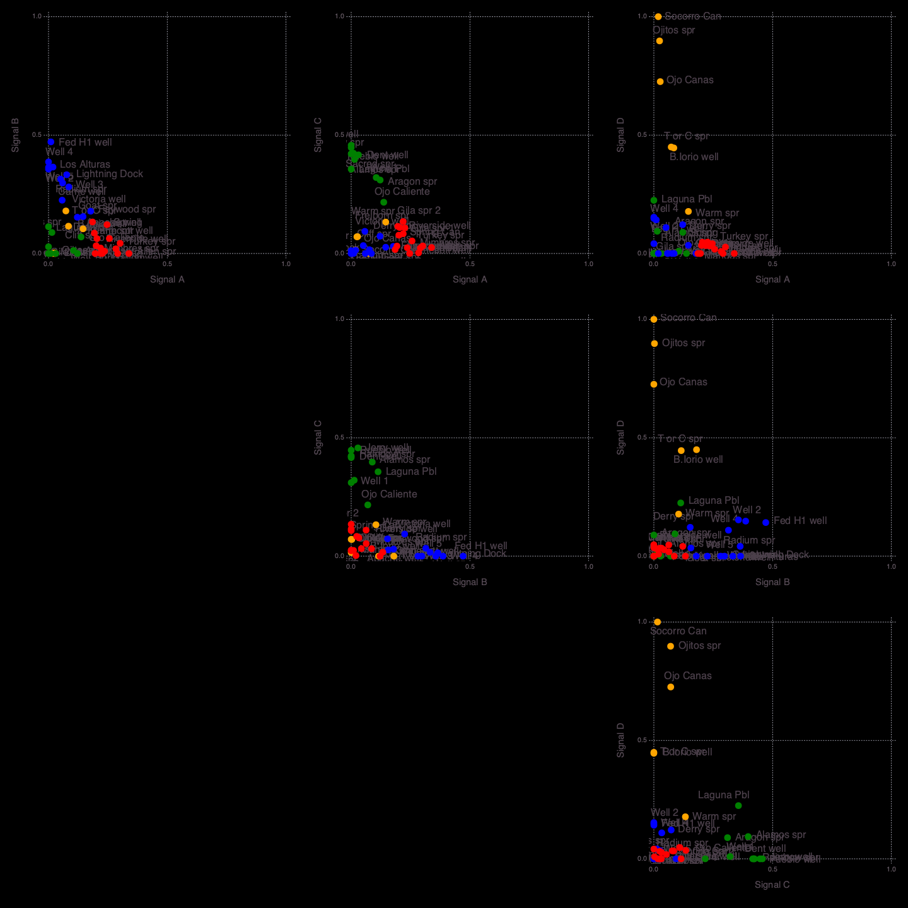
    


    


    3×2 Array{Any,2}:
     "Silica geothermometer"    0.565319
     "State map fault density"  0.516354
     "Volcanic dike density"    0.46948


    4×2 Array{Any,2}:
     "Depth to basement"         0.698015
     "Quaternary fault density"  0.473285
     "Hydraulic gradient"        0.00393436
     "Precipitation"             0.0


    5×2 Array{Any,2}:
     "Crustal thickness"           1.0
     "Magnetic intensity"          0.556994
     "Drainage density"            0.495465
     "Heat flow"                   0.311164
     "Fault intersection density"  0.0


    6×2 Array{Any,2}:
     "Seismicity"             0.95485
     "Spring density"         0.924999
     "Lithium concentration"  0.779688
     "Boron concentration"    0.465497
     "Volcanic vent density"  0.359763
     "Gravity anomaly"        0.313199


    

    


    ┌ Info: Attributes (signals=4)
    └ @ NMFk /Users/bulbulahmmed/.julia/packages/NMFk/koh08/src/NMFkPostprocess.jl:325
    ┌ Info: Signal A (S3) Count: 6
    └ @ NMFk /Users/bulbulahmmed/.julia/packages/NMFk/koh08/src/NMFkPostprocess.jl:338
    ┌ Info: Signal B (S4) Count: 5
    └ @ NMFk /Users/bulbulahmmed/.julia/packages/NMFk/koh08/src/NMFkPostprocess.jl:338
    ┌ Info: Signal C (S1) Count: 4
    └ @ NMFk /Users/bulbulahmmed/.julia/packages/NMFk/koh08/src/NMFkPostprocess.jl:338
    ┌ Info: Signal D (S2) Count: 3
    └ @ NMFk /Users/bulbulahmmed/.julia/packages/NMFk/koh08/src/NMFkPostprocess.jl:338
    ┌ Info: Signal D -> A Count: 3
    └ @ NMFk /Users/bulbulahmmed/.julia/packages/NMFk/koh08/src/NMFkPostprocess.jl:348
    ┌ Info: Signal C -> B Count: 4
    └ @ NMFk /Users/bulbulahmmed/.julia/packages/NMFk/koh08/src/NMFkPostprocess.jl:348
    ┌ Info: Signal B -> C Count: 5
    └ @ NMFk /Users/bulbulahmmed/.julia/packages/NMFk/koh08/src/NMFkPostprocess.jl:348
    ┌ Info: Signal A -> D Count: 6
    └ @ NMFk /Users/bulbulahmmed/.julia/packages/NMFk/koh08/src/NMFkPostprocess.jl:348
    ┌ Info: Signal A (remapped k-means clustering)
    └ @ NMFk /Users/bulbulahmmed/.julia/packages/NMFk/koh08/src/NMFkPostprocess.jl:363
    ┌ Info: Signal B (remapped k-means clustering)
    └ @ NMFk /Users/bulbulahmmed/.julia/packages/NMFk/koh08/src/NMFkPostprocess.jl:363
    ┌ Info: Signal C (remapped k-means clustering)
    └ @ NMFk /Users/bulbulahmmed/.julia/packages/NMFk/koh08/src/NMFkPostprocess.jl:363
    ┌ Info: Signal D (remapped k-means clustering)
    └ @ NMFk /Users/bulbulahmmed/.julia/packages/NMFk/koh08/src/NMFkPostprocess.jl:363


    
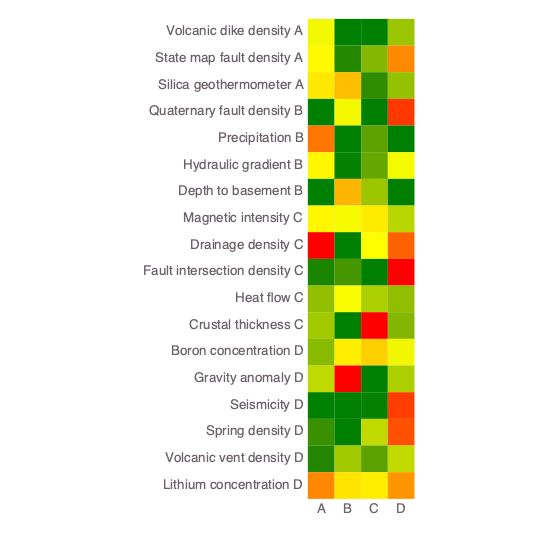
    


    


<?xml version="1.0" encoding="UTF-8"?>
<svg xmlns="http://www.w3.org/2000/svg"
     xmlns:xlink="http://www.w3.org/1999/xlink"
     xmlns:gadfly="http://www.gadflyjl.org/ns"
     version="1.2"
     width="141.42mm" height="100mm" viewBox="0 0 141.42 100"
     stroke="none"
     fill="#000000"
     stroke-width="0.3"
     font-size="3.88"

     id="img-19152aaa">
<defs>
  <marker id="arrow" markerWidth="15" markerHeight="7" refX="5" refY="3.5" orient="auto" markerUnits="strokeWidth">
    <path d="M0,0 L15,3.5 L0,7 z" stroke="context-stroke" fill="context-stroke"/>
  </marker>
</defs>
<g class="plotroot" id="img-19152aaa-1">
  <g class="guide xlabels" font-size="2.82" font-family="'PT Sans Caption','Helvetica Neue','Helvetica',sans-serif" fill="#6C606B" id="img-19152aaa-2">
    <g transform="translate(76.7,94)" gadfly:scale="1.0" visibility="visible">
      <g class="primitive">
        <text text-anchor="middle" dy="-0em">A</text>
      </g>
    </g>
    <g transform="translate(81.06,94)" gadfly:scale="1.0" visibility="visible">
      <g class="primitive">
        <text text-anchor="middle" dy="-0em">B</text>
      </g>
    </g>
    <g transform="translate(85.41,94)" gadfly:scale="1.0" visibility="visible">
      <g class="primitive">
        <text text-anchor="middle" dy="-0em">C</text>
      </g>
    </g>
    <g transform="translate(89.77,94)" gadfly:scale="1.0" visibility="visible">
      <g class="primitive">
        <text text-anchor="middle" dy="-0em">D</text>
      </g>
    </g>
  </g>
  <g stroke-width="0.11" stroke="#FFFFFF" id="img-19152aaa-3">
    <g transform="translate(94.17,47.37)">
      <path fill="none" d="M-1.16,2.18 L1.16,2.18 1.16,-2.18 -1.16,-2.18 " class="primitive"/>
    </g>
    <g transform="translate(94.17,69.16)">
      <path fill="none" d="M-1.16,2.18 L1.16,2.18 1.16,-2.18 -1.16,-2.18 " class="primitive"/>
    </g>
    <g transform="translate(95.91,72.43)">
      <path fill="none" d="M-2.9,3.27 L1.74,3.27 1.74,-3.27 -0.58,-3.27 " class="primitive"/>
    </g>
    <g transform="translate(94.17,25.58)">
      <path fill="none" d="M-1.16,2.18 L1.16,2.18 1.16,-2.18 -1.16,-2.18 " class="primitive"/>
    </g>
    <g transform="translate(94.17,16.86)">
      <path fill="none" d="M-1.16,2.18 L1.16,2.18 1.16,-2.18 -1.16,-2.18 " class="primitive"/>
    </g>
    <g transform="translate(94.17,34.29)">
      <path fill="none" d="M-1.16,2.18 L1.16,2.18 1.16,-2.18 -1.16,-2.18 " class="primitive"/>
    </g>
    <g transform="translate(94.17,60.44)">
      <path fill="none" d="M-1.16,2.18 L1.16,2.18 1.16,-2.18 -1.16,-2.18 " class="primitive"/>
    </g>
    <g transform="translate(95.91,50.64)">
      <path fill="none" d="M-2.9,3.27 L1.74,3.27 1.74,-3.27 -0.58,-3.27 " class="primitive"/>
    </g>
    <g transform="translate(96.49,21.22)">
      <path fill="none" d="M-1.16,4.36 L1.16,4.36 1.16,-4.36 -1.16,-4.36 " class="primitive"/>
    </g>
    <g transform="translate(97.66,76.24)">
      <path fill="none" d="M-4.65,3.81 L2.32,3.81 2.32,-3.81 -0,-3.81 " class="primitive"/>
    </g>
    <g transform="translate(98.24,55.54)">
      <path fill="none" d="M-2.9,4.9 L1.74,4.9 1.74,-4.9 -0.58,-4.9 " class="primitive"/>
    </g>
    <g transform="translate(98.24,27.75)">
      <path fill="none" d="M-2.9,6.54 L1.74,6.54 1.74,-6.54 -0.58,-6.54 " class="primitive"/>
    </g>
    <g transform="translate(99.4,80.33)">
      <path fill="none" d="M-6.39,4.09 L2.9,4.09 2.9,-4.09 0.58,-4.09 " class="primitive"/>
    </g>
    <g transform="translate(99.4,34.29)">
      <path fill="none" d="M-6.39,6.54 L2.9,6.54 2.9,-6.54 0.58,-6.54 " class="primitive"/>
    </g>
    <g transform="translate(101.14,84.55)">
      <path fill="none" d="M-8.13,4.22 L3.49,4.22 3.49,-4.22 1.16,-4.22 " class="primitive"/>
    </g>
    <g transform="translate(102.88,44.92)">
      <path fill="none" d="M-2.9,10.62 L1.74,10.62 1.74,-10.62 -0.58,-10.62 " class="primitive"/>
    </g>
    <g transform="translate(105.79,64.73)">
      <path fill="none" d="M-1.16,19.82 L1.16,19.82 1.16,-19.82 -1.16,-19.82 " class="primitive"/>
    </g>
  </g>
  <g clip-path="url(#img-19152aaa-4)">
    <g id="img-19152aaa-5">
      <g pointer-events="visible" stroke-width="0.3" fill="#000000" fill-opacity="0.000" stroke="#000000" stroke-opacity="0.000" class="guide background" id="img-19152aaa-6">
        <g transform="translate(83.23,51.73)" id="img-19152aaa-7">
          <path d="M-8.72,-39.23 L8.72,-39.23 8.72,39.23 -8.72,39.23  z" class="primitive"/>
        </g>
      </g>
      <g class="guide ygridlines xfixed" stroke-dasharray="0.5,0.5" stroke-width="0.2" stroke="#D0D0E0" id="img-19152aaa-8">
        <g transform="translate(83.23,16.86)" id="img-19152aaa-9" visibility="visible" gadfly:scale="1.0">
          <path fill="none" d="M-8.72,0 L8.72,0 " class="primitive"/>
        </g>
        <g transform="translate(83.23,21.22)" id="img-19152aaa-10" visibility="visible" gadfly:scale="1.0">
          <path fill="none" d="M-8.72,0 L8.72,0 " class="primitive"/>
        </g>
        <g transform="translate(83.23,25.58)" id="img-19152aaa-11" visibility="visible" gadfly:scale="1.0">
          <path fill="none" d="M-8.72,0 L8.72,0 " class="primitive"/>
        </g>
        <g transform="translate(83.23,29.93)" id="img-19152aaa-12" visibility="visible" gadfly:scale="1.0">
          <path fill="none" d="M-8.72,0 L8.72,0 " class="primitive"/>
        </g>
        <g transform="translate(83.23,34.29)" id="img-19152aaa-13" visibility="visible" gadfly:scale="1.0">
          <path fill="none" d="M-8.72,0 L8.72,0 " class="primitive"/>
        </g>
        <g transform="translate(83.23,38.65)" id="img-19152aaa-14" visibility="visible" gadfly:scale="1.0">
          <path fill="none" d="M-8.72,0 L8.72,0 " class="primitive"/>
        </g>
        <g transform="translate(83.23,43.01)" id="img-19152aaa-15" visibility="visible" gadfly:scale="1.0">
          <path fill="none" d="M-8.72,0 L8.72,0 " class="primitive"/>
        </g>
        <g transform="translate(83.23,47.37)" id="img-19152aaa-16" visibility="visible" gadfly:scale="1.0">
          <path fill="none" d="M-8.72,0 L8.72,0 " class="primitive"/>
        </g>
        <g transform="translate(83.23,51.73)" id="img-19152aaa-17" visibility="visible" gadfly:scale="1.0">
          <path fill="none" d="M-8.72,0 L8.72,0 " class="primitive"/>
        </g>
        <g transform="translate(83.23,56.08)" id="img-19152aaa-18" visibility="visible" gadfly:scale="1.0">
          <path fill="none" d="M-8.72,0 L8.72,0 " class="primitive"/>
        </g>
        <g transform="translate(83.23,60.44)" id="img-19152aaa-19" visibility="visible" gadfly:scale="1.0">
          <path fill="none" d="M-8.72,0 L8.72,0 " class="primitive"/>
        </g>
        <g transform="translate(83.23,64.8)" id="img-19152aaa-20" visibility="visible" gadfly:scale="1.0">
          <path fill="none" d="M-8.72,0 L8.72,0 " class="primitive"/>
        </g>
        <g transform="translate(83.23,69.16)" id="img-19152aaa-21" visibility="visible" gadfly:scale="1.0">
          <path fill="none" d="M-8.72,0 L8.72,0 " class="primitive"/>
        </g>
        <g transform="translate(83.23,73.52)" id="img-19152aaa-22" visibility="visible" gadfly:scale="1.0">
          <path fill="none" d="M-8.72,0 L8.72,0 " class="primitive"/>
        </g>
        <g transform="translate(83.23,77.88)" id="img-19152aaa-23" visibility="visible" gadfly:scale="1.0">
          <path fill="none" d="M-8.72,0 L8.72,0 " class="primitive"/>
        </g>
        <g transform="translate(83.23,82.23)" id="img-19152aaa-24" visibility="visible" gadfly:scale="1.0">
          <path fill="none" d="M-8.72,0 L8.72,0 " class="primitive"/>
        </g>
        <g transform="translate(83.23,86.59)" id="img-19152aaa-25" visibility="visible" gadfly:scale="1.0">
          <path fill="none" d="M-8.72,0 L8.72,0 " class="primitive"/>
        </g>
      </g>
      <g class="guide xgridlines yfixed" stroke-dasharray="0.5,0.5" stroke-width="0.2" stroke="#D0D0E0" id="img-19152aaa-26">
        <g transform="translate(78.88,51.73)" id="img-19152aaa-27" visibility="visible" gadfly:scale="1.0">
          <path fill="none" d="M0,-39.23 L0,39.23 " class="primitive"/>
        </g>
        <g transform="translate(83.23,51.73)" id="img-19152aaa-28" visibility="visible" gadfly:scale="1.0">
          <path fill="none" d="M0,-39.23 L0,39.23 " class="primitive"/>
        </g>
        <g transform="translate(87.59,51.73)" id="img-19152aaa-29" visibility="visible" gadfly:scale="1.0">
          <path fill="none" d="M0,-39.23 L0,39.23 " class="primitive"/>
        </g>
      </g>
      <g class="plotpanel" id="img-19152aaa-30">
        <metadata>
          <boundingbox value="74.51769520247035mm 12.5mm 17.433600380979936mm 78.45120171440972mm"/>
          <unitbox value="0.5 0.5 4.0 18.0"/>
        </metadata>
        <g shape-rendering="crispEdges" class="geometry" stroke="#000000" stroke-opacity="0.000" id="img-19152aaa-31">
          <g transform="translate(76.72,14.7)" id="img-19152aaa-32" fill="#F1F700" fill-opacity="1">
            <path d="M-2.2,-2.2 L2.2,-2.2 2.2,2.2 -2.2,2.2  z" class="primitive"/>
          </g>
          <g transform="translate(76.72,19.06)" id="img-19152aaa-33" fill="#FFF900" fill-opacity="1">
            <path d="M-2.2,-2.2 L2.2,-2.2 2.2,2.2 -2.2,2.2  z" class="primitive"/>
          </g>
          <g transform="translate(76.72,23.42)" id="img-19152aaa-34" fill="#FFE700" fill-opacity="1">
            <path d="M-2.2,-2.2 L2.2,-2.2 2.2,2.2 -2.2,2.2  z" class="primitive"/>
          </g>
          <g transform="translate(76.72,27.78)" id="img-19152aaa-35" fill="#008000" fill-opacity="1">
            <path d="M-2.2,-2.2 L2.2,-2.2 2.2,2.2 -2.2,2.2  z" class="primitive"/>
          </g>
          <g transform="translate(76.72,32.14)" id="img-19152aaa-36" fill="#FF7700" fill-opacity="1">
            <path d="M-2.2,-2.2 L2.2,-2.2 2.2,2.2 -2.2,2.2  z" class="primitive"/>
          </g>
          <g transform="translate(76.72,36.5)" id="img-19152aaa-37" fill="#FFF700" fill-opacity="1">
            <path d="M-2.2,-2.2 L2.2,-2.2 2.2,2.2 -2.2,2.2  z" class="primitive"/>
          </g>
          <g transform="translate(76.72,40.85)" id="img-19152aaa-38" fill="#008000" fill-opacity="1">
            <path d="M-2.2,-2.2 L2.2,-2.2 2.2,2.2 -2.2,2.2  z" class="primitive"/>
          </g>
          <g transform="translate(76.72,45.21)" id="img-19152aaa-39" fill="#FFF500" fill-opacity="1">
            <path d="M-2.2,-2.2 L2.2,-2.2 2.2,2.2 -2.2,2.2  z" class="primitive"/>
          </g>
          <g transform="translate(76.72,49.57)" id="img-19152aaa-40" fill="#FF0000" fill-opacity="1">
            <path d="M-2.2,-2.2 L2.2,-2.2 2.2,2.2 -2.2,2.2  z" class="primitive"/>
          </g>
          <g transform="translate(76.72,53.93)" id="img-19152aaa-41" fill="#198400" fill-opacity="1">
            <path d="M-2.2,-2.2 L2.2,-2.2 2.2,2.2 -2.2,2.2  z" class="primitive"/>
          </g>
          <g transform="translate(76.72,58.29)" id="img-19152aaa-42" fill="#92BF00" fill-opacity="1">
            <path d="M-2.2,-2.2 L2.2,-2.2 2.2,2.2 -2.2,2.2  z" class="primitive"/>
          </g>
          <g transform="translate(76.72,62.65)" id="img-19152aaa-43" fill="#A2C900" fill-opacity="1">
            <path d="M-2.2,-2.2 L2.2,-2.2 2.2,2.2 -2.2,2.2  z" class="primitive"/>
          </g>
          <g transform="translate(76.72,67.01)" id="img-19152aaa-44" fill="#88BA00" fill-opacity="1">
            <path d="M-2.2,-2.2 L2.2,-2.2 2.2,2.2 -2.2,2.2  z" class="primitive"/>
          </g>
          <g transform="translate(76.72,71.36)" id="img-19152aaa-45" fill="#BFDA00" fill-opacity="1">
            <path d="M-2.2,-2.2 L2.2,-2.2 2.2,2.2 -2.2,2.2  z" class="primitive"/>
          </g>
          <g transform="translate(76.72,75.72)" id="img-19152aaa-46" fill="#008000" fill-opacity="1">
            <path d="M-2.2,-2.2 L2.2,-2.2 2.2,2.2 -2.2,2.2  z" class="primitive"/>
          </g>
          <g transform="translate(76.72,80.08)" id="img-19152aaa-47" fill="#3A9000" fill-opacity="1">
            <path d="M-2.2,-2.2 L2.2,-2.2 2.2,2.2 -2.2,2.2  z" class="primitive"/>
          </g>
          <g transform="translate(76.72,84.44)" id="img-19152aaa-48" fill="#228700" fill-opacity="1">
            <path d="M-2.2,-2.2 L2.2,-2.2 2.2,2.2 -2.2,2.2  z" class="primitive"/>
          </g>
          <g transform="translate(76.72,88.8)" id="img-19152aaa-49" fill="#FF8800" fill-opacity="1">
            <path d="M-2.2,-2.2 L2.2,-2.2 2.2,2.2 -2.2,2.2  z" class="primitive"/>
          </g>
          <g transform="translate(81.08,14.7)" id="img-19152aaa-50" fill="#008000" fill-opacity="1">
            <path d="M-2.2,-2.2 L2.2,-2.2 2.2,2.2 -2.2,2.2  z" class="primitive"/>
          </g>
          <g transform="translate(81.08,19.06)" id="img-19152aaa-51" fill="#248800" fill-opacity="1">
            <path d="M-2.2,-2.2 L2.2,-2.2 2.2,2.2 -2.2,2.2  z" class="primitive"/>
          </g>
          <g transform="translate(81.08,23.42)" id="img-19152aaa-52" fill="#FFBD00" fill-opacity="1">
            <path d="M-2.2,-2.2 L2.2,-2.2 2.2,2.2 -2.2,2.2  z" class="primitive"/>
          </g>
          <g transform="translate(81.08,27.78)" id="img-19152aaa-53" fill="#F3F800" fill-opacity="1">
            <path d="M-2.2,-2.2 L2.2,-2.2 2.2,2.2 -2.2,2.2  z" class="primitive"/>
          </g>
          <g transform="translate(81.08,32.14)" id="img-19152aaa-54" fill="#008000" fill-opacity="1">
            <path d="M-2.2,-2.2 L2.2,-2.2 2.2,2.2 -2.2,2.2  z" class="primitive"/>
          </g>
          <g transform="translate(81.08,36.5)" id="img-19152aaa-55" fill="#078100" fill-opacity="1">
            <path d="M-2.2,-2.2 L2.2,-2.2 2.2,2.2 -2.2,2.2  z" class="primitive"/>
          </g>
          <g transform="translate(81.08,40.85)" id="img-19152aaa-56" fill="#FFB600" fill-opacity="1">
            <path d="M-2.2,-2.2 L2.2,-2.2 2.2,2.2 -2.2,2.2  z" class="primitive"/>
          </g>
          <g transform="translate(81.08,45.21)" id="img-19152aaa-57" fill="#F7FA00" fill-opacity="1">
            <path d="M-2.2,-2.2 L2.2,-2.2 2.2,2.2 -2.2,2.2  z" class="primitive"/>
          </g>
          <g transform="translate(81.08,49.57)" id="img-19152aaa-58" fill="#008000" fill-opacity="1">
            <path d="M-2.2,-2.2 L2.2,-2.2 2.2,2.2 -2.2,2.2  z" class="primitive"/>
          </g>
          <g transform="translate(81.08,53.93)" id="img-19152aaa-59" fill="#469600" fill-opacity="1">
            <path d="M-2.2,-2.2 L2.2,-2.2 2.2,2.2 -2.2,2.2  z" class="primitive"/>
          </g>
          <g transform="translate(81.08,58.29)" id="img-19152aaa-60" fill="#FAFC00" fill-opacity="1">
            <path d="M-2.2,-2.2 L2.2,-2.2 2.2,2.2 -2.2,2.2  z" class="primitive"/>
          </g>
          <g transform="translate(81.08,62.65)" id="img-19152aaa-61" fill="#008000" fill-opacity="1">
            <path d="M-2.2,-2.2 L2.2,-2.2 2.2,2.2 -2.2,2.2  z" class="primitive"/>
          </g>
          <g transform="translate(81.08,67.01)" id="img-19152aaa-62" fill="#FFED00" fill-opacity="1">
            <path d="M-2.2,-2.2 L2.2,-2.2 2.2,2.2 -2.2,2.2  z" class="primitive"/>
          </g>
          <g transform="translate(81.08,71.36)" id="img-19152aaa-63" fill="#FF0000" fill-opacity="1">
            <path d="M-2.2,-2.2 L2.2,-2.2 2.2,2.2 -2.2,2.2  z" class="primitive"/>
          </g>
          <g transform="translate(81.08,75.72)" id="img-19152aaa-64" fill="#008000" fill-opacity="1">
            <path d="M-2.2,-2.2 L2.2,-2.2 2.2,2.2 -2.2,2.2  z" class="primitive"/>
          </g>
          <g transform="translate(81.08,80.08)" id="img-19152aaa-65" fill="#008000" fill-opacity="1">
            <path d="M-2.2,-2.2 L2.2,-2.2 2.2,2.2 -2.2,2.2  z" class="primitive"/>
          </g>
          <g transform="translate(81.08,84.44)" id="img-19152aaa-66" fill="#A2C900" fill-opacity="1">
            <path d="M-2.2,-2.2 L2.2,-2.2 2.2,2.2 -2.2,2.2  z" class="primitive"/>
          </g>
          <g transform="translate(81.08,88.8)" id="img-19152aaa-67" fill="#FFE300" fill-opacity="1">
            <path d="M-2.2,-2.2 L2.2,-2.2 2.2,2.2 -2.2,2.2  z" class="primitive"/>
          </g>
          <g transform="translate(85.44,14.7)" id="img-19152aaa-68" fill="#008000" fill-opacity="1">
            <path d="M-2.2,-2.2 L2.2,-2.2 2.2,2.2 -2.2,2.2  z" class="primitive"/>
          </g>
          <g transform="translate(85.44,19.06)" id="img-19152aaa-69" fill="#84B800" fill-opacity="1">
            <path d="M-2.2,-2.2 L2.2,-2.2 2.2,2.2 -2.2,2.2  z" class="primitive"/>
          </g>
          <g transform="translate(85.44,23.42)" id="img-19152aaa-70" fill="#308C00" fill-opacity="1">
            <path d="M-2.2,-2.2 L2.2,-2.2 2.2,2.2 -2.2,2.2  z" class="primitive"/>
          </g>
          <g transform="translate(85.44,27.78)" id="img-19152aaa-71" fill="#008000" fill-opacity="1">
            <path d="M-2.2,-2.2 L2.2,-2.2 2.2,2.2 -2.2,2.2  z" class="primitive"/>
          </g>
          <g transform="translate(85.44,32.14)" id="img-19152aaa-72" fill="#5DA200" fill-opacity="1">
            <path d="M-2.2,-2.2 L2.2,-2.2 2.2,2.2 -2.2,2.2  z" class="primitive"/>
          </g>
          <g transform="translate(85.44,36.5)" id="img-19152aaa-73" fill="#66A600" fill-opacity="1">
            <path d="M-2.2,-2.2 L2.2,-2.2 2.2,2.2 -2.2,2.2  z" class="primitive"/>
          </g>
          <g transform="translate(85.44,40.85)" id="img-19152aaa-74" fill="#9CC600" fill-opacity="1">
            <path d="M-2.2,-2.2 L2.2,-2.2 2.2,2.2 -2.2,2.2  z" class="primitive"/>
          </g>
          <g transform="translate(85.44,45.21)" id="img-19152aaa-75" fill="#FFEA00" fill-opacity="1">
            <path d="M-2.2,-2.2 L2.2,-2.2 2.2,2.2 -2.2,2.2  z" class="primitive"/>
          </g>
          <g transform="translate(85.44,49.57)" id="img-19152aaa-76" fill="#FDFE00" fill-opacity="1">
            <path d="M-2.2,-2.2 L2.2,-2.2 2.2,2.2 -2.2,2.2  z" class="primitive"/>
          </g>
          <g transform="translate(85.44,53.93)" id="img-19152aaa-77" fill="#008000" fill-opacity="1">
            <path d="M-2.2,-2.2 L2.2,-2.2 2.2,2.2 -2.2,2.2  z" class="primitive"/>
          </g>
          <g transform="translate(85.44,58.29)" id="img-19152aaa-78" fill="#ACCE00" fill-opacity="1">
            <path d="M-2.2,-2.2 L2.2,-2.2 2.2,2.2 -2.2,2.2  z" class="primitive"/>
          </g>
          <g transform="translate(85.44,62.65)" id="img-19152aaa-79" fill="#FF0000" fill-opacity="1">
            <path d="M-2.2,-2.2 L2.2,-2.2 2.2,2.2 -2.2,2.2  z" class="primitive"/>
          </g>
          <g transform="translate(85.44,67.01)" id="img-19152aaa-80" fill="#FFD000" fill-opacity="1">
            <path d="M-2.2,-2.2 L2.2,-2.2 2.2,2.2 -2.2,2.2  z" class="primitive"/>
          </g>
          <g transform="translate(85.44,71.36)" id="img-19152aaa-81" fill="#008000" fill-opacity="1">
            <path d="M-2.2,-2.2 L2.2,-2.2 2.2,2.2 -2.2,2.2  z" class="primitive"/>
          </g>
          <g transform="translate(85.44,75.72)" id="img-19152aaa-82" fill="#078100" fill-opacity="1">
            <path d="M-2.2,-2.2 L2.2,-2.2 2.2,2.2 -2.2,2.2  z" class="primitive"/>
          </g>
          <g transform="translate(85.44,80.08)" id="img-19152aaa-83" fill="#C0DA00" fill-opacity="1">
            <path d="M-2.2,-2.2 L2.2,-2.2 2.2,2.2 -2.2,2.2  z" class="primitive"/>
          </g>
          <g transform="translate(85.44,84.44)" id="img-19152aaa-84" fill="#5BA100" fill-opacity="1">
            <path d="M-2.2,-2.2 L2.2,-2.2 2.2,2.2 -2.2,2.2  z" class="primitive"/>
          </g>
          <g transform="translate(85.44,88.8)" id="img-19152aaa-85" fill="#FFEC00" fill-opacity="1">
            <path d="M-2.2,-2.2 L2.2,-2.2 2.2,2.2 -2.2,2.2  z" class="primitive"/>
          </g>
          <g transform="translate(89.8,14.7)" id="img-19152aaa-86" fill="#9BC500" fill-opacity="1">
            <path d="M-2.2,-2.2 L2.2,-2.2 2.2,2.2 -2.2,2.2  z" class="primitive"/>
          </g>
          <g transform="translate(89.8,19.06)" id="img-19152aaa-87" fill="#FF8900" fill-opacity="1">
            <path d="M-2.2,-2.2 L2.2,-2.2 2.2,2.2 -2.2,2.2  z" class="primitive"/>
          </g>
          <g transform="translate(89.8,23.42)" id="img-19152aaa-88" fill="#93C000" fill-opacity="1">
            <path d="M-2.2,-2.2 L2.2,-2.2 2.2,2.2 -2.2,2.2  z" class="primitive"/>
          </g>
          <g transform="translate(89.8,27.78)" id="img-19152aaa-89" fill="#FF3800" fill-opacity="1">
            <path d="M-2.2,-2.2 L2.2,-2.2 2.2,2.2 -2.2,2.2  z" class="primitive"/>
          </g>
          <g transform="translate(89.8,32.14)" id="img-19152aaa-90" fill="#008000" fill-opacity="1">
            <path d="M-2.2,-2.2 L2.2,-2.2 2.2,2.2 -2.2,2.2  z" class="primitive"/>
          </g>
          <g transform="translate(89.8,36.5)" id="img-19152aaa-91" fill="#F5F900" fill-opacity="1">
            <path d="M-2.2,-2.2 L2.2,-2.2 2.2,2.2 -2.2,2.2  z" class="primitive"/>
          </g>
          <g transform="translate(89.8,40.85)" id="img-19152aaa-92" fill="#008000" fill-opacity="1">
            <path d="M-2.2,-2.2 L2.2,-2.2 2.2,2.2 -2.2,2.2  z" class="primitive"/>
          </g>
          <g transform="translate(89.8,45.21)" id="img-19152aaa-93" fill="#B8D500" fill-opacity="1">
            <path d="M-2.2,-2.2 L2.2,-2.2 2.2,2.2 -2.2,2.2  z" class="primitive"/>
          </g>
          <g transform="translate(89.8,49.57)" id="img-19152aaa-94" fill="#FF6200" fill-opacity="1">
            <path d="M-2.2,-2.2 L2.2,-2.2 2.2,2.2 -2.2,2.2  z" class="primitive"/>
          </g>
          <g transform="translate(89.8,53.93)" id="img-19152aaa-95" fill="#FF0000" fill-opacity="1">
            <path d="M-2.2,-2.2 L2.2,-2.2 2.2,2.2 -2.2,2.2  z" class="primitive"/>
          </g>
          <g transform="translate(89.8,58.29)" id="img-19152aaa-96" fill="#91BF00" fill-opacity="1">
            <path d="M-2.2,-2.2 L2.2,-2.2 2.2,2.2 -2.2,2.2  z" class="primitive"/>
          </g>
          <g transform="translate(89.8,62.65)" id="img-19152aaa-97" fill="#82B600" fill-opacity="1">
            <path d="M-2.2,-2.2 L2.2,-2.2 2.2,2.2 -2.2,2.2  z" class="primitive"/>
          </g>
          <g transform="translate(89.8,67.01)" id="img-19152aaa-98" fill="#F0F600" fill-opacity="1">
            <path d="M-2.2,-2.2 L2.2,-2.2 2.2,2.2 -2.2,2.2  z" class="primitive"/>
          </g>
          <g transform="translate(89.8,71.36)" id="img-19152aaa-99" fill="#ADCF00" fill-opacity="1">
            <path d="M-2.2,-2.2 L2.2,-2.2 2.2,2.2 -2.2,2.2  z" class="primitive"/>
          </g>
          <g transform="translate(89.8,75.72)" id="img-19152aaa-100" fill="#FF3D00" fill-opacity="1">
            <path d="M-2.2,-2.2 L2.2,-2.2 2.2,2.2 -2.2,2.2  z" class="primitive"/>
          </g>
          <g transform="translate(89.8,80.08)" id="img-19152aaa-101" fill="#FF5100" fill-opacity="1">
            <path d="M-2.2,-2.2 L2.2,-2.2 2.2,2.2 -2.2,2.2  z" class="primitive"/>
          </g>
          <g transform="translate(89.8,84.44)" id="img-19152aaa-102" fill="#C1DB00" fill-opacity="1">
            <path d="M-2.2,-2.2 L2.2,-2.2 2.2,2.2 -2.2,2.2  z" class="primitive"/>
          </g>
          <g transform="translate(89.8,88.8)" id="img-19152aaa-103" fill="#FF9600" fill-opacity="1">
            <path d="M-2.2,-2.2 L2.2,-2.2 2.2,2.2 -2.2,2.2  z" class="primitive"/>
          </g>
        </g>
      </g>
      <g fill-opacity="0" class="guide crosshair" id="img-19152aaa-104">
        <g class="text_box" fill="#000000" id="img-19152aaa-105">
          <g transform="translate(84.9,13.03)" id="img-19152aaa-106">
            <g class="primitive">
              <text text-anchor="end" dy="0.6em"></text>
            </g>
          </g>
        </g>
      </g>
      <g fill-opacity="0" class="guide helpscreen" id="img-19152aaa-107">
        <g class="text_box" id="img-19152aaa-108">
          <g fill="#000000" id="img-19152aaa-109">
            <g transform="translate(83.23,51.73)" id="img-19152aaa-110">
              <path d="M-27.18,-9.82 L27.18,-9.82 27.18,9.82 -27.18,9.82  z" class="primitive"/>
            </g>
          </g>
          <g fill="#FFFF74" font-size="3.88" font-family="'PT Sans','Helvetica Neue','Helvetica',sans-serif" id="img-19152aaa-111">
            <g transform="translate(83.23,44.59)" id="img-19152aaa-112">
              <g class="primitive">
                <text text-anchor="middle" dy="0.35em">h,j,k,l,arrows,drag to pan</text>
              </g>
            </g>
            <g transform="translate(83.23,48.16)" id="img-19152aaa-113">
              <g class="primitive">
                <text text-anchor="middle" dy="0.35em">i,o,+,-,scroll,shift-drag to zoom</text>
              </g>
            </g>
            <g transform="translate(83.23,51.73)" id="img-19152aaa-114">
              <g class="primitive">
                <text text-anchor="middle" dy="0.35em">r,dbl-click to reset</text>
              </g>
            </g>
            <g transform="translate(83.23,55.3)" id="img-19152aaa-115">
              <g class="primitive">
                <text text-anchor="middle" dy="0.35em">c for coordinates</text>
              </g>
            </g>
            <g transform="translate(83.23,58.87)" id="img-19152aaa-116">
              <g class="primitive">
                <text text-anchor="middle" dy="0.35em">? for help</text>
              </g>
            </g>
          </g>
        </g>
      </g>
      <g fill-opacity="0" class="guide questionmark" id="img-19152aaa-117">
        <g class="text_box" fill="#000000" id="img-19152aaa-118">
          <g transform="translate(91.95,13.03)" id="img-19152aaa-119">
            <g class="primitive">
              <text text-anchor="end" dy="0.6em">?</text>
            </g>
          </g>
        </g>
      </g>
    </g>
  </g>
  <g class="guide ylabels" font-size="2.82" font-family="'PT Sans Caption','Helvetica Neue','Helvetica',sans-serif" fill="#6C606B" id="img-19152aaa-120">
    <g transform="translate(73.52,14.68)" id="img-19152aaa-121" visibility="visible" gadfly:scale="1.0">
      <g class="primitive">
        <text text-anchor="end" dy="0.35em">Volcanic dike density A</text>
      </g>
    </g>
    <g transform="translate(73.52,19.04)" id="img-19152aaa-122" visibility="visible" gadfly:scale="1.0">
      <g class="primitive">
        <text text-anchor="end" dy="0.35em">State map fault density A</text>
      </g>
    </g>
    <g transform="translate(73.52,23.4)" id="img-19152aaa-123" visibility="visible" gadfly:scale="1.0">
      <g class="primitive">
        <text text-anchor="end" dy="0.35em">Silica geothermometer A</text>
      </g>
    </g>
    <g transform="translate(73.52,27.75)" id="img-19152aaa-124" visibility="visible" gadfly:scale="1.0">
      <g class="primitive">
        <text text-anchor="end" dy="0.35em">Quaternary fault density B</text>
      </g>
    </g>
    <g transform="translate(73.52,32.11)" id="img-19152aaa-125" visibility="visible" gadfly:scale="1.0">
      <g class="primitive">
        <text text-anchor="end" dy="0.35em">Precipitation B</text>
      </g>
    </g>
    <g transform="translate(73.52,36.47)" id="img-19152aaa-126" visibility="visible" gadfly:scale="1.0">
      <g class="primitive">
        <text text-anchor="end" dy="0.35em">Hydraulic gradient B</text>
      </g>
    </g>
    <g transform="translate(73.52,40.83)" id="img-19152aaa-127" visibility="visible" gadfly:scale="1.0">
      <g class="primitive">
        <text text-anchor="end" dy="0.35em">Depth to basement B</text>
      </g>
    </g>
    <g transform="translate(73.52,45.19)" id="img-19152aaa-128" visibility="visible" gadfly:scale="1.0">
      <g class="primitive">
        <text text-anchor="end" dy="0.35em">Magnetic intensity C</text>
      </g>
    </g>
    <g transform="translate(73.52,49.55)" id="img-19152aaa-129" visibility="visible" gadfly:scale="1.0">
      <g class="primitive">
        <text text-anchor="end" dy="0.35em">Drainage density C</text>
      </g>
    </g>
    <g transform="translate(73.52,53.9)" id="img-19152aaa-130" visibility="visible" gadfly:scale="1.0">
      <g class="primitive">
        <text text-anchor="end" dy="0.35em">Fault intersection density C</text>
      </g>
    </g>
    <g transform="translate(73.52,58.26)" id="img-19152aaa-131" visibility="visible" gadfly:scale="1.0">
      <g class="primitive">
        <text text-anchor="end" dy="0.35em">Heat flow C</text>
      </g>
    </g>
    <g transform="translate(73.52,62.62)" id="img-19152aaa-132" visibility="visible" gadfly:scale="1.0">
      <g class="primitive">
        <text text-anchor="end" dy="0.35em">Crustal thickness C</text>
      </g>
    </g>
    <g transform="translate(73.52,66.98)" id="img-19152aaa-133" visibility="visible" gadfly:scale="1.0">
      <g class="primitive">
        <text text-anchor="end" dy="0.35em">Boron concentration D</text>
      </g>
    </g>
    <g transform="translate(73.52,71.34)" id="img-19152aaa-134" visibility="visible" gadfly:scale="1.0">
      <g class="primitive">
        <text text-anchor="end" dy="0.35em">Gravity anomaly D</text>
      </g>
    </g>
    <g transform="translate(73.52,75.7)" id="img-19152aaa-135" visibility="visible" gadfly:scale="1.0">
      <g class="primitive">
        <text text-anchor="end" dy="0.35em">Seismicity D</text>
      </g>
    </g>
    <g transform="translate(73.52,80.06)" id="img-19152aaa-136" visibility="visible" gadfly:scale="1.0">
      <g class="primitive">
        <text text-anchor="end" dy="0.35em">Spring density D</text>
      </g>
    </g>
    <g transform="translate(73.52,84.41)" id="img-19152aaa-137" visibility="visible" gadfly:scale="1.0">
      <g class="primitive">
        <text text-anchor="end" dy="0.35em">Volcanic vent density D</text>
      </g>
    </g>
    <g transform="translate(73.52,88.77)" id="img-19152aaa-138" visibility="visible" gadfly:scale="1.0">
      <g class="primitive">
        <text text-anchor="end" dy="0.35em">Lithium concentration D</text>
      </g>
    </g>
  </g>
  <g stroke-width="0.11" stroke="#FFFFFF" id="img-19152aaa-139">
    <g transform="translate(87.59,10.37)" id="img-19152aaa-140">
      <path fill="none" d="M-2.18,1.07 L-2.18,-1.07 2.18,-1.07 2.18,1.07 " class="primitive"/>
    </g>
    <g transform="translate(84.32,8.76)" id="img-19152aaa-141">
      <path fill="none" d="M-3.27,2.68 L-3.27,-1.61 3.27,-1.61 3.27,0.54 " class="primitive"/>
    </g>
    <g transform="translate(80.51,7.15)" id="img-19152aaa-142">
      <path fill="none" d="M-3.81,4.29 L-3.81,-2.15 3.81,-2.15 3.81,0 " class="primitive"/>
    </g>
  </g>
</g>
<defs>
  <clipPath id="img-19152aaa-4">
    <path d="M74.52,12.5 L91.95,12.5 91.95,90.95 74.52,90.95 " />
  </clipPath>
</defs>
<script> <![CDATA[
(function(N){var k=/[\.\/]/,L=/\s*,\s*/,C=function(a,d){return a-d},a,v,y={n:{}},M=function(){for(var a=0,d=this.length;a<d;a++)if("undefined"!=typeof this[a])return this[a]},A=function(){for(var a=this.length;--a;)if("undefined"!=typeof this[a])return this[a]},w=function(k,d){k=String(k);var f=v,n=Array.prototype.slice.call(arguments,2),u=w.listeners(k),p=0,b,q=[],e={},l=[],r=a;l.firstDefined=M;l.lastDefined=A;a=k;for(var s=v=0,x=u.length;s<x;s++)"zIndex"in u[s]&&(q.push(u[s].zIndex),0>u[s].zIndex&&
(e[u[s].zIndex]=u[s]));for(q.sort(C);0>q[p];)if(b=e[q[p++] ],l.push(b.apply(d,n)),v)return v=f,l;for(s=0;s<x;s++)if(b=u[s],"zIndex"in b)if(b.zIndex==q[p]){l.push(b.apply(d,n));if(v)break;do if(p++,(b=e[q[p] ])&&l.push(b.apply(d,n)),v)break;while(b)}else e[b.zIndex]=b;else if(l.push(b.apply(d,n)),v)break;v=f;a=r;return l};w._events=y;w.listeners=function(a){a=a.split(k);var d=y,f,n,u,p,b,q,e,l=[d],r=[];u=0;for(p=a.length;u<p;u++){e=[];b=0;for(q=l.length;b<q;b++)for(d=l[b].n,f=[d[a[u] ],d["*"] ],n=2;n--;)if(d=
f[n])e.push(d),r=r.concat(d.f||[]);l=e}return r};w.on=function(a,d){a=String(a);if("function"!=typeof d)return function(){};for(var f=a.split(L),n=0,u=f.length;n<u;n++)(function(a){a=a.split(k);for(var b=y,f,e=0,l=a.length;e<l;e++)b=b.n,b=b.hasOwnProperty(a[e])&&b[a[e] ]||(b[a[e] ]={n:{}});b.f=b.f||[];e=0;for(l=b.f.length;e<l;e++)if(b.f[e]==d){f=!0;break}!f&&b.f.push(d)})(f[n]);return function(a){+a==+a&&(d.zIndex=+a)}};w.f=function(a){var d=[].slice.call(arguments,1);return function(){w.apply(null,
[a,null].concat(d).concat([].slice.call(arguments,0)))}};w.stop=function(){v=1};w.nt=function(k){return k?(new RegExp("(?:\\.|\\/|^)"+k+"(?:\\.|\\/|$)")).test(a):a};w.nts=function(){return a.split(k)};w.off=w.unbind=function(a,d){if(a){var f=a.split(L);if(1<f.length)for(var n=0,u=f.length;n<u;n++)w.off(f[n],d);else{for(var f=a.split(k),p,b,q,e,l=[y],n=0,u=f.length;n<u;n++)for(e=0;e<l.length;e+=q.length-2){q=[e,1];p=l[e].n;if("*"!=f[n])p[f[n] ]&&q.push(p[f[n] ]);else for(b in p)p.hasOwnProperty(b)&&
q.push(p[b]);l.splice.apply(l,q)}n=0;for(u=l.length;n<u;n++)for(p=l[n];p.n;){if(d){if(p.f){e=0;for(f=p.f.length;e<f;e++)if(p.f[e]==d){p.f.splice(e,1);break}!p.f.length&&delete p.f}for(b in p.n)if(p.n.hasOwnProperty(b)&&p.n[b].f){q=p.n[b].f;e=0;for(f=q.length;e<f;e++)if(q[e]==d){q.splice(e,1);break}!q.length&&delete p.n[b].f}}else for(b in delete p.f,p.n)p.n.hasOwnProperty(b)&&p.n[b].f&&delete p.n[b].f;p=p.n}}}else w._events=y={n:{}}};w.once=function(a,d){var f=function(){w.unbind(a,f);return d.apply(this,
arguments)};return w.on(a,f)};w.version="0.4.2";w.toString=function(){return"You are running Eve 0.4.2"};"undefined"!=typeof module&&module.exports?module.exports=w:"function"===typeof define&&define.amd?define("eve",[],function(){return w}):N.eve=w})(this);
(function(N,k){"function"===typeof define&&define.amd?define("Snap.svg",["eve"],function(L){return k(N,L)}):k(N,N.eve)})(this,function(N,k){var L=function(a){var k={},y=N.requestAnimationFrame||N.webkitRequestAnimationFrame||N.mozRequestAnimationFrame||N.oRequestAnimationFrame||N.msRequestAnimationFrame||function(a){setTimeout(a,16)},M=Array.isArray||function(a){return a instanceof Array||"[object Array]"==Object.prototype.toString.call(a)},A=0,w="M"+(+new Date).toString(36),z=function(a){if(null==
a)return this.s;var b=this.s-a;this.b+=this.dur*b;this.B+=this.dur*b;this.s=a},d=function(a){if(null==a)return this.spd;this.spd=a},f=function(a){if(null==a)return this.dur;this.s=this.s*a/this.dur;this.dur=a},n=function(){delete k[this.id];this.update();a("mina.stop."+this.id,this)},u=function(){this.pdif||(delete k[this.id],this.update(),this.pdif=this.get()-this.b)},p=function(){this.pdif&&(this.b=this.get()-this.pdif,delete this.pdif,k[this.id]=this)},b=function(){var a;if(M(this.start)){a=[];
for(var b=0,e=this.start.length;b<e;b++)a[b]=+this.start[b]+(this.end[b]-this.start[b])*this.easing(this.s)}else a=+this.start+(this.end-this.start)*this.easing(this.s);this.set(a)},q=function(){var l=0,b;for(b in k)if(k.hasOwnProperty(b)){var e=k[b],f=e.get();l++;e.s=(f-e.b)/(e.dur/e.spd);1<=e.s&&(delete k[b],e.s=1,l--,function(b){setTimeout(function(){a("mina.finish."+b.id,b)})}(e));e.update()}l&&y(q)},e=function(a,r,s,x,G,h,J){a={id:w+(A++).toString(36),start:a,end:r,b:s,s:0,dur:x-s,spd:1,get:G,
set:h,easing:J||e.linear,status:z,speed:d,duration:f,stop:n,pause:u,resume:p,update:b};k[a.id]=a;r=0;for(var K in k)if(k.hasOwnProperty(K)&&(r++,2==r))break;1==r&&y(q);return a};e.time=Date.now||function(){return+new Date};e.getById=function(a){return k[a]||null};e.linear=function(a){return a};e.easeout=function(a){return Math.pow(a,1.7)};e.easein=function(a){return Math.pow(a,0.48)};e.easeinout=function(a){if(1==a)return 1;if(0==a)return 0;var b=0.48-a/1.04,e=Math.sqrt(0.1734+b*b);a=e-b;a=Math.pow(Math.abs(a),
1/3)*(0>a?-1:1);b=-e-b;b=Math.pow(Math.abs(b),1/3)*(0>b?-1:1);a=a+b+0.5;return 3*(1-a)*a*a+a*a*a};e.backin=function(a){return 1==a?1:a*a*(2.70158*a-1.70158)};e.backout=function(a){if(0==a)return 0;a-=1;return a*a*(2.70158*a+1.70158)+1};e.elastic=function(a){return a==!!a?a:Math.pow(2,-10*a)*Math.sin(2*(a-0.075)*Math.PI/0.3)+1};e.bounce=function(a){a<1/2.75?a*=7.5625*a:a<2/2.75?(a-=1.5/2.75,a=7.5625*a*a+0.75):a<2.5/2.75?(a-=2.25/2.75,a=7.5625*a*a+0.9375):(a-=2.625/2.75,a=7.5625*a*a+0.984375);return a};
return N.mina=e}("undefined"==typeof k?function(){}:k),C=function(){function a(c,t){if(c){if(c.tagName)return x(c);if(y(c,"array")&&a.set)return a.set.apply(a,c);if(c instanceof e)return c;if(null==t)return c=G.doc.querySelector(c),x(c)}return new s(null==c?"100%":c,null==t?"100%":t)}function v(c,a){if(a){"#text"==c&&(c=G.doc.createTextNode(a.text||""));"string"==typeof c&&(c=v(c));if("string"==typeof a)return"xlink:"==a.substring(0,6)?c.getAttributeNS(m,a.substring(6)):"xml:"==a.substring(0,4)?c.getAttributeNS(la,
a.substring(4)):c.getAttribute(a);for(var da in a)if(a[h](da)){var b=J(a[da]);b?"xlink:"==da.substring(0,6)?c.setAttributeNS(m,da.substring(6),b):"xml:"==da.substring(0,4)?c.setAttributeNS(la,da.substring(4),b):c.setAttribute(da,b):c.removeAttribute(da)}}else c=G.doc.createElementNS(la,c);return c}function y(c,a){a=J.prototype.toLowerCase.call(a);return"finite"==a?isFinite(c):"array"==a&&(c instanceof Array||Array.isArray&&Array.isArray(c))?!0:"null"==a&&null===c||a==typeof c&&null!==c||"object"==
a&&c===Object(c)||$.call(c).slice(8,-1).toLowerCase()==a}function M(c){if("function"==typeof c||Object(c)!==c)return c;var a=new c.constructor,b;for(b in c)c[h](b)&&(a[b]=M(c[b]));return a}function A(c,a,b){function m(){var e=Array.prototype.slice.call(arguments,0),f=e.join("\u2400"),d=m.cache=m.cache||{},l=m.count=m.count||[];if(d[h](f)){a:for(var e=l,l=f,B=0,H=e.length;B<H;B++)if(e[B]===l){e.push(e.splice(B,1)[0]);break a}return b?b(d[f]):d[f]}1E3<=l.length&&delete d[l.shift()];l.push(f);d[f]=c.apply(a,
e);return b?b(d[f]):d[f]}return m}function w(c,a,b,m,e,f){return null==e?(c-=b,a-=m,c||a?(180*I.atan2(-a,-c)/C+540)%360:0):w(c,a,e,f)-w(b,m,e,f)}function z(c){return c%360*C/180}function d(c){var a=[];c=c.replace(/(?:^|\s)(\w+)\(([^)]+)\)/g,function(c,b,m){m=m.split(/\s*,\s*|\s+/);"rotate"==b&&1==m.length&&m.push(0,0);"scale"==b&&(2<m.length?m=m.slice(0,2):2==m.length&&m.push(0,0),1==m.length&&m.push(m[0],0,0));"skewX"==b?a.push(["m",1,0,I.tan(z(m[0])),1,0,0]):"skewY"==b?a.push(["m",1,I.tan(z(m[0])),
0,1,0,0]):a.push([b.charAt(0)].concat(m));return c});return a}function f(c,t){var b=O(c),m=new a.Matrix;if(b)for(var e=0,f=b.length;e<f;e++){var h=b[e],d=h.length,B=J(h[0]).toLowerCase(),H=h[0]!=B,l=H?m.invert():0,E;"t"==B&&2==d?m.translate(h[1],0):"t"==B&&3==d?H?(d=l.x(0,0),B=l.y(0,0),H=l.x(h[1],h[2]),l=l.y(h[1],h[2]),m.translate(H-d,l-B)):m.translate(h[1],h[2]):"r"==B?2==d?(E=E||t,m.rotate(h[1],E.x+E.width/2,E.y+E.height/2)):4==d&&(H?(H=l.x(h[2],h[3]),l=l.y(h[2],h[3]),m.rotate(h[1],H,l)):m.rotate(h[1],
h[2],h[3])):"s"==B?2==d||3==d?(E=E||t,m.scale(h[1],h[d-1],E.x+E.width/2,E.y+E.height/2)):4==d?H?(H=l.x(h[2],h[3]),l=l.y(h[2],h[3]),m.scale(h[1],h[1],H,l)):m.scale(h[1],h[1],h[2],h[3]):5==d&&(H?(H=l.x(h[3],h[4]),l=l.y(h[3],h[4]),m.scale(h[1],h[2],H,l)):m.scale(h[1],h[2],h[3],h[4])):"m"==B&&7==d&&m.add(h[1],h[2],h[3],h[4],h[5],h[6])}return m}function n(c,t){if(null==t){var m=!0;t="linearGradient"==c.type||"radialGradient"==c.type?c.node.getAttribute("gradientTransform"):"pattern"==c.type?c.node.getAttribute("patternTransform"):
c.node.getAttribute("transform");if(!t)return new a.Matrix;t=d(t)}else t=a._.rgTransform.test(t)?J(t).replace(/\.{3}|\u2026/g,c._.transform||aa):d(t),y(t,"array")&&(t=a.path?a.path.toString.call(t):J(t)),c._.transform=t;var b=f(t,c.getBBox(1));if(m)return b;c.matrix=b}function u(c){c=c.node.ownerSVGElement&&x(c.node.ownerSVGElement)||c.node.parentNode&&x(c.node.parentNode)||a.select("svg")||a(0,0);var t=c.select("defs"),t=null==t?!1:t.node;t||(t=r("defs",c.node).node);return t}function p(c){return c.node.ownerSVGElement&&
x(c.node.ownerSVGElement)||a.select("svg")}function b(c,a,m){function b(c){if(null==c)return aa;if(c==+c)return c;v(B,{width:c});try{return B.getBBox().width}catch(a){return 0}}function h(c){if(null==c)return aa;if(c==+c)return c;v(B,{height:c});try{return B.getBBox().height}catch(a){return 0}}function e(b,B){null==a?d[b]=B(c.attr(b)||0):b==a&&(d=B(null==m?c.attr(b)||0:m))}var f=p(c).node,d={},B=f.querySelector(".svg---mgr");B||(B=v("rect"),v(B,{x:-9E9,y:-9E9,width:10,height:10,"class":"svg---mgr",
fill:"none"}),f.appendChild(B));switch(c.type){case "rect":e("rx",b),e("ry",h);case "image":e("width",b),e("height",h);case "text":e("x",b);e("y",h);break;case "circle":e("cx",b);e("cy",h);e("r",b);break;case "ellipse":e("cx",b);e("cy",h);e("rx",b);e("ry",h);break;case "line":e("x1",b);e("x2",b);e("y1",h);e("y2",h);break;case "marker":e("refX",b);e("markerWidth",b);e("refY",h);e("markerHeight",h);break;case "radialGradient":e("fx",b);e("fy",h);break;case "tspan":e("dx",b);e("dy",h);break;default:e(a,
b)}f.removeChild(B);return d}function q(c){y(c,"array")||(c=Array.prototype.slice.call(arguments,0));for(var a=0,b=0,m=this.node;this[a];)delete this[a++];for(a=0;a<c.length;a++)"set"==c[a].type?c[a].forEach(function(c){m.appendChild(c.node)}):m.appendChild(c[a].node);for(var h=m.childNodes,a=0;a<h.length;a++)this[b++]=x(h[a]);return this}function e(c){if(c.snap in E)return E[c.snap];var a=this.id=V(),b;try{b=c.ownerSVGElement}catch(m){}this.node=c;b&&(this.paper=new s(b));this.type=c.tagName;this.anims=
{};this._={transform:[]};c.snap=a;E[a]=this;"g"==this.type&&(this.add=q);if(this.type in{g:1,mask:1,pattern:1})for(var e in s.prototype)s.prototype[h](e)&&(this[e]=s.prototype[e])}function l(c){this.node=c}function r(c,a){var b=v(c);a.appendChild(b);return x(b)}function s(c,a){var b,m,f,d=s.prototype;if(c&&"svg"==c.tagName){if(c.snap in E)return E[c.snap];var l=c.ownerDocument;b=new e(c);m=c.getElementsByTagName("desc")[0];f=c.getElementsByTagName("defs")[0];m||(m=v("desc"),m.appendChild(l.createTextNode("Created with Snap")),
b.node.appendChild(m));f||(f=v("defs"),b.node.appendChild(f));b.defs=f;for(var ca in d)d[h](ca)&&(b[ca]=d[ca]);b.paper=b.root=b}else b=r("svg",G.doc.body),v(b.node,{height:a,version:1.1,width:c,xmlns:la});return b}function x(c){return!c||c instanceof e||c instanceof l?c:c.tagName&&"svg"==c.tagName.toLowerCase()?new s(c):c.tagName&&"object"==c.tagName.toLowerCase()&&"image/svg+xml"==c.type?new s(c.contentDocument.getElementsByTagName("svg")[0]):new e(c)}a.version="0.3.0";a.toString=function(){return"Snap v"+
this.version};a._={};var G={win:N,doc:N.document};a._.glob=G;var h="hasOwnProperty",J=String,K=parseFloat,U=parseInt,I=Math,P=I.max,Q=I.min,Y=I.abs,C=I.PI,aa="",$=Object.prototype.toString,F=/^\s*((#[a-f\d]{6})|(#[a-f\d]{3})|rgba?\(\s*([\d\.]+%?\s*,\s*[\d\.]+%?\s*,\s*[\d\.]+%?(?:\s*,\s*[\d\.]+%?)?)\s*\)|hsba?\(\s*([\d\.]+(?:deg|\xb0|%)?\s*,\s*[\d\.]+%?\s*,\s*[\d\.]+(?:%?\s*,\s*[\d\.]+)?%?)\s*\)|hsla?\(\s*([\d\.]+(?:deg|\xb0|%)?\s*,\s*[\d\.]+%?\s*,\s*[\d\.]+(?:%?\s*,\s*[\d\.]+)?%?)\s*\))\s*$/i;a._.separator=
RegExp("[,\t\n\x0B\f\r \u00a0\u1680\u180e\u2000\u2001\u2002\u2003\u2004\u2005\u2006\u2007\u2008\u2009\u200a\u202f\u205f\u3000\u2028\u2029]+");var S=RegExp("[\t\n\x0B\f\r \u00a0\u1680\u180e\u2000\u2001\u2002\u2003\u2004\u2005\u2006\u2007\u2008\u2009\u200a\u202f\u205f\u3000\u2028\u2029]*,[\t\n\x0B\f\r \u00a0\u1680\u180e\u2000\u2001\u2002\u2003\u2004\u2005\u2006\u2007\u2008\u2009\u200a\u202f\u205f\u3000\u2028\u2029]*"),X={hs:1,rg:1},W=RegExp("([a-z])[\t\n\x0B\f\r \u00a0\u1680\u180e\u2000\u2001\u2002\u2003\u2004\u2005\u2006\u2007\u2008\u2009\u200a\u202f\u205f\u3000\u2028\u2029,]*((-?\\d*\\.?\\d*(?:e[\\-+]?\\d+)?[\t\n\x0B\f\r \u00a0\u1680\u180e\u2000\u2001\u2002\u2003\u2004\u2005\u2006\u2007\u2008\u2009\u200a\u202f\u205f\u3000\u2028\u2029]*,?[\t\n\x0B\f\r \u00a0\u1680\u180e\u2000\u2001\u2002\u2003\u2004\u2005\u2006\u2007\u2008\u2009\u200a\u202f\u205f\u3000\u2028\u2029]*)+)",
"ig"),ma=RegExp("([rstm])[\t\n\x0B\f\r \u00a0\u1680\u180e\u2000\u2001\u2002\u2003\u2004\u2005\u2006\u2007\u2008\u2009\u200a\u202f\u205f\u3000\u2028\u2029,]*((-?\\d*\\.?\\d*(?:e[\\-+]?\\d+)?[\t\n\x0B\f\r \u00a0\u1680\u180e\u2000\u2001\u2002\u2003\u2004\u2005\u2006\u2007\u2008\u2009\u200a\u202f\u205f\u3000\u2028\u2029]*,?[\t\n\x0B\f\r \u00a0\u1680\u180e\u2000\u2001\u2002\u2003\u2004\u2005\u2006\u2007\u2008\u2009\u200a\u202f\u205f\u3000\u2028\u2029]*)+)","ig"),Z=RegExp("(-?\\d*\\.?\\d*(?:e[\\-+]?\\d+)?)[\t\n\x0B\f\r \u00a0\u1680\u180e\u2000\u2001\u2002\u2003\u2004\u2005\u2006\u2007\u2008\u2009\u200a\u202f\u205f\u3000\u2028\u2029]*,?[\t\n\x0B\f\r \u00a0\u1680\u180e\u2000\u2001\u2002\u2003\u2004\u2005\u2006\u2007\u2008\u2009\u200a\u202f\u205f\u3000\u2028\u2029]*",
"ig"),na=0,ba="S"+(+new Date).toString(36),V=function(){return ba+(na++).toString(36)},m="http://www.w3.org/1999/xlink",la="http://www.w3.org/2000/svg",E={},ca=a.url=function(c){return"url('#"+c+"')"};a._.$=v;a._.id=V;a.format=function(){var c=/\{([^\}]+)\}/g,a=/(?:(?:^|\.)(.+?)(?=\[|\.|$|\()|\[('|")(.+?)\2\])(\(\))?/g,b=function(c,b,m){var h=m;b.replace(a,function(c,a,b,m,t){a=a||m;h&&(a in h&&(h=h[a]),"function"==typeof h&&t&&(h=h()))});return h=(null==h||h==m?c:h)+""};return function(a,m){return J(a).replace(c,
function(c,a){return b(c,a,m)})}}();a._.clone=M;a._.cacher=A;a.rad=z;a.deg=function(c){return 180*c/C%360};a.angle=w;a.is=y;a.snapTo=function(c,a,b){b=y(b,"finite")?b:10;if(y(c,"array"))for(var m=c.length;m--;){if(Y(c[m]-a)<=b)return c[m]}else{c=+c;m=a%c;if(m<b)return a-m;if(m>c-b)return a-m+c}return a};a.getRGB=A(function(c){if(!c||(c=J(c)).indexOf("-")+1)return{r:-1,g:-1,b:-1,hex:"none",error:1,toString:ka};if("none"==c)return{r:-1,g:-1,b:-1,hex:"none",toString:ka};!X[h](c.toLowerCase().substring(0,
2))&&"#"!=c.charAt()&&(c=T(c));if(!c)return{r:-1,g:-1,b:-1,hex:"none",error:1,toString:ka};var b,m,e,f,d;if(c=c.match(F)){c[2]&&(e=U(c[2].substring(5),16),m=U(c[2].substring(3,5),16),b=U(c[2].substring(1,3),16));c[3]&&(e=U((d=c[3].charAt(3))+d,16),m=U((d=c[3].charAt(2))+d,16),b=U((d=c[3].charAt(1))+d,16));c[4]&&(d=c[4].split(S),b=K(d[0]),"%"==d[0].slice(-1)&&(b*=2.55),m=K(d[1]),"%"==d[1].slice(-1)&&(m*=2.55),e=K(d[2]),"%"==d[2].slice(-1)&&(e*=2.55),"rgba"==c[1].toLowerCase().slice(0,4)&&(f=K(d[3])),
d[3]&&"%"==d[3].slice(-1)&&(f/=100));if(c[5])return d=c[5].split(S),b=K(d[0]),"%"==d[0].slice(-1)&&(b/=100),m=K(d[1]),"%"==d[1].slice(-1)&&(m/=100),e=K(d[2]),"%"==d[2].slice(-1)&&(e/=100),"deg"!=d[0].slice(-3)&&"\u00b0"!=d[0].slice(-1)||(b/=360),"hsba"==c[1].toLowerCase().slice(0,4)&&(f=K(d[3])),d[3]&&"%"==d[3].slice(-1)&&(f/=100),a.hsb2rgb(b,m,e,f);if(c[6])return d=c[6].split(S),b=K(d[0]),"%"==d[0].slice(-1)&&(b/=100),m=K(d[1]),"%"==d[1].slice(-1)&&(m/=100),e=K(d[2]),"%"==d[2].slice(-1)&&(e/=100),
"deg"!=d[0].slice(-3)&&"\u00b0"!=d[0].slice(-1)||(b/=360),"hsla"==c[1].toLowerCase().slice(0,4)&&(f=K(d[3])),d[3]&&"%"==d[3].slice(-1)&&(f/=100),a.hsl2rgb(b,m,e,f);b=Q(I.round(b),255);m=Q(I.round(m),255);e=Q(I.round(e),255);f=Q(P(f,0),1);c={r:b,g:m,b:e,toString:ka};c.hex="#"+(16777216|e|m<<8|b<<16).toString(16).slice(1);c.opacity=y(f,"finite")?f:1;return c}return{r:-1,g:-1,b:-1,hex:"none",error:1,toString:ka}},a);a.hsb=A(function(c,b,m){return a.hsb2rgb(c,b,m).hex});a.hsl=A(function(c,b,m){return a.hsl2rgb(c,
b,m).hex});a.rgb=A(function(c,a,b,m){if(y(m,"finite")){var e=I.round;return"rgba("+[e(c),e(a),e(b),+m.toFixed(2)]+")"}return"#"+(16777216|b|a<<8|c<<16).toString(16).slice(1)});var T=function(c){var a=G.doc.getElementsByTagName("head")[0]||G.doc.getElementsByTagName("svg")[0];T=A(function(c){if("red"==c.toLowerCase())return"rgb(255, 0, 0)";a.style.color="rgb(255, 0, 0)";a.style.color=c;c=G.doc.defaultView.getComputedStyle(a,aa).getPropertyValue("color");return"rgb(255, 0, 0)"==c?null:c});return T(c)},
qa=function(){return"hsb("+[this.h,this.s,this.b]+")"},ra=function(){return"hsl("+[this.h,this.s,this.l]+")"},ka=function(){return 1==this.opacity||null==this.opacity?this.hex:"rgba("+[this.r,this.g,this.b,this.opacity]+")"},D=function(c,b,m){null==b&&y(c,"object")&&"r"in c&&"g"in c&&"b"in c&&(m=c.b,b=c.g,c=c.r);null==b&&y(c,string)&&(m=a.getRGB(c),c=m.r,b=m.g,m=m.b);if(1<c||1<b||1<m)c/=255,b/=255,m/=255;return[c,b,m]},oa=function(c,b,m,e){c=I.round(255*c);b=I.round(255*b);m=I.round(255*m);c={r:c,
g:b,b:m,opacity:y(e,"finite")?e:1,hex:a.rgb(c,b,m),toString:ka};y(e,"finite")&&(c.opacity=e);return c};a.color=function(c){var b;y(c,"object")&&"h"in c&&"s"in c&&"b"in c?(b=a.hsb2rgb(c),c.r=b.r,c.g=b.g,c.b=b.b,c.opacity=1,c.hex=b.hex):y(c,"object")&&"h"in c&&"s"in c&&"l"in c?(b=a.hsl2rgb(c),c.r=b.r,c.g=b.g,c.b=b.b,c.opacity=1,c.hex=b.hex):(y(c,"string")&&(c=a.getRGB(c)),y(c,"object")&&"r"in c&&"g"in c&&"b"in c&&!("error"in c)?(b=a.rgb2hsl(c),c.h=b.h,c.s=b.s,c.l=b.l,b=a.rgb2hsb(c),c.v=b.b):(c={hex:"none"},
c.r=c.g=c.b=c.h=c.s=c.v=c.l=-1,c.error=1));c.toString=ka;return c};a.hsb2rgb=function(c,a,b,m){y(c,"object")&&"h"in c&&"s"in c&&"b"in c&&(b=c.b,a=c.s,c=c.h,m=c.o);var e,h,d;c=360*c%360/60;d=b*a;a=d*(1-Y(c%2-1));b=e=h=b-d;c=~~c;b+=[d,a,0,0,a,d][c];e+=[a,d,d,a,0,0][c];h+=[0,0,a,d,d,a][c];return oa(b,e,h,m)};a.hsl2rgb=function(c,a,b,m){y(c,"object")&&"h"in c&&"s"in c&&"l"in c&&(b=c.l,a=c.s,c=c.h);if(1<c||1<a||1<b)c/=360,a/=100,b/=100;var e,h,d;c=360*c%360/60;d=2*a*(0.5>b?b:1-b);a=d*(1-Y(c%2-1));b=e=
h=b-d/2;c=~~c;b+=[d,a,0,0,a,d][c];e+=[a,d,d,a,0,0][c];h+=[0,0,a,d,d,a][c];return oa(b,e,h,m)};a.rgb2hsb=function(c,a,b){b=D(c,a,b);c=b[0];a=b[1];b=b[2];var m,e;m=P(c,a,b);e=m-Q(c,a,b);c=((0==e?0:m==c?(a-b)/e:m==a?(b-c)/e+2:(c-a)/e+4)+360)%6*60/360;return{h:c,s:0==e?0:e/m,b:m,toString:qa}};a.rgb2hsl=function(c,a,b){b=D(c,a,b);c=b[0];a=b[1];b=b[2];var m,e,h;m=P(c,a,b);e=Q(c,a,b);h=m-e;c=((0==h?0:m==c?(a-b)/h:m==a?(b-c)/h+2:(c-a)/h+4)+360)%6*60/360;m=(m+e)/2;return{h:c,s:0==h?0:0.5>m?h/(2*m):h/(2-2*
m),l:m,toString:ra}};a.parsePathString=function(c){if(!c)return null;var b=a.path(c);if(b.arr)return a.path.clone(b.arr);var m={a:7,c:6,o:2,h:1,l:2,m:2,r:4,q:4,s:4,t:2,v:1,u:3,z:0},e=[];y(c,"array")&&y(c[0],"array")&&(e=a.path.clone(c));e.length||J(c).replace(W,function(c,a,b){var h=[];c=a.toLowerCase();b.replace(Z,function(c,a){a&&h.push(+a)});"m"==c&&2<h.length&&(e.push([a].concat(h.splice(0,2))),c="l",a="m"==a?"l":"L");"o"==c&&1==h.length&&e.push([a,h[0] ]);if("r"==c)e.push([a].concat(h));else for(;h.length>=
m[c]&&(e.push([a].concat(h.splice(0,m[c]))),m[c]););});e.toString=a.path.toString;b.arr=a.path.clone(e);return e};var O=a.parseTransformString=function(c){if(!c)return null;var b=[];y(c,"array")&&y(c[0],"array")&&(b=a.path.clone(c));b.length||J(c).replace(ma,function(c,a,m){var e=[];a.toLowerCase();m.replace(Z,function(c,a){a&&e.push(+a)});b.push([a].concat(e))});b.toString=a.path.toString;return b};a._.svgTransform2string=d;a._.rgTransform=RegExp("^[a-z][\t\n\x0B\f\r \u00a0\u1680\u180e\u2000\u2001\u2002\u2003\u2004\u2005\u2006\u2007\u2008\u2009\u200a\u202f\u205f\u3000\u2028\u2029]*-?\\.?\\d",
"i");a._.transform2matrix=f;a._unit2px=b;a._.getSomeDefs=u;a._.getSomeSVG=p;a.select=function(c){return x(G.doc.querySelector(c))};a.selectAll=function(c){c=G.doc.querySelectorAll(c);for(var b=(a.set||Array)(),m=0;m<c.length;m++)b.push(x(c[m]));return b};setInterval(function(){for(var c in E)if(E[h](c)){var a=E[c],b=a.node;("svg"!=a.type&&!b.ownerSVGElement||"svg"==a.type&&(!b.parentNode||"ownerSVGElement"in b.parentNode&&!b.ownerSVGElement))&&delete E[c]}},1E4);(function(c){function m(c){function a(c,
b){var m=v(c.node,b);(m=(m=m&&m.match(d))&&m[2])&&"#"==m.charAt()&&(m=m.substring(1))&&(f[m]=(f[m]||[]).concat(function(a){var m={};m[b]=ca(a);v(c.node,m)}))}function b(c){var a=v(c.node,"xlink:href");a&&"#"==a.charAt()&&(a=a.substring(1))&&(f[a]=(f[a]||[]).concat(function(a){c.attr("xlink:href","#"+a)}))}var e=c.selectAll("*"),h,d=/^\s*url\(("|'|)(.*)\1\)\s*$/;c=[];for(var f={},l=0,E=e.length;l<E;l++){h=e[l];a(h,"fill");a(h,"stroke");a(h,"filter");a(h,"mask");a(h,"clip-path");b(h);var t=v(h.node,
"id");t&&(v(h.node,{id:h.id}),c.push({old:t,id:h.id}))}l=0;for(E=c.length;l<E;l++)if(e=f[c[l].old])for(h=0,t=e.length;h<t;h++)e[h](c[l].id)}function e(c,a,b){return function(m){m=m.slice(c,a);1==m.length&&(m=m[0]);return b?b(m):m}}function d(c){return function(){var a=c?"<"+this.type:"",b=this.node.attributes,m=this.node.childNodes;if(c)for(var e=0,h=b.length;e<h;e++)a+=" "+b[e].name+'="'+b[e].value.replace(/"/g,'\\"')+'"';if(m.length){c&&(a+=">");e=0;for(h=m.length;e<h;e++)3==m[e].nodeType?a+=m[e].nodeValue:
1==m[e].nodeType&&(a+=x(m[e]).toString());c&&(a+="</"+this.type+">")}else c&&(a+="/>");return a}}c.attr=function(c,a){if(!c)return this;if(y(c,"string"))if(1<arguments.length){var b={};b[c]=a;c=b}else return k("snap.util.getattr."+c,this).firstDefined();for(var m in c)c[h](m)&&k("snap.util.attr."+m,this,c[m]);return this};c.getBBox=function(c){if(!a.Matrix||!a.path)return this.node.getBBox();var b=this,m=new a.Matrix;if(b.removed)return a._.box();for(;"use"==b.type;)if(c||(m=m.add(b.transform().localMatrix.translate(b.attr("x")||
0,b.attr("y")||0))),b.original)b=b.original;else var e=b.attr("xlink:href"),b=b.original=b.node.ownerDocument.getElementById(e.substring(e.indexOf("#")+1));var e=b._,h=a.path.get[b.type]||a.path.get.deflt;try{if(c)return e.bboxwt=h?a.path.getBBox(b.realPath=h(b)):a._.box(b.node.getBBox()),a._.box(e.bboxwt);b.realPath=h(b);b.matrix=b.transform().localMatrix;e.bbox=a.path.getBBox(a.path.map(b.realPath,m.add(b.matrix)));return a._.box(e.bbox)}catch(d){return a._.box()}};var f=function(){return this.string};
c.transform=function(c){var b=this._;if(null==c){var m=this;c=new a.Matrix(this.node.getCTM());for(var e=n(this),h=[e],d=new a.Matrix,l=e.toTransformString(),b=J(e)==J(this.matrix)?J(b.transform):l;"svg"!=m.type&&(m=m.parent());)h.push(n(m));for(m=h.length;m--;)d.add(h[m]);return{string:b,globalMatrix:c,totalMatrix:d,localMatrix:e,diffMatrix:c.clone().add(e.invert()),global:c.toTransformString(),total:d.toTransformString(),local:l,toString:f}}c instanceof a.Matrix?this.matrix=c:n(this,c);this.node&&
("linearGradient"==this.type||"radialGradient"==this.type?v(this.node,{gradientTransform:this.matrix}):"pattern"==this.type?v(this.node,{patternTransform:this.matrix}):v(this.node,{transform:this.matrix}));return this};c.parent=function(){return x(this.node.parentNode)};c.append=c.add=function(c){if(c){if("set"==c.type){var a=this;c.forEach(function(c){a.add(c)});return this}c=x(c);this.node.appendChild(c.node);c.paper=this.paper}return this};c.appendTo=function(c){c&&(c=x(c),c.append(this));return this};
c.prepend=function(c){if(c){if("set"==c.type){var a=this,b;c.forEach(function(c){b?b.after(c):a.prepend(c);b=c});return this}c=x(c);var m=c.parent();this.node.insertBefore(c.node,this.node.firstChild);this.add&&this.add();c.paper=this.paper;this.parent()&&this.parent().add();m&&m.add()}return this};c.prependTo=function(c){c=x(c);c.prepend(this);return this};c.before=function(c){if("set"==c.type){var a=this;c.forEach(function(c){var b=c.parent();a.node.parentNode.insertBefore(c.node,a.node);b&&b.add()});
this.parent().add();return this}c=x(c);var b=c.parent();this.node.parentNode.insertBefore(c.node,this.node);this.parent()&&this.parent().add();b&&b.add();c.paper=this.paper;return this};c.after=function(c){c=x(c);var a=c.parent();this.node.nextSibling?this.node.parentNode.insertBefore(c.node,this.node.nextSibling):this.node.parentNode.appendChild(c.node);this.parent()&&this.parent().add();a&&a.add();c.paper=this.paper;return this};c.insertBefore=function(c){c=x(c);var a=this.parent();c.node.parentNode.insertBefore(this.node,
c.node);this.paper=c.paper;a&&a.add();c.parent()&&c.parent().add();return this};c.insertAfter=function(c){c=x(c);var a=this.parent();c.node.parentNode.insertBefore(this.node,c.node.nextSibling);this.paper=c.paper;a&&a.add();c.parent()&&c.parent().add();return this};c.remove=function(){var c=this.parent();this.node.parentNode&&this.node.parentNode.removeChild(this.node);delete this.paper;this.removed=!0;c&&c.add();return this};c.select=function(c){return x(this.node.querySelector(c))};c.selectAll=
function(c){c=this.node.querySelectorAll(c);for(var b=(a.set||Array)(),m=0;m<c.length;m++)b.push(x(c[m]));return b};c.asPX=function(c,a){null==a&&(a=this.attr(c));return+b(this,c,a)};c.use=function(){var c,a=this.node.id;a||(a=this.id,v(this.node,{id:a}));c="linearGradient"==this.type||"radialGradient"==this.type||"pattern"==this.type?r(this.type,this.node.parentNode):r("use",this.node.parentNode);v(c.node,{"xlink:href":"#"+a});c.original=this;return c};var l=/\S+/g;c.addClass=function(c){var a=(c||
"").match(l)||[];c=this.node;var b=c.className.baseVal,m=b.match(l)||[],e,h,d;if(a.length){for(e=0;d=a[e++];)h=m.indexOf(d),~h||m.push(d);a=m.join(" ");b!=a&&(c.className.baseVal=a)}return this};c.removeClass=function(c){var a=(c||"").match(l)||[];c=this.node;var b=c.className.baseVal,m=b.match(l)||[],e,h;if(m.length){for(e=0;h=a[e++];)h=m.indexOf(h),~h&&m.splice(h,1);a=m.join(" ");b!=a&&(c.className.baseVal=a)}return this};c.hasClass=function(c){return!!~(this.node.className.baseVal.match(l)||[]).indexOf(c)};
c.toggleClass=function(c,a){if(null!=a)return a?this.addClass(c):this.removeClass(c);var b=(c||"").match(l)||[],m=this.node,e=m.className.baseVal,h=e.match(l)||[],d,f,E;for(d=0;E=b[d++];)f=h.indexOf(E),~f?h.splice(f,1):h.push(E);b=h.join(" ");e!=b&&(m.className.baseVal=b);return this};c.clone=function(){var c=x(this.node.cloneNode(!0));v(c.node,"id")&&v(c.node,{id:c.id});m(c);c.insertAfter(this);return c};c.toDefs=function(){u(this).appendChild(this.node);return this};c.pattern=c.toPattern=function(c,
a,b,m){var e=r("pattern",u(this));null==c&&(c=this.getBBox());y(c,"object")&&"x"in c&&(a=c.y,b=c.width,m=c.height,c=c.x);v(e.node,{x:c,y:a,width:b,height:m,patternUnits:"userSpaceOnUse",id:e.id,viewBox:[c,a,b,m].join(" ")});e.node.appendChild(this.node);return e};c.marker=function(c,a,b,m,e,h){var d=r("marker",u(this));null==c&&(c=this.getBBox());y(c,"object")&&"x"in c&&(a=c.y,b=c.width,m=c.height,e=c.refX||c.cx,h=c.refY||c.cy,c=c.x);v(d.node,{viewBox:[c,a,b,m].join(" "),markerWidth:b,markerHeight:m,
orient:"auto",refX:e||0,refY:h||0,id:d.id});d.node.appendChild(this.node);return d};var E=function(c,a,b,m){"function"!=typeof b||b.length||(m=b,b=L.linear);this.attr=c;this.dur=a;b&&(this.easing=b);m&&(this.callback=m)};a._.Animation=E;a.animation=function(c,a,b,m){return new E(c,a,b,m)};c.inAnim=function(){var c=[],a;for(a in this.anims)this.anims[h](a)&&function(a){c.push({anim:new E(a._attrs,a.dur,a.easing,a._callback),mina:a,curStatus:a.status(),status:function(c){return a.status(c)},stop:function(){a.stop()}})}(this.anims[a]);
return c};a.animate=function(c,a,b,m,e,h){"function"!=typeof e||e.length||(h=e,e=L.linear);var d=L.time();c=L(c,a,d,d+m,L.time,b,e);h&&k.once("mina.finish."+c.id,h);return c};c.stop=function(){for(var c=this.inAnim(),a=0,b=c.length;a<b;a++)c[a].stop();return this};c.animate=function(c,a,b,m){"function"!=typeof b||b.length||(m=b,b=L.linear);c instanceof E&&(m=c.callback,b=c.easing,a=b.dur,c=c.attr);var d=[],f=[],l={},t,ca,n,T=this,q;for(q in c)if(c[h](q)){T.equal?(n=T.equal(q,J(c[q])),t=n.from,ca=
n.to,n=n.f):(t=+T.attr(q),ca=+c[q]);var la=y(t,"array")?t.length:1;l[q]=e(d.length,d.length+la,n);d=d.concat(t);f=f.concat(ca)}t=L.time();var p=L(d,f,t,t+a,L.time,function(c){var a={},b;for(b in l)l[h](b)&&(a[b]=l[b](c));T.attr(a)},b);T.anims[p.id]=p;p._attrs=c;p._callback=m;k("snap.animcreated."+T.id,p);k.once("mina.finish."+p.id,function(){delete T.anims[p.id];m&&m.call(T)});k.once("mina.stop."+p.id,function(){delete T.anims[p.id]});return T};var T={};c.data=function(c,b){var m=T[this.id]=T[this.id]||
{};if(0==arguments.length)return k("snap.data.get."+this.id,this,m,null),m;if(1==arguments.length){if(a.is(c,"object")){for(var e in c)c[h](e)&&this.data(e,c[e]);return this}k("snap.data.get."+this.id,this,m[c],c);return m[c]}m[c]=b;k("snap.data.set."+this.id,this,b,c);return this};c.removeData=function(c){null==c?T[this.id]={}:T[this.id]&&delete T[this.id][c];return this};c.outerSVG=c.toString=d(1);c.innerSVG=d()})(e.prototype);a.parse=function(c){var a=G.doc.createDocumentFragment(),b=!0,m=G.doc.createElement("div");
c=J(c);c.match(/^\s*<\s*svg(?:\s|>)/)||(c="<svg>"+c+"</svg>",b=!1);m.innerHTML=c;if(c=m.getElementsByTagName("svg")[0])if(b)a=c;else for(;c.firstChild;)a.appendChild(c.firstChild);m.innerHTML=aa;return new l(a)};l.prototype.select=e.prototype.select;l.prototype.selectAll=e.prototype.selectAll;a.fragment=function(){for(var c=Array.prototype.slice.call(arguments,0),b=G.doc.createDocumentFragment(),m=0,e=c.length;m<e;m++){var h=c[m];h.node&&h.node.nodeType&&b.appendChild(h.node);h.nodeType&&b.appendChild(h);
"string"==typeof h&&b.appendChild(a.parse(h).node)}return new l(b)};a._.make=r;a._.wrap=x;s.prototype.el=function(c,a){var b=r(c,this.node);a&&b.attr(a);return b};k.on("snap.util.getattr",function(){var c=k.nt(),c=c.substring(c.lastIndexOf(".")+1),a=c.replace(/[A-Z]/g,function(c){return"-"+c.toLowerCase()});return pa[h](a)?this.node.ownerDocument.defaultView.getComputedStyle(this.node,null).getPropertyValue(a):v(this.node,c)});var pa={"alignment-baseline":0,"baseline-shift":0,clip:0,"clip-path":0,
"clip-rule":0,color:0,"color-interpolation":0,"color-interpolation-filters":0,"color-profile":0,"color-rendering":0,cursor:0,direction:0,display:0,"dominant-baseline":0,"enable-background":0,fill:0,"fill-opacity":0,"fill-rule":0,filter:0,"flood-color":0,"flood-opacity":0,font:0,"font-family":0,"font-size":0,"font-size-adjust":0,"font-stretch":0,"font-style":0,"font-variant":0,"font-weight":0,"glyph-orientation-horizontal":0,"glyph-orientation-vertical":0,"image-rendering":0,kerning:0,"letter-spacing":0,
"lighting-color":0,marker:0,"marker-end":0,"marker-mid":0,"marker-start":0,mask:0,opacity:0,overflow:0,"pointer-events":0,"shape-rendering":0,"stop-color":0,"stop-opacity":0,stroke:0,"stroke-dasharray":0,"stroke-dashoffset":0,"stroke-linecap":0,"stroke-linejoin":0,"stroke-miterlimit":0,"stroke-opacity":0,"stroke-width":0,"text-anchor":0,"text-decoration":0,"text-rendering":0,"unicode-bidi":0,visibility:0,"word-spacing":0,"writing-mode":0};k.on("snap.util.attr",function(c){var a=k.nt(),b={},a=a.substring(a.lastIndexOf(".")+
1);b[a]=c;var m=a.replace(/-(\w)/gi,function(c,a){return a.toUpperCase()}),a=a.replace(/[A-Z]/g,function(c){return"-"+c.toLowerCase()});pa[h](a)?this.node.style[m]=null==c?aa:c:v(this.node,b)});a.ajax=function(c,a,b,m){var e=new XMLHttpRequest,h=V();if(e){if(y(a,"function"))m=b,b=a,a=null;else if(y(a,"object")){var d=[],f;for(f in a)a.hasOwnProperty(f)&&d.push(encodeURIComponent(f)+"="+encodeURIComponent(a[f]));a=d.join("&")}e.open(a?"POST":"GET",c,!0);a&&(e.setRequestHeader("X-Requested-With","XMLHttpRequest"),
e.setRequestHeader("Content-type","application/x-www-form-urlencoded"));b&&(k.once("snap.ajax."+h+".0",b),k.once("snap.ajax."+h+".200",b),k.once("snap.ajax."+h+".304",b));e.onreadystatechange=function(){4==e.readyState&&k("snap.ajax."+h+"."+e.status,m,e)};if(4==e.readyState)return e;e.send(a);return e}};a.load=function(c,b,m){a.ajax(c,function(c){c=a.parse(c.responseText);m?b.call(m,c):b(c)})};a.getElementByPoint=function(c,a){var b,m,e=G.doc.elementFromPoint(c,a);if(G.win.opera&&"svg"==e.tagName){b=
e;m=b.getBoundingClientRect();b=b.ownerDocument;var h=b.body,d=b.documentElement;b=m.top+(g.win.pageYOffset||d.scrollTop||h.scrollTop)-(d.clientTop||h.clientTop||0);m=m.left+(g.win.pageXOffset||d.scrollLeft||h.scrollLeft)-(d.clientLeft||h.clientLeft||0);h=e.createSVGRect();h.x=c-m;h.y=a-b;h.width=h.height=1;b=e.getIntersectionList(h,null);b.length&&(e=b[b.length-1])}return e?x(e):null};a.plugin=function(c){c(a,e,s,G,l)};return G.win.Snap=a}();C.plugin(function(a,k,y,M,A){function w(a,d,f,b,q,e){null==
d&&"[object SVGMatrix]"==z.call(a)?(this.a=a.a,this.b=a.b,this.c=a.c,this.d=a.d,this.e=a.e,this.f=a.f):null!=a?(this.a=+a,this.b=+d,this.c=+f,this.d=+b,this.e=+q,this.f=+e):(this.a=1,this.c=this.b=0,this.d=1,this.f=this.e=0)}var z=Object.prototype.toString,d=String,f=Math;(function(n){function k(a){return a[0]*a[0]+a[1]*a[1]}function p(a){var d=f.sqrt(k(a));a[0]&&(a[0]/=d);a[1]&&(a[1]/=d)}n.add=function(a,d,e,f,n,p){var k=[[],[],[] ],u=[[this.a,this.c,this.e],[this.b,this.d,this.f],[0,0,1] ];d=[[a,
e,n],[d,f,p],[0,0,1] ];a&&a instanceof w&&(d=[[a.a,a.c,a.e],[a.b,a.d,a.f],[0,0,1] ]);for(a=0;3>a;a++)for(e=0;3>e;e++){for(f=n=0;3>f;f++)n+=u[a][f]*d[f][e];k[a][e]=n}this.a=k[0][0];this.b=k[1][0];this.c=k[0][1];this.d=k[1][1];this.e=k[0][2];this.f=k[1][2];return this};n.invert=function(){var a=this.a*this.d-this.b*this.c;return new w(this.d/a,-this.b/a,-this.c/a,this.a/a,(this.c*this.f-this.d*this.e)/a,(this.b*this.e-this.a*this.f)/a)};n.clone=function(){return new w(this.a,this.b,this.c,this.d,this.e,
this.f)};n.translate=function(a,d){return this.add(1,0,0,1,a,d)};n.scale=function(a,d,e,f){null==d&&(d=a);(e||f)&&this.add(1,0,0,1,e,f);this.add(a,0,0,d,0,0);(e||f)&&this.add(1,0,0,1,-e,-f);return this};n.rotate=function(b,d,e){b=a.rad(b);d=d||0;e=e||0;var l=+f.cos(b).toFixed(9);b=+f.sin(b).toFixed(9);this.add(l,b,-b,l,d,e);return this.add(1,0,0,1,-d,-e)};n.x=function(a,d){return a*this.a+d*this.c+this.e};n.y=function(a,d){return a*this.b+d*this.d+this.f};n.get=function(a){return+this[d.fromCharCode(97+
a)].toFixed(4)};n.toString=function(){return"matrix("+[this.get(0),this.get(1),this.get(2),this.get(3),this.get(4),this.get(5)].join()+")"};n.offset=function(){return[this.e.toFixed(4),this.f.toFixed(4)]};n.determinant=function(){return this.a*this.d-this.b*this.c};n.split=function(){var b={};b.dx=this.e;b.dy=this.f;var d=[[this.a,this.c],[this.b,this.d] ];b.scalex=f.sqrt(k(d[0]));p(d[0]);b.shear=d[0][0]*d[1][0]+d[0][1]*d[1][1];d[1]=[d[1][0]-d[0][0]*b.shear,d[1][1]-d[0][1]*b.shear];b.scaley=f.sqrt(k(d[1]));
p(d[1]);b.shear/=b.scaley;0>this.determinant()&&(b.scalex=-b.scalex);var e=-d[0][1],d=d[1][1];0>d?(b.rotate=a.deg(f.acos(d)),0>e&&(b.rotate=360-b.rotate)):b.rotate=a.deg(f.asin(e));b.isSimple=!+b.shear.toFixed(9)&&(b.scalex.toFixed(9)==b.scaley.toFixed(9)||!b.rotate);b.isSuperSimple=!+b.shear.toFixed(9)&&b.scalex.toFixed(9)==b.scaley.toFixed(9)&&!b.rotate;b.noRotation=!+b.shear.toFixed(9)&&!b.rotate;return b};n.toTransformString=function(a){a=a||this.split();if(+a.shear.toFixed(9))return"m"+[this.get(0),
this.get(1),this.get(2),this.get(3),this.get(4),this.get(5)];a.scalex=+a.scalex.toFixed(4);a.scaley=+a.scaley.toFixed(4);a.rotate=+a.rotate.toFixed(4);return(a.dx||a.dy?"t"+[+a.dx.toFixed(4),+a.dy.toFixed(4)]:"")+(1!=a.scalex||1!=a.scaley?"s"+[a.scalex,a.scaley,0,0]:"")+(a.rotate?"r"+[+a.rotate.toFixed(4),0,0]:"")}})(w.prototype);a.Matrix=w;a.matrix=function(a,d,f,b,k,e){return new w(a,d,f,b,k,e)}});C.plugin(function(a,v,y,M,A){function w(h){return function(d){k.stop();d instanceof A&&1==d.node.childNodes.length&&
("radialGradient"==d.node.firstChild.tagName||"linearGradient"==d.node.firstChild.tagName||"pattern"==d.node.firstChild.tagName)&&(d=d.node.firstChild,b(this).appendChild(d),d=u(d));if(d instanceof v)if("radialGradient"==d.type||"linearGradient"==d.type||"pattern"==d.type){d.node.id||e(d.node,{id:d.id});var f=l(d.node.id)}else f=d.attr(h);else f=a.color(d),f.error?(f=a(b(this).ownerSVGElement).gradient(d))?(f.node.id||e(f.node,{id:f.id}),f=l(f.node.id)):f=d:f=r(f);d={};d[h]=f;e(this.node,d);this.node.style[h]=
x}}function z(a){k.stop();a==+a&&(a+="px");this.node.style.fontSize=a}function d(a){var b=[];a=a.childNodes;for(var e=0,f=a.length;e<f;e++){var l=a[e];3==l.nodeType&&b.push(l.nodeValue);"tspan"==l.tagName&&(1==l.childNodes.length&&3==l.firstChild.nodeType?b.push(l.firstChild.nodeValue):b.push(d(l)))}return b}function f(){k.stop();return this.node.style.fontSize}var n=a._.make,u=a._.wrap,p=a.is,b=a._.getSomeDefs,q=/^url\(#?([^)]+)\)$/,e=a._.$,l=a.url,r=String,s=a._.separator,x="";k.on("snap.util.attr.mask",
function(a){if(a instanceof v||a instanceof A){k.stop();a instanceof A&&1==a.node.childNodes.length&&(a=a.node.firstChild,b(this).appendChild(a),a=u(a));if("mask"==a.type)var d=a;else d=n("mask",b(this)),d.node.appendChild(a.node);!d.node.id&&e(d.node,{id:d.id});e(this.node,{mask:l(d.id)})}});(function(a){k.on("snap.util.attr.clip",a);k.on("snap.util.attr.clip-path",a);k.on("snap.util.attr.clipPath",a)})(function(a){if(a instanceof v||a instanceof A){k.stop();if("clipPath"==a.type)var d=a;else d=
n("clipPath",b(this)),d.node.appendChild(a.node),!d.node.id&&e(d.node,{id:d.id});e(this.node,{"clip-path":l(d.id)})}});k.on("snap.util.attr.fill",w("fill"));k.on("snap.util.attr.stroke",w("stroke"));var G=/^([lr])(?:\(([^)]*)\))?(.*)$/i;k.on("snap.util.grad.parse",function(a){a=r(a);var b=a.match(G);if(!b)return null;a=b[1];var e=b[2],b=b[3],e=e.split(/\s*,\s*/).map(function(a){return+a==a?+a:a});1==e.length&&0==e[0]&&(e=[]);b=b.split("-");b=b.map(function(a){a=a.split(":");var b={color:a[0]};a[1]&&
(b.offset=parseFloat(a[1]));return b});return{type:a,params:e,stops:b}});k.on("snap.util.attr.d",function(b){k.stop();p(b,"array")&&p(b[0],"array")&&(b=a.path.toString.call(b));b=r(b);b.match(/[ruo]/i)&&(b=a.path.toAbsolute(b));e(this.node,{d:b})})(-1);k.on("snap.util.attr.#text",function(a){k.stop();a=r(a);for(a=M.doc.createTextNode(a);this.node.firstChild;)this.node.removeChild(this.node.firstChild);this.node.appendChild(a)})(-1);k.on("snap.util.attr.path",function(a){k.stop();this.attr({d:a})})(-1);
k.on("snap.util.attr.class",function(a){k.stop();this.node.className.baseVal=a})(-1);k.on("snap.util.attr.viewBox",function(a){a=p(a,"object")&&"x"in a?[a.x,a.y,a.width,a.height].join(" "):p(a,"array")?a.join(" "):a;e(this.node,{viewBox:a});k.stop()})(-1);k.on("snap.util.attr.transform",function(a){this.transform(a);k.stop()})(-1);k.on("snap.util.attr.r",function(a){"rect"==this.type&&(k.stop(),e(this.node,{rx:a,ry:a}))})(-1);k.on("snap.util.attr.textpath",function(a){k.stop();if("text"==this.type){var d,
f;if(!a&&this.textPath){for(a=this.textPath;a.node.firstChild;)this.node.appendChild(a.node.firstChild);a.remove();delete this.textPath}else if(p(a,"string")?(d=b(this),a=u(d.parentNode).path(a),d.appendChild(a.node),d=a.id,a.attr({id:d})):(a=u(a),a instanceof v&&(d=a.attr("id"),d||(d=a.id,a.attr({id:d})))),d)if(a=this.textPath,f=this.node,a)a.attr({"xlink:href":"#"+d});else{for(a=e("textPath",{"xlink:href":"#"+d});f.firstChild;)a.appendChild(f.firstChild);f.appendChild(a);this.textPath=u(a)}}})(-1);
k.on("snap.util.attr.text",function(a){if("text"==this.type){for(var b=this.node,d=function(a){var b=e("tspan");if(p(a,"array"))for(var f=0;f<a.length;f++)b.appendChild(d(a[f]));else b.appendChild(M.doc.createTextNode(a));b.normalize&&b.normalize();return b};b.firstChild;)b.removeChild(b.firstChild);for(a=d(a);a.firstChild;)b.appendChild(a.firstChild)}k.stop()})(-1);k.on("snap.util.attr.fontSize",z)(-1);k.on("snap.util.attr.font-size",z)(-1);k.on("snap.util.getattr.transform",function(){k.stop();
return this.transform()})(-1);k.on("snap.util.getattr.textpath",function(){k.stop();return this.textPath})(-1);(function(){function b(d){return function(){k.stop();var b=M.doc.defaultView.getComputedStyle(this.node,null).getPropertyValue("marker-"+d);return"none"==b?b:a(M.doc.getElementById(b.match(q)[1]))}}function d(a){return function(b){k.stop();var d="marker"+a.charAt(0).toUpperCase()+a.substring(1);if(""==b||!b)this.node.style[d]="none";else if("marker"==b.type){var f=b.node.id;f||e(b.node,{id:b.id});
this.node.style[d]=l(f)}}}k.on("snap.util.getattr.marker-end",b("end"))(-1);k.on("snap.util.getattr.markerEnd",b("end"))(-1);k.on("snap.util.getattr.marker-start",b("start"))(-1);k.on("snap.util.getattr.markerStart",b("start"))(-1);k.on("snap.util.getattr.marker-mid",b("mid"))(-1);k.on("snap.util.getattr.markerMid",b("mid"))(-1);k.on("snap.util.attr.marker-end",d("end"))(-1);k.on("snap.util.attr.markerEnd",d("end"))(-1);k.on("snap.util.attr.marker-start",d("start"))(-1);k.on("snap.util.attr.markerStart",
d("start"))(-1);k.on("snap.util.attr.marker-mid",d("mid"))(-1);k.on("snap.util.attr.markerMid",d("mid"))(-1)})();k.on("snap.util.getattr.r",function(){if("rect"==this.type&&e(this.node,"rx")==e(this.node,"ry"))return k.stop(),e(this.node,"rx")})(-1);k.on("snap.util.getattr.text",function(){if("text"==this.type||"tspan"==this.type){k.stop();var a=d(this.node);return 1==a.length?a[0]:a}})(-1);k.on("snap.util.getattr.#text",function(){return this.node.textContent})(-1);k.on("snap.util.getattr.viewBox",
function(){k.stop();var b=e(this.node,"viewBox");if(b)return b=b.split(s),a._.box(+b[0],+b[1],+b[2],+b[3])})(-1);k.on("snap.util.getattr.points",function(){var a=e(this.node,"points");k.stop();if(a)return a.split(s)})(-1);k.on("snap.util.getattr.path",function(){var a=e(this.node,"d");k.stop();return a})(-1);k.on("snap.util.getattr.class",function(){return this.node.className.baseVal})(-1);k.on("snap.util.getattr.fontSize",f)(-1);k.on("snap.util.getattr.font-size",f)(-1)});C.plugin(function(a,v,y,
M,A){function w(a){return a}function z(a){return function(b){return+b.toFixed(3)+a}}var d={"+":function(a,b){return a+b},"-":function(a,b){return a-b},"/":function(a,b){return a/b},"*":function(a,b){return a*b}},f=String,n=/[a-z]+$/i,u=/^\s*([+\-\/*])\s*=\s*([\d.eE+\-]+)\s*([^\d\s]+)?\s*$/;k.on("snap.util.attr",function(a){if(a=f(a).match(u)){var b=k.nt(),b=b.substring(b.lastIndexOf(".")+1),q=this.attr(b),e={};k.stop();var l=a[3]||"",r=q.match(n),s=d[a[1] ];r&&r==l?a=s(parseFloat(q),+a[2]):(q=this.asPX(b),
a=s(this.asPX(b),this.asPX(b,a[2]+l)));isNaN(q)||isNaN(a)||(e[b]=a,this.attr(e))}})(-10);k.on("snap.util.equal",function(a,b){var q=f(this.attr(a)||""),e=f(b).match(u);if(e){k.stop();var l=e[3]||"",r=q.match(n),s=d[e[1] ];if(r&&r==l)return{from:parseFloat(q),to:s(parseFloat(q),+e[2]),f:z(r)};q=this.asPX(a);return{from:q,to:s(q,this.asPX(a,e[2]+l)),f:w}}})(-10)});C.plugin(function(a,v,y,M,A){var w=y.prototype,z=a.is;w.rect=function(a,d,k,p,b,q){var e;null==q&&(q=b);z(a,"object")&&"[object Object]"==
a?e=a:null!=a&&(e={x:a,y:d,width:k,height:p},null!=b&&(e.rx=b,e.ry=q));return this.el("rect",e)};w.circle=function(a,d,k){var p;z(a,"object")&&"[object Object]"==a?p=a:null!=a&&(p={cx:a,cy:d,r:k});return this.el("circle",p)};var d=function(){function a(){this.parentNode.removeChild(this)}return function(d,k){var p=M.doc.createElement("img"),b=M.doc.body;p.style.cssText="position:absolute;left:-9999em;top:-9999em";p.onload=function(){k.call(p);p.onload=p.onerror=null;b.removeChild(p)};p.onerror=a;
b.appendChild(p);p.src=d}}();w.image=function(f,n,k,p,b){var q=this.el("image");if(z(f,"object")&&"src"in f)q.attr(f);else if(null!=f){var e={"xlink:href":f,preserveAspectRatio:"none"};null!=n&&null!=k&&(e.x=n,e.y=k);null!=p&&null!=b?(e.width=p,e.height=b):d(f,function(){a._.$(q.node,{width:this.offsetWidth,height:this.offsetHeight})});a._.$(q.node,e)}return q};w.ellipse=function(a,d,k,p){var b;z(a,"object")&&"[object Object]"==a?b=a:null!=a&&(b={cx:a,cy:d,rx:k,ry:p});return this.el("ellipse",b)};
w.path=function(a){var d;z(a,"object")&&!z(a,"array")?d=a:a&&(d={d:a});return this.el("path",d)};w.group=w.g=function(a){var d=this.el("g");1==arguments.length&&a&&!a.type?d.attr(a):arguments.length&&d.add(Array.prototype.slice.call(arguments,0));return d};w.svg=function(a,d,k,p,b,q,e,l){var r={};z(a,"object")&&null==d?r=a:(null!=a&&(r.x=a),null!=d&&(r.y=d),null!=k&&(r.width=k),null!=p&&(r.height=p),null!=b&&null!=q&&null!=e&&null!=l&&(r.viewBox=[b,q,e,l]));return this.el("svg",r)};w.mask=function(a){var d=
this.el("mask");1==arguments.length&&a&&!a.type?d.attr(a):arguments.length&&d.add(Array.prototype.slice.call(arguments,0));return d};w.ptrn=function(a,d,k,p,b,q,e,l){if(z(a,"object"))var r=a;else arguments.length?(r={},null!=a&&(r.x=a),null!=d&&(r.y=d),null!=k&&(r.width=k),null!=p&&(r.height=p),null!=b&&null!=q&&null!=e&&null!=l&&(r.viewBox=[b,q,e,l])):r={patternUnits:"userSpaceOnUse"};return this.el("pattern",r)};w.use=function(a){return null!=a?(make("use",this.node),a instanceof v&&(a.attr("id")||
a.attr({id:ID()}),a=a.attr("id")),this.el("use",{"xlink:href":a})):v.prototype.use.call(this)};w.text=function(a,d,k){var p={};z(a,"object")?p=a:null!=a&&(p={x:a,y:d,text:k||""});return this.el("text",p)};w.line=function(a,d,k,p){var b={};z(a,"object")?b=a:null!=a&&(b={x1:a,x2:k,y1:d,y2:p});return this.el("line",b)};w.polyline=function(a){1<arguments.length&&(a=Array.prototype.slice.call(arguments,0));var d={};z(a,"object")&&!z(a,"array")?d=a:null!=a&&(d={points:a});return this.el("polyline",d)};
w.polygon=function(a){1<arguments.length&&(a=Array.prototype.slice.call(arguments,0));var d={};z(a,"object")&&!z(a,"array")?d=a:null!=a&&(d={points:a});return this.el("polygon",d)};(function(){function d(){return this.selectAll("stop")}function n(b,d){var f=e("stop"),k={offset:+d+"%"};b=a.color(b);k["stop-color"]=b.hex;1>b.opacity&&(k["stop-opacity"]=b.opacity);e(f,k);this.node.appendChild(f);return this}function u(){if("linearGradient"==this.type){var b=e(this.node,"x1")||0,d=e(this.node,"x2")||
1,f=e(this.node,"y1")||0,k=e(this.node,"y2")||0;return a._.box(b,f,math.abs(d-b),math.abs(k-f))}b=this.node.r||0;return a._.box((this.node.cx||0.5)-b,(this.node.cy||0.5)-b,2*b,2*b)}function p(a,d){function f(a,b){for(var d=(b-u)/(a-w),e=w;e<a;e++)h[e].offset=+(+u+d*(e-w)).toFixed(2);w=a;u=b}var n=k("snap.util.grad.parse",null,d).firstDefined(),p;if(!n)return null;n.params.unshift(a);p="l"==n.type.toLowerCase()?b.apply(0,n.params):q.apply(0,n.params);n.type!=n.type.toLowerCase()&&e(p.node,{gradientUnits:"userSpaceOnUse"});
var h=n.stops,n=h.length,u=0,w=0;n--;for(var v=0;v<n;v++)"offset"in h[v]&&f(v,h[v].offset);h[n].offset=h[n].offset||100;f(n,h[n].offset);for(v=0;v<=n;v++){var y=h[v];p.addStop(y.color,y.offset)}return p}function b(b,k,p,q,w){b=a._.make("linearGradient",b);b.stops=d;b.addStop=n;b.getBBox=u;null!=k&&e(b.node,{x1:k,y1:p,x2:q,y2:w});return b}function q(b,k,p,q,w,h){b=a._.make("radialGradient",b);b.stops=d;b.addStop=n;b.getBBox=u;null!=k&&e(b.node,{cx:k,cy:p,r:q});null!=w&&null!=h&&e(b.node,{fx:w,fy:h});
return b}var e=a._.$;w.gradient=function(a){return p(this.defs,a)};w.gradientLinear=function(a,d,e,f){return b(this.defs,a,d,e,f)};w.gradientRadial=function(a,b,d,e,f){return q(this.defs,a,b,d,e,f)};w.toString=function(){var b=this.node.ownerDocument,d=b.createDocumentFragment(),b=b.createElement("div"),e=this.node.cloneNode(!0);d.appendChild(b);b.appendChild(e);a._.$(e,{xmlns:"http://www.w3.org/2000/svg"});b=b.innerHTML;d.removeChild(d.firstChild);return b};w.clear=function(){for(var a=this.node.firstChild,
b;a;)b=a.nextSibling,"defs"!=a.tagName?a.parentNode.removeChild(a):w.clear.call({node:a}),a=b}})()});C.plugin(function(a,k,y,M){function A(a){var b=A.ps=A.ps||{};b[a]?b[a].sleep=100:b[a]={sleep:100};setTimeout(function(){for(var d in b)b[L](d)&&d!=a&&(b[d].sleep--,!b[d].sleep&&delete b[d])});return b[a]}function w(a,b,d,e){null==a&&(a=b=d=e=0);null==b&&(b=a.y,d=a.width,e=a.height,a=a.x);return{x:a,y:b,width:d,w:d,height:e,h:e,x2:a+d,y2:b+e,cx:a+d/2,cy:b+e/2,r1:F.min(d,e)/2,r2:F.max(d,e)/2,r0:F.sqrt(d*
d+e*e)/2,path:s(a,b,d,e),vb:[a,b,d,e].join(" ")}}function z(){return this.join(",").replace(N,"$1")}function d(a){a=C(a);a.toString=z;return a}function f(a,b,d,h,f,k,l,n,p){if(null==p)return e(a,b,d,h,f,k,l,n);if(0>p||e(a,b,d,h,f,k,l,n)<p)p=void 0;else{var q=0.5,O=1-q,s;for(s=e(a,b,d,h,f,k,l,n,O);0.01<Z(s-p);)q/=2,O+=(s<p?1:-1)*q,s=e(a,b,d,h,f,k,l,n,O);p=O}return u(a,b,d,h,f,k,l,n,p)}function n(b,d){function e(a){return+(+a).toFixed(3)}return a._.cacher(function(a,h,l){a instanceof k&&(a=a.attr("d"));
a=I(a);for(var n,p,D,q,O="",s={},c=0,t=0,r=a.length;t<r;t++){D=a[t];if("M"==D[0])n=+D[1],p=+D[2];else{q=f(n,p,D[1],D[2],D[3],D[4],D[5],D[6]);if(c+q>h){if(d&&!s.start){n=f(n,p,D[1],D[2],D[3],D[4],D[5],D[6],h-c);O+=["C"+e(n.start.x),e(n.start.y),e(n.m.x),e(n.m.y),e(n.x),e(n.y)];if(l)return O;s.start=O;O=["M"+e(n.x),e(n.y)+"C"+e(n.n.x),e(n.n.y),e(n.end.x),e(n.end.y),e(D[5]),e(D[6])].join();c+=q;n=+D[5];p=+D[6];continue}if(!b&&!d)return n=f(n,p,D[1],D[2],D[3],D[4],D[5],D[6],h-c)}c+=q;n=+D[5];p=+D[6]}O+=
D.shift()+D}s.end=O;return n=b?c:d?s:u(n,p,D[0],D[1],D[2],D[3],D[4],D[5],1)},null,a._.clone)}function u(a,b,d,e,h,f,k,l,n){var p=1-n,q=ma(p,3),s=ma(p,2),c=n*n,t=c*n,r=q*a+3*s*n*d+3*p*n*n*h+t*k,q=q*b+3*s*n*e+3*p*n*n*f+t*l,s=a+2*n*(d-a)+c*(h-2*d+a),t=b+2*n*(e-b)+c*(f-2*e+b),x=d+2*n*(h-d)+c*(k-2*h+d),c=e+2*n*(f-e)+c*(l-2*f+e);a=p*a+n*d;b=p*b+n*e;h=p*h+n*k;f=p*f+n*l;l=90-180*F.atan2(s-x,t-c)/S;return{x:r,y:q,m:{x:s,y:t},n:{x:x,y:c},start:{x:a,y:b},end:{x:h,y:f},alpha:l}}function p(b,d,e,h,f,n,k,l){a.is(b,
"array")||(b=[b,d,e,h,f,n,k,l]);b=U.apply(null,b);return w(b.min.x,b.min.y,b.max.x-b.min.x,b.max.y-b.min.y)}function b(a,b,d){return b>=a.x&&b<=a.x+a.width&&d>=a.y&&d<=a.y+a.height}function q(a,d){a=w(a);d=w(d);return b(d,a.x,a.y)||b(d,a.x2,a.y)||b(d,a.x,a.y2)||b(d,a.x2,a.y2)||b(a,d.x,d.y)||b(a,d.x2,d.y)||b(a,d.x,d.y2)||b(a,d.x2,d.y2)||(a.x<d.x2&&a.x>d.x||d.x<a.x2&&d.x>a.x)&&(a.y<d.y2&&a.y>d.y||d.y<a.y2&&d.y>a.y)}function e(a,b,d,e,h,f,n,k,l){null==l&&(l=1);l=(1<l?1:0>l?0:l)/2;for(var p=[-0.1252,
0.1252,-0.3678,0.3678,-0.5873,0.5873,-0.7699,0.7699,-0.9041,0.9041,-0.9816,0.9816],q=[0.2491,0.2491,0.2335,0.2335,0.2032,0.2032,0.1601,0.1601,0.1069,0.1069,0.0472,0.0472],s=0,c=0;12>c;c++)var t=l*p[c]+l,r=t*(t*(-3*a+9*d-9*h+3*n)+6*a-12*d+6*h)-3*a+3*d,t=t*(t*(-3*b+9*e-9*f+3*k)+6*b-12*e+6*f)-3*b+3*e,s=s+q[c]*F.sqrt(r*r+t*t);return l*s}function l(a,b,d){a=I(a);b=I(b);for(var h,f,l,n,k,s,r,O,x,c,t=d?0:[],w=0,v=a.length;w<v;w++)if(x=a[w],"M"==x[0])h=k=x[1],f=s=x[2];else{"C"==x[0]?(x=[h,f].concat(x.slice(1)),
h=x[6],f=x[7]):(x=[h,f,h,f,k,s,k,s],h=k,f=s);for(var G=0,y=b.length;G<y;G++)if(c=b[G],"M"==c[0])l=r=c[1],n=O=c[2];else{"C"==c[0]?(c=[l,n].concat(c.slice(1)),l=c[6],n=c[7]):(c=[l,n,l,n,r,O,r,O],l=r,n=O);var z;var K=x,B=c;z=d;var H=p(K),J=p(B);if(q(H,J)){for(var H=e.apply(0,K),J=e.apply(0,B),H=~~(H/8),J=~~(J/8),U=[],A=[],F={},M=z?0:[],P=0;P<H+1;P++){var C=u.apply(0,K.concat(P/H));U.push({x:C.x,y:C.y,t:P/H})}for(P=0;P<J+1;P++)C=u.apply(0,B.concat(P/J)),A.push({x:C.x,y:C.y,t:P/J});for(P=0;P<H;P++)for(K=
0;K<J;K++){var Q=U[P],L=U[P+1],B=A[K],C=A[K+1],N=0.001>Z(L.x-Q.x)?"y":"x",S=0.001>Z(C.x-B.x)?"y":"x",R;R=Q.x;var Y=Q.y,V=L.x,ea=L.y,fa=B.x,ga=B.y,ha=C.x,ia=C.y;if(W(R,V)<X(fa,ha)||X(R,V)>W(fa,ha)||W(Y,ea)<X(ga,ia)||X(Y,ea)>W(ga,ia))R=void 0;else{var $=(R*ea-Y*V)*(fa-ha)-(R-V)*(fa*ia-ga*ha),aa=(R*ea-Y*V)*(ga-ia)-(Y-ea)*(fa*ia-ga*ha),ja=(R-V)*(ga-ia)-(Y-ea)*(fa-ha);if(ja){var $=$/ja,aa=aa/ja,ja=+$.toFixed(2),ba=+aa.toFixed(2);R=ja<+X(R,V).toFixed(2)||ja>+W(R,V).toFixed(2)||ja<+X(fa,ha).toFixed(2)||
ja>+W(fa,ha).toFixed(2)||ba<+X(Y,ea).toFixed(2)||ba>+W(Y,ea).toFixed(2)||ba<+X(ga,ia).toFixed(2)||ba>+W(ga,ia).toFixed(2)?void 0:{x:$,y:aa}}else R=void 0}R&&F[R.x.toFixed(4)]!=R.y.toFixed(4)&&(F[R.x.toFixed(4)]=R.y.toFixed(4),Q=Q.t+Z((R[N]-Q[N])/(L[N]-Q[N]))*(L.t-Q.t),B=B.t+Z((R[S]-B[S])/(C[S]-B[S]))*(C.t-B.t),0<=Q&&1>=Q&&0<=B&&1>=B&&(z?M++:M.push({x:R.x,y:R.y,t1:Q,t2:B})))}z=M}else z=z?0:[];if(d)t+=z;else{H=0;for(J=z.length;H<J;H++)z[H].segment1=w,z[H].segment2=G,z[H].bez1=x,z[H].bez2=c;t=t.concat(z)}}}return t}
function r(a){var b=A(a);if(b.bbox)return C(b.bbox);if(!a)return w();a=I(a);for(var d=0,e=0,h=[],f=[],l,n=0,k=a.length;n<k;n++)l=a[n],"M"==l[0]?(d=l[1],e=l[2],h.push(d),f.push(e)):(d=U(d,e,l[1],l[2],l[3],l[4],l[5],l[6]),h=h.concat(d.min.x,d.max.x),f=f.concat(d.min.y,d.max.y),d=l[5],e=l[6]);a=X.apply(0,h);l=X.apply(0,f);h=W.apply(0,h);f=W.apply(0,f);f=w(a,l,h-a,f-l);b.bbox=C(f);return f}function s(a,b,d,e,h){if(h)return[["M",+a+ +h,b],["l",d-2*h,0],["a",h,h,0,0,1,h,h],["l",0,e-2*h],["a",h,h,0,0,1,
-h,h],["l",2*h-d,0],["a",h,h,0,0,1,-h,-h],["l",0,2*h-e],["a",h,h,0,0,1,h,-h],["z"] ];a=[["M",a,b],["l",d,0],["l",0,e],["l",-d,0],["z"] ];a.toString=z;return a}function x(a,b,d,e,h){null==h&&null==e&&(e=d);a=+a;b=+b;d=+d;e=+e;if(null!=h){var f=Math.PI/180,l=a+d*Math.cos(-e*f);a+=d*Math.cos(-h*f);var n=b+d*Math.sin(-e*f);b+=d*Math.sin(-h*f);d=[["M",l,n],["A",d,d,0,+(180<h-e),0,a,b] ]}else d=[["M",a,b],["m",0,-e],["a",d,e,0,1,1,0,2*e],["a",d,e,0,1,1,0,-2*e],["z"] ];d.toString=z;return d}function G(b){var e=
A(b);if(e.abs)return d(e.abs);Q(b,"array")&&Q(b&&b[0],"array")||(b=a.parsePathString(b));if(!b||!b.length)return[["M",0,0] ];var h=[],f=0,l=0,n=0,k=0,p=0;"M"==b[0][0]&&(f=+b[0][1],l=+b[0][2],n=f,k=l,p++,h[0]=["M",f,l]);for(var q=3==b.length&&"M"==b[0][0]&&"R"==b[1][0].toUpperCase()&&"Z"==b[2][0].toUpperCase(),s,r,w=p,c=b.length;w<c;w++){h.push(s=[]);r=b[w];p=r[0];if(p!=p.toUpperCase())switch(s[0]=p.toUpperCase(),s[0]){case "A":s[1]=r[1];s[2]=r[2];s[3]=r[3];s[4]=r[4];s[5]=r[5];s[6]=+r[6]+f;s[7]=+r[7]+
l;break;case "V":s[1]=+r[1]+l;break;case "H":s[1]=+r[1]+f;break;case "R":for(var t=[f,l].concat(r.slice(1)),u=2,v=t.length;u<v;u++)t[u]=+t[u]+f,t[++u]=+t[u]+l;h.pop();h=h.concat(P(t,q));break;case "O":h.pop();t=x(f,l,r[1],r[2]);t.push(t[0]);h=h.concat(t);break;case "U":h.pop();h=h.concat(x(f,l,r[1],r[2],r[3]));s=["U"].concat(h[h.length-1].slice(-2));break;case "M":n=+r[1]+f,k=+r[2]+l;default:for(u=1,v=r.length;u<v;u++)s[u]=+r[u]+(u%2?f:l)}else if("R"==p)t=[f,l].concat(r.slice(1)),h.pop(),h=h.concat(P(t,
q)),s=["R"].concat(r.slice(-2));else if("O"==p)h.pop(),t=x(f,l,r[1],r[2]),t.push(t[0]),h=h.concat(t);else if("U"==p)h.pop(),h=h.concat(x(f,l,r[1],r[2],r[3])),s=["U"].concat(h[h.length-1].slice(-2));else for(t=0,u=r.length;t<u;t++)s[t]=r[t];p=p.toUpperCase();if("O"!=p)switch(s[0]){case "Z":f=+n;l=+k;break;case "H":f=s[1];break;case "V":l=s[1];break;case "M":n=s[s.length-2],k=s[s.length-1];default:f=s[s.length-2],l=s[s.length-1]}}h.toString=z;e.abs=d(h);return h}function h(a,b,d,e){return[a,b,d,e,d,
e]}function J(a,b,d,e,h,f){var l=1/3,n=2/3;return[l*a+n*d,l*b+n*e,l*h+n*d,l*f+n*e,h,f]}function K(b,d,e,h,f,l,n,k,p,s){var r=120*S/180,q=S/180*(+f||0),c=[],t,x=a._.cacher(function(a,b,c){var d=a*F.cos(c)-b*F.sin(c);a=a*F.sin(c)+b*F.cos(c);return{x:d,y:a}});if(s)v=s[0],t=s[1],l=s[2],u=s[3];else{t=x(b,d,-q);b=t.x;d=t.y;t=x(k,p,-q);k=t.x;p=t.y;F.cos(S/180*f);F.sin(S/180*f);t=(b-k)/2;v=(d-p)/2;u=t*t/(e*e)+v*v/(h*h);1<u&&(u=F.sqrt(u),e*=u,h*=u);var u=e*e,w=h*h,u=(l==n?-1:1)*F.sqrt(Z((u*w-u*v*v-w*t*t)/
(u*v*v+w*t*t)));l=u*e*v/h+(b+k)/2;var u=u*-h*t/e+(d+p)/2,v=F.asin(((d-u)/h).toFixed(9));t=F.asin(((p-u)/h).toFixed(9));v=b<l?S-v:v;t=k<l?S-t:t;0>v&&(v=2*S+v);0>t&&(t=2*S+t);n&&v>t&&(v-=2*S);!n&&t>v&&(t-=2*S)}if(Z(t-v)>r){var c=t,w=k,G=p;t=v+r*(n&&t>v?1:-1);k=l+e*F.cos(t);p=u+h*F.sin(t);c=K(k,p,e,h,f,0,n,w,G,[t,c,l,u])}l=t-v;f=F.cos(v);r=F.sin(v);n=F.cos(t);t=F.sin(t);l=F.tan(l/4);e=4/3*e*l;l*=4/3*h;h=[b,d];b=[b+e*r,d-l*f];d=[k+e*t,p-l*n];k=[k,p];b[0]=2*h[0]-b[0];b[1]=2*h[1]-b[1];if(s)return[b,d,k].concat(c);
c=[b,d,k].concat(c).join().split(",");s=[];k=0;for(p=c.length;k<p;k++)s[k]=k%2?x(c[k-1],c[k],q).y:x(c[k],c[k+1],q).x;return s}function U(a,b,d,e,h,f,l,k){for(var n=[],p=[[],[] ],s,r,c,t,q=0;2>q;++q)0==q?(r=6*a-12*d+6*h,s=-3*a+9*d-9*h+3*l,c=3*d-3*a):(r=6*b-12*e+6*f,s=-3*b+9*e-9*f+3*k,c=3*e-3*b),1E-12>Z(s)?1E-12>Z(r)||(s=-c/r,0<s&&1>s&&n.push(s)):(t=r*r-4*c*s,c=F.sqrt(t),0>t||(t=(-r+c)/(2*s),0<t&&1>t&&n.push(t),s=(-r-c)/(2*s),0<s&&1>s&&n.push(s)));for(r=q=n.length;q--;)s=n[q],c=1-s,p[0][q]=c*c*c*a+3*
c*c*s*d+3*c*s*s*h+s*s*s*l,p[1][q]=c*c*c*b+3*c*c*s*e+3*c*s*s*f+s*s*s*k;p[0][r]=a;p[1][r]=b;p[0][r+1]=l;p[1][r+1]=k;p[0].length=p[1].length=r+2;return{min:{x:X.apply(0,p[0]),y:X.apply(0,p[1])},max:{x:W.apply(0,p[0]),y:W.apply(0,p[1])}}}function I(a,b){var e=!b&&A(a);if(!b&&e.curve)return d(e.curve);var f=G(a),l=b&&G(b),n={x:0,y:0,bx:0,by:0,X:0,Y:0,qx:null,qy:null},k={x:0,y:0,bx:0,by:0,X:0,Y:0,qx:null,qy:null},p=function(a,b,c){if(!a)return["C",b.x,b.y,b.x,b.y,b.x,b.y];a[0]in{T:1,Q:1}||(b.qx=b.qy=null);
switch(a[0]){case "M":b.X=a[1];b.Y=a[2];break;case "A":a=["C"].concat(K.apply(0,[b.x,b.y].concat(a.slice(1))));break;case "S":"C"==c||"S"==c?(c=2*b.x-b.bx,b=2*b.y-b.by):(c=b.x,b=b.y);a=["C",c,b].concat(a.slice(1));break;case "T":"Q"==c||"T"==c?(b.qx=2*b.x-b.qx,b.qy=2*b.y-b.qy):(b.qx=b.x,b.qy=b.y);a=["C"].concat(J(b.x,b.y,b.qx,b.qy,a[1],a[2]));break;case "Q":b.qx=a[1];b.qy=a[2];a=["C"].concat(J(b.x,b.y,a[1],a[2],a[3],a[4]));break;case "L":a=["C"].concat(h(b.x,b.y,a[1],a[2]));break;case "H":a=["C"].concat(h(b.x,
b.y,a[1],b.y));break;case "V":a=["C"].concat(h(b.x,b.y,b.x,a[1]));break;case "Z":a=["C"].concat(h(b.x,b.y,b.X,b.Y))}return a},s=function(a,b){if(7<a[b].length){a[b].shift();for(var c=a[b];c.length;)q[b]="A",l&&(u[b]="A"),a.splice(b++,0,["C"].concat(c.splice(0,6)));a.splice(b,1);v=W(f.length,l&&l.length||0)}},r=function(a,b,c,d,e){a&&b&&"M"==a[e][0]&&"M"!=b[e][0]&&(b.splice(e,0,["M",d.x,d.y]),c.bx=0,c.by=0,c.x=a[e][1],c.y=a[e][2],v=W(f.length,l&&l.length||0))},q=[],u=[],c="",t="",x=0,v=W(f.length,
l&&l.length||0);for(;x<v;x++){f[x]&&(c=f[x][0]);"C"!=c&&(q[x]=c,x&&(t=q[x-1]));f[x]=p(f[x],n,t);"A"!=q[x]&&"C"==c&&(q[x]="C");s(f,x);l&&(l[x]&&(c=l[x][0]),"C"!=c&&(u[x]=c,x&&(t=u[x-1])),l[x]=p(l[x],k,t),"A"!=u[x]&&"C"==c&&(u[x]="C"),s(l,x));r(f,l,n,k,x);r(l,f,k,n,x);var w=f[x],z=l&&l[x],y=w.length,U=l&&z.length;n.x=w[y-2];n.y=w[y-1];n.bx=$(w[y-4])||n.x;n.by=$(w[y-3])||n.y;k.bx=l&&($(z[U-4])||k.x);k.by=l&&($(z[U-3])||k.y);k.x=l&&z[U-2];k.y=l&&z[U-1]}l||(e.curve=d(f));return l?[f,l]:f}function P(a,
b){for(var d=[],e=0,h=a.length;h-2*!b>e;e+=2){var f=[{x:+a[e-2],y:+a[e-1]},{x:+a[e],y:+a[e+1]},{x:+a[e+2],y:+a[e+3]},{x:+a[e+4],y:+a[e+5]}];b?e?h-4==e?f[3]={x:+a[0],y:+a[1]}:h-2==e&&(f[2]={x:+a[0],y:+a[1]},f[3]={x:+a[2],y:+a[3]}):f[0]={x:+a[h-2],y:+a[h-1]}:h-4==e?f[3]=f[2]:e||(f[0]={x:+a[e],y:+a[e+1]});d.push(["C",(-f[0].x+6*f[1].x+f[2].x)/6,(-f[0].y+6*f[1].y+f[2].y)/6,(f[1].x+6*f[2].x-f[3].x)/6,(f[1].y+6*f[2].y-f[3].y)/6,f[2].x,f[2].y])}return d}y=k.prototype;var Q=a.is,C=a._.clone,L="hasOwnProperty",
N=/,?([a-z]),?/gi,$=parseFloat,F=Math,S=F.PI,X=F.min,W=F.max,ma=F.pow,Z=F.abs;M=n(1);var na=n(),ba=n(0,1),V=a._unit2px;a.path=A;a.path.getTotalLength=M;a.path.getPointAtLength=na;a.path.getSubpath=function(a,b,d){if(1E-6>this.getTotalLength(a)-d)return ba(a,b).end;a=ba(a,d,1);return b?ba(a,b).end:a};y.getTotalLength=function(){if(this.node.getTotalLength)return this.node.getTotalLength()};y.getPointAtLength=function(a){return na(this.attr("d"),a)};y.getSubpath=function(b,d){return a.path.getSubpath(this.attr("d"),
b,d)};a._.box=w;a.path.findDotsAtSegment=u;a.path.bezierBBox=p;a.path.isPointInsideBBox=b;a.path.isBBoxIntersect=q;a.path.intersection=function(a,b){return l(a,b)};a.path.intersectionNumber=function(a,b){return l(a,b,1)};a.path.isPointInside=function(a,d,e){var h=r(a);return b(h,d,e)&&1==l(a,[["M",d,e],["H",h.x2+10] ],1)%2};a.path.getBBox=r;a.path.get={path:function(a){return a.attr("path")},circle:function(a){a=V(a);return x(a.cx,a.cy,a.r)},ellipse:function(a){a=V(a);return x(a.cx||0,a.cy||0,a.rx,
a.ry)},rect:function(a){a=V(a);return s(a.x||0,a.y||0,a.width,a.height,a.rx,a.ry)},image:function(a){a=V(a);return s(a.x||0,a.y||0,a.width,a.height)},line:function(a){return"M"+[a.attr("x1")||0,a.attr("y1")||0,a.attr("x2"),a.attr("y2")]},polyline:function(a){return"M"+a.attr("points")},polygon:function(a){return"M"+a.attr("points")+"z"},deflt:function(a){a=a.node.getBBox();return s(a.x,a.y,a.width,a.height)}};a.path.toRelative=function(b){var e=A(b),h=String.prototype.toLowerCase;if(e.rel)return d(e.rel);
a.is(b,"array")&&a.is(b&&b[0],"array")||(b=a.parsePathString(b));var f=[],l=0,n=0,k=0,p=0,s=0;"M"==b[0][0]&&(l=b[0][1],n=b[0][2],k=l,p=n,s++,f.push(["M",l,n]));for(var r=b.length;s<r;s++){var q=f[s]=[],x=b[s];if(x[0]!=h.call(x[0]))switch(q[0]=h.call(x[0]),q[0]){case "a":q[1]=x[1];q[2]=x[2];q[3]=x[3];q[4]=x[4];q[5]=x[5];q[6]=+(x[6]-l).toFixed(3);q[7]=+(x[7]-n).toFixed(3);break;case "v":q[1]=+(x[1]-n).toFixed(3);break;case "m":k=x[1],p=x[2];default:for(var c=1,t=x.length;c<t;c++)q[c]=+(x[c]-(c%2?l:
n)).toFixed(3)}else for(f[s]=[],"m"==x[0]&&(k=x[1]+l,p=x[2]+n),q=0,c=x.length;q<c;q++)f[s][q]=x[q];x=f[s].length;switch(f[s][0]){case "z":l=k;n=p;break;case "h":l+=+f[s][x-1];break;case "v":n+=+f[s][x-1];break;default:l+=+f[s][x-2],n+=+f[s][x-1]}}f.toString=z;e.rel=d(f);return f};a.path.toAbsolute=G;a.path.toCubic=I;a.path.map=function(a,b){if(!b)return a;var d,e,h,f,l,n,k;a=I(a);h=0;for(l=a.length;h<l;h++)for(k=a[h],f=1,n=k.length;f<n;f+=2)d=b.x(k[f],k[f+1]),e=b.y(k[f],k[f+1]),k[f]=d,k[f+1]=e;return a};
a.path.toString=z;a.path.clone=d});C.plugin(function(a,v,y,C){var A=Math.max,w=Math.min,z=function(a){this.items=[];this.bindings={};this.length=0;this.type="set";if(a)for(var f=0,n=a.length;f<n;f++)a[f]&&(this[this.items.length]=this.items[this.items.length]=a[f],this.length++)};v=z.prototype;v.push=function(){for(var a,f,n=0,k=arguments.length;n<k;n++)if(a=arguments[n])f=this.items.length,this[f]=this.items[f]=a,this.length++;return this};v.pop=function(){this.length&&delete this[this.length--];
return this.items.pop()};v.forEach=function(a,f){for(var n=0,k=this.items.length;n<k&&!1!==a.call(f,this.items[n],n);n++);return this};v.animate=function(d,f,n,u){"function"!=typeof n||n.length||(u=n,n=L.linear);d instanceof a._.Animation&&(u=d.callback,n=d.easing,f=n.dur,d=d.attr);var p=arguments;if(a.is(d,"array")&&a.is(p[p.length-1],"array"))var b=!0;var q,e=function(){q?this.b=q:q=this.b},l=0,r=u&&function(){l++==this.length&&u.call(this)};return this.forEach(function(a,l){k.once("snap.animcreated."+
a.id,e);b?p[l]&&a.animate.apply(a,p[l]):a.animate(d,f,n,r)})};v.remove=function(){for(;this.length;)this.pop().remove();return this};v.bind=function(a,f,k){var u={};if("function"==typeof f)this.bindings[a]=f;else{var p=k||a;this.bindings[a]=function(a){u[p]=a;f.attr(u)}}return this};v.attr=function(a){var f={},k;for(k in a)if(this.bindings[k])this.bindings[k](a[k]);else f[k]=a[k];a=0;for(k=this.items.length;a<k;a++)this.items[a].attr(f);return this};v.clear=function(){for(;this.length;)this.pop()};
v.splice=function(a,f,k){a=0>a?A(this.length+a,0):a;f=A(0,w(this.length-a,f));var u=[],p=[],b=[],q;for(q=2;q<arguments.length;q++)b.push(arguments[q]);for(q=0;q<f;q++)p.push(this[a+q]);for(;q<this.length-a;q++)u.push(this[a+q]);var e=b.length;for(q=0;q<e+u.length;q++)this.items[a+q]=this[a+q]=q<e?b[q]:u[q-e];for(q=this.items.length=this.length-=f-e;this[q];)delete this[q++];return new z(p)};v.exclude=function(a){for(var f=0,k=this.length;f<k;f++)if(this[f]==a)return this.splice(f,1),!0;return!1};
v.insertAfter=function(a){for(var f=this.items.length;f--;)this.items[f].insertAfter(a);return this};v.getBBox=function(){for(var a=[],f=[],k=[],u=[],p=this.items.length;p--;)if(!this.items[p].removed){var b=this.items[p].getBBox();a.push(b.x);f.push(b.y);k.push(b.x+b.width);u.push(b.y+b.height)}a=w.apply(0,a);f=w.apply(0,f);k=A.apply(0,k);u=A.apply(0,u);return{x:a,y:f,x2:k,y2:u,width:k-a,height:u-f,cx:a+(k-a)/2,cy:f+(u-f)/2}};v.clone=function(a){a=new z;for(var f=0,k=this.items.length;f<k;f++)a.push(this.items[f].clone());
return a};v.toString=function(){return"Snap\u2018s set"};v.type="set";a.set=function(){var a=new z;arguments.length&&a.push.apply(a,Array.prototype.slice.call(arguments,0));return a}});C.plugin(function(a,v,y,C){function A(a){var b=a[0];switch(b.toLowerCase()){case "t":return[b,0,0];case "m":return[b,1,0,0,1,0,0];case "r":return 4==a.length?[b,0,a[2],a[3] ]:[b,0];case "s":return 5==a.length?[b,1,1,a[3],a[4] ]:3==a.length?[b,1,1]:[b,1]}}function w(b,d,f){d=q(d).replace(/\.{3}|\u2026/g,b);b=a.parseTransformString(b)||
[];d=a.parseTransformString(d)||[];for(var k=Math.max(b.length,d.length),p=[],v=[],h=0,w,z,y,I;h<k;h++){y=b[h]||A(d[h]);I=d[h]||A(y);if(y[0]!=I[0]||"r"==y[0].toLowerCase()&&(y[2]!=I[2]||y[3]!=I[3])||"s"==y[0].toLowerCase()&&(y[3]!=I[3]||y[4]!=I[4])){b=a._.transform2matrix(b,f());d=a._.transform2matrix(d,f());p=[["m",b.a,b.b,b.c,b.d,b.e,b.f] ];v=[["m",d.a,d.b,d.c,d.d,d.e,d.f] ];break}p[h]=[];v[h]=[];w=0;for(z=Math.max(y.length,I.length);w<z;w++)w in y&&(p[h][w]=y[w]),w in I&&(v[h][w]=I[w])}return{from:u(p),
to:u(v),f:n(p)}}function z(a){return a}function d(a){return function(b){return+b.toFixed(3)+a}}function f(b){return a.rgb(b[0],b[1],b[2])}function n(a){var b=0,d,f,k,n,h,p,q=[];d=0;for(f=a.length;d<f;d++){h="[";p=['"'+a[d][0]+'"'];k=1;for(n=a[d].length;k<n;k++)p[k]="val["+b++ +"]";h+=p+"]";q[d]=h}return Function("val","return Snap.path.toString.call(["+q+"])")}function u(a){for(var b=[],d=0,f=a.length;d<f;d++)for(var k=1,n=a[d].length;k<n;k++)b.push(a[d][k]);return b}var p={},b=/[a-z]+$/i,q=String;
p.stroke=p.fill="colour";v.prototype.equal=function(a,b){return k("snap.util.equal",this,a,b).firstDefined()};k.on("snap.util.equal",function(e,k){var r,s;r=q(this.attr(e)||"");var x=this;if(r==+r&&k==+k)return{from:+r,to:+k,f:z};if("colour"==p[e])return r=a.color(r),s=a.color(k),{from:[r.r,r.g,r.b,r.opacity],to:[s.r,s.g,s.b,s.opacity],f:f};if("transform"==e||"gradientTransform"==e||"patternTransform"==e)return k instanceof a.Matrix&&(k=k.toTransformString()),a._.rgTransform.test(k)||(k=a._.svgTransform2string(k)),
w(r,k,function(){return x.getBBox(1)});if("d"==e||"path"==e)return r=a.path.toCubic(r,k),{from:u(r[0]),to:u(r[1]),f:n(r[0])};if("points"==e)return r=q(r).split(a._.separator),s=q(k).split(a._.separator),{from:r,to:s,f:function(a){return a}};aUnit=r.match(b);s=q(k).match(b);return aUnit&&aUnit==s?{from:parseFloat(r),to:parseFloat(k),f:d(aUnit)}:{from:this.asPX(e),to:this.asPX(e,k),f:z}})});C.plugin(function(a,v,y,C){var A=v.prototype,w="createTouch"in C.doc;v="click dblclick mousedown mousemove mouseout mouseover mouseup touchstart touchmove touchend touchcancel".split(" ");
var z={mousedown:"touchstart",mousemove:"touchmove",mouseup:"touchend"},d=function(a,b){var d="y"==a?"scrollTop":"scrollLeft",e=b&&b.node?b.node.ownerDocument:C.doc;return e[d in e.documentElement?"documentElement":"body"][d]},f=function(){this.returnValue=!1},n=function(){return this.originalEvent.preventDefault()},u=function(){this.cancelBubble=!0},p=function(){return this.originalEvent.stopPropagation()},b=function(){if(C.doc.addEventListener)return function(a,b,e,f){var k=w&&z[b]?z[b]:b,l=function(k){var l=
d("y",f),q=d("x",f);if(w&&z.hasOwnProperty(b))for(var r=0,u=k.targetTouches&&k.targetTouches.length;r<u;r++)if(k.targetTouches[r].target==a||a.contains(k.targetTouches[r].target)){u=k;k=k.targetTouches[r];k.originalEvent=u;k.preventDefault=n;k.stopPropagation=p;break}return e.call(f,k,k.clientX+q,k.clientY+l)};b!==k&&a.addEventListener(b,l,!1);a.addEventListener(k,l,!1);return function(){b!==k&&a.removeEventListener(b,l,!1);a.removeEventListener(k,l,!1);return!0}};if(C.doc.attachEvent)return function(a,
b,e,h){var k=function(a){a=a||h.node.ownerDocument.window.event;var b=d("y",h),k=d("x",h),k=a.clientX+k,b=a.clientY+b;a.preventDefault=a.preventDefault||f;a.stopPropagation=a.stopPropagation||u;return e.call(h,a,k,b)};a.attachEvent("on"+b,k);return function(){a.detachEvent("on"+b,k);return!0}}}(),q=[],e=function(a){for(var b=a.clientX,e=a.clientY,f=d("y"),l=d("x"),n,p=q.length;p--;){n=q[p];if(w)for(var r=a.touches&&a.touches.length,u;r--;){if(u=a.touches[r],u.identifier==n.el._drag.id||n.el.node.contains(u.target)){b=
u.clientX;e=u.clientY;(a.originalEvent?a.originalEvent:a).preventDefault();break}}else a.preventDefault();b+=l;e+=f;k("snap.drag.move."+n.el.id,n.move_scope||n.el,b-n.el._drag.x,e-n.el._drag.y,b,e,a)}},l=function(b){a.unmousemove(e).unmouseup(l);for(var d=q.length,f;d--;)f=q[d],f.el._drag={},k("snap.drag.end."+f.el.id,f.end_scope||f.start_scope||f.move_scope||f.el,b);q=[]};for(y=v.length;y--;)(function(d){a[d]=A[d]=function(e,f){a.is(e,"function")&&(this.events=this.events||[],this.events.push({name:d,
f:e,unbind:b(this.node||document,d,e,f||this)}));return this};a["un"+d]=A["un"+d]=function(a){for(var b=this.events||[],e=b.length;e--;)if(b[e].name==d&&(b[e].f==a||!a)){b[e].unbind();b.splice(e,1);!b.length&&delete this.events;break}return this}})(v[y]);A.hover=function(a,b,d,e){return this.mouseover(a,d).mouseout(b,e||d)};A.unhover=function(a,b){return this.unmouseover(a).unmouseout(b)};var r=[];A.drag=function(b,d,f,h,n,p){function u(r,v,w){(r.originalEvent||r).preventDefault();this._drag.x=v;
this._drag.y=w;this._drag.id=r.identifier;!q.length&&a.mousemove(e).mouseup(l);q.push({el:this,move_scope:h,start_scope:n,end_scope:p});d&&k.on("snap.drag.start."+this.id,d);b&&k.on("snap.drag.move."+this.id,b);f&&k.on("snap.drag.end."+this.id,f);k("snap.drag.start."+this.id,n||h||this,v,w,r)}if(!arguments.length){var v;return this.drag(function(a,b){this.attr({transform:v+(v?"T":"t")+[a,b]})},function(){v=this.transform().local})}this._drag={};r.push({el:this,start:u});this.mousedown(u);return this};
A.undrag=function(){for(var b=r.length;b--;)r[b].el==this&&(this.unmousedown(r[b].start),r.splice(b,1),k.unbind("snap.drag.*."+this.id));!r.length&&a.unmousemove(e).unmouseup(l);return this}});C.plugin(function(a,v,y,C){y=y.prototype;var A=/^\s*url\((.+)\)/,w=String,z=a._.$;a.filter={};y.filter=function(d){var f=this;"svg"!=f.type&&(f=f.paper);d=a.parse(w(d));var k=a._.id(),u=z("filter");z(u,{id:k,filterUnits:"userSpaceOnUse"});u.appendChild(d.node);f.defs.appendChild(u);return new v(u)};k.on("snap.util.getattr.filter",
function(){k.stop();var d=z(this.node,"filter");if(d)return(d=w(d).match(A))&&a.select(d[1])});k.on("snap.util.attr.filter",function(d){if(d instanceof v&&"filter"==d.type){k.stop();var f=d.node.id;f||(z(d.node,{id:d.id}),f=d.id);z(this.node,{filter:a.url(f)})}d&&"none"!=d||(k.stop(),this.node.removeAttribute("filter"))});a.filter.blur=function(d,f){null==d&&(d=2);return a.format('<feGaussianBlur stdDeviation="{def}"/>',{def:null==f?d:[d,f]})};a.filter.blur.toString=function(){return this()};a.filter.shadow=
function(d,f,k,u,p){"string"==typeof k&&(p=u=k,k=4);"string"!=typeof u&&(p=u,u="#000");null==k&&(k=4);null==p&&(p=1);null==d&&(d=0,f=2);null==f&&(f=d);u=a.color(u||"#000");return a.format('<feGaussianBlur in="SourceAlpha" stdDeviation="{blur}"/><feOffset dx="{dx}" dy="{dy}" result="offsetblur"/><feFlood flood-color="{color}"/><feComposite in2="offsetblur" operator="in"/><feComponentTransfer><feFuncA type="linear" slope="{opacity}"/></feComponentTransfer><feMerge><feMergeNode/><feMergeNode in="SourceGraphic"/></feMerge>',
{color:u,dx:d,dy:f,blur:k,opacity:p})};a.filter.shadow.toString=function(){return this()};a.filter.grayscale=function(d){null==d&&(d=1);return a.format('<feColorMatrix type="matrix" values="{a} {b} {c} 0 0 {d} {e} {f} 0 0 {g} {b} {h} 0 0 0 0 0 1 0"/>',{a:0.2126+0.7874*(1-d),b:0.7152-0.7152*(1-d),c:0.0722-0.0722*(1-d),d:0.2126-0.2126*(1-d),e:0.7152+0.2848*(1-d),f:0.0722-0.0722*(1-d),g:0.2126-0.2126*(1-d),h:0.0722+0.9278*(1-d)})};a.filter.grayscale.toString=function(){return this()};a.filter.sepia=
function(d){null==d&&(d=1);return a.format('<feColorMatrix type="matrix" values="{a} {b} {c} 0 0 {d} {e} {f} 0 0 {g} {h} {i} 0 0 0 0 0 1 0"/>',{a:0.393+0.607*(1-d),b:0.769-0.769*(1-d),c:0.189-0.189*(1-d),d:0.349-0.349*(1-d),e:0.686+0.314*(1-d),f:0.168-0.168*(1-d),g:0.272-0.272*(1-d),h:0.534-0.534*(1-d),i:0.131+0.869*(1-d)})};a.filter.sepia.toString=function(){return this()};a.filter.saturate=function(d){null==d&&(d=1);return a.format('<feColorMatrix type="saturate" values="{amount}"/>',{amount:1-
d})};a.filter.saturate.toString=function(){return this()};a.filter.hueRotate=function(d){return a.format('<feColorMatrix type="hueRotate" values="{angle}"/>',{angle:d||0})};a.filter.hueRotate.toString=function(){return this()};a.filter.invert=function(d){null==d&&(d=1);return a.format('<feComponentTransfer><feFuncR type="table" tableValues="{amount} {amount2}"/><feFuncG type="table" tableValues="{amount} {amount2}"/><feFuncB type="table" tableValues="{amount} {amount2}"/></feComponentTransfer>',{amount:d,
amount2:1-d})};a.filter.invert.toString=function(){return this()};a.filter.brightness=function(d){null==d&&(d=1);return a.format('<feComponentTransfer><feFuncR type="linear" slope="{amount}"/><feFuncG type="linear" slope="{amount}"/><feFuncB type="linear" slope="{amount}"/></feComponentTransfer>',{amount:d})};a.filter.brightness.toString=function(){return this()};a.filter.contrast=function(d){null==d&&(d=1);return a.format('<feComponentTransfer><feFuncR type="linear" slope="{amount}" intercept="{amount2}"/><feFuncG type="linear" slope="{amount}" intercept="{amount2}"/><feFuncB type="linear" slope="{amount}" intercept="{amount2}"/></feComponentTransfer>',
{amount:d,amount2:0.5-d/2})};a.filter.contrast.toString=function(){return this()}});return C});

]]> </script>
<script> <![CDATA[

(function (glob, factory) {
    // AMD support
    if (typeof define === "function" && define.amd) {
        // Define as an anonymous module
        define("Gadfly", ["Snap.svg"], function (Snap) {
            return factory(Snap);
        });
    } else {
        // Browser globals (glob is window)
        // Snap adds itself to window
        glob.Gadfly = factory(glob.Snap);
    }
}(this, function (Snap) {

var Gadfly = {};

// Get an x/y coordinate value in pixels
var xPX = function(fig, x) {
    var client_box = fig.node.getBoundingClientRect();
    return x * fig.node.viewBox.baseVal.width / client_box.width;
};

var yPX = function(fig, y) {
    var client_box = fig.node.getBoundingClientRect();
    return y * fig.node.viewBox.baseVal.height / client_box.height;
};


Snap.plugin(function (Snap, Element, Paper, global) {
    // Traverse upwards from a snap element to find and return the first
    // note with the "plotroot" class.
    Element.prototype.plotroot = function () {
        var element = this;
        while (!element.hasClass("plotroot") && element.parent() != null) {
            element = element.parent();
        }
        return element;
    };

    Element.prototype.svgroot = function () {
        var element = this;
        while (element.node.nodeName != "svg" && element.parent() != null) {
            element = element.parent();
        }
        return element;
    };

    Element.prototype.plotbounds = function () {
        var root = this.plotroot()
        var bbox = root.select(".guide.background").node.getBBox();
        return {
            x0: bbox.x,
            x1: bbox.x + bbox.width,
            y0: bbox.y,
            y1: bbox.y + bbox.height
        };
    };

    Element.prototype.plotcenter = function () {
        var root = this.plotroot()
        var bbox = root.select(".guide.background").node.getBBox();
        return {
            x: bbox.x + bbox.width / 2,
            y: bbox.y + bbox.height / 2
        };
    };

    // Emulate IE style mouseenter/mouseleave events, since Microsoft always
    // does everything right.
    // See: http://www.dynamic-tools.net/toolbox/isMouseLeaveOrEnter/
    var events = ["mouseenter", "mouseleave"];

    for (i in events) {
        (function (event_name) {
            var event_name = events[i];
            Element.prototype[event_name] = function (fn, scope) {
                if (Snap.is(fn, "function")) {
                    var fn2 = function (event) {
                        if (event.type != "mouseover" && event.type != "mouseout") {
                            return;
                        }

                        var reltg = event.relatedTarget ? event.relatedTarget :
                            event.type == "mouseout" ? event.toElement : event.fromElement;
                        while (reltg && reltg != this.node) reltg = reltg.parentNode;

                        if (reltg != this.node) {
                            return fn.apply(this, event);
                        }
                    };

                    if (event_name == "mouseenter") {
                        this.mouseover(fn2, scope);
                    } else {
                        this.mouseout(fn2, scope);
                    }
                }
                return this;
            };
        })(events[i]);
    }


    Element.prototype.mousewheel = function (fn, scope) {
        if (Snap.is(fn, "function")) {
            var el = this;
            var fn2 = function (event) {
                fn.apply(el, [event]);
            };
        }

        this.node.addEventListener(
            /Firefox/i.test(navigator.userAgent) ? "DOMMouseScroll" : "mousewheel",
            fn2);

        return this;
    };


    // Snap's attr function can be too slow for things like panning/zooming.
    // This is a function to directly update element attributes without going
    // through eve.
    Element.prototype.attribute = function(key, val) {
        if (val === undefined) {
            return this.node.getAttribute(key);
        } else {
            this.node.setAttribute(key, val);
            return this;
        }
    };

    Element.prototype.init_gadfly = function() {
        this.mouseenter(Gadfly.plot_mouseover)
            .mousemove(Gadfly.plot_mousemove)
            .mouseleave(Gadfly.plot_mouseout)
            .dblclick(Gadfly.plot_dblclick)
            .mousewheel(Gadfly.guide_background_scroll)
            .drag(Gadfly.guide_background_drag_onmove,
                  Gadfly.guide_background_drag_onstart,
                  Gadfly.guide_background_drag_onend);
        this.mouseenter(function (event) {
            init_pan_zoom(this.plotroot());
        });
        return this;
    };
});


Gadfly.plot_mousemove = function(event, x_px, y_px) {
    var root = this.plotroot();
    if (root.data("crosshair")) {
        px_per_mm = root.data("px_per_mm");
        bB = root.select('boundingbox').node.getAttribute('value').split(' ');
        uB = root.select('unitbox').node.getAttribute('value').split(' ');
        xscale = root.data("xscale");
        yscale = root.data("yscale");
        xtranslate = root.data("tx");
        ytranslate = root.data("ty");

        xoff_mm = bB[0].substr(0,bB[0].length-2)/1;
        yoff_mm = bB[1].substr(0,bB[1].length-2)/1;
        xoff_unit = uB[0]/1;
        yoff_unit = uB[1]/1;
        mm_per_xunit = bB[2].substr(0,bB[2].length-2) / uB[2];
        mm_per_yunit = bB[3].substr(0,bB[3].length-2) / uB[3];

        x_unit = ((x_px / px_per_mm - xtranslate) / xscale - xoff_mm) / mm_per_xunit + xoff_unit;
        y_unit = ((y_px / px_per_mm - ytranslate) / yscale - yoff_mm) / mm_per_yunit + yoff_unit;

        root.select('.crosshair').select('.primitive').select('text')
                .node.innerHTML = x_unit.toPrecision(3)+","+y_unit.toPrecision(3);
    };
};

Gadfly.helpscreen_visible = function(event) {
    helpscreen_visible(this.plotroot());
};
var helpscreen_visible = function(root) {
    root.select(".helpscreen").animate({"fill-opacity": 1.0}, 250);
};

Gadfly.helpscreen_hidden = function(event) {
    helpscreen_hidden(this.plotroot());
};
var helpscreen_hidden = function(root) {
    root.select(".helpscreen").animate({"fill-opacity": 0.0}, 250);
};

// When the plot is moused over, emphasize the grid lines.
Gadfly.plot_mouseover = function(event) {
    var root = this.plotroot();

    var keyboard_help = function(event) {
        if (event.which == 191) { // ?
            helpscreen_visible(root);
        }
    };
    root.data("keyboard_help", keyboard_help);
    window.addEventListener("keydown", keyboard_help);

    var keyboard_pan_zoom = function(event) {
        var bounds = root.plotbounds(),
            width = bounds.x1 - bounds.x0;
            height = bounds.y1 - bounds.y0;
        if (event.which == 187 || event.which == 73) { // plus or i
            increase_zoom_by_position(root, 0.1, true);
        } else if (event.which == 189 || event.which == 79) { // minus or o
            increase_zoom_by_position(root, -0.1, true);
        } else if (event.which == 39 || event.which == 76) { // right-arrow or l
            set_plot_pan_zoom(root, root.data("tx")-width/10, root.data("ty"),
                    root.data("xscale"), root.data("yscale"));
        } else if (event.which == 40 || event.which == 74) { // down-arrow or j
            set_plot_pan_zoom(root, root.data("tx"), root.data("ty")-height/10,
                    root.data("xscale"), root.data("yscale"));
        } else if (event.which == 37 || event.which == 72) { // left-arrow or h
            set_plot_pan_zoom(root, root.data("tx")+width/10, root.data("ty"),
                    root.data("xscale"), root.data("yscale"));
        } else if (event.which == 38 || event.which == 75) { // up-arrow or k
            set_plot_pan_zoom(root, root.data("tx"), root.data("ty")+height/10,
                    root.data("xscale"), root.data("yscale"));
        } else if (event.which == 82) { // r
            set_plot_pan_zoom(root, 0.0, 0.0, 1.0, 1.0);
        } else if (event.which == 191) { // ?
            helpscreen_hidden(root);
        } else if (event.which == 67) { // c
            root.data("crosshair",!root.data("crosshair"));
            root.select(".crosshair")
                .animate({"fill-opacity": root.data("crosshair") ? 1.0 : 0.0}, 250);
        }
    };
    root.data("keyboard_pan_zoom", keyboard_pan_zoom);
    window.addEventListener("keyup", keyboard_pan_zoom);

    var xgridlines = root.select(".xgridlines"),
        ygridlines = root.select(".ygridlines");

    if (xgridlines) {
        xgridlines.data("unfocused_strokedash",
                        xgridlines.attribute("stroke-dasharray").replace(/(\d)(,|$)/g, "$1mm$2"));
        var destcolor = root.data("focused_xgrid_color");
        xgridlines.attribute("stroke-dasharray", "none")
                  .selectAll("path")
                  .animate({stroke: destcolor}, 250);
    }

    if (ygridlines) {
        ygridlines.data("unfocused_strokedash",
                        ygridlines.attribute("stroke-dasharray").replace(/(\d)(,|$)/g, "$1mm$2"));
        var destcolor = root.data("focused_ygrid_color");
        ygridlines.attribute("stroke-dasharray", "none")
                  .selectAll("path")
                  .animate({stroke: destcolor}, 250);
    }

    root.select(".crosshair")
        .animate({"fill-opacity": root.data("crosshair") ? 1.0 : 0.0}, 250);
    root.select(".questionmark").animate({"fill-opacity": 1.0}, 250);
};

// Reset pan and zoom on double click
Gadfly.plot_dblclick = function(event) {
  set_plot_pan_zoom(this.plotroot(), 0.0, 0.0, 1.0, 1.0);
};

// Unemphasize grid lines on mouse out.
Gadfly.plot_mouseout = function(event) {
    var root = this.plotroot();

    window.removeEventListener("keyup", root.data("keyboard_pan_zoom"));
    root.data("keyboard_pan_zoom", undefined);
    window.removeEventListener("keydown", root.data("keyboard_help"));
    root.data("keyboard_help", undefined);

    var xgridlines = root.select(".xgridlines"),
        ygridlines = root.select(".ygridlines");

    if (xgridlines) {
        var destcolor = root.data("unfocused_xgrid_color");
        xgridlines.attribute("stroke-dasharray", xgridlines.data("unfocused_strokedash"))
                  .selectAll("path")
                  .animate({stroke: destcolor}, 250);
    }

    if (ygridlines) {
        var destcolor = root.data("unfocused_ygrid_color");
        ygridlines.attribute("stroke-dasharray", ygridlines.data("unfocused_strokedash"))
                  .selectAll("path")
                  .animate({stroke: destcolor}, 250);
    }

    root.select(".crosshair").animate({"fill-opacity": 0.0}, 250);
    root.select(".questionmark").animate({"fill-opacity": 0.0}, 250);
    helpscreen_hidden(root);
};


var set_geometry_transform = function(root, tx, ty, xscale, yscale) {
    var xscalable = root.hasClass("xscalable"),
        yscalable = root.hasClass("yscalable");

    var old_xscale = root.data("xscale"),
        old_yscale = root.data("yscale");

    var xscale = xscalable ? xscale : 1.0,
        yscale = yscalable ? yscale : 1.0;

    tx = xscalable ? tx : 0.0;
    ty = yscalable ? ty : 0.0;

    var t = new Snap.Matrix().translate(tx, ty).scale(xscale, yscale);
    root.selectAll(".geometry, image").forEach(function (element, i) {
            element.transform(t);
        });

    var t = new Snap.Matrix().scale(1.0/xscale, 1.0/yscale);
    root.selectAll('.marker').forEach(function (element, i) {
        element.selectAll('.primitive').forEach(function (element, i) {
            element.transform(t);
        }) });

    bounds = root.plotbounds();
    px_per_mm = root.data("px_per_mm");

    if (yscalable) {
        var xfixed_t = new Snap.Matrix().translate(0, ty).scale(1.0, yscale);
        root.selectAll(".xfixed")
            .forEach(function (element, i) {
                element.transform(xfixed_t);
            });

        ylabels = root.select(".ylabels");
        if (ylabels) {
            ylabels.transform(xfixed_t)
                   .selectAll("g")
                   .forEach(function (element, i) {
                       if (element.attribute("gadfly:inscale") == "true") {
                           unscale_t = new Snap.Matrix();
                           unscale_t.scale(1, 1/yscale);
                           element.select("text").transform(unscale_t);

                           var y = element.attr("transform").globalMatrix.f / px_per_mm;
                           element.attr("visibility",
                               bounds.y0 <= y && y <= bounds.y1 ? "visible" : "hidden");
                       }
                   });
        }
    }

    if (xscalable) {
        var yfixed_t = new Snap.Matrix().translate(tx, 0).scale(xscale, 1.0);
        var xtrans = new Snap.Matrix().translate(tx, 0);
        root.selectAll(".yfixed")
            .forEach(function (element, i) {
                element.transform(yfixed_t);
            });

        xlabels = root.select(".xlabels");
        if (xlabels) {
            xlabels.transform(yfixed_t)
                   .selectAll("g")
                   .forEach(function (element, i) {
                       if (element.attribute("gadfly:inscale") == "true") {
                           unscale_t = new Snap.Matrix();
                           unscale_t.scale(1/xscale, 1);
                           element.select("text").transform(unscale_t);

                           var x = element.attr("transform").globalMatrix.e / px_per_mm;
                           element.attr("visibility",
                               bounds.x0 <= x && x <= bounds.x1 ? "visible" : "hidden");
                           }
                   });
        }
    }
};


// Find the most appropriate tick scale and update label visibility.
var update_tickscale = function(root, scale, axis) {
    if (!root.hasClass(axis + "scalable")) return;

    var tickscales = root.data(axis + "tickscales");
    var best_tickscale = 1.0;
    var best_tickscale_dist = Infinity;
    for (tickscale in tickscales) {
        var dist = Math.abs(Math.log(tickscale) - Math.log(scale));
        if (dist < best_tickscale_dist) {
            best_tickscale_dist = dist;
            best_tickscale = tickscale;
        }
    }

    if (best_tickscale != root.data(axis + "tickscale")) {
        root.data(axis + "tickscale", best_tickscale);
        var mark_inscale_gridlines = function (element, i) {
            if (element.attribute("gadfly:inscale") == null) { return; }
            var inscale = element.attr("gadfly:scale") == best_tickscale;
            element.attribute("gadfly:inscale", inscale);
            element.attr("visibility", inscale ? "visible" : "hidden");
        };

        var mark_inscale_labels = function (element, i) {
            if (element.attribute("gadfly:inscale") == null) { return; }
            var inscale = element.attr("gadfly:scale") == best_tickscale;
            element.attribute("gadfly:inscale", inscale);
            element.attr("visibility", inscale ? "visible" : "hidden");
        };

        root.select("." + axis + "gridlines").selectAll("g").forEach(mark_inscale_gridlines);
        root.select("." + axis + "labels").selectAll("g").forEach(mark_inscale_labels);
    }
};


var set_plot_pan_zoom = function(root, tx, ty, xscale, yscale) {
    var old_xscale = root.data("xscale"),
        old_yscale = root.data("yscale");
    var bounds = root.plotbounds();

    var width = bounds.x1 - bounds.x0,
        height = bounds.y1 - bounds.y0;

    // compute the viewport derived from tx, ty, xscale, and yscale
    var x_min = -width * xscale - (xscale * width - width),
        x_max = width * xscale,
        y_min = -height * yscale - (yscale * height - height),
        y_max = height * yscale;

    var x0 = bounds.x0 - xscale * bounds.x0,
        y0 = bounds.y0 - yscale * bounds.y0;

    var tx = Math.max(Math.min(tx - x0, x_max), x_min),
        ty = Math.max(Math.min(ty - y0, y_max), y_min);

    tx += x0;
    ty += y0;

    // when the scale changes, we may need to alter which set of
    // ticks are being displayed
    if (xscale != old_xscale) {
        update_tickscale(root, xscale, "x");
    }
    if (yscale != old_yscale) {
        update_tickscale(root, yscale, "y");
    }

    set_geometry_transform(root, tx, ty, xscale, yscale);

    root.data("xscale", xscale);
    root.data("yscale", yscale);
    root.data("tx", tx);
    root.data("ty", ty);
};


var scale_centered_translation = function(root, xscale, yscale) {
    var bounds = root.plotbounds();

    var width = bounds.x1 - bounds.x0,
        height = bounds.y1 - bounds.y0;

    var tx0 = root.data("tx"),
        ty0 = root.data("ty");

    var xscale0 = root.data("xscale"),
        yscale0 = root.data("yscale");

    // how off from center the current view is
    var xoff = tx0 - (bounds.x0 * (1 - xscale0) + (width * (1 - xscale0)) / 2),
        yoff = ty0 - (bounds.y0 * (1 - yscale0) + (height * (1 - yscale0)) / 2);

    // rescale offsets
    xoff = xoff * xscale / xscale0;
    yoff = yoff * yscale / yscale0;

    // adjust for the panel position being scaled
    var x_edge_adjust = bounds.x0 * (1 - xscale),
        y_edge_adjust = bounds.y0 * (1 - yscale);

    return {
        x: xoff + x_edge_adjust + (width - width * xscale) / 2,
        y: yoff + y_edge_adjust + (height - height * yscale) / 2
    };
};


// Initialize data for panning zooming if it isn't already.
var init_pan_zoom = function(root) {
    if (root.data("zoompan-ready")) {
        return;
    }

    root.data("crosshair",false);

    // The non-scaling-stroke trick. Rather than try to correct for the
    // stroke-width when zooming, we force it to a fixed value.
    var px_per_mm = root.node.getCTM().a;

    // Drag events report deltas in pixels, which we'd like to convert to
    // millimeters.
    root.data("px_per_mm", px_per_mm);

    root.selectAll("path")
        .forEach(function (element, i) {
        sw = element.asPX("stroke-width") * px_per_mm;
        if (sw > 0) {
            element.attribute("stroke-width", sw);
            element.attribute("vector-effect", "non-scaling-stroke");
        }
    });

    // Store ticks labels original tranformation
    root.selectAll(".xlabels > g, .ylabels > g")
        .forEach(function (element, i) {
            var lm = element.transform().localMatrix;
            element.data("static_transform",
                new Snap.Matrix(lm.a, lm.b, lm.c, lm.d, lm.e, lm.f));
        });

    var xgridlines = root.select(".xgridlines");
    var ygridlines = root.select(".ygridlines");
    var xlabels = root.select(".xlabels");
    var ylabels = root.select(".ylabels");

    if (root.data("tx") === undefined) root.data("tx", 0);
    if (root.data("ty") === undefined) root.data("ty", 0);
    if (root.data("xscale") === undefined) root.data("xscale", 1.0);
    if (root.data("yscale") === undefined) root.data("yscale", 1.0);
    if (root.data("xtickscales") === undefined) {

        // index all the tick scales that are listed
        var xtickscales = {};
        var ytickscales = {};
        var add_x_tick_scales = function (element, i) {
            if (element.attribute("gadfly:scale")==null) { return; }
            xtickscales[element.attribute("gadfly:scale")] = true;
        };
        var add_y_tick_scales = function (element, i) {
            if (element.attribute("gadfly:scale")==null) { return; }
            ytickscales[element.attribute("gadfly:scale")] = true;
        };

        if (xgridlines) xgridlines.selectAll("g").forEach(add_x_tick_scales);
        if (ygridlines) ygridlines.selectAll("g").forEach(add_y_tick_scales);
        if (xlabels) xlabels.selectAll("g").forEach(add_x_tick_scales);
        if (ylabels) ylabels.selectAll("g").forEach(add_y_tick_scales);

        root.data("xtickscales", xtickscales);
        root.data("ytickscales", ytickscales);
        root.data("xtickscale", 1.0);
        root.data("ytickscale", 1.0);  // ???
    }

    var min_scale = 1.0, max_scale = 1.0;
    for (scale in xtickscales) {
        min_scale = Math.min(min_scale, scale);
        max_scale = Math.max(max_scale, scale);
    }
    for (scale in ytickscales) {
        min_scale = Math.min(min_scale, scale);
        max_scale = Math.max(max_scale, scale);
    }
    root.data("min_scale", min_scale);
    root.data("max_scale", max_scale);

    // store the original positions of labels
    if (xlabels) {
        xlabels.selectAll("g")
               .forEach(function (element, i) {
                   element.data("x", element.asPX("x"));
               });
    }

    if (ylabels) {
        ylabels.selectAll("g")
               .forEach(function (element, i) {
                   element.data("y", element.asPX("y"));
               });
    }

    // mark grid lines and ticks as in or out of scale.
    var mark_inscale = function (element, i) {
        if (element.attribute("gadfly:scale") == null) { return; }
        element.attribute("gadfly:inscale", element.attribute("gadfly:scale") == 1.0);
    };

    if (xgridlines) xgridlines.selectAll("g").forEach(mark_inscale);
    if (ygridlines) ygridlines.selectAll("g").forEach(mark_inscale);
    if (xlabels) xlabels.selectAll("g").forEach(mark_inscale);
    if (ylabels) ylabels.selectAll("g").forEach(mark_inscale);

    // figure out the upper ond lower bounds on panning using the maximum
    // and minum grid lines
    var bounds = root.plotbounds();
    var pan_bounds = {
        x0: 0.0,
        y0: 0.0,
        x1: 0.0,
        y1: 0.0
    };

    if (xgridlines) {
        xgridlines
            .selectAll("g")
            .forEach(function (element, i) {
                if (element.attribute("gadfly:inscale") == "true") {
                    var bbox = element.node.getBBox();
                    if (bounds.x1 - bbox.x < pan_bounds.x0) {
                        pan_bounds.x0 = bounds.x1 - bbox.x;
                    }
                    if (bounds.x0 - bbox.x > pan_bounds.x1) {
                        pan_bounds.x1 = bounds.x0 - bbox.x;
                    }
                    element.attr("visibility", "visible");
                }
            });
    }

    if (ygridlines) {
        ygridlines
            .selectAll("g")
            .forEach(function (element, i) {
                if (element.attribute("gadfly:inscale") == "true") {
                    var bbox = element.node.getBBox();
                    if (bounds.y1 - bbox.y < pan_bounds.y0) {
                        pan_bounds.y0 = bounds.y1 - bbox.y;
                    }
                    if (bounds.y0 - bbox.y > pan_bounds.y1) {
                        pan_bounds.y1 = bounds.y0 - bbox.y;
                    }
                    element.attr("visibility", "visible");
                }
            });
    }

    // nudge these values a little
    pan_bounds.x0 -= 5;
    pan_bounds.x1 += 5;
    pan_bounds.y0 -= 5;
    pan_bounds.y1 += 5;
    root.data("pan_bounds", pan_bounds);

    root.data("zoompan-ready", true)
};


// drag actions, i.e. zooming and panning
var pan_action = {
    start: function(root, x, y, event) {
        root.data("dx", 0);
        root.data("dy", 0);
        root.data("tx0", root.data("tx"));
        root.data("ty0", root.data("ty"));
    },
    update: function(root, dx, dy, x, y, event) {
        var px_per_mm = root.data("px_per_mm");
        dx /= px_per_mm;
        dy /= px_per_mm;

        var tx0 = root.data("tx"),
            ty0 = root.data("ty");

        var dx0 = root.data("dx"),
            dy0 = root.data("dy");

        root.data("dx", dx);
        root.data("dy", dy);

        dx = dx - dx0;
        dy = dy - dy0;

        var tx = tx0 + dx,
            ty = ty0 + dy;

        set_plot_pan_zoom(root, tx, ty, root.data("xscale"), root.data("yscale"));
    },
    end: function(root, event) {

    },
    cancel: function(root) {
        set_plot_pan_zoom(root, root.data("tx0"), root.data("ty0"),
                root.data("xscale"), root.data("yscale"));
    }
};

var zoom_box;
var zoom_action = {
    start: function(root, x, y, event) {
        var bounds = root.plotbounds();
        var width = bounds.x1 - bounds.x0,
            height = bounds.y1 - bounds.y0;
        var xscalable = root.hasClass("xscalable"),
            yscalable = root.hasClass("yscalable");
        var px_per_mm = root.data("px_per_mm");
        x = xscalable ? x / px_per_mm : bounds.x0;
        y = yscalable ? y / px_per_mm : bounds.y0;
        var w = xscalable ? 0 : width;
        var h = yscalable ? 0 : height;
        zoom_box = root.rect(x, y, w, h).attr({
            "fill": "#000",
            "fill-opacity": 0.25
        });
    },
    update: function(root, dx, dy, x, y, event) {
        var xscalable = root.hasClass("xscalable"),
            yscalable = root.hasClass("yscalable");
        var px_per_mm = root.data("px_per_mm");
        var bounds = root.plotbounds();
        if (yscalable) {
            y /= px_per_mm;
            y = Math.max(bounds.y0, y);
            y = Math.min(bounds.y1, y);
        } else {
            y = bounds.y1;
        }
        if (xscalable) {
            x /= px_per_mm;
            x = Math.max(bounds.x0, x);
            x = Math.min(bounds.x1, x);
        } else {
            x = bounds.x1;
        }

        dx = x - zoom_box.attr("x");
        dy = y - zoom_box.attr("y");
        var xoffset = 0,
            yoffset = 0;
        if (dx < 0) {
            xoffset = dx;
            dx = -1 * dx;
        }
        if (dy < 0) {
            yoffset = dy;
            dy = -1 * dy;
        }
        if (isNaN(dy)) {
            dy = 0.0;
        }
        if (isNaN(dx)) {
            dx = 0.0;
        }
        zoom_box.transform("T" + xoffset + "," + yoffset);
        zoom_box.attr("width", dx);
        zoom_box.attr("height", dy);
    },
    end: function(root, event) {
        var xscalable = root.hasClass("xscalable"),
            yscalable = root.hasClass("yscalable");
        var zoom_bounds = zoom_box.getBBox();
        if (zoom_bounds.width * zoom_bounds.height <= 0) {
            return;
        }
        var plot_bounds = root.plotbounds();
        var xzoom_factor = 1.0,
            yzoom_factor = 1.0;
        if (xscalable) {
            xzoom_factor = (plot_bounds.x1 - plot_bounds.x0) / zoom_bounds.width;
        }
        if (yscalable) {
            yzoom_factor = (plot_bounds.y1 - plot_bounds.y0) / zoom_bounds.height;
        }
        var tx = (root.data("tx") - zoom_bounds.x) * xzoom_factor + plot_bounds.x0,
            ty = (root.data("ty") - zoom_bounds.y) * yzoom_factor + plot_bounds.y0;
        set_plot_pan_zoom(root, tx, ty,
                root.data("xscale") * xzoom_factor, root.data("yscale") * yzoom_factor);
        zoom_box.remove();
    },
    cancel: function(root) {
        zoom_box.remove();
    }
};


Gadfly.guide_background_drag_onstart = function(x, y, event) {
    var root = this.plotroot();
    var scalable = root.hasClass("xscalable") || root.hasClass("yscalable");
    var zoomable = !event.altKey && !event.ctrlKey && event.shiftKey && scalable;
    var panable = !event.altKey && !event.ctrlKey && !event.shiftKey && scalable;
    var drag_action = zoomable ? zoom_action :
                      panable  ? pan_action :
                                 undefined;
    root.data("drag_action", drag_action);
    if (drag_action) {
        var cancel_drag_action = function(event) {
            if (event.which == 27) { // esc key
                drag_action.cancel(root);
                root.data("drag_action", undefined);
            }
        };
        window.addEventListener("keyup", cancel_drag_action);
        root.data("cancel_drag_action", cancel_drag_action);
        drag_action.start(root, x, y, event);
    }
};


Gadfly.guide_background_drag_onmove = function(dx, dy, x, y, event) {
    var root = this.plotroot();
    var drag_action = root.data("drag_action");
    if (drag_action) {
        drag_action.update(root, dx, dy, x, y, event);
    }
};


Gadfly.guide_background_drag_onend = function(event) {
    var root = this.plotroot();
    window.removeEventListener("keyup", root.data("cancel_drag_action"));
    root.data("cancel_drag_action", undefined);
    var drag_action = root.data("drag_action");
    if (drag_action) {
        drag_action.end(root, event);
    }
    root.data("drag_action", undefined);
};


Gadfly.guide_background_scroll = function(event) {
    if (event.shiftKey) {
        increase_zoom_by_position(this.plotroot(), 0.001 * event.wheelDelta);
        event.preventDefault();
    }
};

// Map slider position x to scale y using the function y = a*exp(b*x)+c.
// The constants a, b, and c are solved using the constraint that the function
// should go through the points (0; min_scale), (0.5; 1), and (1; max_scale).
var scale_from_slider_position = function(position, min_scale, max_scale) {
    if (min_scale==max_scale) { return 1; }
    var a = (1 - 2 * min_scale + min_scale * min_scale) / (min_scale + max_scale - 2),
        b = 2 * Math.log((max_scale - 1) / (1 - min_scale)),
        c = (min_scale * max_scale - 1) / (min_scale + max_scale - 2);
    return a * Math.exp(b * position) + c;
}

// inverse of scale_from_slider_position
var slider_position_from_scale = function(scale, min_scale, max_scale) {
    if (min_scale==max_scale) { return min_scale; }
    var a = (1 - 2 * min_scale + min_scale * min_scale) / (min_scale + max_scale - 2),
        b = 2 * Math.log((max_scale - 1) / (1 - min_scale)),
        c = (min_scale * max_scale - 1) / (min_scale + max_scale - 2);
    return 1 / b * Math.log((scale - c) / a);
}

var increase_zoom_by_position = function(root, delta_position, animate) {
    var old_xscale = root.data("xscale"),
        old_yscale = root.data("yscale"),
        min_scale = root.data("min_scale"),
        max_scale = root.data("max_scale");
    var xposition = slider_position_from_scale(old_xscale, min_scale, max_scale),
        yposition = slider_position_from_scale(old_yscale, min_scale, max_scale);
    xposition += (root.hasClass("xscalable") ? delta_position : 0.0);
    yposition += (root.hasClass("yscalable") ? delta_position : 0.0);
    old_xscale = scale_from_slider_position(xposition, min_scale, max_scale);
    old_yscale = scale_from_slider_position(yposition, min_scale, max_scale);
    var new_xscale = Math.max(min_scale, Math.min(old_xscale, max_scale)),
        new_yscale = Math.max(min_scale, Math.min(old_yscale, max_scale));
    if (animate) {
        Snap.animate(
            [old_xscale, old_yscale],
            [new_xscale, new_yscale],
            function (new_scale) {
                update_plot_scale(root, new_scale[0], new_scale[1]);
            },
            200);
    } else {
        update_plot_scale(root, new_xscale, new_yscale);
    }
}


var update_plot_scale = function(root, new_xscale, new_yscale) {
    var trans = scale_centered_translation(root, new_xscale, new_yscale);
    set_plot_pan_zoom(root, trans.x, trans.y, new_xscale, new_yscale);
};


var toggle_color_class = function(root, color_class, ison) {
    var escaped_color_class = color_class.replace(/([^0-9a-zA-z])/g,"\\$1");
    var guides = root.selectAll(".guide." + escaped_color_class + ",.guide ." + escaped_color_class);
    var geoms = root.selectAll(".geometry." + escaped_color_class + ",.geometry ." + escaped_color_class);
    if (ison) {
        guides.animate({opacity: 0.5}, 250);
        geoms.animate({opacity: 0.0}, 250);
    } else {
        guides.animate({opacity: 1.0}, 250);
        geoms.animate({opacity: 1.0}, 250);
    }
};


Gadfly.colorkey_swatch_click = function(event) {
    var root = this.plotroot();
    var color_class = this.data("color_class");

    if (event.shiftKey) {
        root.selectAll(".colorkey g")
            .forEach(function (element) {
                var other_color_class = element.data("color_class");
                if (typeof other_color_class !== 'undefined' && other_color_class != color_class) {
                    toggle_color_class(root, other_color_class,
                                       element.attr("opacity") == 1.0);
                }
            });
    } else {
        toggle_color_class(root, color_class, this.attr("opacity") == 1.0);
    }
};


return Gadfly;

}));


//@ sourceURL=gadfly.js

(function (glob, factory) {
    // AMD support
      if (typeof require === "function" && typeof define === "function" && define.amd) {
        require(["Snap.svg", "Gadfly"], function (Snap, Gadfly) {
            factory(Snap, Gadfly);
        });
      } else {
          factory(glob.Snap, glob.Gadfly);
      }
})(window, function (Snap, Gadfly) {
    var fig = Snap("#img-19152aaa");
fig.select("#img-19152aaa-5")
   .init_gadfly();
fig.select("#img-19152aaa-8")
   .plotroot().data("unfocused_ygrid_color", "#D0D0E0")
;
fig.select("#img-19152aaa-8")
   .plotroot().data("focused_ygrid_color", "#A0A0A0")
;
fig.select("#img-19152aaa-26")
   .plotroot().data("unfocused_xgrid_color", "#D0D0E0")
;
fig.select("#img-19152aaa-26")
   .plotroot().data("focused_xgrid_color", "#A0A0A0")
;
fig.select("#img-19152aaa-118")
   .mouseenter(Gadfly.helpscreen_visible)
.mouseleave(Gadfly.helpscreen_hidden)
;
    });
]]> </script>
</svg>


    

    


    

    


    


    

    


    

    


    Signal importance (high->low): [1, 4, 2, 3, 5]


    ┌ Info: Number of signals: 5
    └ @ NMFk /Users/bulbulahmmed/.julia/packages/NMFk/koh08/src/NMFkPostprocess.jl:144
    ┌ Info: Locations (signals=5)
    └ @ NMFk /Users/bulbulahmmed/.julia/packages/NMFk/koh08/src/NMFkPostprocess.jl:148
    ┌ Warning: type Clustering.KmeansResult{Core.Array{Core.Float64,2},Core.Float64,Core.Int64} not present in workspace; reconstructing
    └ @ JLD /Users/bulbulahmmed/.julia/packages/JLD/3UXN2/src/jld_types.jl:697
    ┌ Info: Robust k-means analysis results are loaded from file results-case01/Hmatrix-5-5_44-1000.jld!
    └ @ NMFk /Users/bulbulahmmed/.julia/packages/NMFk/koh08/src/NMFkCluster.jl:67
    ┌ Warning: Procedure to find unique signals could not identify a solution ...
    └ @ NMFk /Users/bulbulahmmed/.julia/packages/NMFk/koh08/src/NMFkCluster.jl:158
    ┌ Warning: Procedure to find unique signals could not identify a solution ...
    └ @ NMFk /Users/bulbulahmmed/.julia/packages/NMFk/koh08/src/NMFkCluster.jl:158
    ┌ Warning: Procedure to find unique signals could not identify a solution ...
    └ @ NMFk /Users/bulbulahmmed/.julia/packages/NMFk/koh08/src/NMFkCluster.jl:158
    ┌ Warning: Procedure to find unique signals could not identify a solution ...
    └ @ NMFk /Users/bulbulahmmed/.julia/packages/NMFk/koh08/src/NMFkCluster.jl:158
    ┌ Warning: Procedure to find unique signals could not identify a solution ...
    └ @ NMFk /Users/bulbulahmmed/.julia/packages/NMFk/koh08/src/NMFkCluster.jl:158
    ┌ Warning: type Clustering.KmeansResult{Core.Array{Core.Float64,2},Core.Float64,Core.Int64} not present in workspace; reconstructing
    └ @ JLD /Users/bulbulahmmed/.julia/packages/JLD/3UXN2/src/jld_types.jl:697
    ┌ Info: Robust k-means analysis results are loaded from file results-case01/Wmatrix-5-5_18-1000.jld!
    └ @ NMFk /Users/bulbulahmmed/.julia/packages/NMFk/koh08/src/NMFkCluster.jl:67


    16×2 Array{Any,2}:
     "Ash spr"         1.0
     "Allen spr"       0.932476
     "Mangas spr"      0.883364
     "Riverside well"  0.834285
     "Apache well"     0.782126
     "Spring Can"      0.691235
     "Turkey spr"      0.677725
     "Spring"          0.676908
     "Cliff spr"       0.650192
     "Warm spr"        0.649358
     "Garton well"     0.617193
     "Faywood spr"     0.60702
     "Kennecott well"  0.598779
     "Derry spr"       0.578414
     "Mimbres spr"     0.564978
     "Goat spr"        0.36953


    10×2 Array{Any,2}:
     "Fed H1 well"     1.0
     "Well 4"          0.848078
     "Los Alturas"     0.815345
     "Well 2"          0.788889
     "Well 5"          0.777949
     "Lightning Dock"  0.687945
     "Carne well"      0.627357
     "Radium spr"      0.625606
     "Well 3"          0.59283
     "Victoria well"   0.379997


    8×2 Array{Any,2}:
     "Jerry well"   1.0
     "Pueblo well"  0.971051
     "Rainbow spr"  0.942867
     "Sacred spr"   0.935706
     "Dent well"    0.927135
     "Alamos spr"   0.872535
     "Laguna Pbl"   0.85495
     "Well 1"       0.738413


    5×2 Array{Any,2}:
     "Socorro Can"   1.0
     "Ojitos spr"    0.885484
     "Ojo Canas"     0.707981
     "T or C spr"    0.411346
     "B.Iorio well"  0.409252


    5×2 Array{Any,2}:
     "Freiborn spr"  1.0
     "Gila spr 1"    0.779561
     "Gila spr 2"    0.695982
     "Aragon spr"    0.695158
     "Ojo Caliente"  0.359767


    
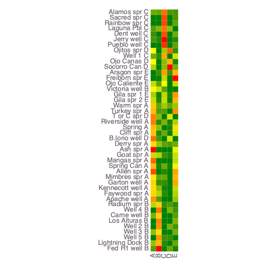
    


    ┌ Warning: Procedure to find unique signals could not identify a solution ...
    └ @ NMFk /Users/bulbulahmmed/.julia/packages/NMFk/koh08/src/NMFkCluster.jl:158
    ┌ Info: Signal A -> A Count: 16
    └ @ NMFk /Users/bulbulahmmed/.julia/packages/NMFk/koh08/src/NMFkPostprocess.jl:255
    ┌ Info: Signal B -> B Count: 10
    └ @ NMFk /Users/bulbulahmmed/.julia/packages/NMFk/koh08/src/NMFkPostprocess.jl:255
    ┌ Info: Signal C -> C Count: 8
    └ @ NMFk /Users/bulbulahmmed/.julia/packages/NMFk/koh08/src/NMFkPostprocess.jl:255
    ┌ Info: Signal D -> D Count: 5
    └ @ NMFk /Users/bulbulahmmed/.julia/packages/NMFk/koh08/src/NMFkPostprocess.jl:255
    ┌ Info: Signal E -> E Count: 5
    └ @ NMFk /Users/bulbulahmmed/.julia/packages/NMFk/koh08/src/NMFkPostprocess.jl:255
    ┌ Info: Signal A (S1) (k-means clustering)
    └ @ NMFk /Users/bulbulahmmed/.julia/packages/NMFk/koh08/src/NMFkPostprocess.jl:272
    ┌ Info: Signal B (S4) (k-means clustering)
    └ @ NMFk /Users/bulbulahmmed/.julia/packages/NMFk/koh08/src/NMFkPostprocess.jl:272
    ┌ Info: Signal C (S3) (k-means clustering)
    └ @ NMFk /Users/bulbulahmmed/.julia/packages/NMFk/koh08/src/NMFkPostprocess.jl:272
    ┌ Info: Signal D (S5) (k-means clustering)
    └ @ NMFk /Users/bulbulahmmed/.julia/packages/NMFk/koh08/src/NMFkPostprocess.jl:272
    ┌ Info: Signal E (S2) (k-means clustering)
    └ @ NMFk /Users/bulbulahmmed/.julia/packages/NMFk/koh08/src/NMFkPostprocess.jl:272


    

    


    


<?xml version="1.0" encoding="UTF-8"?>
<svg xmlns="http://www.w3.org/2000/svg"
     xmlns:xlink="http://www.w3.org/1999/xlink"
     xmlns:gadfly="http://www.gadflyjl.org/ns"
     version="1.2"
     width="141.42mm" height="100mm" viewBox="0 0 141.42 100"
     stroke="none"
     fill="#000000"
     stroke-width="0.3"
     font-size="3.88"

     id="img-2f3bbb2d">
<defs>
  <marker id="arrow" markerWidth="15" markerHeight="7" refX="5" refY="3.5" orient="auto" markerUnits="strokeWidth">
    <path d="M0,0 L15,3.5 L0,7 z" stroke="context-stroke" fill="context-stroke"/>
  </marker>
</defs>
<g class="plotroot" id="img-2f3bbb2d-1">
  <g class="guide xlabels" font-size="2.82" font-family="'PT Sans Caption','Helvetica Neue','Helvetica',sans-serif" fill="#6C606B" id="img-2f3bbb2d-2">
    <g transform="translate(68.68,92.22)" gadfly:scale="1.0" visibility="visible">
      <g class="primitive">
        <text text-anchor="end" dy="-0em" transform="rotate(-90,0, 0)">A</text>
      </g>
    </g>
    <g transform="translate(70.46,92.22)" gadfly:scale="1.0" visibility="visible">
      <g class="primitive">
        <text text-anchor="end" dy="-0em" transform="rotate(-90,0, 0)">B</text>
      </g>
    </g>
    <g transform="translate(72.25,92.22)" gadfly:scale="1.0" visibility="visible">
      <g class="primitive">
        <text text-anchor="end" dy="-0em" transform="rotate(-90,0, 0)">C</text>
      </g>
    </g>
    <g transform="translate(74.04,92.22)" gadfly:scale="1.0" visibility="visible">
      <g class="primitive">
        <text text-anchor="end" dy="-0em" transform="rotate(-90,0, 0)">D</text>
      </g>
    </g>
    <g transform="translate(75.83,92.22)" gadfly:scale="1.0" visibility="visible">
      <g class="primitive">
        <text text-anchor="end" dy="-0em" transform="rotate(-90,0, 0)">E</text>
      </g>
    </g>
  </g>
  <g stroke-width="0.11" stroke="#FFFFFF" id="img-2f3bbb2d-3">
    <g transform="translate(78.98,37.55)">
      <path fill="none" d="M-1.19,0.89 L1.19,0.89 1.19,-0.89 -1.19,-0.89 " class="primitive"/>
    </g>
    <g transform="translate(78.98,23.24)">
      <path fill="none" d="M-1.19,0.89 L1.19,0.89 1.19,-0.89 -1.19,-0.89 " class="primitive"/>
    </g>
    <g transform="translate(78.98,76.91)">
      <path fill="none" d="M-1.19,0.89 L1.19,0.89 1.19,-0.89 -1.19,-0.89 " class="primitive"/>
    </g>
    <g transform="translate(78.98,57.23)">
      <path fill="none" d="M-1.19,0.89 L1.19,0.89 1.19,-0.89 -1.19,-0.89 " class="primitive"/>
    </g>
    <g transform="translate(80.76,24.58)">
      <path fill="none" d="M-2.98,1.34 L1.79,1.34 1.79,-1.34 -0.6,-1.34 " class="primitive"/>
    </g>
    <g transform="translate(78.98,69.75)">
      <path fill="none" d="M-1.19,0.89 L1.19,0.89 1.19,-0.89 -1.19,-0.89 " class="primitive"/>
    </g>
    <g transform="translate(78.98,46.49)">
      <path fill="none" d="M-1.19,0.89 L1.19,0.89 1.19,-0.89 -1.19,-0.89 " class="primitive"/>
    </g>
    <g transform="translate(78.98,87.65)">
      <path fill="none" d="M-1.19,0.89 L1.19,0.89 1.19,-0.89 -1.19,-0.89 " class="primitive"/>
    </g>
    <g transform="translate(82.55,26.14)">
      <path fill="none" d="M-4.76,1.57 L2.38,1.57 2.38,-1.57 0,-1.57 " class="primitive"/>
    </g>
    <g transform="translate(78.98,32.18)">
      <path fill="none" d="M-1.19,0.89 L1.19,0.89 1.19,-0.89 -1.19,-0.89 " class="primitive"/>
    </g>
    <g transform="translate(78.98,82.28)">
      <path fill="none" d="M-1.19,0.89 L1.19,0.89 1.19,-0.89 -1.19,-0.89 " class="primitive"/>
    </g>
    <g transform="translate(80.76,47.84)">
      <path fill="none" d="M-2.98,1.34 L1.79,1.34 1.79,-1.34 -0.6,-1.34 " class="primitive"/>
    </g>
    <g transform="translate(78.98,64.39)">
      <path fill="none" d="M-1.19,0.89 L1.19,0.89 1.19,-0.89 -1.19,-0.89 " class="primitive"/>
    </g>
    <g transform="translate(84.34,27.82)">
      <path fill="none" d="M-6.55,1.68 L2.98,1.68 2.98,-1.68 0.6,-1.68 " class="primitive"/>
    </g>
    <g transform="translate(80.76,71.1)">
      <path fill="none" d="M-2.98,1.34 L1.79,1.34 1.79,-1.34 -0.6,-1.34 " class="primitive"/>
    </g>
    <g transform="translate(80.76,58.57)">
      <path fill="none" d="M-2.98,1.34 L1.79,1.34 1.79,-1.34 -0.6,-1.34 " class="primitive"/>
    </g>
    <g transform="translate(80.76,38.89)">
      <path fill="none" d="M-2.98,1.34 L1.79,1.34 1.79,-1.34 -0.6,-1.34 " class="primitive"/>
    </g>
    <g transform="translate(78.98,19.66)">
      <path fill="none" d="M-1.19,0.89 L1.19,0.89 1.19,-0.89 -1.19,-0.89 " class="primitive"/>
    </g>
    <g transform="translate(82.55,40.46)">
      <path fill="none" d="M-4.76,1.57 L2.38,1.57 2.38,-1.57 0,-1.57 " class="primitive"/>
    </g>
    <g transform="translate(80.76,78.25)">
      <path fill="none" d="M-2.98,1.34 L1.79,1.34 1.79,-1.34 -0.6,-1.34 " class="primitive"/>
    </g>
    <g transform="translate(82.55,60.14)">
      <path fill="none" d="M-4.76,1.57 L2.38,1.57 2.38,-1.57 0,-1.57 " class="primitive"/>
    </g>
    <g transform="translate(82.55,72.66)">
      <path fill="none" d="M-4.76,1.57 L2.38,1.57 2.38,-1.57 0,-1.57 " class="primitive"/>
    </g>
    <g transform="translate(78.98,53.65)">
      <path fill="none" d="M-1.19,0.89 L1.19,0.89 1.19,-0.89 -1.19,-0.89 " class="primitive"/>
    </g>
    <g transform="translate(82.55,49.4)">
      <path fill="none" d="M-4.76,1.57 L2.38,1.57 2.38,-1.57 0,-1.57 " class="primitive"/>
    </g>
    <g transform="translate(84.34,42.13)">
      <path fill="none" d="M-6.55,1.68 L2.98,1.68 2.98,-1.68 0.6,-1.68 " class="primitive"/>
    </g>
    <g transform="translate(80.76,88.99)">
      <path fill="none" d="M-2.98,1.34 L1.79,1.34 1.79,-1.34 -0.6,-1.34 " class="primitive"/>
    </g>
    <g transform="translate(78.98,14.29)">
      <path fill="none" d="M-1.19,0.89 L1.19,0.89 1.19,-0.89 -1.19,-0.89 " class="primitive"/>
    </g>
    <g transform="translate(80.76,83.62)">
      <path fill="none" d="M-2.98,1.34 L1.79,1.34 1.79,-1.34 -0.6,-1.34 " class="primitive"/>
    </g>
    <g transform="translate(85.53,75.46)">
      <path fill="none" d="M-2.98,2.8 L1.79,2.8 1.79,-2.8 -0.6,-2.8 " class="primitive"/>
    </g>
    <g transform="translate(86.72,23.74)">
      <path fill="none" d="M0.6,4.08 L2.98,4.08 2.98,-4.08 -6.55,-4.08 " class="primitive"/>
    </g>
    <g transform="translate(80.76,33.52)">
      <path fill="none" d="M-2.98,1.34 L1.79,1.34 1.79,-1.34 -0.6,-1.34 " class="primitive"/>
    </g>
    <g transform="translate(84.93,56.89)">
      <path fill="none" d="M0,3.24 L2.38,3.24 2.38,-3.24 -4.76,-3.24 " class="primitive"/>
    </g>
    <g transform="translate(87.91,45.77)">
      <path fill="none" d="M-2.98,3.63 L1.79,3.63 1.79,-3.63 -0.6,-3.63 " class="primitive"/>
    </g>
    <g transform="translate(80.76,15.63)">
      <path fill="none" d="M-2.98,1.34 L1.79,1.34 1.79,-1.34 -0.6,-1.34 " class="primitive"/>
    </g>
    <g transform="translate(87.31,79.54)">
      <path fill="none" d="M-4.76,4.08 L2.38,4.08 2.38,-4.08 0,-4.08 " class="primitive"/>
    </g>
    <g transform="translate(86.72,60.64)">
      <path fill="none" d="M-6.55,3.75 L2.98,3.75 2.98,-3.75 0.6,-3.75 " class="primitive"/>
    </g>
    <g transform="translate(89.1,19.68)">
      <path fill="none" d="M0.6,4.05 L2.98,4.05 2.98,-4.05 -6.55,-4.05 " class="primitive"/>
    </g>
    <g transform="translate(87.91,63.86)">
      <path fill="none" d="M-10.13,3.21 L4.17,3.21 4.17,-3.21 1.79,-3.21 " class="primitive"/>
    </g>
    <g transform="translate(92.68,71.7)">
      <path fill="none" d="M-2.98,7.84 L1.79,7.84 1.79,-7.84 -0.6,-7.84 " class="primitive"/>
    </g>
    <g transform="translate(90.89,26.6)">
      <path fill="none" d="M-8.34,6.92 L3.57,6.92 3.57,-6.92 1.19,-6.92 " class="primitive"/>
    </g>
    <g transform="translate(92.68,80.34)">
      <path fill="none" d="M-10.13,8.65 L4.17,8.65 4.17,-8.65 1.79,-8.65 " class="primitive"/>
    </g>
    <g transform="translate(94.46,36.19)">
      <path fill="none" d="M-4.76,9.58 L2.38,9.58 2.38,-9.58 -0,-9.58 " class="primitive"/>
    </g>
    <g transform="translate(98.04,58.26)">
      <path fill="none" d="M-1.19,22.08 L1.19,22.08 1.19,-22.08 -1.19,-22.08 " class="primitive"/>
    </g>
  </g>
  <g clip-path="url(#img-2f3bbb2d-4)">
    <g id="img-2f3bbb2d-5">
      <g pointer-events="visible" stroke-width="0.3" fill="#000000" fill-opacity="0.000" stroke="#000000" stroke-opacity="0.000" class="guide background" id="img-2f3bbb2d-6">
        <g transform="translate(72.25,51.86)" id="img-2f3bbb2d-7">
          <path d="M-4.47,-39.36 L4.47,-39.36 4.47,39.36 -4.47,39.36  z" class="primitive"/>
        </g>
      </g>
      <g class="guide ygridlines xfixed" stroke-dasharray="0.5,0.5" stroke-width="0.2" stroke="#D0D0E0" id="img-2f3bbb2d-8">
        <g transform="translate(72.25,14.29)" id="img-2f3bbb2d-9" visibility="visible" gadfly:scale="1.0">
          <path fill="none" d="M-4.47,0 L4.47,0 " class="primitive"/>
        </g>
        <g transform="translate(72.25,16.08)" id="img-2f3bbb2d-10" visibility="visible" gadfly:scale="1.0">
          <path fill="none" d="M-4.47,0 L4.47,0 " class="primitive"/>
        </g>
        <g transform="translate(72.25,17.87)" id="img-2f3bbb2d-11" visibility="visible" gadfly:scale="1.0">
          <path fill="none" d="M-4.47,0 L4.47,0 " class="primitive"/>
        </g>
        <g transform="translate(72.25,19.66)" id="img-2f3bbb2d-12" visibility="visible" gadfly:scale="1.0">
          <path fill="none" d="M-4.47,0 L4.47,0 " class="primitive"/>
        </g>
        <g transform="translate(72.25,21.45)" id="img-2f3bbb2d-13" visibility="visible" gadfly:scale="1.0">
          <path fill="none" d="M-4.47,0 L4.47,0 " class="primitive"/>
        </g>
        <g transform="translate(72.25,23.24)" id="img-2f3bbb2d-14" visibility="visible" gadfly:scale="1.0">
          <path fill="none" d="M-4.47,0 L4.47,0 " class="primitive"/>
        </g>
        <g transform="translate(72.25,25.02)" id="img-2f3bbb2d-15" visibility="visible" gadfly:scale="1.0">
          <path fill="none" d="M-4.47,0 L4.47,0 " class="primitive"/>
        </g>
        <g transform="translate(72.25,26.81)" id="img-2f3bbb2d-16" visibility="visible" gadfly:scale="1.0">
          <path fill="none" d="M-4.47,0 L4.47,0 " class="primitive"/>
        </g>
        <g transform="translate(72.25,28.6)" id="img-2f3bbb2d-17" visibility="visible" gadfly:scale="1.0">
          <path fill="none" d="M-4.47,0 L4.47,0 " class="primitive"/>
        </g>
        <g transform="translate(72.25,30.39)" id="img-2f3bbb2d-18" visibility="visible" gadfly:scale="1.0">
          <path fill="none" d="M-4.47,0 L4.47,0 " class="primitive"/>
        </g>
        <g transform="translate(72.25,32.18)" id="img-2f3bbb2d-19" visibility="visible" gadfly:scale="1.0">
          <path fill="none" d="M-4.47,0 L4.47,0 " class="primitive"/>
        </g>
        <g transform="translate(72.25,33.97)" id="img-2f3bbb2d-20" visibility="visible" gadfly:scale="1.0">
          <path fill="none" d="M-4.47,0 L4.47,0 " class="primitive"/>
        </g>
        <g transform="translate(72.25,35.76)" id="img-2f3bbb2d-21" visibility="visible" gadfly:scale="1.0">
          <path fill="none" d="M-4.47,0 L4.47,0 " class="primitive"/>
        </g>
        <g transform="translate(72.25,37.55)" id="img-2f3bbb2d-22" visibility="visible" gadfly:scale="1.0">
          <path fill="none" d="M-4.47,0 L4.47,0 " class="primitive"/>
        </g>
        <g transform="translate(72.25,39.34)" id="img-2f3bbb2d-23" visibility="visible" gadfly:scale="1.0">
          <path fill="none" d="M-4.47,0 L4.47,0 " class="primitive"/>
        </g>
        <g transform="translate(72.25,41.13)" id="img-2f3bbb2d-24" visibility="visible" gadfly:scale="1.0">
          <path fill="none" d="M-4.47,0 L4.47,0 " class="primitive"/>
        </g>
        <g transform="translate(72.25,42.92)" id="img-2f3bbb2d-25" visibility="visible" gadfly:scale="1.0">
          <path fill="none" d="M-4.47,0 L4.47,0 " class="primitive"/>
        </g>
        <g transform="translate(72.25,44.71)" id="img-2f3bbb2d-26" visibility="visible" gadfly:scale="1.0">
          <path fill="none" d="M-4.47,0 L4.47,0 " class="primitive"/>
        </g>
        <g transform="translate(72.25,46.49)" id="img-2f3bbb2d-27" visibility="visible" gadfly:scale="1.0">
          <path fill="none" d="M-4.47,0 L4.47,0 " class="primitive"/>
        </g>
        <g transform="translate(72.25,48.28)" id="img-2f3bbb2d-28" visibility="visible" gadfly:scale="1.0">
          <path fill="none" d="M-4.47,0 L4.47,0 " class="primitive"/>
        </g>
        <g transform="translate(72.25,50.07)" id="img-2f3bbb2d-29" visibility="visible" gadfly:scale="1.0">
          <path fill="none" d="M-4.47,0 L4.47,0 " class="primitive"/>
        </g>
        <g transform="translate(72.25,51.86)" id="img-2f3bbb2d-30" visibility="visible" gadfly:scale="1.0">
          <path fill="none" d="M-4.47,0 L4.47,0 " class="primitive"/>
        </g>
        <g transform="translate(72.25,53.65)" id="img-2f3bbb2d-31" visibility="visible" gadfly:scale="1.0">
          <path fill="none" d="M-4.47,0 L4.47,0 " class="primitive"/>
        </g>
        <g transform="translate(72.25,55.44)" id="img-2f3bbb2d-32" visibility="visible" gadfly:scale="1.0">
          <path fill="none" d="M-4.47,0 L4.47,0 " class="primitive"/>
        </g>
        <g transform="translate(72.25,57.23)" id="img-2f3bbb2d-33" visibility="visible" gadfly:scale="1.0">
          <path fill="none" d="M-4.47,0 L4.47,0 " class="primitive"/>
        </g>
        <g transform="translate(72.25,59.02)" id="img-2f3bbb2d-34" visibility="visible" gadfly:scale="1.0">
          <path fill="none" d="M-4.47,0 L4.47,0 " class="primitive"/>
        </g>
        <g transform="translate(72.25,60.81)" id="img-2f3bbb2d-35" visibility="visible" gadfly:scale="1.0">
          <path fill="none" d="M-4.47,0 L4.47,0 " class="primitive"/>
        </g>
        <g transform="translate(72.25,62.6)" id="img-2f3bbb2d-36" visibility="visible" gadfly:scale="1.0">
          <path fill="none" d="M-4.47,0 L4.47,0 " class="primitive"/>
        </g>
        <g transform="translate(72.25,64.39)" id="img-2f3bbb2d-37" visibility="visible" gadfly:scale="1.0">
          <path fill="none" d="M-4.47,0 L4.47,0 " class="primitive"/>
        </g>
        <g transform="translate(72.25,66.18)" id="img-2f3bbb2d-38" visibility="visible" gadfly:scale="1.0">
          <path fill="none" d="M-4.47,0 L4.47,0 " class="primitive"/>
        </g>
        <g transform="translate(72.25,67.97)" id="img-2f3bbb2d-39" visibility="visible" gadfly:scale="1.0">
          <path fill="none" d="M-4.47,0 L4.47,0 " class="primitive"/>
        </g>
        <g transform="translate(72.25,69.75)" id="img-2f3bbb2d-40" visibility="visible" gadfly:scale="1.0">
          <path fill="none" d="M-4.47,0 L4.47,0 " class="primitive"/>
        </g>
        <g transform="translate(72.25,71.54)" id="img-2f3bbb2d-41" visibility="visible" gadfly:scale="1.0">
          <path fill="none" d="M-4.47,0 L4.47,0 " class="primitive"/>
        </g>
        <g transform="translate(72.25,73.33)" id="img-2f3bbb2d-42" visibility="visible" gadfly:scale="1.0">
          <path fill="none" d="M-4.47,0 L4.47,0 " class="primitive"/>
        </g>
        <g transform="translate(72.25,75.12)" id="img-2f3bbb2d-43" visibility="visible" gadfly:scale="1.0">
          <path fill="none" d="M-4.47,0 L4.47,0 " class="primitive"/>
        </g>
        <g transform="translate(72.25,76.91)" id="img-2f3bbb2d-44" visibility="visible" gadfly:scale="1.0">
          <path fill="none" d="M-4.47,0 L4.47,0 " class="primitive"/>
        </g>
        <g transform="translate(72.25,78.7)" id="img-2f3bbb2d-45" visibility="visible" gadfly:scale="1.0">
          <path fill="none" d="M-4.47,0 L4.47,0 " class="primitive"/>
        </g>
        <g transform="translate(72.25,80.49)" id="img-2f3bbb2d-46" visibility="visible" gadfly:scale="1.0">
          <path fill="none" d="M-4.47,0 L4.47,0 " class="primitive"/>
        </g>
        <g transform="translate(72.25,82.28)" id="img-2f3bbb2d-47" visibility="visible" gadfly:scale="1.0">
          <path fill="none" d="M-4.47,0 L4.47,0 " class="primitive"/>
        </g>
        <g transform="translate(72.25,84.07)" id="img-2f3bbb2d-48" visibility="visible" gadfly:scale="1.0">
          <path fill="none" d="M-4.47,0 L4.47,0 " class="primitive"/>
        </g>
        <g transform="translate(72.25,85.86)" id="img-2f3bbb2d-49" visibility="visible" gadfly:scale="1.0">
          <path fill="none" d="M-4.47,0 L4.47,0 " class="primitive"/>
        </g>
        <g transform="translate(72.25,87.65)" id="img-2f3bbb2d-50" visibility="visible" gadfly:scale="1.0">
          <path fill="none" d="M-4.47,0 L4.47,0 " class="primitive"/>
        </g>
        <g transform="translate(72.25,89.44)" id="img-2f3bbb2d-51" visibility="visible" gadfly:scale="1.0">
          <path fill="none" d="M-4.47,0 L4.47,0 " class="primitive"/>
        </g>
      </g>
      <g class="guide xgridlines yfixed" stroke-dasharray="0.5,0.5" stroke-width="0.2" stroke="#D0D0E0" id="img-2f3bbb2d-52">
        <g transform="translate(69.57,51.86)" id="img-2f3bbb2d-53" visibility="visible" gadfly:scale="1.0">
          <path fill="none" d="M0,-39.36 L0,39.36 " class="primitive"/>
        </g>
        <g transform="translate(71.36,51.86)" id="img-2f3bbb2d-54" visibility="visible" gadfly:scale="1.0">
          <path fill="none" d="M0,-39.36 L0,39.36 " class="primitive"/>
        </g>
        <g transform="translate(73.15,51.86)" id="img-2f3bbb2d-55" visibility="visible" gadfly:scale="1.0">
          <path fill="none" d="M0,-39.36 L0,39.36 " class="primitive"/>
        </g>
        <g transform="translate(74.94,51.86)" id="img-2f3bbb2d-56" visibility="visible" gadfly:scale="1.0">
          <path fill="none" d="M0,-39.36 L0,39.36 " class="primitive"/>
        </g>
      </g>
      <g class="plotpanel" id="img-2f3bbb2d-57">
        <metadata>
          <boundingbox value="67.78076001057198mm 12.5mm 8.94599344272806mm 78.72474229600694mm"/>
          <unitbox value="0.5 0.5 5.0 44.0"/>
        </metadata>
        <g shape-rendering="crispEdges" class="geometry" stroke="#000000" stroke-opacity="0.000" id="img-2f3bbb2d-58">
          <g transform="translate(68.7,13.42)" id="img-2f3bbb2d-59" fill="#FFC800" fill-opacity="1">
            <path d="M-0.92,-0.92 L0.92,-0.92 0.92,0.92 -0.92,0.92  z" class="primitive"/>
          </g>
          <g transform="translate(68.7,15.21)" id="img-2f3bbb2d-60" fill="#FFBD00" fill-opacity="1">
            <path d="M-0.92,-0.92 L0.92,-0.92 0.92,0.92 -0.92,0.92  z" class="primitive"/>
          </g>
          <g transform="translate(68.7,17)" id="img-2f3bbb2d-61" fill="#FF7E00" fill-opacity="1">
            <path d="M-0.92,-0.92 L0.92,-0.92 0.92,0.92 -0.92,0.92  z" class="primitive"/>
          </g>
          <g transform="translate(68.7,18.79)" id="img-2f3bbb2d-62" fill="#FFBE00" fill-opacity="1">
            <path d="M-0.92,-0.92 L0.92,-0.92 0.92,0.92 -0.92,0.92  z" class="primitive"/>
          </g>
          <g transform="translate(68.7,20.58)" id="img-2f3bbb2d-63" fill="#FFC800" fill-opacity="1">
            <path d="M-0.92,-0.92 L0.92,-0.92 0.92,0.92 -0.92,0.92  z" class="primitive"/>
          </g>
          <g transform="translate(68.7,22.37)" id="img-2f3bbb2d-64" fill="#FFE200" fill-opacity="1">
            <path d="M-0.92,-0.92 L0.92,-0.92 0.92,0.92 -0.92,0.92  z" class="primitive"/>
          </g>
          <g transform="translate(68.7,24.15)" id="img-2f3bbb2d-65" fill="#FF0000" fill-opacity="1">
            <path d="M-0.92,-0.92 L0.92,-0.92 0.92,0.92 -0.92,0.92  z" class="primitive"/>
          </g>
          <g transform="translate(68.7,25.94)" id="img-2f3bbb2d-66" fill="#C5DD00" fill-opacity="1">
            <path d="M-0.92,-0.92 L0.92,-0.92 0.92,0.92 -0.92,0.92  z" class="primitive"/>
          </g>
          <g transform="translate(68.7,27.73)" id="img-2f3bbb2d-67" fill="#FF6700" fill-opacity="1">
            <path d="M-0.92,-0.92 L0.92,-0.92 0.92,0.92 -0.92,0.92  z" class="primitive"/>
          </g>
          <g transform="translate(68.7,29.52)" id="img-2f3bbb2d-68" fill="#FFB800" fill-opacity="1">
            <path d="M-0.92,-0.92 L0.92,-0.92 0.92,0.92 -0.92,0.92  z" class="primitive"/>
          </g>
          <g transform="translate(68.7,31.31)" id="img-2f3bbb2d-69" fill="#FF4C00" fill-opacity="1">
            <path d="M-0.92,-0.92 L0.92,-0.92 0.92,0.92 -0.92,0.92  z" class="primitive"/>
          </g>
          <g transform="translate(68.7,33.1)" id="img-2f3bbb2d-70" fill="#FFE700" fill-opacity="1">
            <path d="M-0.92,-0.92 L0.92,-0.92 0.92,0.92 -0.92,0.92  z" class="primitive"/>
          </g>
          <g transform="translate(68.7,34.89)" id="img-2f3bbb2d-71" fill="#FFD400" fill-opacity="1">
            <path d="M-0.92,-0.92 L0.92,-0.92 0.92,0.92 -0.92,0.92  z" class="primitive"/>
          </g>
          <g transform="translate(68.7,36.68)" id="img-2f3bbb2d-72" fill="#FFDB00" fill-opacity="1">
            <path d="M-0.92,-0.92 L0.92,-0.92 0.92,0.92 -0.92,0.92  z" class="primitive"/>
          </g>
          <g transform="translate(68.7,38.47)" id="img-2f3bbb2d-73" fill="#FFD800" fill-opacity="1">
            <path d="M-0.92,-0.92 L0.92,-0.92 0.92,0.92 -0.92,0.92  z" class="primitive"/>
          </g>
          <g transform="translate(68.7,40.26)" id="img-2f3bbb2d-74" fill="#FF9500" fill-opacity="1">
            <path d="M-0.92,-0.92 L0.92,-0.92 0.92,0.92 -0.92,0.92  z" class="primitive"/>
          </g>
          <g transform="translate(68.7,42.05)" id="img-2f3bbb2d-75" fill="#F8FB00" fill-opacity="1">
            <path d="M-0.92,-0.92 L0.92,-0.92 0.92,0.92 -0.92,0.92  z" class="primitive"/>
          </g>
          <g transform="translate(68.7,43.84)" id="img-2f3bbb2d-76" fill="#B7D500" fill-opacity="1">
            <path d="M-0.92,-0.92 L0.92,-0.92 0.92,0.92 -0.92,0.92  z" class="primitive"/>
          </g>
          <g transform="translate(68.7,45.63)" id="img-2f3bbb2d-77" fill="#008000" fill-opacity="1">
            <path d="M-0.92,-0.92 L0.92,-0.92 0.92,0.92 -0.92,0.92  z" class="primitive"/>
          </g>
          <g transform="translate(68.7,47.41)" id="img-2f3bbb2d-78" fill="#7AB200" fill-opacity="1">
            <path d="M-0.92,-0.92 L0.92,-0.92 0.92,0.92 -0.92,0.92  z" class="primitive"/>
          </g>
          <g transform="translate(68.7,49.2)" id="img-2f3bbb2d-79" fill="#008000" fill-opacity="1">
            <path d="M-0.92,-0.92 L0.92,-0.92 0.92,0.92 -0.92,0.92  z" class="primitive"/>
          </g>
          <g transform="translate(68.7,50.99)" id="img-2f3bbb2d-80" fill="#008000" fill-opacity="1">
            <path d="M-0.92,-0.92 L0.92,-0.92 0.92,0.92 -0.92,0.92  z" class="primitive"/>
          </g>
          <g transform="translate(68.7,52.78)" id="img-2f3bbb2d-81" fill="#92BF00" fill-opacity="1">
            <path d="M-0.92,-0.92 L0.92,-0.92 0.92,0.92 -0.92,0.92  z" class="primitive"/>
          </g>
          <g transform="translate(68.7,54.57)" id="img-2f3bbb2d-82" fill="#008000" fill-opacity="1">
            <path d="M-0.92,-0.92 L0.92,-0.92 0.92,0.92 -0.92,0.92  z" class="primitive"/>
          </g>
          <g transform="translate(68.7,56.36)" id="img-2f3bbb2d-83" fill="#95C100" fill-opacity="1">
            <path d="M-0.92,-0.92 L0.92,-0.92 0.92,0.92 -0.92,0.92  z" class="primitive"/>
          </g>
          <g transform="translate(68.7,58.15)" id="img-2f3bbb2d-84" fill="#5AA000" fill-opacity="1">
            <path d="M-0.92,-0.92 L0.92,-0.92 0.92,0.92 -0.92,0.92  z" class="primitive"/>
          </g>
          <g transform="translate(68.7,59.94)" id="img-2f3bbb2d-85" fill="#70AC00" fill-opacity="1">
            <path d="M-0.92,-0.92 L0.92,-0.92 0.92,0.92 -0.92,0.92  z" class="primitive"/>
          </g>
          <g transform="translate(68.7,61.73)" id="img-2f3bbb2d-86" fill="#008000" fill-opacity="1">
            <path d="M-0.92,-0.92 L0.92,-0.92 0.92,0.92 -0.92,0.92  z" class="primitive"/>
          </g>
          <g transform="translate(68.7,63.52)" id="img-2f3bbb2d-87" fill="#008000" fill-opacity="1">
            <path d="M-0.92,-0.92 L0.92,-0.92 0.92,0.92 -0.92,0.92  z" class="primitive"/>
          </g>
          <g transform="translate(68.7,65.31)" id="img-2f3bbb2d-88" fill="#579E00" fill-opacity="1">
            <path d="M-0.92,-0.92 L0.92,-0.92 0.92,0.92 -0.92,0.92  z" class="primitive"/>
          </g>
          <g transform="translate(68.7,67.1)" id="img-2f3bbb2d-89" fill="#3A9000" fill-opacity="1">
            <path d="M-0.92,-0.92 L0.92,-0.92 0.92,0.92 -0.92,0.92  z" class="primitive"/>
          </g>
          <g transform="translate(68.7,68.88)" id="img-2f3bbb2d-90" fill="#479600" fill-opacity="1">
            <path d="M-0.92,-0.92 L0.92,-0.92 0.92,0.92 -0.92,0.92  z" class="primitive"/>
          </g>
          <g transform="translate(68.7,70.67)" id="img-2f3bbb2d-91" fill="#008000" fill-opacity="1">
            <path d="M-0.92,-0.92 L0.92,-0.92 0.92,0.92 -0.92,0.92  z" class="primitive"/>
          </g>
          <g transform="translate(68.7,72.46)" id="img-2f3bbb2d-92" fill="#71AD00" fill-opacity="1">
            <path d="M-0.92,-0.92 L0.92,-0.92 0.92,0.92 -0.92,0.92  z" class="primitive"/>
          </g>
          <g transform="translate(68.7,74.25)" id="img-2f3bbb2d-93" fill="#FDFE00" fill-opacity="1">
            <path d="M-0.92,-0.92 L0.92,-0.92 0.92,0.92 -0.92,0.92  z" class="primitive"/>
          </g>
          <g transform="translate(68.7,76.04)" id="img-2f3bbb2d-94" fill="#FBFD00" fill-opacity="1">
            <path d="M-0.92,-0.92 L0.92,-0.92 0.92,0.92 -0.92,0.92  z" class="primitive"/>
          </g>
          <g transform="translate(68.7,77.83)" id="img-2f3bbb2d-95" fill="#AED000" fill-opacity="1">
            <path d="M-0.92,-0.92 L0.92,-0.92 0.92,0.92 -0.92,0.92  z" class="primitive"/>
          </g>
          <g transform="translate(68.7,79.62)" id="img-2f3bbb2d-96" fill="#FF7D00" fill-opacity="1">
            <path d="M-0.92,-0.92 L0.92,-0.92 0.92,0.92 -0.92,0.92  z" class="primitive"/>
          </g>
          <g transform="translate(68.7,81.41)" id="img-2f3bbb2d-97" fill="#FF6E00" fill-opacity="1">
            <path d="M-0.92,-0.92 L0.92,-0.92 0.92,0.92 -0.92,0.92  z" class="primitive"/>
          </g>
          <g transform="translate(68.7,83.2)" id="img-2f3bbb2d-98" fill="#008000" fill-opacity="1">
            <path d="M-0.92,-0.92 L0.92,-0.92 0.92,0.92 -0.92,0.92  z" class="primitive"/>
          </g>
          <g transform="translate(68.7,84.99)" id="img-2f3bbb2d-99" fill="#008000" fill-opacity="1">
            <path d="M-0.92,-0.92 L0.92,-0.92 0.92,0.92 -0.92,0.92  z" class="primitive"/>
          </g>
          <g transform="translate(68.7,86.78)" id="img-2f3bbb2d-100" fill="#C4DC00" fill-opacity="1">
            <path d="M-0.92,-0.92 L0.92,-0.92 0.92,0.92 -0.92,0.92  z" class="primitive"/>
          </g>
          <g transform="translate(68.7,88.57)" id="img-2f3bbb2d-101" fill="#AACD00" fill-opacity="1">
            <path d="M-0.92,-0.92 L0.92,-0.92 0.92,0.92 -0.92,0.92  z" class="primitive"/>
          </g>
          <g transform="translate(68.7,90.36)" id="img-2f3bbb2d-102" fill="#C5DD00" fill-opacity="1">
            <path d="M-0.92,-0.92 L0.92,-0.92 0.92,0.92 -0.92,0.92  z" class="primitive"/>
          </g>
          <g transform="translate(70.49,13.42)" id="img-2f3bbb2d-103" fill="#64A600" fill-opacity="1">
            <path d="M-0.92,-0.92 L0.92,-0.92 0.92,0.92 -0.92,0.92  z" class="primitive"/>
          </g>
          <g transform="translate(70.49,15.21)" id="img-2f3bbb2d-104" fill="#4F9B00" fill-opacity="1">
            <path d="M-0.92,-0.92 L0.92,-0.92 0.92,0.92 -0.92,0.92  z" class="primitive"/>
          </g>
          <g transform="translate(70.49,17)" id="img-2f3bbb2d-105" fill="#318C00" fill-opacity="1">
            <path d="M-0.92,-0.92 L0.92,-0.92 0.92,0.92 -0.92,0.92  z" class="primitive"/>
          </g>
          <g transform="translate(70.49,18.79)" id="img-2f3bbb2d-106" fill="#8FBE00" fill-opacity="1">
            <path d="M-0.92,-0.92 L0.92,-0.92 0.92,0.92 -0.92,0.92  z" class="primitive"/>
          </g>
          <g transform="translate(70.49,20.58)" id="img-2f3bbb2d-107" fill="#278900" fill-opacity="1">
            <path d="M-0.92,-0.92 L0.92,-0.92 0.92,0.92 -0.92,0.92  z" class="primitive"/>
          </g>
          <g transform="translate(70.49,22.37)" id="img-2f3bbb2d-108" fill="#99C400" fill-opacity="1">
            <path d="M-0.92,-0.92 L0.92,-0.92 0.92,0.92 -0.92,0.92  z" class="primitive"/>
          </g>
          <g transform="translate(70.49,24.15)" id="img-2f3bbb2d-109" fill="#008000" fill-opacity="1">
            <path d="M-0.92,-0.92 L0.92,-0.92 0.92,0.92 -0.92,0.92  z" class="primitive"/>
          </g>
          <g transform="translate(70.49,25.94)" id="img-2f3bbb2d-110" fill="#B6D400" fill-opacity="1">
            <path d="M-0.92,-0.92 L0.92,-0.92 0.92,0.92 -0.92,0.92  z" class="primitive"/>
          </g>
          <g transform="translate(70.49,27.73)" id="img-2f3bbb2d-111" fill="#008000" fill-opacity="1">
            <path d="M-0.92,-0.92 L0.92,-0.92 0.92,0.92 -0.92,0.92  z" class="primitive"/>
          </g>
          <g transform="translate(70.49,29.52)" id="img-2f3bbb2d-112" fill="#1B8500" fill-opacity="1">
            <path d="M-0.92,-0.92 L0.92,-0.92 0.92,0.92 -0.92,0.92  z" class="primitive"/>
          </g>
          <g transform="translate(70.49,31.31)" id="img-2f3bbb2d-113" fill="#008000" fill-opacity="1">
            <path d="M-0.92,-0.92 L0.92,-0.92 0.92,0.92 -0.92,0.92  z" class="primitive"/>
          </g>
          <g transform="translate(70.49,33.1)" id="img-2f3bbb2d-114" fill="#63A500" fill-opacity="1">
            <path d="M-0.92,-0.92 L0.92,-0.92 0.92,0.92 -0.92,0.92  z" class="primitive"/>
          </g>
          <g transform="translate(70.49,34.89)" id="img-2f3bbb2d-115" fill="#338D00" fill-opacity="1">
            <path d="M-0.92,-0.92 L0.92,-0.92 0.92,0.92 -0.92,0.92  z" class="primitive"/>
          </g>
          <g transform="translate(70.49,36.68)" id="img-2f3bbb2d-116" fill="#91BF00" fill-opacity="1">
            <path d="M-0.92,-0.92 L0.92,-0.92 0.92,0.92 -0.92,0.92  z" class="primitive"/>
          </g>
          <g transform="translate(70.49,38.47)" id="img-2f3bbb2d-117" fill="#B7D500" fill-opacity="1">
            <path d="M-0.92,-0.92 L0.92,-0.92 0.92,0.92 -0.92,0.92  z" class="primitive"/>
          </g>
          <g transform="translate(70.49,40.26)" id="img-2f3bbb2d-118" fill="#529C00" fill-opacity="1">
            <path d="M-0.92,-0.92 L0.92,-0.92 0.92,0.92 -0.92,0.92  z" class="primitive"/>
          </g>
          <g transform="translate(70.49,42.05)" id="img-2f3bbb2d-119" fill="#CAE000" fill-opacity="1">
            <path d="M-0.92,-0.92 L0.92,-0.92 0.92,0.92 -0.92,0.92  z" class="primitive"/>
          </g>
          <g transform="translate(70.49,43.84)" id="img-2f3bbb2d-120" fill="#FFD100" fill-opacity="1">
            <path d="M-0.92,-0.92 L0.92,-0.92 0.92,0.92 -0.92,0.92  z" class="primitive"/>
          </g>
          <g transform="translate(70.49,45.63)" id="img-2f3bbb2d-121" fill="#FF7800" fill-opacity="1">
            <path d="M-0.92,-0.92 L0.92,-0.92 0.92,0.92 -0.92,0.92  z" class="primitive"/>
          </g>
          <g transform="translate(70.49,47.41)" id="img-2f3bbb2d-122" fill="#FFD000" fill-opacity="1">
            <path d="M-0.92,-0.92 L0.92,-0.92 0.92,0.92 -0.92,0.92  z" class="primitive"/>
          </g>
          <g transform="translate(70.49,49.2)" id="img-2f3bbb2d-123" fill="#FF8700" fill-opacity="1">
            <path d="M-0.92,-0.92 L0.92,-0.92 0.92,0.92 -0.92,0.92  z" class="primitive"/>
          </g>
          <g transform="translate(70.49,50.99)" id="img-2f3bbb2d-124" fill="#FF9200" fill-opacity="1">
            <path d="M-0.92,-0.92 L0.92,-0.92 0.92,0.92 -0.92,0.92  z" class="primitive"/>
          </g>
          <g transform="translate(70.49,52.78)" id="img-2f3bbb2d-125" fill="#FFDD00" fill-opacity="1">
            <path d="M-0.92,-0.92 L0.92,-0.92 0.92,0.92 -0.92,0.92  z" class="primitive"/>
          </g>
          <g transform="translate(70.49,54.57)" id="img-2f3bbb2d-126" fill="#FF9600" fill-opacity="1">
            <path d="M-0.92,-0.92 L0.92,-0.92 0.92,0.92 -0.92,0.92  z" class="primitive"/>
          </g>
          <g transform="translate(70.49,56.36)" id="img-2f3bbb2d-127" fill="#FFBA00" fill-opacity="1">
            <path d="M-0.92,-0.92 L0.92,-0.92 0.92,0.92 -0.92,0.92  z" class="primitive"/>
          </g>
          <g transform="translate(70.49,58.15)" id="img-2f3bbb2d-128" fill="#FF0000" fill-opacity="1">
            <path d="M-0.92,-0.92 L0.92,-0.92 0.92,0.92 -0.92,0.92  z" class="primitive"/>
          </g>
          <g transform="translate(70.49,59.94)" id="img-2f3bbb2d-129" fill="#64A600" fill-opacity="1">
            <path d="M-0.92,-0.92 L0.92,-0.92 0.92,0.92 -0.92,0.92  z" class="primitive"/>
          </g>
          <g transform="translate(70.49,61.73)" id="img-2f3bbb2d-130" fill="#008000" fill-opacity="1">
            <path d="M-0.92,-0.92 L0.92,-0.92 0.92,0.92 -0.92,0.92  z" class="primitive"/>
          </g>
          <g transform="translate(70.49,63.52)" id="img-2f3bbb2d-131" fill="#008000" fill-opacity="1">
            <path d="M-0.92,-0.92 L0.92,-0.92 0.92,0.92 -0.92,0.92  z" class="primitive"/>
          </g>
          <g transform="translate(70.49,65.31)" id="img-2f3bbb2d-132" fill="#83B700" fill-opacity="1">
            <path d="M-0.92,-0.92 L0.92,-0.92 0.92,0.92 -0.92,0.92  z" class="primitive"/>
          </g>
          <g transform="translate(70.49,67.1)" id="img-2f3bbb2d-133" fill="#008000" fill-opacity="1">
            <path d="M-0.92,-0.92 L0.92,-0.92 0.92,0.92 -0.92,0.92  z" class="primitive"/>
          </g>
          <g transform="translate(70.49,68.88)" id="img-2f3bbb2d-134" fill="#248800" fill-opacity="1">
            <path d="M-0.92,-0.92 L0.92,-0.92 0.92,0.92 -0.92,0.92  z" class="primitive"/>
          </g>
          <g transform="translate(70.49,70.67)" id="img-2f3bbb2d-135" fill="#008000" fill-opacity="1">
            <path d="M-0.92,-0.92 L0.92,-0.92 0.92,0.92 -0.92,0.92  z" class="primitive"/>
          </g>
          <g transform="translate(70.49,72.46)" id="img-2f3bbb2d-136" fill="#308C00" fill-opacity="1">
            <path d="M-0.92,-0.92 L0.92,-0.92 0.92,0.92 -0.92,0.92  z" class="primitive"/>
          </g>
          <g transform="translate(70.49,74.25)" id="img-2f3bbb2d-137" fill="#008000" fill-opacity="1">
            <path d="M-0.92,-0.92 L0.92,-0.92 0.92,0.92 -0.92,0.92  z" class="primitive"/>
          </g>
          <g transform="translate(70.49,76.04)" id="img-2f3bbb2d-138" fill="#008000" fill-opacity="1">
            <path d="M-0.92,-0.92 L0.92,-0.92 0.92,0.92 -0.92,0.92  z" class="primitive"/>
          </g>
          <g transform="translate(70.49,77.83)" id="img-2f3bbb2d-139" fill="#008000" fill-opacity="1">
            <path d="M-0.92,-0.92 L0.92,-0.92 0.92,0.92 -0.92,0.92  z" class="primitive"/>
          </g>
          <g transform="translate(70.49,79.62)" id="img-2f3bbb2d-140" fill="#88B900" fill-opacity="1">
            <path d="M-0.92,-0.92 L0.92,-0.92 0.92,0.92 -0.92,0.92  z" class="primitive"/>
          </g>
          <g transform="translate(70.49,81.41)" id="img-2f3bbb2d-141" fill="#479600" fill-opacity="1">
            <path d="M-0.92,-0.92 L0.92,-0.92 0.92,0.92 -0.92,0.92  z" class="primitive"/>
          </g>
          <g transform="translate(70.49,83.2)" id="img-2f3bbb2d-142" fill="#3A9000" fill-opacity="1">
            <path d="M-0.92,-0.92 L0.92,-0.92 0.92,0.92 -0.92,0.92  z" class="primitive"/>
          </g>
          <g transform="translate(70.49,84.99)" id="img-2f3bbb2d-143" fill="#098100" fill-opacity="1">
            <path d="M-0.92,-0.92 L0.92,-0.92 0.92,0.92 -0.92,0.92  z" class="primitive"/>
          </g>
          <g transform="translate(70.49,86.78)" id="img-2f3bbb2d-144" fill="#5EA200" fill-opacity="1">
            <path d="M-0.92,-0.92 L0.92,-0.92 0.92,0.92 -0.92,0.92  z" class="primitive"/>
          </g>
          <g transform="translate(70.49,88.57)" id="img-2f3bbb2d-145" fill="#158300" fill-opacity="1">
            <path d="M-0.92,-0.92 L0.92,-0.92 0.92,0.92 -0.92,0.92  z" class="primitive"/>
          </g>
          <g transform="translate(70.49,90.36)" id="img-2f3bbb2d-146" fill="#248800" fill-opacity="1">
            <path d="M-0.92,-0.92 L0.92,-0.92 0.92,0.92 -0.92,0.92  z" class="primitive"/>
          </g>
          <g transform="translate(72.28,13.42)" id="img-2f3bbb2d-147" fill="#A3C900" fill-opacity="1">
            <path d="M-0.92,-0.92 L0.92,-0.92 0.92,0.92 -0.92,0.92  z" class="primitive"/>
          </g>
          <g transform="translate(72.28,15.21)" id="img-2f3bbb2d-148" fill="#569E00" fill-opacity="1">
            <path d="M-0.92,-0.92 L0.92,-0.92 0.92,0.92 -0.92,0.92  z" class="primitive"/>
          </g>
          <g transform="translate(72.28,17)" id="img-2f3bbb2d-149" fill="#7DB400" fill-opacity="1">
            <path d="M-0.92,-0.92 L0.92,-0.92 0.92,0.92 -0.92,0.92  z" class="primitive"/>
          </g>
          <g transform="translate(72.28,18.79)" id="img-2f3bbb2d-150" fill="#008000" fill-opacity="1">
            <path d="M-0.92,-0.92 L0.92,-0.92 0.92,0.92 -0.92,0.92  z" class="primitive"/>
          </g>
          <g transform="translate(72.28,20.58)" id="img-2f3bbb2d-151" fill="#6AA900" fill-opacity="1">
            <path d="M-0.92,-0.92 L0.92,-0.92 0.92,0.92 -0.92,0.92  z" class="primitive"/>
          </g>
          <g transform="translate(72.28,22.37)" id="img-2f3bbb2d-152" fill="#5DA200" fill-opacity="1">
            <path d="M-0.92,-0.92 L0.92,-0.92 0.92,0.92 -0.92,0.92  z" class="primitive"/>
          </g>
          <g transform="translate(72.28,24.15)" id="img-2f3bbb2d-153" fill="#008000" fill-opacity="1">
            <path d="M-0.92,-0.92 L0.92,-0.92 0.92,0.92 -0.92,0.92  z" class="primitive"/>
          </g>
          <g transform="translate(72.28,25.94)" id="img-2f3bbb2d-154" fill="#3C9100" fill-opacity="1">
            <path d="M-0.92,-0.92 L0.92,-0.92 0.92,0.92 -0.92,0.92  z" class="primitive"/>
          </g>
          <g transform="translate(72.28,27.73)" id="img-2f3bbb2d-155" fill="#008000" fill-opacity="1">
            <path d="M-0.92,-0.92 L0.92,-0.92 0.92,0.92 -0.92,0.92  z" class="primitive"/>
          </g>
          <g transform="translate(72.28,29.52)" id="img-2f3bbb2d-156" fill="#6DAA00" fill-opacity="1">
            <path d="M-0.92,-0.92 L0.92,-0.92 0.92,0.92 -0.92,0.92  z" class="primitive"/>
          </g>
          <g transform="translate(72.28,31.31)" id="img-2f3bbb2d-157" fill="#228700" fill-opacity="1">
            <path d="M-0.92,-0.92 L0.92,-0.92 0.92,0.92 -0.92,0.92  z" class="primitive"/>
          </g>
          <g transform="translate(72.28,33.1)" id="img-2f3bbb2d-158" fill="#68A800" fill-opacity="1">
            <path d="M-0.92,-0.92 L0.92,-0.92 0.92,0.92 -0.92,0.92  z" class="primitive"/>
          </g>
          <g transform="translate(72.28,34.89)" id="img-2f3bbb2d-159" fill="#318D00" fill-opacity="1">
            <path d="M-0.92,-0.92 L0.92,-0.92 0.92,0.92 -0.92,0.92  z" class="primitive"/>
          </g>
          <g transform="translate(72.28,36.68)" id="img-2f3bbb2d-160" fill="#158400" fill-opacity="1">
            <path d="M-0.92,-0.92 L0.92,-0.92 0.92,0.92 -0.92,0.92  z" class="primitive"/>
          </g>
          <g transform="translate(72.28,38.47)" id="img-2f3bbb2d-161" fill="#2B8A00" fill-opacity="1">
            <path d="M-0.92,-0.92 L0.92,-0.92 0.92,0.92 -0.92,0.92  z" class="primitive"/>
          </g>
          <g transform="translate(72.28,40.26)" id="img-2f3bbb2d-162" fill="#008000" fill-opacity="1">
            <path d="M-0.92,-0.92 L0.92,-0.92 0.92,0.92 -0.92,0.92  z" class="primitive"/>
          </g>
          <g transform="translate(72.28,42.05)" id="img-2f3bbb2d-163" fill="#5BA100" fill-opacity="1">
            <path d="M-0.92,-0.92 L0.92,-0.92 0.92,0.92 -0.92,0.92  z" class="primitive"/>
          </g>
          <g transform="translate(72.28,43.84)" id="img-2f3bbb2d-164" fill="#368F00" fill-opacity="1">
            <path d="M-0.92,-0.92 L0.92,-0.92 0.92,0.92 -0.92,0.92  z" class="primitive"/>
          </g>
          <g transform="translate(72.28,45.63)" id="img-2f3bbb2d-165" fill="#008000" fill-opacity="1">
            <path d="M-0.92,-0.92 L0.92,-0.92 0.92,0.92 -0.92,0.92  z" class="primitive"/>
          </g>
          <g transform="translate(72.28,47.41)" id="img-2f3bbb2d-166" fill="#008000" fill-opacity="1">
            <path d="M-0.92,-0.92 L0.92,-0.92 0.92,0.92 -0.92,0.92  z" class="primitive"/>
          </g>
          <g transform="translate(72.28,49.2)" id="img-2f3bbb2d-167" fill="#008000" fill-opacity="1">
            <path d="M-0.92,-0.92 L0.92,-0.92 0.92,0.92 -0.92,0.92  z" class="primitive"/>
          </g>
          <g transform="translate(72.28,50.99)" id="img-2f3bbb2d-168" fill="#008000" fill-opacity="1">
            <path d="M-0.92,-0.92 L0.92,-0.92 0.92,0.92 -0.92,0.92  z" class="primitive"/>
          </g>
          <g transform="translate(72.28,52.78)" id="img-2f3bbb2d-169" fill="#008000" fill-opacity="1">
            <path d="M-0.92,-0.92 L0.92,-0.92 0.92,0.92 -0.92,0.92  z" class="primitive"/>
          </g>
          <g transform="translate(72.28,54.57)" id="img-2f3bbb2d-170" fill="#3C9100" fill-opacity="1">
            <path d="M-0.92,-0.92 L0.92,-0.92 0.92,0.92 -0.92,0.92  z" class="primitive"/>
          </g>
          <g transform="translate(72.28,56.36)" id="img-2f3bbb2d-171" fill="#278900" fill-opacity="1">
            <path d="M-0.92,-0.92 L0.92,-0.92 0.92,0.92 -0.92,0.92  z" class="primitive"/>
          </g>
          <g transform="translate(72.28,58.15)" id="img-2f3bbb2d-172" fill="#118300" fill-opacity="1">
            <path d="M-0.92,-0.92 L0.92,-0.92 0.92,0.92 -0.92,0.92  z" class="primitive"/>
          </g>
          <g transform="translate(72.28,59.94)" id="img-2f3bbb2d-173" fill="#FF6D00" fill-opacity="1">
            <path d="M-0.92,-0.92 L0.92,-0.92 0.92,0.92 -0.92,0.92  z" class="primitive"/>
          </g>
          <g transform="translate(72.28,61.73)" id="img-2f3bbb2d-174" fill="#FF4A00" fill-opacity="1">
            <path d="M-0.92,-0.92 L0.92,-0.92 0.92,0.92 -0.92,0.92  z" class="primitive"/>
          </g>
          <g transform="translate(72.28,63.52)" id="img-2f3bbb2d-175" fill="#FF4600" fill-opacity="1">
            <path d="M-0.92,-0.92 L0.92,-0.92 0.92,0.92 -0.92,0.92  z" class="primitive"/>
          </g>
          <g transform="translate(72.28,65.31)" id="img-2f3bbb2d-176" fill="#FF7500" fill-opacity="1">
            <path d="M-0.92,-0.92 L0.92,-0.92 0.92,0.92 -0.92,0.92  z" class="primitive"/>
          </g>
          <g transform="translate(72.28,67.1)" id="img-2f3bbb2d-177" fill="#FF5000" fill-opacity="1">
            <path d="M-0.92,-0.92 L0.92,-0.92 0.92,0.92 -0.92,0.92  z" class="primitive"/>
          </g>
          <g transform="translate(72.28,68.88)" id="img-2f3bbb2d-178" fill="#FF0000" fill-opacity="1">
            <path d="M-0.92,-0.92 L0.92,-0.92 0.92,0.92 -0.92,0.92  z" class="primitive"/>
          </g>
          <g transform="translate(72.28,70.67)" id="img-2f3bbb2d-179" fill="#FF3000" fill-opacity="1">
            <path d="M-0.92,-0.92 L0.92,-0.92 0.92,0.92 -0.92,0.92  z" class="primitive"/>
          </g>
          <g transform="translate(72.28,72.46)" id="img-2f3bbb2d-180" fill="#FFA600" fill-opacity="1">
            <path d="M-0.92,-0.92 L0.92,-0.92 0.92,0.92 -0.92,0.92  z" class="primitive"/>
          </g>
          <g transform="translate(72.28,74.25)" id="img-2f3bbb2d-181" fill="#A2C900" fill-opacity="1">
            <path d="M-0.92,-0.92 L0.92,-0.92 0.92,0.92 -0.92,0.92  z" class="primitive"/>
          </g>
          <g transform="translate(72.28,76.04)" id="img-2f3bbb2d-182" fill="#8BBC00" fill-opacity="1">
            <path d="M-0.92,-0.92 L0.92,-0.92 0.92,0.92 -0.92,0.92  z" class="primitive"/>
          </g>
          <g transform="translate(72.28,77.83)" id="img-2f3bbb2d-183" fill="#8CBC00" fill-opacity="1">
            <path d="M-0.92,-0.92 L0.92,-0.92 0.92,0.92 -0.92,0.92  z" class="primitive"/>
          </g>
          <g transform="translate(72.28,79.62)" id="img-2f3bbb2d-184" fill="#008000" fill-opacity="1">
            <path d="M-0.92,-0.92 L0.92,-0.92 0.92,0.92 -0.92,0.92  z" class="primitive"/>
          </g>
          <g transform="translate(72.28,81.41)" id="img-2f3bbb2d-185" fill="#008000" fill-opacity="1">
            <path d="M-0.92,-0.92 L0.92,-0.92 0.92,0.92 -0.92,0.92  z" class="primitive"/>
          </g>
          <g transform="translate(72.28,83.2)" id="img-2f3bbb2d-186" fill="#FF9E00" fill-opacity="1">
            <path d="M-0.92,-0.92 L0.92,-0.92 0.92,0.92 -0.92,0.92  z" class="primitive"/>
          </g>
          <g transform="translate(72.28,84.99)" id="img-2f3bbb2d-187" fill="#BED900" fill-opacity="1">
            <path d="M-0.92,-0.92 L0.92,-0.92 0.92,0.92 -0.92,0.92  z" class="primitive"/>
          </g>
          <g transform="translate(72.28,86.78)" id="img-2f3bbb2d-188" fill="#FAFC00" fill-opacity="1">
            <path d="M-0.92,-0.92 L0.92,-0.92 0.92,0.92 -0.92,0.92  z" class="primitive"/>
          </g>
          <g transform="translate(72.28,88.57)" id="img-2f3bbb2d-189" fill="#BBD700" fill-opacity="1">
            <path d="M-0.92,-0.92 L0.92,-0.92 0.92,0.92 -0.92,0.92  z" class="primitive"/>
          </g>
          <g transform="translate(72.28,90.36)" id="img-2f3bbb2d-190" fill="#C7DE00" fill-opacity="1">
            <path d="M-0.92,-0.92 L0.92,-0.92 0.92,0.92 -0.92,0.92  z" class="primitive"/>
          </g>
          <g transform="translate(74.07,13.42)" id="img-2f3bbb2d-191" fill="#68A800" fill-opacity="1">
            <path d="M-0.92,-0.92 L0.92,-0.92 0.92,0.92 -0.92,0.92  z" class="primitive"/>
          </g>
          <g transform="translate(74.07,15.21)" id="img-2f3bbb2d-192" fill="#028000" fill-opacity="1">
            <path d="M-0.92,-0.92 L0.92,-0.92 0.92,0.92 -0.92,0.92  z" class="primitive"/>
          </g>
          <g transform="translate(74.07,17)" id="img-2f3bbb2d-193" fill="#1C8500" fill-opacity="1">
            <path d="M-0.92,-0.92 L0.92,-0.92 0.92,0.92 -0.92,0.92  z" class="primitive"/>
          </g>
          <g transform="translate(74.07,18.79)" id="img-2f3bbb2d-194" fill="#1D8600" fill-opacity="1">
            <path d="M-0.92,-0.92 L0.92,-0.92 0.92,0.92 -0.92,0.92  z" class="primitive"/>
          </g>
          <g transform="translate(74.07,20.58)" id="img-2f3bbb2d-195" fill="#118300" fill-opacity="1">
            <path d="M-0.92,-0.92 L0.92,-0.92 0.92,0.92 -0.92,0.92  z" class="primitive"/>
          </g>
          <g transform="translate(74.07,22.37)" id="img-2f3bbb2d-196" fill="#539D00" fill-opacity="1">
            <path d="M-0.92,-0.92 L0.92,-0.92 0.92,0.92 -0.92,0.92  z" class="primitive"/>
          </g>
          <g transform="translate(74.07,24.15)" id="img-2f3bbb2d-197" fill="#008000" fill-opacity="1">
            <path d="M-0.92,-0.92 L0.92,-0.92 0.92,0.92 -0.92,0.92  z" class="primitive"/>
          </g>
          <g transform="translate(74.07,25.94)" id="img-2f3bbb2d-198" fill="#218700" fill-opacity="1">
            <path d="M-0.92,-0.92 L0.92,-0.92 0.92,0.92 -0.92,0.92  z" class="primitive"/>
          </g>
          <g transform="translate(74.07,27.73)" id="img-2f3bbb2d-199" fill="#008000" fill-opacity="1">
            <path d="M-0.92,-0.92 L0.92,-0.92 0.92,0.92 -0.92,0.92  z" class="primitive"/>
          </g>
          <g transform="translate(74.07,29.52)" id="img-2f3bbb2d-200" fill="#138300" fill-opacity="1">
            <path d="M-0.92,-0.92 L0.92,-0.92 0.92,0.92 -0.92,0.92  z" class="primitive"/>
          </g>
          <g transform="translate(74.07,31.31)" id="img-2f3bbb2d-201" fill="#008000" fill-opacity="1">
            <path d="M-0.92,-0.92 L0.92,-0.92 0.92,0.92 -0.92,0.92  z" class="primitive"/>
          </g>
          <g transform="translate(74.07,33.1)" id="img-2f3bbb2d-202" fill="#008000" fill-opacity="1">
            <path d="M-0.92,-0.92 L0.92,-0.92 0.92,0.92 -0.92,0.92  z" class="primitive"/>
          </g>
          <g transform="translate(74.07,34.89)" id="img-2f3bbb2d-203" fill="#008000" fill-opacity="1">
            <path d="M-0.92,-0.92 L0.92,-0.92 0.92,0.92 -0.92,0.92  z" class="primitive"/>
          </g>
          <g transform="translate(74.07,36.68)" id="img-2f3bbb2d-204" fill="#008000" fill-opacity="1">
            <path d="M-0.92,-0.92 L0.92,-0.92 0.92,0.92 -0.92,0.92  z" class="primitive"/>
          </g>
          <g transform="translate(74.07,38.47)" id="img-2f3bbb2d-205" fill="#008000" fill-opacity="1">
            <path d="M-0.92,-0.92 L0.92,-0.92 0.92,0.92 -0.92,0.92  z" class="primitive"/>
          </g>
          <g transform="translate(74.07,40.26)" id="img-2f3bbb2d-206" fill="#008000" fill-opacity="1">
            <path d="M-0.92,-0.92 L0.92,-0.92 0.92,0.92 -0.92,0.92  z" class="primitive"/>
          </g>
          <g transform="translate(74.07,42.05)" id="img-2f3bbb2d-207" fill="#008000" fill-opacity="1">
            <path d="M-0.92,-0.92 L0.92,-0.92 0.92,0.92 -0.92,0.92  z" class="primitive"/>
          </g>
          <g transform="translate(74.07,43.84)" id="img-2f3bbb2d-208" fill="#539C00" fill-opacity="1">
            <path d="M-0.92,-0.92 L0.92,-0.92 0.92,0.92 -0.92,0.92  z" class="primitive"/>
          </g>
          <g transform="translate(74.07,45.63)" id="img-2f3bbb2d-209" fill="#7EB400" fill-opacity="1">
            <path d="M-0.92,-0.92 L0.92,-0.92 0.92,0.92 -0.92,0.92  z" class="primitive"/>
          </g>
          <g transform="translate(74.07,47.41)" id="img-2f3bbb2d-210" fill="#008000" fill-opacity="1">
            <path d="M-0.92,-0.92 L0.92,-0.92 0.92,0.92 -0.92,0.92  z" class="primitive"/>
          </g>
          <g transform="translate(74.07,49.2)" id="img-2f3bbb2d-211" fill="#008000" fill-opacity="1">
            <path d="M-0.92,-0.92 L0.92,-0.92 0.92,0.92 -0.92,0.92  z" class="primitive"/>
          </g>
          <g transform="translate(74.07,50.99)" id="img-2f3bbb2d-212" fill="#77B000" fill-opacity="1">
            <path d="M-0.92,-0.92 L0.92,-0.92 0.92,0.92 -0.92,0.92  z" class="primitive"/>
          </g>
          <g transform="translate(74.07,52.78)" id="img-2f3bbb2d-213" fill="#008000" fill-opacity="1">
            <path d="M-0.92,-0.92 L0.92,-0.92 0.92,0.92 -0.92,0.92  z" class="primitive"/>
          </g>
          <g transform="translate(74.07,54.57)" id="img-2f3bbb2d-214" fill="#358E00" fill-opacity="1">
            <path d="M-0.92,-0.92 L0.92,-0.92 0.92,0.92 -0.92,0.92  z" class="primitive"/>
          </g>
          <g transform="translate(74.07,56.36)" id="img-2f3bbb2d-215" fill="#008000" fill-opacity="1">
            <path d="M-0.92,-0.92 L0.92,-0.92 0.92,0.92 -0.92,0.92  z" class="primitive"/>
          </g>
          <g transform="translate(74.07,58.15)" id="img-2f3bbb2d-216" fill="#69A800" fill-opacity="1">
            <path d="M-0.92,-0.92 L0.92,-0.92 0.92,0.92 -0.92,0.92  z" class="primitive"/>
          </g>
          <g transform="translate(74.07,59.94)" id="img-2f3bbb2d-217" fill="#4A9800" fill-opacity="1">
            <path d="M-0.92,-0.92 L0.92,-0.92 0.92,0.92 -0.92,0.92  z" class="primitive"/>
          </g>
          <g transform="translate(74.07,61.73)" id="img-2f3bbb2d-218" fill="#008000" fill-opacity="1">
            <path d="M-0.92,-0.92 L0.92,-0.92 0.92,0.92 -0.92,0.92  z" class="primitive"/>
          </g>
          <g transform="translate(74.07,63.52)" id="img-2f3bbb2d-219" fill="#008000" fill-opacity="1">
            <path d="M-0.92,-0.92 L0.92,-0.92 0.92,0.92 -0.92,0.92  z" class="primitive"/>
          </g>
          <g transform="translate(74.07,65.31)" id="img-2f3bbb2d-220" fill="#8FBE00" fill-opacity="1">
            <path d="M-0.92,-0.92 L0.92,-0.92 0.92,0.92 -0.92,0.92  z" class="primitive"/>
          </g>
          <g transform="translate(74.07,67.1)" id="img-2f3bbb2d-221" fill="#008000" fill-opacity="1">
            <path d="M-0.92,-0.92 L0.92,-0.92 0.92,0.92 -0.92,0.92  z" class="primitive"/>
          </g>
          <g transform="translate(74.07,68.88)" id="img-2f3bbb2d-222" fill="#008000" fill-opacity="1">
            <path d="M-0.92,-0.92 L0.92,-0.92 0.92,0.92 -0.92,0.92  z" class="primitive"/>
          </g>
          <g transform="translate(74.07,70.67)" id="img-2f3bbb2d-223" fill="#008000" fill-opacity="1">
            <path d="M-0.92,-0.92 L0.92,-0.92 0.92,0.92 -0.92,0.92  z" class="primitive"/>
          </g>
          <g transform="translate(74.07,72.46)" id="img-2f3bbb2d-224" fill="#008000" fill-opacity="1">
            <path d="M-0.92,-0.92 L0.92,-0.92 0.92,0.92 -0.92,0.92  z" class="primitive"/>
          </g>
          <g transform="translate(74.07,74.25)" id="img-2f3bbb2d-225" fill="#FF6600" fill-opacity="1">
            <path d="M-0.92,-0.92 L0.92,-0.92 0.92,0.92 -0.92,0.92  z" class="primitive"/>
          </g>
          <g transform="translate(74.07,76.04)" id="img-2f3bbb2d-226" fill="#FFB200" fill-opacity="1">
            <path d="M-0.92,-0.92 L0.92,-0.92 0.92,0.92 -0.92,0.92  z" class="primitive"/>
          </g>
          <g transform="translate(74.07,77.83)" id="img-2f3bbb2d-227" fill="#FF0000" fill-opacity="1">
            <path d="M-0.92,-0.92 L0.92,-0.92 0.92,0.92 -0.92,0.92  z" class="primitive"/>
          </g>
          <g transform="translate(74.07,79.62)" id="img-2f3bbb2d-228" fill="#D8E800" fill-opacity="1">
            <path d="M-0.92,-0.92 L0.92,-0.92 0.92,0.92 -0.92,0.92  z" class="primitive"/>
          </g>
          <g transform="translate(74.07,81.41)" id="img-2f3bbb2d-229" fill="#D7E800" fill-opacity="1">
            <path d="M-0.92,-0.92 L0.92,-0.92 0.92,0.92 -0.92,0.92  z" class="primitive"/>
          </g>
          <g transform="translate(74.07,83.2)" id="img-2f3bbb2d-230" fill="#3F9300" fill-opacity="1">
            <path d="M-0.92,-0.92 L0.92,-0.92 0.92,0.92 -0.92,0.92  z" class="primitive"/>
          </g>
          <g transform="translate(74.07,84.99)" id="img-2f3bbb2d-231" fill="#008000" fill-opacity="1">
            <path d="M-0.92,-0.92 L0.92,-0.92 0.92,0.92 -0.92,0.92  z" class="primitive"/>
          </g>
          <g transform="translate(74.07,86.78)" id="img-2f3bbb2d-232" fill="#008000" fill-opacity="1">
            <path d="M-0.92,-0.92 L0.92,-0.92 0.92,0.92 -0.92,0.92  z" class="primitive"/>
          </g>
          <g transform="translate(74.07,88.57)" id="img-2f3bbb2d-233" fill="#238700" fill-opacity="1">
            <path d="M-0.92,-0.92 L0.92,-0.92 0.92,0.92 -0.92,0.92  z" class="primitive"/>
          </g>
          <g transform="translate(74.07,90.36)" id="img-2f3bbb2d-234" fill="#108300" fill-opacity="1">
            <path d="M-0.92,-0.92 L0.92,-0.92 0.92,0.92 -0.92,0.92  z" class="primitive"/>
          </g>
          <g transform="translate(75.86,13.42)" id="img-2f3bbb2d-235" fill="#9CC500" fill-opacity="1">
            <path d="M-0.92,-0.92 L0.92,-0.92 0.92,0.92 -0.92,0.92  z" class="primitive"/>
          </g>
          <g transform="translate(75.86,15.21)" id="img-2f3bbb2d-236" fill="#FF8F00" fill-opacity="1">
            <path d="M-0.92,-0.92 L0.92,-0.92 0.92,0.92 -0.92,0.92  z" class="primitive"/>
          </g>
          <g transform="translate(75.86,17)" id="img-2f3bbb2d-237" fill="#B1D200" fill-opacity="1">
            <path d="M-0.92,-0.92 L0.92,-0.92 0.92,0.92 -0.92,0.92  z" class="primitive"/>
          </g>
          <g transform="translate(75.86,18.79)" id="img-2f3bbb2d-238" fill="#FFE000" fill-opacity="1">
            <path d="M-0.92,-0.92 L0.92,-0.92 0.92,0.92 -0.92,0.92  z" class="primitive"/>
          </g>
          <g transform="translate(75.86,20.58)" id="img-2f3bbb2d-239" fill="#D8E900" fill-opacity="1">
            <path d="M-0.92,-0.92 L0.92,-0.92 0.92,0.92 -0.92,0.92  z" class="primitive"/>
          </g>
          <g transform="translate(75.86,22.37)" id="img-2f3bbb2d-240" fill="#6FAC00" fill-opacity="1">
            <path d="M-0.92,-0.92 L0.92,-0.92 0.92,0.92 -0.92,0.92  z" class="primitive"/>
          </g>
          <g transform="translate(75.86,24.15)" id="img-2f3bbb2d-241" fill="#ECF400" fill-opacity="1">
            <path d="M-0.92,-0.92 L0.92,-0.92 0.92,0.92 -0.92,0.92  z" class="primitive"/>
          </g>
          <g transform="translate(75.86,25.94)" id="img-2f3bbb2d-242" fill="#C8DF00" fill-opacity="1">
            <path d="M-0.92,-0.92 L0.92,-0.92 0.92,0.92 -0.92,0.92  z" class="primitive"/>
          </g>
          <g transform="translate(75.86,27.73)" id="img-2f3bbb2d-243" fill="#C4DD00" fill-opacity="1">
            <path d="M-0.92,-0.92 L0.92,-0.92 0.92,0.92 -0.92,0.92  z" class="primitive"/>
          </g>
          <g transform="translate(75.86,29.52)" id="img-2f3bbb2d-244" fill="#EFF600" fill-opacity="1">
            <path d="M-0.92,-0.92 L0.92,-0.92 0.92,0.92 -0.92,0.92  z" class="primitive"/>
          </g>
          <g transform="translate(75.86,31.31)" id="img-2f3bbb2d-245" fill="#FFA400" fill-opacity="1">
            <path d="M-0.92,-0.92 L0.92,-0.92 0.92,0.92 -0.92,0.92  z" class="primitive"/>
          </g>
          <g transform="translate(75.86,33.1)" id="img-2f3bbb2d-246" fill="#FFB900" fill-opacity="1">
            <path d="M-0.92,-0.92 L0.92,-0.92 0.92,0.92 -0.92,0.92  z" class="primitive"/>
          </g>
          <g transform="translate(75.86,34.89)" id="img-2f3bbb2d-247" fill="#FFA500" fill-opacity="1">
            <path d="M-0.92,-0.92 L0.92,-0.92 0.92,0.92 -0.92,0.92  z" class="primitive"/>
          </g>
          <g transform="translate(75.86,36.68)" id="img-2f3bbb2d-248" fill="#C0DA00" fill-opacity="1">
            <path d="M-0.92,-0.92 L0.92,-0.92 0.92,0.92 -0.92,0.92  z" class="primitive"/>
          </g>
          <g transform="translate(75.86,38.47)" id="img-2f3bbb2d-249" fill="#B3D300" fill-opacity="1">
            <path d="M-0.92,-0.92 L0.92,-0.92 0.92,0.92 -0.92,0.92  z" class="primitive"/>
          </g>
          <g transform="translate(75.86,40.26)" id="img-2f3bbb2d-250" fill="#9AC400" fill-opacity="1">
            <path d="M-0.92,-0.92 L0.92,-0.92 0.92,0.92 -0.92,0.92  z" class="primitive"/>
          </g>
          <g transform="translate(75.86,42.05)" id="img-2f3bbb2d-251" fill="#008000" fill-opacity="1">
            <path d="M-0.92,-0.92 L0.92,-0.92 0.92,0.92 -0.92,0.92  z" class="primitive"/>
          </g>
          <g transform="translate(75.86,43.84)" id="img-2f3bbb2d-252" fill="#2E8B00" fill-opacity="1">
            <path d="M-0.92,-0.92 L0.92,-0.92 0.92,0.92 -0.92,0.92  z" class="primitive"/>
          </g>
          <g transform="translate(75.86,45.63)" id="img-2f3bbb2d-253" fill="#419400" fill-opacity="1">
            <path d="M-0.92,-0.92 L0.92,-0.92 0.92,0.92 -0.92,0.92  z" class="primitive"/>
          </g>
          <g transform="translate(75.86,47.41)" id="img-2f3bbb2d-254" fill="#559D00" fill-opacity="1">
            <path d="M-0.92,-0.92 L0.92,-0.92 0.92,0.92 -0.92,0.92  z" class="primitive"/>
          </g>
          <g transform="translate(75.86,49.2)" id="img-2f3bbb2d-255" fill="#7EB400" fill-opacity="1">
            <path d="M-0.92,-0.92 L0.92,-0.92 0.92,0.92 -0.92,0.92  z" class="primitive"/>
          </g>
          <g transform="translate(75.86,50.99)" id="img-2f3bbb2d-256" fill="#439400" fill-opacity="1">
            <path d="M-0.92,-0.92 L0.92,-0.92 0.92,0.92 -0.92,0.92  z" class="primitive"/>
          </g>
          <g transform="translate(75.86,52.78)" id="img-2f3bbb2d-257" fill="#75AF00" fill-opacity="1">
            <path d="M-0.92,-0.92 L0.92,-0.92 0.92,0.92 -0.92,0.92  z" class="primitive"/>
          </g>
          <g transform="translate(75.86,54.57)" id="img-2f3bbb2d-258" fill="#008000" fill-opacity="1">
            <path d="M-0.92,-0.92 L0.92,-0.92 0.92,0.92 -0.92,0.92  z" class="primitive"/>
          </g>
          <g transform="translate(75.86,56.36)" id="img-2f3bbb2d-259" fill="#69A800" fill-opacity="1">
            <path d="M-0.92,-0.92 L0.92,-0.92 0.92,0.92 -0.92,0.92  z" class="primitive"/>
          </g>
          <g transform="translate(75.86,58.15)" id="img-2f3bbb2d-260" fill="#1D8500" fill-opacity="1">
            <path d="M-0.92,-0.92 L0.92,-0.92 0.92,0.92 -0.92,0.92  z" class="primitive"/>
          </g>
          <g transform="translate(75.86,59.94)" id="img-2f3bbb2d-261" fill="#449500" fill-opacity="1">
            <path d="M-0.92,-0.92 L0.92,-0.92 0.92,0.92 -0.92,0.92  z" class="primitive"/>
          </g>
          <g transform="translate(75.86,61.73)" id="img-2f3bbb2d-262" fill="#469600" fill-opacity="1">
            <path d="M-0.92,-0.92 L0.92,-0.92 0.92,0.92 -0.92,0.92  z" class="primitive"/>
          </g>
          <g transform="translate(75.86,63.52)" id="img-2f3bbb2d-263" fill="#62A400" fill-opacity="1">
            <path d="M-0.92,-0.92 L0.92,-0.92 0.92,0.92 -0.92,0.92  z" class="primitive"/>
          </g>
          <g transform="translate(75.86,65.31)" id="img-2f3bbb2d-264" fill="#008000" fill-opacity="1">
            <path d="M-0.92,-0.92 L0.92,-0.92 0.92,0.92 -0.92,0.92  z" class="primitive"/>
          </g>
          <g transform="translate(75.86,67.1)" id="img-2f3bbb2d-265" fill="#6FAC00" fill-opacity="1">
            <path d="M-0.92,-0.92 L0.92,-0.92 0.92,0.92 -0.92,0.92  z" class="primitive"/>
          </g>
          <g transform="translate(75.86,68.88)" id="img-2f3bbb2d-266" fill="#278900" fill-opacity="1">
            <path d="M-0.92,-0.92 L0.92,-0.92 0.92,0.92 -0.92,0.92  z" class="primitive"/>
          </g>
          <g transform="translate(75.86,70.67)" id="img-2f3bbb2d-267" fill="#5FA300" fill-opacity="1">
            <path d="M-0.92,-0.92 L0.92,-0.92 0.92,0.92 -0.92,0.92  z" class="primitive"/>
          </g>
          <g transform="translate(75.86,72.46)" id="img-2f3bbb2d-268" fill="#D0E400" fill-opacity="1">
            <path d="M-0.92,-0.92 L0.92,-0.92 0.92,0.92 -0.92,0.92  z" class="primitive"/>
          </g>
          <g transform="translate(75.86,74.25)" id="img-2f3bbb2d-269" fill="#368F00" fill-opacity="1">
            <path d="M-0.92,-0.92 L0.92,-0.92 0.92,0.92 -0.92,0.92  z" class="primitive"/>
          </g>
          <g transform="translate(75.86,76.04)" id="img-2f3bbb2d-270" fill="#1B8500" fill-opacity="1">
            <path d="M-0.92,-0.92 L0.92,-0.92 0.92,0.92 -0.92,0.92  z" class="primitive"/>
          </g>
          <g transform="translate(75.86,77.83)" id="img-2f3bbb2d-271" fill="#77B000" fill-opacity="1">
            <path d="M-0.92,-0.92 L0.92,-0.92 0.92,0.92 -0.92,0.92  z" class="primitive"/>
          </g>
          <g transform="translate(75.86,79.62)" id="img-2f3bbb2d-272" fill="#008000" fill-opacity="1">
            <path d="M-0.92,-0.92 L0.92,-0.92 0.92,0.92 -0.92,0.92  z" class="primitive"/>
          </g>
          <g transform="translate(75.86,81.41)" id="img-2f3bbb2d-273" fill="#008000" fill-opacity="1">
            <path d="M-0.92,-0.92 L0.92,-0.92 0.92,0.92 -0.92,0.92  z" class="primitive"/>
          </g>
          <g transform="translate(75.86,83.2)" id="img-2f3bbb2d-274" fill="#FFB700" fill-opacity="1">
            <path d="M-0.92,-0.92 L0.92,-0.92 0.92,0.92 -0.92,0.92  z" class="primitive"/>
          </g>
          <g transform="translate(75.86,84.99)" id="img-2f3bbb2d-275" fill="#FF0000" fill-opacity="1">
            <path d="M-0.92,-0.92 L0.92,-0.92 0.92,0.92 -0.92,0.92  z" class="primitive"/>
          </g>
          <g transform="translate(75.86,86.78)" id="img-2f3bbb2d-276" fill="#C1DB00" fill-opacity="1">
            <path d="M-0.92,-0.92 L0.92,-0.92 0.92,0.92 -0.92,0.92  z" class="primitive"/>
          </g>
          <g transform="translate(75.86,88.57)" id="img-2f3bbb2d-277" fill="#FF9600" fill-opacity="1">
            <path d="M-0.92,-0.92 L0.92,-0.92 0.92,0.92 -0.92,0.92  z" class="primitive"/>
          </g>
          <g transform="translate(75.86,90.36)" id="img-2f3bbb2d-278" fill="#FFB700" fill-opacity="1">
            <path d="M-0.92,-0.92 L0.92,-0.92 0.92,0.92 -0.92,0.92  z" class="primitive"/>
          </g>
        </g>
      </g>
      <g fill-opacity="0" class="guide crosshair" id="img-2f3bbb2d-279">
        <g class="text_box" fill="#000000" id="img-2f3bbb2d-280">
          <g transform="translate(69.67,13.03)" id="img-2f3bbb2d-281">
            <g class="primitive">
              <text text-anchor="end" dy="0.6em"></text>
            </g>
          </g>
        </g>
      </g>
      <g fill-opacity="0" class="guide helpscreen" id="img-2f3bbb2d-282">
        <g class="text_box" id="img-2f3bbb2d-283">
          <g fill="#000000" id="img-2f3bbb2d-284">
            <g transform="translate(72.25,51.86)" id="img-2f3bbb2d-285">
              <path d="M-27.18,-9.82 L27.18,-9.82 27.18,9.82 -27.18,9.82  z" class="primitive"/>
            </g>
          </g>
          <g fill="#FFFF74" font-size="3.88" font-family="'PT Sans','Helvetica Neue','Helvetica',sans-serif" id="img-2f3bbb2d-286">
            <g transform="translate(72.25,44.72)" id="img-2f3bbb2d-287">
              <g class="primitive">
                <text text-anchor="middle" dy="0.35em">h,j,k,l,arrows,drag to pan</text>
              </g>
            </g>
            <g transform="translate(72.25,48.29)" id="img-2f3bbb2d-288">
              <g class="primitive">
                <text text-anchor="middle" dy="0.35em">i,o,+,-,scroll,shift-drag to zoom</text>
              </g>
            </g>
            <g transform="translate(72.25,51.86)" id="img-2f3bbb2d-289">
              <g class="primitive">
                <text text-anchor="middle" dy="0.35em">r,dbl-click to reset</text>
              </g>
            </g>
            <g transform="translate(72.25,55.43)" id="img-2f3bbb2d-290">
              <g class="primitive">
                <text text-anchor="middle" dy="0.35em">c for coordinates</text>
              </g>
            </g>
            <g transform="translate(72.25,59)" id="img-2f3bbb2d-291">
              <g class="primitive">
                <text text-anchor="middle" dy="0.35em">? for help</text>
              </g>
            </g>
          </g>
        </g>
      </g>
      <g fill-opacity="0" class="guide questionmark" id="img-2f3bbb2d-292">
        <g class="text_box" fill="#000000" id="img-2f3bbb2d-293">
          <g transform="translate(76.73,13.03)" id="img-2f3bbb2d-294">
            <g class="primitive">
              <text text-anchor="end" dy="0.6em">?</text>
            </g>
          </g>
        </g>
      </g>
    </g>
  </g>
  <g class="guide ylabels" font-size="2.82" font-family="'PT Sans Caption','Helvetica Neue','Helvetica',sans-serif" fill="#6C606B" id="img-2f3bbb2d-295">
    <g transform="translate(66.78,13.39)" id="img-2f3bbb2d-296" visibility="visible" gadfly:scale="1.0">
      <g class="primitive">
        <text text-anchor="end" dy="0.35em">Warm spr A</text>
      </g>
    </g>
    <g transform="translate(66.78,15.18)" id="img-2f3bbb2d-297" visibility="visible" gadfly:scale="1.0">
      <g class="primitive">
        <text text-anchor="end" dy="0.35em">Turkey spr A</text>
      </g>
    </g>
    <g transform="translate(66.78,16.97)" id="img-2f3bbb2d-298" visibility="visible" gadfly:scale="1.0">
      <g class="primitive">
        <text text-anchor="end" dy="0.35em">Riverside well A</text>
      </g>
    </g>
    <g transform="translate(66.78,18.76)" id="img-2f3bbb2d-299" visibility="visible" gadfly:scale="1.0">
      <g class="primitive">
        <text text-anchor="end" dy="0.35em">Spring A</text>
      </g>
    </g>
    <g transform="translate(66.78,20.55)" id="img-2f3bbb2d-300" visibility="visible" gadfly:scale="1.0">
      <g class="primitive">
        <text text-anchor="end" dy="0.35em">Cliff spr A</text>
      </g>
    </g>
    <g transform="translate(66.78,22.34)" id="img-2f3bbb2d-301" visibility="visible" gadfly:scale="1.0">
      <g class="primitive">
        <text text-anchor="end" dy="0.35em">Derry spr A</text>
      </g>
    </g>
    <g transform="translate(66.78,24.13)" id="img-2f3bbb2d-302" visibility="visible" gadfly:scale="1.0">
      <g class="primitive">
        <text text-anchor="end" dy="0.35em">Ash spr A</text>
      </g>
    </g>
    <g transform="translate(66.78,25.92)" id="img-2f3bbb2d-303" visibility="visible" gadfly:scale="1.0">
      <g class="primitive">
        <text text-anchor="end" dy="0.35em">Goat spr A</text>
      </g>
    </g>
    <g transform="translate(66.78,27.71)" id="img-2f3bbb2d-304" visibility="visible" gadfly:scale="1.0">
      <g class="primitive">
        <text text-anchor="end" dy="0.35em">Mangas spr A</text>
      </g>
    </g>
    <g transform="translate(66.78,29.5)" id="img-2f3bbb2d-305" visibility="visible" gadfly:scale="1.0">
      <g class="primitive">
        <text text-anchor="end" dy="0.35em">Spring Can A</text>
      </g>
    </g>
    <g transform="translate(66.78,31.29)" id="img-2f3bbb2d-306" visibility="visible" gadfly:scale="1.0">
      <g class="primitive">
        <text text-anchor="end" dy="0.35em">Allen spr A</text>
      </g>
    </g>
    <g transform="translate(66.78,33.08)" id="img-2f3bbb2d-307" visibility="visible" gadfly:scale="1.0">
      <g class="primitive">
        <text text-anchor="end" dy="0.35em">Mimbres spr A</text>
      </g>
    </g>
    <g transform="translate(66.78,34.86)" id="img-2f3bbb2d-308" visibility="visible" gadfly:scale="1.0">
      <g class="primitive">
        <text text-anchor="end" dy="0.35em">Garton well A</text>
      </g>
    </g>
    <g transform="translate(66.78,36.65)" id="img-2f3bbb2d-309" visibility="visible" gadfly:scale="1.0">
      <g class="primitive">
        <text text-anchor="end" dy="0.35em">Kennecott well A</text>
      </g>
    </g>
    <g transform="translate(66.78,38.44)" id="img-2f3bbb2d-310" visibility="visible" gadfly:scale="1.0">
      <g class="primitive">
        <text text-anchor="end" dy="0.35em">Faywood spr A</text>
      </g>
    </g>
    <g transform="translate(66.78,40.23)" id="img-2f3bbb2d-311" visibility="visible" gadfly:scale="1.0">
      <g class="primitive">
        <text text-anchor="end" dy="0.35em">Apache well A</text>
      </g>
    </g>
    <g transform="translate(66.78,42.02)" id="img-2f3bbb2d-312" visibility="visible" gadfly:scale="1.0">
      <g class="primitive">
        <text text-anchor="end" dy="0.35em">Victoria well B</text>
      </g>
    </g>
    <g transform="translate(66.78,43.81)" id="img-2f3bbb2d-313" visibility="visible" gadfly:scale="1.0">
      <g class="primitive">
        <text text-anchor="end" dy="0.35em">Radium spr B</text>
      </g>
    </g>
    <g transform="translate(66.78,45.6)" id="img-2f3bbb2d-314" visibility="visible" gadfly:scale="1.0">
      <g class="primitive">
        <text text-anchor="end" dy="0.35em">Well 4 B</text>
      </g>
    </g>
    <g transform="translate(66.78,47.39)" id="img-2f3bbb2d-315" visibility="visible" gadfly:scale="1.0">
      <g class="primitive">
        <text text-anchor="end" dy="0.35em">Carne well B</text>
      </g>
    </g>
    <g transform="translate(66.78,49.18)" id="img-2f3bbb2d-316" visibility="visible" gadfly:scale="1.0">
      <g class="primitive">
        <text text-anchor="end" dy="0.35em">Los Alturas B</text>
      </g>
    </g>
    <g transform="translate(66.78,50.97)" id="img-2f3bbb2d-317" visibility="visible" gadfly:scale="1.0">
      <g class="primitive">
        <text text-anchor="end" dy="0.35em">Well 2 B</text>
      </g>
    </g>
    <g transform="translate(66.78,52.76)" id="img-2f3bbb2d-318" visibility="visible" gadfly:scale="1.0">
      <g class="primitive">
        <text text-anchor="end" dy="0.35em">Well 3 B</text>
      </g>
    </g>
    <g transform="translate(66.78,54.55)" id="img-2f3bbb2d-319" visibility="visible" gadfly:scale="1.0">
      <g class="primitive">
        <text text-anchor="end" dy="0.35em">Well 5 B</text>
      </g>
    </g>
    <g transform="translate(66.78,56.34)" id="img-2f3bbb2d-320" visibility="visible" gadfly:scale="1.0">
      <g class="primitive">
        <text text-anchor="end" dy="0.35em">Lightning Dock B</text>
      </g>
    </g>
    <g transform="translate(66.78,58.12)" id="img-2f3bbb2d-321" visibility="visible" gadfly:scale="1.0">
      <g class="primitive">
        <text text-anchor="end" dy="0.35em">Fed H1 well B</text>
      </g>
    </g>
    <g transform="translate(66.78,59.91)" id="img-2f3bbb2d-322" visibility="visible" gadfly:scale="1.0">
      <g class="primitive">
        <text text-anchor="end" dy="0.35em">Alamos spr C</text>
      </g>
    </g>
    <g transform="translate(66.78,61.7)" id="img-2f3bbb2d-323" visibility="visible" gadfly:scale="1.0">
      <g class="primitive">
        <text text-anchor="end" dy="0.35em">Sacred spr C</text>
      </g>
    </g>
    <g transform="translate(66.78,63.49)" id="img-2f3bbb2d-324" visibility="visible" gadfly:scale="1.0">
      <g class="primitive">
        <text text-anchor="end" dy="0.35em">Rainbow spr C</text>
      </g>
    </g>
    <g transform="translate(66.78,65.28)" id="img-2f3bbb2d-325" visibility="visible" gadfly:scale="1.0">
      <g class="primitive">
        <text text-anchor="end" dy="0.35em">Laguna Pbl C</text>
      </g>
    </g>
    <g transform="translate(66.78,67.07)" id="img-2f3bbb2d-326" visibility="visible" gadfly:scale="1.0">
      <g class="primitive">
        <text text-anchor="end" dy="0.35em">Dent well C</text>
      </g>
    </g>
    <g transform="translate(66.78,68.86)" id="img-2f3bbb2d-327" visibility="visible" gadfly:scale="1.0">
      <g class="primitive">
        <text text-anchor="end" dy="0.35em">Jerry well C</text>
      </g>
    </g>
    <g transform="translate(66.78,70.65)" id="img-2f3bbb2d-328" visibility="visible" gadfly:scale="1.0">
      <g class="primitive">
        <text text-anchor="end" dy="0.35em">Pueblo well C</text>
      </g>
    </g>
    <g transform="translate(66.78,72.44)" id="img-2f3bbb2d-329" visibility="visible" gadfly:scale="1.0">
      <g class="primitive">
        <text text-anchor="end" dy="0.35em">Well 1 C</text>
      </g>
    </g>
    <g transform="translate(66.78,74.23)" id="img-2f3bbb2d-330" visibility="visible" gadfly:scale="1.0">
      <g class="primitive">
        <text text-anchor="end" dy="0.35em">Ojitos spr D</text>
      </g>
    </g>
    <g transform="translate(66.78,76.02)" id="img-2f3bbb2d-331" visibility="visible" gadfly:scale="1.0">
      <g class="primitive">
        <text text-anchor="end" dy="0.35em">Ojo Canas D</text>
      </g>
    </g>
    <g transform="translate(66.78,77.81)" id="img-2f3bbb2d-332" visibility="visible" gadfly:scale="1.0">
      <g class="primitive">
        <text text-anchor="end" dy="0.35em">Socorro Can D</text>
      </g>
    </g>
    <g transform="translate(66.78,79.59)" id="img-2f3bbb2d-333" visibility="visible" gadfly:scale="1.0">
      <g class="primitive">
        <text text-anchor="end" dy="0.35em">T or C spr D</text>
      </g>
    </g>
    <g transform="translate(66.78,81.38)" id="img-2f3bbb2d-334" visibility="visible" gadfly:scale="1.0">
      <g class="primitive">
        <text text-anchor="end" dy="0.35em">B.Iorio well D</text>
      </g>
    </g>
    <g transform="translate(66.78,83.17)" id="img-2f3bbb2d-335" visibility="visible" gadfly:scale="1.0">
      <g class="primitive">
        <text text-anchor="end" dy="0.35em">Aragon spr E</text>
      </g>
    </g>
    <g transform="translate(66.78,84.96)" id="img-2f3bbb2d-336" visibility="visible" gadfly:scale="1.0">
      <g class="primitive">
        <text text-anchor="end" dy="0.35em">Freiborn spr E</text>
      </g>
    </g>
    <g transform="translate(66.78,86.75)" id="img-2f3bbb2d-337" visibility="visible" gadfly:scale="1.0">
      <g class="primitive">
        <text text-anchor="end" dy="0.35em">Ojo Caliente E</text>
      </g>
    </g>
    <g transform="translate(66.78,88.54)" id="img-2f3bbb2d-338" visibility="visible" gadfly:scale="1.0">
      <g class="primitive">
        <text text-anchor="end" dy="0.35em">Gila spr 1 E</text>
      </g>
    </g>
    <g transform="translate(66.78,90.33)" id="img-2f3bbb2d-339" visibility="visible" gadfly:scale="1.0">
      <g class="primitive">
        <text text-anchor="end" dy="0.35em">Gila spr 2 E</text>
      </g>
    </g>
  </g>
  <g stroke-width="0.11" stroke="#FFFFFF" id="img-2f3bbb2d-340">
    <g transform="translate(71.36,10.37)" id="img-2f3bbb2d-341">
      <path fill="none" d="M-0.89,1.07 L-0.89,-1.07 0.89,-1.07 0.89,1.07 " class="primitive"/>
    </g>
    <g transform="translate(70.02,8.76)" id="img-2f3bbb2d-342">
      <path fill="none" d="M-1.34,2.68 L-1.34,-1.61 1.34,-1.61 1.34,0.54 " class="primitive"/>
    </g>
    <g transform="translate(74.94,10.37)" id="img-2f3bbb2d-343">
      <path fill="none" d="M-0.89,1.07 L-0.89,-1.07 0.89,-1.07 0.89,1.07 " class="primitive"/>
    </g>
    <g transform="translate(72.48,6.61)" id="img-2f3bbb2d-344">
      <path fill="none" d="M-2.46,0.54 L-2.46,-1.61 2.46,-1.61 2.46,2.68 " class="primitive"/>
    </g>
  </g>
</g>
<defs>
  <clipPath id="img-2f3bbb2d-4">
    <path d="M67.78,12.5 L76.73,12.5 76.73,91.22 67.78,91.22 " />
  </clipPath>
</defs>
<script> <![CDATA[
(function(N){var k=/[\.\/]/,L=/\s*,\s*/,C=function(a,d){return a-d},a,v,y={n:{}},M=function(){for(var a=0,d=this.length;a<d;a++)if("undefined"!=typeof this[a])return this[a]},A=function(){for(var a=this.length;--a;)if("undefined"!=typeof this[a])return this[a]},w=function(k,d){k=String(k);var f=v,n=Array.prototype.slice.call(arguments,2),u=w.listeners(k),p=0,b,q=[],e={},l=[],r=a;l.firstDefined=M;l.lastDefined=A;a=k;for(var s=v=0,x=u.length;s<x;s++)"zIndex"in u[s]&&(q.push(u[s].zIndex),0>u[s].zIndex&&
(e[u[s].zIndex]=u[s]));for(q.sort(C);0>q[p];)if(b=e[q[p++] ],l.push(b.apply(d,n)),v)return v=f,l;for(s=0;s<x;s++)if(b=u[s],"zIndex"in b)if(b.zIndex==q[p]){l.push(b.apply(d,n));if(v)break;do if(p++,(b=e[q[p] ])&&l.push(b.apply(d,n)),v)break;while(b)}else e[b.zIndex]=b;else if(l.push(b.apply(d,n)),v)break;v=f;a=r;return l};w._events=y;w.listeners=function(a){a=a.split(k);var d=y,f,n,u,p,b,q,e,l=[d],r=[];u=0;for(p=a.length;u<p;u++){e=[];b=0;for(q=l.length;b<q;b++)for(d=l[b].n,f=[d[a[u] ],d["*"] ],n=2;n--;)if(d=
f[n])e.push(d),r=r.concat(d.f||[]);l=e}return r};w.on=function(a,d){a=String(a);if("function"!=typeof d)return function(){};for(var f=a.split(L),n=0,u=f.length;n<u;n++)(function(a){a=a.split(k);for(var b=y,f,e=0,l=a.length;e<l;e++)b=b.n,b=b.hasOwnProperty(a[e])&&b[a[e] ]||(b[a[e] ]={n:{}});b.f=b.f||[];e=0;for(l=b.f.length;e<l;e++)if(b.f[e]==d){f=!0;break}!f&&b.f.push(d)})(f[n]);return function(a){+a==+a&&(d.zIndex=+a)}};w.f=function(a){var d=[].slice.call(arguments,1);return function(){w.apply(null,
[a,null].concat(d).concat([].slice.call(arguments,0)))}};w.stop=function(){v=1};w.nt=function(k){return k?(new RegExp("(?:\\.|\\/|^)"+k+"(?:\\.|\\/|$)")).test(a):a};w.nts=function(){return a.split(k)};w.off=w.unbind=function(a,d){if(a){var f=a.split(L);if(1<f.length)for(var n=0,u=f.length;n<u;n++)w.off(f[n],d);else{for(var f=a.split(k),p,b,q,e,l=[y],n=0,u=f.length;n<u;n++)for(e=0;e<l.length;e+=q.length-2){q=[e,1];p=l[e].n;if("*"!=f[n])p[f[n] ]&&q.push(p[f[n] ]);else for(b in p)p.hasOwnProperty(b)&&
q.push(p[b]);l.splice.apply(l,q)}n=0;for(u=l.length;n<u;n++)for(p=l[n];p.n;){if(d){if(p.f){e=0;for(f=p.f.length;e<f;e++)if(p.f[e]==d){p.f.splice(e,1);break}!p.f.length&&delete p.f}for(b in p.n)if(p.n.hasOwnProperty(b)&&p.n[b].f){q=p.n[b].f;e=0;for(f=q.length;e<f;e++)if(q[e]==d){q.splice(e,1);break}!q.length&&delete p.n[b].f}}else for(b in delete p.f,p.n)p.n.hasOwnProperty(b)&&p.n[b].f&&delete p.n[b].f;p=p.n}}}else w._events=y={n:{}}};w.once=function(a,d){var f=function(){w.unbind(a,f);return d.apply(this,
arguments)};return w.on(a,f)};w.version="0.4.2";w.toString=function(){return"You are running Eve 0.4.2"};"undefined"!=typeof module&&module.exports?module.exports=w:"function"===typeof define&&define.amd?define("eve",[],function(){return w}):N.eve=w})(this);
(function(N,k){"function"===typeof define&&define.amd?define("Snap.svg",["eve"],function(L){return k(N,L)}):k(N,N.eve)})(this,function(N,k){var L=function(a){var k={},y=N.requestAnimationFrame||N.webkitRequestAnimationFrame||N.mozRequestAnimationFrame||N.oRequestAnimationFrame||N.msRequestAnimationFrame||function(a){setTimeout(a,16)},M=Array.isArray||function(a){return a instanceof Array||"[object Array]"==Object.prototype.toString.call(a)},A=0,w="M"+(+new Date).toString(36),z=function(a){if(null==
a)return this.s;var b=this.s-a;this.b+=this.dur*b;this.B+=this.dur*b;this.s=a},d=function(a){if(null==a)return this.spd;this.spd=a},f=function(a){if(null==a)return this.dur;this.s=this.s*a/this.dur;this.dur=a},n=function(){delete k[this.id];this.update();a("mina.stop."+this.id,this)},u=function(){this.pdif||(delete k[this.id],this.update(),this.pdif=this.get()-this.b)},p=function(){this.pdif&&(this.b=this.get()-this.pdif,delete this.pdif,k[this.id]=this)},b=function(){var a;if(M(this.start)){a=[];
for(var b=0,e=this.start.length;b<e;b++)a[b]=+this.start[b]+(this.end[b]-this.start[b])*this.easing(this.s)}else a=+this.start+(this.end-this.start)*this.easing(this.s);this.set(a)},q=function(){var l=0,b;for(b in k)if(k.hasOwnProperty(b)){var e=k[b],f=e.get();l++;e.s=(f-e.b)/(e.dur/e.spd);1<=e.s&&(delete k[b],e.s=1,l--,function(b){setTimeout(function(){a("mina.finish."+b.id,b)})}(e));e.update()}l&&y(q)},e=function(a,r,s,x,G,h,J){a={id:w+(A++).toString(36),start:a,end:r,b:s,s:0,dur:x-s,spd:1,get:G,
set:h,easing:J||e.linear,status:z,speed:d,duration:f,stop:n,pause:u,resume:p,update:b};k[a.id]=a;r=0;for(var K in k)if(k.hasOwnProperty(K)&&(r++,2==r))break;1==r&&y(q);return a};e.time=Date.now||function(){return+new Date};e.getById=function(a){return k[a]||null};e.linear=function(a){return a};e.easeout=function(a){return Math.pow(a,1.7)};e.easein=function(a){return Math.pow(a,0.48)};e.easeinout=function(a){if(1==a)return 1;if(0==a)return 0;var b=0.48-a/1.04,e=Math.sqrt(0.1734+b*b);a=e-b;a=Math.pow(Math.abs(a),
1/3)*(0>a?-1:1);b=-e-b;b=Math.pow(Math.abs(b),1/3)*(0>b?-1:1);a=a+b+0.5;return 3*(1-a)*a*a+a*a*a};e.backin=function(a){return 1==a?1:a*a*(2.70158*a-1.70158)};e.backout=function(a){if(0==a)return 0;a-=1;return a*a*(2.70158*a+1.70158)+1};e.elastic=function(a){return a==!!a?a:Math.pow(2,-10*a)*Math.sin(2*(a-0.075)*Math.PI/0.3)+1};e.bounce=function(a){a<1/2.75?a*=7.5625*a:a<2/2.75?(a-=1.5/2.75,a=7.5625*a*a+0.75):a<2.5/2.75?(a-=2.25/2.75,a=7.5625*a*a+0.9375):(a-=2.625/2.75,a=7.5625*a*a+0.984375);return a};
return N.mina=e}("undefined"==typeof k?function(){}:k),C=function(){function a(c,t){if(c){if(c.tagName)return x(c);if(y(c,"array")&&a.set)return a.set.apply(a,c);if(c instanceof e)return c;if(null==t)return c=G.doc.querySelector(c),x(c)}return new s(null==c?"100%":c,null==t?"100%":t)}function v(c,a){if(a){"#text"==c&&(c=G.doc.createTextNode(a.text||""));"string"==typeof c&&(c=v(c));if("string"==typeof a)return"xlink:"==a.substring(0,6)?c.getAttributeNS(m,a.substring(6)):"xml:"==a.substring(0,4)?c.getAttributeNS(la,
a.substring(4)):c.getAttribute(a);for(var da in a)if(a[h](da)){var b=J(a[da]);b?"xlink:"==da.substring(0,6)?c.setAttributeNS(m,da.substring(6),b):"xml:"==da.substring(0,4)?c.setAttributeNS(la,da.substring(4),b):c.setAttribute(da,b):c.removeAttribute(da)}}else c=G.doc.createElementNS(la,c);return c}function y(c,a){a=J.prototype.toLowerCase.call(a);return"finite"==a?isFinite(c):"array"==a&&(c instanceof Array||Array.isArray&&Array.isArray(c))?!0:"null"==a&&null===c||a==typeof c&&null!==c||"object"==
a&&c===Object(c)||$.call(c).slice(8,-1).toLowerCase()==a}function M(c){if("function"==typeof c||Object(c)!==c)return c;var a=new c.constructor,b;for(b in c)c[h](b)&&(a[b]=M(c[b]));return a}function A(c,a,b){function m(){var e=Array.prototype.slice.call(arguments,0),f=e.join("\u2400"),d=m.cache=m.cache||{},l=m.count=m.count||[];if(d[h](f)){a:for(var e=l,l=f,B=0,H=e.length;B<H;B++)if(e[B]===l){e.push(e.splice(B,1)[0]);break a}return b?b(d[f]):d[f]}1E3<=l.length&&delete d[l.shift()];l.push(f);d[f]=c.apply(a,
e);return b?b(d[f]):d[f]}return m}function w(c,a,b,m,e,f){return null==e?(c-=b,a-=m,c||a?(180*I.atan2(-a,-c)/C+540)%360:0):w(c,a,e,f)-w(b,m,e,f)}function z(c){return c%360*C/180}function d(c){var a=[];c=c.replace(/(?:^|\s)(\w+)\(([^)]+)\)/g,function(c,b,m){m=m.split(/\s*,\s*|\s+/);"rotate"==b&&1==m.length&&m.push(0,0);"scale"==b&&(2<m.length?m=m.slice(0,2):2==m.length&&m.push(0,0),1==m.length&&m.push(m[0],0,0));"skewX"==b?a.push(["m",1,0,I.tan(z(m[0])),1,0,0]):"skewY"==b?a.push(["m",1,I.tan(z(m[0])),
0,1,0,0]):a.push([b.charAt(0)].concat(m));return c});return a}function f(c,t){var b=O(c),m=new a.Matrix;if(b)for(var e=0,f=b.length;e<f;e++){var h=b[e],d=h.length,B=J(h[0]).toLowerCase(),H=h[0]!=B,l=H?m.invert():0,E;"t"==B&&2==d?m.translate(h[1],0):"t"==B&&3==d?H?(d=l.x(0,0),B=l.y(0,0),H=l.x(h[1],h[2]),l=l.y(h[1],h[2]),m.translate(H-d,l-B)):m.translate(h[1],h[2]):"r"==B?2==d?(E=E||t,m.rotate(h[1],E.x+E.width/2,E.y+E.height/2)):4==d&&(H?(H=l.x(h[2],h[3]),l=l.y(h[2],h[3]),m.rotate(h[1],H,l)):m.rotate(h[1],
h[2],h[3])):"s"==B?2==d||3==d?(E=E||t,m.scale(h[1],h[d-1],E.x+E.width/2,E.y+E.height/2)):4==d?H?(H=l.x(h[2],h[3]),l=l.y(h[2],h[3]),m.scale(h[1],h[1],H,l)):m.scale(h[1],h[1],h[2],h[3]):5==d&&(H?(H=l.x(h[3],h[4]),l=l.y(h[3],h[4]),m.scale(h[1],h[2],H,l)):m.scale(h[1],h[2],h[3],h[4])):"m"==B&&7==d&&m.add(h[1],h[2],h[3],h[4],h[5],h[6])}return m}function n(c,t){if(null==t){var m=!0;t="linearGradient"==c.type||"radialGradient"==c.type?c.node.getAttribute("gradientTransform"):"pattern"==c.type?c.node.getAttribute("patternTransform"):
c.node.getAttribute("transform");if(!t)return new a.Matrix;t=d(t)}else t=a._.rgTransform.test(t)?J(t).replace(/\.{3}|\u2026/g,c._.transform||aa):d(t),y(t,"array")&&(t=a.path?a.path.toString.call(t):J(t)),c._.transform=t;var b=f(t,c.getBBox(1));if(m)return b;c.matrix=b}function u(c){c=c.node.ownerSVGElement&&x(c.node.ownerSVGElement)||c.node.parentNode&&x(c.node.parentNode)||a.select("svg")||a(0,0);var t=c.select("defs"),t=null==t?!1:t.node;t||(t=r("defs",c.node).node);return t}function p(c){return c.node.ownerSVGElement&&
x(c.node.ownerSVGElement)||a.select("svg")}function b(c,a,m){function b(c){if(null==c)return aa;if(c==+c)return c;v(B,{width:c});try{return B.getBBox().width}catch(a){return 0}}function h(c){if(null==c)return aa;if(c==+c)return c;v(B,{height:c});try{return B.getBBox().height}catch(a){return 0}}function e(b,B){null==a?d[b]=B(c.attr(b)||0):b==a&&(d=B(null==m?c.attr(b)||0:m))}var f=p(c).node,d={},B=f.querySelector(".svg---mgr");B||(B=v("rect"),v(B,{x:-9E9,y:-9E9,width:10,height:10,"class":"svg---mgr",
fill:"none"}),f.appendChild(B));switch(c.type){case "rect":e("rx",b),e("ry",h);case "image":e("width",b),e("height",h);case "text":e("x",b);e("y",h);break;case "circle":e("cx",b);e("cy",h);e("r",b);break;case "ellipse":e("cx",b);e("cy",h);e("rx",b);e("ry",h);break;case "line":e("x1",b);e("x2",b);e("y1",h);e("y2",h);break;case "marker":e("refX",b);e("markerWidth",b);e("refY",h);e("markerHeight",h);break;case "radialGradient":e("fx",b);e("fy",h);break;case "tspan":e("dx",b);e("dy",h);break;default:e(a,
b)}f.removeChild(B);return d}function q(c){y(c,"array")||(c=Array.prototype.slice.call(arguments,0));for(var a=0,b=0,m=this.node;this[a];)delete this[a++];for(a=0;a<c.length;a++)"set"==c[a].type?c[a].forEach(function(c){m.appendChild(c.node)}):m.appendChild(c[a].node);for(var h=m.childNodes,a=0;a<h.length;a++)this[b++]=x(h[a]);return this}function e(c){if(c.snap in E)return E[c.snap];var a=this.id=V(),b;try{b=c.ownerSVGElement}catch(m){}this.node=c;b&&(this.paper=new s(b));this.type=c.tagName;this.anims=
{};this._={transform:[]};c.snap=a;E[a]=this;"g"==this.type&&(this.add=q);if(this.type in{g:1,mask:1,pattern:1})for(var e in s.prototype)s.prototype[h](e)&&(this[e]=s.prototype[e])}function l(c){this.node=c}function r(c,a){var b=v(c);a.appendChild(b);return x(b)}function s(c,a){var b,m,f,d=s.prototype;if(c&&"svg"==c.tagName){if(c.snap in E)return E[c.snap];var l=c.ownerDocument;b=new e(c);m=c.getElementsByTagName("desc")[0];f=c.getElementsByTagName("defs")[0];m||(m=v("desc"),m.appendChild(l.createTextNode("Created with Snap")),
b.node.appendChild(m));f||(f=v("defs"),b.node.appendChild(f));b.defs=f;for(var ca in d)d[h](ca)&&(b[ca]=d[ca]);b.paper=b.root=b}else b=r("svg",G.doc.body),v(b.node,{height:a,version:1.1,width:c,xmlns:la});return b}function x(c){return!c||c instanceof e||c instanceof l?c:c.tagName&&"svg"==c.tagName.toLowerCase()?new s(c):c.tagName&&"object"==c.tagName.toLowerCase()&&"image/svg+xml"==c.type?new s(c.contentDocument.getElementsByTagName("svg")[0]):new e(c)}a.version="0.3.0";a.toString=function(){return"Snap v"+
this.version};a._={};var G={win:N,doc:N.document};a._.glob=G;var h="hasOwnProperty",J=String,K=parseFloat,U=parseInt,I=Math,P=I.max,Q=I.min,Y=I.abs,C=I.PI,aa="",$=Object.prototype.toString,F=/^\s*((#[a-f\d]{6})|(#[a-f\d]{3})|rgba?\(\s*([\d\.]+%?\s*,\s*[\d\.]+%?\s*,\s*[\d\.]+%?(?:\s*,\s*[\d\.]+%?)?)\s*\)|hsba?\(\s*([\d\.]+(?:deg|\xb0|%)?\s*,\s*[\d\.]+%?\s*,\s*[\d\.]+(?:%?\s*,\s*[\d\.]+)?%?)\s*\)|hsla?\(\s*([\d\.]+(?:deg|\xb0|%)?\s*,\s*[\d\.]+%?\s*,\s*[\d\.]+(?:%?\s*,\s*[\d\.]+)?%?)\s*\))\s*$/i;a._.separator=
RegExp("[,\t\n\x0B\f\r \u00a0\u1680\u180e\u2000\u2001\u2002\u2003\u2004\u2005\u2006\u2007\u2008\u2009\u200a\u202f\u205f\u3000\u2028\u2029]+");var S=RegExp("[\t\n\x0B\f\r \u00a0\u1680\u180e\u2000\u2001\u2002\u2003\u2004\u2005\u2006\u2007\u2008\u2009\u200a\u202f\u205f\u3000\u2028\u2029]*,[\t\n\x0B\f\r \u00a0\u1680\u180e\u2000\u2001\u2002\u2003\u2004\u2005\u2006\u2007\u2008\u2009\u200a\u202f\u205f\u3000\u2028\u2029]*"),X={hs:1,rg:1},W=RegExp("([a-z])[\t\n\x0B\f\r \u00a0\u1680\u180e\u2000\u2001\u2002\u2003\u2004\u2005\u2006\u2007\u2008\u2009\u200a\u202f\u205f\u3000\u2028\u2029,]*((-?\\d*\\.?\\d*(?:e[\\-+]?\\d+)?[\t\n\x0B\f\r \u00a0\u1680\u180e\u2000\u2001\u2002\u2003\u2004\u2005\u2006\u2007\u2008\u2009\u200a\u202f\u205f\u3000\u2028\u2029]*,?[\t\n\x0B\f\r \u00a0\u1680\u180e\u2000\u2001\u2002\u2003\u2004\u2005\u2006\u2007\u2008\u2009\u200a\u202f\u205f\u3000\u2028\u2029]*)+)",
"ig"),ma=RegExp("([rstm])[\t\n\x0B\f\r \u00a0\u1680\u180e\u2000\u2001\u2002\u2003\u2004\u2005\u2006\u2007\u2008\u2009\u200a\u202f\u205f\u3000\u2028\u2029,]*((-?\\d*\\.?\\d*(?:e[\\-+]?\\d+)?[\t\n\x0B\f\r \u00a0\u1680\u180e\u2000\u2001\u2002\u2003\u2004\u2005\u2006\u2007\u2008\u2009\u200a\u202f\u205f\u3000\u2028\u2029]*,?[\t\n\x0B\f\r \u00a0\u1680\u180e\u2000\u2001\u2002\u2003\u2004\u2005\u2006\u2007\u2008\u2009\u200a\u202f\u205f\u3000\u2028\u2029]*)+)","ig"),Z=RegExp("(-?\\d*\\.?\\d*(?:e[\\-+]?\\d+)?)[\t\n\x0B\f\r \u00a0\u1680\u180e\u2000\u2001\u2002\u2003\u2004\u2005\u2006\u2007\u2008\u2009\u200a\u202f\u205f\u3000\u2028\u2029]*,?[\t\n\x0B\f\r \u00a0\u1680\u180e\u2000\u2001\u2002\u2003\u2004\u2005\u2006\u2007\u2008\u2009\u200a\u202f\u205f\u3000\u2028\u2029]*",
"ig"),na=0,ba="S"+(+new Date).toString(36),V=function(){return ba+(na++).toString(36)},m="http://www.w3.org/1999/xlink",la="http://www.w3.org/2000/svg",E={},ca=a.url=function(c){return"url('#"+c+"')"};a._.$=v;a._.id=V;a.format=function(){var c=/\{([^\}]+)\}/g,a=/(?:(?:^|\.)(.+?)(?=\[|\.|$|\()|\[('|")(.+?)\2\])(\(\))?/g,b=function(c,b,m){var h=m;b.replace(a,function(c,a,b,m,t){a=a||m;h&&(a in h&&(h=h[a]),"function"==typeof h&&t&&(h=h()))});return h=(null==h||h==m?c:h)+""};return function(a,m){return J(a).replace(c,
function(c,a){return b(c,a,m)})}}();a._.clone=M;a._.cacher=A;a.rad=z;a.deg=function(c){return 180*c/C%360};a.angle=w;a.is=y;a.snapTo=function(c,a,b){b=y(b,"finite")?b:10;if(y(c,"array"))for(var m=c.length;m--;){if(Y(c[m]-a)<=b)return c[m]}else{c=+c;m=a%c;if(m<b)return a-m;if(m>c-b)return a-m+c}return a};a.getRGB=A(function(c){if(!c||(c=J(c)).indexOf("-")+1)return{r:-1,g:-1,b:-1,hex:"none",error:1,toString:ka};if("none"==c)return{r:-1,g:-1,b:-1,hex:"none",toString:ka};!X[h](c.toLowerCase().substring(0,
2))&&"#"!=c.charAt()&&(c=T(c));if(!c)return{r:-1,g:-1,b:-1,hex:"none",error:1,toString:ka};var b,m,e,f,d;if(c=c.match(F)){c[2]&&(e=U(c[2].substring(5),16),m=U(c[2].substring(3,5),16),b=U(c[2].substring(1,3),16));c[3]&&(e=U((d=c[3].charAt(3))+d,16),m=U((d=c[3].charAt(2))+d,16),b=U((d=c[3].charAt(1))+d,16));c[4]&&(d=c[4].split(S),b=K(d[0]),"%"==d[0].slice(-1)&&(b*=2.55),m=K(d[1]),"%"==d[1].slice(-1)&&(m*=2.55),e=K(d[2]),"%"==d[2].slice(-1)&&(e*=2.55),"rgba"==c[1].toLowerCase().slice(0,4)&&(f=K(d[3])),
d[3]&&"%"==d[3].slice(-1)&&(f/=100));if(c[5])return d=c[5].split(S),b=K(d[0]),"%"==d[0].slice(-1)&&(b/=100),m=K(d[1]),"%"==d[1].slice(-1)&&(m/=100),e=K(d[2]),"%"==d[2].slice(-1)&&(e/=100),"deg"!=d[0].slice(-3)&&"\u00b0"!=d[0].slice(-1)||(b/=360),"hsba"==c[1].toLowerCase().slice(0,4)&&(f=K(d[3])),d[3]&&"%"==d[3].slice(-1)&&(f/=100),a.hsb2rgb(b,m,e,f);if(c[6])return d=c[6].split(S),b=K(d[0]),"%"==d[0].slice(-1)&&(b/=100),m=K(d[1]),"%"==d[1].slice(-1)&&(m/=100),e=K(d[2]),"%"==d[2].slice(-1)&&(e/=100),
"deg"!=d[0].slice(-3)&&"\u00b0"!=d[0].slice(-1)||(b/=360),"hsla"==c[1].toLowerCase().slice(0,4)&&(f=K(d[3])),d[3]&&"%"==d[3].slice(-1)&&(f/=100),a.hsl2rgb(b,m,e,f);b=Q(I.round(b),255);m=Q(I.round(m),255);e=Q(I.round(e),255);f=Q(P(f,0),1);c={r:b,g:m,b:e,toString:ka};c.hex="#"+(16777216|e|m<<8|b<<16).toString(16).slice(1);c.opacity=y(f,"finite")?f:1;return c}return{r:-1,g:-1,b:-1,hex:"none",error:1,toString:ka}},a);a.hsb=A(function(c,b,m){return a.hsb2rgb(c,b,m).hex});a.hsl=A(function(c,b,m){return a.hsl2rgb(c,
b,m).hex});a.rgb=A(function(c,a,b,m){if(y(m,"finite")){var e=I.round;return"rgba("+[e(c),e(a),e(b),+m.toFixed(2)]+")"}return"#"+(16777216|b|a<<8|c<<16).toString(16).slice(1)});var T=function(c){var a=G.doc.getElementsByTagName("head")[0]||G.doc.getElementsByTagName("svg")[0];T=A(function(c){if("red"==c.toLowerCase())return"rgb(255, 0, 0)";a.style.color="rgb(255, 0, 0)";a.style.color=c;c=G.doc.defaultView.getComputedStyle(a,aa).getPropertyValue("color");return"rgb(255, 0, 0)"==c?null:c});return T(c)},
qa=function(){return"hsb("+[this.h,this.s,this.b]+")"},ra=function(){return"hsl("+[this.h,this.s,this.l]+")"},ka=function(){return 1==this.opacity||null==this.opacity?this.hex:"rgba("+[this.r,this.g,this.b,this.opacity]+")"},D=function(c,b,m){null==b&&y(c,"object")&&"r"in c&&"g"in c&&"b"in c&&(m=c.b,b=c.g,c=c.r);null==b&&y(c,string)&&(m=a.getRGB(c),c=m.r,b=m.g,m=m.b);if(1<c||1<b||1<m)c/=255,b/=255,m/=255;return[c,b,m]},oa=function(c,b,m,e){c=I.round(255*c);b=I.round(255*b);m=I.round(255*m);c={r:c,
g:b,b:m,opacity:y(e,"finite")?e:1,hex:a.rgb(c,b,m),toString:ka};y(e,"finite")&&(c.opacity=e);return c};a.color=function(c){var b;y(c,"object")&&"h"in c&&"s"in c&&"b"in c?(b=a.hsb2rgb(c),c.r=b.r,c.g=b.g,c.b=b.b,c.opacity=1,c.hex=b.hex):y(c,"object")&&"h"in c&&"s"in c&&"l"in c?(b=a.hsl2rgb(c),c.r=b.r,c.g=b.g,c.b=b.b,c.opacity=1,c.hex=b.hex):(y(c,"string")&&(c=a.getRGB(c)),y(c,"object")&&"r"in c&&"g"in c&&"b"in c&&!("error"in c)?(b=a.rgb2hsl(c),c.h=b.h,c.s=b.s,c.l=b.l,b=a.rgb2hsb(c),c.v=b.b):(c={hex:"none"},
c.r=c.g=c.b=c.h=c.s=c.v=c.l=-1,c.error=1));c.toString=ka;return c};a.hsb2rgb=function(c,a,b,m){y(c,"object")&&"h"in c&&"s"in c&&"b"in c&&(b=c.b,a=c.s,c=c.h,m=c.o);var e,h,d;c=360*c%360/60;d=b*a;a=d*(1-Y(c%2-1));b=e=h=b-d;c=~~c;b+=[d,a,0,0,a,d][c];e+=[a,d,d,a,0,0][c];h+=[0,0,a,d,d,a][c];return oa(b,e,h,m)};a.hsl2rgb=function(c,a,b,m){y(c,"object")&&"h"in c&&"s"in c&&"l"in c&&(b=c.l,a=c.s,c=c.h);if(1<c||1<a||1<b)c/=360,a/=100,b/=100;var e,h,d;c=360*c%360/60;d=2*a*(0.5>b?b:1-b);a=d*(1-Y(c%2-1));b=e=
h=b-d/2;c=~~c;b+=[d,a,0,0,a,d][c];e+=[a,d,d,a,0,0][c];h+=[0,0,a,d,d,a][c];return oa(b,e,h,m)};a.rgb2hsb=function(c,a,b){b=D(c,a,b);c=b[0];a=b[1];b=b[2];var m,e;m=P(c,a,b);e=m-Q(c,a,b);c=((0==e?0:m==c?(a-b)/e:m==a?(b-c)/e+2:(c-a)/e+4)+360)%6*60/360;return{h:c,s:0==e?0:e/m,b:m,toString:qa}};a.rgb2hsl=function(c,a,b){b=D(c,a,b);c=b[0];a=b[1];b=b[2];var m,e,h;m=P(c,a,b);e=Q(c,a,b);h=m-e;c=((0==h?0:m==c?(a-b)/h:m==a?(b-c)/h+2:(c-a)/h+4)+360)%6*60/360;m=(m+e)/2;return{h:c,s:0==h?0:0.5>m?h/(2*m):h/(2-2*
m),l:m,toString:ra}};a.parsePathString=function(c){if(!c)return null;var b=a.path(c);if(b.arr)return a.path.clone(b.arr);var m={a:7,c:6,o:2,h:1,l:2,m:2,r:4,q:4,s:4,t:2,v:1,u:3,z:0},e=[];y(c,"array")&&y(c[0],"array")&&(e=a.path.clone(c));e.length||J(c).replace(W,function(c,a,b){var h=[];c=a.toLowerCase();b.replace(Z,function(c,a){a&&h.push(+a)});"m"==c&&2<h.length&&(e.push([a].concat(h.splice(0,2))),c="l",a="m"==a?"l":"L");"o"==c&&1==h.length&&e.push([a,h[0] ]);if("r"==c)e.push([a].concat(h));else for(;h.length>=
m[c]&&(e.push([a].concat(h.splice(0,m[c]))),m[c]););});e.toString=a.path.toString;b.arr=a.path.clone(e);return e};var O=a.parseTransformString=function(c){if(!c)return null;var b=[];y(c,"array")&&y(c[0],"array")&&(b=a.path.clone(c));b.length||J(c).replace(ma,function(c,a,m){var e=[];a.toLowerCase();m.replace(Z,function(c,a){a&&e.push(+a)});b.push([a].concat(e))});b.toString=a.path.toString;return b};a._.svgTransform2string=d;a._.rgTransform=RegExp("^[a-z][\t\n\x0B\f\r \u00a0\u1680\u180e\u2000\u2001\u2002\u2003\u2004\u2005\u2006\u2007\u2008\u2009\u200a\u202f\u205f\u3000\u2028\u2029]*-?\\.?\\d",
"i");a._.transform2matrix=f;a._unit2px=b;a._.getSomeDefs=u;a._.getSomeSVG=p;a.select=function(c){return x(G.doc.querySelector(c))};a.selectAll=function(c){c=G.doc.querySelectorAll(c);for(var b=(a.set||Array)(),m=0;m<c.length;m++)b.push(x(c[m]));return b};setInterval(function(){for(var c in E)if(E[h](c)){var a=E[c],b=a.node;("svg"!=a.type&&!b.ownerSVGElement||"svg"==a.type&&(!b.parentNode||"ownerSVGElement"in b.parentNode&&!b.ownerSVGElement))&&delete E[c]}},1E4);(function(c){function m(c){function a(c,
b){var m=v(c.node,b);(m=(m=m&&m.match(d))&&m[2])&&"#"==m.charAt()&&(m=m.substring(1))&&(f[m]=(f[m]||[]).concat(function(a){var m={};m[b]=ca(a);v(c.node,m)}))}function b(c){var a=v(c.node,"xlink:href");a&&"#"==a.charAt()&&(a=a.substring(1))&&(f[a]=(f[a]||[]).concat(function(a){c.attr("xlink:href","#"+a)}))}var e=c.selectAll("*"),h,d=/^\s*url\(("|'|)(.*)\1\)\s*$/;c=[];for(var f={},l=0,E=e.length;l<E;l++){h=e[l];a(h,"fill");a(h,"stroke");a(h,"filter");a(h,"mask");a(h,"clip-path");b(h);var t=v(h.node,
"id");t&&(v(h.node,{id:h.id}),c.push({old:t,id:h.id}))}l=0;for(E=c.length;l<E;l++)if(e=f[c[l].old])for(h=0,t=e.length;h<t;h++)e[h](c[l].id)}function e(c,a,b){return function(m){m=m.slice(c,a);1==m.length&&(m=m[0]);return b?b(m):m}}function d(c){return function(){var a=c?"<"+this.type:"",b=this.node.attributes,m=this.node.childNodes;if(c)for(var e=0,h=b.length;e<h;e++)a+=" "+b[e].name+'="'+b[e].value.replace(/"/g,'\\"')+'"';if(m.length){c&&(a+=">");e=0;for(h=m.length;e<h;e++)3==m[e].nodeType?a+=m[e].nodeValue:
1==m[e].nodeType&&(a+=x(m[e]).toString());c&&(a+="</"+this.type+">")}else c&&(a+="/>");return a}}c.attr=function(c,a){if(!c)return this;if(y(c,"string"))if(1<arguments.length){var b={};b[c]=a;c=b}else return k("snap.util.getattr."+c,this).firstDefined();for(var m in c)c[h](m)&&k("snap.util.attr."+m,this,c[m]);return this};c.getBBox=function(c){if(!a.Matrix||!a.path)return this.node.getBBox();var b=this,m=new a.Matrix;if(b.removed)return a._.box();for(;"use"==b.type;)if(c||(m=m.add(b.transform().localMatrix.translate(b.attr("x")||
0,b.attr("y")||0))),b.original)b=b.original;else var e=b.attr("xlink:href"),b=b.original=b.node.ownerDocument.getElementById(e.substring(e.indexOf("#")+1));var e=b._,h=a.path.get[b.type]||a.path.get.deflt;try{if(c)return e.bboxwt=h?a.path.getBBox(b.realPath=h(b)):a._.box(b.node.getBBox()),a._.box(e.bboxwt);b.realPath=h(b);b.matrix=b.transform().localMatrix;e.bbox=a.path.getBBox(a.path.map(b.realPath,m.add(b.matrix)));return a._.box(e.bbox)}catch(d){return a._.box()}};var f=function(){return this.string};
c.transform=function(c){var b=this._;if(null==c){var m=this;c=new a.Matrix(this.node.getCTM());for(var e=n(this),h=[e],d=new a.Matrix,l=e.toTransformString(),b=J(e)==J(this.matrix)?J(b.transform):l;"svg"!=m.type&&(m=m.parent());)h.push(n(m));for(m=h.length;m--;)d.add(h[m]);return{string:b,globalMatrix:c,totalMatrix:d,localMatrix:e,diffMatrix:c.clone().add(e.invert()),global:c.toTransformString(),total:d.toTransformString(),local:l,toString:f}}c instanceof a.Matrix?this.matrix=c:n(this,c);this.node&&
("linearGradient"==this.type||"radialGradient"==this.type?v(this.node,{gradientTransform:this.matrix}):"pattern"==this.type?v(this.node,{patternTransform:this.matrix}):v(this.node,{transform:this.matrix}));return this};c.parent=function(){return x(this.node.parentNode)};c.append=c.add=function(c){if(c){if("set"==c.type){var a=this;c.forEach(function(c){a.add(c)});return this}c=x(c);this.node.appendChild(c.node);c.paper=this.paper}return this};c.appendTo=function(c){c&&(c=x(c),c.append(this));return this};
c.prepend=function(c){if(c){if("set"==c.type){var a=this,b;c.forEach(function(c){b?b.after(c):a.prepend(c);b=c});return this}c=x(c);var m=c.parent();this.node.insertBefore(c.node,this.node.firstChild);this.add&&this.add();c.paper=this.paper;this.parent()&&this.parent().add();m&&m.add()}return this};c.prependTo=function(c){c=x(c);c.prepend(this);return this};c.before=function(c){if("set"==c.type){var a=this;c.forEach(function(c){var b=c.parent();a.node.parentNode.insertBefore(c.node,a.node);b&&b.add()});
this.parent().add();return this}c=x(c);var b=c.parent();this.node.parentNode.insertBefore(c.node,this.node);this.parent()&&this.parent().add();b&&b.add();c.paper=this.paper;return this};c.after=function(c){c=x(c);var a=c.parent();this.node.nextSibling?this.node.parentNode.insertBefore(c.node,this.node.nextSibling):this.node.parentNode.appendChild(c.node);this.parent()&&this.parent().add();a&&a.add();c.paper=this.paper;return this};c.insertBefore=function(c){c=x(c);var a=this.parent();c.node.parentNode.insertBefore(this.node,
c.node);this.paper=c.paper;a&&a.add();c.parent()&&c.parent().add();return this};c.insertAfter=function(c){c=x(c);var a=this.parent();c.node.parentNode.insertBefore(this.node,c.node.nextSibling);this.paper=c.paper;a&&a.add();c.parent()&&c.parent().add();return this};c.remove=function(){var c=this.parent();this.node.parentNode&&this.node.parentNode.removeChild(this.node);delete this.paper;this.removed=!0;c&&c.add();return this};c.select=function(c){return x(this.node.querySelector(c))};c.selectAll=
function(c){c=this.node.querySelectorAll(c);for(var b=(a.set||Array)(),m=0;m<c.length;m++)b.push(x(c[m]));return b};c.asPX=function(c,a){null==a&&(a=this.attr(c));return+b(this,c,a)};c.use=function(){var c,a=this.node.id;a||(a=this.id,v(this.node,{id:a}));c="linearGradient"==this.type||"radialGradient"==this.type||"pattern"==this.type?r(this.type,this.node.parentNode):r("use",this.node.parentNode);v(c.node,{"xlink:href":"#"+a});c.original=this;return c};var l=/\S+/g;c.addClass=function(c){var a=(c||
"").match(l)||[];c=this.node;var b=c.className.baseVal,m=b.match(l)||[],e,h,d;if(a.length){for(e=0;d=a[e++];)h=m.indexOf(d),~h||m.push(d);a=m.join(" ");b!=a&&(c.className.baseVal=a)}return this};c.removeClass=function(c){var a=(c||"").match(l)||[];c=this.node;var b=c.className.baseVal,m=b.match(l)||[],e,h;if(m.length){for(e=0;h=a[e++];)h=m.indexOf(h),~h&&m.splice(h,1);a=m.join(" ");b!=a&&(c.className.baseVal=a)}return this};c.hasClass=function(c){return!!~(this.node.className.baseVal.match(l)||[]).indexOf(c)};
c.toggleClass=function(c,a){if(null!=a)return a?this.addClass(c):this.removeClass(c);var b=(c||"").match(l)||[],m=this.node,e=m.className.baseVal,h=e.match(l)||[],d,f,E;for(d=0;E=b[d++];)f=h.indexOf(E),~f?h.splice(f,1):h.push(E);b=h.join(" ");e!=b&&(m.className.baseVal=b);return this};c.clone=function(){var c=x(this.node.cloneNode(!0));v(c.node,"id")&&v(c.node,{id:c.id});m(c);c.insertAfter(this);return c};c.toDefs=function(){u(this).appendChild(this.node);return this};c.pattern=c.toPattern=function(c,
a,b,m){var e=r("pattern",u(this));null==c&&(c=this.getBBox());y(c,"object")&&"x"in c&&(a=c.y,b=c.width,m=c.height,c=c.x);v(e.node,{x:c,y:a,width:b,height:m,patternUnits:"userSpaceOnUse",id:e.id,viewBox:[c,a,b,m].join(" ")});e.node.appendChild(this.node);return e};c.marker=function(c,a,b,m,e,h){var d=r("marker",u(this));null==c&&(c=this.getBBox());y(c,"object")&&"x"in c&&(a=c.y,b=c.width,m=c.height,e=c.refX||c.cx,h=c.refY||c.cy,c=c.x);v(d.node,{viewBox:[c,a,b,m].join(" "),markerWidth:b,markerHeight:m,
orient:"auto",refX:e||0,refY:h||0,id:d.id});d.node.appendChild(this.node);return d};var E=function(c,a,b,m){"function"!=typeof b||b.length||(m=b,b=L.linear);this.attr=c;this.dur=a;b&&(this.easing=b);m&&(this.callback=m)};a._.Animation=E;a.animation=function(c,a,b,m){return new E(c,a,b,m)};c.inAnim=function(){var c=[],a;for(a in this.anims)this.anims[h](a)&&function(a){c.push({anim:new E(a._attrs,a.dur,a.easing,a._callback),mina:a,curStatus:a.status(),status:function(c){return a.status(c)},stop:function(){a.stop()}})}(this.anims[a]);
return c};a.animate=function(c,a,b,m,e,h){"function"!=typeof e||e.length||(h=e,e=L.linear);var d=L.time();c=L(c,a,d,d+m,L.time,b,e);h&&k.once("mina.finish."+c.id,h);return c};c.stop=function(){for(var c=this.inAnim(),a=0,b=c.length;a<b;a++)c[a].stop();return this};c.animate=function(c,a,b,m){"function"!=typeof b||b.length||(m=b,b=L.linear);c instanceof E&&(m=c.callback,b=c.easing,a=b.dur,c=c.attr);var d=[],f=[],l={},t,ca,n,T=this,q;for(q in c)if(c[h](q)){T.equal?(n=T.equal(q,J(c[q])),t=n.from,ca=
n.to,n=n.f):(t=+T.attr(q),ca=+c[q]);var la=y(t,"array")?t.length:1;l[q]=e(d.length,d.length+la,n);d=d.concat(t);f=f.concat(ca)}t=L.time();var p=L(d,f,t,t+a,L.time,function(c){var a={},b;for(b in l)l[h](b)&&(a[b]=l[b](c));T.attr(a)},b);T.anims[p.id]=p;p._attrs=c;p._callback=m;k("snap.animcreated."+T.id,p);k.once("mina.finish."+p.id,function(){delete T.anims[p.id];m&&m.call(T)});k.once("mina.stop."+p.id,function(){delete T.anims[p.id]});return T};var T={};c.data=function(c,b){var m=T[this.id]=T[this.id]||
{};if(0==arguments.length)return k("snap.data.get."+this.id,this,m,null),m;if(1==arguments.length){if(a.is(c,"object")){for(var e in c)c[h](e)&&this.data(e,c[e]);return this}k("snap.data.get."+this.id,this,m[c],c);return m[c]}m[c]=b;k("snap.data.set."+this.id,this,b,c);return this};c.removeData=function(c){null==c?T[this.id]={}:T[this.id]&&delete T[this.id][c];return this};c.outerSVG=c.toString=d(1);c.innerSVG=d()})(e.prototype);a.parse=function(c){var a=G.doc.createDocumentFragment(),b=!0,m=G.doc.createElement("div");
c=J(c);c.match(/^\s*<\s*svg(?:\s|>)/)||(c="<svg>"+c+"</svg>",b=!1);m.innerHTML=c;if(c=m.getElementsByTagName("svg")[0])if(b)a=c;else for(;c.firstChild;)a.appendChild(c.firstChild);m.innerHTML=aa;return new l(a)};l.prototype.select=e.prototype.select;l.prototype.selectAll=e.prototype.selectAll;a.fragment=function(){for(var c=Array.prototype.slice.call(arguments,0),b=G.doc.createDocumentFragment(),m=0,e=c.length;m<e;m++){var h=c[m];h.node&&h.node.nodeType&&b.appendChild(h.node);h.nodeType&&b.appendChild(h);
"string"==typeof h&&b.appendChild(a.parse(h).node)}return new l(b)};a._.make=r;a._.wrap=x;s.prototype.el=function(c,a){var b=r(c,this.node);a&&b.attr(a);return b};k.on("snap.util.getattr",function(){var c=k.nt(),c=c.substring(c.lastIndexOf(".")+1),a=c.replace(/[A-Z]/g,function(c){return"-"+c.toLowerCase()});return pa[h](a)?this.node.ownerDocument.defaultView.getComputedStyle(this.node,null).getPropertyValue(a):v(this.node,c)});var pa={"alignment-baseline":0,"baseline-shift":0,clip:0,"clip-path":0,
"clip-rule":0,color:0,"color-interpolation":0,"color-interpolation-filters":0,"color-profile":0,"color-rendering":0,cursor:0,direction:0,display:0,"dominant-baseline":0,"enable-background":0,fill:0,"fill-opacity":0,"fill-rule":0,filter:0,"flood-color":0,"flood-opacity":0,font:0,"font-family":0,"font-size":0,"font-size-adjust":0,"font-stretch":0,"font-style":0,"font-variant":0,"font-weight":0,"glyph-orientation-horizontal":0,"glyph-orientation-vertical":0,"image-rendering":0,kerning:0,"letter-spacing":0,
"lighting-color":0,marker:0,"marker-end":0,"marker-mid":0,"marker-start":0,mask:0,opacity:0,overflow:0,"pointer-events":0,"shape-rendering":0,"stop-color":0,"stop-opacity":0,stroke:0,"stroke-dasharray":0,"stroke-dashoffset":0,"stroke-linecap":0,"stroke-linejoin":0,"stroke-miterlimit":0,"stroke-opacity":0,"stroke-width":0,"text-anchor":0,"text-decoration":0,"text-rendering":0,"unicode-bidi":0,visibility:0,"word-spacing":0,"writing-mode":0};k.on("snap.util.attr",function(c){var a=k.nt(),b={},a=a.substring(a.lastIndexOf(".")+
1);b[a]=c;var m=a.replace(/-(\w)/gi,function(c,a){return a.toUpperCase()}),a=a.replace(/[A-Z]/g,function(c){return"-"+c.toLowerCase()});pa[h](a)?this.node.style[m]=null==c?aa:c:v(this.node,b)});a.ajax=function(c,a,b,m){var e=new XMLHttpRequest,h=V();if(e){if(y(a,"function"))m=b,b=a,a=null;else if(y(a,"object")){var d=[],f;for(f in a)a.hasOwnProperty(f)&&d.push(encodeURIComponent(f)+"="+encodeURIComponent(a[f]));a=d.join("&")}e.open(a?"POST":"GET",c,!0);a&&(e.setRequestHeader("X-Requested-With","XMLHttpRequest"),
e.setRequestHeader("Content-type","application/x-www-form-urlencoded"));b&&(k.once("snap.ajax."+h+".0",b),k.once("snap.ajax."+h+".200",b),k.once("snap.ajax."+h+".304",b));e.onreadystatechange=function(){4==e.readyState&&k("snap.ajax."+h+"."+e.status,m,e)};if(4==e.readyState)return e;e.send(a);return e}};a.load=function(c,b,m){a.ajax(c,function(c){c=a.parse(c.responseText);m?b.call(m,c):b(c)})};a.getElementByPoint=function(c,a){var b,m,e=G.doc.elementFromPoint(c,a);if(G.win.opera&&"svg"==e.tagName){b=
e;m=b.getBoundingClientRect();b=b.ownerDocument;var h=b.body,d=b.documentElement;b=m.top+(g.win.pageYOffset||d.scrollTop||h.scrollTop)-(d.clientTop||h.clientTop||0);m=m.left+(g.win.pageXOffset||d.scrollLeft||h.scrollLeft)-(d.clientLeft||h.clientLeft||0);h=e.createSVGRect();h.x=c-m;h.y=a-b;h.width=h.height=1;b=e.getIntersectionList(h,null);b.length&&(e=b[b.length-1])}return e?x(e):null};a.plugin=function(c){c(a,e,s,G,l)};return G.win.Snap=a}();C.plugin(function(a,k,y,M,A){function w(a,d,f,b,q,e){null==
d&&"[object SVGMatrix]"==z.call(a)?(this.a=a.a,this.b=a.b,this.c=a.c,this.d=a.d,this.e=a.e,this.f=a.f):null!=a?(this.a=+a,this.b=+d,this.c=+f,this.d=+b,this.e=+q,this.f=+e):(this.a=1,this.c=this.b=0,this.d=1,this.f=this.e=0)}var z=Object.prototype.toString,d=String,f=Math;(function(n){function k(a){return a[0]*a[0]+a[1]*a[1]}function p(a){var d=f.sqrt(k(a));a[0]&&(a[0]/=d);a[1]&&(a[1]/=d)}n.add=function(a,d,e,f,n,p){var k=[[],[],[] ],u=[[this.a,this.c,this.e],[this.b,this.d,this.f],[0,0,1] ];d=[[a,
e,n],[d,f,p],[0,0,1] ];a&&a instanceof w&&(d=[[a.a,a.c,a.e],[a.b,a.d,a.f],[0,0,1] ]);for(a=0;3>a;a++)for(e=0;3>e;e++){for(f=n=0;3>f;f++)n+=u[a][f]*d[f][e];k[a][e]=n}this.a=k[0][0];this.b=k[1][0];this.c=k[0][1];this.d=k[1][1];this.e=k[0][2];this.f=k[1][2];return this};n.invert=function(){var a=this.a*this.d-this.b*this.c;return new w(this.d/a,-this.b/a,-this.c/a,this.a/a,(this.c*this.f-this.d*this.e)/a,(this.b*this.e-this.a*this.f)/a)};n.clone=function(){return new w(this.a,this.b,this.c,this.d,this.e,
this.f)};n.translate=function(a,d){return this.add(1,0,0,1,a,d)};n.scale=function(a,d,e,f){null==d&&(d=a);(e||f)&&this.add(1,0,0,1,e,f);this.add(a,0,0,d,0,0);(e||f)&&this.add(1,0,0,1,-e,-f);return this};n.rotate=function(b,d,e){b=a.rad(b);d=d||0;e=e||0;var l=+f.cos(b).toFixed(9);b=+f.sin(b).toFixed(9);this.add(l,b,-b,l,d,e);return this.add(1,0,0,1,-d,-e)};n.x=function(a,d){return a*this.a+d*this.c+this.e};n.y=function(a,d){return a*this.b+d*this.d+this.f};n.get=function(a){return+this[d.fromCharCode(97+
a)].toFixed(4)};n.toString=function(){return"matrix("+[this.get(0),this.get(1),this.get(2),this.get(3),this.get(4),this.get(5)].join()+")"};n.offset=function(){return[this.e.toFixed(4),this.f.toFixed(4)]};n.determinant=function(){return this.a*this.d-this.b*this.c};n.split=function(){var b={};b.dx=this.e;b.dy=this.f;var d=[[this.a,this.c],[this.b,this.d] ];b.scalex=f.sqrt(k(d[0]));p(d[0]);b.shear=d[0][0]*d[1][0]+d[0][1]*d[1][1];d[1]=[d[1][0]-d[0][0]*b.shear,d[1][1]-d[0][1]*b.shear];b.scaley=f.sqrt(k(d[1]));
p(d[1]);b.shear/=b.scaley;0>this.determinant()&&(b.scalex=-b.scalex);var e=-d[0][1],d=d[1][1];0>d?(b.rotate=a.deg(f.acos(d)),0>e&&(b.rotate=360-b.rotate)):b.rotate=a.deg(f.asin(e));b.isSimple=!+b.shear.toFixed(9)&&(b.scalex.toFixed(9)==b.scaley.toFixed(9)||!b.rotate);b.isSuperSimple=!+b.shear.toFixed(9)&&b.scalex.toFixed(9)==b.scaley.toFixed(9)&&!b.rotate;b.noRotation=!+b.shear.toFixed(9)&&!b.rotate;return b};n.toTransformString=function(a){a=a||this.split();if(+a.shear.toFixed(9))return"m"+[this.get(0),
this.get(1),this.get(2),this.get(3),this.get(4),this.get(5)];a.scalex=+a.scalex.toFixed(4);a.scaley=+a.scaley.toFixed(4);a.rotate=+a.rotate.toFixed(4);return(a.dx||a.dy?"t"+[+a.dx.toFixed(4),+a.dy.toFixed(4)]:"")+(1!=a.scalex||1!=a.scaley?"s"+[a.scalex,a.scaley,0,0]:"")+(a.rotate?"r"+[+a.rotate.toFixed(4),0,0]:"")}})(w.prototype);a.Matrix=w;a.matrix=function(a,d,f,b,k,e){return new w(a,d,f,b,k,e)}});C.plugin(function(a,v,y,M,A){function w(h){return function(d){k.stop();d instanceof A&&1==d.node.childNodes.length&&
("radialGradient"==d.node.firstChild.tagName||"linearGradient"==d.node.firstChild.tagName||"pattern"==d.node.firstChild.tagName)&&(d=d.node.firstChild,b(this).appendChild(d),d=u(d));if(d instanceof v)if("radialGradient"==d.type||"linearGradient"==d.type||"pattern"==d.type){d.node.id||e(d.node,{id:d.id});var f=l(d.node.id)}else f=d.attr(h);else f=a.color(d),f.error?(f=a(b(this).ownerSVGElement).gradient(d))?(f.node.id||e(f.node,{id:f.id}),f=l(f.node.id)):f=d:f=r(f);d={};d[h]=f;e(this.node,d);this.node.style[h]=
x}}function z(a){k.stop();a==+a&&(a+="px");this.node.style.fontSize=a}function d(a){var b=[];a=a.childNodes;for(var e=0,f=a.length;e<f;e++){var l=a[e];3==l.nodeType&&b.push(l.nodeValue);"tspan"==l.tagName&&(1==l.childNodes.length&&3==l.firstChild.nodeType?b.push(l.firstChild.nodeValue):b.push(d(l)))}return b}function f(){k.stop();return this.node.style.fontSize}var n=a._.make,u=a._.wrap,p=a.is,b=a._.getSomeDefs,q=/^url\(#?([^)]+)\)$/,e=a._.$,l=a.url,r=String,s=a._.separator,x="";k.on("snap.util.attr.mask",
function(a){if(a instanceof v||a instanceof A){k.stop();a instanceof A&&1==a.node.childNodes.length&&(a=a.node.firstChild,b(this).appendChild(a),a=u(a));if("mask"==a.type)var d=a;else d=n("mask",b(this)),d.node.appendChild(a.node);!d.node.id&&e(d.node,{id:d.id});e(this.node,{mask:l(d.id)})}});(function(a){k.on("snap.util.attr.clip",a);k.on("snap.util.attr.clip-path",a);k.on("snap.util.attr.clipPath",a)})(function(a){if(a instanceof v||a instanceof A){k.stop();if("clipPath"==a.type)var d=a;else d=
n("clipPath",b(this)),d.node.appendChild(a.node),!d.node.id&&e(d.node,{id:d.id});e(this.node,{"clip-path":l(d.id)})}});k.on("snap.util.attr.fill",w("fill"));k.on("snap.util.attr.stroke",w("stroke"));var G=/^([lr])(?:\(([^)]*)\))?(.*)$/i;k.on("snap.util.grad.parse",function(a){a=r(a);var b=a.match(G);if(!b)return null;a=b[1];var e=b[2],b=b[3],e=e.split(/\s*,\s*/).map(function(a){return+a==a?+a:a});1==e.length&&0==e[0]&&(e=[]);b=b.split("-");b=b.map(function(a){a=a.split(":");var b={color:a[0]};a[1]&&
(b.offset=parseFloat(a[1]));return b});return{type:a,params:e,stops:b}});k.on("snap.util.attr.d",function(b){k.stop();p(b,"array")&&p(b[0],"array")&&(b=a.path.toString.call(b));b=r(b);b.match(/[ruo]/i)&&(b=a.path.toAbsolute(b));e(this.node,{d:b})})(-1);k.on("snap.util.attr.#text",function(a){k.stop();a=r(a);for(a=M.doc.createTextNode(a);this.node.firstChild;)this.node.removeChild(this.node.firstChild);this.node.appendChild(a)})(-1);k.on("snap.util.attr.path",function(a){k.stop();this.attr({d:a})})(-1);
k.on("snap.util.attr.class",function(a){k.stop();this.node.className.baseVal=a})(-1);k.on("snap.util.attr.viewBox",function(a){a=p(a,"object")&&"x"in a?[a.x,a.y,a.width,a.height].join(" "):p(a,"array")?a.join(" "):a;e(this.node,{viewBox:a});k.stop()})(-1);k.on("snap.util.attr.transform",function(a){this.transform(a);k.stop()})(-1);k.on("snap.util.attr.r",function(a){"rect"==this.type&&(k.stop(),e(this.node,{rx:a,ry:a}))})(-1);k.on("snap.util.attr.textpath",function(a){k.stop();if("text"==this.type){var d,
f;if(!a&&this.textPath){for(a=this.textPath;a.node.firstChild;)this.node.appendChild(a.node.firstChild);a.remove();delete this.textPath}else if(p(a,"string")?(d=b(this),a=u(d.parentNode).path(a),d.appendChild(a.node),d=a.id,a.attr({id:d})):(a=u(a),a instanceof v&&(d=a.attr("id"),d||(d=a.id,a.attr({id:d})))),d)if(a=this.textPath,f=this.node,a)a.attr({"xlink:href":"#"+d});else{for(a=e("textPath",{"xlink:href":"#"+d});f.firstChild;)a.appendChild(f.firstChild);f.appendChild(a);this.textPath=u(a)}}})(-1);
k.on("snap.util.attr.text",function(a){if("text"==this.type){for(var b=this.node,d=function(a){var b=e("tspan");if(p(a,"array"))for(var f=0;f<a.length;f++)b.appendChild(d(a[f]));else b.appendChild(M.doc.createTextNode(a));b.normalize&&b.normalize();return b};b.firstChild;)b.removeChild(b.firstChild);for(a=d(a);a.firstChild;)b.appendChild(a.firstChild)}k.stop()})(-1);k.on("snap.util.attr.fontSize",z)(-1);k.on("snap.util.attr.font-size",z)(-1);k.on("snap.util.getattr.transform",function(){k.stop();
return this.transform()})(-1);k.on("snap.util.getattr.textpath",function(){k.stop();return this.textPath})(-1);(function(){function b(d){return function(){k.stop();var b=M.doc.defaultView.getComputedStyle(this.node,null).getPropertyValue("marker-"+d);return"none"==b?b:a(M.doc.getElementById(b.match(q)[1]))}}function d(a){return function(b){k.stop();var d="marker"+a.charAt(0).toUpperCase()+a.substring(1);if(""==b||!b)this.node.style[d]="none";else if("marker"==b.type){var f=b.node.id;f||e(b.node,{id:b.id});
this.node.style[d]=l(f)}}}k.on("snap.util.getattr.marker-end",b("end"))(-1);k.on("snap.util.getattr.markerEnd",b("end"))(-1);k.on("snap.util.getattr.marker-start",b("start"))(-1);k.on("snap.util.getattr.markerStart",b("start"))(-1);k.on("snap.util.getattr.marker-mid",b("mid"))(-1);k.on("snap.util.getattr.markerMid",b("mid"))(-1);k.on("snap.util.attr.marker-end",d("end"))(-1);k.on("snap.util.attr.markerEnd",d("end"))(-1);k.on("snap.util.attr.marker-start",d("start"))(-1);k.on("snap.util.attr.markerStart",
d("start"))(-1);k.on("snap.util.attr.marker-mid",d("mid"))(-1);k.on("snap.util.attr.markerMid",d("mid"))(-1)})();k.on("snap.util.getattr.r",function(){if("rect"==this.type&&e(this.node,"rx")==e(this.node,"ry"))return k.stop(),e(this.node,"rx")})(-1);k.on("snap.util.getattr.text",function(){if("text"==this.type||"tspan"==this.type){k.stop();var a=d(this.node);return 1==a.length?a[0]:a}})(-1);k.on("snap.util.getattr.#text",function(){return this.node.textContent})(-1);k.on("snap.util.getattr.viewBox",
function(){k.stop();var b=e(this.node,"viewBox");if(b)return b=b.split(s),a._.box(+b[0],+b[1],+b[2],+b[3])})(-1);k.on("snap.util.getattr.points",function(){var a=e(this.node,"points");k.stop();if(a)return a.split(s)})(-1);k.on("snap.util.getattr.path",function(){var a=e(this.node,"d");k.stop();return a})(-1);k.on("snap.util.getattr.class",function(){return this.node.className.baseVal})(-1);k.on("snap.util.getattr.fontSize",f)(-1);k.on("snap.util.getattr.font-size",f)(-1)});C.plugin(function(a,v,y,
M,A){function w(a){return a}function z(a){return function(b){return+b.toFixed(3)+a}}var d={"+":function(a,b){return a+b},"-":function(a,b){return a-b},"/":function(a,b){return a/b},"*":function(a,b){return a*b}},f=String,n=/[a-z]+$/i,u=/^\s*([+\-\/*])\s*=\s*([\d.eE+\-]+)\s*([^\d\s]+)?\s*$/;k.on("snap.util.attr",function(a){if(a=f(a).match(u)){var b=k.nt(),b=b.substring(b.lastIndexOf(".")+1),q=this.attr(b),e={};k.stop();var l=a[3]||"",r=q.match(n),s=d[a[1] ];r&&r==l?a=s(parseFloat(q),+a[2]):(q=this.asPX(b),
a=s(this.asPX(b),this.asPX(b,a[2]+l)));isNaN(q)||isNaN(a)||(e[b]=a,this.attr(e))}})(-10);k.on("snap.util.equal",function(a,b){var q=f(this.attr(a)||""),e=f(b).match(u);if(e){k.stop();var l=e[3]||"",r=q.match(n),s=d[e[1] ];if(r&&r==l)return{from:parseFloat(q),to:s(parseFloat(q),+e[2]),f:z(r)};q=this.asPX(a);return{from:q,to:s(q,this.asPX(a,e[2]+l)),f:w}}})(-10)});C.plugin(function(a,v,y,M,A){var w=y.prototype,z=a.is;w.rect=function(a,d,k,p,b,q){var e;null==q&&(q=b);z(a,"object")&&"[object Object]"==
a?e=a:null!=a&&(e={x:a,y:d,width:k,height:p},null!=b&&(e.rx=b,e.ry=q));return this.el("rect",e)};w.circle=function(a,d,k){var p;z(a,"object")&&"[object Object]"==a?p=a:null!=a&&(p={cx:a,cy:d,r:k});return this.el("circle",p)};var d=function(){function a(){this.parentNode.removeChild(this)}return function(d,k){var p=M.doc.createElement("img"),b=M.doc.body;p.style.cssText="position:absolute;left:-9999em;top:-9999em";p.onload=function(){k.call(p);p.onload=p.onerror=null;b.removeChild(p)};p.onerror=a;
b.appendChild(p);p.src=d}}();w.image=function(f,n,k,p,b){var q=this.el("image");if(z(f,"object")&&"src"in f)q.attr(f);else if(null!=f){var e={"xlink:href":f,preserveAspectRatio:"none"};null!=n&&null!=k&&(e.x=n,e.y=k);null!=p&&null!=b?(e.width=p,e.height=b):d(f,function(){a._.$(q.node,{width:this.offsetWidth,height:this.offsetHeight})});a._.$(q.node,e)}return q};w.ellipse=function(a,d,k,p){var b;z(a,"object")&&"[object Object]"==a?b=a:null!=a&&(b={cx:a,cy:d,rx:k,ry:p});return this.el("ellipse",b)};
w.path=function(a){var d;z(a,"object")&&!z(a,"array")?d=a:a&&(d={d:a});return this.el("path",d)};w.group=w.g=function(a){var d=this.el("g");1==arguments.length&&a&&!a.type?d.attr(a):arguments.length&&d.add(Array.prototype.slice.call(arguments,0));return d};w.svg=function(a,d,k,p,b,q,e,l){var r={};z(a,"object")&&null==d?r=a:(null!=a&&(r.x=a),null!=d&&(r.y=d),null!=k&&(r.width=k),null!=p&&(r.height=p),null!=b&&null!=q&&null!=e&&null!=l&&(r.viewBox=[b,q,e,l]));return this.el("svg",r)};w.mask=function(a){var d=
this.el("mask");1==arguments.length&&a&&!a.type?d.attr(a):arguments.length&&d.add(Array.prototype.slice.call(arguments,0));return d};w.ptrn=function(a,d,k,p,b,q,e,l){if(z(a,"object"))var r=a;else arguments.length?(r={},null!=a&&(r.x=a),null!=d&&(r.y=d),null!=k&&(r.width=k),null!=p&&(r.height=p),null!=b&&null!=q&&null!=e&&null!=l&&(r.viewBox=[b,q,e,l])):r={patternUnits:"userSpaceOnUse"};return this.el("pattern",r)};w.use=function(a){return null!=a?(make("use",this.node),a instanceof v&&(a.attr("id")||
a.attr({id:ID()}),a=a.attr("id")),this.el("use",{"xlink:href":a})):v.prototype.use.call(this)};w.text=function(a,d,k){var p={};z(a,"object")?p=a:null!=a&&(p={x:a,y:d,text:k||""});return this.el("text",p)};w.line=function(a,d,k,p){var b={};z(a,"object")?b=a:null!=a&&(b={x1:a,x2:k,y1:d,y2:p});return this.el("line",b)};w.polyline=function(a){1<arguments.length&&(a=Array.prototype.slice.call(arguments,0));var d={};z(a,"object")&&!z(a,"array")?d=a:null!=a&&(d={points:a});return this.el("polyline",d)};
w.polygon=function(a){1<arguments.length&&(a=Array.prototype.slice.call(arguments,0));var d={};z(a,"object")&&!z(a,"array")?d=a:null!=a&&(d={points:a});return this.el("polygon",d)};(function(){function d(){return this.selectAll("stop")}function n(b,d){var f=e("stop"),k={offset:+d+"%"};b=a.color(b);k["stop-color"]=b.hex;1>b.opacity&&(k["stop-opacity"]=b.opacity);e(f,k);this.node.appendChild(f);return this}function u(){if("linearGradient"==this.type){var b=e(this.node,"x1")||0,d=e(this.node,"x2")||
1,f=e(this.node,"y1")||0,k=e(this.node,"y2")||0;return a._.box(b,f,math.abs(d-b),math.abs(k-f))}b=this.node.r||0;return a._.box((this.node.cx||0.5)-b,(this.node.cy||0.5)-b,2*b,2*b)}function p(a,d){function f(a,b){for(var d=(b-u)/(a-w),e=w;e<a;e++)h[e].offset=+(+u+d*(e-w)).toFixed(2);w=a;u=b}var n=k("snap.util.grad.parse",null,d).firstDefined(),p;if(!n)return null;n.params.unshift(a);p="l"==n.type.toLowerCase()?b.apply(0,n.params):q.apply(0,n.params);n.type!=n.type.toLowerCase()&&e(p.node,{gradientUnits:"userSpaceOnUse"});
var h=n.stops,n=h.length,u=0,w=0;n--;for(var v=0;v<n;v++)"offset"in h[v]&&f(v,h[v].offset);h[n].offset=h[n].offset||100;f(n,h[n].offset);for(v=0;v<=n;v++){var y=h[v];p.addStop(y.color,y.offset)}return p}function b(b,k,p,q,w){b=a._.make("linearGradient",b);b.stops=d;b.addStop=n;b.getBBox=u;null!=k&&e(b.node,{x1:k,y1:p,x2:q,y2:w});return b}function q(b,k,p,q,w,h){b=a._.make("radialGradient",b);b.stops=d;b.addStop=n;b.getBBox=u;null!=k&&e(b.node,{cx:k,cy:p,r:q});null!=w&&null!=h&&e(b.node,{fx:w,fy:h});
return b}var e=a._.$;w.gradient=function(a){return p(this.defs,a)};w.gradientLinear=function(a,d,e,f){return b(this.defs,a,d,e,f)};w.gradientRadial=function(a,b,d,e,f){return q(this.defs,a,b,d,e,f)};w.toString=function(){var b=this.node.ownerDocument,d=b.createDocumentFragment(),b=b.createElement("div"),e=this.node.cloneNode(!0);d.appendChild(b);b.appendChild(e);a._.$(e,{xmlns:"http://www.w3.org/2000/svg"});b=b.innerHTML;d.removeChild(d.firstChild);return b};w.clear=function(){for(var a=this.node.firstChild,
b;a;)b=a.nextSibling,"defs"!=a.tagName?a.parentNode.removeChild(a):w.clear.call({node:a}),a=b}})()});C.plugin(function(a,k,y,M){function A(a){var b=A.ps=A.ps||{};b[a]?b[a].sleep=100:b[a]={sleep:100};setTimeout(function(){for(var d in b)b[L](d)&&d!=a&&(b[d].sleep--,!b[d].sleep&&delete b[d])});return b[a]}function w(a,b,d,e){null==a&&(a=b=d=e=0);null==b&&(b=a.y,d=a.width,e=a.height,a=a.x);return{x:a,y:b,width:d,w:d,height:e,h:e,x2:a+d,y2:b+e,cx:a+d/2,cy:b+e/2,r1:F.min(d,e)/2,r2:F.max(d,e)/2,r0:F.sqrt(d*
d+e*e)/2,path:s(a,b,d,e),vb:[a,b,d,e].join(" ")}}function z(){return this.join(",").replace(N,"$1")}function d(a){a=C(a);a.toString=z;return a}function f(a,b,d,h,f,k,l,n,p){if(null==p)return e(a,b,d,h,f,k,l,n);if(0>p||e(a,b,d,h,f,k,l,n)<p)p=void 0;else{var q=0.5,O=1-q,s;for(s=e(a,b,d,h,f,k,l,n,O);0.01<Z(s-p);)q/=2,O+=(s<p?1:-1)*q,s=e(a,b,d,h,f,k,l,n,O);p=O}return u(a,b,d,h,f,k,l,n,p)}function n(b,d){function e(a){return+(+a).toFixed(3)}return a._.cacher(function(a,h,l){a instanceof k&&(a=a.attr("d"));
a=I(a);for(var n,p,D,q,O="",s={},c=0,t=0,r=a.length;t<r;t++){D=a[t];if("M"==D[0])n=+D[1],p=+D[2];else{q=f(n,p,D[1],D[2],D[3],D[4],D[5],D[6]);if(c+q>h){if(d&&!s.start){n=f(n,p,D[1],D[2],D[3],D[4],D[5],D[6],h-c);O+=["C"+e(n.start.x),e(n.start.y),e(n.m.x),e(n.m.y),e(n.x),e(n.y)];if(l)return O;s.start=O;O=["M"+e(n.x),e(n.y)+"C"+e(n.n.x),e(n.n.y),e(n.end.x),e(n.end.y),e(D[5]),e(D[6])].join();c+=q;n=+D[5];p=+D[6];continue}if(!b&&!d)return n=f(n,p,D[1],D[2],D[3],D[4],D[5],D[6],h-c)}c+=q;n=+D[5];p=+D[6]}O+=
D.shift()+D}s.end=O;return n=b?c:d?s:u(n,p,D[0],D[1],D[2],D[3],D[4],D[5],1)},null,a._.clone)}function u(a,b,d,e,h,f,k,l,n){var p=1-n,q=ma(p,3),s=ma(p,2),c=n*n,t=c*n,r=q*a+3*s*n*d+3*p*n*n*h+t*k,q=q*b+3*s*n*e+3*p*n*n*f+t*l,s=a+2*n*(d-a)+c*(h-2*d+a),t=b+2*n*(e-b)+c*(f-2*e+b),x=d+2*n*(h-d)+c*(k-2*h+d),c=e+2*n*(f-e)+c*(l-2*f+e);a=p*a+n*d;b=p*b+n*e;h=p*h+n*k;f=p*f+n*l;l=90-180*F.atan2(s-x,t-c)/S;return{x:r,y:q,m:{x:s,y:t},n:{x:x,y:c},start:{x:a,y:b},end:{x:h,y:f},alpha:l}}function p(b,d,e,h,f,n,k,l){a.is(b,
"array")||(b=[b,d,e,h,f,n,k,l]);b=U.apply(null,b);return w(b.min.x,b.min.y,b.max.x-b.min.x,b.max.y-b.min.y)}function b(a,b,d){return b>=a.x&&b<=a.x+a.width&&d>=a.y&&d<=a.y+a.height}function q(a,d){a=w(a);d=w(d);return b(d,a.x,a.y)||b(d,a.x2,a.y)||b(d,a.x,a.y2)||b(d,a.x2,a.y2)||b(a,d.x,d.y)||b(a,d.x2,d.y)||b(a,d.x,d.y2)||b(a,d.x2,d.y2)||(a.x<d.x2&&a.x>d.x||d.x<a.x2&&d.x>a.x)&&(a.y<d.y2&&a.y>d.y||d.y<a.y2&&d.y>a.y)}function e(a,b,d,e,h,f,n,k,l){null==l&&(l=1);l=(1<l?1:0>l?0:l)/2;for(var p=[-0.1252,
0.1252,-0.3678,0.3678,-0.5873,0.5873,-0.7699,0.7699,-0.9041,0.9041,-0.9816,0.9816],q=[0.2491,0.2491,0.2335,0.2335,0.2032,0.2032,0.1601,0.1601,0.1069,0.1069,0.0472,0.0472],s=0,c=0;12>c;c++)var t=l*p[c]+l,r=t*(t*(-3*a+9*d-9*h+3*n)+6*a-12*d+6*h)-3*a+3*d,t=t*(t*(-3*b+9*e-9*f+3*k)+6*b-12*e+6*f)-3*b+3*e,s=s+q[c]*F.sqrt(r*r+t*t);return l*s}function l(a,b,d){a=I(a);b=I(b);for(var h,f,l,n,k,s,r,O,x,c,t=d?0:[],w=0,v=a.length;w<v;w++)if(x=a[w],"M"==x[0])h=k=x[1],f=s=x[2];else{"C"==x[0]?(x=[h,f].concat(x.slice(1)),
h=x[6],f=x[7]):(x=[h,f,h,f,k,s,k,s],h=k,f=s);for(var G=0,y=b.length;G<y;G++)if(c=b[G],"M"==c[0])l=r=c[1],n=O=c[2];else{"C"==c[0]?(c=[l,n].concat(c.slice(1)),l=c[6],n=c[7]):(c=[l,n,l,n,r,O,r,O],l=r,n=O);var z;var K=x,B=c;z=d;var H=p(K),J=p(B);if(q(H,J)){for(var H=e.apply(0,K),J=e.apply(0,B),H=~~(H/8),J=~~(J/8),U=[],A=[],F={},M=z?0:[],P=0;P<H+1;P++){var C=u.apply(0,K.concat(P/H));U.push({x:C.x,y:C.y,t:P/H})}for(P=0;P<J+1;P++)C=u.apply(0,B.concat(P/J)),A.push({x:C.x,y:C.y,t:P/J});for(P=0;P<H;P++)for(K=
0;K<J;K++){var Q=U[P],L=U[P+1],B=A[K],C=A[K+1],N=0.001>Z(L.x-Q.x)?"y":"x",S=0.001>Z(C.x-B.x)?"y":"x",R;R=Q.x;var Y=Q.y,V=L.x,ea=L.y,fa=B.x,ga=B.y,ha=C.x,ia=C.y;if(W(R,V)<X(fa,ha)||X(R,V)>W(fa,ha)||W(Y,ea)<X(ga,ia)||X(Y,ea)>W(ga,ia))R=void 0;else{var $=(R*ea-Y*V)*(fa-ha)-(R-V)*(fa*ia-ga*ha),aa=(R*ea-Y*V)*(ga-ia)-(Y-ea)*(fa*ia-ga*ha),ja=(R-V)*(ga-ia)-(Y-ea)*(fa-ha);if(ja){var $=$/ja,aa=aa/ja,ja=+$.toFixed(2),ba=+aa.toFixed(2);R=ja<+X(R,V).toFixed(2)||ja>+W(R,V).toFixed(2)||ja<+X(fa,ha).toFixed(2)||
ja>+W(fa,ha).toFixed(2)||ba<+X(Y,ea).toFixed(2)||ba>+W(Y,ea).toFixed(2)||ba<+X(ga,ia).toFixed(2)||ba>+W(ga,ia).toFixed(2)?void 0:{x:$,y:aa}}else R=void 0}R&&F[R.x.toFixed(4)]!=R.y.toFixed(4)&&(F[R.x.toFixed(4)]=R.y.toFixed(4),Q=Q.t+Z((R[N]-Q[N])/(L[N]-Q[N]))*(L.t-Q.t),B=B.t+Z((R[S]-B[S])/(C[S]-B[S]))*(C.t-B.t),0<=Q&&1>=Q&&0<=B&&1>=B&&(z?M++:M.push({x:R.x,y:R.y,t1:Q,t2:B})))}z=M}else z=z?0:[];if(d)t+=z;else{H=0;for(J=z.length;H<J;H++)z[H].segment1=w,z[H].segment2=G,z[H].bez1=x,z[H].bez2=c;t=t.concat(z)}}}return t}
function r(a){var b=A(a);if(b.bbox)return C(b.bbox);if(!a)return w();a=I(a);for(var d=0,e=0,h=[],f=[],l,n=0,k=a.length;n<k;n++)l=a[n],"M"==l[0]?(d=l[1],e=l[2],h.push(d),f.push(e)):(d=U(d,e,l[1],l[2],l[3],l[4],l[5],l[6]),h=h.concat(d.min.x,d.max.x),f=f.concat(d.min.y,d.max.y),d=l[5],e=l[6]);a=X.apply(0,h);l=X.apply(0,f);h=W.apply(0,h);f=W.apply(0,f);f=w(a,l,h-a,f-l);b.bbox=C(f);return f}function s(a,b,d,e,h){if(h)return[["M",+a+ +h,b],["l",d-2*h,0],["a",h,h,0,0,1,h,h],["l",0,e-2*h],["a",h,h,0,0,1,
-h,h],["l",2*h-d,0],["a",h,h,0,0,1,-h,-h],["l",0,2*h-e],["a",h,h,0,0,1,h,-h],["z"] ];a=[["M",a,b],["l",d,0],["l",0,e],["l",-d,0],["z"] ];a.toString=z;return a}function x(a,b,d,e,h){null==h&&null==e&&(e=d);a=+a;b=+b;d=+d;e=+e;if(null!=h){var f=Math.PI/180,l=a+d*Math.cos(-e*f);a+=d*Math.cos(-h*f);var n=b+d*Math.sin(-e*f);b+=d*Math.sin(-h*f);d=[["M",l,n],["A",d,d,0,+(180<h-e),0,a,b] ]}else d=[["M",a,b],["m",0,-e],["a",d,e,0,1,1,0,2*e],["a",d,e,0,1,1,0,-2*e],["z"] ];d.toString=z;return d}function G(b){var e=
A(b);if(e.abs)return d(e.abs);Q(b,"array")&&Q(b&&b[0],"array")||(b=a.parsePathString(b));if(!b||!b.length)return[["M",0,0] ];var h=[],f=0,l=0,n=0,k=0,p=0;"M"==b[0][0]&&(f=+b[0][1],l=+b[0][2],n=f,k=l,p++,h[0]=["M",f,l]);for(var q=3==b.length&&"M"==b[0][0]&&"R"==b[1][0].toUpperCase()&&"Z"==b[2][0].toUpperCase(),s,r,w=p,c=b.length;w<c;w++){h.push(s=[]);r=b[w];p=r[0];if(p!=p.toUpperCase())switch(s[0]=p.toUpperCase(),s[0]){case "A":s[1]=r[1];s[2]=r[2];s[3]=r[3];s[4]=r[4];s[5]=r[5];s[6]=+r[6]+f;s[7]=+r[7]+
l;break;case "V":s[1]=+r[1]+l;break;case "H":s[1]=+r[1]+f;break;case "R":for(var t=[f,l].concat(r.slice(1)),u=2,v=t.length;u<v;u++)t[u]=+t[u]+f,t[++u]=+t[u]+l;h.pop();h=h.concat(P(t,q));break;case "O":h.pop();t=x(f,l,r[1],r[2]);t.push(t[0]);h=h.concat(t);break;case "U":h.pop();h=h.concat(x(f,l,r[1],r[2],r[3]));s=["U"].concat(h[h.length-1].slice(-2));break;case "M":n=+r[1]+f,k=+r[2]+l;default:for(u=1,v=r.length;u<v;u++)s[u]=+r[u]+(u%2?f:l)}else if("R"==p)t=[f,l].concat(r.slice(1)),h.pop(),h=h.concat(P(t,
q)),s=["R"].concat(r.slice(-2));else if("O"==p)h.pop(),t=x(f,l,r[1],r[2]),t.push(t[0]),h=h.concat(t);else if("U"==p)h.pop(),h=h.concat(x(f,l,r[1],r[2],r[3])),s=["U"].concat(h[h.length-1].slice(-2));else for(t=0,u=r.length;t<u;t++)s[t]=r[t];p=p.toUpperCase();if("O"!=p)switch(s[0]){case "Z":f=+n;l=+k;break;case "H":f=s[1];break;case "V":l=s[1];break;case "M":n=s[s.length-2],k=s[s.length-1];default:f=s[s.length-2],l=s[s.length-1]}}h.toString=z;e.abs=d(h);return h}function h(a,b,d,e){return[a,b,d,e,d,
e]}function J(a,b,d,e,h,f){var l=1/3,n=2/3;return[l*a+n*d,l*b+n*e,l*h+n*d,l*f+n*e,h,f]}function K(b,d,e,h,f,l,n,k,p,s){var r=120*S/180,q=S/180*(+f||0),c=[],t,x=a._.cacher(function(a,b,c){var d=a*F.cos(c)-b*F.sin(c);a=a*F.sin(c)+b*F.cos(c);return{x:d,y:a}});if(s)v=s[0],t=s[1],l=s[2],u=s[3];else{t=x(b,d,-q);b=t.x;d=t.y;t=x(k,p,-q);k=t.x;p=t.y;F.cos(S/180*f);F.sin(S/180*f);t=(b-k)/2;v=(d-p)/2;u=t*t/(e*e)+v*v/(h*h);1<u&&(u=F.sqrt(u),e*=u,h*=u);var u=e*e,w=h*h,u=(l==n?-1:1)*F.sqrt(Z((u*w-u*v*v-w*t*t)/
(u*v*v+w*t*t)));l=u*e*v/h+(b+k)/2;var u=u*-h*t/e+(d+p)/2,v=F.asin(((d-u)/h).toFixed(9));t=F.asin(((p-u)/h).toFixed(9));v=b<l?S-v:v;t=k<l?S-t:t;0>v&&(v=2*S+v);0>t&&(t=2*S+t);n&&v>t&&(v-=2*S);!n&&t>v&&(t-=2*S)}if(Z(t-v)>r){var c=t,w=k,G=p;t=v+r*(n&&t>v?1:-1);k=l+e*F.cos(t);p=u+h*F.sin(t);c=K(k,p,e,h,f,0,n,w,G,[t,c,l,u])}l=t-v;f=F.cos(v);r=F.sin(v);n=F.cos(t);t=F.sin(t);l=F.tan(l/4);e=4/3*e*l;l*=4/3*h;h=[b,d];b=[b+e*r,d-l*f];d=[k+e*t,p-l*n];k=[k,p];b[0]=2*h[0]-b[0];b[1]=2*h[1]-b[1];if(s)return[b,d,k].concat(c);
c=[b,d,k].concat(c).join().split(",");s=[];k=0;for(p=c.length;k<p;k++)s[k]=k%2?x(c[k-1],c[k],q).y:x(c[k],c[k+1],q).x;return s}function U(a,b,d,e,h,f,l,k){for(var n=[],p=[[],[] ],s,r,c,t,q=0;2>q;++q)0==q?(r=6*a-12*d+6*h,s=-3*a+9*d-9*h+3*l,c=3*d-3*a):(r=6*b-12*e+6*f,s=-3*b+9*e-9*f+3*k,c=3*e-3*b),1E-12>Z(s)?1E-12>Z(r)||(s=-c/r,0<s&&1>s&&n.push(s)):(t=r*r-4*c*s,c=F.sqrt(t),0>t||(t=(-r+c)/(2*s),0<t&&1>t&&n.push(t),s=(-r-c)/(2*s),0<s&&1>s&&n.push(s)));for(r=q=n.length;q--;)s=n[q],c=1-s,p[0][q]=c*c*c*a+3*
c*c*s*d+3*c*s*s*h+s*s*s*l,p[1][q]=c*c*c*b+3*c*c*s*e+3*c*s*s*f+s*s*s*k;p[0][r]=a;p[1][r]=b;p[0][r+1]=l;p[1][r+1]=k;p[0].length=p[1].length=r+2;return{min:{x:X.apply(0,p[0]),y:X.apply(0,p[1])},max:{x:W.apply(0,p[0]),y:W.apply(0,p[1])}}}function I(a,b){var e=!b&&A(a);if(!b&&e.curve)return d(e.curve);var f=G(a),l=b&&G(b),n={x:0,y:0,bx:0,by:0,X:0,Y:0,qx:null,qy:null},k={x:0,y:0,bx:0,by:0,X:0,Y:0,qx:null,qy:null},p=function(a,b,c){if(!a)return["C",b.x,b.y,b.x,b.y,b.x,b.y];a[0]in{T:1,Q:1}||(b.qx=b.qy=null);
switch(a[0]){case "M":b.X=a[1];b.Y=a[2];break;case "A":a=["C"].concat(K.apply(0,[b.x,b.y].concat(a.slice(1))));break;case "S":"C"==c||"S"==c?(c=2*b.x-b.bx,b=2*b.y-b.by):(c=b.x,b=b.y);a=["C",c,b].concat(a.slice(1));break;case "T":"Q"==c||"T"==c?(b.qx=2*b.x-b.qx,b.qy=2*b.y-b.qy):(b.qx=b.x,b.qy=b.y);a=["C"].concat(J(b.x,b.y,b.qx,b.qy,a[1],a[2]));break;case "Q":b.qx=a[1];b.qy=a[2];a=["C"].concat(J(b.x,b.y,a[1],a[2],a[3],a[4]));break;case "L":a=["C"].concat(h(b.x,b.y,a[1],a[2]));break;case "H":a=["C"].concat(h(b.x,
b.y,a[1],b.y));break;case "V":a=["C"].concat(h(b.x,b.y,b.x,a[1]));break;case "Z":a=["C"].concat(h(b.x,b.y,b.X,b.Y))}return a},s=function(a,b){if(7<a[b].length){a[b].shift();for(var c=a[b];c.length;)q[b]="A",l&&(u[b]="A"),a.splice(b++,0,["C"].concat(c.splice(0,6)));a.splice(b,1);v=W(f.length,l&&l.length||0)}},r=function(a,b,c,d,e){a&&b&&"M"==a[e][0]&&"M"!=b[e][0]&&(b.splice(e,0,["M",d.x,d.y]),c.bx=0,c.by=0,c.x=a[e][1],c.y=a[e][2],v=W(f.length,l&&l.length||0))},q=[],u=[],c="",t="",x=0,v=W(f.length,
l&&l.length||0);for(;x<v;x++){f[x]&&(c=f[x][0]);"C"!=c&&(q[x]=c,x&&(t=q[x-1]));f[x]=p(f[x],n,t);"A"!=q[x]&&"C"==c&&(q[x]="C");s(f,x);l&&(l[x]&&(c=l[x][0]),"C"!=c&&(u[x]=c,x&&(t=u[x-1])),l[x]=p(l[x],k,t),"A"!=u[x]&&"C"==c&&(u[x]="C"),s(l,x));r(f,l,n,k,x);r(l,f,k,n,x);var w=f[x],z=l&&l[x],y=w.length,U=l&&z.length;n.x=w[y-2];n.y=w[y-1];n.bx=$(w[y-4])||n.x;n.by=$(w[y-3])||n.y;k.bx=l&&($(z[U-4])||k.x);k.by=l&&($(z[U-3])||k.y);k.x=l&&z[U-2];k.y=l&&z[U-1]}l||(e.curve=d(f));return l?[f,l]:f}function P(a,
b){for(var d=[],e=0,h=a.length;h-2*!b>e;e+=2){var f=[{x:+a[e-2],y:+a[e-1]},{x:+a[e],y:+a[e+1]},{x:+a[e+2],y:+a[e+3]},{x:+a[e+4],y:+a[e+5]}];b?e?h-4==e?f[3]={x:+a[0],y:+a[1]}:h-2==e&&(f[2]={x:+a[0],y:+a[1]},f[3]={x:+a[2],y:+a[3]}):f[0]={x:+a[h-2],y:+a[h-1]}:h-4==e?f[3]=f[2]:e||(f[0]={x:+a[e],y:+a[e+1]});d.push(["C",(-f[0].x+6*f[1].x+f[2].x)/6,(-f[0].y+6*f[1].y+f[2].y)/6,(f[1].x+6*f[2].x-f[3].x)/6,(f[1].y+6*f[2].y-f[3].y)/6,f[2].x,f[2].y])}return d}y=k.prototype;var Q=a.is,C=a._.clone,L="hasOwnProperty",
N=/,?([a-z]),?/gi,$=parseFloat,F=Math,S=F.PI,X=F.min,W=F.max,ma=F.pow,Z=F.abs;M=n(1);var na=n(),ba=n(0,1),V=a._unit2px;a.path=A;a.path.getTotalLength=M;a.path.getPointAtLength=na;a.path.getSubpath=function(a,b,d){if(1E-6>this.getTotalLength(a)-d)return ba(a,b).end;a=ba(a,d,1);return b?ba(a,b).end:a};y.getTotalLength=function(){if(this.node.getTotalLength)return this.node.getTotalLength()};y.getPointAtLength=function(a){return na(this.attr("d"),a)};y.getSubpath=function(b,d){return a.path.getSubpath(this.attr("d"),
b,d)};a._.box=w;a.path.findDotsAtSegment=u;a.path.bezierBBox=p;a.path.isPointInsideBBox=b;a.path.isBBoxIntersect=q;a.path.intersection=function(a,b){return l(a,b)};a.path.intersectionNumber=function(a,b){return l(a,b,1)};a.path.isPointInside=function(a,d,e){var h=r(a);return b(h,d,e)&&1==l(a,[["M",d,e],["H",h.x2+10] ],1)%2};a.path.getBBox=r;a.path.get={path:function(a){return a.attr("path")},circle:function(a){a=V(a);return x(a.cx,a.cy,a.r)},ellipse:function(a){a=V(a);return x(a.cx||0,a.cy||0,a.rx,
a.ry)},rect:function(a){a=V(a);return s(a.x||0,a.y||0,a.width,a.height,a.rx,a.ry)},image:function(a){a=V(a);return s(a.x||0,a.y||0,a.width,a.height)},line:function(a){return"M"+[a.attr("x1")||0,a.attr("y1")||0,a.attr("x2"),a.attr("y2")]},polyline:function(a){return"M"+a.attr("points")},polygon:function(a){return"M"+a.attr("points")+"z"},deflt:function(a){a=a.node.getBBox();return s(a.x,a.y,a.width,a.height)}};a.path.toRelative=function(b){var e=A(b),h=String.prototype.toLowerCase;if(e.rel)return d(e.rel);
a.is(b,"array")&&a.is(b&&b[0],"array")||(b=a.parsePathString(b));var f=[],l=0,n=0,k=0,p=0,s=0;"M"==b[0][0]&&(l=b[0][1],n=b[0][2],k=l,p=n,s++,f.push(["M",l,n]));for(var r=b.length;s<r;s++){var q=f[s]=[],x=b[s];if(x[0]!=h.call(x[0]))switch(q[0]=h.call(x[0]),q[0]){case "a":q[1]=x[1];q[2]=x[2];q[3]=x[3];q[4]=x[4];q[5]=x[5];q[6]=+(x[6]-l).toFixed(3);q[7]=+(x[7]-n).toFixed(3);break;case "v":q[1]=+(x[1]-n).toFixed(3);break;case "m":k=x[1],p=x[2];default:for(var c=1,t=x.length;c<t;c++)q[c]=+(x[c]-(c%2?l:
n)).toFixed(3)}else for(f[s]=[],"m"==x[0]&&(k=x[1]+l,p=x[2]+n),q=0,c=x.length;q<c;q++)f[s][q]=x[q];x=f[s].length;switch(f[s][0]){case "z":l=k;n=p;break;case "h":l+=+f[s][x-1];break;case "v":n+=+f[s][x-1];break;default:l+=+f[s][x-2],n+=+f[s][x-1]}}f.toString=z;e.rel=d(f);return f};a.path.toAbsolute=G;a.path.toCubic=I;a.path.map=function(a,b){if(!b)return a;var d,e,h,f,l,n,k;a=I(a);h=0;for(l=a.length;h<l;h++)for(k=a[h],f=1,n=k.length;f<n;f+=2)d=b.x(k[f],k[f+1]),e=b.y(k[f],k[f+1]),k[f]=d,k[f+1]=e;return a};
a.path.toString=z;a.path.clone=d});C.plugin(function(a,v,y,C){var A=Math.max,w=Math.min,z=function(a){this.items=[];this.bindings={};this.length=0;this.type="set";if(a)for(var f=0,n=a.length;f<n;f++)a[f]&&(this[this.items.length]=this.items[this.items.length]=a[f],this.length++)};v=z.prototype;v.push=function(){for(var a,f,n=0,k=arguments.length;n<k;n++)if(a=arguments[n])f=this.items.length,this[f]=this.items[f]=a,this.length++;return this};v.pop=function(){this.length&&delete this[this.length--];
return this.items.pop()};v.forEach=function(a,f){for(var n=0,k=this.items.length;n<k&&!1!==a.call(f,this.items[n],n);n++);return this};v.animate=function(d,f,n,u){"function"!=typeof n||n.length||(u=n,n=L.linear);d instanceof a._.Animation&&(u=d.callback,n=d.easing,f=n.dur,d=d.attr);var p=arguments;if(a.is(d,"array")&&a.is(p[p.length-1],"array"))var b=!0;var q,e=function(){q?this.b=q:q=this.b},l=0,r=u&&function(){l++==this.length&&u.call(this)};return this.forEach(function(a,l){k.once("snap.animcreated."+
a.id,e);b?p[l]&&a.animate.apply(a,p[l]):a.animate(d,f,n,r)})};v.remove=function(){for(;this.length;)this.pop().remove();return this};v.bind=function(a,f,k){var u={};if("function"==typeof f)this.bindings[a]=f;else{var p=k||a;this.bindings[a]=function(a){u[p]=a;f.attr(u)}}return this};v.attr=function(a){var f={},k;for(k in a)if(this.bindings[k])this.bindings[k](a[k]);else f[k]=a[k];a=0;for(k=this.items.length;a<k;a++)this.items[a].attr(f);return this};v.clear=function(){for(;this.length;)this.pop()};
v.splice=function(a,f,k){a=0>a?A(this.length+a,0):a;f=A(0,w(this.length-a,f));var u=[],p=[],b=[],q;for(q=2;q<arguments.length;q++)b.push(arguments[q]);for(q=0;q<f;q++)p.push(this[a+q]);for(;q<this.length-a;q++)u.push(this[a+q]);var e=b.length;for(q=0;q<e+u.length;q++)this.items[a+q]=this[a+q]=q<e?b[q]:u[q-e];for(q=this.items.length=this.length-=f-e;this[q];)delete this[q++];return new z(p)};v.exclude=function(a){for(var f=0,k=this.length;f<k;f++)if(this[f]==a)return this.splice(f,1),!0;return!1};
v.insertAfter=function(a){for(var f=this.items.length;f--;)this.items[f].insertAfter(a);return this};v.getBBox=function(){for(var a=[],f=[],k=[],u=[],p=this.items.length;p--;)if(!this.items[p].removed){var b=this.items[p].getBBox();a.push(b.x);f.push(b.y);k.push(b.x+b.width);u.push(b.y+b.height)}a=w.apply(0,a);f=w.apply(0,f);k=A.apply(0,k);u=A.apply(0,u);return{x:a,y:f,x2:k,y2:u,width:k-a,height:u-f,cx:a+(k-a)/2,cy:f+(u-f)/2}};v.clone=function(a){a=new z;for(var f=0,k=this.items.length;f<k;f++)a.push(this.items[f].clone());
return a};v.toString=function(){return"Snap\u2018s set"};v.type="set";a.set=function(){var a=new z;arguments.length&&a.push.apply(a,Array.prototype.slice.call(arguments,0));return a}});C.plugin(function(a,v,y,C){function A(a){var b=a[0];switch(b.toLowerCase()){case "t":return[b,0,0];case "m":return[b,1,0,0,1,0,0];case "r":return 4==a.length?[b,0,a[2],a[3] ]:[b,0];case "s":return 5==a.length?[b,1,1,a[3],a[4] ]:3==a.length?[b,1,1]:[b,1]}}function w(b,d,f){d=q(d).replace(/\.{3}|\u2026/g,b);b=a.parseTransformString(b)||
[];d=a.parseTransformString(d)||[];for(var k=Math.max(b.length,d.length),p=[],v=[],h=0,w,z,y,I;h<k;h++){y=b[h]||A(d[h]);I=d[h]||A(y);if(y[0]!=I[0]||"r"==y[0].toLowerCase()&&(y[2]!=I[2]||y[3]!=I[3])||"s"==y[0].toLowerCase()&&(y[3]!=I[3]||y[4]!=I[4])){b=a._.transform2matrix(b,f());d=a._.transform2matrix(d,f());p=[["m",b.a,b.b,b.c,b.d,b.e,b.f] ];v=[["m",d.a,d.b,d.c,d.d,d.e,d.f] ];break}p[h]=[];v[h]=[];w=0;for(z=Math.max(y.length,I.length);w<z;w++)w in y&&(p[h][w]=y[w]),w in I&&(v[h][w]=I[w])}return{from:u(p),
to:u(v),f:n(p)}}function z(a){return a}function d(a){return function(b){return+b.toFixed(3)+a}}function f(b){return a.rgb(b[0],b[1],b[2])}function n(a){var b=0,d,f,k,n,h,p,q=[];d=0;for(f=a.length;d<f;d++){h="[";p=['"'+a[d][0]+'"'];k=1;for(n=a[d].length;k<n;k++)p[k]="val["+b++ +"]";h+=p+"]";q[d]=h}return Function("val","return Snap.path.toString.call(["+q+"])")}function u(a){for(var b=[],d=0,f=a.length;d<f;d++)for(var k=1,n=a[d].length;k<n;k++)b.push(a[d][k]);return b}var p={},b=/[a-z]+$/i,q=String;
p.stroke=p.fill="colour";v.prototype.equal=function(a,b){return k("snap.util.equal",this,a,b).firstDefined()};k.on("snap.util.equal",function(e,k){var r,s;r=q(this.attr(e)||"");var x=this;if(r==+r&&k==+k)return{from:+r,to:+k,f:z};if("colour"==p[e])return r=a.color(r),s=a.color(k),{from:[r.r,r.g,r.b,r.opacity],to:[s.r,s.g,s.b,s.opacity],f:f};if("transform"==e||"gradientTransform"==e||"patternTransform"==e)return k instanceof a.Matrix&&(k=k.toTransformString()),a._.rgTransform.test(k)||(k=a._.svgTransform2string(k)),
w(r,k,function(){return x.getBBox(1)});if("d"==e||"path"==e)return r=a.path.toCubic(r,k),{from:u(r[0]),to:u(r[1]),f:n(r[0])};if("points"==e)return r=q(r).split(a._.separator),s=q(k).split(a._.separator),{from:r,to:s,f:function(a){return a}};aUnit=r.match(b);s=q(k).match(b);return aUnit&&aUnit==s?{from:parseFloat(r),to:parseFloat(k),f:d(aUnit)}:{from:this.asPX(e),to:this.asPX(e,k),f:z}})});C.plugin(function(a,v,y,C){var A=v.prototype,w="createTouch"in C.doc;v="click dblclick mousedown mousemove mouseout mouseover mouseup touchstart touchmove touchend touchcancel".split(" ");
var z={mousedown:"touchstart",mousemove:"touchmove",mouseup:"touchend"},d=function(a,b){var d="y"==a?"scrollTop":"scrollLeft",e=b&&b.node?b.node.ownerDocument:C.doc;return e[d in e.documentElement?"documentElement":"body"][d]},f=function(){this.returnValue=!1},n=function(){return this.originalEvent.preventDefault()},u=function(){this.cancelBubble=!0},p=function(){return this.originalEvent.stopPropagation()},b=function(){if(C.doc.addEventListener)return function(a,b,e,f){var k=w&&z[b]?z[b]:b,l=function(k){var l=
d("y",f),q=d("x",f);if(w&&z.hasOwnProperty(b))for(var r=0,u=k.targetTouches&&k.targetTouches.length;r<u;r++)if(k.targetTouches[r].target==a||a.contains(k.targetTouches[r].target)){u=k;k=k.targetTouches[r];k.originalEvent=u;k.preventDefault=n;k.stopPropagation=p;break}return e.call(f,k,k.clientX+q,k.clientY+l)};b!==k&&a.addEventListener(b,l,!1);a.addEventListener(k,l,!1);return function(){b!==k&&a.removeEventListener(b,l,!1);a.removeEventListener(k,l,!1);return!0}};if(C.doc.attachEvent)return function(a,
b,e,h){var k=function(a){a=a||h.node.ownerDocument.window.event;var b=d("y",h),k=d("x",h),k=a.clientX+k,b=a.clientY+b;a.preventDefault=a.preventDefault||f;a.stopPropagation=a.stopPropagation||u;return e.call(h,a,k,b)};a.attachEvent("on"+b,k);return function(){a.detachEvent("on"+b,k);return!0}}}(),q=[],e=function(a){for(var b=a.clientX,e=a.clientY,f=d("y"),l=d("x"),n,p=q.length;p--;){n=q[p];if(w)for(var r=a.touches&&a.touches.length,u;r--;){if(u=a.touches[r],u.identifier==n.el._drag.id||n.el.node.contains(u.target)){b=
u.clientX;e=u.clientY;(a.originalEvent?a.originalEvent:a).preventDefault();break}}else a.preventDefault();b+=l;e+=f;k("snap.drag.move."+n.el.id,n.move_scope||n.el,b-n.el._drag.x,e-n.el._drag.y,b,e,a)}},l=function(b){a.unmousemove(e).unmouseup(l);for(var d=q.length,f;d--;)f=q[d],f.el._drag={},k("snap.drag.end."+f.el.id,f.end_scope||f.start_scope||f.move_scope||f.el,b);q=[]};for(y=v.length;y--;)(function(d){a[d]=A[d]=function(e,f){a.is(e,"function")&&(this.events=this.events||[],this.events.push({name:d,
f:e,unbind:b(this.node||document,d,e,f||this)}));return this};a["un"+d]=A["un"+d]=function(a){for(var b=this.events||[],e=b.length;e--;)if(b[e].name==d&&(b[e].f==a||!a)){b[e].unbind();b.splice(e,1);!b.length&&delete this.events;break}return this}})(v[y]);A.hover=function(a,b,d,e){return this.mouseover(a,d).mouseout(b,e||d)};A.unhover=function(a,b){return this.unmouseover(a).unmouseout(b)};var r=[];A.drag=function(b,d,f,h,n,p){function u(r,v,w){(r.originalEvent||r).preventDefault();this._drag.x=v;
this._drag.y=w;this._drag.id=r.identifier;!q.length&&a.mousemove(e).mouseup(l);q.push({el:this,move_scope:h,start_scope:n,end_scope:p});d&&k.on("snap.drag.start."+this.id,d);b&&k.on("snap.drag.move."+this.id,b);f&&k.on("snap.drag.end."+this.id,f);k("snap.drag.start."+this.id,n||h||this,v,w,r)}if(!arguments.length){var v;return this.drag(function(a,b){this.attr({transform:v+(v?"T":"t")+[a,b]})},function(){v=this.transform().local})}this._drag={};r.push({el:this,start:u});this.mousedown(u);return this};
A.undrag=function(){for(var b=r.length;b--;)r[b].el==this&&(this.unmousedown(r[b].start),r.splice(b,1),k.unbind("snap.drag.*."+this.id));!r.length&&a.unmousemove(e).unmouseup(l);return this}});C.plugin(function(a,v,y,C){y=y.prototype;var A=/^\s*url\((.+)\)/,w=String,z=a._.$;a.filter={};y.filter=function(d){var f=this;"svg"!=f.type&&(f=f.paper);d=a.parse(w(d));var k=a._.id(),u=z("filter");z(u,{id:k,filterUnits:"userSpaceOnUse"});u.appendChild(d.node);f.defs.appendChild(u);return new v(u)};k.on("snap.util.getattr.filter",
function(){k.stop();var d=z(this.node,"filter");if(d)return(d=w(d).match(A))&&a.select(d[1])});k.on("snap.util.attr.filter",function(d){if(d instanceof v&&"filter"==d.type){k.stop();var f=d.node.id;f||(z(d.node,{id:d.id}),f=d.id);z(this.node,{filter:a.url(f)})}d&&"none"!=d||(k.stop(),this.node.removeAttribute("filter"))});a.filter.blur=function(d,f){null==d&&(d=2);return a.format('<feGaussianBlur stdDeviation="{def}"/>',{def:null==f?d:[d,f]})};a.filter.blur.toString=function(){return this()};a.filter.shadow=
function(d,f,k,u,p){"string"==typeof k&&(p=u=k,k=4);"string"!=typeof u&&(p=u,u="#000");null==k&&(k=4);null==p&&(p=1);null==d&&(d=0,f=2);null==f&&(f=d);u=a.color(u||"#000");return a.format('<feGaussianBlur in="SourceAlpha" stdDeviation="{blur}"/><feOffset dx="{dx}" dy="{dy}" result="offsetblur"/><feFlood flood-color="{color}"/><feComposite in2="offsetblur" operator="in"/><feComponentTransfer><feFuncA type="linear" slope="{opacity}"/></feComponentTransfer><feMerge><feMergeNode/><feMergeNode in="SourceGraphic"/></feMerge>',
{color:u,dx:d,dy:f,blur:k,opacity:p})};a.filter.shadow.toString=function(){return this()};a.filter.grayscale=function(d){null==d&&(d=1);return a.format('<feColorMatrix type="matrix" values="{a} {b} {c} 0 0 {d} {e} {f} 0 0 {g} {b} {h} 0 0 0 0 0 1 0"/>',{a:0.2126+0.7874*(1-d),b:0.7152-0.7152*(1-d),c:0.0722-0.0722*(1-d),d:0.2126-0.2126*(1-d),e:0.7152+0.2848*(1-d),f:0.0722-0.0722*(1-d),g:0.2126-0.2126*(1-d),h:0.0722+0.9278*(1-d)})};a.filter.grayscale.toString=function(){return this()};a.filter.sepia=
function(d){null==d&&(d=1);return a.format('<feColorMatrix type="matrix" values="{a} {b} {c} 0 0 {d} {e} {f} 0 0 {g} {h} {i} 0 0 0 0 0 1 0"/>',{a:0.393+0.607*(1-d),b:0.769-0.769*(1-d),c:0.189-0.189*(1-d),d:0.349-0.349*(1-d),e:0.686+0.314*(1-d),f:0.168-0.168*(1-d),g:0.272-0.272*(1-d),h:0.534-0.534*(1-d),i:0.131+0.869*(1-d)})};a.filter.sepia.toString=function(){return this()};a.filter.saturate=function(d){null==d&&(d=1);return a.format('<feColorMatrix type="saturate" values="{amount}"/>',{amount:1-
d})};a.filter.saturate.toString=function(){return this()};a.filter.hueRotate=function(d){return a.format('<feColorMatrix type="hueRotate" values="{angle}"/>',{angle:d||0})};a.filter.hueRotate.toString=function(){return this()};a.filter.invert=function(d){null==d&&(d=1);return a.format('<feComponentTransfer><feFuncR type="table" tableValues="{amount} {amount2}"/><feFuncG type="table" tableValues="{amount} {amount2}"/><feFuncB type="table" tableValues="{amount} {amount2}"/></feComponentTransfer>',{amount:d,
amount2:1-d})};a.filter.invert.toString=function(){return this()};a.filter.brightness=function(d){null==d&&(d=1);return a.format('<feComponentTransfer><feFuncR type="linear" slope="{amount}"/><feFuncG type="linear" slope="{amount}"/><feFuncB type="linear" slope="{amount}"/></feComponentTransfer>',{amount:d})};a.filter.brightness.toString=function(){return this()};a.filter.contrast=function(d){null==d&&(d=1);return a.format('<feComponentTransfer><feFuncR type="linear" slope="{amount}" intercept="{amount2}"/><feFuncG type="linear" slope="{amount}" intercept="{amount2}"/><feFuncB type="linear" slope="{amount}" intercept="{amount2}"/></feComponentTransfer>',
{amount:d,amount2:0.5-d/2})};a.filter.contrast.toString=function(){return this()}});return C});

]]> </script>
<script> <![CDATA[

(function (glob, factory) {
    // AMD support
    if (typeof define === "function" && define.amd) {
        // Define as an anonymous module
        define("Gadfly", ["Snap.svg"], function (Snap) {
            return factory(Snap);
        });
    } else {
        // Browser globals (glob is window)
        // Snap adds itself to window
        glob.Gadfly = factory(glob.Snap);
    }
}(this, function (Snap) {

var Gadfly = {};

// Get an x/y coordinate value in pixels
var xPX = function(fig, x) {
    var client_box = fig.node.getBoundingClientRect();
    return x * fig.node.viewBox.baseVal.width / client_box.width;
};

var yPX = function(fig, y) {
    var client_box = fig.node.getBoundingClientRect();
    return y * fig.node.viewBox.baseVal.height / client_box.height;
};


Snap.plugin(function (Snap, Element, Paper, global) {
    // Traverse upwards from a snap element to find and return the first
    // note with the "plotroot" class.
    Element.prototype.plotroot = function () {
        var element = this;
        while (!element.hasClass("plotroot") && element.parent() != null) {
            element = element.parent();
        }
        return element;
    };

    Element.prototype.svgroot = function () {
        var element = this;
        while (element.node.nodeName != "svg" && element.parent() != null) {
            element = element.parent();
        }
        return element;
    };

    Element.prototype.plotbounds = function () {
        var root = this.plotroot()
        var bbox = root.select(".guide.background").node.getBBox();
        return {
            x0: bbox.x,
            x1: bbox.x + bbox.width,
            y0: bbox.y,
            y1: bbox.y + bbox.height
        };
    };

    Element.prototype.plotcenter = function () {
        var root = this.plotroot()
        var bbox = root.select(".guide.background").node.getBBox();
        return {
            x: bbox.x + bbox.width / 2,
            y: bbox.y + bbox.height / 2
        };
    };

    // Emulate IE style mouseenter/mouseleave events, since Microsoft always
    // does everything right.
    // See: http://www.dynamic-tools.net/toolbox/isMouseLeaveOrEnter/
    var events = ["mouseenter", "mouseleave"];

    for (i in events) {
        (function (event_name) {
            var event_name = events[i];
            Element.prototype[event_name] = function (fn, scope) {
                if (Snap.is(fn, "function")) {
                    var fn2 = function (event) {
                        if (event.type != "mouseover" && event.type != "mouseout") {
                            return;
                        }

                        var reltg = event.relatedTarget ? event.relatedTarget :
                            event.type == "mouseout" ? event.toElement : event.fromElement;
                        while (reltg && reltg != this.node) reltg = reltg.parentNode;

                        if (reltg != this.node) {
                            return fn.apply(this, event);
                        }
                    };

                    if (event_name == "mouseenter") {
                        this.mouseover(fn2, scope);
                    } else {
                        this.mouseout(fn2, scope);
                    }
                }
                return this;
            };
        })(events[i]);
    }


    Element.prototype.mousewheel = function (fn, scope) {
        if (Snap.is(fn, "function")) {
            var el = this;
            var fn2 = function (event) {
                fn.apply(el, [event]);
            };
        }

        this.node.addEventListener(
            /Firefox/i.test(navigator.userAgent) ? "DOMMouseScroll" : "mousewheel",
            fn2);

        return this;
    };


    // Snap's attr function can be too slow for things like panning/zooming.
    // This is a function to directly update element attributes without going
    // through eve.
    Element.prototype.attribute = function(key, val) {
        if (val === undefined) {
            return this.node.getAttribute(key);
        } else {
            this.node.setAttribute(key, val);
            return this;
        }
    };

    Element.prototype.init_gadfly = function() {
        this.mouseenter(Gadfly.plot_mouseover)
            .mousemove(Gadfly.plot_mousemove)
            .mouseleave(Gadfly.plot_mouseout)
            .dblclick(Gadfly.plot_dblclick)
            .mousewheel(Gadfly.guide_background_scroll)
            .drag(Gadfly.guide_background_drag_onmove,
                  Gadfly.guide_background_drag_onstart,
                  Gadfly.guide_background_drag_onend);
        this.mouseenter(function (event) {
            init_pan_zoom(this.plotroot());
        });
        return this;
    };
});


Gadfly.plot_mousemove = function(event, x_px, y_px) {
    var root = this.plotroot();
    if (root.data("crosshair")) {
        px_per_mm = root.data("px_per_mm");
        bB = root.select('boundingbox').node.getAttribute('value').split(' ');
        uB = root.select('unitbox').node.getAttribute('value').split(' ');
        xscale = root.data("xscale");
        yscale = root.data("yscale");
        xtranslate = root.data("tx");
        ytranslate = root.data("ty");

        xoff_mm = bB[0].substr(0,bB[0].length-2)/1;
        yoff_mm = bB[1].substr(0,bB[1].length-2)/1;
        xoff_unit = uB[0]/1;
        yoff_unit = uB[1]/1;
        mm_per_xunit = bB[2].substr(0,bB[2].length-2) / uB[2];
        mm_per_yunit = bB[3].substr(0,bB[3].length-2) / uB[3];

        x_unit = ((x_px / px_per_mm - xtranslate) / xscale - xoff_mm) / mm_per_xunit + xoff_unit;
        y_unit = ((y_px / px_per_mm - ytranslate) / yscale - yoff_mm) / mm_per_yunit + yoff_unit;

        root.select('.crosshair').select('.primitive').select('text')
                .node.innerHTML = x_unit.toPrecision(3)+","+y_unit.toPrecision(3);
    };
};

Gadfly.helpscreen_visible = function(event) {
    helpscreen_visible(this.plotroot());
};
var helpscreen_visible = function(root) {
    root.select(".helpscreen").animate({"fill-opacity": 1.0}, 250);
};

Gadfly.helpscreen_hidden = function(event) {
    helpscreen_hidden(this.plotroot());
};
var helpscreen_hidden = function(root) {
    root.select(".helpscreen").animate({"fill-opacity": 0.0}, 250);
};

// When the plot is moused over, emphasize the grid lines.
Gadfly.plot_mouseover = function(event) {
    var root = this.plotroot();

    var keyboard_help = function(event) {
        if (event.which == 191) { // ?
            helpscreen_visible(root);
        }
    };
    root.data("keyboard_help", keyboard_help);
    window.addEventListener("keydown", keyboard_help);

    var keyboard_pan_zoom = function(event) {
        var bounds = root.plotbounds(),
            width = bounds.x1 - bounds.x0;
            height = bounds.y1 - bounds.y0;
        if (event.which == 187 || event.which == 73) { // plus or i
            increase_zoom_by_position(root, 0.1, true);
        } else if (event.which == 189 || event.which == 79) { // minus or o
            increase_zoom_by_position(root, -0.1, true);
        } else if (event.which == 39 || event.which == 76) { // right-arrow or l
            set_plot_pan_zoom(root, root.data("tx")-width/10, root.data("ty"),
                    root.data("xscale"), root.data("yscale"));
        } else if (event.which == 40 || event.which == 74) { // down-arrow or j
            set_plot_pan_zoom(root, root.data("tx"), root.data("ty")-height/10,
                    root.data("xscale"), root.data("yscale"));
        } else if (event.which == 37 || event.which == 72) { // left-arrow or h
            set_plot_pan_zoom(root, root.data("tx")+width/10, root.data("ty"),
                    root.data("xscale"), root.data("yscale"));
        } else if (event.which == 38 || event.which == 75) { // up-arrow or k
            set_plot_pan_zoom(root, root.data("tx"), root.data("ty")+height/10,
                    root.data("xscale"), root.data("yscale"));
        } else if (event.which == 82) { // r
            set_plot_pan_zoom(root, 0.0, 0.0, 1.0, 1.0);
        } else if (event.which == 191) { // ?
            helpscreen_hidden(root);
        } else if (event.which == 67) { // c
            root.data("crosshair",!root.data("crosshair"));
            root.select(".crosshair")
                .animate({"fill-opacity": root.data("crosshair") ? 1.0 : 0.0}, 250);
        }
    };
    root.data("keyboard_pan_zoom", keyboard_pan_zoom);
    window.addEventListener("keyup", keyboard_pan_zoom);

    var xgridlines = root.select(".xgridlines"),
        ygridlines = root.select(".ygridlines");

    if (xgridlines) {
        xgridlines.data("unfocused_strokedash",
                        xgridlines.attribute("stroke-dasharray").replace(/(\d)(,|$)/g, "$1mm$2"));
        var destcolor = root.data("focused_xgrid_color");
        xgridlines.attribute("stroke-dasharray", "none")
                  .selectAll("path")
                  .animate({stroke: destcolor}, 250);
    }

    if (ygridlines) {
        ygridlines.data("unfocused_strokedash",
                        ygridlines.attribute("stroke-dasharray").replace(/(\d)(,|$)/g, "$1mm$2"));
        var destcolor = root.data("focused_ygrid_color");
        ygridlines.attribute("stroke-dasharray", "none")
                  .selectAll("path")
                  .animate({stroke: destcolor}, 250);
    }

    root.select(".crosshair")
        .animate({"fill-opacity": root.data("crosshair") ? 1.0 : 0.0}, 250);
    root.select(".questionmark").animate({"fill-opacity": 1.0}, 250);
};

// Reset pan and zoom on double click
Gadfly.plot_dblclick = function(event) {
  set_plot_pan_zoom(this.plotroot(), 0.0, 0.0, 1.0, 1.0);
};

// Unemphasize grid lines on mouse out.
Gadfly.plot_mouseout = function(event) {
    var root = this.plotroot();

    window.removeEventListener("keyup", root.data("keyboard_pan_zoom"));
    root.data("keyboard_pan_zoom", undefined);
    window.removeEventListener("keydown", root.data("keyboard_help"));
    root.data("keyboard_help", undefined);

    var xgridlines = root.select(".xgridlines"),
        ygridlines = root.select(".ygridlines");

    if (xgridlines) {
        var destcolor = root.data("unfocused_xgrid_color");
        xgridlines.attribute("stroke-dasharray", xgridlines.data("unfocused_strokedash"))
                  .selectAll("path")
                  .animate({stroke: destcolor}, 250);
    }

    if (ygridlines) {
        var destcolor = root.data("unfocused_ygrid_color");
        ygridlines.attribute("stroke-dasharray", ygridlines.data("unfocused_strokedash"))
                  .selectAll("path")
                  .animate({stroke: destcolor}, 250);
    }

    root.select(".crosshair").animate({"fill-opacity": 0.0}, 250);
    root.select(".questionmark").animate({"fill-opacity": 0.0}, 250);
    helpscreen_hidden(root);
};


var set_geometry_transform = function(root, tx, ty, xscale, yscale) {
    var xscalable = root.hasClass("xscalable"),
        yscalable = root.hasClass("yscalable");

    var old_xscale = root.data("xscale"),
        old_yscale = root.data("yscale");

    var xscale = xscalable ? xscale : 1.0,
        yscale = yscalable ? yscale : 1.0;

    tx = xscalable ? tx : 0.0;
    ty = yscalable ? ty : 0.0;

    var t = new Snap.Matrix().translate(tx, ty).scale(xscale, yscale);
    root.selectAll(".geometry, image").forEach(function (element, i) {
            element.transform(t);
        });

    var t = new Snap.Matrix().scale(1.0/xscale, 1.0/yscale);
    root.selectAll('.marker').forEach(function (element, i) {
        element.selectAll('.primitive').forEach(function (element, i) {
            element.transform(t);
        }) });

    bounds = root.plotbounds();
    px_per_mm = root.data("px_per_mm");

    if (yscalable) {
        var xfixed_t = new Snap.Matrix().translate(0, ty).scale(1.0, yscale);
        root.selectAll(".xfixed")
            .forEach(function (element, i) {
                element.transform(xfixed_t);
            });

        ylabels = root.select(".ylabels");
        if (ylabels) {
            ylabels.transform(xfixed_t)
                   .selectAll("g")
                   .forEach(function (element, i) {
                       if (element.attribute("gadfly:inscale") == "true") {
                           unscale_t = new Snap.Matrix();
                           unscale_t.scale(1, 1/yscale);
                           element.select("text").transform(unscale_t);

                           var y = element.attr("transform").globalMatrix.f / px_per_mm;
                           element.attr("visibility",
                               bounds.y0 <= y && y <= bounds.y1 ? "visible" : "hidden");
                       }
                   });
        }
    }

    if (xscalable) {
        var yfixed_t = new Snap.Matrix().translate(tx, 0).scale(xscale, 1.0);
        var xtrans = new Snap.Matrix().translate(tx, 0);
        root.selectAll(".yfixed")
            .forEach(function (element, i) {
                element.transform(yfixed_t);
            });

        xlabels = root.select(".xlabels");
        if (xlabels) {
            xlabels.transform(yfixed_t)
                   .selectAll("g")
                   .forEach(function (element, i) {
                       if (element.attribute("gadfly:inscale") == "true") {
                           unscale_t = new Snap.Matrix();
                           unscale_t.scale(1/xscale, 1);
                           element.select("text").transform(unscale_t);

                           var x = element.attr("transform").globalMatrix.e / px_per_mm;
                           element.attr("visibility",
                               bounds.x0 <= x && x <= bounds.x1 ? "visible" : "hidden");
                           }
                   });
        }
    }
};


// Find the most appropriate tick scale and update label visibility.
var update_tickscale = function(root, scale, axis) {
    if (!root.hasClass(axis + "scalable")) return;

    var tickscales = root.data(axis + "tickscales");
    var best_tickscale = 1.0;
    var best_tickscale_dist = Infinity;
    for (tickscale in tickscales) {
        var dist = Math.abs(Math.log(tickscale) - Math.log(scale));
        if (dist < best_tickscale_dist) {
            best_tickscale_dist = dist;
            best_tickscale = tickscale;
        }
    }

    if (best_tickscale != root.data(axis + "tickscale")) {
        root.data(axis + "tickscale", best_tickscale);
        var mark_inscale_gridlines = function (element, i) {
            if (element.attribute("gadfly:inscale") == null) { return; }
            var inscale = element.attr("gadfly:scale") == best_tickscale;
            element.attribute("gadfly:inscale", inscale);
            element.attr("visibility", inscale ? "visible" : "hidden");
        };

        var mark_inscale_labels = function (element, i) {
            if (element.attribute("gadfly:inscale") == null) { return; }
            var inscale = element.attr("gadfly:scale") == best_tickscale;
            element.attribute("gadfly:inscale", inscale);
            element.attr("visibility", inscale ? "visible" : "hidden");
        };

        root.select("." + axis + "gridlines").selectAll("g").forEach(mark_inscale_gridlines);
        root.select("." + axis + "labels").selectAll("g").forEach(mark_inscale_labels);
    }
};


var set_plot_pan_zoom = function(root, tx, ty, xscale, yscale) {
    var old_xscale = root.data("xscale"),
        old_yscale = root.data("yscale");
    var bounds = root.plotbounds();

    var width = bounds.x1 - bounds.x0,
        height = bounds.y1 - bounds.y0;

    // compute the viewport derived from tx, ty, xscale, and yscale
    var x_min = -width * xscale - (xscale * width - width),
        x_max = width * xscale,
        y_min = -height * yscale - (yscale * height - height),
        y_max = height * yscale;

    var x0 = bounds.x0 - xscale * bounds.x0,
        y0 = bounds.y0 - yscale * bounds.y0;

    var tx = Math.max(Math.min(tx - x0, x_max), x_min),
        ty = Math.max(Math.min(ty - y0, y_max), y_min);

    tx += x0;
    ty += y0;

    // when the scale changes, we may need to alter which set of
    // ticks are being displayed
    if (xscale != old_xscale) {
        update_tickscale(root, xscale, "x");
    }
    if (yscale != old_yscale) {
        update_tickscale(root, yscale, "y");
    }

    set_geometry_transform(root, tx, ty, xscale, yscale);

    root.data("xscale", xscale);
    root.data("yscale", yscale);
    root.data("tx", tx);
    root.data("ty", ty);
};


var scale_centered_translation = function(root, xscale, yscale) {
    var bounds = root.plotbounds();

    var width = bounds.x1 - bounds.x0,
        height = bounds.y1 - bounds.y0;

    var tx0 = root.data("tx"),
        ty0 = root.data("ty");

    var xscale0 = root.data("xscale"),
        yscale0 = root.data("yscale");

    // how off from center the current view is
    var xoff = tx0 - (bounds.x0 * (1 - xscale0) + (width * (1 - xscale0)) / 2),
        yoff = ty0 - (bounds.y0 * (1 - yscale0) + (height * (1 - yscale0)) / 2);

    // rescale offsets
    xoff = xoff * xscale / xscale0;
    yoff = yoff * yscale / yscale0;

    // adjust for the panel position being scaled
    var x_edge_adjust = bounds.x0 * (1 - xscale),
        y_edge_adjust = bounds.y0 * (1 - yscale);

    return {
        x: xoff + x_edge_adjust + (width - width * xscale) / 2,
        y: yoff + y_edge_adjust + (height - height * yscale) / 2
    };
};


// Initialize data for panning zooming if it isn't already.
var init_pan_zoom = function(root) {
    if (root.data("zoompan-ready")) {
        return;
    }

    root.data("crosshair",false);

    // The non-scaling-stroke trick. Rather than try to correct for the
    // stroke-width when zooming, we force it to a fixed value.
    var px_per_mm = root.node.getCTM().a;

    // Drag events report deltas in pixels, which we'd like to convert to
    // millimeters.
    root.data("px_per_mm", px_per_mm);

    root.selectAll("path")
        .forEach(function (element, i) {
        sw = element.asPX("stroke-width") * px_per_mm;
        if (sw > 0) {
            element.attribute("stroke-width", sw);
            element.attribute("vector-effect", "non-scaling-stroke");
        }
    });

    // Store ticks labels original tranformation
    root.selectAll(".xlabels > g, .ylabels > g")
        .forEach(function (element, i) {
            var lm = element.transform().localMatrix;
            element.data("static_transform",
                new Snap.Matrix(lm.a, lm.b, lm.c, lm.d, lm.e, lm.f));
        });

    var xgridlines = root.select(".xgridlines");
    var ygridlines = root.select(".ygridlines");
    var xlabels = root.select(".xlabels");
    var ylabels = root.select(".ylabels");

    if (root.data("tx") === undefined) root.data("tx", 0);
    if (root.data("ty") === undefined) root.data("ty", 0);
    if (root.data("xscale") === undefined) root.data("xscale", 1.0);
    if (root.data("yscale") === undefined) root.data("yscale", 1.0);
    if (root.data("xtickscales") === undefined) {

        // index all the tick scales that are listed
        var xtickscales = {};
        var ytickscales = {};
        var add_x_tick_scales = function (element, i) {
            if (element.attribute("gadfly:scale")==null) { return; }
            xtickscales[element.attribute("gadfly:scale")] = true;
        };
        var add_y_tick_scales = function (element, i) {
            if (element.attribute("gadfly:scale")==null) { return; }
            ytickscales[element.attribute("gadfly:scale")] = true;
        };

        if (xgridlines) xgridlines.selectAll("g").forEach(add_x_tick_scales);
        if (ygridlines) ygridlines.selectAll("g").forEach(add_y_tick_scales);
        if (xlabels) xlabels.selectAll("g").forEach(add_x_tick_scales);
        if (ylabels) ylabels.selectAll("g").forEach(add_y_tick_scales);

        root.data("xtickscales", xtickscales);
        root.data("ytickscales", ytickscales);
        root.data("xtickscale", 1.0);
        root.data("ytickscale", 1.0);  // ???
    }

    var min_scale = 1.0, max_scale = 1.0;
    for (scale in xtickscales) {
        min_scale = Math.min(min_scale, scale);
        max_scale = Math.max(max_scale, scale);
    }
    for (scale in ytickscales) {
        min_scale = Math.min(min_scale, scale);
        max_scale = Math.max(max_scale, scale);
    }
    root.data("min_scale", min_scale);
    root.data("max_scale", max_scale);

    // store the original positions of labels
    if (xlabels) {
        xlabels.selectAll("g")
               .forEach(function (element, i) {
                   element.data("x", element.asPX("x"));
               });
    }

    if (ylabels) {
        ylabels.selectAll("g")
               .forEach(function (element, i) {
                   element.data("y", element.asPX("y"));
               });
    }

    // mark grid lines and ticks as in or out of scale.
    var mark_inscale = function (element, i) {
        if (element.attribute("gadfly:scale") == null) { return; }
        element.attribute("gadfly:inscale", element.attribute("gadfly:scale") == 1.0);
    };

    if (xgridlines) xgridlines.selectAll("g").forEach(mark_inscale);
    if (ygridlines) ygridlines.selectAll("g").forEach(mark_inscale);
    if (xlabels) xlabels.selectAll("g").forEach(mark_inscale);
    if (ylabels) ylabels.selectAll("g").forEach(mark_inscale);

    // figure out the upper ond lower bounds on panning using the maximum
    // and minum grid lines
    var bounds = root.plotbounds();
    var pan_bounds = {
        x0: 0.0,
        y0: 0.0,
        x1: 0.0,
        y1: 0.0
    };

    if (xgridlines) {
        xgridlines
            .selectAll("g")
            .forEach(function (element, i) {
                if (element.attribute("gadfly:inscale") == "true") {
                    var bbox = element.node.getBBox();
                    if (bounds.x1 - bbox.x < pan_bounds.x0) {
                        pan_bounds.x0 = bounds.x1 - bbox.x;
                    }
                    if (bounds.x0 - bbox.x > pan_bounds.x1) {
                        pan_bounds.x1 = bounds.x0 - bbox.x;
                    }
                    element.attr("visibility", "visible");
                }
            });
    }

    if (ygridlines) {
        ygridlines
            .selectAll("g")
            .forEach(function (element, i) {
                if (element.attribute("gadfly:inscale") == "true") {
                    var bbox = element.node.getBBox();
                    if (bounds.y1 - bbox.y < pan_bounds.y0) {
                        pan_bounds.y0 = bounds.y1 - bbox.y;
                    }
                    if (bounds.y0 - bbox.y > pan_bounds.y1) {
                        pan_bounds.y1 = bounds.y0 - bbox.y;
                    }
                    element.attr("visibility", "visible");
                }
            });
    }

    // nudge these values a little
    pan_bounds.x0 -= 5;
    pan_bounds.x1 += 5;
    pan_bounds.y0 -= 5;
    pan_bounds.y1 += 5;
    root.data("pan_bounds", pan_bounds);

    root.data("zoompan-ready", true)
};


// drag actions, i.e. zooming and panning
var pan_action = {
    start: function(root, x, y, event) {
        root.data("dx", 0);
        root.data("dy", 0);
        root.data("tx0", root.data("tx"));
        root.data("ty0", root.data("ty"));
    },
    update: function(root, dx, dy, x, y, event) {
        var px_per_mm = root.data("px_per_mm");
        dx /= px_per_mm;
        dy /= px_per_mm;

        var tx0 = root.data("tx"),
            ty0 = root.data("ty");

        var dx0 = root.data("dx"),
            dy0 = root.data("dy");

        root.data("dx", dx);
        root.data("dy", dy);

        dx = dx - dx0;
        dy = dy - dy0;

        var tx = tx0 + dx,
            ty = ty0 + dy;

        set_plot_pan_zoom(root, tx, ty, root.data("xscale"), root.data("yscale"));
    },
    end: function(root, event) {

    },
    cancel: function(root) {
        set_plot_pan_zoom(root, root.data("tx0"), root.data("ty0"),
                root.data("xscale"), root.data("yscale"));
    }
};

var zoom_box;
var zoom_action = {
    start: function(root, x, y, event) {
        var bounds = root.plotbounds();
        var width = bounds.x1 - bounds.x0,
            height = bounds.y1 - bounds.y0;
        var xscalable = root.hasClass("xscalable"),
            yscalable = root.hasClass("yscalable");
        var px_per_mm = root.data("px_per_mm");
        x = xscalable ? x / px_per_mm : bounds.x0;
        y = yscalable ? y / px_per_mm : bounds.y0;
        var w = xscalable ? 0 : width;
        var h = yscalable ? 0 : height;
        zoom_box = root.rect(x, y, w, h).attr({
            "fill": "#000",
            "fill-opacity": 0.25
        });
    },
    update: function(root, dx, dy, x, y, event) {
        var xscalable = root.hasClass("xscalable"),
            yscalable = root.hasClass("yscalable");
        var px_per_mm = root.data("px_per_mm");
        var bounds = root.plotbounds();
        if (yscalable) {
            y /= px_per_mm;
            y = Math.max(bounds.y0, y);
            y = Math.min(bounds.y1, y);
        } else {
            y = bounds.y1;
        }
        if (xscalable) {
            x /= px_per_mm;
            x = Math.max(bounds.x0, x);
            x = Math.min(bounds.x1, x);
        } else {
            x = bounds.x1;
        }

        dx = x - zoom_box.attr("x");
        dy = y - zoom_box.attr("y");
        var xoffset = 0,
            yoffset = 0;
        if (dx < 0) {
            xoffset = dx;
            dx = -1 * dx;
        }
        if (dy < 0) {
            yoffset = dy;
            dy = -1 * dy;
        }
        if (isNaN(dy)) {
            dy = 0.0;
        }
        if (isNaN(dx)) {
            dx = 0.0;
        }
        zoom_box.transform("T" + xoffset + "," + yoffset);
        zoom_box.attr("width", dx);
        zoom_box.attr("height", dy);
    },
    end: function(root, event) {
        var xscalable = root.hasClass("xscalable"),
            yscalable = root.hasClass("yscalable");
        var zoom_bounds = zoom_box.getBBox();
        if (zoom_bounds.width * zoom_bounds.height <= 0) {
            return;
        }
        var plot_bounds = root.plotbounds();
        var xzoom_factor = 1.0,
            yzoom_factor = 1.0;
        if (xscalable) {
            xzoom_factor = (plot_bounds.x1 - plot_bounds.x0) / zoom_bounds.width;
        }
        if (yscalable) {
            yzoom_factor = (plot_bounds.y1 - plot_bounds.y0) / zoom_bounds.height;
        }
        var tx = (root.data("tx") - zoom_bounds.x) * xzoom_factor + plot_bounds.x0,
            ty = (root.data("ty") - zoom_bounds.y) * yzoom_factor + plot_bounds.y0;
        set_plot_pan_zoom(root, tx, ty,
                root.data("xscale") * xzoom_factor, root.data("yscale") * yzoom_factor);
        zoom_box.remove();
    },
    cancel: function(root) {
        zoom_box.remove();
    }
};


Gadfly.guide_background_drag_onstart = function(x, y, event) {
    var root = this.plotroot();
    var scalable = root.hasClass("xscalable") || root.hasClass("yscalable");
    var zoomable = !event.altKey && !event.ctrlKey && event.shiftKey && scalable;
    var panable = !event.altKey && !event.ctrlKey && !event.shiftKey && scalable;
    var drag_action = zoomable ? zoom_action :
                      panable  ? pan_action :
                                 undefined;
    root.data("drag_action", drag_action);
    if (drag_action) {
        var cancel_drag_action = function(event) {
            if (event.which == 27) { // esc key
                drag_action.cancel(root);
                root.data("drag_action", undefined);
            }
        };
        window.addEventListener("keyup", cancel_drag_action);
        root.data("cancel_drag_action", cancel_drag_action);
        drag_action.start(root, x, y, event);
    }
};


Gadfly.guide_background_drag_onmove = function(dx, dy, x, y, event) {
    var root = this.plotroot();
    var drag_action = root.data("drag_action");
    if (drag_action) {
        drag_action.update(root, dx, dy, x, y, event);
    }
};


Gadfly.guide_background_drag_onend = function(event) {
    var root = this.plotroot();
    window.removeEventListener("keyup", root.data("cancel_drag_action"));
    root.data("cancel_drag_action", undefined);
    var drag_action = root.data("drag_action");
    if (drag_action) {
        drag_action.end(root, event);
    }
    root.data("drag_action", undefined);
};


Gadfly.guide_background_scroll = function(event) {
    if (event.shiftKey) {
        increase_zoom_by_position(this.plotroot(), 0.001 * event.wheelDelta);
        event.preventDefault();
    }
};

// Map slider position x to scale y using the function y = a*exp(b*x)+c.
// The constants a, b, and c are solved using the constraint that the function
// should go through the points (0; min_scale), (0.5; 1), and (1; max_scale).
var scale_from_slider_position = function(position, min_scale, max_scale) {
    if (min_scale==max_scale) { return 1; }
    var a = (1 - 2 * min_scale + min_scale * min_scale) / (min_scale + max_scale - 2),
        b = 2 * Math.log((max_scale - 1) / (1 - min_scale)),
        c = (min_scale * max_scale - 1) / (min_scale + max_scale - 2);
    return a * Math.exp(b * position) + c;
}

// inverse of scale_from_slider_position
var slider_position_from_scale = function(scale, min_scale, max_scale) {
    if (min_scale==max_scale) { return min_scale; }
    var a = (1 - 2 * min_scale + min_scale * min_scale) / (min_scale + max_scale - 2),
        b = 2 * Math.log((max_scale - 1) / (1 - min_scale)),
        c = (min_scale * max_scale - 1) / (min_scale + max_scale - 2);
    return 1 / b * Math.log((scale - c) / a);
}

var increase_zoom_by_position = function(root, delta_position, animate) {
    var old_xscale = root.data("xscale"),
        old_yscale = root.data("yscale"),
        min_scale = root.data("min_scale"),
        max_scale = root.data("max_scale");
    var xposition = slider_position_from_scale(old_xscale, min_scale, max_scale),
        yposition = slider_position_from_scale(old_yscale, min_scale, max_scale);
    xposition += (root.hasClass("xscalable") ? delta_position : 0.0);
    yposition += (root.hasClass("yscalable") ? delta_position : 0.0);
    old_xscale = scale_from_slider_position(xposition, min_scale, max_scale);
    old_yscale = scale_from_slider_position(yposition, min_scale, max_scale);
    var new_xscale = Math.max(min_scale, Math.min(old_xscale, max_scale)),
        new_yscale = Math.max(min_scale, Math.min(old_yscale, max_scale));
    if (animate) {
        Snap.animate(
            [old_xscale, old_yscale],
            [new_xscale, new_yscale],
            function (new_scale) {
                update_plot_scale(root, new_scale[0], new_scale[1]);
            },
            200);
    } else {
        update_plot_scale(root, new_xscale, new_yscale);
    }
}


var update_plot_scale = function(root, new_xscale, new_yscale) {
    var trans = scale_centered_translation(root, new_xscale, new_yscale);
    set_plot_pan_zoom(root, trans.x, trans.y, new_xscale, new_yscale);
};


var toggle_color_class = function(root, color_class, ison) {
    var escaped_color_class = color_class.replace(/([^0-9a-zA-z])/g,"\\$1");
    var guides = root.selectAll(".guide." + escaped_color_class + ",.guide ." + escaped_color_class);
    var geoms = root.selectAll(".geometry." + escaped_color_class + ",.geometry ." + escaped_color_class);
    if (ison) {
        guides.animate({opacity: 0.5}, 250);
        geoms.animate({opacity: 0.0}, 250);
    } else {
        guides.animate({opacity: 1.0}, 250);
        geoms.animate({opacity: 1.0}, 250);
    }
};


Gadfly.colorkey_swatch_click = function(event) {
    var root = this.plotroot();
    var color_class = this.data("color_class");

    if (event.shiftKey) {
        root.selectAll(".colorkey g")
            .forEach(function (element) {
                var other_color_class = element.data("color_class");
                if (typeof other_color_class !== 'undefined' && other_color_class != color_class) {
                    toggle_color_class(root, other_color_class,
                                       element.attr("opacity") == 1.0);
                }
            });
    } else {
        toggle_color_class(root, color_class, this.attr("opacity") == 1.0);
    }
};


return Gadfly;

}));


//@ sourceURL=gadfly.js

(function (glob, factory) {
    // AMD support
      if (typeof require === "function" && typeof define === "function" && define.amd) {
        require(["Snap.svg", "Gadfly"], function (Snap, Gadfly) {
            factory(Snap, Gadfly);
        });
      } else {
          factory(glob.Snap, glob.Gadfly);
      }
})(window, function (Snap, Gadfly) {
    var fig = Snap("#img-2f3bbb2d");
fig.select("#img-2f3bbb2d-5")
   .init_gadfly();
fig.select("#img-2f3bbb2d-8")
   .plotroot().data("unfocused_ygrid_color", "#D0D0E0")
;
fig.select("#img-2f3bbb2d-8")
   .plotroot().data("focused_ygrid_color", "#A0A0A0")
;
fig.select("#img-2f3bbb2d-52")
   .plotroot().data("unfocused_xgrid_color", "#D0D0E0")
;
fig.select("#img-2f3bbb2d-52")
   .plotroot().data("focused_xgrid_color", "#A0A0A0")
;
fig.select("#img-2f3bbb2d-293")
   .mouseenter(Gadfly.helpscreen_visible)
.mouseleave(Gadfly.helpscreen_hidden)
;
    });
]]> </script>
</svg>


    

    


    

    


    


    2×2 Array{Any,2}:
     "Lithium concentration"  1.0
     "Volcanic dike density"  0.56854


    6×2 Array{Any,2}:
     "Depth to basement"         0.760709
     "Boron concentration"       0.565134
     "Quaternary fault density"  0.481084
     "Volcanic vent density"     0.303895
     "Spring density"            0.0
     "Precipitation"             0.0


    4×2 Array{Any,2}:
     "Crustal thickness"   1.0
     "Magnetic intensity"  0.590051
     "Seismicity"          0.0030882
     "Gravity anomaly"     0.0


    3×2 Array{Any,2}:
     "Fault intersection density"  0.921753
     "Drainage density"            0.458627
     "Heat flow"                   0.183895


    3×2 Array{Any,2}:
     "State map fault density"  0.755023
     "Hydraulic gradient"       0.743237
     "Silica geothermometer"    0.553526


    

    


    ┌ Info: Attributes (signals=5)
    └ @ NMFk /Users/bulbulahmmed/.julia/packages/NMFk/koh08/src/NMFkPostprocess.jl:325
    ┌ Info: Signal A (S4) Count: 6
    └ @ NMFk /Users/bulbulahmmed/.julia/packages/NMFk/koh08/src/NMFkPostprocess.jl:338
    ┌ Info: Signal B (S3) Count: 4
    └ @ NMFk /Users/bulbulahmmed/.julia/packages/NMFk/koh08/src/NMFkPostprocess.jl:338
    ┌ Info: Signal C (S5) Count: 3
    └ @ NMFk /Users/bulbulahmmed/.julia/packages/NMFk/koh08/src/NMFkPostprocess.jl:338
    ┌ Info: Signal D (S2) Count: 3
    └ @ NMFk /Users/bulbulahmmed/.julia/packages/NMFk/koh08/src/NMFkPostprocess.jl:338
    ┌ Info: Signal E (S1) Count: 2
    └ @ NMFk /Users/bulbulahmmed/.julia/packages/NMFk/koh08/src/NMFkPostprocess.jl:338
    ┌ Info: Signal E -> A Count: 2
    └ @ NMFk /Users/bulbulahmmed/.julia/packages/NMFk/koh08/src/NMFkPostprocess.jl:348
    ┌ Info: Signal A -> B Count: 6
    └ @ NMFk /Users/bulbulahmmed/.julia/packages/NMFk/koh08/src/NMFkPostprocess.jl:348
    ┌ Info: Signal B -> C Count: 4
    └ @ NMFk /Users/bulbulahmmed/.julia/packages/NMFk/koh08/src/NMFkPostprocess.jl:348
    ┌ Info: Signal C -> D Count: 3
    └ @ NMFk /Users/bulbulahmmed/.julia/packages/NMFk/koh08/src/NMFkPostprocess.jl:348
    ┌ Info: Signal D -> E Count: 3
    └ @ NMFk /Users/bulbulahmmed/.julia/packages/NMFk/koh08/src/NMFkPostprocess.jl:348
    ┌ Info: Signal A (remapped k-means clustering)
    └ @ NMFk /Users/bulbulahmmed/.julia/packages/NMFk/koh08/src/NMFkPostprocess.jl:363
    ┌ Info: Signal B (remapped k-means clustering)
    └ @ NMFk /Users/bulbulahmmed/.julia/packages/NMFk/koh08/src/NMFkPostprocess.jl:363
    ┌ Info: Signal C (remapped k-means clustering)
    └ @ NMFk /Users/bulbulahmmed/.julia/packages/NMFk/koh08/src/NMFkPostprocess.jl:363
    ┌ Info: Signal D (remapped k-means clustering)
    └ @ NMFk /Users/bulbulahmmed/.julia/packages/NMFk/koh08/src/NMFkPostprocess.jl:363
    ┌ Info: Signal E (remapped k-means clustering)
    └ @ NMFk /Users/bulbulahmmed/.julia/packages/NMFk/koh08/src/NMFkPostprocess.jl:363


    

    


    


<?xml version="1.0" encoding="UTF-8"?>
<svg xmlns="http://www.w3.org/2000/svg"
     xmlns:xlink="http://www.w3.org/1999/xlink"
     xmlns:gadfly="http://www.gadflyjl.org/ns"
     version="1.2"
     width="141.42mm" height="100mm" viewBox="0 0 141.42 100"
     stroke="none"
     fill="#000000"
     stroke-width="0.3"
     font-size="3.88"

     id="img-af88a13d">
<defs>
  <marker id="arrow" markerWidth="15" markerHeight="7" refX="5" refY="3.5" orient="auto" markerUnits="strokeWidth">
    <path d="M0,0 L15,3.5 L0,7 z" stroke="context-stroke" fill="context-stroke"/>
  </marker>
</defs>
<g class="plotroot" id="img-af88a13d-1">
  <g class="guide xlabels" font-size="2.82" font-family="'PT Sans Caption','Helvetica Neue','Helvetica',sans-serif" fill="#6C606B" id="img-af88a13d-2">
    <g transform="translate(74.62,94)" gadfly:scale="1.0" visibility="visible">
      <g class="primitive">
        <text text-anchor="middle" dy="-0em">A</text>
      </g>
    </g>
    <g transform="translate(78.98,94)" gadfly:scale="1.0" visibility="visible">
      <g class="primitive">
        <text text-anchor="middle" dy="-0em">B</text>
      </g>
    </g>
    <g transform="translate(83.34,94)" gadfly:scale="1.0" visibility="visible">
      <g class="primitive">
        <text text-anchor="middle" dy="-0em">C</text>
      </g>
    </g>
    <g transform="translate(87.7,94)" gadfly:scale="1.0" visibility="visible">
      <g class="primitive">
        <text text-anchor="middle" dy="-0em">D</text>
      </g>
    </g>
    <g transform="translate(92.05,94)" gadfly:scale="1.0" visibility="visible">
      <g class="primitive">
        <text text-anchor="middle" dy="-0em">E</text>
      </g>
    </g>
  </g>
  <g stroke-width="0.11" stroke="#FFFFFF" id="img-af88a13d-3">
    <g transform="translate(96.45,29.93)">
      <path fill="none" d="M-1.16,2.18 L1.16,2.18 1.16,-2.18 -1.16,-2.18 " class="primitive"/>
    </g>
    <g transform="translate(96.45,82.23)">
      <path fill="none" d="M-1.16,2.18 L1.16,2.18 1.16,-2.18 -1.16,-2.18 " class="primitive"/>
    </g>
    <g transform="translate(96.45,60.44)">
      <path fill="none" d="M-1.16,2.18 L1.16,2.18 1.16,-2.18 -1.16,-2.18 " class="primitive"/>
    </g>
    <g transform="translate(96.45,43.01)">
      <path fill="none" d="M-1.16,2.18 L1.16,2.18 1.16,-2.18 -1.16,-2.18 " class="primitive"/>
    </g>
    <g transform="translate(98.2,33.2)">
      <path fill="none" d="M-2.9,3.27 L1.74,3.27 1.74,-3.27 -0.58,-3.27 " class="primitive"/>
    </g>
    <g transform="translate(96.45,51.73)">
      <path fill="none" d="M-1.16,2.18 L1.16,2.18 1.16,-2.18 -1.16,-2.18 " class="primitive"/>
    </g>
    <g transform="translate(96.45,16.86)">
      <path fill="none" d="M-1.16,2.18 L1.16,2.18 1.16,-2.18 -1.16,-2.18 " class="primitive"/>
    </g>
    <g transform="translate(100.52,38.11)">
      <path fill="none" d="M-2.9,4.9 L1.74,4.9 1.74,-4.9 -0.58,-4.9 " class="primitive"/>
    </g>
    <g transform="translate(98.2,20.13)">
      <path fill="none" d="M-2.9,3.27 L1.74,3.27 1.74,-3.27 -0.58,-3.27 " class="primitive"/>
    </g>
    <g transform="translate(98.78,56.08)">
      <path fill="none" d="M-1.16,4.36 L1.16,4.36 1.16,-4.36 -1.16,-4.36 " class="primitive"/>
    </g>
    <g transform="translate(98.2,85.5)">
      <path fill="none" d="M-2.9,3.27 L1.74,3.27 1.74,-3.27 -0.58,-3.27 " class="primitive"/>
    </g>
    <g transform="translate(96.45,73.52)">
      <path fill="none" d="M-1.16,2.18 L1.16,2.18 1.16,-2.18 -1.16,-2.18 " class="primitive"/>
    </g>
    <g transform="translate(99.94,61.53)">
      <path fill="none" d="M-4.65,5.45 L2.32,5.45 2.32,-5.45 0,-5.45 " class="primitive"/>
    </g>
    <g transform="translate(102.26,67.52)">
      <path fill="none" d="M-4.65,5.99 L2.32,5.99 2.32,-5.99 0,-5.99 " class="primitive"/>
    </g>
    <g transform="translate(102.84,29.12)">
      <path fill="none" d="M-0.58,8.99 L1.74,8.99 1.74,-8.99 -2.9,-8.99 " class="primitive"/>
    </g>
    <g transform="translate(105.75,48.32)">
      <path fill="none" d="M-1.16,19.2 L1.16,19.2 1.16,-19.2 -1.16,-19.2 " class="primitive"/>
    </g>
    <g transform="translate(106.33,66.91)">
      <path fill="none" d="M-6.39,18.59 L2.9,18.59 2.9,-18.59 0.58,-18.59 " class="primitive"/>
    </g>
  </g>
  <g clip-path="url(#img-af88a13d-4)">
    <g id="img-af88a13d-5">
      <g pointer-events="visible" stroke-width="0.3" fill="#000000" fill-opacity="0.000" stroke="#000000" stroke-opacity="0.000" class="guide background" id="img-af88a13d-6">
        <g transform="translate(83.34,51.73)" id="img-af88a13d-7">
          <path d="M-10.9,-39.23 L10.9,-39.23 10.9,39.23 -10.9,39.23  z" class="primitive"/>
        </g>
      </g>
      <g class="guide ygridlines xfixed" stroke-dasharray="0.5,0.5" stroke-width="0.2" stroke="#D0D0E0" id="img-af88a13d-8">
        <g transform="translate(83.34,16.86)" id="img-af88a13d-9" visibility="visible" gadfly:scale="1.0">
          <path fill="none" d="M-10.9,0 L10.9,0 " class="primitive"/>
        </g>
        <g transform="translate(83.34,21.22)" id="img-af88a13d-10" visibility="visible" gadfly:scale="1.0">
          <path fill="none" d="M-10.9,0 L10.9,0 " class="primitive"/>
        </g>
        <g transform="translate(83.34,25.58)" id="img-af88a13d-11" visibility="visible" gadfly:scale="1.0">
          <path fill="none" d="M-10.9,0 L10.9,0 " class="primitive"/>
        </g>
        <g transform="translate(83.34,29.93)" id="img-af88a13d-12" visibility="visible" gadfly:scale="1.0">
          <path fill="none" d="M-10.9,0 L10.9,0 " class="primitive"/>
        </g>
        <g transform="translate(83.34,34.29)" id="img-af88a13d-13" visibility="visible" gadfly:scale="1.0">
          <path fill="none" d="M-10.9,0 L10.9,0 " class="primitive"/>
        </g>
        <g transform="translate(83.34,38.65)" id="img-af88a13d-14" visibility="visible" gadfly:scale="1.0">
          <path fill="none" d="M-10.9,0 L10.9,0 " class="primitive"/>
        </g>
        <g transform="translate(83.34,43.01)" id="img-af88a13d-15" visibility="visible" gadfly:scale="1.0">
          <path fill="none" d="M-10.9,0 L10.9,0 " class="primitive"/>
        </g>
        <g transform="translate(83.34,47.37)" id="img-af88a13d-16" visibility="visible" gadfly:scale="1.0">
          <path fill="none" d="M-10.9,0 L10.9,0 " class="primitive"/>
        </g>
        <g transform="translate(83.34,51.73)" id="img-af88a13d-17" visibility="visible" gadfly:scale="1.0">
          <path fill="none" d="M-10.9,0 L10.9,0 " class="primitive"/>
        </g>
        <g transform="translate(83.34,56.08)" id="img-af88a13d-18" visibility="visible" gadfly:scale="1.0">
          <path fill="none" d="M-10.9,0 L10.9,0 " class="primitive"/>
        </g>
        <g transform="translate(83.34,60.44)" id="img-af88a13d-19" visibility="visible" gadfly:scale="1.0">
          <path fill="none" d="M-10.9,0 L10.9,0 " class="primitive"/>
        </g>
        <g transform="translate(83.34,64.8)" id="img-af88a13d-20" visibility="visible" gadfly:scale="1.0">
          <path fill="none" d="M-10.9,0 L10.9,0 " class="primitive"/>
        </g>
        <g transform="translate(83.34,69.16)" id="img-af88a13d-21" visibility="visible" gadfly:scale="1.0">
          <path fill="none" d="M-10.9,0 L10.9,0 " class="primitive"/>
        </g>
        <g transform="translate(83.34,73.52)" id="img-af88a13d-22" visibility="visible" gadfly:scale="1.0">
          <path fill="none" d="M-10.9,0 L10.9,0 " class="primitive"/>
        </g>
        <g transform="translate(83.34,77.88)" id="img-af88a13d-23" visibility="visible" gadfly:scale="1.0">
          <path fill="none" d="M-10.9,0 L10.9,0 " class="primitive"/>
        </g>
        <g transform="translate(83.34,82.23)" id="img-af88a13d-24" visibility="visible" gadfly:scale="1.0">
          <path fill="none" d="M-10.9,0 L10.9,0 " class="primitive"/>
        </g>
        <g transform="translate(83.34,86.59)" id="img-af88a13d-25" visibility="visible" gadfly:scale="1.0">
          <path fill="none" d="M-10.9,0 L10.9,0 " class="primitive"/>
        </g>
      </g>
      <g class="guide xgridlines yfixed" stroke-dasharray="0.5,0.5" stroke-width="0.2" stroke="#D0D0E0" id="img-af88a13d-26">
        <g transform="translate(76.8,51.73)" id="img-af88a13d-27" visibility="visible" gadfly:scale="1.0">
          <path fill="none" d="M0,-39.23 L0,39.23 " class="primitive"/>
        </g>
        <g transform="translate(81.16,51.73)" id="img-af88a13d-28" visibility="visible" gadfly:scale="1.0">
          <path fill="none" d="M0,-39.23 L0,39.23 " class="primitive"/>
        </g>
        <g transform="translate(85.52,51.73)" id="img-af88a13d-29" visibility="visible" gadfly:scale="1.0">
          <path fill="none" d="M0,-39.23 L0,39.23 " class="primitive"/>
        </g>
        <g transform="translate(89.88,51.73)" id="img-af88a13d-30" visibility="visible" gadfly:scale="1.0">
          <path fill="none" d="M0,-39.23 L0,39.23 " class="primitive"/>
        </g>
      </g>
      <g class="plotpanel" id="img-af88a13d-31">
        <metadata>
          <boundingbox value="72.44150350988258mm 12.5mm 21.79200047622492mm 78.45120171440972mm"/>
          <unitbox value="0.5 0.5 5.0 18.0"/>
        </metadata>
        <g shape-rendering="crispEdges" class="geometry" stroke="#000000" stroke-opacity="0.000" id="img-af88a13d-32">
          <g transform="translate(74.65,14.7)" id="img-af88a13d-33" fill="#FFE600" fill-opacity="1">
            <path d="M-2.2,-2.2 L2.2,-2.2 2.2,2.2 -2.2,2.2  z" class="primitive"/>
          </g>
          <g transform="translate(74.65,19.06)" id="img-af88a13d-34" fill="#FF0000" fill-opacity="1">
            <path d="M-2.2,-2.2 L2.2,-2.2 2.2,2.2 -2.2,2.2  z" class="primitive"/>
          </g>
          <g transform="translate(74.65,23.42)" id="img-af88a13d-35" fill="#89BA00" fill-opacity="1">
            <path d="M-2.2,-2.2 L2.2,-2.2 2.2,2.2 -2.2,2.2  z" class="primitive"/>
          </g>
          <g transform="translate(74.65,27.78)" id="img-af88a13d-36" fill="#008000" fill-opacity="1">
            <path d="M-2.2,-2.2 L2.2,-2.2 2.2,2.2 -2.2,2.2  z" class="primitive"/>
          </g>
          <g transform="translate(74.65,32.14)" id="img-af88a13d-37" fill="#328D00" fill-opacity="1">
            <path d="M-2.2,-2.2 L2.2,-2.2 2.2,2.2 -2.2,2.2  z" class="primitive"/>
          </g>
          <g transform="translate(74.65,36.5)" id="img-af88a13d-38" fill="#008000" fill-opacity="1">
            <path d="M-2.2,-2.2 L2.2,-2.2 2.2,2.2 -2.2,2.2  z" class="primitive"/>
          </g>
          <g transform="translate(74.65,40.85)" id="img-af88a13d-39" fill="#5DA200" fill-opacity="1">
            <path d="M-2.2,-2.2 L2.2,-2.2 2.2,2.2 -2.2,2.2  z" class="primitive"/>
          </g>
          <g transform="translate(74.65,45.21)" id="img-af88a13d-40" fill="#008000" fill-opacity="1">
            <path d="M-2.2,-2.2 L2.2,-2.2 2.2,2.2 -2.2,2.2  z" class="primitive"/>
          </g>
          <g transform="translate(74.65,49.57)" id="img-af88a13d-41" fill="#F2F800" fill-opacity="1">
            <path d="M-2.2,-2.2 L2.2,-2.2 2.2,2.2 -2.2,2.2  z" class="primitive"/>
          </g>
          <g transform="translate(74.65,53.93)" id="img-af88a13d-42" fill="#FFD000" fill-opacity="1">
            <path d="M-2.2,-2.2 L2.2,-2.2 2.2,2.2 -2.2,2.2  z" class="primitive"/>
          </g>
          <g transform="translate(74.65,58.29)" id="img-af88a13d-43" fill="#008000" fill-opacity="1">
            <path d="M-2.2,-2.2 L2.2,-2.2 2.2,2.2 -2.2,2.2  z" class="primitive"/>
          </g>
          <g transform="translate(74.65,62.65)" id="img-af88a13d-44" fill="#75AF00" fill-opacity="1">
            <path d="M-2.2,-2.2 L2.2,-2.2 2.2,2.2 -2.2,2.2  z" class="primitive"/>
          </g>
          <g transform="translate(74.65,67.01)" id="img-af88a13d-45" fill="#FFB100" fill-opacity="1">
            <path d="M-2.2,-2.2 L2.2,-2.2 2.2,2.2 -2.2,2.2  z" class="primitive"/>
          </g>
          <g transform="translate(74.65,71.36)" id="img-af88a13d-46" fill="#5AA000" fill-opacity="1">
            <path d="M-2.2,-2.2 L2.2,-2.2 2.2,2.2 -2.2,2.2  z" class="primitive"/>
          </g>
          <g transform="translate(74.65,75.72)" id="img-af88a13d-47" fill="#539D00" fill-opacity="1">
            <path d="M-2.2,-2.2 L2.2,-2.2 2.2,2.2 -2.2,2.2  z" class="primitive"/>
          </g>
          <g transform="translate(74.65,80.08)" id="img-af88a13d-48" fill="#008000" fill-opacity="1">
            <path d="M-2.2,-2.2 L2.2,-2.2 2.2,2.2 -2.2,2.2  z" class="primitive"/>
          </g>
          <g transform="translate(74.65,84.44)" id="img-af88a13d-49" fill="#81B500" fill-opacity="1">
            <path d="M-2.2,-2.2 L2.2,-2.2 2.2,2.2 -2.2,2.2  z" class="primitive"/>
          </g>
          <g transform="translate(74.65,88.8)" id="img-af88a13d-50" fill="#008000" fill-opacity="1">
            <path d="M-2.2,-2.2 L2.2,-2.2 2.2,2.2 -2.2,2.2  z" class="primitive"/>
          </g>
          <g transform="translate(79,14.7)" id="img-af88a13d-51" fill="#008000" fill-opacity="1">
            <path d="M-2.2,-2.2 L2.2,-2.2 2.2,2.2 -2.2,2.2  z" class="primitive"/>
          </g>
          <g transform="translate(79,19.06)" id="img-af88a13d-52" fill="#FFFC00" fill-opacity="1">
            <path d="M-2.2,-2.2 L2.2,-2.2 2.2,2.2 -2.2,2.2  z" class="primitive"/>
          </g>
          <g transform="translate(79,23.42)" id="img-af88a13d-53" fill="#FFE700" fill-opacity="1">
            <path d="M-2.2,-2.2 L2.2,-2.2 2.2,2.2 -2.2,2.2  z" class="primitive"/>
          </g>
          <g transform="translate(79,27.78)" id="img-af88a13d-54" fill="#F7FA00" fill-opacity="1">
            <path d="M-2.2,-2.2 L2.2,-2.2 2.2,2.2 -2.2,2.2  z" class="primitive"/>
          </g>
          <g transform="translate(79,32.14)" id="img-af88a13d-55" fill="#008000" fill-opacity="1">
            <path d="M-2.2,-2.2 L2.2,-2.2 2.2,2.2 -2.2,2.2  z" class="primitive"/>
          </g>
          <g transform="translate(79,36.5)" id="img-af88a13d-56" fill="#A8CD00" fill-opacity="1">
            <path d="M-2.2,-2.2 L2.2,-2.2 2.2,2.2 -2.2,2.2  z" class="primitive"/>
          </g>
          <g transform="translate(79,40.85)" id="img-af88a13d-57" fill="#008000" fill-opacity="1">
            <path d="M-2.2,-2.2 L2.2,-2.2 2.2,2.2 -2.2,2.2  z" class="primitive"/>
          </g>
          <g transform="translate(79,45.21)" id="img-af88a13d-58" fill="#FF9D00" fill-opacity="1">
            <path d="M-2.2,-2.2 L2.2,-2.2 2.2,2.2 -2.2,2.2  z" class="primitive"/>
          </g>
          <g transform="translate(79,49.57)" id="img-af88a13d-59" fill="#FF0000" fill-opacity="1">
            <path d="M-2.2,-2.2 L2.2,-2.2 2.2,2.2 -2.2,2.2  z" class="primitive"/>
          </g>
          <g transform="translate(79,53.93)" id="img-af88a13d-60" fill="#EFF600" fill-opacity="1">
            <path d="M-2.2,-2.2 L2.2,-2.2 2.2,2.2 -2.2,2.2  z" class="primitive"/>
          </g>
          <g transform="translate(79,58.29)" id="img-af88a13d-61" fill="#008000" fill-opacity="1">
            <path d="M-2.2,-2.2 L2.2,-2.2 2.2,2.2 -2.2,2.2  z" class="primitive"/>
          </g>
          <g transform="translate(79,62.65)" id="img-af88a13d-62" fill="#008000" fill-opacity="1">
            <path d="M-2.2,-2.2 L2.2,-2.2 2.2,2.2 -2.2,2.2  z" class="primitive"/>
          </g>
          <g transform="translate(79,67.01)" id="img-af88a13d-63" fill="#008000" fill-opacity="1">
            <path d="M-2.2,-2.2 L2.2,-2.2 2.2,2.2 -2.2,2.2  z" class="primitive"/>
          </g>
          <g transform="translate(79,71.36)" id="img-af88a13d-64" fill="#148300" fill-opacity="1">
            <path d="M-2.2,-2.2 L2.2,-2.2 2.2,2.2 -2.2,2.2  z" class="primitive"/>
          </g>
          <g transform="translate(79,75.72)" id="img-af88a13d-65" fill="#FFF800" fill-opacity="1">
            <path d="M-2.2,-2.2 L2.2,-2.2 2.2,2.2 -2.2,2.2  z" class="primitive"/>
          </g>
          <g transform="translate(79,80.08)" id="img-af88a13d-66" fill="#318C00" fill-opacity="1">
            <path d="M-2.2,-2.2 L2.2,-2.2 2.2,2.2 -2.2,2.2  z" class="primitive"/>
          </g>
          <g transform="translate(79,84.44)" id="img-af88a13d-67" fill="#FFB400" fill-opacity="1">
            <path d="M-2.2,-2.2 L2.2,-2.2 2.2,2.2 -2.2,2.2  z" class="primitive"/>
          </g>
          <g transform="translate(79,88.8)" id="img-af88a13d-68" fill="#168400" fill-opacity="1">
            <path d="M-2.2,-2.2 L2.2,-2.2 2.2,2.2 -2.2,2.2  z" class="primitive"/>
          </g>
          <g transform="translate(83.36,14.7)" id="img-af88a13d-69" fill="#008000" fill-opacity="1">
            <path d="M-2.2,-2.2 L2.2,-2.2 2.2,2.2 -2.2,2.2  z" class="primitive"/>
          </g>
          <g transform="translate(83.36,19.06)" id="img-af88a13d-70" fill="#FFD500" fill-opacity="1">
            <path d="M-2.2,-2.2 L2.2,-2.2 2.2,2.2 -2.2,2.2  z" class="primitive"/>
          </g>
          <g transform="translate(83.36,23.42)" id="img-af88a13d-71" fill="#FFCD00" fill-opacity="1">
            <path d="M-2.2,-2.2 L2.2,-2.2 2.2,2.2 -2.2,2.2  z" class="primitive"/>
          </g>
          <g transform="translate(83.36,27.78)" id="img-af88a13d-72" fill="#008000" fill-opacity="1">
            <path d="M-2.2,-2.2 L2.2,-2.2 2.2,2.2 -2.2,2.2  z" class="primitive"/>
          </g>
          <g transform="translate(83.36,32.14)" id="img-af88a13d-73" fill="#C5DD00" fill-opacity="1">
            <path d="M-2.2,-2.2 L2.2,-2.2 2.2,2.2 -2.2,2.2  z" class="primitive"/>
          </g>
          <g transform="translate(83.36,36.5)" id="img-af88a13d-74" fill="#579F00" fill-opacity="1">
            <path d="M-2.2,-2.2 L2.2,-2.2 2.2,2.2 -2.2,2.2  z" class="primitive"/>
          </g>
          <g transform="translate(83.36,40.85)" id="img-af88a13d-75" fill="#008000" fill-opacity="1">
            <path d="M-2.2,-2.2 L2.2,-2.2 2.2,2.2 -2.2,2.2  z" class="primitive"/>
          </g>
          <g transform="translate(83.36,45.21)" id="img-af88a13d-76" fill="#A1C800" fill-opacity="1">
            <path d="M-2.2,-2.2 L2.2,-2.2 2.2,2.2 -2.2,2.2  z" class="primitive"/>
          </g>
          <g transform="translate(83.36,49.57)" id="img-af88a13d-77" fill="#008000" fill-opacity="1">
            <path d="M-2.2,-2.2 L2.2,-2.2 2.2,2.2 -2.2,2.2  z" class="primitive"/>
          </g>
          <g transform="translate(83.36,53.93)" id="img-af88a13d-78" fill="#FFDE00" fill-opacity="1">
            <path d="M-2.2,-2.2 L2.2,-2.2 2.2,2.2 -2.2,2.2  z" class="primitive"/>
          </g>
          <g transform="translate(83.36,58.29)" id="img-af88a13d-79" fill="#058100" fill-opacity="1">
            <path d="M-2.2,-2.2 L2.2,-2.2 2.2,2.2 -2.2,2.2  z" class="primitive"/>
          </g>
          <g transform="translate(83.36,62.65)" id="img-af88a13d-80" fill="#FF0000" fill-opacity="1">
            <path d="M-2.2,-2.2 L2.2,-2.2 2.2,2.2 -2.2,2.2  z" class="primitive"/>
          </g>
          <g transform="translate(83.36,67.01)" id="img-af88a13d-81" fill="#EBF400" fill-opacity="1">
            <path d="M-2.2,-2.2 L2.2,-2.2 2.2,2.2 -2.2,2.2  z" class="primitive"/>
          </g>
          <g transform="translate(83.36,71.36)" id="img-af88a13d-82" fill="#008000" fill-opacity="1">
            <path d="M-2.2,-2.2 L2.2,-2.2 2.2,2.2 -2.2,2.2  z" class="primitive"/>
          </g>
          <g transform="translate(83.36,75.72)" id="img-af88a13d-83" fill="#9FC700" fill-opacity="1">
            <path d="M-2.2,-2.2 L2.2,-2.2 2.2,2.2 -2.2,2.2  z" class="primitive"/>
          </g>
          <g transform="translate(83.36,80.08)" id="img-af88a13d-84" fill="#569E00" fill-opacity="1">
            <path d="M-2.2,-2.2 L2.2,-2.2 2.2,2.2 -2.2,2.2  z" class="primitive"/>
          </g>
          <g transform="translate(83.36,84.44)" id="img-af88a13d-85" fill="#008000" fill-opacity="1">
            <path d="M-2.2,-2.2 L2.2,-2.2 2.2,2.2 -2.2,2.2  z" class="primitive"/>
          </g>
          <g transform="translate(83.36,88.8)" id="img-af88a13d-86" fill="#2E8B00" fill-opacity="1">
            <path d="M-2.2,-2.2 L2.2,-2.2 2.2,2.2 -2.2,2.2  z" class="primitive"/>
          </g>
          <g transform="translate(87.72,14.7)" id="img-af88a13d-87" fill="#008000" fill-opacity="1">
            <path d="M-2.2,-2.2 L2.2,-2.2 2.2,2.2 -2.2,2.2  z" class="primitive"/>
          </g>
          <g transform="translate(87.72,19.06)" id="img-af88a13d-88" fill="#7EB400" fill-opacity="1">
            <path d="M-2.2,-2.2 L2.2,-2.2 2.2,2.2 -2.2,2.2  z" class="primitive"/>
          </g>
          <g transform="translate(87.72,23.42)" id="img-af88a13d-89" fill="#A1C800" fill-opacity="1">
            <path d="M-2.2,-2.2 L2.2,-2.2 2.2,2.2 -2.2,2.2  z" class="primitive"/>
          </g>
          <g transform="translate(87.72,27.78)" id="img-af88a13d-90" fill="#FF0000" fill-opacity="1">
            <path d="M-2.2,-2.2 L2.2,-2.2 2.2,2.2 -2.2,2.2  z" class="primitive"/>
          </g>
          <g transform="translate(87.72,32.14)" id="img-af88a13d-91" fill="#FF7700" fill-opacity="1">
            <path d="M-2.2,-2.2 L2.2,-2.2 2.2,2.2 -2.2,2.2  z" class="primitive"/>
          </g>
          <g transform="translate(87.72,36.5)" id="img-af88a13d-92" fill="#C1DB00" fill-opacity="1">
            <path d="M-2.2,-2.2 L2.2,-2.2 2.2,2.2 -2.2,2.2  z" class="primitive"/>
          </g>
          <g transform="translate(87.72,40.85)" id="img-af88a13d-93" fill="#008000" fill-opacity="1">
            <path d="M-2.2,-2.2 L2.2,-2.2 2.2,2.2 -2.2,2.2  z" class="primitive"/>
          </g>
          <g transform="translate(87.72,45.21)" id="img-af88a13d-94" fill="#008000" fill-opacity="1">
            <path d="M-2.2,-2.2 L2.2,-2.2 2.2,2.2 -2.2,2.2  z" class="primitive"/>
          </g>
          <g transform="translate(87.72,49.57)" id="img-af88a13d-95" fill="#569E00" fill-opacity="1">
            <path d="M-2.2,-2.2 L2.2,-2.2 2.2,2.2 -2.2,2.2  z" class="primitive"/>
          </g>
          <g transform="translate(87.72,53.93)" id="img-af88a13d-96" fill="#008000" fill-opacity="1">
            <path d="M-2.2,-2.2 L2.2,-2.2 2.2,2.2 -2.2,2.2  z" class="primitive"/>
          </g>
          <g transform="translate(87.72,58.29)" id="img-af88a13d-97" fill="#FF4000" fill-opacity="1">
            <path d="M-2.2,-2.2 L2.2,-2.2 2.2,2.2 -2.2,2.2  z" class="primitive"/>
          </g>
          <g transform="translate(87.72,62.65)" id="img-af88a13d-98" fill="#008000" fill-opacity="1">
            <path d="M-2.2,-2.2 L2.2,-2.2 2.2,2.2 -2.2,2.2  z" class="primitive"/>
          </g>
          <g transform="translate(87.72,67.01)" id="img-af88a13d-99" fill="#EDF400" fill-opacity="1">
            <path d="M-2.2,-2.2 L2.2,-2.2 2.2,2.2 -2.2,2.2  z" class="primitive"/>
          </g>
          <g transform="translate(87.72,71.36)" id="img-af88a13d-100" fill="#FF5300" fill-opacity="1">
            <path d="M-2.2,-2.2 L2.2,-2.2 2.2,2.2 -2.2,2.2  z" class="primitive"/>
          </g>
          <g transform="translate(87.72,75.72)" id="img-af88a13d-101" fill="#74AE00" fill-opacity="1">
            <path d="M-2.2,-2.2 L2.2,-2.2 2.2,2.2 -2.2,2.2  z" class="primitive"/>
          </g>
          <g transform="translate(87.72,80.08)" id="img-af88a13d-102" fill="#FF8C00" fill-opacity="1">
            <path d="M-2.2,-2.2 L2.2,-2.2 2.2,2.2 -2.2,2.2  z" class="primitive"/>
          </g>
          <g transform="translate(87.72,84.44)" id="img-af88a13d-103" fill="#72AD00" fill-opacity="1">
            <path d="M-2.2,-2.2 L2.2,-2.2 2.2,2.2 -2.2,2.2  z" class="primitive"/>
          </g>
          <g transform="translate(87.72,88.8)" id="img-af88a13d-104" fill="#FFFE00" fill-opacity="1">
            <path d="M-2.2,-2.2 L2.2,-2.2 2.2,2.2 -2.2,2.2  z" class="primitive"/>
          </g>
          <g transform="translate(92.08,14.7)" id="img-af88a13d-105" fill="#008000" fill-opacity="1">
            <path d="M-2.2,-2.2 L2.2,-2.2 2.2,2.2 -2.2,2.2  z" class="primitive"/>
          </g>
          <g transform="translate(92.08,19.06)" id="img-af88a13d-106" fill="#008000" fill-opacity="1">
            <path d="M-2.2,-2.2 L2.2,-2.2 2.2,2.2 -2.2,2.2  z" class="primitive"/>
          </g>
          <g transform="translate(92.08,23.42)" id="img-af88a13d-107" fill="#429400" fill-opacity="1">
            <path d="M-2.2,-2.2 L2.2,-2.2 2.2,2.2 -2.2,2.2  z" class="primitive"/>
          </g>
          <g transform="translate(92.08,27.78)" id="img-af88a13d-108" fill="#008000" fill-opacity="1">
            <path d="M-2.2,-2.2 L2.2,-2.2 2.2,2.2 -2.2,2.2  z" class="primitive"/>
          </g>
          <g transform="translate(92.08,32.14)" id="img-af88a13d-109" fill="#288900" fill-opacity="1">
            <path d="M-2.2,-2.2 L2.2,-2.2 2.2,2.2 -2.2,2.2  z" class="primitive"/>
          </g>
          <g transform="translate(92.08,36.5)" id="img-af88a13d-110" fill="#469600" fill-opacity="1">
            <path d="M-2.2,-2.2 L2.2,-2.2 2.2,2.2 -2.2,2.2  z" class="primitive"/>
          </g>
          <g transform="translate(92.08,40.85)" id="img-af88a13d-111" fill="#FF0000" fill-opacity="1">
            <path d="M-2.2,-2.2 L2.2,-2.2 2.2,2.2 -2.2,2.2  z" class="primitive"/>
          </g>
          <g transform="translate(92.08,45.21)" id="img-af88a13d-112" fill="#008000" fill-opacity="1">
            <path d="M-2.2,-2.2 L2.2,-2.2 2.2,2.2 -2.2,2.2  z" class="primitive"/>
          </g>
          <g transform="translate(92.08,49.57)" id="img-af88a13d-113" fill="#008000" fill-opacity="1">
            <path d="M-2.2,-2.2 L2.2,-2.2 2.2,2.2 -2.2,2.2  z" class="primitive"/>
          </g>
          <g transform="translate(92.08,53.93)" id="img-af88a13d-114" fill="#008000" fill-opacity="1">
            <path d="M-2.2,-2.2 L2.2,-2.2 2.2,2.2 -2.2,2.2  z" class="primitive"/>
          </g>
          <g transform="translate(92.08,58.29)" id="img-af88a13d-115" fill="#218700" fill-opacity="1">
            <path d="M-2.2,-2.2 L2.2,-2.2 2.2,2.2 -2.2,2.2  z" class="primitive"/>
          </g>
          <g transform="translate(92.08,62.65)" id="img-af88a13d-116" fill="#74AE00" fill-opacity="1">
            <path d="M-2.2,-2.2 L2.2,-2.2 2.2,2.2 -2.2,2.2  z" class="primitive"/>
          </g>
          <g transform="translate(92.08,67.01)" id="img-af88a13d-117" fill="#FFE900" fill-opacity="1">
            <path d="M-2.2,-2.2 L2.2,-2.2 2.2,2.2 -2.2,2.2  z" class="primitive"/>
          </g>
          <g transform="translate(92.08,71.36)" id="img-af88a13d-118" fill="#008000" fill-opacity="1">
            <path d="M-2.2,-2.2 L2.2,-2.2 2.2,2.2 -2.2,2.2  z" class="primitive"/>
          </g>
          <g transform="translate(92.08,75.72)" id="img-af88a13d-119" fill="#8ABB00" fill-opacity="1">
            <path d="M-2.2,-2.2 L2.2,-2.2 2.2,2.2 -2.2,2.2  z" class="primitive"/>
          </g>
          <g transform="translate(92.08,80.08)" id="img-af88a13d-120" fill="#FF9F00" fill-opacity="1">
            <path d="M-2.2,-2.2 L2.2,-2.2 2.2,2.2 -2.2,2.2  z" class="primitive"/>
          </g>
          <g transform="translate(92.08,84.44)" id="img-af88a13d-121" fill="#FFEC00" fill-opacity="1">
            <path d="M-2.2,-2.2 L2.2,-2.2 2.2,2.2 -2.2,2.2  z" class="primitive"/>
          </g>
          <g transform="translate(92.08,88.8)" id="img-af88a13d-122" fill="#FFA400" fill-opacity="1">
            <path d="M-2.2,-2.2 L2.2,-2.2 2.2,2.2 -2.2,2.2  z" class="primitive"/>
          </g>
        </g>
      </g>
      <g fill-opacity="0" class="guide crosshair" id="img-af88a13d-123">
        <g class="text_box" fill="#000000" id="img-af88a13d-124">
          <g transform="translate(87.18,13.03)" id="img-af88a13d-125">
            <g class="primitive">
              <text text-anchor="end" dy="0.6em"></text>
            </g>
          </g>
        </g>
      </g>
      <g fill-opacity="0" class="guide helpscreen" id="img-af88a13d-126">
        <g class="text_box" id="img-af88a13d-127">
          <g fill="#000000" id="img-af88a13d-128">
            <g transform="translate(83.34,51.73)" id="img-af88a13d-129">
              <path d="M-27.18,-9.82 L27.18,-9.82 27.18,9.82 -27.18,9.82  z" class="primitive"/>
            </g>
          </g>
          <g fill="#FFFF74" font-size="3.88" font-family="'PT Sans','Helvetica Neue','Helvetica',sans-serif" id="img-af88a13d-130">
            <g transform="translate(83.34,44.59)" id="img-af88a13d-131">
              <g class="primitive">
                <text text-anchor="middle" dy="0.35em">h,j,k,l,arrows,drag to pan</text>
              </g>
            </g>
            <g transform="translate(83.34,48.16)" id="img-af88a13d-132">
              <g class="primitive">
                <text text-anchor="middle" dy="0.35em">i,o,+,-,scroll,shift-drag to zoom</text>
              </g>
            </g>
            <g transform="translate(83.34,51.73)" id="img-af88a13d-133">
              <g class="primitive">
                <text text-anchor="middle" dy="0.35em">r,dbl-click to reset</text>
              </g>
            </g>
            <g transform="translate(83.34,55.3)" id="img-af88a13d-134">
              <g class="primitive">
                <text text-anchor="middle" dy="0.35em">c for coordinates</text>
              </g>
            </g>
            <g transform="translate(83.34,58.87)" id="img-af88a13d-135">
              <g class="primitive">
                <text text-anchor="middle" dy="0.35em">? for help</text>
              </g>
            </g>
          </g>
        </g>
      </g>
      <g fill-opacity="0" class="guide questionmark" id="img-af88a13d-136">
        <g class="text_box" fill="#000000" id="img-af88a13d-137">
          <g transform="translate(94.23,13.03)" id="img-af88a13d-138">
            <g class="primitive">
              <text text-anchor="end" dy="0.6em">?</text>
            </g>
          </g>
        </g>
      </g>
    </g>
  </g>
  <g class="guide ylabels" font-size="2.82" font-family="'PT Sans Caption','Helvetica Neue','Helvetica',sans-serif" fill="#6C606B" id="img-af88a13d-139">
    <g transform="translate(71.44,14.68)" id="img-af88a13d-140" visibility="visible" gadfly:scale="1.0">
      <g class="primitive">
        <text text-anchor="end" dy="0.35em">Volcanic dike density A</text>
      </g>
    </g>
    <g transform="translate(71.44,19.04)" id="img-af88a13d-141" visibility="visible" gadfly:scale="1.0">
      <g class="primitive">
        <text text-anchor="end" dy="0.35em">Lithium concentration A</text>
      </g>
    </g>
    <g transform="translate(71.44,23.4)" id="img-af88a13d-142" visibility="visible" gadfly:scale="1.0">
      <g class="primitive">
        <text text-anchor="end" dy="0.35em">Boron concentration B</text>
      </g>
    </g>
    <g transform="translate(71.44,27.75)" id="img-af88a13d-143" visibility="visible" gadfly:scale="1.0">
      <g class="primitive">
        <text text-anchor="end" dy="0.35em">Quaternary fault density B</text>
      </g>
    </g>
    <g transform="translate(71.44,32.11)" id="img-af88a13d-144" visibility="visible" gadfly:scale="1.0">
      <g class="primitive">
        <text text-anchor="end" dy="0.35em">Spring density B</text>
      </g>
    </g>
    <g transform="translate(71.44,36.47)" id="img-af88a13d-145" visibility="visible" gadfly:scale="1.0">
      <g class="primitive">
        <text text-anchor="end" dy="0.35em">Volcanic vent density B</text>
      </g>
    </g>
    <g transform="translate(71.44,40.83)" id="img-af88a13d-146" visibility="visible" gadfly:scale="1.0">
      <g class="primitive">
        <text text-anchor="end" dy="0.35em">Precipitation B</text>
      </g>
    </g>
    <g transform="translate(71.44,45.19)" id="img-af88a13d-147" visibility="visible" gadfly:scale="1.0">
      <g class="primitive">
        <text text-anchor="end" dy="0.35em">Depth to basement B</text>
      </g>
    </g>
    <g transform="translate(71.44,49.55)" id="img-af88a13d-148" visibility="visible" gadfly:scale="1.0">
      <g class="primitive">
        <text text-anchor="end" dy="0.35em">Gravity anomaly C</text>
      </g>
    </g>
    <g transform="translate(71.44,53.9)" id="img-af88a13d-149" visibility="visible" gadfly:scale="1.0">
      <g class="primitive">
        <text text-anchor="end" dy="0.35em">Magnetic intensity C</text>
      </g>
    </g>
    <g transform="translate(71.44,58.26)" id="img-af88a13d-150" visibility="visible" gadfly:scale="1.0">
      <g class="primitive">
        <text text-anchor="end" dy="0.35em">Seismicity C</text>
      </g>
    </g>
    <g transform="translate(71.44,62.62)" id="img-af88a13d-151" visibility="visible" gadfly:scale="1.0">
      <g class="primitive">
        <text text-anchor="end" dy="0.35em">Crustal thickness C</text>
      </g>
    </g>
    <g transform="translate(71.44,66.98)" id="img-af88a13d-152" visibility="visible" gadfly:scale="1.0">
      <g class="primitive">
        <text text-anchor="end" dy="0.35em">Drainage density D</text>
      </g>
    </g>
    <g transform="translate(71.44,71.34)" id="img-af88a13d-153" visibility="visible" gadfly:scale="1.0">
      <g class="primitive">
        <text text-anchor="end" dy="0.35em">Fault intersection density D</text>
      </g>
    </g>
    <g transform="translate(71.44,75.7)" id="img-af88a13d-154" visibility="visible" gadfly:scale="1.0">
      <g class="primitive">
        <text text-anchor="end" dy="0.35em">Heat flow D</text>
      </g>
    </g>
    <g transform="translate(71.44,80.06)" id="img-af88a13d-155" visibility="visible" gadfly:scale="1.0">
      <g class="primitive">
        <text text-anchor="end" dy="0.35em">State map fault density E</text>
      </g>
    </g>
    <g transform="translate(71.44,84.41)" id="img-af88a13d-156" visibility="visible" gadfly:scale="1.0">
      <g class="primitive">
        <text text-anchor="end" dy="0.35em">Silica geothermometer E</text>
      </g>
    </g>
    <g transform="translate(71.44,88.77)" id="img-af88a13d-157" visibility="visible" gadfly:scale="1.0">
      <g class="primitive">
        <text text-anchor="end" dy="0.35em">Hydraulic gradient E</text>
      </g>
    </g>
  </g>
  <g stroke-width="0.11" stroke="#FFFFFF" id="img-af88a13d-158">
    <g transform="translate(81.16,10.37)" id="img-af88a13d-159">
      <path fill="none" d="M-2.18,1.07 L-2.18,-1.07 2.18,-1.07 2.18,1.07 " class="primitive"/>
    </g>
    <g transform="translate(77.89,8.76)" id="img-af88a13d-160">
      <path fill="none" d="M-3.27,2.68 L-3.27,-1.61 3.27,-1.61 3.27,0.54 " class="primitive"/>
    </g>
    <g transform="translate(89.88,10.37)" id="img-af88a13d-161">
      <path fill="none" d="M-2.18,1.07 L-2.18,-1.07 2.18,-1.07 2.18,1.07 " class="primitive"/>
    </g>
    <g transform="translate(83.88,6.61)" id="img-af88a13d-162">
      <path fill="none" d="M-5.99,0.54 L-5.99,-1.61 5.99,-1.61 5.99,2.68 " class="primitive"/>
    </g>
  </g>
</g>
<defs>
  <clipPath id="img-af88a13d-4">
    <path d="M72.44,12.5 L94.23,12.5 94.23,90.95 72.44,90.95 " />
  </clipPath>
</defs>
<script> <![CDATA[
(function(N){var k=/[\.\/]/,L=/\s*,\s*/,C=function(a,d){return a-d},a,v,y={n:{}},M=function(){for(var a=0,d=this.length;a<d;a++)if("undefined"!=typeof this[a])return this[a]},A=function(){for(var a=this.length;--a;)if("undefined"!=typeof this[a])return this[a]},w=function(k,d){k=String(k);var f=v,n=Array.prototype.slice.call(arguments,2),u=w.listeners(k),p=0,b,q=[],e={},l=[],r=a;l.firstDefined=M;l.lastDefined=A;a=k;for(var s=v=0,x=u.length;s<x;s++)"zIndex"in u[s]&&(q.push(u[s].zIndex),0>u[s].zIndex&&
(e[u[s].zIndex]=u[s]));for(q.sort(C);0>q[p];)if(b=e[q[p++] ],l.push(b.apply(d,n)),v)return v=f,l;for(s=0;s<x;s++)if(b=u[s],"zIndex"in b)if(b.zIndex==q[p]){l.push(b.apply(d,n));if(v)break;do if(p++,(b=e[q[p] ])&&l.push(b.apply(d,n)),v)break;while(b)}else e[b.zIndex]=b;else if(l.push(b.apply(d,n)),v)break;v=f;a=r;return l};w._events=y;w.listeners=function(a){a=a.split(k);var d=y,f,n,u,p,b,q,e,l=[d],r=[];u=0;for(p=a.length;u<p;u++){e=[];b=0;for(q=l.length;b<q;b++)for(d=l[b].n,f=[d[a[u] ],d["*"] ],n=2;n--;)if(d=
f[n])e.push(d),r=r.concat(d.f||[]);l=e}return r};w.on=function(a,d){a=String(a);if("function"!=typeof d)return function(){};for(var f=a.split(L),n=0,u=f.length;n<u;n++)(function(a){a=a.split(k);for(var b=y,f,e=0,l=a.length;e<l;e++)b=b.n,b=b.hasOwnProperty(a[e])&&b[a[e] ]||(b[a[e] ]={n:{}});b.f=b.f||[];e=0;for(l=b.f.length;e<l;e++)if(b.f[e]==d){f=!0;break}!f&&b.f.push(d)})(f[n]);return function(a){+a==+a&&(d.zIndex=+a)}};w.f=function(a){var d=[].slice.call(arguments,1);return function(){w.apply(null,
[a,null].concat(d).concat([].slice.call(arguments,0)))}};w.stop=function(){v=1};w.nt=function(k){return k?(new RegExp("(?:\\.|\\/|^)"+k+"(?:\\.|\\/|$)")).test(a):a};w.nts=function(){return a.split(k)};w.off=w.unbind=function(a,d){if(a){var f=a.split(L);if(1<f.length)for(var n=0,u=f.length;n<u;n++)w.off(f[n],d);else{for(var f=a.split(k),p,b,q,e,l=[y],n=0,u=f.length;n<u;n++)for(e=0;e<l.length;e+=q.length-2){q=[e,1];p=l[e].n;if("*"!=f[n])p[f[n] ]&&q.push(p[f[n] ]);else for(b in p)p.hasOwnProperty(b)&&
q.push(p[b]);l.splice.apply(l,q)}n=0;for(u=l.length;n<u;n++)for(p=l[n];p.n;){if(d){if(p.f){e=0;for(f=p.f.length;e<f;e++)if(p.f[e]==d){p.f.splice(e,1);break}!p.f.length&&delete p.f}for(b in p.n)if(p.n.hasOwnProperty(b)&&p.n[b].f){q=p.n[b].f;e=0;for(f=q.length;e<f;e++)if(q[e]==d){q.splice(e,1);break}!q.length&&delete p.n[b].f}}else for(b in delete p.f,p.n)p.n.hasOwnProperty(b)&&p.n[b].f&&delete p.n[b].f;p=p.n}}}else w._events=y={n:{}}};w.once=function(a,d){var f=function(){w.unbind(a,f);return d.apply(this,
arguments)};return w.on(a,f)};w.version="0.4.2";w.toString=function(){return"You are running Eve 0.4.2"};"undefined"!=typeof module&&module.exports?module.exports=w:"function"===typeof define&&define.amd?define("eve",[],function(){return w}):N.eve=w})(this);
(function(N,k){"function"===typeof define&&define.amd?define("Snap.svg",["eve"],function(L){return k(N,L)}):k(N,N.eve)})(this,function(N,k){var L=function(a){var k={},y=N.requestAnimationFrame||N.webkitRequestAnimationFrame||N.mozRequestAnimationFrame||N.oRequestAnimationFrame||N.msRequestAnimationFrame||function(a){setTimeout(a,16)},M=Array.isArray||function(a){return a instanceof Array||"[object Array]"==Object.prototype.toString.call(a)},A=0,w="M"+(+new Date).toString(36),z=function(a){if(null==
a)return this.s;var b=this.s-a;this.b+=this.dur*b;this.B+=this.dur*b;this.s=a},d=function(a){if(null==a)return this.spd;this.spd=a},f=function(a){if(null==a)return this.dur;this.s=this.s*a/this.dur;this.dur=a},n=function(){delete k[this.id];this.update();a("mina.stop."+this.id,this)},u=function(){this.pdif||(delete k[this.id],this.update(),this.pdif=this.get()-this.b)},p=function(){this.pdif&&(this.b=this.get()-this.pdif,delete this.pdif,k[this.id]=this)},b=function(){var a;if(M(this.start)){a=[];
for(var b=0,e=this.start.length;b<e;b++)a[b]=+this.start[b]+(this.end[b]-this.start[b])*this.easing(this.s)}else a=+this.start+(this.end-this.start)*this.easing(this.s);this.set(a)},q=function(){var l=0,b;for(b in k)if(k.hasOwnProperty(b)){var e=k[b],f=e.get();l++;e.s=(f-e.b)/(e.dur/e.spd);1<=e.s&&(delete k[b],e.s=1,l--,function(b){setTimeout(function(){a("mina.finish."+b.id,b)})}(e));e.update()}l&&y(q)},e=function(a,r,s,x,G,h,J){a={id:w+(A++).toString(36),start:a,end:r,b:s,s:0,dur:x-s,spd:1,get:G,
set:h,easing:J||e.linear,status:z,speed:d,duration:f,stop:n,pause:u,resume:p,update:b};k[a.id]=a;r=0;for(var K in k)if(k.hasOwnProperty(K)&&(r++,2==r))break;1==r&&y(q);return a};e.time=Date.now||function(){return+new Date};e.getById=function(a){return k[a]||null};e.linear=function(a){return a};e.easeout=function(a){return Math.pow(a,1.7)};e.easein=function(a){return Math.pow(a,0.48)};e.easeinout=function(a){if(1==a)return 1;if(0==a)return 0;var b=0.48-a/1.04,e=Math.sqrt(0.1734+b*b);a=e-b;a=Math.pow(Math.abs(a),
1/3)*(0>a?-1:1);b=-e-b;b=Math.pow(Math.abs(b),1/3)*(0>b?-1:1);a=a+b+0.5;return 3*(1-a)*a*a+a*a*a};e.backin=function(a){return 1==a?1:a*a*(2.70158*a-1.70158)};e.backout=function(a){if(0==a)return 0;a-=1;return a*a*(2.70158*a+1.70158)+1};e.elastic=function(a){return a==!!a?a:Math.pow(2,-10*a)*Math.sin(2*(a-0.075)*Math.PI/0.3)+1};e.bounce=function(a){a<1/2.75?a*=7.5625*a:a<2/2.75?(a-=1.5/2.75,a=7.5625*a*a+0.75):a<2.5/2.75?(a-=2.25/2.75,a=7.5625*a*a+0.9375):(a-=2.625/2.75,a=7.5625*a*a+0.984375);return a};
return N.mina=e}("undefined"==typeof k?function(){}:k),C=function(){function a(c,t){if(c){if(c.tagName)return x(c);if(y(c,"array")&&a.set)return a.set.apply(a,c);if(c instanceof e)return c;if(null==t)return c=G.doc.querySelector(c),x(c)}return new s(null==c?"100%":c,null==t?"100%":t)}function v(c,a){if(a){"#text"==c&&(c=G.doc.createTextNode(a.text||""));"string"==typeof c&&(c=v(c));if("string"==typeof a)return"xlink:"==a.substring(0,6)?c.getAttributeNS(m,a.substring(6)):"xml:"==a.substring(0,4)?c.getAttributeNS(la,
a.substring(4)):c.getAttribute(a);for(var da in a)if(a[h](da)){var b=J(a[da]);b?"xlink:"==da.substring(0,6)?c.setAttributeNS(m,da.substring(6),b):"xml:"==da.substring(0,4)?c.setAttributeNS(la,da.substring(4),b):c.setAttribute(da,b):c.removeAttribute(da)}}else c=G.doc.createElementNS(la,c);return c}function y(c,a){a=J.prototype.toLowerCase.call(a);return"finite"==a?isFinite(c):"array"==a&&(c instanceof Array||Array.isArray&&Array.isArray(c))?!0:"null"==a&&null===c||a==typeof c&&null!==c||"object"==
a&&c===Object(c)||$.call(c).slice(8,-1).toLowerCase()==a}function M(c){if("function"==typeof c||Object(c)!==c)return c;var a=new c.constructor,b;for(b in c)c[h](b)&&(a[b]=M(c[b]));return a}function A(c,a,b){function m(){var e=Array.prototype.slice.call(arguments,0),f=e.join("\u2400"),d=m.cache=m.cache||{},l=m.count=m.count||[];if(d[h](f)){a:for(var e=l,l=f,B=0,H=e.length;B<H;B++)if(e[B]===l){e.push(e.splice(B,1)[0]);break a}return b?b(d[f]):d[f]}1E3<=l.length&&delete d[l.shift()];l.push(f);d[f]=c.apply(a,
e);return b?b(d[f]):d[f]}return m}function w(c,a,b,m,e,f){return null==e?(c-=b,a-=m,c||a?(180*I.atan2(-a,-c)/C+540)%360:0):w(c,a,e,f)-w(b,m,e,f)}function z(c){return c%360*C/180}function d(c){var a=[];c=c.replace(/(?:^|\s)(\w+)\(([^)]+)\)/g,function(c,b,m){m=m.split(/\s*,\s*|\s+/);"rotate"==b&&1==m.length&&m.push(0,0);"scale"==b&&(2<m.length?m=m.slice(0,2):2==m.length&&m.push(0,0),1==m.length&&m.push(m[0],0,0));"skewX"==b?a.push(["m",1,0,I.tan(z(m[0])),1,0,0]):"skewY"==b?a.push(["m",1,I.tan(z(m[0])),
0,1,0,0]):a.push([b.charAt(0)].concat(m));return c});return a}function f(c,t){var b=O(c),m=new a.Matrix;if(b)for(var e=0,f=b.length;e<f;e++){var h=b[e],d=h.length,B=J(h[0]).toLowerCase(),H=h[0]!=B,l=H?m.invert():0,E;"t"==B&&2==d?m.translate(h[1],0):"t"==B&&3==d?H?(d=l.x(0,0),B=l.y(0,0),H=l.x(h[1],h[2]),l=l.y(h[1],h[2]),m.translate(H-d,l-B)):m.translate(h[1],h[2]):"r"==B?2==d?(E=E||t,m.rotate(h[1],E.x+E.width/2,E.y+E.height/2)):4==d&&(H?(H=l.x(h[2],h[3]),l=l.y(h[2],h[3]),m.rotate(h[1],H,l)):m.rotate(h[1],
h[2],h[3])):"s"==B?2==d||3==d?(E=E||t,m.scale(h[1],h[d-1],E.x+E.width/2,E.y+E.height/2)):4==d?H?(H=l.x(h[2],h[3]),l=l.y(h[2],h[3]),m.scale(h[1],h[1],H,l)):m.scale(h[1],h[1],h[2],h[3]):5==d&&(H?(H=l.x(h[3],h[4]),l=l.y(h[3],h[4]),m.scale(h[1],h[2],H,l)):m.scale(h[1],h[2],h[3],h[4])):"m"==B&&7==d&&m.add(h[1],h[2],h[3],h[4],h[5],h[6])}return m}function n(c,t){if(null==t){var m=!0;t="linearGradient"==c.type||"radialGradient"==c.type?c.node.getAttribute("gradientTransform"):"pattern"==c.type?c.node.getAttribute("patternTransform"):
c.node.getAttribute("transform");if(!t)return new a.Matrix;t=d(t)}else t=a._.rgTransform.test(t)?J(t).replace(/\.{3}|\u2026/g,c._.transform||aa):d(t),y(t,"array")&&(t=a.path?a.path.toString.call(t):J(t)),c._.transform=t;var b=f(t,c.getBBox(1));if(m)return b;c.matrix=b}function u(c){c=c.node.ownerSVGElement&&x(c.node.ownerSVGElement)||c.node.parentNode&&x(c.node.parentNode)||a.select("svg")||a(0,0);var t=c.select("defs"),t=null==t?!1:t.node;t||(t=r("defs",c.node).node);return t}function p(c){return c.node.ownerSVGElement&&
x(c.node.ownerSVGElement)||a.select("svg")}function b(c,a,m){function b(c){if(null==c)return aa;if(c==+c)return c;v(B,{width:c});try{return B.getBBox().width}catch(a){return 0}}function h(c){if(null==c)return aa;if(c==+c)return c;v(B,{height:c});try{return B.getBBox().height}catch(a){return 0}}function e(b,B){null==a?d[b]=B(c.attr(b)||0):b==a&&(d=B(null==m?c.attr(b)||0:m))}var f=p(c).node,d={},B=f.querySelector(".svg---mgr");B||(B=v("rect"),v(B,{x:-9E9,y:-9E9,width:10,height:10,"class":"svg---mgr",
fill:"none"}),f.appendChild(B));switch(c.type){case "rect":e("rx",b),e("ry",h);case "image":e("width",b),e("height",h);case "text":e("x",b);e("y",h);break;case "circle":e("cx",b);e("cy",h);e("r",b);break;case "ellipse":e("cx",b);e("cy",h);e("rx",b);e("ry",h);break;case "line":e("x1",b);e("x2",b);e("y1",h);e("y2",h);break;case "marker":e("refX",b);e("markerWidth",b);e("refY",h);e("markerHeight",h);break;case "radialGradient":e("fx",b);e("fy",h);break;case "tspan":e("dx",b);e("dy",h);break;default:e(a,
b)}f.removeChild(B);return d}function q(c){y(c,"array")||(c=Array.prototype.slice.call(arguments,0));for(var a=0,b=0,m=this.node;this[a];)delete this[a++];for(a=0;a<c.length;a++)"set"==c[a].type?c[a].forEach(function(c){m.appendChild(c.node)}):m.appendChild(c[a].node);for(var h=m.childNodes,a=0;a<h.length;a++)this[b++]=x(h[a]);return this}function e(c){if(c.snap in E)return E[c.snap];var a=this.id=V(),b;try{b=c.ownerSVGElement}catch(m){}this.node=c;b&&(this.paper=new s(b));this.type=c.tagName;this.anims=
{};this._={transform:[]};c.snap=a;E[a]=this;"g"==this.type&&(this.add=q);if(this.type in{g:1,mask:1,pattern:1})for(var e in s.prototype)s.prototype[h](e)&&(this[e]=s.prototype[e])}function l(c){this.node=c}function r(c,a){var b=v(c);a.appendChild(b);return x(b)}function s(c,a){var b,m,f,d=s.prototype;if(c&&"svg"==c.tagName){if(c.snap in E)return E[c.snap];var l=c.ownerDocument;b=new e(c);m=c.getElementsByTagName("desc")[0];f=c.getElementsByTagName("defs")[0];m||(m=v("desc"),m.appendChild(l.createTextNode("Created with Snap")),
b.node.appendChild(m));f||(f=v("defs"),b.node.appendChild(f));b.defs=f;for(var ca in d)d[h](ca)&&(b[ca]=d[ca]);b.paper=b.root=b}else b=r("svg",G.doc.body),v(b.node,{height:a,version:1.1,width:c,xmlns:la});return b}function x(c){return!c||c instanceof e||c instanceof l?c:c.tagName&&"svg"==c.tagName.toLowerCase()?new s(c):c.tagName&&"object"==c.tagName.toLowerCase()&&"image/svg+xml"==c.type?new s(c.contentDocument.getElementsByTagName("svg")[0]):new e(c)}a.version="0.3.0";a.toString=function(){return"Snap v"+
this.version};a._={};var G={win:N,doc:N.document};a._.glob=G;var h="hasOwnProperty",J=String,K=parseFloat,U=parseInt,I=Math,P=I.max,Q=I.min,Y=I.abs,C=I.PI,aa="",$=Object.prototype.toString,F=/^\s*((#[a-f\d]{6})|(#[a-f\d]{3})|rgba?\(\s*([\d\.]+%?\s*,\s*[\d\.]+%?\s*,\s*[\d\.]+%?(?:\s*,\s*[\d\.]+%?)?)\s*\)|hsba?\(\s*([\d\.]+(?:deg|\xb0|%)?\s*,\s*[\d\.]+%?\s*,\s*[\d\.]+(?:%?\s*,\s*[\d\.]+)?%?)\s*\)|hsla?\(\s*([\d\.]+(?:deg|\xb0|%)?\s*,\s*[\d\.]+%?\s*,\s*[\d\.]+(?:%?\s*,\s*[\d\.]+)?%?)\s*\))\s*$/i;a._.separator=
RegExp("[,\t\n\x0B\f\r \u00a0\u1680\u180e\u2000\u2001\u2002\u2003\u2004\u2005\u2006\u2007\u2008\u2009\u200a\u202f\u205f\u3000\u2028\u2029]+");var S=RegExp("[\t\n\x0B\f\r \u00a0\u1680\u180e\u2000\u2001\u2002\u2003\u2004\u2005\u2006\u2007\u2008\u2009\u200a\u202f\u205f\u3000\u2028\u2029]*,[\t\n\x0B\f\r \u00a0\u1680\u180e\u2000\u2001\u2002\u2003\u2004\u2005\u2006\u2007\u2008\u2009\u200a\u202f\u205f\u3000\u2028\u2029]*"),X={hs:1,rg:1},W=RegExp("([a-z])[\t\n\x0B\f\r \u00a0\u1680\u180e\u2000\u2001\u2002\u2003\u2004\u2005\u2006\u2007\u2008\u2009\u200a\u202f\u205f\u3000\u2028\u2029,]*((-?\\d*\\.?\\d*(?:e[\\-+]?\\d+)?[\t\n\x0B\f\r \u00a0\u1680\u180e\u2000\u2001\u2002\u2003\u2004\u2005\u2006\u2007\u2008\u2009\u200a\u202f\u205f\u3000\u2028\u2029]*,?[\t\n\x0B\f\r \u00a0\u1680\u180e\u2000\u2001\u2002\u2003\u2004\u2005\u2006\u2007\u2008\u2009\u200a\u202f\u205f\u3000\u2028\u2029]*)+)",
"ig"),ma=RegExp("([rstm])[\t\n\x0B\f\r \u00a0\u1680\u180e\u2000\u2001\u2002\u2003\u2004\u2005\u2006\u2007\u2008\u2009\u200a\u202f\u205f\u3000\u2028\u2029,]*((-?\\d*\\.?\\d*(?:e[\\-+]?\\d+)?[\t\n\x0B\f\r \u00a0\u1680\u180e\u2000\u2001\u2002\u2003\u2004\u2005\u2006\u2007\u2008\u2009\u200a\u202f\u205f\u3000\u2028\u2029]*,?[\t\n\x0B\f\r \u00a0\u1680\u180e\u2000\u2001\u2002\u2003\u2004\u2005\u2006\u2007\u2008\u2009\u200a\u202f\u205f\u3000\u2028\u2029]*)+)","ig"),Z=RegExp("(-?\\d*\\.?\\d*(?:e[\\-+]?\\d+)?)[\t\n\x0B\f\r \u00a0\u1680\u180e\u2000\u2001\u2002\u2003\u2004\u2005\u2006\u2007\u2008\u2009\u200a\u202f\u205f\u3000\u2028\u2029]*,?[\t\n\x0B\f\r \u00a0\u1680\u180e\u2000\u2001\u2002\u2003\u2004\u2005\u2006\u2007\u2008\u2009\u200a\u202f\u205f\u3000\u2028\u2029]*",
"ig"),na=0,ba="S"+(+new Date).toString(36),V=function(){return ba+(na++).toString(36)},m="http://www.w3.org/1999/xlink",la="http://www.w3.org/2000/svg",E={},ca=a.url=function(c){return"url('#"+c+"')"};a._.$=v;a._.id=V;a.format=function(){var c=/\{([^\}]+)\}/g,a=/(?:(?:^|\.)(.+?)(?=\[|\.|$|\()|\[('|")(.+?)\2\])(\(\))?/g,b=function(c,b,m){var h=m;b.replace(a,function(c,a,b,m,t){a=a||m;h&&(a in h&&(h=h[a]),"function"==typeof h&&t&&(h=h()))});return h=(null==h||h==m?c:h)+""};return function(a,m){return J(a).replace(c,
function(c,a){return b(c,a,m)})}}();a._.clone=M;a._.cacher=A;a.rad=z;a.deg=function(c){return 180*c/C%360};a.angle=w;a.is=y;a.snapTo=function(c,a,b){b=y(b,"finite")?b:10;if(y(c,"array"))for(var m=c.length;m--;){if(Y(c[m]-a)<=b)return c[m]}else{c=+c;m=a%c;if(m<b)return a-m;if(m>c-b)return a-m+c}return a};a.getRGB=A(function(c){if(!c||(c=J(c)).indexOf("-")+1)return{r:-1,g:-1,b:-1,hex:"none",error:1,toString:ka};if("none"==c)return{r:-1,g:-1,b:-1,hex:"none",toString:ka};!X[h](c.toLowerCase().substring(0,
2))&&"#"!=c.charAt()&&(c=T(c));if(!c)return{r:-1,g:-1,b:-1,hex:"none",error:1,toString:ka};var b,m,e,f,d;if(c=c.match(F)){c[2]&&(e=U(c[2].substring(5),16),m=U(c[2].substring(3,5),16),b=U(c[2].substring(1,3),16));c[3]&&(e=U((d=c[3].charAt(3))+d,16),m=U((d=c[3].charAt(2))+d,16),b=U((d=c[3].charAt(1))+d,16));c[4]&&(d=c[4].split(S),b=K(d[0]),"%"==d[0].slice(-1)&&(b*=2.55),m=K(d[1]),"%"==d[1].slice(-1)&&(m*=2.55),e=K(d[2]),"%"==d[2].slice(-1)&&(e*=2.55),"rgba"==c[1].toLowerCase().slice(0,4)&&(f=K(d[3])),
d[3]&&"%"==d[3].slice(-1)&&(f/=100));if(c[5])return d=c[5].split(S),b=K(d[0]),"%"==d[0].slice(-1)&&(b/=100),m=K(d[1]),"%"==d[1].slice(-1)&&(m/=100),e=K(d[2]),"%"==d[2].slice(-1)&&(e/=100),"deg"!=d[0].slice(-3)&&"\u00b0"!=d[0].slice(-1)||(b/=360),"hsba"==c[1].toLowerCase().slice(0,4)&&(f=K(d[3])),d[3]&&"%"==d[3].slice(-1)&&(f/=100),a.hsb2rgb(b,m,e,f);if(c[6])return d=c[6].split(S),b=K(d[0]),"%"==d[0].slice(-1)&&(b/=100),m=K(d[1]),"%"==d[1].slice(-1)&&(m/=100),e=K(d[2]),"%"==d[2].slice(-1)&&(e/=100),
"deg"!=d[0].slice(-3)&&"\u00b0"!=d[0].slice(-1)||(b/=360),"hsla"==c[1].toLowerCase().slice(0,4)&&(f=K(d[3])),d[3]&&"%"==d[3].slice(-1)&&(f/=100),a.hsl2rgb(b,m,e,f);b=Q(I.round(b),255);m=Q(I.round(m),255);e=Q(I.round(e),255);f=Q(P(f,0),1);c={r:b,g:m,b:e,toString:ka};c.hex="#"+(16777216|e|m<<8|b<<16).toString(16).slice(1);c.opacity=y(f,"finite")?f:1;return c}return{r:-1,g:-1,b:-1,hex:"none",error:1,toString:ka}},a);a.hsb=A(function(c,b,m){return a.hsb2rgb(c,b,m).hex});a.hsl=A(function(c,b,m){return a.hsl2rgb(c,
b,m).hex});a.rgb=A(function(c,a,b,m){if(y(m,"finite")){var e=I.round;return"rgba("+[e(c),e(a),e(b),+m.toFixed(2)]+")"}return"#"+(16777216|b|a<<8|c<<16).toString(16).slice(1)});var T=function(c){var a=G.doc.getElementsByTagName("head")[0]||G.doc.getElementsByTagName("svg")[0];T=A(function(c){if("red"==c.toLowerCase())return"rgb(255, 0, 0)";a.style.color="rgb(255, 0, 0)";a.style.color=c;c=G.doc.defaultView.getComputedStyle(a,aa).getPropertyValue("color");return"rgb(255, 0, 0)"==c?null:c});return T(c)},
qa=function(){return"hsb("+[this.h,this.s,this.b]+")"},ra=function(){return"hsl("+[this.h,this.s,this.l]+")"},ka=function(){return 1==this.opacity||null==this.opacity?this.hex:"rgba("+[this.r,this.g,this.b,this.opacity]+")"},D=function(c,b,m){null==b&&y(c,"object")&&"r"in c&&"g"in c&&"b"in c&&(m=c.b,b=c.g,c=c.r);null==b&&y(c,string)&&(m=a.getRGB(c),c=m.r,b=m.g,m=m.b);if(1<c||1<b||1<m)c/=255,b/=255,m/=255;return[c,b,m]},oa=function(c,b,m,e){c=I.round(255*c);b=I.round(255*b);m=I.round(255*m);c={r:c,
g:b,b:m,opacity:y(e,"finite")?e:1,hex:a.rgb(c,b,m),toString:ka};y(e,"finite")&&(c.opacity=e);return c};a.color=function(c){var b;y(c,"object")&&"h"in c&&"s"in c&&"b"in c?(b=a.hsb2rgb(c),c.r=b.r,c.g=b.g,c.b=b.b,c.opacity=1,c.hex=b.hex):y(c,"object")&&"h"in c&&"s"in c&&"l"in c?(b=a.hsl2rgb(c),c.r=b.r,c.g=b.g,c.b=b.b,c.opacity=1,c.hex=b.hex):(y(c,"string")&&(c=a.getRGB(c)),y(c,"object")&&"r"in c&&"g"in c&&"b"in c&&!("error"in c)?(b=a.rgb2hsl(c),c.h=b.h,c.s=b.s,c.l=b.l,b=a.rgb2hsb(c),c.v=b.b):(c={hex:"none"},
c.r=c.g=c.b=c.h=c.s=c.v=c.l=-1,c.error=1));c.toString=ka;return c};a.hsb2rgb=function(c,a,b,m){y(c,"object")&&"h"in c&&"s"in c&&"b"in c&&(b=c.b,a=c.s,c=c.h,m=c.o);var e,h,d;c=360*c%360/60;d=b*a;a=d*(1-Y(c%2-1));b=e=h=b-d;c=~~c;b+=[d,a,0,0,a,d][c];e+=[a,d,d,a,0,0][c];h+=[0,0,a,d,d,a][c];return oa(b,e,h,m)};a.hsl2rgb=function(c,a,b,m){y(c,"object")&&"h"in c&&"s"in c&&"l"in c&&(b=c.l,a=c.s,c=c.h);if(1<c||1<a||1<b)c/=360,a/=100,b/=100;var e,h,d;c=360*c%360/60;d=2*a*(0.5>b?b:1-b);a=d*(1-Y(c%2-1));b=e=
h=b-d/2;c=~~c;b+=[d,a,0,0,a,d][c];e+=[a,d,d,a,0,0][c];h+=[0,0,a,d,d,a][c];return oa(b,e,h,m)};a.rgb2hsb=function(c,a,b){b=D(c,a,b);c=b[0];a=b[1];b=b[2];var m,e;m=P(c,a,b);e=m-Q(c,a,b);c=((0==e?0:m==c?(a-b)/e:m==a?(b-c)/e+2:(c-a)/e+4)+360)%6*60/360;return{h:c,s:0==e?0:e/m,b:m,toString:qa}};a.rgb2hsl=function(c,a,b){b=D(c,a,b);c=b[0];a=b[1];b=b[2];var m,e,h;m=P(c,a,b);e=Q(c,a,b);h=m-e;c=((0==h?0:m==c?(a-b)/h:m==a?(b-c)/h+2:(c-a)/h+4)+360)%6*60/360;m=(m+e)/2;return{h:c,s:0==h?0:0.5>m?h/(2*m):h/(2-2*
m),l:m,toString:ra}};a.parsePathString=function(c){if(!c)return null;var b=a.path(c);if(b.arr)return a.path.clone(b.arr);var m={a:7,c:6,o:2,h:1,l:2,m:2,r:4,q:4,s:4,t:2,v:1,u:3,z:0},e=[];y(c,"array")&&y(c[0],"array")&&(e=a.path.clone(c));e.length||J(c).replace(W,function(c,a,b){var h=[];c=a.toLowerCase();b.replace(Z,function(c,a){a&&h.push(+a)});"m"==c&&2<h.length&&(e.push([a].concat(h.splice(0,2))),c="l",a="m"==a?"l":"L");"o"==c&&1==h.length&&e.push([a,h[0] ]);if("r"==c)e.push([a].concat(h));else for(;h.length>=
m[c]&&(e.push([a].concat(h.splice(0,m[c]))),m[c]););});e.toString=a.path.toString;b.arr=a.path.clone(e);return e};var O=a.parseTransformString=function(c){if(!c)return null;var b=[];y(c,"array")&&y(c[0],"array")&&(b=a.path.clone(c));b.length||J(c).replace(ma,function(c,a,m){var e=[];a.toLowerCase();m.replace(Z,function(c,a){a&&e.push(+a)});b.push([a].concat(e))});b.toString=a.path.toString;return b};a._.svgTransform2string=d;a._.rgTransform=RegExp("^[a-z][\t\n\x0B\f\r \u00a0\u1680\u180e\u2000\u2001\u2002\u2003\u2004\u2005\u2006\u2007\u2008\u2009\u200a\u202f\u205f\u3000\u2028\u2029]*-?\\.?\\d",
"i");a._.transform2matrix=f;a._unit2px=b;a._.getSomeDefs=u;a._.getSomeSVG=p;a.select=function(c){return x(G.doc.querySelector(c))};a.selectAll=function(c){c=G.doc.querySelectorAll(c);for(var b=(a.set||Array)(),m=0;m<c.length;m++)b.push(x(c[m]));return b};setInterval(function(){for(var c in E)if(E[h](c)){var a=E[c],b=a.node;("svg"!=a.type&&!b.ownerSVGElement||"svg"==a.type&&(!b.parentNode||"ownerSVGElement"in b.parentNode&&!b.ownerSVGElement))&&delete E[c]}},1E4);(function(c){function m(c){function a(c,
b){var m=v(c.node,b);(m=(m=m&&m.match(d))&&m[2])&&"#"==m.charAt()&&(m=m.substring(1))&&(f[m]=(f[m]||[]).concat(function(a){var m={};m[b]=ca(a);v(c.node,m)}))}function b(c){var a=v(c.node,"xlink:href");a&&"#"==a.charAt()&&(a=a.substring(1))&&(f[a]=(f[a]||[]).concat(function(a){c.attr("xlink:href","#"+a)}))}var e=c.selectAll("*"),h,d=/^\s*url\(("|'|)(.*)\1\)\s*$/;c=[];for(var f={},l=0,E=e.length;l<E;l++){h=e[l];a(h,"fill");a(h,"stroke");a(h,"filter");a(h,"mask");a(h,"clip-path");b(h);var t=v(h.node,
"id");t&&(v(h.node,{id:h.id}),c.push({old:t,id:h.id}))}l=0;for(E=c.length;l<E;l++)if(e=f[c[l].old])for(h=0,t=e.length;h<t;h++)e[h](c[l].id)}function e(c,a,b){return function(m){m=m.slice(c,a);1==m.length&&(m=m[0]);return b?b(m):m}}function d(c){return function(){var a=c?"<"+this.type:"",b=this.node.attributes,m=this.node.childNodes;if(c)for(var e=0,h=b.length;e<h;e++)a+=" "+b[e].name+'="'+b[e].value.replace(/"/g,'\\"')+'"';if(m.length){c&&(a+=">");e=0;for(h=m.length;e<h;e++)3==m[e].nodeType?a+=m[e].nodeValue:
1==m[e].nodeType&&(a+=x(m[e]).toString());c&&(a+="</"+this.type+">")}else c&&(a+="/>");return a}}c.attr=function(c,a){if(!c)return this;if(y(c,"string"))if(1<arguments.length){var b={};b[c]=a;c=b}else return k("snap.util.getattr."+c,this).firstDefined();for(var m in c)c[h](m)&&k("snap.util.attr."+m,this,c[m]);return this};c.getBBox=function(c){if(!a.Matrix||!a.path)return this.node.getBBox();var b=this,m=new a.Matrix;if(b.removed)return a._.box();for(;"use"==b.type;)if(c||(m=m.add(b.transform().localMatrix.translate(b.attr("x")||
0,b.attr("y")||0))),b.original)b=b.original;else var e=b.attr("xlink:href"),b=b.original=b.node.ownerDocument.getElementById(e.substring(e.indexOf("#")+1));var e=b._,h=a.path.get[b.type]||a.path.get.deflt;try{if(c)return e.bboxwt=h?a.path.getBBox(b.realPath=h(b)):a._.box(b.node.getBBox()),a._.box(e.bboxwt);b.realPath=h(b);b.matrix=b.transform().localMatrix;e.bbox=a.path.getBBox(a.path.map(b.realPath,m.add(b.matrix)));return a._.box(e.bbox)}catch(d){return a._.box()}};var f=function(){return this.string};
c.transform=function(c){var b=this._;if(null==c){var m=this;c=new a.Matrix(this.node.getCTM());for(var e=n(this),h=[e],d=new a.Matrix,l=e.toTransformString(),b=J(e)==J(this.matrix)?J(b.transform):l;"svg"!=m.type&&(m=m.parent());)h.push(n(m));for(m=h.length;m--;)d.add(h[m]);return{string:b,globalMatrix:c,totalMatrix:d,localMatrix:e,diffMatrix:c.clone().add(e.invert()),global:c.toTransformString(),total:d.toTransformString(),local:l,toString:f}}c instanceof a.Matrix?this.matrix=c:n(this,c);this.node&&
("linearGradient"==this.type||"radialGradient"==this.type?v(this.node,{gradientTransform:this.matrix}):"pattern"==this.type?v(this.node,{patternTransform:this.matrix}):v(this.node,{transform:this.matrix}));return this};c.parent=function(){return x(this.node.parentNode)};c.append=c.add=function(c){if(c){if("set"==c.type){var a=this;c.forEach(function(c){a.add(c)});return this}c=x(c);this.node.appendChild(c.node);c.paper=this.paper}return this};c.appendTo=function(c){c&&(c=x(c),c.append(this));return this};
c.prepend=function(c){if(c){if("set"==c.type){var a=this,b;c.forEach(function(c){b?b.after(c):a.prepend(c);b=c});return this}c=x(c);var m=c.parent();this.node.insertBefore(c.node,this.node.firstChild);this.add&&this.add();c.paper=this.paper;this.parent()&&this.parent().add();m&&m.add()}return this};c.prependTo=function(c){c=x(c);c.prepend(this);return this};c.before=function(c){if("set"==c.type){var a=this;c.forEach(function(c){var b=c.parent();a.node.parentNode.insertBefore(c.node,a.node);b&&b.add()});
this.parent().add();return this}c=x(c);var b=c.parent();this.node.parentNode.insertBefore(c.node,this.node);this.parent()&&this.parent().add();b&&b.add();c.paper=this.paper;return this};c.after=function(c){c=x(c);var a=c.parent();this.node.nextSibling?this.node.parentNode.insertBefore(c.node,this.node.nextSibling):this.node.parentNode.appendChild(c.node);this.parent()&&this.parent().add();a&&a.add();c.paper=this.paper;return this};c.insertBefore=function(c){c=x(c);var a=this.parent();c.node.parentNode.insertBefore(this.node,
c.node);this.paper=c.paper;a&&a.add();c.parent()&&c.parent().add();return this};c.insertAfter=function(c){c=x(c);var a=this.parent();c.node.parentNode.insertBefore(this.node,c.node.nextSibling);this.paper=c.paper;a&&a.add();c.parent()&&c.parent().add();return this};c.remove=function(){var c=this.parent();this.node.parentNode&&this.node.parentNode.removeChild(this.node);delete this.paper;this.removed=!0;c&&c.add();return this};c.select=function(c){return x(this.node.querySelector(c))};c.selectAll=
function(c){c=this.node.querySelectorAll(c);for(var b=(a.set||Array)(),m=0;m<c.length;m++)b.push(x(c[m]));return b};c.asPX=function(c,a){null==a&&(a=this.attr(c));return+b(this,c,a)};c.use=function(){var c,a=this.node.id;a||(a=this.id,v(this.node,{id:a}));c="linearGradient"==this.type||"radialGradient"==this.type||"pattern"==this.type?r(this.type,this.node.parentNode):r("use",this.node.parentNode);v(c.node,{"xlink:href":"#"+a});c.original=this;return c};var l=/\S+/g;c.addClass=function(c){var a=(c||
"").match(l)||[];c=this.node;var b=c.className.baseVal,m=b.match(l)||[],e,h,d;if(a.length){for(e=0;d=a[e++];)h=m.indexOf(d),~h||m.push(d);a=m.join(" ");b!=a&&(c.className.baseVal=a)}return this};c.removeClass=function(c){var a=(c||"").match(l)||[];c=this.node;var b=c.className.baseVal,m=b.match(l)||[],e,h;if(m.length){for(e=0;h=a[e++];)h=m.indexOf(h),~h&&m.splice(h,1);a=m.join(" ");b!=a&&(c.className.baseVal=a)}return this};c.hasClass=function(c){return!!~(this.node.className.baseVal.match(l)||[]).indexOf(c)};
c.toggleClass=function(c,a){if(null!=a)return a?this.addClass(c):this.removeClass(c);var b=(c||"").match(l)||[],m=this.node,e=m.className.baseVal,h=e.match(l)||[],d,f,E;for(d=0;E=b[d++];)f=h.indexOf(E),~f?h.splice(f,1):h.push(E);b=h.join(" ");e!=b&&(m.className.baseVal=b);return this};c.clone=function(){var c=x(this.node.cloneNode(!0));v(c.node,"id")&&v(c.node,{id:c.id});m(c);c.insertAfter(this);return c};c.toDefs=function(){u(this).appendChild(this.node);return this};c.pattern=c.toPattern=function(c,
a,b,m){var e=r("pattern",u(this));null==c&&(c=this.getBBox());y(c,"object")&&"x"in c&&(a=c.y,b=c.width,m=c.height,c=c.x);v(e.node,{x:c,y:a,width:b,height:m,patternUnits:"userSpaceOnUse",id:e.id,viewBox:[c,a,b,m].join(" ")});e.node.appendChild(this.node);return e};c.marker=function(c,a,b,m,e,h){var d=r("marker",u(this));null==c&&(c=this.getBBox());y(c,"object")&&"x"in c&&(a=c.y,b=c.width,m=c.height,e=c.refX||c.cx,h=c.refY||c.cy,c=c.x);v(d.node,{viewBox:[c,a,b,m].join(" "),markerWidth:b,markerHeight:m,
orient:"auto",refX:e||0,refY:h||0,id:d.id});d.node.appendChild(this.node);return d};var E=function(c,a,b,m){"function"!=typeof b||b.length||(m=b,b=L.linear);this.attr=c;this.dur=a;b&&(this.easing=b);m&&(this.callback=m)};a._.Animation=E;a.animation=function(c,a,b,m){return new E(c,a,b,m)};c.inAnim=function(){var c=[],a;for(a in this.anims)this.anims[h](a)&&function(a){c.push({anim:new E(a._attrs,a.dur,a.easing,a._callback),mina:a,curStatus:a.status(),status:function(c){return a.status(c)},stop:function(){a.stop()}})}(this.anims[a]);
return c};a.animate=function(c,a,b,m,e,h){"function"!=typeof e||e.length||(h=e,e=L.linear);var d=L.time();c=L(c,a,d,d+m,L.time,b,e);h&&k.once("mina.finish."+c.id,h);return c};c.stop=function(){for(var c=this.inAnim(),a=0,b=c.length;a<b;a++)c[a].stop();return this};c.animate=function(c,a,b,m){"function"!=typeof b||b.length||(m=b,b=L.linear);c instanceof E&&(m=c.callback,b=c.easing,a=b.dur,c=c.attr);var d=[],f=[],l={},t,ca,n,T=this,q;for(q in c)if(c[h](q)){T.equal?(n=T.equal(q,J(c[q])),t=n.from,ca=
n.to,n=n.f):(t=+T.attr(q),ca=+c[q]);var la=y(t,"array")?t.length:1;l[q]=e(d.length,d.length+la,n);d=d.concat(t);f=f.concat(ca)}t=L.time();var p=L(d,f,t,t+a,L.time,function(c){var a={},b;for(b in l)l[h](b)&&(a[b]=l[b](c));T.attr(a)},b);T.anims[p.id]=p;p._attrs=c;p._callback=m;k("snap.animcreated."+T.id,p);k.once("mina.finish."+p.id,function(){delete T.anims[p.id];m&&m.call(T)});k.once("mina.stop."+p.id,function(){delete T.anims[p.id]});return T};var T={};c.data=function(c,b){var m=T[this.id]=T[this.id]||
{};if(0==arguments.length)return k("snap.data.get."+this.id,this,m,null),m;if(1==arguments.length){if(a.is(c,"object")){for(var e in c)c[h](e)&&this.data(e,c[e]);return this}k("snap.data.get."+this.id,this,m[c],c);return m[c]}m[c]=b;k("snap.data.set."+this.id,this,b,c);return this};c.removeData=function(c){null==c?T[this.id]={}:T[this.id]&&delete T[this.id][c];return this};c.outerSVG=c.toString=d(1);c.innerSVG=d()})(e.prototype);a.parse=function(c){var a=G.doc.createDocumentFragment(),b=!0,m=G.doc.createElement("div");
c=J(c);c.match(/^\s*<\s*svg(?:\s|>)/)||(c="<svg>"+c+"</svg>",b=!1);m.innerHTML=c;if(c=m.getElementsByTagName("svg")[0])if(b)a=c;else for(;c.firstChild;)a.appendChild(c.firstChild);m.innerHTML=aa;return new l(a)};l.prototype.select=e.prototype.select;l.prototype.selectAll=e.prototype.selectAll;a.fragment=function(){for(var c=Array.prototype.slice.call(arguments,0),b=G.doc.createDocumentFragment(),m=0,e=c.length;m<e;m++){var h=c[m];h.node&&h.node.nodeType&&b.appendChild(h.node);h.nodeType&&b.appendChild(h);
"string"==typeof h&&b.appendChild(a.parse(h).node)}return new l(b)};a._.make=r;a._.wrap=x;s.prototype.el=function(c,a){var b=r(c,this.node);a&&b.attr(a);return b};k.on("snap.util.getattr",function(){var c=k.nt(),c=c.substring(c.lastIndexOf(".")+1),a=c.replace(/[A-Z]/g,function(c){return"-"+c.toLowerCase()});return pa[h](a)?this.node.ownerDocument.defaultView.getComputedStyle(this.node,null).getPropertyValue(a):v(this.node,c)});var pa={"alignment-baseline":0,"baseline-shift":0,clip:0,"clip-path":0,
"clip-rule":0,color:0,"color-interpolation":0,"color-interpolation-filters":0,"color-profile":0,"color-rendering":0,cursor:0,direction:0,display:0,"dominant-baseline":0,"enable-background":0,fill:0,"fill-opacity":0,"fill-rule":0,filter:0,"flood-color":0,"flood-opacity":0,font:0,"font-family":0,"font-size":0,"font-size-adjust":0,"font-stretch":0,"font-style":0,"font-variant":0,"font-weight":0,"glyph-orientation-horizontal":0,"glyph-orientation-vertical":0,"image-rendering":0,kerning:0,"letter-spacing":0,
"lighting-color":0,marker:0,"marker-end":0,"marker-mid":0,"marker-start":0,mask:0,opacity:0,overflow:0,"pointer-events":0,"shape-rendering":0,"stop-color":0,"stop-opacity":0,stroke:0,"stroke-dasharray":0,"stroke-dashoffset":0,"stroke-linecap":0,"stroke-linejoin":0,"stroke-miterlimit":0,"stroke-opacity":0,"stroke-width":0,"text-anchor":0,"text-decoration":0,"text-rendering":0,"unicode-bidi":0,visibility:0,"word-spacing":0,"writing-mode":0};k.on("snap.util.attr",function(c){var a=k.nt(),b={},a=a.substring(a.lastIndexOf(".")+
1);b[a]=c;var m=a.replace(/-(\w)/gi,function(c,a){return a.toUpperCase()}),a=a.replace(/[A-Z]/g,function(c){return"-"+c.toLowerCase()});pa[h](a)?this.node.style[m]=null==c?aa:c:v(this.node,b)});a.ajax=function(c,a,b,m){var e=new XMLHttpRequest,h=V();if(e){if(y(a,"function"))m=b,b=a,a=null;else if(y(a,"object")){var d=[],f;for(f in a)a.hasOwnProperty(f)&&d.push(encodeURIComponent(f)+"="+encodeURIComponent(a[f]));a=d.join("&")}e.open(a?"POST":"GET",c,!0);a&&(e.setRequestHeader("X-Requested-With","XMLHttpRequest"),
e.setRequestHeader("Content-type","application/x-www-form-urlencoded"));b&&(k.once("snap.ajax."+h+".0",b),k.once("snap.ajax."+h+".200",b),k.once("snap.ajax."+h+".304",b));e.onreadystatechange=function(){4==e.readyState&&k("snap.ajax."+h+"."+e.status,m,e)};if(4==e.readyState)return e;e.send(a);return e}};a.load=function(c,b,m){a.ajax(c,function(c){c=a.parse(c.responseText);m?b.call(m,c):b(c)})};a.getElementByPoint=function(c,a){var b,m,e=G.doc.elementFromPoint(c,a);if(G.win.opera&&"svg"==e.tagName){b=
e;m=b.getBoundingClientRect();b=b.ownerDocument;var h=b.body,d=b.documentElement;b=m.top+(g.win.pageYOffset||d.scrollTop||h.scrollTop)-(d.clientTop||h.clientTop||0);m=m.left+(g.win.pageXOffset||d.scrollLeft||h.scrollLeft)-(d.clientLeft||h.clientLeft||0);h=e.createSVGRect();h.x=c-m;h.y=a-b;h.width=h.height=1;b=e.getIntersectionList(h,null);b.length&&(e=b[b.length-1])}return e?x(e):null};a.plugin=function(c){c(a,e,s,G,l)};return G.win.Snap=a}();C.plugin(function(a,k,y,M,A){function w(a,d,f,b,q,e){null==
d&&"[object SVGMatrix]"==z.call(a)?(this.a=a.a,this.b=a.b,this.c=a.c,this.d=a.d,this.e=a.e,this.f=a.f):null!=a?(this.a=+a,this.b=+d,this.c=+f,this.d=+b,this.e=+q,this.f=+e):(this.a=1,this.c=this.b=0,this.d=1,this.f=this.e=0)}var z=Object.prototype.toString,d=String,f=Math;(function(n){function k(a){return a[0]*a[0]+a[1]*a[1]}function p(a){var d=f.sqrt(k(a));a[0]&&(a[0]/=d);a[1]&&(a[1]/=d)}n.add=function(a,d,e,f,n,p){var k=[[],[],[] ],u=[[this.a,this.c,this.e],[this.b,this.d,this.f],[0,0,1] ];d=[[a,
e,n],[d,f,p],[0,0,1] ];a&&a instanceof w&&(d=[[a.a,a.c,a.e],[a.b,a.d,a.f],[0,0,1] ]);for(a=0;3>a;a++)for(e=0;3>e;e++){for(f=n=0;3>f;f++)n+=u[a][f]*d[f][e];k[a][e]=n}this.a=k[0][0];this.b=k[1][0];this.c=k[0][1];this.d=k[1][1];this.e=k[0][2];this.f=k[1][2];return this};n.invert=function(){var a=this.a*this.d-this.b*this.c;return new w(this.d/a,-this.b/a,-this.c/a,this.a/a,(this.c*this.f-this.d*this.e)/a,(this.b*this.e-this.a*this.f)/a)};n.clone=function(){return new w(this.a,this.b,this.c,this.d,this.e,
this.f)};n.translate=function(a,d){return this.add(1,0,0,1,a,d)};n.scale=function(a,d,e,f){null==d&&(d=a);(e||f)&&this.add(1,0,0,1,e,f);this.add(a,0,0,d,0,0);(e||f)&&this.add(1,0,0,1,-e,-f);return this};n.rotate=function(b,d,e){b=a.rad(b);d=d||0;e=e||0;var l=+f.cos(b).toFixed(9);b=+f.sin(b).toFixed(9);this.add(l,b,-b,l,d,e);return this.add(1,0,0,1,-d,-e)};n.x=function(a,d){return a*this.a+d*this.c+this.e};n.y=function(a,d){return a*this.b+d*this.d+this.f};n.get=function(a){return+this[d.fromCharCode(97+
a)].toFixed(4)};n.toString=function(){return"matrix("+[this.get(0),this.get(1),this.get(2),this.get(3),this.get(4),this.get(5)].join()+")"};n.offset=function(){return[this.e.toFixed(4),this.f.toFixed(4)]};n.determinant=function(){return this.a*this.d-this.b*this.c};n.split=function(){var b={};b.dx=this.e;b.dy=this.f;var d=[[this.a,this.c],[this.b,this.d] ];b.scalex=f.sqrt(k(d[0]));p(d[0]);b.shear=d[0][0]*d[1][0]+d[0][1]*d[1][1];d[1]=[d[1][0]-d[0][0]*b.shear,d[1][1]-d[0][1]*b.shear];b.scaley=f.sqrt(k(d[1]));
p(d[1]);b.shear/=b.scaley;0>this.determinant()&&(b.scalex=-b.scalex);var e=-d[0][1],d=d[1][1];0>d?(b.rotate=a.deg(f.acos(d)),0>e&&(b.rotate=360-b.rotate)):b.rotate=a.deg(f.asin(e));b.isSimple=!+b.shear.toFixed(9)&&(b.scalex.toFixed(9)==b.scaley.toFixed(9)||!b.rotate);b.isSuperSimple=!+b.shear.toFixed(9)&&b.scalex.toFixed(9)==b.scaley.toFixed(9)&&!b.rotate;b.noRotation=!+b.shear.toFixed(9)&&!b.rotate;return b};n.toTransformString=function(a){a=a||this.split();if(+a.shear.toFixed(9))return"m"+[this.get(0),
this.get(1),this.get(2),this.get(3),this.get(4),this.get(5)];a.scalex=+a.scalex.toFixed(4);a.scaley=+a.scaley.toFixed(4);a.rotate=+a.rotate.toFixed(4);return(a.dx||a.dy?"t"+[+a.dx.toFixed(4),+a.dy.toFixed(4)]:"")+(1!=a.scalex||1!=a.scaley?"s"+[a.scalex,a.scaley,0,0]:"")+(a.rotate?"r"+[+a.rotate.toFixed(4),0,0]:"")}})(w.prototype);a.Matrix=w;a.matrix=function(a,d,f,b,k,e){return new w(a,d,f,b,k,e)}});C.plugin(function(a,v,y,M,A){function w(h){return function(d){k.stop();d instanceof A&&1==d.node.childNodes.length&&
("radialGradient"==d.node.firstChild.tagName||"linearGradient"==d.node.firstChild.tagName||"pattern"==d.node.firstChild.tagName)&&(d=d.node.firstChild,b(this).appendChild(d),d=u(d));if(d instanceof v)if("radialGradient"==d.type||"linearGradient"==d.type||"pattern"==d.type){d.node.id||e(d.node,{id:d.id});var f=l(d.node.id)}else f=d.attr(h);else f=a.color(d),f.error?(f=a(b(this).ownerSVGElement).gradient(d))?(f.node.id||e(f.node,{id:f.id}),f=l(f.node.id)):f=d:f=r(f);d={};d[h]=f;e(this.node,d);this.node.style[h]=
x}}function z(a){k.stop();a==+a&&(a+="px");this.node.style.fontSize=a}function d(a){var b=[];a=a.childNodes;for(var e=0,f=a.length;e<f;e++){var l=a[e];3==l.nodeType&&b.push(l.nodeValue);"tspan"==l.tagName&&(1==l.childNodes.length&&3==l.firstChild.nodeType?b.push(l.firstChild.nodeValue):b.push(d(l)))}return b}function f(){k.stop();return this.node.style.fontSize}var n=a._.make,u=a._.wrap,p=a.is,b=a._.getSomeDefs,q=/^url\(#?([^)]+)\)$/,e=a._.$,l=a.url,r=String,s=a._.separator,x="";k.on("snap.util.attr.mask",
function(a){if(a instanceof v||a instanceof A){k.stop();a instanceof A&&1==a.node.childNodes.length&&(a=a.node.firstChild,b(this).appendChild(a),a=u(a));if("mask"==a.type)var d=a;else d=n("mask",b(this)),d.node.appendChild(a.node);!d.node.id&&e(d.node,{id:d.id});e(this.node,{mask:l(d.id)})}});(function(a){k.on("snap.util.attr.clip",a);k.on("snap.util.attr.clip-path",a);k.on("snap.util.attr.clipPath",a)})(function(a){if(a instanceof v||a instanceof A){k.stop();if("clipPath"==a.type)var d=a;else d=
n("clipPath",b(this)),d.node.appendChild(a.node),!d.node.id&&e(d.node,{id:d.id});e(this.node,{"clip-path":l(d.id)})}});k.on("snap.util.attr.fill",w("fill"));k.on("snap.util.attr.stroke",w("stroke"));var G=/^([lr])(?:\(([^)]*)\))?(.*)$/i;k.on("snap.util.grad.parse",function(a){a=r(a);var b=a.match(G);if(!b)return null;a=b[1];var e=b[2],b=b[3],e=e.split(/\s*,\s*/).map(function(a){return+a==a?+a:a});1==e.length&&0==e[0]&&(e=[]);b=b.split("-");b=b.map(function(a){a=a.split(":");var b={color:a[0]};a[1]&&
(b.offset=parseFloat(a[1]));return b});return{type:a,params:e,stops:b}});k.on("snap.util.attr.d",function(b){k.stop();p(b,"array")&&p(b[0],"array")&&(b=a.path.toString.call(b));b=r(b);b.match(/[ruo]/i)&&(b=a.path.toAbsolute(b));e(this.node,{d:b})})(-1);k.on("snap.util.attr.#text",function(a){k.stop();a=r(a);for(a=M.doc.createTextNode(a);this.node.firstChild;)this.node.removeChild(this.node.firstChild);this.node.appendChild(a)})(-1);k.on("snap.util.attr.path",function(a){k.stop();this.attr({d:a})})(-1);
k.on("snap.util.attr.class",function(a){k.stop();this.node.className.baseVal=a})(-1);k.on("snap.util.attr.viewBox",function(a){a=p(a,"object")&&"x"in a?[a.x,a.y,a.width,a.height].join(" "):p(a,"array")?a.join(" "):a;e(this.node,{viewBox:a});k.stop()})(-1);k.on("snap.util.attr.transform",function(a){this.transform(a);k.stop()})(-1);k.on("snap.util.attr.r",function(a){"rect"==this.type&&(k.stop(),e(this.node,{rx:a,ry:a}))})(-1);k.on("snap.util.attr.textpath",function(a){k.stop();if("text"==this.type){var d,
f;if(!a&&this.textPath){for(a=this.textPath;a.node.firstChild;)this.node.appendChild(a.node.firstChild);a.remove();delete this.textPath}else if(p(a,"string")?(d=b(this),a=u(d.parentNode).path(a),d.appendChild(a.node),d=a.id,a.attr({id:d})):(a=u(a),a instanceof v&&(d=a.attr("id"),d||(d=a.id,a.attr({id:d})))),d)if(a=this.textPath,f=this.node,a)a.attr({"xlink:href":"#"+d});else{for(a=e("textPath",{"xlink:href":"#"+d});f.firstChild;)a.appendChild(f.firstChild);f.appendChild(a);this.textPath=u(a)}}})(-1);
k.on("snap.util.attr.text",function(a){if("text"==this.type){for(var b=this.node,d=function(a){var b=e("tspan");if(p(a,"array"))for(var f=0;f<a.length;f++)b.appendChild(d(a[f]));else b.appendChild(M.doc.createTextNode(a));b.normalize&&b.normalize();return b};b.firstChild;)b.removeChild(b.firstChild);for(a=d(a);a.firstChild;)b.appendChild(a.firstChild)}k.stop()})(-1);k.on("snap.util.attr.fontSize",z)(-1);k.on("snap.util.attr.font-size",z)(-1);k.on("snap.util.getattr.transform",function(){k.stop();
return this.transform()})(-1);k.on("snap.util.getattr.textpath",function(){k.stop();return this.textPath})(-1);(function(){function b(d){return function(){k.stop();var b=M.doc.defaultView.getComputedStyle(this.node,null).getPropertyValue("marker-"+d);return"none"==b?b:a(M.doc.getElementById(b.match(q)[1]))}}function d(a){return function(b){k.stop();var d="marker"+a.charAt(0).toUpperCase()+a.substring(1);if(""==b||!b)this.node.style[d]="none";else if("marker"==b.type){var f=b.node.id;f||e(b.node,{id:b.id});
this.node.style[d]=l(f)}}}k.on("snap.util.getattr.marker-end",b("end"))(-1);k.on("snap.util.getattr.markerEnd",b("end"))(-1);k.on("snap.util.getattr.marker-start",b("start"))(-1);k.on("snap.util.getattr.markerStart",b("start"))(-1);k.on("snap.util.getattr.marker-mid",b("mid"))(-1);k.on("snap.util.getattr.markerMid",b("mid"))(-1);k.on("snap.util.attr.marker-end",d("end"))(-1);k.on("snap.util.attr.markerEnd",d("end"))(-1);k.on("snap.util.attr.marker-start",d("start"))(-1);k.on("snap.util.attr.markerStart",
d("start"))(-1);k.on("snap.util.attr.marker-mid",d("mid"))(-1);k.on("snap.util.attr.markerMid",d("mid"))(-1)})();k.on("snap.util.getattr.r",function(){if("rect"==this.type&&e(this.node,"rx")==e(this.node,"ry"))return k.stop(),e(this.node,"rx")})(-1);k.on("snap.util.getattr.text",function(){if("text"==this.type||"tspan"==this.type){k.stop();var a=d(this.node);return 1==a.length?a[0]:a}})(-1);k.on("snap.util.getattr.#text",function(){return this.node.textContent})(-1);k.on("snap.util.getattr.viewBox",
function(){k.stop();var b=e(this.node,"viewBox");if(b)return b=b.split(s),a._.box(+b[0],+b[1],+b[2],+b[3])})(-1);k.on("snap.util.getattr.points",function(){var a=e(this.node,"points");k.stop();if(a)return a.split(s)})(-1);k.on("snap.util.getattr.path",function(){var a=e(this.node,"d");k.stop();return a})(-1);k.on("snap.util.getattr.class",function(){return this.node.className.baseVal})(-1);k.on("snap.util.getattr.fontSize",f)(-1);k.on("snap.util.getattr.font-size",f)(-1)});C.plugin(function(a,v,y,
M,A){function w(a){return a}function z(a){return function(b){return+b.toFixed(3)+a}}var d={"+":function(a,b){return a+b},"-":function(a,b){return a-b},"/":function(a,b){return a/b},"*":function(a,b){return a*b}},f=String,n=/[a-z]+$/i,u=/^\s*([+\-\/*])\s*=\s*([\d.eE+\-]+)\s*([^\d\s]+)?\s*$/;k.on("snap.util.attr",function(a){if(a=f(a).match(u)){var b=k.nt(),b=b.substring(b.lastIndexOf(".")+1),q=this.attr(b),e={};k.stop();var l=a[3]||"",r=q.match(n),s=d[a[1] ];r&&r==l?a=s(parseFloat(q),+a[2]):(q=this.asPX(b),
a=s(this.asPX(b),this.asPX(b,a[2]+l)));isNaN(q)||isNaN(a)||(e[b]=a,this.attr(e))}})(-10);k.on("snap.util.equal",function(a,b){var q=f(this.attr(a)||""),e=f(b).match(u);if(e){k.stop();var l=e[3]||"",r=q.match(n),s=d[e[1] ];if(r&&r==l)return{from:parseFloat(q),to:s(parseFloat(q),+e[2]),f:z(r)};q=this.asPX(a);return{from:q,to:s(q,this.asPX(a,e[2]+l)),f:w}}})(-10)});C.plugin(function(a,v,y,M,A){var w=y.prototype,z=a.is;w.rect=function(a,d,k,p,b,q){var e;null==q&&(q=b);z(a,"object")&&"[object Object]"==
a?e=a:null!=a&&(e={x:a,y:d,width:k,height:p},null!=b&&(e.rx=b,e.ry=q));return this.el("rect",e)};w.circle=function(a,d,k){var p;z(a,"object")&&"[object Object]"==a?p=a:null!=a&&(p={cx:a,cy:d,r:k});return this.el("circle",p)};var d=function(){function a(){this.parentNode.removeChild(this)}return function(d,k){var p=M.doc.createElement("img"),b=M.doc.body;p.style.cssText="position:absolute;left:-9999em;top:-9999em";p.onload=function(){k.call(p);p.onload=p.onerror=null;b.removeChild(p)};p.onerror=a;
b.appendChild(p);p.src=d}}();w.image=function(f,n,k,p,b){var q=this.el("image");if(z(f,"object")&&"src"in f)q.attr(f);else if(null!=f){var e={"xlink:href":f,preserveAspectRatio:"none"};null!=n&&null!=k&&(e.x=n,e.y=k);null!=p&&null!=b?(e.width=p,e.height=b):d(f,function(){a._.$(q.node,{width:this.offsetWidth,height:this.offsetHeight})});a._.$(q.node,e)}return q};w.ellipse=function(a,d,k,p){var b;z(a,"object")&&"[object Object]"==a?b=a:null!=a&&(b={cx:a,cy:d,rx:k,ry:p});return this.el("ellipse",b)};
w.path=function(a){var d;z(a,"object")&&!z(a,"array")?d=a:a&&(d={d:a});return this.el("path",d)};w.group=w.g=function(a){var d=this.el("g");1==arguments.length&&a&&!a.type?d.attr(a):arguments.length&&d.add(Array.prototype.slice.call(arguments,0));return d};w.svg=function(a,d,k,p,b,q,e,l){var r={};z(a,"object")&&null==d?r=a:(null!=a&&(r.x=a),null!=d&&(r.y=d),null!=k&&(r.width=k),null!=p&&(r.height=p),null!=b&&null!=q&&null!=e&&null!=l&&(r.viewBox=[b,q,e,l]));return this.el("svg",r)};w.mask=function(a){var d=
this.el("mask");1==arguments.length&&a&&!a.type?d.attr(a):arguments.length&&d.add(Array.prototype.slice.call(arguments,0));return d};w.ptrn=function(a,d,k,p,b,q,e,l){if(z(a,"object"))var r=a;else arguments.length?(r={},null!=a&&(r.x=a),null!=d&&(r.y=d),null!=k&&(r.width=k),null!=p&&(r.height=p),null!=b&&null!=q&&null!=e&&null!=l&&(r.viewBox=[b,q,e,l])):r={patternUnits:"userSpaceOnUse"};return this.el("pattern",r)};w.use=function(a){return null!=a?(make("use",this.node),a instanceof v&&(a.attr("id")||
a.attr({id:ID()}),a=a.attr("id")),this.el("use",{"xlink:href":a})):v.prototype.use.call(this)};w.text=function(a,d,k){var p={};z(a,"object")?p=a:null!=a&&(p={x:a,y:d,text:k||""});return this.el("text",p)};w.line=function(a,d,k,p){var b={};z(a,"object")?b=a:null!=a&&(b={x1:a,x2:k,y1:d,y2:p});return this.el("line",b)};w.polyline=function(a){1<arguments.length&&(a=Array.prototype.slice.call(arguments,0));var d={};z(a,"object")&&!z(a,"array")?d=a:null!=a&&(d={points:a});return this.el("polyline",d)};
w.polygon=function(a){1<arguments.length&&(a=Array.prototype.slice.call(arguments,0));var d={};z(a,"object")&&!z(a,"array")?d=a:null!=a&&(d={points:a});return this.el("polygon",d)};(function(){function d(){return this.selectAll("stop")}function n(b,d){var f=e("stop"),k={offset:+d+"%"};b=a.color(b);k["stop-color"]=b.hex;1>b.opacity&&(k["stop-opacity"]=b.opacity);e(f,k);this.node.appendChild(f);return this}function u(){if("linearGradient"==this.type){var b=e(this.node,"x1")||0,d=e(this.node,"x2")||
1,f=e(this.node,"y1")||0,k=e(this.node,"y2")||0;return a._.box(b,f,math.abs(d-b),math.abs(k-f))}b=this.node.r||0;return a._.box((this.node.cx||0.5)-b,(this.node.cy||0.5)-b,2*b,2*b)}function p(a,d){function f(a,b){for(var d=(b-u)/(a-w),e=w;e<a;e++)h[e].offset=+(+u+d*(e-w)).toFixed(2);w=a;u=b}var n=k("snap.util.grad.parse",null,d).firstDefined(),p;if(!n)return null;n.params.unshift(a);p="l"==n.type.toLowerCase()?b.apply(0,n.params):q.apply(0,n.params);n.type!=n.type.toLowerCase()&&e(p.node,{gradientUnits:"userSpaceOnUse"});
var h=n.stops,n=h.length,u=0,w=0;n--;for(var v=0;v<n;v++)"offset"in h[v]&&f(v,h[v].offset);h[n].offset=h[n].offset||100;f(n,h[n].offset);for(v=0;v<=n;v++){var y=h[v];p.addStop(y.color,y.offset)}return p}function b(b,k,p,q,w){b=a._.make("linearGradient",b);b.stops=d;b.addStop=n;b.getBBox=u;null!=k&&e(b.node,{x1:k,y1:p,x2:q,y2:w});return b}function q(b,k,p,q,w,h){b=a._.make("radialGradient",b);b.stops=d;b.addStop=n;b.getBBox=u;null!=k&&e(b.node,{cx:k,cy:p,r:q});null!=w&&null!=h&&e(b.node,{fx:w,fy:h});
return b}var e=a._.$;w.gradient=function(a){return p(this.defs,a)};w.gradientLinear=function(a,d,e,f){return b(this.defs,a,d,e,f)};w.gradientRadial=function(a,b,d,e,f){return q(this.defs,a,b,d,e,f)};w.toString=function(){var b=this.node.ownerDocument,d=b.createDocumentFragment(),b=b.createElement("div"),e=this.node.cloneNode(!0);d.appendChild(b);b.appendChild(e);a._.$(e,{xmlns:"http://www.w3.org/2000/svg"});b=b.innerHTML;d.removeChild(d.firstChild);return b};w.clear=function(){for(var a=this.node.firstChild,
b;a;)b=a.nextSibling,"defs"!=a.tagName?a.parentNode.removeChild(a):w.clear.call({node:a}),a=b}})()});C.plugin(function(a,k,y,M){function A(a){var b=A.ps=A.ps||{};b[a]?b[a].sleep=100:b[a]={sleep:100};setTimeout(function(){for(var d in b)b[L](d)&&d!=a&&(b[d].sleep--,!b[d].sleep&&delete b[d])});return b[a]}function w(a,b,d,e){null==a&&(a=b=d=e=0);null==b&&(b=a.y,d=a.width,e=a.height,a=a.x);return{x:a,y:b,width:d,w:d,height:e,h:e,x2:a+d,y2:b+e,cx:a+d/2,cy:b+e/2,r1:F.min(d,e)/2,r2:F.max(d,e)/2,r0:F.sqrt(d*
d+e*e)/2,path:s(a,b,d,e),vb:[a,b,d,e].join(" ")}}function z(){return this.join(",").replace(N,"$1")}function d(a){a=C(a);a.toString=z;return a}function f(a,b,d,h,f,k,l,n,p){if(null==p)return e(a,b,d,h,f,k,l,n);if(0>p||e(a,b,d,h,f,k,l,n)<p)p=void 0;else{var q=0.5,O=1-q,s;for(s=e(a,b,d,h,f,k,l,n,O);0.01<Z(s-p);)q/=2,O+=(s<p?1:-1)*q,s=e(a,b,d,h,f,k,l,n,O);p=O}return u(a,b,d,h,f,k,l,n,p)}function n(b,d){function e(a){return+(+a).toFixed(3)}return a._.cacher(function(a,h,l){a instanceof k&&(a=a.attr("d"));
a=I(a);for(var n,p,D,q,O="",s={},c=0,t=0,r=a.length;t<r;t++){D=a[t];if("M"==D[0])n=+D[1],p=+D[2];else{q=f(n,p,D[1],D[2],D[3],D[4],D[5],D[6]);if(c+q>h){if(d&&!s.start){n=f(n,p,D[1],D[2],D[3],D[4],D[5],D[6],h-c);O+=["C"+e(n.start.x),e(n.start.y),e(n.m.x),e(n.m.y),e(n.x),e(n.y)];if(l)return O;s.start=O;O=["M"+e(n.x),e(n.y)+"C"+e(n.n.x),e(n.n.y),e(n.end.x),e(n.end.y),e(D[5]),e(D[6])].join();c+=q;n=+D[5];p=+D[6];continue}if(!b&&!d)return n=f(n,p,D[1],D[2],D[3],D[4],D[5],D[6],h-c)}c+=q;n=+D[5];p=+D[6]}O+=
D.shift()+D}s.end=O;return n=b?c:d?s:u(n,p,D[0],D[1],D[2],D[3],D[4],D[5],1)},null,a._.clone)}function u(a,b,d,e,h,f,k,l,n){var p=1-n,q=ma(p,3),s=ma(p,2),c=n*n,t=c*n,r=q*a+3*s*n*d+3*p*n*n*h+t*k,q=q*b+3*s*n*e+3*p*n*n*f+t*l,s=a+2*n*(d-a)+c*(h-2*d+a),t=b+2*n*(e-b)+c*(f-2*e+b),x=d+2*n*(h-d)+c*(k-2*h+d),c=e+2*n*(f-e)+c*(l-2*f+e);a=p*a+n*d;b=p*b+n*e;h=p*h+n*k;f=p*f+n*l;l=90-180*F.atan2(s-x,t-c)/S;return{x:r,y:q,m:{x:s,y:t},n:{x:x,y:c},start:{x:a,y:b},end:{x:h,y:f},alpha:l}}function p(b,d,e,h,f,n,k,l){a.is(b,
"array")||(b=[b,d,e,h,f,n,k,l]);b=U.apply(null,b);return w(b.min.x,b.min.y,b.max.x-b.min.x,b.max.y-b.min.y)}function b(a,b,d){return b>=a.x&&b<=a.x+a.width&&d>=a.y&&d<=a.y+a.height}function q(a,d){a=w(a);d=w(d);return b(d,a.x,a.y)||b(d,a.x2,a.y)||b(d,a.x,a.y2)||b(d,a.x2,a.y2)||b(a,d.x,d.y)||b(a,d.x2,d.y)||b(a,d.x,d.y2)||b(a,d.x2,d.y2)||(a.x<d.x2&&a.x>d.x||d.x<a.x2&&d.x>a.x)&&(a.y<d.y2&&a.y>d.y||d.y<a.y2&&d.y>a.y)}function e(a,b,d,e,h,f,n,k,l){null==l&&(l=1);l=(1<l?1:0>l?0:l)/2;for(var p=[-0.1252,
0.1252,-0.3678,0.3678,-0.5873,0.5873,-0.7699,0.7699,-0.9041,0.9041,-0.9816,0.9816],q=[0.2491,0.2491,0.2335,0.2335,0.2032,0.2032,0.1601,0.1601,0.1069,0.1069,0.0472,0.0472],s=0,c=0;12>c;c++)var t=l*p[c]+l,r=t*(t*(-3*a+9*d-9*h+3*n)+6*a-12*d+6*h)-3*a+3*d,t=t*(t*(-3*b+9*e-9*f+3*k)+6*b-12*e+6*f)-3*b+3*e,s=s+q[c]*F.sqrt(r*r+t*t);return l*s}function l(a,b,d){a=I(a);b=I(b);for(var h,f,l,n,k,s,r,O,x,c,t=d?0:[],w=0,v=a.length;w<v;w++)if(x=a[w],"M"==x[0])h=k=x[1],f=s=x[2];else{"C"==x[0]?(x=[h,f].concat(x.slice(1)),
h=x[6],f=x[7]):(x=[h,f,h,f,k,s,k,s],h=k,f=s);for(var G=0,y=b.length;G<y;G++)if(c=b[G],"M"==c[0])l=r=c[1],n=O=c[2];else{"C"==c[0]?(c=[l,n].concat(c.slice(1)),l=c[6],n=c[7]):(c=[l,n,l,n,r,O,r,O],l=r,n=O);var z;var K=x,B=c;z=d;var H=p(K),J=p(B);if(q(H,J)){for(var H=e.apply(0,K),J=e.apply(0,B),H=~~(H/8),J=~~(J/8),U=[],A=[],F={},M=z?0:[],P=0;P<H+1;P++){var C=u.apply(0,K.concat(P/H));U.push({x:C.x,y:C.y,t:P/H})}for(P=0;P<J+1;P++)C=u.apply(0,B.concat(P/J)),A.push({x:C.x,y:C.y,t:P/J});for(P=0;P<H;P++)for(K=
0;K<J;K++){var Q=U[P],L=U[P+1],B=A[K],C=A[K+1],N=0.001>Z(L.x-Q.x)?"y":"x",S=0.001>Z(C.x-B.x)?"y":"x",R;R=Q.x;var Y=Q.y,V=L.x,ea=L.y,fa=B.x,ga=B.y,ha=C.x,ia=C.y;if(W(R,V)<X(fa,ha)||X(R,V)>W(fa,ha)||W(Y,ea)<X(ga,ia)||X(Y,ea)>W(ga,ia))R=void 0;else{var $=(R*ea-Y*V)*(fa-ha)-(R-V)*(fa*ia-ga*ha),aa=(R*ea-Y*V)*(ga-ia)-(Y-ea)*(fa*ia-ga*ha),ja=(R-V)*(ga-ia)-(Y-ea)*(fa-ha);if(ja){var $=$/ja,aa=aa/ja,ja=+$.toFixed(2),ba=+aa.toFixed(2);R=ja<+X(R,V).toFixed(2)||ja>+W(R,V).toFixed(2)||ja<+X(fa,ha).toFixed(2)||
ja>+W(fa,ha).toFixed(2)||ba<+X(Y,ea).toFixed(2)||ba>+W(Y,ea).toFixed(2)||ba<+X(ga,ia).toFixed(2)||ba>+W(ga,ia).toFixed(2)?void 0:{x:$,y:aa}}else R=void 0}R&&F[R.x.toFixed(4)]!=R.y.toFixed(4)&&(F[R.x.toFixed(4)]=R.y.toFixed(4),Q=Q.t+Z((R[N]-Q[N])/(L[N]-Q[N]))*(L.t-Q.t),B=B.t+Z((R[S]-B[S])/(C[S]-B[S]))*(C.t-B.t),0<=Q&&1>=Q&&0<=B&&1>=B&&(z?M++:M.push({x:R.x,y:R.y,t1:Q,t2:B})))}z=M}else z=z?0:[];if(d)t+=z;else{H=0;for(J=z.length;H<J;H++)z[H].segment1=w,z[H].segment2=G,z[H].bez1=x,z[H].bez2=c;t=t.concat(z)}}}return t}
function r(a){var b=A(a);if(b.bbox)return C(b.bbox);if(!a)return w();a=I(a);for(var d=0,e=0,h=[],f=[],l,n=0,k=a.length;n<k;n++)l=a[n],"M"==l[0]?(d=l[1],e=l[2],h.push(d),f.push(e)):(d=U(d,e,l[1],l[2],l[3],l[4],l[5],l[6]),h=h.concat(d.min.x,d.max.x),f=f.concat(d.min.y,d.max.y),d=l[5],e=l[6]);a=X.apply(0,h);l=X.apply(0,f);h=W.apply(0,h);f=W.apply(0,f);f=w(a,l,h-a,f-l);b.bbox=C(f);return f}function s(a,b,d,e,h){if(h)return[["M",+a+ +h,b],["l",d-2*h,0],["a",h,h,0,0,1,h,h],["l",0,e-2*h],["a",h,h,0,0,1,
-h,h],["l",2*h-d,0],["a",h,h,0,0,1,-h,-h],["l",0,2*h-e],["a",h,h,0,0,1,h,-h],["z"] ];a=[["M",a,b],["l",d,0],["l",0,e],["l",-d,0],["z"] ];a.toString=z;return a}function x(a,b,d,e,h){null==h&&null==e&&(e=d);a=+a;b=+b;d=+d;e=+e;if(null!=h){var f=Math.PI/180,l=a+d*Math.cos(-e*f);a+=d*Math.cos(-h*f);var n=b+d*Math.sin(-e*f);b+=d*Math.sin(-h*f);d=[["M",l,n],["A",d,d,0,+(180<h-e),0,a,b] ]}else d=[["M",a,b],["m",0,-e],["a",d,e,0,1,1,0,2*e],["a",d,e,0,1,1,0,-2*e],["z"] ];d.toString=z;return d}function G(b){var e=
A(b);if(e.abs)return d(e.abs);Q(b,"array")&&Q(b&&b[0],"array")||(b=a.parsePathString(b));if(!b||!b.length)return[["M",0,0] ];var h=[],f=0,l=0,n=0,k=0,p=0;"M"==b[0][0]&&(f=+b[0][1],l=+b[0][2],n=f,k=l,p++,h[0]=["M",f,l]);for(var q=3==b.length&&"M"==b[0][0]&&"R"==b[1][0].toUpperCase()&&"Z"==b[2][0].toUpperCase(),s,r,w=p,c=b.length;w<c;w++){h.push(s=[]);r=b[w];p=r[0];if(p!=p.toUpperCase())switch(s[0]=p.toUpperCase(),s[0]){case "A":s[1]=r[1];s[2]=r[2];s[3]=r[3];s[4]=r[4];s[5]=r[5];s[6]=+r[6]+f;s[7]=+r[7]+
l;break;case "V":s[1]=+r[1]+l;break;case "H":s[1]=+r[1]+f;break;case "R":for(var t=[f,l].concat(r.slice(1)),u=2,v=t.length;u<v;u++)t[u]=+t[u]+f,t[++u]=+t[u]+l;h.pop();h=h.concat(P(t,q));break;case "O":h.pop();t=x(f,l,r[1],r[2]);t.push(t[0]);h=h.concat(t);break;case "U":h.pop();h=h.concat(x(f,l,r[1],r[2],r[3]));s=["U"].concat(h[h.length-1].slice(-2));break;case "M":n=+r[1]+f,k=+r[2]+l;default:for(u=1,v=r.length;u<v;u++)s[u]=+r[u]+(u%2?f:l)}else if("R"==p)t=[f,l].concat(r.slice(1)),h.pop(),h=h.concat(P(t,
q)),s=["R"].concat(r.slice(-2));else if("O"==p)h.pop(),t=x(f,l,r[1],r[2]),t.push(t[0]),h=h.concat(t);else if("U"==p)h.pop(),h=h.concat(x(f,l,r[1],r[2],r[3])),s=["U"].concat(h[h.length-1].slice(-2));else for(t=0,u=r.length;t<u;t++)s[t]=r[t];p=p.toUpperCase();if("O"!=p)switch(s[0]){case "Z":f=+n;l=+k;break;case "H":f=s[1];break;case "V":l=s[1];break;case "M":n=s[s.length-2],k=s[s.length-1];default:f=s[s.length-2],l=s[s.length-1]}}h.toString=z;e.abs=d(h);return h}function h(a,b,d,e){return[a,b,d,e,d,
e]}function J(a,b,d,e,h,f){var l=1/3,n=2/3;return[l*a+n*d,l*b+n*e,l*h+n*d,l*f+n*e,h,f]}function K(b,d,e,h,f,l,n,k,p,s){var r=120*S/180,q=S/180*(+f||0),c=[],t,x=a._.cacher(function(a,b,c){var d=a*F.cos(c)-b*F.sin(c);a=a*F.sin(c)+b*F.cos(c);return{x:d,y:a}});if(s)v=s[0],t=s[1],l=s[2],u=s[3];else{t=x(b,d,-q);b=t.x;d=t.y;t=x(k,p,-q);k=t.x;p=t.y;F.cos(S/180*f);F.sin(S/180*f);t=(b-k)/2;v=(d-p)/2;u=t*t/(e*e)+v*v/(h*h);1<u&&(u=F.sqrt(u),e*=u,h*=u);var u=e*e,w=h*h,u=(l==n?-1:1)*F.sqrt(Z((u*w-u*v*v-w*t*t)/
(u*v*v+w*t*t)));l=u*e*v/h+(b+k)/2;var u=u*-h*t/e+(d+p)/2,v=F.asin(((d-u)/h).toFixed(9));t=F.asin(((p-u)/h).toFixed(9));v=b<l?S-v:v;t=k<l?S-t:t;0>v&&(v=2*S+v);0>t&&(t=2*S+t);n&&v>t&&(v-=2*S);!n&&t>v&&(t-=2*S)}if(Z(t-v)>r){var c=t,w=k,G=p;t=v+r*(n&&t>v?1:-1);k=l+e*F.cos(t);p=u+h*F.sin(t);c=K(k,p,e,h,f,0,n,w,G,[t,c,l,u])}l=t-v;f=F.cos(v);r=F.sin(v);n=F.cos(t);t=F.sin(t);l=F.tan(l/4);e=4/3*e*l;l*=4/3*h;h=[b,d];b=[b+e*r,d-l*f];d=[k+e*t,p-l*n];k=[k,p];b[0]=2*h[0]-b[0];b[1]=2*h[1]-b[1];if(s)return[b,d,k].concat(c);
c=[b,d,k].concat(c).join().split(",");s=[];k=0;for(p=c.length;k<p;k++)s[k]=k%2?x(c[k-1],c[k],q).y:x(c[k],c[k+1],q).x;return s}function U(a,b,d,e,h,f,l,k){for(var n=[],p=[[],[] ],s,r,c,t,q=0;2>q;++q)0==q?(r=6*a-12*d+6*h,s=-3*a+9*d-9*h+3*l,c=3*d-3*a):(r=6*b-12*e+6*f,s=-3*b+9*e-9*f+3*k,c=3*e-3*b),1E-12>Z(s)?1E-12>Z(r)||(s=-c/r,0<s&&1>s&&n.push(s)):(t=r*r-4*c*s,c=F.sqrt(t),0>t||(t=(-r+c)/(2*s),0<t&&1>t&&n.push(t),s=(-r-c)/(2*s),0<s&&1>s&&n.push(s)));for(r=q=n.length;q--;)s=n[q],c=1-s,p[0][q]=c*c*c*a+3*
c*c*s*d+3*c*s*s*h+s*s*s*l,p[1][q]=c*c*c*b+3*c*c*s*e+3*c*s*s*f+s*s*s*k;p[0][r]=a;p[1][r]=b;p[0][r+1]=l;p[1][r+1]=k;p[0].length=p[1].length=r+2;return{min:{x:X.apply(0,p[0]),y:X.apply(0,p[1])},max:{x:W.apply(0,p[0]),y:W.apply(0,p[1])}}}function I(a,b){var e=!b&&A(a);if(!b&&e.curve)return d(e.curve);var f=G(a),l=b&&G(b),n={x:0,y:0,bx:0,by:0,X:0,Y:0,qx:null,qy:null},k={x:0,y:0,bx:0,by:0,X:0,Y:0,qx:null,qy:null},p=function(a,b,c){if(!a)return["C",b.x,b.y,b.x,b.y,b.x,b.y];a[0]in{T:1,Q:1}||(b.qx=b.qy=null);
switch(a[0]){case "M":b.X=a[1];b.Y=a[2];break;case "A":a=["C"].concat(K.apply(0,[b.x,b.y].concat(a.slice(1))));break;case "S":"C"==c||"S"==c?(c=2*b.x-b.bx,b=2*b.y-b.by):(c=b.x,b=b.y);a=["C",c,b].concat(a.slice(1));break;case "T":"Q"==c||"T"==c?(b.qx=2*b.x-b.qx,b.qy=2*b.y-b.qy):(b.qx=b.x,b.qy=b.y);a=["C"].concat(J(b.x,b.y,b.qx,b.qy,a[1],a[2]));break;case "Q":b.qx=a[1];b.qy=a[2];a=["C"].concat(J(b.x,b.y,a[1],a[2],a[3],a[4]));break;case "L":a=["C"].concat(h(b.x,b.y,a[1],a[2]));break;case "H":a=["C"].concat(h(b.x,
b.y,a[1],b.y));break;case "V":a=["C"].concat(h(b.x,b.y,b.x,a[1]));break;case "Z":a=["C"].concat(h(b.x,b.y,b.X,b.Y))}return a},s=function(a,b){if(7<a[b].length){a[b].shift();for(var c=a[b];c.length;)q[b]="A",l&&(u[b]="A"),a.splice(b++,0,["C"].concat(c.splice(0,6)));a.splice(b,1);v=W(f.length,l&&l.length||0)}},r=function(a,b,c,d,e){a&&b&&"M"==a[e][0]&&"M"!=b[e][0]&&(b.splice(e,0,["M",d.x,d.y]),c.bx=0,c.by=0,c.x=a[e][1],c.y=a[e][2],v=W(f.length,l&&l.length||0))},q=[],u=[],c="",t="",x=0,v=W(f.length,
l&&l.length||0);for(;x<v;x++){f[x]&&(c=f[x][0]);"C"!=c&&(q[x]=c,x&&(t=q[x-1]));f[x]=p(f[x],n,t);"A"!=q[x]&&"C"==c&&(q[x]="C");s(f,x);l&&(l[x]&&(c=l[x][0]),"C"!=c&&(u[x]=c,x&&(t=u[x-1])),l[x]=p(l[x],k,t),"A"!=u[x]&&"C"==c&&(u[x]="C"),s(l,x));r(f,l,n,k,x);r(l,f,k,n,x);var w=f[x],z=l&&l[x],y=w.length,U=l&&z.length;n.x=w[y-2];n.y=w[y-1];n.bx=$(w[y-4])||n.x;n.by=$(w[y-3])||n.y;k.bx=l&&($(z[U-4])||k.x);k.by=l&&($(z[U-3])||k.y);k.x=l&&z[U-2];k.y=l&&z[U-1]}l||(e.curve=d(f));return l?[f,l]:f}function P(a,
b){for(var d=[],e=0,h=a.length;h-2*!b>e;e+=2){var f=[{x:+a[e-2],y:+a[e-1]},{x:+a[e],y:+a[e+1]},{x:+a[e+2],y:+a[e+3]},{x:+a[e+4],y:+a[e+5]}];b?e?h-4==e?f[3]={x:+a[0],y:+a[1]}:h-2==e&&(f[2]={x:+a[0],y:+a[1]},f[3]={x:+a[2],y:+a[3]}):f[0]={x:+a[h-2],y:+a[h-1]}:h-4==e?f[3]=f[2]:e||(f[0]={x:+a[e],y:+a[e+1]});d.push(["C",(-f[0].x+6*f[1].x+f[2].x)/6,(-f[0].y+6*f[1].y+f[2].y)/6,(f[1].x+6*f[2].x-f[3].x)/6,(f[1].y+6*f[2].y-f[3].y)/6,f[2].x,f[2].y])}return d}y=k.prototype;var Q=a.is,C=a._.clone,L="hasOwnProperty",
N=/,?([a-z]),?/gi,$=parseFloat,F=Math,S=F.PI,X=F.min,W=F.max,ma=F.pow,Z=F.abs;M=n(1);var na=n(),ba=n(0,1),V=a._unit2px;a.path=A;a.path.getTotalLength=M;a.path.getPointAtLength=na;a.path.getSubpath=function(a,b,d){if(1E-6>this.getTotalLength(a)-d)return ba(a,b).end;a=ba(a,d,1);return b?ba(a,b).end:a};y.getTotalLength=function(){if(this.node.getTotalLength)return this.node.getTotalLength()};y.getPointAtLength=function(a){return na(this.attr("d"),a)};y.getSubpath=function(b,d){return a.path.getSubpath(this.attr("d"),
b,d)};a._.box=w;a.path.findDotsAtSegment=u;a.path.bezierBBox=p;a.path.isPointInsideBBox=b;a.path.isBBoxIntersect=q;a.path.intersection=function(a,b){return l(a,b)};a.path.intersectionNumber=function(a,b){return l(a,b,1)};a.path.isPointInside=function(a,d,e){var h=r(a);return b(h,d,e)&&1==l(a,[["M",d,e],["H",h.x2+10] ],1)%2};a.path.getBBox=r;a.path.get={path:function(a){return a.attr("path")},circle:function(a){a=V(a);return x(a.cx,a.cy,a.r)},ellipse:function(a){a=V(a);return x(a.cx||0,a.cy||0,a.rx,
a.ry)},rect:function(a){a=V(a);return s(a.x||0,a.y||0,a.width,a.height,a.rx,a.ry)},image:function(a){a=V(a);return s(a.x||0,a.y||0,a.width,a.height)},line:function(a){return"M"+[a.attr("x1")||0,a.attr("y1")||0,a.attr("x2"),a.attr("y2")]},polyline:function(a){return"M"+a.attr("points")},polygon:function(a){return"M"+a.attr("points")+"z"},deflt:function(a){a=a.node.getBBox();return s(a.x,a.y,a.width,a.height)}};a.path.toRelative=function(b){var e=A(b),h=String.prototype.toLowerCase;if(e.rel)return d(e.rel);
a.is(b,"array")&&a.is(b&&b[0],"array")||(b=a.parsePathString(b));var f=[],l=0,n=0,k=0,p=0,s=0;"M"==b[0][0]&&(l=b[0][1],n=b[0][2],k=l,p=n,s++,f.push(["M",l,n]));for(var r=b.length;s<r;s++){var q=f[s]=[],x=b[s];if(x[0]!=h.call(x[0]))switch(q[0]=h.call(x[0]),q[0]){case "a":q[1]=x[1];q[2]=x[2];q[3]=x[3];q[4]=x[4];q[5]=x[5];q[6]=+(x[6]-l).toFixed(3);q[7]=+(x[7]-n).toFixed(3);break;case "v":q[1]=+(x[1]-n).toFixed(3);break;case "m":k=x[1],p=x[2];default:for(var c=1,t=x.length;c<t;c++)q[c]=+(x[c]-(c%2?l:
n)).toFixed(3)}else for(f[s]=[],"m"==x[0]&&(k=x[1]+l,p=x[2]+n),q=0,c=x.length;q<c;q++)f[s][q]=x[q];x=f[s].length;switch(f[s][0]){case "z":l=k;n=p;break;case "h":l+=+f[s][x-1];break;case "v":n+=+f[s][x-1];break;default:l+=+f[s][x-2],n+=+f[s][x-1]}}f.toString=z;e.rel=d(f);return f};a.path.toAbsolute=G;a.path.toCubic=I;a.path.map=function(a,b){if(!b)return a;var d,e,h,f,l,n,k;a=I(a);h=0;for(l=a.length;h<l;h++)for(k=a[h],f=1,n=k.length;f<n;f+=2)d=b.x(k[f],k[f+1]),e=b.y(k[f],k[f+1]),k[f]=d,k[f+1]=e;return a};
a.path.toString=z;a.path.clone=d});C.plugin(function(a,v,y,C){var A=Math.max,w=Math.min,z=function(a){this.items=[];this.bindings={};this.length=0;this.type="set";if(a)for(var f=0,n=a.length;f<n;f++)a[f]&&(this[this.items.length]=this.items[this.items.length]=a[f],this.length++)};v=z.prototype;v.push=function(){for(var a,f,n=0,k=arguments.length;n<k;n++)if(a=arguments[n])f=this.items.length,this[f]=this.items[f]=a,this.length++;return this};v.pop=function(){this.length&&delete this[this.length--];
return this.items.pop()};v.forEach=function(a,f){for(var n=0,k=this.items.length;n<k&&!1!==a.call(f,this.items[n],n);n++);return this};v.animate=function(d,f,n,u){"function"!=typeof n||n.length||(u=n,n=L.linear);d instanceof a._.Animation&&(u=d.callback,n=d.easing,f=n.dur,d=d.attr);var p=arguments;if(a.is(d,"array")&&a.is(p[p.length-1],"array"))var b=!0;var q,e=function(){q?this.b=q:q=this.b},l=0,r=u&&function(){l++==this.length&&u.call(this)};return this.forEach(function(a,l){k.once("snap.animcreated."+
a.id,e);b?p[l]&&a.animate.apply(a,p[l]):a.animate(d,f,n,r)})};v.remove=function(){for(;this.length;)this.pop().remove();return this};v.bind=function(a,f,k){var u={};if("function"==typeof f)this.bindings[a]=f;else{var p=k||a;this.bindings[a]=function(a){u[p]=a;f.attr(u)}}return this};v.attr=function(a){var f={},k;for(k in a)if(this.bindings[k])this.bindings[k](a[k]);else f[k]=a[k];a=0;for(k=this.items.length;a<k;a++)this.items[a].attr(f);return this};v.clear=function(){for(;this.length;)this.pop()};
v.splice=function(a,f,k){a=0>a?A(this.length+a,0):a;f=A(0,w(this.length-a,f));var u=[],p=[],b=[],q;for(q=2;q<arguments.length;q++)b.push(arguments[q]);for(q=0;q<f;q++)p.push(this[a+q]);for(;q<this.length-a;q++)u.push(this[a+q]);var e=b.length;for(q=0;q<e+u.length;q++)this.items[a+q]=this[a+q]=q<e?b[q]:u[q-e];for(q=this.items.length=this.length-=f-e;this[q];)delete this[q++];return new z(p)};v.exclude=function(a){for(var f=0,k=this.length;f<k;f++)if(this[f]==a)return this.splice(f,1),!0;return!1};
v.insertAfter=function(a){for(var f=this.items.length;f--;)this.items[f].insertAfter(a);return this};v.getBBox=function(){for(var a=[],f=[],k=[],u=[],p=this.items.length;p--;)if(!this.items[p].removed){var b=this.items[p].getBBox();a.push(b.x);f.push(b.y);k.push(b.x+b.width);u.push(b.y+b.height)}a=w.apply(0,a);f=w.apply(0,f);k=A.apply(0,k);u=A.apply(0,u);return{x:a,y:f,x2:k,y2:u,width:k-a,height:u-f,cx:a+(k-a)/2,cy:f+(u-f)/2}};v.clone=function(a){a=new z;for(var f=0,k=this.items.length;f<k;f++)a.push(this.items[f].clone());
return a};v.toString=function(){return"Snap\u2018s set"};v.type="set";a.set=function(){var a=new z;arguments.length&&a.push.apply(a,Array.prototype.slice.call(arguments,0));return a}});C.plugin(function(a,v,y,C){function A(a){var b=a[0];switch(b.toLowerCase()){case "t":return[b,0,0];case "m":return[b,1,0,0,1,0,0];case "r":return 4==a.length?[b,0,a[2],a[3] ]:[b,0];case "s":return 5==a.length?[b,1,1,a[3],a[4] ]:3==a.length?[b,1,1]:[b,1]}}function w(b,d,f){d=q(d).replace(/\.{3}|\u2026/g,b);b=a.parseTransformString(b)||
[];d=a.parseTransformString(d)||[];for(var k=Math.max(b.length,d.length),p=[],v=[],h=0,w,z,y,I;h<k;h++){y=b[h]||A(d[h]);I=d[h]||A(y);if(y[0]!=I[0]||"r"==y[0].toLowerCase()&&(y[2]!=I[2]||y[3]!=I[3])||"s"==y[0].toLowerCase()&&(y[3]!=I[3]||y[4]!=I[4])){b=a._.transform2matrix(b,f());d=a._.transform2matrix(d,f());p=[["m",b.a,b.b,b.c,b.d,b.e,b.f] ];v=[["m",d.a,d.b,d.c,d.d,d.e,d.f] ];break}p[h]=[];v[h]=[];w=0;for(z=Math.max(y.length,I.length);w<z;w++)w in y&&(p[h][w]=y[w]),w in I&&(v[h][w]=I[w])}return{from:u(p),
to:u(v),f:n(p)}}function z(a){return a}function d(a){return function(b){return+b.toFixed(3)+a}}function f(b){return a.rgb(b[0],b[1],b[2])}function n(a){var b=0,d,f,k,n,h,p,q=[];d=0;for(f=a.length;d<f;d++){h="[";p=['"'+a[d][0]+'"'];k=1;for(n=a[d].length;k<n;k++)p[k]="val["+b++ +"]";h+=p+"]";q[d]=h}return Function("val","return Snap.path.toString.call(["+q+"])")}function u(a){for(var b=[],d=0,f=a.length;d<f;d++)for(var k=1,n=a[d].length;k<n;k++)b.push(a[d][k]);return b}var p={},b=/[a-z]+$/i,q=String;
p.stroke=p.fill="colour";v.prototype.equal=function(a,b){return k("snap.util.equal",this,a,b).firstDefined()};k.on("snap.util.equal",function(e,k){var r,s;r=q(this.attr(e)||"");var x=this;if(r==+r&&k==+k)return{from:+r,to:+k,f:z};if("colour"==p[e])return r=a.color(r),s=a.color(k),{from:[r.r,r.g,r.b,r.opacity],to:[s.r,s.g,s.b,s.opacity],f:f};if("transform"==e||"gradientTransform"==e||"patternTransform"==e)return k instanceof a.Matrix&&(k=k.toTransformString()),a._.rgTransform.test(k)||(k=a._.svgTransform2string(k)),
w(r,k,function(){return x.getBBox(1)});if("d"==e||"path"==e)return r=a.path.toCubic(r,k),{from:u(r[0]),to:u(r[1]),f:n(r[0])};if("points"==e)return r=q(r).split(a._.separator),s=q(k).split(a._.separator),{from:r,to:s,f:function(a){return a}};aUnit=r.match(b);s=q(k).match(b);return aUnit&&aUnit==s?{from:parseFloat(r),to:parseFloat(k),f:d(aUnit)}:{from:this.asPX(e),to:this.asPX(e,k),f:z}})});C.plugin(function(a,v,y,C){var A=v.prototype,w="createTouch"in C.doc;v="click dblclick mousedown mousemove mouseout mouseover mouseup touchstart touchmove touchend touchcancel".split(" ");
var z={mousedown:"touchstart",mousemove:"touchmove",mouseup:"touchend"},d=function(a,b){var d="y"==a?"scrollTop":"scrollLeft",e=b&&b.node?b.node.ownerDocument:C.doc;return e[d in e.documentElement?"documentElement":"body"][d]},f=function(){this.returnValue=!1},n=function(){return this.originalEvent.preventDefault()},u=function(){this.cancelBubble=!0},p=function(){return this.originalEvent.stopPropagation()},b=function(){if(C.doc.addEventListener)return function(a,b,e,f){var k=w&&z[b]?z[b]:b,l=function(k){var l=
d("y",f),q=d("x",f);if(w&&z.hasOwnProperty(b))for(var r=0,u=k.targetTouches&&k.targetTouches.length;r<u;r++)if(k.targetTouches[r].target==a||a.contains(k.targetTouches[r].target)){u=k;k=k.targetTouches[r];k.originalEvent=u;k.preventDefault=n;k.stopPropagation=p;break}return e.call(f,k,k.clientX+q,k.clientY+l)};b!==k&&a.addEventListener(b,l,!1);a.addEventListener(k,l,!1);return function(){b!==k&&a.removeEventListener(b,l,!1);a.removeEventListener(k,l,!1);return!0}};if(C.doc.attachEvent)return function(a,
b,e,h){var k=function(a){a=a||h.node.ownerDocument.window.event;var b=d("y",h),k=d("x",h),k=a.clientX+k,b=a.clientY+b;a.preventDefault=a.preventDefault||f;a.stopPropagation=a.stopPropagation||u;return e.call(h,a,k,b)};a.attachEvent("on"+b,k);return function(){a.detachEvent("on"+b,k);return!0}}}(),q=[],e=function(a){for(var b=a.clientX,e=a.clientY,f=d("y"),l=d("x"),n,p=q.length;p--;){n=q[p];if(w)for(var r=a.touches&&a.touches.length,u;r--;){if(u=a.touches[r],u.identifier==n.el._drag.id||n.el.node.contains(u.target)){b=
u.clientX;e=u.clientY;(a.originalEvent?a.originalEvent:a).preventDefault();break}}else a.preventDefault();b+=l;e+=f;k("snap.drag.move."+n.el.id,n.move_scope||n.el,b-n.el._drag.x,e-n.el._drag.y,b,e,a)}},l=function(b){a.unmousemove(e).unmouseup(l);for(var d=q.length,f;d--;)f=q[d],f.el._drag={},k("snap.drag.end."+f.el.id,f.end_scope||f.start_scope||f.move_scope||f.el,b);q=[]};for(y=v.length;y--;)(function(d){a[d]=A[d]=function(e,f){a.is(e,"function")&&(this.events=this.events||[],this.events.push({name:d,
f:e,unbind:b(this.node||document,d,e,f||this)}));return this};a["un"+d]=A["un"+d]=function(a){for(var b=this.events||[],e=b.length;e--;)if(b[e].name==d&&(b[e].f==a||!a)){b[e].unbind();b.splice(e,1);!b.length&&delete this.events;break}return this}})(v[y]);A.hover=function(a,b,d,e){return this.mouseover(a,d).mouseout(b,e||d)};A.unhover=function(a,b){return this.unmouseover(a).unmouseout(b)};var r=[];A.drag=function(b,d,f,h,n,p){function u(r,v,w){(r.originalEvent||r).preventDefault();this._drag.x=v;
this._drag.y=w;this._drag.id=r.identifier;!q.length&&a.mousemove(e).mouseup(l);q.push({el:this,move_scope:h,start_scope:n,end_scope:p});d&&k.on("snap.drag.start."+this.id,d);b&&k.on("snap.drag.move."+this.id,b);f&&k.on("snap.drag.end."+this.id,f);k("snap.drag.start."+this.id,n||h||this,v,w,r)}if(!arguments.length){var v;return this.drag(function(a,b){this.attr({transform:v+(v?"T":"t")+[a,b]})},function(){v=this.transform().local})}this._drag={};r.push({el:this,start:u});this.mousedown(u);return this};
A.undrag=function(){for(var b=r.length;b--;)r[b].el==this&&(this.unmousedown(r[b].start),r.splice(b,1),k.unbind("snap.drag.*."+this.id));!r.length&&a.unmousemove(e).unmouseup(l);return this}});C.plugin(function(a,v,y,C){y=y.prototype;var A=/^\s*url\((.+)\)/,w=String,z=a._.$;a.filter={};y.filter=function(d){var f=this;"svg"!=f.type&&(f=f.paper);d=a.parse(w(d));var k=a._.id(),u=z("filter");z(u,{id:k,filterUnits:"userSpaceOnUse"});u.appendChild(d.node);f.defs.appendChild(u);return new v(u)};k.on("snap.util.getattr.filter",
function(){k.stop();var d=z(this.node,"filter");if(d)return(d=w(d).match(A))&&a.select(d[1])});k.on("snap.util.attr.filter",function(d){if(d instanceof v&&"filter"==d.type){k.stop();var f=d.node.id;f||(z(d.node,{id:d.id}),f=d.id);z(this.node,{filter:a.url(f)})}d&&"none"!=d||(k.stop(),this.node.removeAttribute("filter"))});a.filter.blur=function(d,f){null==d&&(d=2);return a.format('<feGaussianBlur stdDeviation="{def}"/>',{def:null==f?d:[d,f]})};a.filter.blur.toString=function(){return this()};a.filter.shadow=
function(d,f,k,u,p){"string"==typeof k&&(p=u=k,k=4);"string"!=typeof u&&(p=u,u="#000");null==k&&(k=4);null==p&&(p=1);null==d&&(d=0,f=2);null==f&&(f=d);u=a.color(u||"#000");return a.format('<feGaussianBlur in="SourceAlpha" stdDeviation="{blur}"/><feOffset dx="{dx}" dy="{dy}" result="offsetblur"/><feFlood flood-color="{color}"/><feComposite in2="offsetblur" operator="in"/><feComponentTransfer><feFuncA type="linear" slope="{opacity}"/></feComponentTransfer><feMerge><feMergeNode/><feMergeNode in="SourceGraphic"/></feMerge>',
{color:u,dx:d,dy:f,blur:k,opacity:p})};a.filter.shadow.toString=function(){return this()};a.filter.grayscale=function(d){null==d&&(d=1);return a.format('<feColorMatrix type="matrix" values="{a} {b} {c} 0 0 {d} {e} {f} 0 0 {g} {b} {h} 0 0 0 0 0 1 0"/>',{a:0.2126+0.7874*(1-d),b:0.7152-0.7152*(1-d),c:0.0722-0.0722*(1-d),d:0.2126-0.2126*(1-d),e:0.7152+0.2848*(1-d),f:0.0722-0.0722*(1-d),g:0.2126-0.2126*(1-d),h:0.0722+0.9278*(1-d)})};a.filter.grayscale.toString=function(){return this()};a.filter.sepia=
function(d){null==d&&(d=1);return a.format('<feColorMatrix type="matrix" values="{a} {b} {c} 0 0 {d} {e} {f} 0 0 {g} {h} {i} 0 0 0 0 0 1 0"/>',{a:0.393+0.607*(1-d),b:0.769-0.769*(1-d),c:0.189-0.189*(1-d),d:0.349-0.349*(1-d),e:0.686+0.314*(1-d),f:0.168-0.168*(1-d),g:0.272-0.272*(1-d),h:0.534-0.534*(1-d),i:0.131+0.869*(1-d)})};a.filter.sepia.toString=function(){return this()};a.filter.saturate=function(d){null==d&&(d=1);return a.format('<feColorMatrix type="saturate" values="{amount}"/>',{amount:1-
d})};a.filter.saturate.toString=function(){return this()};a.filter.hueRotate=function(d){return a.format('<feColorMatrix type="hueRotate" values="{angle}"/>',{angle:d||0})};a.filter.hueRotate.toString=function(){return this()};a.filter.invert=function(d){null==d&&(d=1);return a.format('<feComponentTransfer><feFuncR type="table" tableValues="{amount} {amount2}"/><feFuncG type="table" tableValues="{amount} {amount2}"/><feFuncB type="table" tableValues="{amount} {amount2}"/></feComponentTransfer>',{amount:d,
amount2:1-d})};a.filter.invert.toString=function(){return this()};a.filter.brightness=function(d){null==d&&(d=1);return a.format('<feComponentTransfer><feFuncR type="linear" slope="{amount}"/><feFuncG type="linear" slope="{amount}"/><feFuncB type="linear" slope="{amount}"/></feComponentTransfer>',{amount:d})};a.filter.brightness.toString=function(){return this()};a.filter.contrast=function(d){null==d&&(d=1);return a.format('<feComponentTransfer><feFuncR type="linear" slope="{amount}" intercept="{amount2}"/><feFuncG type="linear" slope="{amount}" intercept="{amount2}"/><feFuncB type="linear" slope="{amount}" intercept="{amount2}"/></feComponentTransfer>',
{amount:d,amount2:0.5-d/2})};a.filter.contrast.toString=function(){return this()}});return C});

]]> </script>
<script> <![CDATA[

(function (glob, factory) {
    // AMD support
    if (typeof define === "function" && define.amd) {
        // Define as an anonymous module
        define("Gadfly", ["Snap.svg"], function (Snap) {
            return factory(Snap);
        });
    } else {
        // Browser globals (glob is window)
        // Snap adds itself to window
        glob.Gadfly = factory(glob.Snap);
    }
}(this, function (Snap) {

var Gadfly = {};

// Get an x/y coordinate value in pixels
var xPX = function(fig, x) {
    var client_box = fig.node.getBoundingClientRect();
    return x * fig.node.viewBox.baseVal.width / client_box.width;
};

var yPX = function(fig, y) {
    var client_box = fig.node.getBoundingClientRect();
    return y * fig.node.viewBox.baseVal.height / client_box.height;
};


Snap.plugin(function (Snap, Element, Paper, global) {
    // Traverse upwards from a snap element to find and return the first
    // note with the "plotroot" class.
    Element.prototype.plotroot = function () {
        var element = this;
        while (!element.hasClass("plotroot") && element.parent() != null) {
            element = element.parent();
        }
        return element;
    };

    Element.prototype.svgroot = function () {
        var element = this;
        while (element.node.nodeName != "svg" && element.parent() != null) {
            element = element.parent();
        }
        return element;
    };

    Element.prototype.plotbounds = function () {
        var root = this.plotroot()
        var bbox = root.select(".guide.background").node.getBBox();
        return {
            x0: bbox.x,
            x1: bbox.x + bbox.width,
            y0: bbox.y,
            y1: bbox.y + bbox.height
        };
    };

    Element.prototype.plotcenter = function () {
        var root = this.plotroot()
        var bbox = root.select(".guide.background").node.getBBox();
        return {
            x: bbox.x + bbox.width / 2,
            y: bbox.y + bbox.height / 2
        };
    };

    // Emulate IE style mouseenter/mouseleave events, since Microsoft always
    // does everything right.
    // See: http://www.dynamic-tools.net/toolbox/isMouseLeaveOrEnter/
    var events = ["mouseenter", "mouseleave"];

    for (i in events) {
        (function (event_name) {
            var event_name = events[i];
            Element.prototype[event_name] = function (fn, scope) {
                if (Snap.is(fn, "function")) {
                    var fn2 = function (event) {
                        if (event.type != "mouseover" && event.type != "mouseout") {
                            return;
                        }

                        var reltg = event.relatedTarget ? event.relatedTarget :
                            event.type == "mouseout" ? event.toElement : event.fromElement;
                        while (reltg && reltg != this.node) reltg = reltg.parentNode;

                        if (reltg != this.node) {
                            return fn.apply(this, event);
                        }
                    };

                    if (event_name == "mouseenter") {
                        this.mouseover(fn2, scope);
                    } else {
                        this.mouseout(fn2, scope);
                    }
                }
                return this;
            };
        })(events[i]);
    }


    Element.prototype.mousewheel = function (fn, scope) {
        if (Snap.is(fn, "function")) {
            var el = this;
            var fn2 = function (event) {
                fn.apply(el, [event]);
            };
        }

        this.node.addEventListener(
            /Firefox/i.test(navigator.userAgent) ? "DOMMouseScroll" : "mousewheel",
            fn2);

        return this;
    };


    // Snap's attr function can be too slow for things like panning/zooming.
    // This is a function to directly update element attributes without going
    // through eve.
    Element.prototype.attribute = function(key, val) {
        if (val === undefined) {
            return this.node.getAttribute(key);
        } else {
            this.node.setAttribute(key, val);
            return this;
        }
    };

    Element.prototype.init_gadfly = function() {
        this.mouseenter(Gadfly.plot_mouseover)
            .mousemove(Gadfly.plot_mousemove)
            .mouseleave(Gadfly.plot_mouseout)
            .dblclick(Gadfly.plot_dblclick)
            .mousewheel(Gadfly.guide_background_scroll)
            .drag(Gadfly.guide_background_drag_onmove,
                  Gadfly.guide_background_drag_onstart,
                  Gadfly.guide_background_drag_onend);
        this.mouseenter(function (event) {
            init_pan_zoom(this.plotroot());
        });
        return this;
    };
});


Gadfly.plot_mousemove = function(event, x_px, y_px) {
    var root = this.plotroot();
    if (root.data("crosshair")) {
        px_per_mm = root.data("px_per_mm");
        bB = root.select('boundingbox').node.getAttribute('value').split(' ');
        uB = root.select('unitbox').node.getAttribute('value').split(' ');
        xscale = root.data("xscale");
        yscale = root.data("yscale");
        xtranslate = root.data("tx");
        ytranslate = root.data("ty");

        xoff_mm = bB[0].substr(0,bB[0].length-2)/1;
        yoff_mm = bB[1].substr(0,bB[1].length-2)/1;
        xoff_unit = uB[0]/1;
        yoff_unit = uB[1]/1;
        mm_per_xunit = bB[2].substr(0,bB[2].length-2) / uB[2];
        mm_per_yunit = bB[3].substr(0,bB[3].length-2) / uB[3];

        x_unit = ((x_px / px_per_mm - xtranslate) / xscale - xoff_mm) / mm_per_xunit + xoff_unit;
        y_unit = ((y_px / px_per_mm - ytranslate) / yscale - yoff_mm) / mm_per_yunit + yoff_unit;

        root.select('.crosshair').select('.primitive').select('text')
                .node.innerHTML = x_unit.toPrecision(3)+","+y_unit.toPrecision(3);
    };
};

Gadfly.helpscreen_visible = function(event) {
    helpscreen_visible(this.plotroot());
};
var helpscreen_visible = function(root) {
    root.select(".helpscreen").animate({"fill-opacity": 1.0}, 250);
};

Gadfly.helpscreen_hidden = function(event) {
    helpscreen_hidden(this.plotroot());
};
var helpscreen_hidden = function(root) {
    root.select(".helpscreen").animate({"fill-opacity": 0.0}, 250);
};

// When the plot is moused over, emphasize the grid lines.
Gadfly.plot_mouseover = function(event) {
    var root = this.plotroot();

    var keyboard_help = function(event) {
        if (event.which == 191) { // ?
            helpscreen_visible(root);
        }
    };
    root.data("keyboard_help", keyboard_help);
    window.addEventListener("keydown", keyboard_help);

    var keyboard_pan_zoom = function(event) {
        var bounds = root.plotbounds(),
            width = bounds.x1 - bounds.x0;
            height = bounds.y1 - bounds.y0;
        if (event.which == 187 || event.which == 73) { // plus or i
            increase_zoom_by_position(root, 0.1, true);
        } else if (event.which == 189 || event.which == 79) { // minus or o
            increase_zoom_by_position(root, -0.1, true);
        } else if (event.which == 39 || event.which == 76) { // right-arrow or l
            set_plot_pan_zoom(root, root.data("tx")-width/10, root.data("ty"),
                    root.data("xscale"), root.data("yscale"));
        } else if (event.which == 40 || event.which == 74) { // down-arrow or j
            set_plot_pan_zoom(root, root.data("tx"), root.data("ty")-height/10,
                    root.data("xscale"), root.data("yscale"));
        } else if (event.which == 37 || event.which == 72) { // left-arrow or h
            set_plot_pan_zoom(root, root.data("tx")+width/10, root.data("ty"),
                    root.data("xscale"), root.data("yscale"));
        } else if (event.which == 38 || event.which == 75) { // up-arrow or k
            set_plot_pan_zoom(root, root.data("tx"), root.data("ty")+height/10,
                    root.data("xscale"), root.data("yscale"));
        } else if (event.which == 82) { // r
            set_plot_pan_zoom(root, 0.0, 0.0, 1.0, 1.0);
        } else if (event.which == 191) { // ?
            helpscreen_hidden(root);
        } else if (event.which == 67) { // c
            root.data("crosshair",!root.data("crosshair"));
            root.select(".crosshair")
                .animate({"fill-opacity": root.data("crosshair") ? 1.0 : 0.0}, 250);
        }
    };
    root.data("keyboard_pan_zoom", keyboard_pan_zoom);
    window.addEventListener("keyup", keyboard_pan_zoom);

    var xgridlines = root.select(".xgridlines"),
        ygridlines = root.select(".ygridlines");

    if (xgridlines) {
        xgridlines.data("unfocused_strokedash",
                        xgridlines.attribute("stroke-dasharray").replace(/(\d)(,|$)/g, "$1mm$2"));
        var destcolor = root.data("focused_xgrid_color");
        xgridlines.attribute("stroke-dasharray", "none")
                  .selectAll("path")
                  .animate({stroke: destcolor}, 250);
    }

    if (ygridlines) {
        ygridlines.data("unfocused_strokedash",
                        ygridlines.attribute("stroke-dasharray").replace(/(\d)(,|$)/g, "$1mm$2"));
        var destcolor = root.data("focused_ygrid_color");
        ygridlines.attribute("stroke-dasharray", "none")
                  .selectAll("path")
                  .animate({stroke: destcolor}, 250);
    }

    root.select(".crosshair")
        .animate({"fill-opacity": root.data("crosshair") ? 1.0 : 0.0}, 250);
    root.select(".questionmark").animate({"fill-opacity": 1.0}, 250);
};

// Reset pan and zoom on double click
Gadfly.plot_dblclick = function(event) {
  set_plot_pan_zoom(this.plotroot(), 0.0, 0.0, 1.0, 1.0);
};

// Unemphasize grid lines on mouse out.
Gadfly.plot_mouseout = function(event) {
    var root = this.plotroot();

    window.removeEventListener("keyup", root.data("keyboard_pan_zoom"));
    root.data("keyboard_pan_zoom", undefined);
    window.removeEventListener("keydown", root.data("keyboard_help"));
    root.data("keyboard_help", undefined);

    var xgridlines = root.select(".xgridlines"),
        ygridlines = root.select(".ygridlines");

    if (xgridlines) {
        var destcolor = root.data("unfocused_xgrid_color");
        xgridlines.attribute("stroke-dasharray", xgridlines.data("unfocused_strokedash"))
                  .selectAll("path")
                  .animate({stroke: destcolor}, 250);
    }

    if (ygridlines) {
        var destcolor = root.data("unfocused_ygrid_color");
        ygridlines.attribute("stroke-dasharray", ygridlines.data("unfocused_strokedash"))
                  .selectAll("path")
                  .animate({stroke: destcolor}, 250);
    }

    root.select(".crosshair").animate({"fill-opacity": 0.0}, 250);
    root.select(".questionmark").animate({"fill-opacity": 0.0}, 250);
    helpscreen_hidden(root);
};


var set_geometry_transform = function(root, tx, ty, xscale, yscale) {
    var xscalable = root.hasClass("xscalable"),
        yscalable = root.hasClass("yscalable");

    var old_xscale = root.data("xscale"),
        old_yscale = root.data("yscale");

    var xscale = xscalable ? xscale : 1.0,
        yscale = yscalable ? yscale : 1.0;

    tx = xscalable ? tx : 0.0;
    ty = yscalable ? ty : 0.0;

    var t = new Snap.Matrix().translate(tx, ty).scale(xscale, yscale);
    root.selectAll(".geometry, image").forEach(function (element, i) {
            element.transform(t);
        });

    var t = new Snap.Matrix().scale(1.0/xscale, 1.0/yscale);
    root.selectAll('.marker').forEach(function (element, i) {
        element.selectAll('.primitive').forEach(function (element, i) {
            element.transform(t);
        }) });

    bounds = root.plotbounds();
    px_per_mm = root.data("px_per_mm");

    if (yscalable) {
        var xfixed_t = new Snap.Matrix().translate(0, ty).scale(1.0, yscale);
        root.selectAll(".xfixed")
            .forEach(function (element, i) {
                element.transform(xfixed_t);
            });

        ylabels = root.select(".ylabels");
        if (ylabels) {
            ylabels.transform(xfixed_t)
                   .selectAll("g")
                   .forEach(function (element, i) {
                       if (element.attribute("gadfly:inscale") == "true") {
                           unscale_t = new Snap.Matrix();
                           unscale_t.scale(1, 1/yscale);
                           element.select("text").transform(unscale_t);

                           var y = element.attr("transform").globalMatrix.f / px_per_mm;
                           element.attr("visibility",
                               bounds.y0 <= y && y <= bounds.y1 ? "visible" : "hidden");
                       }
                   });
        }
    }

    if (xscalable) {
        var yfixed_t = new Snap.Matrix().translate(tx, 0).scale(xscale, 1.0);
        var xtrans = new Snap.Matrix().translate(tx, 0);
        root.selectAll(".yfixed")
            .forEach(function (element, i) {
                element.transform(yfixed_t);
            });

        xlabels = root.select(".xlabels");
        if (xlabels) {
            xlabels.transform(yfixed_t)
                   .selectAll("g")
                   .forEach(function (element, i) {
                       if (element.attribute("gadfly:inscale") == "true") {
                           unscale_t = new Snap.Matrix();
                           unscale_t.scale(1/xscale, 1);
                           element.select("text").transform(unscale_t);

                           var x = element.attr("transform").globalMatrix.e / px_per_mm;
                           element.attr("visibility",
                               bounds.x0 <= x && x <= bounds.x1 ? "visible" : "hidden");
                           }
                   });
        }
    }
};


// Find the most appropriate tick scale and update label visibility.
var update_tickscale = function(root, scale, axis) {
    if (!root.hasClass(axis + "scalable")) return;

    var tickscales = root.data(axis + "tickscales");
    var best_tickscale = 1.0;
    var best_tickscale_dist = Infinity;
    for (tickscale in tickscales) {
        var dist = Math.abs(Math.log(tickscale) - Math.log(scale));
        if (dist < best_tickscale_dist) {
            best_tickscale_dist = dist;
            best_tickscale = tickscale;
        }
    }

    if (best_tickscale != root.data(axis + "tickscale")) {
        root.data(axis + "tickscale", best_tickscale);
        var mark_inscale_gridlines = function (element, i) {
            if (element.attribute("gadfly:inscale") == null) { return; }
            var inscale = element.attr("gadfly:scale") == best_tickscale;
            element.attribute("gadfly:inscale", inscale);
            element.attr("visibility", inscale ? "visible" : "hidden");
        };

        var mark_inscale_labels = function (element, i) {
            if (element.attribute("gadfly:inscale") == null) { return; }
            var inscale = element.attr("gadfly:scale") == best_tickscale;
            element.attribute("gadfly:inscale", inscale);
            element.attr("visibility", inscale ? "visible" : "hidden");
        };

        root.select("." + axis + "gridlines").selectAll("g").forEach(mark_inscale_gridlines);
        root.select("." + axis + "labels").selectAll("g").forEach(mark_inscale_labels);
    }
};


var set_plot_pan_zoom = function(root, tx, ty, xscale, yscale) {
    var old_xscale = root.data("xscale"),
        old_yscale = root.data("yscale");
    var bounds = root.plotbounds();

    var width = bounds.x1 - bounds.x0,
        height = bounds.y1 - bounds.y0;

    // compute the viewport derived from tx, ty, xscale, and yscale
    var x_min = -width * xscale - (xscale * width - width),
        x_max = width * xscale,
        y_min = -height * yscale - (yscale * height - height),
        y_max = height * yscale;

    var x0 = bounds.x0 - xscale * bounds.x0,
        y0 = bounds.y0 - yscale * bounds.y0;

    var tx = Math.max(Math.min(tx - x0, x_max), x_min),
        ty = Math.max(Math.min(ty - y0, y_max), y_min);

    tx += x0;
    ty += y0;

    // when the scale changes, we may need to alter which set of
    // ticks are being displayed
    if (xscale != old_xscale) {
        update_tickscale(root, xscale, "x");
    }
    if (yscale != old_yscale) {
        update_tickscale(root, yscale, "y");
    }

    set_geometry_transform(root, tx, ty, xscale, yscale);

    root.data("xscale", xscale);
    root.data("yscale", yscale);
    root.data("tx", tx);
    root.data("ty", ty);
};


var scale_centered_translation = function(root, xscale, yscale) {
    var bounds = root.plotbounds();

    var width = bounds.x1 - bounds.x0,
        height = bounds.y1 - bounds.y0;

    var tx0 = root.data("tx"),
        ty0 = root.data("ty");

    var xscale0 = root.data("xscale"),
        yscale0 = root.data("yscale");

    // how off from center the current view is
    var xoff = tx0 - (bounds.x0 * (1 - xscale0) + (width * (1 - xscale0)) / 2),
        yoff = ty0 - (bounds.y0 * (1 - yscale0) + (height * (1 - yscale0)) / 2);

    // rescale offsets
    xoff = xoff * xscale / xscale0;
    yoff = yoff * yscale / yscale0;

    // adjust for the panel position being scaled
    var x_edge_adjust = bounds.x0 * (1 - xscale),
        y_edge_adjust = bounds.y0 * (1 - yscale);

    return {
        x: xoff + x_edge_adjust + (width - width * xscale) / 2,
        y: yoff + y_edge_adjust + (height - height * yscale) / 2
    };
};


// Initialize data for panning zooming if it isn't already.
var init_pan_zoom = function(root) {
    if (root.data("zoompan-ready")) {
        return;
    }

    root.data("crosshair",false);

    // The non-scaling-stroke trick. Rather than try to correct for the
    // stroke-width when zooming, we force it to a fixed value.
    var px_per_mm = root.node.getCTM().a;

    // Drag events report deltas in pixels, which we'd like to convert to
    // millimeters.
    root.data("px_per_mm", px_per_mm);

    root.selectAll("path")
        .forEach(function (element, i) {
        sw = element.asPX("stroke-width") * px_per_mm;
        if (sw > 0) {
            element.attribute("stroke-width", sw);
            element.attribute("vector-effect", "non-scaling-stroke");
        }
    });

    // Store ticks labels original tranformation
    root.selectAll(".xlabels > g, .ylabels > g")
        .forEach(function (element, i) {
            var lm = element.transform().localMatrix;
            element.data("static_transform",
                new Snap.Matrix(lm.a, lm.b, lm.c, lm.d, lm.e, lm.f));
        });

    var xgridlines = root.select(".xgridlines");
    var ygridlines = root.select(".ygridlines");
    var xlabels = root.select(".xlabels");
    var ylabels = root.select(".ylabels");

    if (root.data("tx") === undefined) root.data("tx", 0);
    if (root.data("ty") === undefined) root.data("ty", 0);
    if (root.data("xscale") === undefined) root.data("xscale", 1.0);
    if (root.data("yscale") === undefined) root.data("yscale", 1.0);
    if (root.data("xtickscales") === undefined) {

        // index all the tick scales that are listed
        var xtickscales = {};
        var ytickscales = {};
        var add_x_tick_scales = function (element, i) {
            if (element.attribute("gadfly:scale")==null) { return; }
            xtickscales[element.attribute("gadfly:scale")] = true;
        };
        var add_y_tick_scales = function (element, i) {
            if (element.attribute("gadfly:scale")==null) { return; }
            ytickscales[element.attribute("gadfly:scale")] = true;
        };

        if (xgridlines) xgridlines.selectAll("g").forEach(add_x_tick_scales);
        if (ygridlines) ygridlines.selectAll("g").forEach(add_y_tick_scales);
        if (xlabels) xlabels.selectAll("g").forEach(add_x_tick_scales);
        if (ylabels) ylabels.selectAll("g").forEach(add_y_tick_scales);

        root.data("xtickscales", xtickscales);
        root.data("ytickscales", ytickscales);
        root.data("xtickscale", 1.0);
        root.data("ytickscale", 1.0);  // ???
    }

    var min_scale = 1.0, max_scale = 1.0;
    for (scale in xtickscales) {
        min_scale = Math.min(min_scale, scale);
        max_scale = Math.max(max_scale, scale);
    }
    for (scale in ytickscales) {
        min_scale = Math.min(min_scale, scale);
        max_scale = Math.max(max_scale, scale);
    }
    root.data("min_scale", min_scale);
    root.data("max_scale", max_scale);

    // store the original positions of labels
    if (xlabels) {
        xlabels.selectAll("g")
               .forEach(function (element, i) {
                   element.data("x", element.asPX("x"));
               });
    }

    if (ylabels) {
        ylabels.selectAll("g")
               .forEach(function (element, i) {
                   element.data("y", element.asPX("y"));
               });
    }

    // mark grid lines and ticks as in or out of scale.
    var mark_inscale = function (element, i) {
        if (element.attribute("gadfly:scale") == null) { return; }
        element.attribute("gadfly:inscale", element.attribute("gadfly:scale") == 1.0);
    };

    if (xgridlines) xgridlines.selectAll("g").forEach(mark_inscale);
    if (ygridlines) ygridlines.selectAll("g").forEach(mark_inscale);
    if (xlabels) xlabels.selectAll("g").forEach(mark_inscale);
    if (ylabels) ylabels.selectAll("g").forEach(mark_inscale);

    // figure out the upper ond lower bounds on panning using the maximum
    // and minum grid lines
    var bounds = root.plotbounds();
    var pan_bounds = {
        x0: 0.0,
        y0: 0.0,
        x1: 0.0,
        y1: 0.0
    };

    if (xgridlines) {
        xgridlines
            .selectAll("g")
            .forEach(function (element, i) {
                if (element.attribute("gadfly:inscale") == "true") {
                    var bbox = element.node.getBBox();
                    if (bounds.x1 - bbox.x < pan_bounds.x0) {
                        pan_bounds.x0 = bounds.x1 - bbox.x;
                    }
                    if (bounds.x0 - bbox.x > pan_bounds.x1) {
                        pan_bounds.x1 = bounds.x0 - bbox.x;
                    }
                    element.attr("visibility", "visible");
                }
            });
    }

    if (ygridlines) {
        ygridlines
            .selectAll("g")
            .forEach(function (element, i) {
                if (element.attribute("gadfly:inscale") == "true") {
                    var bbox = element.node.getBBox();
                    if (bounds.y1 - bbox.y < pan_bounds.y0) {
                        pan_bounds.y0 = bounds.y1 - bbox.y;
                    }
                    if (bounds.y0 - bbox.y > pan_bounds.y1) {
                        pan_bounds.y1 = bounds.y0 - bbox.y;
                    }
                    element.attr("visibility", "visible");
                }
            });
    }

    // nudge these values a little
    pan_bounds.x0 -= 5;
    pan_bounds.x1 += 5;
    pan_bounds.y0 -= 5;
    pan_bounds.y1 += 5;
    root.data("pan_bounds", pan_bounds);

    root.data("zoompan-ready", true)
};


// drag actions, i.e. zooming and panning
var pan_action = {
    start: function(root, x, y, event) {
        root.data("dx", 0);
        root.data("dy", 0);
        root.data("tx0", root.data("tx"));
        root.data("ty0", root.data("ty"));
    },
    update: function(root, dx, dy, x, y, event) {
        var px_per_mm = root.data("px_per_mm");
        dx /= px_per_mm;
        dy /= px_per_mm;

        var tx0 = root.data("tx"),
            ty0 = root.data("ty");

        var dx0 = root.data("dx"),
            dy0 = root.data("dy");

        root.data("dx", dx);
        root.data("dy", dy);

        dx = dx - dx0;
        dy = dy - dy0;

        var tx = tx0 + dx,
            ty = ty0 + dy;

        set_plot_pan_zoom(root, tx, ty, root.data("xscale"), root.data("yscale"));
    },
    end: function(root, event) {

    },
    cancel: function(root) {
        set_plot_pan_zoom(root, root.data("tx0"), root.data("ty0"),
                root.data("xscale"), root.data("yscale"));
    }
};

var zoom_box;
var zoom_action = {
    start: function(root, x, y, event) {
        var bounds = root.plotbounds();
        var width = bounds.x1 - bounds.x0,
            height = bounds.y1 - bounds.y0;
        var xscalable = root.hasClass("xscalable"),
            yscalable = root.hasClass("yscalable");
        var px_per_mm = root.data("px_per_mm");
        x = xscalable ? x / px_per_mm : bounds.x0;
        y = yscalable ? y / px_per_mm : bounds.y0;
        var w = xscalable ? 0 : width;
        var h = yscalable ? 0 : height;
        zoom_box = root.rect(x, y, w, h).attr({
            "fill": "#000",
            "fill-opacity": 0.25
        });
    },
    update: function(root, dx, dy, x, y, event) {
        var xscalable = root.hasClass("xscalable"),
            yscalable = root.hasClass("yscalable");
        var px_per_mm = root.data("px_per_mm");
        var bounds = root.plotbounds();
        if (yscalable) {
            y /= px_per_mm;
            y = Math.max(bounds.y0, y);
            y = Math.min(bounds.y1, y);
        } else {
            y = bounds.y1;
        }
        if (xscalable) {
            x /= px_per_mm;
            x = Math.max(bounds.x0, x);
            x = Math.min(bounds.x1, x);
        } else {
            x = bounds.x1;
        }

        dx = x - zoom_box.attr("x");
        dy = y - zoom_box.attr("y");
        var xoffset = 0,
            yoffset = 0;
        if (dx < 0) {
            xoffset = dx;
            dx = -1 * dx;
        }
        if (dy < 0) {
            yoffset = dy;
            dy = -1 * dy;
        }
        if (isNaN(dy)) {
            dy = 0.0;
        }
        if (isNaN(dx)) {
            dx = 0.0;
        }
        zoom_box.transform("T" + xoffset + "," + yoffset);
        zoom_box.attr("width", dx);
        zoom_box.attr("height", dy);
    },
    end: function(root, event) {
        var xscalable = root.hasClass("xscalable"),
            yscalable = root.hasClass("yscalable");
        var zoom_bounds = zoom_box.getBBox();
        if (zoom_bounds.width * zoom_bounds.height <= 0) {
            return;
        }
        var plot_bounds = root.plotbounds();
        var xzoom_factor = 1.0,
            yzoom_factor = 1.0;
        if (xscalable) {
            xzoom_factor = (plot_bounds.x1 - plot_bounds.x0) / zoom_bounds.width;
        }
        if (yscalable) {
            yzoom_factor = (plot_bounds.y1 - plot_bounds.y0) / zoom_bounds.height;
        }
        var tx = (root.data("tx") - zoom_bounds.x) * xzoom_factor + plot_bounds.x0,
            ty = (root.data("ty") - zoom_bounds.y) * yzoom_factor + plot_bounds.y0;
        set_plot_pan_zoom(root, tx, ty,
                root.data("xscale") * xzoom_factor, root.data("yscale") * yzoom_factor);
        zoom_box.remove();
    },
    cancel: function(root) {
        zoom_box.remove();
    }
};


Gadfly.guide_background_drag_onstart = function(x, y, event) {
    var root = this.plotroot();
    var scalable = root.hasClass("xscalable") || root.hasClass("yscalable");
    var zoomable = !event.altKey && !event.ctrlKey && event.shiftKey && scalable;
    var panable = !event.altKey && !event.ctrlKey && !event.shiftKey && scalable;
    var drag_action = zoomable ? zoom_action :
                      panable  ? pan_action :
                                 undefined;
    root.data("drag_action", drag_action);
    if (drag_action) {
        var cancel_drag_action = function(event) {
            if (event.which == 27) { // esc key
                drag_action.cancel(root);
                root.data("drag_action", undefined);
            }
        };
        window.addEventListener("keyup", cancel_drag_action);
        root.data("cancel_drag_action", cancel_drag_action);
        drag_action.start(root, x, y, event);
    }
};


Gadfly.guide_background_drag_onmove = function(dx, dy, x, y, event) {
    var root = this.plotroot();
    var drag_action = root.data("drag_action");
    if (drag_action) {
        drag_action.update(root, dx, dy, x, y, event);
    }
};


Gadfly.guide_background_drag_onend = function(event) {
    var root = this.plotroot();
    window.removeEventListener("keyup", root.data("cancel_drag_action"));
    root.data("cancel_drag_action", undefined);
    var drag_action = root.data("drag_action");
    if (drag_action) {
        drag_action.end(root, event);
    }
    root.data("drag_action", undefined);
};


Gadfly.guide_background_scroll = function(event) {
    if (event.shiftKey) {
        increase_zoom_by_position(this.plotroot(), 0.001 * event.wheelDelta);
        event.preventDefault();
    }
};

// Map slider position x to scale y using the function y = a*exp(b*x)+c.
// The constants a, b, and c are solved using the constraint that the function
// should go through the points (0; min_scale), (0.5; 1), and (1; max_scale).
var scale_from_slider_position = function(position, min_scale, max_scale) {
    if (min_scale==max_scale) { return 1; }
    var a = (1 - 2 * min_scale + min_scale * min_scale) / (min_scale + max_scale - 2),
        b = 2 * Math.log((max_scale - 1) / (1 - min_scale)),
        c = (min_scale * max_scale - 1) / (min_scale + max_scale - 2);
    return a * Math.exp(b * position) + c;
}

// inverse of scale_from_slider_position
var slider_position_from_scale = function(scale, min_scale, max_scale) {
    if (min_scale==max_scale) { return min_scale; }
    var a = (1 - 2 * min_scale + min_scale * min_scale) / (min_scale + max_scale - 2),
        b = 2 * Math.log((max_scale - 1) / (1 - min_scale)),
        c = (min_scale * max_scale - 1) / (min_scale + max_scale - 2);
    return 1 / b * Math.log((scale - c) / a);
}

var increase_zoom_by_position = function(root, delta_position, animate) {
    var old_xscale = root.data("xscale"),
        old_yscale = root.data("yscale"),
        min_scale = root.data("min_scale"),
        max_scale = root.data("max_scale");
    var xposition = slider_position_from_scale(old_xscale, min_scale, max_scale),
        yposition = slider_position_from_scale(old_yscale, min_scale, max_scale);
    xposition += (root.hasClass("xscalable") ? delta_position : 0.0);
    yposition += (root.hasClass("yscalable") ? delta_position : 0.0);
    old_xscale = scale_from_slider_position(xposition, min_scale, max_scale);
    old_yscale = scale_from_slider_position(yposition, min_scale, max_scale);
    var new_xscale = Math.max(min_scale, Math.min(old_xscale, max_scale)),
        new_yscale = Math.max(min_scale, Math.min(old_yscale, max_scale));
    if (animate) {
        Snap.animate(
            [old_xscale, old_yscale],
            [new_xscale, new_yscale],
            function (new_scale) {
                update_plot_scale(root, new_scale[0], new_scale[1]);
            },
            200);
    } else {
        update_plot_scale(root, new_xscale, new_yscale);
    }
}


var update_plot_scale = function(root, new_xscale, new_yscale) {
    var trans = scale_centered_translation(root, new_xscale, new_yscale);
    set_plot_pan_zoom(root, trans.x, trans.y, new_xscale, new_yscale);
};


var toggle_color_class = function(root, color_class, ison) {
    var escaped_color_class = color_class.replace(/([^0-9a-zA-z])/g,"\\$1");
    var guides = root.selectAll(".guide." + escaped_color_class + ",.guide ." + escaped_color_class);
    var geoms = root.selectAll(".geometry." + escaped_color_class + ",.geometry ." + escaped_color_class);
    if (ison) {
        guides.animate({opacity: 0.5}, 250);
        geoms.animate({opacity: 0.0}, 250);
    } else {
        guides.animate({opacity: 1.0}, 250);
        geoms.animate({opacity: 1.0}, 250);
    }
};


Gadfly.colorkey_swatch_click = function(event) {
    var root = this.plotroot();
    var color_class = this.data("color_class");

    if (event.shiftKey) {
        root.selectAll(".colorkey g")
            .forEach(function (element) {
                var other_color_class = element.data("color_class");
                if (typeof other_color_class !== 'undefined' && other_color_class != color_class) {
                    toggle_color_class(root, other_color_class,
                                       element.attr("opacity") == 1.0);
                }
            });
    } else {
        toggle_color_class(root, color_class, this.attr("opacity") == 1.0);
    }
};


return Gadfly;

}));


//@ sourceURL=gadfly.js

(function (glob, factory) {
    // AMD support
      if (typeof require === "function" && typeof define === "function" && define.amd) {
        require(["Snap.svg", "Gadfly"], function (Snap, Gadfly) {
            factory(Snap, Gadfly);
        });
      } else {
          factory(glob.Snap, glob.Gadfly);
      }
})(window, function (Snap, Gadfly) {
    var fig = Snap("#img-af88a13d");
fig.select("#img-af88a13d-5")
   .init_gadfly();
fig.select("#img-af88a13d-8")
   .plotroot().data("unfocused_ygrid_color", "#D0D0E0")
;
fig.select("#img-af88a13d-8")
   .plotroot().data("focused_ygrid_color", "#A0A0A0")
;
fig.select("#img-af88a13d-26")
   .plotroot().data("unfocused_xgrid_color", "#D0D0E0")
;
fig.select("#img-af88a13d-26")
   .plotroot().data("focused_xgrid_color", "#A0A0A0")
;
fig.select("#img-af88a13d-137")
   .mouseenter(Gadfly.helpscreen_visible)
.mouseleave(Gadfly.helpscreen_hidden)
;
    });
]]> </script>
</svg>


    
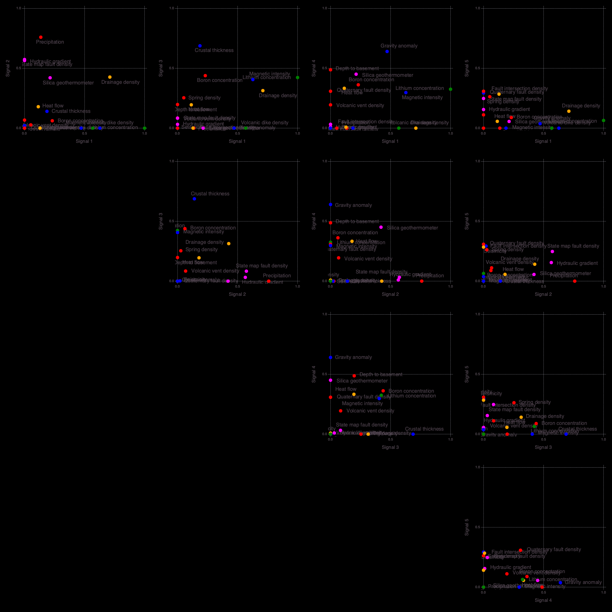
    


    

    


    


    

    


    

    


    Signal importance (high->low): [2, 4, 8, 5, 1, 3, 7, 6]


    ┌ Info: Number of signals: 8
    └ @ NMFk /Users/bulbulahmmed/.julia/packages/NMFk/koh08/src/NMFkPostprocess.jl:144
    ┌ Info: Locations (signals=8)
    └ @ NMFk /Users/bulbulahmmed/.julia/packages/NMFk/koh08/src/NMFkPostprocess.jl:148
    ┌ Warning: type Clustering.KmeansResult{Core.Array{Core.Float64,2},Core.Float64,Core.Int64} not present in workspace; reconstructing
    └ @ JLD /Users/bulbulahmmed/.julia/packages/JLD/3UXN2/src/jld_types.jl:697


    10×2 Array{Any,2}:
     "Ash spr"         1.0
     "Apache well"     0.950743
     "Spring Can"      0.798039
     "Mangas spr"      0.70694
     "Derry spr"       0.663338
     "Spring"          0.587286
     "Kennecott well"  0.550769
     "Faywood spr"     0.453699
     "Warm spr"        0.414987
     "Goat spr"        0.31845


    7×2 Array{Any,2}:
     "Pueblo well"  1.0
     "Jerry well"   0.982349
     "Dent well"    0.884569
     "Rainbow spr"  0.884056
     "Sacred spr"   0.877946
     "Alamos spr"   0.733233
     "Laguna Pbl"   0.692272


    7×2 Array{Any,2}:
     "Gila spr 2"      1.0
     "Aragon spr"      0.997091
     "Gila spr 1"      0.945916
     "Ojo Caliente"    0.578686
     "Well 1"          0.550929
     "Riverside well"  0.549312
     "Cliff spr"       0.5445


    6×2 Array{Any,2}:
     "Victoria well"   0.949464
     "Lightning Dock"  0.823669
     "Radium spr"      0.601781
     "Carne well"      0.596224
     "Well 3"          0.531882
     "Los Alturas"     0.0


    5×2 Array{Any,2}:
     "Allen spr"     1.0
     "Freiborn spr"  0.780095
     "Mimbres spr"   0.514682
     "Turkey spr"    0.427395
     "Garton well"   0.358771


    4×2 Array{Any,2}:
     "Fed H1 well"  0.915735
     "Well 4"       0.772875
     "Well 2"       0.732798
     "Well 5"       0.720996


    3×2 Array{Any,2}:
     "Socorro Can"  1.0
     "Ojitos spr"   0.948793
     "Ojo Canas"    0.834717


    2×2 Array{Any,2}:
     "B.Iorio well"  0.929309
     "T or C spr"    0.905042


    
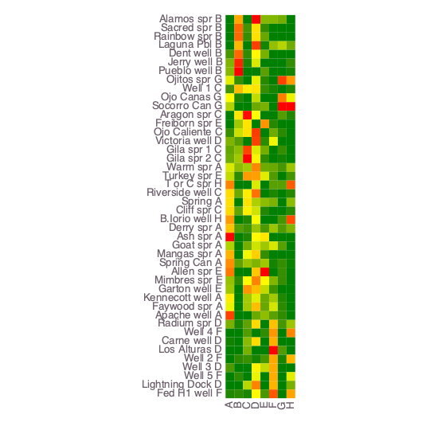
    


    ┌ Info: Robust k-means analysis results are loaded from file results-case01/Hmatrix-8-8_44-1000.jld!
    └ @ NMFk /Users/bulbulahmmed/.julia/packages/NMFk/koh08/src/NMFkCluster.jl:67
    ┌ Warning: Procedure to find unique signals could not identify a solution ...
    └ @ NMFk /Users/bulbulahmmed/.julia/packages/NMFk/koh08/src/NMFkCluster.jl:158
    ┌ Warning: Procedure to find unique signals could not identify a solution ...
    └ @ NMFk /Users/bulbulahmmed/.julia/packages/NMFk/koh08/src/NMFkCluster.jl:158
    ┌ Warning: Procedure to find unique signals could not identify a solution ...
    └ @ NMFk /Users/bulbulahmmed/.julia/packages/NMFk/koh08/src/NMFkCluster.jl:158
    ┌ Warning: Procedure to find unique signals could not identify a solution ...
    └ @ NMFk /Users/bulbulahmmed/.julia/packages/NMFk/koh08/src/NMFkCluster.jl:158
    ┌ Warning: type Clustering.KmeansResult{Core.Array{Core.Float64,2},Core.Float64,Core.Int64} not present in workspace; reconstructing
    └ @ JLD /Users/bulbulahmmed/.julia/packages/JLD/3UXN2/src/jld_types.jl:697
    ┌ Info: Robust k-means analysis results are loaded from file results-case01/Wmatrix-8-8_18-1000.jld!
    └ @ NMFk /Users/bulbulahmmed/.julia/packages/NMFk/koh08/src/NMFkCluster.jl:67
    ┌ Warning: Procedure to find unique signals could not identify a solution ...
    └ @ NMFk /Users/bulbulahmmed/.julia/packages/NMFk/koh08/src/NMFkCluster.jl:158
    ┌ Warning: Procedure to find unique signals could not identify a solution ...
    └ @ NMFk /Users/bulbulahmmed/.julia/packages/NMFk/koh08/src/NMFkCluster.jl:158
    ┌ Warning: Procedure to find unique signals could not identify a solution ...
    └ @ NMFk /Users/bulbulahmmed/.julia/packages/NMFk/koh08/src/NMFkCluster.jl:158
    ┌ Info: Signal A -> A Count: 10
    └ @ NMFk /Users/bulbulahmmed/.julia/packages/NMFk/koh08/src/NMFkPostprocess.jl:255
    ┌ Info: Signal B -> B Count: 7
    └ @ NMFk /Users/bulbulahmmed/.julia/packages/NMFk/koh08/src/NMFkPostprocess.jl:255
    ┌ Info: Signal C -> C Count: 7
    └ @ NMFk /Users/bulbulahmmed/.julia/packages/NMFk/koh08/src/NMFkPostprocess.jl:255
    ┌ Info: Signal D -> D Count: 6
    └ @ NMFk /Users/bulbulahmmed/.julia/packages/NMFk/koh08/src/NMFkPostprocess.jl:255
    ┌ Info: Signal E -> E Count: 5
    └ @ NMFk /Users/bulbulahmmed/.julia/packages/NMFk/koh08/src/NMFkPostprocess.jl:255
    ┌ Info: Signal F -> F Count: 4
    └ @ NMFk /Users/bulbulahmmed/.julia/packages/NMFk/koh08/src/NMFkPostprocess.jl:255
    ┌ Info: Signal G -> G Count: 3
    └ @ NMFk /Users/bulbulahmmed/.julia/packages/NMFk/koh08/src/NMFkPostprocess.jl:255
    ┌ Info: Signal H -> H Count: 2
    └ @ NMFk /Users/bulbulahmmed/.julia/packages/NMFk/koh08/src/NMFkPostprocess.jl:255
    ┌ Info: Signal A (S2) (k-means clustering)
    └ @ NMFk /Users/bulbulahmmed/.julia/packages/NMFk/koh08/src/NMFkPostprocess.jl:272
    ┌ Info: Signal B (S5) (k-means clustering)
    └ @ NMFk /Users/bulbulahmmed/.julia/packages/NMFk/koh08/src/NMFkPostprocess.jl:272
    ┌ Info: Signal C (S8) (k-means clustering)
    └ @ NMFk /Users/bulbulahmmed/.julia/packages/NMFk/koh08/src/NMFkPostprocess.jl:272
    ┌ Info: Signal D (S3) (k-means clustering)
    └ @ NMFk /Users/bulbulahmmed/.julia/packages/NMFk/koh08/src/NMFkPostprocess.jl:272
    ┌ Info: Signal E (S7) (k-means clustering)
    └ @ NMFk /Users/bulbulahmmed/.julia/packages/NMFk/koh08/src/NMFkPostprocess.jl:272
    ┌ Info: Signal F (S4) (k-means clustering)
    └ @ NMFk /Users/bulbulahmmed/.julia/packages/NMFk/koh08/src/NMFkPostprocess.jl:272
    ┌ Info: Signal G (S6) (k-means clustering)
    └ @ NMFk /Users/bulbulahmmed/.julia/packages/NMFk/koh08/src/NMFkPostprocess.jl:272
    ┌ Info: Signal H (S1) (k-means clustering)
    └ @ NMFk /Users/bulbulahmmed/.julia/packages/NMFk/koh08/src/NMFkPostprocess.jl:272


    

    


    


<?xml version="1.0" encoding="UTF-8"?>
<svg xmlns="http://www.w3.org/2000/svg"
     xmlns:xlink="http://www.w3.org/1999/xlink"
     xmlns:gadfly="http://www.gadflyjl.org/ns"
     version="1.2"
     width="141.42mm" height="100mm" viewBox="0 0 141.42 100"
     stroke="none"
     fill="#000000"
     stroke-width="0.3"
     font-size="3.88"

     id="img-0ea69c43">
<defs>
  <marker id="arrow" markerWidth="15" markerHeight="7" refX="5" refY="3.5" orient="auto" markerUnits="strokeWidth">
    <path d="M0,0 L15,3.5 L0,7 z" stroke="context-stroke" fill="context-stroke"/>
  </marker>
</defs>
<g class="plotroot" id="img-0ea69c43-1">
  <g class="guide xlabels" font-size="2.82" font-family="'PT Sans Caption','Helvetica Neue','Helvetica',sans-serif" fill="#6C606B" id="img-0ea69c43-2">
    <g transform="translate(66.4,92.22)" gadfly:scale="1.0" visibility="visible">
      <g class="primitive">
        <text text-anchor="end" dy="-0em" transform="rotate(-90,0, 0)">A</text>
      </g>
    </g>
    <g transform="translate(68.07,92.22)" gadfly:scale="1.0" visibility="visible">
      <g class="primitive">
        <text text-anchor="end" dy="-0em" transform="rotate(-90,0, 0)">B</text>
      </g>
    </g>
    <g transform="translate(69.75,92.22)" gadfly:scale="1.0" visibility="visible">
      <g class="primitive">
        <text text-anchor="end" dy="-0em" transform="rotate(-90,0, 0)">C</text>
      </g>
    </g>
    <g transform="translate(71.43,92.22)" gadfly:scale="1.0" visibility="visible">
      <g class="primitive">
        <text text-anchor="end" dy="-0em" transform="rotate(-90,0, 0)">D</text>
      </g>
    </g>
    <g transform="translate(73.1,92.22)" gadfly:scale="1.0" visibility="visible">
      <g class="primitive">
        <text text-anchor="end" dy="-0em" transform="rotate(-90,0, 0)">E</text>
      </g>
    </g>
    <g transform="translate(74.78,92.22)" gadfly:scale="1.0" visibility="visible">
      <g class="primitive">
        <text text-anchor="end" dy="-0em" transform="rotate(-90,0, 0)">F</text>
      </g>
    </g>
    <g transform="translate(76.45,92.22)" gadfly:scale="1.0" visibility="visible">
      <g class="primitive">
        <text text-anchor="end" dy="-0em" transform="rotate(-90,0, 0)">G</text>
      </g>
    </g>
    <g transform="translate(78.13,92.22)" gadfly:scale="1.0" visibility="visible">
      <g class="primitive">
        <text text-anchor="end" dy="-0em" transform="rotate(-90,0, 0)">H</text>
      </g>
    </g>
  </g>
  <g stroke-width="0.11" stroke="#FFFFFF" id="img-0ea69c43-3">
    <g transform="translate(81.21,34.26)">
      <path fill="none" d="M-1.19,0.84 L1.19,0.84 1.19,-0.84 -1.19,-0.84 " class="primitive"/>
    </g>
    <g transform="translate(81.21,84.52)">
      <path fill="none" d="M-1.19,0.84 L1.19,0.84 1.19,-0.84 -1.19,-0.84 " class="primitive"/>
    </g>
    <g transform="translate(81.21,56.04)">
      <path fill="none" d="M-1.19,0.84 L1.19,0.84 1.19,-0.84 -1.19,-0.84 " class="primitive"/>
    </g>
    <g transform="translate(81.21,52.69)">
      <path fill="none" d="M-1.19,0.84 L1.19,0.84 1.19,-0.84 -1.19,-0.84 " class="primitive"/>
    </g>
    <g transform="translate(81.21,77.82)">
      <path fill="none" d="M-1.19,0.84 L1.19,0.84 1.19,-0.84 -1.19,-0.84 " class="primitive"/>
    </g>
    <g transform="translate(81.21,30.9)">
      <path fill="none" d="M-1.19,0.84 L1.19,0.84 1.19,-0.84 -1.19,-0.84 " class="primitive"/>
    </g>
    <g transform="translate(83,85.78)">
      <path fill="none" d="M-2.98,1.26 L1.79,1.26 1.79,-1.26 -0.6,-1.26 " class="primitive"/>
    </g>
    <g transform="translate(81.21,47.66)">
      <path fill="none" d="M-1.19,0.84 L1.19,0.84 1.19,-0.84 -1.19,-0.84 " class="primitive"/>
    </g>
    <g transform="translate(81.21,19.18)">
      <path fill="none" d="M-1.19,0.84 L1.19,0.84 1.19,-0.84 -1.19,-0.84 " class="primitive"/>
    </g>
    <g transform="translate(81.21,27.55)">
      <path fill="none" d="M-1.19,0.84 L1.19,0.84 1.19,-0.84 -1.19,-0.84 " class="primitive"/>
    </g>
    <g transform="translate(81.21,67.77)">
      <path fill="none" d="M-1.19,0.84 L1.19,0.84 1.19,-0.84 -1.19,-0.84 " class="primitive"/>
    </g>
    <g transform="translate(81.21,62.74)">
      <path fill="none" d="M-1.19,0.84 L1.19,0.84 1.19,-0.84 -1.19,-0.84 " class="primitive"/>
    </g>
    <g transform="translate(84.79,87.25)">
      <path fill="none" d="M-4.76,1.47 L2.38,1.47 2.38,-1.47 0,-1.47 " class="primitive"/>
    </g>
    <g transform="translate(81.21,44.31)">
      <path fill="none" d="M-1.19,0.84 L1.19,0.84 1.19,-0.84 -1.19,-0.84 " class="primitive"/>
    </g>
    <g transform="translate(83,79.08)">
      <path fill="none" d="M-2.98,1.26 L1.79,1.26 1.79,-1.26 -0.6,-1.26 " class="primitive"/>
    </g>
    <g transform="translate(83,57.29)">
      <path fill="none" d="M-2.98,1.26 L1.79,1.26 1.79,-1.26 -0.6,-1.26 " class="primitive"/>
    </g>
    <g transform="translate(81.21,39.28)">
      <path fill="none" d="M-1.19,0.84 L1.19,0.84 1.19,-0.84 -1.19,-0.84 " class="primitive"/>
    </g>
    <g transform="translate(83,69.02)">
      <path fill="none" d="M-2.98,1.26 L1.79,1.26 1.79,-1.26 -0.6,-1.26 " class="primitive"/>
    </g>
    <g transform="translate(83,20.43)">
      <path fill="none" d="M-2.98,1.26 L1.79,1.26 1.79,-1.26 -0.6,-1.26 " class="primitive"/>
    </g>
    <g transform="translate(83,64)">
      <path fill="none" d="M-2.98,1.26 L1.79,1.26 1.79,-1.26 -0.6,-1.26 " class="primitive"/>
    </g>
    <g transform="translate(81.21,74.47)">
      <path fill="none" d="M-1.19,0.84 L1.19,0.84 1.19,-0.84 -1.19,-0.84 " class="primitive"/>
    </g>
    <g transform="translate(83,48.92)">
      <path fill="none" d="M-2.98,1.26 L1.79,1.26 1.79,-1.26 -0.6,-1.26 " class="primitive"/>
    </g>
    <g transform="translate(83,40.54)">
      <path fill="none" d="M-2.98,1.26 L1.79,1.26 1.79,-1.26 -0.6,-1.26 " class="primitive"/>
    </g>
    <g transform="translate(84.79,21.9)">
      <path fill="none" d="M-4.76,1.47 L2.38,1.47 2.38,-1.47 0,-1.47 " class="primitive"/>
    </g>
    <g transform="translate(83.6,32.58)">
      <path fill="none" d="M-1.19,1.68 L1.19,1.68 1.19,-1.68 -1.19,-1.68 " class="primitive"/>
    </g>
    <g transform="translate(86.58,23.47)">
      <path fill="none" d="M-6.55,1.57 L2.98,1.57 2.98,-1.57 0.6,-1.57 " class="primitive"/>
    </g>
    <g transform="translate(84.79,70.49)">
      <path fill="none" d="M-4.76,1.47 L2.38,1.47 2.38,-1.47 0,-1.47 " class="primitive"/>
    </g>
    <g transform="translate(84.79,58.76)">
      <path fill="none" d="M-4.76,1.47 L2.38,1.47 2.38,-1.47 0,-1.47 " class="primitive"/>
    </g>
    <g transform="translate(85.38,76.77)">
      <path fill="none" d="M-0.6,2.3 L1.79,2.3 1.79,-2.3 -2.98,-2.3 " class="primitive"/>
    </g>
    <g transform="translate(86.58,88.82)">
      <path fill="none" d="M-6.55,1.57 L2.98,1.57 2.98,-1.57 0.6,-1.57 " class="primitive"/>
    </g>
    <g transform="translate(87.77,61.38)">
      <path fill="none" d="M-2.98,2.62 L1.79,2.62 1.79,-2.62 -0.6,-2.62 " class="primitive"/>
    </g>
    <g transform="translate(85.38,50.8)">
      <path fill="none" d="M-2.98,1.89 L1.79,1.89 1.79,-1.89 -0.6,-1.89 " class="primitive"/>
    </g>
    <g transform="translate(85.38,42.42)">
      <path fill="none" d="M-2.98,1.89 L1.79,1.89 1.79,-1.89 -0.6,-1.89 " class="primitive"/>
    </g>
    <g transform="translate(84.79,34.67)">
      <path fill="none" d="M-4.76,2.09 L2.38,2.09 2.38,-2.09 0,-2.09 " class="primitive"/>
    </g>
    <g transform="translate(90.15,65.93)">
      <path fill="none" d="M-2.98,4.56 L1.79,4.56 1.79,-4.56 -0.6,-4.56 " class="primitive"/>
    </g>
    <g transform="translate(88.96,25.51)">
      <path fill="none" d="M-6.55,2.04 L2.98,2.04 2.98,-2.04 0.6,-2.04 " class="primitive"/>
    </g>
    <g transform="translate(91.94,71.35)">
      <path fill="none" d="M-4.76,5.42 L2.38,5.42 2.38,-5.42 0,-5.42 " class="primitive"/>
    </g>
    <g transform="translate(91.94,76.68)">
      <path fill="none" d="M-11.91,5.33 L4.76,5.33 4.76,-5.33 2.38,-5.33 " class="primitive"/>
    </g>
    <g transform="translate(88.36,46.61)">
      <path fill="none" d="M-1.19,4.19 L1.19,4.19 1.19,-4.19 -1.19,-4.19 " class="primitive"/>
    </g>
    <g transform="translate(91.94,30.09)">
      <path fill="none" d="M-4.76,4.58 L2.38,4.58 2.38,-4.58 0,-4.58 " class="primitive"/>
    </g>
    <g transform="translate(96.11,82.75)">
      <path fill="none" d="M-6.55,6.07 L2.98,6.07 2.98,-6.07 0.6,-6.07 " class="primitive"/>
    </g>
    <g transform="translate(94.32,38.35)">
      <path fill="none" d="M-4.76,8.26 L2.38,8.26 2.38,-8.26 0,-8.26 " class="primitive"/>
    </g>
    <g transform="translate(99.68,60.55)">
      <path fill="none" d="M-0.6,22.2 L1.79,22.2 1.79,-22.2 -2.98,-22.2 " class="primitive"/>
    </g>
  </g>
  <g clip-path="url(#img-0ea69c43-4)">
    <g id="img-0ea69c43-5">
      <g pointer-events="visible" stroke-width="0.3" fill="#000000" fill-opacity="0.000" stroke="#000000" stroke-opacity="0.000" class="guide background" id="img-0ea69c43-6">
        <g transform="translate(72.26,54.36)" id="img-0ea69c43-7">
          <path d="M-6.7,-36.86 L6.7,-36.86 6.7,36.86 -6.7,36.86  z" class="primitive"/>
        </g>
      </g>
      <g class="guide ygridlines xfixed" stroke-dasharray="0.5,0.5" stroke-width="0.2" stroke="#D0D0E0" id="img-0ea69c43-8">
        <g transform="translate(72.26,19.18)" id="img-0ea69c43-9" visibility="visible" gadfly:scale="1.0">
          <path fill="none" d="M-6.7,0 L6.7,0 " class="primitive"/>
        </g>
        <g transform="translate(72.26,20.85)" id="img-0ea69c43-10" visibility="visible" gadfly:scale="1.0">
          <path fill="none" d="M-6.7,0 L6.7,0 " class="primitive"/>
        </g>
        <g transform="translate(72.26,22.53)" id="img-0ea69c43-11" visibility="visible" gadfly:scale="1.0">
          <path fill="none" d="M-6.7,0 L6.7,0 " class="primitive"/>
        </g>
        <g transform="translate(72.26,24.2)" id="img-0ea69c43-12" visibility="visible" gadfly:scale="1.0">
          <path fill="none" d="M-6.7,0 L6.7,0 " class="primitive"/>
        </g>
        <g transform="translate(72.26,25.88)" id="img-0ea69c43-13" visibility="visible" gadfly:scale="1.0">
          <path fill="none" d="M-6.7,0 L6.7,0 " class="primitive"/>
        </g>
        <g transform="translate(72.26,27.55)" id="img-0ea69c43-14" visibility="visible" gadfly:scale="1.0">
          <path fill="none" d="M-6.7,0 L6.7,0 " class="primitive"/>
        </g>
        <g transform="translate(72.26,29.23)" id="img-0ea69c43-15" visibility="visible" gadfly:scale="1.0">
          <path fill="none" d="M-6.7,0 L6.7,0 " class="primitive"/>
        </g>
        <g transform="translate(72.26,30.9)" id="img-0ea69c43-16" visibility="visible" gadfly:scale="1.0">
          <path fill="none" d="M-6.7,0 L6.7,0 " class="primitive"/>
        </g>
        <g transform="translate(72.26,32.58)" id="img-0ea69c43-17" visibility="visible" gadfly:scale="1.0">
          <path fill="none" d="M-6.7,0 L6.7,0 " class="primitive"/>
        </g>
        <g transform="translate(72.26,34.26)" id="img-0ea69c43-18" visibility="visible" gadfly:scale="1.0">
          <path fill="none" d="M-6.7,0 L6.7,0 " class="primitive"/>
        </g>
        <g transform="translate(72.26,35.93)" id="img-0ea69c43-19" visibility="visible" gadfly:scale="1.0">
          <path fill="none" d="M-6.7,0 L6.7,0 " class="primitive"/>
        </g>
        <g transform="translate(72.26,37.61)" id="img-0ea69c43-20" visibility="visible" gadfly:scale="1.0">
          <path fill="none" d="M-6.7,0 L6.7,0 " class="primitive"/>
        </g>
        <g transform="translate(72.26,39.28)" id="img-0ea69c43-21" visibility="visible" gadfly:scale="1.0">
          <path fill="none" d="M-6.7,0 L6.7,0 " class="primitive"/>
        </g>
        <g transform="translate(72.26,40.96)" id="img-0ea69c43-22" visibility="visible" gadfly:scale="1.0">
          <path fill="none" d="M-6.7,0 L6.7,0 " class="primitive"/>
        </g>
        <g transform="translate(72.26,42.63)" id="img-0ea69c43-23" visibility="visible" gadfly:scale="1.0">
          <path fill="none" d="M-6.7,0 L6.7,0 " class="primitive"/>
        </g>
        <g transform="translate(72.26,44.31)" id="img-0ea69c43-24" visibility="visible" gadfly:scale="1.0">
          <path fill="none" d="M-6.7,0 L6.7,0 " class="primitive"/>
        </g>
        <g transform="translate(72.26,45.98)" id="img-0ea69c43-25" visibility="visible" gadfly:scale="1.0">
          <path fill="none" d="M-6.7,0 L6.7,0 " class="primitive"/>
        </g>
        <g transform="translate(72.26,47.66)" id="img-0ea69c43-26" visibility="visible" gadfly:scale="1.0">
          <path fill="none" d="M-6.7,0 L6.7,0 " class="primitive"/>
        </g>
        <g transform="translate(72.26,49.34)" id="img-0ea69c43-27" visibility="visible" gadfly:scale="1.0">
          <path fill="none" d="M-6.7,0 L6.7,0 " class="primitive"/>
        </g>
        <g transform="translate(72.26,51.01)" id="img-0ea69c43-28" visibility="visible" gadfly:scale="1.0">
          <path fill="none" d="M-6.7,0 L6.7,0 " class="primitive"/>
        </g>
        <g transform="translate(72.26,52.69)" id="img-0ea69c43-29" visibility="visible" gadfly:scale="1.0">
          <path fill="none" d="M-6.7,0 L6.7,0 " class="primitive"/>
        </g>
        <g transform="translate(72.26,54.36)" id="img-0ea69c43-30" visibility="visible" gadfly:scale="1.0">
          <path fill="none" d="M-6.7,0 L6.7,0 " class="primitive"/>
        </g>
        <g transform="translate(72.26,56.04)" id="img-0ea69c43-31" visibility="visible" gadfly:scale="1.0">
          <path fill="none" d="M-6.7,0 L6.7,0 " class="primitive"/>
        </g>
        <g transform="translate(72.26,57.71)" id="img-0ea69c43-32" visibility="visible" gadfly:scale="1.0">
          <path fill="none" d="M-6.7,0 L6.7,0 " class="primitive"/>
        </g>
        <g transform="translate(72.26,59.39)" id="img-0ea69c43-33" visibility="visible" gadfly:scale="1.0">
          <path fill="none" d="M-6.7,0 L6.7,0 " class="primitive"/>
        </g>
        <g transform="translate(72.26,61.06)" id="img-0ea69c43-34" visibility="visible" gadfly:scale="1.0">
          <path fill="none" d="M-6.7,0 L6.7,0 " class="primitive"/>
        </g>
        <g transform="translate(72.26,62.74)" id="img-0ea69c43-35" visibility="visible" gadfly:scale="1.0">
          <path fill="none" d="M-6.7,0 L6.7,0 " class="primitive"/>
        </g>
        <g transform="translate(72.26,64.42)" id="img-0ea69c43-36" visibility="visible" gadfly:scale="1.0">
          <path fill="none" d="M-6.7,0 L6.7,0 " class="primitive"/>
        </g>
        <g transform="translate(72.26,66.09)" id="img-0ea69c43-37" visibility="visible" gadfly:scale="1.0">
          <path fill="none" d="M-6.7,0 L6.7,0 " class="primitive"/>
        </g>
        <g transform="translate(72.26,67.77)" id="img-0ea69c43-38" visibility="visible" gadfly:scale="1.0">
          <path fill="none" d="M-6.7,0 L6.7,0 " class="primitive"/>
        </g>
        <g transform="translate(72.26,69.44)" id="img-0ea69c43-39" visibility="visible" gadfly:scale="1.0">
          <path fill="none" d="M-6.7,0 L6.7,0 " class="primitive"/>
        </g>
        <g transform="translate(72.26,71.12)" id="img-0ea69c43-40" visibility="visible" gadfly:scale="1.0">
          <path fill="none" d="M-6.7,0 L6.7,0 " class="primitive"/>
        </g>
        <g transform="translate(72.26,72.79)" id="img-0ea69c43-41" visibility="visible" gadfly:scale="1.0">
          <path fill="none" d="M-6.7,0 L6.7,0 " class="primitive"/>
        </g>
        <g transform="translate(72.26,74.47)" id="img-0ea69c43-42" visibility="visible" gadfly:scale="1.0">
          <path fill="none" d="M-6.7,0 L6.7,0 " class="primitive"/>
        </g>
        <g transform="translate(72.26,76.14)" id="img-0ea69c43-43" visibility="visible" gadfly:scale="1.0">
          <path fill="none" d="M-6.7,0 L6.7,0 " class="primitive"/>
        </g>
        <g transform="translate(72.26,77.82)" id="img-0ea69c43-44" visibility="visible" gadfly:scale="1.0">
          <path fill="none" d="M-6.7,0 L6.7,0 " class="primitive"/>
        </g>
        <g transform="translate(72.26,79.5)" id="img-0ea69c43-45" visibility="visible" gadfly:scale="1.0">
          <path fill="none" d="M-6.7,0 L6.7,0 " class="primitive"/>
        </g>
        <g transform="translate(72.26,81.17)" id="img-0ea69c43-46" visibility="visible" gadfly:scale="1.0">
          <path fill="none" d="M-6.7,0 L6.7,0 " class="primitive"/>
        </g>
        <g transform="translate(72.26,82.85)" id="img-0ea69c43-47" visibility="visible" gadfly:scale="1.0">
          <path fill="none" d="M-6.7,0 L6.7,0 " class="primitive"/>
        </g>
        <g transform="translate(72.26,84.52)" id="img-0ea69c43-48" visibility="visible" gadfly:scale="1.0">
          <path fill="none" d="M-6.7,0 L6.7,0 " class="primitive"/>
        </g>
        <g transform="translate(72.26,86.2)" id="img-0ea69c43-49" visibility="visible" gadfly:scale="1.0">
          <path fill="none" d="M-6.7,0 L6.7,0 " class="primitive"/>
        </g>
        <g transform="translate(72.26,87.87)" id="img-0ea69c43-50" visibility="visible" gadfly:scale="1.0">
          <path fill="none" d="M-6.7,0 L6.7,0 " class="primitive"/>
        </g>
        <g transform="translate(72.26,89.55)" id="img-0ea69c43-51" visibility="visible" gadfly:scale="1.0">
          <path fill="none" d="M-6.7,0 L6.7,0 " class="primitive"/>
        </g>
      </g>
      <g class="guide xgridlines yfixed" stroke-dasharray="0.5,0.5" stroke-width="0.2" stroke="#D0D0E0" id="img-0ea69c43-52">
        <g transform="translate(67.24,54.36)" id="img-0ea69c43-53" visibility="visible" gadfly:scale="1.0">
          <path fill="none" d="M0,-36.86 L0,36.86 " class="primitive"/>
        </g>
        <g transform="translate(68.91,54.36)" id="img-0ea69c43-54" visibility="visible" gadfly:scale="1.0">
          <path fill="none" d="M0,-36.86 L0,36.86 " class="primitive"/>
        </g>
        <g transform="translate(70.59,54.36)" id="img-0ea69c43-55" visibility="visible" gadfly:scale="1.0">
          <path fill="none" d="M0,-36.86 L0,36.86 " class="primitive"/>
        </g>
        <g transform="translate(72.26,54.36)" id="img-0ea69c43-56" visibility="visible" gadfly:scale="1.0">
          <path fill="none" d="M0,-36.86 L0,36.86 " class="primitive"/>
        </g>
        <g transform="translate(73.94,54.36)" id="img-0ea69c43-57" visibility="visible" gadfly:scale="1.0">
          <path fill="none" d="M0,-36.86 L0,36.86 " class="primitive"/>
        </g>
        <g transform="translate(75.61,54.36)" id="img-0ea69c43-58" visibility="visible" gadfly:scale="1.0">
          <path fill="none" d="M0,-36.86 L0,36.86 " class="primitive"/>
        </g>
        <g transform="translate(77.29,54.36)" id="img-0ea69c43-59" visibility="visible" gadfly:scale="1.0">
          <path fill="none" d="M0,-36.86 L0,36.86 " class="primitive"/>
        </g>
      </g>
      <g class="plotpanel" id="img-0ea69c43-60">
        <metadata>
          <boundingbox value="65.56098144488581mm 17.5mm 13.404498599273992mm 73.72474229600695mm"/>
          <unitbox value="0.5 0.5 8.0 44.0"/>
        </metadata>
        <g shape-rendering="crispEdges" class="geometry" stroke="#000000" stroke-opacity="0.000" id="img-0ea69c43-61">
          <g transform="translate(66.42,18.36)" id="img-0ea69c43-62" fill="#D9E900" fill-opacity="1">
            <path d="M-0.86,-0.86 L0.86,-0.86 0.86,0.86 -0.86,0.86  z" class="primitive"/>
          </g>
          <g transform="translate(66.42,20.04)" id="img-0ea69c43-63" fill="#FFDF00" fill-opacity="1">
            <path d="M-0.86,-0.86 L0.86,-0.86 0.86,0.86 -0.86,0.86  z" class="primitive"/>
          </g>
          <g transform="translate(66.42,21.71)" id="img-0ea69c43-64" fill="#FFC300" fill-opacity="1">
            <path d="M-0.86,-0.86 L0.86,-0.86 0.86,0.86 -0.86,0.86  z" class="primitive"/>
          </g>
          <g transform="translate(66.42,23.39)" id="img-0ea69c43-65" fill="#FF0000" fill-opacity="1">
            <path d="M-0.86,-0.86 L0.86,-0.86 0.86,0.86 -0.86,0.86  z" class="primitive"/>
          </g>
          <g transform="translate(66.42,25.07)" id="img-0ea69c43-66" fill="#AFD000" fill-opacity="1">
            <path d="M-0.86,-0.86 L0.86,-0.86 0.86,0.86 -0.86,0.86  z" class="primitive"/>
          </g>
          <g transform="translate(66.42,26.74)" id="img-0ea69c43-67" fill="#FFB200" fill-opacity="1">
            <path d="M-0.86,-0.86 L0.86,-0.86 0.86,0.86 -0.86,0.86  z" class="primitive"/>
          </g>
          <g transform="translate(66.42,28.42)" id="img-0ea69c43-68" fill="#FF8E00" fill-opacity="1">
            <path d="M-0.86,-0.86 L0.86,-0.86 0.86,0.86 -0.86,0.86  z" class="primitive"/>
          </g>
          <g transform="translate(66.42,30.09)" id="img-0ea69c43-69" fill="#FFED00" fill-opacity="1">
            <path d="M-0.86,-0.86 L0.86,-0.86 0.86,0.86 -0.86,0.86  z" class="primitive"/>
          </g>
          <g transform="translate(66.42,31.77)" id="img-0ea69c43-70" fill="#EAF300" fill-opacity="1">
            <path d="M-0.86,-0.86 L0.86,-0.86 0.86,0.86 -0.86,0.86  z" class="primitive"/>
          </g>
          <g transform="translate(66.42,33.44)" id="img-0ea69c43-71" fill="#FF4000" fill-opacity="1">
            <path d="M-0.86,-0.86 L0.86,-0.86 0.86,0.86 -0.86,0.86  z" class="primitive"/>
          </g>
          <g transform="translate(66.42,35.12)" id="img-0ea69c43-72" fill="#008000" fill-opacity="1">
            <path d="M-0.86,-0.86 L0.86,-0.86 0.86,0.86 -0.86,0.86  z" class="primitive"/>
          </g>
          <g transform="translate(66.42,36.79)" id="img-0ea69c43-73" fill="#008000" fill-opacity="1">
            <path d="M-0.86,-0.86 L0.86,-0.86 0.86,0.86 -0.86,0.86  z" class="primitive"/>
          </g>
          <g transform="translate(66.42,38.47)" id="img-0ea69c43-74" fill="#008000" fill-opacity="1">
            <path d="M-0.86,-0.86 L0.86,-0.86 0.86,0.86 -0.86,0.86  z" class="primitive"/>
          </g>
          <g transform="translate(66.42,40.15)" id="img-0ea69c43-75" fill="#008000" fill-opacity="1">
            <path d="M-0.86,-0.86 L0.86,-0.86 0.86,0.86 -0.86,0.86  z" class="primitive"/>
          </g>
          <g transform="translate(66.42,41.82)" id="img-0ea69c43-76" fill="#489700" fill-opacity="1">
            <path d="M-0.86,-0.86 L0.86,-0.86 0.86,0.86 -0.86,0.86  z" class="primitive"/>
          </g>
          <g transform="translate(66.42,43.5)" id="img-0ea69c43-77" fill="#7FB500" fill-opacity="1">
            <path d="M-0.86,-0.86 L0.86,-0.86 0.86,0.86 -0.86,0.86  z" class="primitive"/>
          </g>
          <g transform="translate(66.42,45.17)" id="img-0ea69c43-78" fill="#85B800" fill-opacity="1">
            <path d="M-0.86,-0.86 L0.86,-0.86 0.86,0.86 -0.86,0.86  z" class="primitive"/>
          </g>
          <g transform="translate(66.42,46.85)" id="img-0ea69c43-79" fill="#409300" fill-opacity="1">
            <path d="M-0.86,-0.86 L0.86,-0.86 0.86,0.86 -0.86,0.86  z" class="primitive"/>
          </g>
          <g transform="translate(66.42,48.52)" id="img-0ea69c43-80" fill="#008000" fill-opacity="1">
            <path d="M-0.86,-0.86 L0.86,-0.86 0.86,0.86 -0.86,0.86  z" class="primitive"/>
          </g>
          <g transform="translate(66.42,50.2)" id="img-0ea69c43-81" fill="#378F00" fill-opacity="1">
            <path d="M-0.86,-0.86 L0.86,-0.86 0.86,0.86 -0.86,0.86  z" class="primitive"/>
          </g>
          <g transform="translate(66.42,51.87)" id="img-0ea69c43-82" fill="#64A500" fill-opacity="1">
            <path d="M-0.86,-0.86 L0.86,-0.86 0.86,0.86 -0.86,0.86  z" class="primitive"/>
          </g>
          <g transform="translate(66.42,53.55)" id="img-0ea69c43-83" fill="#6DAB00" fill-opacity="1">
            <path d="M-0.86,-0.86 L0.86,-0.86 0.86,0.86 -0.86,0.86  z" class="primitive"/>
          </g>
          <g transform="translate(66.42,55.23)" id="img-0ea69c43-84" fill="#FFDD00" fill-opacity="1">
            <path d="M-0.86,-0.86 L0.86,-0.86 0.86,0.86 -0.86,0.86  z" class="primitive"/>
          </g>
          <g transform="translate(66.42,56.9)" id="img-0ea69c43-85" fill="#FFDA00" fill-opacity="1">
            <path d="M-0.86,-0.86 L0.86,-0.86 0.86,0.86 -0.86,0.86  z" class="primitive"/>
          </g>
          <g transform="translate(66.42,58.58)" id="img-0ea69c43-86" fill="#7EB400" fill-opacity="1">
            <path d="M-0.86,-0.86 L0.86,-0.86 0.86,0.86 -0.86,0.86  z" class="primitive"/>
          </g>
          <g transform="translate(66.42,60.25)" id="img-0ea69c43-87" fill="#79B100" fill-opacity="1">
            <path d="M-0.86,-0.86 L0.86,-0.86 0.86,0.86 -0.86,0.86  z" class="primitive"/>
          </g>
          <g transform="translate(66.42,61.93)" id="img-0ea69c43-88" fill="#118300" fill-opacity="1">
            <path d="M-0.86,-0.86 L0.86,-0.86 0.86,0.86 -0.86,0.86  z" class="primitive"/>
          </g>
          <g transform="translate(66.42,63.6)" id="img-0ea69c43-89" fill="#008000" fill-opacity="1">
            <path d="M-0.86,-0.86 L0.86,-0.86 0.86,0.86 -0.86,0.86  z" class="primitive"/>
          </g>
          <g transform="translate(66.42,65.28)" id="img-0ea69c43-90" fill="#4D9900" fill-opacity="1">
            <path d="M-0.86,-0.86 L0.86,-0.86 0.86,0.86 -0.86,0.86  z" class="primitive"/>
          </g>
          <g transform="translate(66.42,66.95)" id="img-0ea69c43-91" fill="#008000" fill-opacity="1">
            <path d="M-0.86,-0.86 L0.86,-0.86 0.86,0.86 -0.86,0.86  z" class="primitive"/>
          </g>
          <g transform="translate(66.42,68.63)" id="img-0ea69c43-92" fill="#008000" fill-opacity="1">
            <path d="M-0.86,-0.86 L0.86,-0.86 0.86,0.86 -0.86,0.86  z" class="primitive"/>
          </g>
          <g transform="translate(66.42,70.31)" id="img-0ea69c43-93" fill="#C3DC00" fill-opacity="1">
            <path d="M-0.86,-0.86 L0.86,-0.86 0.86,0.86 -0.86,0.86  z" class="primitive"/>
          </g>
          <g transform="translate(66.42,71.98)" id="img-0ea69c43-94" fill="#FF7900" fill-opacity="1">
            <path d="M-0.86,-0.86 L0.86,-0.86 0.86,0.86 -0.86,0.86  z" class="primitive"/>
          </g>
          <g transform="translate(66.42,73.66)" id="img-0ea69c43-95" fill="#95C100" fill-opacity="1">
            <path d="M-0.86,-0.86 L0.86,-0.86 0.86,0.86 -0.86,0.86  z" class="primitive"/>
          </g>
          <g transform="translate(66.42,75.33)" id="img-0ea69c43-96" fill="#9FC700" fill-opacity="1">
            <path d="M-0.86,-0.86 L0.86,-0.86 0.86,0.86 -0.86,0.86  z" class="primitive"/>
          </g>
          <g transform="translate(66.42,77.01)" id="img-0ea69c43-97" fill="#008000" fill-opacity="1">
            <path d="M-0.86,-0.86 L0.86,-0.86 0.86,0.86 -0.86,0.86  z" class="primitive"/>
          </g>
          <g transform="translate(66.42,78.68)" id="img-0ea69c43-98" fill="#008000" fill-opacity="1">
            <path d="M-0.86,-0.86 L0.86,-0.86 0.86,0.86 -0.86,0.86  z" class="primitive"/>
          </g>
          <g transform="translate(66.42,80.36)" id="img-0ea69c43-99" fill="#008000" fill-opacity="1">
            <path d="M-0.86,-0.86 L0.86,-0.86 0.86,0.86 -0.86,0.86  z" class="primitive"/>
          </g>
          <g transform="translate(66.42,82.03)" id="img-0ea69c43-100" fill="#218700" fill-opacity="1">
            <path d="M-0.86,-0.86 L0.86,-0.86 0.86,0.86 -0.86,0.86  z" class="primitive"/>
          </g>
          <g transform="translate(66.42,83.71)" id="img-0ea69c43-101" fill="#E4EF00" fill-opacity="1">
            <path d="M-0.86,-0.86 L0.86,-0.86 0.86,0.86 -0.86,0.86  z" class="primitive"/>
          </g>
          <g transform="translate(66.42,85.39)" id="img-0ea69c43-102" fill="#FFFC00" fill-opacity="1">
            <path d="M-0.86,-0.86 L0.86,-0.86 0.86,0.86 -0.86,0.86  z" class="primitive"/>
          </g>
          <g transform="translate(66.42,87.06)" id="img-0ea69c43-103" fill="#B2D200" fill-opacity="1">
            <path d="M-0.86,-0.86 L0.86,-0.86 0.86,0.86 -0.86,0.86  z" class="primitive"/>
          </g>
          <g transform="translate(66.42,88.74)" id="img-0ea69c43-104" fill="#FF8300" fill-opacity="1">
            <path d="M-0.86,-0.86 L0.86,-0.86 0.86,0.86 -0.86,0.86  z" class="primitive"/>
          </g>
          <g transform="translate(66.42,90.41)" id="img-0ea69c43-105" fill="#FF9A00" fill-opacity="1">
            <path d="M-0.86,-0.86 L0.86,-0.86 0.86,0.86 -0.86,0.86  z" class="primitive"/>
          </g>
          <g transform="translate(68.1,18.36)" id="img-0ea69c43-106" fill="#8EBD00" fill-opacity="1">
            <path d="M-0.86,-0.86 L0.86,-0.86 0.86,0.86 -0.86,0.86  z" class="primitive"/>
          </g>
          <g transform="translate(68.1,20.04)" id="img-0ea69c43-107" fill="#008000" fill-opacity="1">
            <path d="M-0.86,-0.86 L0.86,-0.86 0.86,0.86 -0.86,0.86  z" class="primitive"/>
          </g>
          <g transform="translate(68.1,21.71)" id="img-0ea69c43-108" fill="#559E00" fill-opacity="1">
            <path d="M-0.86,-0.86 L0.86,-0.86 0.86,0.86 -0.86,0.86  z" class="primitive"/>
          </g>
          <g transform="translate(68.1,23.39)" id="img-0ea69c43-109" fill="#008000" fill-opacity="1">
            <path d="M-0.86,-0.86 L0.86,-0.86 0.86,0.86 -0.86,0.86  z" class="primitive"/>
          </g>
          <g transform="translate(68.1,25.07)" id="img-0ea69c43-110" fill="#078100" fill-opacity="1">
            <path d="M-0.86,-0.86 L0.86,-0.86 0.86,0.86 -0.86,0.86  z" class="primitive"/>
          </g>
          <g transform="translate(68.1,26.74)" id="img-0ea69c43-111" fill="#008000" fill-opacity="1">
            <path d="M-0.86,-0.86 L0.86,-0.86 0.86,0.86 -0.86,0.86  z" class="primitive"/>
          </g>
          <g transform="translate(68.1,28.42)" id="img-0ea69c43-112" fill="#60A300" fill-opacity="1">
            <path d="M-0.86,-0.86 L0.86,-0.86 0.86,0.86 -0.86,0.86  z" class="primitive"/>
          </g>
          <g transform="translate(68.1,30.09)" id="img-0ea69c43-113" fill="#008000" fill-opacity="1">
            <path d="M-0.86,-0.86 L0.86,-0.86 0.86,0.86 -0.86,0.86  z" class="primitive"/>
          </g>
          <g transform="translate(68.1,31.77)" id="img-0ea69c43-114" fill="#008000" fill-opacity="1">
            <path d="M-0.86,-0.86 L0.86,-0.86 0.86,0.86 -0.86,0.86  z" class="primitive"/>
          </g>
          <g transform="translate(68.1,33.44)" id="img-0ea69c43-115" fill="#008000" fill-opacity="1">
            <path d="M-0.86,-0.86 L0.86,-0.86 0.86,0.86 -0.86,0.86  z" class="primitive"/>
          </g>
          <g transform="translate(68.1,35.12)" id="img-0ea69c43-116" fill="#FFA800" fill-opacity="1">
            <path d="M-0.86,-0.86 L0.86,-0.86 0.86,0.86 -0.86,0.86  z" class="primitive"/>
          </g>
          <g transform="translate(68.1,36.79)" id="img-0ea69c43-117" fill="#FF6A00" fill-opacity="1">
            <path d="M-0.86,-0.86 L0.86,-0.86 0.86,0.86 -0.86,0.86  z" class="primitive"/>
          </g>
          <g transform="translate(68.1,38.47)" id="img-0ea69c43-118" fill="#FF6700" fill-opacity="1">
            <path d="M-0.86,-0.86 L0.86,-0.86 0.86,0.86 -0.86,0.86  z" class="primitive"/>
          </g>
          <g transform="translate(68.1,40.15)" id="img-0ea69c43-119" fill="#FFB800" fill-opacity="1">
            <path d="M-0.86,-0.86 L0.86,-0.86 0.86,0.86 -0.86,0.86  z" class="primitive"/>
          </g>
          <g transform="translate(68.1,41.82)" id="img-0ea69c43-120" fill="#FF6700" fill-opacity="1">
            <path d="M-0.86,-0.86 L0.86,-0.86 0.86,0.86 -0.86,0.86  z" class="primitive"/>
          </g>
          <g transform="translate(68.1,43.5)" id="img-0ea69c43-121" fill="#FF2400" fill-opacity="1">
            <path d="M-0.86,-0.86 L0.86,-0.86 0.86,0.86 -0.86,0.86  z" class="primitive"/>
          </g>
          <g transform="translate(68.1,45.17)" id="img-0ea69c43-122" fill="#FF0000" fill-opacity="1">
            <path d="M-0.86,-0.86 L0.86,-0.86 0.86,0.86 -0.86,0.86  z" class="primitive"/>
          </g>
          <g transform="translate(68.1,46.85)" id="img-0ea69c43-123" fill="#FFBE00" fill-opacity="1">
            <path d="M-0.86,-0.86 L0.86,-0.86 0.86,0.86 -0.86,0.86  z" class="primitive"/>
          </g>
          <g transform="translate(68.1,48.52)" id="img-0ea69c43-124" fill="#FFE800" fill-opacity="1">
            <path d="M-0.86,-0.86 L0.86,-0.86 0.86,0.86 -0.86,0.86  z" class="primitive"/>
          </g>
          <g transform="translate(68.1,50.2)" id="img-0ea69c43-125" fill="#CCE100" fill-opacity="1">
            <path d="M-0.86,-0.86 L0.86,-0.86 0.86,0.86 -0.86,0.86  z" class="primitive"/>
          </g>
          <g transform="translate(68.1,51.87)" id="img-0ea69c43-126" fill="#8DBD00" fill-opacity="1">
            <path d="M-0.86,-0.86 L0.86,-0.86 0.86,0.86 -0.86,0.86  z" class="primitive"/>
          </g>
          <g transform="translate(68.1,53.55)" id="img-0ea69c43-127" fill="#A2C900" fill-opacity="1">
            <path d="M-0.86,-0.86 L0.86,-0.86 0.86,0.86 -0.86,0.86  z" class="primitive"/>
          </g>
          <g transform="translate(68.1,55.23)" id="img-0ea69c43-128" fill="#6CAA00" fill-opacity="1">
            <path d="M-0.86,-0.86 L0.86,-0.86 0.86,0.86 -0.86,0.86  z" class="primitive"/>
          </g>
          <g transform="translate(68.1,56.9)" id="img-0ea69c43-129" fill="#63A500" fill-opacity="1">
            <path d="M-0.86,-0.86 L0.86,-0.86 0.86,0.86 -0.86,0.86  z" class="primitive"/>
          </g>
          <g transform="translate(68.1,58.58)" id="img-0ea69c43-130" fill="#569E00" fill-opacity="1">
            <path d="M-0.86,-0.86 L0.86,-0.86 0.86,0.86 -0.86,0.86  z" class="primitive"/>
          </g>
          <g transform="translate(68.1,60.25)" id="img-0ea69c43-131" fill="#1C8500" fill-opacity="1">
            <path d="M-0.86,-0.86 L0.86,-0.86 0.86,0.86 -0.86,0.86  z" class="primitive"/>
          </g>
          <g transform="translate(68.1,61.93)" id="img-0ea69c43-132" fill="#008000" fill-opacity="1">
            <path d="M-0.86,-0.86 L0.86,-0.86 0.86,0.86 -0.86,0.86  z" class="primitive"/>
          </g>
          <g transform="translate(68.1,63.6)" id="img-0ea69c43-133" fill="#008000" fill-opacity="1">
            <path d="M-0.86,-0.86 L0.86,-0.86 0.86,0.86 -0.86,0.86  z" class="primitive"/>
          </g>
          <g transform="translate(68.1,65.28)" id="img-0ea69c43-134" fill="#008000" fill-opacity="1">
            <path d="M-0.86,-0.86 L0.86,-0.86 0.86,0.86 -0.86,0.86  z" class="primitive"/>
          </g>
          <g transform="translate(68.1,66.95)" id="img-0ea69c43-135" fill="#008000" fill-opacity="1">
            <path d="M-0.86,-0.86 L0.86,-0.86 0.86,0.86 -0.86,0.86  z" class="primitive"/>
          </g>
          <g transform="translate(68.1,68.63)" id="img-0ea69c43-136" fill="#A1C800" fill-opacity="1">
            <path d="M-0.86,-0.86 L0.86,-0.86 0.86,0.86 -0.86,0.86  z" class="primitive"/>
          </g>
          <g transform="translate(68.1,70.31)" id="img-0ea69c43-137" fill="#2C8B00" fill-opacity="1">
            <path d="M-0.86,-0.86 L0.86,-0.86 0.86,0.86 -0.86,0.86  z" class="primitive"/>
          </g>
          <g transform="translate(68.1,71.98)" id="img-0ea69c43-138" fill="#008000" fill-opacity="1">
            <path d="M-0.86,-0.86 L0.86,-0.86 0.86,0.86 -0.86,0.86  z" class="primitive"/>
          </g>
          <g transform="translate(68.1,73.66)" id="img-0ea69c43-139" fill="#2E8B00" fill-opacity="1">
            <path d="M-0.86,-0.86 L0.86,-0.86 0.86,0.86 -0.86,0.86  z" class="primitive"/>
          </g>
          <g transform="translate(68.1,75.33)" id="img-0ea69c43-140" fill="#008000" fill-opacity="1">
            <path d="M-0.86,-0.86 L0.86,-0.86 0.86,0.86 -0.86,0.86  z" class="primitive"/>
          </g>
          <g transform="translate(68.1,77.01)" id="img-0ea69c43-141" fill="#008000" fill-opacity="1">
            <path d="M-0.86,-0.86 L0.86,-0.86 0.86,0.86 -0.86,0.86  z" class="primitive"/>
          </g>
          <g transform="translate(68.1,78.68)" id="img-0ea69c43-142" fill="#2B8A00" fill-opacity="1">
            <path d="M-0.86,-0.86 L0.86,-0.86 0.86,0.86 -0.86,0.86  z" class="primitive"/>
          </g>
          <g transform="translate(68.1,80.36)" id="img-0ea69c43-143" fill="#2F8C00" fill-opacity="1">
            <path d="M-0.86,-0.86 L0.86,-0.86 0.86,0.86 -0.86,0.86  z" class="primitive"/>
          </g>
          <g transform="translate(68.1,82.03)" id="img-0ea69c43-144" fill="#2C8B00" fill-opacity="1">
            <path d="M-0.86,-0.86 L0.86,-0.86 0.86,0.86 -0.86,0.86  z" class="primitive"/>
          </g>
          <g transform="translate(68.1,83.71)" id="img-0ea69c43-145" fill="#378F00" fill-opacity="1">
            <path d="M-0.86,-0.86 L0.86,-0.86 0.86,0.86 -0.86,0.86  z" class="primitive"/>
          </g>
          <g transform="translate(68.1,85.39)" id="img-0ea69c43-146" fill="#228700" fill-opacity="1">
            <path d="M-0.86,-0.86 L0.86,-0.86 0.86,0.86 -0.86,0.86  z" class="primitive"/>
          </g>
          <g transform="translate(68.1,87.06)" id="img-0ea69c43-147" fill="#008000" fill-opacity="1">
            <path d="M-0.86,-0.86 L0.86,-0.86 0.86,0.86 -0.86,0.86  z" class="primitive"/>
          </g>
          <g transform="translate(68.1,88.74)" id="img-0ea69c43-148" fill="#008000" fill-opacity="1">
            <path d="M-0.86,-0.86 L0.86,-0.86 0.86,0.86 -0.86,0.86  z" class="primitive"/>
          </g>
          <g transform="translate(68.1,90.41)" id="img-0ea69c43-149" fill="#008000" fill-opacity="1">
            <path d="M-0.86,-0.86 L0.86,-0.86 0.86,0.86 -0.86,0.86  z" class="primitive"/>
          </g>
          <g transform="translate(69.77,18.36)" id="img-0ea69c43-150" fill="#A4CA00" fill-opacity="1">
            <path d="M-0.86,-0.86 L0.86,-0.86 0.86,0.86 -0.86,0.86  z" class="primitive"/>
          </g>
          <g transform="translate(69.77,20.04)" id="img-0ea69c43-151" fill="#FFE200" fill-opacity="1">
            <path d="M-0.86,-0.86 L0.86,-0.86 0.86,0.86 -0.86,0.86  z" class="primitive"/>
          </g>
          <g transform="translate(69.77,21.71)" id="img-0ea69c43-152" fill="#419300" fill-opacity="1">
            <path d="M-0.86,-0.86 L0.86,-0.86 0.86,0.86 -0.86,0.86  z" class="primitive"/>
          </g>
          <g transform="translate(69.77,23.39)" id="img-0ea69c43-153" fill="#1F8600" fill-opacity="1">
            <path d="M-0.86,-0.86 L0.86,-0.86 0.86,0.86 -0.86,0.86  z" class="primitive"/>
          </g>
          <g transform="translate(69.77,25.07)" id="img-0ea69c43-154" fill="#73AE00" fill-opacity="1">
            <path d="M-0.86,-0.86 L0.86,-0.86 0.86,0.86 -0.86,0.86  z" class="primitive"/>
          </g>
          <g transform="translate(69.77,26.74)" id="img-0ea69c43-155" fill="#F2F800" fill-opacity="1">
            <path d="M-0.86,-0.86 L0.86,-0.86 0.86,0.86 -0.86,0.86  z" class="primitive"/>
          </g>
          <g transform="translate(69.77,28.42)" id="img-0ea69c43-156" fill="#98C300" fill-opacity="1">
            <path d="M-0.86,-0.86 L0.86,-0.86 0.86,0.86 -0.86,0.86  z" class="primitive"/>
          </g>
          <g transform="translate(69.77,30.09)" id="img-0ea69c43-157" fill="#A3C900" fill-opacity="1">
            <path d="M-0.86,-0.86 L0.86,-0.86 0.86,0.86 -0.86,0.86  z" class="primitive"/>
          </g>
          <g transform="translate(69.77,31.77)" id="img-0ea69c43-158" fill="#A2C900" fill-opacity="1">
            <path d="M-0.86,-0.86 L0.86,-0.86 0.86,0.86 -0.86,0.86  z" class="primitive"/>
          </g>
          <g transform="translate(69.77,33.44)" id="img-0ea69c43-159" fill="#008000" fill-opacity="1">
            <path d="M-0.86,-0.86 L0.86,-0.86 0.86,0.86 -0.86,0.86  z" class="primitive"/>
          </g>
          <g transform="translate(69.77,35.12)" id="img-0ea69c43-160" fill="#008000" fill-opacity="1">
            <path d="M-0.86,-0.86 L0.86,-0.86 0.86,0.86 -0.86,0.86  z" class="primitive"/>
          </g>
          <g transform="translate(69.77,36.79)" id="img-0ea69c43-161" fill="#419400" fill-opacity="1">
            <path d="M-0.86,-0.86 L0.86,-0.86 0.86,0.86 -0.86,0.86  z" class="primitive"/>
          </g>
          <g transform="translate(69.77,38.47)" id="img-0ea69c43-162" fill="#348E00" fill-opacity="1">
            <path d="M-0.86,-0.86 L0.86,-0.86 0.86,0.86 -0.86,0.86  z" class="primitive"/>
          </g>
          <g transform="translate(69.77,40.15)" id="img-0ea69c43-163" fill="#008000" fill-opacity="1">
            <path d="M-0.86,-0.86 L0.86,-0.86 0.86,0.86 -0.86,0.86  z" class="primitive"/>
          </g>
          <g transform="translate(69.77,41.82)" id="img-0ea69c43-164" fill="#308C00" fill-opacity="1">
            <path d="M-0.86,-0.86 L0.86,-0.86 0.86,0.86 -0.86,0.86  z" class="primitive"/>
          </g>
          <g transform="translate(69.77,43.5)" id="img-0ea69c43-165" fill="#1B8500" fill-opacity="1">
            <path d="M-0.86,-0.86 L0.86,-0.86 0.86,0.86 -0.86,0.86  z" class="primitive"/>
          </g>
          <g transform="translate(69.77,45.17)" id="img-0ea69c43-166" fill="#008000" fill-opacity="1">
            <path d="M-0.86,-0.86 L0.86,-0.86 0.86,0.86 -0.86,0.86  z" class="primitive"/>
          </g>
          <g transform="translate(69.77,46.85)" id="img-0ea69c43-167" fill="#FFED00" fill-opacity="1">
            <path d="M-0.86,-0.86 L0.86,-0.86 0.86,0.86 -0.86,0.86  z" class="primitive"/>
          </g>
          <g transform="translate(69.77,48.52)" id="img-0ea69c43-168" fill="#FF0900" fill-opacity="1">
            <path d="M-0.86,-0.86 L0.86,-0.86 0.86,0.86 -0.86,0.86  z" class="primitive"/>
          </g>
          <g transform="translate(69.77,50.2)" id="img-0ea69c43-169" fill="#FFE200" fill-opacity="1">
            <path d="M-0.86,-0.86 L0.86,-0.86 0.86,0.86 -0.86,0.86  z" class="primitive"/>
          </g>
          <g transform="translate(69.77,51.87)" id="img-0ea69c43-170" fill="#FF4400" fill-opacity="1">
            <path d="M-0.86,-0.86 L0.86,-0.86 0.86,0.86 -0.86,0.86  z" class="primitive"/>
          </g>
          <g transform="translate(69.77,53.55)" id="img-0ea69c43-171" fill="#FF0000" fill-opacity="1">
            <path d="M-0.86,-0.86 L0.86,-0.86 0.86,0.86 -0.86,0.86  z" class="primitive"/>
          </g>
          <g transform="translate(69.77,55.23)" id="img-0ea69c43-172" fill="#FFED00" fill-opacity="1">
            <path d="M-0.86,-0.86 L0.86,-0.86 0.86,0.86 -0.86,0.86  z" class="primitive"/>
          </g>
          <g transform="translate(69.77,56.9)" id="img-0ea69c43-173" fill="#FFEF00" fill-opacity="1">
            <path d="M-0.86,-0.86 L0.86,-0.86 0.86,0.86 -0.86,0.86  z" class="primitive"/>
          </g>
          <g transform="translate(69.77,58.58)" id="img-0ea69c43-174" fill="#008000" fill-opacity="1">
            <path d="M-0.86,-0.86 L0.86,-0.86 0.86,0.86 -0.86,0.86  z" class="primitive"/>
          </g>
          <g transform="translate(69.77,60.25)" id="img-0ea69c43-175" fill="#5DA200" fill-opacity="1">
            <path d="M-0.86,-0.86 L0.86,-0.86 0.86,0.86 -0.86,0.86  z" class="primitive"/>
          </g>
          <g transform="translate(69.77,61.93)" id="img-0ea69c43-176" fill="#89BA00" fill-opacity="1">
            <path d="M-0.86,-0.86 L0.86,-0.86 0.86,0.86 -0.86,0.86  z" class="primitive"/>
          </g>
          <g transform="translate(69.77,63.6)" id="img-0ea69c43-177" fill="#78B000" fill-opacity="1">
            <path d="M-0.86,-0.86 L0.86,-0.86 0.86,0.86 -0.86,0.86  z" class="primitive"/>
          </g>
          <g transform="translate(69.77,65.28)" id="img-0ea69c43-178" fill="#008000" fill-opacity="1">
            <path d="M-0.86,-0.86 L0.86,-0.86 0.86,0.86 -0.86,0.86  z" class="primitive"/>
          </g>
          <g transform="translate(69.77,66.95)" id="img-0ea69c43-179" fill="#B8D600" fill-opacity="1">
            <path d="M-0.86,-0.86 L0.86,-0.86 0.86,0.86 -0.86,0.86  z" class="primitive"/>
          </g>
          <g transform="translate(69.77,68.63)" id="img-0ea69c43-180" fill="#FFE400" fill-opacity="1">
            <path d="M-0.86,-0.86 L0.86,-0.86 0.86,0.86 -0.86,0.86  z" class="primitive"/>
          </g>
          <g transform="translate(69.77,70.31)" id="img-0ea69c43-181" fill="#FF9A00" fill-opacity="1">
            <path d="M-0.86,-0.86 L0.86,-0.86 0.86,0.86 -0.86,0.86  z" class="primitive"/>
          </g>
          <g transform="translate(69.77,71.98)" id="img-0ea69c43-182" fill="#008000" fill-opacity="1">
            <path d="M-0.86,-0.86 L0.86,-0.86 0.86,0.86 -0.86,0.86  z" class="primitive"/>
          </g>
          <g transform="translate(69.77,73.66)" id="img-0ea69c43-183" fill="#FFFC00" fill-opacity="1">
            <path d="M-0.86,-0.86 L0.86,-0.86 0.86,0.86 -0.86,0.86  z" class="primitive"/>
          </g>
          <g transform="translate(69.77,75.33)" id="img-0ea69c43-184" fill="#FF9500" fill-opacity="1">
            <path d="M-0.86,-0.86 L0.86,-0.86 0.86,0.86 -0.86,0.86  z" class="primitive"/>
          </g>
          <g transform="translate(69.77,77.01)" id="img-0ea69c43-185" fill="#539C00" fill-opacity="1">
            <path d="M-0.86,-0.86 L0.86,-0.86 0.86,0.86 -0.86,0.86  z" class="primitive"/>
          </g>
          <g transform="translate(69.77,78.68)" id="img-0ea69c43-186" fill="#3A9000" fill-opacity="1">
            <path d="M-0.86,-0.86 L0.86,-0.86 0.86,0.86 -0.86,0.86  z" class="primitive"/>
          </g>
          <g transform="translate(69.77,80.36)" id="img-0ea69c43-187" fill="#008000" fill-opacity="1">
            <path d="M-0.86,-0.86 L0.86,-0.86 0.86,0.86 -0.86,0.86  z" class="primitive"/>
          </g>
          <g transform="translate(69.77,82.03)" id="img-0ea69c43-188" fill="#1B8500" fill-opacity="1">
            <path d="M-0.86,-0.86 L0.86,-0.86 0.86,0.86 -0.86,0.86  z" class="primitive"/>
          </g>
          <g transform="translate(69.77,83.71)" id="img-0ea69c43-189" fill="#008000" fill-opacity="1">
            <path d="M-0.86,-0.86 L0.86,-0.86 0.86,0.86 -0.86,0.86  z" class="primitive"/>
          </g>
          <g transform="translate(69.77,85.39)" id="img-0ea69c43-190" fill="#008000" fill-opacity="1">
            <path d="M-0.86,-0.86 L0.86,-0.86 0.86,0.86 -0.86,0.86  z" class="primitive"/>
          </g>
          <g transform="translate(69.77,87.06)" id="img-0ea69c43-191" fill="#008000" fill-opacity="1">
            <path d="M-0.86,-0.86 L0.86,-0.86 0.86,0.86 -0.86,0.86  z" class="primitive"/>
          </g>
          <g transform="translate(69.77,88.74)" id="img-0ea69c43-192" fill="#008000" fill-opacity="1">
            <path d="M-0.86,-0.86 L0.86,-0.86 0.86,0.86 -0.86,0.86  z" class="primitive"/>
          </g>
          <g transform="translate(69.77,90.41)" id="img-0ea69c43-193" fill="#228700" fill-opacity="1">
            <path d="M-0.86,-0.86 L0.86,-0.86 0.86,0.86 -0.86,0.86  z" class="primitive"/>
          </g>
          <g transform="translate(71.45,18.36)" id="img-0ea69c43-194" fill="#FF8700" fill-opacity="1">
            <path d="M-0.86,-0.86 L0.86,-0.86 0.86,0.86 -0.86,0.86  z" class="primitive"/>
          </g>
          <g transform="translate(71.45,20.04)" id="img-0ea69c43-195" fill="#AED000" fill-opacity="1">
            <path d="M-0.86,-0.86 L0.86,-0.86 0.86,0.86 -0.86,0.86  z" class="primitive"/>
          </g>
          <g transform="translate(71.45,21.71)" id="img-0ea69c43-196" fill="#97C200" fill-opacity="1">
            <path d="M-0.86,-0.86 L0.86,-0.86 0.86,0.86 -0.86,0.86  z" class="primitive"/>
          </g>
          <g transform="translate(71.45,23.39)" id="img-0ea69c43-197" fill="#FFFA00" fill-opacity="1">
            <path d="M-0.86,-0.86 L0.86,-0.86 0.86,0.86 -0.86,0.86  z" class="primitive"/>
          </g>
          <g transform="translate(71.45,25.07)" id="img-0ea69c43-198" fill="#CFE300" fill-opacity="1">
            <path d="M-0.86,-0.86 L0.86,-0.86 0.86,0.86 -0.86,0.86  z" class="primitive"/>
          </g>
          <g transform="translate(71.45,26.74)" id="img-0ea69c43-199" fill="#FFCF00" fill-opacity="1">
            <path d="M-0.86,-0.86 L0.86,-0.86 0.86,0.86 -0.86,0.86  z" class="primitive"/>
          </g>
          <g transform="translate(71.45,28.42)" id="img-0ea69c43-200" fill="#7FB500" fill-opacity="1">
            <path d="M-0.86,-0.86 L0.86,-0.86 0.86,0.86 -0.86,0.86  z" class="primitive"/>
          </g>
          <g transform="translate(71.45,30.09)" id="img-0ea69c43-201" fill="#E2EE00" fill-opacity="1">
            <path d="M-0.86,-0.86 L0.86,-0.86 0.86,0.86 -0.86,0.86  z" class="primitive"/>
          </g>
          <g transform="translate(71.45,31.77)" id="img-0ea69c43-202" fill="#FFBF00" fill-opacity="1">
            <path d="M-0.86,-0.86 L0.86,-0.86 0.86,0.86 -0.86,0.86  z" class="primitive"/>
          </g>
          <g transform="translate(71.45,33.44)" id="img-0ea69c43-203" fill="#6BA900" fill-opacity="1">
            <path d="M-0.86,-0.86 L0.86,-0.86 0.86,0.86 -0.86,0.86  z" class="primitive"/>
          </g>
          <g transform="translate(71.45,35.12)" id="img-0ea69c43-204" fill="#FF0000" fill-opacity="1">
            <path d="M-0.86,-0.86 L0.86,-0.86 0.86,0.86 -0.86,0.86  z" class="primitive"/>
          </g>
          <g transform="translate(71.45,36.79)" id="img-0ea69c43-205" fill="#FFE000" fill-opacity="1">
            <path d="M-0.86,-0.86 L0.86,-0.86 0.86,0.86 -0.86,0.86  z" class="primitive"/>
          </g>
          <g transform="translate(71.45,38.47)" id="img-0ea69c43-206" fill="#FFDF00" fill-opacity="1">
            <path d="M-0.86,-0.86 L0.86,-0.86 0.86,0.86 -0.86,0.86  z" class="primitive"/>
          </g>
          <g transform="translate(71.45,40.15)" id="img-0ea69c43-207" fill="#FF3F00" fill-opacity="1">
            <path d="M-0.86,-0.86 L0.86,-0.86 0.86,0.86 -0.86,0.86  z" class="primitive"/>
          </g>
          <g transform="translate(71.45,41.82)" id="img-0ea69c43-208" fill="#FFF700" fill-opacity="1">
            <path d="M-0.86,-0.86 L0.86,-0.86 0.86,0.86 -0.86,0.86  z" class="primitive"/>
          </g>
          <g transform="translate(71.45,43.5)" id="img-0ea69c43-209" fill="#D9E900" fill-opacity="1">
            <path d="M-0.86,-0.86 L0.86,-0.86 0.86,0.86 -0.86,0.86  z" class="primitive"/>
          </g>
          <g transform="translate(71.45,45.17)" id="img-0ea69c43-210" fill="#008000" fill-opacity="1">
            <path d="M-0.86,-0.86 L0.86,-0.86 0.86,0.86 -0.86,0.86  z" class="primitive"/>
          </g>
          <g transform="translate(71.45,46.85)" id="img-0ea69c43-211" fill="#FFE300" fill-opacity="1">
            <path d="M-0.86,-0.86 L0.86,-0.86 0.86,0.86 -0.86,0.86  z" class="primitive"/>
          </g>
          <g transform="translate(71.45,48.52)" id="img-0ea69c43-212" fill="#FEFE00" fill-opacity="1">
            <path d="M-0.86,-0.86 L0.86,-0.86 0.86,0.86 -0.86,0.86  z" class="primitive"/>
          </g>
          <g transform="translate(71.45,50.2)" id="img-0ea69c43-213" fill="#FF3D00" fill-opacity="1">
            <path d="M-0.86,-0.86 L0.86,-0.86 0.86,0.86 -0.86,0.86  z" class="primitive"/>
          </g>
          <g transform="translate(71.45,51.87)" id="img-0ea69c43-214" fill="#DEEC00" fill-opacity="1">
            <path d="M-0.86,-0.86 L0.86,-0.86 0.86,0.86 -0.86,0.86  z" class="primitive"/>
          </g>
          <g transform="translate(71.45,53.55)" id="img-0ea69c43-215" fill="#FFF300" fill-opacity="1">
            <path d="M-0.86,-0.86 L0.86,-0.86 0.86,0.86 -0.86,0.86  z" class="primitive"/>
          </g>
          <g transform="translate(71.45,55.23)" id="img-0ea69c43-216" fill="#FF7100" fill-opacity="1">
            <path d="M-0.86,-0.86 L0.86,-0.86 0.86,0.86 -0.86,0.86  z" class="primitive"/>
          </g>
          <g transform="translate(71.45,56.9)" id="img-0ea69c43-217" fill="#CEE300" fill-opacity="1">
            <path d="M-0.86,-0.86 L0.86,-0.86 0.86,0.86 -0.86,0.86  z" class="primitive"/>
          </g>
          <g transform="translate(71.45,58.58)" id="img-0ea69c43-218" fill="#FF4100" fill-opacity="1">
            <path d="M-0.86,-0.86 L0.86,-0.86 0.86,0.86 -0.86,0.86  z" class="primitive"/>
          </g>
          <g transform="translate(71.45,60.25)" id="img-0ea69c43-219" fill="#FFDA00" fill-opacity="1">
            <path d="M-0.86,-0.86 L0.86,-0.86 0.86,0.86 -0.86,0.86  z" class="primitive"/>
          </g>
          <g transform="translate(71.45,61.93)" id="img-0ea69c43-220" fill="#FFDC00" fill-opacity="1">
            <path d="M-0.86,-0.86 L0.86,-0.86 0.86,0.86 -0.86,0.86  z" class="primitive"/>
          </g>
          <g transform="translate(71.45,63.6)" id="img-0ea69c43-221" fill="#008000" fill-opacity="1">
            <path d="M-0.86,-0.86 L0.86,-0.86 0.86,0.86 -0.86,0.86  z" class="primitive"/>
          </g>
          <g transform="translate(71.45,65.28)" id="img-0ea69c43-222" fill="#FFF300" fill-opacity="1">
            <path d="M-0.86,-0.86 L0.86,-0.86 0.86,0.86 -0.86,0.86  z" class="primitive"/>
          </g>
          <g transform="translate(71.45,66.95)" id="img-0ea69c43-223" fill="#FF8300" fill-opacity="1">
            <path d="M-0.86,-0.86 L0.86,-0.86 0.86,0.86 -0.86,0.86  z" class="primitive"/>
          </g>
          <g transform="translate(71.45,68.63)" id="img-0ea69c43-224" fill="#008000" fill-opacity="1">
            <path d="M-0.86,-0.86 L0.86,-0.86 0.86,0.86 -0.86,0.86  z" class="primitive"/>
          </g>
          <g transform="translate(71.45,70.31)" id="img-0ea69c43-225" fill="#FFA000" fill-opacity="1">
            <path d="M-0.86,-0.86 L0.86,-0.86 0.86,0.86 -0.86,0.86  z" class="primitive"/>
          </g>
          <g transform="translate(71.45,71.98)" id="img-0ea69c43-226" fill="#FFC800" fill-opacity="1">
            <path d="M-0.86,-0.86 L0.86,-0.86 0.86,0.86 -0.86,0.86  z" class="primitive"/>
          </g>
          <g transform="translate(71.45,73.66)" id="img-0ea69c43-227" fill="#FF8300" fill-opacity="1">
            <path d="M-0.86,-0.86 L0.86,-0.86 0.86,0.86 -0.86,0.86  z" class="primitive"/>
          </g>
          <g transform="translate(71.45,75.33)" id="img-0ea69c43-228" fill="#FFBC00" fill-opacity="1">
            <path d="M-0.86,-0.86 L0.86,-0.86 0.86,0.86 -0.86,0.86  z" class="primitive"/>
          </g>
          <g transform="translate(71.45,77.01)" id="img-0ea69c43-229" fill="#008000" fill-opacity="1">
            <path d="M-0.86,-0.86 L0.86,-0.86 0.86,0.86 -0.86,0.86  z" class="primitive"/>
          </g>
          <g transform="translate(71.45,78.68)" id="img-0ea69c43-230" fill="#168400" fill-opacity="1">
            <path d="M-0.86,-0.86 L0.86,-0.86 0.86,0.86 -0.86,0.86  z" class="primitive"/>
          </g>
          <g transform="translate(71.45,80.36)" id="img-0ea69c43-231" fill="#E9F200" fill-opacity="1">
            <path d="M-0.86,-0.86 L0.86,-0.86 0.86,0.86 -0.86,0.86  z" class="primitive"/>
          </g>
          <g transform="translate(71.45,82.03)" id="img-0ea69c43-232" fill="#FFFA00" fill-opacity="1">
            <path d="M-0.86,-0.86 L0.86,-0.86 0.86,0.86 -0.86,0.86  z" class="primitive"/>
          </g>
          <g transform="translate(71.45,83.71)" id="img-0ea69c43-233" fill="#E7F100" fill-opacity="1">
            <path d="M-0.86,-0.86 L0.86,-0.86 0.86,0.86 -0.86,0.86  z" class="primitive"/>
          </g>
          <g transform="translate(71.45,85.39)" id="img-0ea69c43-234" fill="#C3DC00" fill-opacity="1">
            <path d="M-0.86,-0.86 L0.86,-0.86 0.86,0.86 -0.86,0.86  z" class="primitive"/>
          </g>
          <g transform="translate(71.45,87.06)" id="img-0ea69c43-235" fill="#6CAA00" fill-opacity="1">
            <path d="M-0.86,-0.86 L0.86,-0.86 0.86,0.86 -0.86,0.86  z" class="primitive"/>
          </g>
          <g transform="translate(71.45,88.74)" id="img-0ea69c43-236" fill="#D9E900" fill-opacity="1">
            <path d="M-0.86,-0.86 L0.86,-0.86 0.86,0.86 -0.86,0.86  z" class="primitive"/>
          </g>
          <g transform="translate(71.45,90.41)" id="img-0ea69c43-237" fill="#F9FB00" fill-opacity="1">
            <path d="M-0.86,-0.86 L0.86,-0.86 0.86,0.86 -0.86,0.86  z" class="primitive"/>
          </g>
          <g transform="translate(73.13,18.36)" id="img-0ea69c43-238" fill="#6FAB00" fill-opacity="1">
            <path d="M-0.86,-0.86 L0.86,-0.86 0.86,0.86 -0.86,0.86  z" class="primitive"/>
          </g>
          <g transform="translate(73.13,20.04)" id="img-0ea69c43-239" fill="#8DBC00" fill-opacity="1">
            <path d="M-0.86,-0.86 L0.86,-0.86 0.86,0.86 -0.86,0.86  z" class="primitive"/>
          </g>
          <g transform="translate(73.13,21.71)" id="img-0ea69c43-240" fill="#4B9800" fill-opacity="1">
            <path d="M-0.86,-0.86 L0.86,-0.86 0.86,0.86 -0.86,0.86  z" class="primitive"/>
          </g>
          <g transform="translate(73.13,23.39)" id="img-0ea69c43-241" fill="#FFE700" fill-opacity="1">
            <path d="M-0.86,-0.86 L0.86,-0.86 0.86,0.86 -0.86,0.86  z" class="primitive"/>
          </g>
          <g transform="translate(73.13,25.07)" id="img-0ea69c43-242" fill="#A0C800" fill-opacity="1">
            <path d="M-0.86,-0.86 L0.86,-0.86 0.86,0.86 -0.86,0.86  z" class="primitive"/>
          </g>
          <g transform="translate(73.13,26.74)" id="img-0ea69c43-243" fill="#338D00" fill-opacity="1">
            <path d="M-0.86,-0.86 L0.86,-0.86 0.86,0.86 -0.86,0.86  z" class="primitive"/>
          </g>
          <g transform="translate(73.13,28.42)" id="img-0ea69c43-244" fill="#A0C800" fill-opacity="1">
            <path d="M-0.86,-0.86 L0.86,-0.86 0.86,0.86 -0.86,0.86  z" class="primitive"/>
          </g>
          <g transform="translate(73.13,30.09)" id="img-0ea69c43-245" fill="#6BA900" fill-opacity="1">
            <path d="M-0.86,-0.86 L0.86,-0.86 0.86,0.86 -0.86,0.86  z" class="primitive"/>
          </g>
          <g transform="translate(73.13,31.77)" id="img-0ea69c43-246" fill="#67A700" fill-opacity="1">
            <path d="M-0.86,-0.86 L0.86,-0.86 0.86,0.86 -0.86,0.86  z" class="primitive"/>
          </g>
          <g transform="translate(73.13,33.44)" id="img-0ea69c43-247" fill="#8EBD00" fill-opacity="1">
            <path d="M-0.86,-0.86 L0.86,-0.86 0.86,0.86 -0.86,0.86  z" class="primitive"/>
          </g>
          <g transform="translate(73.13,35.12)" id="img-0ea69c43-248" fill="#83B700" fill-opacity="1">
            <path d="M-0.86,-0.86 L0.86,-0.86 0.86,0.86 -0.86,0.86  z" class="primitive"/>
          </g>
          <g transform="translate(73.13,36.79)" id="img-0ea69c43-249" fill="#328D00" fill-opacity="1">
            <path d="M-0.86,-0.86 L0.86,-0.86 0.86,0.86 -0.86,0.86  z" class="primitive"/>
          </g>
          <g transform="translate(73.13,38.47)" id="img-0ea69c43-250" fill="#66A700" fill-opacity="1">
            <path d="M-0.86,-0.86 L0.86,-0.86 0.86,0.86 -0.86,0.86  z" class="primitive"/>
          </g>
          <g transform="translate(73.13,40.15)" id="img-0ea69c43-251" fill="#178400" fill-opacity="1">
            <path d="M-0.86,-0.86 L0.86,-0.86 0.86,0.86 -0.86,0.86  z" class="primitive"/>
          </g>
          <g transform="translate(73.13,41.82)" id="img-0ea69c43-252" fill="#78B100" fill-opacity="1">
            <path d="M-0.86,-0.86 L0.86,-0.86 0.86,0.86 -0.86,0.86  z" class="primitive"/>
          </g>
          <g transform="translate(73.13,43.5)" id="img-0ea69c43-253" fill="#008000" fill-opacity="1">
            <path d="M-0.86,-0.86 L0.86,-0.86 0.86,0.86 -0.86,0.86  z" class="primitive"/>
          </g>
          <g transform="translate(73.13,45.17)" id="img-0ea69c43-254" fill="#5AA000" fill-opacity="1">
            <path d="M-0.86,-0.86 L0.86,-0.86 0.86,0.86 -0.86,0.86  z" class="primitive"/>
          </g>
          <g transform="translate(73.13,46.85)" id="img-0ea69c43-255" fill="#348E00" fill-opacity="1">
            <path d="M-0.86,-0.86 L0.86,-0.86 0.86,0.86 -0.86,0.86  z" class="primitive"/>
          </g>
          <g transform="translate(73.13,48.52)" id="img-0ea69c43-256" fill="#008000" fill-opacity="1">
            <path d="M-0.86,-0.86 L0.86,-0.86 0.86,0.86 -0.86,0.86  z" class="primitive"/>
          </g>
          <g transform="translate(73.13,50.2)" id="img-0ea69c43-257" fill="#008000" fill-opacity="1">
            <path d="M-0.86,-0.86 L0.86,-0.86 0.86,0.86 -0.86,0.86  z" class="primitive"/>
          </g>
          <g transform="translate(73.13,51.87)" id="img-0ea69c43-258" fill="#74AE00" fill-opacity="1">
            <path d="M-0.86,-0.86 L0.86,-0.86 0.86,0.86 -0.86,0.86  z" class="primitive"/>
          </g>
          <g transform="translate(73.13,53.55)" id="img-0ea69c43-259" fill="#2F8C00" fill-opacity="1">
            <path d="M-0.86,-0.86 L0.86,-0.86 0.86,0.86 -0.86,0.86  z" class="primitive"/>
          </g>
          <g transform="translate(73.13,55.23)" id="img-0ea69c43-260" fill="#008000" fill-opacity="1">
            <path d="M-0.86,-0.86 L0.86,-0.86 0.86,0.86 -0.86,0.86  z" class="primitive"/>
          </g>
          <g transform="translate(73.13,56.9)" id="img-0ea69c43-261" fill="#218700" fill-opacity="1">
            <path d="M-0.86,-0.86 L0.86,-0.86 0.86,0.86 -0.86,0.86  z" class="primitive"/>
          </g>
          <g transform="translate(73.13,58.58)" id="img-0ea69c43-262" fill="#2E8B00" fill-opacity="1">
            <path d="M-0.86,-0.86 L0.86,-0.86 0.86,0.86 -0.86,0.86  z" class="primitive"/>
          </g>
          <g transform="translate(73.13,60.25)" id="img-0ea69c43-263" fill="#008000" fill-opacity="1">
            <path d="M-0.86,-0.86 L0.86,-0.86 0.86,0.86 -0.86,0.86  z" class="primitive"/>
          </g>
          <g transform="translate(73.13,61.93)" id="img-0ea69c43-264" fill="#008000" fill-opacity="1">
            <path d="M-0.86,-0.86 L0.86,-0.86 0.86,0.86 -0.86,0.86  z" class="primitive"/>
          </g>
          <g transform="translate(73.13,63.6)" id="img-0ea69c43-265" fill="#008000" fill-opacity="1">
            <path d="M-0.86,-0.86 L0.86,-0.86 0.86,0.86 -0.86,0.86  z" class="primitive"/>
          </g>
          <g transform="translate(73.13,65.28)" id="img-0ea69c43-266" fill="#C0DA00" fill-opacity="1">
            <path d="M-0.86,-0.86 L0.86,-0.86 0.86,0.86 -0.86,0.86  z" class="primitive"/>
          </g>
          <g transform="translate(73.13,66.95)" id="img-0ea69c43-267" fill="#008000" fill-opacity="1">
            <path d="M-0.86,-0.86 L0.86,-0.86 0.86,0.86 -0.86,0.86  z" class="primitive"/>
          </g>
          <g transform="translate(73.13,68.63)" id="img-0ea69c43-268" fill="#FF9500" fill-opacity="1">
            <path d="M-0.86,-0.86 L0.86,-0.86 0.86,0.86 -0.86,0.86  z" class="primitive"/>
          </g>
          <g transform="translate(73.13,70.31)" id="img-0ea69c43-269" fill="#DFEC00" fill-opacity="1">
            <path d="M-0.86,-0.86 L0.86,-0.86 0.86,0.86 -0.86,0.86  z" class="primitive"/>
          </g>
          <g transform="translate(73.13,71.98)" id="img-0ea69c43-270" fill="#FF0000" fill-opacity="1">
            <path d="M-0.86,-0.86 L0.86,-0.86 0.86,0.86 -0.86,0.86  z" class="primitive"/>
          </g>
          <g transform="translate(73.13,73.66)" id="img-0ea69c43-271" fill="#FFFA00" fill-opacity="1">
            <path d="M-0.86,-0.86 L0.86,-0.86 0.86,0.86 -0.86,0.86  z" class="primitive"/>
          </g>
          <g transform="translate(73.13,75.33)" id="img-0ea69c43-272" fill="#C1DB00" fill-opacity="1">
            <path d="M-0.86,-0.86 L0.86,-0.86 0.86,0.86 -0.86,0.86  z" class="primitive"/>
          </g>
          <g transform="translate(73.13,77.01)" id="img-0ea69c43-273" fill="#328D00" fill-opacity="1">
            <path d="M-0.86,-0.86 L0.86,-0.86 0.86,0.86 -0.86,0.86  z" class="primitive"/>
          </g>
          <g transform="translate(73.13,78.68)" id="img-0ea69c43-274" fill="#479600" fill-opacity="1">
            <path d="M-0.86,-0.86 L0.86,-0.86 0.86,0.86 -0.86,0.86  z" class="primitive"/>
          </g>
          <g transform="translate(73.13,80.36)" id="img-0ea69c43-275" fill="#008000" fill-opacity="1">
            <path d="M-0.86,-0.86 L0.86,-0.86 0.86,0.86 -0.86,0.86  z" class="primitive"/>
          </g>
          <g transform="translate(73.13,82.03)" id="img-0ea69c43-276" fill="#489700" fill-opacity="1">
            <path d="M-0.86,-0.86 L0.86,-0.86 0.86,0.86 -0.86,0.86  z" class="primitive"/>
          </g>
          <g transform="translate(73.13,83.71)" id="img-0ea69c43-277" fill="#278900" fill-opacity="1">
            <path d="M-0.86,-0.86 L0.86,-0.86 0.86,0.86 -0.86,0.86  z" class="primitive"/>
          </g>
          <g transform="translate(73.13,85.39)" id="img-0ea69c43-278" fill="#008000" fill-opacity="1">
            <path d="M-0.86,-0.86 L0.86,-0.86 0.86,0.86 -0.86,0.86  z" class="primitive"/>
          </g>
          <g transform="translate(73.13,87.06)" id="img-0ea69c43-279" fill="#79B100" fill-opacity="1">
            <path d="M-0.86,-0.86 L0.86,-0.86 0.86,0.86 -0.86,0.86  z" class="primitive"/>
          </g>
          <g transform="translate(73.13,88.74)" id="img-0ea69c43-280" fill="#008000" fill-opacity="1">
            <path d="M-0.86,-0.86 L0.86,-0.86 0.86,0.86 -0.86,0.86  z" class="primitive"/>
          </g>
          <g transform="translate(73.13,90.41)" id="img-0ea69c43-281" fill="#008000" fill-opacity="1">
            <path d="M-0.86,-0.86 L0.86,-0.86 0.86,0.86 -0.86,0.86  z" class="primitive"/>
          </g>
          <g transform="translate(74.8,18.36)" id="img-0ea69c43-282" fill="#6AA900" fill-opacity="1">
            <path d="M-0.86,-0.86 L0.86,-0.86 0.86,0.86 -0.86,0.86  z" class="primitive"/>
          </g>
          <g transform="translate(74.8,20.04)" id="img-0ea69c43-283" fill="#7CB300" fill-opacity="1">
            <path d="M-0.86,-0.86 L0.86,-0.86 0.86,0.86 -0.86,0.86  z" class="primitive"/>
          </g>
          <g transform="translate(74.8,21.71)" id="img-0ea69c43-284" fill="#99C400" fill-opacity="1">
            <path d="M-0.86,-0.86 L0.86,-0.86 0.86,0.86 -0.86,0.86  z" class="primitive"/>
          </g>
          <g transform="translate(74.8,23.39)" id="img-0ea69c43-285" fill="#008000" fill-opacity="1">
            <path d="M-0.86,-0.86 L0.86,-0.86 0.86,0.86 -0.86,0.86  z" class="primitive"/>
          </g>
          <g transform="translate(74.8,25.07)" id="img-0ea69c43-286" fill="#D6E700" fill-opacity="1">
            <path d="M-0.86,-0.86 L0.86,-0.86 0.86,0.86 -0.86,0.86  z" class="primitive"/>
          </g>
          <g transform="translate(74.8,26.74)" id="img-0ea69c43-287" fill="#008000" fill-opacity="1">
            <path d="M-0.86,-0.86 L0.86,-0.86 0.86,0.86 -0.86,0.86  z" class="primitive"/>
          </g>
          <g transform="translate(74.8,28.42)" id="img-0ea69c43-288" fill="#148300" fill-opacity="1">
            <path d="M-0.86,-0.86 L0.86,-0.86 0.86,0.86 -0.86,0.86  z" class="primitive"/>
          </g>
          <g transform="translate(74.8,30.09)" id="img-0ea69c43-289" fill="#A2C900" fill-opacity="1">
            <path d="M-0.86,-0.86 L0.86,-0.86 0.86,0.86 -0.86,0.86  z" class="primitive"/>
          </g>
          <g transform="translate(74.8,31.77)" id="img-0ea69c43-290" fill="#D4E600" fill-opacity="1">
            <path d="M-0.86,-0.86 L0.86,-0.86 0.86,0.86 -0.86,0.86  z" class="primitive"/>
          </g>
          <g transform="translate(74.8,33.44)" id="img-0ea69c43-291" fill="#5AA000" fill-opacity="1">
            <path d="M-0.86,-0.86 L0.86,-0.86 0.86,0.86 -0.86,0.86  z" class="primitive"/>
          </g>
          <g transform="translate(74.8,35.12)" id="img-0ea69c43-292" fill="#82B600" fill-opacity="1">
            <path d="M-0.86,-0.86 L0.86,-0.86 0.86,0.86 -0.86,0.86  z" class="primitive"/>
          </g>
          <g transform="translate(74.8,36.79)" id="img-0ea69c43-293" fill="#008000" fill-opacity="1">
            <path d="M-0.86,-0.86 L0.86,-0.86 0.86,0.86 -0.86,0.86  z" class="primitive"/>
          </g>
          <g transform="translate(74.8,38.47)" id="img-0ea69c43-294" fill="#008000" fill-opacity="1">
            <path d="M-0.86,-0.86 L0.86,-0.86 0.86,0.86 -0.86,0.86  z" class="primitive"/>
          </g>
          <g transform="translate(74.8,40.15)" id="img-0ea69c43-295" fill="#92BF00" fill-opacity="1">
            <path d="M-0.86,-0.86 L0.86,-0.86 0.86,0.86 -0.86,0.86  z" class="primitive"/>
          </g>
          <g transform="translate(74.8,41.82)" id="img-0ea69c43-296" fill="#008000" fill-opacity="1">
            <path d="M-0.86,-0.86 L0.86,-0.86 0.86,0.86 -0.86,0.86  z" class="primitive"/>
          </g>
          <g transform="translate(74.8,43.5)" id="img-0ea69c43-297" fill="#008000" fill-opacity="1">
            <path d="M-0.86,-0.86 L0.86,-0.86 0.86,0.86 -0.86,0.86  z" class="primitive"/>
          </g>
          <g transform="translate(74.8,45.17)" id="img-0ea69c43-298" fill="#008000" fill-opacity="1">
            <path d="M-0.86,-0.86 L0.86,-0.86 0.86,0.86 -0.86,0.86  z" class="primitive"/>
          </g>
          <g transform="translate(74.8,46.85)" id="img-0ea69c43-299" fill="#188400" fill-opacity="1">
            <path d="M-0.86,-0.86 L0.86,-0.86 0.86,0.86 -0.86,0.86  z" class="primitive"/>
          </g>
          <g transform="translate(74.8,48.52)" id="img-0ea69c43-300" fill="#008000" fill-opacity="1">
            <path d="M-0.86,-0.86 L0.86,-0.86 0.86,0.86 -0.86,0.86  z" class="primitive"/>
          </g>
          <g transform="translate(74.8,50.2)" id="img-0ea69c43-301" fill="#6DAA00" fill-opacity="1">
            <path d="M-0.86,-0.86 L0.86,-0.86 0.86,0.86 -0.86,0.86  z" class="primitive"/>
          </g>
          <g transform="translate(74.8,51.87)" id="img-0ea69c43-302" fill="#008000" fill-opacity="1">
            <path d="M-0.86,-0.86 L0.86,-0.86 0.86,0.86 -0.86,0.86  z" class="primitive"/>
          </g>
          <g transform="translate(74.8,53.55)" id="img-0ea69c43-303" fill="#008000" fill-opacity="1">
            <path d="M-0.86,-0.86 L0.86,-0.86 0.86,0.86 -0.86,0.86  z" class="primitive"/>
          </g>
          <g transform="translate(74.8,55.23)" id="img-0ea69c43-304" fill="#1F8600" fill-opacity="1">
            <path d="M-0.86,-0.86 L0.86,-0.86 0.86,0.86 -0.86,0.86  z" class="primitive"/>
          </g>
          <g transform="translate(74.8,56.9)" id="img-0ea69c43-305" fill="#008000" fill-opacity="1">
            <path d="M-0.86,-0.86 L0.86,-0.86 0.86,0.86 -0.86,0.86  z" class="primitive"/>
          </g>
          <g transform="translate(74.8,58.58)" id="img-0ea69c43-306" fill="#F0F600" fill-opacity="1">
            <path d="M-0.86,-0.86 L0.86,-0.86 0.86,0.86 -0.86,0.86  z" class="primitive"/>
          </g>
          <g transform="translate(74.8,60.25)" id="img-0ea69c43-307" fill="#FFC000" fill-opacity="1">
            <path d="M-0.86,-0.86 L0.86,-0.86 0.86,0.86 -0.86,0.86  z" class="primitive"/>
          </g>
          <g transform="translate(74.8,61.93)" id="img-0ea69c43-308" fill="#FFAE00" fill-opacity="1">
            <path d="M-0.86,-0.86 L0.86,-0.86 0.86,0.86 -0.86,0.86  z" class="primitive"/>
          </g>
          <g transform="translate(74.8,63.6)" id="img-0ea69c43-309" fill="#FF0000" fill-opacity="1">
            <path d="M-0.86,-0.86 L0.86,-0.86 0.86,0.86 -0.86,0.86  z" class="primitive"/>
          </g>
          <g transform="translate(74.8,65.28)" id="img-0ea69c43-310" fill="#FFAC00" fill-opacity="1">
            <path d="M-0.86,-0.86 L0.86,-0.86 0.86,0.86 -0.86,0.86  z" class="primitive"/>
          </g>
          <g transform="translate(74.8,66.95)" id="img-0ea69c43-311" fill="#FFB400" fill-opacity="1">
            <path d="M-0.86,-0.86 L0.86,-0.86 0.86,0.86 -0.86,0.86  z" class="primitive"/>
          </g>
          <g transform="translate(74.8,68.63)" id="img-0ea69c43-312" fill="#268800" fill-opacity="1">
            <path d="M-0.86,-0.86 L0.86,-0.86 0.86,0.86 -0.86,0.86  z" class="primitive"/>
          </g>
          <g transform="translate(74.8,70.31)" id="img-0ea69c43-313" fill="#519B00" fill-opacity="1">
            <path d="M-0.86,-0.86 L0.86,-0.86 0.86,0.86 -0.86,0.86  z" class="primitive"/>
          </g>
          <g transform="translate(74.8,71.98)" id="img-0ea69c43-314" fill="#008000" fill-opacity="1">
            <path d="M-0.86,-0.86 L0.86,-0.86 0.86,0.86 -0.86,0.86  z" class="primitive"/>
          </g>
          <g transform="translate(74.8,73.66)" id="img-0ea69c43-315" fill="#81B600" fill-opacity="1">
            <path d="M-0.86,-0.86 L0.86,-0.86 0.86,0.86 -0.86,0.86  z" class="primitive"/>
          </g>
          <g transform="translate(74.8,75.33)" id="img-0ea69c43-316" fill="#3F9300" fill-opacity="1">
            <path d="M-0.86,-0.86 L0.86,-0.86 0.86,0.86 -0.86,0.86  z" class="primitive"/>
          </g>
          <g transform="translate(74.8,77.01)" id="img-0ea69c43-317" fill="#FF9800" fill-opacity="1">
            <path d="M-0.86,-0.86 L0.86,-0.86 0.86,0.86 -0.86,0.86  z" class="primitive"/>
          </g>
          <g transform="translate(74.8,78.68)" id="img-0ea69c43-318" fill="#FFA800" fill-opacity="1">
            <path d="M-0.86,-0.86 L0.86,-0.86 0.86,0.86 -0.86,0.86  z" class="primitive"/>
          </g>
          <g transform="translate(74.8,80.36)" id="img-0ea69c43-319" fill="#FFAD00" fill-opacity="1">
            <path d="M-0.86,-0.86 L0.86,-0.86 0.86,0.86 -0.86,0.86  z" class="primitive"/>
          </g>
          <g transform="translate(74.8,82.03)" id="img-0ea69c43-320" fill="#FF5600" fill-opacity="1">
            <path d="M-0.86,-0.86 L0.86,-0.86 0.86,0.86 -0.86,0.86  z" class="primitive"/>
          </g>
          <g transform="translate(74.8,83.71)" id="img-0ea69c43-321" fill="#008000" fill-opacity="1">
            <path d="M-0.86,-0.86 L0.86,-0.86 0.86,0.86 -0.86,0.86  z" class="primitive"/>
          </g>
          <g transform="translate(74.8,85.39)" id="img-0ea69c43-322" fill="#008000" fill-opacity="1">
            <path d="M-0.86,-0.86 L0.86,-0.86 0.86,0.86 -0.86,0.86  z" class="primitive"/>
          </g>
          <g transform="translate(74.8,87.06)" id="img-0ea69c43-323" fill="#008000" fill-opacity="1">
            <path d="M-0.86,-0.86 L0.86,-0.86 0.86,0.86 -0.86,0.86  z" class="primitive"/>
          </g>
          <g transform="translate(74.8,88.74)" id="img-0ea69c43-324" fill="#589F00" fill-opacity="1">
            <path d="M-0.86,-0.86 L0.86,-0.86 0.86,0.86 -0.86,0.86  z" class="primitive"/>
          </g>
          <g transform="translate(74.8,90.41)" id="img-0ea69c43-325" fill="#008000" fill-opacity="1">
            <path d="M-0.86,-0.86 L0.86,-0.86 0.86,0.86 -0.86,0.86  z" class="primitive"/>
          </g>
          <g transform="translate(76.48,18.36)" id="img-0ea69c43-326" fill="#489700" fill-opacity="1">
            <path d="M-0.86,-0.86 L0.86,-0.86 0.86,0.86 -0.86,0.86  z" class="primitive"/>
          </g>
          <g transform="translate(76.48,20.04)" id="img-0ea69c43-327" fill="#008000" fill-opacity="1">
            <path d="M-0.86,-0.86 L0.86,-0.86 0.86,0.86 -0.86,0.86  z" class="primitive"/>
          </g>
          <g transform="translate(76.48,21.71)" id="img-0ea69c43-328" fill="#519C00" fill-opacity="1">
            <path d="M-0.86,-0.86 L0.86,-0.86 0.86,0.86 -0.86,0.86  z" class="primitive"/>
          </g>
          <g transform="translate(76.48,23.39)" id="img-0ea69c43-329" fill="#008000" fill-opacity="1">
            <path d="M-0.86,-0.86 L0.86,-0.86 0.86,0.86 -0.86,0.86  z" class="primitive"/>
          </g>
          <g transform="translate(76.48,25.07)" id="img-0ea69c43-330" fill="#589F00" fill-opacity="1">
            <path d="M-0.86,-0.86 L0.86,-0.86 0.86,0.86 -0.86,0.86  z" class="primitive"/>
          </g>
          <g transform="translate(76.48,26.74)" id="img-0ea69c43-331" fill="#008000" fill-opacity="1">
            <path d="M-0.86,-0.86 L0.86,-0.86 0.86,0.86 -0.86,0.86  z" class="primitive"/>
          </g>
          <g transform="translate(76.48,28.42)" id="img-0ea69c43-332" fill="#348E00" fill-opacity="1">
            <path d="M-0.86,-0.86 L0.86,-0.86 0.86,0.86 -0.86,0.86  z" class="primitive"/>
          </g>
          <g transform="translate(76.48,30.09)" id="img-0ea69c43-333" fill="#218700" fill-opacity="1">
            <path d="M-0.86,-0.86 L0.86,-0.86 0.86,0.86 -0.86,0.86  z" class="primitive"/>
          </g>
          <g transform="translate(76.48,31.77)" id="img-0ea69c43-334" fill="#2B8A00" fill-opacity="1">
            <path d="M-0.86,-0.86 L0.86,-0.86 0.86,0.86 -0.86,0.86  z" class="primitive"/>
          </g>
          <g transform="translate(76.48,33.44)" id="img-0ea69c43-335" fill="#308C00" fill-opacity="1">
            <path d="M-0.86,-0.86 L0.86,-0.86 0.86,0.86 -0.86,0.86  z" class="primitive"/>
          </g>
          <g transform="translate(76.48,35.12)" id="img-0ea69c43-336" fill="#73AE00" fill-opacity="1">
            <path d="M-0.86,-0.86 L0.86,-0.86 0.86,0.86 -0.86,0.86  z" class="primitive"/>
          </g>
          <g transform="translate(76.48,36.79)" id="img-0ea69c43-337" fill="#008000" fill-opacity="1">
            <path d="M-0.86,-0.86 L0.86,-0.86 0.86,0.86 -0.86,0.86  z" class="primitive"/>
          </g>
          <g transform="translate(76.48,38.47)" id="img-0ea69c43-338" fill="#008000" fill-opacity="1">
            <path d="M-0.86,-0.86 L0.86,-0.86 0.86,0.86 -0.86,0.86  z" class="primitive"/>
          </g>
          <g transform="translate(76.48,40.15)" id="img-0ea69c43-339" fill="#B5D400" fill-opacity="1">
            <path d="M-0.86,-0.86 L0.86,-0.86 0.86,0.86 -0.86,0.86  z" class="primitive"/>
          </g>
          <g transform="translate(76.48,41.82)" id="img-0ea69c43-340" fill="#008000" fill-opacity="1">
            <path d="M-0.86,-0.86 L0.86,-0.86 0.86,0.86 -0.86,0.86  z" class="primitive"/>
          </g>
          <g transform="translate(76.48,43.5)" id="img-0ea69c43-341" fill="#008000" fill-opacity="1">
            <path d="M-0.86,-0.86 L0.86,-0.86 0.86,0.86 -0.86,0.86  z" class="primitive"/>
          </g>
          <g transform="translate(76.48,45.17)" id="img-0ea69c43-342" fill="#008000" fill-opacity="1">
            <path d="M-0.86,-0.86 L0.86,-0.86 0.86,0.86 -0.86,0.86  z" class="primitive"/>
          </g>
          <g transform="translate(76.48,46.85)" id="img-0ea69c43-343" fill="#008000" fill-opacity="1">
            <path d="M-0.86,-0.86 L0.86,-0.86 0.86,0.86 -0.86,0.86  z" class="primitive"/>
          </g>
          <g transform="translate(76.48,48.52)" id="img-0ea69c43-344" fill="#539D00" fill-opacity="1">
            <path d="M-0.86,-0.86 L0.86,-0.86 0.86,0.86 -0.86,0.86  z" class="primitive"/>
          </g>
          <g transform="translate(76.48,50.2)" id="img-0ea69c43-345" fill="#2A8A00" fill-opacity="1">
            <path d="M-0.86,-0.86 L0.86,-0.86 0.86,0.86 -0.86,0.86  z" class="primitive"/>
          </g>
          <g transform="translate(76.48,51.87)" id="img-0ea69c43-346" fill="#338E00" fill-opacity="1">
            <path d="M-0.86,-0.86 L0.86,-0.86 0.86,0.86 -0.86,0.86  z" class="primitive"/>
          </g>
          <g transform="translate(76.48,53.55)" id="img-0ea69c43-347" fill="#138300" fill-opacity="1">
            <path d="M-0.86,-0.86 L0.86,-0.86 0.86,0.86 -0.86,0.86  z" class="primitive"/>
          </g>
          <g transform="translate(76.48,55.23)" id="img-0ea69c43-348" fill="#008000" fill-opacity="1">
            <path d="M-0.86,-0.86 L0.86,-0.86 0.86,0.86 -0.86,0.86  z" class="primitive"/>
          </g>
          <g transform="translate(76.48,56.9)" id="img-0ea69c43-349" fill="#008000" fill-opacity="1">
            <path d="M-0.86,-0.86 L0.86,-0.86 0.86,0.86 -0.86,0.86  z" class="primitive"/>
          </g>
          <g transform="translate(76.48,58.58)" id="img-0ea69c43-350" fill="#008000" fill-opacity="1">
            <path d="M-0.86,-0.86 L0.86,-0.86 0.86,0.86 -0.86,0.86  z" class="primitive"/>
          </g>
          <g transform="translate(76.48,60.25)" id="img-0ea69c43-351" fill="#469600" fill-opacity="1">
            <path d="M-0.86,-0.86 L0.86,-0.86 0.86,0.86 -0.86,0.86  z" class="primitive"/>
          </g>
          <g transform="translate(76.48,61.93)" id="img-0ea69c43-352" fill="#008000" fill-opacity="1">
            <path d="M-0.86,-0.86 L0.86,-0.86 0.86,0.86 -0.86,0.86  z" class="primitive"/>
          </g>
          <g transform="translate(76.48,63.6)" id="img-0ea69c43-353" fill="#509B00" fill-opacity="1">
            <path d="M-0.86,-0.86 L0.86,-0.86 0.86,0.86 -0.86,0.86  z" class="primitive"/>
          </g>
          <g transform="translate(76.48,65.28)" id="img-0ea69c43-354" fill="#008000" fill-opacity="1">
            <path d="M-0.86,-0.86 L0.86,-0.86 0.86,0.86 -0.86,0.86  z" class="primitive"/>
          </g>
          <g transform="translate(76.48,66.95)" id="img-0ea69c43-355" fill="#008000" fill-opacity="1">
            <path d="M-0.86,-0.86 L0.86,-0.86 0.86,0.86 -0.86,0.86  z" class="primitive"/>
          </g>
          <g transform="translate(76.48,68.63)" id="img-0ea69c43-356" fill="#008000" fill-opacity="1">
            <path d="M-0.86,-0.86 L0.86,-0.86 0.86,0.86 -0.86,0.86  z" class="primitive"/>
          </g>
          <g transform="translate(76.48,70.31)" id="img-0ea69c43-357" fill="#008000" fill-opacity="1">
            <path d="M-0.86,-0.86 L0.86,-0.86 0.86,0.86 -0.86,0.86  z" class="primitive"/>
          </g>
          <g transform="translate(76.48,71.98)" id="img-0ea69c43-358" fill="#368F00" fill-opacity="1">
            <path d="M-0.86,-0.86 L0.86,-0.86 0.86,0.86 -0.86,0.86  z" class="primitive"/>
          </g>
          <g transform="translate(76.48,73.66)" id="img-0ea69c43-359" fill="#358E00" fill-opacity="1">
            <path d="M-0.86,-0.86 L0.86,-0.86 0.86,0.86 -0.86,0.86  z" class="primitive"/>
          </g>
          <g transform="translate(76.48,75.33)" id="img-0ea69c43-360" fill="#008000" fill-opacity="1">
            <path d="M-0.86,-0.86 L0.86,-0.86 0.86,0.86 -0.86,0.86  z" class="primitive"/>
          </g>
          <g transform="translate(76.48,77.01)" id="img-0ea69c43-361" fill="#008000" fill-opacity="1">
            <path d="M-0.86,-0.86 L0.86,-0.86 0.86,0.86 -0.86,0.86  z" class="primitive"/>
          </g>
          <g transform="translate(76.48,78.68)" id="img-0ea69c43-362" fill="#1B8500" fill-opacity="1">
            <path d="M-0.86,-0.86 L0.86,-0.86 0.86,0.86 -0.86,0.86  z" class="primitive"/>
          </g>
          <g transform="translate(76.48,80.36)" id="img-0ea69c43-363" fill="#008000" fill-opacity="1">
            <path d="M-0.86,-0.86 L0.86,-0.86 0.86,0.86 -0.86,0.86  z" class="primitive"/>
          </g>
          <g transform="translate(76.48,82.03)" id="img-0ea69c43-364" fill="#008000" fill-opacity="1">
            <path d="M-0.86,-0.86 L0.86,-0.86 0.86,0.86 -0.86,0.86  z" class="primitive"/>
          </g>
          <g transform="translate(76.48,83.71)" id="img-0ea69c43-365" fill="#FF4200" fill-opacity="1">
            <path d="M-0.86,-0.86 L0.86,-0.86 0.86,0.86 -0.86,0.86  z" class="primitive"/>
          </g>
          <g transform="translate(76.48,85.39)" id="img-0ea69c43-366" fill="#FF7E00" fill-opacity="1">
            <path d="M-0.86,-0.86 L0.86,-0.86 0.86,0.86 -0.86,0.86  z" class="primitive"/>
          </g>
          <g transform="translate(76.48,87.06)" id="img-0ea69c43-367" fill="#FF0000" fill-opacity="1">
            <path d="M-0.86,-0.86 L0.86,-0.86 0.86,0.86 -0.86,0.86  z" class="primitive"/>
          </g>
          <g transform="translate(76.48,88.74)" id="img-0ea69c43-368" fill="#589F00" fill-opacity="1">
            <path d="M-0.86,-0.86 L0.86,-0.86 0.86,0.86 -0.86,0.86  z" class="primitive"/>
          </g>
          <g transform="translate(76.48,90.41)" id="img-0ea69c43-369" fill="#469600" fill-opacity="1">
            <path d="M-0.86,-0.86 L0.86,-0.86 0.86,0.86 -0.86,0.86  z" class="primitive"/>
          </g>
          <g transform="translate(78.15,18.36)" id="img-0ea69c43-370" fill="#9BC400" fill-opacity="1">
            <path d="M-0.86,-0.86 L0.86,-0.86 0.86,0.86 -0.86,0.86  z" class="primitive"/>
          </g>
          <g transform="translate(78.15,20.04)" id="img-0ea69c43-371" fill="#8CBC00" fill-opacity="1">
            <path d="M-0.86,-0.86 L0.86,-0.86 0.86,0.86 -0.86,0.86  z" class="primitive"/>
          </g>
          <g transform="translate(78.15,21.71)" id="img-0ea69c43-372" fill="#81B600" fill-opacity="1">
            <path d="M-0.86,-0.86 L0.86,-0.86 0.86,0.86 -0.86,0.86  z" class="primitive"/>
          </g>
          <g transform="translate(78.15,23.39)" id="img-0ea69c43-373" fill="#008000" fill-opacity="1">
            <path d="M-0.86,-0.86 L0.86,-0.86 0.86,0.86 -0.86,0.86  z" class="primitive"/>
          </g>
          <g transform="translate(78.15,25.07)" id="img-0ea69c43-374" fill="#008000" fill-opacity="1">
            <path d="M-0.86,-0.86 L0.86,-0.86 0.86,0.86 -0.86,0.86  z" class="primitive"/>
          </g>
          <g transform="translate(78.15,26.74)" id="img-0ea69c43-375" fill="#008000" fill-opacity="1">
            <path d="M-0.86,-0.86 L0.86,-0.86 0.86,0.86 -0.86,0.86  z" class="primitive"/>
          </g>
          <g transform="translate(78.15,28.42)" id="img-0ea69c43-376" fill="#0B8200" fill-opacity="1">
            <path d="M-0.86,-0.86 L0.86,-0.86 0.86,0.86 -0.86,0.86  z" class="primitive"/>
          </g>
          <g transform="translate(78.15,30.09)" id="img-0ea69c43-377" fill="#008000" fill-opacity="1">
            <path d="M-0.86,-0.86 L0.86,-0.86 0.86,0.86 -0.86,0.86  z" class="primitive"/>
          </g>
          <g transform="translate(78.15,31.77)" id="img-0ea69c43-378" fill="#008000" fill-opacity="1">
            <path d="M-0.86,-0.86 L0.86,-0.86 0.86,0.86 -0.86,0.86  z" class="primitive"/>
          </g>
          <g transform="translate(78.15,33.44)" id="img-0ea69c43-379" fill="#008000" fill-opacity="1">
            <path d="M-0.86,-0.86 L0.86,-0.86 0.86,0.86 -0.86,0.86  z" class="primitive"/>
          </g>
          <g transform="translate(78.15,35.12)" id="img-0ea69c43-380" fill="#008000" fill-opacity="1">
            <path d="M-0.86,-0.86 L0.86,-0.86 0.86,0.86 -0.86,0.86  z" class="primitive"/>
          </g>
          <g transform="translate(78.15,36.79)" id="img-0ea69c43-381" fill="#008000" fill-opacity="1">
            <path d="M-0.86,-0.86 L0.86,-0.86 0.86,0.86 -0.86,0.86  z" class="primitive"/>
          </g>
          <g transform="translate(78.15,38.47)" id="img-0ea69c43-382" fill="#008000" fill-opacity="1">
            <path d="M-0.86,-0.86 L0.86,-0.86 0.86,0.86 -0.86,0.86  z" class="primitive"/>
          </g>
          <g transform="translate(78.15,40.15)" id="img-0ea69c43-383" fill="#70AC00" fill-opacity="1">
            <path d="M-0.86,-0.86 L0.86,-0.86 0.86,0.86 -0.86,0.86  z" class="primitive"/>
          </g>
          <g transform="translate(78.15,41.82)" id="img-0ea69c43-384" fill="#008000" fill-opacity="1">
            <path d="M-0.86,-0.86 L0.86,-0.86 0.86,0.86 -0.86,0.86  z" class="primitive"/>
          </g>
          <g transform="translate(78.15,43.5)" id="img-0ea69c43-385" fill="#328D00" fill-opacity="1">
            <path d="M-0.86,-0.86 L0.86,-0.86 0.86,0.86 -0.86,0.86  z" class="primitive"/>
          </g>
          <g transform="translate(78.15,45.17)" id="img-0ea69c43-386" fill="#168400" fill-opacity="1">
            <path d="M-0.86,-0.86 L0.86,-0.86 0.86,0.86 -0.86,0.86  z" class="primitive"/>
          </g>
          <g transform="translate(78.15,46.85)" id="img-0ea69c43-387" fill="#208700" fill-opacity="1">
            <path d="M-0.86,-0.86 L0.86,-0.86 0.86,0.86 -0.86,0.86  z" class="primitive"/>
          </g>
          <g transform="translate(78.15,48.52)" id="img-0ea69c43-388" fill="#228700" fill-opacity="1">
            <path d="M-0.86,-0.86 L0.86,-0.86 0.86,0.86 -0.86,0.86  z" class="primitive"/>
          </g>
          <g transform="translate(78.15,50.2)" id="img-0ea69c43-389" fill="#008000" fill-opacity="1">
            <path d="M-0.86,-0.86 L0.86,-0.86 0.86,0.86 -0.86,0.86  z" class="primitive"/>
          </g>
          <g transform="translate(78.15,51.87)" id="img-0ea69c43-390" fill="#018000" fill-opacity="1">
            <path d="M-0.86,-0.86 L0.86,-0.86 0.86,0.86 -0.86,0.86  z" class="primitive"/>
          </g>
          <g transform="translate(78.15,53.55)" id="img-0ea69c43-391" fill="#008000" fill-opacity="1">
            <path d="M-0.86,-0.86 L0.86,-0.86 0.86,0.86 -0.86,0.86  z" class="primitive"/>
          </g>
          <g transform="translate(78.15,55.23)" id="img-0ea69c43-392" fill="#248800" fill-opacity="1">
            <path d="M-0.86,-0.86 L0.86,-0.86 0.86,0.86 -0.86,0.86  z" class="primitive"/>
          </g>
          <g transform="translate(78.15,56.9)" id="img-0ea69c43-393" fill="#278900" fill-opacity="1">
            <path d="M-0.86,-0.86 L0.86,-0.86 0.86,0.86 -0.86,0.86  z" class="primitive"/>
          </g>
          <g transform="translate(78.15,58.58)" id="img-0ea69c43-394" fill="#008000" fill-opacity="1">
            <path d="M-0.86,-0.86 L0.86,-0.86 0.86,0.86 -0.86,0.86  z" class="primitive"/>
          </g>
          <g transform="translate(78.15,60.25)" id="img-0ea69c43-395" fill="#9BC500" fill-opacity="1">
            <path d="M-0.86,-0.86 L0.86,-0.86 0.86,0.86 -0.86,0.86  z" class="primitive"/>
          </g>
          <g transform="translate(78.15,61.93)" id="img-0ea69c43-396" fill="#008000" fill-opacity="1">
            <path d="M-0.86,-0.86 L0.86,-0.86 0.86,0.86 -0.86,0.86  z" class="primitive"/>
          </g>
          <g transform="translate(78.15,63.6)" id="img-0ea69c43-397" fill="#008000" fill-opacity="1">
            <path d="M-0.86,-0.86 L0.86,-0.86 0.86,0.86 -0.86,0.86  z" class="primitive"/>
          </g>
          <g transform="translate(78.15,65.28)" id="img-0ea69c43-398" fill="#008000" fill-opacity="1">
            <path d="M-0.86,-0.86 L0.86,-0.86 0.86,0.86 -0.86,0.86  z" class="primitive"/>
          </g>
          <g transform="translate(78.15,66.95)" id="img-0ea69c43-399" fill="#77B000" fill-opacity="1">
            <path d="M-0.86,-0.86 L0.86,-0.86 0.86,0.86 -0.86,0.86  z" class="primitive"/>
          </g>
          <g transform="translate(78.15,68.63)" id="img-0ea69c43-400" fill="#008000" fill-opacity="1">
            <path d="M-0.86,-0.86 L0.86,-0.86 0.86,0.86 -0.86,0.86  z" class="primitive"/>
          </g>
          <g transform="translate(78.15,70.31)" id="img-0ea69c43-401" fill="#429400" fill-opacity="1">
            <path d="M-0.86,-0.86 L0.86,-0.86 0.86,0.86 -0.86,0.86  z" class="primitive"/>
          </g>
          <g transform="translate(78.15,71.98)" id="img-0ea69c43-402" fill="#008000" fill-opacity="1">
            <path d="M-0.86,-0.86 L0.86,-0.86 0.86,0.86 -0.86,0.86  z" class="primitive"/>
          </g>
          <g transform="translate(78.15,73.66)" id="img-0ea69c43-403" fill="#008000" fill-opacity="1">
            <path d="M-0.86,-0.86 L0.86,-0.86 0.86,0.86 -0.86,0.86  z" class="primitive"/>
          </g>
          <g transform="translate(78.15,75.33)" id="img-0ea69c43-404" fill="#008000" fill-opacity="1">
            <path d="M-0.86,-0.86 L0.86,-0.86 0.86,0.86 -0.86,0.86  z" class="primitive"/>
          </g>
          <g transform="translate(78.15,77.01)" id="img-0ea69c43-405" fill="#FF8600" fill-opacity="1">
            <path d="M-0.86,-0.86 L0.86,-0.86 0.86,0.86 -0.86,0.86  z" class="primitive"/>
          </g>
          <g transform="translate(78.15,78.68)" id="img-0ea69c43-406" fill="#FFB700" fill-opacity="1">
            <path d="M-0.86,-0.86 L0.86,-0.86 0.86,0.86 -0.86,0.86  z" class="primitive"/>
          </g>
          <g transform="translate(78.15,80.36)" id="img-0ea69c43-407" fill="#E1ED00" fill-opacity="1">
            <path d="M-0.86,-0.86 L0.86,-0.86 0.86,0.86 -0.86,0.86  z" class="primitive"/>
          </g>
          <g transform="translate(78.15,82.03)" id="img-0ea69c43-408" fill="#FFA500" fill-opacity="1">
            <path d="M-0.86,-0.86 L0.86,-0.86 0.86,0.86 -0.86,0.86  z" class="primitive"/>
          </g>
          <g transform="translate(78.15,83.71)" id="img-0ea69c43-409" fill="#FF9B00" fill-opacity="1">
            <path d="M-0.86,-0.86 L0.86,-0.86 0.86,0.86 -0.86,0.86  z" class="primitive"/>
          </g>
          <g transform="translate(78.15,85.39)" id="img-0ea69c43-410" fill="#EAF300" fill-opacity="1">
            <path d="M-0.86,-0.86 L0.86,-0.86 0.86,0.86 -0.86,0.86  z" class="primitive"/>
          </g>
          <g transform="translate(78.15,87.06)" id="img-0ea69c43-411" fill="#FF0000" fill-opacity="1">
            <path d="M-0.86,-0.86 L0.86,-0.86 0.86,0.86 -0.86,0.86  z" class="primitive"/>
          </g>
          <g transform="translate(78.15,88.74)" id="img-0ea69c43-412" fill="#FF5C00" fill-opacity="1">
            <path d="M-0.86,-0.86 L0.86,-0.86 0.86,0.86 -0.86,0.86  z" class="primitive"/>
          </g>
          <g transform="translate(78.15,90.41)" id="img-0ea69c43-413" fill="#FF4E00" fill-opacity="1">
            <path d="M-0.86,-0.86 L0.86,-0.86 0.86,0.86 -0.86,0.86  z" class="primitive"/>
          </g>
        </g>
      </g>
      <g fill-opacity="0" class="guide crosshair" id="img-0ea69c43-414">
        <g class="text_box" fill="#000000" id="img-0ea69c43-415">
          <g transform="translate(71.91,18.03)" id="img-0ea69c43-416">
            <g class="primitive">
              <text text-anchor="end" dy="0.6em"></text>
            </g>
          </g>
        </g>
      </g>
      <g fill-opacity="0" class="guide helpscreen" id="img-0ea69c43-417">
        <g class="text_box" id="img-0ea69c43-418">
          <g fill="#000000" id="img-0ea69c43-419">
            <g transform="translate(72.26,54.36)" id="img-0ea69c43-420">
              <path d="M-27.18,-9.82 L27.18,-9.82 27.18,9.82 -27.18,9.82  z" class="primitive"/>
            </g>
          </g>
          <g fill="#FFFF74" font-size="3.88" font-family="'PT Sans','Helvetica Neue','Helvetica',sans-serif" id="img-0ea69c43-421">
            <g transform="translate(72.26,47.22)" id="img-0ea69c43-422">
              <g class="primitive">
                <text text-anchor="middle" dy="0.35em">h,j,k,l,arrows,drag to pan</text>
              </g>
            </g>
            <g transform="translate(72.26,50.79)" id="img-0ea69c43-423">
              <g class="primitive">
                <text text-anchor="middle" dy="0.35em">i,o,+,-,scroll,shift-drag to zoom</text>
              </g>
            </g>
            <g transform="translate(72.26,54.36)" id="img-0ea69c43-424">
              <g class="primitive">
                <text text-anchor="middle" dy="0.35em">r,dbl-click to reset</text>
              </g>
            </g>
            <g transform="translate(72.26,57.93)" id="img-0ea69c43-425">
              <g class="primitive">
                <text text-anchor="middle" dy="0.35em">c for coordinates</text>
              </g>
            </g>
            <g transform="translate(72.26,61.5)" id="img-0ea69c43-426">
              <g class="primitive">
                <text text-anchor="middle" dy="0.35em">? for help</text>
              </g>
            </g>
          </g>
        </g>
      </g>
      <g fill-opacity="0" class="guide questionmark" id="img-0ea69c43-427">
        <g class="text_box" fill="#000000" id="img-0ea69c43-428">
          <g transform="translate(78.97,18.03)" id="img-0ea69c43-429">
            <g class="primitive">
              <text text-anchor="end" dy="0.6em">?</text>
            </g>
          </g>
        </g>
      </g>
    </g>
  </g>
  <g class="guide ylabels" font-size="2.82" font-family="'PT Sans Caption','Helvetica Neue','Helvetica',sans-serif" fill="#6C606B" id="img-0ea69c43-430">
    <g transform="translate(64.56,18.34)" id="img-0ea69c43-431" visibility="visible" gadfly:scale="1.0">
      <g class="primitive">
        <text text-anchor="end" dy="0.35em">Warm spr A</text>
      </g>
    </g>
    <g transform="translate(64.56,20.01)" id="img-0ea69c43-432" visibility="visible" gadfly:scale="1.0">
      <g class="primitive">
        <text text-anchor="end" dy="0.35em">Spring A</text>
      </g>
    </g>
    <g transform="translate(64.56,21.69)" id="img-0ea69c43-433" visibility="visible" gadfly:scale="1.0">
      <g class="primitive">
        <text text-anchor="end" dy="0.35em">Derry spr A</text>
      </g>
    </g>
    <g transform="translate(64.56,23.36)" id="img-0ea69c43-434" visibility="visible" gadfly:scale="1.0">
      <g class="primitive">
        <text text-anchor="end" dy="0.35em">Ash spr A</text>
      </g>
    </g>
    <g transform="translate(64.56,25.04)" id="img-0ea69c43-435" visibility="visible" gadfly:scale="1.0">
      <g class="primitive">
        <text text-anchor="end" dy="0.35em">Goat spr A</text>
      </g>
    </g>
    <g transform="translate(64.56,26.72)" id="img-0ea69c43-436" visibility="visible" gadfly:scale="1.0">
      <g class="primitive">
        <text text-anchor="end" dy="0.35em">Mangas spr A</text>
      </g>
    </g>
    <g transform="translate(64.56,28.39)" id="img-0ea69c43-437" visibility="visible" gadfly:scale="1.0">
      <g class="primitive">
        <text text-anchor="end" dy="0.35em">Spring Can A</text>
      </g>
    </g>
    <g transform="translate(64.56,30.07)" id="img-0ea69c43-438" visibility="visible" gadfly:scale="1.0">
      <g class="primitive">
        <text text-anchor="end" dy="0.35em">Kennecott well A</text>
      </g>
    </g>
    <g transform="translate(64.56,31.74)" id="img-0ea69c43-439" visibility="visible" gadfly:scale="1.0">
      <g class="primitive">
        <text text-anchor="end" dy="0.35em">Faywood spr A</text>
      </g>
    </g>
    <g transform="translate(64.56,33.42)" id="img-0ea69c43-440" visibility="visible" gadfly:scale="1.0">
      <g class="primitive">
        <text text-anchor="end" dy="0.35em">Apache well A</text>
      </g>
    </g>
    <g transform="translate(64.56,35.09)" id="img-0ea69c43-441" visibility="visible" gadfly:scale="1.0">
      <g class="primitive">
        <text text-anchor="end" dy="0.35em">Alamos spr B</text>
      </g>
    </g>
    <g transform="translate(64.56,36.77)" id="img-0ea69c43-442" visibility="visible" gadfly:scale="1.0">
      <g class="primitive">
        <text text-anchor="end" dy="0.35em">Sacred spr B</text>
      </g>
    </g>
    <g transform="translate(64.56,38.44)" id="img-0ea69c43-443" visibility="visible" gadfly:scale="1.0">
      <g class="primitive">
        <text text-anchor="end" dy="0.35em">Rainbow spr B</text>
      </g>
    </g>
    <g transform="translate(64.56,40.12)" id="img-0ea69c43-444" visibility="visible" gadfly:scale="1.0">
      <g class="primitive">
        <text text-anchor="end" dy="0.35em">Laguna Pbl B</text>
      </g>
    </g>
    <g transform="translate(64.56,41.8)" id="img-0ea69c43-445" visibility="visible" gadfly:scale="1.0">
      <g class="primitive">
        <text text-anchor="end" dy="0.35em">Dent well B</text>
      </g>
    </g>
    <g transform="translate(64.56,43.47)" id="img-0ea69c43-446" visibility="visible" gadfly:scale="1.0">
      <g class="primitive">
        <text text-anchor="end" dy="0.35em">Jerry well B</text>
      </g>
    </g>
    <g transform="translate(64.56,45.15)" id="img-0ea69c43-447" visibility="visible" gadfly:scale="1.0">
      <g class="primitive">
        <text text-anchor="end" dy="0.35em">Pueblo well B</text>
      </g>
    </g>
    <g transform="translate(64.56,46.82)" id="img-0ea69c43-448" visibility="visible" gadfly:scale="1.0">
      <g class="primitive">
        <text text-anchor="end" dy="0.35em">Well 1 C</text>
      </g>
    </g>
    <g transform="translate(64.56,48.5)" id="img-0ea69c43-449" visibility="visible" gadfly:scale="1.0">
      <g class="primitive">
        <text text-anchor="end" dy="0.35em">Aragon spr C</text>
      </g>
    </g>
    <g transform="translate(64.56,50.17)" id="img-0ea69c43-450" visibility="visible" gadfly:scale="1.0">
      <g class="primitive">
        <text text-anchor="end" dy="0.35em">Ojo Caliente C</text>
      </g>
    </g>
    <g transform="translate(64.56,51.85)" id="img-0ea69c43-451" visibility="visible" gadfly:scale="1.0">
      <g class="primitive">
        <text text-anchor="end" dy="0.35em">Gila spr 1 C</text>
      </g>
    </g>
    <g transform="translate(64.56,53.52)" id="img-0ea69c43-452" visibility="visible" gadfly:scale="1.0">
      <g class="primitive">
        <text text-anchor="end" dy="0.35em">Gila spr 2 C</text>
      </g>
    </g>
    <g transform="translate(64.56,55.2)" id="img-0ea69c43-453" visibility="visible" gadfly:scale="1.0">
      <g class="primitive">
        <text text-anchor="end" dy="0.35em">Riverside well C</text>
      </g>
    </g>
    <g transform="translate(64.56,56.88)" id="img-0ea69c43-454" visibility="visible" gadfly:scale="1.0">
      <g class="primitive">
        <text text-anchor="end" dy="0.35em">Cliff spr C</text>
      </g>
    </g>
    <g transform="translate(64.56,58.55)" id="img-0ea69c43-455" visibility="visible" gadfly:scale="1.0">
      <g class="primitive">
        <text text-anchor="end" dy="0.35em">Victoria well D</text>
      </g>
    </g>
    <g transform="translate(64.56,60.23)" id="img-0ea69c43-456" visibility="visible" gadfly:scale="1.0">
      <g class="primitive">
        <text text-anchor="end" dy="0.35em">Radium spr D</text>
      </g>
    </g>
    <g transform="translate(64.56,61.9)" id="img-0ea69c43-457" visibility="visible" gadfly:scale="1.0">
      <g class="primitive">
        <text text-anchor="end" dy="0.35em">Carne well D</text>
      </g>
    </g>
    <g transform="translate(64.56,63.58)" id="img-0ea69c43-458" visibility="visible" gadfly:scale="1.0">
      <g class="primitive">
        <text text-anchor="end" dy="0.35em">Los Alturas D</text>
      </g>
    </g>
    <g transform="translate(64.56,65.25)" id="img-0ea69c43-459" visibility="visible" gadfly:scale="1.0">
      <g class="primitive">
        <text text-anchor="end" dy="0.35em">Well 3 D</text>
      </g>
    </g>
    <g transform="translate(64.56,66.93)" id="img-0ea69c43-460" visibility="visible" gadfly:scale="1.0">
      <g class="primitive">
        <text text-anchor="end" dy="0.35em">Lightning Dock D</text>
      </g>
    </g>
    <g transform="translate(64.56,68.6)" id="img-0ea69c43-461" visibility="visible" gadfly:scale="1.0">
      <g class="primitive">
        <text text-anchor="end" dy="0.35em">Freiborn spr E</text>
      </g>
    </g>
    <g transform="translate(64.56,70.28)" id="img-0ea69c43-462" visibility="visible" gadfly:scale="1.0">
      <g class="primitive">
        <text text-anchor="end" dy="0.35em">Turkey spr E</text>
      </g>
    </g>
    <g transform="translate(64.56,71.96)" id="img-0ea69c43-463" visibility="visible" gadfly:scale="1.0">
      <g class="primitive">
        <text text-anchor="end" dy="0.35em">Allen spr E</text>
      </g>
    </g>
    <g transform="translate(64.56,73.63)" id="img-0ea69c43-464" visibility="visible" gadfly:scale="1.0">
      <g class="primitive">
        <text text-anchor="end" dy="0.35em">Mimbres spr E</text>
      </g>
    </g>
    <g transform="translate(64.56,75.31)" id="img-0ea69c43-465" visibility="visible" gadfly:scale="1.0">
      <g class="primitive">
        <text text-anchor="end" dy="0.35em">Garton well E</text>
      </g>
    </g>
    <g transform="translate(64.56,76.98)" id="img-0ea69c43-466" visibility="visible" gadfly:scale="1.0">
      <g class="primitive">
        <text text-anchor="end" dy="0.35em">Well 4 F</text>
      </g>
    </g>
    <g transform="translate(64.56,78.66)" id="img-0ea69c43-467" visibility="visible" gadfly:scale="1.0">
      <g class="primitive">
        <text text-anchor="end" dy="0.35em">Well 2 F</text>
      </g>
    </g>
    <g transform="translate(64.56,80.33)" id="img-0ea69c43-468" visibility="visible" gadfly:scale="1.0">
      <g class="primitive">
        <text text-anchor="end" dy="0.35em">Well 5 F</text>
      </g>
    </g>
    <g transform="translate(64.56,82.01)" id="img-0ea69c43-469" visibility="visible" gadfly:scale="1.0">
      <g class="primitive">
        <text text-anchor="end" dy="0.35em">Fed H1 well F</text>
      </g>
    </g>
    <g transform="translate(64.56,83.68)" id="img-0ea69c43-470" visibility="visible" gadfly:scale="1.0">
      <g class="primitive">
        <text text-anchor="end" dy="0.35em">Ojitos spr G</text>
      </g>
    </g>
    <g transform="translate(64.56,85.36)" id="img-0ea69c43-471" visibility="visible" gadfly:scale="1.0">
      <g class="primitive">
        <text text-anchor="end" dy="0.35em">Ojo Canas G</text>
      </g>
    </g>
    <g transform="translate(64.56,87.04)" id="img-0ea69c43-472" visibility="visible" gadfly:scale="1.0">
      <g class="primitive">
        <text text-anchor="end" dy="0.35em">Socorro Can G</text>
      </g>
    </g>
    <g transform="translate(64.56,88.71)" id="img-0ea69c43-473" visibility="visible" gadfly:scale="1.0">
      <g class="primitive">
        <text text-anchor="end" dy="0.35em">T or C spr H</text>
      </g>
    </g>
    <g transform="translate(64.56,90.39)" id="img-0ea69c43-474" visibility="visible" gadfly:scale="1.0">
      <g class="primitive">
        <text text-anchor="end" dy="0.35em">B.Iorio well H</text>
      </g>
    </g>
  </g>
  <g stroke-width="0.11" stroke="#FFFFFF" id="img-0ea69c43-475">
    <g transform="translate(73.94,15.3)" id="img-0ea69c43-476">
      <path fill="none" d="M-0.84,1.14 L-0.84,-1.14 0.84,-1.14 0.84,1.14 " class="primitive"/>
    </g>
    <g transform="translate(67.24,15.3)" id="img-0ea69c43-477">
      <path fill="none" d="M-0.84,1.14 L-0.84,-1.14 0.84,-1.14 0.84,1.14 " class="primitive"/>
    </g>
    <g transform="translate(77.29,15.3)" id="img-0ea69c43-478">
      <path fill="none" d="M-0.84,1.14 L-0.84,-1.14 0.84,-1.14 0.84,1.14 " class="primitive"/>
    </g>
    <g transform="translate(75.61,13.01)" id="img-0ea69c43-479">
      <path fill="none" d="M-1.68,1.14 L-1.68,-1.14 1.68,-1.14 1.68,1.14 " class="primitive"/>
    </g>
    <g transform="translate(73.52,11.87)" id="img-0ea69c43-480">
      <path fill="none" d="M-2.09,4.58 L-2.09,-2.29 2.09,-2.29 2.09,0 " class="primitive"/>
    </g>
    <g transform="translate(71.63,10.15)" id="img-0ea69c43-481">
      <path fill="none" d="M-1.89,6.29 L-1.89,-2.86 1.89,-2.86 1.89,-0.57 " class="primitive"/>
    </g>
    <g transform="translate(69.44,7.86)" id="img-0ea69c43-482">
      <path fill="none" d="M-2.2,6.29 L-2.2,-2.86 2.2,-2.86 2.2,-0.57 " class="primitive"/>
    </g>
  </g>
</g>
<defs>
  <clipPath id="img-0ea69c43-4">
    <path d="M65.56,17.5 L78.97,17.5 78.97,91.22 65.56,91.22 " />
  </clipPath>
</defs>
<script> <![CDATA[
(function(N){var k=/[\.\/]/,L=/\s*,\s*/,C=function(a,d){return a-d},a,v,y={n:{}},M=function(){for(var a=0,d=this.length;a<d;a++)if("undefined"!=typeof this[a])return this[a]},A=function(){for(var a=this.length;--a;)if("undefined"!=typeof this[a])return this[a]},w=function(k,d){k=String(k);var f=v,n=Array.prototype.slice.call(arguments,2),u=w.listeners(k),p=0,b,q=[],e={},l=[],r=a;l.firstDefined=M;l.lastDefined=A;a=k;for(var s=v=0,x=u.length;s<x;s++)"zIndex"in u[s]&&(q.push(u[s].zIndex),0>u[s].zIndex&&
(e[u[s].zIndex]=u[s]));for(q.sort(C);0>q[p];)if(b=e[q[p++] ],l.push(b.apply(d,n)),v)return v=f,l;for(s=0;s<x;s++)if(b=u[s],"zIndex"in b)if(b.zIndex==q[p]){l.push(b.apply(d,n));if(v)break;do if(p++,(b=e[q[p] ])&&l.push(b.apply(d,n)),v)break;while(b)}else e[b.zIndex]=b;else if(l.push(b.apply(d,n)),v)break;v=f;a=r;return l};w._events=y;w.listeners=function(a){a=a.split(k);var d=y,f,n,u,p,b,q,e,l=[d],r=[];u=0;for(p=a.length;u<p;u++){e=[];b=0;for(q=l.length;b<q;b++)for(d=l[b].n,f=[d[a[u] ],d["*"] ],n=2;n--;)if(d=
f[n])e.push(d),r=r.concat(d.f||[]);l=e}return r};w.on=function(a,d){a=String(a);if("function"!=typeof d)return function(){};for(var f=a.split(L),n=0,u=f.length;n<u;n++)(function(a){a=a.split(k);for(var b=y,f,e=0,l=a.length;e<l;e++)b=b.n,b=b.hasOwnProperty(a[e])&&b[a[e] ]||(b[a[e] ]={n:{}});b.f=b.f||[];e=0;for(l=b.f.length;e<l;e++)if(b.f[e]==d){f=!0;break}!f&&b.f.push(d)})(f[n]);return function(a){+a==+a&&(d.zIndex=+a)}};w.f=function(a){var d=[].slice.call(arguments,1);return function(){w.apply(null,
[a,null].concat(d).concat([].slice.call(arguments,0)))}};w.stop=function(){v=1};w.nt=function(k){return k?(new RegExp("(?:\\.|\\/|^)"+k+"(?:\\.|\\/|$)")).test(a):a};w.nts=function(){return a.split(k)};w.off=w.unbind=function(a,d){if(a){var f=a.split(L);if(1<f.length)for(var n=0,u=f.length;n<u;n++)w.off(f[n],d);else{for(var f=a.split(k),p,b,q,e,l=[y],n=0,u=f.length;n<u;n++)for(e=0;e<l.length;e+=q.length-2){q=[e,1];p=l[e].n;if("*"!=f[n])p[f[n] ]&&q.push(p[f[n] ]);else for(b in p)p.hasOwnProperty(b)&&
q.push(p[b]);l.splice.apply(l,q)}n=0;for(u=l.length;n<u;n++)for(p=l[n];p.n;){if(d){if(p.f){e=0;for(f=p.f.length;e<f;e++)if(p.f[e]==d){p.f.splice(e,1);break}!p.f.length&&delete p.f}for(b in p.n)if(p.n.hasOwnProperty(b)&&p.n[b].f){q=p.n[b].f;e=0;for(f=q.length;e<f;e++)if(q[e]==d){q.splice(e,1);break}!q.length&&delete p.n[b].f}}else for(b in delete p.f,p.n)p.n.hasOwnProperty(b)&&p.n[b].f&&delete p.n[b].f;p=p.n}}}else w._events=y={n:{}}};w.once=function(a,d){var f=function(){w.unbind(a,f);return d.apply(this,
arguments)};return w.on(a,f)};w.version="0.4.2";w.toString=function(){return"You are running Eve 0.4.2"};"undefined"!=typeof module&&module.exports?module.exports=w:"function"===typeof define&&define.amd?define("eve",[],function(){return w}):N.eve=w})(this);
(function(N,k){"function"===typeof define&&define.amd?define("Snap.svg",["eve"],function(L){return k(N,L)}):k(N,N.eve)})(this,function(N,k){var L=function(a){var k={},y=N.requestAnimationFrame||N.webkitRequestAnimationFrame||N.mozRequestAnimationFrame||N.oRequestAnimationFrame||N.msRequestAnimationFrame||function(a){setTimeout(a,16)},M=Array.isArray||function(a){return a instanceof Array||"[object Array]"==Object.prototype.toString.call(a)},A=0,w="M"+(+new Date).toString(36),z=function(a){if(null==
a)return this.s;var b=this.s-a;this.b+=this.dur*b;this.B+=this.dur*b;this.s=a},d=function(a){if(null==a)return this.spd;this.spd=a},f=function(a){if(null==a)return this.dur;this.s=this.s*a/this.dur;this.dur=a},n=function(){delete k[this.id];this.update();a("mina.stop."+this.id,this)},u=function(){this.pdif||(delete k[this.id],this.update(),this.pdif=this.get()-this.b)},p=function(){this.pdif&&(this.b=this.get()-this.pdif,delete this.pdif,k[this.id]=this)},b=function(){var a;if(M(this.start)){a=[];
for(var b=0,e=this.start.length;b<e;b++)a[b]=+this.start[b]+(this.end[b]-this.start[b])*this.easing(this.s)}else a=+this.start+(this.end-this.start)*this.easing(this.s);this.set(a)},q=function(){var l=0,b;for(b in k)if(k.hasOwnProperty(b)){var e=k[b],f=e.get();l++;e.s=(f-e.b)/(e.dur/e.spd);1<=e.s&&(delete k[b],e.s=1,l--,function(b){setTimeout(function(){a("mina.finish."+b.id,b)})}(e));e.update()}l&&y(q)},e=function(a,r,s,x,G,h,J){a={id:w+(A++).toString(36),start:a,end:r,b:s,s:0,dur:x-s,spd:1,get:G,
set:h,easing:J||e.linear,status:z,speed:d,duration:f,stop:n,pause:u,resume:p,update:b};k[a.id]=a;r=0;for(var K in k)if(k.hasOwnProperty(K)&&(r++,2==r))break;1==r&&y(q);return a};e.time=Date.now||function(){return+new Date};e.getById=function(a){return k[a]||null};e.linear=function(a){return a};e.easeout=function(a){return Math.pow(a,1.7)};e.easein=function(a){return Math.pow(a,0.48)};e.easeinout=function(a){if(1==a)return 1;if(0==a)return 0;var b=0.48-a/1.04,e=Math.sqrt(0.1734+b*b);a=e-b;a=Math.pow(Math.abs(a),
1/3)*(0>a?-1:1);b=-e-b;b=Math.pow(Math.abs(b),1/3)*(0>b?-1:1);a=a+b+0.5;return 3*(1-a)*a*a+a*a*a};e.backin=function(a){return 1==a?1:a*a*(2.70158*a-1.70158)};e.backout=function(a){if(0==a)return 0;a-=1;return a*a*(2.70158*a+1.70158)+1};e.elastic=function(a){return a==!!a?a:Math.pow(2,-10*a)*Math.sin(2*(a-0.075)*Math.PI/0.3)+1};e.bounce=function(a){a<1/2.75?a*=7.5625*a:a<2/2.75?(a-=1.5/2.75,a=7.5625*a*a+0.75):a<2.5/2.75?(a-=2.25/2.75,a=7.5625*a*a+0.9375):(a-=2.625/2.75,a=7.5625*a*a+0.984375);return a};
return N.mina=e}("undefined"==typeof k?function(){}:k),C=function(){function a(c,t){if(c){if(c.tagName)return x(c);if(y(c,"array")&&a.set)return a.set.apply(a,c);if(c instanceof e)return c;if(null==t)return c=G.doc.querySelector(c),x(c)}return new s(null==c?"100%":c,null==t?"100%":t)}function v(c,a){if(a){"#text"==c&&(c=G.doc.createTextNode(a.text||""));"string"==typeof c&&(c=v(c));if("string"==typeof a)return"xlink:"==a.substring(0,6)?c.getAttributeNS(m,a.substring(6)):"xml:"==a.substring(0,4)?c.getAttributeNS(la,
a.substring(4)):c.getAttribute(a);for(var da in a)if(a[h](da)){var b=J(a[da]);b?"xlink:"==da.substring(0,6)?c.setAttributeNS(m,da.substring(6),b):"xml:"==da.substring(0,4)?c.setAttributeNS(la,da.substring(4),b):c.setAttribute(da,b):c.removeAttribute(da)}}else c=G.doc.createElementNS(la,c);return c}function y(c,a){a=J.prototype.toLowerCase.call(a);return"finite"==a?isFinite(c):"array"==a&&(c instanceof Array||Array.isArray&&Array.isArray(c))?!0:"null"==a&&null===c||a==typeof c&&null!==c||"object"==
a&&c===Object(c)||$.call(c).slice(8,-1).toLowerCase()==a}function M(c){if("function"==typeof c||Object(c)!==c)return c;var a=new c.constructor,b;for(b in c)c[h](b)&&(a[b]=M(c[b]));return a}function A(c,a,b){function m(){var e=Array.prototype.slice.call(arguments,0),f=e.join("\u2400"),d=m.cache=m.cache||{},l=m.count=m.count||[];if(d[h](f)){a:for(var e=l,l=f,B=0,H=e.length;B<H;B++)if(e[B]===l){e.push(e.splice(B,1)[0]);break a}return b?b(d[f]):d[f]}1E3<=l.length&&delete d[l.shift()];l.push(f);d[f]=c.apply(a,
e);return b?b(d[f]):d[f]}return m}function w(c,a,b,m,e,f){return null==e?(c-=b,a-=m,c||a?(180*I.atan2(-a,-c)/C+540)%360:0):w(c,a,e,f)-w(b,m,e,f)}function z(c){return c%360*C/180}function d(c){var a=[];c=c.replace(/(?:^|\s)(\w+)\(([^)]+)\)/g,function(c,b,m){m=m.split(/\s*,\s*|\s+/);"rotate"==b&&1==m.length&&m.push(0,0);"scale"==b&&(2<m.length?m=m.slice(0,2):2==m.length&&m.push(0,0),1==m.length&&m.push(m[0],0,0));"skewX"==b?a.push(["m",1,0,I.tan(z(m[0])),1,0,0]):"skewY"==b?a.push(["m",1,I.tan(z(m[0])),
0,1,0,0]):a.push([b.charAt(0)].concat(m));return c});return a}function f(c,t){var b=O(c),m=new a.Matrix;if(b)for(var e=0,f=b.length;e<f;e++){var h=b[e],d=h.length,B=J(h[0]).toLowerCase(),H=h[0]!=B,l=H?m.invert():0,E;"t"==B&&2==d?m.translate(h[1],0):"t"==B&&3==d?H?(d=l.x(0,0),B=l.y(0,0),H=l.x(h[1],h[2]),l=l.y(h[1],h[2]),m.translate(H-d,l-B)):m.translate(h[1],h[2]):"r"==B?2==d?(E=E||t,m.rotate(h[1],E.x+E.width/2,E.y+E.height/2)):4==d&&(H?(H=l.x(h[2],h[3]),l=l.y(h[2],h[3]),m.rotate(h[1],H,l)):m.rotate(h[1],
h[2],h[3])):"s"==B?2==d||3==d?(E=E||t,m.scale(h[1],h[d-1],E.x+E.width/2,E.y+E.height/2)):4==d?H?(H=l.x(h[2],h[3]),l=l.y(h[2],h[3]),m.scale(h[1],h[1],H,l)):m.scale(h[1],h[1],h[2],h[3]):5==d&&(H?(H=l.x(h[3],h[4]),l=l.y(h[3],h[4]),m.scale(h[1],h[2],H,l)):m.scale(h[1],h[2],h[3],h[4])):"m"==B&&7==d&&m.add(h[1],h[2],h[3],h[4],h[5],h[6])}return m}function n(c,t){if(null==t){var m=!0;t="linearGradient"==c.type||"radialGradient"==c.type?c.node.getAttribute("gradientTransform"):"pattern"==c.type?c.node.getAttribute("patternTransform"):
c.node.getAttribute("transform");if(!t)return new a.Matrix;t=d(t)}else t=a._.rgTransform.test(t)?J(t).replace(/\.{3}|\u2026/g,c._.transform||aa):d(t),y(t,"array")&&(t=a.path?a.path.toString.call(t):J(t)),c._.transform=t;var b=f(t,c.getBBox(1));if(m)return b;c.matrix=b}function u(c){c=c.node.ownerSVGElement&&x(c.node.ownerSVGElement)||c.node.parentNode&&x(c.node.parentNode)||a.select("svg")||a(0,0);var t=c.select("defs"),t=null==t?!1:t.node;t||(t=r("defs",c.node).node);return t}function p(c){return c.node.ownerSVGElement&&
x(c.node.ownerSVGElement)||a.select("svg")}function b(c,a,m){function b(c){if(null==c)return aa;if(c==+c)return c;v(B,{width:c});try{return B.getBBox().width}catch(a){return 0}}function h(c){if(null==c)return aa;if(c==+c)return c;v(B,{height:c});try{return B.getBBox().height}catch(a){return 0}}function e(b,B){null==a?d[b]=B(c.attr(b)||0):b==a&&(d=B(null==m?c.attr(b)||0:m))}var f=p(c).node,d={},B=f.querySelector(".svg---mgr");B||(B=v("rect"),v(B,{x:-9E9,y:-9E9,width:10,height:10,"class":"svg---mgr",
fill:"none"}),f.appendChild(B));switch(c.type){case "rect":e("rx",b),e("ry",h);case "image":e("width",b),e("height",h);case "text":e("x",b);e("y",h);break;case "circle":e("cx",b);e("cy",h);e("r",b);break;case "ellipse":e("cx",b);e("cy",h);e("rx",b);e("ry",h);break;case "line":e("x1",b);e("x2",b);e("y1",h);e("y2",h);break;case "marker":e("refX",b);e("markerWidth",b);e("refY",h);e("markerHeight",h);break;case "radialGradient":e("fx",b);e("fy",h);break;case "tspan":e("dx",b);e("dy",h);break;default:e(a,
b)}f.removeChild(B);return d}function q(c){y(c,"array")||(c=Array.prototype.slice.call(arguments,0));for(var a=0,b=0,m=this.node;this[a];)delete this[a++];for(a=0;a<c.length;a++)"set"==c[a].type?c[a].forEach(function(c){m.appendChild(c.node)}):m.appendChild(c[a].node);for(var h=m.childNodes,a=0;a<h.length;a++)this[b++]=x(h[a]);return this}function e(c){if(c.snap in E)return E[c.snap];var a=this.id=V(),b;try{b=c.ownerSVGElement}catch(m){}this.node=c;b&&(this.paper=new s(b));this.type=c.tagName;this.anims=
{};this._={transform:[]};c.snap=a;E[a]=this;"g"==this.type&&(this.add=q);if(this.type in{g:1,mask:1,pattern:1})for(var e in s.prototype)s.prototype[h](e)&&(this[e]=s.prototype[e])}function l(c){this.node=c}function r(c,a){var b=v(c);a.appendChild(b);return x(b)}function s(c,a){var b,m,f,d=s.prototype;if(c&&"svg"==c.tagName){if(c.snap in E)return E[c.snap];var l=c.ownerDocument;b=new e(c);m=c.getElementsByTagName("desc")[0];f=c.getElementsByTagName("defs")[0];m||(m=v("desc"),m.appendChild(l.createTextNode("Created with Snap")),
b.node.appendChild(m));f||(f=v("defs"),b.node.appendChild(f));b.defs=f;for(var ca in d)d[h](ca)&&(b[ca]=d[ca]);b.paper=b.root=b}else b=r("svg",G.doc.body),v(b.node,{height:a,version:1.1,width:c,xmlns:la});return b}function x(c){return!c||c instanceof e||c instanceof l?c:c.tagName&&"svg"==c.tagName.toLowerCase()?new s(c):c.tagName&&"object"==c.tagName.toLowerCase()&&"image/svg+xml"==c.type?new s(c.contentDocument.getElementsByTagName("svg")[0]):new e(c)}a.version="0.3.0";a.toString=function(){return"Snap v"+
this.version};a._={};var G={win:N,doc:N.document};a._.glob=G;var h="hasOwnProperty",J=String,K=parseFloat,U=parseInt,I=Math,P=I.max,Q=I.min,Y=I.abs,C=I.PI,aa="",$=Object.prototype.toString,F=/^\s*((#[a-f\d]{6})|(#[a-f\d]{3})|rgba?\(\s*([\d\.]+%?\s*,\s*[\d\.]+%?\s*,\s*[\d\.]+%?(?:\s*,\s*[\d\.]+%?)?)\s*\)|hsba?\(\s*([\d\.]+(?:deg|\xb0|%)?\s*,\s*[\d\.]+%?\s*,\s*[\d\.]+(?:%?\s*,\s*[\d\.]+)?%?)\s*\)|hsla?\(\s*([\d\.]+(?:deg|\xb0|%)?\s*,\s*[\d\.]+%?\s*,\s*[\d\.]+(?:%?\s*,\s*[\d\.]+)?%?)\s*\))\s*$/i;a._.separator=
RegExp("[,\t\n\x0B\f\r \u00a0\u1680\u180e\u2000\u2001\u2002\u2003\u2004\u2005\u2006\u2007\u2008\u2009\u200a\u202f\u205f\u3000\u2028\u2029]+");var S=RegExp("[\t\n\x0B\f\r \u00a0\u1680\u180e\u2000\u2001\u2002\u2003\u2004\u2005\u2006\u2007\u2008\u2009\u200a\u202f\u205f\u3000\u2028\u2029]*,[\t\n\x0B\f\r \u00a0\u1680\u180e\u2000\u2001\u2002\u2003\u2004\u2005\u2006\u2007\u2008\u2009\u200a\u202f\u205f\u3000\u2028\u2029]*"),X={hs:1,rg:1},W=RegExp("([a-z])[\t\n\x0B\f\r \u00a0\u1680\u180e\u2000\u2001\u2002\u2003\u2004\u2005\u2006\u2007\u2008\u2009\u200a\u202f\u205f\u3000\u2028\u2029,]*((-?\\d*\\.?\\d*(?:e[\\-+]?\\d+)?[\t\n\x0B\f\r \u00a0\u1680\u180e\u2000\u2001\u2002\u2003\u2004\u2005\u2006\u2007\u2008\u2009\u200a\u202f\u205f\u3000\u2028\u2029]*,?[\t\n\x0B\f\r \u00a0\u1680\u180e\u2000\u2001\u2002\u2003\u2004\u2005\u2006\u2007\u2008\u2009\u200a\u202f\u205f\u3000\u2028\u2029]*)+)",
"ig"),ma=RegExp("([rstm])[\t\n\x0B\f\r \u00a0\u1680\u180e\u2000\u2001\u2002\u2003\u2004\u2005\u2006\u2007\u2008\u2009\u200a\u202f\u205f\u3000\u2028\u2029,]*((-?\\d*\\.?\\d*(?:e[\\-+]?\\d+)?[\t\n\x0B\f\r \u00a0\u1680\u180e\u2000\u2001\u2002\u2003\u2004\u2005\u2006\u2007\u2008\u2009\u200a\u202f\u205f\u3000\u2028\u2029]*,?[\t\n\x0B\f\r \u00a0\u1680\u180e\u2000\u2001\u2002\u2003\u2004\u2005\u2006\u2007\u2008\u2009\u200a\u202f\u205f\u3000\u2028\u2029]*)+)","ig"),Z=RegExp("(-?\\d*\\.?\\d*(?:e[\\-+]?\\d+)?)[\t\n\x0B\f\r \u00a0\u1680\u180e\u2000\u2001\u2002\u2003\u2004\u2005\u2006\u2007\u2008\u2009\u200a\u202f\u205f\u3000\u2028\u2029]*,?[\t\n\x0B\f\r \u00a0\u1680\u180e\u2000\u2001\u2002\u2003\u2004\u2005\u2006\u2007\u2008\u2009\u200a\u202f\u205f\u3000\u2028\u2029]*",
"ig"),na=0,ba="S"+(+new Date).toString(36),V=function(){return ba+(na++).toString(36)},m="http://www.w3.org/1999/xlink",la="http://www.w3.org/2000/svg",E={},ca=a.url=function(c){return"url('#"+c+"')"};a._.$=v;a._.id=V;a.format=function(){var c=/\{([^\}]+)\}/g,a=/(?:(?:^|\.)(.+?)(?=\[|\.|$|\()|\[('|")(.+?)\2\])(\(\))?/g,b=function(c,b,m){var h=m;b.replace(a,function(c,a,b,m,t){a=a||m;h&&(a in h&&(h=h[a]),"function"==typeof h&&t&&(h=h()))});return h=(null==h||h==m?c:h)+""};return function(a,m){return J(a).replace(c,
function(c,a){return b(c,a,m)})}}();a._.clone=M;a._.cacher=A;a.rad=z;a.deg=function(c){return 180*c/C%360};a.angle=w;a.is=y;a.snapTo=function(c,a,b){b=y(b,"finite")?b:10;if(y(c,"array"))for(var m=c.length;m--;){if(Y(c[m]-a)<=b)return c[m]}else{c=+c;m=a%c;if(m<b)return a-m;if(m>c-b)return a-m+c}return a};a.getRGB=A(function(c){if(!c||(c=J(c)).indexOf("-")+1)return{r:-1,g:-1,b:-1,hex:"none",error:1,toString:ka};if("none"==c)return{r:-1,g:-1,b:-1,hex:"none",toString:ka};!X[h](c.toLowerCase().substring(0,
2))&&"#"!=c.charAt()&&(c=T(c));if(!c)return{r:-1,g:-1,b:-1,hex:"none",error:1,toString:ka};var b,m,e,f,d;if(c=c.match(F)){c[2]&&(e=U(c[2].substring(5),16),m=U(c[2].substring(3,5),16),b=U(c[2].substring(1,3),16));c[3]&&(e=U((d=c[3].charAt(3))+d,16),m=U((d=c[3].charAt(2))+d,16),b=U((d=c[3].charAt(1))+d,16));c[4]&&(d=c[4].split(S),b=K(d[0]),"%"==d[0].slice(-1)&&(b*=2.55),m=K(d[1]),"%"==d[1].slice(-1)&&(m*=2.55),e=K(d[2]),"%"==d[2].slice(-1)&&(e*=2.55),"rgba"==c[1].toLowerCase().slice(0,4)&&(f=K(d[3])),
d[3]&&"%"==d[3].slice(-1)&&(f/=100));if(c[5])return d=c[5].split(S),b=K(d[0]),"%"==d[0].slice(-1)&&(b/=100),m=K(d[1]),"%"==d[1].slice(-1)&&(m/=100),e=K(d[2]),"%"==d[2].slice(-1)&&(e/=100),"deg"!=d[0].slice(-3)&&"\u00b0"!=d[0].slice(-1)||(b/=360),"hsba"==c[1].toLowerCase().slice(0,4)&&(f=K(d[3])),d[3]&&"%"==d[3].slice(-1)&&(f/=100),a.hsb2rgb(b,m,e,f);if(c[6])return d=c[6].split(S),b=K(d[0]),"%"==d[0].slice(-1)&&(b/=100),m=K(d[1]),"%"==d[1].slice(-1)&&(m/=100),e=K(d[2]),"%"==d[2].slice(-1)&&(e/=100),
"deg"!=d[0].slice(-3)&&"\u00b0"!=d[0].slice(-1)||(b/=360),"hsla"==c[1].toLowerCase().slice(0,4)&&(f=K(d[3])),d[3]&&"%"==d[3].slice(-1)&&(f/=100),a.hsl2rgb(b,m,e,f);b=Q(I.round(b),255);m=Q(I.round(m),255);e=Q(I.round(e),255);f=Q(P(f,0),1);c={r:b,g:m,b:e,toString:ka};c.hex="#"+(16777216|e|m<<8|b<<16).toString(16).slice(1);c.opacity=y(f,"finite")?f:1;return c}return{r:-1,g:-1,b:-1,hex:"none",error:1,toString:ka}},a);a.hsb=A(function(c,b,m){return a.hsb2rgb(c,b,m).hex});a.hsl=A(function(c,b,m){return a.hsl2rgb(c,
b,m).hex});a.rgb=A(function(c,a,b,m){if(y(m,"finite")){var e=I.round;return"rgba("+[e(c),e(a),e(b),+m.toFixed(2)]+")"}return"#"+(16777216|b|a<<8|c<<16).toString(16).slice(1)});var T=function(c){var a=G.doc.getElementsByTagName("head")[0]||G.doc.getElementsByTagName("svg")[0];T=A(function(c){if("red"==c.toLowerCase())return"rgb(255, 0, 0)";a.style.color="rgb(255, 0, 0)";a.style.color=c;c=G.doc.defaultView.getComputedStyle(a,aa).getPropertyValue("color");return"rgb(255, 0, 0)"==c?null:c});return T(c)},
qa=function(){return"hsb("+[this.h,this.s,this.b]+")"},ra=function(){return"hsl("+[this.h,this.s,this.l]+")"},ka=function(){return 1==this.opacity||null==this.opacity?this.hex:"rgba("+[this.r,this.g,this.b,this.opacity]+")"},D=function(c,b,m){null==b&&y(c,"object")&&"r"in c&&"g"in c&&"b"in c&&(m=c.b,b=c.g,c=c.r);null==b&&y(c,string)&&(m=a.getRGB(c),c=m.r,b=m.g,m=m.b);if(1<c||1<b||1<m)c/=255,b/=255,m/=255;return[c,b,m]},oa=function(c,b,m,e){c=I.round(255*c);b=I.round(255*b);m=I.round(255*m);c={r:c,
g:b,b:m,opacity:y(e,"finite")?e:1,hex:a.rgb(c,b,m),toString:ka};y(e,"finite")&&(c.opacity=e);return c};a.color=function(c){var b;y(c,"object")&&"h"in c&&"s"in c&&"b"in c?(b=a.hsb2rgb(c),c.r=b.r,c.g=b.g,c.b=b.b,c.opacity=1,c.hex=b.hex):y(c,"object")&&"h"in c&&"s"in c&&"l"in c?(b=a.hsl2rgb(c),c.r=b.r,c.g=b.g,c.b=b.b,c.opacity=1,c.hex=b.hex):(y(c,"string")&&(c=a.getRGB(c)),y(c,"object")&&"r"in c&&"g"in c&&"b"in c&&!("error"in c)?(b=a.rgb2hsl(c),c.h=b.h,c.s=b.s,c.l=b.l,b=a.rgb2hsb(c),c.v=b.b):(c={hex:"none"},
c.r=c.g=c.b=c.h=c.s=c.v=c.l=-1,c.error=1));c.toString=ka;return c};a.hsb2rgb=function(c,a,b,m){y(c,"object")&&"h"in c&&"s"in c&&"b"in c&&(b=c.b,a=c.s,c=c.h,m=c.o);var e,h,d;c=360*c%360/60;d=b*a;a=d*(1-Y(c%2-1));b=e=h=b-d;c=~~c;b+=[d,a,0,0,a,d][c];e+=[a,d,d,a,0,0][c];h+=[0,0,a,d,d,a][c];return oa(b,e,h,m)};a.hsl2rgb=function(c,a,b,m){y(c,"object")&&"h"in c&&"s"in c&&"l"in c&&(b=c.l,a=c.s,c=c.h);if(1<c||1<a||1<b)c/=360,a/=100,b/=100;var e,h,d;c=360*c%360/60;d=2*a*(0.5>b?b:1-b);a=d*(1-Y(c%2-1));b=e=
h=b-d/2;c=~~c;b+=[d,a,0,0,a,d][c];e+=[a,d,d,a,0,0][c];h+=[0,0,a,d,d,a][c];return oa(b,e,h,m)};a.rgb2hsb=function(c,a,b){b=D(c,a,b);c=b[0];a=b[1];b=b[2];var m,e;m=P(c,a,b);e=m-Q(c,a,b);c=((0==e?0:m==c?(a-b)/e:m==a?(b-c)/e+2:(c-a)/e+4)+360)%6*60/360;return{h:c,s:0==e?0:e/m,b:m,toString:qa}};a.rgb2hsl=function(c,a,b){b=D(c,a,b);c=b[0];a=b[1];b=b[2];var m,e,h;m=P(c,a,b);e=Q(c,a,b);h=m-e;c=((0==h?0:m==c?(a-b)/h:m==a?(b-c)/h+2:(c-a)/h+4)+360)%6*60/360;m=(m+e)/2;return{h:c,s:0==h?0:0.5>m?h/(2*m):h/(2-2*
m),l:m,toString:ra}};a.parsePathString=function(c){if(!c)return null;var b=a.path(c);if(b.arr)return a.path.clone(b.arr);var m={a:7,c:6,o:2,h:1,l:2,m:2,r:4,q:4,s:4,t:2,v:1,u:3,z:0},e=[];y(c,"array")&&y(c[0],"array")&&(e=a.path.clone(c));e.length||J(c).replace(W,function(c,a,b){var h=[];c=a.toLowerCase();b.replace(Z,function(c,a){a&&h.push(+a)});"m"==c&&2<h.length&&(e.push([a].concat(h.splice(0,2))),c="l",a="m"==a?"l":"L");"o"==c&&1==h.length&&e.push([a,h[0] ]);if("r"==c)e.push([a].concat(h));else for(;h.length>=
m[c]&&(e.push([a].concat(h.splice(0,m[c]))),m[c]););});e.toString=a.path.toString;b.arr=a.path.clone(e);return e};var O=a.parseTransformString=function(c){if(!c)return null;var b=[];y(c,"array")&&y(c[0],"array")&&(b=a.path.clone(c));b.length||J(c).replace(ma,function(c,a,m){var e=[];a.toLowerCase();m.replace(Z,function(c,a){a&&e.push(+a)});b.push([a].concat(e))});b.toString=a.path.toString;return b};a._.svgTransform2string=d;a._.rgTransform=RegExp("^[a-z][\t\n\x0B\f\r \u00a0\u1680\u180e\u2000\u2001\u2002\u2003\u2004\u2005\u2006\u2007\u2008\u2009\u200a\u202f\u205f\u3000\u2028\u2029]*-?\\.?\\d",
"i");a._.transform2matrix=f;a._unit2px=b;a._.getSomeDefs=u;a._.getSomeSVG=p;a.select=function(c){return x(G.doc.querySelector(c))};a.selectAll=function(c){c=G.doc.querySelectorAll(c);for(var b=(a.set||Array)(),m=0;m<c.length;m++)b.push(x(c[m]));return b};setInterval(function(){for(var c in E)if(E[h](c)){var a=E[c],b=a.node;("svg"!=a.type&&!b.ownerSVGElement||"svg"==a.type&&(!b.parentNode||"ownerSVGElement"in b.parentNode&&!b.ownerSVGElement))&&delete E[c]}},1E4);(function(c){function m(c){function a(c,
b){var m=v(c.node,b);(m=(m=m&&m.match(d))&&m[2])&&"#"==m.charAt()&&(m=m.substring(1))&&(f[m]=(f[m]||[]).concat(function(a){var m={};m[b]=ca(a);v(c.node,m)}))}function b(c){var a=v(c.node,"xlink:href");a&&"#"==a.charAt()&&(a=a.substring(1))&&(f[a]=(f[a]||[]).concat(function(a){c.attr("xlink:href","#"+a)}))}var e=c.selectAll("*"),h,d=/^\s*url\(("|'|)(.*)\1\)\s*$/;c=[];for(var f={},l=0,E=e.length;l<E;l++){h=e[l];a(h,"fill");a(h,"stroke");a(h,"filter");a(h,"mask");a(h,"clip-path");b(h);var t=v(h.node,
"id");t&&(v(h.node,{id:h.id}),c.push({old:t,id:h.id}))}l=0;for(E=c.length;l<E;l++)if(e=f[c[l].old])for(h=0,t=e.length;h<t;h++)e[h](c[l].id)}function e(c,a,b){return function(m){m=m.slice(c,a);1==m.length&&(m=m[0]);return b?b(m):m}}function d(c){return function(){var a=c?"<"+this.type:"",b=this.node.attributes,m=this.node.childNodes;if(c)for(var e=0,h=b.length;e<h;e++)a+=" "+b[e].name+'="'+b[e].value.replace(/"/g,'\\"')+'"';if(m.length){c&&(a+=">");e=0;for(h=m.length;e<h;e++)3==m[e].nodeType?a+=m[e].nodeValue:
1==m[e].nodeType&&(a+=x(m[e]).toString());c&&(a+="</"+this.type+">")}else c&&(a+="/>");return a}}c.attr=function(c,a){if(!c)return this;if(y(c,"string"))if(1<arguments.length){var b={};b[c]=a;c=b}else return k("snap.util.getattr."+c,this).firstDefined();for(var m in c)c[h](m)&&k("snap.util.attr."+m,this,c[m]);return this};c.getBBox=function(c){if(!a.Matrix||!a.path)return this.node.getBBox();var b=this,m=new a.Matrix;if(b.removed)return a._.box();for(;"use"==b.type;)if(c||(m=m.add(b.transform().localMatrix.translate(b.attr("x")||
0,b.attr("y")||0))),b.original)b=b.original;else var e=b.attr("xlink:href"),b=b.original=b.node.ownerDocument.getElementById(e.substring(e.indexOf("#")+1));var e=b._,h=a.path.get[b.type]||a.path.get.deflt;try{if(c)return e.bboxwt=h?a.path.getBBox(b.realPath=h(b)):a._.box(b.node.getBBox()),a._.box(e.bboxwt);b.realPath=h(b);b.matrix=b.transform().localMatrix;e.bbox=a.path.getBBox(a.path.map(b.realPath,m.add(b.matrix)));return a._.box(e.bbox)}catch(d){return a._.box()}};var f=function(){return this.string};
c.transform=function(c){var b=this._;if(null==c){var m=this;c=new a.Matrix(this.node.getCTM());for(var e=n(this),h=[e],d=new a.Matrix,l=e.toTransformString(),b=J(e)==J(this.matrix)?J(b.transform):l;"svg"!=m.type&&(m=m.parent());)h.push(n(m));for(m=h.length;m--;)d.add(h[m]);return{string:b,globalMatrix:c,totalMatrix:d,localMatrix:e,diffMatrix:c.clone().add(e.invert()),global:c.toTransformString(),total:d.toTransformString(),local:l,toString:f}}c instanceof a.Matrix?this.matrix=c:n(this,c);this.node&&
("linearGradient"==this.type||"radialGradient"==this.type?v(this.node,{gradientTransform:this.matrix}):"pattern"==this.type?v(this.node,{patternTransform:this.matrix}):v(this.node,{transform:this.matrix}));return this};c.parent=function(){return x(this.node.parentNode)};c.append=c.add=function(c){if(c){if("set"==c.type){var a=this;c.forEach(function(c){a.add(c)});return this}c=x(c);this.node.appendChild(c.node);c.paper=this.paper}return this};c.appendTo=function(c){c&&(c=x(c),c.append(this));return this};
c.prepend=function(c){if(c){if("set"==c.type){var a=this,b;c.forEach(function(c){b?b.after(c):a.prepend(c);b=c});return this}c=x(c);var m=c.parent();this.node.insertBefore(c.node,this.node.firstChild);this.add&&this.add();c.paper=this.paper;this.parent()&&this.parent().add();m&&m.add()}return this};c.prependTo=function(c){c=x(c);c.prepend(this);return this};c.before=function(c){if("set"==c.type){var a=this;c.forEach(function(c){var b=c.parent();a.node.parentNode.insertBefore(c.node,a.node);b&&b.add()});
this.parent().add();return this}c=x(c);var b=c.parent();this.node.parentNode.insertBefore(c.node,this.node);this.parent()&&this.parent().add();b&&b.add();c.paper=this.paper;return this};c.after=function(c){c=x(c);var a=c.parent();this.node.nextSibling?this.node.parentNode.insertBefore(c.node,this.node.nextSibling):this.node.parentNode.appendChild(c.node);this.parent()&&this.parent().add();a&&a.add();c.paper=this.paper;return this};c.insertBefore=function(c){c=x(c);var a=this.parent();c.node.parentNode.insertBefore(this.node,
c.node);this.paper=c.paper;a&&a.add();c.parent()&&c.parent().add();return this};c.insertAfter=function(c){c=x(c);var a=this.parent();c.node.parentNode.insertBefore(this.node,c.node.nextSibling);this.paper=c.paper;a&&a.add();c.parent()&&c.parent().add();return this};c.remove=function(){var c=this.parent();this.node.parentNode&&this.node.parentNode.removeChild(this.node);delete this.paper;this.removed=!0;c&&c.add();return this};c.select=function(c){return x(this.node.querySelector(c))};c.selectAll=
function(c){c=this.node.querySelectorAll(c);for(var b=(a.set||Array)(),m=0;m<c.length;m++)b.push(x(c[m]));return b};c.asPX=function(c,a){null==a&&(a=this.attr(c));return+b(this,c,a)};c.use=function(){var c,a=this.node.id;a||(a=this.id,v(this.node,{id:a}));c="linearGradient"==this.type||"radialGradient"==this.type||"pattern"==this.type?r(this.type,this.node.parentNode):r("use",this.node.parentNode);v(c.node,{"xlink:href":"#"+a});c.original=this;return c};var l=/\S+/g;c.addClass=function(c){var a=(c||
"").match(l)||[];c=this.node;var b=c.className.baseVal,m=b.match(l)||[],e,h,d;if(a.length){for(e=0;d=a[e++];)h=m.indexOf(d),~h||m.push(d);a=m.join(" ");b!=a&&(c.className.baseVal=a)}return this};c.removeClass=function(c){var a=(c||"").match(l)||[];c=this.node;var b=c.className.baseVal,m=b.match(l)||[],e,h;if(m.length){for(e=0;h=a[e++];)h=m.indexOf(h),~h&&m.splice(h,1);a=m.join(" ");b!=a&&(c.className.baseVal=a)}return this};c.hasClass=function(c){return!!~(this.node.className.baseVal.match(l)||[]).indexOf(c)};
c.toggleClass=function(c,a){if(null!=a)return a?this.addClass(c):this.removeClass(c);var b=(c||"").match(l)||[],m=this.node,e=m.className.baseVal,h=e.match(l)||[],d,f,E;for(d=0;E=b[d++];)f=h.indexOf(E),~f?h.splice(f,1):h.push(E);b=h.join(" ");e!=b&&(m.className.baseVal=b);return this};c.clone=function(){var c=x(this.node.cloneNode(!0));v(c.node,"id")&&v(c.node,{id:c.id});m(c);c.insertAfter(this);return c};c.toDefs=function(){u(this).appendChild(this.node);return this};c.pattern=c.toPattern=function(c,
a,b,m){var e=r("pattern",u(this));null==c&&(c=this.getBBox());y(c,"object")&&"x"in c&&(a=c.y,b=c.width,m=c.height,c=c.x);v(e.node,{x:c,y:a,width:b,height:m,patternUnits:"userSpaceOnUse",id:e.id,viewBox:[c,a,b,m].join(" ")});e.node.appendChild(this.node);return e};c.marker=function(c,a,b,m,e,h){var d=r("marker",u(this));null==c&&(c=this.getBBox());y(c,"object")&&"x"in c&&(a=c.y,b=c.width,m=c.height,e=c.refX||c.cx,h=c.refY||c.cy,c=c.x);v(d.node,{viewBox:[c,a,b,m].join(" "),markerWidth:b,markerHeight:m,
orient:"auto",refX:e||0,refY:h||0,id:d.id});d.node.appendChild(this.node);return d};var E=function(c,a,b,m){"function"!=typeof b||b.length||(m=b,b=L.linear);this.attr=c;this.dur=a;b&&(this.easing=b);m&&(this.callback=m)};a._.Animation=E;a.animation=function(c,a,b,m){return new E(c,a,b,m)};c.inAnim=function(){var c=[],a;for(a in this.anims)this.anims[h](a)&&function(a){c.push({anim:new E(a._attrs,a.dur,a.easing,a._callback),mina:a,curStatus:a.status(),status:function(c){return a.status(c)},stop:function(){a.stop()}})}(this.anims[a]);
return c};a.animate=function(c,a,b,m,e,h){"function"!=typeof e||e.length||(h=e,e=L.linear);var d=L.time();c=L(c,a,d,d+m,L.time,b,e);h&&k.once("mina.finish."+c.id,h);return c};c.stop=function(){for(var c=this.inAnim(),a=0,b=c.length;a<b;a++)c[a].stop();return this};c.animate=function(c,a,b,m){"function"!=typeof b||b.length||(m=b,b=L.linear);c instanceof E&&(m=c.callback,b=c.easing,a=b.dur,c=c.attr);var d=[],f=[],l={},t,ca,n,T=this,q;for(q in c)if(c[h](q)){T.equal?(n=T.equal(q,J(c[q])),t=n.from,ca=
n.to,n=n.f):(t=+T.attr(q),ca=+c[q]);var la=y(t,"array")?t.length:1;l[q]=e(d.length,d.length+la,n);d=d.concat(t);f=f.concat(ca)}t=L.time();var p=L(d,f,t,t+a,L.time,function(c){var a={},b;for(b in l)l[h](b)&&(a[b]=l[b](c));T.attr(a)},b);T.anims[p.id]=p;p._attrs=c;p._callback=m;k("snap.animcreated."+T.id,p);k.once("mina.finish."+p.id,function(){delete T.anims[p.id];m&&m.call(T)});k.once("mina.stop."+p.id,function(){delete T.anims[p.id]});return T};var T={};c.data=function(c,b){var m=T[this.id]=T[this.id]||
{};if(0==arguments.length)return k("snap.data.get."+this.id,this,m,null),m;if(1==arguments.length){if(a.is(c,"object")){for(var e in c)c[h](e)&&this.data(e,c[e]);return this}k("snap.data.get."+this.id,this,m[c],c);return m[c]}m[c]=b;k("snap.data.set."+this.id,this,b,c);return this};c.removeData=function(c){null==c?T[this.id]={}:T[this.id]&&delete T[this.id][c];return this};c.outerSVG=c.toString=d(1);c.innerSVG=d()})(e.prototype);a.parse=function(c){var a=G.doc.createDocumentFragment(),b=!0,m=G.doc.createElement("div");
c=J(c);c.match(/^\s*<\s*svg(?:\s|>)/)||(c="<svg>"+c+"</svg>",b=!1);m.innerHTML=c;if(c=m.getElementsByTagName("svg")[0])if(b)a=c;else for(;c.firstChild;)a.appendChild(c.firstChild);m.innerHTML=aa;return new l(a)};l.prototype.select=e.prototype.select;l.prototype.selectAll=e.prototype.selectAll;a.fragment=function(){for(var c=Array.prototype.slice.call(arguments,0),b=G.doc.createDocumentFragment(),m=0,e=c.length;m<e;m++){var h=c[m];h.node&&h.node.nodeType&&b.appendChild(h.node);h.nodeType&&b.appendChild(h);
"string"==typeof h&&b.appendChild(a.parse(h).node)}return new l(b)};a._.make=r;a._.wrap=x;s.prototype.el=function(c,a){var b=r(c,this.node);a&&b.attr(a);return b};k.on("snap.util.getattr",function(){var c=k.nt(),c=c.substring(c.lastIndexOf(".")+1),a=c.replace(/[A-Z]/g,function(c){return"-"+c.toLowerCase()});return pa[h](a)?this.node.ownerDocument.defaultView.getComputedStyle(this.node,null).getPropertyValue(a):v(this.node,c)});var pa={"alignment-baseline":0,"baseline-shift":0,clip:0,"clip-path":0,
"clip-rule":0,color:0,"color-interpolation":0,"color-interpolation-filters":0,"color-profile":0,"color-rendering":0,cursor:0,direction:0,display:0,"dominant-baseline":0,"enable-background":0,fill:0,"fill-opacity":0,"fill-rule":0,filter:0,"flood-color":0,"flood-opacity":0,font:0,"font-family":0,"font-size":0,"font-size-adjust":0,"font-stretch":0,"font-style":0,"font-variant":0,"font-weight":0,"glyph-orientation-horizontal":0,"glyph-orientation-vertical":0,"image-rendering":0,kerning:0,"letter-spacing":0,
"lighting-color":0,marker:0,"marker-end":0,"marker-mid":0,"marker-start":0,mask:0,opacity:0,overflow:0,"pointer-events":0,"shape-rendering":0,"stop-color":0,"stop-opacity":0,stroke:0,"stroke-dasharray":0,"stroke-dashoffset":0,"stroke-linecap":0,"stroke-linejoin":0,"stroke-miterlimit":0,"stroke-opacity":0,"stroke-width":0,"text-anchor":0,"text-decoration":0,"text-rendering":0,"unicode-bidi":0,visibility:0,"word-spacing":0,"writing-mode":0};k.on("snap.util.attr",function(c){var a=k.nt(),b={},a=a.substring(a.lastIndexOf(".")+
1);b[a]=c;var m=a.replace(/-(\w)/gi,function(c,a){return a.toUpperCase()}),a=a.replace(/[A-Z]/g,function(c){return"-"+c.toLowerCase()});pa[h](a)?this.node.style[m]=null==c?aa:c:v(this.node,b)});a.ajax=function(c,a,b,m){var e=new XMLHttpRequest,h=V();if(e){if(y(a,"function"))m=b,b=a,a=null;else if(y(a,"object")){var d=[],f;for(f in a)a.hasOwnProperty(f)&&d.push(encodeURIComponent(f)+"="+encodeURIComponent(a[f]));a=d.join("&")}e.open(a?"POST":"GET",c,!0);a&&(e.setRequestHeader("X-Requested-With","XMLHttpRequest"),
e.setRequestHeader("Content-type","application/x-www-form-urlencoded"));b&&(k.once("snap.ajax."+h+".0",b),k.once("snap.ajax."+h+".200",b),k.once("snap.ajax."+h+".304",b));e.onreadystatechange=function(){4==e.readyState&&k("snap.ajax."+h+"."+e.status,m,e)};if(4==e.readyState)return e;e.send(a);return e}};a.load=function(c,b,m){a.ajax(c,function(c){c=a.parse(c.responseText);m?b.call(m,c):b(c)})};a.getElementByPoint=function(c,a){var b,m,e=G.doc.elementFromPoint(c,a);if(G.win.opera&&"svg"==e.tagName){b=
e;m=b.getBoundingClientRect();b=b.ownerDocument;var h=b.body,d=b.documentElement;b=m.top+(g.win.pageYOffset||d.scrollTop||h.scrollTop)-(d.clientTop||h.clientTop||0);m=m.left+(g.win.pageXOffset||d.scrollLeft||h.scrollLeft)-(d.clientLeft||h.clientLeft||0);h=e.createSVGRect();h.x=c-m;h.y=a-b;h.width=h.height=1;b=e.getIntersectionList(h,null);b.length&&(e=b[b.length-1])}return e?x(e):null};a.plugin=function(c){c(a,e,s,G,l)};return G.win.Snap=a}();C.plugin(function(a,k,y,M,A){function w(a,d,f,b,q,e){null==
d&&"[object SVGMatrix]"==z.call(a)?(this.a=a.a,this.b=a.b,this.c=a.c,this.d=a.d,this.e=a.e,this.f=a.f):null!=a?(this.a=+a,this.b=+d,this.c=+f,this.d=+b,this.e=+q,this.f=+e):(this.a=1,this.c=this.b=0,this.d=1,this.f=this.e=0)}var z=Object.prototype.toString,d=String,f=Math;(function(n){function k(a){return a[0]*a[0]+a[1]*a[1]}function p(a){var d=f.sqrt(k(a));a[0]&&(a[0]/=d);a[1]&&(a[1]/=d)}n.add=function(a,d,e,f,n,p){var k=[[],[],[] ],u=[[this.a,this.c,this.e],[this.b,this.d,this.f],[0,0,1] ];d=[[a,
e,n],[d,f,p],[0,0,1] ];a&&a instanceof w&&(d=[[a.a,a.c,a.e],[a.b,a.d,a.f],[0,0,1] ]);for(a=0;3>a;a++)for(e=0;3>e;e++){for(f=n=0;3>f;f++)n+=u[a][f]*d[f][e];k[a][e]=n}this.a=k[0][0];this.b=k[1][0];this.c=k[0][1];this.d=k[1][1];this.e=k[0][2];this.f=k[1][2];return this};n.invert=function(){var a=this.a*this.d-this.b*this.c;return new w(this.d/a,-this.b/a,-this.c/a,this.a/a,(this.c*this.f-this.d*this.e)/a,(this.b*this.e-this.a*this.f)/a)};n.clone=function(){return new w(this.a,this.b,this.c,this.d,this.e,
this.f)};n.translate=function(a,d){return this.add(1,0,0,1,a,d)};n.scale=function(a,d,e,f){null==d&&(d=a);(e||f)&&this.add(1,0,0,1,e,f);this.add(a,0,0,d,0,0);(e||f)&&this.add(1,0,0,1,-e,-f);return this};n.rotate=function(b,d,e){b=a.rad(b);d=d||0;e=e||0;var l=+f.cos(b).toFixed(9);b=+f.sin(b).toFixed(9);this.add(l,b,-b,l,d,e);return this.add(1,0,0,1,-d,-e)};n.x=function(a,d){return a*this.a+d*this.c+this.e};n.y=function(a,d){return a*this.b+d*this.d+this.f};n.get=function(a){return+this[d.fromCharCode(97+
a)].toFixed(4)};n.toString=function(){return"matrix("+[this.get(0),this.get(1),this.get(2),this.get(3),this.get(4),this.get(5)].join()+")"};n.offset=function(){return[this.e.toFixed(4),this.f.toFixed(4)]};n.determinant=function(){return this.a*this.d-this.b*this.c};n.split=function(){var b={};b.dx=this.e;b.dy=this.f;var d=[[this.a,this.c],[this.b,this.d] ];b.scalex=f.sqrt(k(d[0]));p(d[0]);b.shear=d[0][0]*d[1][0]+d[0][1]*d[1][1];d[1]=[d[1][0]-d[0][0]*b.shear,d[1][1]-d[0][1]*b.shear];b.scaley=f.sqrt(k(d[1]));
p(d[1]);b.shear/=b.scaley;0>this.determinant()&&(b.scalex=-b.scalex);var e=-d[0][1],d=d[1][1];0>d?(b.rotate=a.deg(f.acos(d)),0>e&&(b.rotate=360-b.rotate)):b.rotate=a.deg(f.asin(e));b.isSimple=!+b.shear.toFixed(9)&&(b.scalex.toFixed(9)==b.scaley.toFixed(9)||!b.rotate);b.isSuperSimple=!+b.shear.toFixed(9)&&b.scalex.toFixed(9)==b.scaley.toFixed(9)&&!b.rotate;b.noRotation=!+b.shear.toFixed(9)&&!b.rotate;return b};n.toTransformString=function(a){a=a||this.split();if(+a.shear.toFixed(9))return"m"+[this.get(0),
this.get(1),this.get(2),this.get(3),this.get(4),this.get(5)];a.scalex=+a.scalex.toFixed(4);a.scaley=+a.scaley.toFixed(4);a.rotate=+a.rotate.toFixed(4);return(a.dx||a.dy?"t"+[+a.dx.toFixed(4),+a.dy.toFixed(4)]:"")+(1!=a.scalex||1!=a.scaley?"s"+[a.scalex,a.scaley,0,0]:"")+(a.rotate?"r"+[+a.rotate.toFixed(4),0,0]:"")}})(w.prototype);a.Matrix=w;a.matrix=function(a,d,f,b,k,e){return new w(a,d,f,b,k,e)}});C.plugin(function(a,v,y,M,A){function w(h){return function(d){k.stop();d instanceof A&&1==d.node.childNodes.length&&
("radialGradient"==d.node.firstChild.tagName||"linearGradient"==d.node.firstChild.tagName||"pattern"==d.node.firstChild.tagName)&&(d=d.node.firstChild,b(this).appendChild(d),d=u(d));if(d instanceof v)if("radialGradient"==d.type||"linearGradient"==d.type||"pattern"==d.type){d.node.id||e(d.node,{id:d.id});var f=l(d.node.id)}else f=d.attr(h);else f=a.color(d),f.error?(f=a(b(this).ownerSVGElement).gradient(d))?(f.node.id||e(f.node,{id:f.id}),f=l(f.node.id)):f=d:f=r(f);d={};d[h]=f;e(this.node,d);this.node.style[h]=
x}}function z(a){k.stop();a==+a&&(a+="px");this.node.style.fontSize=a}function d(a){var b=[];a=a.childNodes;for(var e=0,f=a.length;e<f;e++){var l=a[e];3==l.nodeType&&b.push(l.nodeValue);"tspan"==l.tagName&&(1==l.childNodes.length&&3==l.firstChild.nodeType?b.push(l.firstChild.nodeValue):b.push(d(l)))}return b}function f(){k.stop();return this.node.style.fontSize}var n=a._.make,u=a._.wrap,p=a.is,b=a._.getSomeDefs,q=/^url\(#?([^)]+)\)$/,e=a._.$,l=a.url,r=String,s=a._.separator,x="";k.on("snap.util.attr.mask",
function(a){if(a instanceof v||a instanceof A){k.stop();a instanceof A&&1==a.node.childNodes.length&&(a=a.node.firstChild,b(this).appendChild(a),a=u(a));if("mask"==a.type)var d=a;else d=n("mask",b(this)),d.node.appendChild(a.node);!d.node.id&&e(d.node,{id:d.id});e(this.node,{mask:l(d.id)})}});(function(a){k.on("snap.util.attr.clip",a);k.on("snap.util.attr.clip-path",a);k.on("snap.util.attr.clipPath",a)})(function(a){if(a instanceof v||a instanceof A){k.stop();if("clipPath"==a.type)var d=a;else d=
n("clipPath",b(this)),d.node.appendChild(a.node),!d.node.id&&e(d.node,{id:d.id});e(this.node,{"clip-path":l(d.id)})}});k.on("snap.util.attr.fill",w("fill"));k.on("snap.util.attr.stroke",w("stroke"));var G=/^([lr])(?:\(([^)]*)\))?(.*)$/i;k.on("snap.util.grad.parse",function(a){a=r(a);var b=a.match(G);if(!b)return null;a=b[1];var e=b[2],b=b[3],e=e.split(/\s*,\s*/).map(function(a){return+a==a?+a:a});1==e.length&&0==e[0]&&(e=[]);b=b.split("-");b=b.map(function(a){a=a.split(":");var b={color:a[0]};a[1]&&
(b.offset=parseFloat(a[1]));return b});return{type:a,params:e,stops:b}});k.on("snap.util.attr.d",function(b){k.stop();p(b,"array")&&p(b[0],"array")&&(b=a.path.toString.call(b));b=r(b);b.match(/[ruo]/i)&&(b=a.path.toAbsolute(b));e(this.node,{d:b})})(-1);k.on("snap.util.attr.#text",function(a){k.stop();a=r(a);for(a=M.doc.createTextNode(a);this.node.firstChild;)this.node.removeChild(this.node.firstChild);this.node.appendChild(a)})(-1);k.on("snap.util.attr.path",function(a){k.stop();this.attr({d:a})})(-1);
k.on("snap.util.attr.class",function(a){k.stop();this.node.className.baseVal=a})(-1);k.on("snap.util.attr.viewBox",function(a){a=p(a,"object")&&"x"in a?[a.x,a.y,a.width,a.height].join(" "):p(a,"array")?a.join(" "):a;e(this.node,{viewBox:a});k.stop()})(-1);k.on("snap.util.attr.transform",function(a){this.transform(a);k.stop()})(-1);k.on("snap.util.attr.r",function(a){"rect"==this.type&&(k.stop(),e(this.node,{rx:a,ry:a}))})(-1);k.on("snap.util.attr.textpath",function(a){k.stop();if("text"==this.type){var d,
f;if(!a&&this.textPath){for(a=this.textPath;a.node.firstChild;)this.node.appendChild(a.node.firstChild);a.remove();delete this.textPath}else if(p(a,"string")?(d=b(this),a=u(d.parentNode).path(a),d.appendChild(a.node),d=a.id,a.attr({id:d})):(a=u(a),a instanceof v&&(d=a.attr("id"),d||(d=a.id,a.attr({id:d})))),d)if(a=this.textPath,f=this.node,a)a.attr({"xlink:href":"#"+d});else{for(a=e("textPath",{"xlink:href":"#"+d});f.firstChild;)a.appendChild(f.firstChild);f.appendChild(a);this.textPath=u(a)}}})(-1);
k.on("snap.util.attr.text",function(a){if("text"==this.type){for(var b=this.node,d=function(a){var b=e("tspan");if(p(a,"array"))for(var f=0;f<a.length;f++)b.appendChild(d(a[f]));else b.appendChild(M.doc.createTextNode(a));b.normalize&&b.normalize();return b};b.firstChild;)b.removeChild(b.firstChild);for(a=d(a);a.firstChild;)b.appendChild(a.firstChild)}k.stop()})(-1);k.on("snap.util.attr.fontSize",z)(-1);k.on("snap.util.attr.font-size",z)(-1);k.on("snap.util.getattr.transform",function(){k.stop();
return this.transform()})(-1);k.on("snap.util.getattr.textpath",function(){k.stop();return this.textPath})(-1);(function(){function b(d){return function(){k.stop();var b=M.doc.defaultView.getComputedStyle(this.node,null).getPropertyValue("marker-"+d);return"none"==b?b:a(M.doc.getElementById(b.match(q)[1]))}}function d(a){return function(b){k.stop();var d="marker"+a.charAt(0).toUpperCase()+a.substring(1);if(""==b||!b)this.node.style[d]="none";else if("marker"==b.type){var f=b.node.id;f||e(b.node,{id:b.id});
this.node.style[d]=l(f)}}}k.on("snap.util.getattr.marker-end",b("end"))(-1);k.on("snap.util.getattr.markerEnd",b("end"))(-1);k.on("snap.util.getattr.marker-start",b("start"))(-1);k.on("snap.util.getattr.markerStart",b("start"))(-1);k.on("snap.util.getattr.marker-mid",b("mid"))(-1);k.on("snap.util.getattr.markerMid",b("mid"))(-1);k.on("snap.util.attr.marker-end",d("end"))(-1);k.on("snap.util.attr.markerEnd",d("end"))(-1);k.on("snap.util.attr.marker-start",d("start"))(-1);k.on("snap.util.attr.markerStart",
d("start"))(-1);k.on("snap.util.attr.marker-mid",d("mid"))(-1);k.on("snap.util.attr.markerMid",d("mid"))(-1)})();k.on("snap.util.getattr.r",function(){if("rect"==this.type&&e(this.node,"rx")==e(this.node,"ry"))return k.stop(),e(this.node,"rx")})(-1);k.on("snap.util.getattr.text",function(){if("text"==this.type||"tspan"==this.type){k.stop();var a=d(this.node);return 1==a.length?a[0]:a}})(-1);k.on("snap.util.getattr.#text",function(){return this.node.textContent})(-1);k.on("snap.util.getattr.viewBox",
function(){k.stop();var b=e(this.node,"viewBox");if(b)return b=b.split(s),a._.box(+b[0],+b[1],+b[2],+b[3])})(-1);k.on("snap.util.getattr.points",function(){var a=e(this.node,"points");k.stop();if(a)return a.split(s)})(-1);k.on("snap.util.getattr.path",function(){var a=e(this.node,"d");k.stop();return a})(-1);k.on("snap.util.getattr.class",function(){return this.node.className.baseVal})(-1);k.on("snap.util.getattr.fontSize",f)(-1);k.on("snap.util.getattr.font-size",f)(-1)});C.plugin(function(a,v,y,
M,A){function w(a){return a}function z(a){return function(b){return+b.toFixed(3)+a}}var d={"+":function(a,b){return a+b},"-":function(a,b){return a-b},"/":function(a,b){return a/b},"*":function(a,b){return a*b}},f=String,n=/[a-z]+$/i,u=/^\s*([+\-\/*])\s*=\s*([\d.eE+\-]+)\s*([^\d\s]+)?\s*$/;k.on("snap.util.attr",function(a){if(a=f(a).match(u)){var b=k.nt(),b=b.substring(b.lastIndexOf(".")+1),q=this.attr(b),e={};k.stop();var l=a[3]||"",r=q.match(n),s=d[a[1] ];r&&r==l?a=s(parseFloat(q),+a[2]):(q=this.asPX(b),
a=s(this.asPX(b),this.asPX(b,a[2]+l)));isNaN(q)||isNaN(a)||(e[b]=a,this.attr(e))}})(-10);k.on("snap.util.equal",function(a,b){var q=f(this.attr(a)||""),e=f(b).match(u);if(e){k.stop();var l=e[3]||"",r=q.match(n),s=d[e[1] ];if(r&&r==l)return{from:parseFloat(q),to:s(parseFloat(q),+e[2]),f:z(r)};q=this.asPX(a);return{from:q,to:s(q,this.asPX(a,e[2]+l)),f:w}}})(-10)});C.plugin(function(a,v,y,M,A){var w=y.prototype,z=a.is;w.rect=function(a,d,k,p,b,q){var e;null==q&&(q=b);z(a,"object")&&"[object Object]"==
a?e=a:null!=a&&(e={x:a,y:d,width:k,height:p},null!=b&&(e.rx=b,e.ry=q));return this.el("rect",e)};w.circle=function(a,d,k){var p;z(a,"object")&&"[object Object]"==a?p=a:null!=a&&(p={cx:a,cy:d,r:k});return this.el("circle",p)};var d=function(){function a(){this.parentNode.removeChild(this)}return function(d,k){var p=M.doc.createElement("img"),b=M.doc.body;p.style.cssText="position:absolute;left:-9999em;top:-9999em";p.onload=function(){k.call(p);p.onload=p.onerror=null;b.removeChild(p)};p.onerror=a;
b.appendChild(p);p.src=d}}();w.image=function(f,n,k,p,b){var q=this.el("image");if(z(f,"object")&&"src"in f)q.attr(f);else if(null!=f){var e={"xlink:href":f,preserveAspectRatio:"none"};null!=n&&null!=k&&(e.x=n,e.y=k);null!=p&&null!=b?(e.width=p,e.height=b):d(f,function(){a._.$(q.node,{width:this.offsetWidth,height:this.offsetHeight})});a._.$(q.node,e)}return q};w.ellipse=function(a,d,k,p){var b;z(a,"object")&&"[object Object]"==a?b=a:null!=a&&(b={cx:a,cy:d,rx:k,ry:p});return this.el("ellipse",b)};
w.path=function(a){var d;z(a,"object")&&!z(a,"array")?d=a:a&&(d={d:a});return this.el("path",d)};w.group=w.g=function(a){var d=this.el("g");1==arguments.length&&a&&!a.type?d.attr(a):arguments.length&&d.add(Array.prototype.slice.call(arguments,0));return d};w.svg=function(a,d,k,p,b,q,e,l){var r={};z(a,"object")&&null==d?r=a:(null!=a&&(r.x=a),null!=d&&(r.y=d),null!=k&&(r.width=k),null!=p&&(r.height=p),null!=b&&null!=q&&null!=e&&null!=l&&(r.viewBox=[b,q,e,l]));return this.el("svg",r)};w.mask=function(a){var d=
this.el("mask");1==arguments.length&&a&&!a.type?d.attr(a):arguments.length&&d.add(Array.prototype.slice.call(arguments,0));return d};w.ptrn=function(a,d,k,p,b,q,e,l){if(z(a,"object"))var r=a;else arguments.length?(r={},null!=a&&(r.x=a),null!=d&&(r.y=d),null!=k&&(r.width=k),null!=p&&(r.height=p),null!=b&&null!=q&&null!=e&&null!=l&&(r.viewBox=[b,q,e,l])):r={patternUnits:"userSpaceOnUse"};return this.el("pattern",r)};w.use=function(a){return null!=a?(make("use",this.node),a instanceof v&&(a.attr("id")||
a.attr({id:ID()}),a=a.attr("id")),this.el("use",{"xlink:href":a})):v.prototype.use.call(this)};w.text=function(a,d,k){var p={};z(a,"object")?p=a:null!=a&&(p={x:a,y:d,text:k||""});return this.el("text",p)};w.line=function(a,d,k,p){var b={};z(a,"object")?b=a:null!=a&&(b={x1:a,x2:k,y1:d,y2:p});return this.el("line",b)};w.polyline=function(a){1<arguments.length&&(a=Array.prototype.slice.call(arguments,0));var d={};z(a,"object")&&!z(a,"array")?d=a:null!=a&&(d={points:a});return this.el("polyline",d)};
w.polygon=function(a){1<arguments.length&&(a=Array.prototype.slice.call(arguments,0));var d={};z(a,"object")&&!z(a,"array")?d=a:null!=a&&(d={points:a});return this.el("polygon",d)};(function(){function d(){return this.selectAll("stop")}function n(b,d){var f=e("stop"),k={offset:+d+"%"};b=a.color(b);k["stop-color"]=b.hex;1>b.opacity&&(k["stop-opacity"]=b.opacity);e(f,k);this.node.appendChild(f);return this}function u(){if("linearGradient"==this.type){var b=e(this.node,"x1")||0,d=e(this.node,"x2")||
1,f=e(this.node,"y1")||0,k=e(this.node,"y2")||0;return a._.box(b,f,math.abs(d-b),math.abs(k-f))}b=this.node.r||0;return a._.box((this.node.cx||0.5)-b,(this.node.cy||0.5)-b,2*b,2*b)}function p(a,d){function f(a,b){for(var d=(b-u)/(a-w),e=w;e<a;e++)h[e].offset=+(+u+d*(e-w)).toFixed(2);w=a;u=b}var n=k("snap.util.grad.parse",null,d).firstDefined(),p;if(!n)return null;n.params.unshift(a);p="l"==n.type.toLowerCase()?b.apply(0,n.params):q.apply(0,n.params);n.type!=n.type.toLowerCase()&&e(p.node,{gradientUnits:"userSpaceOnUse"});
var h=n.stops,n=h.length,u=0,w=0;n--;for(var v=0;v<n;v++)"offset"in h[v]&&f(v,h[v].offset);h[n].offset=h[n].offset||100;f(n,h[n].offset);for(v=0;v<=n;v++){var y=h[v];p.addStop(y.color,y.offset)}return p}function b(b,k,p,q,w){b=a._.make("linearGradient",b);b.stops=d;b.addStop=n;b.getBBox=u;null!=k&&e(b.node,{x1:k,y1:p,x2:q,y2:w});return b}function q(b,k,p,q,w,h){b=a._.make("radialGradient",b);b.stops=d;b.addStop=n;b.getBBox=u;null!=k&&e(b.node,{cx:k,cy:p,r:q});null!=w&&null!=h&&e(b.node,{fx:w,fy:h});
return b}var e=a._.$;w.gradient=function(a){return p(this.defs,a)};w.gradientLinear=function(a,d,e,f){return b(this.defs,a,d,e,f)};w.gradientRadial=function(a,b,d,e,f){return q(this.defs,a,b,d,e,f)};w.toString=function(){var b=this.node.ownerDocument,d=b.createDocumentFragment(),b=b.createElement("div"),e=this.node.cloneNode(!0);d.appendChild(b);b.appendChild(e);a._.$(e,{xmlns:"http://www.w3.org/2000/svg"});b=b.innerHTML;d.removeChild(d.firstChild);return b};w.clear=function(){for(var a=this.node.firstChild,
b;a;)b=a.nextSibling,"defs"!=a.tagName?a.parentNode.removeChild(a):w.clear.call({node:a}),a=b}})()});C.plugin(function(a,k,y,M){function A(a){var b=A.ps=A.ps||{};b[a]?b[a].sleep=100:b[a]={sleep:100};setTimeout(function(){for(var d in b)b[L](d)&&d!=a&&(b[d].sleep--,!b[d].sleep&&delete b[d])});return b[a]}function w(a,b,d,e){null==a&&(a=b=d=e=0);null==b&&(b=a.y,d=a.width,e=a.height,a=a.x);return{x:a,y:b,width:d,w:d,height:e,h:e,x2:a+d,y2:b+e,cx:a+d/2,cy:b+e/2,r1:F.min(d,e)/2,r2:F.max(d,e)/2,r0:F.sqrt(d*
d+e*e)/2,path:s(a,b,d,e),vb:[a,b,d,e].join(" ")}}function z(){return this.join(",").replace(N,"$1")}function d(a){a=C(a);a.toString=z;return a}function f(a,b,d,h,f,k,l,n,p){if(null==p)return e(a,b,d,h,f,k,l,n);if(0>p||e(a,b,d,h,f,k,l,n)<p)p=void 0;else{var q=0.5,O=1-q,s;for(s=e(a,b,d,h,f,k,l,n,O);0.01<Z(s-p);)q/=2,O+=(s<p?1:-1)*q,s=e(a,b,d,h,f,k,l,n,O);p=O}return u(a,b,d,h,f,k,l,n,p)}function n(b,d){function e(a){return+(+a).toFixed(3)}return a._.cacher(function(a,h,l){a instanceof k&&(a=a.attr("d"));
a=I(a);for(var n,p,D,q,O="",s={},c=0,t=0,r=a.length;t<r;t++){D=a[t];if("M"==D[0])n=+D[1],p=+D[2];else{q=f(n,p,D[1],D[2],D[3],D[4],D[5],D[6]);if(c+q>h){if(d&&!s.start){n=f(n,p,D[1],D[2],D[3],D[4],D[5],D[6],h-c);O+=["C"+e(n.start.x),e(n.start.y),e(n.m.x),e(n.m.y),e(n.x),e(n.y)];if(l)return O;s.start=O;O=["M"+e(n.x),e(n.y)+"C"+e(n.n.x),e(n.n.y),e(n.end.x),e(n.end.y),e(D[5]),e(D[6])].join();c+=q;n=+D[5];p=+D[6];continue}if(!b&&!d)return n=f(n,p,D[1],D[2],D[3],D[4],D[5],D[6],h-c)}c+=q;n=+D[5];p=+D[6]}O+=
D.shift()+D}s.end=O;return n=b?c:d?s:u(n,p,D[0],D[1],D[2],D[3],D[4],D[5],1)},null,a._.clone)}function u(a,b,d,e,h,f,k,l,n){var p=1-n,q=ma(p,3),s=ma(p,2),c=n*n,t=c*n,r=q*a+3*s*n*d+3*p*n*n*h+t*k,q=q*b+3*s*n*e+3*p*n*n*f+t*l,s=a+2*n*(d-a)+c*(h-2*d+a),t=b+2*n*(e-b)+c*(f-2*e+b),x=d+2*n*(h-d)+c*(k-2*h+d),c=e+2*n*(f-e)+c*(l-2*f+e);a=p*a+n*d;b=p*b+n*e;h=p*h+n*k;f=p*f+n*l;l=90-180*F.atan2(s-x,t-c)/S;return{x:r,y:q,m:{x:s,y:t},n:{x:x,y:c},start:{x:a,y:b},end:{x:h,y:f},alpha:l}}function p(b,d,e,h,f,n,k,l){a.is(b,
"array")||(b=[b,d,e,h,f,n,k,l]);b=U.apply(null,b);return w(b.min.x,b.min.y,b.max.x-b.min.x,b.max.y-b.min.y)}function b(a,b,d){return b>=a.x&&b<=a.x+a.width&&d>=a.y&&d<=a.y+a.height}function q(a,d){a=w(a);d=w(d);return b(d,a.x,a.y)||b(d,a.x2,a.y)||b(d,a.x,a.y2)||b(d,a.x2,a.y2)||b(a,d.x,d.y)||b(a,d.x2,d.y)||b(a,d.x,d.y2)||b(a,d.x2,d.y2)||(a.x<d.x2&&a.x>d.x||d.x<a.x2&&d.x>a.x)&&(a.y<d.y2&&a.y>d.y||d.y<a.y2&&d.y>a.y)}function e(a,b,d,e,h,f,n,k,l){null==l&&(l=1);l=(1<l?1:0>l?0:l)/2;for(var p=[-0.1252,
0.1252,-0.3678,0.3678,-0.5873,0.5873,-0.7699,0.7699,-0.9041,0.9041,-0.9816,0.9816],q=[0.2491,0.2491,0.2335,0.2335,0.2032,0.2032,0.1601,0.1601,0.1069,0.1069,0.0472,0.0472],s=0,c=0;12>c;c++)var t=l*p[c]+l,r=t*(t*(-3*a+9*d-9*h+3*n)+6*a-12*d+6*h)-3*a+3*d,t=t*(t*(-3*b+9*e-9*f+3*k)+6*b-12*e+6*f)-3*b+3*e,s=s+q[c]*F.sqrt(r*r+t*t);return l*s}function l(a,b,d){a=I(a);b=I(b);for(var h,f,l,n,k,s,r,O,x,c,t=d?0:[],w=0,v=a.length;w<v;w++)if(x=a[w],"M"==x[0])h=k=x[1],f=s=x[2];else{"C"==x[0]?(x=[h,f].concat(x.slice(1)),
h=x[6],f=x[7]):(x=[h,f,h,f,k,s,k,s],h=k,f=s);for(var G=0,y=b.length;G<y;G++)if(c=b[G],"M"==c[0])l=r=c[1],n=O=c[2];else{"C"==c[0]?(c=[l,n].concat(c.slice(1)),l=c[6],n=c[7]):(c=[l,n,l,n,r,O,r,O],l=r,n=O);var z;var K=x,B=c;z=d;var H=p(K),J=p(B);if(q(H,J)){for(var H=e.apply(0,K),J=e.apply(0,B),H=~~(H/8),J=~~(J/8),U=[],A=[],F={},M=z?0:[],P=0;P<H+1;P++){var C=u.apply(0,K.concat(P/H));U.push({x:C.x,y:C.y,t:P/H})}for(P=0;P<J+1;P++)C=u.apply(0,B.concat(P/J)),A.push({x:C.x,y:C.y,t:P/J});for(P=0;P<H;P++)for(K=
0;K<J;K++){var Q=U[P],L=U[P+1],B=A[K],C=A[K+1],N=0.001>Z(L.x-Q.x)?"y":"x",S=0.001>Z(C.x-B.x)?"y":"x",R;R=Q.x;var Y=Q.y,V=L.x,ea=L.y,fa=B.x,ga=B.y,ha=C.x,ia=C.y;if(W(R,V)<X(fa,ha)||X(R,V)>W(fa,ha)||W(Y,ea)<X(ga,ia)||X(Y,ea)>W(ga,ia))R=void 0;else{var $=(R*ea-Y*V)*(fa-ha)-(R-V)*(fa*ia-ga*ha),aa=(R*ea-Y*V)*(ga-ia)-(Y-ea)*(fa*ia-ga*ha),ja=(R-V)*(ga-ia)-(Y-ea)*(fa-ha);if(ja){var $=$/ja,aa=aa/ja,ja=+$.toFixed(2),ba=+aa.toFixed(2);R=ja<+X(R,V).toFixed(2)||ja>+W(R,V).toFixed(2)||ja<+X(fa,ha).toFixed(2)||
ja>+W(fa,ha).toFixed(2)||ba<+X(Y,ea).toFixed(2)||ba>+W(Y,ea).toFixed(2)||ba<+X(ga,ia).toFixed(2)||ba>+W(ga,ia).toFixed(2)?void 0:{x:$,y:aa}}else R=void 0}R&&F[R.x.toFixed(4)]!=R.y.toFixed(4)&&(F[R.x.toFixed(4)]=R.y.toFixed(4),Q=Q.t+Z((R[N]-Q[N])/(L[N]-Q[N]))*(L.t-Q.t),B=B.t+Z((R[S]-B[S])/(C[S]-B[S]))*(C.t-B.t),0<=Q&&1>=Q&&0<=B&&1>=B&&(z?M++:M.push({x:R.x,y:R.y,t1:Q,t2:B})))}z=M}else z=z?0:[];if(d)t+=z;else{H=0;for(J=z.length;H<J;H++)z[H].segment1=w,z[H].segment2=G,z[H].bez1=x,z[H].bez2=c;t=t.concat(z)}}}return t}
function r(a){var b=A(a);if(b.bbox)return C(b.bbox);if(!a)return w();a=I(a);for(var d=0,e=0,h=[],f=[],l,n=0,k=a.length;n<k;n++)l=a[n],"M"==l[0]?(d=l[1],e=l[2],h.push(d),f.push(e)):(d=U(d,e,l[1],l[2],l[3],l[4],l[5],l[6]),h=h.concat(d.min.x,d.max.x),f=f.concat(d.min.y,d.max.y),d=l[5],e=l[6]);a=X.apply(0,h);l=X.apply(0,f);h=W.apply(0,h);f=W.apply(0,f);f=w(a,l,h-a,f-l);b.bbox=C(f);return f}function s(a,b,d,e,h){if(h)return[["M",+a+ +h,b],["l",d-2*h,0],["a",h,h,0,0,1,h,h],["l",0,e-2*h],["a",h,h,0,0,1,
-h,h],["l",2*h-d,0],["a",h,h,0,0,1,-h,-h],["l",0,2*h-e],["a",h,h,0,0,1,h,-h],["z"] ];a=[["M",a,b],["l",d,0],["l",0,e],["l",-d,0],["z"] ];a.toString=z;return a}function x(a,b,d,e,h){null==h&&null==e&&(e=d);a=+a;b=+b;d=+d;e=+e;if(null!=h){var f=Math.PI/180,l=a+d*Math.cos(-e*f);a+=d*Math.cos(-h*f);var n=b+d*Math.sin(-e*f);b+=d*Math.sin(-h*f);d=[["M",l,n],["A",d,d,0,+(180<h-e),0,a,b] ]}else d=[["M",a,b],["m",0,-e],["a",d,e,0,1,1,0,2*e],["a",d,e,0,1,1,0,-2*e],["z"] ];d.toString=z;return d}function G(b){var e=
A(b);if(e.abs)return d(e.abs);Q(b,"array")&&Q(b&&b[0],"array")||(b=a.parsePathString(b));if(!b||!b.length)return[["M",0,0] ];var h=[],f=0,l=0,n=0,k=0,p=0;"M"==b[0][0]&&(f=+b[0][1],l=+b[0][2],n=f,k=l,p++,h[0]=["M",f,l]);for(var q=3==b.length&&"M"==b[0][0]&&"R"==b[1][0].toUpperCase()&&"Z"==b[2][0].toUpperCase(),s,r,w=p,c=b.length;w<c;w++){h.push(s=[]);r=b[w];p=r[0];if(p!=p.toUpperCase())switch(s[0]=p.toUpperCase(),s[0]){case "A":s[1]=r[1];s[2]=r[2];s[3]=r[3];s[4]=r[4];s[5]=r[5];s[6]=+r[6]+f;s[7]=+r[7]+
l;break;case "V":s[1]=+r[1]+l;break;case "H":s[1]=+r[1]+f;break;case "R":for(var t=[f,l].concat(r.slice(1)),u=2,v=t.length;u<v;u++)t[u]=+t[u]+f,t[++u]=+t[u]+l;h.pop();h=h.concat(P(t,q));break;case "O":h.pop();t=x(f,l,r[1],r[2]);t.push(t[0]);h=h.concat(t);break;case "U":h.pop();h=h.concat(x(f,l,r[1],r[2],r[3]));s=["U"].concat(h[h.length-1].slice(-2));break;case "M":n=+r[1]+f,k=+r[2]+l;default:for(u=1,v=r.length;u<v;u++)s[u]=+r[u]+(u%2?f:l)}else if("R"==p)t=[f,l].concat(r.slice(1)),h.pop(),h=h.concat(P(t,
q)),s=["R"].concat(r.slice(-2));else if("O"==p)h.pop(),t=x(f,l,r[1],r[2]),t.push(t[0]),h=h.concat(t);else if("U"==p)h.pop(),h=h.concat(x(f,l,r[1],r[2],r[3])),s=["U"].concat(h[h.length-1].slice(-2));else for(t=0,u=r.length;t<u;t++)s[t]=r[t];p=p.toUpperCase();if("O"!=p)switch(s[0]){case "Z":f=+n;l=+k;break;case "H":f=s[1];break;case "V":l=s[1];break;case "M":n=s[s.length-2],k=s[s.length-1];default:f=s[s.length-2],l=s[s.length-1]}}h.toString=z;e.abs=d(h);return h}function h(a,b,d,e){return[a,b,d,e,d,
e]}function J(a,b,d,e,h,f){var l=1/3,n=2/3;return[l*a+n*d,l*b+n*e,l*h+n*d,l*f+n*e,h,f]}function K(b,d,e,h,f,l,n,k,p,s){var r=120*S/180,q=S/180*(+f||0),c=[],t,x=a._.cacher(function(a,b,c){var d=a*F.cos(c)-b*F.sin(c);a=a*F.sin(c)+b*F.cos(c);return{x:d,y:a}});if(s)v=s[0],t=s[1],l=s[2],u=s[3];else{t=x(b,d,-q);b=t.x;d=t.y;t=x(k,p,-q);k=t.x;p=t.y;F.cos(S/180*f);F.sin(S/180*f);t=(b-k)/2;v=(d-p)/2;u=t*t/(e*e)+v*v/(h*h);1<u&&(u=F.sqrt(u),e*=u,h*=u);var u=e*e,w=h*h,u=(l==n?-1:1)*F.sqrt(Z((u*w-u*v*v-w*t*t)/
(u*v*v+w*t*t)));l=u*e*v/h+(b+k)/2;var u=u*-h*t/e+(d+p)/2,v=F.asin(((d-u)/h).toFixed(9));t=F.asin(((p-u)/h).toFixed(9));v=b<l?S-v:v;t=k<l?S-t:t;0>v&&(v=2*S+v);0>t&&(t=2*S+t);n&&v>t&&(v-=2*S);!n&&t>v&&(t-=2*S)}if(Z(t-v)>r){var c=t,w=k,G=p;t=v+r*(n&&t>v?1:-1);k=l+e*F.cos(t);p=u+h*F.sin(t);c=K(k,p,e,h,f,0,n,w,G,[t,c,l,u])}l=t-v;f=F.cos(v);r=F.sin(v);n=F.cos(t);t=F.sin(t);l=F.tan(l/4);e=4/3*e*l;l*=4/3*h;h=[b,d];b=[b+e*r,d-l*f];d=[k+e*t,p-l*n];k=[k,p];b[0]=2*h[0]-b[0];b[1]=2*h[1]-b[1];if(s)return[b,d,k].concat(c);
c=[b,d,k].concat(c).join().split(",");s=[];k=0;for(p=c.length;k<p;k++)s[k]=k%2?x(c[k-1],c[k],q).y:x(c[k],c[k+1],q).x;return s}function U(a,b,d,e,h,f,l,k){for(var n=[],p=[[],[] ],s,r,c,t,q=0;2>q;++q)0==q?(r=6*a-12*d+6*h,s=-3*a+9*d-9*h+3*l,c=3*d-3*a):(r=6*b-12*e+6*f,s=-3*b+9*e-9*f+3*k,c=3*e-3*b),1E-12>Z(s)?1E-12>Z(r)||(s=-c/r,0<s&&1>s&&n.push(s)):(t=r*r-4*c*s,c=F.sqrt(t),0>t||(t=(-r+c)/(2*s),0<t&&1>t&&n.push(t),s=(-r-c)/(2*s),0<s&&1>s&&n.push(s)));for(r=q=n.length;q--;)s=n[q],c=1-s,p[0][q]=c*c*c*a+3*
c*c*s*d+3*c*s*s*h+s*s*s*l,p[1][q]=c*c*c*b+3*c*c*s*e+3*c*s*s*f+s*s*s*k;p[0][r]=a;p[1][r]=b;p[0][r+1]=l;p[1][r+1]=k;p[0].length=p[1].length=r+2;return{min:{x:X.apply(0,p[0]),y:X.apply(0,p[1])},max:{x:W.apply(0,p[0]),y:W.apply(0,p[1])}}}function I(a,b){var e=!b&&A(a);if(!b&&e.curve)return d(e.curve);var f=G(a),l=b&&G(b),n={x:0,y:0,bx:0,by:0,X:0,Y:0,qx:null,qy:null},k={x:0,y:0,bx:0,by:0,X:0,Y:0,qx:null,qy:null},p=function(a,b,c){if(!a)return["C",b.x,b.y,b.x,b.y,b.x,b.y];a[0]in{T:1,Q:1}||(b.qx=b.qy=null);
switch(a[0]){case "M":b.X=a[1];b.Y=a[2];break;case "A":a=["C"].concat(K.apply(0,[b.x,b.y].concat(a.slice(1))));break;case "S":"C"==c||"S"==c?(c=2*b.x-b.bx,b=2*b.y-b.by):(c=b.x,b=b.y);a=["C",c,b].concat(a.slice(1));break;case "T":"Q"==c||"T"==c?(b.qx=2*b.x-b.qx,b.qy=2*b.y-b.qy):(b.qx=b.x,b.qy=b.y);a=["C"].concat(J(b.x,b.y,b.qx,b.qy,a[1],a[2]));break;case "Q":b.qx=a[1];b.qy=a[2];a=["C"].concat(J(b.x,b.y,a[1],a[2],a[3],a[4]));break;case "L":a=["C"].concat(h(b.x,b.y,a[1],a[2]));break;case "H":a=["C"].concat(h(b.x,
b.y,a[1],b.y));break;case "V":a=["C"].concat(h(b.x,b.y,b.x,a[1]));break;case "Z":a=["C"].concat(h(b.x,b.y,b.X,b.Y))}return a},s=function(a,b){if(7<a[b].length){a[b].shift();for(var c=a[b];c.length;)q[b]="A",l&&(u[b]="A"),a.splice(b++,0,["C"].concat(c.splice(0,6)));a.splice(b,1);v=W(f.length,l&&l.length||0)}},r=function(a,b,c,d,e){a&&b&&"M"==a[e][0]&&"M"!=b[e][0]&&(b.splice(e,0,["M",d.x,d.y]),c.bx=0,c.by=0,c.x=a[e][1],c.y=a[e][2],v=W(f.length,l&&l.length||0))},q=[],u=[],c="",t="",x=0,v=W(f.length,
l&&l.length||0);for(;x<v;x++){f[x]&&(c=f[x][0]);"C"!=c&&(q[x]=c,x&&(t=q[x-1]));f[x]=p(f[x],n,t);"A"!=q[x]&&"C"==c&&(q[x]="C");s(f,x);l&&(l[x]&&(c=l[x][0]),"C"!=c&&(u[x]=c,x&&(t=u[x-1])),l[x]=p(l[x],k,t),"A"!=u[x]&&"C"==c&&(u[x]="C"),s(l,x));r(f,l,n,k,x);r(l,f,k,n,x);var w=f[x],z=l&&l[x],y=w.length,U=l&&z.length;n.x=w[y-2];n.y=w[y-1];n.bx=$(w[y-4])||n.x;n.by=$(w[y-3])||n.y;k.bx=l&&($(z[U-4])||k.x);k.by=l&&($(z[U-3])||k.y);k.x=l&&z[U-2];k.y=l&&z[U-1]}l||(e.curve=d(f));return l?[f,l]:f}function P(a,
b){for(var d=[],e=0,h=a.length;h-2*!b>e;e+=2){var f=[{x:+a[e-2],y:+a[e-1]},{x:+a[e],y:+a[e+1]},{x:+a[e+2],y:+a[e+3]},{x:+a[e+4],y:+a[e+5]}];b?e?h-4==e?f[3]={x:+a[0],y:+a[1]}:h-2==e&&(f[2]={x:+a[0],y:+a[1]},f[3]={x:+a[2],y:+a[3]}):f[0]={x:+a[h-2],y:+a[h-1]}:h-4==e?f[3]=f[2]:e||(f[0]={x:+a[e],y:+a[e+1]});d.push(["C",(-f[0].x+6*f[1].x+f[2].x)/6,(-f[0].y+6*f[1].y+f[2].y)/6,(f[1].x+6*f[2].x-f[3].x)/6,(f[1].y+6*f[2].y-f[3].y)/6,f[2].x,f[2].y])}return d}y=k.prototype;var Q=a.is,C=a._.clone,L="hasOwnProperty",
N=/,?([a-z]),?/gi,$=parseFloat,F=Math,S=F.PI,X=F.min,W=F.max,ma=F.pow,Z=F.abs;M=n(1);var na=n(),ba=n(0,1),V=a._unit2px;a.path=A;a.path.getTotalLength=M;a.path.getPointAtLength=na;a.path.getSubpath=function(a,b,d){if(1E-6>this.getTotalLength(a)-d)return ba(a,b).end;a=ba(a,d,1);return b?ba(a,b).end:a};y.getTotalLength=function(){if(this.node.getTotalLength)return this.node.getTotalLength()};y.getPointAtLength=function(a){return na(this.attr("d"),a)};y.getSubpath=function(b,d){return a.path.getSubpath(this.attr("d"),
b,d)};a._.box=w;a.path.findDotsAtSegment=u;a.path.bezierBBox=p;a.path.isPointInsideBBox=b;a.path.isBBoxIntersect=q;a.path.intersection=function(a,b){return l(a,b)};a.path.intersectionNumber=function(a,b){return l(a,b,1)};a.path.isPointInside=function(a,d,e){var h=r(a);return b(h,d,e)&&1==l(a,[["M",d,e],["H",h.x2+10] ],1)%2};a.path.getBBox=r;a.path.get={path:function(a){return a.attr("path")},circle:function(a){a=V(a);return x(a.cx,a.cy,a.r)},ellipse:function(a){a=V(a);return x(a.cx||0,a.cy||0,a.rx,
a.ry)},rect:function(a){a=V(a);return s(a.x||0,a.y||0,a.width,a.height,a.rx,a.ry)},image:function(a){a=V(a);return s(a.x||0,a.y||0,a.width,a.height)},line:function(a){return"M"+[a.attr("x1")||0,a.attr("y1")||0,a.attr("x2"),a.attr("y2")]},polyline:function(a){return"M"+a.attr("points")},polygon:function(a){return"M"+a.attr("points")+"z"},deflt:function(a){a=a.node.getBBox();return s(a.x,a.y,a.width,a.height)}};a.path.toRelative=function(b){var e=A(b),h=String.prototype.toLowerCase;if(e.rel)return d(e.rel);
a.is(b,"array")&&a.is(b&&b[0],"array")||(b=a.parsePathString(b));var f=[],l=0,n=0,k=0,p=0,s=0;"M"==b[0][0]&&(l=b[0][1],n=b[0][2],k=l,p=n,s++,f.push(["M",l,n]));for(var r=b.length;s<r;s++){var q=f[s]=[],x=b[s];if(x[0]!=h.call(x[0]))switch(q[0]=h.call(x[0]),q[0]){case "a":q[1]=x[1];q[2]=x[2];q[3]=x[3];q[4]=x[4];q[5]=x[5];q[6]=+(x[6]-l).toFixed(3);q[7]=+(x[7]-n).toFixed(3);break;case "v":q[1]=+(x[1]-n).toFixed(3);break;case "m":k=x[1],p=x[2];default:for(var c=1,t=x.length;c<t;c++)q[c]=+(x[c]-(c%2?l:
n)).toFixed(3)}else for(f[s]=[],"m"==x[0]&&(k=x[1]+l,p=x[2]+n),q=0,c=x.length;q<c;q++)f[s][q]=x[q];x=f[s].length;switch(f[s][0]){case "z":l=k;n=p;break;case "h":l+=+f[s][x-1];break;case "v":n+=+f[s][x-1];break;default:l+=+f[s][x-2],n+=+f[s][x-1]}}f.toString=z;e.rel=d(f);return f};a.path.toAbsolute=G;a.path.toCubic=I;a.path.map=function(a,b){if(!b)return a;var d,e,h,f,l,n,k;a=I(a);h=0;for(l=a.length;h<l;h++)for(k=a[h],f=1,n=k.length;f<n;f+=2)d=b.x(k[f],k[f+1]),e=b.y(k[f],k[f+1]),k[f]=d,k[f+1]=e;return a};
a.path.toString=z;a.path.clone=d});C.plugin(function(a,v,y,C){var A=Math.max,w=Math.min,z=function(a){this.items=[];this.bindings={};this.length=0;this.type="set";if(a)for(var f=0,n=a.length;f<n;f++)a[f]&&(this[this.items.length]=this.items[this.items.length]=a[f],this.length++)};v=z.prototype;v.push=function(){for(var a,f,n=0,k=arguments.length;n<k;n++)if(a=arguments[n])f=this.items.length,this[f]=this.items[f]=a,this.length++;return this};v.pop=function(){this.length&&delete this[this.length--];
return this.items.pop()};v.forEach=function(a,f){for(var n=0,k=this.items.length;n<k&&!1!==a.call(f,this.items[n],n);n++);return this};v.animate=function(d,f,n,u){"function"!=typeof n||n.length||(u=n,n=L.linear);d instanceof a._.Animation&&(u=d.callback,n=d.easing,f=n.dur,d=d.attr);var p=arguments;if(a.is(d,"array")&&a.is(p[p.length-1],"array"))var b=!0;var q,e=function(){q?this.b=q:q=this.b},l=0,r=u&&function(){l++==this.length&&u.call(this)};return this.forEach(function(a,l){k.once("snap.animcreated."+
a.id,e);b?p[l]&&a.animate.apply(a,p[l]):a.animate(d,f,n,r)})};v.remove=function(){for(;this.length;)this.pop().remove();return this};v.bind=function(a,f,k){var u={};if("function"==typeof f)this.bindings[a]=f;else{var p=k||a;this.bindings[a]=function(a){u[p]=a;f.attr(u)}}return this};v.attr=function(a){var f={},k;for(k in a)if(this.bindings[k])this.bindings[k](a[k]);else f[k]=a[k];a=0;for(k=this.items.length;a<k;a++)this.items[a].attr(f);return this};v.clear=function(){for(;this.length;)this.pop()};
v.splice=function(a,f,k){a=0>a?A(this.length+a,0):a;f=A(0,w(this.length-a,f));var u=[],p=[],b=[],q;for(q=2;q<arguments.length;q++)b.push(arguments[q]);for(q=0;q<f;q++)p.push(this[a+q]);for(;q<this.length-a;q++)u.push(this[a+q]);var e=b.length;for(q=0;q<e+u.length;q++)this.items[a+q]=this[a+q]=q<e?b[q]:u[q-e];for(q=this.items.length=this.length-=f-e;this[q];)delete this[q++];return new z(p)};v.exclude=function(a){for(var f=0,k=this.length;f<k;f++)if(this[f]==a)return this.splice(f,1),!0;return!1};
v.insertAfter=function(a){for(var f=this.items.length;f--;)this.items[f].insertAfter(a);return this};v.getBBox=function(){for(var a=[],f=[],k=[],u=[],p=this.items.length;p--;)if(!this.items[p].removed){var b=this.items[p].getBBox();a.push(b.x);f.push(b.y);k.push(b.x+b.width);u.push(b.y+b.height)}a=w.apply(0,a);f=w.apply(0,f);k=A.apply(0,k);u=A.apply(0,u);return{x:a,y:f,x2:k,y2:u,width:k-a,height:u-f,cx:a+(k-a)/2,cy:f+(u-f)/2}};v.clone=function(a){a=new z;for(var f=0,k=this.items.length;f<k;f++)a.push(this.items[f].clone());
return a};v.toString=function(){return"Snap\u2018s set"};v.type="set";a.set=function(){var a=new z;arguments.length&&a.push.apply(a,Array.prototype.slice.call(arguments,0));return a}});C.plugin(function(a,v,y,C){function A(a){var b=a[0];switch(b.toLowerCase()){case "t":return[b,0,0];case "m":return[b,1,0,0,1,0,0];case "r":return 4==a.length?[b,0,a[2],a[3] ]:[b,0];case "s":return 5==a.length?[b,1,1,a[3],a[4] ]:3==a.length?[b,1,1]:[b,1]}}function w(b,d,f){d=q(d).replace(/\.{3}|\u2026/g,b);b=a.parseTransformString(b)||
[];d=a.parseTransformString(d)||[];for(var k=Math.max(b.length,d.length),p=[],v=[],h=0,w,z,y,I;h<k;h++){y=b[h]||A(d[h]);I=d[h]||A(y);if(y[0]!=I[0]||"r"==y[0].toLowerCase()&&(y[2]!=I[2]||y[3]!=I[3])||"s"==y[0].toLowerCase()&&(y[3]!=I[3]||y[4]!=I[4])){b=a._.transform2matrix(b,f());d=a._.transform2matrix(d,f());p=[["m",b.a,b.b,b.c,b.d,b.e,b.f] ];v=[["m",d.a,d.b,d.c,d.d,d.e,d.f] ];break}p[h]=[];v[h]=[];w=0;for(z=Math.max(y.length,I.length);w<z;w++)w in y&&(p[h][w]=y[w]),w in I&&(v[h][w]=I[w])}return{from:u(p),
to:u(v),f:n(p)}}function z(a){return a}function d(a){return function(b){return+b.toFixed(3)+a}}function f(b){return a.rgb(b[0],b[1],b[2])}function n(a){var b=0,d,f,k,n,h,p,q=[];d=0;for(f=a.length;d<f;d++){h="[";p=['"'+a[d][0]+'"'];k=1;for(n=a[d].length;k<n;k++)p[k]="val["+b++ +"]";h+=p+"]";q[d]=h}return Function("val","return Snap.path.toString.call(["+q+"])")}function u(a){for(var b=[],d=0,f=a.length;d<f;d++)for(var k=1,n=a[d].length;k<n;k++)b.push(a[d][k]);return b}var p={},b=/[a-z]+$/i,q=String;
p.stroke=p.fill="colour";v.prototype.equal=function(a,b){return k("snap.util.equal",this,a,b).firstDefined()};k.on("snap.util.equal",function(e,k){var r,s;r=q(this.attr(e)||"");var x=this;if(r==+r&&k==+k)return{from:+r,to:+k,f:z};if("colour"==p[e])return r=a.color(r),s=a.color(k),{from:[r.r,r.g,r.b,r.opacity],to:[s.r,s.g,s.b,s.opacity],f:f};if("transform"==e||"gradientTransform"==e||"patternTransform"==e)return k instanceof a.Matrix&&(k=k.toTransformString()),a._.rgTransform.test(k)||(k=a._.svgTransform2string(k)),
w(r,k,function(){return x.getBBox(1)});if("d"==e||"path"==e)return r=a.path.toCubic(r,k),{from:u(r[0]),to:u(r[1]),f:n(r[0])};if("points"==e)return r=q(r).split(a._.separator),s=q(k).split(a._.separator),{from:r,to:s,f:function(a){return a}};aUnit=r.match(b);s=q(k).match(b);return aUnit&&aUnit==s?{from:parseFloat(r),to:parseFloat(k),f:d(aUnit)}:{from:this.asPX(e),to:this.asPX(e,k),f:z}})});C.plugin(function(a,v,y,C){var A=v.prototype,w="createTouch"in C.doc;v="click dblclick mousedown mousemove mouseout mouseover mouseup touchstart touchmove touchend touchcancel".split(" ");
var z={mousedown:"touchstart",mousemove:"touchmove",mouseup:"touchend"},d=function(a,b){var d="y"==a?"scrollTop":"scrollLeft",e=b&&b.node?b.node.ownerDocument:C.doc;return e[d in e.documentElement?"documentElement":"body"][d]},f=function(){this.returnValue=!1},n=function(){return this.originalEvent.preventDefault()},u=function(){this.cancelBubble=!0},p=function(){return this.originalEvent.stopPropagation()},b=function(){if(C.doc.addEventListener)return function(a,b,e,f){var k=w&&z[b]?z[b]:b,l=function(k){var l=
d("y",f),q=d("x",f);if(w&&z.hasOwnProperty(b))for(var r=0,u=k.targetTouches&&k.targetTouches.length;r<u;r++)if(k.targetTouches[r].target==a||a.contains(k.targetTouches[r].target)){u=k;k=k.targetTouches[r];k.originalEvent=u;k.preventDefault=n;k.stopPropagation=p;break}return e.call(f,k,k.clientX+q,k.clientY+l)};b!==k&&a.addEventListener(b,l,!1);a.addEventListener(k,l,!1);return function(){b!==k&&a.removeEventListener(b,l,!1);a.removeEventListener(k,l,!1);return!0}};if(C.doc.attachEvent)return function(a,
b,e,h){var k=function(a){a=a||h.node.ownerDocument.window.event;var b=d("y",h),k=d("x",h),k=a.clientX+k,b=a.clientY+b;a.preventDefault=a.preventDefault||f;a.stopPropagation=a.stopPropagation||u;return e.call(h,a,k,b)};a.attachEvent("on"+b,k);return function(){a.detachEvent("on"+b,k);return!0}}}(),q=[],e=function(a){for(var b=a.clientX,e=a.clientY,f=d("y"),l=d("x"),n,p=q.length;p--;){n=q[p];if(w)for(var r=a.touches&&a.touches.length,u;r--;){if(u=a.touches[r],u.identifier==n.el._drag.id||n.el.node.contains(u.target)){b=
u.clientX;e=u.clientY;(a.originalEvent?a.originalEvent:a).preventDefault();break}}else a.preventDefault();b+=l;e+=f;k("snap.drag.move."+n.el.id,n.move_scope||n.el,b-n.el._drag.x,e-n.el._drag.y,b,e,a)}},l=function(b){a.unmousemove(e).unmouseup(l);for(var d=q.length,f;d--;)f=q[d],f.el._drag={},k("snap.drag.end."+f.el.id,f.end_scope||f.start_scope||f.move_scope||f.el,b);q=[]};for(y=v.length;y--;)(function(d){a[d]=A[d]=function(e,f){a.is(e,"function")&&(this.events=this.events||[],this.events.push({name:d,
f:e,unbind:b(this.node||document,d,e,f||this)}));return this};a["un"+d]=A["un"+d]=function(a){for(var b=this.events||[],e=b.length;e--;)if(b[e].name==d&&(b[e].f==a||!a)){b[e].unbind();b.splice(e,1);!b.length&&delete this.events;break}return this}})(v[y]);A.hover=function(a,b,d,e){return this.mouseover(a,d).mouseout(b,e||d)};A.unhover=function(a,b){return this.unmouseover(a).unmouseout(b)};var r=[];A.drag=function(b,d,f,h,n,p){function u(r,v,w){(r.originalEvent||r).preventDefault();this._drag.x=v;
this._drag.y=w;this._drag.id=r.identifier;!q.length&&a.mousemove(e).mouseup(l);q.push({el:this,move_scope:h,start_scope:n,end_scope:p});d&&k.on("snap.drag.start."+this.id,d);b&&k.on("snap.drag.move."+this.id,b);f&&k.on("snap.drag.end."+this.id,f);k("snap.drag.start."+this.id,n||h||this,v,w,r)}if(!arguments.length){var v;return this.drag(function(a,b){this.attr({transform:v+(v?"T":"t")+[a,b]})},function(){v=this.transform().local})}this._drag={};r.push({el:this,start:u});this.mousedown(u);return this};
A.undrag=function(){for(var b=r.length;b--;)r[b].el==this&&(this.unmousedown(r[b].start),r.splice(b,1),k.unbind("snap.drag.*."+this.id));!r.length&&a.unmousemove(e).unmouseup(l);return this}});C.plugin(function(a,v,y,C){y=y.prototype;var A=/^\s*url\((.+)\)/,w=String,z=a._.$;a.filter={};y.filter=function(d){var f=this;"svg"!=f.type&&(f=f.paper);d=a.parse(w(d));var k=a._.id(),u=z("filter");z(u,{id:k,filterUnits:"userSpaceOnUse"});u.appendChild(d.node);f.defs.appendChild(u);return new v(u)};k.on("snap.util.getattr.filter",
function(){k.stop();var d=z(this.node,"filter");if(d)return(d=w(d).match(A))&&a.select(d[1])});k.on("snap.util.attr.filter",function(d){if(d instanceof v&&"filter"==d.type){k.stop();var f=d.node.id;f||(z(d.node,{id:d.id}),f=d.id);z(this.node,{filter:a.url(f)})}d&&"none"!=d||(k.stop(),this.node.removeAttribute("filter"))});a.filter.blur=function(d,f){null==d&&(d=2);return a.format('<feGaussianBlur stdDeviation="{def}"/>',{def:null==f?d:[d,f]})};a.filter.blur.toString=function(){return this()};a.filter.shadow=
function(d,f,k,u,p){"string"==typeof k&&(p=u=k,k=4);"string"!=typeof u&&(p=u,u="#000");null==k&&(k=4);null==p&&(p=1);null==d&&(d=0,f=2);null==f&&(f=d);u=a.color(u||"#000");return a.format('<feGaussianBlur in="SourceAlpha" stdDeviation="{blur}"/><feOffset dx="{dx}" dy="{dy}" result="offsetblur"/><feFlood flood-color="{color}"/><feComposite in2="offsetblur" operator="in"/><feComponentTransfer><feFuncA type="linear" slope="{opacity}"/></feComponentTransfer><feMerge><feMergeNode/><feMergeNode in="SourceGraphic"/></feMerge>',
{color:u,dx:d,dy:f,blur:k,opacity:p})};a.filter.shadow.toString=function(){return this()};a.filter.grayscale=function(d){null==d&&(d=1);return a.format('<feColorMatrix type="matrix" values="{a} {b} {c} 0 0 {d} {e} {f} 0 0 {g} {b} {h} 0 0 0 0 0 1 0"/>',{a:0.2126+0.7874*(1-d),b:0.7152-0.7152*(1-d),c:0.0722-0.0722*(1-d),d:0.2126-0.2126*(1-d),e:0.7152+0.2848*(1-d),f:0.0722-0.0722*(1-d),g:0.2126-0.2126*(1-d),h:0.0722+0.9278*(1-d)})};a.filter.grayscale.toString=function(){return this()};a.filter.sepia=
function(d){null==d&&(d=1);return a.format('<feColorMatrix type="matrix" values="{a} {b} {c} 0 0 {d} {e} {f} 0 0 {g} {h} {i} 0 0 0 0 0 1 0"/>',{a:0.393+0.607*(1-d),b:0.769-0.769*(1-d),c:0.189-0.189*(1-d),d:0.349-0.349*(1-d),e:0.686+0.314*(1-d),f:0.168-0.168*(1-d),g:0.272-0.272*(1-d),h:0.534-0.534*(1-d),i:0.131+0.869*(1-d)})};a.filter.sepia.toString=function(){return this()};a.filter.saturate=function(d){null==d&&(d=1);return a.format('<feColorMatrix type="saturate" values="{amount}"/>',{amount:1-
d})};a.filter.saturate.toString=function(){return this()};a.filter.hueRotate=function(d){return a.format('<feColorMatrix type="hueRotate" values="{angle}"/>',{angle:d||0})};a.filter.hueRotate.toString=function(){return this()};a.filter.invert=function(d){null==d&&(d=1);return a.format('<feComponentTransfer><feFuncR type="table" tableValues="{amount} {amount2}"/><feFuncG type="table" tableValues="{amount} {amount2}"/><feFuncB type="table" tableValues="{amount} {amount2}"/></feComponentTransfer>',{amount:d,
amount2:1-d})};a.filter.invert.toString=function(){return this()};a.filter.brightness=function(d){null==d&&(d=1);return a.format('<feComponentTransfer><feFuncR type="linear" slope="{amount}"/><feFuncG type="linear" slope="{amount}"/><feFuncB type="linear" slope="{amount}"/></feComponentTransfer>',{amount:d})};a.filter.brightness.toString=function(){return this()};a.filter.contrast=function(d){null==d&&(d=1);return a.format('<feComponentTransfer><feFuncR type="linear" slope="{amount}" intercept="{amount2}"/><feFuncG type="linear" slope="{amount}" intercept="{amount2}"/><feFuncB type="linear" slope="{amount}" intercept="{amount2}"/></feComponentTransfer>',
{amount:d,amount2:0.5-d/2})};a.filter.contrast.toString=function(){return this()}});return C});

]]> </script>
<script> <![CDATA[

(function (glob, factory) {
    // AMD support
    if (typeof define === "function" && define.amd) {
        // Define as an anonymous module
        define("Gadfly", ["Snap.svg"], function (Snap) {
            return factory(Snap);
        });
    } else {
        // Browser globals (glob is window)
        // Snap adds itself to window
        glob.Gadfly = factory(glob.Snap);
    }
}(this, function (Snap) {

var Gadfly = {};

// Get an x/y coordinate value in pixels
var xPX = function(fig, x) {
    var client_box = fig.node.getBoundingClientRect();
    return x * fig.node.viewBox.baseVal.width / client_box.width;
};

var yPX = function(fig, y) {
    var client_box = fig.node.getBoundingClientRect();
    return y * fig.node.viewBox.baseVal.height / client_box.height;
};


Snap.plugin(function (Snap, Element, Paper, global) {
    // Traverse upwards from a snap element to find and return the first
    // note with the "plotroot" class.
    Element.prototype.plotroot = function () {
        var element = this;
        while (!element.hasClass("plotroot") && element.parent() != null) {
            element = element.parent();
        }
        return element;
    };

    Element.prototype.svgroot = function () {
        var element = this;
        while (element.node.nodeName != "svg" && element.parent() != null) {
            element = element.parent();
        }
        return element;
    };

    Element.prototype.plotbounds = function () {
        var root = this.plotroot()
        var bbox = root.select(".guide.background").node.getBBox();
        return {
            x0: bbox.x,
            x1: bbox.x + bbox.width,
            y0: bbox.y,
            y1: bbox.y + bbox.height
        };
    };

    Element.prototype.plotcenter = function () {
        var root = this.plotroot()
        var bbox = root.select(".guide.background").node.getBBox();
        return {
            x: bbox.x + bbox.width / 2,
            y: bbox.y + bbox.height / 2
        };
    };

    // Emulate IE style mouseenter/mouseleave events, since Microsoft always
    // does everything right.
    // See: http://www.dynamic-tools.net/toolbox/isMouseLeaveOrEnter/
    var events = ["mouseenter", "mouseleave"];

    for (i in events) {
        (function (event_name) {
            var event_name = events[i];
            Element.prototype[event_name] = function (fn, scope) {
                if (Snap.is(fn, "function")) {
                    var fn2 = function (event) {
                        if (event.type != "mouseover" && event.type != "mouseout") {
                            return;
                        }

                        var reltg = event.relatedTarget ? event.relatedTarget :
                            event.type == "mouseout" ? event.toElement : event.fromElement;
                        while (reltg && reltg != this.node) reltg = reltg.parentNode;

                        if (reltg != this.node) {
                            return fn.apply(this, event);
                        }
                    };

                    if (event_name == "mouseenter") {
                        this.mouseover(fn2, scope);
                    } else {
                        this.mouseout(fn2, scope);
                    }
                }
                return this;
            };
        })(events[i]);
    }


    Element.prototype.mousewheel = function (fn, scope) {
        if (Snap.is(fn, "function")) {
            var el = this;
            var fn2 = function (event) {
                fn.apply(el, [event]);
            };
        }

        this.node.addEventListener(
            /Firefox/i.test(navigator.userAgent) ? "DOMMouseScroll" : "mousewheel",
            fn2);

        return this;
    };


    // Snap's attr function can be too slow for things like panning/zooming.
    // This is a function to directly update element attributes without going
    // through eve.
    Element.prototype.attribute = function(key, val) {
        if (val === undefined) {
            return this.node.getAttribute(key);
        } else {
            this.node.setAttribute(key, val);
            return this;
        }
    };

    Element.prototype.init_gadfly = function() {
        this.mouseenter(Gadfly.plot_mouseover)
            .mousemove(Gadfly.plot_mousemove)
            .mouseleave(Gadfly.plot_mouseout)
            .dblclick(Gadfly.plot_dblclick)
            .mousewheel(Gadfly.guide_background_scroll)
            .drag(Gadfly.guide_background_drag_onmove,
                  Gadfly.guide_background_drag_onstart,
                  Gadfly.guide_background_drag_onend);
        this.mouseenter(function (event) {
            init_pan_zoom(this.plotroot());
        });
        return this;
    };
});


Gadfly.plot_mousemove = function(event, x_px, y_px) {
    var root = this.plotroot();
    if (root.data("crosshair")) {
        px_per_mm = root.data("px_per_mm");
        bB = root.select('boundingbox').node.getAttribute('value').split(' ');
        uB = root.select('unitbox').node.getAttribute('value').split(' ');
        xscale = root.data("xscale");
        yscale = root.data("yscale");
        xtranslate = root.data("tx");
        ytranslate = root.data("ty");

        xoff_mm = bB[0].substr(0,bB[0].length-2)/1;
        yoff_mm = bB[1].substr(0,bB[1].length-2)/1;
        xoff_unit = uB[0]/1;
        yoff_unit = uB[1]/1;
        mm_per_xunit = bB[2].substr(0,bB[2].length-2) / uB[2];
        mm_per_yunit = bB[3].substr(0,bB[3].length-2) / uB[3];

        x_unit = ((x_px / px_per_mm - xtranslate) / xscale - xoff_mm) / mm_per_xunit + xoff_unit;
        y_unit = ((y_px / px_per_mm - ytranslate) / yscale - yoff_mm) / mm_per_yunit + yoff_unit;

        root.select('.crosshair').select('.primitive').select('text')
                .node.innerHTML = x_unit.toPrecision(3)+","+y_unit.toPrecision(3);
    };
};

Gadfly.helpscreen_visible = function(event) {
    helpscreen_visible(this.plotroot());
};
var helpscreen_visible = function(root) {
    root.select(".helpscreen").animate({"fill-opacity": 1.0}, 250);
};

Gadfly.helpscreen_hidden = function(event) {
    helpscreen_hidden(this.plotroot());
};
var helpscreen_hidden = function(root) {
    root.select(".helpscreen").animate({"fill-opacity": 0.0}, 250);
};

// When the plot is moused over, emphasize the grid lines.
Gadfly.plot_mouseover = function(event) {
    var root = this.plotroot();

    var keyboard_help = function(event) {
        if (event.which == 191) { // ?
            helpscreen_visible(root);
        }
    };
    root.data("keyboard_help", keyboard_help);
    window.addEventListener("keydown", keyboard_help);

    var keyboard_pan_zoom = function(event) {
        var bounds = root.plotbounds(),
            width = bounds.x1 - bounds.x0;
            height = bounds.y1 - bounds.y0;
        if (event.which == 187 || event.which == 73) { // plus or i
            increase_zoom_by_position(root, 0.1, true);
        } else if (event.which == 189 || event.which == 79) { // minus or o
            increase_zoom_by_position(root, -0.1, true);
        } else if (event.which == 39 || event.which == 76) { // right-arrow or l
            set_plot_pan_zoom(root, root.data("tx")-width/10, root.data("ty"),
                    root.data("xscale"), root.data("yscale"));
        } else if (event.which == 40 || event.which == 74) { // down-arrow or j
            set_plot_pan_zoom(root, root.data("tx"), root.data("ty")-height/10,
                    root.data("xscale"), root.data("yscale"));
        } else if (event.which == 37 || event.which == 72) { // left-arrow or h
            set_plot_pan_zoom(root, root.data("tx")+width/10, root.data("ty"),
                    root.data("xscale"), root.data("yscale"));
        } else if (event.which == 38 || event.which == 75) { // up-arrow or k
            set_plot_pan_zoom(root, root.data("tx"), root.data("ty")+height/10,
                    root.data("xscale"), root.data("yscale"));
        } else if (event.which == 82) { // r
            set_plot_pan_zoom(root, 0.0, 0.0, 1.0, 1.0);
        } else if (event.which == 191) { // ?
            helpscreen_hidden(root);
        } else if (event.which == 67) { // c
            root.data("crosshair",!root.data("crosshair"));
            root.select(".crosshair")
                .animate({"fill-opacity": root.data("crosshair") ? 1.0 : 0.0}, 250);
        }
    };
    root.data("keyboard_pan_zoom", keyboard_pan_zoom);
    window.addEventListener("keyup", keyboard_pan_zoom);

    var xgridlines = root.select(".xgridlines"),
        ygridlines = root.select(".ygridlines");

    if (xgridlines) {
        xgridlines.data("unfocused_strokedash",
                        xgridlines.attribute("stroke-dasharray").replace(/(\d)(,|$)/g, "$1mm$2"));
        var destcolor = root.data("focused_xgrid_color");
        xgridlines.attribute("stroke-dasharray", "none")
                  .selectAll("path")
                  .animate({stroke: destcolor}, 250);
    }

    if (ygridlines) {
        ygridlines.data("unfocused_strokedash",
                        ygridlines.attribute("stroke-dasharray").replace(/(\d)(,|$)/g, "$1mm$2"));
        var destcolor = root.data("focused_ygrid_color");
        ygridlines.attribute("stroke-dasharray", "none")
                  .selectAll("path")
                  .animate({stroke: destcolor}, 250);
    }

    root.select(".crosshair")
        .animate({"fill-opacity": root.data("crosshair") ? 1.0 : 0.0}, 250);
    root.select(".questionmark").animate({"fill-opacity": 1.0}, 250);
};

// Reset pan and zoom on double click
Gadfly.plot_dblclick = function(event) {
  set_plot_pan_zoom(this.plotroot(), 0.0, 0.0, 1.0, 1.0);
};

// Unemphasize grid lines on mouse out.
Gadfly.plot_mouseout = function(event) {
    var root = this.plotroot();

    window.removeEventListener("keyup", root.data("keyboard_pan_zoom"));
    root.data("keyboard_pan_zoom", undefined);
    window.removeEventListener("keydown", root.data("keyboard_help"));
    root.data("keyboard_help", undefined);

    var xgridlines = root.select(".xgridlines"),
        ygridlines = root.select(".ygridlines");

    if (xgridlines) {
        var destcolor = root.data("unfocused_xgrid_color");
        xgridlines.attribute("stroke-dasharray", xgridlines.data("unfocused_strokedash"))
                  .selectAll("path")
                  .animate({stroke: destcolor}, 250);
    }

    if (ygridlines) {
        var destcolor = root.data("unfocused_ygrid_color");
        ygridlines.attribute("stroke-dasharray", ygridlines.data("unfocused_strokedash"))
                  .selectAll("path")
                  .animate({stroke: destcolor}, 250);
    }

    root.select(".crosshair").animate({"fill-opacity": 0.0}, 250);
    root.select(".questionmark").animate({"fill-opacity": 0.0}, 250);
    helpscreen_hidden(root);
};


var set_geometry_transform = function(root, tx, ty, xscale, yscale) {
    var xscalable = root.hasClass("xscalable"),
        yscalable = root.hasClass("yscalable");

    var old_xscale = root.data("xscale"),
        old_yscale = root.data("yscale");

    var xscale = xscalable ? xscale : 1.0,
        yscale = yscalable ? yscale : 1.0;

    tx = xscalable ? tx : 0.0;
    ty = yscalable ? ty : 0.0;

    var t = new Snap.Matrix().translate(tx, ty).scale(xscale, yscale);
    root.selectAll(".geometry, image").forEach(function (element, i) {
            element.transform(t);
        });

    var t = new Snap.Matrix().scale(1.0/xscale, 1.0/yscale);
    root.selectAll('.marker').forEach(function (element, i) {
        element.selectAll('.primitive').forEach(function (element, i) {
            element.transform(t);
        }) });

    bounds = root.plotbounds();
    px_per_mm = root.data("px_per_mm");

    if (yscalable) {
        var xfixed_t = new Snap.Matrix().translate(0, ty).scale(1.0, yscale);
        root.selectAll(".xfixed")
            .forEach(function (element, i) {
                element.transform(xfixed_t);
            });

        ylabels = root.select(".ylabels");
        if (ylabels) {
            ylabels.transform(xfixed_t)
                   .selectAll("g")
                   .forEach(function (element, i) {
                       if (element.attribute("gadfly:inscale") == "true") {
                           unscale_t = new Snap.Matrix();
                           unscale_t.scale(1, 1/yscale);
                           element.select("text").transform(unscale_t);

                           var y = element.attr("transform").globalMatrix.f / px_per_mm;
                           element.attr("visibility",
                               bounds.y0 <= y && y <= bounds.y1 ? "visible" : "hidden");
                       }
                   });
        }
    }

    if (xscalable) {
        var yfixed_t = new Snap.Matrix().translate(tx, 0).scale(xscale, 1.0);
        var xtrans = new Snap.Matrix().translate(tx, 0);
        root.selectAll(".yfixed")
            .forEach(function (element, i) {
                element.transform(yfixed_t);
            });

        xlabels = root.select(".xlabels");
        if (xlabels) {
            xlabels.transform(yfixed_t)
                   .selectAll("g")
                   .forEach(function (element, i) {
                       if (element.attribute("gadfly:inscale") == "true") {
                           unscale_t = new Snap.Matrix();
                           unscale_t.scale(1/xscale, 1);
                           element.select("text").transform(unscale_t);

                           var x = element.attr("transform").globalMatrix.e / px_per_mm;
                           element.attr("visibility",
                               bounds.x0 <= x && x <= bounds.x1 ? "visible" : "hidden");
                           }
                   });
        }
    }
};


// Find the most appropriate tick scale and update label visibility.
var update_tickscale = function(root, scale, axis) {
    if (!root.hasClass(axis + "scalable")) return;

    var tickscales = root.data(axis + "tickscales");
    var best_tickscale = 1.0;
    var best_tickscale_dist = Infinity;
    for (tickscale in tickscales) {
        var dist = Math.abs(Math.log(tickscale) - Math.log(scale));
        if (dist < best_tickscale_dist) {
            best_tickscale_dist = dist;
            best_tickscale = tickscale;
        }
    }

    if (best_tickscale != root.data(axis + "tickscale")) {
        root.data(axis + "tickscale", best_tickscale);
        var mark_inscale_gridlines = function (element, i) {
            if (element.attribute("gadfly:inscale") == null) { return; }
            var inscale = element.attr("gadfly:scale") == best_tickscale;
            element.attribute("gadfly:inscale", inscale);
            element.attr("visibility", inscale ? "visible" : "hidden");
        };

        var mark_inscale_labels = function (element, i) {
            if (element.attribute("gadfly:inscale") == null) { return; }
            var inscale = element.attr("gadfly:scale") == best_tickscale;
            element.attribute("gadfly:inscale", inscale);
            element.attr("visibility", inscale ? "visible" : "hidden");
        };

        root.select("." + axis + "gridlines").selectAll("g").forEach(mark_inscale_gridlines);
        root.select("." + axis + "labels").selectAll("g").forEach(mark_inscale_labels);
    }
};


var set_plot_pan_zoom = function(root, tx, ty, xscale, yscale) {
    var old_xscale = root.data("xscale"),
        old_yscale = root.data("yscale");
    var bounds = root.plotbounds();

    var width = bounds.x1 - bounds.x0,
        height = bounds.y1 - bounds.y0;

    // compute the viewport derived from tx, ty, xscale, and yscale
    var x_min = -width * xscale - (xscale * width - width),
        x_max = width * xscale,
        y_min = -height * yscale - (yscale * height - height),
        y_max = height * yscale;

    var x0 = bounds.x0 - xscale * bounds.x0,
        y0 = bounds.y0 - yscale * bounds.y0;

    var tx = Math.max(Math.min(tx - x0, x_max), x_min),
        ty = Math.max(Math.min(ty - y0, y_max), y_min);

    tx += x0;
    ty += y0;

    // when the scale changes, we may need to alter which set of
    // ticks are being displayed
    if (xscale != old_xscale) {
        update_tickscale(root, xscale, "x");
    }
    if (yscale != old_yscale) {
        update_tickscale(root, yscale, "y");
    }

    set_geometry_transform(root, tx, ty, xscale, yscale);

    root.data("xscale", xscale);
    root.data("yscale", yscale);
    root.data("tx", tx);
    root.data("ty", ty);
};


var scale_centered_translation = function(root, xscale, yscale) {
    var bounds = root.plotbounds();

    var width = bounds.x1 - bounds.x0,
        height = bounds.y1 - bounds.y0;

    var tx0 = root.data("tx"),
        ty0 = root.data("ty");

    var xscale0 = root.data("xscale"),
        yscale0 = root.data("yscale");

    // how off from center the current view is
    var xoff = tx0 - (bounds.x0 * (1 - xscale0) + (width * (1 - xscale0)) / 2),
        yoff = ty0 - (bounds.y0 * (1 - yscale0) + (height * (1 - yscale0)) / 2);

    // rescale offsets
    xoff = xoff * xscale / xscale0;
    yoff = yoff * yscale / yscale0;

    // adjust for the panel position being scaled
    var x_edge_adjust = bounds.x0 * (1 - xscale),
        y_edge_adjust = bounds.y0 * (1 - yscale);

    return {
        x: xoff + x_edge_adjust + (width - width * xscale) / 2,
        y: yoff + y_edge_adjust + (height - height * yscale) / 2
    };
};


// Initialize data for panning zooming if it isn't already.
var init_pan_zoom = function(root) {
    if (root.data("zoompan-ready")) {
        return;
    }

    root.data("crosshair",false);

    // The non-scaling-stroke trick. Rather than try to correct for the
    // stroke-width when zooming, we force it to a fixed value.
    var px_per_mm = root.node.getCTM().a;

    // Drag events report deltas in pixels, which we'd like to convert to
    // millimeters.
    root.data("px_per_mm", px_per_mm);

    root.selectAll("path")
        .forEach(function (element, i) {
        sw = element.asPX("stroke-width") * px_per_mm;
        if (sw > 0) {
            element.attribute("stroke-width", sw);
            element.attribute("vector-effect", "non-scaling-stroke");
        }
    });

    // Store ticks labels original tranformation
    root.selectAll(".xlabels > g, .ylabels > g")
        .forEach(function (element, i) {
            var lm = element.transform().localMatrix;
            element.data("static_transform",
                new Snap.Matrix(lm.a, lm.b, lm.c, lm.d, lm.e, lm.f));
        });

    var xgridlines = root.select(".xgridlines");
    var ygridlines = root.select(".ygridlines");
    var xlabels = root.select(".xlabels");
    var ylabels = root.select(".ylabels");

    if (root.data("tx") === undefined) root.data("tx", 0);
    if (root.data("ty") === undefined) root.data("ty", 0);
    if (root.data("xscale") === undefined) root.data("xscale", 1.0);
    if (root.data("yscale") === undefined) root.data("yscale", 1.0);
    if (root.data("xtickscales") === undefined) {

        // index all the tick scales that are listed
        var xtickscales = {};
        var ytickscales = {};
        var add_x_tick_scales = function (element, i) {
            if (element.attribute("gadfly:scale")==null) { return; }
            xtickscales[element.attribute("gadfly:scale")] = true;
        };
        var add_y_tick_scales = function (element, i) {
            if (element.attribute("gadfly:scale")==null) { return; }
            ytickscales[element.attribute("gadfly:scale")] = true;
        };

        if (xgridlines) xgridlines.selectAll("g").forEach(add_x_tick_scales);
        if (ygridlines) ygridlines.selectAll("g").forEach(add_y_tick_scales);
        if (xlabels) xlabels.selectAll("g").forEach(add_x_tick_scales);
        if (ylabels) ylabels.selectAll("g").forEach(add_y_tick_scales);

        root.data("xtickscales", xtickscales);
        root.data("ytickscales", ytickscales);
        root.data("xtickscale", 1.0);
        root.data("ytickscale", 1.0);  // ???
    }

    var min_scale = 1.0, max_scale = 1.0;
    for (scale in xtickscales) {
        min_scale = Math.min(min_scale, scale);
        max_scale = Math.max(max_scale, scale);
    }
    for (scale in ytickscales) {
        min_scale = Math.min(min_scale, scale);
        max_scale = Math.max(max_scale, scale);
    }
    root.data("min_scale", min_scale);
    root.data("max_scale", max_scale);

    // store the original positions of labels
    if (xlabels) {
        xlabels.selectAll("g")
               .forEach(function (element, i) {
                   element.data("x", element.asPX("x"));
               });
    }

    if (ylabels) {
        ylabels.selectAll("g")
               .forEach(function (element, i) {
                   element.data("y", element.asPX("y"));
               });
    }

    // mark grid lines and ticks as in or out of scale.
    var mark_inscale = function (element, i) {
        if (element.attribute("gadfly:scale") == null) { return; }
        element.attribute("gadfly:inscale", element.attribute("gadfly:scale") == 1.0);
    };

    if (xgridlines) xgridlines.selectAll("g").forEach(mark_inscale);
    if (ygridlines) ygridlines.selectAll("g").forEach(mark_inscale);
    if (xlabels) xlabels.selectAll("g").forEach(mark_inscale);
    if (ylabels) ylabels.selectAll("g").forEach(mark_inscale);

    // figure out the upper ond lower bounds on panning using the maximum
    // and minum grid lines
    var bounds = root.plotbounds();
    var pan_bounds = {
        x0: 0.0,
        y0: 0.0,
        x1: 0.0,
        y1: 0.0
    };

    if (xgridlines) {
        xgridlines
            .selectAll("g")
            .forEach(function (element, i) {
                if (element.attribute("gadfly:inscale") == "true") {
                    var bbox = element.node.getBBox();
                    if (bounds.x1 - bbox.x < pan_bounds.x0) {
                        pan_bounds.x0 = bounds.x1 - bbox.x;
                    }
                    if (bounds.x0 - bbox.x > pan_bounds.x1) {
                        pan_bounds.x1 = bounds.x0 - bbox.x;
                    }
                    element.attr("visibility", "visible");
                }
            });
    }

    if (ygridlines) {
        ygridlines
            .selectAll("g")
            .forEach(function (element, i) {
                if (element.attribute("gadfly:inscale") == "true") {
                    var bbox = element.node.getBBox();
                    if (bounds.y1 - bbox.y < pan_bounds.y0) {
                        pan_bounds.y0 = bounds.y1 - bbox.y;
                    }
                    if (bounds.y0 - bbox.y > pan_bounds.y1) {
                        pan_bounds.y1 = bounds.y0 - bbox.y;
                    }
                    element.attr("visibility", "visible");
                }
            });
    }

    // nudge these values a little
    pan_bounds.x0 -= 5;
    pan_bounds.x1 += 5;
    pan_bounds.y0 -= 5;
    pan_bounds.y1 += 5;
    root.data("pan_bounds", pan_bounds);

    root.data("zoompan-ready", true)
};


// drag actions, i.e. zooming and panning
var pan_action = {
    start: function(root, x, y, event) {
        root.data("dx", 0);
        root.data("dy", 0);
        root.data("tx0", root.data("tx"));
        root.data("ty0", root.data("ty"));
    },
    update: function(root, dx, dy, x, y, event) {
        var px_per_mm = root.data("px_per_mm");
        dx /= px_per_mm;
        dy /= px_per_mm;

        var tx0 = root.data("tx"),
            ty0 = root.data("ty");

        var dx0 = root.data("dx"),
            dy0 = root.data("dy");

        root.data("dx", dx);
        root.data("dy", dy);

        dx = dx - dx0;
        dy = dy - dy0;

        var tx = tx0 + dx,
            ty = ty0 + dy;

        set_plot_pan_zoom(root, tx, ty, root.data("xscale"), root.data("yscale"));
    },
    end: function(root, event) {

    },
    cancel: function(root) {
        set_plot_pan_zoom(root, root.data("tx0"), root.data("ty0"),
                root.data("xscale"), root.data("yscale"));
    }
};

var zoom_box;
var zoom_action = {
    start: function(root, x, y, event) {
        var bounds = root.plotbounds();
        var width = bounds.x1 - bounds.x0,
            height = bounds.y1 - bounds.y0;
        var xscalable = root.hasClass("xscalable"),
            yscalable = root.hasClass("yscalable");
        var px_per_mm = root.data("px_per_mm");
        x = xscalable ? x / px_per_mm : bounds.x0;
        y = yscalable ? y / px_per_mm : bounds.y0;
        var w = xscalable ? 0 : width;
        var h = yscalable ? 0 : height;
        zoom_box = root.rect(x, y, w, h).attr({
            "fill": "#000",
            "fill-opacity": 0.25
        });
    },
    update: function(root, dx, dy, x, y, event) {
        var xscalable = root.hasClass("xscalable"),
            yscalable = root.hasClass("yscalable");
        var px_per_mm = root.data("px_per_mm");
        var bounds = root.plotbounds();
        if (yscalable) {
            y /= px_per_mm;
            y = Math.max(bounds.y0, y);
            y = Math.min(bounds.y1, y);
        } else {
            y = bounds.y1;
        }
        if (xscalable) {
            x /= px_per_mm;
            x = Math.max(bounds.x0, x);
            x = Math.min(bounds.x1, x);
        } else {
            x = bounds.x1;
        }

        dx = x - zoom_box.attr("x");
        dy = y - zoom_box.attr("y");
        var xoffset = 0,
            yoffset = 0;
        if (dx < 0) {
            xoffset = dx;
            dx = -1 * dx;
        }
        if (dy < 0) {
            yoffset = dy;
            dy = -1 * dy;
        }
        if (isNaN(dy)) {
            dy = 0.0;
        }
        if (isNaN(dx)) {
            dx = 0.0;
        }
        zoom_box.transform("T" + xoffset + "," + yoffset);
        zoom_box.attr("width", dx);
        zoom_box.attr("height", dy);
    },
    end: function(root, event) {
        var xscalable = root.hasClass("xscalable"),
            yscalable = root.hasClass("yscalable");
        var zoom_bounds = zoom_box.getBBox();
        if (zoom_bounds.width * zoom_bounds.height <= 0) {
            return;
        }
        var plot_bounds = root.plotbounds();
        var xzoom_factor = 1.0,
            yzoom_factor = 1.0;
        if (xscalable) {
            xzoom_factor = (plot_bounds.x1 - plot_bounds.x0) / zoom_bounds.width;
        }
        if (yscalable) {
            yzoom_factor = (plot_bounds.y1 - plot_bounds.y0) / zoom_bounds.height;
        }
        var tx = (root.data("tx") - zoom_bounds.x) * xzoom_factor + plot_bounds.x0,
            ty = (root.data("ty") - zoom_bounds.y) * yzoom_factor + plot_bounds.y0;
        set_plot_pan_zoom(root, tx, ty,
                root.data("xscale") * xzoom_factor, root.data("yscale") * yzoom_factor);
        zoom_box.remove();
    },
    cancel: function(root) {
        zoom_box.remove();
    }
};


Gadfly.guide_background_drag_onstart = function(x, y, event) {
    var root = this.plotroot();
    var scalable = root.hasClass("xscalable") || root.hasClass("yscalable");
    var zoomable = !event.altKey && !event.ctrlKey && event.shiftKey && scalable;
    var panable = !event.altKey && !event.ctrlKey && !event.shiftKey && scalable;
    var drag_action = zoomable ? zoom_action :
                      panable  ? pan_action :
                                 undefined;
    root.data("drag_action", drag_action);
    if (drag_action) {
        var cancel_drag_action = function(event) {
            if (event.which == 27) { // esc key
                drag_action.cancel(root);
                root.data("drag_action", undefined);
            }
        };
        window.addEventListener("keyup", cancel_drag_action);
        root.data("cancel_drag_action", cancel_drag_action);
        drag_action.start(root, x, y, event);
    }
};


Gadfly.guide_background_drag_onmove = function(dx, dy, x, y, event) {
    var root = this.plotroot();
    var drag_action = root.data("drag_action");
    if (drag_action) {
        drag_action.update(root, dx, dy, x, y, event);
    }
};


Gadfly.guide_background_drag_onend = function(event) {
    var root = this.plotroot();
    window.removeEventListener("keyup", root.data("cancel_drag_action"));
    root.data("cancel_drag_action", undefined);
    var drag_action = root.data("drag_action");
    if (drag_action) {
        drag_action.end(root, event);
    }
    root.data("drag_action", undefined);
};


Gadfly.guide_background_scroll = function(event) {
    if (event.shiftKey) {
        increase_zoom_by_position(this.plotroot(), 0.001 * event.wheelDelta);
        event.preventDefault();
    }
};

// Map slider position x to scale y using the function y = a*exp(b*x)+c.
// The constants a, b, and c are solved using the constraint that the function
// should go through the points (0; min_scale), (0.5; 1), and (1; max_scale).
var scale_from_slider_position = function(position, min_scale, max_scale) {
    if (min_scale==max_scale) { return 1; }
    var a = (1 - 2 * min_scale + min_scale * min_scale) / (min_scale + max_scale - 2),
        b = 2 * Math.log((max_scale - 1) / (1 - min_scale)),
        c = (min_scale * max_scale - 1) / (min_scale + max_scale - 2);
    return a * Math.exp(b * position) + c;
}

// inverse of scale_from_slider_position
var slider_position_from_scale = function(scale, min_scale, max_scale) {
    if (min_scale==max_scale) { return min_scale; }
    var a = (1 - 2 * min_scale + min_scale * min_scale) / (min_scale + max_scale - 2),
        b = 2 * Math.log((max_scale - 1) / (1 - min_scale)),
        c = (min_scale * max_scale - 1) / (min_scale + max_scale - 2);
    return 1 / b * Math.log((scale - c) / a);
}

var increase_zoom_by_position = function(root, delta_position, animate) {
    var old_xscale = root.data("xscale"),
        old_yscale = root.data("yscale"),
        min_scale = root.data("min_scale"),
        max_scale = root.data("max_scale");
    var xposition = slider_position_from_scale(old_xscale, min_scale, max_scale),
        yposition = slider_position_from_scale(old_yscale, min_scale, max_scale);
    xposition += (root.hasClass("xscalable") ? delta_position : 0.0);
    yposition += (root.hasClass("yscalable") ? delta_position : 0.0);
    old_xscale = scale_from_slider_position(xposition, min_scale, max_scale);
    old_yscale = scale_from_slider_position(yposition, min_scale, max_scale);
    var new_xscale = Math.max(min_scale, Math.min(old_xscale, max_scale)),
        new_yscale = Math.max(min_scale, Math.min(old_yscale, max_scale));
    if (animate) {
        Snap.animate(
            [old_xscale, old_yscale],
            [new_xscale, new_yscale],
            function (new_scale) {
                update_plot_scale(root, new_scale[0], new_scale[1]);
            },
            200);
    } else {
        update_plot_scale(root, new_xscale, new_yscale);
    }
}


var update_plot_scale = function(root, new_xscale, new_yscale) {
    var trans = scale_centered_translation(root, new_xscale, new_yscale);
    set_plot_pan_zoom(root, trans.x, trans.y, new_xscale, new_yscale);
};


var toggle_color_class = function(root, color_class, ison) {
    var escaped_color_class = color_class.replace(/([^0-9a-zA-z])/g,"\\$1");
    var guides = root.selectAll(".guide." + escaped_color_class + ",.guide ." + escaped_color_class);
    var geoms = root.selectAll(".geometry." + escaped_color_class + ",.geometry ." + escaped_color_class);
    if (ison) {
        guides.animate({opacity: 0.5}, 250);
        geoms.animate({opacity: 0.0}, 250);
    } else {
        guides.animate({opacity: 1.0}, 250);
        geoms.animate({opacity: 1.0}, 250);
    }
};


Gadfly.colorkey_swatch_click = function(event) {
    var root = this.plotroot();
    var color_class = this.data("color_class");

    if (event.shiftKey) {
        root.selectAll(".colorkey g")
            .forEach(function (element) {
                var other_color_class = element.data("color_class");
                if (typeof other_color_class !== 'undefined' && other_color_class != color_class) {
                    toggle_color_class(root, other_color_class,
                                       element.attr("opacity") == 1.0);
                }
            });
    } else {
        toggle_color_class(root, color_class, this.attr("opacity") == 1.0);
    }
};


return Gadfly;

}));


//@ sourceURL=gadfly.js

(function (glob, factory) {
    // AMD support
      if (typeof require === "function" && typeof define === "function" && define.amd) {
        require(["Snap.svg", "Gadfly"], function (Snap, Gadfly) {
            factory(Snap, Gadfly);
        });
      } else {
          factory(glob.Snap, glob.Gadfly);
      }
})(window, function (Snap, Gadfly) {
    var fig = Snap("#img-0ea69c43");
fig.select("#img-0ea69c43-5")
   .init_gadfly();
fig.select("#img-0ea69c43-8")
   .plotroot().data("unfocused_ygrid_color", "#D0D0E0")
;
fig.select("#img-0ea69c43-8")
   .plotroot().data("focused_ygrid_color", "#A0A0A0")
;
fig.select("#img-0ea69c43-52")
   .plotroot().data("unfocused_xgrid_color", "#D0D0E0")
;
fig.select("#img-0ea69c43-52")
   .plotroot().data("focused_xgrid_color", "#A0A0A0")
;
fig.select("#img-0ea69c43-428")
   .mouseenter(Gadfly.helpscreen_visible)
.mouseleave(Gadfly.helpscreen_hidden)
;
    });
]]> </script>
</svg>


    

    


    
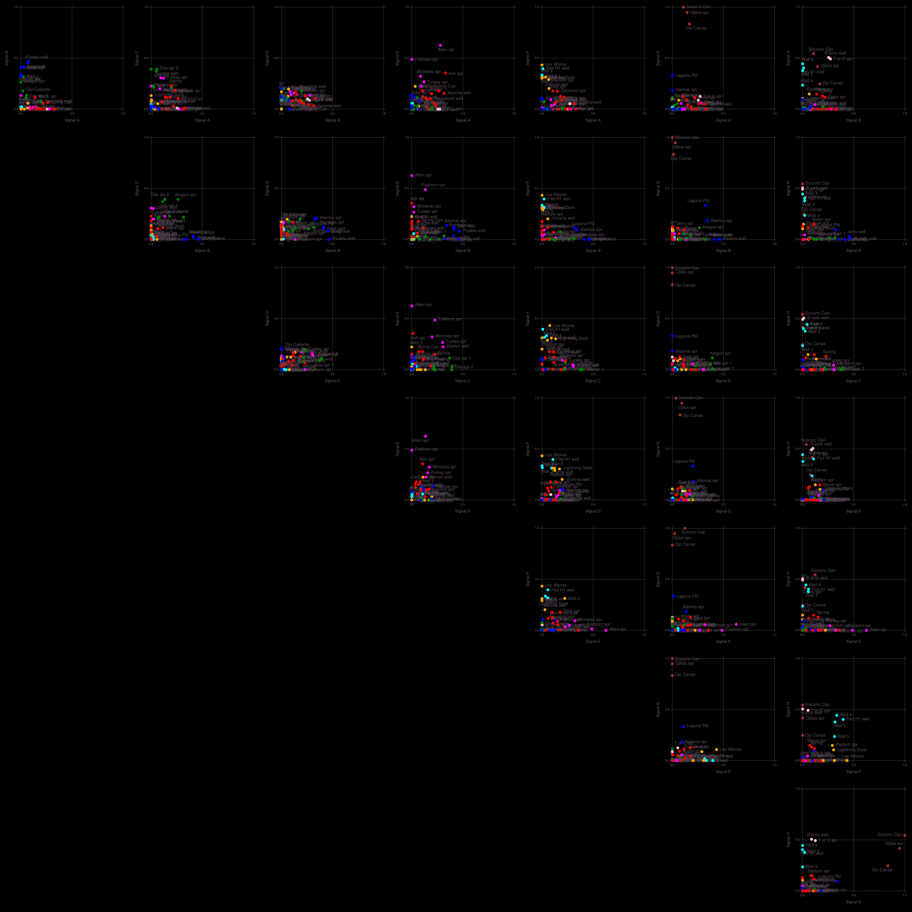
    


    


    2×2 Array{Any,2}:
     "Drainage density"            1.0
     "Fault intersection density"  0.139857


    2×2 Array{Any,2}:
     "Crustal thickness"   1.0
     "Magnetic intensity"  0.593375


    2×2 Array{Any,2}:
     "State map fault density"  0.889845
     "Volcanic dike density"    0.0


    3×2 Array{Any,2}:
     "Lithium concentration"  1.0
     "Boron concentration"    0.0468254
     "Seismicity"             0.0


    3×2 Array{Any,2}:
     "Hydraulic gradient"     1.0
     "Silica geothermometer"  0.0
     "Depth to basement"      0.0


    1×2 Array{Any,2}:
     "Gravity anomaly"  1.0


    2×2 Array{Any,2}:
     "Spring density"  0.957
     "Heat flow"       0.308393


    3×2 Array{Any,2}:
     "Quaternary fault density"  1.0
     "Volcanic vent density"     0.442817
     "Precipitation"             0.0


    

    


    ┌ Info: Attributes (signals=8)
    └ @ NMFk /Users/bulbulahmmed/.julia/packages/NMFk/koh08/src/NMFkPostprocess.jl:325
    ┌ Info: Signal A (S3) Count: 3
    └ @ NMFk /Users/bulbulahmmed/.julia/packages/NMFk/koh08/src/NMFkPostprocess.jl:338
    ┌ Info: Signal B (S1) Count: 3
    └ @ NMFk /Users/bulbulahmmed/.julia/packages/NMFk/koh08/src/NMFkPostprocess.jl:338
    ┌ Info: Signal C (S7) Count: 3
    └ @ NMFk /Users/bulbulahmmed/.julia/packages/NMFk/koh08/src/NMFkPostprocess.jl:338
    ┌ Info: Signal D (S5) Count: 2
    └ @ NMFk /Users/bulbulahmmed/.julia/packages/NMFk/koh08/src/NMFkPostprocess.jl:338
    ┌ Info: Signal E (S8) Count: 2
    └ @ NMFk /Users/bulbulahmmed/.julia/packages/NMFk/koh08/src/NMFkPostprocess.jl:338
    ┌ Info: Signal F (S2) Count: 2
    └ @ NMFk /Users/bulbulahmmed/.julia/packages/NMFk/koh08/src/NMFkPostprocess.jl:338
    ┌ Info: Signal G (S6) Count: 2
    └ @ NMFk /Users/bulbulahmmed/.julia/packages/NMFk/koh08/src/NMFkPostprocess.jl:338
    ┌ Info: Signal H (S4) Count: 1
    └ @ NMFk /Users/bulbulahmmed/.julia/packages/NMFk/koh08/src/NMFkPostprocess.jl:338
    ┌ Info: Signal F -> A Count: 2
    └ @ NMFk /Users/bulbulahmmed/.julia/packages/NMFk/koh08/src/NMFkPostprocess.jl:348
    ┌ Info: Signal D -> B Count: 2
    └ @ NMFk /Users/bulbulahmmed/.julia/packages/NMFk/koh08/src/NMFkPostprocess.jl:348
    ┌ Info: Signal E -> C Count: 2
    └ @ NMFk /Users/bulbulahmmed/.julia/packages/NMFk/koh08/src/NMFkPostprocess.jl:348
    ┌ Info: Signal A -> D Count: 3
    └ @ NMFk /Users/bulbulahmmed/.julia/packages/NMFk/koh08/src/NMFkPostprocess.jl:348
    ┌ Info: Signal C -> E Count: 3
    └ @ NMFk /Users/bulbulahmmed/.julia/packages/NMFk/koh08/src/NMFkPostprocess.jl:348
    ┌ Info: Signal H -> F Count: 1
    └ @ NMFk /Users/bulbulahmmed/.julia/packages/NMFk/koh08/src/NMFkPostprocess.jl:348
    ┌ Info: Signal G -> G Count: 2
    └ @ NMFk /Users/bulbulahmmed/.julia/packages/NMFk/koh08/src/NMFkPostprocess.jl:348
    ┌ Info: Signal B -> H Count: 3
    └ @ NMFk /Users/bulbulahmmed/.julia/packages/NMFk/koh08/src/NMFkPostprocess.jl:348
    ┌ Info: Signal A (remapped k-means clustering)
    └ @ NMFk /Users/bulbulahmmed/.julia/packages/NMFk/koh08/src/NMFkPostprocess.jl:363
    ┌ Info: Signal B (remapped k-means clustering)
    └ @ NMFk /Users/bulbulahmmed/.julia/packages/NMFk/koh08/src/NMFkPostprocess.jl:363
    ┌ Info: Signal C (remapped k-means clustering)
    └ @ NMFk /Users/bulbulahmmed/.julia/packages/NMFk/koh08/src/NMFkPostprocess.jl:363
    ┌ Info: Signal D (remapped k-means clustering)
    └ @ NMFk /Users/bulbulahmmed/.julia/packages/NMFk/koh08/src/NMFkPostprocess.jl:363
    ┌ Info: Signal E (remapped k-means clustering)
    └ @ NMFk /Users/bulbulahmmed/.julia/packages/NMFk/koh08/src/NMFkPostprocess.jl:363
    ┌ Info: Signal F (remapped k-means clustering)
    └ @ NMFk /Users/bulbulahmmed/.julia/packages/NMFk/koh08/src/NMFkPostprocess.jl:363
    ┌ Info: Signal G (remapped k-means clustering)
    └ @ NMFk /Users/bulbulahmmed/.julia/packages/NMFk/koh08/src/NMFkPostprocess.jl:363
    ┌ Info: Signal H (remapped k-means clustering)
    └ @ NMFk /Users/bulbulahmmed/.julia/packages/NMFk/koh08/src/NMFkPostprocess.jl:363


    
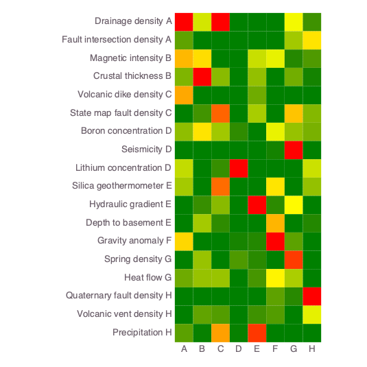
    


    


<?xml version="1.0" encoding="UTF-8"?>
<svg xmlns="http://www.w3.org/2000/svg"
     xmlns:xlink="http://www.w3.org/1999/xlink"
     xmlns:gadfly="http://www.gadflyjl.org/ns"
     version="1.2"
     width="141.42mm" height="100mm" viewBox="0 0 141.42 100"
     stroke="none"
     fill="#000000"
     stroke-width="0.3"
     font-size="3.88"

     id="img-ac39cc2d">
<defs>
  <marker id="arrow" markerWidth="15" markerHeight="7" refX="5" refY="3.5" orient="auto" markerUnits="strokeWidth">
    <path d="M0,0 L15,3.5 L0,7 z" stroke="context-stroke" fill="context-stroke"/>
  </marker>
</defs>
<g class="plotroot" id="img-ac39cc2d-1">
  <g class="guide xlabels" font-size="2.82" font-family="'PT Sans Caption','Helvetica Neue','Helvetica',sans-serif" fill="#6C606B" id="img-ac39cc2d-2">
    <g transform="translate(68.54,94)" gadfly:scale="1.0" visibility="visible">
      <g class="primitive">
        <text text-anchor="middle" dy="-0em">A</text>
      </g>
    </g>
    <g transform="translate(72.76,94)" gadfly:scale="1.0" visibility="visible">
      <g class="primitive">
        <text text-anchor="middle" dy="-0em">B</text>
      </g>
    </g>
    <g transform="translate(76.98,94)" gadfly:scale="1.0" visibility="visible">
      <g class="primitive">
        <text text-anchor="middle" dy="-0em">C</text>
      </g>
    </g>
    <g transform="translate(81.2,94)" gadfly:scale="1.0" visibility="visible">
      <g class="primitive">
        <text text-anchor="middle" dy="-0em">D</text>
      </g>
    </g>
    <g transform="translate(85.42,94)" gadfly:scale="1.0" visibility="visible">
      <g class="primitive">
        <text text-anchor="middle" dy="-0em">E</text>
      </g>
    </g>
    <g transform="translate(89.64,94)" gadfly:scale="1.0" visibility="visible">
      <g class="primitive">
        <text text-anchor="middle" dy="-0em">F</text>
      </g>
    </g>
    <g transform="translate(93.86,94)" gadfly:scale="1.0" visibility="visible">
      <g class="primitive">
        <text text-anchor="middle" dy="-0em">G</text>
      </g>
    </g>
    <g transform="translate(98.08,94)" gadfly:scale="1.0" visibility="visible">
      <g class="primitive">
        <text text-anchor="middle" dy="-0em">H</text>
      </g>
    </g>
  </g>
  <g stroke-width="0.11" stroke="#FFFFFF" id="img-ac39cc2d-3">
    <g transform="translate(102.41,65.63)">
      <path fill="none" d="M-1.16,2.11 L1.16,2.11 1.16,-2.11 -1.16,-2.11 " class="primitive"/>
    </g>
    <g transform="translate(102.41,19.22)">
      <path fill="none" d="M-1.16,2.11 L1.16,2.11 1.16,-2.11 -1.16,-2.11 " class="primitive"/>
    </g>
    <g transform="translate(102.41,36.1)">
      <path fill="none" d="M-1.16,2.11 L1.16,2.11 1.16,-2.11 -1.16,-2.11 " class="primitive"/>
    </g>
    <g transform="translate(102.41,82.51)">
      <path fill="none" d="M-1.16,2.11 L1.16,2.11 1.16,-2.11 -1.16,-2.11 " class="primitive"/>
    </g>
    <g transform="translate(102.41,48.76)">
      <path fill="none" d="M-1.16,2.11 L1.16,2.11 1.16,-2.11 -1.16,-2.11 " class="primitive"/>
    </g>
    <g transform="translate(104.15,22.38)">
      <path fill="none" d="M-2.9,3.16 L1.74,3.16 1.74,-3.16 -0.58,-3.16 " class="primitive"/>
    </g>
    <g transform="translate(102.41,74.07)">
      <path fill="none" d="M-1.16,2.11 L1.16,2.11 1.16,-2.11 -1.16,-2.11 " class="primitive"/>
    </g>
    <g transform="translate(102.41,57.2)">
      <path fill="none" d="M-1.16,2.11 L1.16,2.11 1.16,-2.11 -1.16,-2.11 " class="primitive"/>
    </g>
    <g transform="translate(104.15,39.26)">
      <path fill="none" d="M-2.9,3.16 L1.74,3.16 1.74,-3.16 -0.58,-3.16 " class="primitive"/>
    </g>
    <g transform="translate(106.47,44.01)">
      <path fill="none" d="M-2.9,4.75 L1.74,4.75 1.74,-4.75 -0.58,-4.75 " class="primitive"/>
    </g>
    <g transform="translate(104.73,78.29)">
      <path fill="none" d="M-1.16,4.22 L1.16,4.22 1.16,-4.22 -1.16,-4.22 " class="primitive"/>
    </g>
    <g transform="translate(105.89,26.08)">
      <path fill="none" d="M-4.65,3.69 L2.32,3.69 2.32,-3.69 0,-3.69 " class="primitive"/>
    </g>
    <g transform="translate(104.73,61.41)">
      <path fill="none" d="M-1.16,4.22 L1.16,4.22 1.16,-4.22 -1.16,-4.22 " class="primitive"/>
    </g>
    <g transform="translate(105.89,83.57)">
      <path fill="none" d="M-4.65,5.27 L2.32,5.27 2.32,-5.27 0,-5.27 " class="primitive"/>
    </g>
    <g transform="translate(109.38,35.04)">
      <path fill="none" d="M-1.16,8.97 L1.16,8.97 1.16,-8.97 -1.16,-8.97 " class="primitive"/>
    </g>
    <g transform="translate(110.54,48.23)">
      <path fill="none" d="M-4.65,13.19 L2.32,13.19 2.32,-13.19 0,-13.19 " class="primitive"/>
    </g>
    <g transform="translate(112.86,65.9)">
      <path fill="none" d="M-4.65,17.67 L2.32,17.67 2.32,-17.67 0,-17.67 " class="primitive"/>
    </g>
  </g>
  <g clip-path="url(#img-ac39cc2d-4)">
    <g id="img-ac39cc2d-5">
      <g pointer-events="visible" stroke-width="0.3" fill="#000000" fill-opacity="0.000" stroke="#000000" stroke-opacity="0.000" class="guide background" id="img-ac39cc2d-6">
        <g transform="translate(83.31,52.98)" id="img-ac39cc2d-7">
          <path d="M-16.88,-37.98 L16.88,-37.98 16.88,37.98 -16.88,37.98  z" class="primitive"/>
        </g>
      </g>
      <g class="guide ygridlines xfixed" stroke-dasharray="0.5,0.5" stroke-width="0.2" stroke="#D0D0E0" id="img-ac39cc2d-8">
        <g transform="translate(83.31,19.22)" id="img-ac39cc2d-9" visibility="visible" gadfly:scale="1.0">
          <path fill="none" d="M-16.88,0 L16.88,0 " class="primitive"/>
        </g>
        <g transform="translate(83.31,23.44)" id="img-ac39cc2d-10" visibility="visible" gadfly:scale="1.0">
          <path fill="none" d="M-16.88,0 L16.88,0 " class="primitive"/>
        </g>
        <g transform="translate(83.31,27.66)" id="img-ac39cc2d-11" visibility="visible" gadfly:scale="1.0">
          <path fill="none" d="M-16.88,0 L16.88,0 " class="primitive"/>
        </g>
        <g transform="translate(83.31,31.88)" id="img-ac39cc2d-12" visibility="visible" gadfly:scale="1.0">
          <path fill="none" d="M-16.88,0 L16.88,0 " class="primitive"/>
        </g>
        <g transform="translate(83.31,36.1)" id="img-ac39cc2d-13" visibility="visible" gadfly:scale="1.0">
          <path fill="none" d="M-16.88,0 L16.88,0 " class="primitive"/>
        </g>
        <g transform="translate(83.31,40.32)" id="img-ac39cc2d-14" visibility="visible" gadfly:scale="1.0">
          <path fill="none" d="M-16.88,0 L16.88,0 " class="primitive"/>
        </g>
        <g transform="translate(83.31,44.54)" id="img-ac39cc2d-15" visibility="visible" gadfly:scale="1.0">
          <path fill="none" d="M-16.88,0 L16.88,0 " class="primitive"/>
        </g>
        <g transform="translate(83.31,48.76)" id="img-ac39cc2d-16" visibility="visible" gadfly:scale="1.0">
          <path fill="none" d="M-16.88,0 L16.88,0 " class="primitive"/>
        </g>
        <g transform="translate(83.31,52.98)" id="img-ac39cc2d-17" visibility="visible" gadfly:scale="1.0">
          <path fill="none" d="M-16.88,0 L16.88,0 " class="primitive"/>
        </g>
        <g transform="translate(83.31,57.2)" id="img-ac39cc2d-18" visibility="visible" gadfly:scale="1.0">
          <path fill="none" d="M-16.88,0 L16.88,0 " class="primitive"/>
        </g>
        <g transform="translate(83.31,61.41)" id="img-ac39cc2d-19" visibility="visible" gadfly:scale="1.0">
          <path fill="none" d="M-16.88,0 L16.88,0 " class="primitive"/>
        </g>
        <g transform="translate(83.31,65.63)" id="img-ac39cc2d-20" visibility="visible" gadfly:scale="1.0">
          <path fill="none" d="M-16.88,0 L16.88,0 " class="primitive"/>
        </g>
        <g transform="translate(83.31,69.85)" id="img-ac39cc2d-21" visibility="visible" gadfly:scale="1.0">
          <path fill="none" d="M-16.88,0 L16.88,0 " class="primitive"/>
        </g>
        <g transform="translate(83.31,74.07)" id="img-ac39cc2d-22" visibility="visible" gadfly:scale="1.0">
          <path fill="none" d="M-16.88,0 L16.88,0 " class="primitive"/>
        </g>
        <g transform="translate(83.31,78.29)" id="img-ac39cc2d-23" visibility="visible" gadfly:scale="1.0">
          <path fill="none" d="M-16.88,0 L16.88,0 " class="primitive"/>
        </g>
        <g transform="translate(83.31,82.51)" id="img-ac39cc2d-24" visibility="visible" gadfly:scale="1.0">
          <path fill="none" d="M-16.88,0 L16.88,0 " class="primitive"/>
        </g>
        <g transform="translate(83.31,86.73)" id="img-ac39cc2d-25" visibility="visible" gadfly:scale="1.0">
          <path fill="none" d="M-16.88,0 L16.88,0 " class="primitive"/>
        </g>
      </g>
      <g class="guide xgridlines yfixed" stroke-dasharray="0.5,0.5" stroke-width="0.2" stroke="#D0D0E0" id="img-ac39cc2d-26">
        <g transform="translate(70.65,52.98)" id="img-ac39cc2d-27" visibility="visible" gadfly:scale="1.0">
          <path fill="none" d="M0,-37.98 L0,37.98 " class="primitive"/>
        </g>
        <g transform="translate(74.87,52.98)" id="img-ac39cc2d-28" visibility="visible" gadfly:scale="1.0">
          <path fill="none" d="M0,-37.98 L0,37.98 " class="primitive"/>
        </g>
        <g transform="translate(79.09,52.98)" id="img-ac39cc2d-29" visibility="visible" gadfly:scale="1.0">
          <path fill="none" d="M0,-37.98 L0,37.98 " class="primitive"/>
        </g>
        <g transform="translate(83.31,52.98)" id="img-ac39cc2d-30" visibility="visible" gadfly:scale="1.0">
          <path fill="none" d="M0,-37.98 L0,37.98 " class="primitive"/>
        </g>
        <g transform="translate(87.53,52.98)" id="img-ac39cc2d-31" visibility="visible" gadfly:scale="1.0">
          <path fill="none" d="M0,-37.98 L0,37.98 " class="primitive"/>
        </g>
        <g transform="translate(91.75,52.98)" id="img-ac39cc2d-32" visibility="visible" gadfly:scale="1.0">
          <path fill="none" d="M0,-37.98 L0,37.98 " class="primitive"/>
        </g>
        <g transform="translate(95.97,52.98)" id="img-ac39cc2d-33" visibility="visible" gadfly:scale="1.0">
          <path fill="none" d="M0,-37.98 L0,37.98 " class="primitive"/>
        </g>
      </g>
      <g class="plotpanel" id="img-ac39cc2d-34">
        <metadata>
          <boundingbox value="66.43138139435885mm 15.0mm 33.756089650848764mm 75.95120171440972mm"/>
          <unitbox value="0.5 0.5 8.0 18.0"/>
        </metadata>
        <g shape-rendering="crispEdges" class="geometry" stroke="#000000" stroke-opacity="0.000" id="img-ac39cc2d-35">
          <g transform="translate(68.57,17.13)" id="img-ac39cc2d-36" fill="#FF0000" fill-opacity="1">
            <path d="M-2.13,-2.13 L2.13,-2.13 2.13,2.13 -2.13,2.13  z" class="primitive"/>
          </g>
          <g transform="translate(68.57,21.35)" id="img-ac39cc2d-37" fill="#5FA300" fill-opacity="1">
            <path d="M-2.13,-2.13 L2.13,-2.13 2.13,2.13 -2.13,2.13  z" class="primitive"/>
          </g>
          <g transform="translate(68.57,25.57)" id="img-ac39cc2d-38" fill="#FFB800" fill-opacity="1">
            <path d="M-2.13,-2.13 L2.13,-2.13 2.13,2.13 -2.13,2.13  z" class="primitive"/>
          </g>
          <g transform="translate(68.57,29.79)" id="img-ac39cc2d-39" fill="#7FB400" fill-opacity="1">
            <path d="M-2.13,-2.13 L2.13,-2.13 2.13,2.13 -2.13,2.13  z" class="primitive"/>
          </g>
          <g transform="translate(68.57,34.01)" id="img-ac39cc2d-40" fill="#FFA800" fill-opacity="1">
            <path d="M-2.13,-2.13 L2.13,-2.13 2.13,2.13 -2.13,2.13  z" class="primitive"/>
          </g>
          <g transform="translate(68.57,38.23)" id="img-ac39cc2d-41" fill="#008000" fill-opacity="1">
            <path d="M-2.13,-2.13 L2.13,-2.13 2.13,2.13 -2.13,2.13  z" class="primitive"/>
          </g>
          <g transform="translate(68.57,42.45)" id="img-ac39cc2d-42" fill="#8FBE00" fill-opacity="1">
            <path d="M-2.13,-2.13 L2.13,-2.13 2.13,2.13 -2.13,2.13  z" class="primitive"/>
          </g>
          <g transform="translate(68.57,46.67)" id="img-ac39cc2d-43" fill="#008000" fill-opacity="1">
            <path d="M-2.13,-2.13 L2.13,-2.13 2.13,2.13 -2.13,2.13  z" class="primitive"/>
          </g>
          <g transform="translate(68.57,50.89)" id="img-ac39cc2d-44" fill="#C2DB00" fill-opacity="1">
            <path d="M-2.13,-2.13 L2.13,-2.13 2.13,2.13 -2.13,2.13  z" class="primitive"/>
          </g>
          <g transform="translate(68.57,55.11)" id="img-ac39cc2d-45" fill="#A4CA00" fill-opacity="1">
            <path d="M-2.13,-2.13 L2.13,-2.13 2.13,2.13 -2.13,2.13  z" class="primitive"/>
          </g>
          <g transform="translate(68.57,59.33)" id="img-ac39cc2d-46" fill="#008000" fill-opacity="1">
            <path d="M-2.13,-2.13 L2.13,-2.13 2.13,2.13 -2.13,2.13  z" class="primitive"/>
          </g>
          <g transform="translate(68.57,63.55)" id="img-ac39cc2d-47" fill="#008000" fill-opacity="1">
            <path d="M-2.13,-2.13 L2.13,-2.13 2.13,2.13 -2.13,2.13  z" class="primitive"/>
          </g>
          <g transform="translate(68.57,67.77)" id="img-ac39cc2d-48" fill="#FFD600" fill-opacity="1">
            <path d="M-2.13,-2.13 L2.13,-2.13 2.13,2.13 -2.13,2.13  z" class="primitive"/>
          </g>
          <g transform="translate(68.57,71.99)" id="img-ac39cc2d-49" fill="#008000" fill-opacity="1">
            <path d="M-2.13,-2.13 L2.13,-2.13 2.13,2.13 -2.13,2.13  z" class="primitive"/>
          </g>
          <g transform="translate(68.57,76.21)" id="img-ac39cc2d-50" fill="#6EAB00" fill-opacity="1">
            <path d="M-2.13,-2.13 L2.13,-2.13 2.13,2.13 -2.13,2.13  z" class="primitive"/>
          </g>
          <g transform="translate(68.57,80.43)" id="img-ac39cc2d-51" fill="#008000" fill-opacity="1">
            <path d="M-2.13,-2.13 L2.13,-2.13 2.13,2.13 -2.13,2.13  z" class="primitive"/>
          </g>
          <g transform="translate(68.57,84.65)" id="img-ac39cc2d-52" fill="#008000" fill-opacity="1">
            <path d="M-2.13,-2.13 L2.13,-2.13 2.13,2.13 -2.13,2.13  z" class="primitive"/>
          </g>
          <g transform="translate(68.57,88.87)" id="img-ac39cc2d-53" fill="#5BA100" fill-opacity="1">
            <path d="M-2.13,-2.13 L2.13,-2.13 2.13,2.13 -2.13,2.13  z" class="primitive"/>
          </g>
          <g transform="translate(72.79,17.13)" id="img-ac39cc2d-54" fill="#D3E500" fill-opacity="1">
            <path d="M-2.13,-2.13 L2.13,-2.13 2.13,2.13 -2.13,2.13  z" class="primitive"/>
          </g>
          <g transform="translate(72.79,21.35)" id="img-ac39cc2d-55" fill="#008000" fill-opacity="1">
            <path d="M-2.13,-2.13 L2.13,-2.13 2.13,2.13 -2.13,2.13  z" class="primitive"/>
          </g>
          <g transform="translate(72.79,25.57)" id="img-ac39cc2d-56" fill="#FFDD00" fill-opacity="1">
            <path d="M-2.13,-2.13 L2.13,-2.13 2.13,2.13 -2.13,2.13  z" class="primitive"/>
          </g>
          <g transform="translate(72.79,29.79)" id="img-ac39cc2d-57" fill="#FF0000" fill-opacity="1">
            <path d="M-2.13,-2.13 L2.13,-2.13 2.13,2.13 -2.13,2.13  z" class="primitive"/>
          </g>
          <g transform="translate(72.79,34.01)" id="img-ac39cc2d-58" fill="#008000" fill-opacity="1">
            <path d="M-2.13,-2.13 L2.13,-2.13 2.13,2.13 -2.13,2.13  z" class="primitive"/>
          </g>
          <g transform="translate(72.79,38.23)" id="img-ac39cc2d-59" fill="#429400" fill-opacity="1">
            <path d="M-2.13,-2.13 L2.13,-2.13 2.13,2.13 -2.13,2.13  z" class="primitive"/>
          </g>
          <g transform="translate(72.79,42.45)" id="img-ac39cc2d-60" fill="#FFE300" fill-opacity="1">
            <path d="M-2.13,-2.13 L2.13,-2.13 2.13,2.13 -2.13,2.13  z" class="primitive"/>
          </g>
          <g transform="translate(72.79,46.67)" id="img-ac39cc2d-61" fill="#008000" fill-opacity="1">
            <path d="M-2.13,-2.13 L2.13,-2.13 2.13,2.13 -2.13,2.13  z" class="primitive"/>
          </g>
          <g transform="translate(72.79,50.89)" id="img-ac39cc2d-62" fill="#008000" fill-opacity="1">
            <path d="M-2.13,-2.13 L2.13,-2.13 2.13,2.13 -2.13,2.13  z" class="primitive"/>
          </g>
          <g transform="translate(72.79,55.11)" id="img-ac39cc2d-63" fill="#008000" fill-opacity="1">
            <path d="M-2.13,-2.13 L2.13,-2.13 2.13,2.13 -2.13,2.13  z" class="primitive"/>
          </g>
          <g transform="translate(72.79,59.33)" id="img-ac39cc2d-64" fill="#378F00" fill-opacity="1">
            <path d="M-2.13,-2.13 L2.13,-2.13 2.13,2.13 -2.13,2.13  z" class="primitive"/>
          </g>
          <g transform="translate(72.79,63.55)" id="img-ac39cc2d-65" fill="#A4CA00" fill-opacity="1">
            <path d="M-2.13,-2.13 L2.13,-2.13 2.13,2.13 -2.13,2.13  z" class="primitive"/>
          </g>
          <g transform="translate(72.79,67.77)" id="img-ac39cc2d-66" fill="#008000" fill-opacity="1">
            <path d="M-2.13,-2.13 L2.13,-2.13 2.13,2.13 -2.13,2.13  z" class="primitive"/>
          </g>
          <g transform="translate(72.79,71.99)" id="img-ac39cc2d-67" fill="#98C300" fill-opacity="1">
            <path d="M-2.13,-2.13 L2.13,-2.13 2.13,2.13 -2.13,2.13  z" class="primitive"/>
          </g>
          <g transform="translate(72.79,76.21)" id="img-ac39cc2d-68" fill="#97C200" fill-opacity="1">
            <path d="M-2.13,-2.13 L2.13,-2.13 2.13,2.13 -2.13,2.13  z" class="primitive"/>
          </g>
          <g transform="translate(72.79,80.43)" id="img-ac39cc2d-69" fill="#008000" fill-opacity="1">
            <path d="M-2.13,-2.13 L2.13,-2.13 2.13,2.13 -2.13,2.13  z" class="primitive"/>
          </g>
          <g transform="translate(72.79,84.65)" id="img-ac39cc2d-70" fill="#61A400" fill-opacity="1">
            <path d="M-2.13,-2.13 L2.13,-2.13 2.13,2.13 -2.13,2.13  z" class="primitive"/>
          </g>
          <g transform="translate(72.79,88.87)" id="img-ac39cc2d-71" fill="#078100" fill-opacity="1">
            <path d="M-2.13,-2.13 L2.13,-2.13 2.13,2.13 -2.13,2.13  z" class="primitive"/>
          </g>
          <g transform="translate(77.01,17.13)" id="img-ac39cc2d-72" fill="#FF0000" fill-opacity="1">
            <path d="M-2.13,-2.13 L2.13,-2.13 2.13,2.13 -2.13,2.13  z" class="primitive"/>
          </g>
          <g transform="translate(77.01,21.35)" id="img-ac39cc2d-73" fill="#008000" fill-opacity="1">
            <path d="M-2.13,-2.13 L2.13,-2.13 2.13,2.13 -2.13,2.13  z" class="primitive"/>
          </g>
          <g transform="translate(77.01,25.57)" id="img-ac39cc2d-74" fill="#008000" fill-opacity="1">
            <path d="M-2.13,-2.13 L2.13,-2.13 2.13,2.13 -2.13,2.13  z" class="primitive"/>
          </g>
          <g transform="translate(77.01,29.79)" id="img-ac39cc2d-75" fill="#89BB00" fill-opacity="1">
            <path d="M-2.13,-2.13 L2.13,-2.13 2.13,2.13 -2.13,2.13  z" class="primitive"/>
          </g>
          <g transform="translate(77.01,34.01)" id="img-ac39cc2d-76" fill="#008000" fill-opacity="1">
            <path d="M-2.13,-2.13 L2.13,-2.13 2.13,2.13 -2.13,2.13  z" class="primitive"/>
          </g>
          <g transform="translate(77.01,38.23)" id="img-ac39cc2d-77" fill="#FF6400" fill-opacity="1">
            <path d="M-2.13,-2.13 L2.13,-2.13 2.13,2.13 -2.13,2.13  z" class="primitive"/>
          </g>
          <g transform="translate(77.01,42.45)" id="img-ac39cc2d-78" fill="#A1C800" fill-opacity="1">
            <path d="M-2.13,-2.13 L2.13,-2.13 2.13,2.13 -2.13,2.13  z" class="primitive"/>
          </g>
          <g transform="translate(77.01,46.67)" id="img-ac39cc2d-79" fill="#008000" fill-opacity="1">
            <path d="M-2.13,-2.13 L2.13,-2.13 2.13,2.13 -2.13,2.13  z" class="primitive"/>
          </g>
          <g transform="translate(77.01,50.89)" id="img-ac39cc2d-80" fill="#368F00" fill-opacity="1">
            <path d="M-2.13,-2.13 L2.13,-2.13 2.13,2.13 -2.13,2.13  z" class="primitive"/>
          </g>
          <g transform="translate(77.01,55.11)" id="img-ac39cc2d-81" fill="#FF6C00" fill-opacity="1">
            <path d="M-2.13,-2.13 L2.13,-2.13 2.13,2.13 -2.13,2.13  z" class="primitive"/>
          </g>
          <g transform="translate(77.01,59.33)" id="img-ac39cc2d-82" fill="#89BA00" fill-opacity="1">
            <path d="M-2.13,-2.13 L2.13,-2.13 2.13,2.13 -2.13,2.13  z" class="primitive"/>
          </g>
          <g transform="translate(77.01,63.55)" id="img-ac39cc2d-83" fill="#2F8C00" fill-opacity="1">
            <path d="M-2.13,-2.13 L2.13,-2.13 2.13,2.13 -2.13,2.13  z" class="primitive"/>
          </g>
          <g transform="translate(77.01,67.77)" id="img-ac39cc2d-84" fill="#008000" fill-opacity="1">
            <path d="M-2.13,-2.13 L2.13,-2.13 2.13,2.13 -2.13,2.13  z" class="primitive"/>
          </g>
          <g transform="translate(77.01,71.99)" id="img-ac39cc2d-85" fill="#008000" fill-opacity="1">
            <path d="M-2.13,-2.13 L2.13,-2.13 2.13,2.13 -2.13,2.13  z" class="primitive"/>
          </g>
          <g transform="translate(77.01,76.21)" id="img-ac39cc2d-86" fill="#99C300" fill-opacity="1">
            <path d="M-2.13,-2.13 L2.13,-2.13 2.13,2.13 -2.13,2.13  z" class="primitive"/>
          </g>
          <g transform="translate(77.01,80.43)" id="img-ac39cc2d-87" fill="#008000" fill-opacity="1">
            <path d="M-2.13,-2.13 L2.13,-2.13 2.13,2.13 -2.13,2.13  z" class="primitive"/>
          </g>
          <g transform="translate(77.01,84.65)" id="img-ac39cc2d-88" fill="#549D00" fill-opacity="1">
            <path d="M-2.13,-2.13 L2.13,-2.13 2.13,2.13 -2.13,2.13  z" class="primitive"/>
          </g>
          <g transform="translate(77.01,88.87)" id="img-ac39cc2d-89" fill="#FF9F00" fill-opacity="1">
            <path d="M-2.13,-2.13 L2.13,-2.13 2.13,2.13 -2.13,2.13  z" class="primitive"/>
          </g>
          <g transform="translate(81.22,17.13)" id="img-ac39cc2d-90" fill="#008000" fill-opacity="1">
            <path d="M-2.13,-2.13 L2.13,-2.13 2.13,2.13 -2.13,2.13  z" class="primitive"/>
          </g>
          <g transform="translate(81.22,21.35)" id="img-ac39cc2d-91" fill="#008000" fill-opacity="1">
            <path d="M-2.13,-2.13 L2.13,-2.13 2.13,2.13 -2.13,2.13  z" class="primitive"/>
          </g>
          <g transform="translate(81.22,25.57)" id="img-ac39cc2d-92" fill="#008000" fill-opacity="1">
            <path d="M-2.13,-2.13 L2.13,-2.13 2.13,2.13 -2.13,2.13  z" class="primitive"/>
          </g>
          <g transform="translate(81.22,29.79)" id="img-ac39cc2d-93" fill="#008000" fill-opacity="1">
            <path d="M-2.13,-2.13 L2.13,-2.13 2.13,2.13 -2.13,2.13  z" class="primitive"/>
          </g>
          <g transform="translate(81.22,34.01)" id="img-ac39cc2d-94" fill="#008000" fill-opacity="1">
            <path d="M-2.13,-2.13 L2.13,-2.13 2.13,2.13 -2.13,2.13  z" class="primitive"/>
          </g>
          <g transform="translate(81.22,38.23)" id="img-ac39cc2d-95" fill="#008000" fill-opacity="1">
            <path d="M-2.13,-2.13 L2.13,-2.13 2.13,2.13 -2.13,2.13  z" class="primitive"/>
          </g>
          <g transform="translate(81.22,42.45)" id="img-ac39cc2d-96" fill="#2F8C00" fill-opacity="1">
            <path d="M-2.13,-2.13 L2.13,-2.13 2.13,2.13 -2.13,2.13  z" class="primitive"/>
          </g>
          <g transform="translate(81.22,46.67)" id="img-ac39cc2d-97" fill="#008000" fill-opacity="1">
            <path d="M-2.13,-2.13 L2.13,-2.13 2.13,2.13 -2.13,2.13  z" class="primitive"/>
          </g>
          <g transform="translate(81.22,50.89)" id="img-ac39cc2d-98" fill="#FF0000" fill-opacity="1">
            <path d="M-2.13,-2.13 L2.13,-2.13 2.13,2.13 -2.13,2.13  z" class="primitive"/>
          </g>
          <g transform="translate(81.22,55.11)" id="img-ac39cc2d-99" fill="#008000" fill-opacity="1">
            <path d="M-2.13,-2.13 L2.13,-2.13 2.13,2.13 -2.13,2.13  z" class="primitive"/>
          </g>
          <g transform="translate(81.22,59.33)" id="img-ac39cc2d-100" fill="#008000" fill-opacity="1">
            <path d="M-2.13,-2.13 L2.13,-2.13 2.13,2.13 -2.13,2.13  z" class="primitive"/>
          </g>
          <g transform="translate(81.22,63.55)" id="img-ac39cc2d-101" fill="#008000" fill-opacity="1">
            <path d="M-2.13,-2.13 L2.13,-2.13 2.13,2.13 -2.13,2.13  z" class="primitive"/>
          </g>
          <g transform="translate(81.22,67.77)" id="img-ac39cc2d-102" fill="#178400" fill-opacity="1">
            <path d="M-2.13,-2.13 L2.13,-2.13 2.13,2.13 -2.13,2.13  z" class="primitive"/>
          </g>
          <g transform="translate(81.22,71.99)" id="img-ac39cc2d-103" fill="#4E9A00" fill-opacity="1">
            <path d="M-2.13,-2.13 L2.13,-2.13 2.13,2.13 -2.13,2.13  z" class="primitive"/>
          </g>
          <g transform="translate(81.22,76.21)" id="img-ac39cc2d-104" fill="#008000" fill-opacity="1">
            <path d="M-2.13,-2.13 L2.13,-2.13 2.13,2.13 -2.13,2.13  z" class="primitive"/>
          </g>
          <g transform="translate(81.22,80.43)" id="img-ac39cc2d-105" fill="#008000" fill-opacity="1">
            <path d="M-2.13,-2.13 L2.13,-2.13 2.13,2.13 -2.13,2.13  z" class="primitive"/>
          </g>
          <g transform="translate(81.22,84.65)" id="img-ac39cc2d-106" fill="#008000" fill-opacity="1">
            <path d="M-2.13,-2.13 L2.13,-2.13 2.13,2.13 -2.13,2.13  z" class="primitive"/>
          </g>
          <g transform="translate(81.22,88.87)" id="img-ac39cc2d-107" fill="#088100" fill-opacity="1">
            <path d="M-2.13,-2.13 L2.13,-2.13 2.13,2.13 -2.13,2.13  z" class="primitive"/>
          </g>
          <g transform="translate(85.44,17.13)" id="img-ac39cc2d-108" fill="#008000" fill-opacity="1">
            <path d="M-2.13,-2.13 L2.13,-2.13 2.13,2.13 -2.13,2.13  z" class="primitive"/>
          </g>
          <g transform="translate(85.44,21.35)" id="img-ac39cc2d-109" fill="#008000" fill-opacity="1">
            <path d="M-2.13,-2.13 L2.13,-2.13 2.13,2.13 -2.13,2.13  z" class="primitive"/>
          </g>
          <g transform="translate(85.44,25.57)" id="img-ac39cc2d-110" fill="#C7DF00" fill-opacity="1">
            <path d="M-2.13,-2.13 L2.13,-2.13 2.13,2.13 -2.13,2.13  z" class="primitive"/>
          </g>
          <g transform="translate(85.44,29.79)" id="img-ac39cc2d-111" fill="#93C000" fill-opacity="1">
            <path d="M-2.13,-2.13 L2.13,-2.13 2.13,2.13 -2.13,2.13  z" class="primitive"/>
          </g>
          <g transform="translate(85.44,34.01)" id="img-ac39cc2d-112" fill="#6FAB00" fill-opacity="1">
            <path d="M-2.13,-2.13 L2.13,-2.13 2.13,2.13 -2.13,2.13  z" class="primitive"/>
          </g>
          <g transform="translate(85.44,38.23)" id="img-ac39cc2d-113" fill="#A8CC00" fill-opacity="1">
            <path d="M-2.13,-2.13 L2.13,-2.13 2.13,2.13 -2.13,2.13  z" class="primitive"/>
          </g>
          <g transform="translate(85.44,42.45)" id="img-ac39cc2d-114" fill="#008000" fill-opacity="1">
            <path d="M-2.13,-2.13 L2.13,-2.13 2.13,2.13 -2.13,2.13  z" class="primitive"/>
          </g>
          <g transform="translate(85.44,46.67)" id="img-ac39cc2d-115" fill="#008000" fill-opacity="1">
            <path d="M-2.13,-2.13 L2.13,-2.13 2.13,2.13 -2.13,2.13  z" class="primitive"/>
          </g>
          <g transform="translate(85.44,50.89)" id="img-ac39cc2d-116" fill="#008000" fill-opacity="1">
            <path d="M-2.13,-2.13 L2.13,-2.13 2.13,2.13 -2.13,2.13  z" class="primitive"/>
          </g>
          <g transform="translate(85.44,55.11)" id="img-ac39cc2d-117" fill="#008000" fill-opacity="1">
            <path d="M-2.13,-2.13 L2.13,-2.13 2.13,2.13 -2.13,2.13  z" class="primitive"/>
          </g>
          <g transform="translate(85.44,59.33)" id="img-ac39cc2d-118" fill="#FF0000" fill-opacity="1">
            <path d="M-2.13,-2.13 L2.13,-2.13 2.13,2.13 -2.13,2.13  z" class="primitive"/>
          </g>
          <g transform="translate(85.44,63.55)" id="img-ac39cc2d-119" fill="#008000" fill-opacity="1">
            <path d="M-2.13,-2.13 L2.13,-2.13 2.13,2.13 -2.13,2.13  z" class="primitive"/>
          </g>
          <g transform="translate(85.44,67.77)" id="img-ac39cc2d-120" fill="#238800" fill-opacity="1">
            <path d="M-2.13,-2.13 L2.13,-2.13 2.13,2.13 -2.13,2.13  z" class="primitive"/>
          </g>
          <g transform="translate(85.44,71.99)" id="img-ac39cc2d-121" fill="#298A00" fill-opacity="1">
            <path d="M-2.13,-2.13 L2.13,-2.13 2.13,2.13 -2.13,2.13  z" class="primitive"/>
          </g>
          <g transform="translate(85.44,76.21)" id="img-ac39cc2d-122" fill="#469600" fill-opacity="1">
            <path d="M-2.13,-2.13 L2.13,-2.13 2.13,2.13 -2.13,2.13  z" class="primitive"/>
          </g>
          <g transform="translate(85.44,80.43)" id="img-ac39cc2d-123" fill="#008000" fill-opacity="1">
            <path d="M-2.13,-2.13 L2.13,-2.13 2.13,2.13 -2.13,2.13  z" class="primitive"/>
          </g>
          <g transform="translate(85.44,84.65)" id="img-ac39cc2d-124" fill="#3E9200" fill-opacity="1">
            <path d="M-2.13,-2.13 L2.13,-2.13 2.13,2.13 -2.13,2.13  z" class="primitive"/>
          </g>
          <g transform="translate(85.44,88.87)" id="img-ac39cc2d-125" fill="#FF3700" fill-opacity="1">
            <path d="M-2.13,-2.13 L2.13,-2.13 2.13,2.13 -2.13,2.13  z" class="primitive"/>
          </g>
          <g transform="translate(89.66,17.13)" id="img-ac39cc2d-126" fill="#008000" fill-opacity="1">
            <path d="M-2.13,-2.13 L2.13,-2.13 2.13,2.13 -2.13,2.13  z" class="primitive"/>
          </g>
          <g transform="translate(89.66,21.35)" id="img-ac39cc2d-127" fill="#008000" fill-opacity="1">
            <path d="M-2.13,-2.13 L2.13,-2.13 2.13,2.13 -2.13,2.13  z" class="primitive"/>
          </g>
          <g transform="translate(89.66,25.57)" id="img-ac39cc2d-128" fill="#E7F100" fill-opacity="1">
            <path d="M-2.13,-2.13 L2.13,-2.13 2.13,2.13 -2.13,2.13  z" class="primitive"/>
          </g>
          <g transform="translate(89.66,29.79)" id="img-ac39cc2d-129" fill="#008000" fill-opacity="1">
            <path d="M-2.13,-2.13 L2.13,-2.13 2.13,2.13 -2.13,2.13  z" class="primitive"/>
          </g>
          <g transform="translate(89.66,34.01)" id="img-ac39cc2d-130" fill="#008000" fill-opacity="1">
            <path d="M-2.13,-2.13 L2.13,-2.13 2.13,2.13 -2.13,2.13  z" class="primitive"/>
          </g>
          <g transform="translate(89.66,38.23)" id="img-ac39cc2d-131" fill="#008000" fill-opacity="1">
            <path d="M-2.13,-2.13 L2.13,-2.13 2.13,2.13 -2.13,2.13  z" class="primitive"/>
          </g>
          <g transform="translate(89.66,42.45)" id="img-ac39cc2d-132" fill="#EAF300" fill-opacity="1">
            <path d="M-2.13,-2.13 L2.13,-2.13 2.13,2.13 -2.13,2.13  z" class="primitive"/>
          </g>
          <g transform="translate(89.66,46.67)" id="img-ac39cc2d-133" fill="#148300" fill-opacity="1">
            <path d="M-2.13,-2.13 L2.13,-2.13 2.13,2.13 -2.13,2.13  z" class="primitive"/>
          </g>
          <g transform="translate(89.66,50.89)" id="img-ac39cc2d-134" fill="#008000" fill-opacity="1">
            <path d="M-2.13,-2.13 L2.13,-2.13 2.13,2.13 -2.13,2.13  z" class="primitive"/>
          </g>
          <g transform="translate(89.66,55.11)" id="img-ac39cc2d-135" fill="#FFE400" fill-opacity="1">
            <path d="M-2.13,-2.13 L2.13,-2.13 2.13,2.13 -2.13,2.13  z" class="primitive"/>
          </g>
          <g transform="translate(89.66,59.33)" id="img-ac39cc2d-136" fill="#2C8B00" fill-opacity="1">
            <path d="M-2.13,-2.13 L2.13,-2.13 2.13,2.13 -2.13,2.13  z" class="primitive"/>
          </g>
          <g transform="translate(89.66,63.55)" id="img-ac39cc2d-137" fill="#FFB500" fill-opacity="1">
            <path d="M-2.13,-2.13 L2.13,-2.13 2.13,2.13 -2.13,2.13  z" class="primitive"/>
          </g>
          <g transform="translate(89.66,67.77)" id="img-ac39cc2d-138" fill="#FF0000" fill-opacity="1">
            <path d="M-2.13,-2.13 L2.13,-2.13 2.13,2.13 -2.13,2.13  z" class="primitive"/>
          </g>
          <g transform="translate(89.66,71.99)" id="img-ac39cc2d-139" fill="#008000" fill-opacity="1">
            <path d="M-2.13,-2.13 L2.13,-2.13 2.13,2.13 -2.13,2.13  z" class="primitive"/>
          </g>
          <g transform="translate(89.66,76.21)" id="img-ac39cc2d-140" fill="#FFF500" fill-opacity="1">
            <path d="M-2.13,-2.13 L2.13,-2.13 2.13,2.13 -2.13,2.13  z" class="primitive"/>
          </g>
          <g transform="translate(89.66,80.43)" id="img-ac39cc2d-141" fill="#5EA200" fill-opacity="1">
            <path d="M-2.13,-2.13 L2.13,-2.13 2.13,2.13 -2.13,2.13  z" class="primitive"/>
          </g>
          <g transform="translate(89.66,84.65)" id="img-ac39cc2d-142" fill="#539C00" fill-opacity="1">
            <path d="M-2.13,-2.13 L2.13,-2.13 2.13,2.13 -2.13,2.13  z" class="primitive"/>
          </g>
          <g transform="translate(89.66,88.87)" id="img-ac39cc2d-143" fill="#008000" fill-opacity="1">
            <path d="M-2.13,-2.13 L2.13,-2.13 2.13,2.13 -2.13,2.13  z" class="primitive"/>
          </g>
          <g transform="translate(93.88,17.13)" id="img-ac39cc2d-144" fill="#F3F800" fill-opacity="1">
            <path d="M-2.13,-2.13 L2.13,-2.13 2.13,2.13 -2.13,2.13  z" class="primitive"/>
          </g>
          <g transform="translate(93.88,21.35)" id="img-ac39cc2d-145" fill="#A2C900" fill-opacity="1">
            <path d="M-2.13,-2.13 L2.13,-2.13 2.13,2.13 -2.13,2.13  z" class="primitive"/>
          </g>
          <g transform="translate(93.88,25.57)" id="img-ac39cc2d-146" fill="#258800" fill-opacity="1">
            <path d="M-2.13,-2.13 L2.13,-2.13 2.13,2.13 -2.13,2.13  z" class="primitive"/>
          </g>
          <g transform="translate(93.88,29.79)" id="img-ac39cc2d-147" fill="#72AD00" fill-opacity="1">
            <path d="M-2.13,-2.13 L2.13,-2.13 2.13,2.13 -2.13,2.13  z" class="primitive"/>
          </g>
          <g transform="translate(93.88,34.01)" id="img-ac39cc2d-148" fill="#008000" fill-opacity="1">
            <path d="M-2.13,-2.13 L2.13,-2.13 2.13,2.13 -2.13,2.13  z" class="primitive"/>
          </g>
          <g transform="translate(93.88,38.23)" id="img-ac39cc2d-149" fill="#FFC300" fill-opacity="1">
            <path d="M-2.13,-2.13 L2.13,-2.13 2.13,2.13 -2.13,2.13  z" class="primitive"/>
          </g>
          <g transform="translate(93.88,42.45)" id="img-ac39cc2d-150" fill="#97C200" fill-opacity="1">
            <path d="M-2.13,-2.13 L2.13,-2.13 2.13,2.13 -2.13,2.13  z" class="primitive"/>
          </g>
          <g transform="translate(93.88,46.67)" id="img-ac39cc2d-151" fill="#FF0000" fill-opacity="1">
            <path d="M-2.13,-2.13 L2.13,-2.13 2.13,2.13 -2.13,2.13  z" class="primitive"/>
          </g>
          <g transform="translate(93.88,50.89)" id="img-ac39cc2d-152" fill="#008000" fill-opacity="1">
            <path d="M-2.13,-2.13 L2.13,-2.13 2.13,2.13 -2.13,2.13  z" class="primitive"/>
          </g>
          <g transform="translate(93.88,55.11)" id="img-ac39cc2d-153" fill="#008000" fill-opacity="1">
            <path d="M-2.13,-2.13 L2.13,-2.13 2.13,2.13 -2.13,2.13  z" class="primitive"/>
          </g>
          <g transform="translate(93.88,59.33)" id="img-ac39cc2d-154" fill="#FFFB00" fill-opacity="1">
            <path d="M-2.13,-2.13 L2.13,-2.13 2.13,2.13 -2.13,2.13  z" class="primitive"/>
          </g>
          <g transform="translate(93.88,63.55)" id="img-ac39cc2d-155" fill="#008000" fill-opacity="1">
            <path d="M-2.13,-2.13 L2.13,-2.13 2.13,2.13 -2.13,2.13  z" class="primitive"/>
          </g>
          <g transform="translate(93.88,67.77)" id="img-ac39cc2d-156" fill="#5CA100" fill-opacity="1">
            <path d="M-2.13,-2.13 L2.13,-2.13 2.13,2.13 -2.13,2.13  z" class="primitive"/>
          </g>
          <g transform="translate(93.88,71.99)" id="img-ac39cc2d-157" fill="#FF3C00" fill-opacity="1">
            <path d="M-2.13,-2.13 L2.13,-2.13 2.13,2.13 -2.13,2.13  z" class="primitive"/>
          </g>
          <g transform="translate(93.88,76.21)" id="img-ac39cc2d-158" fill="#AACE00" fill-opacity="1">
            <path d="M-2.13,-2.13 L2.13,-2.13 2.13,2.13 -2.13,2.13  z" class="primitive"/>
          </g>
          <g transform="translate(93.88,80.43)" id="img-ac39cc2d-159" fill="#288900" fill-opacity="1">
            <path d="M-2.13,-2.13 L2.13,-2.13 2.13,2.13 -2.13,2.13  z" class="primitive"/>
          </g>
          <g transform="translate(93.88,84.65)" id="img-ac39cc2d-160" fill="#008000" fill-opacity="1">
            <path d="M-2.13,-2.13 L2.13,-2.13 2.13,2.13 -2.13,2.13  z" class="primitive"/>
          </g>
          <g transform="translate(93.88,88.87)" id="img-ac39cc2d-161" fill="#008000" fill-opacity="1">
            <path d="M-2.13,-2.13 L2.13,-2.13 2.13,2.13 -2.13,2.13  z" class="primitive"/>
          </g>
          <g transform="translate(98.1,17.13)" id="img-ac39cc2d-162" fill="#3E9200" fill-opacity="1">
            <path d="M-2.13,-2.13 L2.13,-2.13 2.13,2.13 -2.13,2.13  z" class="primitive"/>
          </g>
          <g transform="translate(98.1,21.35)" id="img-ac39cc2d-163" fill="#FFE400" fill-opacity="1">
            <path d="M-2.13,-2.13 L2.13,-2.13 2.13,2.13 -2.13,2.13  z" class="primitive"/>
          </g>
          <g transform="translate(98.1,25.57)" id="img-ac39cc2d-164" fill="#4F9A00" fill-opacity="1">
            <path d="M-2.13,-2.13 L2.13,-2.13 2.13,2.13 -2.13,2.13  z" class="primitive"/>
          </g>
          <g transform="translate(98.1,29.79)" id="img-ac39cc2d-165" fill="#148300" fill-opacity="1">
            <path d="M-2.13,-2.13 L2.13,-2.13 2.13,2.13 -2.13,2.13  z" class="primitive"/>
          </g>
          <g transform="translate(98.1,34.01)" id="img-ac39cc2d-166" fill="#008000" fill-opacity="1">
            <path d="M-2.13,-2.13 L2.13,-2.13 2.13,2.13 -2.13,2.13  z" class="primitive"/>
          </g>
          <g transform="translate(98.1,38.23)" id="img-ac39cc2d-167" fill="#84B800" fill-opacity="1">
            <path d="M-2.13,-2.13 L2.13,-2.13 2.13,2.13 -2.13,2.13  z" class="primitive"/>
          </g>
          <g transform="translate(98.1,42.45)" id="img-ac39cc2d-168" fill="#79B100" fill-opacity="1">
            <path d="M-2.13,-2.13 L2.13,-2.13 2.13,2.13 -2.13,2.13  z" class="primitive"/>
          </g>
          <g transform="translate(98.1,46.67)" id="img-ac39cc2d-169" fill="#008000" fill-opacity="1">
            <path d="M-2.13,-2.13 L2.13,-2.13 2.13,2.13 -2.13,2.13  z" class="primitive"/>
          </g>
          <g transform="translate(98.1,50.89)" id="img-ac39cc2d-170" fill="#CAE000" fill-opacity="1">
            <path d="M-2.13,-2.13 L2.13,-2.13 2.13,2.13 -2.13,2.13  z" class="primitive"/>
          </g>
          <g transform="translate(98.1,55.11)" id="img-ac39cc2d-171" fill="#94C100" fill-opacity="1">
            <path d="M-2.13,-2.13 L2.13,-2.13 2.13,2.13 -2.13,2.13  z" class="primitive"/>
          </g>
          <g transform="translate(98.1,59.33)" id="img-ac39cc2d-172" fill="#008000" fill-opacity="1">
            <path d="M-2.13,-2.13 L2.13,-2.13 2.13,2.13 -2.13,2.13  z" class="primitive"/>
          </g>
          <g transform="translate(98.1,63.55)" id="img-ac39cc2d-173" fill="#248800" fill-opacity="1">
            <path d="M-2.13,-2.13 L2.13,-2.13 2.13,2.13 -2.13,2.13  z" class="primitive"/>
          </g>
          <g transform="translate(98.1,67.77)" id="img-ac39cc2d-174" fill="#008000" fill-opacity="1">
            <path d="M-2.13,-2.13 L2.13,-2.13 2.13,2.13 -2.13,2.13  z" class="primitive"/>
          </g>
          <g transform="translate(98.1,71.99)" id="img-ac39cc2d-175" fill="#008000" fill-opacity="1">
            <path d="M-2.13,-2.13 L2.13,-2.13 2.13,2.13 -2.13,2.13  z" class="primitive"/>
          </g>
          <g transform="translate(98.1,76.21)" id="img-ac39cc2d-176" fill="#008000" fill-opacity="1">
            <path d="M-2.13,-2.13 L2.13,-2.13 2.13,2.13 -2.13,2.13  z" class="primitive"/>
          </g>
          <g transform="translate(98.1,80.43)" id="img-ac39cc2d-177" fill="#FF0000" fill-opacity="1">
            <path d="M-2.13,-2.13 L2.13,-2.13 2.13,2.13 -2.13,2.13  z" class="primitive"/>
          </g>
          <g transform="translate(98.1,84.65)" id="img-ac39cc2d-178" fill="#E6F000" fill-opacity="1">
            <path d="M-2.13,-2.13 L2.13,-2.13 2.13,2.13 -2.13,2.13  z" class="primitive"/>
          </g>
          <g transform="translate(98.1,88.87)" id="img-ac39cc2d-179" fill="#008000" fill-opacity="1">
            <path d="M-2.13,-2.13 L2.13,-2.13 2.13,2.13 -2.13,2.13  z" class="primitive"/>
          </g>
        </g>
      </g>
      <g fill-opacity="0" class="guide crosshair" id="img-ac39cc2d-180">
        <g class="text_box" fill="#000000" id="img-ac39cc2d-181">
          <g transform="translate(93.13,15.53)" id="img-ac39cc2d-182">
            <g class="primitive">
              <text text-anchor="end" dy="0.6em"></text>
            </g>
          </g>
        </g>
      </g>
      <g fill-opacity="0" class="guide helpscreen" id="img-ac39cc2d-183">
        <g class="text_box" id="img-ac39cc2d-184">
          <g fill="#000000" id="img-ac39cc2d-185">
            <g transform="translate(83.31,52.98)" id="img-ac39cc2d-186">
              <path d="M-27.18,-9.82 L27.18,-9.82 27.18,9.82 -27.18,9.82  z" class="primitive"/>
            </g>
          </g>
          <g fill="#FFFF74" font-size="3.88" font-family="'PT Sans','Helvetica Neue','Helvetica',sans-serif" id="img-ac39cc2d-187">
            <g transform="translate(83.31,45.84)" id="img-ac39cc2d-188">
              <g class="primitive">
                <text text-anchor="middle" dy="0.35em">h,j,k,l,arrows,drag to pan</text>
              </g>
            </g>
            <g transform="translate(83.31,49.41)" id="img-ac39cc2d-189">
              <g class="primitive">
                <text text-anchor="middle" dy="0.35em">i,o,+,-,scroll,shift-drag to zoom</text>
              </g>
            </g>
            <g transform="translate(83.31,52.98)" id="img-ac39cc2d-190">
              <g class="primitive">
                <text text-anchor="middle" dy="0.35em">r,dbl-click to reset</text>
              </g>
            </g>
            <g transform="translate(83.31,56.55)" id="img-ac39cc2d-191">
              <g class="primitive">
                <text text-anchor="middle" dy="0.35em">c for coordinates</text>
              </g>
            </g>
            <g transform="translate(83.31,60.12)" id="img-ac39cc2d-192">
              <g class="primitive">
                <text text-anchor="middle" dy="0.35em">? for help</text>
              </g>
            </g>
          </g>
        </g>
      </g>
      <g fill-opacity="0" class="guide questionmark" id="img-ac39cc2d-193">
        <g class="text_box" fill="#000000" id="img-ac39cc2d-194">
          <g transform="translate(100.19,15.53)" id="img-ac39cc2d-195">
            <g class="primitive">
              <text text-anchor="end" dy="0.6em">?</text>
            </g>
          </g>
        </g>
      </g>
    </g>
  </g>
  <g class="guide ylabels" font-size="2.82" font-family="'PT Sans Caption','Helvetica Neue','Helvetica',sans-serif" fill="#6C606B" id="img-ac39cc2d-196">
    <g transform="translate(65.43,17.11)" id="img-ac39cc2d-197" visibility="visible" gadfly:scale="1.0">
      <g class="primitive">
        <text text-anchor="end" dy="0.35em">Drainage density A</text>
      </g>
    </g>
    <g transform="translate(65.43,21.33)" id="img-ac39cc2d-198" visibility="visible" gadfly:scale="1.0">
      <g class="primitive">
        <text text-anchor="end" dy="0.35em">Fault intersection density A</text>
      </g>
    </g>
    <g transform="translate(65.43,25.55)" id="img-ac39cc2d-199" visibility="visible" gadfly:scale="1.0">
      <g class="primitive">
        <text text-anchor="end" dy="0.35em">Magnetic intensity B</text>
      </g>
    </g>
    <g transform="translate(65.43,29.77)" id="img-ac39cc2d-200" visibility="visible" gadfly:scale="1.0">
      <g class="primitive">
        <text text-anchor="end" dy="0.35em">Crustal thickness B</text>
      </g>
    </g>
    <g transform="translate(65.43,33.99)" id="img-ac39cc2d-201" visibility="visible" gadfly:scale="1.0">
      <g class="primitive">
        <text text-anchor="end" dy="0.35em">Volcanic dike density C</text>
      </g>
    </g>
    <g transform="translate(65.43,38.21)" id="img-ac39cc2d-202" visibility="visible" gadfly:scale="1.0">
      <g class="primitive">
        <text text-anchor="end" dy="0.35em">State map fault density C</text>
      </g>
    </g>
    <g transform="translate(65.43,42.43)" id="img-ac39cc2d-203" visibility="visible" gadfly:scale="1.0">
      <g class="primitive">
        <text text-anchor="end" dy="0.35em">Boron concentration D</text>
      </g>
    </g>
    <g transform="translate(65.43,46.65)" id="img-ac39cc2d-204" visibility="visible" gadfly:scale="1.0">
      <g class="primitive">
        <text text-anchor="end" dy="0.35em">Seismicity D</text>
      </g>
    </g>
    <g transform="translate(65.43,50.87)" id="img-ac39cc2d-205" visibility="visible" gadfly:scale="1.0">
      <g class="primitive">
        <text text-anchor="end" dy="0.35em">Lithium concentration D</text>
      </g>
    </g>
    <g transform="translate(65.43,55.09)" id="img-ac39cc2d-206" visibility="visible" gadfly:scale="1.0">
      <g class="primitive">
        <text text-anchor="end" dy="0.35em">Silica geothermometer E</text>
      </g>
    </g>
    <g transform="translate(65.43,59.3)" id="img-ac39cc2d-207" visibility="visible" gadfly:scale="1.0">
      <g class="primitive">
        <text text-anchor="end" dy="0.35em">Hydraulic gradient E</text>
      </g>
    </g>
    <g transform="translate(65.43,63.52)" id="img-ac39cc2d-208" visibility="visible" gadfly:scale="1.0">
      <g class="primitive">
        <text text-anchor="end" dy="0.35em">Depth to basement E</text>
      </g>
    </g>
    <g transform="translate(65.43,67.74)" id="img-ac39cc2d-209" visibility="visible" gadfly:scale="1.0">
      <g class="primitive">
        <text text-anchor="end" dy="0.35em">Gravity anomaly F</text>
      </g>
    </g>
    <g transform="translate(65.43,71.96)" id="img-ac39cc2d-210" visibility="visible" gadfly:scale="1.0">
      <g class="primitive">
        <text text-anchor="end" dy="0.35em">Spring density G</text>
      </g>
    </g>
    <g transform="translate(65.43,76.18)" id="img-ac39cc2d-211" visibility="visible" gadfly:scale="1.0">
      <g class="primitive">
        <text text-anchor="end" dy="0.35em">Heat flow G</text>
      </g>
    </g>
    <g transform="translate(65.43,80.4)" id="img-ac39cc2d-212" visibility="visible" gadfly:scale="1.0">
      <g class="primitive">
        <text text-anchor="end" dy="0.35em">Quaternary fault density H</text>
      </g>
    </g>
    <g transform="translate(65.43,84.62)" id="img-ac39cc2d-213" visibility="visible" gadfly:scale="1.0">
      <g class="primitive">
        <text text-anchor="end" dy="0.35em">Volcanic vent density H</text>
      </g>
    </g>
    <g transform="translate(65.43,88.84)" id="img-ac39cc2d-214" visibility="visible" gadfly:scale="1.0">
      <g class="primitive">
        <text text-anchor="end" dy="0.35em">Precipitation H</text>
      </g>
    </g>
  </g>
  <g stroke-width="0.11" stroke="#FFFFFF" id="img-ac39cc2d-215">
    <g transform="translate(87.53,12.82)" id="img-ac39cc2d-216">
      <path fill="none" d="M-2.11,1.12 L-2.11,-1.12 2.11,-1.12 2.11,1.12 " class="primitive"/>
    </g>
    <g transform="translate(95.97,12.82)" id="img-ac39cc2d-217">
      <path fill="none" d="M-2.11,1.12 L-2.11,-1.12 2.11,-1.12 2.11,1.12 " class="primitive"/>
    </g>
    <g transform="translate(79.09,12.82)" id="img-ac39cc2d-218">
      <path fill="none" d="M-2.11,1.12 L-2.11,-1.12 2.11,-1.12 2.11,1.12 " class="primitive"/>
    </g>
    <g transform="translate(70.65,12.82)" id="img-ac39cc2d-219">
      <path fill="none" d="M-2.11,1.12 L-2.11,-1.12 2.11,-1.12 2.11,1.12 " class="primitive"/>
    </g>
    <g transform="translate(91.75,10.59)" id="img-ac39cc2d-220">
      <path fill="none" d="M-4.22,1.12 L-4.22,-1.12 4.22,-1.12 4.22,1.12 " class="primitive"/>
    </g>
    <g transform="translate(85.42,8.91)" id="img-ac39cc2d-221">
      <path fill="none" d="M-6.33,2.79 L-6.33,-1.68 6.33,-1.68 6.33,0.56 " class="primitive"/>
    </g>
    <g transform="translate(78.04,7.24)" id="img-ac39cc2d-222">
      <path fill="none" d="M-7.38,4.47 L-7.38,-2.24 7.38,-2.24 7.38,-0 " class="primitive"/>
    </g>
  </g>
</g>
<defs>
  <clipPath id="img-ac39cc2d-4">
    <path d="M66.43,15 L100.19,15 100.19,90.95 66.43,90.95 " />
  </clipPath>
</defs>
<script> <![CDATA[
(function(N){var k=/[\.\/]/,L=/\s*,\s*/,C=function(a,d){return a-d},a,v,y={n:{}},M=function(){for(var a=0,d=this.length;a<d;a++)if("undefined"!=typeof this[a])return this[a]},A=function(){for(var a=this.length;--a;)if("undefined"!=typeof this[a])return this[a]},w=function(k,d){k=String(k);var f=v,n=Array.prototype.slice.call(arguments,2),u=w.listeners(k),p=0,b,q=[],e={},l=[],r=a;l.firstDefined=M;l.lastDefined=A;a=k;for(var s=v=0,x=u.length;s<x;s++)"zIndex"in u[s]&&(q.push(u[s].zIndex),0>u[s].zIndex&&
(e[u[s].zIndex]=u[s]));for(q.sort(C);0>q[p];)if(b=e[q[p++] ],l.push(b.apply(d,n)),v)return v=f,l;for(s=0;s<x;s++)if(b=u[s],"zIndex"in b)if(b.zIndex==q[p]){l.push(b.apply(d,n));if(v)break;do if(p++,(b=e[q[p] ])&&l.push(b.apply(d,n)),v)break;while(b)}else e[b.zIndex]=b;else if(l.push(b.apply(d,n)),v)break;v=f;a=r;return l};w._events=y;w.listeners=function(a){a=a.split(k);var d=y,f,n,u,p,b,q,e,l=[d],r=[];u=0;for(p=a.length;u<p;u++){e=[];b=0;for(q=l.length;b<q;b++)for(d=l[b].n,f=[d[a[u] ],d["*"] ],n=2;n--;)if(d=
f[n])e.push(d),r=r.concat(d.f||[]);l=e}return r};w.on=function(a,d){a=String(a);if("function"!=typeof d)return function(){};for(var f=a.split(L),n=0,u=f.length;n<u;n++)(function(a){a=a.split(k);for(var b=y,f,e=0,l=a.length;e<l;e++)b=b.n,b=b.hasOwnProperty(a[e])&&b[a[e] ]||(b[a[e] ]={n:{}});b.f=b.f||[];e=0;for(l=b.f.length;e<l;e++)if(b.f[e]==d){f=!0;break}!f&&b.f.push(d)})(f[n]);return function(a){+a==+a&&(d.zIndex=+a)}};w.f=function(a){var d=[].slice.call(arguments,1);return function(){w.apply(null,
[a,null].concat(d).concat([].slice.call(arguments,0)))}};w.stop=function(){v=1};w.nt=function(k){return k?(new RegExp("(?:\\.|\\/|^)"+k+"(?:\\.|\\/|$)")).test(a):a};w.nts=function(){return a.split(k)};w.off=w.unbind=function(a,d){if(a){var f=a.split(L);if(1<f.length)for(var n=0,u=f.length;n<u;n++)w.off(f[n],d);else{for(var f=a.split(k),p,b,q,e,l=[y],n=0,u=f.length;n<u;n++)for(e=0;e<l.length;e+=q.length-2){q=[e,1];p=l[e].n;if("*"!=f[n])p[f[n] ]&&q.push(p[f[n] ]);else for(b in p)p.hasOwnProperty(b)&&
q.push(p[b]);l.splice.apply(l,q)}n=0;for(u=l.length;n<u;n++)for(p=l[n];p.n;){if(d){if(p.f){e=0;for(f=p.f.length;e<f;e++)if(p.f[e]==d){p.f.splice(e,1);break}!p.f.length&&delete p.f}for(b in p.n)if(p.n.hasOwnProperty(b)&&p.n[b].f){q=p.n[b].f;e=0;for(f=q.length;e<f;e++)if(q[e]==d){q.splice(e,1);break}!q.length&&delete p.n[b].f}}else for(b in delete p.f,p.n)p.n.hasOwnProperty(b)&&p.n[b].f&&delete p.n[b].f;p=p.n}}}else w._events=y={n:{}}};w.once=function(a,d){var f=function(){w.unbind(a,f);return d.apply(this,
arguments)};return w.on(a,f)};w.version="0.4.2";w.toString=function(){return"You are running Eve 0.4.2"};"undefined"!=typeof module&&module.exports?module.exports=w:"function"===typeof define&&define.amd?define("eve",[],function(){return w}):N.eve=w})(this);
(function(N,k){"function"===typeof define&&define.amd?define("Snap.svg",["eve"],function(L){return k(N,L)}):k(N,N.eve)})(this,function(N,k){var L=function(a){var k={},y=N.requestAnimationFrame||N.webkitRequestAnimationFrame||N.mozRequestAnimationFrame||N.oRequestAnimationFrame||N.msRequestAnimationFrame||function(a){setTimeout(a,16)},M=Array.isArray||function(a){return a instanceof Array||"[object Array]"==Object.prototype.toString.call(a)},A=0,w="M"+(+new Date).toString(36),z=function(a){if(null==
a)return this.s;var b=this.s-a;this.b+=this.dur*b;this.B+=this.dur*b;this.s=a},d=function(a){if(null==a)return this.spd;this.spd=a},f=function(a){if(null==a)return this.dur;this.s=this.s*a/this.dur;this.dur=a},n=function(){delete k[this.id];this.update();a("mina.stop."+this.id,this)},u=function(){this.pdif||(delete k[this.id],this.update(),this.pdif=this.get()-this.b)},p=function(){this.pdif&&(this.b=this.get()-this.pdif,delete this.pdif,k[this.id]=this)},b=function(){var a;if(M(this.start)){a=[];
for(var b=0,e=this.start.length;b<e;b++)a[b]=+this.start[b]+(this.end[b]-this.start[b])*this.easing(this.s)}else a=+this.start+(this.end-this.start)*this.easing(this.s);this.set(a)},q=function(){var l=0,b;for(b in k)if(k.hasOwnProperty(b)){var e=k[b],f=e.get();l++;e.s=(f-e.b)/(e.dur/e.spd);1<=e.s&&(delete k[b],e.s=1,l--,function(b){setTimeout(function(){a("mina.finish."+b.id,b)})}(e));e.update()}l&&y(q)},e=function(a,r,s,x,G,h,J){a={id:w+(A++).toString(36),start:a,end:r,b:s,s:0,dur:x-s,spd:1,get:G,
set:h,easing:J||e.linear,status:z,speed:d,duration:f,stop:n,pause:u,resume:p,update:b};k[a.id]=a;r=0;for(var K in k)if(k.hasOwnProperty(K)&&(r++,2==r))break;1==r&&y(q);return a};e.time=Date.now||function(){return+new Date};e.getById=function(a){return k[a]||null};e.linear=function(a){return a};e.easeout=function(a){return Math.pow(a,1.7)};e.easein=function(a){return Math.pow(a,0.48)};e.easeinout=function(a){if(1==a)return 1;if(0==a)return 0;var b=0.48-a/1.04,e=Math.sqrt(0.1734+b*b);a=e-b;a=Math.pow(Math.abs(a),
1/3)*(0>a?-1:1);b=-e-b;b=Math.pow(Math.abs(b),1/3)*(0>b?-1:1);a=a+b+0.5;return 3*(1-a)*a*a+a*a*a};e.backin=function(a){return 1==a?1:a*a*(2.70158*a-1.70158)};e.backout=function(a){if(0==a)return 0;a-=1;return a*a*(2.70158*a+1.70158)+1};e.elastic=function(a){return a==!!a?a:Math.pow(2,-10*a)*Math.sin(2*(a-0.075)*Math.PI/0.3)+1};e.bounce=function(a){a<1/2.75?a*=7.5625*a:a<2/2.75?(a-=1.5/2.75,a=7.5625*a*a+0.75):a<2.5/2.75?(a-=2.25/2.75,a=7.5625*a*a+0.9375):(a-=2.625/2.75,a=7.5625*a*a+0.984375);return a};
return N.mina=e}("undefined"==typeof k?function(){}:k),C=function(){function a(c,t){if(c){if(c.tagName)return x(c);if(y(c,"array")&&a.set)return a.set.apply(a,c);if(c instanceof e)return c;if(null==t)return c=G.doc.querySelector(c),x(c)}return new s(null==c?"100%":c,null==t?"100%":t)}function v(c,a){if(a){"#text"==c&&(c=G.doc.createTextNode(a.text||""));"string"==typeof c&&(c=v(c));if("string"==typeof a)return"xlink:"==a.substring(0,6)?c.getAttributeNS(m,a.substring(6)):"xml:"==a.substring(0,4)?c.getAttributeNS(la,
a.substring(4)):c.getAttribute(a);for(var da in a)if(a[h](da)){var b=J(a[da]);b?"xlink:"==da.substring(0,6)?c.setAttributeNS(m,da.substring(6),b):"xml:"==da.substring(0,4)?c.setAttributeNS(la,da.substring(4),b):c.setAttribute(da,b):c.removeAttribute(da)}}else c=G.doc.createElementNS(la,c);return c}function y(c,a){a=J.prototype.toLowerCase.call(a);return"finite"==a?isFinite(c):"array"==a&&(c instanceof Array||Array.isArray&&Array.isArray(c))?!0:"null"==a&&null===c||a==typeof c&&null!==c||"object"==
a&&c===Object(c)||$.call(c).slice(8,-1).toLowerCase()==a}function M(c){if("function"==typeof c||Object(c)!==c)return c;var a=new c.constructor,b;for(b in c)c[h](b)&&(a[b]=M(c[b]));return a}function A(c,a,b){function m(){var e=Array.prototype.slice.call(arguments,0),f=e.join("\u2400"),d=m.cache=m.cache||{},l=m.count=m.count||[];if(d[h](f)){a:for(var e=l,l=f,B=0,H=e.length;B<H;B++)if(e[B]===l){e.push(e.splice(B,1)[0]);break a}return b?b(d[f]):d[f]}1E3<=l.length&&delete d[l.shift()];l.push(f);d[f]=c.apply(a,
e);return b?b(d[f]):d[f]}return m}function w(c,a,b,m,e,f){return null==e?(c-=b,a-=m,c||a?(180*I.atan2(-a,-c)/C+540)%360:0):w(c,a,e,f)-w(b,m,e,f)}function z(c){return c%360*C/180}function d(c){var a=[];c=c.replace(/(?:^|\s)(\w+)\(([^)]+)\)/g,function(c,b,m){m=m.split(/\s*,\s*|\s+/);"rotate"==b&&1==m.length&&m.push(0,0);"scale"==b&&(2<m.length?m=m.slice(0,2):2==m.length&&m.push(0,0),1==m.length&&m.push(m[0],0,0));"skewX"==b?a.push(["m",1,0,I.tan(z(m[0])),1,0,0]):"skewY"==b?a.push(["m",1,I.tan(z(m[0])),
0,1,0,0]):a.push([b.charAt(0)].concat(m));return c});return a}function f(c,t){var b=O(c),m=new a.Matrix;if(b)for(var e=0,f=b.length;e<f;e++){var h=b[e],d=h.length,B=J(h[0]).toLowerCase(),H=h[0]!=B,l=H?m.invert():0,E;"t"==B&&2==d?m.translate(h[1],0):"t"==B&&3==d?H?(d=l.x(0,0),B=l.y(0,0),H=l.x(h[1],h[2]),l=l.y(h[1],h[2]),m.translate(H-d,l-B)):m.translate(h[1],h[2]):"r"==B?2==d?(E=E||t,m.rotate(h[1],E.x+E.width/2,E.y+E.height/2)):4==d&&(H?(H=l.x(h[2],h[3]),l=l.y(h[2],h[3]),m.rotate(h[1],H,l)):m.rotate(h[1],
h[2],h[3])):"s"==B?2==d||3==d?(E=E||t,m.scale(h[1],h[d-1],E.x+E.width/2,E.y+E.height/2)):4==d?H?(H=l.x(h[2],h[3]),l=l.y(h[2],h[3]),m.scale(h[1],h[1],H,l)):m.scale(h[1],h[1],h[2],h[3]):5==d&&(H?(H=l.x(h[3],h[4]),l=l.y(h[3],h[4]),m.scale(h[1],h[2],H,l)):m.scale(h[1],h[2],h[3],h[4])):"m"==B&&7==d&&m.add(h[1],h[2],h[3],h[4],h[5],h[6])}return m}function n(c,t){if(null==t){var m=!0;t="linearGradient"==c.type||"radialGradient"==c.type?c.node.getAttribute("gradientTransform"):"pattern"==c.type?c.node.getAttribute("patternTransform"):
c.node.getAttribute("transform");if(!t)return new a.Matrix;t=d(t)}else t=a._.rgTransform.test(t)?J(t).replace(/\.{3}|\u2026/g,c._.transform||aa):d(t),y(t,"array")&&(t=a.path?a.path.toString.call(t):J(t)),c._.transform=t;var b=f(t,c.getBBox(1));if(m)return b;c.matrix=b}function u(c){c=c.node.ownerSVGElement&&x(c.node.ownerSVGElement)||c.node.parentNode&&x(c.node.parentNode)||a.select("svg")||a(0,0);var t=c.select("defs"),t=null==t?!1:t.node;t||(t=r("defs",c.node).node);return t}function p(c){return c.node.ownerSVGElement&&
x(c.node.ownerSVGElement)||a.select("svg")}function b(c,a,m){function b(c){if(null==c)return aa;if(c==+c)return c;v(B,{width:c});try{return B.getBBox().width}catch(a){return 0}}function h(c){if(null==c)return aa;if(c==+c)return c;v(B,{height:c});try{return B.getBBox().height}catch(a){return 0}}function e(b,B){null==a?d[b]=B(c.attr(b)||0):b==a&&(d=B(null==m?c.attr(b)||0:m))}var f=p(c).node,d={},B=f.querySelector(".svg---mgr");B||(B=v("rect"),v(B,{x:-9E9,y:-9E9,width:10,height:10,"class":"svg---mgr",
fill:"none"}),f.appendChild(B));switch(c.type){case "rect":e("rx",b),e("ry",h);case "image":e("width",b),e("height",h);case "text":e("x",b);e("y",h);break;case "circle":e("cx",b);e("cy",h);e("r",b);break;case "ellipse":e("cx",b);e("cy",h);e("rx",b);e("ry",h);break;case "line":e("x1",b);e("x2",b);e("y1",h);e("y2",h);break;case "marker":e("refX",b);e("markerWidth",b);e("refY",h);e("markerHeight",h);break;case "radialGradient":e("fx",b);e("fy",h);break;case "tspan":e("dx",b);e("dy",h);break;default:e(a,
b)}f.removeChild(B);return d}function q(c){y(c,"array")||(c=Array.prototype.slice.call(arguments,0));for(var a=0,b=0,m=this.node;this[a];)delete this[a++];for(a=0;a<c.length;a++)"set"==c[a].type?c[a].forEach(function(c){m.appendChild(c.node)}):m.appendChild(c[a].node);for(var h=m.childNodes,a=0;a<h.length;a++)this[b++]=x(h[a]);return this}function e(c){if(c.snap in E)return E[c.snap];var a=this.id=V(),b;try{b=c.ownerSVGElement}catch(m){}this.node=c;b&&(this.paper=new s(b));this.type=c.tagName;this.anims=
{};this._={transform:[]};c.snap=a;E[a]=this;"g"==this.type&&(this.add=q);if(this.type in{g:1,mask:1,pattern:1})for(var e in s.prototype)s.prototype[h](e)&&(this[e]=s.prototype[e])}function l(c){this.node=c}function r(c,a){var b=v(c);a.appendChild(b);return x(b)}function s(c,a){var b,m,f,d=s.prototype;if(c&&"svg"==c.tagName){if(c.snap in E)return E[c.snap];var l=c.ownerDocument;b=new e(c);m=c.getElementsByTagName("desc")[0];f=c.getElementsByTagName("defs")[0];m||(m=v("desc"),m.appendChild(l.createTextNode("Created with Snap")),
b.node.appendChild(m));f||(f=v("defs"),b.node.appendChild(f));b.defs=f;for(var ca in d)d[h](ca)&&(b[ca]=d[ca]);b.paper=b.root=b}else b=r("svg",G.doc.body),v(b.node,{height:a,version:1.1,width:c,xmlns:la});return b}function x(c){return!c||c instanceof e||c instanceof l?c:c.tagName&&"svg"==c.tagName.toLowerCase()?new s(c):c.tagName&&"object"==c.tagName.toLowerCase()&&"image/svg+xml"==c.type?new s(c.contentDocument.getElementsByTagName("svg")[0]):new e(c)}a.version="0.3.0";a.toString=function(){return"Snap v"+
this.version};a._={};var G={win:N,doc:N.document};a._.glob=G;var h="hasOwnProperty",J=String,K=parseFloat,U=parseInt,I=Math,P=I.max,Q=I.min,Y=I.abs,C=I.PI,aa="",$=Object.prototype.toString,F=/^\s*((#[a-f\d]{6})|(#[a-f\d]{3})|rgba?\(\s*([\d\.]+%?\s*,\s*[\d\.]+%?\s*,\s*[\d\.]+%?(?:\s*,\s*[\d\.]+%?)?)\s*\)|hsba?\(\s*([\d\.]+(?:deg|\xb0|%)?\s*,\s*[\d\.]+%?\s*,\s*[\d\.]+(?:%?\s*,\s*[\d\.]+)?%?)\s*\)|hsla?\(\s*([\d\.]+(?:deg|\xb0|%)?\s*,\s*[\d\.]+%?\s*,\s*[\d\.]+(?:%?\s*,\s*[\d\.]+)?%?)\s*\))\s*$/i;a._.separator=
RegExp("[,\t\n\x0B\f\r \u00a0\u1680\u180e\u2000\u2001\u2002\u2003\u2004\u2005\u2006\u2007\u2008\u2009\u200a\u202f\u205f\u3000\u2028\u2029]+");var S=RegExp("[\t\n\x0B\f\r \u00a0\u1680\u180e\u2000\u2001\u2002\u2003\u2004\u2005\u2006\u2007\u2008\u2009\u200a\u202f\u205f\u3000\u2028\u2029]*,[\t\n\x0B\f\r \u00a0\u1680\u180e\u2000\u2001\u2002\u2003\u2004\u2005\u2006\u2007\u2008\u2009\u200a\u202f\u205f\u3000\u2028\u2029]*"),X={hs:1,rg:1},W=RegExp("([a-z])[\t\n\x0B\f\r \u00a0\u1680\u180e\u2000\u2001\u2002\u2003\u2004\u2005\u2006\u2007\u2008\u2009\u200a\u202f\u205f\u3000\u2028\u2029,]*((-?\\d*\\.?\\d*(?:e[\\-+]?\\d+)?[\t\n\x0B\f\r \u00a0\u1680\u180e\u2000\u2001\u2002\u2003\u2004\u2005\u2006\u2007\u2008\u2009\u200a\u202f\u205f\u3000\u2028\u2029]*,?[\t\n\x0B\f\r \u00a0\u1680\u180e\u2000\u2001\u2002\u2003\u2004\u2005\u2006\u2007\u2008\u2009\u200a\u202f\u205f\u3000\u2028\u2029]*)+)",
"ig"),ma=RegExp("([rstm])[\t\n\x0B\f\r \u00a0\u1680\u180e\u2000\u2001\u2002\u2003\u2004\u2005\u2006\u2007\u2008\u2009\u200a\u202f\u205f\u3000\u2028\u2029,]*((-?\\d*\\.?\\d*(?:e[\\-+]?\\d+)?[\t\n\x0B\f\r \u00a0\u1680\u180e\u2000\u2001\u2002\u2003\u2004\u2005\u2006\u2007\u2008\u2009\u200a\u202f\u205f\u3000\u2028\u2029]*,?[\t\n\x0B\f\r \u00a0\u1680\u180e\u2000\u2001\u2002\u2003\u2004\u2005\u2006\u2007\u2008\u2009\u200a\u202f\u205f\u3000\u2028\u2029]*)+)","ig"),Z=RegExp("(-?\\d*\\.?\\d*(?:e[\\-+]?\\d+)?)[\t\n\x0B\f\r \u00a0\u1680\u180e\u2000\u2001\u2002\u2003\u2004\u2005\u2006\u2007\u2008\u2009\u200a\u202f\u205f\u3000\u2028\u2029]*,?[\t\n\x0B\f\r \u00a0\u1680\u180e\u2000\u2001\u2002\u2003\u2004\u2005\u2006\u2007\u2008\u2009\u200a\u202f\u205f\u3000\u2028\u2029]*",
"ig"),na=0,ba="S"+(+new Date).toString(36),V=function(){return ba+(na++).toString(36)},m="http://www.w3.org/1999/xlink",la="http://www.w3.org/2000/svg",E={},ca=a.url=function(c){return"url('#"+c+"')"};a._.$=v;a._.id=V;a.format=function(){var c=/\{([^\}]+)\}/g,a=/(?:(?:^|\.)(.+?)(?=\[|\.|$|\()|\[('|")(.+?)\2\])(\(\))?/g,b=function(c,b,m){var h=m;b.replace(a,function(c,a,b,m,t){a=a||m;h&&(a in h&&(h=h[a]),"function"==typeof h&&t&&(h=h()))});return h=(null==h||h==m?c:h)+""};return function(a,m){return J(a).replace(c,
function(c,a){return b(c,a,m)})}}();a._.clone=M;a._.cacher=A;a.rad=z;a.deg=function(c){return 180*c/C%360};a.angle=w;a.is=y;a.snapTo=function(c,a,b){b=y(b,"finite")?b:10;if(y(c,"array"))for(var m=c.length;m--;){if(Y(c[m]-a)<=b)return c[m]}else{c=+c;m=a%c;if(m<b)return a-m;if(m>c-b)return a-m+c}return a};a.getRGB=A(function(c){if(!c||(c=J(c)).indexOf("-")+1)return{r:-1,g:-1,b:-1,hex:"none",error:1,toString:ka};if("none"==c)return{r:-1,g:-1,b:-1,hex:"none",toString:ka};!X[h](c.toLowerCase().substring(0,
2))&&"#"!=c.charAt()&&(c=T(c));if(!c)return{r:-1,g:-1,b:-1,hex:"none",error:1,toString:ka};var b,m,e,f,d;if(c=c.match(F)){c[2]&&(e=U(c[2].substring(5),16),m=U(c[2].substring(3,5),16),b=U(c[2].substring(1,3),16));c[3]&&(e=U((d=c[3].charAt(3))+d,16),m=U((d=c[3].charAt(2))+d,16),b=U((d=c[3].charAt(1))+d,16));c[4]&&(d=c[4].split(S),b=K(d[0]),"%"==d[0].slice(-1)&&(b*=2.55),m=K(d[1]),"%"==d[1].slice(-1)&&(m*=2.55),e=K(d[2]),"%"==d[2].slice(-1)&&(e*=2.55),"rgba"==c[1].toLowerCase().slice(0,4)&&(f=K(d[3])),
d[3]&&"%"==d[3].slice(-1)&&(f/=100));if(c[5])return d=c[5].split(S),b=K(d[0]),"%"==d[0].slice(-1)&&(b/=100),m=K(d[1]),"%"==d[1].slice(-1)&&(m/=100),e=K(d[2]),"%"==d[2].slice(-1)&&(e/=100),"deg"!=d[0].slice(-3)&&"\u00b0"!=d[0].slice(-1)||(b/=360),"hsba"==c[1].toLowerCase().slice(0,4)&&(f=K(d[3])),d[3]&&"%"==d[3].slice(-1)&&(f/=100),a.hsb2rgb(b,m,e,f);if(c[6])return d=c[6].split(S),b=K(d[0]),"%"==d[0].slice(-1)&&(b/=100),m=K(d[1]),"%"==d[1].slice(-1)&&(m/=100),e=K(d[2]),"%"==d[2].slice(-1)&&(e/=100),
"deg"!=d[0].slice(-3)&&"\u00b0"!=d[0].slice(-1)||(b/=360),"hsla"==c[1].toLowerCase().slice(0,4)&&(f=K(d[3])),d[3]&&"%"==d[3].slice(-1)&&(f/=100),a.hsl2rgb(b,m,e,f);b=Q(I.round(b),255);m=Q(I.round(m),255);e=Q(I.round(e),255);f=Q(P(f,0),1);c={r:b,g:m,b:e,toString:ka};c.hex="#"+(16777216|e|m<<8|b<<16).toString(16).slice(1);c.opacity=y(f,"finite")?f:1;return c}return{r:-1,g:-1,b:-1,hex:"none",error:1,toString:ka}},a);a.hsb=A(function(c,b,m){return a.hsb2rgb(c,b,m).hex});a.hsl=A(function(c,b,m){return a.hsl2rgb(c,
b,m).hex});a.rgb=A(function(c,a,b,m){if(y(m,"finite")){var e=I.round;return"rgba("+[e(c),e(a),e(b),+m.toFixed(2)]+")"}return"#"+(16777216|b|a<<8|c<<16).toString(16).slice(1)});var T=function(c){var a=G.doc.getElementsByTagName("head")[0]||G.doc.getElementsByTagName("svg")[0];T=A(function(c){if("red"==c.toLowerCase())return"rgb(255, 0, 0)";a.style.color="rgb(255, 0, 0)";a.style.color=c;c=G.doc.defaultView.getComputedStyle(a,aa).getPropertyValue("color");return"rgb(255, 0, 0)"==c?null:c});return T(c)},
qa=function(){return"hsb("+[this.h,this.s,this.b]+")"},ra=function(){return"hsl("+[this.h,this.s,this.l]+")"},ka=function(){return 1==this.opacity||null==this.opacity?this.hex:"rgba("+[this.r,this.g,this.b,this.opacity]+")"},D=function(c,b,m){null==b&&y(c,"object")&&"r"in c&&"g"in c&&"b"in c&&(m=c.b,b=c.g,c=c.r);null==b&&y(c,string)&&(m=a.getRGB(c),c=m.r,b=m.g,m=m.b);if(1<c||1<b||1<m)c/=255,b/=255,m/=255;return[c,b,m]},oa=function(c,b,m,e){c=I.round(255*c);b=I.round(255*b);m=I.round(255*m);c={r:c,
g:b,b:m,opacity:y(e,"finite")?e:1,hex:a.rgb(c,b,m),toString:ka};y(e,"finite")&&(c.opacity=e);return c};a.color=function(c){var b;y(c,"object")&&"h"in c&&"s"in c&&"b"in c?(b=a.hsb2rgb(c),c.r=b.r,c.g=b.g,c.b=b.b,c.opacity=1,c.hex=b.hex):y(c,"object")&&"h"in c&&"s"in c&&"l"in c?(b=a.hsl2rgb(c),c.r=b.r,c.g=b.g,c.b=b.b,c.opacity=1,c.hex=b.hex):(y(c,"string")&&(c=a.getRGB(c)),y(c,"object")&&"r"in c&&"g"in c&&"b"in c&&!("error"in c)?(b=a.rgb2hsl(c),c.h=b.h,c.s=b.s,c.l=b.l,b=a.rgb2hsb(c),c.v=b.b):(c={hex:"none"},
c.r=c.g=c.b=c.h=c.s=c.v=c.l=-1,c.error=1));c.toString=ka;return c};a.hsb2rgb=function(c,a,b,m){y(c,"object")&&"h"in c&&"s"in c&&"b"in c&&(b=c.b,a=c.s,c=c.h,m=c.o);var e,h,d;c=360*c%360/60;d=b*a;a=d*(1-Y(c%2-1));b=e=h=b-d;c=~~c;b+=[d,a,0,0,a,d][c];e+=[a,d,d,a,0,0][c];h+=[0,0,a,d,d,a][c];return oa(b,e,h,m)};a.hsl2rgb=function(c,a,b,m){y(c,"object")&&"h"in c&&"s"in c&&"l"in c&&(b=c.l,a=c.s,c=c.h);if(1<c||1<a||1<b)c/=360,a/=100,b/=100;var e,h,d;c=360*c%360/60;d=2*a*(0.5>b?b:1-b);a=d*(1-Y(c%2-1));b=e=
h=b-d/2;c=~~c;b+=[d,a,0,0,a,d][c];e+=[a,d,d,a,0,0][c];h+=[0,0,a,d,d,a][c];return oa(b,e,h,m)};a.rgb2hsb=function(c,a,b){b=D(c,a,b);c=b[0];a=b[1];b=b[2];var m,e;m=P(c,a,b);e=m-Q(c,a,b);c=((0==e?0:m==c?(a-b)/e:m==a?(b-c)/e+2:(c-a)/e+4)+360)%6*60/360;return{h:c,s:0==e?0:e/m,b:m,toString:qa}};a.rgb2hsl=function(c,a,b){b=D(c,a,b);c=b[0];a=b[1];b=b[2];var m,e,h;m=P(c,a,b);e=Q(c,a,b);h=m-e;c=((0==h?0:m==c?(a-b)/h:m==a?(b-c)/h+2:(c-a)/h+4)+360)%6*60/360;m=(m+e)/2;return{h:c,s:0==h?0:0.5>m?h/(2*m):h/(2-2*
m),l:m,toString:ra}};a.parsePathString=function(c){if(!c)return null;var b=a.path(c);if(b.arr)return a.path.clone(b.arr);var m={a:7,c:6,o:2,h:1,l:2,m:2,r:4,q:4,s:4,t:2,v:1,u:3,z:0},e=[];y(c,"array")&&y(c[0],"array")&&(e=a.path.clone(c));e.length||J(c).replace(W,function(c,a,b){var h=[];c=a.toLowerCase();b.replace(Z,function(c,a){a&&h.push(+a)});"m"==c&&2<h.length&&(e.push([a].concat(h.splice(0,2))),c="l",a="m"==a?"l":"L");"o"==c&&1==h.length&&e.push([a,h[0] ]);if("r"==c)e.push([a].concat(h));else for(;h.length>=
m[c]&&(e.push([a].concat(h.splice(0,m[c]))),m[c]););});e.toString=a.path.toString;b.arr=a.path.clone(e);return e};var O=a.parseTransformString=function(c){if(!c)return null;var b=[];y(c,"array")&&y(c[0],"array")&&(b=a.path.clone(c));b.length||J(c).replace(ma,function(c,a,m){var e=[];a.toLowerCase();m.replace(Z,function(c,a){a&&e.push(+a)});b.push([a].concat(e))});b.toString=a.path.toString;return b};a._.svgTransform2string=d;a._.rgTransform=RegExp("^[a-z][\t\n\x0B\f\r \u00a0\u1680\u180e\u2000\u2001\u2002\u2003\u2004\u2005\u2006\u2007\u2008\u2009\u200a\u202f\u205f\u3000\u2028\u2029]*-?\\.?\\d",
"i");a._.transform2matrix=f;a._unit2px=b;a._.getSomeDefs=u;a._.getSomeSVG=p;a.select=function(c){return x(G.doc.querySelector(c))};a.selectAll=function(c){c=G.doc.querySelectorAll(c);for(var b=(a.set||Array)(),m=0;m<c.length;m++)b.push(x(c[m]));return b};setInterval(function(){for(var c in E)if(E[h](c)){var a=E[c],b=a.node;("svg"!=a.type&&!b.ownerSVGElement||"svg"==a.type&&(!b.parentNode||"ownerSVGElement"in b.parentNode&&!b.ownerSVGElement))&&delete E[c]}},1E4);(function(c){function m(c){function a(c,
b){var m=v(c.node,b);(m=(m=m&&m.match(d))&&m[2])&&"#"==m.charAt()&&(m=m.substring(1))&&(f[m]=(f[m]||[]).concat(function(a){var m={};m[b]=ca(a);v(c.node,m)}))}function b(c){var a=v(c.node,"xlink:href");a&&"#"==a.charAt()&&(a=a.substring(1))&&(f[a]=(f[a]||[]).concat(function(a){c.attr("xlink:href","#"+a)}))}var e=c.selectAll("*"),h,d=/^\s*url\(("|'|)(.*)\1\)\s*$/;c=[];for(var f={},l=0,E=e.length;l<E;l++){h=e[l];a(h,"fill");a(h,"stroke");a(h,"filter");a(h,"mask");a(h,"clip-path");b(h);var t=v(h.node,
"id");t&&(v(h.node,{id:h.id}),c.push({old:t,id:h.id}))}l=0;for(E=c.length;l<E;l++)if(e=f[c[l].old])for(h=0,t=e.length;h<t;h++)e[h](c[l].id)}function e(c,a,b){return function(m){m=m.slice(c,a);1==m.length&&(m=m[0]);return b?b(m):m}}function d(c){return function(){var a=c?"<"+this.type:"",b=this.node.attributes,m=this.node.childNodes;if(c)for(var e=0,h=b.length;e<h;e++)a+=" "+b[e].name+'="'+b[e].value.replace(/"/g,'\\"')+'"';if(m.length){c&&(a+=">");e=0;for(h=m.length;e<h;e++)3==m[e].nodeType?a+=m[e].nodeValue:
1==m[e].nodeType&&(a+=x(m[e]).toString());c&&(a+="</"+this.type+">")}else c&&(a+="/>");return a}}c.attr=function(c,a){if(!c)return this;if(y(c,"string"))if(1<arguments.length){var b={};b[c]=a;c=b}else return k("snap.util.getattr."+c,this).firstDefined();for(var m in c)c[h](m)&&k("snap.util.attr."+m,this,c[m]);return this};c.getBBox=function(c){if(!a.Matrix||!a.path)return this.node.getBBox();var b=this,m=new a.Matrix;if(b.removed)return a._.box();for(;"use"==b.type;)if(c||(m=m.add(b.transform().localMatrix.translate(b.attr("x")||
0,b.attr("y")||0))),b.original)b=b.original;else var e=b.attr("xlink:href"),b=b.original=b.node.ownerDocument.getElementById(e.substring(e.indexOf("#")+1));var e=b._,h=a.path.get[b.type]||a.path.get.deflt;try{if(c)return e.bboxwt=h?a.path.getBBox(b.realPath=h(b)):a._.box(b.node.getBBox()),a._.box(e.bboxwt);b.realPath=h(b);b.matrix=b.transform().localMatrix;e.bbox=a.path.getBBox(a.path.map(b.realPath,m.add(b.matrix)));return a._.box(e.bbox)}catch(d){return a._.box()}};var f=function(){return this.string};
c.transform=function(c){var b=this._;if(null==c){var m=this;c=new a.Matrix(this.node.getCTM());for(var e=n(this),h=[e],d=new a.Matrix,l=e.toTransformString(),b=J(e)==J(this.matrix)?J(b.transform):l;"svg"!=m.type&&(m=m.parent());)h.push(n(m));for(m=h.length;m--;)d.add(h[m]);return{string:b,globalMatrix:c,totalMatrix:d,localMatrix:e,diffMatrix:c.clone().add(e.invert()),global:c.toTransformString(),total:d.toTransformString(),local:l,toString:f}}c instanceof a.Matrix?this.matrix=c:n(this,c);this.node&&
("linearGradient"==this.type||"radialGradient"==this.type?v(this.node,{gradientTransform:this.matrix}):"pattern"==this.type?v(this.node,{patternTransform:this.matrix}):v(this.node,{transform:this.matrix}));return this};c.parent=function(){return x(this.node.parentNode)};c.append=c.add=function(c){if(c){if("set"==c.type){var a=this;c.forEach(function(c){a.add(c)});return this}c=x(c);this.node.appendChild(c.node);c.paper=this.paper}return this};c.appendTo=function(c){c&&(c=x(c),c.append(this));return this};
c.prepend=function(c){if(c){if("set"==c.type){var a=this,b;c.forEach(function(c){b?b.after(c):a.prepend(c);b=c});return this}c=x(c);var m=c.parent();this.node.insertBefore(c.node,this.node.firstChild);this.add&&this.add();c.paper=this.paper;this.parent()&&this.parent().add();m&&m.add()}return this};c.prependTo=function(c){c=x(c);c.prepend(this);return this};c.before=function(c){if("set"==c.type){var a=this;c.forEach(function(c){var b=c.parent();a.node.parentNode.insertBefore(c.node,a.node);b&&b.add()});
this.parent().add();return this}c=x(c);var b=c.parent();this.node.parentNode.insertBefore(c.node,this.node);this.parent()&&this.parent().add();b&&b.add();c.paper=this.paper;return this};c.after=function(c){c=x(c);var a=c.parent();this.node.nextSibling?this.node.parentNode.insertBefore(c.node,this.node.nextSibling):this.node.parentNode.appendChild(c.node);this.parent()&&this.parent().add();a&&a.add();c.paper=this.paper;return this};c.insertBefore=function(c){c=x(c);var a=this.parent();c.node.parentNode.insertBefore(this.node,
c.node);this.paper=c.paper;a&&a.add();c.parent()&&c.parent().add();return this};c.insertAfter=function(c){c=x(c);var a=this.parent();c.node.parentNode.insertBefore(this.node,c.node.nextSibling);this.paper=c.paper;a&&a.add();c.parent()&&c.parent().add();return this};c.remove=function(){var c=this.parent();this.node.parentNode&&this.node.parentNode.removeChild(this.node);delete this.paper;this.removed=!0;c&&c.add();return this};c.select=function(c){return x(this.node.querySelector(c))};c.selectAll=
function(c){c=this.node.querySelectorAll(c);for(var b=(a.set||Array)(),m=0;m<c.length;m++)b.push(x(c[m]));return b};c.asPX=function(c,a){null==a&&(a=this.attr(c));return+b(this,c,a)};c.use=function(){var c,a=this.node.id;a||(a=this.id,v(this.node,{id:a}));c="linearGradient"==this.type||"radialGradient"==this.type||"pattern"==this.type?r(this.type,this.node.parentNode):r("use",this.node.parentNode);v(c.node,{"xlink:href":"#"+a});c.original=this;return c};var l=/\S+/g;c.addClass=function(c){var a=(c||
"").match(l)||[];c=this.node;var b=c.className.baseVal,m=b.match(l)||[],e,h,d;if(a.length){for(e=0;d=a[e++];)h=m.indexOf(d),~h||m.push(d);a=m.join(" ");b!=a&&(c.className.baseVal=a)}return this};c.removeClass=function(c){var a=(c||"").match(l)||[];c=this.node;var b=c.className.baseVal,m=b.match(l)||[],e,h;if(m.length){for(e=0;h=a[e++];)h=m.indexOf(h),~h&&m.splice(h,1);a=m.join(" ");b!=a&&(c.className.baseVal=a)}return this};c.hasClass=function(c){return!!~(this.node.className.baseVal.match(l)||[]).indexOf(c)};
c.toggleClass=function(c,a){if(null!=a)return a?this.addClass(c):this.removeClass(c);var b=(c||"").match(l)||[],m=this.node,e=m.className.baseVal,h=e.match(l)||[],d,f,E;for(d=0;E=b[d++];)f=h.indexOf(E),~f?h.splice(f,1):h.push(E);b=h.join(" ");e!=b&&(m.className.baseVal=b);return this};c.clone=function(){var c=x(this.node.cloneNode(!0));v(c.node,"id")&&v(c.node,{id:c.id});m(c);c.insertAfter(this);return c};c.toDefs=function(){u(this).appendChild(this.node);return this};c.pattern=c.toPattern=function(c,
a,b,m){var e=r("pattern",u(this));null==c&&(c=this.getBBox());y(c,"object")&&"x"in c&&(a=c.y,b=c.width,m=c.height,c=c.x);v(e.node,{x:c,y:a,width:b,height:m,patternUnits:"userSpaceOnUse",id:e.id,viewBox:[c,a,b,m].join(" ")});e.node.appendChild(this.node);return e};c.marker=function(c,a,b,m,e,h){var d=r("marker",u(this));null==c&&(c=this.getBBox());y(c,"object")&&"x"in c&&(a=c.y,b=c.width,m=c.height,e=c.refX||c.cx,h=c.refY||c.cy,c=c.x);v(d.node,{viewBox:[c,a,b,m].join(" "),markerWidth:b,markerHeight:m,
orient:"auto",refX:e||0,refY:h||0,id:d.id});d.node.appendChild(this.node);return d};var E=function(c,a,b,m){"function"!=typeof b||b.length||(m=b,b=L.linear);this.attr=c;this.dur=a;b&&(this.easing=b);m&&(this.callback=m)};a._.Animation=E;a.animation=function(c,a,b,m){return new E(c,a,b,m)};c.inAnim=function(){var c=[],a;for(a in this.anims)this.anims[h](a)&&function(a){c.push({anim:new E(a._attrs,a.dur,a.easing,a._callback),mina:a,curStatus:a.status(),status:function(c){return a.status(c)},stop:function(){a.stop()}})}(this.anims[a]);
return c};a.animate=function(c,a,b,m,e,h){"function"!=typeof e||e.length||(h=e,e=L.linear);var d=L.time();c=L(c,a,d,d+m,L.time,b,e);h&&k.once("mina.finish."+c.id,h);return c};c.stop=function(){for(var c=this.inAnim(),a=0,b=c.length;a<b;a++)c[a].stop();return this};c.animate=function(c,a,b,m){"function"!=typeof b||b.length||(m=b,b=L.linear);c instanceof E&&(m=c.callback,b=c.easing,a=b.dur,c=c.attr);var d=[],f=[],l={},t,ca,n,T=this,q;for(q in c)if(c[h](q)){T.equal?(n=T.equal(q,J(c[q])),t=n.from,ca=
n.to,n=n.f):(t=+T.attr(q),ca=+c[q]);var la=y(t,"array")?t.length:1;l[q]=e(d.length,d.length+la,n);d=d.concat(t);f=f.concat(ca)}t=L.time();var p=L(d,f,t,t+a,L.time,function(c){var a={},b;for(b in l)l[h](b)&&(a[b]=l[b](c));T.attr(a)},b);T.anims[p.id]=p;p._attrs=c;p._callback=m;k("snap.animcreated."+T.id,p);k.once("mina.finish."+p.id,function(){delete T.anims[p.id];m&&m.call(T)});k.once("mina.stop."+p.id,function(){delete T.anims[p.id]});return T};var T={};c.data=function(c,b){var m=T[this.id]=T[this.id]||
{};if(0==arguments.length)return k("snap.data.get."+this.id,this,m,null),m;if(1==arguments.length){if(a.is(c,"object")){for(var e in c)c[h](e)&&this.data(e,c[e]);return this}k("snap.data.get."+this.id,this,m[c],c);return m[c]}m[c]=b;k("snap.data.set."+this.id,this,b,c);return this};c.removeData=function(c){null==c?T[this.id]={}:T[this.id]&&delete T[this.id][c];return this};c.outerSVG=c.toString=d(1);c.innerSVG=d()})(e.prototype);a.parse=function(c){var a=G.doc.createDocumentFragment(),b=!0,m=G.doc.createElement("div");
c=J(c);c.match(/^\s*<\s*svg(?:\s|>)/)||(c="<svg>"+c+"</svg>",b=!1);m.innerHTML=c;if(c=m.getElementsByTagName("svg")[0])if(b)a=c;else for(;c.firstChild;)a.appendChild(c.firstChild);m.innerHTML=aa;return new l(a)};l.prototype.select=e.prototype.select;l.prototype.selectAll=e.prototype.selectAll;a.fragment=function(){for(var c=Array.prototype.slice.call(arguments,0),b=G.doc.createDocumentFragment(),m=0,e=c.length;m<e;m++){var h=c[m];h.node&&h.node.nodeType&&b.appendChild(h.node);h.nodeType&&b.appendChild(h);
"string"==typeof h&&b.appendChild(a.parse(h).node)}return new l(b)};a._.make=r;a._.wrap=x;s.prototype.el=function(c,a){var b=r(c,this.node);a&&b.attr(a);return b};k.on("snap.util.getattr",function(){var c=k.nt(),c=c.substring(c.lastIndexOf(".")+1),a=c.replace(/[A-Z]/g,function(c){return"-"+c.toLowerCase()});return pa[h](a)?this.node.ownerDocument.defaultView.getComputedStyle(this.node,null).getPropertyValue(a):v(this.node,c)});var pa={"alignment-baseline":0,"baseline-shift":0,clip:0,"clip-path":0,
"clip-rule":0,color:0,"color-interpolation":0,"color-interpolation-filters":0,"color-profile":0,"color-rendering":0,cursor:0,direction:0,display:0,"dominant-baseline":0,"enable-background":0,fill:0,"fill-opacity":0,"fill-rule":0,filter:0,"flood-color":0,"flood-opacity":0,font:0,"font-family":0,"font-size":0,"font-size-adjust":0,"font-stretch":0,"font-style":0,"font-variant":0,"font-weight":0,"glyph-orientation-horizontal":0,"glyph-orientation-vertical":0,"image-rendering":0,kerning:0,"letter-spacing":0,
"lighting-color":0,marker:0,"marker-end":0,"marker-mid":0,"marker-start":0,mask:0,opacity:0,overflow:0,"pointer-events":0,"shape-rendering":0,"stop-color":0,"stop-opacity":0,stroke:0,"stroke-dasharray":0,"stroke-dashoffset":0,"stroke-linecap":0,"stroke-linejoin":0,"stroke-miterlimit":0,"stroke-opacity":0,"stroke-width":0,"text-anchor":0,"text-decoration":0,"text-rendering":0,"unicode-bidi":0,visibility:0,"word-spacing":0,"writing-mode":0};k.on("snap.util.attr",function(c){var a=k.nt(),b={},a=a.substring(a.lastIndexOf(".")+
1);b[a]=c;var m=a.replace(/-(\w)/gi,function(c,a){return a.toUpperCase()}),a=a.replace(/[A-Z]/g,function(c){return"-"+c.toLowerCase()});pa[h](a)?this.node.style[m]=null==c?aa:c:v(this.node,b)});a.ajax=function(c,a,b,m){var e=new XMLHttpRequest,h=V();if(e){if(y(a,"function"))m=b,b=a,a=null;else if(y(a,"object")){var d=[],f;for(f in a)a.hasOwnProperty(f)&&d.push(encodeURIComponent(f)+"="+encodeURIComponent(a[f]));a=d.join("&")}e.open(a?"POST":"GET",c,!0);a&&(e.setRequestHeader("X-Requested-With","XMLHttpRequest"),
e.setRequestHeader("Content-type","application/x-www-form-urlencoded"));b&&(k.once("snap.ajax."+h+".0",b),k.once("snap.ajax."+h+".200",b),k.once("snap.ajax."+h+".304",b));e.onreadystatechange=function(){4==e.readyState&&k("snap.ajax."+h+"."+e.status,m,e)};if(4==e.readyState)return e;e.send(a);return e}};a.load=function(c,b,m){a.ajax(c,function(c){c=a.parse(c.responseText);m?b.call(m,c):b(c)})};a.getElementByPoint=function(c,a){var b,m,e=G.doc.elementFromPoint(c,a);if(G.win.opera&&"svg"==e.tagName){b=
e;m=b.getBoundingClientRect();b=b.ownerDocument;var h=b.body,d=b.documentElement;b=m.top+(g.win.pageYOffset||d.scrollTop||h.scrollTop)-(d.clientTop||h.clientTop||0);m=m.left+(g.win.pageXOffset||d.scrollLeft||h.scrollLeft)-(d.clientLeft||h.clientLeft||0);h=e.createSVGRect();h.x=c-m;h.y=a-b;h.width=h.height=1;b=e.getIntersectionList(h,null);b.length&&(e=b[b.length-1])}return e?x(e):null};a.plugin=function(c){c(a,e,s,G,l)};return G.win.Snap=a}();C.plugin(function(a,k,y,M,A){function w(a,d,f,b,q,e){null==
d&&"[object SVGMatrix]"==z.call(a)?(this.a=a.a,this.b=a.b,this.c=a.c,this.d=a.d,this.e=a.e,this.f=a.f):null!=a?(this.a=+a,this.b=+d,this.c=+f,this.d=+b,this.e=+q,this.f=+e):(this.a=1,this.c=this.b=0,this.d=1,this.f=this.e=0)}var z=Object.prototype.toString,d=String,f=Math;(function(n){function k(a){return a[0]*a[0]+a[1]*a[1]}function p(a){var d=f.sqrt(k(a));a[0]&&(a[0]/=d);a[1]&&(a[1]/=d)}n.add=function(a,d,e,f,n,p){var k=[[],[],[] ],u=[[this.a,this.c,this.e],[this.b,this.d,this.f],[0,0,1] ];d=[[a,
e,n],[d,f,p],[0,0,1] ];a&&a instanceof w&&(d=[[a.a,a.c,a.e],[a.b,a.d,a.f],[0,0,1] ]);for(a=0;3>a;a++)for(e=0;3>e;e++){for(f=n=0;3>f;f++)n+=u[a][f]*d[f][e];k[a][e]=n}this.a=k[0][0];this.b=k[1][0];this.c=k[0][1];this.d=k[1][1];this.e=k[0][2];this.f=k[1][2];return this};n.invert=function(){var a=this.a*this.d-this.b*this.c;return new w(this.d/a,-this.b/a,-this.c/a,this.a/a,(this.c*this.f-this.d*this.e)/a,(this.b*this.e-this.a*this.f)/a)};n.clone=function(){return new w(this.a,this.b,this.c,this.d,this.e,
this.f)};n.translate=function(a,d){return this.add(1,0,0,1,a,d)};n.scale=function(a,d,e,f){null==d&&(d=a);(e||f)&&this.add(1,0,0,1,e,f);this.add(a,0,0,d,0,0);(e||f)&&this.add(1,0,0,1,-e,-f);return this};n.rotate=function(b,d,e){b=a.rad(b);d=d||0;e=e||0;var l=+f.cos(b).toFixed(9);b=+f.sin(b).toFixed(9);this.add(l,b,-b,l,d,e);return this.add(1,0,0,1,-d,-e)};n.x=function(a,d){return a*this.a+d*this.c+this.e};n.y=function(a,d){return a*this.b+d*this.d+this.f};n.get=function(a){return+this[d.fromCharCode(97+
a)].toFixed(4)};n.toString=function(){return"matrix("+[this.get(0),this.get(1),this.get(2),this.get(3),this.get(4),this.get(5)].join()+")"};n.offset=function(){return[this.e.toFixed(4),this.f.toFixed(4)]};n.determinant=function(){return this.a*this.d-this.b*this.c};n.split=function(){var b={};b.dx=this.e;b.dy=this.f;var d=[[this.a,this.c],[this.b,this.d] ];b.scalex=f.sqrt(k(d[0]));p(d[0]);b.shear=d[0][0]*d[1][0]+d[0][1]*d[1][1];d[1]=[d[1][0]-d[0][0]*b.shear,d[1][1]-d[0][1]*b.shear];b.scaley=f.sqrt(k(d[1]));
p(d[1]);b.shear/=b.scaley;0>this.determinant()&&(b.scalex=-b.scalex);var e=-d[0][1],d=d[1][1];0>d?(b.rotate=a.deg(f.acos(d)),0>e&&(b.rotate=360-b.rotate)):b.rotate=a.deg(f.asin(e));b.isSimple=!+b.shear.toFixed(9)&&(b.scalex.toFixed(9)==b.scaley.toFixed(9)||!b.rotate);b.isSuperSimple=!+b.shear.toFixed(9)&&b.scalex.toFixed(9)==b.scaley.toFixed(9)&&!b.rotate;b.noRotation=!+b.shear.toFixed(9)&&!b.rotate;return b};n.toTransformString=function(a){a=a||this.split();if(+a.shear.toFixed(9))return"m"+[this.get(0),
this.get(1),this.get(2),this.get(3),this.get(4),this.get(5)];a.scalex=+a.scalex.toFixed(4);a.scaley=+a.scaley.toFixed(4);a.rotate=+a.rotate.toFixed(4);return(a.dx||a.dy?"t"+[+a.dx.toFixed(4),+a.dy.toFixed(4)]:"")+(1!=a.scalex||1!=a.scaley?"s"+[a.scalex,a.scaley,0,0]:"")+(a.rotate?"r"+[+a.rotate.toFixed(4),0,0]:"")}})(w.prototype);a.Matrix=w;a.matrix=function(a,d,f,b,k,e){return new w(a,d,f,b,k,e)}});C.plugin(function(a,v,y,M,A){function w(h){return function(d){k.stop();d instanceof A&&1==d.node.childNodes.length&&
("radialGradient"==d.node.firstChild.tagName||"linearGradient"==d.node.firstChild.tagName||"pattern"==d.node.firstChild.tagName)&&(d=d.node.firstChild,b(this).appendChild(d),d=u(d));if(d instanceof v)if("radialGradient"==d.type||"linearGradient"==d.type||"pattern"==d.type){d.node.id||e(d.node,{id:d.id});var f=l(d.node.id)}else f=d.attr(h);else f=a.color(d),f.error?(f=a(b(this).ownerSVGElement).gradient(d))?(f.node.id||e(f.node,{id:f.id}),f=l(f.node.id)):f=d:f=r(f);d={};d[h]=f;e(this.node,d);this.node.style[h]=
x}}function z(a){k.stop();a==+a&&(a+="px");this.node.style.fontSize=a}function d(a){var b=[];a=a.childNodes;for(var e=0,f=a.length;e<f;e++){var l=a[e];3==l.nodeType&&b.push(l.nodeValue);"tspan"==l.tagName&&(1==l.childNodes.length&&3==l.firstChild.nodeType?b.push(l.firstChild.nodeValue):b.push(d(l)))}return b}function f(){k.stop();return this.node.style.fontSize}var n=a._.make,u=a._.wrap,p=a.is,b=a._.getSomeDefs,q=/^url\(#?([^)]+)\)$/,e=a._.$,l=a.url,r=String,s=a._.separator,x="";k.on("snap.util.attr.mask",
function(a){if(a instanceof v||a instanceof A){k.stop();a instanceof A&&1==a.node.childNodes.length&&(a=a.node.firstChild,b(this).appendChild(a),a=u(a));if("mask"==a.type)var d=a;else d=n("mask",b(this)),d.node.appendChild(a.node);!d.node.id&&e(d.node,{id:d.id});e(this.node,{mask:l(d.id)})}});(function(a){k.on("snap.util.attr.clip",a);k.on("snap.util.attr.clip-path",a);k.on("snap.util.attr.clipPath",a)})(function(a){if(a instanceof v||a instanceof A){k.stop();if("clipPath"==a.type)var d=a;else d=
n("clipPath",b(this)),d.node.appendChild(a.node),!d.node.id&&e(d.node,{id:d.id});e(this.node,{"clip-path":l(d.id)})}});k.on("snap.util.attr.fill",w("fill"));k.on("snap.util.attr.stroke",w("stroke"));var G=/^([lr])(?:\(([^)]*)\))?(.*)$/i;k.on("snap.util.grad.parse",function(a){a=r(a);var b=a.match(G);if(!b)return null;a=b[1];var e=b[2],b=b[3],e=e.split(/\s*,\s*/).map(function(a){return+a==a?+a:a});1==e.length&&0==e[0]&&(e=[]);b=b.split("-");b=b.map(function(a){a=a.split(":");var b={color:a[0]};a[1]&&
(b.offset=parseFloat(a[1]));return b});return{type:a,params:e,stops:b}});k.on("snap.util.attr.d",function(b){k.stop();p(b,"array")&&p(b[0],"array")&&(b=a.path.toString.call(b));b=r(b);b.match(/[ruo]/i)&&(b=a.path.toAbsolute(b));e(this.node,{d:b})})(-1);k.on("snap.util.attr.#text",function(a){k.stop();a=r(a);for(a=M.doc.createTextNode(a);this.node.firstChild;)this.node.removeChild(this.node.firstChild);this.node.appendChild(a)})(-1);k.on("snap.util.attr.path",function(a){k.stop();this.attr({d:a})})(-1);
k.on("snap.util.attr.class",function(a){k.stop();this.node.className.baseVal=a})(-1);k.on("snap.util.attr.viewBox",function(a){a=p(a,"object")&&"x"in a?[a.x,a.y,a.width,a.height].join(" "):p(a,"array")?a.join(" "):a;e(this.node,{viewBox:a});k.stop()})(-1);k.on("snap.util.attr.transform",function(a){this.transform(a);k.stop()})(-1);k.on("snap.util.attr.r",function(a){"rect"==this.type&&(k.stop(),e(this.node,{rx:a,ry:a}))})(-1);k.on("snap.util.attr.textpath",function(a){k.stop();if("text"==this.type){var d,
f;if(!a&&this.textPath){for(a=this.textPath;a.node.firstChild;)this.node.appendChild(a.node.firstChild);a.remove();delete this.textPath}else if(p(a,"string")?(d=b(this),a=u(d.parentNode).path(a),d.appendChild(a.node),d=a.id,a.attr({id:d})):(a=u(a),a instanceof v&&(d=a.attr("id"),d||(d=a.id,a.attr({id:d})))),d)if(a=this.textPath,f=this.node,a)a.attr({"xlink:href":"#"+d});else{for(a=e("textPath",{"xlink:href":"#"+d});f.firstChild;)a.appendChild(f.firstChild);f.appendChild(a);this.textPath=u(a)}}})(-1);
k.on("snap.util.attr.text",function(a){if("text"==this.type){for(var b=this.node,d=function(a){var b=e("tspan");if(p(a,"array"))for(var f=0;f<a.length;f++)b.appendChild(d(a[f]));else b.appendChild(M.doc.createTextNode(a));b.normalize&&b.normalize();return b};b.firstChild;)b.removeChild(b.firstChild);for(a=d(a);a.firstChild;)b.appendChild(a.firstChild)}k.stop()})(-1);k.on("snap.util.attr.fontSize",z)(-1);k.on("snap.util.attr.font-size",z)(-1);k.on("snap.util.getattr.transform",function(){k.stop();
return this.transform()})(-1);k.on("snap.util.getattr.textpath",function(){k.stop();return this.textPath})(-1);(function(){function b(d){return function(){k.stop();var b=M.doc.defaultView.getComputedStyle(this.node,null).getPropertyValue("marker-"+d);return"none"==b?b:a(M.doc.getElementById(b.match(q)[1]))}}function d(a){return function(b){k.stop();var d="marker"+a.charAt(0).toUpperCase()+a.substring(1);if(""==b||!b)this.node.style[d]="none";else if("marker"==b.type){var f=b.node.id;f||e(b.node,{id:b.id});
this.node.style[d]=l(f)}}}k.on("snap.util.getattr.marker-end",b("end"))(-1);k.on("snap.util.getattr.markerEnd",b("end"))(-1);k.on("snap.util.getattr.marker-start",b("start"))(-1);k.on("snap.util.getattr.markerStart",b("start"))(-1);k.on("snap.util.getattr.marker-mid",b("mid"))(-1);k.on("snap.util.getattr.markerMid",b("mid"))(-1);k.on("snap.util.attr.marker-end",d("end"))(-1);k.on("snap.util.attr.markerEnd",d("end"))(-1);k.on("snap.util.attr.marker-start",d("start"))(-1);k.on("snap.util.attr.markerStart",
d("start"))(-1);k.on("snap.util.attr.marker-mid",d("mid"))(-1);k.on("snap.util.attr.markerMid",d("mid"))(-1)})();k.on("snap.util.getattr.r",function(){if("rect"==this.type&&e(this.node,"rx")==e(this.node,"ry"))return k.stop(),e(this.node,"rx")})(-1);k.on("snap.util.getattr.text",function(){if("text"==this.type||"tspan"==this.type){k.stop();var a=d(this.node);return 1==a.length?a[0]:a}})(-1);k.on("snap.util.getattr.#text",function(){return this.node.textContent})(-1);k.on("snap.util.getattr.viewBox",
function(){k.stop();var b=e(this.node,"viewBox");if(b)return b=b.split(s),a._.box(+b[0],+b[1],+b[2],+b[3])})(-1);k.on("snap.util.getattr.points",function(){var a=e(this.node,"points");k.stop();if(a)return a.split(s)})(-1);k.on("snap.util.getattr.path",function(){var a=e(this.node,"d");k.stop();return a})(-1);k.on("snap.util.getattr.class",function(){return this.node.className.baseVal})(-1);k.on("snap.util.getattr.fontSize",f)(-1);k.on("snap.util.getattr.font-size",f)(-1)});C.plugin(function(a,v,y,
M,A){function w(a){return a}function z(a){return function(b){return+b.toFixed(3)+a}}var d={"+":function(a,b){return a+b},"-":function(a,b){return a-b},"/":function(a,b){return a/b},"*":function(a,b){return a*b}},f=String,n=/[a-z]+$/i,u=/^\s*([+\-\/*])\s*=\s*([\d.eE+\-]+)\s*([^\d\s]+)?\s*$/;k.on("snap.util.attr",function(a){if(a=f(a).match(u)){var b=k.nt(),b=b.substring(b.lastIndexOf(".")+1),q=this.attr(b),e={};k.stop();var l=a[3]||"",r=q.match(n),s=d[a[1] ];r&&r==l?a=s(parseFloat(q),+a[2]):(q=this.asPX(b),
a=s(this.asPX(b),this.asPX(b,a[2]+l)));isNaN(q)||isNaN(a)||(e[b]=a,this.attr(e))}})(-10);k.on("snap.util.equal",function(a,b){var q=f(this.attr(a)||""),e=f(b).match(u);if(e){k.stop();var l=e[3]||"",r=q.match(n),s=d[e[1] ];if(r&&r==l)return{from:parseFloat(q),to:s(parseFloat(q),+e[2]),f:z(r)};q=this.asPX(a);return{from:q,to:s(q,this.asPX(a,e[2]+l)),f:w}}})(-10)});C.plugin(function(a,v,y,M,A){var w=y.prototype,z=a.is;w.rect=function(a,d,k,p,b,q){var e;null==q&&(q=b);z(a,"object")&&"[object Object]"==
a?e=a:null!=a&&(e={x:a,y:d,width:k,height:p},null!=b&&(e.rx=b,e.ry=q));return this.el("rect",e)};w.circle=function(a,d,k){var p;z(a,"object")&&"[object Object]"==a?p=a:null!=a&&(p={cx:a,cy:d,r:k});return this.el("circle",p)};var d=function(){function a(){this.parentNode.removeChild(this)}return function(d,k){var p=M.doc.createElement("img"),b=M.doc.body;p.style.cssText="position:absolute;left:-9999em;top:-9999em";p.onload=function(){k.call(p);p.onload=p.onerror=null;b.removeChild(p)};p.onerror=a;
b.appendChild(p);p.src=d}}();w.image=function(f,n,k,p,b){var q=this.el("image");if(z(f,"object")&&"src"in f)q.attr(f);else if(null!=f){var e={"xlink:href":f,preserveAspectRatio:"none"};null!=n&&null!=k&&(e.x=n,e.y=k);null!=p&&null!=b?(e.width=p,e.height=b):d(f,function(){a._.$(q.node,{width:this.offsetWidth,height:this.offsetHeight})});a._.$(q.node,e)}return q};w.ellipse=function(a,d,k,p){var b;z(a,"object")&&"[object Object]"==a?b=a:null!=a&&(b={cx:a,cy:d,rx:k,ry:p});return this.el("ellipse",b)};
w.path=function(a){var d;z(a,"object")&&!z(a,"array")?d=a:a&&(d={d:a});return this.el("path",d)};w.group=w.g=function(a){var d=this.el("g");1==arguments.length&&a&&!a.type?d.attr(a):arguments.length&&d.add(Array.prototype.slice.call(arguments,0));return d};w.svg=function(a,d,k,p,b,q,e,l){var r={};z(a,"object")&&null==d?r=a:(null!=a&&(r.x=a),null!=d&&(r.y=d),null!=k&&(r.width=k),null!=p&&(r.height=p),null!=b&&null!=q&&null!=e&&null!=l&&(r.viewBox=[b,q,e,l]));return this.el("svg",r)};w.mask=function(a){var d=
this.el("mask");1==arguments.length&&a&&!a.type?d.attr(a):arguments.length&&d.add(Array.prototype.slice.call(arguments,0));return d};w.ptrn=function(a,d,k,p,b,q,e,l){if(z(a,"object"))var r=a;else arguments.length?(r={},null!=a&&(r.x=a),null!=d&&(r.y=d),null!=k&&(r.width=k),null!=p&&(r.height=p),null!=b&&null!=q&&null!=e&&null!=l&&(r.viewBox=[b,q,e,l])):r={patternUnits:"userSpaceOnUse"};return this.el("pattern",r)};w.use=function(a){return null!=a?(make("use",this.node),a instanceof v&&(a.attr("id")||
a.attr({id:ID()}),a=a.attr("id")),this.el("use",{"xlink:href":a})):v.prototype.use.call(this)};w.text=function(a,d,k){var p={};z(a,"object")?p=a:null!=a&&(p={x:a,y:d,text:k||""});return this.el("text",p)};w.line=function(a,d,k,p){var b={};z(a,"object")?b=a:null!=a&&(b={x1:a,x2:k,y1:d,y2:p});return this.el("line",b)};w.polyline=function(a){1<arguments.length&&(a=Array.prototype.slice.call(arguments,0));var d={};z(a,"object")&&!z(a,"array")?d=a:null!=a&&(d={points:a});return this.el("polyline",d)};
w.polygon=function(a){1<arguments.length&&(a=Array.prototype.slice.call(arguments,0));var d={};z(a,"object")&&!z(a,"array")?d=a:null!=a&&(d={points:a});return this.el("polygon",d)};(function(){function d(){return this.selectAll("stop")}function n(b,d){var f=e("stop"),k={offset:+d+"%"};b=a.color(b);k["stop-color"]=b.hex;1>b.opacity&&(k["stop-opacity"]=b.opacity);e(f,k);this.node.appendChild(f);return this}function u(){if("linearGradient"==this.type){var b=e(this.node,"x1")||0,d=e(this.node,"x2")||
1,f=e(this.node,"y1")||0,k=e(this.node,"y2")||0;return a._.box(b,f,math.abs(d-b),math.abs(k-f))}b=this.node.r||0;return a._.box((this.node.cx||0.5)-b,(this.node.cy||0.5)-b,2*b,2*b)}function p(a,d){function f(a,b){for(var d=(b-u)/(a-w),e=w;e<a;e++)h[e].offset=+(+u+d*(e-w)).toFixed(2);w=a;u=b}var n=k("snap.util.grad.parse",null,d).firstDefined(),p;if(!n)return null;n.params.unshift(a);p="l"==n.type.toLowerCase()?b.apply(0,n.params):q.apply(0,n.params);n.type!=n.type.toLowerCase()&&e(p.node,{gradientUnits:"userSpaceOnUse"});
var h=n.stops,n=h.length,u=0,w=0;n--;for(var v=0;v<n;v++)"offset"in h[v]&&f(v,h[v].offset);h[n].offset=h[n].offset||100;f(n,h[n].offset);for(v=0;v<=n;v++){var y=h[v];p.addStop(y.color,y.offset)}return p}function b(b,k,p,q,w){b=a._.make("linearGradient",b);b.stops=d;b.addStop=n;b.getBBox=u;null!=k&&e(b.node,{x1:k,y1:p,x2:q,y2:w});return b}function q(b,k,p,q,w,h){b=a._.make("radialGradient",b);b.stops=d;b.addStop=n;b.getBBox=u;null!=k&&e(b.node,{cx:k,cy:p,r:q});null!=w&&null!=h&&e(b.node,{fx:w,fy:h});
return b}var e=a._.$;w.gradient=function(a){return p(this.defs,a)};w.gradientLinear=function(a,d,e,f){return b(this.defs,a,d,e,f)};w.gradientRadial=function(a,b,d,e,f){return q(this.defs,a,b,d,e,f)};w.toString=function(){var b=this.node.ownerDocument,d=b.createDocumentFragment(),b=b.createElement("div"),e=this.node.cloneNode(!0);d.appendChild(b);b.appendChild(e);a._.$(e,{xmlns:"http://www.w3.org/2000/svg"});b=b.innerHTML;d.removeChild(d.firstChild);return b};w.clear=function(){for(var a=this.node.firstChild,
b;a;)b=a.nextSibling,"defs"!=a.tagName?a.parentNode.removeChild(a):w.clear.call({node:a}),a=b}})()});C.plugin(function(a,k,y,M){function A(a){var b=A.ps=A.ps||{};b[a]?b[a].sleep=100:b[a]={sleep:100};setTimeout(function(){for(var d in b)b[L](d)&&d!=a&&(b[d].sleep--,!b[d].sleep&&delete b[d])});return b[a]}function w(a,b,d,e){null==a&&(a=b=d=e=0);null==b&&(b=a.y,d=a.width,e=a.height,a=a.x);return{x:a,y:b,width:d,w:d,height:e,h:e,x2:a+d,y2:b+e,cx:a+d/2,cy:b+e/2,r1:F.min(d,e)/2,r2:F.max(d,e)/2,r0:F.sqrt(d*
d+e*e)/2,path:s(a,b,d,e),vb:[a,b,d,e].join(" ")}}function z(){return this.join(",").replace(N,"$1")}function d(a){a=C(a);a.toString=z;return a}function f(a,b,d,h,f,k,l,n,p){if(null==p)return e(a,b,d,h,f,k,l,n);if(0>p||e(a,b,d,h,f,k,l,n)<p)p=void 0;else{var q=0.5,O=1-q,s;for(s=e(a,b,d,h,f,k,l,n,O);0.01<Z(s-p);)q/=2,O+=(s<p?1:-1)*q,s=e(a,b,d,h,f,k,l,n,O);p=O}return u(a,b,d,h,f,k,l,n,p)}function n(b,d){function e(a){return+(+a).toFixed(3)}return a._.cacher(function(a,h,l){a instanceof k&&(a=a.attr("d"));
a=I(a);for(var n,p,D,q,O="",s={},c=0,t=0,r=a.length;t<r;t++){D=a[t];if("M"==D[0])n=+D[1],p=+D[2];else{q=f(n,p,D[1],D[2],D[3],D[4],D[5],D[6]);if(c+q>h){if(d&&!s.start){n=f(n,p,D[1],D[2],D[3],D[4],D[5],D[6],h-c);O+=["C"+e(n.start.x),e(n.start.y),e(n.m.x),e(n.m.y),e(n.x),e(n.y)];if(l)return O;s.start=O;O=["M"+e(n.x),e(n.y)+"C"+e(n.n.x),e(n.n.y),e(n.end.x),e(n.end.y),e(D[5]),e(D[6])].join();c+=q;n=+D[5];p=+D[6];continue}if(!b&&!d)return n=f(n,p,D[1],D[2],D[3],D[4],D[5],D[6],h-c)}c+=q;n=+D[5];p=+D[6]}O+=
D.shift()+D}s.end=O;return n=b?c:d?s:u(n,p,D[0],D[1],D[2],D[3],D[4],D[5],1)},null,a._.clone)}function u(a,b,d,e,h,f,k,l,n){var p=1-n,q=ma(p,3),s=ma(p,2),c=n*n,t=c*n,r=q*a+3*s*n*d+3*p*n*n*h+t*k,q=q*b+3*s*n*e+3*p*n*n*f+t*l,s=a+2*n*(d-a)+c*(h-2*d+a),t=b+2*n*(e-b)+c*(f-2*e+b),x=d+2*n*(h-d)+c*(k-2*h+d),c=e+2*n*(f-e)+c*(l-2*f+e);a=p*a+n*d;b=p*b+n*e;h=p*h+n*k;f=p*f+n*l;l=90-180*F.atan2(s-x,t-c)/S;return{x:r,y:q,m:{x:s,y:t},n:{x:x,y:c},start:{x:a,y:b},end:{x:h,y:f},alpha:l}}function p(b,d,e,h,f,n,k,l){a.is(b,
"array")||(b=[b,d,e,h,f,n,k,l]);b=U.apply(null,b);return w(b.min.x,b.min.y,b.max.x-b.min.x,b.max.y-b.min.y)}function b(a,b,d){return b>=a.x&&b<=a.x+a.width&&d>=a.y&&d<=a.y+a.height}function q(a,d){a=w(a);d=w(d);return b(d,a.x,a.y)||b(d,a.x2,a.y)||b(d,a.x,a.y2)||b(d,a.x2,a.y2)||b(a,d.x,d.y)||b(a,d.x2,d.y)||b(a,d.x,d.y2)||b(a,d.x2,d.y2)||(a.x<d.x2&&a.x>d.x||d.x<a.x2&&d.x>a.x)&&(a.y<d.y2&&a.y>d.y||d.y<a.y2&&d.y>a.y)}function e(a,b,d,e,h,f,n,k,l){null==l&&(l=1);l=(1<l?1:0>l?0:l)/2;for(var p=[-0.1252,
0.1252,-0.3678,0.3678,-0.5873,0.5873,-0.7699,0.7699,-0.9041,0.9041,-0.9816,0.9816],q=[0.2491,0.2491,0.2335,0.2335,0.2032,0.2032,0.1601,0.1601,0.1069,0.1069,0.0472,0.0472],s=0,c=0;12>c;c++)var t=l*p[c]+l,r=t*(t*(-3*a+9*d-9*h+3*n)+6*a-12*d+6*h)-3*a+3*d,t=t*(t*(-3*b+9*e-9*f+3*k)+6*b-12*e+6*f)-3*b+3*e,s=s+q[c]*F.sqrt(r*r+t*t);return l*s}function l(a,b,d){a=I(a);b=I(b);for(var h,f,l,n,k,s,r,O,x,c,t=d?0:[],w=0,v=a.length;w<v;w++)if(x=a[w],"M"==x[0])h=k=x[1],f=s=x[2];else{"C"==x[0]?(x=[h,f].concat(x.slice(1)),
h=x[6],f=x[7]):(x=[h,f,h,f,k,s,k,s],h=k,f=s);for(var G=0,y=b.length;G<y;G++)if(c=b[G],"M"==c[0])l=r=c[1],n=O=c[2];else{"C"==c[0]?(c=[l,n].concat(c.slice(1)),l=c[6],n=c[7]):(c=[l,n,l,n,r,O,r,O],l=r,n=O);var z;var K=x,B=c;z=d;var H=p(K),J=p(B);if(q(H,J)){for(var H=e.apply(0,K),J=e.apply(0,B),H=~~(H/8),J=~~(J/8),U=[],A=[],F={},M=z?0:[],P=0;P<H+1;P++){var C=u.apply(0,K.concat(P/H));U.push({x:C.x,y:C.y,t:P/H})}for(P=0;P<J+1;P++)C=u.apply(0,B.concat(P/J)),A.push({x:C.x,y:C.y,t:P/J});for(P=0;P<H;P++)for(K=
0;K<J;K++){var Q=U[P],L=U[P+1],B=A[K],C=A[K+1],N=0.001>Z(L.x-Q.x)?"y":"x",S=0.001>Z(C.x-B.x)?"y":"x",R;R=Q.x;var Y=Q.y,V=L.x,ea=L.y,fa=B.x,ga=B.y,ha=C.x,ia=C.y;if(W(R,V)<X(fa,ha)||X(R,V)>W(fa,ha)||W(Y,ea)<X(ga,ia)||X(Y,ea)>W(ga,ia))R=void 0;else{var $=(R*ea-Y*V)*(fa-ha)-(R-V)*(fa*ia-ga*ha),aa=(R*ea-Y*V)*(ga-ia)-(Y-ea)*(fa*ia-ga*ha),ja=(R-V)*(ga-ia)-(Y-ea)*(fa-ha);if(ja){var $=$/ja,aa=aa/ja,ja=+$.toFixed(2),ba=+aa.toFixed(2);R=ja<+X(R,V).toFixed(2)||ja>+W(R,V).toFixed(2)||ja<+X(fa,ha).toFixed(2)||
ja>+W(fa,ha).toFixed(2)||ba<+X(Y,ea).toFixed(2)||ba>+W(Y,ea).toFixed(2)||ba<+X(ga,ia).toFixed(2)||ba>+W(ga,ia).toFixed(2)?void 0:{x:$,y:aa}}else R=void 0}R&&F[R.x.toFixed(4)]!=R.y.toFixed(4)&&(F[R.x.toFixed(4)]=R.y.toFixed(4),Q=Q.t+Z((R[N]-Q[N])/(L[N]-Q[N]))*(L.t-Q.t),B=B.t+Z((R[S]-B[S])/(C[S]-B[S]))*(C.t-B.t),0<=Q&&1>=Q&&0<=B&&1>=B&&(z?M++:M.push({x:R.x,y:R.y,t1:Q,t2:B})))}z=M}else z=z?0:[];if(d)t+=z;else{H=0;for(J=z.length;H<J;H++)z[H].segment1=w,z[H].segment2=G,z[H].bez1=x,z[H].bez2=c;t=t.concat(z)}}}return t}
function r(a){var b=A(a);if(b.bbox)return C(b.bbox);if(!a)return w();a=I(a);for(var d=0,e=0,h=[],f=[],l,n=0,k=a.length;n<k;n++)l=a[n],"M"==l[0]?(d=l[1],e=l[2],h.push(d),f.push(e)):(d=U(d,e,l[1],l[2],l[3],l[4],l[5],l[6]),h=h.concat(d.min.x,d.max.x),f=f.concat(d.min.y,d.max.y),d=l[5],e=l[6]);a=X.apply(0,h);l=X.apply(0,f);h=W.apply(0,h);f=W.apply(0,f);f=w(a,l,h-a,f-l);b.bbox=C(f);return f}function s(a,b,d,e,h){if(h)return[["M",+a+ +h,b],["l",d-2*h,0],["a",h,h,0,0,1,h,h],["l",0,e-2*h],["a",h,h,0,0,1,
-h,h],["l",2*h-d,0],["a",h,h,0,0,1,-h,-h],["l",0,2*h-e],["a",h,h,0,0,1,h,-h],["z"] ];a=[["M",a,b],["l",d,0],["l",0,e],["l",-d,0],["z"] ];a.toString=z;return a}function x(a,b,d,e,h){null==h&&null==e&&(e=d);a=+a;b=+b;d=+d;e=+e;if(null!=h){var f=Math.PI/180,l=a+d*Math.cos(-e*f);a+=d*Math.cos(-h*f);var n=b+d*Math.sin(-e*f);b+=d*Math.sin(-h*f);d=[["M",l,n],["A",d,d,0,+(180<h-e),0,a,b] ]}else d=[["M",a,b],["m",0,-e],["a",d,e,0,1,1,0,2*e],["a",d,e,0,1,1,0,-2*e],["z"] ];d.toString=z;return d}function G(b){var e=
A(b);if(e.abs)return d(e.abs);Q(b,"array")&&Q(b&&b[0],"array")||(b=a.parsePathString(b));if(!b||!b.length)return[["M",0,0] ];var h=[],f=0,l=0,n=0,k=0,p=0;"M"==b[0][0]&&(f=+b[0][1],l=+b[0][2],n=f,k=l,p++,h[0]=["M",f,l]);for(var q=3==b.length&&"M"==b[0][0]&&"R"==b[1][0].toUpperCase()&&"Z"==b[2][0].toUpperCase(),s,r,w=p,c=b.length;w<c;w++){h.push(s=[]);r=b[w];p=r[0];if(p!=p.toUpperCase())switch(s[0]=p.toUpperCase(),s[0]){case "A":s[1]=r[1];s[2]=r[2];s[3]=r[3];s[4]=r[4];s[5]=r[5];s[6]=+r[6]+f;s[7]=+r[7]+
l;break;case "V":s[1]=+r[1]+l;break;case "H":s[1]=+r[1]+f;break;case "R":for(var t=[f,l].concat(r.slice(1)),u=2,v=t.length;u<v;u++)t[u]=+t[u]+f,t[++u]=+t[u]+l;h.pop();h=h.concat(P(t,q));break;case "O":h.pop();t=x(f,l,r[1],r[2]);t.push(t[0]);h=h.concat(t);break;case "U":h.pop();h=h.concat(x(f,l,r[1],r[2],r[3]));s=["U"].concat(h[h.length-1].slice(-2));break;case "M":n=+r[1]+f,k=+r[2]+l;default:for(u=1,v=r.length;u<v;u++)s[u]=+r[u]+(u%2?f:l)}else if("R"==p)t=[f,l].concat(r.slice(1)),h.pop(),h=h.concat(P(t,
q)),s=["R"].concat(r.slice(-2));else if("O"==p)h.pop(),t=x(f,l,r[1],r[2]),t.push(t[0]),h=h.concat(t);else if("U"==p)h.pop(),h=h.concat(x(f,l,r[1],r[2],r[3])),s=["U"].concat(h[h.length-1].slice(-2));else for(t=0,u=r.length;t<u;t++)s[t]=r[t];p=p.toUpperCase();if("O"!=p)switch(s[0]){case "Z":f=+n;l=+k;break;case "H":f=s[1];break;case "V":l=s[1];break;case "M":n=s[s.length-2],k=s[s.length-1];default:f=s[s.length-2],l=s[s.length-1]}}h.toString=z;e.abs=d(h);return h}function h(a,b,d,e){return[a,b,d,e,d,
e]}function J(a,b,d,e,h,f){var l=1/3,n=2/3;return[l*a+n*d,l*b+n*e,l*h+n*d,l*f+n*e,h,f]}function K(b,d,e,h,f,l,n,k,p,s){var r=120*S/180,q=S/180*(+f||0),c=[],t,x=a._.cacher(function(a,b,c){var d=a*F.cos(c)-b*F.sin(c);a=a*F.sin(c)+b*F.cos(c);return{x:d,y:a}});if(s)v=s[0],t=s[1],l=s[2],u=s[3];else{t=x(b,d,-q);b=t.x;d=t.y;t=x(k,p,-q);k=t.x;p=t.y;F.cos(S/180*f);F.sin(S/180*f);t=(b-k)/2;v=(d-p)/2;u=t*t/(e*e)+v*v/(h*h);1<u&&(u=F.sqrt(u),e*=u,h*=u);var u=e*e,w=h*h,u=(l==n?-1:1)*F.sqrt(Z((u*w-u*v*v-w*t*t)/
(u*v*v+w*t*t)));l=u*e*v/h+(b+k)/2;var u=u*-h*t/e+(d+p)/2,v=F.asin(((d-u)/h).toFixed(9));t=F.asin(((p-u)/h).toFixed(9));v=b<l?S-v:v;t=k<l?S-t:t;0>v&&(v=2*S+v);0>t&&(t=2*S+t);n&&v>t&&(v-=2*S);!n&&t>v&&(t-=2*S)}if(Z(t-v)>r){var c=t,w=k,G=p;t=v+r*(n&&t>v?1:-1);k=l+e*F.cos(t);p=u+h*F.sin(t);c=K(k,p,e,h,f,0,n,w,G,[t,c,l,u])}l=t-v;f=F.cos(v);r=F.sin(v);n=F.cos(t);t=F.sin(t);l=F.tan(l/4);e=4/3*e*l;l*=4/3*h;h=[b,d];b=[b+e*r,d-l*f];d=[k+e*t,p-l*n];k=[k,p];b[0]=2*h[0]-b[0];b[1]=2*h[1]-b[1];if(s)return[b,d,k].concat(c);
c=[b,d,k].concat(c).join().split(",");s=[];k=0;for(p=c.length;k<p;k++)s[k]=k%2?x(c[k-1],c[k],q).y:x(c[k],c[k+1],q).x;return s}function U(a,b,d,e,h,f,l,k){for(var n=[],p=[[],[] ],s,r,c,t,q=0;2>q;++q)0==q?(r=6*a-12*d+6*h,s=-3*a+9*d-9*h+3*l,c=3*d-3*a):(r=6*b-12*e+6*f,s=-3*b+9*e-9*f+3*k,c=3*e-3*b),1E-12>Z(s)?1E-12>Z(r)||(s=-c/r,0<s&&1>s&&n.push(s)):(t=r*r-4*c*s,c=F.sqrt(t),0>t||(t=(-r+c)/(2*s),0<t&&1>t&&n.push(t),s=(-r-c)/(2*s),0<s&&1>s&&n.push(s)));for(r=q=n.length;q--;)s=n[q],c=1-s,p[0][q]=c*c*c*a+3*
c*c*s*d+3*c*s*s*h+s*s*s*l,p[1][q]=c*c*c*b+3*c*c*s*e+3*c*s*s*f+s*s*s*k;p[0][r]=a;p[1][r]=b;p[0][r+1]=l;p[1][r+1]=k;p[0].length=p[1].length=r+2;return{min:{x:X.apply(0,p[0]),y:X.apply(0,p[1])},max:{x:W.apply(0,p[0]),y:W.apply(0,p[1])}}}function I(a,b){var e=!b&&A(a);if(!b&&e.curve)return d(e.curve);var f=G(a),l=b&&G(b),n={x:0,y:0,bx:0,by:0,X:0,Y:0,qx:null,qy:null},k={x:0,y:0,bx:0,by:0,X:0,Y:0,qx:null,qy:null},p=function(a,b,c){if(!a)return["C",b.x,b.y,b.x,b.y,b.x,b.y];a[0]in{T:1,Q:1}||(b.qx=b.qy=null);
switch(a[0]){case "M":b.X=a[1];b.Y=a[2];break;case "A":a=["C"].concat(K.apply(0,[b.x,b.y].concat(a.slice(1))));break;case "S":"C"==c||"S"==c?(c=2*b.x-b.bx,b=2*b.y-b.by):(c=b.x,b=b.y);a=["C",c,b].concat(a.slice(1));break;case "T":"Q"==c||"T"==c?(b.qx=2*b.x-b.qx,b.qy=2*b.y-b.qy):(b.qx=b.x,b.qy=b.y);a=["C"].concat(J(b.x,b.y,b.qx,b.qy,a[1],a[2]));break;case "Q":b.qx=a[1];b.qy=a[2];a=["C"].concat(J(b.x,b.y,a[1],a[2],a[3],a[4]));break;case "L":a=["C"].concat(h(b.x,b.y,a[1],a[2]));break;case "H":a=["C"].concat(h(b.x,
b.y,a[1],b.y));break;case "V":a=["C"].concat(h(b.x,b.y,b.x,a[1]));break;case "Z":a=["C"].concat(h(b.x,b.y,b.X,b.Y))}return a},s=function(a,b){if(7<a[b].length){a[b].shift();for(var c=a[b];c.length;)q[b]="A",l&&(u[b]="A"),a.splice(b++,0,["C"].concat(c.splice(0,6)));a.splice(b,1);v=W(f.length,l&&l.length||0)}},r=function(a,b,c,d,e){a&&b&&"M"==a[e][0]&&"M"!=b[e][0]&&(b.splice(e,0,["M",d.x,d.y]),c.bx=0,c.by=0,c.x=a[e][1],c.y=a[e][2],v=W(f.length,l&&l.length||0))},q=[],u=[],c="",t="",x=0,v=W(f.length,
l&&l.length||0);for(;x<v;x++){f[x]&&(c=f[x][0]);"C"!=c&&(q[x]=c,x&&(t=q[x-1]));f[x]=p(f[x],n,t);"A"!=q[x]&&"C"==c&&(q[x]="C");s(f,x);l&&(l[x]&&(c=l[x][0]),"C"!=c&&(u[x]=c,x&&(t=u[x-1])),l[x]=p(l[x],k,t),"A"!=u[x]&&"C"==c&&(u[x]="C"),s(l,x));r(f,l,n,k,x);r(l,f,k,n,x);var w=f[x],z=l&&l[x],y=w.length,U=l&&z.length;n.x=w[y-2];n.y=w[y-1];n.bx=$(w[y-4])||n.x;n.by=$(w[y-3])||n.y;k.bx=l&&($(z[U-4])||k.x);k.by=l&&($(z[U-3])||k.y);k.x=l&&z[U-2];k.y=l&&z[U-1]}l||(e.curve=d(f));return l?[f,l]:f}function P(a,
b){for(var d=[],e=0,h=a.length;h-2*!b>e;e+=2){var f=[{x:+a[e-2],y:+a[e-1]},{x:+a[e],y:+a[e+1]},{x:+a[e+2],y:+a[e+3]},{x:+a[e+4],y:+a[e+5]}];b?e?h-4==e?f[3]={x:+a[0],y:+a[1]}:h-2==e&&(f[2]={x:+a[0],y:+a[1]},f[3]={x:+a[2],y:+a[3]}):f[0]={x:+a[h-2],y:+a[h-1]}:h-4==e?f[3]=f[2]:e||(f[0]={x:+a[e],y:+a[e+1]});d.push(["C",(-f[0].x+6*f[1].x+f[2].x)/6,(-f[0].y+6*f[1].y+f[2].y)/6,(f[1].x+6*f[2].x-f[3].x)/6,(f[1].y+6*f[2].y-f[3].y)/6,f[2].x,f[2].y])}return d}y=k.prototype;var Q=a.is,C=a._.clone,L="hasOwnProperty",
N=/,?([a-z]),?/gi,$=parseFloat,F=Math,S=F.PI,X=F.min,W=F.max,ma=F.pow,Z=F.abs;M=n(1);var na=n(),ba=n(0,1),V=a._unit2px;a.path=A;a.path.getTotalLength=M;a.path.getPointAtLength=na;a.path.getSubpath=function(a,b,d){if(1E-6>this.getTotalLength(a)-d)return ba(a,b).end;a=ba(a,d,1);return b?ba(a,b).end:a};y.getTotalLength=function(){if(this.node.getTotalLength)return this.node.getTotalLength()};y.getPointAtLength=function(a){return na(this.attr("d"),a)};y.getSubpath=function(b,d){return a.path.getSubpath(this.attr("d"),
b,d)};a._.box=w;a.path.findDotsAtSegment=u;a.path.bezierBBox=p;a.path.isPointInsideBBox=b;a.path.isBBoxIntersect=q;a.path.intersection=function(a,b){return l(a,b)};a.path.intersectionNumber=function(a,b){return l(a,b,1)};a.path.isPointInside=function(a,d,e){var h=r(a);return b(h,d,e)&&1==l(a,[["M",d,e],["H",h.x2+10] ],1)%2};a.path.getBBox=r;a.path.get={path:function(a){return a.attr("path")},circle:function(a){a=V(a);return x(a.cx,a.cy,a.r)},ellipse:function(a){a=V(a);return x(a.cx||0,a.cy||0,a.rx,
a.ry)},rect:function(a){a=V(a);return s(a.x||0,a.y||0,a.width,a.height,a.rx,a.ry)},image:function(a){a=V(a);return s(a.x||0,a.y||0,a.width,a.height)},line:function(a){return"M"+[a.attr("x1")||0,a.attr("y1")||0,a.attr("x2"),a.attr("y2")]},polyline:function(a){return"M"+a.attr("points")},polygon:function(a){return"M"+a.attr("points")+"z"},deflt:function(a){a=a.node.getBBox();return s(a.x,a.y,a.width,a.height)}};a.path.toRelative=function(b){var e=A(b),h=String.prototype.toLowerCase;if(e.rel)return d(e.rel);
a.is(b,"array")&&a.is(b&&b[0],"array")||(b=a.parsePathString(b));var f=[],l=0,n=0,k=0,p=0,s=0;"M"==b[0][0]&&(l=b[0][1],n=b[0][2],k=l,p=n,s++,f.push(["M",l,n]));for(var r=b.length;s<r;s++){var q=f[s]=[],x=b[s];if(x[0]!=h.call(x[0]))switch(q[0]=h.call(x[0]),q[0]){case "a":q[1]=x[1];q[2]=x[2];q[3]=x[3];q[4]=x[4];q[5]=x[5];q[6]=+(x[6]-l).toFixed(3);q[7]=+(x[7]-n).toFixed(3);break;case "v":q[1]=+(x[1]-n).toFixed(3);break;case "m":k=x[1],p=x[2];default:for(var c=1,t=x.length;c<t;c++)q[c]=+(x[c]-(c%2?l:
n)).toFixed(3)}else for(f[s]=[],"m"==x[0]&&(k=x[1]+l,p=x[2]+n),q=0,c=x.length;q<c;q++)f[s][q]=x[q];x=f[s].length;switch(f[s][0]){case "z":l=k;n=p;break;case "h":l+=+f[s][x-1];break;case "v":n+=+f[s][x-1];break;default:l+=+f[s][x-2],n+=+f[s][x-1]}}f.toString=z;e.rel=d(f);return f};a.path.toAbsolute=G;a.path.toCubic=I;a.path.map=function(a,b){if(!b)return a;var d,e,h,f,l,n,k;a=I(a);h=0;for(l=a.length;h<l;h++)for(k=a[h],f=1,n=k.length;f<n;f+=2)d=b.x(k[f],k[f+1]),e=b.y(k[f],k[f+1]),k[f]=d,k[f+1]=e;return a};
a.path.toString=z;a.path.clone=d});C.plugin(function(a,v,y,C){var A=Math.max,w=Math.min,z=function(a){this.items=[];this.bindings={};this.length=0;this.type="set";if(a)for(var f=0,n=a.length;f<n;f++)a[f]&&(this[this.items.length]=this.items[this.items.length]=a[f],this.length++)};v=z.prototype;v.push=function(){for(var a,f,n=0,k=arguments.length;n<k;n++)if(a=arguments[n])f=this.items.length,this[f]=this.items[f]=a,this.length++;return this};v.pop=function(){this.length&&delete this[this.length--];
return this.items.pop()};v.forEach=function(a,f){for(var n=0,k=this.items.length;n<k&&!1!==a.call(f,this.items[n],n);n++);return this};v.animate=function(d,f,n,u){"function"!=typeof n||n.length||(u=n,n=L.linear);d instanceof a._.Animation&&(u=d.callback,n=d.easing,f=n.dur,d=d.attr);var p=arguments;if(a.is(d,"array")&&a.is(p[p.length-1],"array"))var b=!0;var q,e=function(){q?this.b=q:q=this.b},l=0,r=u&&function(){l++==this.length&&u.call(this)};return this.forEach(function(a,l){k.once("snap.animcreated."+
a.id,e);b?p[l]&&a.animate.apply(a,p[l]):a.animate(d,f,n,r)})};v.remove=function(){for(;this.length;)this.pop().remove();return this};v.bind=function(a,f,k){var u={};if("function"==typeof f)this.bindings[a]=f;else{var p=k||a;this.bindings[a]=function(a){u[p]=a;f.attr(u)}}return this};v.attr=function(a){var f={},k;for(k in a)if(this.bindings[k])this.bindings[k](a[k]);else f[k]=a[k];a=0;for(k=this.items.length;a<k;a++)this.items[a].attr(f);return this};v.clear=function(){for(;this.length;)this.pop()};
v.splice=function(a,f,k){a=0>a?A(this.length+a,0):a;f=A(0,w(this.length-a,f));var u=[],p=[],b=[],q;for(q=2;q<arguments.length;q++)b.push(arguments[q]);for(q=0;q<f;q++)p.push(this[a+q]);for(;q<this.length-a;q++)u.push(this[a+q]);var e=b.length;for(q=0;q<e+u.length;q++)this.items[a+q]=this[a+q]=q<e?b[q]:u[q-e];for(q=this.items.length=this.length-=f-e;this[q];)delete this[q++];return new z(p)};v.exclude=function(a){for(var f=0,k=this.length;f<k;f++)if(this[f]==a)return this.splice(f,1),!0;return!1};
v.insertAfter=function(a){for(var f=this.items.length;f--;)this.items[f].insertAfter(a);return this};v.getBBox=function(){for(var a=[],f=[],k=[],u=[],p=this.items.length;p--;)if(!this.items[p].removed){var b=this.items[p].getBBox();a.push(b.x);f.push(b.y);k.push(b.x+b.width);u.push(b.y+b.height)}a=w.apply(0,a);f=w.apply(0,f);k=A.apply(0,k);u=A.apply(0,u);return{x:a,y:f,x2:k,y2:u,width:k-a,height:u-f,cx:a+(k-a)/2,cy:f+(u-f)/2}};v.clone=function(a){a=new z;for(var f=0,k=this.items.length;f<k;f++)a.push(this.items[f].clone());
return a};v.toString=function(){return"Snap\u2018s set"};v.type="set";a.set=function(){var a=new z;arguments.length&&a.push.apply(a,Array.prototype.slice.call(arguments,0));return a}});C.plugin(function(a,v,y,C){function A(a){var b=a[0];switch(b.toLowerCase()){case "t":return[b,0,0];case "m":return[b,1,0,0,1,0,0];case "r":return 4==a.length?[b,0,a[2],a[3] ]:[b,0];case "s":return 5==a.length?[b,1,1,a[3],a[4] ]:3==a.length?[b,1,1]:[b,1]}}function w(b,d,f){d=q(d).replace(/\.{3}|\u2026/g,b);b=a.parseTransformString(b)||
[];d=a.parseTransformString(d)||[];for(var k=Math.max(b.length,d.length),p=[],v=[],h=0,w,z,y,I;h<k;h++){y=b[h]||A(d[h]);I=d[h]||A(y);if(y[0]!=I[0]||"r"==y[0].toLowerCase()&&(y[2]!=I[2]||y[3]!=I[3])||"s"==y[0].toLowerCase()&&(y[3]!=I[3]||y[4]!=I[4])){b=a._.transform2matrix(b,f());d=a._.transform2matrix(d,f());p=[["m",b.a,b.b,b.c,b.d,b.e,b.f] ];v=[["m",d.a,d.b,d.c,d.d,d.e,d.f] ];break}p[h]=[];v[h]=[];w=0;for(z=Math.max(y.length,I.length);w<z;w++)w in y&&(p[h][w]=y[w]),w in I&&(v[h][w]=I[w])}return{from:u(p),
to:u(v),f:n(p)}}function z(a){return a}function d(a){return function(b){return+b.toFixed(3)+a}}function f(b){return a.rgb(b[0],b[1],b[2])}function n(a){var b=0,d,f,k,n,h,p,q=[];d=0;for(f=a.length;d<f;d++){h="[";p=['"'+a[d][0]+'"'];k=1;for(n=a[d].length;k<n;k++)p[k]="val["+b++ +"]";h+=p+"]";q[d]=h}return Function("val","return Snap.path.toString.call(["+q+"])")}function u(a){for(var b=[],d=0,f=a.length;d<f;d++)for(var k=1,n=a[d].length;k<n;k++)b.push(a[d][k]);return b}var p={},b=/[a-z]+$/i,q=String;
p.stroke=p.fill="colour";v.prototype.equal=function(a,b){return k("snap.util.equal",this,a,b).firstDefined()};k.on("snap.util.equal",function(e,k){var r,s;r=q(this.attr(e)||"");var x=this;if(r==+r&&k==+k)return{from:+r,to:+k,f:z};if("colour"==p[e])return r=a.color(r),s=a.color(k),{from:[r.r,r.g,r.b,r.opacity],to:[s.r,s.g,s.b,s.opacity],f:f};if("transform"==e||"gradientTransform"==e||"patternTransform"==e)return k instanceof a.Matrix&&(k=k.toTransformString()),a._.rgTransform.test(k)||(k=a._.svgTransform2string(k)),
w(r,k,function(){return x.getBBox(1)});if("d"==e||"path"==e)return r=a.path.toCubic(r,k),{from:u(r[0]),to:u(r[1]),f:n(r[0])};if("points"==e)return r=q(r).split(a._.separator),s=q(k).split(a._.separator),{from:r,to:s,f:function(a){return a}};aUnit=r.match(b);s=q(k).match(b);return aUnit&&aUnit==s?{from:parseFloat(r),to:parseFloat(k),f:d(aUnit)}:{from:this.asPX(e),to:this.asPX(e,k),f:z}})});C.plugin(function(a,v,y,C){var A=v.prototype,w="createTouch"in C.doc;v="click dblclick mousedown mousemove mouseout mouseover mouseup touchstart touchmove touchend touchcancel".split(" ");
var z={mousedown:"touchstart",mousemove:"touchmove",mouseup:"touchend"},d=function(a,b){var d="y"==a?"scrollTop":"scrollLeft",e=b&&b.node?b.node.ownerDocument:C.doc;return e[d in e.documentElement?"documentElement":"body"][d]},f=function(){this.returnValue=!1},n=function(){return this.originalEvent.preventDefault()},u=function(){this.cancelBubble=!0},p=function(){return this.originalEvent.stopPropagation()},b=function(){if(C.doc.addEventListener)return function(a,b,e,f){var k=w&&z[b]?z[b]:b,l=function(k){var l=
d("y",f),q=d("x",f);if(w&&z.hasOwnProperty(b))for(var r=0,u=k.targetTouches&&k.targetTouches.length;r<u;r++)if(k.targetTouches[r].target==a||a.contains(k.targetTouches[r].target)){u=k;k=k.targetTouches[r];k.originalEvent=u;k.preventDefault=n;k.stopPropagation=p;break}return e.call(f,k,k.clientX+q,k.clientY+l)};b!==k&&a.addEventListener(b,l,!1);a.addEventListener(k,l,!1);return function(){b!==k&&a.removeEventListener(b,l,!1);a.removeEventListener(k,l,!1);return!0}};if(C.doc.attachEvent)return function(a,
b,e,h){var k=function(a){a=a||h.node.ownerDocument.window.event;var b=d("y",h),k=d("x",h),k=a.clientX+k,b=a.clientY+b;a.preventDefault=a.preventDefault||f;a.stopPropagation=a.stopPropagation||u;return e.call(h,a,k,b)};a.attachEvent("on"+b,k);return function(){a.detachEvent("on"+b,k);return!0}}}(),q=[],e=function(a){for(var b=a.clientX,e=a.clientY,f=d("y"),l=d("x"),n,p=q.length;p--;){n=q[p];if(w)for(var r=a.touches&&a.touches.length,u;r--;){if(u=a.touches[r],u.identifier==n.el._drag.id||n.el.node.contains(u.target)){b=
u.clientX;e=u.clientY;(a.originalEvent?a.originalEvent:a).preventDefault();break}}else a.preventDefault();b+=l;e+=f;k("snap.drag.move."+n.el.id,n.move_scope||n.el,b-n.el._drag.x,e-n.el._drag.y,b,e,a)}},l=function(b){a.unmousemove(e).unmouseup(l);for(var d=q.length,f;d--;)f=q[d],f.el._drag={},k("snap.drag.end."+f.el.id,f.end_scope||f.start_scope||f.move_scope||f.el,b);q=[]};for(y=v.length;y--;)(function(d){a[d]=A[d]=function(e,f){a.is(e,"function")&&(this.events=this.events||[],this.events.push({name:d,
f:e,unbind:b(this.node||document,d,e,f||this)}));return this};a["un"+d]=A["un"+d]=function(a){for(var b=this.events||[],e=b.length;e--;)if(b[e].name==d&&(b[e].f==a||!a)){b[e].unbind();b.splice(e,1);!b.length&&delete this.events;break}return this}})(v[y]);A.hover=function(a,b,d,e){return this.mouseover(a,d).mouseout(b,e||d)};A.unhover=function(a,b){return this.unmouseover(a).unmouseout(b)};var r=[];A.drag=function(b,d,f,h,n,p){function u(r,v,w){(r.originalEvent||r).preventDefault();this._drag.x=v;
this._drag.y=w;this._drag.id=r.identifier;!q.length&&a.mousemove(e).mouseup(l);q.push({el:this,move_scope:h,start_scope:n,end_scope:p});d&&k.on("snap.drag.start."+this.id,d);b&&k.on("snap.drag.move."+this.id,b);f&&k.on("snap.drag.end."+this.id,f);k("snap.drag.start."+this.id,n||h||this,v,w,r)}if(!arguments.length){var v;return this.drag(function(a,b){this.attr({transform:v+(v?"T":"t")+[a,b]})},function(){v=this.transform().local})}this._drag={};r.push({el:this,start:u});this.mousedown(u);return this};
A.undrag=function(){for(var b=r.length;b--;)r[b].el==this&&(this.unmousedown(r[b].start),r.splice(b,1),k.unbind("snap.drag.*."+this.id));!r.length&&a.unmousemove(e).unmouseup(l);return this}});C.plugin(function(a,v,y,C){y=y.prototype;var A=/^\s*url\((.+)\)/,w=String,z=a._.$;a.filter={};y.filter=function(d){var f=this;"svg"!=f.type&&(f=f.paper);d=a.parse(w(d));var k=a._.id(),u=z("filter");z(u,{id:k,filterUnits:"userSpaceOnUse"});u.appendChild(d.node);f.defs.appendChild(u);return new v(u)};k.on("snap.util.getattr.filter",
function(){k.stop();var d=z(this.node,"filter");if(d)return(d=w(d).match(A))&&a.select(d[1])});k.on("snap.util.attr.filter",function(d){if(d instanceof v&&"filter"==d.type){k.stop();var f=d.node.id;f||(z(d.node,{id:d.id}),f=d.id);z(this.node,{filter:a.url(f)})}d&&"none"!=d||(k.stop(),this.node.removeAttribute("filter"))});a.filter.blur=function(d,f){null==d&&(d=2);return a.format('<feGaussianBlur stdDeviation="{def}"/>',{def:null==f?d:[d,f]})};a.filter.blur.toString=function(){return this()};a.filter.shadow=
function(d,f,k,u,p){"string"==typeof k&&(p=u=k,k=4);"string"!=typeof u&&(p=u,u="#000");null==k&&(k=4);null==p&&(p=1);null==d&&(d=0,f=2);null==f&&(f=d);u=a.color(u||"#000");return a.format('<feGaussianBlur in="SourceAlpha" stdDeviation="{blur}"/><feOffset dx="{dx}" dy="{dy}" result="offsetblur"/><feFlood flood-color="{color}"/><feComposite in2="offsetblur" operator="in"/><feComponentTransfer><feFuncA type="linear" slope="{opacity}"/></feComponentTransfer><feMerge><feMergeNode/><feMergeNode in="SourceGraphic"/></feMerge>',
{color:u,dx:d,dy:f,blur:k,opacity:p})};a.filter.shadow.toString=function(){return this()};a.filter.grayscale=function(d){null==d&&(d=1);return a.format('<feColorMatrix type="matrix" values="{a} {b} {c} 0 0 {d} {e} {f} 0 0 {g} {b} {h} 0 0 0 0 0 1 0"/>',{a:0.2126+0.7874*(1-d),b:0.7152-0.7152*(1-d),c:0.0722-0.0722*(1-d),d:0.2126-0.2126*(1-d),e:0.7152+0.2848*(1-d),f:0.0722-0.0722*(1-d),g:0.2126-0.2126*(1-d),h:0.0722+0.9278*(1-d)})};a.filter.grayscale.toString=function(){return this()};a.filter.sepia=
function(d){null==d&&(d=1);return a.format('<feColorMatrix type="matrix" values="{a} {b} {c} 0 0 {d} {e} {f} 0 0 {g} {h} {i} 0 0 0 0 0 1 0"/>',{a:0.393+0.607*(1-d),b:0.769-0.769*(1-d),c:0.189-0.189*(1-d),d:0.349-0.349*(1-d),e:0.686+0.314*(1-d),f:0.168-0.168*(1-d),g:0.272-0.272*(1-d),h:0.534-0.534*(1-d),i:0.131+0.869*(1-d)})};a.filter.sepia.toString=function(){return this()};a.filter.saturate=function(d){null==d&&(d=1);return a.format('<feColorMatrix type="saturate" values="{amount}"/>',{amount:1-
d})};a.filter.saturate.toString=function(){return this()};a.filter.hueRotate=function(d){return a.format('<feColorMatrix type="hueRotate" values="{angle}"/>',{angle:d||0})};a.filter.hueRotate.toString=function(){return this()};a.filter.invert=function(d){null==d&&(d=1);return a.format('<feComponentTransfer><feFuncR type="table" tableValues="{amount} {amount2}"/><feFuncG type="table" tableValues="{amount} {amount2}"/><feFuncB type="table" tableValues="{amount} {amount2}"/></feComponentTransfer>',{amount:d,
amount2:1-d})};a.filter.invert.toString=function(){return this()};a.filter.brightness=function(d){null==d&&(d=1);return a.format('<feComponentTransfer><feFuncR type="linear" slope="{amount}"/><feFuncG type="linear" slope="{amount}"/><feFuncB type="linear" slope="{amount}"/></feComponentTransfer>',{amount:d})};a.filter.brightness.toString=function(){return this()};a.filter.contrast=function(d){null==d&&(d=1);return a.format('<feComponentTransfer><feFuncR type="linear" slope="{amount}" intercept="{amount2}"/><feFuncG type="linear" slope="{amount}" intercept="{amount2}"/><feFuncB type="linear" slope="{amount}" intercept="{amount2}"/></feComponentTransfer>',
{amount:d,amount2:0.5-d/2})};a.filter.contrast.toString=function(){return this()}});return C});

]]> </script>
<script> <![CDATA[

(function (glob, factory) {
    // AMD support
    if (typeof define === "function" && define.amd) {
        // Define as an anonymous module
        define("Gadfly", ["Snap.svg"], function (Snap) {
            return factory(Snap);
        });
    } else {
        // Browser globals (glob is window)
        // Snap adds itself to window
        glob.Gadfly = factory(glob.Snap);
    }
}(this, function (Snap) {

var Gadfly = {};

// Get an x/y coordinate value in pixels
var xPX = function(fig, x) {
    var client_box = fig.node.getBoundingClientRect();
    return x * fig.node.viewBox.baseVal.width / client_box.width;
};

var yPX = function(fig, y) {
    var client_box = fig.node.getBoundingClientRect();
    return y * fig.node.viewBox.baseVal.height / client_box.height;
};


Snap.plugin(function (Snap, Element, Paper, global) {
    // Traverse upwards from a snap element to find and return the first
    // note with the "plotroot" class.
    Element.prototype.plotroot = function () {
        var element = this;
        while (!element.hasClass("plotroot") && element.parent() != null) {
            element = element.parent();
        }
        return element;
    };

    Element.prototype.svgroot = function () {
        var element = this;
        while (element.node.nodeName != "svg" && element.parent() != null) {
            element = element.parent();
        }
        return element;
    };

    Element.prototype.plotbounds = function () {
        var root = this.plotroot()
        var bbox = root.select(".guide.background").node.getBBox();
        return {
            x0: bbox.x,
            x1: bbox.x + bbox.width,
            y0: bbox.y,
            y1: bbox.y + bbox.height
        };
    };

    Element.prototype.plotcenter = function () {
        var root = this.plotroot()
        var bbox = root.select(".guide.background").node.getBBox();
        return {
            x: bbox.x + bbox.width / 2,
            y: bbox.y + bbox.height / 2
        };
    };

    // Emulate IE style mouseenter/mouseleave events, since Microsoft always
    // does everything right.
    // See: http://www.dynamic-tools.net/toolbox/isMouseLeaveOrEnter/
    var events = ["mouseenter", "mouseleave"];

    for (i in events) {
        (function (event_name) {
            var event_name = events[i];
            Element.prototype[event_name] = function (fn, scope) {
                if (Snap.is(fn, "function")) {
                    var fn2 = function (event) {
                        if (event.type != "mouseover" && event.type != "mouseout") {
                            return;
                        }

                        var reltg = event.relatedTarget ? event.relatedTarget :
                            event.type == "mouseout" ? event.toElement : event.fromElement;
                        while (reltg && reltg != this.node) reltg = reltg.parentNode;

                        if (reltg != this.node) {
                            return fn.apply(this, event);
                        }
                    };

                    if (event_name == "mouseenter") {
                        this.mouseover(fn2, scope);
                    } else {
                        this.mouseout(fn2, scope);
                    }
                }
                return this;
            };
        })(events[i]);
    }


    Element.prototype.mousewheel = function (fn, scope) {
        if (Snap.is(fn, "function")) {
            var el = this;
            var fn2 = function (event) {
                fn.apply(el, [event]);
            };
        }

        this.node.addEventListener(
            /Firefox/i.test(navigator.userAgent) ? "DOMMouseScroll" : "mousewheel",
            fn2);

        return this;
    };


    // Snap's attr function can be too slow for things like panning/zooming.
    // This is a function to directly update element attributes without going
    // through eve.
    Element.prototype.attribute = function(key, val) {
        if (val === undefined) {
            return this.node.getAttribute(key);
        } else {
            this.node.setAttribute(key, val);
            return this;
        }
    };

    Element.prototype.init_gadfly = function() {
        this.mouseenter(Gadfly.plot_mouseover)
            .mousemove(Gadfly.plot_mousemove)
            .mouseleave(Gadfly.plot_mouseout)
            .dblclick(Gadfly.plot_dblclick)
            .mousewheel(Gadfly.guide_background_scroll)
            .drag(Gadfly.guide_background_drag_onmove,
                  Gadfly.guide_background_drag_onstart,
                  Gadfly.guide_background_drag_onend);
        this.mouseenter(function (event) {
            init_pan_zoom(this.plotroot());
        });
        return this;
    };
});


Gadfly.plot_mousemove = function(event, x_px, y_px) {
    var root = this.plotroot();
    if (root.data("crosshair")) {
        px_per_mm = root.data("px_per_mm");
        bB = root.select('boundingbox').node.getAttribute('value').split(' ');
        uB = root.select('unitbox').node.getAttribute('value').split(' ');
        xscale = root.data("xscale");
        yscale = root.data("yscale");
        xtranslate = root.data("tx");
        ytranslate = root.data("ty");

        xoff_mm = bB[0].substr(0,bB[0].length-2)/1;
        yoff_mm = bB[1].substr(0,bB[1].length-2)/1;
        xoff_unit = uB[0]/1;
        yoff_unit = uB[1]/1;
        mm_per_xunit = bB[2].substr(0,bB[2].length-2) / uB[2];
        mm_per_yunit = bB[3].substr(0,bB[3].length-2) / uB[3];

        x_unit = ((x_px / px_per_mm - xtranslate) / xscale - xoff_mm) / mm_per_xunit + xoff_unit;
        y_unit = ((y_px / px_per_mm - ytranslate) / yscale - yoff_mm) / mm_per_yunit + yoff_unit;

        root.select('.crosshair').select('.primitive').select('text')
                .node.innerHTML = x_unit.toPrecision(3)+","+y_unit.toPrecision(3);
    };
};

Gadfly.helpscreen_visible = function(event) {
    helpscreen_visible(this.plotroot());
};
var helpscreen_visible = function(root) {
    root.select(".helpscreen").animate({"fill-opacity": 1.0}, 250);
};

Gadfly.helpscreen_hidden = function(event) {
    helpscreen_hidden(this.plotroot());
};
var helpscreen_hidden = function(root) {
    root.select(".helpscreen").animate({"fill-opacity": 0.0}, 250);
};

// When the plot is moused over, emphasize the grid lines.
Gadfly.plot_mouseover = function(event) {
    var root = this.plotroot();

    var keyboard_help = function(event) {
        if (event.which == 191) { // ?
            helpscreen_visible(root);
        }
    };
    root.data("keyboard_help", keyboard_help);
    window.addEventListener("keydown", keyboard_help);

    var keyboard_pan_zoom = function(event) {
        var bounds = root.plotbounds(),
            width = bounds.x1 - bounds.x0;
            height = bounds.y1 - bounds.y0;
        if (event.which == 187 || event.which == 73) { // plus or i
            increase_zoom_by_position(root, 0.1, true);
        } else if (event.which == 189 || event.which == 79) { // minus or o
            increase_zoom_by_position(root, -0.1, true);
        } else if (event.which == 39 || event.which == 76) { // right-arrow or l
            set_plot_pan_zoom(root, root.data("tx")-width/10, root.data("ty"),
                    root.data("xscale"), root.data("yscale"));
        } else if (event.which == 40 || event.which == 74) { // down-arrow or j
            set_plot_pan_zoom(root, root.data("tx"), root.data("ty")-height/10,
                    root.data("xscale"), root.data("yscale"));
        } else if (event.which == 37 || event.which == 72) { // left-arrow or h
            set_plot_pan_zoom(root, root.data("tx")+width/10, root.data("ty"),
                    root.data("xscale"), root.data("yscale"));
        } else if (event.which == 38 || event.which == 75) { // up-arrow or k
            set_plot_pan_zoom(root, root.data("tx"), root.data("ty")+height/10,
                    root.data("xscale"), root.data("yscale"));
        } else if (event.which == 82) { // r
            set_plot_pan_zoom(root, 0.0, 0.0, 1.0, 1.0);
        } else if (event.which == 191) { // ?
            helpscreen_hidden(root);
        } else if (event.which == 67) { // c
            root.data("crosshair",!root.data("crosshair"));
            root.select(".crosshair")
                .animate({"fill-opacity": root.data("crosshair") ? 1.0 : 0.0}, 250);
        }
    };
    root.data("keyboard_pan_zoom", keyboard_pan_zoom);
    window.addEventListener("keyup", keyboard_pan_zoom);

    var xgridlines = root.select(".xgridlines"),
        ygridlines = root.select(".ygridlines");

    if (xgridlines) {
        xgridlines.data("unfocused_strokedash",
                        xgridlines.attribute("stroke-dasharray").replace(/(\d)(,|$)/g, "$1mm$2"));
        var destcolor = root.data("focused_xgrid_color");
        xgridlines.attribute("stroke-dasharray", "none")
                  .selectAll("path")
                  .animate({stroke: destcolor}, 250);
    }

    if (ygridlines) {
        ygridlines.data("unfocused_strokedash",
                        ygridlines.attribute("stroke-dasharray").replace(/(\d)(,|$)/g, "$1mm$2"));
        var destcolor = root.data("focused_ygrid_color");
        ygridlines.attribute("stroke-dasharray", "none")
                  .selectAll("path")
                  .animate({stroke: destcolor}, 250);
    }

    root.select(".crosshair")
        .animate({"fill-opacity": root.data("crosshair") ? 1.0 : 0.0}, 250);
    root.select(".questionmark").animate({"fill-opacity": 1.0}, 250);
};

// Reset pan and zoom on double click
Gadfly.plot_dblclick = function(event) {
  set_plot_pan_zoom(this.plotroot(), 0.0, 0.0, 1.0, 1.0);
};

// Unemphasize grid lines on mouse out.
Gadfly.plot_mouseout = function(event) {
    var root = this.plotroot();

    window.removeEventListener("keyup", root.data("keyboard_pan_zoom"));
    root.data("keyboard_pan_zoom", undefined);
    window.removeEventListener("keydown", root.data("keyboard_help"));
    root.data("keyboard_help", undefined);

    var xgridlines = root.select(".xgridlines"),
        ygridlines = root.select(".ygridlines");

    if (xgridlines) {
        var destcolor = root.data("unfocused_xgrid_color");
        xgridlines.attribute("stroke-dasharray", xgridlines.data("unfocused_strokedash"))
                  .selectAll("path")
                  .animate({stroke: destcolor}, 250);
    }

    if (ygridlines) {
        var destcolor = root.data("unfocused_ygrid_color");
        ygridlines.attribute("stroke-dasharray", ygridlines.data("unfocused_strokedash"))
                  .selectAll("path")
                  .animate({stroke: destcolor}, 250);
    }

    root.select(".crosshair").animate({"fill-opacity": 0.0}, 250);
    root.select(".questionmark").animate({"fill-opacity": 0.0}, 250);
    helpscreen_hidden(root);
};


var set_geometry_transform = function(root, tx, ty, xscale, yscale) {
    var xscalable = root.hasClass("xscalable"),
        yscalable = root.hasClass("yscalable");

    var old_xscale = root.data("xscale"),
        old_yscale = root.data("yscale");

    var xscale = xscalable ? xscale : 1.0,
        yscale = yscalable ? yscale : 1.0;

    tx = xscalable ? tx : 0.0;
    ty = yscalable ? ty : 0.0;

    var t = new Snap.Matrix().translate(tx, ty).scale(xscale, yscale);
    root.selectAll(".geometry, image").forEach(function (element, i) {
            element.transform(t);
        });

    var t = new Snap.Matrix().scale(1.0/xscale, 1.0/yscale);
    root.selectAll('.marker').forEach(function (element, i) {
        element.selectAll('.primitive').forEach(function (element, i) {
            element.transform(t);
        }) });

    bounds = root.plotbounds();
    px_per_mm = root.data("px_per_mm");

    if (yscalable) {
        var xfixed_t = new Snap.Matrix().translate(0, ty).scale(1.0, yscale);
        root.selectAll(".xfixed")
            .forEach(function (element, i) {
                element.transform(xfixed_t);
            });

        ylabels = root.select(".ylabels");
        if (ylabels) {
            ylabels.transform(xfixed_t)
                   .selectAll("g")
                   .forEach(function (element, i) {
                       if (element.attribute("gadfly:inscale") == "true") {
                           unscale_t = new Snap.Matrix();
                           unscale_t.scale(1, 1/yscale);
                           element.select("text").transform(unscale_t);

                           var y = element.attr("transform").globalMatrix.f / px_per_mm;
                           element.attr("visibility",
                               bounds.y0 <= y && y <= bounds.y1 ? "visible" : "hidden");
                       }
                   });
        }
    }

    if (xscalable) {
        var yfixed_t = new Snap.Matrix().translate(tx, 0).scale(xscale, 1.0);
        var xtrans = new Snap.Matrix().translate(tx, 0);
        root.selectAll(".yfixed")
            .forEach(function (element, i) {
                element.transform(yfixed_t);
            });

        xlabels = root.select(".xlabels");
        if (xlabels) {
            xlabels.transform(yfixed_t)
                   .selectAll("g")
                   .forEach(function (element, i) {
                       if (element.attribute("gadfly:inscale") == "true") {
                           unscale_t = new Snap.Matrix();
                           unscale_t.scale(1/xscale, 1);
                           element.select("text").transform(unscale_t);

                           var x = element.attr("transform").globalMatrix.e / px_per_mm;
                           element.attr("visibility",
                               bounds.x0 <= x && x <= bounds.x1 ? "visible" : "hidden");
                           }
                   });
        }
    }
};


// Find the most appropriate tick scale and update label visibility.
var update_tickscale = function(root, scale, axis) {
    if (!root.hasClass(axis + "scalable")) return;

    var tickscales = root.data(axis + "tickscales");
    var best_tickscale = 1.0;
    var best_tickscale_dist = Infinity;
    for (tickscale in tickscales) {
        var dist = Math.abs(Math.log(tickscale) - Math.log(scale));
        if (dist < best_tickscale_dist) {
            best_tickscale_dist = dist;
            best_tickscale = tickscale;
        }
    }

    if (best_tickscale != root.data(axis + "tickscale")) {
        root.data(axis + "tickscale", best_tickscale);
        var mark_inscale_gridlines = function (element, i) {
            if (element.attribute("gadfly:inscale") == null) { return; }
            var inscale = element.attr("gadfly:scale") == best_tickscale;
            element.attribute("gadfly:inscale", inscale);
            element.attr("visibility", inscale ? "visible" : "hidden");
        };

        var mark_inscale_labels = function (element, i) {
            if (element.attribute("gadfly:inscale") == null) { return; }
            var inscale = element.attr("gadfly:scale") == best_tickscale;
            element.attribute("gadfly:inscale", inscale);
            element.attr("visibility", inscale ? "visible" : "hidden");
        };

        root.select("." + axis + "gridlines").selectAll("g").forEach(mark_inscale_gridlines);
        root.select("." + axis + "labels").selectAll("g").forEach(mark_inscale_labels);
    }
};


var set_plot_pan_zoom = function(root, tx, ty, xscale, yscale) {
    var old_xscale = root.data("xscale"),
        old_yscale = root.data("yscale");
    var bounds = root.plotbounds();

    var width = bounds.x1 - bounds.x0,
        height = bounds.y1 - bounds.y0;

    // compute the viewport derived from tx, ty, xscale, and yscale
    var x_min = -width * xscale - (xscale * width - width),
        x_max = width * xscale,
        y_min = -height * yscale - (yscale * height - height),
        y_max = height * yscale;

    var x0 = bounds.x0 - xscale * bounds.x0,
        y0 = bounds.y0 - yscale * bounds.y0;

    var tx = Math.max(Math.min(tx - x0, x_max), x_min),
        ty = Math.max(Math.min(ty - y0, y_max), y_min);

    tx += x0;
    ty += y0;

    // when the scale changes, we may need to alter which set of
    // ticks are being displayed
    if (xscale != old_xscale) {
        update_tickscale(root, xscale, "x");
    }
    if (yscale != old_yscale) {
        update_tickscale(root, yscale, "y");
    }

    set_geometry_transform(root, tx, ty, xscale, yscale);

    root.data("xscale", xscale);
    root.data("yscale", yscale);
    root.data("tx", tx);
    root.data("ty", ty);
};


var scale_centered_translation = function(root, xscale, yscale) {
    var bounds = root.plotbounds();

    var width = bounds.x1 - bounds.x0,
        height = bounds.y1 - bounds.y0;

    var tx0 = root.data("tx"),
        ty0 = root.data("ty");

    var xscale0 = root.data("xscale"),
        yscale0 = root.data("yscale");

    // how off from center the current view is
    var xoff = tx0 - (bounds.x0 * (1 - xscale0) + (width * (1 - xscale0)) / 2),
        yoff = ty0 - (bounds.y0 * (1 - yscale0) + (height * (1 - yscale0)) / 2);

    // rescale offsets
    xoff = xoff * xscale / xscale0;
    yoff = yoff * yscale / yscale0;

    // adjust for the panel position being scaled
    var x_edge_adjust = bounds.x0 * (1 - xscale),
        y_edge_adjust = bounds.y0 * (1 - yscale);

    return {
        x: xoff + x_edge_adjust + (width - width * xscale) / 2,
        y: yoff + y_edge_adjust + (height - height * yscale) / 2
    };
};


// Initialize data for panning zooming if it isn't already.
var init_pan_zoom = function(root) {
    if (root.data("zoompan-ready")) {
        return;
    }

    root.data("crosshair",false);

    // The non-scaling-stroke trick. Rather than try to correct for the
    // stroke-width when zooming, we force it to a fixed value.
    var px_per_mm = root.node.getCTM().a;

    // Drag events report deltas in pixels, which we'd like to convert to
    // millimeters.
    root.data("px_per_mm", px_per_mm);

    root.selectAll("path")
        .forEach(function (element, i) {
        sw = element.asPX("stroke-width") * px_per_mm;
        if (sw > 0) {
            element.attribute("stroke-width", sw);
            element.attribute("vector-effect", "non-scaling-stroke");
        }
    });

    // Store ticks labels original tranformation
    root.selectAll(".xlabels > g, .ylabels > g")
        .forEach(function (element, i) {
            var lm = element.transform().localMatrix;
            element.data("static_transform",
                new Snap.Matrix(lm.a, lm.b, lm.c, lm.d, lm.e, lm.f));
        });

    var xgridlines = root.select(".xgridlines");
    var ygridlines = root.select(".ygridlines");
    var xlabels = root.select(".xlabels");
    var ylabels = root.select(".ylabels");

    if (root.data("tx") === undefined) root.data("tx", 0);
    if (root.data("ty") === undefined) root.data("ty", 0);
    if (root.data("xscale") === undefined) root.data("xscale", 1.0);
    if (root.data("yscale") === undefined) root.data("yscale", 1.0);
    if (root.data("xtickscales") === undefined) {

        // index all the tick scales that are listed
        var xtickscales = {};
        var ytickscales = {};
        var add_x_tick_scales = function (element, i) {
            if (element.attribute("gadfly:scale")==null) { return; }
            xtickscales[element.attribute("gadfly:scale")] = true;
        };
        var add_y_tick_scales = function (element, i) {
            if (element.attribute("gadfly:scale")==null) { return; }
            ytickscales[element.attribute("gadfly:scale")] = true;
        };

        if (xgridlines) xgridlines.selectAll("g").forEach(add_x_tick_scales);
        if (ygridlines) ygridlines.selectAll("g").forEach(add_y_tick_scales);
        if (xlabels) xlabels.selectAll("g").forEach(add_x_tick_scales);
        if (ylabels) ylabels.selectAll("g").forEach(add_y_tick_scales);

        root.data("xtickscales", xtickscales);
        root.data("ytickscales", ytickscales);
        root.data("xtickscale", 1.0);
        root.data("ytickscale", 1.0);  // ???
    }

    var min_scale = 1.0, max_scale = 1.0;
    for (scale in xtickscales) {
        min_scale = Math.min(min_scale, scale);
        max_scale = Math.max(max_scale, scale);
    }
    for (scale in ytickscales) {
        min_scale = Math.min(min_scale, scale);
        max_scale = Math.max(max_scale, scale);
    }
    root.data("min_scale", min_scale);
    root.data("max_scale", max_scale);

    // store the original positions of labels
    if (xlabels) {
        xlabels.selectAll("g")
               .forEach(function (element, i) {
                   element.data("x", element.asPX("x"));
               });
    }

    if (ylabels) {
        ylabels.selectAll("g")
               .forEach(function (element, i) {
                   element.data("y", element.asPX("y"));
               });
    }

    // mark grid lines and ticks as in or out of scale.
    var mark_inscale = function (element, i) {
        if (element.attribute("gadfly:scale") == null) { return; }
        element.attribute("gadfly:inscale", element.attribute("gadfly:scale") == 1.0);
    };

    if (xgridlines) xgridlines.selectAll("g").forEach(mark_inscale);
    if (ygridlines) ygridlines.selectAll("g").forEach(mark_inscale);
    if (xlabels) xlabels.selectAll("g").forEach(mark_inscale);
    if (ylabels) ylabels.selectAll("g").forEach(mark_inscale);

    // figure out the upper ond lower bounds on panning using the maximum
    // and minum grid lines
    var bounds = root.plotbounds();
    var pan_bounds = {
        x0: 0.0,
        y0: 0.0,
        x1: 0.0,
        y1: 0.0
    };

    if (xgridlines) {
        xgridlines
            .selectAll("g")
            .forEach(function (element, i) {
                if (element.attribute("gadfly:inscale") == "true") {
                    var bbox = element.node.getBBox();
                    if (bounds.x1 - bbox.x < pan_bounds.x0) {
                        pan_bounds.x0 = bounds.x1 - bbox.x;
                    }
                    if (bounds.x0 - bbox.x > pan_bounds.x1) {
                        pan_bounds.x1 = bounds.x0 - bbox.x;
                    }
                    element.attr("visibility", "visible");
                }
            });
    }

    if (ygridlines) {
        ygridlines
            .selectAll("g")
            .forEach(function (element, i) {
                if (element.attribute("gadfly:inscale") == "true") {
                    var bbox = element.node.getBBox();
                    if (bounds.y1 - bbox.y < pan_bounds.y0) {
                        pan_bounds.y0 = bounds.y1 - bbox.y;
                    }
                    if (bounds.y0 - bbox.y > pan_bounds.y1) {
                        pan_bounds.y1 = bounds.y0 - bbox.y;
                    }
                    element.attr("visibility", "visible");
                }
            });
    }

    // nudge these values a little
    pan_bounds.x0 -= 5;
    pan_bounds.x1 += 5;
    pan_bounds.y0 -= 5;
    pan_bounds.y1 += 5;
    root.data("pan_bounds", pan_bounds);

    root.data("zoompan-ready", true)
};


// drag actions, i.e. zooming and panning
var pan_action = {
    start: function(root, x, y, event) {
        root.data("dx", 0);
        root.data("dy", 0);
        root.data("tx0", root.data("tx"));
        root.data("ty0", root.data("ty"));
    },
    update: function(root, dx, dy, x, y, event) {
        var px_per_mm = root.data("px_per_mm");
        dx /= px_per_mm;
        dy /= px_per_mm;

        var tx0 = root.data("tx"),
            ty0 = root.data("ty");

        var dx0 = root.data("dx"),
            dy0 = root.data("dy");

        root.data("dx", dx);
        root.data("dy", dy);

        dx = dx - dx0;
        dy = dy - dy0;

        var tx = tx0 + dx,
            ty = ty0 + dy;

        set_plot_pan_zoom(root, tx, ty, root.data("xscale"), root.data("yscale"));
    },
    end: function(root, event) {

    },
    cancel: function(root) {
        set_plot_pan_zoom(root, root.data("tx0"), root.data("ty0"),
                root.data("xscale"), root.data("yscale"));
    }
};

var zoom_box;
var zoom_action = {
    start: function(root, x, y, event) {
        var bounds = root.plotbounds();
        var width = bounds.x1 - bounds.x0,
            height = bounds.y1 - bounds.y0;
        var xscalable = root.hasClass("xscalable"),
            yscalable = root.hasClass("yscalable");
        var px_per_mm = root.data("px_per_mm");
        x = xscalable ? x / px_per_mm : bounds.x0;
        y = yscalable ? y / px_per_mm : bounds.y0;
        var w = xscalable ? 0 : width;
        var h = yscalable ? 0 : height;
        zoom_box = root.rect(x, y, w, h).attr({
            "fill": "#000",
            "fill-opacity": 0.25
        });
    },
    update: function(root, dx, dy, x, y, event) {
        var xscalable = root.hasClass("xscalable"),
            yscalable = root.hasClass("yscalable");
        var px_per_mm = root.data("px_per_mm");
        var bounds = root.plotbounds();
        if (yscalable) {
            y /= px_per_mm;
            y = Math.max(bounds.y0, y);
            y = Math.min(bounds.y1, y);
        } else {
            y = bounds.y1;
        }
        if (xscalable) {
            x /= px_per_mm;
            x = Math.max(bounds.x0, x);
            x = Math.min(bounds.x1, x);
        } else {
            x = bounds.x1;
        }

        dx = x - zoom_box.attr("x");
        dy = y - zoom_box.attr("y");
        var xoffset = 0,
            yoffset = 0;
        if (dx < 0) {
            xoffset = dx;
            dx = -1 * dx;
        }
        if (dy < 0) {
            yoffset = dy;
            dy = -1 * dy;
        }
        if (isNaN(dy)) {
            dy = 0.0;
        }
        if (isNaN(dx)) {
            dx = 0.0;
        }
        zoom_box.transform("T" + xoffset + "," + yoffset);
        zoom_box.attr("width", dx);
        zoom_box.attr("height", dy);
    },
    end: function(root, event) {
        var xscalable = root.hasClass("xscalable"),
            yscalable = root.hasClass("yscalable");
        var zoom_bounds = zoom_box.getBBox();
        if (zoom_bounds.width * zoom_bounds.height <= 0) {
            return;
        }
        var plot_bounds = root.plotbounds();
        var xzoom_factor = 1.0,
            yzoom_factor = 1.0;
        if (xscalable) {
            xzoom_factor = (plot_bounds.x1 - plot_bounds.x0) / zoom_bounds.width;
        }
        if (yscalable) {
            yzoom_factor = (plot_bounds.y1 - plot_bounds.y0) / zoom_bounds.height;
        }
        var tx = (root.data("tx") - zoom_bounds.x) * xzoom_factor + plot_bounds.x0,
            ty = (root.data("ty") - zoom_bounds.y) * yzoom_factor + plot_bounds.y0;
        set_plot_pan_zoom(root, tx, ty,
                root.data("xscale") * xzoom_factor, root.data("yscale") * yzoom_factor);
        zoom_box.remove();
    },
    cancel: function(root) {
        zoom_box.remove();
    }
};


Gadfly.guide_background_drag_onstart = function(x, y, event) {
    var root = this.plotroot();
    var scalable = root.hasClass("xscalable") || root.hasClass("yscalable");
    var zoomable = !event.altKey && !event.ctrlKey && event.shiftKey && scalable;
    var panable = !event.altKey && !event.ctrlKey && !event.shiftKey && scalable;
    var drag_action = zoomable ? zoom_action :
                      panable  ? pan_action :
                                 undefined;
    root.data("drag_action", drag_action);
    if (drag_action) {
        var cancel_drag_action = function(event) {
            if (event.which == 27) { // esc key
                drag_action.cancel(root);
                root.data("drag_action", undefined);
            }
        };
        window.addEventListener("keyup", cancel_drag_action);
        root.data("cancel_drag_action", cancel_drag_action);
        drag_action.start(root, x, y, event);
    }
};


Gadfly.guide_background_drag_onmove = function(dx, dy, x, y, event) {
    var root = this.plotroot();
    var drag_action = root.data("drag_action");
    if (drag_action) {
        drag_action.update(root, dx, dy, x, y, event);
    }
};


Gadfly.guide_background_drag_onend = function(event) {
    var root = this.plotroot();
    window.removeEventListener("keyup", root.data("cancel_drag_action"));
    root.data("cancel_drag_action", undefined);
    var drag_action = root.data("drag_action");
    if (drag_action) {
        drag_action.end(root, event);
    }
    root.data("drag_action", undefined);
};


Gadfly.guide_background_scroll = function(event) {
    if (event.shiftKey) {
        increase_zoom_by_position(this.plotroot(), 0.001 * event.wheelDelta);
        event.preventDefault();
    }
};

// Map slider position x to scale y using the function y = a*exp(b*x)+c.
// The constants a, b, and c are solved using the constraint that the function
// should go through the points (0; min_scale), (0.5; 1), and (1; max_scale).
var scale_from_slider_position = function(position, min_scale, max_scale) {
    if (min_scale==max_scale) { return 1; }
    var a = (1 - 2 * min_scale + min_scale * min_scale) / (min_scale + max_scale - 2),
        b = 2 * Math.log((max_scale - 1) / (1 - min_scale)),
        c = (min_scale * max_scale - 1) / (min_scale + max_scale - 2);
    return a * Math.exp(b * position) + c;
}

// inverse of scale_from_slider_position
var slider_position_from_scale = function(scale, min_scale, max_scale) {
    if (min_scale==max_scale) { return min_scale; }
    var a = (1 - 2 * min_scale + min_scale * min_scale) / (min_scale + max_scale - 2),
        b = 2 * Math.log((max_scale - 1) / (1 - min_scale)),
        c = (min_scale * max_scale - 1) / (min_scale + max_scale - 2);
    return 1 / b * Math.log((scale - c) / a);
}

var increase_zoom_by_position = function(root, delta_position, animate) {
    var old_xscale = root.data("xscale"),
        old_yscale = root.data("yscale"),
        min_scale = root.data("min_scale"),
        max_scale = root.data("max_scale");
    var xposition = slider_position_from_scale(old_xscale, min_scale, max_scale),
        yposition = slider_position_from_scale(old_yscale, min_scale, max_scale);
    xposition += (root.hasClass("xscalable") ? delta_position : 0.0);
    yposition += (root.hasClass("yscalable") ? delta_position : 0.0);
    old_xscale = scale_from_slider_position(xposition, min_scale, max_scale);
    old_yscale = scale_from_slider_position(yposition, min_scale, max_scale);
    var new_xscale = Math.max(min_scale, Math.min(old_xscale, max_scale)),
        new_yscale = Math.max(min_scale, Math.min(old_yscale, max_scale));
    if (animate) {
        Snap.animate(
            [old_xscale, old_yscale],
            [new_xscale, new_yscale],
            function (new_scale) {
                update_plot_scale(root, new_scale[0], new_scale[1]);
            },
            200);
    } else {
        update_plot_scale(root, new_xscale, new_yscale);
    }
}


var update_plot_scale = function(root, new_xscale, new_yscale) {
    var trans = scale_centered_translation(root, new_xscale, new_yscale);
    set_plot_pan_zoom(root, trans.x, trans.y, new_xscale, new_yscale);
};


var toggle_color_class = function(root, color_class, ison) {
    var escaped_color_class = color_class.replace(/([^0-9a-zA-z])/g,"\\$1");
    var guides = root.selectAll(".guide." + escaped_color_class + ",.guide ." + escaped_color_class);
    var geoms = root.selectAll(".geometry." + escaped_color_class + ",.geometry ." + escaped_color_class);
    if (ison) {
        guides.animate({opacity: 0.5}, 250);
        geoms.animate({opacity: 0.0}, 250);
    } else {
        guides.animate({opacity: 1.0}, 250);
        geoms.animate({opacity: 1.0}, 250);
    }
};


Gadfly.colorkey_swatch_click = function(event) {
    var root = this.plotroot();
    var color_class = this.data("color_class");

    if (event.shiftKey) {
        root.selectAll(".colorkey g")
            .forEach(function (element) {
                var other_color_class = element.data("color_class");
                if (typeof other_color_class !== 'undefined' && other_color_class != color_class) {
                    toggle_color_class(root, other_color_class,
                                       element.attr("opacity") == 1.0);
                }
            });
    } else {
        toggle_color_class(root, color_class, this.attr("opacity") == 1.0);
    }
};


return Gadfly;

}));


//@ sourceURL=gadfly.js

(function (glob, factory) {
    // AMD support
      if (typeof require === "function" && typeof define === "function" && define.amd) {
        require(["Snap.svg", "Gadfly"], function (Snap, Gadfly) {
            factory(Snap, Gadfly);
        });
      } else {
          factory(glob.Snap, glob.Gadfly);
      }
})(window, function (Snap, Gadfly) {
    var fig = Snap("#img-ac39cc2d");
fig.select("#img-ac39cc2d-5")
   .init_gadfly();
fig.select("#img-ac39cc2d-8")
   .plotroot().data("unfocused_ygrid_color", "#D0D0E0")
;
fig.select("#img-ac39cc2d-8")
   .plotroot().data("focused_ygrid_color", "#A0A0A0")
;
fig.select("#img-ac39cc2d-26")
   .plotroot().data("unfocused_xgrid_color", "#D0D0E0")
;
fig.select("#img-ac39cc2d-26")
   .plotroot().data("focused_xgrid_color", "#A0A0A0")
;
fig.select("#img-ac39cc2d-194")
   .mouseenter(Gadfly.helpscreen_visible)
.mouseleave(Gadfly.helpscreen_hidden)
;
    });
]]> </script>
</svg>


    
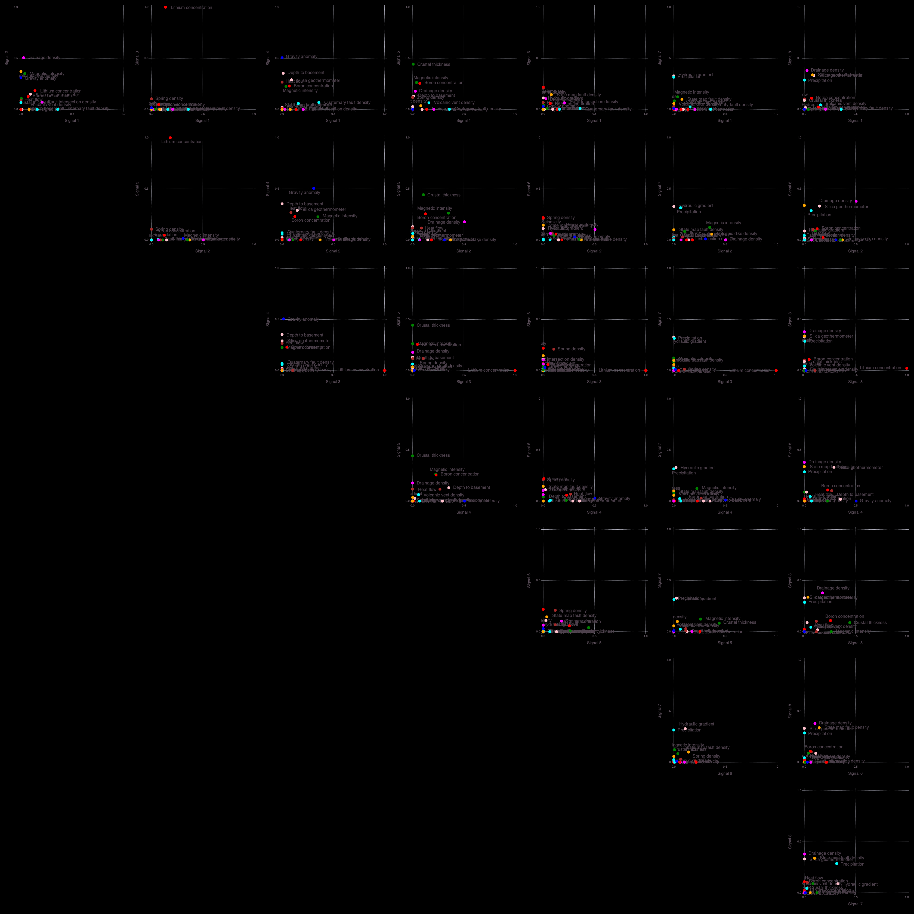
    


    

    


    


    

    


    

    


    

#### Analysis of the 5-signature solution

The results for a solution with **5** signatures presented above will be further discussed here.

The geothermal attributes are clustered into **5** groups:

<div style="background-color: gray;">
    <iframe src="../results-case01/attributes-5-groups.txt" frameborder="0" height="400"
      width="95%"></iframe>
</div>

This grouping is based on analyses of the attribute matrix `W`:


The well locations are also clustered into **5** groups:

<div style="background-color: gray;">
  <p>
    <iframe src="../results-case01/locations-5-groups.txt" frameborder="0" height="400"
      width="95%"></iframe>
  </p>
</div>

This grouping is based on analyses of the location matrix `H`:


The map [../figures-case01/locations-5-map.html](../figures-case01/locations-5-map.html) provides interacive visualization of the extracted location groups (the html file can be also openned with any browswer). 

<div>
    <iframe src="../figures-case01/locations-5-map.html" frameborder="0" height="800" width="50%"></iframe>
</div>


#### Comparison of the ML solutions against the SWNM physiographic provinces

Spatial association of the extracted signatures with the four physiographic provinces in SWNM is summarized here:


The solutions for k=2, 3, and 4 provide a higher-level generalization of the geothermal signatures while the k=8 solution allow us to further refine the geothermal signatures.
The solution for k=5 provides appropriate generalization for the data used.
Clearly, the ML algorithm was able to blindly indentify the physiographic provinces associated with analyzed  hydrogeothermal systems without providing any information about their location (coordinates). 

- The NMFk solution for k=2 separates the Colorado Plateau and the Volcanic Field (Signature A) from the Basin and Range and the Rift zone (Signature B) provinces (Figure a). 
- The k=3 solution combined the Colorado Plateau and the Volcanic Field in Signature A; however, Signatures B and C separate the Basin and Range and the Rio Grande Rift provinces, respectively (Figure b). 
- Signature A of the k=4 solution (Figure c) represents the Volcanic Field. Signature B captures the Basin and Range province. Signature C coincides with the Colorado Plateau. Signature D encompasses the Rio Grande rift zone (Figure c). 
- The k=5 solution (Figure d), regrouped the four signatures of the k=4 solution into five signatures. Signatures A and E cover MDVF; Signatures B, C, and D capture the remaining three provinces: the Basin and Range, the Colorado Plateau, and the Rio Grande rift provinces, respectively. 
- In the k=8 solution (Figure e), Signature B captures the Colorado Plateau province. Signatures G and H encompass two separate areas in the Rio Grande rift zone (Figure e). Three of the signatures (A, C, D) associated with the Volcanic Field capture spatial variability within this province. Two signatures (E and F) represent the spatial variability in the Basin and Range province.

#### Description of signatures for spatial associations

Contribution of each location on each signatures. This plot shows signatures of accepted solution together. From left to right, numbers of signature increased. This shows how the signatures progress if number of signature increases.


- The k=2 solution subdivides the SWNM into two subregions. 
- Signatures A and B of the k=3 solution are split up into Signatures A, B, and C of the k=4 solution; however, Signature C of the k=3 solution and Signature D of the k=4 solution share similar properties. 
- Signatures A, B, C, and D of both the k=4 and 5 solutions possess similar properties; however, the k=5 solution got a completely new signature (Signature E). 
- The k=8 solution regrouped the k=5 solution. Signature A of the k=5 solution possesses similar properties to Signatures A and D of the k=8 solution. Signature B of the k=5 solution shares similar properties of Signatures E and F of the k=8 solution.  Signature C of the k=5 solution has similar properties to both Signatures B and C of the k=8 solution. Signature D of the k=5 solution and both Signatures G and H of the k=8 solution share similar properties. 
- It is critical to mention that although the 44 locations in the W matrices are labeled (Figures 3 and 4) to be associated predominantly with a given geothermal signature (i.e., a certain region; A, B, etc.), it does not mean the locations are associated with only one signature. 
- Instead, it means that those locations predominantly dominate commensurate signatures with contributions from other signatures too. 
- Based on the spatial associations of these geothermal signatures, we identify that the k=5 solution to be the most optimal to represent spatial variability of the geothermal data in the study region.


#### Description of attribute matrices

The plot below shows attribute matrices of all accepted solutions.
Numbers of signature increases from left to right.
This plot shows how each attribute contribute to each signature.
Also, this plot shows how the signature progress as the numbers of signature increase. 


- The above figure shows the H matrices for signatures of the k=2, 3, 4, 5, and 8. 
- The H matrices demonstrate the transformation of the extracted signatures as the number of signatures increases. 
- For example, Signatures A, B, and C of the k=3 solution have similar properties to Signatures A, B, and both C and D of the k=4 solution, respectively. 
- Signatures of A, B, C, and D of the k=4 solution possess similar properties to signatures both A and E, B, C, and D of the k=5 solution, respectively. 
- Signatures A, B, C, D, and E of the k=5 solution share similar properties to both A and E, F, B, both G and H, and both C and D of the k=8 solution, respectively.

#### Optimal signatures

The figure below shows the map of the optimal signatures. The k=5 solution best characterizes the spatial associations and geothermal attributes of the SWNM. 


#### Signatures and corresponding resource type, dominant attributes, physical significance and physiographic provinces

|Signature|Resource type|Dominant attributes|Physical Significance|Physiographci province|
|---|----|----|----|----|
|A|Low temperarutre|<p> Gravity anomaly <br> Magnetic intensity <br> Volcanic dike density <br> Drainage density <br> Li+ concentration <p>|Shallow heat flow|Southern MDVF|
|B|Medium temperarutre|<p>B+ and Li+ concentrations <br> Gravity anomaly <br> Magnetic intensity <br> Quaternary fault density <br> Silica geothermometer <br> Heat flow <br> Depth to the basement <p>|Deep heat flow|Southern Rio Grande rift|
|C|Low temperarutre|<p> B+ and Li+ concentrations <br> Magnetic intensity <br> Drainage density <br> Crustal thickness <p>|Deep heat source|Colorado Plateau|
|D|Low temperarutre|<p> Drainage density <br> Fault intersection density <br> Seismicity <br> State map fault density <br> Spring density <br> Hydraulic gradient <p>|Tectonics|Northern Rio Grande rift |
|E|Medium temperarutre|<p> Drainage density <br> State map fault density <br> Precipitation <br> Silica geothermometer <br> Hydraulic gradient <p>|Vertical hydraulics|Northern MDVF|

#### Geothermal resource assessment

- The excacted signatures charecterize low- and medium-temperature hydrothermal systems.
- The signatures are charecterized by unique geothermal attributes which are automatically indentified by our ML analyses.

##### Medium-temperarutre hydrothermal systems
- Two of the signatures (B and E) represnt medium-temperarutre hydrothermal systems 
- The medium-temperature signatures (B and E) fall in the Southern Rio Grande rift and the Northern MDVF zones.
    * The dominant attributes of the Southern Rio Grande rift zone are B+ and Li+ concentrations, Gravity anomaly, Magnetic intensity, Quaternary fault density, Silica geothermometer, Heat flow, Depth to the basement.
    * The dominant attributes of the Northern MDVF are Drainage density, State map fault density, Precipitation, Silica geothermometer, Hydraulic gradient. 


##### Low-temperarutre hydrothermal systems
- Three of the signatures (A, C and D) represnt low-temperature hydrothermal systems.
- The low-temperature signatures (A, C and D) fall in the Southern MDVF, Colorado Plateau, and Northern Rio Grande Rift zones.

For more details, please look at our paper titled:  "Discovering Hidden Geothermal Signatures using Unsupervised Machine Learning."


